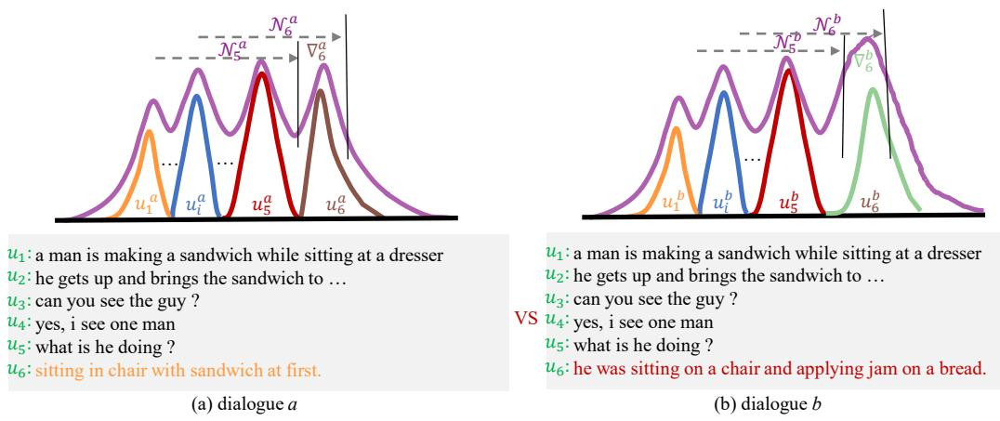
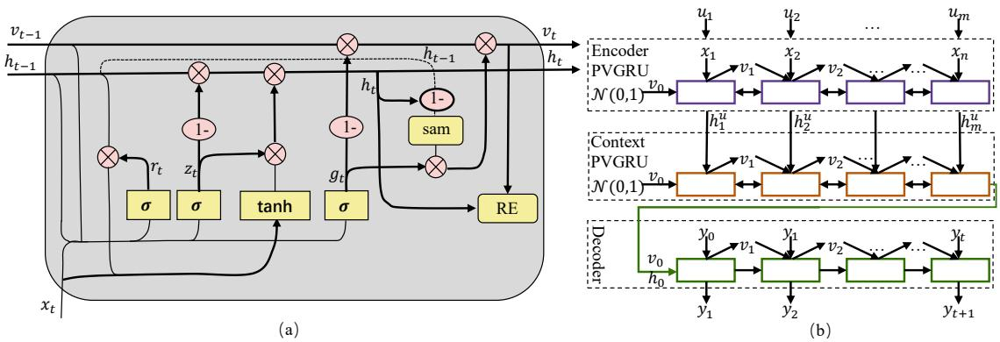
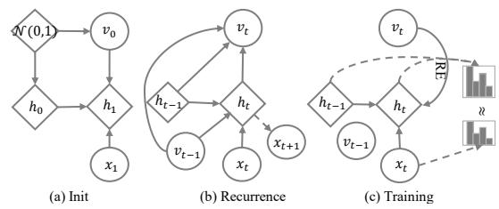
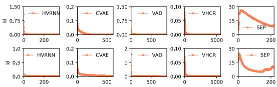
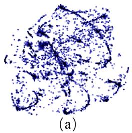
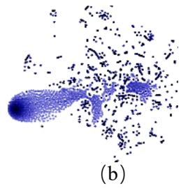
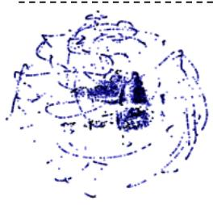
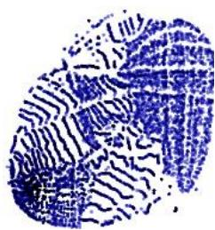

# PVGRU: Generating Diverse and Relevant Dialogue Responses via Pseudo-Variational Mechanism

Yongkang Liu1,2,3, Shi Feng1, Daling Wang1, Yifei Zhang1, Hinrich Schütze2,3

1 Northeastern University, China

2 Center for Information and Language Processing, LMU Munich

3 Munich Center for Machine Learning (MCML), LMU Munich

misonsky@163.com, {fengshi,wangdaling,zhangyifei}@cse.neu.edu.cn

## Abstract

We investigate response generation for multiturn dialogue in generative chatbots. Existing generative models based on RNNs (Recur rent Neural Networks) usually employ the last hidden state to summarize the history, which makes models unable to capture the subtle variability observed in different dialogues and cannot distinguish the differences between dialogues that are similar in composition. In this paper, we propose Pseudo-Variational Gated Recurrent Unit (PVGRU). The key novelty of PVGRU is a recurrent summarizing variable that aggregates the accumulated distribution variations of subsequences. We train PVGRU without relying on posterior knowledge, thus avoiding the training-inference inconsistency problem. PVGRU can perceive subtle semantic variability through summarizing variables that are optimized by two objectives we employ for training: distribution consistency and reconstruction. In addition, we build a Pseudo-Variational Hierarchical Dialogue (PVHD) model based on PVGRU. Experimental results demonstrate that PVGRU can broadly improve the diversity and relevance of responses on two benchmark datasets.

## 1 Introduction

The structure of natural language discourse is complex and highly variable (Gormley and Tong, 2015; Chung et al., 2015; Nie et al., 2022); this is especially true for dialogue. As shown in Figure 1, examples (a) and (b) have the same dialogue history but they end with different responses: utterances $u _ { 6 } ^ { a } \ { \mathrm { v s . ~ } } u _ { 6 } ^ { b }$ . On the other hand, two dialogues with semantically similar utterances may express quite different context meanings. Because of this variability, there is no simple one-to-one mapping between dialogue context and response. The mapping can be one-to-many – as in Figure 1, i.e., different responses to the same dialogue context – as well as many-to-one, i.e., different context histories requiring the same response. We observe that the distribution of a dialogue context $( \mathbf { e . g . , } \mathcal { N } _ { 6 } ^ { a }$ and $\mathcal { N } _ { 6 } ^ { b }$ in the figure) is composed of the distribution of its utterances and the distribution of each utterance is composed of the distribution of its words. A good model of word level and utterance level variation is a key requirement for improving the quality of responses in dialogue.

One line of research (Henderson et al., 2014; Shang et al., 2015; Serban et al., 2016; Luo et al., 2018) employs recurrent neural networks (RNNs) to model dialogue context. However, standard RNNs are not well suited for dialogue context variability (Chung et al., 2015). This is because the internal transition structure of RNNs is deterministic. Thus, RNNs cannot effectively model randomness and variability in dialogue context (Chung et al., 2015).

Variational mechanism has been shown to be well suited for modeling variability – from both theoretical and practical perspectives (Kingma and Welling, 2014). Methods based on variational mechanism (Serban et al., 2016; Gu et al., 2019; Khan et al., 2020; Sun et al., 2021) introduce latent variables into RNNs to model one-to-many and many-to-one phenomena in dialogue. Although these approaches achieve promising results, they still have defects. First, these methods face the dilemma that latent variables may vanish because of the posterior collapse issue (Zhao et al., 2017, 2018; Shi et al., 2020). Variational mechanism can work only when latent variables with intractable posterior distributions exist (Kingma and Welling, 2014). Second, the sampled latent variables may not correctly reflect the relationship between dialogue context and response due to the one-tomany and many-to-one phenomena observed in dialogue (Sun et al., 2021). Third, posterior knowledge is employed in training while prior knowledge is used in inference; this causes an inconsistency problem between training and inference (Shang et al., 2015; Zhao et al., 2017; Shi et al., 2020).

  
Figure 1: Overview of dialogue variability. (a) and (b) represent two dialogues a and b from DSTC7-AVSD. The last utterance is response. $\mathcal { N } _ { t } ^ { a }$ represents the distribution of dialogue a at time step t on utterance level, and $\mathcal { N } _ { t } ^ { b }$ likewise. a denotes the distribution variations caused by $u _ { 6 } ^ { a }$ and $\bigtriangledown _ { 6 } ^ { b }$ denotes the distribution variations caused by token $u _ { 6 } ^ { b } .$

To tackle these problems, we propose a Pseudo-Variational Gated Recurrent Unit (PVGRU) component based on pseudo-variational mechanism. PVGRU introduces a recurrent summarizing variable into the GRU. This summarizing variable can aggregate the accumulated distribution variations of subsequences. The methods based on PVGRU can model the subtle semantic differences between different sequences. First, pseudovariational mechanism adopts the idea of latent variables but does not adopt posterior mechanism (Serban et al., 2017; Zhao et al., 2017; Park et al., 2018; Sun et al., 2021). Therefore, PVGRU does not suffer from the posterior collapse issue (Zhao et al., 2017, 2018; Shi et al., 2020). Second, we design consistency and reconstruction objectives to optimize the recurrent summarizing variable in PV-GRU; this ensures that the recurrent variable can reflect the semantics of dialogue context on both the word level and the utterance level. The consistency objective makes the distribution of the incremental information consistent with the corresponding input at each time step. Third, we guarantee the consistency between training and inference since we do not employ posterior knowledge when optimizing the summarizing variable.

Our proposed method avoids the problems caused by variational optimization and can model the diversity problem in dialogue. For instance in Figure 1, examples (a) and (b) have the same dialogue history but different responses. $\mathcal { N } _ { 6 } ^ { a }$ and $\mathcal { N } _ { 6 } ^ { b }$ can learn the distribution differences caused by $u _ { 6 } ^ { a }$ and $u _ { 6 } ^ { b } .$ . Simultaneously, semantic reconstruction can enhance the model’s perception of semantic changes, which in turn can strengthen the distribution differences caused by semantic changes. Although the example only shows diversity at the utterance level, similar diversity issues exist at the word level. Therefore, we build a Pseudo-Variational Hierarchical Dialogue model (PVHD) based on PVGRU to model both word level and utterance level variation.

To summarize, we make the following contributions:

• We analyze the reasons for one-to-many and many-to-one issues from high variability of dialogue corpus and propose PVGRU with a recurrent summarizing variable to model the variability of dialogue sequences.

• We propose to optimize the recurrent summarizing variable using consistency and reconstruction objectives, which guarantees that the summarizing variable can reflect the semantics of the dialogue context and maintain the consistency between training and inference processes.

• We propose the PVHD model based on PVGRU. PVHD significantly outperforms strong baselines with RNN and Transformer architectures on two benchmark datasets. The code including baselines for comparison is available on Github1.

## 2 RELATED WORK

## 2.1 Dialogue Generation

As an important task in Natural Language Processing, dialogue generation systems aim to generate fluent and informative responses based on the dialogue context (Ke et al., 2018). Early dialogue generation models (Henderson et al., 2014; Shang et al., 2015; Luo et al., 2018) usually adopt the simple seq2seq (Sutskever et al., 2014) framework to model the relationship between dialogue context and response in the manner of machine translation. However, the vanilla seq2seq structure tends to generate dull and generic responses. To generate informative responses, hierarchical structures (Serban et al., 2016; Song et al., 2021; Liu et al., 2022) and pre-training techniques (Radford et al., 2019; Lewis et al., 2020; Zhang et al., 2020) are employed to capture the hierarchical dependencies of dialogue context. The results of these methods do not meet expectations (Wei et al., 2019).

The main reason is that there are one-to-many and many-to-one relationships between dialogue context and responses. Modeling the multimapping relationship is crucial for improving the quality of the dialog generation. In this paper, we propose a PVGRU component by introducing recurrent summarizing variables into GRU, which can model the varieties of dialogue context.

## 2.2 Variational Mechanism

Variational mechanisms enable efficient working in directed probabilistic models when latent variables with intractable posterior distributions existing (Kingma and Welling, 2014). Variational mechanisms can learn the latent relationship between dialogue context and responses by introducing latent variables. Most existing methods (Serban et al., 2017; Zhao et al., 2017; Bao et al., 2020) based on variational mechanisms employ prior to approximate true posterior probability. These methods not only encounter the problem of posterior collapse issue but also the problem of inconsistency between training and inference (Zhao et al., 2018; Shi et al., 2020). In this paper, we employ consistency and reconstruction objectives to optimize the summarizing variable different from variational mechanism, which can model the multi-mapping phenomena in dialogues.

## 3 Preliminary

In this paper, we employ GRU (Gated Recurrent Unit) (Cho et al., 2014) as the implementation of recurrent neural network (RNN). The reset gate $r _ { t }$ is computed by:

$$
r _ { t } = \sigma ( W _ { r } \pmb { x } _ { t } + U _ { r } \pmb { h } _ { t - 1 } )\tag{1}
$$

where $\sigma$ is the logistic sigmoid function. $\mathbf { \mathcal { x } } _ { t }$ represents the input at time step t and $\boldsymbol { h } _ { t - 1 }$ denotes

the hidden state at time step t-1. $W _ { r }$ and $U _ { r }$ are parameter matrices which are learned. Similarly, the updated gate $z _ { t }$ is defined as:

$$
z _ { t } = \sigma ( W _ { z } \pmb { x } _ { t } + U _ { z } \pmb { h } _ { t - 1 } )\tag{2}
$$

The hidden state $\boldsymbol { h } _ { t }$ at the time step t is then computed by:

$$
h _ { t } = z _ { t } h _ { t - 1 } + ( 1 - z _ { t } ) \tilde { h } _ { t }\tag{3}
$$

$$
\tilde { \pmb { h } } _ { t } = \phi ( \pmb { W } \pmb { x } _ { t } + \pmb { U } ( r _ { t } \odot \pmb { h } _ { t - 1 } ) )\tag{4}
$$

where $\phi ( \cdot )$ is the tanh function, W and U are weight matrices which are learned. GRU is considered as a classic implementation of RNN, which is widely employed in generative tasks.

## 4 Methodology

## 4.1 Pseudo-variational Gated Recurrent Unit

As shown in Figure 1, it is difficult to distinguish the semantics of similar dialogue contexts only relying on the last hidden state representations. The internal transition structure of RNNs is deterministic, which can not model variability observed in dialogues and tends to generate dull and generic responses. Drawing the inspiration from variational recurrent neural network (VRNN) (Chung et al., 2015), our proposed PVGRU explicitly models the variability through introducing a recurrent summarizing variable, which can capture the variations of dialogue context. VRNN based on variational mechanism employs latent variables paying attention to the variety between different words. Different from VRNN, PVGRU maintains a summarizing variable unit that can summarize the accumulated variations of the sequence.

As shown in Figure 2 (a), PVGRU introduces a recurrent summarizing variable v based on GRU. The recurrent summarizing variable v is obtained based on the incremental information of hidden state h and the previous state of summarizing variable. Specially, the summarizing variable $\pmb { v } _ { 0 }$ is initialized with standard Gaussian distribution (i.e., Figure 3 (a)). We assume the input is $x _ { t }$ at the time step t, the reset gate $r _ { t }$ is rewrited as:

$$
r _ { t } = \sigma ( W _ { r } \pmb { x } _ { t } + U _ { r } \pmb { h } _ { t - 1 } + V _ { r } \pmb { v } _ { t - 1 } )\tag{5}
$$

where $W _ { r } , U _ { r }$ and $V _ { r }$ are parameter matrices, and $v _ { t - 1 }$ is the previous summarizing variable state. Similarly, the update gate $z _ { t }$ is computed by:

$$
z _ { t } = \sigma ( W _ { z } \pmb { x } _ { t } + U _ { z } \pmb { h } _ { t - 1 } + V _ { z } \pmb { v } _ { t - 1 } )\tag{6}
$$

  
Figure 2: Overview of PVHD based on PVGRU. (a) is the overview of PVGRU, where RE stands for refactoring process and the "sam" represents sampling process. (b) is graphical representation of the PVHD.

  
Figure 3: Schematic diagram of each operation of PV-GRU autoregression.

We introduce a gate $g _ { t }$ for summarizing variable factor, which is defined as follows:

$$
\pmb { g } _ { t } = \sigma ( \pmb { W } _ { g } \pmb { x } _ { t } + \pmb { U } _ { g } \pmb { h } _ { t - 1 } + \pmb { V } _ { g } \pmb { v } _ { t - 1 } )\tag{7}
$$

The updated gate of summarizing factor controls how much information from the previous variable will carry over to the current summarizing variable state. Under the effect of $g _ { t }$ , the $\tilde { h } _ { t }$ follows the equation:

$$
\tilde { h } _ { t } = \phi ( W x _ { t } + U ( r _ { t } \odot h _ { t - 1 } ) + V ( g _ { t } \odot v _ { t - 1 } ) )\tag{8}
$$

Then the PVGRU updates its hidden state $h _ { t }$ using the same recurrence equation as GRU. The summarizing variable $v _ { t }$ at the time step t is defined as:

$$
\tilde { v } _ { t } \sim \mathcal { N } ( \mu _ { t } , \sigma _ { t } ) , [ \mu _ { t } , \sigma _ { t } ] = \varphi ( h _ { t } - h _ { t - 1 } )\tag{9}
$$

where $\varphi ( \cdot )$ represents a nonlinear neural network approximator and $\tilde { \mathbf { \boldsymbol { v } } } _ { t }$ denotes the variations between time t and time t 1. The variations across subsequent up to time t is defined as:

$$
\pmb { v } _ { t } = \pmb { g } _ { t } \odot \pmb { \tilde { v } } _ { t } + ( 1 - \pmb { g } _ { t } ) \odot \pmb { v } _ { t - 1 }\tag{10}
$$

Figure 3 (b) demonstrates the schematic diagram of the recurrent process of PVGRU described above. We can observe that PVGRU does not adopt posterior knowledge, which can guarantee the consistency between training and inference.

## 4.2 Optimization Summarizing Variable

Based on but different from traditional variational mechanism, we design the consistency and reconstruction objectives to optimize the summarizing variable. The consistency objective ensures that the distribution of the information increment of hidden state at each time step is consistent with the input. For example, we will keep the distribution of information increment $h _ { t } - h _ { t - 1 }$ at time t consistent with $x _ { t }$ . The consistency objective function at time step t is denoted as:

$$
\begin{array} { r l } & { \ell _ { c } ^ { t } = K L ( p ( { \pmb x } _ { t } ) | | p ( { \pmb h } _ { t } - { \pmb h } _ { t - 1 } ) ) } \\ & { \quad = K L ( p ( { \pmb x } _ { t } ) | | \tilde { \pmb v } _ { t } ) } \end{array}\tag{11}
$$

where KL( ) represents Kullback-Leibler divergence (Barz et al., 2018) and $p ( \cdot )$ represents the distribution of the vector. We employ "sam" to represent this process of distribution sampling in Figure 2 (a).

The reconstruction optimization objective ensures that the summarizing variable can correctly reflect the semantic of the dialogue context from the whole perspective, which requires PVGRU reconstructs the sequence information from the accumulated distribution variable. The reconstruction loss at time step t is described as:

$$
\ell _ { r } ^ { t } ( v _ { t } , h _ { t } ) = \left\{ \begin{array} { l l } { \frac { 1 } { 2 } | f ( v _ { t } ) - h _ { t } | , } & { | v _ { t } - h _ { t } | \leq \delta } \\ { \delta | f ( v _ { t } ) - h _ { t } | - \frac { 1 } { 2 } \delta ^ { 2 } , } & { | v _ { t } - h _ { t } | > \delta } \end{array} \right.\tag{12}
$$

where $f ( \cdot )$ stands for decoder using MLP, δ is a hyperparameter and    represents the absolute value. We employ $" \mathrm { \mathbf { R } } \mathrm { \mathbf { E } } "$ to represent the reconstruction process in Figure 2 (a). Figure 3 (c) demonstrates the schematic diagram of optimizing summarizing variable. Reconstruction and consistency objectives ensure that summarizing variable can correctly reflect the semantics of the dialogue context.

  
Figure 4: Kullback-Leibler loss variation trend graph on DailyDialog (up) and DSTC7-AVSD (down). The abscissa represents the number of training iterations. KL represents the Kullback-Leibler loss term.

## 4.3 Hierarchical Pseudo-variational Model

As shown in Figure 1, the dialogues contain word-level and sentence-level variability. We follow previous studies (Serban et al., 2016, 2017; Huang et al., 2021) using hierarchical structure to model dialogue context. Figure 2 (b) shows the structure of PVHD we proposed. PVHD mainly consists of three modules: (i) Encoder PVGRU; (ii) Context PVGRU; (iii) Decoder PV-GRU. The encoder PVGRU is responsible for capturing the word-level variabilities and mapping utterances $\{ \boldsymbol { u } _ { 1 } , \boldsymbol { u } _ { 2 } , . . . , \boldsymbol { u } _ { m } \}$ to utterance vectors $\{ h _ { 1 } ^ { u } , h _ { 2 } ^ { u } , . . . , h _ { m } ^ { u } \}$ . At the same time, ${ \mathbf { } } v _ { t }$ records the accumulated distribution variations of the subsequence at time step t. The context PVGRU takes charge of capturing the utterance-level variabilities. The last hidden state of the context PVGRU represents a summary of the dialogue. The last summarizing variable state of the context PVGRU stands for the distribution of dialogue. The decoder PVGRU takes the last states of context PVGRU and produces a probability distribution over the tokens in the response $\left\{ y 1 , y _ { 2 } , . . . , y _ { n } \right\}$ . The generation process of training and inference can be formally described as:

$$
p ( { \pmb y } _ { \le T } , { \pmb v } _ { \le n } ) = \prod _ { t = 1 } ^ { n } p ( { \pmb y } _ { t } | { \pmb y } _ { < t } , { \pmb v } _ { < t } )\tag{13}
$$

The log-likelihood loss of predicting reponse is formalized as:

$$
\ell _ { l l } ^ { t } = \log p ( \pmb { y } _ { t } | \pmb { y } _ { < t } , \pmb { v } _ { < t } )\tag{14}
$$

The total loss can be written as:

$$
\ell _ { t o t a l } = E \sum _ { t = 1 } ^ { T } ( \ell _ { l l } ^ { t } + \ell _ { r } ^ { t } + \ell _ { c } ^ { t } )\tag{15}
$$

## 5 Experiments

For descriptions of the datasets, please refer to the Appendix A.1. Please refer to Appendix A.2 for implementation details. In Appendix A.5 we show the ablation results of two objective functions, showing the effectiveness of the objective functions. In order to evaluate the effectiveness of experimental results, we performed a significance test in Appendix A.6. We can observe that the $p \mathrm { - }$ values of PVHD are less than 0.05 compared with other models. In addition, we present case studies in Appendix A.7 and discuss model limitations in Appendix 7, respectively.

## 5.1 Baselines

The automatic evaluation metrics is employed to verify the generality of PVGRU, we select the following RNN-based dialogue generation models as baselines: seq2seq: sequence-to-sequence model GRU-based with attention mechanisms (Bahdanau et al., 2015). HRED: hierarchical recurrent encoder-decoder on recurrent neural network (Serban et al., 2016) for dialogue generation. HRAN: hierarchical recurrent neural network dialogue generation model based on attentiom mechanism (Xing et al., 2018). CSG: hierarchical recurrent neural network model using static attention for contextsensitive generation of dialogue responses (Zhang et al., 2018).

To evaluate the performance of the PVHD, we choose dialogue generation model based on variational mechanism as baselines: HVRNN: VRNN (Variational Recurrent Neural Network) (Chung et al., 2015) is a recurrent version of the VAE. We combine VRNN (Chung et al., 2015) and HRED (Serban et al., 2016) to construct the HVRNN. CVAE: hierarchical dialogue generation model based on conditional variational autoencoders (Zhao et al., 2017). We implement CVAE with bag-of-word loss and KL annealing technique. VAD: hierarchical dialogue generation model introducing a series of latent variables (Du et al., 2018). VHCR: hierarchical dialogue generation model using global and local latent variables (Park et al., 2018). SepaCVAE: self-separated conditional variational autoencoder introducing group information to regularize the latent variables (Sun et al., 2021). SVT: sequential variational transformer augmenting deocder with a sequence of fine-grained latent variables (Lin et al., 2020). GVT: global variational transformer modeling the discourselevel diversity with a global latent variable (Lin et al., 2020). PLATO: dialogue generation based on transformer with discrete latent variable (Bao et al., 2020). Different from original implementation, we do not use knowledge on the DSTC7- AVSD. DialogVED: a pre-trained latent variable encoder-decoder model for dialog response generation (Chen et al., 2022). We initialize the model with the large version of DialogVED.

<table><tr><td>Models</td><td>Datasets Daily</td><td>Types GRU</td><td>PPL 132.55</td><td>BLEU-1/2 27.78/22.59</td><td>Rouge-L 35.36</td><td>Dist-1 12.18</td><td>Dist-2 47.69</td><td>Embed A/E/G 79.40/80.02/63.53</td></tr><tr><td rowspan="3">seq2seq</td><td rowspan="2">DSTC7</td><td>PVGRU</td><td>130.80</td><td>28.33/22.48</td><td>36.55</td><td>14.41</td><td>48.22</td><td>80.77/81.26/63.96</td></tr><tr><td>GRU</td><td>112.89</td><td>25.52/15.29</td><td>26.34</td><td>4.34</td><td>22.31</td><td>79.31/84.40/60.25</td></tr><tr><td></td><td>PVGRU</td><td>111.27</td><td>26.66/17.18</td><td>27.72</td><td>5.77</td><td>24.68</td><td>80.56/85.65/60.48</td></tr><tr><td rowspan="4">HRED</td><td rowspan="2">Daily</td><td>GRU</td><td>127.66</td><td>28.90/23.52</td><td>34.63</td><td>13.00</td><td>45.55</td><td>79.53/81.77/63.31</td></tr><tr><td>PVGRU</td><td>111.31</td><td>32.19/25.42</td><td>35.28</td><td>15.33</td><td>49.93</td><td>81.77/83.89/63.84</td></tr><tr><td rowspan="2">DSTC7</td><td>GRU</td><td>115.72</td><td>27.30/17.86</td><td>29.51</td><td>5.12</td><td>24.63</td><td>79.18/84.78/61.71</td></tr><tr><td>PVGRU</td><td>110.25</td><td>29.87/20.03</td><td>31.87</td><td>6.54</td><td>31.77</td><td>81.87/86.68/61.91</td></tr><tr><td rowspan="4">HRAN</td><td rowspan="2">Daily</td><td>GRU</td><td>121.63</td><td>30.36/20.01</td><td>35.68</td><td>12.66</td><td>43.77</td><td>80.42/84.56/63.44</td></tr><tr><td>PVGRU</td><td>120.77</td><td>30.97/23.76</td><td>36.52</td><td>13.76</td><td>44.86</td><td>81.05/85.58/63.35</td></tr><tr><td rowspan="2">DSTC7</td><td>GRU</td><td>111.66</td><td>27.74/17.88</td><td>30.68</td><td>4.64</td><td>17.68</td><td>80.31/82.33/62.70</td></tr><tr><td>PVGRU</td><td>110.75</td><td>29.58/19.68</td><td>32.34</td><td>5.33</td><td>19.62</td><td>81.86/85.34/63.34</td></tr><tr><td rowspan="4">CSG</td><td rowspan="2">Daily</td><td>GRU</td><td>122.75</td><td>28.89/24.55</td><td>36.74</td><td>11.11</td><td>40.39</td><td>79.65/83.36/63.29</td></tr><tr><td>PVGRU</td><td>122.12</td><td>30.04/26.67</td><td>38.39</td><td>13.21</td><td>42.44</td><td>80.83/84.55/65.95</td></tr><tr><td rowspan="2">DSTC7</td><td>GRU</td><td>111.27</td><td>27.62/18.24</td><td>28.32</td><td>3.07</td><td>12.13</td><td>79.55/82.19/62.27</td></tr><tr><td>PVGRU</td><td>110.82</td><td>29.74/20.55</td><td>31.02</td><td>5.13</td><td>15.44</td><td>80.53/84.91/63.18</td></tr></table>

Table 1: Performance comparison of models based on GRU and PVGRU on on test set of DailyDialog (Daily) and DSTC7-AVSD (DSTC7). All values are multiplied by 100.

## 5.2 Automatic & Human Evaluation

Please refer to Appendix A.3 and Appendix A.4 for details of automatic evaluation metrics. Some differences from previous works are emphasized here. We employ improved versions of BLEU and ROUGE-L, which can better correlate n-gram overlap with human judgment by weighting the relevant n-gram compared with original BLEU (Chen and Cherry, 2014). Although using the improved versions of BLEU and ROUGE-L will result in lower literal values on the corresponding metrics, this does not affect the fairness of the comparison. We adopt the implementation of distinct-1/2 metrics following previous study (Bahuleyan et al., 2018). The source code for the evaluation method can be found on the anonymous GitHub.

## 5.3 Generality of PVGRU

Table 1 reports the automatic evaluation performance comparison of the models using GRU and PVGRU. We can observe that the performance of the models based on PVGRU is higher than that based on GRU. Specifically, on DailyDialog dataset, the average performance of models based on PVGRU is 0.63% to 16.35% higher on PPL, 1.40% to 1.92% higher on BLEU-1, 1.08% to

  
（c）

  
（d）  
Figure 5: t-SNE visualization of the summarizing variable on word-level ((a) and (c)) and utterance-level (b) and (d) on DailyDialog (up) and DSTC7-AVSD (down).

2.02% higher on Rouge-L, 1.10% to 2.33% higher on Dist-1 and 1.36% to 1.62% higher on average embedding compared with models based on GRU. On DSTC7-AVSD dataset, the performance of models based on PVGRU is 0.45% to 5.47% higher on PPL, 1.14% to 2.57% higher on BLEU-1, 1.38% to 2.7% higher on Rouge-L, 0.69% to 2.06% higher on Dist-1 and 0.69% to 2.69% higher on average embedding compared with models based on GRU. The results demonstrate that PVGRU can be widely used to sequence generation models based on RNN. The internal transition structure of GRU is entirely deterministic. Compared with GRU, PV-

<table><tr><td>Datasets</td><td>Backbone</td><td>Models</td><td>PPL</td><td>BLEU-1/2</td><td>Rouge-L</td><td>Dist-1</td><td>Dist-2</td><td>Embed A/E/G</td></tr><tr><td rowspan="9">Daily</td><td rowspan="4">Transformer</td><td>SVT</td><td>114.54</td><td>27.89/21.26</td><td>28.87</td><td>11.94</td><td>44.03</td><td>77.67/83.39/60.14</td></tr><tr><td>GVT</td><td>115.05</td><td>25.54/18.46</td><td>26.87</td><td>12.43</td><td>45.43</td><td>75.90/83.16/56.42</td></tr><tr><td>PLATO</td><td>110.68</td><td>30.77/24.46</td><td>33.95</td><td>13.41</td><td>47.67</td><td>79.15/84.15/60.09</td></tr><tr><td>DialogVED</td><td>112.87</td><td>31.22/24.96</td><td>33.16</td><td>12.94</td><td>45.44</td><td>78.36/83.73/60.25</td></tr><tr><td rowspan="5"></td><td>HVRNN</td><td>124.94</td><td>31.03/23.99</td><td>34.83</td><td>14.32</td><td>49.47</td><td>79.55/83.75/62.03</td></tr><tr><td>CVAE</td><td>126.38</td><td>26.34/20.43</td><td>35.83</td><td>13.55</td><td>49.18</td><td>79.70/83.45/63.26</td></tr><tr><td>VAD</td><td>134.06</td><td>30.32/24.34</td><td>36.63</td><td>13.85</td><td>46.20</td><td>80.97/84.09/63.87</td></tr><tr><td>VHCR</td><td>115.83</td><td>29.80/24.35</td><td>34.45</td><td>13.66</td><td>49.50</td><td>79.01/81.27/62.35</td></tr><tr><td>SepaCVAE</td><td>111.33</td><td>25.31/22.41</td><td>33.21</td><td>12.08</td><td>36.56</td><td>80.26/81.81/63.51</td></tr><tr><td rowspan="9">Transformer</td><td rowspan="4"></td><td>PVHD</td><td>111.31</td><td>32.19/25.42</td><td>35.28</td><td>15.33</td><td>49.93</td><td>81.77/83.89/63.84</td></tr><tr><td>SVT</td><td>116.58</td><td>25.34/14.28</td><td>25.47</td><td>3.67</td><td>15.75</td><td>78.88/82.87/56.87</td></tr><tr><td>GVT</td><td>115.33</td><td>27.62/15.76</td><td>26.71</td><td>3.14</td><td>17.49</td><td>77.56/84.07/57.46</td></tr><tr><td>PLATO DialogVED</td><td>108.88</td><td>30.16/18.58</td><td>30.69</td><td>6.22</td><td>29.39</td><td>80.05/85.71/58.22</td></tr><tr><td rowspan="5"></td><td>HVRNN</td><td>112.09</td><td>28.89/13.69</td><td>29.22</td><td>6.39</td><td>26.78</td><td>79.36/85.73/60.25 79.76/86.51/60.11</td></tr><tr><td>CVAE</td><td>111.55 112.40</td><td>26.71/18.12</td><td>29.44</td><td>5.52 5.35</td><td>21.23</td><td>80.96/86.88/60.68</td></tr><tr><td>VAD</td><td>122.37</td><td>26.47/16.37 26.87/20.26</td><td>28.85 27.07</td><td>6.00</td><td>26.01 30.46</td><td>79.24/86.41/58.37</td></tr><tr><td>VHCR</td><td>123.81</td><td>26.63/15.81</td><td>28.21</td><td>5.64</td><td>29.83</td><td>79.71/86.65/57.56</td></tr><tr><td></td><td>128.47</td><td></td><td></td><td></td><td>28.50</td><td></td></tr><tr><td></td><td>SepaCVAE PVHD</td><td>110.25</td><td>26.59/18.94 29.87/20.03</td><td>26.04 31.87</td><td>5.53 6.54</td><td>31.77</td><td>78.85/86.31/59.06 81.07/86.68/61.91</td></tr></table>

Table 2: Performance comparison of PVHD and other models based on variational mechanism. Bold indicates the best result, and underline indicates the second best result. The first and second groups of models belong to the Transformer-based models and RNN-based models, respectively.

<table><tr><td rowspan="3">Models</td><td colspan="6">Datasets</td></tr><tr><td colspan="3">DailyDialog</td><td colspan="3">DSTC7-AVSD</td></tr><tr><td>D</td><td>R</td><td>F</td><td>D</td><td>R</td><td>F</td></tr><tr><td>SVT</td><td>0.920</td><td>0.795</td><td>1.752</td><td>0.973</td><td>1.115</td><td>1.271</td></tr><tr><td>GVT</td><td>0.950</td><td>0.769</td><td>1.780</td><td>0.950</td><td>1.046</td><td>1.361</td></tr><tr><td>PLATO</td><td>1.110</td><td>0.847</td><td>1.783</td><td>1.087</td><td>1.437</td><td>1.742</td></tr><tr><td>DialogVED</td><td>1.090</td><td>0.856</td><td>1.830</td><td>1.010</td><td>1.372</td><td>1.540</td></tr><tr><td>HVRNN</td><td>1.000</td><td>0.780</td><td>1.850</td><td>1.041</td><td>1.415</td><td>1.785</td></tr><tr><td>CVAE</td><td>1.080</td><td>0.765</td><td>1.450</td><td>1.025</td><td>1.085</td><td>1.100</td></tr><tr><td>VAD</td><td>1.015</td><td>0.854</td><td>1.235</td><td>0.990</td><td>1.215</td><td>1.400</td></tr><tr><td>VHCR</td><td>0.895</td><td>0.835</td><td>1.570</td><td>0.975</td><td>1.250</td><td>1.600</td></tr><tr><td>SepaCVAE</td><td>1.020</td><td>0.695</td><td>1.230</td><td>1.040</td><td>0.715</td><td>0.810</td></tr><tr><td>PVHD</td><td>1.114</td><td>0.855</td><td>1.840</td><td>1.145</td><td>1.445</td><td>1.520</td></tr><tr><td></td><td></td><td></td><td></td><td></td><td></td><td></td></tr></table>

Table 3: Human evaluation results on test set. D, R, F represent diversity, relevance and fluency, respectively.

GRU introduces a recurrent summarizing variable, which records the accumulated distribution variations of sequences. The recurrent summarizing variable brings randomness to the internal transition structure of PVGRU, which makes model perceive the subtle semantic variability.

## 5.4 Automatic Evaluation Results & Analysis

Table 2 reports the results of automatic evaluation of PVHD and other baselines on DailyDialog and DSTC7-AVSD datasets. Compared to RNNbased baselines based on variational mechanism, PVHD enjoys an advantage in performance. On DailyDialog datasets, the performance of PVHD is 1.16% higher on BLEU-1, 0.45% higher on Rouge-L, 1.01% higher on Dist-1 and 2.22% higher on average embedding compared to HVRNN. As compared to the classic variational mechanism models CVAE, VAD and VHCR, PVHD has a advantage of 0.02% to 22.75% on PPL, 1.87% to 6.88% higher on BLEU-1, 1.48% to 3.25% higher on Dist-1, 0.43% to 13.37% higher on Dist-2 and 0.80% to 2.76% higher on average embedding. We can observe similar results on DSTC7-AVSD. PVHD enjoys the advantage of 1.3% to 18.22% on PPL, 3.00% to 3.40% higher on BLEU-1, 0.54% to 1.19% higher on Dist-1, 1.31% to 5.76% higher on Dist-2 and 0.11% to 2.22% higher on average embedding compared with these classic variational mechanism models.

The main reason for the unimpressive performance of RNN-based baselines is that these models suffer from latent variables vanishing observed in experiments. As shown in Figure 4, the Kullback-Leibler term of these models losses close to zero means that variational posterior distribution closely matches the prior for a subset of latent variables, indicating that failure of the variational mechanism (Lucas et al., 2019). The performance of SepaCVAE is unimpressive. In fact, the performance of SepaCVAE depends on the quality of context grouping (referring to dialogue augmentation in original paper (Sun et al., 2021)). Sepa-CVAE will degenerate to CVAE model if context grouping fails to work well, and even which will introduce wrong grouping noise information resulting in degrade performance. As shown in Figure 4, the Kullback-Leibler term of SepaCVAE losses is at a high level, which demonstrates that the prior for a subset of latent variables cannot approximate variational posterior distribution.

Compared with Transformer-based baselines, PVHD still enjoys an advantage on most metrics, especially the distinct metric. GVT introduces latent variables between the whole dialogue history and response, which faces the problem of latent variables vanishing. SVT introduces a sequence of latent variables into the decoder to model the diversity of responses. But it is debatable whether latent variables will destroy the fragile sequence perception ability of the transformer, which will greatly reduce the quality of the responses. Training the transformer from scratch instead of using a pretrained model is another reason for the inferior performance of SVT and GVT. Compared to DialogVED and PLATO, PVHD achieves the best performance on most metrics. The main reason is that pseudo-variational approaches do not depend on posteriors distribution avoiding optimization problems and the recurrent summarizing variable can model the diversity of sequences. Overall, PVHD has the most obvious advantages in diversity, which demonstrates the effectiveness of the recurrent summarizing variable. Another reason is that Transformer-based baselines including SVT, GVT, PLATO and DialogVED connect all the dialogue history utterances into a consecutive sequence. They can only model the diversity between entire dialogue histories and responses. Coarse-grained modeling is the reason for poor model performance.

Although transformers are popular for generation task, our research is still meritorious. First, transformer models usually require pre-training on large-scale corpus while RNN-based models usually do not have such limitations. It is debatable whether transformer models training from scratch under conditions where pre-training language models are unavaliable can achieve the desired performance if downstream task does not have enough corpus. Second, the parameter amount of the RNNbased model is usually smaller than that of the transformer-based model. The parameter sizes of PVHD on the DailyDialog and DSTC7-AVSD are 29M and 21M, respectively. The number of parameters for PLATO and DialogVED is 132M and 1143M on two datasets, respectively. Compared to PLATO and DialogVED, the average number of parameters of PVHD is 5.28x and 45.72x smaller, respectively.

## 5.5 Human Evaluation Results & Analysis

We conduct human evaluation to further confirm the effectiveness of the PVHD. To evaluate the consistency of the results assessed by annotators, we employ Pearson’s correlation coefficient (Sedgwick, 2012). This coefficient is 0.35 on diversity, 0.65 on relevance, and 0.75 on fluency, with p< 0.0001 and below 0.001, which demonstrates high correlation and agreement. The results of the human evaluation are shown in Table 3. Compared to RNN-based baselines, PVHD has a significant advantage in relevance and diversity. Specifically, PVHD enjoys the advantage of 11.40% on diversity and 16.00% on relevance compared to SepaCVAE on DailyDialog. On DSTC7-AVSD, PVHD has a advantage of 10.50% on diversity and 73.00% on relevance compared to SepaCVAE. Compared to transformer-based baselines, although PVHD is sub-optimal in some metrics, it enjoys the advantage in most metrics, especially diversity. In terms of fluency, PVHD is only 1.00% lower than HVRNN and is much better that other baselines on DailyDialog. However, the fluency of PVHD is 26.50% lower compared with HVRNN and 8.00% lower compared with VHCR on DSTC7-AVSD. We argue that introducing a recurrent summary variable in the decoder increases the randomness of word generation, which will promote the diversity of the responses with a side effect of fluency reduction.

## 5.6 Effectiveness of Summarizing Variables

We further analyze the effectiveness of PVHD on summarizing variables. Figure 5 demonstrates the visualization of word-level and utterance-level summarizing variables on test set of DailyDialog and DSTC7-AVSD datasets. We can observe that both datasets exhibit high variability characteristic on word-level and utterance-level. Specifically, the summarizing variables on word-level show obvious categorical features, which indicates that a subsequence may have multiple suitable candidate words. Moreover, the summarizing variables on utterancelevel also exhibit impressive categorical features, which confirms that there is a one-to-many issue in the dialogue. These phenomena make dialogue generation different from machine translation where unique semantic mapping exists between source

and target language.

## 6 Conclusion

We analyze the reasons for one-to-many and manyto-one issues from high variability of dialogue. We build PVHD based on proposed PVGRU component to model the word-level and utterance-level variation in dialogue for generating relevant and diverse responses. The results demonstrate that PVHD even outperforms pre-trained language models on diversity metrics.

## 7 Limitations

Although our work can effectively model the variability issue in dialogue, we acknowledge some limitations of our study. Firstly, our study can work well on the approaches based on RNN, but cannot be employed to sequence models based on Transformer, which limits the generality of our approach. The reasons we analyze are as follows.

Transformer is not a good architecture for finegrained diversity. The diversity of dialogue includes three granularities of discourse level, utterance level and word level. To model diversity, models will be required to utilize the representation at time t and the relationship between the representation at time t and time t+1 to determine the representation at time t+1. Relationships are computed step by step. If we only consider discourse-level diversity, our approach and variational mechanisms are easily transferable to Transformer architectures. Because we can use the Transformer model to encode the entire historical dialogue sequence. Latent variables or summarizing variables only exist between the entire historical sequence and the responses. This will not destroy the parallel structure of the Transformer. if we employ a Transformer to model diversity at the utterance and word granularity, this will seriously damage the parallelism of the Transformer.

There are great limitations in the variational transformer models. The transformer and variational thinking is not a good match, which leads to less relevant research. The Transformer baselines we compared in the manuscript (i.e. SVT, GVT, PLATO and DialogVED) cover most of the current transformer models that combine variations. Although SVT, GVT, PLATO and DialogVED incorporate variational ideas, these models connect all the dialogue history utterances into a consecutive sequence. It is inadvisable to model the finegrained diversity relationship in a parallel structure.

Secondly, although our methods can improve the diversity and relevence of responses, there are still gaps in fluency compared with other baselines.

## Acknowledgement

We would like to thank the reviewers for their constructive comments. The project is supported by the National Natural Science Foundation of China (62272092,62172086) and the European Research Council (grant #740516). The project is also supported by the Fundamental Research Funds for the Central Universities of China under Grant No. N2116008 and China Scholarship Council.

## References

Huda Alamri, Vincent Cartillier, Abhishek Das, Jue Wang, Anoop Cherian, Irfan Essa, Dhruv Batra, Tim K Marks, Chiori Hori, Peter Anderson, et al. 2019. Audio visual scene-aware dialog. In Proceedings of the IEEE/CVF Conference on Computer Vision and Pattern Recognition, pages 7558–7567.

Dzmitry Bahdanau, Kyunghyun Cho, and Yoshua Bengio. 2015. Neural machine translation by jointly learning to align and translate.

Hareesh Bahuleyan, Lili Mou, Olga Vechtomova, and Pascal Poupart. 2018. Variational attention for sequence-to-sequence models. In Proceedings of the 27th International Conference on Computational Linguistics, pages 1672–1682.

Siqi Bao, Huang He, Fan Wang, Hua Wu, and Haifeng Wang. 2020. Plato: Pre-trained dialogue generation model with discrete latent variable. In Proceedings of the 58th Annual Meeting of the Association for Computational Linguistics, pages 85–96.

Björn Barz, Erik Rodner, Yanira Guanche Garcia, and Joachim Denzler. 2018. Detecting regions of maximal divergence for spatio-temporal anomaly detection. IEEE transactions on pattern analysis and machine intelligence, 41(5):1088–1101.

Boxing Chen and Colin Cherry. 2014. A systematic comparison of smoothing techniques for sentencelevel bleu. In Proceedings of the ninth workshop on statistical machine translation, pages 362–367.

Wei Chen, Yeyun Gong, Song Wang, Bolun Yao, Weizhen Qi, Zhongyu Wei, Xiaowu Hu, Bartuer Zhou, Yi Mao, Weizhu Chen, et al. 2022. Dialogved: A pre-trained latent variable encoder-decoder model for dialog response generation. In Proceedings of the 60th Annual Meeting of the Association for Computational Linguistics (Volume 1: Long Papers), pages 4852–4864.

Kyunghyun Cho, Bart Van Merriënboer, Caglar Gulcehre, Dzmitry Bahdanau, Fethi Bougares, Holger Schwenk, and Yoshua Bengio. 2014. Learning phrase representations using rnn encoder-decoder for statistical machine translation.

Junyoung Chung, Kyle Kastner, Laurent Dinh, Kratarth Goel, Aaron C Courville, and Yoshua Bengio. 2015. A recurrent latent variable model for sequential data. Advances in neural information processing systems, 28.

Jiachen Du, Wenjie Li, Yulan He, Ruifeng Xu, Lidong Bing, and Xuan Wang. 2018. Variational autoregressive decoder for neural response generation. In Proceedings of the 2018 Conference on Empirical Methods in Natural Language Processing, pages 3154– 3163.

Clinton Gormley and Zachary Tong. 2015. Elasticsearch: the definitive guide: a distributed real-time search and analytics engine. " O’Reilly Media, Inc.".

Xiaodong Gu, Kyunghyun Cho, Jung-Woo Ha, and Sunghun Kim. 2019. Dialogwae: Multimodal response generation with conditional wasserstein autoencoder.

Matthew Henderson, Blaise Thomson, and Steve Young. 2014. Word-based dialog state tracking with recurrent neural networks. In Proceedings of the 15th Annual Meeting ofthe Special Interest Group on Discourse and Dialogue (SIGDIAL), pages 292–299.

Faliang Huang, Xuelong Li, Changan Yuan, Shichao Zhang, Jilian Zhang, and Shaojie Qiao. 2021. Attention-emotion-enhanced convolutional lstm for sentiment analysis. IEEE transactions on neural networks and learning systems, 33(9):4332–4345.

Pei Ke, Jian Guan, Minlie Huang, and Xiaoyan Zhu. 2018. Generating informative responses with controlled sentence function. In Proceedings ofthe 56th Annual Meeting of the Association for Computational Linguistics (Volume 1: Long Papers), pages 1499– 1508.

Kashif Khan, Gaurav Sahu, Vikash Balasubramanian, Lili Mou, and Olga Vechtomova. 2020. Adversarial learning on the latent space for diverse dialog generation. In Proceedings of the 28th International Conference on Computational Linguistics, pages 5026– 5034.

Diederik P Kingma and Jimmy Ba. 2015. Adam: A method for stochastic optimization.

Diederik P Kingma and Max Welling. 2014. Autoencoding variational bayes.

Mike Lewis, Yinhan Liu, Naman Goyal, Marjan Ghazvininejad, Abdelrahman Mohamed, Omer Levy, Veselin Stoyanov, and Luke Zettlemoyer. 2020. Bart: Denoising sequence-to-sequence pre-training for natural language generation, translation, and comprehension. In Proceedings of the 58th Annual Meeting of

the Association for Computational Linguistics, pages 7871–7880.

Jiwei Li, Michel Galley, Chris Brockett, Jianfeng Gao, and William B Dolan. 2016. A diversity-promoting objective function for neural conversation models. In Proceedings ofthe 2016 Conference ofthe North American Chapter ofthe Association for Computational Linguistics: Human Language Technologies, pages 110–119.

Jiwei Li, Will Monroe, Tianlin Shi, Sébastien Jean, Alan Ritter, and Dan Jurafsky. 2017a. Adversarial learning for neural dialogue generation. In Proceedings ofthe 2017 Conference on Empirical Methods in Natural Language Processing, pages 2157–2169.

Yanran Li, Hui Su, Xiaoyu Shen, Wenjie Li, Ziqiang Cao, and Shuzi Niu. 2017b. Dailydialog: A manually labelled multi-turn dialogue dataset. arXiv preprint arXiv:1710.03957.

Zhaojiang Lin, Genta Indra Winata, Peng Xu, Zihan Liu, and Pascale Fung. 2020. Variational transformers for diverse response generation. arXiv preprint arXiv:2003.12738.

Chia-Wei Liu, Ryan Lowe, Iulian Vlad Serban, Mike Noseworthy, Laurent Charlin, and Joelle Pineau. 2016. How not to evaluate your dialogue system: An empirical study of unsupervised evaluation metrics for dialogue response generation. In Proceedings ofthe 2016 Conference on Empirical Methods in Natural Language Processing, pages 2122–2132.

Yongkang Liu, Shi Feng, Daling Wang, and Yifei Zhang. 2022. Mulzdg: Multilingual code-switching framework for zero-shot dialogue generation. In Proceedings of the 29th International Conference on Computational Linguistics, pages 648–659.

James Lucas, George Tucker, Roger B Grosse, and Mohammad Norouzi. 2019. Don’t blame the elbo! a linear vae perspective on posterior collapse. Advances in Neural Information Processing Systems, 32.

Liangchen Luo, Jingjing Xu, Junyang Lin, Qi Zeng, and Xu Sun. 2018. An auto-encoder matching model for learning utterance-level semantic dependency in dialogue generation. In Proceedings of the 2018 Conference on Empirical Methods in Natural Language Processing, pages 702–707.

Ercong Nie, Sheng Liang, Helmut Schmid, and Hinrich Schütze. 2022. Cross-lingual retrieval augmented prompt for low-resource languages. arXiv preprint arXiv:2212.09651.

Yookoon Park, Jaemin Cho, and Gunhee Kim. 2018. A hierarchical latent structure for variational conversation modeling. In Proceedings of the 2018 Conference of the North American Chapter of the Association for Computational Linguistics: Human Language Technologies, Volume 1 (Long Papers), pages 1792–1801.

Alec Radford, Jeffrey Wu, Rewon Child, David Luan, Dario Amodei, Ilya Sutskever, et al. 2019. Language models are unsupervised multitask learners. OpenAI blog, 1(8):9.

Philip Sedgwick. 2012. Pearson’s correlation coefficient. BMJ: British Medical Journal (Online), 345.

Joao Sedoc, Daphne Ippolito, Arun Kirubarajan, Jai Thirani, Lyle Ungar, and Chris Callison-Burch. 2019. Chateval: A tool for chatbot evaluation. In Proceedings ofthe 2019 conference ofthe North American chapter ofthe associationfor computational linguistics (demonstrations), pages 60–65.

Iulian Serban, Alessandro Sordoni, Yoshua Bengio, Aaron Courville, and Joelle Pineau. 2016. Building end-to-end dialogue systems using generative hierarchical neural network models. In Proceedings of the AAAI Conference on Artificial Intelligence, volume 30.

Iulian Serban, Alessandro Sordoni, Ryan Lowe, Laurent Charlin, Joelle Pineau, Aaron Courville, and Yoshua Bengio. 2017. A hierarchical latent variable encoder-decoder model for generating dialogues. In Proceedings of the AAAI Conference on Artificial Intelligence, volume 31.

Lifeng Shang, Zhengdong Lu, and Hang Li. 2015. Neural responding machine for short-text conversation. In Proceedings of the 53rd Annual Meeting of the Association for Computational Linguistics and the 7th International Joint Conference on Natural Language Processing (Volume 1: Long Papers), pages 1577–1586.

Wenxian Shi, Hao Zhou, Ning Miao, and Lei Li. 2020. Dispersed exponential family mixture vaes for interpretable text generation. In International Conference on Machine Learning, pages 8840–8851. PMLR.

Haoyu Song, Yan Wang, Kaiyan Zhang, Weinan Zhang, and Ting Liu. 2021. Bob: Bert over bert for training persona-based dialogue models from limited personalized data. In Proceedings ofthe 59th Annual Meeting of the Association for Computational Linguistics and the 11th International Joint Conference on Natural Language Processing (Volume 1: Long Papers), pages 167–177.

Bin Sun, Shaoxiong Feng, Yiwei Li, Jiamou Liu, and Kan Li. 2021. Generating relevant and coherent dialogue responses using self-separated conditional variational autoencoders. In Proceedings ofthe 59th Annual Meeting ofthe Associationfor Computational Linguistics and the 11th International Joint Conference on Natural Language Processing (Volume 1: Long Papers), pages 5624–5637.

Ilya Sutskever, Oriol Vinyals, and Quoc V Le. 2014. Sequence to sequence learning with neural networks. Advances in neural information processing systems, 27.

Bolin Wei, Shuai Lu, Lili Mou, Hao Zhou, Pascal Poupart, Ge Li, and Zhi Jin. 2019. Why do neural dialog systems generate short and meaningless replies? a comparison between dialog and translation. In ICASSP 2019-2019 IEEE International Conference on Acoustics, Speech and Signal Processing (ICASSP), pages 7290–7294. IEEE.

Chen Xing, Yu Wu, Wei Wu, Yalou Huang, and Ming Zhou. 2018. Hierarchical recurrent attention network for response generation. In Proceedings of the AAAI Conference on Artificial Intelligence, volume 32.

Jingjing Xu, Xuancheng Ren, Junyang Lin, and Xu Sun. 2018a. Diversity-promoting gan: A cross-entropy based generative adversarial network for diversified text generation. In Proceedings of the 2018 Conference on Empirical Methods in Natural Language Processing, pages 3940–3949.

Xinnuo Xu, Ondˇrej Dušek, Ioannis Konstas, and Verena Rieser. 2018b. Better conversations by modeling, filtering, and optimizing for coherence and diversity. In Proceedings of the 2018 Conference on Empirical Methods in Natural Language Processing, pages 3981–3991.

An Yang, Kai Liu, Jing Liu, Yajuan Lyu, and Sujian Li. 2018. Adaptations of rouge and bleu to better evaluate machine reading comprehension task. In Proceedings of the Workshop on Machine Reading for Question Answering, pages 98–104.

Weinan Zhang, Yiming Cui, Yifa Wang, Qingfu Zhu, Lingzhi Li, Lianqiang Zhou, and Ting Liu. 2018. Context-sensitive generation of open-domain conversational responses. In Proceedings ofthe 27th International Conference on Computational Linguistics, pages 2437–2447.

Yizhe Zhang, Siqi Sun, Michel Galley, Yen-Chun Chen, Chris Brockett, Xiang Gao, Jianfeng Gao, Jingjing Liu, and Bill Dolan. 2020. Dialogpt: Large-scale generative pre-training for conversational response generation. In ACL (demo).

Tiancheng Zhao, Kyusong Lee, and Maxine Eskenazi. 2018. Unsupervised discrete sentence representation learning for interpretable neural dialog generation. In Proceedings of the 56th Annual Meeting of the Association for Computational Linguistics (Volume 1: Long Papers), pages 1098–1107.

Tiancheng Zhao, Ran Zhao, and Maxine Eskenazi. 2017. Learning discourse-level diversity for neural dialog models using conditional variational autoencoders. In Proceedings of the 55th Annual Meeting of the Associationfor Computational Linguistics (Volume 1: Long Papers), pages 654–664.

<table><tr><td>Models</td><td>PPL</td><td>BLEU-1</td><td>BLEU-2</td><td>Rouge-L</td><td>Dist-1</td><td>Dist-2</td><td>Embed A</td><td>Embed E</td><td>Embed G</td></tr><tr><td>PVHD</td><td>111.31</td><td>32.19</td><td>25.42</td><td>35.28</td><td>15.33</td><td>49.93</td><td>81.77</td><td>83.89</td><td>63.84</td></tr><tr><td>-RE</td><td>127.73</td><td>29.81</td><td>23.01</td><td>29.88</td><td>15.67</td><td>49.87</td><td>80.72</td><td>83.89</td><td>61.33</td></tr><tr><td>-CO</td><td>126.91</td><td>31.19</td><td>24.49</td><td>33.27</td><td>12.44</td><td>48.34</td><td>81.05</td><td>83.56</td><td>61.52</td></tr><tr><td>PVHD</td><td>110.25</td><td>29.87</td><td>20.03</td><td>31.87</td><td>6.54</td><td>31.77</td><td>81.87</td><td>86.68</td><td>61.91</td></tr><tr><td>-RE</td><td>115.78</td><td>24.01</td><td>13.34</td><td>24.33</td><td>7.42</td><td>30.96</td><td>79.06</td><td>85.23</td><td>58.03</td></tr><tr><td>-CO</td><td>119.23</td><td>28.28</td><td>18.68</td><td>30.78</td><td>5.89</td><td>27.47</td><td>80.36</td><td>86.88</td><td>61.06</td></tr></table>

Table 4: Ablation experiments of the loss module on test set of DailyDialog (up) and DSTC7-AVSD (down).
<table><tr><td>Context: Jenny, what&#x27;s wrong with you? Why do you keep weeping like that? Mary told me that she had seen you with John last night. I got to know the fact that you are playing the field.</td></tr><tr><td>Gold: honey, cross my heart, i&#x27;v never looked at another woman since the first day i set my eyes on you! believe me, that&#x27;s the truth. SVT: Honey, cross my heart, I&#x27;v never looked at another woman since the truth. GVT: I&#x27;v never looked at another woman since the first day UNK. SepaCVAE: i know how you really well.</td></tr><tr><td>DialogVED: i&#x27;m sorry, but i can&#x27;t let you do that PVHD: actually, i&#x27;v not looked at another woman at all because the first day i set my eyes on you! believe me.</td></tr><tr><td>Context: he turns his cellphone light on to help him see to screw the knob back into the dresser drawer. does he end up fixing it correctly? yes, he screws the knob back on correctly. does he take</td></tr><tr><td>anything our of the drawer? no he does not open the drawer, only fixes it.</td></tr><tr><td>Gold: he interacts with the computers after fixing the knob he simply stands up and begins to leave the room. SVT: he appears to be carrying something.</td></tr><tr><td></td></tr><tr><td>GVT: no, he does not go to the computer.</td></tr><tr><td>SepaCVAE: no, he does not move from his computer.</td></tr><tr><td>DialogVED: no, he does not touch the computer. PVHD: no, he does not interact with the computer at all.</td></tr></table>

Table 5: Examples of responses generated by the baselines. Gold represents the standard response provided by the dataset. UNK stands for unknown token.
<table><tr><td>Item</td><td>SepaCVAE</td><td>SVT</td><td>GVT</td><td>PLATO</td><td>DialogVED</td></tr><tr><td>p-value</td><td>0.0319</td><td>0.0107</td><td>0.0093</td><td>0.0032</td><td>0.0246</td></tr><tr><td>p-value</td><td>0.0064</td><td>0.0475</td><td>0.0465</td><td>0.0080</td><td>0.0447</td></tr></table>

Table 6: Results of significance test of PVHD compared to other baselines on DailyDialog (up) and DSTC7-AVSD (down).

## A Appendix

## A.1 Datasets

To evaluate the performance of our proposed method, comprehensive experiments have been carried out on two publicly available datasets. Daily-Dialog (Li et al., 2017b) is a high-quality multi-turn dialogue dataset about daily life, which consists of 11,118 context-response pairs for training, 1,000 pairs for validation, and 1,000 pairs for testing. In the experiment we abbreviate it as Daily. DSTC7- AVSD (Alamri et al., 2019), short for Audio Visual Scene-aware Dialog of the DSTC7 challenge, is a multi-turn dialogue dataset from social media, which consists of 76,590 context-response pairs for training, 17,870 pairs for validation, and 1,710 pairs for testing. DSTC7-AVSD provides two available options of knowledge utilization: (i) textual knowledge including video’s caption and summary. (ii) multi-modal knowledge including text, audio and visual features. In this paper, we employ textual knowledge. In the experiment we abbreviate it as DSTC7.

## A.2 Implementation Details

We implement our model and baselines using Tensorflow 2 and train baselines on a server with RTX 8000 GPU (48G). The dimension of word embeddings is set 512. We consider at most 10 turns of dialogue context and 50 words for each utterance. The encoder adopts bidirectional structure and the decoder uses unidirectional structure. The hidden size of bidirectional encoder and bidirectional encoder is 1024 for VHCR, and other models are set 512. The size of latent variables for HVRNN, CVAE, VHCR, VAD, and SepaCVAE is 512. The size of summarizing variables for PVHD is 512. We set the number of encoder layers to 2 and the decoder layers to 1 for HVRNN, CVAE, VHCR, VAD, SepaCVAE and PVHD. The number of encoders and decoders are 4 for SVT and GVT. The head number of attention for SVT and GVT is 4. The batch size of VHCR is 32, and other models are 128. The init learning rate of HVRNN, CVAE, VAD, SepaCVAE, SVT, GVT and PVHD is set to 0.001. The learning rate of VHCR is set to 5e-4 and set to 3e-4 for DialogVED. We set the dropout rate of DialogVED to 0.1 and other baselines do not employ dropout trick. Adam (Kingma and Ba, 2015) is utilized for optimization. The adam parameters beta1 and beta2 are set to 0.9 and 0.999, respectively. The maximum epoch is set to 100. Beam search is used to generate responses for evaluation. The beam size is set 5. The values of hyperparameters described above are all fixed using the validation set.

## A.3 Automatic Evaluation Metrics

We employ both automatic and human evaluations to assess the performance of compared methods. The automatic evaluation mainly includes the following metrics: BLEU (Yang et al., 2018) evaluates the n-gram co-occurrence between generated response and target response. ROUGE-L (Yang et al., 2018) evaluates the overlap of the longest common subsequences between generated response and the target response. Distinct-1/2 (Li et al., 2016) measures the generated response diversity, which is defined as the number of distinct uni-grams / bi-grams divided by the total amount of generated words. PPL (Perplexity) evaluates the confidence of the generated response. The lower PPL score, the higher confidence for generating responses. Embedding-based metrics (Average, Exterma and Greedy) measure the semantic relevance between generated response and target response (Liu et al., 2016; Sedoc et al., 2019; Xu et al., 2018b).

## A.4 Human Evaluation

Following the work of (Sun et al., 2021; Li et al., 2017a; Xu et al., 2018a), we divide six crowdsourced graduate students into two groups to evaluate the quality of generated responses for 100 randomly sampled input contexts, respectively. We request annotators to rank the generated responses with respect to three aspects: fluency, diversity, and relevance. Fluency measures whether the generated responses are smooth or grammatically correct. Diversity evaluates whether the generated responses are informative, rather than generic and repeated information. Relevance evaluates whether the generated responses are relevant to the dialogue context. The average scores of the two groups is taken as the final score.

## A.5 Ablation Study

We conduct ablation experiments on the proposed loss modules. Table 4 reports the results of the ablation experiments of PVHD on DailyDialog and DSTC7-AVSD. -RE removes the reconstruction loss. -CO removes the consistency loss. The results demonstrate that our optimization objectives are effective. We can observe that the reconstruction loss can improve the BLEU-1/2 and Rouge-L. The consistency loss can improve Dist-1/2 metrics at the the expense of BLEU-1/2 and Rouge-L metrics. We believe that the consistency loss can ensure the consistency between the incremental information and the input at each time step. There may be multiple candidate tokens following the same distribution, which increases the diversity of generated responses. The reconstruction loss can make the summarizing variable recording the accumulated distribution of subsequence reflect the semantic information of dialogue context correctly, which will reduce the randomness of the generation process by limiting candidates that do not conform to sequence semantics.

## A.6 Significance Testing

To evaluate the reliability of the PVHD results, we performe multiple significance tests. Table 6 (in Appendix A) reports the results of the significance test for automatic evaluation. We can observe that the p-values of PVHD are less than 0.05 compared with other models. Although the results of PVHD is not optimal in some metrics, the significance test demonstrates that results of PVHD are statistically significantly different from other models. In other words, the performance advantage of PVHD is statistically reliable and not an accident caused by random factors.

## A.7 Case Study

To further dissect the quality of PVHD, several examples of generated responses are provided in Table 5. Although DialogVED, SVT, GVT can generate relevant responses, PVHD can produce higher quality responses in comparison. Specifically, for the first example, the responses generated by other models are contextual except for Sepa-CVAE. The response generated by DialogVED is more diffuse than gold response, but response generated by PVHD is more informative and possesses a different sentence pattern and different wording than gold response to some extent. We can observe the similar case for the second example. We believe that this is mainly due to the capture of variability of corpus by summarizing variable, which enables the model to identify similar sentence patterns and words, and generate diverse responses.

## ACL 2023 Responsible NLP Checklist

## A For every submission:

✓ A1. Did you describe the limitations of your work? 7

 A2. Did you discuss any potential risks of your work? Not applicable. Left blank.

✓ A3. Do the abstract and introduction summarize the paper’s main claims? Left blank.

✗ A4. Have you used AI writing assistants when working on this paper? Left blank.

## B ✓ Did you use or create scientific artifacts?

A.1 (Appendix)

✓ B1. Did you cite the creators of artifacts you used? A.1(Appendix)

 B2. Did you discuss the license or terms for use and / or distribution of any artifacts? Not applicable. Left blank.

 B3. Did you discuss if your use of existing artifact(s) was consistent with their intended use, provided that it was specified? For the artifacts you create, do you specify intended use and whether that is compatible with the original access conditions (in particular, derivatives of data accessed for research purposes should not be used outside of research contexts)? Not applicable. Left blank.

 B4. Did you discuss the steps taken to check whether the data that was collected / used contains any information that names or uniquely identifies individual people or offensive content, and the steps taken to protect / anonymize it? Not applicable. Left blank.

 B5. Did you provide documentation of the artifacts, e.g., coverage of domains, languages, and linguistic phenomena, demographic groups represented, etc.? Not applicable. Left blank.

✓ B6. Did you report relevant statistics like the number of examples, details of train / test / dev splits, etc. for the data that you used / created? Even for commonly-used benchmark datasets, include the number of examples in train / validation / test splits, as these provide necessary context for a reader to understand experimental results. For example, small differences in accuracy on large test sets may be significant, while on small test sets they may not be. A.1(Appendix)

## C ✓ Did you run computational experiments?

5

✓ C1. Did you report the number of parameters in the models used, the total computational budget (e.g., GPU hours), and computing infrastructure used? A.2 (Appendix)

✓ C2. Did you discuss the experimental setup, including hyperparameter search and best-found hyperparameter values? A.2 (Appendix)

✓ C3. Did you report descriptive statistics about your results (e.g., error bars around results, summary statistics from sets of experiments), and is it transparent whether you are reporting the max, mean, etc. or just a single run? 5.3,5.4,5.5

✓ C4. If you used existing packages (e.g., for preprocessing, for normalization, or for evaluation), did you report the implementation, model, and parameter settings used (e.g., NLTK, Spacy, ROUGE, etc.)? Left blank.

## D ✓ Did you use human annotators (e.g., crowdworkers) or research with human participants? Left blank.

 D1. Did you report the full text of instructions given to participants, including e.g., screenshots, disclaimers of any risks to participants or annotators, etc.? Not applicable. Left blank.

 D2. Did you report information about how you recruited (e.g., crowdsourcing platform, students) and paid participants, and discuss if such payment is adequate given the participants’ demographic (e.g., country of residence)? Not applicable. Left blank.

 D3. Did you discuss whether and how consent was obtained from people whose data you’re using/curating? For example, if you collected data via crowdsourcing, did your instructions to crowdworkers explain how the data would be used? Not applicable. Left blank.

 D4. Was the data collection protocol approved (or determined exempt) by an ethics review board? Not applicable. Left blank.

 D5. Did you report the basic demographic and geographic characteristics of the annotator population that is the source of the data? Not applicable. Left blank.