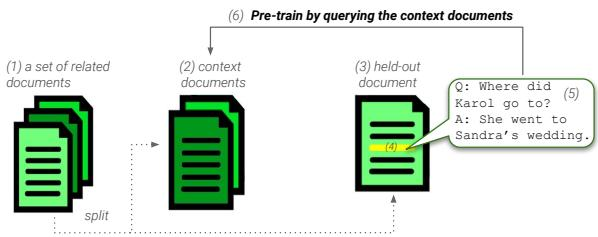
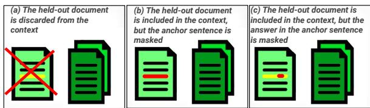
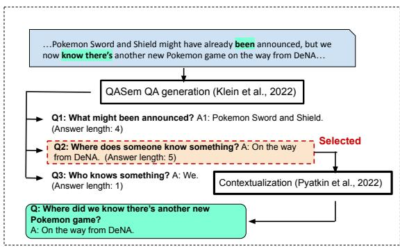
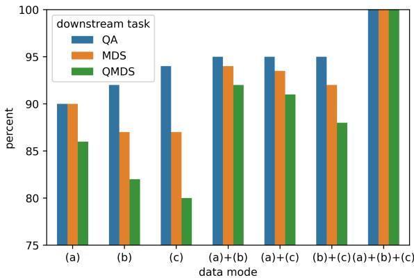

# Peek Across: Improving Multi-Document Modeling via Cross-Document Question-Answering

Avi Caciularu<sup>1</sup>∗ Matthew E. Peters<sup>2</sup> Jacob Goldberger<sup>1</sup> Ido Dagan<sup>1</sup> Arman Cohan<sup>2,3</sup>

<sup>1</sup>Bar-Ilan University, Ramat-Gan, Israel <sup>2</sup>Allen Institute for AI, Seattle, WA <sup>3</sup>Yale University, New Haven, CT

avi.c33@gmail.com, arman.cohan@yale.edu

## Abstract

The integration of multi-document pre-training objectives into language models has resulted in remarkable improvements in multi-document downstream tasks. In this work, we propose extending this idea by pre-training a generic multi-document model from a novel cross document question answering pre-training ob jective. To that end, given a set (or cluster) of topically-related documents, we systematically generate semantically-oriented questions from a salient sentence in one document and challenge the model, during pre-training, to answer these questions while “peeking" into other topically-related documents. In a similar manner, the model is also challenged to recover the sentence from which the question was generated, again while leveraging cross-document information. This novel multi document QA formulation directs the model to better recover cross-text informational rela tions, and introduces a natural augmentation that artificially increases the pre-training data. Further, unlike prior multi-document models that focus on either classification or summarization tasks, our pre-training objective formulation enables the model to perform tasks that involve both short text generation (e.g., QA) and long text generation (e.g., summarization). Following this scheme, we pre-train our model – termed QAMDEN – and evaluate its perfor mance across several multi-document tasks, including multi-document QA, summarization, and query-focused summarization, yielding improvements of up to 7%, and significantly outperforms zero-shot GPT-3.5 and GPT-4.<sup>1</sup>

## 1 Introduction

Among recent NLP research, multi-document processing is gaining increasing attention, due to the need to handle and process an increasing amount of textual data and available documents online. A number of prominent applications that are concerned with aggregating information from multiple texts are multi-document summarization (Fabbri et al., 2019; Zhao et al., 2020), query-focused multidocument summarization (Xu and Lapata, 2020; Pasunuru et al., 2021a), and multi-hop question answering (Yang et al., 2018; Welbl et al., 2018). These tasks remain challenging mostly since existing NLP models are designed to handle single texts, rather than processing multiple documents at once (Caciularu et al., 2021).

  
Figure 1: Illustration of our pre-training and data generation. Per a considered set of related documents (1) which we split into context documents (2) and a held-out document (3), we select the most salient sentence (4) that is used for generating a question-answer pair (5). Then, we pre-train a model by generating the proper answer and the salient sentence, given the question and the context documents (6).

Early solutions for multi-text processing were task-specific and used complex architectures that were difficult to generalize across different multidocument tasks (Liu and Lapata, 2019; Wang et al., 2020; Ginzburg et al., 2021). Efficient LMs (Tay et al., 2021; Beltagy et al., 2020) recently demonstrated that by simply concatenating multiple documents into a single sequence, the transformer can offload the goal of identifying and connecting relevant information between the documents. Recently, it was suggested that these long-context LMs can be equipped with new pre-training objectives to enable them to process multiple documents more effectively (Caciularu et al., 2021; Xiao et al., 2022;

Yasunaga et al., 2022).

These pre-trained models demonstrated state-ofthe-art performance on a variety of multi-document downstream tasks, and outperformed underlying LMs and task-specific architectures. Such models are often pre-trained using a dataset where each instance is a set of related documents (e.g., news articles all discussing a specific event), which facilitates modeling of cross-text relationships. Existing multi-document pre-training objectives involve unmasking tokens in a document (Caciularu et al., 2021), or generating a salient masked sentence (Zhang et al., 2020; Xiao et al., 2022), encouraging the model to recover missing information using other documents. While successful, these models are either limited to classification tasks (Caciularu et al., 2021) or primarily designed for summarization (Zhang et al., 2020; Xiao et al., 2022).

In this work, we propose a novel pre-training objective that supports both short and long text generation, resulting in a versatile and general multidocument language model. In particular, we hypothesize that using questions and answers involving multiple documents can encourage the model to better learn and incorporate both fine-grained information (by asking questions about core information units in a specific sentence) as well as coarsegrained cross-document relationships required to generate a long text such as a summary. We show that this approach holds not only for summarization, but for other multi-document downstream tasks as well.

During the pre-training of existing multidocument language models, the goal is to unmask spans (for encoder-only models) or generate masked textual spans (for encoder-decoder models) under a multi-document context. To that end, multiple concatenated sequences of related documents are fed during pre-training, thus requiring a large number of sets of related documents for an effective pre-training phase (Hoffmann et al., 2022). In a variety of existing multi-document benchmarks, such as multi-document summarization, only small to medium-scale document clusters are readily available. These are acquired either automatically with lexical similarity and retrieval (Fabbri et al., 2019) or semi-automatically (Gu et al., 2020), but generally, this process requires a substantial amount of human effort for filtering instances and generating high quality corpora.

By employing a novel multi-document questionanswer generation procedure, we propose an effective method for expanding the multi-document pre-training corpora. Our approach allows us to provide multiple views for every single cluster of documents, thereby artificially increasing the pretraining data size (in terms of number of instances) via augmentation. To expose the model to a variety of contexts and diversify the pre-training data, we propose to generate multiple pairs of questions and answers and condition them on a subset of the documents’ cluster. We select a salient sentence in one held-out document and then employ a recent parser to generate a high-quality question-answer pair about one predicate in the selected sentence, using a systematic semantically-oriented approach (Klein et al., 2022). This new multi-document pre-training objective challenges the model to generate both the answer to the question as well as the salient sentence, while discarding the held-out document or parts of it (see Figures 1, 2 for illustration). This procedure exposes the model to a variety of contexts – a question and a different subset of the documents in the cluster per instance, in contrast to prior methods that provide only a single view of the cluster. Our contributions are summarized below:

• A new pre-training approach for multidocument modeling, formulated as a crossdocument question answering task, further directing the LM to model cross-text relationships, focusing on both fine- and coarsegrained information.

• The number of pre-training examples generated by our suggested method is not bounded by the number of clusters, allowing the production of a variety of cross-document contexts.

• The resulting Question-Answering-based Multi-DocumENt (QAMDEN) model advances the state-of-the-art for several multidocument tasks.

## 2 Related Work

Long-context efficient text generation transformers (Tay et al., 2021, 2022) extend earlier transformer models (Vaswani et al., 2017) for processing long sequences, often using a sparse self-attention architecture. Examples include the Longformer Encoder-Decoder (LED) (Beltagy et al., 2020), and LongT5 (Guo et al., 2022). These models demonstrated that single-text approaches be can adapted to multi-document tasks by concatenating multiple documents into a single sequence and processing them using their sparse attention patterns. They sparsify the full self-attention matrix of transformers by using a combination of a localized sliding window (called local attention), as well as a global attention pattern on a few specific input locations. LED is build upon the BART model (Lewis et al., 2020) by using additional positional embeddings and global attention weights, and introduces the global attention mode that operates over pre-selected tokens. LongT5 extends the T5 model (Raffel et al., 2020) by using a similar technique introduced in the ETC and BIGBIRD models (Ainslie et al., 2020; Zaheer et al., 2020), relieving the requirement to manually select global tokens by automatically globalizing the aggregated representations of groups of tokens.

Further strategies have been proposed for increasing these models’ abilities in multi-document tasks. The Cross-Document Language Model (CDLM) (Caciularu et al., 2021) suggested pretraining a Longformer-encoder (Beltagy et al., 2020) over sets of related documents, and showed superior performance results over several multidocument tasks. Following this methodology, the authors of LinkBERT (Yasunaga et al., 2022) used a similar approach, but utilized Wikipedia’s hyperlinks in order to curate informative pairs of linked documents for LM pre-training.

In order to adopt the multi-document pretraining approach for sequence-to-sequence tasks, PRIMERA (Xiao et al., 2022), which is built on top of the Longformer encoder-decoder model (LED), selected salient sentences within clusters of related documents using a pyramid estimation approach, resembling the method presented for pre-training the single-document PEGASUS model (Zhang et al., 2020). While this work is the closest to ours, it was pre-trained to generate masked salient sentences without any control, which makes the model potentially hallucinate while generating text, while our model uses a controlled QA-based objective. Furthermore, unlike these works, our method generates significantly more data then used to pre-train PRIMERA, which is possible to obtain by the singledocument QA generation approach. Our QA pretraining formulation allows us to generate multiple contexts per document cluster.

Another related line of work includes methods that incorporate large-scale QA-generated data for pre-training LMs (He et al., 2020; Jia et al., 2022;

  
Figure 2: A schematic of our pretraining data modes. The salient sentence which is used for QA generation is colored in yellow. (a) The context does not include the held-out document, therefore this mode is the most challenging. (b) The held-out document is present in the context, but the salient sentence used for the QA generation is masked (red). (c) The held-out document is present in the context, but the answer span within the salient sentence is masked (red).

Huber et al., 2022). These works hypothesize and show that pre-training by utilizing generated QA data can encourage contextual representations to encode useful semantic information for other non-QA downstream tasks. Inspired by that, we conjecture that LMs can strongly benefit from infusing QA during pre-training in the multi-document setup, for adding an additional signal for modelling cross-text relationships.

## 3 Augmenting the Multi-Document Pre-training objective

In this section, we provide the required steps for compiling the pre-training dataset for QAMDEN. We next elaborate on the details of the data creation and provide analysis of the resulted corpus.

Recent works have shown that for text summarization, pre-training LMs to generate a “summarylike” sequence, termed pseudo summary, inherently provides gains over general-purpose pre-trained LMs (PEGASUS, PRIMERA; Zhang et al., 2020; Xiao et al., 2022). The data in which the PEGASUS and PRIMERA models were pre-trained on was constructed using the Gap Sentence Generation (GSG) method, which suggests masking highly-ranked salient sentences, where salience is pre-determined by a sentence-scoring method of interest. Particularly, in PEGASUS, GSG has been adopted as its pre-training objective, where some sentences in a single document are masked in the input and the model is tasked to generate them.

Formally, for each sentence $s ^ { i }$ in a given input document D, PEGASUS computes its salience score based on its ROUGE score (Lin, 2004) w.r.t the rest of the sentences within the document $( D / \{ s ^ { i } \} )$ , i.e. $\mathrm { S c o r e } ( s ^ { i } ) = \mathrm { R o U G E } ( s ^ { i } , D / \{ s ^ { i } \} )$ . Intuitively, this metric assigns a high score to the sentences that have a high overlap and share more lexical information with the rest of the sentences in the document, thus assigning high scores to prominent sentences. PRIMERA has generalized this notion to support the multi-document setup, by applying a GSG variant over a cluster of related documents.

  
Figure 3: A schematic of the process of QA generation using QASEM (Klein et al., 2022) and the contextualization model from Pyatkin et al. (2021). This is an actual sample that was created and used for pre-training QAMDEN, where the document is taken from New-SHead (Gu et al., 2020).

Cross-Document GSG. We propose augmenting the GSG technique to formulate a cross-document question answering pre-training objective for multidocument tasks, instead of the existing pseudo summary generation methods. Our approach supports identification of both fine- and coarse-grained information as we describe below, and results in a substantially larger amount of pre-training examples compared to the preceding methods.

Formally, we are given a cluster of related documents $\pmb { S } = \left( D _ { 1 } , D _ { 2 } , \ldots , D _ { | { \pmb { S } } | } \right)$ in a corpus $\mathcal { C } .$ . Our cross-document (CD) GSG salience score for the $i ^ { \mathrm { t h } }$ sentence within the $k ^ { \mathrm { { t h } } }$ document in the set $( s _ { k } ^ { i } )$ , is defined by its ROUGE score w.r.t the rest of the sentences within the document $( D _ { k } / \{ s _ { k } ^ { i } \} )$ as well as the other documents $( S / D _ { k } )$ i.e. $\mathrm { C D - G S G - S c o r e } ( s _ { k } ^ { i } ) = \mathrm { R O U G E } \bigl ( s _ { k } ^ { i } , S / \{ s _ { k } ^ { i } \} \bigr )$ Then, for every document k, following Zhang et al. (2020); Xiao et al. (2022) we select the top-scored sentence $s _ { k } ^ { * } ,$ , and then we use this sentence to generate a pair of a question and an answer.

Generating Cross-Document QAs. For generating the cross-document questions and their answers, we employ QASEM, a recent semantic parsing framework for question generation (Klein et al.,

Algorithm 1: Pre-training Data Generation   
Input: A text corpus of document clusters   
$\mathcal { C } = \{ S _ { 1 } , . . . , S _ { | \mathcal { C } | } \}$ , and a question-answer   
generator QASEM( ).   
Output: The pre-training dataset $\mathcal { D } .$   
1 $\mathcal { D }  \emptyset ;$   
2 for $n \gets 1$ to $| { \mathcal { C } } |$ do   
3 for $k \gets \dot { 1 }$ to $| S _ { n } |$ do   
4 $s _ { k } ^ { * } \gets$ arg max CD-GSG-Score $\cdot s _ { k } ^ { i } ) ;$   
2   
5 $( q _ { k } ^ { \ast } , a _ { k } ^ { \ast } ) \gets \mathrm { Q A S E M } ( s _ { k } ^ { \ast } ) ;$   
6 ${ t } _ { k } ^ { * } = [ \widetilde { \boldsymbol { a } _ { k } ^ { * } } , \boldsymbol { s } _ { k } ^ { * } ]$ # target text;   
7 $\hat { \mathcal { D } } \gets \tilde { \mathcal { D } } \cup \{ ( [ S _ { n } / \breve { D } _ { k } , q _ { k } ^ { * } ] , t _ { k } ^ { * } ) \} $ # (a);   
8 $\mathcal { D }  \mathcal { D } \cup \{ ( \lceil S _ { n } \rceil \{ s _ { k } ^ { * } \} , q _ { k } ^ { * } ] , t _ { k } ^ { * } ) \} \# ( \mathfrak { b } ) ;$   
9 $\mathcal { D }  \mathcal { D } \cup \{ \dot { [ } \dot { [ } S _ { n } / \{ a _ { k } ^ { * } \} , q _ { k } ^ { * } ] , t _ { k } ^ { * } ) \}$ # (c);   
10 Return ;

2022).<sup>2</sup> QASEM intended soliciting a manageable, discrete account of information in a text for the sake of building natural language semantic representations. It automatically labels each verbal predicate-argument relation with a questionanswer pair, where a natural language question represents a semantic role, while the answers correspond to the arguments that appear in the input text. QASEM is thus an appealing approach since it is capable of generating multiple high-quality questions given a sentence. We apply QASEM over the sentences withing the pre-training data in order to generate question-answer pairs, and then apply the model from Pyatkin et al. (2021) which transforms the question into a more natural and clear form, with contextualized arguments (see example in Figure 3). In order to resemble a summarization task where the generated text is typically long, we select the question-answer pair with the longest argument produced by QASEM. Formally, QASEM( ) receives a sentence $s _ { k } ^ { * }$ as an input, and produces question-answer pair $( q _ { k } ^ { * } , a _ { k } ^ { * } )$ , where $a _ { k } ^ { * }$ is the longest among the generated answers. See a detailed example and full description in App. A.1.

Considering the question-answer pair, our goal is to encourage the LM to generate the correct answer as well as the salient sentence in a multi-document context in order to learn cross-text relationships.

Data Generation Process. In order to facilitate the construction of a multi-document context, we propose three different modes, each one is responsible for uncovering information by using different contexts. For all the modes, we first generate a QA pair out of the most salient sentence in the held-out document.

<sup>2</sup>We tried several leading question generation methods, and QASEM introduced superior quality of questions, attributed to its semi-structured nature. See §4.4 for empirical results.

(a) Excluding the source document. In this mode we disregard the held-out document $D _ { k }$ from the context $S _ { n }$ given to the model, i.e, $S _ { n } / D _ { k }$ Hence, the model is tasked to predict the answer without having access to the source document at all, and is restricted to observe only the other documents in the set. Thus, this mode is considered as the most challenging one.

(b) Masking the salient sentence. In this mode, the source salient sentence is masked, i.e, ${ \cal S } _ { n } / \{ s _ { k } ^ { * } \}$ The model has access to the surrounding context of the masked sentence in the held-out document, as well as the other documents in the set.

(c) Masking the answer. In this mode, only the answer span within the salient sentence is masked, i.e, $S _ { n } / \left\{ a _ { k } ^ { * } \right\}$ . The model has access to the surrounding salient sentence, as well as all the documents in the set.

As part of the new pre-training process of our novel multi-document model, we append the question after the context and instruct the model to generate an answer followed by its salient sentence, i.e., $o u t p u t = \left. \mathsf { a n s w e r } \right.$ , sentence , inspired by Bohnet et al. (2022). Generating the salient sentence introduces a copying mechanism (allows the model to also learn to copy information from the source directly) as well as allowing longtext generation, which is crucial for summarization downstream tasks (Zhang et al., 2020), as well as outperforming a model which was pre-trained for generating the answer solely – according to the ablations study, this setup yields the best performance results (§4.4). In the pre-training evaluation phase, the held-out set was split and the loss was measured separately for each mode of the data. As expected, we observed that the loss for (a) was significantly higher than those for the other modes, with (a) (b) (c) ranking highest. The procedure for generating the pre-training data is summarized in Algorithm 1 and Figure 2.

The resulted pre-training corpus. We applied our procedure over the NewSHead corpus (Gu et al., 2020), which consists of a set of related documents per instance. This is the exact same pre-training corpus used also by our main baseline PRIMERA (Xiao et al., 2022) (See App. A for more details).

Using our data generation procedure, we produced 3,579,323 pre-training examples and 13,475 held-out examples, where on average, every 3.5 instances originated from the same cluster of related documents. In Table 1, we depict the comparison of pre-training corpora for related multi-document LMs compared to our QAMDEN pre-training data.

<table><tr><td>Model</td><td>Pretraining Dataset #clusters #instances</td><td></td><td></td></tr><tr><td>CDLM (2021)</td><td>Multi-News (2019)</td><td>56K</td><td>56K</td></tr><tr><td>PRIMERA (2022) NewSHead (2020)</td><td></td><td>367K</td><td>367K</td></tr><tr><td>QAMDEN (ours) NewSHead (2020)</td><td></td><td>367K</td><td>4.3M</td></tr></table>

Table 1: Pre-training corpus statistics used by multidocument models. The reported numbers are the count of document clusters and the count of unique pretraining instances.

## 4 Experimental Setup and Results

This section presents experiments conducted to evaluate QAMDEN, as well as the the ablations and baselines we used. For the intrinsic evaluation we evaluated the models over multi-document QA tasks. For extrinsic evaluations we considered the multi-document abstractive summarization task.

Model Implementation Details Following Xiao et al. (2022), we use the large-sized Longformer-Encoder-Decoder (LED) (Beltagy et al., 2020) for our model initialization. The length limits of input and output are 4096 and 1024, respectively.<sup>3</sup> Following the Huggingface implementation (Wolf et al., 2020), we set the sliding window size to 1024 for local attention in the encoder part.

Similar to the PRIMERA model (Xiao et al., 2022), when concatenating the documents and the question, we add a special document separator token (<doc-sep>) between the documents to signal to the model to be aware of the document boundaries. We also assign the global attention mode to these tokens which enables the model to share information across documents (Caciularu et al., 2021). For further hyperparameter and pre-training execution details, see App. B.

## 4.1 Multi-Document Question Answering

Multi-document QA is the task of generating the correct answer, given a set of related multiple documents. For several multi-document QA benchmarks, models are often tasked to implicitly solve multiple sub-tasks or follow intermediate steps, such as comprehending the question, filtering out distracting documents in the context, and stitching pieces of information across the relevant documents (Geva et al., 2021; Caciularu et al., 2022). Recall that QAMDEN was pre-trained over a automatically generated multi-document QA dataset. Hence, as a preliminary assessment, we first investigate QAMDEN’s performance over two multi-document QA benchmarks, HopotQAdistractor (Yang et al., 2018) and WikiHop (Welbl et al., 2018) (see more details of the datasets in App. C.1), and compare to other models that were pre-trained using underling un-masking objectives.

Fine-Tuning Format. To follow our pre-training scheme, we append the question to the context and fine-tune the model to generate the correct answer. We use the Longformer Encoder-Decoder (LED) (Beltagy et al., 2020) and PRIMERA (Xiao et al., 2022) as the baselines, for assesing the contribution of our pre-trainig format. Confirmed by Beltagy et al. (2020), we found out that appending the question: and context: prefixes before the question and the context tokens, respectively, resulted in better performance.

Baselines. We compare QAMDEN (447M parameters) against a set of strong long-context transformer baselines, including LED (447M parameters) (Beltagy et al., 2020), PRIMERA (447M parameters) (Xiao et al., 2022),<sup>4</sup> and LongT5-xl (3B parameters)<sup>5</sup> (Guo et al., 2022) (see §2).<sup>6</sup>

Results. The results on multi-document QA are shown in Table 2. We adopted the F1 and Exact Match (EM) evaluation metrics corresponding to the original works. Our QAMDEN outperforms both PRIMERA, LED, and LongT5, confirming that our pre-training data and input format are beneficial for both capturing cross-document relationships (QAMDEN LED) as well as exploiting both context and question (QAMDEN PRIMERA).

## 4.2 Multi-Document Summarization (MDS)

This task aims at generating a summary for a given set of topically-related documents. Inherently, endto-end MDS needs to implicitly address several subtasks including salience detection, redundancy removal, and text generation. Since dealing with multiple documents, MDS requires dealing with heterogeneous information and dispersed, while exhibiting substantial textual redundancy. We train and test QAMDEN with two challenging MDS benchmarks, each one dealing with a different domain: Multi-News (Fabbri et al., 2019), which is concerned on summarizing related news articles, and Multi-XScience (Lu et al., 2020), for scientific articles summarization (see more details of the datasets in App. C.2). Under this setting, we are provided sets of documents (without any query), and therefore we simply encode the documents using QAMDEN without appending additional text.

<table><tr><td>Model</td><td></td><td>F1</td><td>EM</td></tr><tr><td rowspan="3">HoA</td><td>LED (Beltagy et al., 2020)</td><td>65.8</td><td>50.6</td></tr><tr><td>LongT5-x1 (Guo et al., 2022)</td><td>66.1</td><td>50.9</td></tr><tr><td>PRIMERA (Xiao et al., 2022) QAMDEN</td><td>65.4 67.1</td><td>47.8 52.7</td></tr><tr><td rowspan="3">Wioop</td><td>LED (Beltagy et al., 2020)</td><td>65.6</td><td>62.4</td></tr><tr><td>LongT5-x1 (Guo et al., 2022)</td><td>67.7</td><td>63.6</td></tr><tr><td>PRIMERA (Xiao et al., 2022)</td><td>65.0</td><td>61.9</td></tr><tr><td rowspan="2"></td><td>QAMDEN</td><td>69.3</td><td>65.2</td></tr><tr><td></td><td></td><td></td></tr></table>

Table 2: HotpotQA-distractor and WikiHop results (F and Exact Match) over the dev set.

Baselines. As in the previous experiment, we compare QAMDEN against LED, PRIMERA, LongT5-xl. Following Xiao et al. (2022) we report the results of the state-of-the-art models from Pasunuru et al. (2021b) and Lu et al. (2020), for Multi-News and Multi-XScience, respectively.

Results. Tables 3 and 4 present the evaluation results over the Multi-News and Multi-XScience datasets, respectively. Following previous MDS works, we report the ROUGE R-1, -2, and -L scores, which are the standard MDS evaluation metrics (see App. C.2 for details). For a fair comparison, we include the results of PRIMERA as well as the results of the previous state-of-the-art methods (Pasunuru et al. (2021b) and Lu et al. (2020), for Multi-News and for Multi-XScience, respectively), and LED (Beltagy et al., 2020). As shown in the results tables, QAMDEN exhibits the best performance across most of the examined models and benchmarks, especially on the Multi-News dataset, clearly demonstrating its consistent advantage. This excludes the results for Multi-XScience where QAMDEN slightly underperforms the prior work and LongT5. An explanation which Xiao et al. (2022) points refers to the fact that the clusters in Multi-XScience have less overlapping information compared to the corpus we used, attributed to the use of abstracts as the input documents in Multi-XScience. In addition, LongT5 advantage over QAMDEN is attributed to significantly larger number of parameters of LongT5-xl.

<table><tr><td>Model</td><td>R-1</td><td>R-2</td><td>R-L</td></tr><tr><td>Pasunuru et al. (2021b)</td><td>49.2</td><td>19.6</td><td>24.5</td></tr><tr><td>LED (Beltagy et al., 2020)</td><td>47.4</td><td>20.7</td><td>23.7</td></tr><tr><td>LongT5-x1 (Guo et al., 2022)</td><td>47.4</td><td>20.7</td><td>23.7</td></tr><tr><td>PRIMERA (Xiao et al., 2022)</td><td>49.9</td><td>21.1</td><td>25.9</td></tr><tr><td>QAMDEN</td><td>50.9</td><td>23.1</td><td>27.2</td></tr></table>

Table 3: ROUGE (-1,-2,-L) results for the test set of the Multi-News dataset.
<table><tr><td>Model</td><td>R-1</td><td>R-2</td><td>R-L</td></tr><tr><td>Lu et al. (2020)</td><td>33.9</td><td>6.8</td><td>18.2</td></tr><tr><td>LED (Beltagy et al., 2020)</td><td>31.0</td><td>6.9</td><td>17.4</td></tr><tr><td>LongT5-xl (Guo et al., 2022)</td><td>33.7</td><td>8.1</td><td>19.4</td></tr><tr><td>PRIMERA (Xiao et al., 2022)</td><td>31.9</td><td>7.4</td><td>18.0</td></tr><tr><td>QAMDEN</td><td>33.5</td><td>7.6</td><td>19.1</td></tr></table>

Table 4: ROUGE (-1,-2,-L) results for the test set of the Multi-XScience dataset.

## 4.3 Query-Focused Multi-Document Abstractive Summarization

The task of Query-focused Multi-Document Summarization (QMDS) aims at generating a summary from a set of documents, that answers a specific given query. Unlike MDS, QMDS tries to solve more realistic query-based scenarios, since it suggests summarizing only predefined salient information of interest that best answers the query. Since we proposed pre-trainng under the multi-document question answering setup, we posit that QAMDEN might be effective for QMDS.

We consider the datasets constructed by Pasunuru et al. (2021a), QMDSCNN and QMDSIR (see more details of the datasets in App. C.3) as well as their strong baseline, and include also the results of PRIMERA and LED.

Baselines. Similar to the previous experiments, we compare QAMDEN against LED, PRIMERA, LongT5-xl. In addition, we consider also the baseline from Pasunuru et al. (2021a).

<table><tr><td>Model</td><td>R-1</td><td>R-2</td><td>R-L</td></tr><tr><td>Pasunuru et al. (2021a)7</td><td>37.9</td><td>16.4</td><td>35.2</td></tr><tr><td>LED (Beltagy et al., 2020)</td><td>32.3</td><td>14.3</td><td>30.9</td></tr><tr><td>LongT5-x1 (Guo et al., 2022)</td><td>35.5</td><td>15.9</td><td>34.3</td></tr><tr><td>PRIMERA (Xiao et al., 2022)</td><td>36.1</td><td>16.2</td><td>35.7</td></tr><tr><td>QAMDEN</td><td>38.8</td><td>18.3</td><td>37.2</td></tr></table>

Table 5: ROUGE (-1,-2,-L) results for the test set of the QMDSCNN dataset.
<table><tr><td>Model</td><td>R-1</td><td>R-2</td><td>R-L</td></tr><tr><td>Pasunuru et al. (2021a)7</td><td>45.5</td><td>23.4</td><td>41.2</td></tr><tr><td>LED (Beltagy et al., 2020)</td><td>43.2</td><td>21.3</td><td>40.5</td></tr><tr><td>LongT5-x1 (Guo et al., 2022)</td><td>44.4</td><td>22.3</td><td>40.0</td></tr><tr><td>PRIMERA (Xiao et al., 2022)</td><td>45.7</td><td>23.6</td><td>40.9</td></tr><tr><td>QAMDEN</td><td>47.6</td><td>25.1</td><td>42.4</td></tr></table>

Table 6: ROUGE (-1,-2,-L) results for the test set of the QMDSIR dataset.

Results. Tables 5 and 6 present the evaluation results over the QMDSCNN and QMDSIR datasets, respectively. Following MDS tasks and Pasunuru et al. (2021a), we report the ROUGE R-1, -2, and -L scores, which are the standard MDS evaluation metrics (see App. C.3 for details). As shown in the tables, QAMDEN exhibits the best performance across most of the examined models and benchmarks, clearly demonstrating its consistent advantage over the baselines.

## 4.4 Ablation Study

Data Generation. We next turn to a broad ablation study, for assessing our configuration and design choices across our suggested pipeline. First, we show the advantage of combining the three proposed data modes, rather than using a subset of them. We evaluate all the resulted models by fine-tuning them over HopotQA-distractor (§4.1), Multi-XScience (§4.2), and QMDSIR (§4.3). For HopotQA-distractor we report the Exact Match (EM) score, and for the summarization tasks we report the ROUGE-1 (R-1) score.

Baselines. We pre-train QAMDEN for 100k steps, for using every subset of the set of the set (superset) of modes (a), (b), (c) (all its possible combinations) of the generated pre-training data modes presented in §3. Note that our QAMDEN model is referred to as using all the modes, i.e., (a) + (b) + (c).

  
Figure 4: Ablation results over the validation sets of the HotpotQA-distractor (QA) Multi-XScience (MDS), and QMDSIR (QMDS) datasets. We report the percentage of the perforamnce relatively to the top scoring model. For QA we used the EM score, and for MDS and QMDS we used the ROUGE-1 score.

Results. Figure 4 shows the ablation results. In all tasks, pre-training using all modes yields the best results. Among all modes, mode (c) appears to be the most effective for QA, since this is an extractive QA task, and mode (c) provides data in this format. Mode (a) excels at the summarization tasks, attributed to their abstractive nature as well as the requirement of all the documents for generating appropriate summaries.

Input Format We repeat the previous experiment and ablate the pre-training input format according to the multiple different formats, and compare to the model pre-training format described in §3 (with the same pre-training data): without questions, with random question, with random context document, with prefixes, placing the question before the context, with questionfiltering, and without generating the salient sentence. Additionally, we assess the choice of QASEM as our questionanswer generation module by using the generators from Jia et al. (2022) and Khashabi et al. (2022). Finally, we also include the results of PRIMERA, which was further pre-trained for additional 300k steps (fine-tuning LED for 400k steps in total), for a fair comparison to QAMDEN ablated models. See full details regarding all the ablations in App. D.

Results. Overall, our QAMDEN model outperforms the ablation models on most of the tasks, which a significant margin.

Pre-training the model without any questions during or using random questions, negatively impacts the results of downstream tasks. An important function of the question is to facilitate the model’s ability to generate the appropriate answer and the source sentence. This aligns with the findings from Caciularu et al. (2021), who showed that pre-training with random documents rather than related ones is sub-optimal.

<table><tr><td></td><td>QA MDS</td><td></td><td>QMDS</td></tr><tr><td>without questions</td><td>60.3</td><td>32.8</td><td>44.7</td></tr><tr><td>with random questions</td><td>61.1</td><td>32.1</td><td>44.2</td></tr><tr><td>with random context documents</td><td>61.0</td><td>31.5</td><td>43.9</td></tr><tr><td>with prefixes</td><td>67.3</td><td>32.6</td><td>46.2</td></tr><tr><td>placing the question before the context</td><td>66.7</td><td>33.4</td><td>46.3</td></tr><tr><td>with question filtering</td><td>65.2</td><td>30.9</td><td>41.1</td></tr><tr><td>without generating the salient sentence</td><td>66.6</td><td>30.5</td><td>42.8</td></tr><tr><td>Using Jia et al. (2022) as the QA generator</td><td>66.6</td><td>33.2</td><td>45.9</td></tr><tr><td>Using Khashabi et al. (2022) as the QA generator</td><td>66.8</td><td>33.3</td><td>45.1</td></tr><tr><td>PRIMERA (Xiao et al., 2022) 400k steps checkpoint</td><td>65.9</td><td>32.1</td><td>45.7</td></tr><tr><td>QAMDEN</td><td>67.1</td><td>33.5</td><td>47.6</td></tr></table>

Table 7: Ablation study results.

The use of question and context prefixes for positioning input appears to be helpful for QA, but is inferior when applied to summarization tasks due to its unique format, which is well suited for QA but seems to generalize harder for other setups. When the question is placed before the context, performance slightly decreases over query-based tasks, while maintaining the same results for summarization (where the question location is irrelevant).

Using question filtering is found to harm the downstream results of QAMDEN, in accordance to other QA-based pre-training prior works (Jia et al., 2022).

Pre-training without generating the attributed source sentence introduces a significant flow to the model, particularly for the summarization downstream tasks. As mentioned before, generating longer sequences, as well as teaching the model to copy text, is beneficial for summarization tasks.

Applying a different question generator rather then QASEM yields inferior results overall, since the other generators produce open-ended questions and answers which are more prone to errors, while QASEM utilizes an existing span in the context as the answer. In addition, QASEM generated local questions, which allows QAMDEN to focus on the fine-grained details, and not only the coarsegrained information in the multi-document context.

When PRIMERA is pre-trained with 400k steps (to match QAMDEN’s number of further pretraining steps), it underperforms QAMDEN and even fails to add any significant improvements over its 100K checkpoint, possibly due to the small amount of pre-training data it contains.

<table><tr><td>Model</td><td>R-1</td><td>R-2</td><td>R-L</td></tr><tr><td>PRIMERA</td><td>45.0</td><td>16.7</td><td>22.6</td></tr><tr><td>GPT-3.5</td><td>36.4</td><td>10.8</td><td>18.7</td></tr><tr><td>GPT-4</td><td>34.7</td><td>10.7</td><td>18.8</td></tr><tr><td>GPT-4 8k</td><td>34.9</td><td>10.9</td><td>18.9</td></tr><tr><td>QAMDEN</td><td>45.3</td><td>17.4</td><td>23.7</td></tr></table>

Table 8: ROUGE (-1,-2,-L) results on a subset of Multi-News. GPT models are accessed through the OpenAI public API and are applied in zero-shot mode.
<table><tr><td>Model</td><td>Cont.</td><td>Read.</td><td>Gram.</td><td>Non-red.</td></tr><tr><td>PRIMERA</td><td>↑53.3%</td><td>↑63.3%</td><td>↑56.7%</td><td>↑53.3%</td></tr><tr><td>GPT-3.5</td><td>↑70.0%</td><td>↓33.3%</td><td>↓30.0%</td><td>↑70.0%</td></tr><tr><td>GPT-4 8k</td><td>↑73.3%</td><td>↓40.0%</td><td>↓36.6%</td><td>↑83.3%</td></tr></table>

Table 9: Comparison of the first 30 summaries of the Multi-News sample between QAMDEN and the baselines. Under each of the four evaluation criteria, the cells in a row indicate the percentage of cases where our system was preferred over the baseline.

## 4.5 Comparison with Large Language Models

In order to get insights into how QAMDEN compares with state-of-the-art Generalist Large Language Models (LLMs), we provide a small comparison with two capable models, GPT-3.5 turbo (Ouyang et al., 2022) and GPT-4<sup>8</sup> (OpenAI, 2023) (including the 8k input length version) evaluated on the zero-shot setting.

For a fair comparison, we used the same context window size of 4K tokens for all models (and up to 8k for GPT-4 8k). Due to the fact that multidocument tasks involve processing long sequences, the cost of API calls is significant for a comprehensive evaluation across all datasets. Therefore, we only evaluate on a sample of 200 instances from the multi-news dataset (see prompting details in App. E). Table 8 depicts the results. We observe that QAMDEN significantly outperforms both GPT-3.5 and GPT-4 models, though the performance of GPT-4 and GPT-3.5 is comparable. We leave more comprehensive comparisons with LLMs to future work.

We further assessed QAMDEN through manual comparison against PRIMERA, GPT-3.5, and GPT-4 8k. NLP graduate students were shown summaries for a given topic from the three systems and QAMDEN in arbitrary order, along with a corresponding reference summary. Following (Ernst et al., 2022), participants were asked to rank the systems based on Content (overlap with the reference), Readability (the readability of a summary), Grammaticality (avoiding grammar errors), and Non-Redundancy (avoiding repetitions), and we extract the pairwise results out of the rankings (see (Ernst et al., 2022) for further details). In App. F, we provide several examples to system summaries and their corresponding reference summaries.

The results of this study are presented in Table 9. Under each evaluation criterion, it indicates the percentage of cases where QAMDEN was preferred over both baselines. QAMDEN was favored in all cases except for grammatical errors and readability (which corresponds to the Reinforcement Learning from Human Feedback phase of the GPT models).

## 5 Conclusions

In this work, we present a novel pre-training scheme for multi-document tasks. First, our approach suggests to augment the existing multidocument pre-training objectives into a crossdocument question answering task. Second, we generate high-quality large-scale QA pre-training data using a controlled generation approach, in which each QA pair originates from a salient sentence in one of the documents in the set.

During pre-training, we task the the Longformer Encoder-Decoder (LED) model to generate the answer and the salient sentence on the basis of the remaining context. This objective encourages the LED model to elicit cross-document relationships, and stitch pieces of information across the input documents, which are relevant for performing multi-document tasks. The resulted model QAMDEN shows significant performance improvements compared to prior models under extensive experimentation over multiple challenging multidocument summarization and QA datasets.

Future work can extend the ideas in this work for equipping decoder-only large LMs with crossdocument modeling using our proposed method, also in the setup of in-context learning and prompt tuning. We foresee that our method should be significant specifically for retrieval-augmented language modeling setups (Izacard et al., 2022), where there is a use of related documents as an outsourced external non-parametric knowledge source. Finally, the use of a single document in order to trigger cross-document relationships, as firstly introduced in this work, might be further investigated.

## Limitations

While our work tries to focus around reasoning over both fine- and coarse-grained cross-document relationships, QAMDEN, the resulted pre-trained model, might still suffer from factual consistency errors while generating information given a query, and there is no guarantee that it will always generate factual and reasonable content without any further fine-tuning.

The QASEM question generation model that we used may also have been a source of these problems. There is a possibility that QASEM produces inadequate questions that could harm the pre-training process of the model. An attempt was made to filter out noise using a question model, but the results were inferior to non-filtering. Consequently, if the model is not fine-tuned, inconsistency (hallucinations) may occur more frequently.

In addition, by using the Newshead corpus as the pre-training data source, we assume that it is comprised of high quality documents. We also take into account the fact that Newshead is limited to documents in the news domain, while some of the benchmarks used for evaluating QAMDEN include another topics of interest. Future work may further assess the quality of the documents, such as checking for duplications or wrong statements, and diversify the corpus domains. This is crucial for productizing models like QAMDEN in interactive multi-text applications (chatbots) and semantic search applications which are gaining attraction nowadays (Hirsch et al., 2021; Eirew et al., 2022).

Finally, the resulted model QAMDEN was pretrained on sets of related documents, by answering questions that matched their content. As in an out-of-domain scenario, QAMDEN’s use over sets of documents that are not related, or over single documents, might be unexpected. Such settings may be the subject of another research direction in the future.

## Ethics Statement

Despite the limited risk associated with our work, similar to existing state-of-the-art generation language models, there is no guarantee that QAM-DEN, our model, will always generate factual information. The model should therefore be used with caution in a practical environment and be carefully tested before deployment. It is possible, for example, that frequent anecdotal events in the pre-training dataset are generated in an unexpected

manner.

## Acknowledgements

The work described herein was supported by the PBC fellowship for outstanding PhD candidates in data science, in part by grants from the Israel Science Foundation grant 2827/21, and by a grant from the Israel Ministry of Science and Technology.

## References

Joshua Ainslie, Santiago Ontanon, Chris Alberti, Vaclav Cvicek, Zachary Fisher, Philip Pham, Anirudh Ravula, Sumit Sanghai, Qifan Wang, and Li Yang. 2020. ETC: Encoding long and structured inputs in transformers. In Proceedings ofthe 2020 Conference on Empirical Methods in Natural Language Processing (EMNLP), pages 268–284, Online. Association for Computational Linguistics.

Chris Alberti, Daniel Andor, Emily Pitler, Jacob Devlin, and Michael Collins. 2019. Synthetic QA corpora generation with roundtrip consistency. In Proceedings of the 57th Annual Meeting of the Association for Computational Linguistics, pages 6168–6173, Florence, Italy. Association for Computational Linguistics.

Iz Beltagy, Matthew E Peters, and Arman Cohan. 2020. Longformer: The long-document transformer. arXiv preprint arXiv:2004.05150.

Bernd Bohnet, Vinh Q. Tran, Pat Verga, Roee Aharoni, Daniel Andor, Livio Baldini Soares, Jacob Eisenstein, Kuzman Ganchev, Jonathan Herzig, Kai Hui, Tom Kwiatkowski, Ji Ma, Jianmo Ni, Tal Schuster, William W. Cohen, Michael Collins, Dipanjan Das, Donald Metzler, Slav Petrov, and Kellie Webster. 2022. Attributed question answering: Evaluation and modeling for attributed large language models. arXiv preprint arXiv:2212.08037, 4.

Avi Caciularu, Arman Cohan, Iz Beltagy, Matthew Peters, Arie Cattan, and Ido Dagan. 2021. CDLM: Cross-document language modeling. In Findings of the Association for Computational Linguistics: EMNLP 2021, pages 2648–2662, Punta Cana, Dominican Republic. Association for Computational Linguistics.

Avi Caciularu, Ido Dagan, Jacob Goldberger, and Arman Cohan. 2022. Long context question answering via supervised contrastive learning. In Proceedings ofthe 2022 Conference ofthe North American Chapter ofthe Associationfor Computational Linguistics: Human Language Technologies, pages 2872–2879, Seattle, United States. Association for Computational Linguistics.

Alon Eirew, Avi Caciularu, and Ido Dagan. 2022. Crossdocument event coreference search: Task, dataset and

modeling. In Proceedings ofthe 2022 Conference on Empirical Methods in Natural Language Processing, pages 900–913, Abu Dhabi, United Arab Emirates. Association for Computational Linguistics.

Ori Ernst, Avi Caciularu, Ori Shapira, Ramakanth Pasunuru, Mohit Bansal, Jacob Goldberger, and Ido Dagan. 2022. Proposition-level clustering for multidocument summarization. In Proceedings of the 2022 Conference ofthe North American Chapter of the Associationfor Computational Linguistics: Human Language Technologies, pages 1765–1779, Seattle, United States. Association for Computational Linguistics.

Alexander Fabbri, Irene Li, Tianwei She, Suyi Li, and Dragomir Radev. 2019. Multi-news: A large-scale multi-document summarization dataset and abstractive hierarchical model. In Proceedings of the 57th Annual Meeting ofthe Associationfor Computational Linguistics, pages 1074–1084, Florence, Italy. Association for Computational Linguistics.

Yuwei Fang, Shuohang Wang, Zhe Gan, Siqi Sun, Jingjing Liu, and Chenguang Zhu. 2020. Accelerating real-time question answering via question generation. arXiv preprint arXiv:2009.05167.

Adam Fisch, Alon Talmor, Robin Jia, Minjoon Seo, Eunsol Choi, and Danqi Chen. 2019. MRQA 2019 shared task: Evaluating generalization in reading comprehension. In Proceedings of the 2nd Workshop on Machine Reading for Question Answering, pages 1–13, Hong Kong, China. Association for Computational Linguistics.

Nicholas FitzGerald, Julian Michael, Luheng He, and Luke Zettlemoyer. 2018. Large-scale QA-SRL parsing. In Proceedings of the 56th Annual Meeting of the Association for Computational Linguistics (Volume 1: Long Papers), pages 2051–2060, Melbourne, Australia. Association for Computational Linguistics.

Mor Geva, Uri Katz, Aviv Ben-Arie, and Jonathan Berant. 2021. What’s in your head? Emergent behaviour in multi-task transformer models. In Proceedings ofthe 2021 Conference on Empirical Methods in Natural Language Processing, pages 8201– 8215, Online and Punta Cana, Dominican Republic. Association for Computational Linguistics.

Dvir Ginzburg, Itzik Malkiel, Oren Barkan, Avi Caciularu, and Noam Koenigstein. 2021. Self-supervised document similarity ranking via contextualized language models and hierarchical inference. In Findings of the Association for Computational Linguistics: ACL-IJCNLP 2021, pages 3088–3098, Online. Association for Computational Linguistics.

Xiaotao Gu, Yuning Mao, Jiawei Han, Jialu Liu, You Wu, Cong Yu, Daniel Finnie, Hongkun Yu, Jiaqi Zhai, and Nicholas Zukoski. 2020. Generating representative headlines for news stories. In Proceedings of The World Wide Web Conference (WWW).

Mandy Guo, Joshua Ainslie, David Uthus, Santiago Ontanon, Jianmo Ni, Yun-Hsuan Sung, and Yinfei Yang. 2022. LongT5: Efficient text-to-text transformer for long sequences. In Findings of the Association for Computational Linguistics: NAACL 2022, pages 724– 736, Seattle, United States. Association for Computational Linguistics.

Hangfeng He, Qiang Ning, and Dan Roth. 2020. QuASE: Question-answer driven sentence encoding. In Proceedings ofthe 58th Annual Meeting ofthe Associationfor Computational Linguistics, pages 8743– 8758, Online. Association for Computational Linguistics.

Luheng He, Mike Lewis, and Luke Zettlemoyer. 2015. Question-answer driven semantic role labeling: Using natural language to annotate natural language. In Proceedings of the 2015 Conference on Empirical Methods in Natural Language Processing, pages 643–653, Lisbon, Portugal. Association for Computational Linguistics.

Karl Moritz Hermann, Tomas Kocisky, Edward Grefenstette, Lasse Espeholt, Will Kay, Mustafa Suleyman, and Phil Blunsom. 2015. Teaching machines to read and comprehend. In Advances in Neural Information Processing Systems (NIPS).

Eran Hirsch, Alon Eirew, Ori Shapira, Avi Caciularu, Arie Cattan, Ori Ernst, Ramakanth Pasunuru, Hadar Ronen, Mohit Bansal, and Ido Dagan. 2021. iFacetSum: Coreference-based interactive faceted summarization for multi-document exploration. In Proceedings of the 2021 Conference on Empirical Methods in Natural Language Processing: System Demonstrations, pages 283–297, Online and Punta Cana, Dominican Republic. Association for Computational Linguistics.

Jordan Hoffmann, Sebastian Borgeaud, Arthur Mensch, Elena Buchatskaya, Trevor Cai, Eliza Rutherford, Diego de Las Casas, Lisa Anne Hendricks, Johannes Welbl, Aidan Clark, et al. 2022. Training compute-optimal large language models. arXiv preprint arXiv:2203.15556.

Patrick Huber, Armen Aghajanyan, Barlas Oguz, Dmytro Okhonko, Scott Yih, Sonal Gupta, and Xilun Chen. 2022. CCQA: A new web-scale question answering dataset for model pre-training. In Findings of the Association for Computational Linguistics: NAACL 2022, pages 2402–2420, Seattle, United States. Association for Computational Linguistics.

Gautier Izacard, Patrick Lewis, Maria Lomeli, Lucas Hosseini, Fabio Petroni, Timo Schick, Jane Dwivedi-Yu, Armand Joulin, Sebastian Riedel, and Edouard Grave. 2022. Few-shot learning with retrieval augmented language models. arXiv preprint arXiv:2208.03299.

Alon Jacovi, Avi Caciularu, Omer Goldman, and Yoav Goldberg. 2023. Stop uploading test data in plain

text: Practical strategies for mitigating data contamination by evaluation benchmarks. arXiv preprint arXiv:2305.10160.

Robin Jia, Mike Lewis, and Luke Zettlemoyer. 2022. Question answering infused pre-training of generalpurpose contextualized representations. In Findings of the Association for Computational Linguistics: ACL 2022, pages 711–728, Dublin, Ireland. Association for Computational Linguistics.

Daniel Khashabi, Yeganeh Kordi, and Hannaneh Hajishirzi. 2022. Unifiedqa-v2: Stronger generalization via broader cross-format training. arXiv preprint arXiv:2202.12359.

Daniel Khashabi, Sewon Min, Tushar Khot, Ashish Sabharwal, Oyvind Tafjord, Peter Clark, and Hannaneh Hajishirzi. 2020. UNIFIEDQA: Crossing format boundaries with a single QA system. In Findings of the Association for Computational Linguistics: EMNLP 2020, pages 1896–1907, Online. Association for Computational Linguistics.

Diederik P Kingma and Jimmy Ba. 2014. Adam: A method for stochastic optimization. In International Conference on Learning Representations (ICLR).

Ayal Klein, Eran Hirsch, Ron Eliav, Valentina Pyatkin, Avi Caciularu, and Ido Dagan. 2022. QASem parsing: Text-to-text modeling of QA-based semantics. In Proceedings of the 2022 Conference on Empirical Methods in Natural Language Processing, pages 7742–7756, Abu Dhabi, United Arab Emirates. Association for Computational Linguistics.

Ayal Klein, Jonathan Mamou, Valentina Pyatkin, Daniela Stepanov, Hangfeng He, Dan Roth, Luke Zettlemoyer, and Ido Dagan. 2020. QANom: Question-answer driven SRL for nominalizations. In Proceedings of the 28th International Conference on Computational Linguistics, pages 3069–3083, Barcelona, Spain (Online). International Committee on Computational Linguistics.

Mike Lewis, Yinhan Liu, Naman Goyal, Marjan Ghazvininejad, Abdelrahman Mohamed, Omer Levy, Veselin Stoyanov, and Luke Zettlemoyer. 2020. BART: Denoising sequence-to-sequence pre-training for natural language generation, translation, and comprehension. In Proceedings of the 58th Annual Meeting ofthe Associationfor Computational Linguistics, pages 7871–7880, Online. Association for Computational Linguistics.

C. Lin and M. Rey. 2004. Looking for a few good metrics: ROUGE and its evaluation. In NTCIR Workshop.

Chin-Yew Lin. 2004. ROUGE: A package for automatic evaluation of summaries. In Text Summarization Branches Out, pages 74–81, Barcelona, Spain. Association for Computational Linguistics.

Yang Liu and Mirella Lapata. 2019. Hierarchical transformers for multi-document summarization. In Proceedings of the 57th Annual Meeting of the Association for Computational Linguistics, pages 5070– 5081, Florence, Italy. Association for Computational Linguistics.

Yao Lu, Yue Dong, and Laurent Charlin. 2020. Multi-XScience: A large-scale dataset for extreme multidocument summarization of scientific articles. In Proceedings of the 2020 Conference on Empirical Methods in Natural Language Processing (EMNLP), pages 8068–8074, Online. Association for Computational Linguistics.

Congbo Ma, Wei Emma Zhang, Mingyu Guo, Hu Wang, and Quan Z. Sheng. 2022. Multi-document summarization via deep learning techniques: A survey. ACM Comput. Surv., 55(5).

OpenAI. 2023. Gpt-4 technical report. ArXiv, abs/2303.08774.

Long Ouyang, Jeffrey Wu, Xu Jiang, Diogo Almeida, Carroll Wainwright, Pamela Mishkin, Chong Zhang, Sandhini Agarwal, Katarina Slama, Alex Ray, John Schulman, Jacob Hilton, Fraser Kelton, Luke Miller, Maddie Simens, Amanda Askell, Peter Welinder, Paul F Christiano, Jan Leike, and Ryan Lowe. 2022. Training language models to follow instructions with human feedback. In Advances in Neural Information Processing Systems (NeurIPS).

Ramakanth Pasunuru, Asli Celikyilmaz, Michel Galley, Chenyan Xiong, Yizhe Zhang, Mohit Bansal, and Jianfeng Gao. 2021a. Data augmentation for abstractive query-focused multi-document summarization. In The Associationfor the Advancement ofArtificial Intelligence (AAAI).

Ramakanth Pasunuru, Mengwen Liu, Mohit Bansal, Sujith Ravi, and Markus Dreyer. 2021b. Efficiently summarizing text and graph encodings of multidocument clusters. In Proceedings of the 2021 Conference ofthe North American Chapter ofthe Associationfor Computational Linguistics: Human Language Technologies, pages 4768–4779, Online. Association for Computational Linguistics.

Valentina Pyatkin, Ayal Klein, Reut Tsarfaty, and Ido Dagan. 2020. QADiscourse - Discourse Relations as QA Pairs: Representation, Crowdsourcing and Baselines. In Proceedings ofthe 2020 Conference on Empirical Methods in Natural Language Processing (EMNLP), pages 2804–2819, Online. Association for Computational Linguistics.

Valentina Pyatkin, Paul Roit, Julian Michael, Yoav Goldberg, Reut Tsarfaty, and Ido Dagan. 2021. Asking it all: Generating contextualized questions for any semantic role. In Proceedings of the 2021 Conference on Empirical Methods in Natural Language Processing, pages 1429–1441, Online and Punta Cana, Dominican Republic. Association for Computational Linguistics.

Colin Raffel, Noam Shazeer, Adam Roberts, Katherine Lee, Sharan Narang, Michael Matena, Yanqi Zhou, Wei Li, and Peter J. Liu. 2020. Exploring the limits of transfer learning with a unified text-to-text transformer. Journal ofMachine Learning Research, 21(140):1–67.

Stephen E Robertson and Steve Walker. 1994. Some simple effective approximations to the 2-poisson model for probabilistic weighted retrieval. In SI-GIR’94, pages 232–241. Springer.

Yi Tay, Mostafa Dehghani, Samira Abnar, Yikang Shen, Dara Bahri, Philip Pham, Jinfeng Rao, Liu Yang, Sebastian Ruder, and Donald Metzler. 2021. Long range arena : A benchmark for efficient transformers. In International Conference on Learning Representations (ICLR).

Yi Tay, Mostafa Dehghani, Dara Bahri, and Donald Metzler. 2022. Efficient transformers: A survey. ACM Comput. Surv.

Ashish Vaswani, Noam Shazeer, Niki Parmar, Jakob Uszkoreit, Llion Jones, Aidan N Gomez, Łukasz Kaiser, and Illia Polosukhin. 2017. Attention is all you need. In Advances in Neural Information Processing Systems (NIPS).

Danqing Wang, Pengfei Liu, Yining Zheng, Xipeng Qiu, and Xuanjing Huang. 2020. Heterogeneous graph neural networks for extractive document summarization. In Proceedings of the 58th Annual Meeting of the Association for Computational Linguistics, pages 6209–6219, Online. Association for Computational Linguistics.

Johannes Welbl, Pontus Stenetorp, and Sebastian Riedel. 2018. Constructing datasets for multi-hop reading comprehension across documents. Transactions of the Associationfor Computational Linguistics, 6:287– 302.

Thomas Wolf, Lysandre Debut, Victor Sanh, Julien Chaumond, Clement Delangue, Anthony Moi, Pierric Cistac, Tim Rault, Remi Louf, Morgan Funtowicz, Joe Davison, Sam Shleifer, Patrick von Platen, Clara Ma, Yacine Jernite, Julien Plu, Canwen Xu, Teven Le Scao, Sylvain Gugger, Mariama Drame, Quentin Lhoest, and Alexander Rush. 2020. Transformers: State-of-the-art natural language processing. In Proceedings ofthe 2020 Conference on Empirical Methods in Natural Language Processing: System Demonstrations, pages 38–45, Online. Association for Computational Linguistics.

Wen Xiao, Iz Beltagy, Giuseppe Carenini, and Arman Cohan. 2022. PRIMERA: Pyramid-based masked sentence pre-training for multi-document summarization. In Proceedings of the 60th Annual Meeting of the Associationfor Computational Linguistics (Volume 1: Long Papers), pages 5245–5263, Dublin, Ireland. Association for Computational Linguistics.

Yumo Xu and Mirella Lapata. 2020. Coarse-to-fine query focused multi-document summarization. In Proceedings of the 2020 Conference on Empirical Methods in Natural Language Processing (EMNLP), pages 3632–3645, Online. Association for Computational Linguistics.

Zhilin Yang, Peng Qi, Saizheng Zhang, Yoshua Bengio, William Cohen, Ruslan Salakhutdinov, and Christopher D. Manning. 2018. HotpotQA: A dataset for diverse, explainable multi-hop question answering. In Proceedings of the 2018 Conference on Empirical Methods in Natural Language Processing, pages 2369–2380, Brussels, Belgium. Association for Computational Linguistics.

Michihiro Yasunaga, Jure Leskovec, and Percy Liang. 2022. LinkBERT: Pretraining language models with document links. In Proceedings ofthe 60th Annual Meeting of the Association for Computational Linguistics (Volume 1: Long Papers), pages 8003–8016, Dublin, Ireland. Association for Computational Linguistics.

Manzil Zaheer, Guru Guruganesh, Kumar Avinava Dubey, Joshua Ainslie, Chris Alberti, Santiago Ontanon, Philip Pham, Anirudh Ravula, Qifan Wang, Li Yang, et al. 2020. Big bird: Transformers for longer sequences. Advances in Neural Information Processing Systems (NeurIPS).

Jingqing Zhang, Yao Zhao, Mohammad Saleh, and Peter Liu. 2020. PEGASUS: Pre-training with extracted gap-sentences for abstractive summarization. In Proceedings ofthe International Conference on Machine Learning (ICML).

Jinming Zhao, Ming Liu, Longxiang Gao, Yuan Jin, Lan Du, He Zhao, He Zhang, and Gholamreza Haffari. 2020. Summpip: Unsupervised multi-document summarization with sentence graph compression. In Proceedings of the International ACM SIGIR Conference on Research and Development in Information Retrieval (SIGIR).

## A Data Creation

As noted in §3, we used the NewSHead corpus (Gu et al., 2020). We followed the data pre-processing procedure suggested by Xiao et al. (2022) which supplied each sentence in the NewSHead corpus with their PEGASUS scores (Zhang et al., 2020).<sup>9</sup>

## A.1 QASEM Details

QASEM (Klein et al., 2022) is a unified tool for parsing sentences into a systematic set of QAs that represent each sentence. The following three types of predication are included in this set: verbs, deverbal nominalizations, and informational discourse relations, and they represent the core units of information in a sentence.

For producing the pre-training data for our QAMDEN model, we specifically targeted the verbal predicates for question-answer generation, since their corresponding training examples origin from the Question Answer driven Semantic Role Labeling (QA-SRL) dataset (He et al., 2015) which covers the largest part of the joint QASEM training data, and obtained the best empirical results during evaluation, compared to the other types (nominalizations and discourse relations). Using the QA-SRL formalism, every predicate-argument relation is labeled with a question-answer pair, and so natural language questions represent semantic roles, while answers correspond to arguments.

QASEM first executes sentence-level preprocessing for QA-SRL by running a part-ofspeech tagger to identify verbs.<sup>10</sup>. Then, the parser itself is based on a fine-tuned T5-small model (Raffel et al., 2020) which is given a single marked predicate in context at a time, and is trained on the task of producing the full set of question-answer pairs targeting this predicate.<sup>11</sup> The input sequence consists of the unique task prefix, the sentence, special markers for the target predicate, and the basic verbal-form of the predicate. The output is a set of QAs, and we select one pair according to the length of the answer (§3). Since QASEM generates “abstractive” questions that replace arguments with placeholders, we follow Pyatkin et al. (2021) and use their model to convert the generated question into a more natural form, with contextualized arguments. Overall, we observed that this approach generally improves the quality of the questions, in addition to the contextualization utility. Figure 3 shows an example from our dataset (based on a salient sentence from NewSHead (Gu et al., 2020)) that follows the description provided above.

## B Pre-training Technical Details

We pretrain QAMDEN for a total number of 400K steps (the validation loss kept decreasing along the entire pre-training process), batch size of 16, Adam optimizer (Kingma and Ba, 2014) with a learning rate of 3e  5 and with 10k warmup steps and linear decay, all follows prior works (Beltagy et al., 2020; Xiao et al., 2022). The pre-training process takes likely eight days on eight 48GB RTX8000 GPUs. Since the backbone of both QAMDEN and PRIMERA is the Longformer Encoder-Decoder model (LED) (Beltagy et al., 2020) large version, they all have the same number of parameters (447M). LED uses a sparse local+global attention pattern in the encoder self-attention side, while using the full attention on decoder and crossattention.

## C Benchmarks Description

In this section, we provide further details regarding the datasets we used for the model and baselines evaluation.

## C.1 Question Answering Benchmarks

We first describe in detail multi-document question answering tasks, and particularly the task of multi-hop question answering. Multi-hop question answering involves using a model to gather relevant information from multiple documents and combining it to provide the correct answer.

HotPotQA (Yang et al., 2018). This question answering dataset consists of questions and 10 paragraphs from various Wikipedia documents, with two of the paragraphs containing the necessary information to correctly answer the question and eight additional paragraphs serving as distractors. The task involves identifying the correct answer span and identifying supporting evidence sentences. (For more details on the dataset, see Yang et al. (2018).)

WikiHop (Welbl et al., 2018). WikiHop is a dataset that includes a question, several potential answers (ranging from 2 to 79 options), and supporting contexts (ranging from 3 to 63 paragraphs), and the correct answer. This dataset does not provide any information about the intermediate steps required to arrive to the correct answer, so models are therefore tasked to deduce these steps based on the provided question and context.

## C.2 Multi-Document Summarization Benchmarks

We used https://github.com/ google-research/googleresearch/ tree/master/rouge for computing the ROUGE score (Lin and Rey, 2004) with the default stemmer settings during the evaluation.

Multi-News (Fabbri et al., 2019). This dataset is a collection of 56,216 pairs of news articles and professional editors-written summaries, all sourced from the web (newser.com). These pairs include trace-back links to the original documents. The authors of the dataset have also compared it to other datasets in terms of coverage, density, and compression, and found that the it is plausibly diverse compared to other similar benchmarks.

Multi-X-Science (Lu et al., 2020). This dataset is sourced from Arxiv and Microsoft academic graphs, where the summaries are paragraphs of related work sections, while source documents include the abstracts of the query and referred papers. It is considered to have fewer positional and extractive biases than the Multi-News dataset, transforming it into a more challenging benchmark (Ma et al., 2022) since the drawback of getting higher scores for a copied sentence at a specific position can be reduced.

## C.3 Query-Focused Multi-Document Summarization Benchmarks

In this section, we describe the pair of datasets from Pasunuru et al. (2021a) that were used in our experiments. Similarly to the multi-document summarization experiments (Appendix C.2), we used https: //github.com/google-research/ googleresearch/tree/master/rouge for computing the ROUGE score (Lin and Rey, 2004) with the default stemmer settings during the evaluation.

QmdsCnn. This dataset is based on the singledocument CNN/Daily Mail (CNN/DM) summarizastion dataset (Hermann et al., 2015), where its documents are news articles available online and the summaries are their human written highlights. This dataset is transformed to multi-document one by firstly chunking the documents into small documents of paragraphs. Then, the titles of the articles serve as the queries which are fed to a BM25 search engine (Robertson and Walker, 1994), that returns chunks from the entire dataset that are related to the title, and serve as the context documents.

QmdsIr. In this datasets, the authors suggested using an alternative to the queries that are based on titles of articles – they use instead queries that are issued by actual search engine users, which is more realistic scenario for search use-cases. They collect queries and their top-10 results obtained by the Bing (www.bing.com) search engine. The target summary is derived from the answer passage, which is extracted from one of the top-ranked documents by Bing’s production QA system. Next, they omit the document that contains the answer passage from the context documents.

## D Ablation Study Details

In this section, we provide details regarding the baselines used during the input format ablation study that we conducted, and was presented in §4.4.

The following list includes the detailed descriptions for all the ablations we used:

• Pre-training without questions. Following Jia et al. (2022), we omit the generated question, and pre-train the model to predict the answer with no visible question within the context.

• Pre-training using random questions per context documents. Given context documents, we sample a random held-out document from other clusters, and generate an unrelated question which is use for the irrelevant context. It is an alternative to using a question generated by one of the documents in the context.

• Pre-training using contexts with random context documents. Following Caciularu et al. (2021), we ablate QAMDEN by pretraining with random documents in the context (non-related documents), where allegedly, the model would not be capable to capture cross-document relationships properly, and under-perform on multi-document downstream tasks.

• Pre-training with prefixes. We add the question: and context: prefixes during training and inference. These should further direct the model with the locations of the question and context. While this setup slightly helps for QA, we show that for MDS, the noprefix setup is preferable.

• Pre-training while placing the question before the context. Recall that QAMDEN appends the question tokens to the end of the input sequence, after the context documents. Therefore, we establish a baseline for ablating this setup, and placing the question at the beginning of the input.

• Pre-training with question filtering. The QASEM parser question generation model can be noisy, resulting in a question that cannot be answered or with an incorrect answer to a generated question. We therefore follow a recent automatic QA filtering strategy that suggests using a strong QA model to ensure that valid question-answer pairs are present in the dataset (Alberti et al., 2019; Fang et al., 2020). pre-training after questionanswer filtering, using the strong UnifiedQA v2 model (Khashabi et al., 2022) that follows previous UnifiedQA (Khashabi et al., 2020) and trains on more supervised datasets. We took the fine-tuned BART-large (Lewis et al., 2020) as the question filter for a fair comparison with QASEM. We applied UnifiedQA-v2 over the question-context-answer triplets and took only the answerable questions according to the model, which left us with roughly 25% of the entire pre-training data.

• Pre-training without generating the salient sentence. Recall that we task QAMDEN to generate the salient sentence which was used to produce the question and answer. This should enable the model to generate longer sequences and improve the coping mechanism, which is useful for tasks such as summarization. This hypothesis is assessed by executing the same pre-training procedure but without generating the salient sentence – only the answer of the generated question.

• Using alternative QA generators from recent related works. We pre-train a model based on the QAs generated by two QA generators, based on the BART-large model (Lewis et al., 2020): The first is taken from Jia et al. (2022)<sup>12</sup>, which trained a model over the data from the MRQA 2019 Shared Task (Fisch et al., 2019) and the second is the QA generator from (Khashabi et al., 2022) which was trained on eight different QA benchmarks (see full list and references in Khashabi et al. (2022, Appendix A)).

• Additional pre-training for PRIMERA (Xiao et al., 2022) – We resume the pre-training of the 100k publicly released checkpoint of PRIMERA, and pre-train for an additional number of 300k steps (using the same pre-training format and procedure described in Xiao et al. (2022)), to reach the number of steps used for pre-training QAMDEN and its ablations described above.

## E API-Based Models Prompting Details

We manually explored several prompts for the GPT-3.5 and GPT-4 chat API-based models, and proceeded with the one that appeared to be the most effective for zero-shot multi-document summarization, as follows.

Per a Multi-News example where we are given k context documents $D _ { 1 } , D _ { 2 } , \ldots , D _ { k }$ , we prompt each model to provide an summary using the system format:

“You are a helpful assistant that summarizes important information from multiple documents.”,

```perl
and the user format:
“Summarize the following
documents into a single summary:
Document 1: D<sub>1</sub>
Document 2: D<sub>2</sub>
<sup>.</sup><sub>.</sub>
Document k: $D _ { k } \prime \prime$
```

## F System Summary Examples of GPT-3 and QAMDEN

In Table 10, we include three examples of system summaries produced by GPT-3.5 and QAMDEN, as well as the corresponding reference (groundtruth) summary. In general, QAMDEN’s summaries are more concise, include less redundant information, do not include anecdotal information, and overall were preferred by the human evaluators.

## G List of Software and Data Licences Used in this Work

Our code will be released and licensed under the Apache License 2.0 license. Our framework dependencies are:

• PRIMERA: https://github.com/ allenai/PRIMER/blob/main/ LICENSE, under an Apache License 2.0.

• LongT5: https://github.com/ google-research/longt5/blob/ master/LICENSE, under an Apache License 2.0.

• NewSHead: https://github.com/ google-research-datasets/ NewSHead, Misc.

• QmdsCnnIr: https://github.com/ ramakanth-pasunuru/QmdsCnnIr, Misc.

• Multi-XScience: https://github. com/yaolu/Multi-XScience/blob/ master/LICENSE, under a MIT License.

• Multi-News: https://github.com/ Alex-Fabbri/Multi-News/blob/ master/LICENSE.txt, Misc.

• HotpotQA: https://hotpotqa. github.io, under a CC BY-SA License 4.0.

• WikiHop: https://qangaroo.cs. ucl.ac.uk/, under a CC BY-SA License 3.0.

• Huggingface Transformers: https: //github.com/huggingface/ transformers/blob/master/

LICENSE, under an Apache License 2.0.

• HuggingFace Datasets: https: //github.com/huggingface/ datasets/blob/master/LICENSE, under an Apache License 2.0.

• Huggingface Evaluate: https: //github.com/huggingface/ evaluate/blob/main/LICENSE, under an Apache License 2.0.

• Pytorch: https://github.com/ pytorch/pytorch/blob/master/ LICENSE, Misc.

• Pytorch Lightning: https:// github.com/PyTorchLightning/ pytorch-lightning/blob/master/ LICENSE, under an Apache License 2.0.

• Longformer: https://github. com/allenai/longformer/blob/ master/LICENSE, under an Apache License 2.0.

• UnifiedQA: https://github.com/ allenai/unifiedqa/blob/master/ LICENSE, under an Apache License 2.0.

• ROUGE: https://github. com/google-research/ google-research/tree/master/ rouge, under an Apache License 2.0.

• spaCy: https://github.com/ explosion/spaCy/blob/master/ LICENSE, under a MIT License.

• NLTK: https://github.com/nltk/ nltk, under an Apache License 2.0.

• NumPy: https://github.com/ numpy/numpy/blob/main/LICENSE. txt, under a BSD 3-Clause “New” or “Revised” License.

• seaborn: https://github.com/ mwaskom/seaborn/blob/master/ LICENSE.md, under a BSD 3-Clause “New” or “Revised” License.

• openai: https://github.com/ openai/openai-python/blob/ main/LICENSE, under a MIT License.

<table><tr><td rowspan=1 colspan=9>Reference Ground-Truth Summary          GPT-3.5                             QAMDEN</td></tr><tr><td rowspan=16 colspan=9>You may have heard the happy       Prince William and Duchess Kate    Prince William and wife Katenews: Prince William and Kate     Middleton have adopted a cocker    Middleton have adopted a newMiddleton are the proud parents    spaniel puppy, which is a few      addition to the family: a cockermonths old and the son of Kate&#x27;s   spaniel puppy. The TelegraphHowever, if you were hoping to find mother&#x27;s dog, Ella. The couple    reports that the couple has adoptedout what they&#x27;re calling the puppy, initially had concerns about taking a baby boy, but it&#x27;s not a baby.prepare to be disappointed. The                                      The puppy is just a few months oldDuke and Duchess of Cambridge have                                    and is the son of Kate&#x27;s mother&#x27;sto keep him. The Duke and Duchess dog, Ella. &quot;William and Catherinereveal his name, the Daily Mail                                       fell in love with the pup instantlyreports. Says a spokesperson, &quot;He                                    and it wasn&#x27;t long before theyis a private pet and they do not                                      decided to keep him,&quot; a palace aidewant his name to be made public    rented farmhouse in North Wales.   tells US Weekly.&quot;He&#x27;s now part ofthe royal fold.&quot;confirm that they do, indeed, have of their pet private. The new dogreplaces Prince William&#x27;s blackLabrador, Widgeon, who died abouttwo years ago.</td></tr><tr><td rowspan=1 colspan=8></td></tr><tr><td rowspan=1 colspan=8></td></tr><tr><td rowspan=1 colspan=8></td></tr><tr><td rowspan=1 colspan=8></td></tr><tr><td rowspan=2 colspan=8></td></tr><tr><td rowspan=1 colspan=1>care of a pet, but quickly fell The</td></tr><tr><td rowspan=1 colspan=8></td></tr><tr><td rowspan=1 colspan=8></td><td rowspan=1 colspan=1></td></tr><tr><td rowspan=1 colspan=8></td><td rowspan=1 colspan=1></td></tr><tr><td rowspan=1 colspan=8></td><td rowspan=1 colspan=1></td></tr><tr><td rowspan=1 colspan=8></td><td rowspan=1 colspan=1></td></tr><tr><td rowspan=2 colspan=1></td></tr><tr><td rowspan=1 colspan=8></td><td rowspan=1 colspan=1></td></tr><tr><td rowspan=1 colspan=8></td></tr><tr><td rowspan=1 colspan=8></td></tr><tr><td rowspan=1 colspan=8>A rush-hour collision between a</td><td rowspan=16 colspan=1>A Chicago Transit Authority bus    A bus crash in downtown Chicagowas involved in a serious crash    last night left one person dead andduring rush hour, resulting in     eight others injured, including theone fatality and eight injuries.   bus driver, at least 10 ambulanceseight others injured, one of them  The bus collided with several     were called to the scene, reportscritically, authorities say. The  other vehicles at North Michigan   NBC Chicago. The fatality has beenaccident occurred around 6pm in    Avenue and East Lake Street.The  identified as 51-year-old Aimeebus driver has been cited for      Coath of Flossmoor, reports thesay the articulated Route 148      failing to stop at a red light     Chicago Tribune. Coath was theand for &quot;failure to exercise due   only person on the Chicago Transitcollided with at least three       care.&quot; The accident is still under Authority bus at the time of theinvestigation. The deceased has   crash.been identified as 51-year-oldAimee Coath of Flossmoor. Theeight other individuals, includingunderneath. She was taken away    the bus driver, were hospitalizedwith non-life-threatening injuries.fatality as a 51-year-old woman.investigators are looking at videofrom a camera that records the</td></tr><tr><td rowspan=1 colspan=8></td></tr><tr><td rowspan=1 colspan=8></td></tr><tr><td rowspan=1 colspan=8></td></tr><tr><td rowspan=1 colspan=8></td></tr><tr><td rowspan=1 colspan=8></td></tr><tr><td rowspan=1 colspan=8></td></tr><tr><td rowspan=1 colspan=8></td></tr><tr><td rowspan=1 colspan=8></td></tr><tr><td rowspan=1 colspan=8></td></tr><tr><td rowspan=1 colspan=8></td></tr><tr><td rowspan=1 colspan=8></td><td rowspan=1 colspan=1>eight</td></tr><tr><td rowspan=1 colspan=8>co ran to help tells the chicso</td></tr><tr><td rowspan=1 colspan=8></td></tr><tr><td rowspan=1 colspan=2>investigators are lo</td><td rowspan=1 colspan=6>ooking at video</td></tr><tr><td rowspan=1 colspan=4>from a camera that reco</td><td rowspan=1 colspan=4></td></tr><tr><td rowspan=1 colspan=8>Geez, the French are even</td><td rowspan=2 colspan=1>An Apple Store in Dijon, France was A video of an angry man destroyingeverything in a French Apple</td></tr><tr><td rowspan=1 colspan=8>sophisticated while performing</td><td rowspan=1 colspan=1></td></tr><tr><td rowspan=1 colspan=8></td><td rowspan=8 colspan=1>Store is making the rounds on theiPhones, MacBooks, and iPads.      Internet is making headlines, andAccording to reports, the customer it&#x27;s not for the first time. Themethodically wrecking up an Apple  was in a dispute with Apple over avideo shows a man hurling a steelrefund and claimed that the company ball through a store&#x27;s windows,disagreement. The man used a steel violated European consumers&#x27; rights.smashing everything in sight, andHe was eventually apprehended by  then calmly waiting for securitya French lawn game--to break at    security and arrested after causing to come and stop him, reports theleast 10 iPhones and a MacBook     significant damage to the store.   BBC. The man, who is in his 20s,is identified as a French citizenwho lives in the Paris suburb ofMontpellier. He was caught onsurveillance video at the storeon Wednesday.during his iPhone smashing. &quot;Theyrefused to reimburse me. I toldthem: &#x27;Give me my money back.&#x27;They said no. So you know what&#x27;shappening? This is happening!&quot;</td></tr><tr><td rowspan=1 colspan=8></td></tr><tr><td rowspan=1 colspan=8></td></tr><tr><td rowspan=1 colspan=4>Store in France over a</td><td rowspan=1 colspan=1>ref</td><td rowspan=1 colspan=3>efund</td><td rowspan=1 colspan=1></td></tr><tr><td rowspan=1 colspan=2>disaqreement. The ma</td><td rowspan=1 colspan=6>ball--apparently the kind used</td><td rowspan=1 colspan=1></td></tr><tr><td rowspan=1 colspan=8></td></tr><tr><td rowspan=1 colspan=8></td></tr><tr><td rowspan=1 colspan=7>quotes the rin as saving in f rent</td><td></td></tr></table>

Table 10: The system summaries and reference summary of three document clusters in Multi-News.

## ACL 2023 Responsible NLP Checklist

A For every submission: <sup>✓</sup> A1. Did you describe the limitations of your work? Last page section named Limitations.

<sup>✓</sup> A2. Did you discuss any potential risks of your work? Last page sections named Limitations and Ethics Statement.

<sup>✓</sup> A3. Do the abstract and introduction summarize the paper’s main claims? Abstract and Section 1.

✗ A4. Have you used AI writing assistants when working on this paper? Left blank.

## B <sup>✓</sup> Did you use or create scientific artifacts?

Section 3.

<sup>✓</sup> B1. Did you cite the creators of artifacts you used? Section 3.

<sup>✓</sup> B2. Did you discuss the license or terms for use and / or distribution of any artifacts? Appendix E.

 B3. Did you discuss if your use of existing artifact(s) was consistent with their intended use, provided that it was specified? For the artifacts you create, do you specify intended use and whether that is compatible with the original access conditions (in particular, derivatives of data accessed for research purposes should not be used outside of research contexts)? Not applicable. Left blank.

 B4. Did you discuss the steps taken to check whether the data that was collected / used contains any information that names or uniquely identifies individual people or offensive content, and the steps taken to protect / anonymize it? Not applicable. Left blank.

 B5. Did you provide documentation of the artifacts, e.g., coverage of domains, languages, and linguistic phenomena, demographic groups represented, etc.? Not applicable. Left blank.

<sup>✓</sup> B6. Did you report relevant statistics like the number of examples, details of train / test / dev splits, etc. for the data that you used / created? Even for commonly-used benchmark datasets, include the number of examples in train / validation / test splits, as these provide necessary context for a reader to understand experimental results. For example, small differences in accuracy on large test sets may be significant, while on small test sets they may not be. Section 3.

## C <sup>✓</sup> Did you run computational experiments?

Section 4.

<sup>✓</sup> C1. Did you report the number of parameters in the models used, the total computational budget (e.g., GPU hours), and computing infrastructure used? Section 4, Appendix B.

<sup>✓</sup> C2. Did you discuss the experimental setup, including hyperparameter search and best-found hyperparameter values? Section 4, Appendix B.

 C3. Did you report descriptive statistics about your results (e.g., error bars around results, summary statistics from sets of experiments), and is it transparent whether you are reporting the max, mean, etc. or just a single run? Not applicable. Left blank.

<sup>✓</sup> C4. If you used existing packages (e.g., for preprocessing, for normalization, or for evaluation), did you report the implementation, model, and parameter settings used (e.g., NLTK, Spacy, ROUGE, etc.)? Section 4, Appendix A, Appendix C.

D ✗ Did you use human annotators (e.g., crowdworkers) or research with human participants? Left blank.

 D1. Did you report the full text of instructions given to participants, including e.g., screenshots, disclaimers of any risks to participants or annotators, etc.? No response.

 D2. Did you report information about how you recruited (e.g., crowdsourcing platform, students) and paid participants, and discuss if such payment is adequate given the participants’ demographic (e.g., country of residence)? No response.

 D3. Did you discuss whether and how consent was obtained from people whose data you’re using/curating? For example, if you collected data via crowdsourcing, did your instructions to crowdworkers explain how the data would be used? No response.

 D4. Was the data collection protocol approved (or determined exempt) by an ethics review board? No response.

 D5. Did you report the basic demographic and geographic characteristics of the annotator population that is the source of the data? No response.