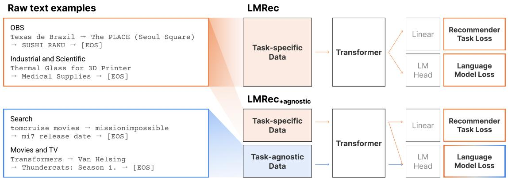
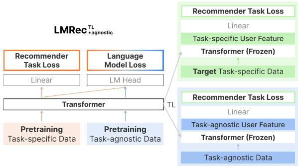
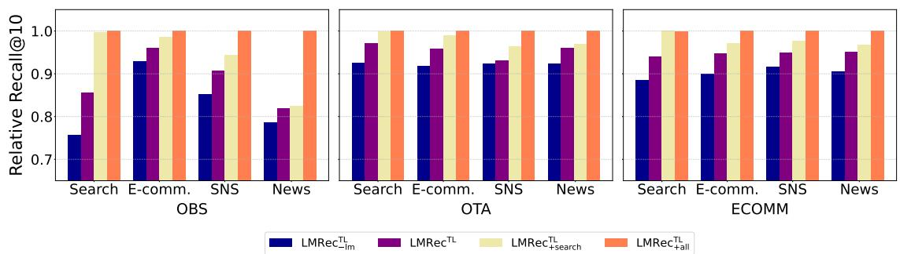
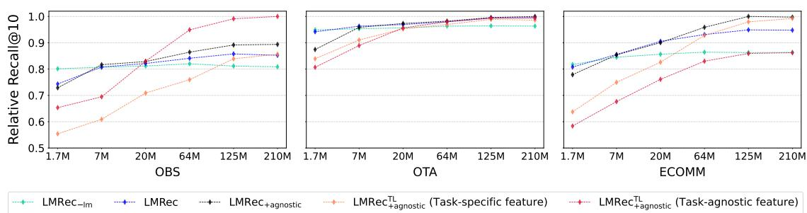
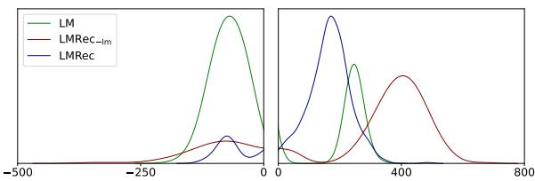

# Pivotal Role of Language Modeling in Recommender Systems: Enriching Task-specific and Task-agnostic Representation Learning

Kyuyong Shin†‡§ Hanock Kwak†§ Wonjae Kim‡ Jisu Jeong†‡ Seungjae Jung† Kyung-Min Kim†‡ Jung-Woo Ha‡ Sang-Woo Lee‡

NAVER† NAVER AI Lab‡

## Abstract

Recent studies have proposed unified user modeling frameworks that leverage user behavior data from various applications. Many of them benefit from utilizing users’ behavior sequences as plain texts, representing rich information in any domain or system without losing generality. Hence, a question arises: Can lan guage modeling for user history corpus help improve recommender systems? While its versatile usability has been widely investigated in many domains, its applications to recommender systems still remain underexplored. We show that language modeling applied directly to taskspecific user histories achieves excellent results on diverse recommendation tasks. Also, leveraging additional task-agnostic user histories delivers significant performance benefits. We further demonstrate that our approach can provide promising transfer learning capabilities for a broad spectrum of real-world recommender systems, even on unseen domains and services.

## 1 Introduction

Recent advances in user modeling have focused on constructing unified user models to be directly adapted to diverse applications. Many of them leverage natural language or plain text data, which enables general-purpose applicability among various domains and systems (Qiu et al., 2021; Gu et al., 2021; Geng et al., 2022; Cui et al., 2022; Hou et al., 2022; Shin et al., 2023). These strategies pave a much more efficient way for service owners to quickly adapt to various task scenarios by tuning one single model, bringing performance improvement across whole systems in parallel.

Based on the recent explosions of sequence prediction models in many domains (Chen et al., 2020; Brown et al., 2020; Ramesh et al., 2021; Chen et al., 2021; Borsos et al., 2022), it is natural to ask whether recommender systems can benefit from representation trained by token sequence prediction, i.e., language modeling. Moreover, several works have provided deep insights into why and how language models help address downstream classification tasks (Gururangan et al., 2020; Saunshi et al., 2021; Wei et al., 2021; Karouzos et al., 2021; Krishna et al., 2022).

Some recent studies confirm that continued pretraining of language model on few task-specific data drawn from the target task distribution, or data similar to a target domain can provide significant benefits to solve downstream classification tasks (Gururangan et al., 2020; Lee et al., 2020; Karouzos et al., 2021). Interestingly, Krishna et al. (2022) go further and validate that language models trained from scratch on task-specific or task-agnostic data1—data from other downstream tasks—can rival standard webtext language models. Another line of research provides mathematical explanations of how language model pretraining can improve performances on downstream tasks (Saunshi et al., 2021; Wei et al., 2021). More specifically, Saunshi et al. (2021) reformulate classification tasks as sentence completion tasks, thus demonstrating that linear classification using output features from fixed GPT-2 (Radford et al., 2019), i.e., no finetuning, also guarantees to solve sentence classification tasks.

Motivated by these works, we introduce a new method called LMRec, which jointly trains Language Model and Recommendation task objectives from user behavior histories transformed as plain text format. As illustrated in Figure 1, our approach is conceptually simple but practically effective. We first investigate if the recommender system jointly trained with the language modeling objective on task-specific data can enrich the user/item representations, thus providing better generalization even for unseen downstream tasks (Table 4 and 7). We then further verify that additional taskagnostic data can help across the various recommendation tasks, especially when using the taskagnostic data as a user feature (Figure 3). As a result, our methods significantly outperform all the baselines on all tasks, including three public benchmarks and three real-world datasets from different application service domains, and online A/B experiments. Moreover, the pretrained LMRec shows a promising ability to perform downstream transfers flexibly with simple feature-based transfer learning. We also explore several aspects of how the language modeling regime affects the model quality under various conditions, including transfer learning, corpus ablation, and model sizes.

  
Figure 1: Schematic overview of LMRec. Task-specific data refers to the user history data of the target recommendation task. Task-agnostic data is collected from other services that do not overlap with target tasks. (Left) We append [EOS] token at the end of every input and use the last layer hidden vector of [EOS] token as a user feature. (Right) The transformer layers are shared across language modeling and recommendation tasks, while the top linear layers are not. LMRec+agnostic incorporates additional task-agnostic data, which delivers large performance benefits.

Our major findings are as follows:

Jointly training language modeling and recommendation task objectives improve recommender systems. Language modeling on the user history can produce rich user/item representations for diverse applications. These results are consistent with the effect of task-adaptive pretraining in the previous research (Gururangan et al., 2020; Karouzos et al., 2021; Krishna et al., 2022). Furthermore, our approach also boosts the transfer learning capability of the recommendation model. Extensive experimental results show the efficacy of our approach compared to training without language model objectives (Table 4 and 7).

Language modeling on task-agnostic data provides strong results on user representation learning. Consistent with prior work (Gururangan et al., 2020; Krishna et al., 2022), language modeling on additional task-agnostic data alleviates overfitting to a specific history corpus and benefits the learning of robust text representations (Table 4 and 7). We explore how language model pretraining on the diverse task-agnostic data affects transfer learning performances, by comparing with models pretrained on different domain corpora (Figure 3). Virtues of more user data. Recent studies argue that increasing information on user data should be treated as a top priority for improving recommendation performances (Shin et al., 2021; Ardalani et al., 2022). We collect additional user data matched with downstream task users based on user IDs and incorporate them as an additional user feature. Table 7 verifies the data scaling strategy has shown to be beneficial to our models.

## 2 Approach

## 2.1 Language Models Help with Classification Tasks

The empirical and theoretical analyses from the prior work imply that the learned features from the language models trained with appropriate behavior corpus could help predict user and item interactions in recommender systems (Gururangan et al., 2020; Saunshi et al., 2021; Krishna et al., 2022). It is also consistent with the results in Table 1 that language model pretraining with appropriate corpus— related to the downstream task rather than other corpora such as webtext—leads to performance improvement. It is worth mentioning that linear probe results of $\mathbf { L M _ { \mathrm { { a g n o s t i c } } } }$ can achieve that of $\mathbf { L M } _ { \mathrm { w e b t e x t } }$ performance, although task-agnostic data are in a much smaller-scale than webtext data. This result strongly motivates our research.

<table><tr><td rowspan="2">Method</td><td colspan="2">OBS</td><td colspan="2">Scientific</td></tr><tr><td>Recall@10</td><td>NDCG@10</td><td>Recall@10</td><td>NDCG@10</td></tr><tr><td> $\mathrm { L M } _ { \mathrm { w e b t e x t } }$ </td><td>0.3135</td><td>0.1766</td><td>0.0335</td><td>0.0131</td></tr><tr><td> $\mathbf { L M _ { \mathrm { { a g n o s t i c } } } }$ </td><td>0.3142</td><td>0.1747</td><td>0.0327</td><td>0.0126</td></tr><tr><td> $\mathbf { L M } _ { \mathrm { s p e c i f i c } } ^ { \mathrm { ~ \tiny ~ \ J ~ } }$ </td><td>0.3769</td><td>0.2136</td><td>0.0417</td><td>0.0194</td></tr></table>

Table 1: Linear probe results on downstream recommendation tasks of language model (LM) embeddings pretrained with different source corpora. We pretrain LMs on three datasets: generic webtext corpora $\mathbf { ( L M _ { w e b t e x t } ) }$ , task-agnostic user history $\mathbf { \Gamma } ( \mathrm { L M _ { a g n o s t i c } } )$ and task-specific user data $( \mathrm { L M } _ { \mathrm { s p e c i f i c } } )$

Given a sequence of text tokens of user history, $u = \{ h _ { 1 } , . . . , h _ { n } \}$ and item text tokens $i =$ $\{ g _ { 1 } , . . . , g _ { m } \}$ , the language model objective $L _ { 1 }$ is to maximize the following negative log-likelihood:

$$
L _ { 1 } = - \sum _ { j = 1 } \log P ( h _ { j } | h _ { j - k } , \ldots , h _ { j - 1 } ; { \mathcal { M } } ) ,\tag{1}
$$

where k is the context size, and the conditional probability P is modeled using language model . Then for the downstream tasks, user and item representations $z _ { u } , z _ { i } \in R ^ { d }$ are computed as follows:

$$
z _ { u } = \mathcal { M } ( h _ { \mathsf { E 0 S } } | u )\tag{2}
$$

$$
\begin{array} { r } { z _ { i } = \mathcal { M } ( g _ { \mathsf { E 0 S } } | i ) , } \end{array}\tag{3}
$$

where EOS denotes the end of the history token. We use a vector that corresponds to [EOS] token at the last layer as a feature (Neelakantan et al., 2022). The downstream recommendation task loss, $L _ { 2 }$ , of each user-item pair is defined as:

$$
p _ { u , i } = \frac { 1 } { 1 + \exp ( - \big < W _ { u } z _ { u } , W _ { i } z _ { i } \big > ) } ,\tag{4}
$$

$$
L _ { 2 } = - y \mathrm { l o g } p _ { u , i } - ( 1 - y ) \mathrm { l o g } ( 1 - p _ { u , i } ) ,\tag{5}
$$

where $y \in \{ 0 , 1 \}$ is the label denoting whether the user interacted with an item or not. We use $\langle \cdot , \cdot \rangle$ for the dot product. The weight matrices $\dot { W } _ { u } , \dot { W } _ { i } \in R ^ { d \times d }$ linearly transform the user and item representations, respectively.

Several works have highlighted that jointly optimizing language modeling during finetuning benefits avoiding catastrophic forgetting (Chronopoulou et al., 2019; Karouzos et al., 2021). Inspired by the merits of this strategy, we adopt a joint optimization:

<table><tr><td rowspan="2">Method</td><td colspan="2">OBS</td><td colspan="2">Scientific</td></tr><tr><td>Recall@10</td><td>NDCG@10</td><td>Recall@10</td><td>NDCG@10</td></tr><tr><td>SelfPretrain</td><td>0.4742</td><td>0.2796</td><td>0.1068</td><td>0.0473</td></tr><tr><td>LMRec</td><td>0.4867</td><td>0.2940</td><td>0.1264</td><td>0.0695</td></tr></table>

Table 2: The SelfPretrain model is first pretrained with task-specific data and then finetuned to downstream tasks, while LMRec is jointly training language modeling and recommendation objectives.

$$
L = L _ { 1 } + \lambda L _ { 2 } ,\tag{6}
$$

where $L$ is the final joint training loss. We impose weight λ on $L _ { 2 }$ loss to prevent the overfitting of recommendation tasks. As illustrated in Figure 1, a model that optimizes Equation (6) is denoted as $\mathbf { \hat { \mu } } ^ { 6 6 } \mathbf { L M R e c } ^ { 3 , }$ . The model trained without the language model objective $( L _ { 1 } )$ is $\bf \tilde { \Sigma } ^ { \mathrm { 6 6 } } L M R e c _ { \mathrm { - l m } } \tilde { \Sigma } ^ { \mathrm { 9 } }$ . The performance comparison between the pretrain-thenfinetune model and our approach are presented in Table 2.

## 2.2 Enriching Task-specific and Task-agnostic Representation

Leveraging task-agnostic data. Optimizing performances solely on task-specific data would restrict the potential of a unified framework. Therefore, a recent trend in user modeling research is to leverage large quantities of pretraining (or additional) data that are not directly related to the target task (Hou et al., 2022; Shin et al., 2023).

To this end, we introduce $\bf \tilde { \Sigma } ^ { \mathrm { < } } L M R e c _ { + a g n o s t i c } \tilde { \Sigma } ^ { \mathrm { > } } ,$ which utilizes additional task-agnostic data for language model objectives. This approach increases the generality by mitigating overfitting to a specific history corpus. Consequently, it boosts the learning of robust text representations, thus making $\mathrm { L M R e c _ { + a g n o s t i c } }$ universal across various tasks. As a result, additional task-agnostic data further boost the performance of our default LMRec model, which already produces state-of-the-art results in all tasks and metrics.

Transfer learning. There are several difficulties in applying a unified model to real-world applications: (1) target applications are commonly unknown or undefined during pretraining, (2) user ID cannot be matched across different companies, (3) large-scale recommender systems usually contain millions of users and items, thus it is computationally expensive to finetune the large models to numerous applications directly. To overcome these obstacles, we propose a simple transfer learning framework that can easily and quickly adapt the model to diverse applications. As visualized in Figure 2, we simply plug the target task-specific inputs into the pretrained LMRec and compute user/item embeddings to perform a linear probe. We add superscript to the model as $\bf { \ddot { \tau } L M R e c } ^ { T L , \bf { \vec { \tau } } }$ for the transfer learning framework. The $\mathrm { L M R e c ^ { T L } }$ model jointly pretrains multiple tasks, excluding the target downstream task. The final loss to pretrain is as follows:

  
Figure 2: Overall pretraining and feature-based transfer learning procedures of $\mathbf { \mathcal { A } R e c _ { + a g n o s t i c } ^ { T L } }$ model. The two types of inputs, i.e., “Target Task-specific Data” and “Task-agnostic Data,” refer to the user history for producing user features. Only the linear layer for the downstream task is trained, while the pretrained transformer parameters are frozen. TL denotes transfer learning.

$$
L = \sum _ { t \in \mathcal { T } _ { s } , \mathcal { T } _ { a } } L _ { 1 } ^ { t } + \lambda \sum _ { t \in \mathcal { T } _ { s } } L _ { 2 } ^ { t } ,\tag{7}
$$

where $\mathcal { T } _ { s }$ denotes a set of pretraining recommendation tasks, and $\mathcal { T } _ { a }$ for additional task-agnostic data. Note that linear layers of pretraining and featurebased transfer learning are separate modules.

Task-agnostic user features. Leveraging crossdomain data of users for improving recommender systems has been widely discussed (Man et al., 2017; Yuan et al., 2019; Zhu et al., 2022; Shin et al., 2023). These strategies assume that the underlying user preference in the source and the target domains can be related, and thus learning a common user semantic enhances the recommender system. Hence, we utilize additional task-agnostic data, obtained from application services whose user IDs are shared in a company level, as a user feature for target downstream tasks. The difference between task-specific and task-agnostic data in Figure 2 is only which user features are used for transfer learning. For example, if the target downstream task is ECOMM, models are first pretrained with OBS and OTA, and then use task-specific data of ECOMM to produce task-specific user features. For leveraging the task-agnostic user feature, the pretrained model extracts user features from task-agnostic data, such as Search and News. Components other than user features, such as the pretrained model, downstream architecture (linear layer), and ground truth interacted items of users, are all the same. We can verify that the transfer learning approach benefits from leveraging additional task-agnostic data as user features, especially when it is recommending for new users (Table 7, 8 and Figure 3).

Appendix A describes the training details of our methods.

## 3 Experiments

## 3.1 Datasets

To make user behavioral corpora, we consider the behavior description as items, i.e., search queries of search logs, news titles of online news click logs, and content titles of social media click logs. As illustrated in Figure 1, we concatenate the behavior logs using the “ ” token. This simple form of a prompt template can have behavior sequences that are very long. Furthermore, separating corpus among multiple services provides flexible transfer learning capabilities by enabling easy proliferation of behaviors and filtering out redundant representation to target applications. We use Byte-level BPE (Wang et al., 2020) to tokenize the textual description of each item in the behavior logs.

Task-specific datasets. We use three in-house datasets in order to assess our approach on various applications and add three public datasets that are predominantly evaluated in recommendation communities. The in-house datasets are built from services of an online booking service (OBS), an online travel agency (OTA), and e-commerce platmform (ECOMM). For public datasets, we select two categories “Industrial and Scientific” (Scientific) and “Prime Pantry” (Pantry) from Amazon review datatsets (Ni et al., 2019) which are two completely different service domains. We further collect “Online Retail”2 dataset from an online retail platform to validate the cross-system transferability of our models.

<table><tr><td rowspan="2">Contents</td><td colspan="4">In-house</td><td colspan="4">Public</td></tr><tr><td>OBS</td><td>OTA</td><td>ECOMM</td><td>Pretraining</td><td>Scientific</td><td>Pantry</td><td>Online Retail</td><td>Pretraining</td></tr><tr><td># of Users</td><td>300,000</td><td>142,051</td><td>72,477</td><td>10,156, 217</td><td>8,442</td><td>13,101</td><td>16,520</td><td>1,361,408</td></tr><tr><td># of Items</td><td>42,453</td><td>2,485</td><td>229,775</td><td>N/A</td><td>4,385</td><td>4,898</td><td>3,469</td><td>446,975</td></tr><tr><td># of Interact.</td><td>495,992</td><td>177,281</td><td>130,859</td><td>94,011,305</td><td>59,427</td><td>126,962</td><td>519,906</td><td>14,029,229</td></tr><tr><td>Avg. history</td><td>1.5</td><td>2.3</td><td>5.5</td><td>128.7</td><td>4.5</td><td>8.5</td><td>25.6</td><td>9.6</td></tr><tr><td>Avg. history tokens</td><td>10.3</td><td>17.1</td><td>116.4</td><td>1,222.7</td><td>212.5</td><td>214.7</td><td>206.6</td><td>347.3</td></tr></table>

Table 3: Statistics of the datasets.

Task-agnostic datasets. We construct sufficiently large-scale task-agnostic behavioral corpora for inhouse datasets. These datasets are collected over two years and from four behavioral corpora, a search engine (Search), e-commerce (E-comm.), social media platform (SNS), and news website (News). As a result, the in-house dataset contains 10 million users and 94 million user history logs, and 12 billion BBPE tokens. Following the experimental setup of UniSRec (Hou et al., 2022) for public benchmarks, we select the five categories “Grocery and Gourmet Food”, “Home and Kitchen”, “CDs and Vinyl”, “Kindle Store”, and “Movies and TV” from Amazon review datasets. These datasets are used as pretraining datasets for pretrain-then-transfer models such as User-BERT (Wu et al., 2022), UniSRec (Hou et al., 2022), M6-Rec (Cui et al., 2022), and CLUE (Shin et al., 2023), while used as additional task-agnostic data for LMRec+agnostic model.

The details of datasets are outlined in Table 3.

## 3.2 Experimental Settings

In-house downstream tasks. The datasets consist of positive pairs (u, i) which means a user u interacted with an item i. The negative pairs are generated through random sampling during training. Evaluation metrics are Recall@k and top-k Normalized Discounted Cumulative Gain (NDCG@k), which are evaluated from ground truth items mixed with 100 randomly sampled negative items. To test the generalizability of user representations, we randomly split the user pool among the training (80%), validation (10%), and test sets (10%).

Public downstream tasks. We filter out users and items with fewer than 5 interactions. Each user’s interaction history was listed chronologically. We use item descriptions such as titles, categories, and brands for item information. The maximum token length of item text is set to 512. Following previous works (Kang and McAuley, 2018; Sun et al., 2019; Hou et al., 2022), we adopt the leaveone-out strategy, i.e., next item recommendation task. The last item, second last item, and other items are used as the test, validation, and training data respectively. The Recall@k and NDCG@k are computed by ranking the ground-truth item among all the other items.

## 3.3 Baselines

We compare our models against six strong baselines. Behavior Sequence Transformer (BST) (Chen et al., 2019) and LightGCN (He et al., 2020) are primarily used baselines in various tasks and domains. To reflect the recent trend of user modeling research, which adopts pretrainthen-transfer strategies, we employ several models from these lines of work. UserBERT (Wu et al., 2022) and UniSRec (Hou et al., 2022) pretrain self-supervision objectives with language embeddings and then finetune the model to downstream tasks. The most comparable unified user models to our methods are M6-Rec (Cui et al., 2022) and CLUE (Shin et al., 2023). These two methods treat user history as plain text and construct a universal encoder that can be adapted to any domain and task. Note that all the pretrain-then-transfer models, excluding CLUE, utilize webtext language models. Please see Appendix B for more details of baselines.

## 4 Results

## 4.1 Performance on Various Tasks

Table 4 presents the efficacy of our LMRec against baselines. Across the six datasets, LMRec trained only with the task-specific data achieves state-ofthe-art performances compared to all the baselines, even though some methods utilize additional task-agnostic data. For the in-house datasets, LM-Rec surpasses best performing baseline models by over 1.6 3.2% in Recall@10. In the public datasets, LMRec shows around 5% average improvements compared to baselines. Since other pretrain-then-transfer models leverage additional data, we introduce LMRec+agnostic, a more robust representation learning method using additional corpus for language modeling. $\mathbf { L M R e c _ { + a g n o s t i c } }$ remarkably outperforms the other models in all tasks by a significant margin (see improvement in Table 4). We further conduct an ablation study on combining task-specific and task-agnostic corpus when the computation resources are limited. Table 5 presents the results. LMRec+agnostic (0% : 100%), i.e., language modeling on task-agnostic data only, outperforms $\mathrm { L M R e c _ { - l m } }$ in Table 4, but shows the worst performance in Table 5. Increasing the ratio of used task-specific data delivers performance benefits to some point (70%). However, leveraging task-specific data solely finally decreases the performance.

<table><tr><td rowspan="2">Downstream tasks</td><td rowspan="2">Metrics</td><td colspan="4">Only trained on task-specific data</td><td colspan="5">Use additional task-agnostic data</td><td rowspan="2">Improv.</td></tr><tr><td>BST</td><td>LightGCN</td><td> $\mathrm { L M R e c . } _ { \mathrm { l m } }$ </td><td>LMRec</td><td>UserBERT</td><td>UniSRec</td><td>CLUE</td><td>M6Rec</td><td> $\mathrm { L M R e c _ { + a g n o s t i c } }$ </td></tr><tr><td rowspan="2">OBS</td><td>Recall@10</td><td>0.4675</td><td>0.4628</td><td>0.4654</td><td>0.4867</td><td>0.4600</td><td>0.4745</td><td>0.4580</td><td>0.4615</td><td>0.5060</td><td>+6.6%</td></tr><tr><td>NDCG@10</td><td>0.2780</td><td>0.2759</td><td>0.2762</td><td>0.2940</td><td>0.2738</td><td>0.2825</td><td>0.2691</td><td>0.2754</td><td>0.3048</td><td>+7.9%</td></tr><tr><td rowspan="2">OTA</td><td>Recall@10</td><td>0.7160</td><td>0.7277</td><td>0.7190</td><td>0.7428</td><td>0.7199</td><td>0.7186</td><td>0.7225</td><td>0.7314</td><td>0.7458</td><td>+2.0%</td></tr><tr><td>NDCG@10</td><td>0.4092</td><td>0.4235</td><td>0.4151</td><td>0.4407</td><td>0.4145</td><td>0.4144</td><td>0.4219</td><td>0.4306</td><td>0.4431</td><td>+2.9%</td></tr><tr><td rowspan="2">ECOMM</td><td>Recall@10</td><td>0.6611</td><td>0.5378</td><td>0.6667</td><td>0.7322</td><td>0.6934</td><td>0.6725</td><td>0.5500</td><td>0.7093</td><td>0.7715</td><td>+8.8%</td></tr><tr><td>NDCG@10</td><td>0.4846</td><td>0.4290</td><td>0.5081</td><td>0.5637</td><td>0.5202</td><td>0.5079</td><td>0.4282</td><td>0.5090</td><td>0.6009</td><td>+15.5%</td></tr><tr><td rowspan="2">Scientific</td><td>Recall@10</td><td>0.0625</td><td>0.0540</td><td>0.0951</td><td>0.1264</td><td>0.1055</td><td>0.1188</td><td>0.0894</td><td>0.0945</td><td>0.1283</td><td>+8.0%</td></tr><tr><td>NDCG@10</td><td>0.0323</td><td>0.0276</td><td>0.0428</td><td>0.0695</td><td>0.0457</td><td>0.0641</td><td>0.0393</td><td>0.0413</td><td>0.0701</td><td>+9.4%</td></tr><tr><td rowspan="2">Pantry</td><td>Recall@10</td><td>0.0388</td><td>0.0402</td><td>0.0626</td><td>0.0692</td><td>0.0630</td><td>0.0636</td><td>0.0602</td><td>0.0645</td><td>0.0683</td><td>+7.3%</td></tr><tr><td>NDCG@10</td><td>0.0203</td><td>0.0195</td><td>0.0298</td><td>0.0343</td><td>0.0312</td><td>0.0306</td><td>0.0288</td><td>0.0324</td><td>0.0330</td><td>+5.7%</td></tr><tr><td rowspan="2">Online Retail</td><td>Recall@10</td><td>0.1460</td><td>0.1322</td><td>0.1373</td><td>0.1475</td><td>0.1438</td><td>0.1449</td><td>0.1258</td><td>0.1458</td><td>0.1502</td><td>+3.0%</td></tr><tr><td>NDCG@10</td><td>0.0685</td><td>0.0608</td><td>0.0659</td><td>0.0718</td><td>0.0654</td><td>0.0677</td><td>0.0585</td><td>0.0702</td><td>0.0732</td><td>+4.3%</td></tr></table>

Table 4: Results on the various downstream tasks from in-house and public datasets. The best and second-best results are denoted in bold and underlined, respectively. “Improv.” indicates the relative improvement of our methods over the best baselines.

<table><tr><td rowspan="2">Method</td><td colspan="2">OBS</td></tr><tr><td>Recall@10</td><td>NDCG@10</td></tr><tr><td>LMRec+agnostic (0% : 100%)</td><td>0.4703</td><td>0.2805</td></tr><tr><td>LMRec+agnostic (30% : 70%)</td><td>0.4811</td><td>0.2932</td></tr><tr><td>LMRec+agnostic (50% : 50%)</td><td>0.4905</td><td>0.2991</td></tr><tr><td>LMRec+agnostic (70% : 30%)</td><td>0.4917</td><td>0.3003</td></tr><tr><td>LMRec (100%:0%)</td><td>0.4867</td><td>0.2940</td></tr></table>

Table 5: Performance on the OBS task while varying the ratio of the leveraged task-specific and taskagnostic data for language modeling. We set LM-REC’s task-specific data size as 100% and vary the task-specific and task-agnostic data ratio.
<table><tr><td>Models</td><td>Inputs</td><td></td><td>Speedup Parameters</td></tr><tr><td>Transformer†</td><td>User history logs</td><td>1</td><td>125M</td></tr><tr><td>LightGCN</td><td>User history logs</td><td>×34</td><td>2M</td></tr><tr><td> $\mathrm { L } \mathrm { { \dot { M } R e c } ^ { T L } }$ </td><td>Pretrained user repr.</td><td>×157</td><td>1.2M</td></tr></table>

† All the models, excluding LightGCN and CLUE.  
Table 6: Inference time and trainable weight comparison of the downstream models measured from the OBS task. We calculate the inference time of a single batch on A100 GPU.

Previous research provides a theoretical analysis of why language model pretraining guarantees effective representation learning for downstream tasks (Saunshi et al., 2021; Wei et al., 2021). The additional analysis in Appendix C may support these results.

## 4.2 Linear Probe

We show the effectiveness of the language model pretraining then feature-based transfer strategy (Figure 2) across all tasks. Our approach empirically demonstrates the flexible generalizability of the pretrained features. Note that all the baselines, excluding CLUE, are pretrain-then-finetune methods, and the downstream computational cost (Table 6) is much more expensive than the linear probe.

As shown in Table 7, the linear probe result of $\mathrm { L M R e c _ { \mathrm { - l m } } ^ { \mathrm { T L } } }$ that are trained only on recommendation tasks shows worst transfer learning performances. Unsurprisingly, a model trained without language modeling cannot guarantee generalizability to other language corpora. It is worth mentioning that LMRecTL, which jointly trains language model and recommendation tasks objectives, shows decent transfer learning capability for downstream tasks. This result provides that incorporating language model pretraining with recommender system profits strong adaptability and generality compared to the recommendation model, even on the linear probe, i.e., not trained on downstream tasks directly. As previous research (Gururangan et al., 2020; Krishna et al., 2022) confirmed, it is reasonable to believe that leveraging large quantities of additional data for language model pretraining is strictly more powerful than using small task-specific data. $\mathbf { L M R e c } _ { + \mathrm { a g n o s t i c } } ^ { \mathrm { T L } }$ shows enhanced transferability on linear probe. Comparing results among Table 4, 6, and 7, we can see that $\mathrm { L M R e c _ { + a g n o s t i c } ^ { T L } }$ outperforms other baselines with much fast and easy adaptation.

<table><tr><td rowspan="2">Downstream tasks</td><td rowspan="2">Metrics</td><td colspan="3">Task-specific feature</td><td colspan="5">Task-agnostic feature</td><td colspan="4">Combine</td></tr><tr><td>LMRecT</td><td> $\mathrm { L M R e c } ^ { \mathrm { T L } }$ </td><td> $\mathrm { L M R e c } _ { + \mathrm { a g n . } } ^ { \mathrm { T L } }$ </td><td>UniSRec</td><td>CLUE</td><td>M6Rec</td><td> $\operatorname { L M R e c } ^ { \mathrm { { T L } } }$ </td><td> $\mathrm { L M R e c } _ { + \mathrm { a g n . } } ^ { \mathrm { T L } }$ </td><td>UniSRec</td><td>CLUE M6Rec</td><td></td><td> $\mathbf { L M R e c } _ { + \mathrm { a g n } } ^ { \mathrm { T L } }$ </td></tr><tr><td rowspan="2">OBS</td><td>Recall@10</td><td>0.3661</td><td>0.4687</td><td>0.4861</td><td>0.5133</td><td>0.5112</td><td>0.5451</td><td>0.4837</td><td>0.5675</td><td>0.5397</td><td></td><td>0.54160.5540</td><td>0.5952</td></tr><tr><td>NDCG@10</td><td>0.2039</td><td>0.2792</td><td>0.2886</td><td>0.3139</td><td>0.3204</td><td>0.3357</td><td>0.2874</td><td>0.3514</td><td>0.3305</td><td>0.3372</td><td>0.3391</td><td>0.3766</td></tr><tr><td rowspan="2">OTA</td><td>Recall@10</td><td>0.5531</td><td>0.7196</td><td>0.7375</td><td>0.7121</td><td></td><td>0.74080.7285</td><td>0.7231</td><td>0.7410</td><td>0.7201</td><td></td><td>0.74360.7324</td><td>0.7521</td></tr><tr><td>NDCG@10</td><td>0.3014</td><td>0.4119</td><td>0.4368</td><td>0.4103</td><td>0.4414</td><td>0.4288</td><td>0.4185</td><td>0.4421</td><td>0.4166</td><td>0.4445</td><td>0.4297</td><td>0.4579</td></tr><tr><td rowspan="2">ECOMM</td><td>Recall@10</td><td>0.3202</td><td>0.7134</td><td>0.7655</td><td>0.6068</td><td>0.5763</td><td>0.6233</td><td>0.6273</td><td>0.6653</td><td>0.6882</td><td>0.6370</td><td>0.7204</td><td>0.7803</td></tr><tr><td>NDCG@10</td><td>0.3547</td><td>0.5355</td><td>0.5878</td><td>0.4748</td><td>0.4558</td><td>0.4810</td><td>0.4485</td><td>0.4969</td><td>0.5204</td><td>0.4838</td><td>0.5122</td><td>0.6117</td></tr></table>

Table 7: Task-agnostic transfer learning results on in-house datasets. All the models are pretrained with datasets that are not the target task. For example, the models are first pretrained with OBS and OTA and then transferred to the ECOMM (target task). The “Task-specific feature” stand for the models that use task-specific user data to produce user embedding, while the “Task-agnostic feature” stands for user embedding from task-agnostic data, including Search, E-commerce, SNS, and News. The combination of them is denoted as "Combine".

<table><tr><td rowspan="2">Method</td><td colspan="2">CTR</td><td colspan="2">GMV</td></tr><tr><td>New</td><td>Total</td><td>New</td><td>Total</td></tr><tr><td>GNN</td><td>1.00</td><td>1.00</td><td>1.00</td><td>1.00</td></tr><tr><td>CLUE</td><td>×1.52</td><td>×1.14</td><td>×1.08</td><td>×1.02</td></tr><tr><td> $\mathbf { L M R e c } _ { + \mathrm { a g n o s t i c } } ^ { \mathrm { T L } }$ </td><td>×1.76</td><td>×1.24</td><td>×1.12</td><td>×1.04</td></tr></table>

Table 8: A Click Through Rate (CTR) and Gross Merchandise Value (GMV) gain on the online product collection task. The user group ‘new’ corresponds to users with no recorded behavior on the service for the past month. We set the GNN model gain as the baseline for the CTR and GMV calculation.

## 4.3 Virtues of More User Data

A line of research that studies scaling law in recommender systems argues that parameter growth will not always offer performance improvement and has low return-on-investment (ROI) in resource efficiencies (Ardalani et al., 2022; Shin et al., 2023). Hence, the data scaling scheme should be treated as a top priority for improving model performances. To verify the efficacy of the data scaling approach, we evaluate our model on downstream tasks by using task-agnostic data as user feature. Results are presented in Table 7-(Taskagnostic feature/Combine). We simply concatenate task-specific and task-agnostic data to use as inputs for the Combine setup. Most baselines are not adequately reflecting the possibility of using additional user features due to their pretraining methods, but $\mathrm { L M R e c _ { + a g n o s t i c } ^ { T L } }$ properly considers the potential of using more user data. It is an enormous benefit to the models seeing that $\mathbf { L M R e c _ { + a g n o s t i c } ^ { T L } }$ (Combine) shows outstanding performance by combining all the user data. Interestingly, $\mathrm { L M R e c } ^ { \mathrm { T I } }$ , which is trained without task-agnostic data, also achieves state-of-the-art or comparable performances to the baseline models. This result highlights the efficacy of our approach.

We conducted an online A/B experiment for a product collection recommendation task (see Appendix D for more details) on our in-house ecommerce platform for two weeks in August 2022. Table 8 shows the consistent superiority of our method online. For user groups ‘new’, the user representation by $\mathbf { L M R e c _ { + a g n o s t i c } ^ { T L } }$ significantly improves CTR and GMV compared to GNN (Jeong et al., 2020). We conjecture that it may benefit from additional user data from other services, thus contributing to users with no recorded behavior.

## 4.4 Effect of Pretraining Behavior Corpora for Transfer Learning

We perform ablation studies on the relations between pretraining corpora and using task-agnostic data as user features. As shown in Figure 3, the model pretrained with the specific corpus provides general and robust representations of that corpus even on unseen tasks. Interestingly, tailoring a language model to diverse corpora may bridge the gap between pretraining and taskagnostic corpus domains. For example, even though $\mathbf { L M R e c } _ { + \mathrm { s e a r c h } } ^ { \mathrm { T L } }$ leverages only Search corpus for language model pretraining, it consistently outperforms $\mathrm { L M R e c _ { \mathrm { - l m } } ^ { \mathrm { T L } } }$ and $\mathrm { L M R e c ^ { T L } }$ on all the downstream tasks with other task-agnostic features.

  
Figure 3: An ablation study on the pretrained user behavior corpora by comparing four types of setup; pretraining on all task-agnostic corpora $( \mathrm { { L M R e c } _ { + a l l } ^ { \mathrm { { T L } } } ) }$ , search corpus $( \mathrm { L M R e c } _ { + \mathrm { s e a r c h } } ^ { \mathrm { \tiny { \mathrm { T L } } } } ) .$ , task-specific corpus $( \mathrm { L M R e c } ^ { \mathrm { \bar { T } L } } )$ , and training without language model objectives $\mathrm { \ddot { ( L M R e c _ { \mathrm { - l m } } ^ { T L } ) } }$ , i.e., train recommendation tasks only. For each pretraining setup, we perform a linear probe on the representation of each task-agnostic user data (x-axis). Linear probe results are normalized across pretrained models for each task-agnostic data. Pretraining protocol follows that of Table 7.

  
Figure 4: Performance on the downstream tasks according to the size of model parameters ranging from 1.7 million to 210 million. The Recall@10 is normalized across models for each task.

As it can be seen in Figure 3, the performance of $\mathrm { L M R e c _ { \mathrm { - l m } } ^ { \mathrm { T L } } }$ in OBS task is relatively low compared to other tasks. It is due to the strong contribution of task-agnostic features (Table 7 and Figure 4) for the OBS task. In other words, when the taskagnostic features are well-transferable to the target downstream tasks, the performance differences between not pretrained $\mathrm { ( L M R e c _ { \mathrm { - l m } } ^ { \mathrm { T L } } ) }$ and the rest can be substantial.

## 4.5 Effect of Model Size

Many recent reports in NLP and computer vision have empirically demonstrated the existence of a scaling law, where performance scales strongly with model capacity (Brown et al., 2020; Kaplan et al., 2020; Zhai et al., 2021; Bahri et al., 2021). Recently, Shin et al. (2023) found the power-law learning curve as a function of model size in recommender systems. Figure 4 shows that scaling up the model leads to a strict performance improvement on the downstream tasks, consistent with the results in the prior works. However, we can also find that models’ performances have an upper limit. It is in harmony with the trend in Ardalani et al. (2022) that the recommendation performance follows a power law plus a constant relationship to the model size, which is an irreducible error on our side.

Note that the performances of $\mathrm { L M R e c _ { \mathrm { - l m } } ^ { \mathrm { T L } } }$ do not vary according to the model sizes. We conjecture that the model trained without language modeling has no benefits from high model complexity, as its learning capacity is naturally limited.

## 5 Related Work

Any model that trains a text-based user model to adapt to unseen domains/systems can be viewed as prior work of our research. This line of work has been recently explored since learning text representation has been rapidly developed in the decade. In this context, Qiu et al. (2021) and Gu et al. (2021) are the earliest work we are aware of. They train the model through critical word matching in user logs and then finetune models to the downstream tasks. First, the word (item) embeddings are precomputed using pretrained language models (PLMs). The sequence of item embeddings is then passed to the encoder to produce user representations. Recently, some researchers propose to use behavior history as plain text data (Geng et al., 2022; Cui et al., 2022; Hou et al., 2022; Shin et al., 2023). Hou et al. (2022) and Shin et al. (2023) introduce a contrastive learning framework on multiple service domains, and perform transfer learning across various downstream tasks. Another line of work (Geng et al., 2022; Cui et al., 2022) tries to construct personalized prompts for building versatile framework, i.e., “Here is the history of {gender} {age}: {history from all services}, The user is now recommended a {item}”. This approach profits from the methods that utilize language models such as GPT-2 (Radford et al., 2019), T5 (Raffel et al., 2020), and M6 (Lin et al., 2021). Their PLM-based approach can be generalized to various applications, with the ability to perform zero-shot learning. Shin et al. (2023) is the only work that trained the whole encoder from scratch rather than using PLMs. We refer readers to Liu et al. (2023) and Yuan et al. (2023) for an overview of this line of work.

A related idea to our work is the training language model on task-specific or task-agnostic corpora. It has been shown to be beneficial in a variety of works (Chronopoulou et al., 2019; Gururangan et al., 2020; Lee et al., 2020; Karouzos et al., 2021; Krishna et al., 2022). Gururangan et al. (2020) continue pretraining of LM on task-specific data and show it can improve the downstream performances of standard webtext language models. Krishna et al. (2022) point out that the effect of pretraining on standard webtext data may have been overestimated. They show that models trained only on task-specific data comparably perform to existing webtext language models. On the one hand, a line of research jointly trains language models on taskspecific data during finetuning to avoid catastrophic forgetting (Chronopoulou et al., 2019; Karouzos et al., 2021). Some of the works above also investigate if the models pretrained on task-agnostic data can be effective for downstream tasks. Gururangan et al. (2020) and Lee et al. (2020) show domain-adaptive pretraining further improves the performance of pretrained language models. Recently, Krishna et al. (2022) have observed that pretraining on task-agnostic data can provide a significant advantage compared to standard webtext data. These findings give huge insight into our

research.

Note that our work aims at extending the potential of language modeling that has been successfully used for diverse applications to recommender systems.

## 6 Conclusion

Recent works have built text-based user models and demonstrated that the rich nature of text information in any domain or system could be a valuable foundation for user modeling. Our primary contribution is jointly optimizing the language modeling and recommendation task objectives and successfully tackling a broad spectrum of diverse recommendation tasks, including transfer learning for unseen domains and systems. Overall, our analysis sheds remarkable insights on user representation learning through user behavioral corpora.

## Considerations and Limitations

LMRec is trained on user behavior text data that are collected from diverse service applications. These datasets are preprocessed to users’ behavior sequences as detailed in Figure 1 and Section 3.1. However, in order to improve the quality of user representations, choosing the item information differently for each application may improve the effectiveness. As such, we can consider domain-specific information for each service rather than using general item information. For example, we may leverage additional domain-specific information such as news topics or categories, names of the press agency, and keywords for the news content rather than using only news titles for the News dataset. This issue is a promising extension for practitioners to successfully apply LMRec to real-world applications.

The types of task-agnostic data will largely affect the performance gains of LMRec+agnostic and agnostic data, i.e., Search, E-comm., SNS, and News, and achieve state-of-the-art results. However, this paper does not thoroughly explore their optimized combination or mixing ratio of the corpus due to the heavy computational costs, which most large LM studies suffer from. While prior work shows how the pretraining corpus sources and their combination affect diverse downstream tasks (Raffel et al., 2020; Gururangan et al., 2020; Lee et al., 2020; Krishna et al., 2022; Shin et al., 2022), there still remain limitations in finding the generic relation between downstream performance and corpus properties; measuring the effect of the pretraining corpus on the downstream task is still underexplored. We point out that more careful study is left for future research.

Regarding reproducibility, it is difficult to open our in-house data due to legal issues caused by privacy and user agreement. Therefore, we tried our best to validate the efficacy of our LMRec with the experiments on benchmark datasets in addition to in-house data.

## Acknowledgements

All authors thank NAVER Smart Machine Learning (NSML) platform team (Sung et al., 2017; Kim et al., 2018) for their critical work on the software and hardware infrastructure on which all the experiments were performed.

## References

Newsha Ardalani, Carole-Jean Wu, Zeliang Chen, Bhargav Bhushanam, and Adnan Aziz. 2022. Understanding scaling laws for recommendation models. arXiv preprint arXiv:2208.08489.

Yasaman Bahri, Ethan Dyer, Jared Kaplan, Jaehoon Lee, and Utkarsh Sharma. 2021. Explaining neural scaling laws. arXiv preprint arXiv:2102.06701.

Zalán Borsos, Raphaël Marinier, Damien Vincent, Eugene Kharitonov, Olivier Pietquin, Matt Sharifi, Olivier Teboul, David Grangier, Marco Tagliasacchi, and Neil Zeghidour. 2022. Audiolm: a language modeling approach to audio generation. arXiv preprint arXiv:2209.03143.

Tom Brown, Benjamin Mann, Nick Ryder, Melanie Subbiah, Jared D Kaplan, et al. 2020. Language models are few-shot learners. In Advances in Neural Information Processing Systems, volume 33, pages 1877–1901. Curran Associates, Inc.

Mark Chen, Alec Radford, Rewon Child, Jeffrey Wu, Heewoo Jun, David Luan, and Ilya Sutskever. 2020. Generative pretraining from pixels. In International conference on machine learning, pages 1691–1703. PMLR.

Mark Chen, Jerry Tworek, Heewoo Jun, Qiming Yuan, Henrique Ponde de Oliveira Pinto, Jared Kaplan, Harri Edwards, Yuri Burda, Nicholas Joseph, Greg Brockman, et al. 2021. Evaluating large language models trained on code. arXiv preprint arXiv:2107.03374.

Qiwei Chen, Huan Zhao, et al. 2019. Behavior sequence transformer for e-commerce recommendation in alibaba. In Proceedings of the 1st International Workshop on Deep Learning Practice for High-Dimensional Sparse Data, pages 1–4.

Xiangning Chen, Cho-Jui Hsieh, and Boqing Gong. 2022. When vision transformers outperform resnets without pre-training or strong data augmentations. In International Conference on Learning Representations.

Alexandra Chronopoulou, Christos Baziotis, and Alexandros Potamianos. 2019. An embarrassingly simple approach for transfer learning from pretrained language models. In Proceedings ofthe 2019 Conference ofthe North American Chapter ofthe Associationfor Computational Linguistics: Human Language Technologies, Volume 1 (Long and Short Papers), pages 2089–2095, Minneapolis, Minnesota. Association for Computational Linguistics.

Zeyu Cui, Jianxin Ma, Chang Zhou, Jingren Zhou, and Hongxia Yang. 2022. M6-rec: Generative pretrained language models are open-ended recommender systems. arXiv preprint arXiv:2205.08084.

Pierre Foret, Ariel Kleiner, Hossein Mobahi, and Behnam Neyshabur. 2021. Sharpness-aware minimization for efficiently improving generalization. In International Conference on Learning Representations.

Shijie Geng, Shuchang Liu, Zuohui Fu, Yingqiang Ge, and Yongfeng Zhang. 2022. Recommendation as language processing (rlp): A unified pretrain, personalized prompt & predict paradigm (p5). In Proceedings ofthe 16th ACM Conference on Recommender Systems, RecSys ’22, page 299–315, New York, NY, USA. Association for Computing Machinery.

Jie Gu, Feng Wang, Qinghui Sun, Zhiquan Ye, Xiaoxiao Xu, Jingmin Chen, and Jun Zhang. 2021. Exploiting behavioral consistence for universal user representation. In Proceedings of the AAAI Conference on Artificial Intelligence, volume 35, pages 4063–4071.

Suchin Gururangan, Ana Marasovic, Swabha´ Swayamdipta, Kyle Lo, Iz Beltagy, Doug Downey, and Noah A. Smith. 2020. Don’t stop pretraining: Adapt language models to domains and tasks. In Proceedings of the 58th Annual Meeting of the Association for Computational Linguistics, pages 8342–8360, Online. Association for Computational Linguistics.

Xiangnan He, Kuan Deng, Xiang Wang, Yan Li, Yong-Dong Zhang, and Meng Wang. 2020. Lightgcn: Simplifying and powering graph convolution network for recommendation. In Proceedings of the 43rd International ACM SIGIR Conference on Research and Development in Information Retrieval, SIGIR ’20, page 639–648, New York, NY, USA. Association for Computing Machinery.

Yupeng Hou, Shanlei Mu, Wayne Xin Zhao, Yaliang Li, Bolin Ding, and Ji-Rong Wen. 2022. Towards universal sequence representation learning for recommender systems. In Proceedings of the 28th ACM SIGKDD Conference on Knowledge Discovery and Data Mining, KDD ’22, page 585–593, New York, NY, USA. Association for Computing Machinery.

Jisu Jeong, Jeong-Min Yun, Hongi Keam, et al. 2020. div2vec: Diversity-emphasized node embedding. In ImpactRS Workshop at Recsys 2020.

Wang-Cheng Kang and Julian McAuley. 2018. Selfattentive sequential recommendation. In 2018 IEEE international conference on data mining (ICDM), pages 197–206. IEEE.

Jared Kaplan, Sam McCandlish, Tom Henighan, Tom B Brown, et al. 2020. Scaling laws for neural language models. arXiv preprint arXiv:2001.08361.

Constantinos Karouzos, Georgios Paraskevopoulos, and Alexandros Potamianos. 2021. UDALM: Unsupervised domain adaptation through language modeling. In Proceedings ofthe NAACL-HLT, pages 2579– 2590, Online. Association for Computational Linguistics.

Hanjoo Kim, Minkyu Kim, Dongjoo Seo, Jinwoong Kim, Heungseok Park, Soeun Park, Hyunwoo Jo, KyungHyun Kim, Youngil Yang, Youngkwan Kim, et al. 2018. Nsml: Meet the mlaas platform with a real-world case study. arXiv preprint arXiv:1810.09957.

Thomas N. Kipf and Max Welling. 2017. Semisupervised classification with graph convolutional networks. In International Conference on Learning Representations.

Kundan Krishna, Saurabh Garg, Jeffrey P Bigham, and Zachary C Lipton. 2022. Downstream datasets make surprisingly good pretraining corpora. arXiv preprint arXiv:2209.14389.

Jinhyuk Lee, Wonjin Yoon, Sungdong Kim, Donghyeon Kim, Sunkyu Kim, Chan Ho So, and Jaewoo Kang. 2020. Biobert: a pre-trained biomedical language representation model for biomedical text mining. Bioinformatics, 36(4):1234–1240.

Hao Li, Zheng Xu, Gavin Taylor, Christoph Studer, and Tom Goldstein. 2018. Visualizing the loss landscape of neural nets. Advances in neural information processing systems, 31.

Junyang Lin, Rui Men, An Yang, Chang Zhou, Yichang Zhang, Peng Wang, Jingren Zhou, Jie Tang, and Hongxia Yang. 2021. M6: Multi-modality-to-multimodality multitask mega-transformer for unified pretraining. In Proceedings ofthe 27th ACM SIGKDD Conference on Knowledge Discovery and Data Mining, KDD ’21, page 3251–3261, New York, NY, USA. Association for Computing Machinery.

Peng Liu, Lemei Zhang, and Jon Atle Gulla. 2023. Pretrain, prompt and recommendation: A comprehensive survey of language modelling paradigm adaptations in recommender systems. arXiv preprint arXiv:2302.03735.

Yinhan Liu, Myle Ott, Naman Goyal, Jingfei Du, Mandar Joshi, Danqi Chen, Omer Levy, Mike Lewis, Luke Zettlemoyer, and Veselin Stoyanov. 2019.

Roberta: A robustly optimized bert pretraining approach. arXiv preprint arXiv:1907.11692.

Ilya Loshchilov and Frank Hutter. 2017. Sgdr: Stochastic gradient descent with warm restarts. In International Conference on Learning Representations.

Ilya Loshchilov and Frank Hutter. 2019. Decoupled weight decay regularization. In International Conference on Learning Representations.

Wenhao Lu, Jian Jiao, and Ruofei Zhang. 2020. Twinbert: Distilling knowledge to twin-structured compressed bert models for large-scale retrieval. In Proceedings ofthe 29th ACM International Conference on Information & Knowledge Management, CIKM ’20, page 2645–2652, New York, NY, USA. Association for Computing Machinery.

Tong Man, Huawei Shen, Xiaolong Jin, and Xueqi Cheng. 2017. Cross-domain recommendation: An embedding and mapping approach. In IJCAI, volume 17, pages 2464–2470.

Paulius Micikevicius, Sharan Narang, Jonah Alben, Gregory Diamos, Erich Elsen, David Garcia, Boris Ginsburg, Michael Houston, Oleksii Kuchaiev, Ganesh Venkatesh, and Hao Wu. 2018. Mixed precision training. In International Conference on Learning Representations.

Arvind Neelakantan, Tao Xu, Raul Puri, Alec Radford, Jesse Michael Han, Jerry Tworek, Qiming Yuan, Nikolas Tezak, Jong Wook Kim, Chris Hallacy, et al. 2022. Text and code embeddings by contrastive pretraining. arXiv preprint arXiv:2201.10005.

Jianmo Ni, Jiacheng Li, and Julian McAuley. 2019. Justifying recommendations using distantly-labeled reviews and fine-grained aspects. In Proceedings of the EMNLP-IJCNLP, pages 188–197.

Namuk Park and Songkuk Kim. 2022. How do vision transformers work? In International Conference on Learning Representations.

Razvan Pascanu, Tomas Mikolov, and Yoshua Bengio. 2013. On the difficulty of training recurrent neural networks. In International Conference on Machine Learning.

Adam Paszke, Sam Gross, Francisco Massa, Adam Lerer, James Bradbury, Gregory Chanan, Trevor Killeen, Zeming Lin, Natalia Gimelshein, Luca Antiga, Alban Desmaison, Andreas Kopf, Edward Yang, Zachary DeVito, Martin Raison, Alykhan Tejani, Sasank Chilamkurthy, Benoit Steiner, Lu Fang, Junjie Bai, and Soumith Chintala. 2019. Pytorch: An imperative style, high-performance deep learning library. In Advances in Neural Information Processing Systems, volume 32. Curran Associates, Inc.

F. Pedregosa, G. Varoquaux, A. Gramfort, V. Michel, B. Thirion, O. Grisel, M. Blondel, P. Prettenhofer, R. Weiss, V. Dubourg, J. Vanderplas, A. Passos,

D. Cournapeau, M. Brucher, M. Perrot, and E. Duchesnay. 2011. Scikit-learn: Machine learning in Python. Journal of Machine Learning Research, 12:2825–2830.

Zhaopeng Qiu, Xian Wu, Jingyue Gao, and Wei Fan. 2021. U-bert: Pre-training user representations for improved recommendation. In Proceedings of the AAAI Conference on Artificial Intelligence, volume 35, pages 4320–4327.

Alec Radford, Jeffrey Wu, Rewon Child, David Luan, Dario Amodei, Ilya Sutskever, et al. 2019. Language models are unsupervised multitask learners. OpenAI blog, 1(8):9.

Colin Raffel, Noam Shazeer, Adam Roberts, Katherine Lee, Sharan Narang, Michael Matena, Yanqi Zhou, Wei Li, Peter J Liu, et al. 2020. Exploring the limits of transfer learning with a unified text-to-text transformer. J. Mach. Learn. Res., 21(140):1–67.

Samyam Rajbhandari, Jeff Rasley, Olatunji Ruwase, and Yuxiong He. 2020. Zero: Memory optimizations toward training trillion parameter models. In SC20: International Conferencefor High Performance Computing, Networking, Storage and Analysis, pages 1– 16. IEEE.

Aditya Ramesh, Mikhail Pavlov, Gabriel Goh, Scott Gray, Chelsea Voss, Alec Radford, Mark Chen, and Ilya Sutskever. 2021. Zero-shot text-to-image generation. In International Conference on Machine Learning, pages 8821–8831. PMLR.

Nikunj Saunshi, Sadhika Malladi, and Sanjeev Arora. 2021. A mathematical exploration of why language models help solve downstream tasks. In International Conference on Learning Representations.

Kyuyong Shin, Hanock Kwak, Kyung-Min Kim, Minkyu Kim, Young-Jin Park, Jisu Jeong, and Seungjae Jung. 2021. One4all user representation for recommender systems in e-commerce. arXiv preprint arXiv:2106.00573.

Kyuyong Shin, Hanock Kwak, Su Young Kim, Max Nihlen Ramstrom, Jisu Jeong, Jung-Woo Ha, and Kyung-Min Kim. 2023. Scaling law for recommendation models: Towards general-purpose user representations. Proceedings of the AAAI Conference on Artificial Intelligence.

Seongjin Shin, Sang-Woo Lee, Hwijeen Ahn, Sungdong Kim, HyoungSeok Kim, Boseop Kim, Kyunghyun Cho, Gichang Lee, Woomyoung Park, Jung-Woo Ha, et al. 2022. On the effect of pretraining corpora on in-context learning by a large-scale language model. Proceedings ofthe NAACL-HLT.

Fei Sun, Jun Liu, Jian Wu, Changhua Pei, Xiao Lin, Wenwu Ou, and Peng Jiang. 2019. Bert4rec: Sequential recommendation with bidirectional encoder representations from transformer. In Proceedings of the 28th ACM international conference on information and knowledge management, pages 1441–1450.

Nako Sung, Minkyu Kim, Hyunwoo Jo, Youngil Yang, Jingwoong Kim, Leonard Lausen, Youngkwan Kim, Gayoung Lee, Donghyun Kwak, Jung-Woo Ha, et al. 2017. Nsml: A machine learning platform that enables you to focus on your models. arXiv preprint arXiv:1712.05902.

Ashish Vaswani, Noam Shazeer, Niki Parmar, Jakob Uszkoreit, Llion Jones, Aidan N Gomez, Ł ukasz Kaiser, and Illia Polosukhin. 2017. Attention is all you need. In Advances in Neural Information Processing Systems, volume 30. Curran Associates, Inc.

Changhan Wang, Kyunghyun Cho, and Jiatao Gu. 2020. Neural machine translation with byte-level subwords. In AAAI.

Colin Wei, Sang Michael Xie, and Tengyu Ma. 2021. Why do pretrained language models help in downstream tasks? an analysis of head and prompt tuning. In Advances in Neural Information Processing Systems.

Chuhan Wu, Fangzhao Wu, Tao Qi, and Yongfeng Huang. 2022. Userbert: Pre-training user model with contrastive self-supervision. In Proceedings of the 45th International ACM SIGIR Conference on Research and Development in Information Retrieval, SIGIR ’22, page 2087–2092, New York, NY, USA. Association for Computing Machinery.

Zhewei Yao, Amir Gholami, Kurt Keutzer, and Michael W Mahoney. 2020. Pyhessian: Neural networks through the lens of the hessian. In 2020 IEEE international conference on big data (Big data), pages 581–590. IEEE.

Feng Yuan, Lina Yao, and Boualem Benatallah. 2019. Darec: Deep domain adaptation for cross-domain recommendation via transferring rating patterns. In Proceedings ofthe 28th International Joint Conference on Artificial Intelligence, IJCAI’19, page 4227–4233. AAAI Press.

Zheng Yuan, Fajie Yuan, Yu Song, Youhua Li, Junchen Fu, Fei Yang, Yunzhu Pan, and Yongxin Ni. 2023. Where to go next for recommender systems? idvs. modality-based recommender models revisited. arXiv preprint arXiv:2303.13835.

Xiaohua Zhai, Alexander Kolesnikov, Neil Houlsby, and Lucas Beyer. 2021. Scaling vision transformers. arXiv preprint arXiv:2106.04560.

Yongchun Zhu, Zhenwei Tang, Yudan Liu, Fuzhen Zhuang, Ruobing Xie, Xu Zhang, Leyu Lin, and Qing He. 2022. Personalized transfer of user preferences for cross-domain recommendation. In Proceedings of the Fifteenth ACM International Conference on Web Search and Data Mining, pages 1507–1515.

## A Training Details

We utilize separate data loaders to deal with different batch sizes between language modeling and recommendation tasks. Furthermore, the early stopping strategy is employed based on the validation loss of the recommendation task and patience of 100 steps. We use the AdamW (Loshchilov and Hutter, 2019) with $\beta _ { 1 } ~ = ~ 0 . 9 , ~ \beta _ { 2 } ~ = ~ 0 . 9 8$ $\epsilon = 1 0 ^ { - 6 }$ , and Zero Redundancy Optimizer (Rajbhandari et al., 2020). We update the model using linear warm-up of the learning rate over the first 1% steps, followed by cosine decay (Loshchilov and Hutter, 2017) to decrease the learning rate to 10% of its initial value. The cosine decay is also applied to the λ value. We leverage the automatic mixedprecision (Micikevicius et al., 2018) package in Pytorch (Paszke et al., 2019) to reduce training time and GPU memory usage. Gradient norm clipping (Pascanu et al., 2013) is used with the max norm set to 0.1 to stabilize training. Unless otherwise specified, all results are reported by 125M transformer decoder (Vaswani et al., 2017). All models use a vocabulary size of 50, 258 and a max sequence length of 2, 048. The hyperparameter values for different sizes of LMRec is presented in Table 9. All the results are averaged over the 20 runs.

## B Details of Comparison Models

Behavior Sequence Transformer (BST) (Chen et al., 2019) embeds user history logs as lowdimensional vectors and passes them to the transformer layers to model underlying user preferences.

LightGCN (He et al., 2020) leverages Graph Convolution Network (Kipf and Welling, 2017) for enhancing collaborative filtering. It linearly propagates user and item embeddings of a bipartite interaction graph. The final embedding is computed by the sum of the embeddings propagated at each layer.

UserBERT (Lu et al., 2020) incorporates two self-supervision tasks for pretraining. These pretext tasks effectively capture the relations between user behaviors and inherent user interests. It finally finetuned models on target tasks.

UniSRec (Hou et al., 2022) proposes to combine parametric whitening and MoE adaptor for learning personalized representation. UniSRec pretrains user history by sequence-to-sequence contrastive learning and then finetunes the model to downstream tasks.

  
Figure 5: Hessian max eigenspectra of language model only (LM), recommendation model only (LMRec-lm), and combination of them (LMRec) on OBS task. We calculate the Hessian max eigenvalue at the bestperforming steps on downstream tasks.

M6Rec (Cui et al., 2022) employs prompt tuning of pretrained language models for building a unified framework. M6Rec fully utilizes text inputs to generalize to any domains/systems and has the ability to perform zero-shot learning. Since they did not release pretrained M6 (Lin et al., 2021), we used Huggingface RoBERTa (Liu et al., 2019) to implement it.3

CLUE (Shin et al., 2023) presents a plain text-based contrastive learning framework, considering heterogeneous services or applications as a modality and users as a common semantic. It then performs feature-based transfer learning for downstream tasks.

## C Effect of Language Modeling on Local Curvature

One of the most well-known criteria influencing neural network generalization is observing Hessian eigenvalues with respect to parameters. Since the Hessian is often treated as local curvature, the eigenvalues of Hessian determine the smoothness of loss landscapes. Many researchers have argued that the flat loss landscape leads to better generalization (Li et al., 2018; Foret et al., 2021; Chen et al., 2022; Park and Kim, 2022). We calculate and gather top-5 Hessian eigenvalues by PyHessian (Yao et al., 2020), and resulting max eigenvalues are visualized using kernel density estimation in Scikit-learn (Pedregosa et al., 2011). Results are presented in Figure 5. The language model only (LM) on the OBS task produces many negative eigenvalues, which means the loss landscape is non-convex and, thus, challenging to optimize. This result is natural since the loss of the target task computed without adaptation of models cannot bring good properties. On the other hand, eigenvalues of models $\mathrm { ( L M R e c _ { - l m } }$ and LMRec) trained with target objectives flocked together on the positive side. The magnitude of the eigenspectra of LMRecmodel is smaller than that of $\mathrm { L M R e c _ { - l m } }$ model. It means that learning two objectives simultaneously improves the robustness and generality of model performance on downstream tasks.

<table><tr><td>Model Size</td><td> $n _ { l a y e r s }$ </td><td> $d _ { e m b }$ </td><td> $n _ { h e a d s }$ </td><td> $d _ { f f n }$ </td><td>λ</td><td>Batch Size</td><td>Learning Rate</td><td>Weight Decay</td></tr><tr><td>1.7M</td><td>4</td><td>32</td><td>4</td><td>128</td><td> $1 \times 1 0 ^ { - 2 }$ </td><td>256</td><td> $5 \times 1 0 ^ { - 3 }$ </td><td> $1 \times 1 0 ^ { - 2 }$ </td></tr><tr><td>7M</td><td>4</td><td>128</td><td>4</td><td>512</td><td> $1 \times 1 0 ^ { - 2 }$ </td><td>512</td><td> $2 \times 1 0 ^ { - 3 }$ </td><td> $1 \times 1 0 ^ { - 2 }$ </td></tr><tr><td>20M</td><td>8</td><td>256</td><td>8</td><td>1024</td><td> $8 \times 1 0 ^ { - 3 }$ </td><td>1024</td><td> $1 \times 1 0 ^ { - 3 }$ </td><td> $5 \times 1 0 ^ { - 2 }$ </td></tr><tr><td>64M</td><td>12</td><td>512</td><td>8</td><td>2048</td><td> $8 \times 1 0 ^ { - 3 }$ </td><td>1024</td><td> $8 \times 1 0 ^ { - 4 }$ </td><td> $1 \times 1 0 ^ { - 1 }$ </td></tr><tr><td>125M</td><td>12</td><td>768</td><td>12</td><td>2048</td><td> $3 \times 1 0 ^ { - 3 }$ </td><td>1024</td><td> $2 \times 1 0 ^ { - 4 }$ </td><td> $1 \times 1 0 ^ { - 1 }$ </td></tr><tr><td>210M</td><td>24</td><td>768</td><td>16</td><td>2048</td><td> $3 \times 1 0 ^ { - 3 }$ </td><td>1024</td><td> $2 \times 1 0 ^ { - 4 }$ </td><td> $1 \times 1 0 ^ { - 1 }$ </td></tr></table>

Table 9: Architectures and hyperparameters of the models.

## D Online A/B Experiment

We run A/B experiments on product collection recommendation tasks using $\mathbf { L M R e c _ { + a g n o s t i c } ^ { T L } }$ user feature to verify the practical usage of our method online. The product collection is a collection of products allotted by merchandisers with a particular category such as “Plush robe coats for men”, “Winter sale special offer”, and “Best backpacks for high school students”. This task is to recommend the product collection banner, linked to a page displaying a list of products.

We pretrain $\mathbf { L M R e c _ { + a g n o s t i c } ^ { T L } }$ with OBS, OTA, and ECOMM and then transfer to the product collection recommendation (target task). The mean pooled task-specific and task-agnostic user features are used as the final user features. During the 14 days of online experimentation, we measured two important metrics for the online recommender system, CTR and GMV, to track user satisfaction with the platform. CTR represents the click/view rate of recommendation, and GMV is the total value of sold products through recommendation. All models take the same amount of user traffic.

A For every submission: ✓ A1. Did you describe the limitations of your work? Considerations and Limitations section

 A2. Did you discuss any potential risks of your work? Not applicable. Left blank.

✓ A3. Do the abstract and introduction summarize the paper’s main claims? It is described in the last paragraph of the Introduction section.

✗ A4. Have you used AI writing assistants when working on this paper? Left blank.

B ✓ Did you use or create scientific artifacts? Section 3 describes the scientific artifacts used in this paper.

✓ B1. Did you cite the creators of artifacts you used? Section 3 descrbies it. We used Amazon review dataset proposed in https://nijianmo.github.io/amazon/.

✗ B2. Did you discuss the license or terms for use and / or distribution of any artifacts? The license guidelines are already described at (https://s3.amazonaws.com/amazon-reviews-pds/readme.html). And we strictlyfollowed the guides (purpose ofacademic research).

✗ B3. Did you discuss if your use of existing artifact(s) was consistent with their intended use, provided that it was specified? For the artifacts you create, do you specify intended use and whether that is compatible with the original access conditions (in particular, derivatives of data accessed for research purposes should not be used outside of research contexts)? The scientific artifacts used in this work are consistent with their intended use.

✗ B4. Did you discuss the steps taken to check whether the data that was collected / used contains any information that names or uniquely identifies individual people or offensive content, and the steps taken to protect / anonymize it? No offensive content exists in our datasets; even if it exists, offensive content can not harm our research since thefinal outputs are recommendation results. It is already anonymized, and there is no identifying information like names, phone, credit card numbers, addresses, user names, etc.

✓ B5. Did you provide documentation of the artifacts, e.g., coverage of domains, languages, and linguistic phenomena, demographic groups represented, etc.? Section 3.1 outlines our datasets.

✓ B6. Did you report relevant statistics like the number of examples, details of train / test / dev splits, etc. for the data that you used / created? Even for commonly-used benchmark datasets, include the number of examples in train / validation / test splits, as these provide necessary context for a reader to understand experimental results. For example, small differences in accuracy on large test sets may be significant, while on small test sets they may not be. Section 3 and Table 3

The Responsible NLP Checklist used at ACL 2023 is adopted from NAACL 2022, with the addition of a question on AI writing assistance.

C ✓ Did you run computational experiments? The computation costs ofour models are shown in Table 6.

✓ C1. Did you report the number of parameters in the models used, the total computational budget (e.g., GPU hours), and computing infrastructure used? We described it in Table 6

✓ C2. Did you discuss the experimental setup, including hyperparameter search and best-found hyperparameter values? Appendix A describes the experimental details of our approach.

✓ C3. Did you report descriptive statistics about your results (e.g., error bars around results, summary statistics from sets of experiments), and is it transparent whether you are reporting the max, mean, etc. or just a single run? At the end ofAppendix A.

 C4. If you used existing packages (e.g., for preprocessing, for normalization, or for evaluation), did you report the implementation, model, and parameter settings used (e.g., NLTK, Spacy, ROUGE, etc.)? Not applicable. Left blank.

D ✗ Did you use human annotators (e.g., crowdworkers) or research with human participants? Left blank.

 D1. Did you report the full text of instructions given to participants, including e.g., screenshots, disclaimers of any risks to participants or annotators, etc.? No response.

 D2. Did you report information about how you recruited (e.g., crowdsourcing platform, students) and paid participants, and discuss if such payment is adequate given the participants’ demographic (e.g., country of residence)? No response.

 D3. Did you discuss whether and how consent was obtained from people whose data you’re using/curating? For example, if you collected data via crowdsourcing, did your instructions to crowdworkers explain how the data would be used? No response.

 D4. Was the data collection protocol approved (or determined exempt) by an ethics review board? No response.

 D5. Did you report the basic demographic and geographic characteristics of the annotator population that is the source of the data? No response.