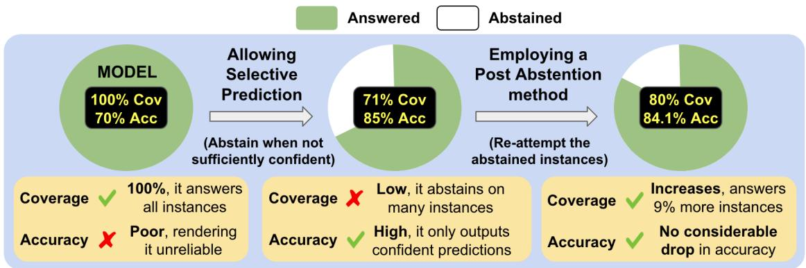
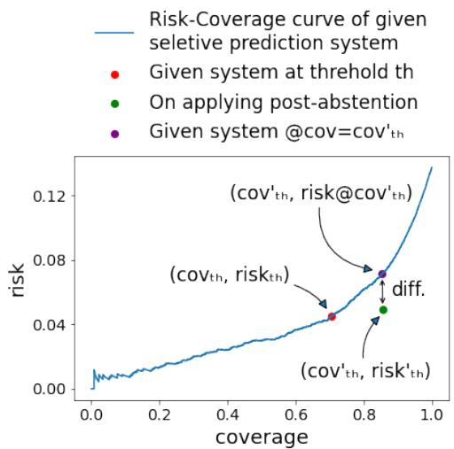
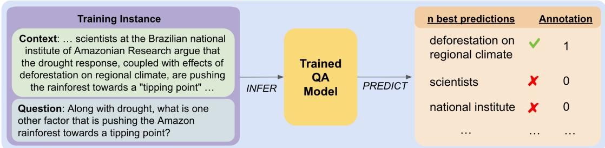
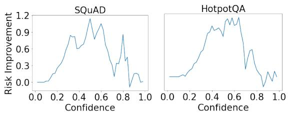
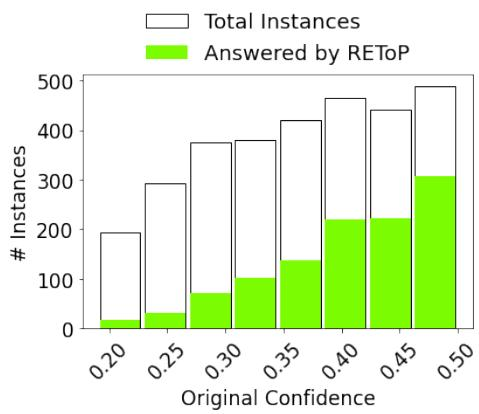
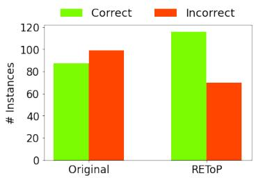
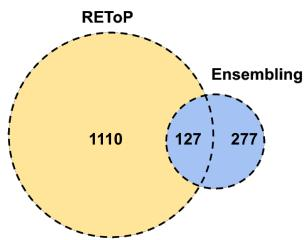

# Post-Abstention: Towards Reliably Re-Attempting the Abstained Instances in QA

Neeraj Varshney and Chitta Baral Arizona State University

## Abstract

Despite remarkable progress made in natural language processing, even the state-of-the-art models often make incorrect predictions. Such predictions hamper the reliability of systems and limit their widespread adoption in realworld applications. Selective prediction partly addresses the above concern by enabling models to abstain from answering when their predictions are likely to be incorrect. While selective prediction is advantageous, it leaves us with a pertinent question ‘what to do after abstention’. To this end, we present an explorative study on ‘Post-Abstention’, a task that allows re-attempting the abstained instances with the aim of increasing coverage of the system without significantly sacrificing its accuracy. We first provide mathematical formulation of this task and then explore several methods to solve it. Comprehensive experiments on 11 QA datasets show that these methods lead to considerable risk improvements –performance metric of the Post-Abstention task– both in the in-domain and the out-of-domain settings. We also conduct a thorough analysis of these results which further leads to several interesting findings. Finally, we believe that our work will encourage and facilitate further research in this important area of addressing the reliability of NLP systems.

## 1 Introduction

Despite remarkable progress made in Natural Language Processing (NLP), even the state-of-the-art systems often make incorrect predictions. This problem becomes worse when the inputs tend to diverge from the training data distribution (Elsahar and Gallé, 2019; Miller et al., 2020; Koh et al., 2021). Incorrect predictions hamper the reliability of systems and limit their widespread adoption in real-world applications.

Selective prediction partly addresses the above concern by enabling models to abstain from answering when their predictions are likely to be incorrect.

By avoiding potentially incorrect predictions, it allows maintaining high task accuracy and thus improves the system’s reliability. Selective prediction has recently received considerable attention from the NLP community leading to development of several methods (Kamath et al., 2020; Garg and Moschitti, 2021; Xin et al., 2021; Varshney et al., 2022d). While these contributions are important, selective prediction leaves us with a pertinent question: what to do after abstention?

In this work, we address the above question and present an explorative study on ‘Post-Abstention’, a task that allows re-attempting the abstained instances with the aim of increasing coverage of the given selective prediction system without significantly sacrificing its accuracy. Figure 1 illustrates the benefit of employing a post-abstention method; a model that achieves an accuracy of 70% is first enabled with the selective prediction ability that increases the accuracy to 85% but answers only 71% instances. Then, a post-abstention method is employed (for the 29% abstained instances) that assists the system in answering 9% more instances raising the coverage to 80% without considerably dropping the overall accuracy. We note that this task allows re-attempting all the abstained instances but does not require the system to necessarily output predictions for all of them i.e. the system can abstain even after utilizing a post-abstention method (when it is not sufficiently confident even in its new prediction). This facet not only allows the system to maintain its performance but also provides opportunities of sequentially applying stronger post-abstention methods to reliably and optimally increase the coverage in stages.

We provide mathematical formulation of the post-abstention task and explore several baseline methods to solve it (Section 2). To evaluate the efficacy of these methods, we conduct comprehensive experiments with 11 Question-Answering datasets from MRQA shared task (Fisch et al., 2019) in both in-domain and out-of-domain settings (Section 3). Our post-abstention methods lead to overall risk improvements (performance metric of the proposed task) of up to 21.81 in the in-domain setting and 24.23 in the out-of-domain setting. To further analyze these results, we study several research questions, such as ‘what is the extent of overlap between the instances answered by different postabstention methods’, ‘what is the distribution of model’s original confidence on instances that get answered in the post-abstention stage’, and ‘how often do the system’s predictions change after applying post-abstention methods’. In Section 4, we show that these investigations lead to numerous important and interesting findings.

  
Figure 1: Illustrating the impact of employing a post-abstention method on top of selective prediction system. A regular model that has an accuracy of 70% (at coverage 100%) is first enabled with selective prediction ability that increases the accuracy to 85% but drops the coverage to 71%. Then, on employing a post-abstention method to the abstained instances (remaining 29%), coverage increases to 80% without a considerable drop in overall accuracy.

In summary, our contributions are as follows:

1. We present an explorative study on ‘Post-Abstention’, a task that aims at increasing the coverage of a given selective prediction system without significantly sacrificing its accuracy.

2. We explore several baseline post-abstention methods and evaluate them in an extensive experimental setup spanning 11 QA datasets in both in-domain and out-of-domain settings.

3. We show that the proposed post-abstention methods result in overall risk value improvements of up to 21.81 and 24.23 in the in-domain and out-of-domain settings respectively.

4. Our thorough analysis leads to several interesting findings, such as (a) instances answered by different post-abstention methods are not mutually exclusive i.e. there exist some overlapping instances, (b) instances that get answered in the post-abstention stage are not necessarily the ones on which the given system was initially

most confident, etc.

We believe our work will encourage further research in Post-Abstention, an important step towards improving the reliability of NLP systems.

## 2 Post-Abstention

In this section, we first provide background for post-abstention (2.1) and then describe the task (2.2) and its approaches (2.3).

## 2.1 Background

Post-abstention, as the name suggests, is applicable for a system that abstains from answering i.e. a selective prediction system. A system can typically abstain when its prediction is likely to be incorrect. This improves the reliability of the system. Such a system typically consists of two functions: a predictor (f) that gives the model’s prediction on an input (x) and a selector (g) that determines if the system should output the prediction made by f:

$$
( f , g ) ( x ) = { \left\{ \begin{array} { l l } { f ( x ) , } & { { \mathrm { i f ~ } } \mathbf { g } ( \mathbf { x } ) = 1 } \\ { A b s t a i n , } & { { \mathrm { i f ~ } } \mathbf { g } ( \mathbf { x } ) = 0 } \end{array} \right. }
$$

Typically, g comprises of a prediction confidence estimator $\tilde { g }$ and a threshold th that controls the level of abstention for the system:

$$
g ( x ) = \mathbb { 1 } [ \tilde { g } ( x ) ) > t h ]
$$

A selective prediction system makes trade-offs between coverage and risk. Coverage at a threshold th is defined as the fraction of total instances answered by the system (where $\tilde { g } > t h )$ and risk is the error on the answered instances.

With decrease in threshold, coverage will increase, but the risk will usually also increase. The overall selective prediction performance is measured by the area under Risk-Coverage curve (El-Yaniv et al., 2010) which plots risk against coverage for all confidence thresholds. Lower AUC is better as it represents lower average risk across all confidence thresholds.

In NLP, approaches such as Monte-Carlo Dropout (Gal and Ghahramani, 2016), Calibration (Kamath et al., 2020; Varshney et al., 2022c,d; Zhang et al., 2021), Error Regularization (Xin et al., 2021) and Label Smoothing (Szegedy et al., 2016) have been studied for selective prediction. In this work, we consider MaxProb (Hendrycks and Gimpel, 2017), a technique that uses the maximum softmax probability across all answer candidates as the confidence estimator. We use this simple technique because the focus of this work is on postabstention i.e. the next step of selective prediction. However, we note that the task formulation and the proposed methods are general and applicable to all selective prediction approaches.

## 2.2 Task Formulation

We define the post-abstention task as follows:

Given a selective prediction system with an abstention threshold, the post-abstention task allows re-attempting the abstained instances with the aim ofimproving the coverage without considerably degrading the accuracy (or increasing the risk) of the given system.

Next, we mathematically describe the task and its performance evaluation methodology.

Let the coverage and risk of the given selective prediction system at abstention threshold th be $c o v _ { t h }$ and $r i s k _ { t h }$ respectively. A post-abstention method re-attempts the originally abstained instances (where $\tilde { g } < t h )$ and outputs the new prediction for the ones where it is now sufficiently confident. This typically leads to an increase in the coverage of the system with some change in the risk value; let the new coverage and risk be $c o v _ { t h } ^ { \prime }$ and $r i s k _ { t h } ^ { \prime }$ respectively. From the risk-coverage curve of the given system, we calculate its risk at coverage $c o v _ { t h } ^ { \prime }$ and compare it with $r i s k _ { t h } ^ { \prime }$ to measure the efficacy of the post-abstention method (refer to Figure 2).

For a method to have a positive impact, its risk $( r i s k _ { t h } ^ { \prime } )$ should be lower than the risk of the given system at coverage $c o v _ { t h } ^ { \prime }$ . We summarize this performance evaluation methodology in Figure 2. To get an overall performance estimate of a postabstention method, we compile these differences in risk values for all confidence thresholds and calculate an aggregated value. The higher the overall improvement value, the more effective the method is. We note that this evaluation methodology is fair and accurate as it conducts pair-wise comparisons at equal coverage points. An alternative performance metric could be AUC but it computes the overall area ignoring the pair-wise comparisons which are crucial for our task because the coverage points of the original system would be different from those achieved by the post-abstention method.

  
Figure 2: Summarizing performance evaluation methodology of post-abstention. Given a selective prediction system with coverage $c o v _ { t h }$ and risk $r i s k _ { t h }$ at abstention threshold th, let the new coverage and risk after applying a post-abstention method be $c o v _ { t h } ^ { \prime }$ and $r i s k _ { t h } ^ { \prime }$ respectively. From the risk-coverage curve of the given system, we calculate its risk at coverage $c o v _ { t h } ^ { \prime }$ and compare it with $r i s k _ { t h } ^ { \prime }$ (diff). For the method to have a positive impact, $r i s k _ { t h } ^ { \prime }$ should be lower than the risk of the given system at coverage $c o v _ { t h } ^ { \prime }$

## 2.3 Approaches

## 2.3.1 Ensembling using Question Paraphrases

It is well known that even state-of-the-art NLP models are often brittle i.e. when small semanticpreserving changes are made to the input, their predictions tend to fluctuate greatly (Jia and Liang, 2017; Belinkov and Bisk, 2018; Iyyer et al., 2018; Ribeiro et al., 2018; Wallace et al., 2019). Ensembling the predictions of the model on multiple semantically equivalent variants of the input is a promising approach to address this issue (Anantha et al., 2021; Vakulenko et al., 2021) as it can reduce the spread or dispersion of the predictions.

  
Figure 3: Illustrating annotation procedure of REToP. For each training instance, top N predictions given by the QA model are annotated conditioned on their correctness i.e. correct predictions are annotated as ‘1’ and incorrect predictions are annotated as ‘0’. This annotated binary classification dataset is used to train the auxiliary model.

We leverage the above technique in reattempting the abstained questions i.e. we first generate multiple paraphrases of the input instance and then aggregate the model’s predictions on them. We use BART-large (Lewis et al., 2019) model fine-tuned on Quora Question Corpus (Iyer et al., 2017), PAWS (Zhang et al., 2019), and Microsoft Research Paraphrase Corpus (Dolan and Brockett, 2005) for paraphrasing and explore the following strategies for aggregating the model predictions:

• Mean: In this strategy, we calculate the average confidence assigned to each answer candidate across all predictions. Then, we select the candidate with the highest average confidence as the system’s prediction. Note that the system will output this prediction only if its confidence surpasses the abstention threshold.

• Max: Here, like the mean strategy, we select the answer candidate with the highest average confidence but we use the maximum confidence assigned to that candidate as its prediction confidence. This is done to push the most confident prediction above the abstention threshold.

## 2.3.2 Re-Examining Top N Predictions (REToP)

State-of-the-art models have achieved impressive performance on numerous NLP tasks. Even in cases where they fail to make a correct prediction, they are often able to rank the correct answer as one of their top N predictions. This provides opportunities for re-examining the top N predictions to identify the correct answer in case of abstention. To this end, a model that can estimate the correctness of a prediction can be leveraged. Following this intuition, we develop an auxiliary model that takes the context, question, and a prediction as input and assigns a score indicating the likelihood of that prediction to be correct. This model can be used for each of the top N predictions given by the QA model to select the one that is most likely to be the correct answer.

Training Auxiliary Model: We first create data instances by annotating (context, question, prediction) triplets conditioned on the correctness of the QA system’s predictions and then train a classification model using this data. This model is specific to the given QA system and essentially learns to distinguish its correct and incorrect predictions.

• Annotate (context, question, prediction) triplets: We utilize the trained QA model to get its top N predictions for each training instance. Then, we annotate each (context, question, prediction) triplet based on the prediction’s correctness i.e. a correct prediction is annotated as ‘1’ and an incorrect prediction is annotated as ‘0’. Figure 3 illustrates this annotation step.

• Train a classification model: Then, a binary classification model is trained using the annotated dataset collected in the previous step. This model specifically learns to distinguish the correct predictions of the QA model from the incorrect ones. Softmax probability assigned to the label ‘1’ corresponds to the likelihood of correctness for each prediction.

Note that we use the QA model’s top N predictions to collect the ‘0’ annotations instead of randomly selecting candidates because this procedure results in highly informative negative instances (that are probable predictions and yet incorrect) and not easy/obvious negatives. This can help the auxiliary model in learning fine-grained representations distinguishing correct and incorrect predictions.

Leveraging Auxiliary Model: For an abstained instance, we compute the likelihood value for each of the top $N$ predictions given by the QA model using our trained auxiliary model. Then, we calculate the overall confidence (c) of each prediction (p) as a weighted average of the QA model’s probability $( s _ { q } )$ and the auxiliary model’s likelihood score $( s _ { a } )$ i.e. $c _ { p }$ is calculated as:

$$
c _ { p } = \alpha * s _ { q } ^ { p } + ( 1 - \alpha ) * s _ { a } ^ { p }
$$

where α is a weight parameter.

We incorporate QA model’s probability as it provides more flexibility to compute the overall confidence. Finally, prediction with the highest overall confidence is selected as the new prediction. We differentiate this method from existing methods such as calibration in Appendix C.

## 2.3.3 Human Intervention (HI)

In intolerant application domains such as biomedicals where incorrect predictions can have serious consequences, human intervention is the most reliable technique to answer the abstained instances. Human intervention can be in various forms such as providing relevant knowledge to the model, asking clarifying questions (Rao and Daumé III, 2018) or simplifying the input question. In this work, we explore a simple human intervention approach in which the system provides multiple predictions instead of only one prediction for the abstained instances. The human can then select the most suitable prediction from the provided predictions. Performance of this method can be approximated based on the presence of the correct answer in the predictions provided to the human. Note that the above approach would answer all the abstained instances and hence the coverage would always be 100%. This implies that with the increase in abstention threshold, the risk would monotonically decrease as multiple predictions would be returned for a larger number of instances.

In addition to the above approach, we also explore a REToP-centric HI approach in which the system returns multiple predictions only when RE-ToP surpasses the confidence threshold in the postabstention stage. Similar to REToP, it abstains on the remaining instances. Finally, we note that comparing the performance of HI approaches with other post-abstention approaches would be unfair as other approaches return only a single prediction. Therefore, we present HI results separately.

## 3 Experiments and Results

## 3.1 Experimental Setup

Datasets: We experiment with SQuAD 1.1 (Rajpurkar et al., 2016) as the source dataset and the following 10 datasets as out-of-domain datasets: NewsQA (Trischler et al., 2017), TriviaQA (Joshi et al., 2017), SearchQA (Dunn et al., 2017), HotpotQA (Yang et al., 2018), and Natural Questions (Kwiatkowski et al., 2019), DROP (Dua et al., 2019), DuoRC (Saha et al., 2018), RACE (Lai et al., 2017), RelationExtraction (Levy et al., 2017), and TextbookQA (Kim et al., 2019). We use the preprocessed data from the MRQA shared task (Fisch et al., 2019) for our experiments.

Implementation Details: We run all our experiments using the huggingface (Wolf et al., 2020) implementation of transformers on Nvidia V100 16GB GPUs with a batch size of 32 and learning rate ranging in 1 5 e 5. We generate 10 paraphrases of the question in Ensembling method, reexamine top 10 predictions, vary α in the range 0.3 0.7 for REToP method, and vary the number of predictions in the range 2 to 5 for HI methods. Since the focus of this work is on post-abstention, it’s crucial to experiment with models that leave sufficient room for effectively evaluating the ability of post-abstention methods. For that reason, we experiment with a small size model (BERT-mini having just 11.3M parameters) from Turc et al. (2019) for our experiments. However, we note that our methods are general and applicable for all models.

## 3.2 Results

## 3.2.1 REToP

Table 1 shows the post-abstention performance of REToP for selected abstention thresholds. The last column (‘Total Risk Improvement’) in this table corresponds to the overall improvement aggregated over all confidence thresholds. It can be observed that REToP achieves considerable risk improvements both in the in-domain setting (21.81 on SQuAD) and the out-of-domain settings (24.23 on TextbookQA, 21.54 on HotpotQA, 20.42 on RE, etc). Next, we analyze these results in detail.

Higher improvement on moderate confidences: In Figure 4, we plot risk improvements achieved by REToP on SQuAD (in-domain) and HotpotQA (out-of-domain) datasets for all confidence thresholds. These plots reveal that the improvement is more on moderate thresholds as compared to low thresholds. We attribute this to the high difficulty of instances that remain to be re-attempted at low thresholds i.e. only the instances on which the given system was highly underconfident are left for the post-abstention method. It has been shown that model’s confidence is negatively correlated with difficulty (Swayamdipta et al., 2020; Rodriguez et al., 2021; Varshney et al., 2022b) implying that the remaining instances are tough to be answered correctly. This justifies the lesser improvement in performance observed at low thresholds.

<table><tr><td rowspan="2">Dataset</td><td rowspan="2">Model</td><td colspan="2">0.2</td><td colspan="2">0.32</td><td colspan="2">0.36</td><td colspan="2">0.48</td><td colspan="2">0.54</td><td colspan="2">0.60</td><td colspan="2">0.68</td><td rowspan="2">Total Risk Improvement↑</td></tr><tr><td>Cov↑</td><td>Risk↓</td><td>Cov↑ Risk↓</td><td>Cov↑</td><td>Risk↓</td><td>Cov↑</td><td>Risk↓</td><td>Cov↑</td><td>Risk↓</td><td></td><td>Cov↑ Risk↓</td><td>Cov↑</td><td>Risk↓</td><td></td></tr><tr><td>SQuAD</td><td>Given (G) REToP</td><td>96.65 99.73</td><td>32.45 33.75</td><td>87.24 97.27</td><td>28.10 31.93</td><td>83.34 95.08</td><td>26.69 30.85</td><td>69.94 80.88</td><td>21.91 24.84</td><td>62.57 72.44</td><td>19.91 21.82</td><td>56.23 63.73</td><td>17.98 19.19</td><td>47.92 52.65</td><td>15.43 16.43</td><td></td></tr><tr><td>(in-domain) HotpotQA</td><td> $\mathbf { G } @ \mathbf { R E T o P } _ { c o v }$  Given (G) REToP</td><td>97.54 99.93</td><td>34.00 67.65 68.17</td><td>89.56 98.63</td><td>32.77 65.88 67.39</td><td>85.39 96.9</td><td>31.67 65.13 66.61</td><td>71.75 82.88</td><td>25.82 62.71 63.61</td><td>64.77 73.55</td><td>22.59 61.56 61.89</td><td>58.19 64.36</td><td>20.24 60.34 60.53</td><td>49.25 52.96</td><td>16.83 58.29 58.34</td><td>21.81</td></tr><tr><td></td><td> $\mathbf { G } @ \mathbf { R E T o P } _ { c o v }$  Given (G) REToP</td><td>97.59 99.93</td><td>68.30 44.49 45.38</td><td>89.01 98.95</td><td>67.92 40.51</td><td>85.41</td><td>67.47 39.04</td><td>74.08</td><td>64.52 34.16</td><td>66.86</td><td>63.04 30.54</td><td>60.58</td><td>61.55 27.94</td><td>54.10 59.33</td><td>59.01 24.20 25.39</td><td>21.54</td></tr><tr><td>RACE</td><td> $\mathbf { G } @ \mathbf { R E T o P } _ { c o v }$  Given (G) REToP</td><td>89.02 99.41</td><td>45.47 80.5 82.24</td><td>71.07 92.28</td><td>44.39 45.01 77.04 80.71</td><td>97.52 66.17 86.94</td><td>43.79 44.43 75.56</td><td>85.89 51.34</td><td>38.67 39.22 72.54</td><td>77.61 43.47</td><td>34.57 35.51 69.62</td><td>69.54 36.2</td><td>31.12 32.10 68.85</td><td>29.97 33.09</td><td>27.33 63.86 65.92</td><td>20.42</td></tr><tr><td>NewsQA</td><td> $\mathbf { G } @ \mathbf { R E T o P } _ { c o v }$  Given (G) REToP</td><td>93.90 99.48</td><td>81.94 69.76 71.03</td><td>80.91 96.13</td><td>81.00 66.40 70.24</td><td>75.5 93.21</td><td>79.35 80.00 64.91 69.64</td><td>62.91 60.30 70.85</td><td>73.82 75.00 60.79 63.71</td><td>51.48 53.30 60.73</td><td>71.76 72.54 58.8</td><td>42.28 47.17 52.04</td><td>69.47 69.72 56.62 58.07</td><td>39.32 42.09</td><td>66.37 54.11 54.94</td><td>15.10</td></tr><tr><td>SearchQA</td><td> $\mathbf { G } @ \mathbf { R E T o P } _ { c o v }$  Given (G) REToP</td><td>96.15 99.92</td><td>71.31 86.68 87.06</td><td>81.77 97.58</td><td>70.36 85.67 86.81</td><td>75.77 93.92</td><td>69.61 85.34 86.48</td><td>58.64 71.49</td><td>63.81 84.08 84.76</td><td>50.22 59.46</td><td>60.67 61.01 83.58 84.04</td><td>42.67 48.6</td><td>58.33 83.33 83.48</td><td>34.46 37.08</td><td>55.02 82.55 82.75</td><td>5.10</td></tr><tr><td>TriviaQA</td><td> $\mathbf { G } @ \mathbf { R E T o P } _ { c o v }$  Given (G) REToP</td><td>96.67 99.86</td><td>87.04 67.31 68.07</td><td>86.89 97.07</td><td>86.79 65.05 67.33</td><td>82.54 93.72</td><td>86.52 63.82 66.23</td><td>68.81 76.72</td><td>85.07 60.39 62.40</td><td>61.44 67.93</td><td>84.15 58.39 60.25</td><td>55.11 59.55</td><td>83.56 56.48 57.77</td><td>47.12 49.29</td><td>82.77 54.03 54.89</td><td>1.78</td></tr><tr><td>NQ</td><td> $\mathbf { G } @ \mathbf { R E T o P } _ { c o v }$  Given (G) REToP</td><td>92.37 98.71</td><td>68.09 63.78 65.34</td><td>79.04 93.04</td><td>67.42 59.99 63.39</td><td>74.87 89.30</td><td>66.60 58.77 62.62</td><td>60.60 70.65</td><td>62.32 53.51 56.90</td><td>54.03 61.68</td><td>60.12 51.00 53.54</td><td>47.94 53.24</td><td>57.95 48.31 50.10</td><td>41.70 43.75</td><td>54.83 45.27 46.44</td><td>0.70</td></tr><tr><td>DROP</td><td> $\mathbf { G } @ \mathbf { R E T o P } _ { c o v }$  Given (G) REToP</td><td>95.74 99.53</td><td>65.67 88.46 88.64</td><td>81.17 92.95</td><td>63.93 87.38 87.83</td><td>76.11 88.42</td><td>63.02 87.33 88.04</td><td>62.34 69.00</td><td>57.43 86.23 86.31</td><td>53.69 58.55</td><td>53.80 85.38 85.57</td><td>48.77 51.90</td><td>50.68 84.45 84.49</td><td>43.05 44.18</td><td>46.45 85.01 85.09</td><td>10.70</td></tr><tr><td>DuoRC</td><td> $\mathbf { G } @ \mathbf { R E T o P } _ { c o v }$  Given (G) REToP</td><td>97.20 99.87</td><td>88.63 68.68 69.45</td><td>87.87 98.33</td><td>88.19 66.41 69.17</td><td>84.21 96.14</td><td>87.88 65.82 68.68</td><td>71.09 80.75</td><td>86.69 62.42 64.69</td><td>64.16 71.95</td><td>85.91 61.47 62.59</td><td>57.16 62.56</td><td>84.87 59.91 60.70</td><td>50.03 52.90</td><td>84.94 58.46 58.69</td><td>3.63</td></tr><tr><td>TBQA</td><td>Original@cov Given (G) REToP  $\mathbf { G } @ \mathbf { R E T o P } _ { c o v }$ </td><td>94.34 99.53</td><td>69.51 67.14 68.38 68.56</td><td>80.9 95.01</td><td>69.02 63.32 67.23 67.30</td><td>75.65 91.68</td><td>68.4 61.92 66.18</td><td>57.49 68.20</td><td>64.77 56.02 58.34</td><td>49.63 58.55</td><td>62.74 52.14 54.77</td><td>41.45 47.37</td><td>60.92 51.04 51.26</td><td>34.07 37.26</td><td>59.32 50.00 49.64 50.71</td><td>4.32 24.23</td><td></td></tr></table>

Table 1: Performance of REToP as a post-abstention method for selected abstention thresholds. The QA model is trained using SQuAD training data and evaluated on SQuAD (in-domain) and 10 out-of-domain datasets. For each dataset, we provide three rows: first row $(  G i \nu e n ^ { \prime } )$ shows the coverage and risk values of the given selective prediction system at different abstention thresholds, second row $( ^ { \circ } R E T o P ^ { \prime } )$ shows the coverage and risk after applying REToP on abstained instances of the given system, and third row $( ^ { \circ } G @ R E T o P _ { c o v } )$ shows risk of the given system at the coverage achieved by REToP. For the post abstention method to be effective, risk in the second row should be less than that in the third row and the magnitude of difference corresponds to the improvement. The last column corresponds to the overall improvement aggregated over all confidences ranging from 0 to 1 at an interval of 0.02. and indicate that lower (risk) and higher (coverage, risk improvement) values are better respectively.

In-Domain vs Out-of-Domain Improvement: REToP achieves higher performance improvement on the in-domain dataset than the out-of-domain datasets (on average). This is expected as the auxiliary model in REToP is trained using the in-domain training data. However, it still has good performance on out-of-domain datasets as the auxiliary model learns fine-grained representations to distinguish between correct and incorrect predictions. Furthermore, the improvement on out-of-domain data varies greatly across datasets (from 0.7 on TriviaQA to 24.23 on TextbookQA).

  
Figure 4: Improvement in risk achieved by using RE-ToP in post-abstention on SQuAD (in-domain) and HotpotQA (out-of-domain) datasets for all confidences.

<table><tr><td>Dataset</td><td>Ens.</td><td>REToP (α = 0.6)</td><td>REToP (α = 0.65)</td><td>*HI on (REToP)</td></tr><tr><td>SQuAD</td><td>0.29</td><td>21.81</td><td>20.02</td><td>47.85</td></tr><tr><td>HotpotQA RE</td><td>0.93 21.72</td><td>21.54 20.42</td><td>19.00 17.61</td><td>37.88 46.65</td></tr><tr><td>RACE NewsQA</td><td>16.72 11.92</td><td>15.10 5.10</td><td>14.17 5.10</td><td>36.26 26.41</td></tr><tr><td>SearchQA</td><td>17.05</td><td>1.78</td><td>2.23</td><td>20.08</td></tr><tr><td>TriviaQA</td><td>9.50</td><td>0.70</td><td>1.47</td><td>17.21</td></tr><tr><td>NQ</td><td>13.40</td><td>10.70</td><td>10.89</td><td></td></tr><tr><td>DROP</td><td>1.57</td><td></td><td></td><td>31.95</td></tr><tr><td>DuoRC</td><td></td><td>3.63</td><td>2.99</td><td>8.08</td></tr><tr><td>TBQA</td><td>-1.69</td><td>4.32</td><td>5.90</td><td>20.26</td></tr><tr><td></td><td>-6.93</td><td>24.23</td><td>23.73</td><td>45.18</td></tr><tr><td>Total</td><td>84.48</td><td>129.33</td><td>123.11</td><td>337.81</td></tr></table>

Table 2: Comparing total risk improvement achieved by different post-abstention methods. \* for HI indicates that it’s results are not directly comparable as it outputs multiple predictions while others output only one.

## 3.2.2 Comparing Post-Abstention Approaches

We provide the performance tables for other postabstention approaches in Appendix. However, we compare their total risk improvement values in Table 2. In the in-domain setting, REToP achieves higher improvement than Ensembling method. This is because the auxiliary model in RE-ToP has specifically learned to distinguish the correct and incorrect predictions from the training data of this domain. However, in some out-of-domain cases, Ensembling outperforms REToP (SearchQA, TriviaQA, NewsQA). Overall, REToP leads to a consistent and higher risk improvement on average. Ensembling also leads to a minor degradation in a few out-of-domain datasets (DuoRC and TextbookQA). Next, we analyze the performance of human intervention (HI) methods.

## 3.2.3 Human Intervention (HI)

We study two variants of HI method. In the first variant, multiple predictions (n=2) are returned for all the abstained instances. This makes the coverage to be 100% for all the confidences; therefore, we present only the risk values in Table 3. As expected, with increase in abstention threshold, the risk decreases because multiple predictions get outputted for a larger number of instances. Selection of operating threshold for an application depends on the trade-off between risk that can be tolerated and human effort required to select the most suitable prediction from a set of predictions returned by the system. For example, a low threshold can be selected for tolerant applications like movie recommendations and a high threshold for tolerant applications like house robots.

<table><tr><td rowspan=1 colspan=1>Dataset</td><td rowspan=1 colspan=1>0.0    0.2    0.4    0.6    0.8</td></tr><tr><td rowspan=1 colspan=1>SQuAD</td><td rowspan=1 colspan=1>34.15  33.72  30.9   28.05  26.3</td></tr><tr><td rowspan=6 colspan=1>HotpotQARERACENewsQASearchQATriviaQANQ</td><td rowspan=1 colspan=1>68.33  68.19  66.56  63.65  61.5745.52  45.35  43.39  41.28  39.31</td></tr><tr><td rowspan=1 colspan=1>82.05  81.6   80.12  78.19  77.15</td></tr><tr><td rowspan=1 colspan=1>71.46  71.2   69.42  67.21  65.29</td></tr><tr><td rowspan=1 colspan=1>87.06  86.92  85.64  83.98  82.94</td></tr><tr><td rowspan=1 colspan=1>68.13  67.9   66.62  64.21  62.47</td></tr><tr><td rowspan=1 colspan=1>66.09  65.67  63.63  61.06  59.31</td></tr><tr><td rowspan=1 colspan=1>DROP</td><td rowspan=1 colspan=1>88.69  88.69  87.56  86.36  85.7</td></tr><tr><td rowspan=1 colspan=1>DuoRCTBQA</td><td rowspan=1 colspan=1>69.55  69.42  68.15  66.42  65.2268.73  68.46  67.07  64.74 64.01</td></tr></table>

Table 3: Comparing risk values achieved by the HI method (returns two predictions for all abstained instances) across different abstention thresholds.

In the second variant of HI method, we study a REToP-centric approach in which the system returns multiple predictions only when REToP surpasses the confidence threshold in the postabstention stage. The last column in Table 2 shows the risk improvements achieved by this approach (n=2). Note that REToP re-examines the top N predictions and selects one while this method outputs multiple predictions and requires a human to select the most suitable one. These results indicate that though REToP achieves good performance, there is still some room for improvement.

## 3.2.4 Ensembling Using Paraphrases

Comparing the performance of Mean and Max Ensembling strategies reveals that Max increases the coverage more than the Mean strategy but it also increases the risk considerably. Thus, pushing the instance’s confidence to surpass the abstention threshold fails to provide risk improvements. However, such a technique could be employed in scenarios where risk degradation can be tolerated.

## 4 Analysis

What is the distribution of model’s original confidence on the instances that get answered after applying post-abstention method? In Figure 5, we show the distribution of model’s original confidence on SQuAD instances that get answered by REToP at abstention threshold 0.5. Green-colored bars represent the number of instances answered from each confidence bucket. Wefound that REToP answers a large number of instances from the high confidence buckets; however, instancesfrom even low confidence buckets get answered. This can further be controlled using the weight parameter (α) in the overall confidence computation.

  
Figure 5: Distribution of QA model’s confidence on SQuAD instances that get answered after applying RE-ToP at abstention threshold 0.5.

How often do the system’s predictions change after applying REToP and what is its impact? REToP can either boost the confidence of the top most prediction of the given model or can select a different answer by re-examining its top N predictions. In Figure 6, we specifically analyze the latter scenario i.e. the instances on which REToP’s prediction differs from the original model’s prediction. At a threshold of 0.5, the original system abstains on 3411 SQuAD instances and after applying REToP, it answers 1110 of those instances. Out of these 1110 instances, the REToP changes the prediction on 186 instances. The original prediction is incorrect in more cases (99 vs 87) and after applying REToP, the system gives 116 correct predictions and only 70 incorrect. This implies that by overriding the original system’s prediction, RE-ToP improves the system’s accuracy. However, in some cases, it also changed a correct prediction to incorrect but such cases are lesser than the former.

To what extent do the instances answered by different post-abstention methods overlap? In Figure 7, we demonstrate the Venn diagram of SQuAD instances answered by REToP and Ensembling (Mean) approaches at abstention threshold 0.5. REToP answers 1110 instances while Ensembling answers 277 and there 127 common instances between the two approaches. This indicates that the two sets are not mutually exclusive i.e. there are some instances that get targeted by both the approaches; however, there are a significant number of instances that are not in the intersection. This result motivates studying composite or sequential application of different post-abstention methods to further improve the post-abstention performance.

Figure 6: Number of correct (green) and incorrect (red) predictions on those abstained SQuAD instances where REToP surpasses the abstention threshold of 0.5 but its prediction differs from the original system.  
  
Figure 7: Venn diagram of abstained SQuAD instances answered by REToP and Ensembling (Mean) approaches at abstention threshold 0.5.

## 5 Conclusion and Discussion

In this work, we formulated ‘Post-Abstention’, a task that allows re-attempting the abstained instances of the given selective prediction system with the aim of increasing its coverage without significantly sacrificing the accuracy. We also explored several baseline methods for this task. Through comprehensive experiments on 11 QA datasets, we showed that these methods lead to considerable performance improvements in both in-domain and out-of-domain settings. We further performed a thorough analysis that resulted in several interesting findings.

Looking forward, we believe that our work opens up several avenues for new research, such as exploring test-time adaptation, knowledge hunting, and other human intervention techniques like asking clarification questions as post-abstention methods (discussed in Appendix D). Studying the impact of composite or sequential application of multiple post-abstention methods in another promising direction. Furthermore, prior selective prediction methods can also be repurposed and explored for this task. We plan to pursue these crucial research directions in our future work. Finally, we hope our work will encourage further research in this important area and facilitate the development of more reliable NLP systems.

## Limitations

The proposed post-abstention methods require additional computation and storage. Despite this additional requirement, we note that this is not a serious concern as current devices have high storage capacity and computation hardware. Furthermore, additional computation for training auxiliary model in REToP is required only once and just an inference is required at evaluation time which has a much lower computation cost. Moreover, the risk mitigation that comes with the post-abstention methods weighs much more than the computational or storage overhead in terms of importance. Secondly, human-intervention techniques require a human to be a participant and contribute in the answering process. However, these approaches do not expect the participating human to be an expert in the task. Like other empirical research, it is difficult to exactly predict the magnitude of improvement a post-abstention method can bring. Our idea of exploring sequential application of multiple postabstention methods addresses this concern and can be used based on the application requirements.

## Acknowledgement

We thank the anonymous reviewers for their insightful feedback. This research was supported by DARPA SAIL-ON program.

## References

Mohammad Aliannejadi, Julia Kiseleva, Aleksandr Chuklin, Jeff Dalton, and Mikhail Burtsev. 2020. Convai3: Generating clarifying questions for opendomain dialogue systems (clariq). arXiv preprint arXiv:2009.11352.

Mohammad Aliannejadi, Julia Kiseleva, Aleksandr Chuklin, Jeff Dalton, and Mikhail Burtsev. 2021. Building and evaluating open-domain dialogue corpora with clarifying questions. In Proceedings of the 2021 Conference on Empirical Methods in Natural Language Processing, pages 4473–4484, Online and Punta Cana, Dominican Republic. Association for Computational Linguistics.

Raviteja Anantha, Svitlana Vakulenko, Zhucheng Tu, Shayne Longpre, Stephen Pulman, and Srinivas

Chappidi. 2021. Open-domain question answering goes conversational via question rewriting. In Proceedings ofthe 2021 Conference ofthe North American Chapter ofthe Associationfor Computational Linguistics: Human Language Technologies, pages 520–534, Online. Association for Computational Linguistics.

Pratyay Banerjee, Tejas Gokhale, and Chitta Baral. 2021. Self-supervised test-time learning for reading comprehension. In Proceedings ofthe 2021 Conference ofthe North American Chapter ofthe Associationfor Computational Linguistics: Human Language Technologies, pages 1200–1211, Online. Association for Computational Linguistics.

Yonatan Belinkov and Yonatan Bisk. 2018. Synthetic and natural noise both break neural machine translation. In International Conference on Learning Representations.

Dian Chen, Dequan Wang, Trevor Darrell, and Sayna Ebrahimi. 2022. Contrastive test-time adaptation. In Proceedings of the IEEE/CVF Conference on Computer Vision and Pattern Recognition, pages 295– 305.

William B Dolan and Chris Brockett. 2005. Automatically constructing a corpus of sentential paraphrases. In Proceedings ofthe Third International Workshop on Paraphrasing (IWP2005).

Dheeru Dua, Yizhong Wang, Pradeep Dasigi, Gabriel Stanovsky, Sameer Singh, and Matt Gardner. 2019. DROP: A reading comprehension benchmark requiring discrete reasoning over paragraphs. In Proceedings ofthe 2019 Conference ofthe North American Chapter of the Association for Computational Linguistics: Human Language Technologies, Volume 1 (Long and Short Papers), pages 2368–2378, Minneapolis, Minnesota. Association for Computational Linguistics.

Matthew Dunn, Levent Sagun, Mike Higgins, V Ugur Guney, Volkan Cirik, and Kyunghyun Cho. 2017. Searchqa: A new q&a dataset augmented with context from a search engine. arXiv preprint arXiv:1704.05179.

Ran El-Yaniv et al. 2010. On the foundations of noisefree selective classification. Journal of Machine Learning Research, 11(5).

Hady Elsahar and Matthias Gallé. 2019. To annotate or not? predicting performance drop under domain shift. In Proceedings of the 2019 Conference on Empirical Methods in Natural Language Processing and the 9th International Joint Conference on Natural Language Processing (EMNLP-IJCNLP), pages 2163–2173, Hong Kong, China. Association for Computational Linguistics.

Adam Fisch, Alon Talmor, Robin Jia, Minjoon Seo, Eunsol Choi, and Danqi Chen. 2019. MRQA 2019 shared task: Evaluating generalization in reading comprehension. In Proceedings of 2nd Machine Reading

for Reading Comprehension (MRQA) Workshop at EMNLP.

Yarin Gal and Zoubin Ghahramani. 2016. Dropout as a bayesian approximation: Representing model uncertainty in deep learning. In international conference on machine learning, pages 1050–1059. PMLR.

Siddhant Garg and Alessandro Moschitti. 2021. Will this question be answered? question filtering via answer model distillation for efficient question answering. In Proceedings ofthe 2021 Conference on Empirical Methods in Natural Language Processing, pages 7329–7346, Online and Punta Cana, Dominican Republic. Association for Computational Linguistics.

Dan Hendrycks and Kevin Gimpel. 2017. A baseline for detecting misclassified and out-of-distribution examples in neural networks. Proceedings of International Conference on Learning Representations.

Shankar Iyer, Nikhil Dandekar, and Kornél Csernai. 2017. First quora dataset release: Question pairs. data. quora. com.

Mohit Iyyer, John Wieting, Kevin Gimpel, and Luke Zettlemoyer. 2018. Adversarial example generation with syntactically controlled paraphrase networks. In Proceedings of the 2018 Conference of the North American Chapter of the Association for Computational Linguistics: Human Language Technologies, Volume 1 (Long Papers), pages 1875–1885, New Orleans, Louisiana. Association for Computational Linguistics.

Robin Jia and Percy Liang. 2017. Adversarial examples for evaluating reading comprehension systems. In Proceedings of the 2017 Conference on Empirical Methods in Natural Language Processing, pages 2021–2031, Copenhagen, Denmark. Association for Computational Linguistics.

Mandar Joshi, Eunsol Choi, Daniel Weld, and Luke Zettlemoyer. 2017. TriviaQA: A large scale distantly supervised challenge dataset for reading comprehension. In Proceedings ofthe 55th Annual Meeting of the Associationfor Computational Linguistics (Volume 1: Long Papers), pages 1601–1611, Vancouver, Canada. Association for Computational Linguistics.

Amita Kamath, Robin Jia, and Percy Liang. 2020. Selective question answering under domain shift. In Proceedings of the 58th Annual Meeting of the Associationfor Computational Linguistics, pages 5684– 5696, Online. Association for Computational Linguistics.

Daesik Kim, Seonhoon Kim, and Nojun Kwak. 2019. Textbook question answering with multi-modal context graph understanding and self-supervised openset comprehension. In Proceedings of the 57th Annual Meeting ofthe Associationfor Computational Linguistics, pages 3568–3584, Florence, Italy. Association for Computational Linguistics.

Pang Wei Koh, Shiori Sagawa, Henrik Marklund, Sang Michael Xie, Marvin Zhang, Akshay Balsubramani, Weihua Hu, Michihiro Yasunaga, Richard Lanas Phillips, Irena Gao, Tony Lee, Etienne David, Ian Stavness, Wei Guo, Berton Earnshaw, Imran Haque, Sara M Beery, Jure Leskovec, Anshul Kundaje, Emma Pierson, Sergey Levine, Chelsea Finn, and Percy Liang. 2021. Wilds: A benchmark of in-the-wild distribution shifts. In Proceedings of the 38th International Conference on Machine Learning, volume 139 of Proceedings ofMachine Learning Research, pages 5637–5664. PMLR.

Tom Kwiatkowski, Jennimaria Palomaki, Olivia Redfield, Michael Collins, Ankur Parikh, Chris Alberti, Danielle Epstein, Illia Polosukhin, Jacob Devlin, Kenton Lee, Kristina Toutanova, Llion Jones, Matthew Kelcey, Ming-Wei Chang, Andrew M. Dai, Jakob Uszkoreit, Quoc Le, and Slav Petrov. 2019. Natural questions: A benchmark for question answering research. Transactions ofthe Associationfor Computational Linguistics, 7:452–466.

Guokun Lai, Qizhe Xie, Hanxiao Liu, Yiming Yang, and Eduard Hovy. 2017. RACE: Large-scale ReAding comprehension dataset from examinations. In Proceedings of the 2017 Conference on Empirical Methods in Natural Language Processing, pages 785– 794, Copenhagen, Denmark. Association for Computational Linguistics.

Omer Levy, Minjoon Seo, Eunsol Choi, and Luke Zettlemoyer. 2017. Zero-shot relation extraction via reading comprehension. In Proceedings of the 21st Conference on Computational Natural Language Learning (CoNLL 2017), pages 333–342, Vancouver, Canada. Association for Computational Linguistics.

Mike Lewis, Yinhan Liu, Naman Goyal, Marjan Ghazvininejad, Abdelrahman Mohamed, Omer Levy, Ves Stoyanov, and Luke Zettlemoyer. 2019. Bart: Denoising sequence-to-sequence pre-training for natural language generation, translation, and comprehension.

Lei Li, Yankai Lin, Deli Chen, Shuhuai Ren, Peng Li, Jie Zhou, and Xu Sun. 2021. CascadeBERT: Accelerating inference of pre-trained language models via calibrated complete models cascade. In Findings of the Association for Computational Linguistics: EMNLP 2021, pages 475–486, Punta Cana, Dominican Republic. Association for Computational Linguistics.

John Miller, Karl Krauth, Benjamin Recht, and Ludwig Schmidt. 2020. The effect of natural distribution shift on question answering models. In International Conference on Machine Learning, pages 6905–6916. PMLR.

Pranav Rajpurkar, Jian Zhang, Konstantin Lopyrev, and Percy Liang. 2016. SQuAD: 100,000+ questions for machine comprehension of text. In Proceedings of the 2016 Conference on Empirical Methods in Natural Language Processing, pages 2383–2392, Austin, Texas. Association for Computational Linguistics.

Sudha Rao and Hal Daumé III. 2018. Learning to ask good questions: Ranking clarification questions using neural expected value of perfect information. In Proceedings of the 56th Annual Meeting of the Associationfor Computational Linguistics (Volume 1: Long Papers), pages 2737–2746, Melbourne, Australia. Association for Computational Linguistics.

Marco Tulio Ribeiro, Sameer Singh, and Carlos Guestrin. 2018. Semantically equivalent adversarial rules for debugging NLP models. In Proceedings of the 56th Annual Meeting of the Association for Computational Linguistics (Volume 1: Long Papers), pages 856–865, Melbourne, Australia. Association for Computational Linguistics.

Pedro Rodriguez, Joe Barrow, Alexander Miserlis Hoyle, John P. Lalor, Robin Jia, and Jordan Boyd-Graber. 2021. Evaluation examples are not equally informative: How should that change NLP leaderboards? In Proceedings of the 59th Annual Meeting ofthe Associationfor Computational Linguistics and the 11th International Joint Conference on Natural Language Processing (Volume 1: Long Papers), pages 4486–4503, Online. Association for Computational Linguistics.

Amrita Saha, Rahul Aralikatte, Mitesh M. Khapra, and Karthik Sankaranarayanan. 2018. DuoRC: Towards complex language understanding with paraphrased reading comprehension. In Proceedings ofthe 56th Annual Meeting of the Association for Computational Linguistics (Volume 1: Long Papers), pages 1683– 1693, Melbourne, Australia. Association for Computational Linguistics.

Swabha Swayamdipta, Roy Schwartz, Nicholas Lourie, Yizhong Wang, Hannaneh Hajishirzi, Noah A. Smith, and Yejin Choi. 2020. Dataset cartography: Mapping and diagnosing datasets with training dynamics. In Proceedings of the 2020 Conference on Empirical Methods in Natural Language Processing (EMNLP), pages 9275–9293, Online. Association for Computational Linguistics.

Christian Szegedy, Vincent Vanhoucke, Sergey Ioffe, Jonathon Shlens, and Zbigniew Wojna. 2016. Rethinking the inception architecture for computer vision. 2016 IEEE Conference on Computer Vision and Pattern Recognition (CVPR), pages 2818–2826.

Adam Trischler, Tong Wang, Xingdi Yuan, Justin Harris, Alessandro Sordoni, Philip Bachman, and Kaheer Suleman. 2017. NewsQA: A machine comprehension dataset. In Proceedings of the 2nd Workshop on Representation Learning for NLP, pages 191–200, Vancouver, Canada. Association for Computational Linguistics.

Iulia Turc, Ming-Wei Chang, Kenton Lee, and Kristina Toutanova. 2019. Well-read students learn better: On the importance of pre-training compact models. arXiv preprint arXiv:1908.08962.

Svitlana Vakulenko, Nikos Voskarides, Zhucheng Tu, and Shayne Longpre. 2021. A comparison of question rewriting methods for conversational passage retrieval. In European Conference on Information Retrieval, pages 418–424. Springer.

Neeraj Varshney and Chitta Baral. 2022. Model cascading: Towards jointly improving efficiency and accuracy of NLP systems. In Proceedings of the 2022 Conference on Empirical Methods in Natural Language Processing, pages 11007–11021, Abu Dhabi, United Arab Emirates. Association for Computational Linguistics.

Neeraj Varshney, Man Luo, and Chitta Baral. 2022a. Can open-domain qa reader utilize external knowledge efficiently like humans? arXiv preprint arXiv:2211.12707.

Neeraj Varshney, Swaroop Mishra, and Chitta Baral. 2022b. ILDAE: Instance-level difficulty analysis of evaluation data. In Proceedings ofthe 60th Annual Meeting of the Association for Computational Linguistics (Volume 1: Long Papers), pages 3412–3425, Dublin, Ireland. Association for Computational Linguistics.

Neeraj Varshney, Swaroop Mishra, and Chitta Baral. 2022c. Investigating selective prediction approaches across several tasks in IID, OOD, and adversarial settings. In Findings ofthe Associationfor Computational Linguistics: ACL 2022, pages 1995–2002, Dublin, Ireland. Association for Computational Linguistics.

Neeraj Varshney, Swaroop Mishra, and Chitta Baral. 2022d. Towards improving selective prediction ability of NLP systems. In Proceedings of the 7th Workshop on Representation Learningfor NLP, pages 221– 226, Dublin, Ireland. Association for Computational Linguistics.

Eric Wallace, Shi Feng, Nikhil Kandpal, Matt Gardner, and Sameer Singh. 2019. Universal adversarial triggers for attacking and analyzing NLP. In Proceedings of the 2019 Conference on Empirical Methods in Natural Language Processing and the 9th International Joint Conference on Natural Language Processing (EMNLP-IJCNLP), pages 2153–2162, Hong Kong, China. Association for Computational Linguistics.

Xinyi Wang, Yulia Tsvetkov, Sebastian Ruder, and Graham Neubig. 2021. Efficient test time adapter ensembling for low-resource language varieties. In Findings of the Association for Computational Linguistics: EMNLP 2021, pages 730–737, Punta Cana, Dominican Republic. Association for Computational Linguistics.

Thomas Wolf, Lysandre Debut, Victor Sanh, Julien Chaumond, Clement Delangue, Anthony Moi, Pierric Cistac, Tim Rault, Remi Louf, Morgan Funtowicz, Joe Davison, Sam Shleifer, Patrick von Platen, Clara Ma, Yacine Jernite, Julien Plu, Canwen Xu,

Teven Le Scao, Sylvain Gugger, Mariama Drame, Quentin Lhoest, and Alexander Rush. 2020. Transformers: State-of-the-art natural language processing. In Proceedings of the 2020 Conference on Empirical Methods in Natural Language Processing: System Demonstrations, pages 38–45, Online. Association for Computational Linguistics.

Ji Xin, Raphael Tang, Yaoliang Yu, and Jimmy Lin. 2021. The art of abstention: Selective prediction and error regularization for natural language processing. In Proceedings of the 59th Annual Meeting of the Association for Computational Linguistics and the 11th International Joint Conference on Natural Lan guage Processing (Volume 1: Long Papers), pages 1040–1051, Online. Association for Computational Linguistics.

Zhilin Yang, Peng Qi, Saizheng Zhang, Yoshua Bengio, William Cohen, Ruslan Salakhutdinov, and Christopher D. Manning. 2018. HotpotQA: A dataset for diverse, explainable multi-hop question answering. In Proceedings of the 2018 Conference on Empirical Methods in Natural Language Processing, pages 2369–2380, Brussels, Belgium. Association for Computational Linguistics.

Hamed Zamani, Susan T. Dumais, Nick Craswell, Paul N. Bennett, and Gord Lueck. 2020a. Generating clarifying questions for information retrieval. Proceedings ofThe Web Conference 2020.

Hamed Zamani, Gord Lueck, Everest Chen, Rodolfo Quispe, Flint Luu, and Nick Craswell. 2020b. Mimics: A large-scale data collection for search clarification. In Proceedings ofthe 29th ACM International on Conference on Information and Knowledge Management, CIKM ’20.

Shujian Zhang, Chengyue Gong, and Eunsol Choi. 2021. Knowing more about questions can help: Improving calibration in question answering. In Findings of the Associationfor Computational Linguistics: ACL-IJCNLP 2021, pages 1958–1970, Online. Association for Computational Linguistics.

Yizhe Zhang, Siqi Sun, Michel Galley, Yen-Chun Chen, Chris Brockett, Xiang Gao, Jianfeng Gao, Jingjing Liu, and Bill Dolan. 2020. DIALOGPT : Large-scale generative pre-training for conversational response generation. In Proceedings of the 58th Annual Meeting of the Association for Computational Linguistics: System Demonstrations, pages 270–278, Online. Association for Computational Linguistics.

Yuan Zhang, Jason Baldridge, and Luheng He. 2019. PAWS: Paraphrase adversaries from word scrambling. In Proceedings ofthe 2019 Conference ofthe North American Chapter of the Association for Computational Linguistics: Human Language Technologies, Volume 1 (Long and Short Papers), pages 1298–1308, Minneapolis, Minnesota. Association for Computational Linguistics.

## Appendix

## A Ensembling (Mean) Performance

Table 5 shows the performance of using Ensembling (Mean) as a post-abstention method for a few selected abstention threshold values. For each dataset, we provide three rows: the first row (‘Given’) shows the coverage and risk values of the given selective prediction system at specified abstention thresholds, the second row (‘Ens’) shows the coverage and risk after applying the postabstention method on the abstained instances of the given selective prediction system, and the final row $( ^ { \bullet } G @ E n s _ { c o v } )$ shows the risk of the given selective system at the coverage achieved by Ens method. For the post-abstention method to be effective the risk in the second row should be less than that in the third row and the magnitude of difference corresponds to the improvement. The last column ‘Total Risk Improvement’ shows the overall improvement aggregated over all confidence thresholds ranging between 0 and 1 at an interval of 0.02.

## B Dataset Statistics

Table 4 shows the statistics of all evaluation datasets used in this work. SQuAD corresponds to the in-domain dataset while the remaining 10 datasets are out-of-domain. We use the preprocessed data from the MRQA shared task (Fisch et al., 2019).

## C Differentiating REToP from Calibration

REToP is different from calibration based techniques presented in (Kamath et al., 2020; Varshney et al., 2022c) in the following aspects:

(a) Firstly, REToP does not require a held-out dataset unlike calibration based methods that infer the model on the held-out dataset to gather instances on which the model in incorrect.

(b) Secondly, the auxiliary model trained in REToP predicts the likelihood of correctness of (context, question, prediction) triplet i.e. it is used for each of the top N prediction individually. This is in contrast to calibrators that predicts a single score for an instance and ignores the top N predictions.

(c) Finally, we use the entire context, question, and the prediction to predict its correctness likelihood score unlike feature-based calibrator models in which a random-forest model is trained using just syntax-level features such as length of question, semantic similarity of prediction with the question, etc.

<table><tr><td>Dataset</td><td>Size</td><td>Dataset</td><td>Size</td></tr><tr><td>SQuAD</td><td>10507</td><td>HotpotQA</td><td>5901</td></tr><tr><td>RE</td><td>2948</td><td>RACE</td><td>674</td></tr><tr><td>NewsQA</td><td>4212</td><td>SearchQA</td><td>16980</td></tr><tr><td>TriviaQA</td><td>7785</td><td>NQ</td><td>12836</td></tr><tr><td>DROP</td><td>1503</td><td>DuoRC</td><td>1501</td></tr><tr><td>TBQA</td><td>1503</td><td></td><td></td></tr></table>

Table 4: Statistics of evaluation data used in this work.

## D Other Post-Abstention Techniques

Asking clarifying questions to the user in order to get information about the question has started to received considerable research attention in conversational, web search, and information retrieval settings (Aliannejadi et al., 2021, 2020; Zamani et al., 2020a; Zhang et al., 2020; Zamani et al., 2020b). These techniques can be leveraged/adapted for the post-abstention task.

Test-time adaptation is another promising research area in which the model is adapted at testtime depending on the instance. This is being studied in both computer vision (Chen et al., 2022) and language processing (Wang et al., 2021; Banerjee et al., 2021).

Cascading systems in which stronger and stronger models are conditionally used for inference is also an interesting avenue to explore with respect to Post-Abstention (Varshney and Baral, 2022; Li et al., 2021; Varshney et al., 2022a).

## E Coverage 100% for Human Intervention Methods

the approaches for this task as competitors of the existing selective prediction approaches. In fact, these approaches are complimentary to the selective prediction approaches. A post-abstention method can be used with any selective prediction method as the first step.

We believe that the ability to identify situations when there is no good answer in the top N returned candidates is a very difficult task (for the humans also) and it requires even more cognitive skills than just selecting the best answer from the provided answer candidates. Because of this reason, the coverage is 100%.

## F Comparison with Other Selective Prediction Methods

In this work, we presented a new QA setting and studied the performance of several baseline methods for this task. The focus of this work is on studying the risk improvement that can be achieved in this problem setup. We consciously do not pitch

<table><tr><td rowspan="2">Dataset</td><td rowspan="2">Model</td><td colspan="2">0.2</td><td colspan="2">0.32</td><td colspan="2">0.36</td><td colspan="2">0.48</td><td colspan="2">0.54</td><td colspan="2">0.60</td><td colspan="2">0.68 Cov↑</td><td rowspan="2">Total Risk Improvement↑</td></tr><tr><td>Cov↑</td><td>Risk↓</td><td>Cov↑</td><td>Risk↓</td><td>Cov↑</td><td>Risk↓</td><td>Cov↑ Risk↓</td><td></td><td>Cov↑ Risk↓</td><td></td><td>Cov↑</td><td>Risk↓</td><td>Risk↓</td><td></td></tr><tr><td>SQuAD</td><td>Given (G) Ens</td><td>96.65 97.64</td><td>32.45 32.88</td><td>87.24 89.51</td><td>28.10 28.93</td><td>83.34 87.64</td><td>26.69 28.24</td><td>69.94 72.46</td><td>21.91 22.71</td><td>62.57 65.12</td><td>19.91 20.58</td><td>56.23 58.37</td><td>17.98 18.7</td><td>47.92 49.59</td><td>15.43 15.89</td><td></td></tr><tr><td>(in-domain)</td><td>G@Enscov Given (G)</td><td>97.54</td><td>32.96 67.65</td><td>89.56</td><td>29.09 65.88</td><td>85.39</td><td>28.26 65.13</td><td>71.75</td><td>22.58 62.71</td><td>64.77</td><td>20.65 61.56</td><td>58.19</td><td>18.66 60.34</td><td>49.25</td><td>15.91 58.29</td><td>0.29</td></tr><tr><td>HotpotQA</td><td>Ens G@Enscov Given (G)</td><td>98.59 97.59</td><td>67.84 67.9 44.49</td><td>91.93</td><td>66.23 66.37</td><td>90.41</td><td>65.92 66.04</td><td>75.65</td><td>63.17 63.4</td><td>68.45</td><td>62.22 62.14</td><td>61.31 60.58</td><td>60.72 60.91 27.94</td><td>52.26 54.10</td><td>58.88 58.94 24.20</td><td>0.93</td></tr><tr><td>RE</td><td>Ens G@Enscov Given (G)</td><td>98.27</td><td>44.56 44.82</td><td>89.01 92.2</td><td>40.51 41.35 42.27</td><td>85.41 90.57</td><td>39.04 40.71 41.42</td><td>74.08 77.44</td><td>34.16 34.87 35.58</td><td>66.86 70.86</td><td>30.54 31.45 32.47</td><td>64.86</td><td>29.08 30.02</td><td>56.07 29.97</td><td>24.74 25.54 63.86</td><td>21.72</td></tr><tr><td>RACE</td><td>Ens G@Enscov</td><td>89.02 91.69</td><td>80.5 80.42 80.88</td><td>71.07 73.89</td><td>77.04 77.71 77.31</td><td>66.17 71.51</td><td>75.56 77.18 77.13</td><td>51.34 53.71</td><td>72.54 72.65 72.93</td><td>43.47 46.88</td><td>69.62 70.25 71.43</td><td>36.2 40.21</td><td>68.85 69.0 70.11</td><td>31.6 39.32</td><td>64.79 65.09</td><td>16.72</td></tr><tr><td>NewsQA</td><td>Given (G) Ens G@Enscov</td><td>93.90 95.56</td><td>69.76 70.24 70.18</td><td>80.91 83.52</td><td>66.40 67.14 67.02</td><td>75.5 81.13</td><td>64.91 66.49 66.46</td><td>60.30 63.01</td><td>60.79 61.53 61.63</td><td>53.30 55.75</td><td>58.8 59.45 59.67</td><td>47.17 49.53</td><td>56.62 57.19 57.33</td><td>41.17</td><td>54.11 54.21 54.67</td><td>11.92</td></tr><tr><td>SearchQA</td><td>Given (G) Ens G@Enscov</td><td>96.15 98.0</td><td>86.68 86.82 86.83</td><td>81.77 87.31</td><td>85.67 85.79 86.05</td><td>75.77 84.7</td><td>85.34 85.61 85.87</td><td>58.64 65.65</td><td>84.08 84.1 84.52</td><td>50.22 56.86</td><td>83.58 83.65 84.03</td><td>42.67 48.46</td><td>83.33 83.16 83.59</td><td>34.46 38.73</td><td>82.55 82.36 82.94</td><td>17.05</td></tr><tr><td>TriviaQA</td><td>Given (G) Ens G@Enscov</td><td>96.67 98.01</td><td>67.31 67.58 67.64</td><td>86.89 89.88</td><td>65.05 65.71 65.76</td><td>82.54 87.99</td><td>63.82 65.15 65.3</td><td>68.81 72.31</td><td>60.39 60.95 61.38</td><td>61.44 65.0</td><td>58.39 59.13 59.25</td><td>55.11 58.47</td><td>56.48 56.9 57.55</td><td>47.12 49.67</td><td>54.03 54.38 54.94</td><td>9.5</td></tr><tr><td>NQ</td><td>Given (G) Ens G@Enscov Given (G)</td><td>92.37 94.59</td><td>63.78 64.35 64.43</td><td>79.04 83.46</td><td>59.99 60.82 61.31</td><td>74.87 81.32</td><td>58.77 60.16 60.79</td><td>60.60 64.83</td><td>53.51 54.7 55.03</td><td>54.03 58.05</td><td>51.00 52.17 52.61</td><td>47.94 51.8</td><td>48.31 49.8 50.01</td><td>41.70 44.33</td><td>45.27 46.31 46.82</td><td>13.4</td></tr><tr><td>DROP</td><td>Ens  $\mathrm { G } @ \mathrm { E n s } _ { c o v }$  Given (G)</td><td>95.74 97.6</td><td>88.46 88.48 88.47</td><td>81.17 85.63</td><td>87.38 87.72 87.72</td><td>76.11 83.17</td><td>87.33 87.28 87.52</td><td>62.34 65.34</td><td>86.23 86.15 86.05</td><td>53.69 56.55</td><td>85.38 85.65 85.63</td><td>48.77 50.37</td><td>84.45 84.54 84.54</td><td>43.05 44.78</td><td>85.01 84.99 84.84</td><td>1.57</td></tr><tr><td>DuoRC</td><td>Ens Original@cov</td><td>97.20 98.0</td><td>68.68 68.86 68.91</td><td>87.87 90.34</td><td>66.41 67.11 67.18</td><td>84.21 88.61</td><td>65.82 66.84 66.69</td><td>71.09 73.82</td><td>62.42 63.36 63.18</td><td>64.16 66.96</td><td>61.47 62.19 61.79</td><td>57.16 59.96</td><td>59.91 60.78 60.07</td><td>50.03 51.57</td><td>58.46 58.4 58.91</td><td>-1.69</td></tr><tr><td>TBQA</td><td>Given (G) Ens G@Enscov</td><td>94.34 95.94</td><td>67.14 67.55 67.45</td><td>80.9 84.3</td><td>63.32 64.17 64.33</td><td>75.65 81.1</td><td>61.92 63.33 63.38</td><td>57.49 62.28</td><td>56.02 56.94 57.05</td><td>49.63 53.96</td><td>52.14 54.25 54.38</td><td>41.45 45.78</td><td>51.04 52.33 52.03</td><td>34.07 37.72</td><td>50.00 51.15 50.53</td><td>-6.93</td></tr></table>

Table 5: Performance of Ensembling (Mean) as a post-abstention method for selected abstention thresholds. The QA model is trained using SQuAD training data and evaluated on SQuAD (in-domain) and 10 out-of-domain datasets. For each dataset, we provide three rows: first row $(  G i \nu e n ^ { \prime } )$ shows the coverage and risk values of the given selective prediction system at different abstention thresholds, second row (‘Ens’) shows the coverage and risk after applying Ens on abstained instances of the given system, and third row $( ^ { \bullet } G @ E n s _ { c o v } ^ { , } )$ shows risk of the given system at the coverage achieved by Ens. For the post abstention method to be effective, risk in the second row should be less than that in the third row and the magnitude of difference corresponds to the improvement. The last column corresponds to the overall improvement aggregated over all confidences ranging from 0 to 1 at an interval of 0.02. and indicate that lower (risk) and higher (coverage, risk improvement) values are better respectively.

A For every submission: ✓ A1. Did you describe the limitations of your work? We have Limitations Section at the end of the paper after Conclusion

 A2. Did you discuss any potential risks of your work? Not applicable. Left blank.

✓ A3. Do the abstract and introduction summarize the paper’s main claims? Abstract and Introduction

✗ A4. Have you used AI writing assistants when working on this paper? Left blank.

## B ✓ Did you use or create scientific artifacts?

## References

✓ B1. Did you cite the creators of artifacts you used? We use the publicly available standard NLP datasets in this work with appropriate citations and references.

✗ B2. Did you discuss the license or terms for use and / or distribution of any artifacts? We do not create any artifcats in this reserach. We use the publicly available standard NLP datasets in this work with proper citations and references.

✓ B3. Did you discuss if your use of existing artifact(s) was consistent with their intended use, provided that it was specified? For the artifacts you create, do you specify intended use and whether that is compatible with the original access conditions (in particular, derivatives of data accessed for research purposes should not be used outside of research contexts)? We do not create any artifcats in this reserach. We use the publicly available standard NLP datasets in this work with proper citations and references.

✗ B4. Did you discuss the steps taken to check whether the data that was collected / used contains any information that names or uniquely identifies individual people or offensive content, and the steps taken to protect / anonymize it? We do not collect any data for this research and use standard publicly available NLP datasets

✗ B5. Did you provide documentation of the artifacts, e.g., coverage of domains, languages, and linguistic phenomena, demographic groups represented, etc.? We do not collect any datafor this research

✓ B6. Did you report relevant statistics like the number of examples, details of train / test / dev splits, etc. for the data that you used / created? Even for commonly-used benchmark datasets, include the number of examples in train / validation / test splits, as these provide necessary context for a reader to understand experimental results. For example, small differences in accuracy on large test sets may be significant, while on small test sets they may not be. Section 4

The Responsible NLP Checklist used at ACL 2023 is adoptedfrom NAACL 2022, with the addition ofa question on AI writing assistance.

## C ✓ Did you run computational experiments?

✓ C1. Did you report the number of parameters in the models used, the total computational budget (e.g., GPU hours), and computing infrastructure used? Sections 3 and 4

✓ C2. Did you discuss the experimental setup, including hyperparameter search and best-found hyperparameter values? Sections 3

✓ C3. Did you report descriptive statistics about your results (e.g., error bars around results, summary statistics from sets of experiments), and is it transparent whether you are reporting the max, mean, etc. or just a single run? Sections 3 and 4

✓ C4. If you used existing packages (e.g., for preprocessing, for normalization, or for evaluation), did you report the implementation, model, and parameter settings used (e.g., NLTK, Spacy, ROUGE, etc.)? Sections 3 and 4

D ✗ Did you use human annotators (e.g., crowdworkers) or research with human participants? Left blank.

 D1. Did you report the full text of instructions given to participants, including e.g., screenshots, disclaimers of any risks to participants or annotators, etc.? No response.

 D2. Did you report information about how you recruited (e.g., crowdsourcing platform, students) and paid participants, and discuss if such payment is adequate given the participants’ demographic (e.g., country of residence)? No response.

 D3. Did you discuss whether and how consent was obtained from people whose data you’re using/curating? For example, if you collected data via crowdsourcing, did your instructions to crowdworkers explain how the data would be used? No response.

 D4. Was the data collection protocol approved (or determined exempt) by an ethics review board? No response.

 D5. Did you report the basic demographic and geographic characteristics of the annotator population that is the source of the data? No response.