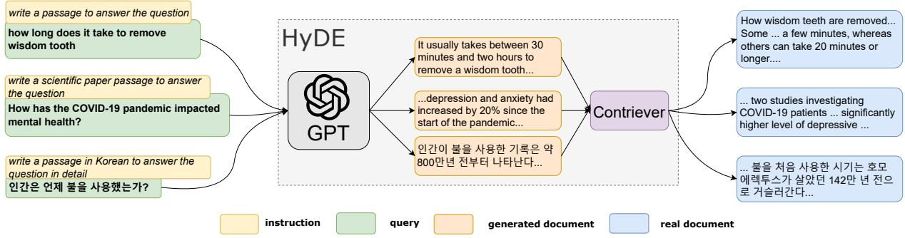
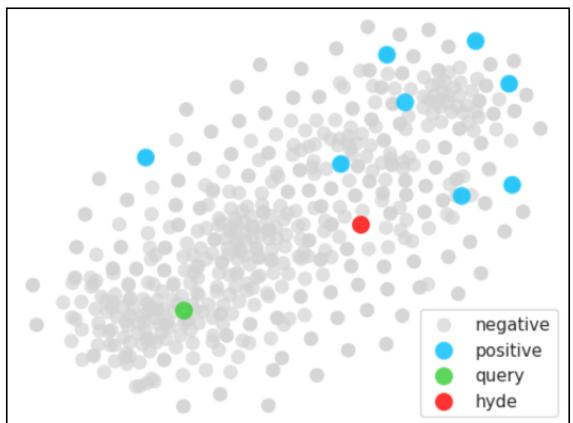
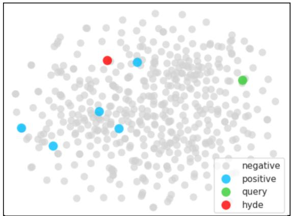

# Precise Zero-Shot Dense Retrieval without Relevance Labels

Luyu Gao∗ † Xueguang Ma∗ ‡ Jimmy Lin‡ Jamie Callan†

†Language Technologies Institute, Carnegie Mellon University ‡David R. Cheriton School of Computer Science, University of Waterloo

{luyug, callan}@cs.cmu.edu, {x93ma, jimmylin}@uwaterloo.ca

## Abstract

While dense retrieval has been shown to be effective and efficient across tasks and languages, it remains difficult to create effective fully zero-shot dense retrieval systems when no relevance labels are available. In this paper, we recognize the difficulty of zero-shot learning and encoding relevance. Instead, we propose to pivot through Hypothetical Document Embeddings (HyDE). Given a query, HyDE first zero-shot prompts an instruction-following language model (e.g., InstructGPT) to generate a hypothetical document. The document cap tures relevance patterns but is “fake” and may contain hallucinations. Then, an unsupervised contrastively learned encoder (e.g., Contriever) encodes the document into an embedding vector. This vector identifies a neighborhood in the corpus embedding space, from which similar real documents are retrieved based on vector similarity. This second step grounds the generated document to the actual corpus, with the encoder’s dense bottleneck filtering out the hallucinations. Our experiments show that HyDE significantly outperforms the state-ofthe-art unsupervised dense retriever Contriever and shows strong performance comparable to fine-tuned retrievers across various tasks (e.g. web search, QA, fact verification) and in non-English languages (e.g., sw, ko, ja, bn).1

## 1 Introduction

Dense retrieval (Lee et al., 2019; Karpukhin et al., 2020), the method of retrieving documents using semantic embedding similarities, has been shown to be successful across tasks like web search, question answering, and fact verification. A variety of methods such as negative mining (Xiong et al., 2021; Qu et al., 2021), distillation (Qu et al., 2021; Lin et al., 2021b; Hofstätter et al., 2021), retrievalspecific pre-training (Izacard et al., 2021; Gao and

Callan, 2021; Lu et al., 2021; Gao and Callan, 2022; Liu and Shao, 2022) and scaling (Ni et al., 2022) have been proposed to improve the effectiveness of supervised dense retrieval models.

Nevertheless, zero-shot dense retrieval still remains difficult. Many recent works consider the alternative transfer learning setup, where the dense retrievers are trained on a high-resource dataset and then evaluated on queries from different domains. MS MARCO (Bajaj et al., 2016), a dataset with a large number of manually judged query-document pairs, is the most commonly used. As argued by Izacard et al. (2021), in practice, however, the existence of such a large dataset cannot always be assumed. Furthermore, MS MARCO restricts commercial use and cannot be adopted in a variety of real-world search scenarios.

In this paper, we aim to build effective fully zero-shot dense retrieval systems that require no relevance supervision, work out-of-box and generalize across emerging search tasks. As supervision is not available, we start by examining self-supervised representation learning methods. Modern deep learning enables two distinct approaches. At the token level, generative large language models (LLMs) pre-trained on large corpora have demonstrated strong natural language understanding (NLU) and generation (NLG) capabilities (Brown et al., 2020; Chen et al., 2021; Rae et al., 2021; Hoffmann et al., 2022; Thoppilan et al., 2022; Chowdhery et al., 2022). At the document level, text (chunk) encoders pre-trained with contrastive objectives learn to encode documentdocument similarity into inner products (Izacard et al., 2021; Gao and Callan, 2022).

On top of these, one extra insight from LLMs is borrowed: LLMs further trained to follow instructions can zero-shot generalize to diverse unseen instructions (Ouyang et al., 2022; Sanh et al., 2022; Min et al., 2022; Wei et al., 2022). In particular, InstructGPT shows that with a small amount of data,

  
Figure 1: An illustration of the HyDE model. Document snippets are shown. HyDE serves all types of queries without changing the underlying InstructGPT and Contriever/mContriever models.

GPT-3 (Brown et al., 2020) models can be aligned to human intents to follow instructions faithfully.

With these ingredients, we propose to pivot through Hypothetical Document Embeddings (HyDE) and decompose dense retrieval into two tasks: a generative task performed by an instructionfollowing language model and a documentdocument similarity task performed by a contrastive encoder (Figure 1). First, we feed the query to the generative model and instruct it to “write a document that answers the question”, i.e., a hypothetical document. We expect the generative process to capture “relevance” by providing an example; the generated document is not real, can contain factual errors, but is “like” a relevant document. In the second step, we use an unsupervised contrastive encoder to encode this document into an embedding vector. Here, we expect the encoder’s dense bottleneck to serve as a lossy compressor, where the extra (hallucinated) details are filtered out from the embedding. We use this vector to search against the corpus embeddings. The most similar real documents are retrieved and returned. The retrieval leverages document-document similarity encoded in the inner product learned in the contrastive pre-training stage.

Note that, interestingly, with our proposed HyDE factorization, query-document similarity scores are no longer explicitly modeled or computed. Instead, the retrieval task is cast into two tasks (NLU and NLG). Building HyDE requires no supervision and no new model is trained in this work: both the generative model and the contrastive encoder are used “out of the box” without any adaptation or modification.

In our experiments, we show that HyDE using InstructGPT (Ouyang et al., 2022) and Contriever (Izacard et al., 2021) “as is” significantly outperforms the previous state-of-the-art

Contriever-only zero-shot model on 11 query sets, covering tasks like web search, question answering, fact verification and in languages like Swahili, Korean, Japanese and Bengali.

## 2 Related Work

Self-Supervised Learning This approach is one of the most popular topics in NLP (Devlin et al., 2019; Brown et al., 2020). Masked language models like BERT (Devlin et al., 2019) have demonstrated strong capabilities in representing text. Large language models (LLMs) with hundreds of billions of parameters have shown remarkable generalization capabilities under few-shot and zero-shot setups across various tasks (Brown et al., 2020; Chowdhery et al., 2022). Despite their broad success, zero- or few-shot learning in LLMs have rarely been used directly in ranking (Liang et al., 2022), with the only exception being Sachan et al. (2022), which performs zero-shot re-ranking.

Aside from language modeling, contrastive learning methods help neural language models learn to represent chunks (e.g., sentences or passages) of texts as embedding vectors. Without the need of any supervision, such contrastive encoders can embed homogeneous text chunks into a vector space where some distance function like inner product captures similarities (Gao et al., 2021; Izacard et al., 2021).

Instructions-Following Models Soon after the emergence of LLMs, several groups of researchers discovered that LLMs trained on data consisting of instructions and their execution can zero-shot generalize to perform new tasks with new instructions (Ouyang et al., 2022; Sanh et al., 2022; Min et al., 2022; Wei et al., 2022). This can be performed using standard supervised sequenceto-sequence learning techniques or more effectively with reinforcement learning from human feedback (Ouyang et al., 2022).

Concurrent to us, Asai et al. (2022) and Su et al. (2022) studied task-aware retrieval with instructions. They fine-tuned dense encoders that can also encode task-specific instructions prepended to queries. In contrast, we use an unsupervised encoder and handle different tasks using generative LLMs without the need to perform any fine-tuning.

Dense Retrieval Document retrieval in dense vector space (Lee et al., 2019; Karpukhin et al., 2020) has been extensively studied after the emergence of pre-trained Transformer language models (Devlin et al., 2019). Researchers have studied metric learning problems, such as training loss (Karpukhin et al., 2020) and negative sampling (Xiong et al., 2021; Qu et al., 2021), and also introduced distillation (Qu et al., 2021; Lin et al., 2021b; Hofstätter et al., 2021). Later works studied the second stage pre-training of language models specifically for retrieval (Izacard et al., 2021; Gao and Callan, 2021; Lu et al., 2021; Gao and Callan, 2022; Liu and Shao, 2022) as well as model scaling (Ni et al., 2022). All of these methods rely on supervised contrastive learning.

The popularity of dense retrieval can be partially attributed to complementary research in efficient minimum inner product search (MIPS) at very large (billion) scales (Johnson et al., 2021).

Zero-Shot Dense Retrieval The task of zeroshot (dense) retrieval was made empirically prominent to the neural retrieval community by Thakur et al. (2021); their BEIR benchmark encompasses diverse retrieval tasks. The paper and much followup research consider the transfer learning setup where the dense retriever is first trained using a diverse and large manually labeled dataset, namely MS MARCO (Thakur et al., 2021; Wang et al., 2022; Yu et al., 2022).

However, as stated by Izacard et al. (2021), such a large collection can rarely be assumed. In this paper, therefore, we study the problem of building effective dense retrieval systems without any relevance labels. Similar to their work, we also do not assume access to the test corpora during training. This is a more realistic setup and better aligns with emerging zero-shot search needs.

By the definition in Sachan et al. (2022), our setup is unsupervised. Similar to that work, we also rely on the ability of instruction-following language models to perform search tasks. In the rest of this paper, we do not make a precise distinction between zero-shot and unsupervised, and will use the terms interchangeably to describe our setup: we assume that no test-time query, document or large-scale supervision exists.

Automatic Labeling In contrast to our setup of dealing with emerging unseen search tasks, several previous works have studied building dense search systems where a document collection exists but no relevance labels are available. While the intuitive default approach is collecting relevance judgments from human annotators (Bajaj et al., 2016; Kwiatkowski et al., 2019; Clark et al., 2020; Craswell et al., 2020), Wang et al. (2022) proposed a pipeline consisting of question generation (Ma et al., 2021; Lewis et al., 2021), negative mining and automatic labeling using large language models, and have shown it to be an effective alternative. Dai et al. (2023) showed that the pipeline can benefit from using larger hundred-billion-scale language models. Bonifacio et al. (2022) showed that a similar pipeline can be used for training re-rankers.

Generative Retrieval Generative search is a new class of retrieval methods that uses neural generative models as search indexes (Metzler et al., 2021; Tay et al., 2022; Bevilacqua et al., 2022; Lee et al., 2022). These models use (constrained) decoding to generate document identifiers that map directly to real documents. They have to go through special training procedures over relevance data; effective search may also need to use novel forms of search index structures (Bevilacqua et al., 2022; Lee et al., 2022). In comparison, our method uses standard MIPS indexes and requires no training data. Our generative model produces an intermediate hypothetical document to be fed into a dense encoder, instead of a real document.

## 3 Methodology

In this section, we first formally define the problem of (zero-shot) dense retrieval. Then we will introduce how HyDE is designed to solve it.

## 3.1 Preliminaries

Dense retrieval models aim to capture similarity between queries and documents with inner product similarity. Given a query q and document d, the approach uses two encoder functions, encq and encd (which might be identical), to map both segments of text into d dimensional vectors $\mathbf { v _ { q } }$ and $\mathbf { v _ { d } }$ , whose inner product is used as a similarity measurement for capturing relevance:

Please write a passage to answer the question.  
Question: what is wifi vs bluetooth  
Passage: Wi-Fi and Bluetooth are two different types of wireless technology. Wi-Fi is a local area network technology that  
uses radio waves to provide high-speed internet and network connections. Bluetooth is a short-range wireless technology  
that allows for the exchange of data between two devices over short distances.  
Please write a scientific paper passage to answer the question.  
Question: how long does coronavirus remain stable on surfaces?  
Passage: Recent studies have revealed that the novel coronavirus, SARS-CoV-2, can remain stable on surfaces for up to  
nine days. In a study conducted at the National Institute of Allergy and Infectious Diseases (NIAID), researchers found that  
the virus was stable on plastic and stainless steel surfaces for up to three days, and on cardboard for up to 24 hours.  
Please write a passage in Japanese to answer the question in detail.  
Question: 海底ケーブルが初めて結ばれたのはどこ？  
Passage: 海底ケーブルが初めて結ばれたのは1866年、イギリスとフランスをつなぐケーブルが結ばれたアイルランドの  
海岸沿いにあるヴァレンタイン島です。ヴァレンタイン島はアイルランドの西海岸に位置しており、ケーブルはヴァレン  
タイン島からフランスのブレスト湾まで延びました。このケーブルは、イギリスとフランス間の通信を可能にしました。  
Figure 2: Illustration of HyDE running on InstructGPT. Three queries from TREC DL, TREC-COVID and Mr.TyDi are shown. For each, we include the instruction, example query and a generated hypothetical document (green).

$$
\sin ( \mathbf { q } , \mathbf { d } ) = \left. \operatorname { e n c } _ { q } ( \mathbf { q } ) , \operatorname { e n c } _ { d } ( \mathbf { d } ) \right. = \left. \mathbf { v _ { q } } , \mathbf { v _ { d } } \right.\tag{1}
$$

For zero-shot retrieval, we consider L query sets $Q _ { 1 } , Q _ { 2 } , . . . , Q _ { L }$ and the corresponding corpora we are searching in, document sets $D _ { 1 } , D _ { 2 } , . . . , D _ { L }$ Denote the j-th query from i-th set query set $Q _ { i }$ as $\mathrm { q } _ { i j }$ . We need to fully define the encoders $\mathrm { e n c } _ { q }$ and en $\complement d$ without access to any query set $Q _ { i } .$ , document set $D _ { i }$ , or any relevance judgment $r _ { i j }$

The difficulty of zero-shot dense retrieval lies precisely in Equation 1: it requires learning two embedding functions (for the query and the document, respectively) into the same embedding space, where inner product captures relevance. Without relevance judgments and/or scores as training data, learning becomes difficult.

## 3.2 HyDE

HyDE circumvents the aforementioned learning challenge by performing search in a documentonly embedding space that captures documentdocument similarity. This can be easily learned using unsupervised contrastive learning techniques (Izacard et al., 2021; Gao et al., 2021; Gao and Callan, 2022). We set the document encoder en $\complement d$ directly as a contrastive encoder enccon:

$$
f = \mathrm { e n c } _ { d } = \mathrm { e n c } _ { \mathrm { c o n } }\tag{2}
$$

This function is denoted f for simplicity. This unsupervised contrastive encoder will be shared by all incoming documents.

$$
\mathbf { v _ { d } } = f ( d ) \quad \forall d \in D _ { 1 } \cup D _ { 2 } \cup \ldots \cup D _ { L }\tag{3}
$$

To build the query vector, we consider in addition an instruction-following LM, InstructLM. It takes a query q and a textual instruction INST and follows them to perform the task specified by INST. For simplicity, denote:

$$
g ( q , \mathrm { \ I N S T } ) = \mathrm { I n s t r u c t L M } ( q , \mathrm { \ I N S T } )\tag{4}
$$

Now we can use g to map queries to “hypothetical” documents by sampling from $^ { g , }$ setting INST to be “write a paragraph that answers the question” (or an analogous prompt).

We emphasize that the generated document is not real. In fact, it can and is likely to be ungrounded factually, suffering from hallucinations (Brown et al., 2020; Thoppilan et al., 2022). We only require the “fake” document to capture relevance patterns. This is done by generating documents, i.e., providing examples. Critically, here we offload relevance modeling from the representation learning model to an NLG model that generalizes significantly more easily, naturally, and effectively (Brown et al., 2020; Ouyang et al., 2022). Generating examples also replaces explicit modeling of relevance scores.

We can now encode the generated document using the document encoder $f .$ Concretely, for some query $q _ { i j }$ from query collection $Q _ { i } ,$ , we can use an instruction INSTi and compute:

$$
\mathbb { E } [ { \bf v } _ { q _ { i j } } ] = \mathbb { E } [ f ( g ( q _ { i j } , \mathrm { I N S T } _ { i } ) ) ]\tag{5}
$$

Formally, $g$ defines a probability distribution over natural language sequences based on the chain rule. In this paper, we simply consider the expectation, assuming the distribution of $\mathbf { v } _ { q _ { i j } }$ is uni-modal. We estimate Equation 5 by sampling N documents from $g , [ \hat { d } _ { 1 } , \hat { d } _ { 2 } , . . . , \hat { d _ { N } } ]$

$$
\hat { \mathbf { v } } _ { q _ { i j } } = \frac { 1 } { N } \sum _ { \hat { d _ { k } } \sim g ( q _ { i j } , \mathrm { I N S T } _ { i } ) } f ( \hat { d _ { k } } )\tag{6}
$$

$$
\frac { 1 } { N } \sum _ { k = 1 } ^ { N } f ( \hat { d } _ { k } )\tag{7}
$$

We also consider the query as a possible hypothesis:

$$
\hat { \mathbf { v } } _ { q _ { i j } } = \frac { 1 } { N + 1 } [ \sum _ { k = 1 } ^ { N } f ( \hat { d } _ { k } ) + f ( q _ { i j } ) ]\tag{8}
$$

Inner product is computed between $\hat { \mathbf { v } } _ { q _ { i j } }$ and the set of all document vectors:

$$
\sin ( \mathbf { q } _ { i j } , \mathbf { d } ) = \langle \hat { \bf v } _ { q _ { i j } } , { \bf v } _ { d } \rangle \quad \forall d \in D _ { i }\tag{9}
$$

The most similar documents are retrieved. Here, the encoder function f serves as a lossy compressor that outputs dense vectors, where extra details are filtered and left out of the vector. It further “grounds” the hypothetical vector to the actual corpus and real documents. The full HyDE method is illustrated in Figure 1.

## 4 Experiments

In this section, we discuss how we implement HyDE and test it as a zero-shot out-of-box search system. We show how much HyDE improves over the base unsupervised dense encoder as well as how it compares to models with rich supervision.

## 4.1 Setup

Implementation Our HyDE approach can be implemented using any pair of instruction-following language model and contrastive text encoder. Without loss of generality, we pick contemporary and widely adopted models: we implement HyDE using InstructGPT, a GPT-3 model from the instruct series (Ouyang et al., 2022)2 and Contriever model variants (Izacard et al., 2021). We use the Englishonly Contriever model for English retrieval tasks and the multilingual mContriever for non-English tasks, as designed by Izacard et al. (2021). The InstructGPT model is applied in all tasks. We sample from InstructGPT using the OpenAI API with a default temperature of 0.7 for open-ended generation. We conducted retrieval experiments with the Pyserini toolkit (Lin et al., 2021a).

Datasets We desire to show that HyDE is an effective out-of-box solution for diverse search tasks. It is important to note that since neither our generative model nor our encoder model has learned any knowledge for search tasks, we can use any test collection to assess HyDE’s capability in handling diverse search needs.

We first consider general web test collections. We use data from TREC DL19 (Craswell et al., 2020) and DL20 (Craswell et al., 2021), which are based on the MS MARCO dataset (Bajaj et al., 2016). We report the official metrics, mAP, nDCG@10 and Recall@1k.

Beyond web collections, we use a set of seven low-resource retrieval datasets comprising different topics and formats from BEIR (Thakur et al., 2021), including Scifact (scientific paper abstracts; Wadden et al. 2020), Arguana (argument retrieval; Wachsmuth et al. 2018), TREC-COVID (COVID-19 scientific papers; Voorhees et al. 2020), FiQA (financial articles; Maia et al. 2018), DBPedia (entity retrieval; Hasibi et al. 2017), TREC-NEWS (news articles; Soboroff et al. 2019), Climate-Fever (climate fact verification; Diggelmann et al. 2020). We report the official metrics, nDCG@10 and Recall@100.

Finally, we test HyDE on non-English retrieval. For this, we consider Swahili, Korean, Japanese and Bengali from Mr.TyDi (Zhang et al., 2021), an open retrieval dataset constructed from TyDi QA (Clark et al., 2020). We report the official metric, MRR@100.

We use different instructions for each dataset. They share a similar structure but have different prompts to control the exact form of the generated hypothetical documents. These instructions can be found in subsection A.1.

Compared Systems The two Contriever model variants, Contriever and mContriever, serve as our main points of comparison. They are trained using unsupervised contrastive learning. HyDE uses Contriever and mContriever as encoders and therefore shares the exact same embedding spaces with them. The only difference is how the query vector is built. These comparisons allow us to easily examine the effects of HyDE. The traditional heuristic-based lexical retriever BM25 is also included, which has been shown to be (surprisingly) more effective than previous zero-shot methods in many cases (Thakur et al., 2021; Izacard et al., 2021).

Several systems that involve fine-tuning on large amounts of relevance data are also included as references. We consider models fine-tuned on MS MARCO and transferred across domains, DPR and ANCE, from the BEIR paper. For multilingual retrieval, we include the mDPR model from the Mr.TyDi paper and MS MARCO fine-tuned mBERT and XLM-R from the Contriever paper.

<table><tr><td></td><td>mAP</td><td>DL19 nDCG@10</td><td>Recall@1k</td><td>mAP</td><td>DL20 nDCG@10</td><td>Recall@1k</td></tr><tr><td colspan="7">Unsupervised</td></tr><tr><td>BM25</td><td>30.1</td><td>50.6</td><td>75.0</td><td>28.6</td><td>48.0</td><td>78.6</td></tr><tr><td>Contriever</td><td>24.0</td><td>44.5</td><td>74.6</td><td>24.0</td><td>42.1</td><td>75.4</td></tr><tr><td>HyDE</td><td>41.8</td><td>61.3</td><td>88.0</td><td>38.2</td><td>57.9</td><td>84.4</td></tr><tr><td colspan="7">Supervised</td></tr><tr><td>DPR</td><td>36.5</td><td>62.2</td><td>76.9</td><td>41.8</td><td>65.3</td><td>81.4</td></tr><tr><td>ANCE</td><td>37.1</td><td>64.5</td><td>75.5</td><td>40.8</td><td>64.6</td><td>77.6</td></tr><tr><td>Contriever-ft</td><td>41.7</td><td>62.1</td><td>83.6</td><td>43.6</td><td>63.2</td><td>85.8</td></tr></table>

Table 1: Results for web search on DL19/20. Best performing w/o relevance and overall system(s) are marked bold. DPR, ANCE and Contriever-ft are in-domain supervised models that are fine-tuned on MS MARCO training data.
<table><tr><td></td><td>Scifact</td><td>Arguana</td><td>Trec-Covid</td><td>FiQA</td><td>DBPedia</td><td>TREC-NEWS</td><td>Climate-Fever</td></tr><tr><td colspan="8">nDCG@10</td></tr><tr><td>Unsupervised BM25</td><td>67.9</td><td>39.7</td><td>59.5</td><td>23.6</td><td>31.8</td><td>39.5</td><td>16.5</td></tr><tr><td>Contriever</td><td>64.9</td><td>37.9</td><td>27.3</td><td>24.5</td><td>29.2</td><td>34.8</td><td>15.5</td></tr><tr><td>HyDE</td><td>69.1</td><td>46.6</td><td>59.3</td><td>27.3</td><td>36.8</td><td>44.0</td><td>22.3</td></tr><tr><td>Supervised</td><td></td><td></td><td></td><td></td><td></td><td></td><td></td></tr><tr><td>DPR</td><td>31.8</td><td>17.5</td><td>33.2</td><td>29.5</td><td>26.3</td><td>16.1</td><td>14.8</td></tr><tr><td>ANCE</td><td>50.7</td><td>41.5</td><td>65.4</td><td>30.0</td><td>28.1</td><td>38.2</td><td>19.8</td></tr><tr><td>Contriever-ft</td><td>67.7</td><td>44.6</td><td>59.6</td><td>32.9</td><td>41.3</td><td>42.8</td><td>23.7</td></tr><tr><td></td><td></td><td></td><td></td><td></td><td></td><td></td><td></td></tr><tr><td colspan="8">Recall@100</td></tr><tr><td>Unsupervised BM25</td><td></td><td></td><td></td><td></td><td></td><td></td><td></td></tr><tr><td>Contriever</td><td>92.5</td><td>93.2</td><td>49.8</td><td>54.0</td><td>46.8</td><td>44.7</td><td>42.5</td></tr><tr><td>HyDE</td><td>92.6 96.4</td><td>90.1 97.9</td><td>17.2 41.4</td><td>56.2 62.1</td><td>45.3 47.2</td><td>42.3</td><td>44.1</td></tr><tr><td></td><td></td><td></td><td></td><td></td><td></td><td>50.9</td><td>53.0</td></tr><tr><td>Supervised</td><td></td><td></td><td></td><td></td><td></td><td></td><td></td></tr><tr><td>DPR</td><td>72.7</td><td>75.1</td><td>21.2</td><td>34.2</td><td>34.9</td><td>21.5</td><td>39.0</td></tr><tr><td>ANCE</td><td>81.6</td><td>93.7</td><td>45.7</td><td>58.1</td><td>31.9</td><td>39.8</td><td>44.5</td></tr><tr><td>Contriever-ft</td><td>94.7</td><td>97.7</td><td>40.7</td><td>65.6</td><td>54.1</td><td>49.2</td><td>57.4</td></tr></table>

Table 2: Results for a selection of low-resource tasks from BEIR. Best performing w/o relevance and overall system(s) are marked bold.

We also include state-of-the-art transfer learning models: Contriever and mContriever finetuned on MS MARCO, denoted Contriever-ft and mContriever-ft, respectively. These models are finetuned versions of HyDE’s base encoder. They have run through a state-of-the-art retrieval model training pipeline that involves second-stage retrievalspecific pre-training (Lee et al., 2019) and a few rounds of fine-tuning (Qu et al., 2021); these should be considered “empirical upper bounds” in terms of what’s achievable with modern best practices. Additional models that assume access to test documents (except MS MARCO) are not considered as the setup differs from ours. We acknowledge that human and/or automatic labels on test documents can boost performance compared to zero-shot systems (Wang et al., 2022). However, such setups gain performance at the cost of the system’s agility and generality.

## 4.2 Web Search

In Table 1, we show retrieval results on TREC DL19 and TREC DL20. We see that HyDE brings sizable improvements to Contriever across the board for both precision-oriented and recall metrics. While unsupervised Contriever can underperform the lexical BM25 approach, HyDE outperforms BM25 by large margins.

HyDE remains competitive even when compared to fine-tuned models. Note that TREC DL19/20 are search tasks defined on MS MARCO and there, all the fine-tuned models have received a wealth of supervision. On TREC DL19, HyDE shows comparable mAP and nDCG@10 to Contriever-ft and the best Recall@1k. On DL20, HyDE gets around 10% lower mAP and nDCG@10 than Contriever-ft but similar Recall@1k. The ANCE model shows better nDCG@10 numbers than HyDE but lower recall, suggesting it may be biased to a subset of queries and/or relevant documents.

<table><tr><td></td><td>SW</td><td>ko</td><td>ja</td><td>bn</td></tr><tr><td>Unsupervised</td><td></td><td></td><td></td><td></td></tr><tr><td>BM25</td><td>38.9</td><td>28.5</td><td>21.2</td><td>41.8</td></tr><tr><td>mContriever</td><td>38.3</td><td>22.3</td><td>19.5</td><td>35.3</td></tr><tr><td>HyDE</td><td>41.7</td><td>30.6</td><td>30.7</td><td>41.3</td></tr><tr><td>Supervised</td><td></td><td></td><td></td><td></td></tr><tr><td>mDPR</td><td>7.3</td><td>21.9</td><td>18.1</td><td>25.8</td></tr><tr><td>mBERT</td><td>37.4</td><td>28.1</td><td>27.1</td><td>35.1</td></tr><tr><td>XLM-R</td><td>35.1</td><td>32.2</td><td>24.8</td><td>41.7</td></tr><tr><td>mContriever-ft</td><td>51.2</td><td>34.2</td><td>32.4</td><td>42.3</td></tr></table>

Table 3: Results on Mr.TyDi in terms of MRR@100. Best performing unsupervised and overall system(s) are marked bold.

## 4.3 Low-Resource Retrieval

In Table 2, we show retrieval results for a selection of low-resource tasks from BEIR. Similar to web search, HyDE again brings sizable improvements to Contriever across the board in terms of both nDCG@10 and Recall@100. HyDE is only outperformed by BM25 on one dataset, TREC-COVID, but by a tiny margin on nDCG@10; in comparison, the underlying Contriever model alone underperforms by more than 50%.

We also observe that HyDE demonstrates strong performance compared to fine-tuned models. Our approach generally shows better performance than ANCE and DPR, even though the two models are fine-tuned on MS MARCO, and ANCE additionally leverages hard-negative mining techniques. Contriever-ft shows non-trivial performance advantages on FiQA and DBPedia. These involve retrieval of financial posts and entities, respectively. We believe the performance differences can be attributed to the under-specification of the instructions; more elaborate prompts may help.

## 4.4 Multilingual Retrieval

The multilingual setup poses several additional challenges to HyDE. The small contrastive encoder gets saturated as the number of languages scales (Conneau et al., 2020; Izacard et al., 2021). Meanwhile, our generative LLM faces the opposite issue: with languages not as high resource as English or French, the LLMs are over-parameterized and hence under-trained (Hoffmann et al., 2022).

<table><tr><td rowspan="2">Model</td><td colspan="2">DL19</td><td colspan="2">DL20</td></tr><tr><td>mAP</td><td>nDCG@10</td><td>mAP</td><td>nDCG@10</td></tr><tr><td>Contriever</td><td>24.0</td><td>44.5</td><td>24.0</td><td>42.1</td></tr><tr><td>HyDE</td><td></td><td></td><td></td><td></td></tr><tr><td>w/ Flan-T5</td><td>32.1</td><td>48.9</td><td>34.7</td><td>52.9</td></tr><tr><td>w/ Cohere</td><td>34.1</td><td>53.8</td><td>36.3</td><td>53.8</td></tr><tr><td>w/ InstructGPT</td><td>41.8</td><td>61.3</td><td>38.2</td><td>57.9</td></tr></table>

Table 4: nDCG@10 on TREC DL19/20 comparing the effects of changing different instruction LMs on unsupervised Contriever. Best performing results are marked bold.

Nevertheless, in Table 3, we still find that HyDE is able to improve over the mContriever model. It can outperform non-Contriever models fine-tuned on and transferred from MS MARCO. On the other hand, we do observe some gaps between HyDE and fine-tuned mContriever-ft. Since HyDE and mContriever-ft use similar contrastive encoders, we hypothesize this is because the non-English languages we considered are under-trained in both pre-training and instruction-learning stages.

## 5 Analysis

The generative LLM and contrastive encoder make up the two core components of HyDE. In this section, we study the effects of changing their realizations. In particular, we consider smaller language models (LMs), LMs without instruction following and fine-tuned encoders. We also demonstrate a way to visualize and better understand HyDE.

## 5.1 Effect of Different Generative Models

In Table 4, we show HyDE using other instructionfollowing language models. In particular, we consider the 52-billion parameter Cohere model (command-xlarge-20221108) and the 11-billion parameter FLAN model (FLAN-T5-xxl) (Wei et al., 2022).3 Generally, we observe that all models bring improvements to the unsupervised Contriever, with larger models bringing bigger improvements. At the time of our work, the Cohere model was still experimental, without much detail available. We can only tentatively hypothesize that training techniques may have also played some role in the performance differences.

<table><tr><td></td><td>Scifact</td><td>FiQA</td><td>DBPedia</td></tr><tr><td>Contriever</td><td>64.9</td><td>24.5</td><td>29.2</td></tr><tr><td>HyDE</td><td></td><td></td><td></td></tr><tr><td>w/ InstructGPT</td><td>69.1</td><td>27.3</td><td>36.8</td></tr><tr><td>w/ GPT-3</td><td>65.9</td><td>27.9</td><td>40.5</td></tr></table>

Table 5: nDCG@10 comparing InstructGPT vs. 3-shot GPT-3 on BEIR. Best results are marked bold.

<table><tr><td rowspan="2">Model</td><td colspan="2">DL19</td><td colspan="2">DL20</td></tr><tr><td>mAP</td><td>nDCG@10</td><td>mAP</td><td>nDCG@10</td></tr><tr><td>Contriever-ft</td><td>41.7</td><td>62.1</td><td>43.6</td><td>63.2</td></tr><tr><td>+ HyDE</td><td>48.6</td><td>67.4</td><td>46.9</td><td>63.5</td></tr><tr><td>GTR-XL</td><td>46.7</td><td>69.6</td><td>46.9</td><td>70.7</td></tr><tr><td>+ HyDE</td><td>50.6</td><td>71.9</td><td>51.5</td><td>70.8</td></tr></table>

Table 6: nDCG@10 on TREC DL19/20 comparing the effects of HyDE on supervised models. Best results are marked bold.

## 5.2 HyDE with Base Language Models

In this section, we consider using HyDE with a base GPT-3 model that has not been trained to align with human intent and does not follow instructions well. This may be a useful setup when one doesn’t have access to an instruction-tuned language model of the desired size and/or language. We use the in-context learning method (Brown et al., 2020) with three examples and conduct experiments on three BEIR datasets that come with training examples. We report results in Table 5. Here, the few-shot model performs less stably: it brings a small improvement on Scifact but can outperform InstructGPT on FiQA and DBPedia.

## 5.3 HyDE with Fine-Tuned Encoders

To begin, we emphasize that HyDE with fine-tuned encoders is not the intended usage: our approach is specifically designed for cases where no relevance labels are present. Access to supervision (to finetune the encoders) naturally diminishes the impact of our approach.

Nevertheless, we are interested to find out if and how HyDE embeddings can benefit already fine-tuned encoders. We consider two fine-tuned encoders, the aforementioned Contriever-ft, which contains 110M parameters, and the much larger GTR-XL model (Ni et al., 2022) with 1.2B parameters. In Table 6, we see that the larger GTR-XL model generally outperforms Contriever-ft but HyDE can still bring improvements to both finetuned encoders. We see smaller improvements on

  
(a) Query example from TREC-COVID: What is the mechanism of inflammatory response andpathogenesis of COVID-19 cases?

  
(b) Query example from DBPedia: Which mountains are higher than the Nanga Parbat?  
Figure 3: T-SNE plots of the embedding space of Contriever for query examples and their nearby documents in the embedding space. The red points represent the hypothetical document vectors.

GTR-XL, presumably because it has not been contrastively pre-trained to explicitly learn documentdocument similarity.

## 5.4 Visualizing the Effects of HyDE

In Figure 3, we randomly pick two query examples from TREC-COVID and DBPedia to visualize the effects of HyDE. We plot the HyDE vector and the original query vector in the embedding space of Contriever using the T-SNE dimensionality reduction method. In each plot, we can see that the vectors generated by HyDE (red points) are closer to the clusters of relevant document vectors (blue points) than the original query vectors (green points). This demonstrates how the nearest neighbor search with HyDE is more effective at identifying relevant documents.

## 6 Conclusion

In this paper, we introduce HyDE, a new approach for building effective dense retrievers in a completely unsupervised manner, without the need for any relevance labels. We demonstrate that some aspects of relevance modeling can be delegated to a more powerful, flexible, and general-purpose LLM that has not specifically been adapted for search tasks. As a consequence, the need for relevance labels is eliminated, replaced by pure generation. We are excited to see if this can be generalized further to more sophisticated tasks like multi-hop retrieval/QA and conversational search.

Despite its dependence on LLMs, we argue that HyDE is of practical use in real-world applications, though not necessarily over the entire lifespan of a search system. At the very beginning of building a search system, serving queries using HyDE offers performance comparable to a fine-tuned model, which no other relevance-free model can offer. As search logs grow and relevance data accumulate, a supervised dense retriever can be gradually trained and then rolled out. As the dense retriever becomes more capable, it can handle queries that are “indomain”, while HyDE can remain useful for novel, unexpected, or emerging queries.

## Limitations

Our HyDE method relies on real-time generation from LLMs and therefore may not be suitable for tasks that demand high throughput or low latency. However, over the years we have seen the cost of hardware decrease and model compression techniques advance, which may help improve the efficiency of LLM inference. Meanwhile, as we describe in the conclusion, HyDE can be used to collect relevance judgments in real-time and gradually help ramp up an effective supervised dense retrieval model.

Besides, as with most contemporary LLMs, HyDE may prefer certain content in its generation and therefore bias the final search results. We are optimistic that this issue will be addressed as HyDE is implemented using InstructGPT, and OpenAI spends a large amount of effort to reduce model bias and toxicity (Ouyang et al., 2022). In addition, users can further guide the generation process using more elaborate prompts. In comparison, typical dense retrieval systems rely on opaque embeddings, where their biases may be more difficult to properly uncover and mitigate.

## Acknowledgments

The authors would like to thank the anonymous reviewers for their helpful feedback. This research was supported in part by the Natural Sciences and Engineering Research Council (NSERC) of Canada.

## References

Akari Asai, Timo Schick, Patrick Lewis, Xilun Chen, Gautier Izacard, Sebastian Riedel, Hannaneh Hajishirzi, and Wen tau Yih. 2022. Task-aware retrieval with instructions. arXiv:2211.09260.

Payal Bajaj, Daniel Campos, Nick Craswell, Li Deng, Jianfeng Gao, Xiaodong Liu, Rangan Majumder, Andrew McNamara, Bhaskar Mitra, Tri Nguyen, Mir Rosenberg, Xia Song, Alina Stoica, Saurabh Tiwary, and Tong Wang. 2016. MS MARCO: A human generated machine reading comprehension dataset. arXiv:1611.09268v3.

Michele Bevilacqua, Giuseppe Ottaviano, Patrick Lewis, Wen tau Yih, Sebastian Riedel, and Fabio Petroni. 2022. Autoregressive search engines: Generating substrings as document identifiers. arXiv:2204.10628.

Luiz Bonifacio, Hugo Abonizio, Marzieh Fadaee, and Rodrigo Nogueira. 2022. InPars: Unsupervised dataset generation for information retrieval. In Proceedings ofthe 45th International ACM SIGIR Conference on Research and Development in Information Retrieval, SIGIR ’22, page 2387–2392.

Tom B. Brown, Benjamin Mann, Nick Ryder, Melanie Subbiah, Jared Kaplan, Prafulla Dhariwal, Arvind Neelakantan, Pranav Shyam, Girish Sastry, Amanda Askell, Sandhini Agarwal, Ariel Herbert-Voss, Gretchen Krueger, Tom Henighan, Rewon Child, Aditya Ramesh, Daniel M. Ziegler, Jeffrey Wu, Clemens Winter, Christopher Hesse, Mark Chen, Eric Sigler, Mateusz Litwin, Scott Gray, Benjamin Chess, Jack Clark, Christopher Berner, Sam McCandlish, Alec Radford, Ilya Sutskever, and Dario Amodei. 2020. Language models are few-shot learners. In Advances in Neural Information Processing Systems 33: Annual Conference on Neural Information Processing Systems 2020, NeurIPS 2020, December 6-12, 2020, virtual.

Mark Chen, Jerry Tworek, Heewoo Jun, Qiming Yuan, Henrique Ponde, Jared Kaplan, Harrison Edwards, Yura Burda, Nicholas Joseph, Greg Brockman, Alex Ray, Raul Puri, Gretchen Krueger, Michael Petrov, Heidy Khlaaf, Girish Sastry, Pamela Mishkin, Brooke Chan, Scott Gray, Nick Ryder, Mikhail Pavlov, Alethea Power, Lukasz Kaiser, Mohammad Bavarian, Clemens Winter, Philippe Tillet, Felipe Petroski Such, David W. Cummings, Matthias Plappert, Fotios Chantzis, Elizabeth Barnes, Ariel Herbert-Voss, William H. Guss, Alex Nichol, Igor

Babuschkin, S. Arun Balaji, Shantanu Jain, Andrew Carr, Jan Leike, Joshua Achiam, Vedant Misra, Evan Morikawa, Alec Radford, Matthew M. Knight, Miles Brundage, Mira Murati, Katie Mayer, Peter Welinder, Bob McGrew, Dario Amodei, Sam McCandlish, Ilya Sutskever, and Wojciech Zaremba. 2021. Evaluating large language models trained on code. arXiv:2107.03374.

Aakanksha Chowdhery, Sharan Narang, Jacob Devlin, Maarten Bosma, Gaurav Mishra, Adam Roberts, Paul Barham, Hyung Won Chung, Charles Sutton, Sebastian Gehrmann, Parker Schuh, Kensen Shi, Sasha Tsvyashchenko, Joshua Maynez, Abhishek Rao, Parker Barnes, Yi Tay, Noam M. Shazeer, Vinod kumar Prabhakaran, Emily Reif, Nan Du, Benton C. Hutchinson, Reiner Pope, James Bradbury, Jacob Austin, Michael Isard, Guy Gur-Ari, Pengcheng Yin, Toju Duke, Anselm Levskaya, Sanjay Ghemawat, Sunipa Dev, Henryk Michalewski, Xavier García, Vedant Misra, Kevin Robinson, Liam Fedus, Denny Zhou, Daphne Ippolito, David Luan, Hyeontaek Lim, Barret Zoph, Alexander Spiridonov, Ryan Sepassi, David Dohan, Shivani Agrawal, Mark Omernick, Andrew M. Dai, Thanumalayan Sankaranarayana Pillai, Marie Pellat, Aitor Lewkowycz, Erica Moreira, Rewon Child, Oleksandr Polozov, Katherine Lee, Zongwei Zhou, Xuezhi Wang, Brennan Saeta, Mark Díaz, Orhan Firat, Michele Catasta, Jason Wei, Kathleen S. Meier-Hellstern, Douglas Eck, Jeff Dean, Slav Petrov, and Noah Fiedel. 2022. Palm: Scaling language modeling with pathways. arXiv:2204.02311.

Jonathan H. Clark, Eunsol Choi, Michael Collins, Dan Garrette, Tom Kwiatkowski, Vitaly Nikolaev, and Jennimaria Palomaki. 2020. TyDi QA: A benchmark for information-seeking question answering in typologically diverse languages. Transactions ofthe Associationfor Computational Linguistics, 8:454–470.

Alexis Conneau, Kartikay Khandelwal, Naman Goyal, Vishrav Chaudhary, Guillaume Wenzek, Francisco Guzmán, Edouard Grave, Myle Ott, Luke Zettlemoyer, and Veselin Stoyanov. 2020. Unsupervised cross-lingual representation learning at scale. In Proceedings of the 58th Annual Meeting of the Associationfor Computational Linguistics, pages 8440– 8451, Online. Association for Computational Linguistics.

Nick Craswell, Bhaskar Mitra, Emine Yilmaz, and Daniel Campos. 2021. Overview of the TREC 2020 deep learning track. arXiv:2102.07662.

Nick Craswell, Bhaskar Mitra, Emine Yilmaz, Daniel Campos, and Ellen M. Voorhees. 2020. Overview of the TREC 2019 deep learning track. arXiv:2003.07820.

Zhuyun Dai, Vincent Y Zhao, Ji Ma, Yi Luan, Jianmo Ni, Jing Lu, Anton Bakalov, Kelvin Guu, Keith Hall, and Ming-Wei Chang. 2023. Promptagator: Fewshot dense retrieval from 8 examples. In The Eleventh International Conference on Learning Representations.

Jacob Devlin, Ming-Wei Chang, Kenton Lee, and Kristina Toutanova. 2019. BERT: Pre-training of deep bidirectional transformers for language understanding. In Proceedings ofthe 2019 Conference of the North American Chapter ofthe Associationfor Computational Linguistics: Human Language Technologies, Volume 1 (Long and Short Papers), pages 4171–4186, Minneapolis, Minnesota. Association for Computational Linguistics.

Thomas Diggelmann, Jordan L. Boyd-Graber, Jannis Bulian, Massimiliano Ciaramita, and Markus Leippold. 2020. Climate-fever: A dataset for verification of real-world climate claims. arXiv:2012.00614.

Luyu Gao and Jamie Callan. 2021. Condenser: a pretraining architecture for dense retrieval. In Proceedings ofthe 2021 Conference on Empirical Methods in Natural Language Processing, pages 981–993, Online and Punta Cana, Dominican Republic. Association for Computational Linguistics.

Luyu Gao and Jamie Callan. 2022. Unsupervised corpus aware language model pre-training for dense passage retrieval. In Proceedings of the 60th Annual Meeting of the Association for Computational Linguistics (Volume 1: Long Papers), pages 2843–2853, Dublin, Ireland. Association for Computational Linguistics.

Tianyu Gao, Xingcheng Yao, and Danqi Chen. 2021. SimCSE: Simple contrastive learning of sentence embeddings. In Proceedings of the 2021 Conference on Empirical Methods in Natural Language Processing, pages 6894–6910, Online and Punta Cana, Dominican Republic. Association for Computational Linguistics.

Faegheh Hasibi, Fedor Nikolaev, Chenyan Xiong, Krisztian Balog, Svein Erik Bratsberg, Alexander Kotov, and Jamie Callan. 2017. DBpedia-Entity v2: A test collection for entity search. In Proceedings of the 40th International ACM SIGIR Conference on Research and Development in Information Retrieval, SIGIR ’17, page 1265–1268, New York, NY, USA. Association for Computing Machinery.

Jordan Hoffmann, Sebastian Borgeaud, Arthur Mensch, Elena Buchatskaya, Trevor Cai, Eliza Rutherford, Diego de Las Casas, Lisa Anne Hendricks, Johannes Welbl, Aidan Clark, Tom Hennigan, Eric Noland, Katie Millican, George van den Driessche, Bogdan Damoc, Aurelia Guy, Simon Osindero, Karen Simonyan, Erich Elsen, Jack W. Rae, Oriol Vinyals, and L. Sifre. 2022. Training compute-optimal large language models. arXiv:2203.15556.

Sebastian Hofstätter, Sheng-Chieh Lin, Jheng-Hong Yang, Jimmy Lin, and Allan Hanbury. 2021. Efficiently teaching an effective dense retriever with balanced topic aware sampling. In Proceedings of the 44th International ACM SIGIR Conference on Research and Development in Information Retrieval, SIGIR ’21, page 113–122, New York, NY, USA. Association for Computing Machinery.

Gautier Izacard, Mathilde Caron, Lucas Hosseini, Sebastian Riedel, Piotr Bojanowski, Armand Joulin, and Edouard Grave. 2021. Unsupervised dense information retrieval with contrastive learning. arXiv:2112.09118.

Jeff Johnson, Matthijs Douze, and Hervé Jégou. 2021. Billion-scale similarity search with GPUs. IEEE Transactions on Big Data, 7(3):535–547.

Vladimir Karpukhin, Barlas Oguz, Sewon Min, Patrick Lewis, Ledell Wu, Sergey Edunov, Danqi Chen, and Wen-tau Yih. 2020. Dense passage retrieval for opendomain question answering. In Proceedings of the 2020 Conference on Empirical Methods in Natural Language Processing (EMNLP), pages 6769–6781, Online. Association for Computational Linguistics.

Tom Kwiatkowski, Jennimaria Palomaki, Olivia Redfield, Michael Collins, Ankur Parikh, Chris Alberti, Danielle Epstein, Illia Polosukhin, Jacob Devlin, Kenton Lee, Kristina Toutanova, Llion Jones, Matthew Kelcey, Ming-Wei Chang, Andrew M. Dai, Jakob Uszkoreit, Quoc Le, and Slav Petrov. 2019. Natural questions: A benchmark for question answering research. Transactions ofthe Associationfor Computational Linguistics, 7:452–466.

Hyunji Lee, Sohee Yang, Hanseok Oh, and Minjoon Seo. 2022. Generative multi-hop retrieval. In Proceedings ofthe 2022 Conference on Empirical Methods in Natural Language Processing, pages 1417–1436, Abu Dhabi, United Arab Emirates. Association for Computational Linguistics.

Kenton Lee, Ming-Wei Chang, and Kristina Toutanova. 2019. Latent retrieval for weakly supervised open domain question answering. In Proceedings of the 57th Annual Meeting of the Association for Computational Linguistics, pages 6086–6096, Florence, Italy. Association for Computational Linguistics.

Patrick Lewis, Yuxiang Wu, Linqing Liu, Pasquale Minervini, Heinrich Küttler, Aleksandra Piktus, Pontus Stenetorp, and Sebastian Riedel. 2021. PAQ: 65 million probably-asked questions and what you can do with them. Transactions of the Association for Computational Linguistics, 9:1098–1115.

Percy Liang, Rishi Bommasani, Tony Lee, Dimitris Tsipras, Dilara Soylu, Michihiro Yasunaga, Yian Zhang, Deepak Narayanan, Yuhuai Wu, Ananya Kumar, Benjamin Newman, Binhang Yuan, Bobby Yan, Ce Zhang, Christian Cosgrove, Christopher D. Manning, Christopher R’e, Diana Acosta-Navas, Drew A. Hudson, E. Zelikman, Esin Durmus, Faisal Ladhak, Frieda Rong, Hongyu Ren, Huaxiu Yao, Jue Wang, Keshav Santhanam, Laurel J. Orr, Lucia Zheng, Mert Yuksekgonul, Mirac Suzgun, Nathan S. Kim, Neel Guha, Niladri S. Chatterji, Omar Khattab, Peter Henderson, Qian Huang, Ryan Chi, Sang Michael Xie, Shibani Santurkar, Surya Ganguli, Tatsunori Hashimoto, Thomas F. Icard, Tianyi Zhang, Vishrav Chaudhary, William Wang, Xuechen Li, Yifan Mai, Yuhui Zhang, and Yuta Koreeda. 2022. Holistic evaluation of language models. arXiv:2211.09110.

Jimmy Lin, Xueguang Ma, Sheng-Chieh Lin, Jheng-Hong Yang, Ronak Pradeep, and Rodrigo Nogueira. 2021a. Pyserini: A Python toolkit for reproducible information retrieval research with sparse and dense representations. In Proceedings of the 44th International ACM SIGIR Conference on Research and Development in Information Retrieval, SIGIR ’21, page 2356–2362, New York, NY, USA. Association for Computing Machinery.

Sheng-Chieh Lin, Jheng-Hong Yang, and Jimmy Lin. 2021b. In-batch negatives for knowledge distillation with tightly-coupled teachers for dense retrieval. In Proceedings of the 6th Workshop on Representation Learningfor NLP (RepL4NLP-2021), pages 163–173, Online. Association for Computational Linguistics.

Zheng Liu and Yingxia Shao. 2022. RetroMAE: Pretraining retrieval-oriented transformers via masked auto-encoder. arXiv:2205.12035.

Shuqi Lu, Di He, Chenyan Xiong, Guolin Ke, Waleed Malik, Zhicheng Dou, Paul Bennett, Tie-Yan Liu, and Arnold Overwijk. 2021. Less is more: Pretrain a strong Siamese encoder for dense text retrieval using a weak decoder. In Proceedings ofthe 2021 Conference on Empirical Methods in Natural Language Processing, pages 2780–2791, Online and Punta Cana, Dominican Republic. Association for Computational Linguistics.

Ji Ma, Ivan Korotkov, Yinfei Yang, Keith Hall, and Ryan McDonald. 2021. Zero-shot neural passage retrieval via domain-targeted synthetic question generation. In Proceedings ofthe 16th Conference ofthe European Chapter of the Association for Computational Linguistics: Main Volume, pages 1075–1088, Online. Association for Computational Linguistics.

Macedo Maia, Siegfried Handschuh, André Freitas, Brian Davis, Ross McDermott, Manel Zarrouk, and Alexandra Balahur. 2018. WWW’18 open challenge: Financial opinion mining and question answering. In Companion Proceedings ofthe The Web Conference 2018, WWW ’18, page 1941–1942, Republic and Canton of Geneva, CHE. International World Wide Web Conferences Steering Committee.

Donald Metzler, Yi Tay, Dara Bahri, and Marc Najork. 2021. Rethinking search: making domain experts out of dilettantes. SIGIR Forum, 55(1):13:1–13:27.

Sewon Min, Mike Lewis, Luke Zettlemoyer, and Hannaneh Hajishirzi. 2022. MetaICL: Learning to learn in context. In Proceedings of the 2022 Conference of the North American Chapter of the Association for Computational Linguistics: Human Language Technologies, pages 2791–2809, Seattle, United States. Association for Computational Linguistics.

Jianmo Ni, Chen Qu, Jing Lu, Zhuyun Dai, Gustavo Hernandez Abrego, Ji Ma, Vincent Zhao, Yi Luan, Keith Hall, Ming-Wei Chang, and Yinfei Yang. 2022. Large dual encoders are generalizable retrievers. In Proceedings of the 2022 Conference on Empirical

Methods in Natural Language Processing, pages 9844–9855, Abu Dhabi, United Arab Emirates. Association for Computational Linguistics.

Long Ouyang, Jeff Wu, Xu Jiang, Diogo Almeida, Carroll L. Wainwright, Pamela Mishkin, Chong Zhang, Sandhini Agarwal, Katarina Slama, Alex Ray, John Schulman, Jacob Hilton, Fraser Kelton, Luke E. Miller, Maddie Simens, Amanda Askell, Peter Welinder, Paul Francis Christiano, Jan Leike, and Ryan J. Lowe. 2022. Training language models to follow instructions with human feedback. arXiv:2203.02155.

Yingqi Qu, Yuchen Ding, Jing Liu, Kai Liu, Ruiyang Ren, Wayne Xin Zhao, Daxiang Dong, Hua Wu, and Haifeng Wang. 2021. RocketQA: An optimized training approach to dense passage retrieval for opendomain question answering. In Proceedings of the 2021 Conference ofthe North American Chapter of the Association for Computational Linguistics: Human Language Technologies, pages 5835–5847, Online. Association for Computational Linguistics.

Jack W. Rae, Sebastian Borgeaud, Trevor Cai, Katie Millican, Jordan Hoffmann, Francis Song, John Aslanides, Sarah Henderson, Roman Ring, Susannah Young, Eliza Rutherford, Tom Hennigan, Jacob Menick, Albin Cassirer, Richard Powell, George van den Driessche, Lisa Anne Hendricks, Maribeth Rauh, Po-Sen Huang, Amelia Glaese, Johannes Welbl, Sumanth Dathathri, Saffron Huang, Jonathan Uesato, John F. J. Mellor, Irina Higgins, Antonia Creswell, Nathan McAleese, Amy Wu, Erich Elsen, Siddhant M. Jayakumar, Elena Buchatskaya, David Budden, Esme Sutherland, Karen Simonyan, Michela Paganini, L. Sifre, Lena Martens, Xiang Lorraine Li, Adhiguna Kuncoro, Aida Nematzadeh, Elena Gribovskaya, Domenic Donato, Angeliki Lazaridou, Arthur Mensch, Jean-Baptiste Lespiau, Maria Tsimpoukelli, N. K. Grigorev, Doug Fritz, Thibault Sottiaux, Mantas Pajarskas, Tobias Pohlen, Zhitao Gong, Daniel Toyama, Cyprien de Masson d’Autume, Yujia Li, Tayfun Terzi, Vladimir Mikulik, Igor Babuschkin, Aidan Clark, Diego de Las Casas, Aurelia Guy, Chris Jones, James Bradbury, Matthew G. Johnson, Blake A. Hechtman, Laura Weidinger, Iason Gabriel, William S. Isaac, Edward Lockhart, Simon Osindero, Laura Rimell, Chris Dyer, Oriol Vinyals, Kareem W. Ayoub, Jeff Stanway, L. L. Bennett, Demis Hassabis, Koray Kavukcuoglu, and Geoffrey Irving. 2021. Scaling language models: Methods, analysis & insights from training Gopher. arXiv:2112.11446.

Devendra Sachan, Mike Lewis, Mandar Joshi, Armen Aghajanyan, Wen-tau Yih, Joelle Pineau, and Luke Zettlemoyer. 2022. Improving passage retrieval with zero-shot question generation. In Proceedings of the 2022 Conference on Empirical Methods in Natural Language Processing, pages 3781–3797, Abu Dhabi, United Arab Emirates. Association for Computational Linguistics.

Victor Sanh, Albert Webson, Colin Raffel, Stephen Bach, Lintang Sutawika, Zaid Alyafeai, Antoine Chaffin, Arnaud Stiegler, Arun Raja, Manan Dey,

M Saiful Bari, Canwen Xu, Urmish Thakker, Shanya Sharma Sharma, Eliza Szczechla, Taewoon Kim, Gunjan Chhablani, Nihal V. Nayak, Debajyoti Datta, Jonathan Chang, Mike Tian-Jian Jiang, Han Wang, Matteo Manica, Sheng Shen, Zheng Xin Yong, Harshit Pandey, Rachel Bawden, Thomas Wang, Trishala Neeraj, Jos Rozen, Abheesht Sharma, Andrea Santilli, Thibault Févry, Jason Alan Fries, Ryan Teehan, Teven Le Scao, Stella Biderman, Leo Gao, Thomas Wolf, and Alexander M. Rush. 2022. Multitask prompted training enables zero-shot task generalization. In The Tenth International Conference on Learning Representations, ICLR 2022, Virtual Event, April 25-29, 2022. OpenReview.net.

Ian Soboroff, Shudong Huang, and Donna Harman. 2019. TREC 2019 news track overview. In Text REtrieval Conference (TREC). TREC.

Hongjin Su, Weijia Shi, Jungo Kasai, Yizhong Wang, Yushi Hu, Mari Ostendorf, Wen tau Yih, Noah A. Smith, Luke Zettlemoyer, and Tao Yu. 2022. One embedder, any task: Instruction-finetuned text embeddings. arXiv:2212.09741.

Yi Tay, Vinh Q. Tran, Mostafa Dehghani, Jianmo Ni, Dara Bahri, Harsh Mehta, Zhen Qin, Kai Hui, Zhe Zhao, Jai Gupta, Tal Schuster, William W. Cohen, and Donald Metzler. 2022. Transformer memory as a differentiable search index. arXiv:2202.06991.

Nandan Thakur, Nils Reimers, Andreas Rücklé, Abhishek Srivastava, and Iryna Gurevych. 2021. BEIR: A heterogeneous benchmark for zero-shot evaluation of information retrieval models. In Thirty-fifth Conference on Neural Information Processing Systems Datasets and Benchmarks Track (Round 2).

Romal Thoppilan, Daniel De Freitas, Jamie Hall, Noam M. Shazeer, Apoorv Kulshreshtha, Heng-Tze Cheng, Alicia Jin, Taylor Bos, Leslie Baker, Yu Du, Yaguang Li, Hongrae Lee, Huaixiu Zheng, Amin Ghafouri, Marcelo Menegali, Yanping Huang, Maxim Krikun, Dmitry Lepikhin, James Qin, Dehao Chen, Yuanzhong Xu, Zhifeng Chen, Adam Roberts, Maarten Bosma, Yanqi Zhou, Chung-Ching Chang, I. A. Krivokon, Willard James Rusch, Marc Pickett, Kathleen S. Meier-Hellstern, Meredith Ringel Morris, Tulsee Doshi, Renelito Delos Santos, Toju Duke, Johnny Hartz Søraker, Ben Zevenbergen, Vinodkumar Prabhakaran, Mark Díaz, Ben Hutchinson, Kristen Olson, Alejandra Molina, Erin Hoffman-John, Josh Lee, Lora Aroyo, Ravindran Rajakumar, Alena Butryna, Matthew Lamm, V. O. Kuzmina, Joseph Fenton, Aaron Cohen, Rachel Bernstein, Ray Kurzweil, Blaise Aguera-Arcas, Claire Cui, Marian Croak, Ed Huai hsin Chi, and Quoc Le. 2022. LaMDA: Language models for dialog applications. arXiv:2201.08239.

Ellen M. Voorhees, Tasmeer Alam, Steven Bedrick, Dina Demner-Fushman, William R. Hersh, Kyle Lo, Kirk Roberts, Ian Soboroff, and Lucy Lu Wang. 2020. TREC-COVID: Constructing a pandemic information retrieval test collection. arXiv:2005.04474.

Henning Wachsmuth, Shahbaz Syed, and Benno Stein. 2018. Retrieval of the best counterargument without prior topic knowledge. In Proceedings of the 56th Annual Meeting of the Association for Computational Linguistics (Volume 1: Long Papers), pages 241–251, Melbourne, Australia. Association for Computational Linguistics.

David Wadden, Shanchuan Lin, Kyle Lo, Lucy Lu Wang, Madeleine van Zuylen, Arman Cohan, and Hannaneh Hajishirzi. 2020. Fact or fiction: Verifying scientific claims. In Proceedings of the 2020 Conference on Empirical Methods in Natural Language Processing (EMNLP), pages 7534–7550, Online. Association for Computational Linguistics.

Kexin Wang, Nandan Thakur, Nils Reimers, and Iryna Gurevych. 2022. GPL: Generative pseudo labeling for unsupervised domain adaptation of dense retrieval. In Proceedings of the 2022 Conference of the North American Chapter of the Association for Computational Linguistics: Human Language Technologies, pages 2345–2360, Seattle, United States. Association for Computational Linguistics.

Jason Wei, Maarten Bosma, Vincent Y. Zhao, Kelvin Guu, Adams Wei Yu, Brian Lester, Nan Du, Andrew M. Dai, and Quoc V. Le. 2022. Finetuned language models are zero-shot learners. In The Tenth International Conference on Learning Representations, ICLR 2022, Virtual Event, April 25-29, 2022. OpenReview.net.

Lee Xiong, Chenyan Xiong, Ye Li, Kwok-Fung Tang, Jialin Liu, Paul N. Bennett, Junaid Ahmed, and Arnold Overwijk. 2021. Approximate nearest neighbor negative contrastive learning for dense text retrieval. In 9th International Conference on Learning Representations, ICLR 2021, Virtual Event, Austria, May 3-7, 2021. OpenReview.net.

Yue Yu, Chenyan Xiong, Si Sun, Chao Zhang, and Arnold Overwijk. 2022. COCO-DR: Combating the distribution shift in zero-shot dense retrieval with contrastive and distributionally robust learning. In Proceedings of the 2022 Conference on Empirical Methods in Natural Language Processing, pages 1462– 1479, Abu Dhabi, United Arab Emirates. Association for Computational Linguistics.

Xinyu Zhang, Xueguang Ma, Peng Shi, and Jimmy Lin. 2021. Mr. TyDi: A multi-lingual benchmark for dense retrieval. arXiv:2108.08787.

## A Appendix

## A.1 Instructions

## Web Search

Please write a passage to answer the question   
Question: [QUESTION]   
Passage:

## SciFact

Please write a scientific paper passage to support or   
refute the claim   
Claim: [CLAIM]   
Passage:

## Arguana

Please write a counter argument for the passage   
Passage: [PASSAGE]   
Counter Argument:

## TREC-COVID

Please write a scientific paper passage to answer the   
question   
Question: [QUESTION]   
Passage:

## FiQA

Please write a financial article passage to answer the   
question   
Question: [QUESTION]   
Passage:

## DBPedia-Entity

Please write a passage to answer the question. Question: [QUESTION]   
Passage:

## TREC-NEWS

Please write a news passage about the topic. Topic: [TOPIC]   
Passage:

## Climate-Fever

Please write a Wikipedia passage to verify the claim. Claim: [CLAIM]   
Passage:

## Mr.TyDi

Please write a passage in {Swahili, Korean, Japanese, Bengali} to answer the question in detail.   
Question: [QUESTION]   
Passage:

## A.2 Models

We used the following models:

• Contriever, which uses BERT-base as the backbone and has 110M parameters. It is under the CC BY-NC 4.0 License.

• GTR, which uses T5-XL as the backbone and has 1.24B parameters. It is under the Apache 2.0 License.

• FlanT5, which uses T5-XXL as the backbone and has 11B parameters. It is under the Apache 2.0 License.

• Cohere, which is not open-source and can only be accessed via API requests.

• GPT3, which is not open-source and can only be accessed via API requests.

## A.3 Datasets

We used the following datasets:

• TREC DL19/DL20, which is under the MIT License for non-commercial research purposes. The corpus contains 8.84M documents.

• BEIR, which is under the Apache 2.0 License. It contains 18 separate datasets encompassing different retrieval tasks.

• SciFact, which is under the CC BY-NC 4.0 License. The corpus contains 5K documents.

• Arguana, DBPedia, which are under the CC BY-SA 3.0 License. Arguana contains 8.67K documents. DBPedia contains 4.6M documents.

• TREC-COVID, which is under the Dataset License Agreement. The corpus contains 171K documents.

• FiQA, Climate-Fever, which are under unknown licenses. FiQA contains 57K documents. Climate-Fever contains 5.4M documents.

• TREC-NEWS, which is under copyright. The corpus contains 595K documents.

• Mr.TyDi, which is under the Apache 2.0 License. The Swahili corpus contains 136K documents; the Korean corpus, 1.5M documents; the Japanese corpus, 7M documents; the Bengali corpus, 300K documents.

## ACL 2023 Responsible NLP Checklist

A For every submission: ✓ A1. Did you describe the limitations of your work? 7. Limitation

✓ A2. Did you discuss any potential risks of your work? 7. Limitation

✓ A3. Do the abstract and introduction summarize the paper’s main claims? Abstract, 1 Introduction

✗ A4. Have you used AI writing assistants when working on this paper? Left blank.

## B ✓ Did you use or create scientific artifacts?

4.1, Experiment Setup, Appendix

✓ B1. Did you cite the creators of artifacts you used? 4.1. Experiment Setup

✓ B2. Did you discuss the license or terms for use and / or distribution of any artifacts? Appendix

✓ B3. Did you discuss if your use of existing artifact(s) was consistent with their intended use, provided that it was specified? For the artifacts you create, do you specify intended use and whether that is compatible with the original access conditions (in particular, derivatives of data accessed for research purposes should not be used outside of research contexts)? 4.1. Experiment Setup

 B4. Did you discuss the steps taken to check whether the data that was collected / used contains any information that names or uniquely identifies individual people or offensive content, and the steps taken to protect / anonymize it? Not applicable. Left blank.

✓ B5. Did you provide documentation of the artifacts, e.g., coverage of domains, languages, and linguistic phenomena, demographic groups represented, etc.? 4.1. Experiment Setup, Appendix

✓ B6. Did you report relevant statistics like the number of examples, details of train / test / dev splits, etc. for the data that you used / created? Even for commonly-used benchmark datasets, include the number of examples in train / validation / test splits, as these provide necessary context for a reader to understand experimental results. For example, small differences in accuracy on large test sets may be significant, while on small test sets they may not be. 4.1. Experiment Setup, Appendix

## C ✓ Did you run computational experiments?

4.2 4.3 .4.4 Experiments

✓ C1. Did you report the number of parameters in the models used, the total computational budget (e.g., GPU hours), and computing infrastructure used? Appendix

✓ C2. Did you discuss the experimental setup, including hyperparameter search and best-found hyperparameter values? 4.1 Experiment Setup, Appendix

✓ C3. Did you report descriptive statistics about your results (e.g., error bars around results, summary statistics from sets of experiments), and is it transparent whether you are reporting the max, mean, etc. or just a single run? 4.2 4.3 .4.4 Experiments

✓ C4. If you used existing packages (e.g., for preprocessing, for normalization, or for evaluation), did you report the implementation, model, and parameter settings used (e.g., NLTK, Spacy, ROUGE, etc.)? 4.1 Experiment Setup

D ✗ Did you use human annotators (e.g., crowdworkers) or research with human participants? Left blank.

 D1. Did you report the full text of instructions given to participants, including e.g., screenshots, disclaimers of any risks to participants or annotators, etc.? No response.

 D2. Did you report information about how you recruited (e.g., crowdsourcing platform, students) and paid participants, and discuss if such payment is adequate given the participants’ demographic (e.g., country of residence)? No response.

 D3. Did you discuss whether and how consent was obtained from people whose data you’re using/curating? For example, if you collected data via crowdsourcing, did your instructions to crowdworkers explain how the data would be used? No response.

 D4. Was the data collection protocol approved (or determined exempt) by an ethics review board? No response.

 D5. Did you report the basic demographic and geographic characteristics of the annotator population that is the source of the data? No response.