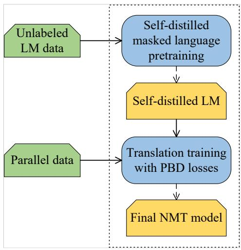
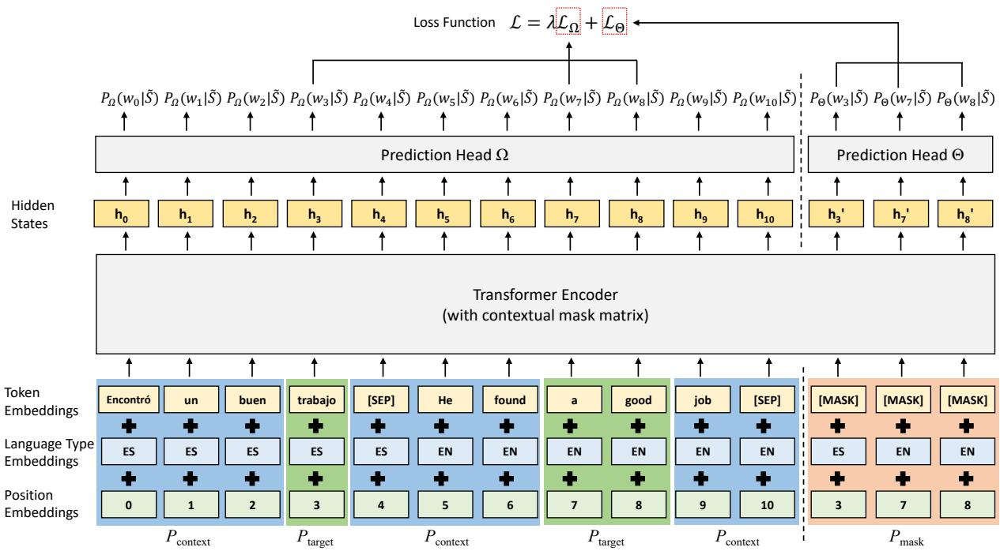
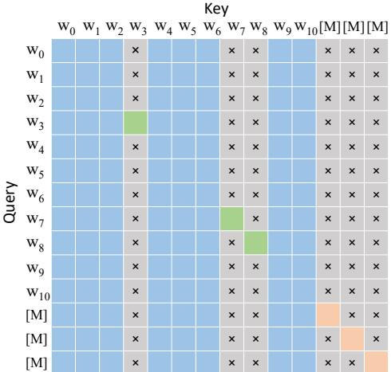
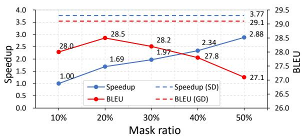

# Pretrained Bidirectional Distillation for Machine Translation

Yimeng Zhuang, Mei Tu Samsung Research China - Beijing (SRC-B) {ym.zhuang,mei.tu}@samsung.com

## Abstract

Knowledge transfer can boost neural machine translation (NMT), for example, by finetuning a pretrained masked language model (LM). However, it may suffer from the forgetting problem and the structural inconsistency between pretrained LMs and NMT models. Knowl edge distillation (KD) may be a potential so lution to alleviate these issues, but few studies have investigated language knowledge trans fer from pretrained language models to NMT models through KD. In this paper, we propose Pretrained Bidirectional Distillation (PBD) for NMT, which aims to efficiently transfer bidi rectional language knowledge from masked language pretraining to NMT models. Its ad vantages are reflected in efficiency and effec tiveness through a globally defined and bidi rectional context-aware distillation objective. Bidirectional language knowledge of the entire sequence is transferred to an NMT model concurrently during translation training. Specif ically, we propose self-distilled masked language pretraining to obtain the PBD objective. We also design PBD losses to efficiently distill the language knowledge, in the form of token probabilities, to the encoder and decoder of an NMT model using the PBD objective. Ex tensive experiments reveal that pretrained bidi rectional distillation can significantly improve machine translation performance and achieve competitive or even better results than previous pretrain-finetune or unified multilingual translation methods in supervised, unsupervised, and zero-shot scenarios. Empirically, it is con cluded that pretrained bidirectional distillation is an effective and efficient method for trans ferring language knowledge from pretrained language models to NMT models.

## 1 Introduction

Initializing parameters by a pretrained masked language model (LM) (Kenton and Toutanova, 2019) is a knowledge transfer method widely applied to natural language processing tasks. Following its success, pretrained neural machine translation (NMT) models have attracted more and more research interest (Conneau and Lample, 2019; Song et al., 2019; Liu et al., 2020; Li et al., 2022).

However, the pretrain-finetune paradigm may suffer from potential issues. As is pointed out in He et al. (2021), the finetuned model may forget some critical language generation skills learned from the pretraining phase. The catastrophic forgetting problem (Kirkpatrick et al., 2017; McCloskey and Cohen, 1989) commonly exists in transfer learning, leading to overfitting to target domains. Hu et al. (2022); Fang et al. (2022) also observe similar forgetting problems in pretrained NMT tasks. Besides, in the pretrain-finetune paradigm, model parameters are initialized by a pretrained model; this requires structure consistency (e.g., exact dimensions, layers, attention heads, etc.) between the pretrained LM and the NMT models to some extent. However, a powerful but structurally inconsistent pretrained LM may incorporate more language knowledge.

Knowledge distillation (KD) (Hinton et al., 2015) may be a potential solution to alleviate these issues, but few studies investigate language knowledge transfer from pretrained language models to NMT models by KD. Previous works use KD for model compression (Gordon and Duh, 2020), or data complexity reduction (Gu and Kong, 2021; Zhou et al., 2019), or multilingual translation (Sun et al., 2020; Tan et al., 2019). Zhou et al. (2022) utilizes confidence-based knowledge distillation to incorporate bidirectional global context into NMT models.

In this paper, we propose Pretrained Bidirectional Distillation (PBD) for NMT, which can alleviate the difference caused by pretraining (mask language modeling, perturbed sentences) and MT fine-tuning (full sentences) in the pretrain-finetune paradigm and boost large-scale translation training. In pretrained bidirectional distillation, language knowledge acquired from pretraining is continuously transferred to the NMT model. Knowledge transfer runs through the training process to address the forgetting problem. We deal with the pretrained language knowledge by pretrained bidirectional distillation objectives, which are the token probabilities generated by the pretrained LM about potential tokens matching a global context. The pretrained bidirectional distillation objectives are distilled to the encoder and decoder of an NMT model. Therefore, there is no need to require structure consistency between pretrained LMs and NMT models, and bidirectional distillation enriches the NMT decoder with bidirectional semantic information.

  
Figure 1: Overall training flow of pretrained bidirectional distillation for machine translation.

To guarantee the effectiveness and efficiency of pretrained bidirectional distillation, we propose self-distilled masked language pretraining, which can generate globally defined and bidirectional context aware token probabilities and use them as the pretrained bidirectional distillation objectives. “Globally defined” lets us obtain the full probabilities of each token in a single forward pass, guaranteeing distillation effect and execution efficiency. “Bidirectional context aware” distillation objectives incorporate bidirectional language knowledge of the whole sequence, guaranteeing effectiveness.

Extensive experiments are conducted on widely used benchmark datasets. In a supervised scenario, the proposed method achieves +2.7 and +8.5 absolute average BLEU improvement using the unified multilingual translation model and pretrainfinetune paradigm, respectively. And our model obtains 19.28 and 16.55 average BLEU in unsupervised and zero-shot scenarios, respectively, outperforming previous models.

Algorithm 1 Pretrained Bidirectional Distillation   
for NMT   
Require: language model LM, NMT model TM,   
unlabeled LM data $\mathcal { D } _ { L M }$ , parallel data $\mathcal { D } _ { T M }$   
1: Initialize LM by random   
2: for each $X \in \mathcal { D } _ { L M }$ do   
3: Get loss $\mathcal { L }  \lambda \mathcal { L } _ { \Omega } + \mathcal { L } _ { \Theta }$ ▷ Equ 1,4   
4: Update LM  BACKPROP( , LM)   
5: end for   
6: Initialize TM by random or pretraining   
7: for each $( X , Y ) \in { \mathcal { D } } _ { T M }$ do   
8: Get translation loss $\mathcal { L } _ { c e }  T M ( X , Y )$   
9: Forward pass $P _ { \Omega } \gets L M ( \{ X , Y \} )$   
10: Get loss $\mathcal { L } \gets \mathcal { L } _ { c e } + \mathcal { L } _ { e } + \mathcal { L } _ { d }$ ▷ Equ 8,10   
11: Update TM BACKPROP( , TM)   
12: end for   
13: return TM

To summarize, our contributions are as follows:

• We propose pretrained bidirectional distillation to investigate language knowledge transfer from pretrained language models to NMT models.

• We propose self-distilled masked language pretraining to support concurrently computing full token probabilities of the full sequence.

• We conduct extensive experiments to verify the effectiveness of our methods and achieve competitive or even better performance than previous pretrain-finetune or unified multilingual translation methods in supervised, unsupervised, and zero-shot scenarios.

## 2 Pretrained Bidirectional Distillation

Figure 1 and Algorithm 1 illustrate the overall flow of the proposed Pretrained Bidirectional Distillation (PBD) for machine translation. It consists of two processes: (1) Self-distilled masked language pretraining takes unlabeled LM training data as input and optimizes a token reconstruction loss and a self-distillation loss. The produced self-distilled LM has the advantage of generating the full probability prediction of all input tokens in one pass rather than only the masked tokens as in previous masked LMs. This ensures the efficiency of pretrained bidirectional distillation in the second process. (2) Translation training with PBD losses trains a standard Encoder-Decoder NMT model using parallel data but enhances it with extra PBD losses. The PBD losses are jointly optimized with the standard translation loss, and pretrained language knowledge in the form of full token probabilities generated by the pretrained LM is distilled to the encoder and decoder of the NMT model. We will introduce these two processes in detail in the following sections.

  
Figure 2: Overall architecture of the self-distilled masked language model. The input can be a pair of parallel sentences or a monolingual sequence; a parallel example is shown here. $P _ { \mathrm { c o n t e x t } } , P _ { \mathrm { t a r g e t } }$ , and $P _ { \mathrm { { m a s k } } }$ denote the context, target, and masked part, respectively. $\tilde { S } = \{ w _ { t } | w _ { t } \in P _ { \mathrm { c o n t e x t } } \}$ is the context.

## 2.1 Self-distilled Masked Language Pretraining

This paper proposes self-distilled masked language pretraining to obtain the pretrained bidirectional distillation objective for NMT models. Pretrained masked language models predict a token probability distribution over the vocabulary for each masked position, and these token probabilities indicate the potential tokens matching the context. Our assumption is that these token probabilities contain specific language knowledge and can be transferred to NMT models. Thus, we consider these token probabilities as the distillation objective.

However, in our preliminary experiments, we discovered that the token probabilities predicted in non-masked positions often tend to focus too much on real tokens, which fails to accurately reflect the long-tailed distribution of potential tokens.

In standard masked language pretraining, only a small percentage (typically 15%) of tokens can be masked. This limitation prevents us from efficiently achieving the full distillation objective that reflects the long-tailed distribution for each position of an input sequence in a single forward pass. To obtain a globally defined distillation objective, we adopt self-distillation, in which the token probabilities in non-masked positions are learned from the corresponding masked positions.

Figure 2 illustrates the overall architecture of the proposed self-distilled masked language model, which follows the widely used masked language model framework (Kenton and Toutanova, 2019; Conneau and Lample, 2019) with some modifications to its architecture: (1) The target tokens to be predicted have two types: masked tokens and real tokens. (2) The input sequence is partitioned into three parts to avoid exposing information between masked tokens and real tokens. (3) Masked and real tokens have different prediction heads and loss functions. The following subsections elaborate on the architecture of the self-distilled masked language model.

## 2.1.1 Input Representation

Let S denote an input sequence, and it may be a monolingual text $S = \{ X \} = \{ x _ { 1 } , \cdot \cdot \cdot , x _ { n } \}$ or the concatenation of a pair of parallel sentences $S = \{ X , Y \} = \{ x _ { 1 } , \cdot \cdot \cdot , x _ { n } , y _ { 1 } , \cdot \cdot \cdot , y _ { m } \}$ . According to the random masking scheme, the input sequence consists of non-masked positions and masked positions (typically 15%). Specifically, as is shown in Figure 2, a portion of positions (in this case, the 3rd, 7th, and 8th positions) have corresponding [MASK] tokens appended at the end of the sequence. Therefore, we split the complete input sequence into three parts: the context part $P _ { \mathrm { c o n t e x t } }$ which is used as the known context; the masked part $P _ { \mathrm { m a s k } }$ which is used to reconstruct the real tokens; and the target part $P _ { \mathrm { t a r g e t } }$ in which tokens are the real tokens corresponding the masked part, and they are pretended to be unknown when predicting token probabilities.

  
Figure 3: Example of a contextual mask matrix. Blue / green / orange grids denote query tokens attending to key tokens in the context part $P _ { \mathrm { c o n t e x t } } /$ target part $P _ { \mathrm { t a r g e t } }$ / mask part $P _ { \mathrm { m a s k } }$ respectively, grey grids are masked out.

The corresponding position embeddings, language type embeddings, and a special [MASK] token embedding are summed to form the input representations in $P _ { \mathrm { m a s k } }$ . And, the input representations in $P _ { \mathrm { t a r g e t } }$ and $P _ { \mathrm { c o n t e x t } }$ are the sum of the corresponding position embeddings, language type embeddings, and the real token embeddings.

## 2.1.2 Contextual Mask Matrix

In the masked token reconstruction task, the real token should be kept unknown to the corresponding masked position. Besides, the hidden state at the masked position is also needed to be invisible to the corresponding target position in the forward pass because the predicted probability at the masked position is the learning objective of the corresponding target position (i.e., avoiding supervised information leaking). Since the backbone of the masked language model is an attention-based Transformer encoder, the visibility of tokens can be controlled by a contextual mask matrix. As is illustrated in Figure 3, the contextual mask matrix controls that each token can attend to itself and the tokens in $P _ { \mathrm { c o n t e x t } }$ . It means that the context $\tilde { S }$ is set to $\tilde { S } = \{ w _ { t } | w _ { t } \in P _ { \mathrm { c o n t e x t } } \}$ for all the three parts $P _ { \mathrm { m a s k } } , P _ { \mathrm { t a r g e t } }$ and $P _ { \mathrm { c o n t e x t } }$

## 2.1.3 Pretraining Loss

We adopt different loss functions for the masked part and the target part. In the masked part, the language model learns to reconstruct the masked tokens. At each position of the target part, our model pretends not to have known the real token and predicts the potential tokens matching the context. Specifically, the probabilities of the potential tokens are learned to approximate the token reconstruction probabilities at the corresponding masked positions. This is because the token reconstruction probabilities are the predicted probabilities of potential tokens at the masked positions.

Let $\tilde { S } = \{ w _ { i } | w _ { i } \in P _ { \mathrm { c o n t e x t } } \}$ denote the context token set, $\bar { S } = \{ w _ { i } | w _ { i } \in P _ { \mathrm { t a r g e t } } \}$ denote the target token set, $t _ { i }$ denote the token at position i. The masked token reconstruction task defines the pretraining objective $\mathcal { L } _ { \Theta }$ as minimizing the negative log-likelihood of target tokens as below.

$$
\mathcal { L } _ { \Theta } = - \log P _ { \Theta } ( \bar { S } | \tilde { S } ) \approx - \sum _ { w _ { i } \in \bar { S } } \log P _ { \Theta } ( t _ { i } = w _ { i } | \tilde { S } )\tag{1}
$$

in which the token reconstruction probability $P _ { \Theta }$ is defined in the masked part and is computed by a prediction head Θ.

$$
P _ { \Theta } ( t _ { i } = w _ { i } | \tilde { S } ) = \frac { \exp ( \mathbf { h } _ { i } ^ { \Theta ^ { T } } \mathbf { e } ( w _ { i } ) ) } { \sum _ { w \in V } \exp ( \mathbf { h } _ { i } ^ { \Theta ^ { T } } \mathbf { e } ( w ) ) }\tag{2}
$$

$$
\mathbf { h } _ { i } ^ { \boldsymbol { \Theta } } = \mathrm { g e l u } ( \mathbf { { h } } _ { i } ^ { \prime T } \mathbf { W } _ { \boldsymbol { \Theta } } + \mathbf { b } _ { \boldsymbol { \Theta } } )\tag{3}
$$

where we use ${ \bf h } _ { i } ^ { \prime }$ to represent the hidden state of the last layer of a Transformer encoder at the masked position i, $\mathbf { W } _ { \ominus } \in \mathbb { R } ^ { D \times D }$ and $\mathbf { b } _ { \Theta } \in \mathbb { R } ^ { D }$ are learnable parameters of the prediction head Ω, D is the dimension, ${ \bf e } ( w ) \in \mathbb { R } ^ { D }$ denotes the embedding of token w, and V represents the vocabulary.

A self-distillation approach is adopted here to learn the potential tokens’ probabilities. The loss ${ \mathcal { L } } _ { \Omega }$ is defined by optimizing the KL divergence between the probability distribution of token reconstruction and the probability distribution of potential tokens. It is equivalent to

$$
\mathcal { L } _ { \Omega } = - \sum _ { i \in P _ { \mathrm { t a r g e t } } } \sum _ { w \in V } P _ { \Theta } ( t _ { i } = w | \tilde { S } ) \log P _ { \Omega } ( t _ { i } = w | \tilde { S } )\tag{4}
$$

in which the probability of potential tokens $P _ { \Omega }$ is defined in the non-masked positions and is computed by a prediction head Ω.

$$
P _ { \Omega } ( t _ { i } = w | \tilde { S } ) = \frac { \exp ( \mathbf { h } _ { i } ^ { \Omega ^ { T } } \mathbf { e } ( w ) ) } { \sum _ { w \in V } \exp ( \mathbf { h } _ { i } ^ { \Omega ^ { T } } \mathbf { e } ( w ) ) }\tag{5}
$$

$$
\mathbf { h } _ { i } ^ { \Omega } = \mathrm { g e l u } ( \mathbf { h } _ { i } ^ { T } \mathbf { W } _ { \Omega } + \mathbf { b } _ { \Omega } )\tag{6}
$$

where $\mathbf { h } _ { i }$ denotes the hidden state at the nonmasked position i.

The overall loss integrates ${ \mathcal { L } } _ { \Omega }$ and $\mathcal { L } _ { \Theta }$ by weighted summation.

$$
\pmb { \mathcal { L } } = \lambda \mathcal { L } _ { \Omega } + \mathcal { L } _ { \Theta }\tag{7}
$$

in which λ is a hyper-parameter.

## 2.1.4 Inference

In inference, there is no masked position for the input sequence S, and the probabilities of any potential token w at each position i can be computed as $P _ { \Omega } ( t _ { i } = w | S )$ . We consider these probabilities as the pretrained bidirectional distillation objective for NMT models.

## 2.2 Pretrained Bidirectional Distillation Loss

In this paper, the knowledge learned from the aforementioned self-distilled mask language model is transferred to an NMT model using the pretrained bidirectional distillation loss. Specifically, we concatenate the source and target sentence without masking to form an input sequence to the selfdistilled LM, and obtain the full probability prediction $P _ { \Omega }$ from the LM as the pretrained bidirectional distillation objective, which is distilled to a NMT model by optimizing the KL divergence between the pretrained bidirectional distillation objective $P _ { \Omega }$ and its corresponding predictions from an intermediate layer of the encoder or decoder.

The distillation loss of the encoder is as follows.

$$
\mathcal { L } _ { e } = - { \sum _ { t } } { \sum _ { w } } P _ { \Omega } ( x _ { t } = w | X , Y ) \log P _ { e } ( x _ { t } = w | X )\tag{8}
$$

$$
\mathbf { P } _ { e } = \mathrm { s o f t m a x } ( \mathbf { H } _ { e } ^ { l } \cdot \mathbf { E } ^ { T } )\tag{9}
$$

Here, we use X and $Y$ to denote the sentence in source and target language, respectively, and $x _ { t }$ denotes the t-th position of X. w is a word in the vocabulary $V . \hat { \mathbf { H } _ { e } ^ { l } } \in \mathbb { R } ^ { | X | \times D }$ represents the hidden states of an intermediate layer l of the encoder. $\mathbf { E } \in \mathbb { R } ^ { | V | \times D }$ is the token embedding matrix. We reuse the token embedding matrix, therefore, the pretrained bidirectional distillation won’t add any extra parameters. The t-th row and w-th column of the probability matrix ${ \bf P } _ { e }$ is the value of $P _ { e } ( x _ { t } =$ $w | X )$ .

Similar distillation loss is applied to the decoder.

$$
\mathcal { L } _ { d } = - \sum _ { t } \sum _ { w } P _ { \Omega } ( y _ { t } = w | X , Y ) \log P _ { d } ( y _ { t } = w | X , Y _ { < t } )\tag{10}
$$

$$
\mathbf { P } _ { d } = \operatorname { s o f t m a x } ( \mathbf { H } _ { d } ^ { l } \cdot \mathbf { E } ^ { T } )\tag{11}
$$

where $y _ { t }$ denotes the t-th position of the target sentence, and we use $\mathbf { H } _ { d } ^ { l }$ to represent the hidden states of an intermediate layer l of the decoder. Note that these distillation losses are jointly optimized with the standard translation loss when the NMT training.

The pretrained bidirectional distillation objective is not only globally defined but also bidirectional context aware (i.e., bidirectional language knowledge of the complete source and target sentence). Therefore, it is a challenging task to approximate the pretrained bidirectional distillation objective for the encoder and decoder given only a source sentence or given the source and partial target sentence, but it is reasonable since the source sentence has complete semantics information. On the other hand, the challenging task may force the NMT model to learn global language knowledge from the self-distilled LM. It can enrich the NMT decoder with bidirectional semantic information, as using future information is important for machine translation.

## 3 Experiments

We primarily study the proposed pretrained bidirectional distillation by conducting experiments on supervised, unsupervised, and zero-shot multilingual machine translation scenarios.

## 3.1 Experimental Setup

## 3.1.1 Language Model Pretraining

Datasets We use the parallel dataset PC32 (Lin et al., 2020) and the monolingual dataset MC24 provided by Pan et al. (2021). PC32 contains 32

<table><tr><td></td><td colspan="2">En-Fr wmt14</td><td colspan="2">En-Tr wmt17</td><td colspan="2">En-Es wmt13</td><td colspan="2">En-Ro wmt16</td><td colspan="2">En-Fi wmt17</td><td rowspan="2">Avg</td><td rowspan="2">△</td></tr><tr><td></td><td>→</td><td>←</td><td>→</td><td>←</td><td>→</td><td>←</td><td>→ ←</td><td>→</td><td>←</td><td></td></tr><tr><td>bilingual</td><td></td><td></td><td></td><td></td><td></td><td></td><td></td><td></td><td></td><td></td><td></td><td></td></tr><tr><td>Transformer-6 (Lin et al., 2020)</td><td>43.2</td><td>39.8</td><td></td><td></td><td></td><td></td><td>34.3</td><td>34.0</td><td></td><td></td><td></td><td></td></tr><tr><td>Transformer-12 (Liu et al., 2020)</td><td>41.4</td><td></td><td>9.5</td><td>12.2</td><td>33.2</td><td></td><td>34.3</td><td>36.8</td><td>20.2</td><td>21.8</td><td></td><td></td></tr><tr><td>unified multilingual</td><td></td><td></td><td></td><td></td><td></td><td></td><td></td><td></td><td></td><td></td><td></td><td></td></tr><tr><td>Multi-Distillation (Tan et al., 2019)</td><td></td><td></td><td></td><td>=</td><td></td><td>1</td><td>31.6</td><td>35.8</td><td>22.0</td><td>21.2</td><td></td><td></td></tr><tr><td>m-Transformer (Pan et al., 2021)</td><td>42.0</td><td>38.1</td><td>18.8</td><td>23.1</td><td>32.8</td><td>33.7</td><td>35.9</td><td>37.7</td><td>20.0</td><td>28.2</td><td>31.03</td><td></td></tr><tr><td>mRASP w/o finetune (Lin et al., 2020)</td><td>43.1</td><td>39.2</td><td>20.0</td><td>25.2</td><td>34.0</td><td>34.3</td><td>37.5</td><td>38.8</td><td>22.0</td><td>29.2</td><td>32.33</td><td>+1.30</td></tr><tr><td>mRASP2 (Pan et al., 2021)</td><td>43.5</td><td>39.3</td><td>21.4</td><td>25.8</td><td>34.5</td><td>35.0</td><td>38.0</td><td>39.1</td><td>23.4</td><td>30.1</td><td>33.01</td><td>+1.98</td></tr><tr><td>PBD-MT (Ours)</td><td>43.9</td><td>41.5</td><td>20.7</td><td>26.3</td><td>35.1</td><td>35.4</td><td>38.8</td><td>40.5</td><td>24.5</td><td>31.0</td><td>33.77</td><td>+2.74</td></tr></table>

Table 1: Performance of our model and competing approaches in the surprised translation scenario. We denote the pretrained bidirectional distillation MT model as PBD-MT. Tokenized BLEU is reported. For En Ro direction, we report the BLEU score after removing Romanian dialects as in Pan et al. (2021).
<table><tr><td>Lang-Pairs</td><td colspan="2">En-Kk</td><td colspan="2">En-Tr</td><td colspan="2">En-Et</td><td colspan="2">En-Fi</td><td colspan="2">En-Lv WMT17</td><td rowspan="2">En-Cs WMT19 11M(high)</td><td rowspan="2">En-De WMT19 38M(extr-high)</td><td rowspan="2">En-Fr WMT14 41M(extr-high)</td><td rowspan="2">Avg</td></tr><tr><td>Source Size</td><td colspan="2">WMT19 91k(low)</td><td colspan="2">WMT17 207k(low)</td><td colspan="2">WMT18 1.94M(medium)</td><td colspan="2">WMT17</td><td colspan="2">4.5M(medium)</td></tr><tr><td>Direction</td><td></td><td>←</td><td>→</td><td>←</td><td>→</td><td></td><td>→</td><td>2.66M(medium) ←</td><td>→</td><td>←</td><td>→</td><td>→</td><td>→</td><td></td></tr><tr><td></td><td>→</td><td></td><td></td><td></td><td></td><td>←</td><td></td><td></td><td></td><td></td><td></td><td></td><td></td><td></td></tr><tr><td>Direct (Vaswani et al., 2017) mBART (Liu et al., 2020)</td><td>0.2</td><td>0.8</td><td>9.5</td><td>12.2</td><td>17.9</td><td>22.6</td><td>20.2</td><td>21.8</td><td>12.9</td><td>15.6 19.3</td><td>16.5 18.0</td><td>30.9 30.5</td><td>41.4 41.0</td><td>17.1 21.2</td></tr><tr><td>mRASP (Lin et al., 2020)</td><td>2.5 8.3</td><td>7.4 12.3</td><td>17.8 20.0</td><td>22.5 23.4</td><td>21.4 20.9</td><td>27.8 26.8</td><td>22.4 24.0</td><td>28.5 28.0</td><td>15.9 21.6</td><td>24.4</td><td>19.9</td><td>35.2</td><td>44.3</td><td>23.8</td></tr><tr><td>CeMAT (Li et al., 2022)</td><td>8.8</td><td>12.9</td><td>23.9</td><td>23.6</td><td>22.2</td><td>28.5</td><td>25.4</td><td>28.7</td><td>22.0</td><td>24.3</td><td>21.5</td><td>39.2</td><td>43.7</td><td>25.0</td></tr><tr><td>PBD-MT w/ finetune (Ours)</td><td>8.4</td><td>15.9</td><td>23.4</td><td>24.5</td><td>22.5</td><td>29.4</td><td>24.2</td><td>29.7</td><td>22.2</td><td>26.1</td><td>21.8</td><td>40.4</td><td>44.3</td><td>25.6</td></tr></table>

Table 2: Comparison with models using the pretrain-finetune paradigm. NMT models initialized by multilingual training are finetuned in each direction. Language pairs of different data sizes from low-resource to extremely high-resource are investigated. Tokenized BLEU is reported.

English-centric language pairs1, and MC24 consists of monolingual text in 24 languages2. We follow the original data preprocessing, data sampling, tokenization, and vocabulary by directly downloading the datasets3 released by Pan et al. (2021), thus we can have a relatively fair comparison to our primary baselines, such as mRASP (Lin et al., 2020), mRASP2 (Pan et al., 2021) and CeMAT (Li et al., 2022). When pretraining, the source and target sentences are concatenated, and substituted synonyms are not masked. The masking ratio is 20%.

Settings We adopt a 12-layer Transformer-based language model with 768 dimensions and 12 attention heads. The language model is trained on 8 Nvidia A100 GPUs for 1M steps using Adam optimizer. On each GPU, the number of tokens in each batch is at most 32K. The learning rate is set to 0.0001, and polynomial decay scheduling is used with a warm-up step of 10000. The hyperparameter λ in Equ 7 is 0.5, and the dropout rate is set to 0.1. See appendix for more details.

## 3.1.2 Machine Translation Training

Datasets For training multilingual translation models, we reuse the parallel dataset PC32 and monolingual dataset MC24, consistent with Pan et al. (2021). We follow the experimental settings in CeMAT (Li et al., 2022) for finetuning experiments. Language pairs of various data sizes from WMT are used for finetuning, and the dataset information is shown in Table 2. For evaluating unified multilingual models, we use the evaluation datasets from WMT, IWSLT, and OPUS-100 (Zhang et al., 2020) following mRASP2 (Pan et al., 2021).

Settings We follow the model configurations used in CeMAT (Li et al., 2022) to train a Transformer-big (Vaswani et al., 2017) size NMT model, which will compare with models using the pretrain-finetune paradigm. And for a fair comparison, a larger NMT model with 12 encoder layers and 12 decoder layers is trained to compare with unified multilingual models. The contrastive loss is used in training a unified multilingual model due to its importance to zero-shot translation (Pan et al., 2021). Other training hyper-parameters are referred to from the open-source implementation of mRASP2. For pretrained bidirectional distillation losses, the intermediate layer to be distilled is set to the antepenultimate layer of the encoder and decoder. Note that global distillation doesn’t introduce extra parameters, and our model has the same size as the major baselines.

<table><tr><td></td><td colspan="2"> $\mathbf { A r }$ </td><td colspan="2">Zh</td><td colspan="2">NI</td><td></td></tr><tr><td></td><td> $\mathrm { X } { \to } \mathrm { A r }$ </td><td> $\mathrm { A r { \to } X }$ </td><td> $\Chi { \to } \mathbf { Z } \mathbf { h }$ </td><td> $\mathrm { Z h } \to \mathrm { X }$ </td><td>X→NI</td><td>NI→X</td><td></td></tr><tr><td rowspan="3">m-Transformer mRASP2</td><td>3.7</td><td>5.6</td><td>6.7</td><td>4.1</td><td>2.3</td><td>6.3</td><td></td></tr><tr><td>5.3</td><td>17.3</td><td>29.0</td><td>14.5</td><td>5.3</td><td>6.1</td><td></td></tr><tr><td>5.8</td><td>18.9</td><td>32.7</td><td>13.2</td><td>5.1</td><td>6.4</td><td></td></tr><tr><td></td><td colspan="2">Fr</td><td colspan="2">De</td><td colspan="2">Ru</td><td>Avg of all</td></tr><tr><td>m-Transformer</td><td>X→Fr 7.7</td><td>Fr→X</td><td>X→De</td><td>De→X</td><td>X→Ru</td><td>Ru→X</td><td></td></tr><tr><td>mRASP2</td><td>23.6</td><td>4.8 21.7</td><td>4.2 12.3</td><td>4.8 15.0</td><td>5.7 16.4</td><td>4.8 19.1</td><td>5.05 15.31</td></tr><tr><td>PBD-MT (Ours)</td><td>26.3</td><td>25.2</td><td></td><td>16.4</td><td>16.9</td><td>20.1</td><td>16.55</td></tr><tr><td></td><td></td><td></td><td>11.6</td><td></td><td></td><td></td><td></td></tr></table>

Table 3: Performance of unified multilingual MT models in zero-shot translation directions. De-tokenized BLEU is computed using sacreBLEU on the OPUS-100 test set. The table summarizes 30 translation directions of 6 languages, and each reported BLEU score is an average of 5 directions.

## 3.2 Supervised Translation

We trained a unified multilingual NMT model with pretrained bidirectional distillation. As is shown in Table 1, our proposed PBD-MT clearly outperforms previously published approaches and achieves new state-of-the-art performances in most translation directions. It achieves +0.76 average BLEU improvement over mRASP2, which validates the effectiveness of the proposed pretrained bidirectional distillation.

In addition, we investigate the effect of pretrained bidirectional distillation on the pretrainfinetune paradigm. Specifically, we adopt PBD losses on the encoder and decoder when finetuning. As we can see in Table 2, PBD-MT achieves better or competitive performance compared to previous pretrain-finetune models. It is noteworthy that no matter the unified model or the pretrain-finetune model, the improvement in X En directions is more significant than that of En X directions. We conjecture that English sentences are much more than other languages, thus the pretrained LM has a better understanding of English language.

## 3.3 Unsupervised and Zero-Shot Translation

Table 3 summarizes the performance of unified multilingual models on a zero-shot translation scenario. Although the training data only consists of Englishcentric parallel sentences, multilingual NMT models show promising performance on zero-shot translation. Compared with mRASP2, PBD-MT further boosts the translation quality in most zero-shot directions, achieving a +1.24 average gain. Besides, we evaluate the unified multilingual models in unsupervised translation directions, and the results are shown in Table 4. For PBD-MT, positive results are observed in all translation directions but one direction, and the average BLEU score increases by a +0.73 point. These results validate the positive effects of the proposed pretrained bidirectional distillation not only on supervised scenario but also zero-shot and unsupervised scenarios.

<table><tr><td></td><td colspan="2">En-Nl iwslt2014</td><td colspan="2">En-Pt opus-100</td><td colspan="2">En-Pl wmt20</td><td rowspan="2"> $\mathbf { A v } \mathbf { g }$ </td></tr><tr><td></td><td>→</td><td>←</td><td>→</td><td>个</td><td>→</td><td>←</td></tr><tr><td>m-Transformer</td><td>1.3</td><td>7.0</td><td>3.7</td><td>10.7</td><td>0.6</td><td>3.2</td><td>4.42</td></tr><tr><td>mRASP</td><td>0.7</td><td>10.6</td><td>3.7</td><td>11.6</td><td>0.5</td><td>5.3</td><td>5.40</td></tr><tr><td>mRASP2</td><td>10.1</td><td>28.5</td><td>18.4</td><td>30.5</td><td>6.7</td><td>17.1</td><td>18.55</td></tr><tr><td>PBD-MT (Ours)</td><td>10.7</td><td>29.6</td><td>18.1</td><td>31.4</td><td>7.0</td><td>18.9</td><td>19.28</td></tr></table>

Table 4: Performance of unified multilingual MT models in unsupervised translation scenario. These translation directions are not seen in the PC32 training dataset. Tokenized BLEU is reported.

## 3.4 Non-autoregressive NMT

This section contains additional results for nonautoregressive translation (NAT) experiments. Specifically, we use a Transformer-big size fully NAT (Gu and Kong, 2021) as the base model. The model is initialized by a pretrained multilingual PBD-MT model and trained using a CTC loss as in Gu and Kong (2021). Because the decoder in the NAT model has upsampled length, for simplicity, we only adopt the encoder PBD loss when NAT training. Table 5 shows the performance of our model and other pretrained NAT models. Consistent BLEU gains are obtained by our PBD-NAT, validating its effectiveness.

<table><tr><td rowspan="2"></td><td colspan="2">WMT14</td></tr><tr><td>En→De</td><td>De→En</td></tr><tr><td>Transformer (Vaswani et al., 2017)</td><td>28.0</td><td>32.7</td></tr><tr><td>Mask-Predict (Ghazvininejad et al., 2019)</td><td>26.1</td><td>29.0</td></tr><tr><td>mRASP (Lin et al., 2020)</td><td>26.7</td><td>29.8</td></tr><tr><td>Fully NAT (Gu and Kong, 2021)</td><td>26.5</td><td>30.5</td></tr><tr><td>CeMAT (Li et al., 2022)</td><td>27.2</td><td>29.9</td></tr><tr><td>PBD-NAT (Ours)</td><td>27.7</td><td>31.2</td></tr></table>

Table 5: Pretrained bidirectional distillation in nonautoregressive translation (NAT) scenario. PBD-NAT denotes initializing a fully NAT model (Gu and Kong, 2021) by multilingual PBD-MT and training it with the encoder PBD loss and NAT loss. Tokenized BLEU is reported.
<table><tr><td>Model</td><td>BLEU</td><td> $\triangle$ </td></tr><tr><td>Transformer (Vaswani et al., 2017)</td><td>27.3</td><td></td></tr><tr><td>Multi-300k (Zhou et al., 2022) CBBGCA (Zhou et al., 2022)</td><td>27.9 28.3</td><td>+0.6 +1.0</td></tr><tr><td>PBD-MT</td><td>29.1</td><td></td></tr><tr><td>w/o Encoder PBD loss  $\mathcal { L } _ { e }$ </td><td>28.8</td><td>+1.8</td></tr><tr><td>w/o Decoder PBD loss  $\mathcal { L } _ { d }$ </td><td></td><td>+1.5</td></tr><tr><td></td><td>28.3</td><td> $+ 1 . 0$ </td></tr></table>

Table 6: Ablation study and pretrained bidirectional distillation on bilingual translation models. Tokenized BLEU is evaluated in the WMT14 En De direction.

## 3.5 Model Analysis

## 3.5.1 Ablation Study

In order to evaluate the individual contribution of model components, we conduct an ablation study. We train a self-distilled LM and Transformer-base (Vaswani et al., 2017) size bilingual NMT models on the WMT14 English-German dataset, and report the results in Table 6. Compared with the standard bilingual Transformer and confidence-based KD (Zhou et al., 2022), PBD-MT significantly improves the performance, which verifies the effectiveness of pretrained bidirectional distillation on bilingual NMT. Without the PBD loss on the encoder or decoder, the BLEU scores degrade to some extent, and the decoder PBD loss has more impact than the encoder PBD loss. The results prove the necessity of both pretrained bidirectional distillation losses.

## 3.5.2 Quantitative Analysis

To investigate the contribution of self-distillation on LM which generates globally defined distillation objectives in a single forward pass, a quantitative analysis is conducted here. Figure 4 illustrates the results. For execution efficiency, we compare marginalizing over multiple masks with the selfdistillation on LM. For example, masking 10% tokens each time results in 10 LM forward passes to generate the full distillation objectives. As we can see, the design of self-distilled LM significantly accelerates the execution speed than multiple masks. For the distillation effect, we compare distillation on partial tokens with global distillation. The red lines show that 20% is a relatively reasonable proportion for partial distillation, and as the mask ratio increases, the performance degrades. Masking too many tokens increases the uncertainty for the LM. The best performance is achieved by global distillation, verifying the superiority of globally defined distillation objectives.

  
Figure 4: Efficiency of global distillation (GD) with multiple masks or self-distilled (SD) LM. And performance in WMT14 En De direction against distillation with different mask ratios.

## 3.5.3 Visualization

We conduct a behavior analysis to understand which tokens are considered more certain in contexts by the self-distilled language model. In this experiment, instead of softmax, we use sigmoid to compute a scalar probability in the prediction head Ω. Figure 5 visualizes the predicted self-distilled token probabilities on randomly sampled sentences. In this experiment, no token is masked; thus, the token probabilities represent the tokens’ matching degree and certainty in the complete bidirectional context. As we can see, verbs, articles, conjunctions, and prepositions are roughly of higher probabilities, while nouns, adverbs, and adjectives are harder to be predicted. It can be concluded that the syntactic structure is more regular, and meaningful words are more changeable.

## 4 Related Works

## 4.1 Masked Language Pretraining

Kenton and Toutanova (2019) propose BERT, a pre-trained masked language model (MLM), which succeeds in capturing the syntactic and semantic meaning of contextualized texts by large-scale selfsupervised pretraining. Recent researches explore and strengthen BERT. XLNet (Yang et al., 2019) addresses the issue of pretrain-finetune discrepancy simultaneously considering bidirectional contexts by a permutation language modeling objective. RoBERTa (Liu et al., 2019) exhaustively explores the pretraining setup, such as data processing, training task, hyper-parameters, etc., to boost the model. ELECTRA (Clark et al., 2019) trains a discriminator to detect replaced tokens, which are substituted by an MLM generator, and improve the model’s efficiency. Due to space limitations, we can not elaborate on BERT variants. Sun et al. (2022); Naseem et al. (2021); Min et al. (2021) surveyed the pre-trained language models.

<table><tr><td>As of2015, the totalstudentenrollment was34</td></tr><tr><td>##9. The ethnic makeup of the school was 34.4% White, 30. 7 % Hispanic</td></tr><tr><td></td></tr><tr><td>Evawasn&#x27;t sure what to dofirst. She thoughtabout calling ortext ##ingJulian, butshe didn&#x27;t know</td></tr><tr><td>how to starttheconversation</td></tr><tr><td></td></tr><tr><td>Mandylay sprawledon thefloor onherscattered beach bag contents, the open containerofmilk</td></tr><tr><td>g ##lug##gingwhite acrosstheceramic tile</td></tr></table>

Figure 5: Example of the self-distilled token probabilities on randomly sampled sentences. The darker the color, the higher the probability value.

## 4.2 Pretrained Machine Translation

As far as pretrained machine translation is concerned, a lot of powerful deep learning approaches have been introduced. For instance, XLM (Conneau and Lample, 2019) introduces the crosslingual language model pretraining and get significant improvements on unsupervised and supervised NMT. MASS (Song et al., 2019) adopts the encoder-decoder framework to reconstruct a sentence fragment. mBART (Liu et al., 2020) can be directly finetuned by pretraining a complete model. mRASP (Lin et al., 2020) and mRASP2 (Pan et al., 2021) improve NMT by using code-switching strategy and contrastive learning. CeMAT (Li et al., 2022) utilizes a bidirectional decoder to improve the representation capability.

## 4.3 Language Knowledge Distillation

Knowledge distillation is an effective technique for model compression and was first proposed by Hinton et al. (2015), in which knowledge is transferred from a teacher model to a student model. Sanh et al. (2019) distill a BERT-base model (Kenton and Toutanova, 2019) into smaller models by defining loss on the pre-trained predictions, which results in a task-agnostic pretraining distillation. Turc et al. (2019) conduct exhaustive analyses about the initialization of students in a task-specific setting, they show that students initialized by pretraining are better than that initialized from a truncated teacher (Sun et al., 2019; Sanh et al., 2019). Jiao et al. (2020); Wang et al. (2020, 2021); Choi et al. (2022) make assumptions about the student and teacher architectures and investigate aligning layer representations as well as attention matrices. Zhou et al. (2022) utilizes confidence-based knowledge distillation to incorporate bidirectional global context into NMT models.

## 5 Conclusion

In this paper, we proposed the pretrained bidirectional distillation to investigate language knowledge transfer from pretrained language models to NMT models by knowledge distillation. The proposed approach has the advantages of distillation effectiveness and efficiency, and achieves new stateof-the-art performance in supervised, unsupervised, and zero-shot multilingual translation experiments. The model analysis also shows that the proposed self-distilled language model is critical to generating globally defined distillation objectives. In the future, we will do more research on optimizing the self-distilled language model and pretrained bidirectional distillation losses.

## Limitations

The pretrained bidirectional distillation transfers language knowledge through the NMT training process, a limitation of this method is that a computational overhead is introduced during training. Specifically, there is an extra language model forward pass to generate the pretrained bidirectional distillation objectives. Although we significantly reduce the computational overhead by designing a self-distilled language model, the overhead cannot be completely avoided. Fortunately, most computations stem from back-propagation when model training, and the introduced computational overhead only affects training time. Once the training is completed, the NMT has an identical inference cost as regular translation models.

## References

Dongha Choi, HongSeok Choi, , and Hyunju Lee. 2022. Domain knowledge transferring for pre-trained language model via calibrated activation boundary distillation. In Proceedings ofthe 60th Annual Meeting of the Associationfor Computational Linguistics (Volume 1: Long Papers), pages 1658–1669.

Kevin Clark, Minh-Thang Luong, Quoc V Le, and Christopher D Manning. 2019. Electra: Pre-training text encoders as discriminators rather than generators. In International Conference on Learning Representations.

Alexis Conneau and Guillaume Lample. 2019. Crosslingual language model pretraining. Advances in neural information processing systems, 32.

Qingkai Fang, Rong Ye, Lei Li, Yang Feng, and Mingxuan Wang. 2022. Stemm: Self-learning with speechtext manifold mixup for speech translation. In Proceedings ofthe 60th Annual Meeting ofthe Association for Computational Linguistics (Volume 1: Long Papers), pages 7050–7062.

Marjan Ghazvininejad, Omer Levy, Yinhan Liu, and Luke Zettlemoyer. 2019. Mask-predict: Parallel decoding of conditional masked language models. In Proceedings of the 2019 Conference on Empirical Methods in Natural Language Processing and the 9th International Joint Conference on Natural Language Processing (EMNLP-IJCNLP), pages 6112–6121.

Mitchell Gordon and Kevin Duh. 2020. Distill, adapt, distill: Training small, in-domain models for neural machine translation. In Proceedings of the Fourth Workshop on Neural Generation and Translation, pages 110–118.

Jiatao Gu and Xiang Kong. 2021. Fully nonautoregressive neural machine translation: Tricks of the trade. In Findings of the Association for Computational Linguistics: ACL-IJCNLP 2021, pages 120–133.

Tianxing He, Jun Liu, Kyunghyun Cho, Myle Ott, Bing Liu, James Glass, and Fuchun Peng. 2021. Analyzing the forgetting problem in pretrain-finetuning of opendomain dialogue response models. In Proceedings of the 16th Conference of the European Chapter of the Association for Computational Linguistics: Main Volume, pages 1121–1133.

Geoffrey Hinton, Oriol Vinyals, Jeff Dean, et al. 2015. Distilling the knowledge in a neural network. arXiv preprint arXiv:1503.02531, 2(7).

Junjie Hu, Hiroaki Hayashi, Kyunghyun Cho, and Graham Neubig. 2022. Deep: Denoising entity pretraining for neural machine translation. In Proceedings of the 60th Annual Meeting of the Association for Computational Linguistics (Volume 1: Long Papers), pages 1753–1766.

Xiaoqi Jiao, Yichun Yin, Lifeng Shang, Xin Jiang, Xiao Chen, Linlin Li, Fang Wang, and Qun Liu. 2020. Tinybert: Distilling bert for natural language understanding. In Findings of the Association for Computational Linguistics: EMNLP 2020, pages 4163–4174.

Jacob Devlin Ming-Wei Chang Kenton and Lee Kristina Toutanova. 2019. Bert: Pre-training of deep bidirectional transformers for language understanding. In Proceedings of NAACL-HLT, pages 4171–4186.

James Kirkpatrick, Razvan Pascanu, Neil Rabinowitz, Joel Veness, Guillaume Desjardins, Andrei A Rusu, Kieran Milan, John Quan, Tiago Ramalho, Agnieszka Grabska-Barwinska, et al. 2017. Overcoming catastrophic forgetting in neural networks. Proceedings of the national academy of sciences, 114(13):3521–3526.

Pengfei Li, Liangyou Li, Meng Zhang, Minghao Wu, and Qun Liu. 2022. Universal conditional masked language pre-training for neural machine translation. arXiv preprint arXiv:2203.09210.

Zehui Lin, Xiao Pan, Mingxuan Wang, Xipeng Qiu, Jiangtao Feng, Hao Zhou, and Lei Li. 2020. Pretraining multilingual neural machine translation by leveraging alignment information. arXiv preprint arXiv:2010.03142.

Yinhan Liu, Jiatao Gu, Naman Goyal, Xian Li, Sergey Edunov, Marjan Ghazvininejad, Mike Lewis, and Luke Zettlemoyer. 2020. Multilingual denoising pretraining for neural machine translation. Transactions ofthe Associationfor Computational Linguistics, 8:726–742.

Yinhan Liu, Myle Ott, Naman Goyal, Jingfei Du, Mandar Joshi, Danqi Chen, Omer Levy, Mike Lewis, Luke Zettlemoyer, and Veselin Stoyanov. 2019. Roberta: A robustly optimized bert pretraining approach. arXiv preprint arXiv:1907.11692.

Michael McCloskey and Neal J Cohen. 1989. Catastrophic interference in connectionist networks: The sequential learning problem. In Psychology oflearning and motivation, volume 24, pages 109–165. Elsevier.

Bonan Min, Hayley Ross, Elior Sulem, Amir Pouran Ben Veyseh, Thien Huu Nguyen, Oscar Sainz, Eneko Agirre, Ilana Heinz, and Dan Roth. 2021. Recent advances in natural language processing via large pre-trained language models: A survey. arXiv preprint arXiv:2111.01243.

Usman Naseem, Imran Razzak, Shah Khalid Khan, and Mukesh Prasad. 2021. A comprehensive survey on word representation models: From classical to state-of-the-art word representation language models. Transactions on Asian and Low-Resource Language Information Processing, 20(5):1–35.

Xiao Pan, Mingxuan Wang, Liwei Wu, and Lei Li. 2021. Contrastive learning for many-to-many multilingual neural machine translation. In Proceedings of the

59th Annual Meeting ofthe Associationfor Computational Linguistics and the 11th International Joint Conference on Natural Language Processing (Volume 1: Long Papers), pages 244–258.

Victor Sanh, Lysandre Debut, Julien Chaumond, and Thomas Wolf. 2019. Distilbert, a distilled version of bert: smaller, faster, cheaper and lighter. arXiv preprint arXiv:1910.01108.

Kaitao Song, Xu Tan, Tao Qin, Jianfeng Lu, and Tie-Yan Liu. 2019. Mass: Masked sequence to sequence pre-training for language generation. arXiv preprint arXiv:1905.02450.

Haipeng Sun, Rui Wang, Kehai Chen, Masao Utiyama, Eiichiro Sumita, and Tiejun Zhao. 2020. Knowledge distillation for multilingual unsupervised neural machine translation. In Proceedings of the 58th Annual Meeting of the Association for Computational Linguistics, pages 3525–3535.

Kaili Sun, Xudong Luo, and Michael Y Luo. 2022. A survey of pretrained language models. In International Conference on Knowledge Science, Engineering and Management, pages 442–456. Springer.

Siqi Sun, Yu Cheng, Zhe Gan, and Jingjing Liu. 2019. Patient knowledge distillation for bert model compression. In Proceedings ofthe 2019 Conference on Empirical Methods in Natural Language Processing and the 9th International Joint Conference on Natural Language Processing (EMNLP-IJCNLP), pages 4323–4332.

Xu Tan, Yi Ren, Di He, Tao Qin, Zhou Zhao, and Tie-Yan Liu. 2019. Multilingual neural machine translation with knowledge distillation. In International Conference on Learning Representations.

Iulia Turc, Ming-Wei Chang, Kenton Lee, and Kristina Toutanova. 2019. Well-read students learn better: On the importance of pre-training compact models. arXiv preprint arXiv:1908.08962.

Ashish Vaswani, Noam Shazeer, Niki Parmar, Jakob Uszkoreit, Llion Jones, Aidan N Gomez, Łukasz Kaiser, and Illia Polosukhin. 2017. Attention is all you need. Advances in neural information processing systems, 30.

Wenhui Wang, Hangbo Bao, Shaohan Huang, Li Dong, and Furu Wei. 2021. Minilmv2: Multi-head selfattention relation distillation for compressing pretrained transformers. In Findings ofthe Association for Computational Linguistics: ACL-IJCNLP 2021, pages 2140–2151.

Wenhui Wang, Furu Wei, Li Dong, Hangbo Bao, Nan Yang, and Ming Zhou. 2020. Minilm: Deep selfattention distillation for task-agnostic compression of pre-trained transformers. Advances in Neural Information Processing Systems, 33:5776–5788.

Zhilin Yang, Zihang Dai, Yiming Yang, Jaime Carbonell, Russ R Salakhutdinov, and Quoc V Le. 2019. Xlnet: Generalized autoregressive pretraining for language understanding. Advances in neural information processing systems, 32.

Biao Zhang, Philip Williams, Ivan Titov, and Rico Sennrich. 2020. Improving massively multilingual neural machine translation and zero-shot translation. In Proceedings of the 58th Annual Meeting of the Association for Computational Linguistics, pages 1628– 1639.

Chulun Zhou, Fandong Meng, Jie Zhou, Min Zhang, Hongji Wang, and Jinsong Su. 2022. Confidence based bidirectional global context aware training framework for neural machine translation. In Proceedings of the 60th Annual Meeting of the Association for Computational Linguistics (Volume 1: Long Papers), pages 2878–2889.

Chunting Zhou, Jiatao Gu, and Graham Neubig. 2019. Understanding knowledge distillation in nonautoregressive machine translation. In International Conference on Learning Representations.

## A LM Pretraining Details

We follow consistent pretraining configurations for bilingual and multilingual language models. Table 7 lists detailed hyper-parameters we used in pretraining.

<table><tr><td>Hyper-parameters</td><td>Value</td></tr><tr><td>Number of layers</td><td>12</td></tr><tr><td>Hidden size</td><td>768</td></tr><tr><td>FFN inner hidden size</td><td>3072</td></tr><tr><td>Attention heads</td><td>12</td></tr><tr><td>Dropout</td><td>0.1</td></tr><tr><td>Attention dropout</td><td>0.1</td></tr><tr><td>Warmup steps</td><td>10k</td></tr><tr><td>Peak learning rate</td><td>1e-4</td></tr><tr><td>Batch size Max sequence length</td><td>256k 512</td></tr><tr><td>Mask ratio</td><td>20</td></tr><tr><td>Clip norm</td><td></td></tr><tr><td></td><td>1.0</td></tr><tr><td>Weight decay</td><td>0.01</td></tr><tr><td>Max steps</td><td>1M</td></tr><tr><td>Learning rate decay</td><td>Linear</td></tr><tr><td>Adam €</td><td>1e-8</td></tr><tr><td></td><td>0.9</td></tr><tr><td>Adam  $\beta _ { 1 }$ </td><td></td></tr><tr><td>Adam  $\beta _ { 2 }$ </td><td>0.999</td></tr><tr><td>Weight of loss term λ</td><td>0.5</td></tr></table>

Table 7: Hyper-parameters used for pretraining.

## B NMT Training Details

Table 8 lists detailed hyper-parameters we used in NMT model training.
<table><tr><td>Hyper-parameters</td><td>Big</td><td> $\mathrm { B i g 1 2 }$ </td></tr><tr><td>Encoder layers</td><td>6</td><td>12</td></tr><tr><td>Decoder layers</td><td>6</td><td>12</td></tr><tr><td>Hidden size</td><td>1024</td><td>1024</td></tr><tr><td>FFN inner hidden size</td><td>4096</td><td>4096</td></tr><tr><td>Attention heads</td><td>16</td><td>16</td></tr><tr><td>Embeddings</td><td>Shared</td><td>Shared</td></tr><tr><td>Dropout</td><td>0.1</td><td>0.1</td></tr><tr><td>Attention dropout</td><td>0.1</td><td>0.1</td></tr><tr><td>Activation dropout</td><td>0.1</td><td>0.1</td></tr><tr><td>Label smoothing</td><td>0.1</td><td>0.1</td></tr><tr><td>Warmup steps</td><td>3k</td><td>3k</td></tr><tr><td>Peak learning rate</td><td>1e-3</td><td>1e-3</td></tr><tr><td>Max sentences</td><td>512</td><td>512</td></tr><tr><td>Batch size</td><td>8K</td><td>8K</td></tr><tr><td>Update frequency</td><td>50</td><td>50</td></tr><tr><td>Number of workers</td><td>8</td><td>8</td></tr><tr><td>Max sequence length</td><td>256</td><td>256</td></tr><tr><td>Weight decay</td><td>0.01</td><td>0.01</td></tr><tr><td>Clip norm</td><td>10</td><td>10</td></tr><tr><td>Max steps</td><td>300k</td><td>300k</td></tr><tr><td>Learning rate decay</td><td>Linear</td><td>Linear</td></tr><tr><td>Adam €</td><td>1e-6</td><td>1e-6</td></tr><tr><td>Adam  $\beta _ { 1 }$ </td><td>0.9</td><td>0.9</td></tr><tr><td>Adam  $\beta _ { 2 }$ </td><td>0.98</td><td>0.98</td></tr></table>

Table 8: Hyper-parameters used for NMT training.

A For every submission: ✓ A1. Did you describe the limitations of your work? Limitations Section.

 A2. Did you discuss any potential risks of your work? Not applicable. Left blank.

✓ A3. Do the abstract and introduction summarize the paper’s main claims? At the end ofthe Introduction Section.

✓ A4. Have you used AI writing assistants when working on this paper? Grammarly. Spell checking.

B ✓ Did you use or create scientific artifacts? Experimental Setup Section. We use publicly available datasets and code bases.

✓ B1. Did you cite the creators of artifacts you used? Experimental Setup Section

✗ B2. Did you discuss the license or terms for use and / or distribution of any artifacts? It isfree to use the data and codefor research purposes, so we don’t mention it explicitly.

✓ B3. Did you discuss if your use of existing artifact(s) was consistent with their intended use, provided that it was specified? For the artifacts you create, do you specify intended use and whether that is compatible with the original access conditions (in particular, derivatives of data accessed for research purposes should not be used outside of research contexts)? Experimental Setup Section

 B4. Did you discuss the steps taken to check whether the data that was collected / used contains any information that names or uniquely identifies individual people or offensive content, and the steps taken to protect / anonymize it? Not applicable. Left blank.

✓ B5. Did you provide documentation of the artifacts, e.g., coverage of domains, languages, and linguistic phenomena, demographic groups represented, etc.? Experimental Setup Section

✗ B6. Did you report relevant statistics like the number of examples, details of train / test / dev splits, etc. for the data that you used / created? Even for commonly-used benchmark datasets, include the number of examples in train / validation / test splits, as these provide necessary context for a reader to understand experimental results. For example, small differences in accuracy on large test sets may be significant, while on small test sets they may not be. In the Experimental Setup Section, we mention that wefollow the original data preprocessing, data sampling, tokenization, and vocabulary by directly downloading the datasets released by previous papers. Thus, we give the reference and don’t repeat this information.

## C ✓ Did you run computational experiments?

Experiments Section.

✓ C1. Did you report the number of parameters in the models used, the total computational budget (e.g., GPU hours), and computing infrastructure used? Experimental setup Section, Appendix A, and Appendix B.

✓ C2. Did you discuss the experimental setup, including hyperparameter search and best-found hyperparameter values? Experimental setup Section, Appendix A, and Appendix B.

✓ C3. Did you report descriptive statistics about your results (e.g., error bars around results, summary statistics from sets of experiments), and is it transparent whether you are reporting the max, mean, etc. or just a single run? From Section 3.2 to 3.4.2.

✓ C4. If you used existing packages (e.g., for preprocessing, for normalization, or for evaluation), did you report the implementation, model, and parameter settings used (e.g., NLTK, Spacy, ROUGE, etc.)? Experimental setup Section, Appendix A, and Appendix B.

D ✗ Did you use human annotators (e.g., crowdworkers) or research with human participants? Left blank.

 D1. Did you report the full text of instructions given to participants, including e.g., screenshots, disclaimers of any risks to participants or annotators, etc.? No response.

 D2. Did you report information about how you recruited (e.g., crowdsourcing platform, students) and paid participants, and discuss if such payment is adequate given the participants’ demographic (e.g., country of residence)? No response.

 D3. Did you discuss whether and how consent was obtained from people whose data you’re using/curating? For example, if you collected data via crowdsourcing, did your instructions to crowdworkers explain how the data would be used? No response.

 D4. Was the data collection protocol approved (or determined exempt) by an ethics review board? No response.

 D5. Did you report the basic demographic and geographic characteristics of the annotator population that is the source of the data? No response.