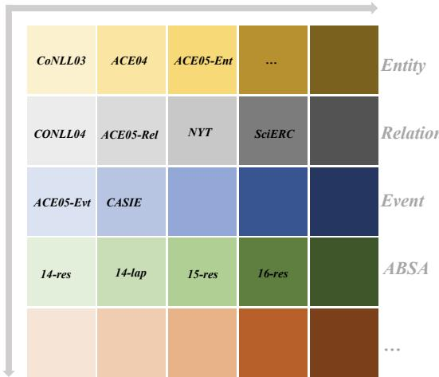
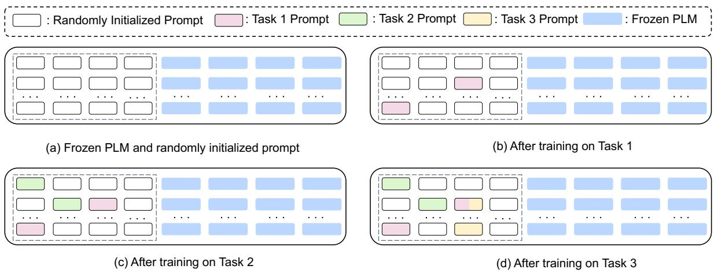
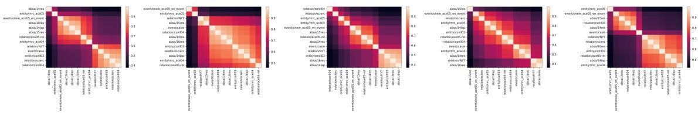
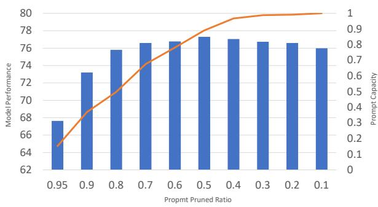

# Prompts Can Play Lottery Tickets Well: Achieving Lifelong Information Extraction via Lottery Prompt Tuning

Zujie Liang, Feng Wei, Jie Yin, Yuxi Qian, Zhenghong Hao, Bing Han

MYbank, Ant Group

jokieleung@outlook.com

{huodeng.wf,yibo.yj,qianyuxi.qyx,haozhenghong.hzh,hanbing.hanbing}@mybank.cn

## Abstract

Thanks to the recent success of Pre-trained Language Models (PLMs), it has become a promising research direction to develop a universal model (UIE) that can solve all typical information extraction tasks within one generative framework. Nonetheless, in real-world scenar ios of UIE applications, new data of different IE tasks and domains usually come in a stream over time. A desirable UIE system should be capable of continually learning new tasks without forgetting old ones, thereby allowing knowledge and functionalities expansion without retraining the whole system. In this paper, we study the UIE system under a more challeng ing yet practical scenario, i.e., “lifelong learning” settings, to evaluate its abilities in three aspects, including knowledge sharing and expansion, catastrophic forgetting prevention, and rapid generalization on few-shot and unseen tasks. To achieve these three goals, we present a novel parameter- and deployment-efficient prompt tuning method namely Lottery Prompt Tuning (LPT). LPT freezes the PLM’s param eters and sequentially learns compact pruned prompt vectors for each task leveraging a binary prompt mask, while keeping the prompt parameters selected by the previous tasks in susceptible. Furthermore, we use a simple yet effective method to perform mask selection and show the powerful transferability of Lottery Prompts to novel tasks. Extensive experiments demonstrate that LPT consistently sets state-ofthe-art performance on multiple lifelong learn ing settings of UIE, including task-incremental setting on seen tasks, few-shot adaptation, and zero-shot generalization on novel tasks1.

## 1 Introduction

Information Extraction (IE) is one of the fundamental tasks in Natural Language Processing (NLP), which aims to extract the desired structural information from unstructured texts (Andersen et al.,

Domain  
  
Figure 1: Two different dimensions of lifelong learning among IE tasks. During real-world scenarios, the data from various IE tasks across varying domains come in a stream.

1992; Surdeanu et al., 2003; Ma and Hovy, 2016; Kolluru et al., 2020). Previous IE research mostly focuses on one specific IE task (Miwa and Bansal, 2016; Wang et al., 2020; Lin et al., 2020; Zheng et al., 2021) and designs different model architectures (Lample et al., 2016; Sohrab and Miwa, 2018; Li et al., 2020; Hsu et al., 2022) to tackle different tasks. To facilitate knowledge sharing between different tasks, various efforts have been paid for unifying all IE tasks with one model structure (Wadden et al., 2019; Nguyen et al., 2021; Paolini et al., 2021). Most recently, Lu et al. (2022); Fei et al. (2022) unify general IE tasks in a generative way with a text-to-structure framework (UIE), which proves that universally modeling various IE tasks can better learn general knowledge from varying data sources.

Nonetheless, current work usually assumes the accessibility of training data for every task. In many real-world scenarios, as shown in Figure 1, the training data are often streamed, and the IE systems are required to identify new mention spans or semantic relations to support new domains and functionalities, which can be formulated as the paradigm of lifelong learning. The ability to accumulate knowledge continually is crucial for the quick deployment of UIE systems based on PLMs, which allows the system to add new domains and functionalities over time without incurring the high cost of re-training the whole system each time. In addition, considering that humans can acquire new knowledge from a few examples (Montague, 1974), it is expected for the models to generalize well on novel tasks with few-shot data or even no data.

Motivated by this, our work aims to address these more challenging yet practical issues by proposing a lifelong learning setup for UIE. In this setup, the system sequentially learns over multiple IE tasks (potentially of different task types and varying domains) one by one. Then it will be evaluated to preserve its performance on solving previously seen tasks, and generalize well to novel tasks with few examples or even no examples. We cover two conventional properties of lifelong learning (Ke and Liu, 2022), i.e., catastrophic forgetting prevention (CF) and knowledge transfer (KT), while in our setup, the evaluation of KT extends to the novel tasks. In NLP community, large Pre-trained Language Models (PLMs) have been widely applied in many downstream tasks. In order to lower computation and storage costs, recent popular lifelong learning techniques (Madotto et al., 2021; Ke et al., 2021a; Zhu et al., 2022; Wang et al., 2022c) try to solve the CF and KT leveraging parameter-efficient fine-tuning (PEFT) methods (He et al., 2022a).

In this work, we inherit this wisdom and also focus on parameter-efficient methods for lifelong learning. Inspired by the lottery ticket hypothesis and the efficiency of prompt tuning, we propose a novel framework for lifelong UIE, named Lottery Prompt Tuning (LPT). Specifically, we adopt an encoder-decoder model architecture (Raffel et al., 2020) and re-frame all types of IE tasks into a text-to-structure format (Lu et al., 2022). First, we prepend a sequence of continuous prompt vectors to the input, which is shared across tasks. To continually learn a new IE task, we simultaneously learn the prompt vectors together with a task-aware binary prompt mask. The task-aware mask is devoted to pruning the shared prompt vectors and producing an optimal task-specific pruned prompt, i.e., lottery prompt. To provide a pruning criterion for finding the lottery prompt online, we introduce a separate set of learnable parameters serving as the importance scores, which have the same shapes as the soft prompts. Hence, the lottery prompt can be easily found by selecting the parameters with the Top-k% importance scores online, without iterative retraining and pruning procedure. To facilitate the forward knowledge transfer when learning a new task, the lottery prompt is permitted to selectively reuse the learned prompt parameters for the former tasks. Besides, the proposed LPT eliminates catastrophic forgetting and negative transfer by freezing the prompt parameters for the previous tasks during back-propagation. In the whole learning process, the PLM is kept frozen to maintain general knowledge. During inference, the same model can handle different tasks by inputting different lottery prompts, which is friendly for deployment.

We show that our proposed framework effectively outperforms state-of-the-art baselines on lifelong learning for UIE in terms of catastrophic forgetting prevention and knowledge transfer. Moreover, LPT closes the gap between continual learning and multi-task learning. The efficacy of the proposed modules is thoroughly studied both empirically and analytically. In summary, this work makes three key contributions:

• A challenging yet practical benchmark is proposed for lifelong UIE, where one UIE system should not only keep its performance on solving seen IE tasks, but also generalize well on novel IE tasks with few or even no examples.

• We proposed Lottery Prompt Tuning (LPT), an extremely efficient prompt tuning framework for lifelong UIE that directly learns pruned prompts sequentially without an extra pruning stage.

• Extensive experiments on the benchmark show that our approach outperformed baselines with higher parameter efficiency.

## 2 Related Work

Lifelong Learning Lifelong Learning, also known as Continual Learning, aims to learn a sequence of tasks with one single model. Two main goals are demanded: catastrophic forgetting (CF) prevention and positive knowledge transfer (KT). The research in this area can be categorized into three folds: Regularization, Rehearsal, and Architecture based methods. (a) Regularization-based methods (Li and Hoiem, 2017; Kirkpatrick et al., 2017; Ritter et al., 2018) ease the catastrophic forgetting issue by regularizing important parameters for learned tasks. These approaches usually need a trade-off between learning new tasks and for getting the old tasks. In NLP, it is studied (Han et al., 2020) to constrain the useful information from the huge amount of knowledge inside the PLMs. (b) Rehearsal-based methods methods re use old examples from the previously learned tasks while learning new tasks. These examples are either derived from real training data of previous tasks (Rebuffi et al., 2017; Lopez-Paz and Ranzato, 2017; Mi et al., 2020), or generated by a pseudo-data generator (Sun et al., 2019; Qin and Joty, 2021; Zhao et al., 2022). Although these methods work well, they are limited by data privacy or the quality of generated data. (c) Architecture based methods tackle the continual learning prob lem by expanding new modules to the network over time (Veniat et al., 2020; Douillard et al., 2022) or isolating the network’s parameters for different tasks (Serra et al., 2018; Mallya and Lazebnik, 2018; Mallya et al., 2018; Wortsman et al., 2020; Geng et al., 2021; Kang et al., 2022). In NLP, in order to better take advantage of the PLMs, these methods usually are in conjunction with parameter efficient fine-tuning approaches, including adapter tuning (Houlsby et al., 2019) and prompt tun ing (Lester et al., 2021a; Li and Liang, 2021; Liu et al., 2022b). AdapterCL (Madotto et al., 2021) trains a separate adapter for each task, leaving knowledge transfer out of consideration. Ke et al. (2021b,a); Ermis et al. (2022); Zhang et al. (2022) overcome this drawback by introducing capsule net work (Sabour et al., 2017), distillation mechanism and adaptive compositional modules, respectively. For the latter, CPT (Zhu et al., 2022) learns a sepa rate prompt with continual prompt initialization for each task. Wang et al. (2022c,b) propose to learn a prompt pool and then select the useful prompts to alleviate forgetting and potentially share knowl edge across tasks. Dai et al. (2022) extend the idea to organize the prompt pools in a hierarchical way to guide the pre-trained models in different granu larities. In contrast, we here share a single copy of prompt parameters to instruct the PLMs, yet incrementally learn a task-aware prompt mask for each task whilst keeping the prompt parameters used by the previous tasks unchanged. This not only isolates the harmful prompt parameters that lead to forgetting but also shares useful prompt parameters for knowledge transfer.

## Lifelong learning in Information Extraction

In IE areas, some efforts are paid for building IE systems to handle continual learning scenarios, including continual NER (Monaikul et al., 2021; Zheng et al., 2022), relation extraction (Cui et al., 2021; Qin and Joty, 2022; Wang et al., 2022a), and event detection (Yu et al., 2021; Liu et al., 2022a). However, they merely study continual learning on one single IE task. Very recently, UIE (Lu et al., 2022; Fei et al., 2022) regards general IE tasks as a text-to-structure generation task, thus unifies all IE tasks with one model framwork. To a step further, our work studies a more challenging yet practical continual learning paradigm for UIE, where one universal IE system needs to solve different types of IE tasks across different domains incrementally.

Lottery Ticket Hypothesis Frankle and Carbin (2018) propose the The Lottery Ticket Hypothesis (LTH) that an over-parameterized network contains a sub-network (lottery ticket) that, when initialized and trained in isolation, can match or exceed the test accuracy of the original network after training for at most the same number of iterations. The LTH has been widely explored in many fields of deep learning (Liu et al., 2018; Frankle et al., 2019; Gong et al., 2022; Yu et al., 2019) In NLP, researchers also explore the existence of winning tickets under transfer learning regimes for over-parametrized pre-trained language models across various tasks (Morcos et al., 2019; Desai et al., 2019). Chen et al. (2020); Prasanna et al. (2020) show the existence of winning tickets when fine-tuning BERT on downstream tasks. Liang et al. (2021) shows the existence of super tickets inside PLMs that can improve generalization. Xprompt (Ma et al., 2022) is the pioneer to explore the LTH in the context of prompt tuning by hierarchical structure pruning. However, Xprompt needs iterative retraining, pruning and rewinding to get the pruned prompts, which is impractical to perform during continual learning settings since it needs excessive computational time and costs. By contrast, our LPT does not require an explicit pruning stage and jointly learns prompt and task-related masks together, which accelerates convergence during continual learning. Moreover, our pruning is performed at the parameter level while Xprompt’s pruning is performed at the token and piece level.

## 3 Preliminary

## 3.1 Lifelong Learning Protocols

Conventional continual learning is defined as training machine learning models on a continuum of data from a sequence of tasks. Here in our lifelong learning protocols for UIE, the incoming task on the task sequence can be of different types (e.g., entity extraction, relation extraction, event extraction, and aspect-based sentiment analysis.), or of the same type but potentially of different domains. An intuitive demonstration can be found in Figure 1. Formally, we define a sequence of tasks $\mathcal { D } = \{ \mathcal { D } _ { 1 } , \cdot \cdot \cdot , \mathcal { D } _ { T } \}$ , where the k-th task $\mathcal { D } _ { k } = \{ ( \boldsymbol { x } _ { i } ^ { k } , \boldsymbol { y } _ { i } ^ { k } ) \} _ { i = 1 } ^ { N _ { k } }$ contains a set of data samples. For each data sample, the input $\mathbf { \Delta } \mathbf { x } _ { i } ^ { k }$ is constructed by the raw text $\mathbf { \Delta } _ { t _ { i } ^ { k } }$ and a specific predefined schema $\mathbf { \boldsymbol { s } } _ { i } ^ { k }$ , while the desirable output $\mathbf { \Delta } y _ { i } ^ { k }$ is structural information contained in the text $\mathbf { \Delta } \mathbf { x } _ { i } ^ { k }$ indicated by the schema $\mathbf { \boldsymbol { s } } _ { i } ^ { k }$ . Note that our approach is Rehearsal-free, meaning that data from the previous tasks can not be used anymore when training future tasks. The goal of a lifelong UIE model should perform well on all $T$ tasks after being trained with the samples of these tasks sequentially. Further, in the realistic scenario, it is usually expensive and impractical to acquire plenty of labeled data for a newly emerged task. To simulate this circumstance, we adapt the sequentially trained model on a set of $n _ { n o v e l }$ novel tasks individually $\{ \mathcal { D } _ { i } \} _ { i = 1 } ^ { N _ { n o v e l } }$ . Hence, we can access the model’s ability to accumulate previously learned knowledge for generalization to new tasks by evaluating the few-shot/zero-shot transferability of the lifelong model.

## 3.2 Generative UIE Framework

In this section, we cast all IE tasks as text generation and model the UIE system in a text-to-structure framework (Lu et al., 2022). In this generative framework, different IE structure generation is decomposed into two atomic operations, i.e., spotting and associating. Spotting indicates locating target information pieces from the sentence, e.g., the entity and the trigger word in the event. Associating means connecting spans by assigning them with specific semantic roles based on pre-defined schemas, such as the relation between entity pairs or the role between an event and its argument.

Input the input x for the UIE model is formulated as the concatenation of the raw sentence and a schema-based prompt in the form of:

$$
\begin{array} { r } { x = [ s ; t ] = \left[ s _ { 1 } , s _ { 2 } , \ldots , s _ { | s | } , t _ { 1 } , t _ { 2 } , \ldots , t _ { | t | } \right] } \\ { = [ [ \mathrm { s p o t } ] , \mathrm { S P O T } _ { 1 } , [ \mathrm { s p o t } ] , \mathrm { S P O T } _ { 2 } \ldots , } \\ { [ \mathrm { a s s o } ] , \mathrm { A S S O } _ { 1 } , [ \mathrm { a s s o } ] , \mathrm { A S S O } _ { 2 } \ldots , } \\ { \ [ \mathrm { t e x t } ] , t _ { 1 } , t _ { 2 } , \ldots , t _ { | t | } ] \phantom { x x x x x x x x x x x x x x x x } } \end{array}\tag{1}
$$

SPOTi represents the targeted spotting name in the IE tasks, $e . g .$ ., “organization" in the NER task; and ${ \mathsf { A S S O } } _ { i }$ represents the targeted association name, $e . g .$ , “work for” in the relation extraction task.

Output the output text y is a unified Structured Extraction Language (SEL) that describes how the structural elements organize into the target structure, which can be represented as “{Spot Name: Info Span, (Asso Name: Info Span) (Asso Name: $I n f o \ S p a n ) \beta ^ { \prime \prime }$ . The Spot Name and Asso Name are the target structure from the pre-defined schemas, while the Info Span refer to the text span mentioned in the raw text.

Model We employ a Transformer-based encoderdecoder language model $i . e .$ , T5 (Raffel et al., 2020), as the model architecture for UIE. Given the schema and the raw sentence as input sequences x and the SEL as output sequences $y ,$ the model computes the conditional language model distribution of each token $y _ { i }$ using the chain rule of probability as $p \left( y _ { i } \mid y _ { < i } , x \right)$ . It finishes prediction when outputting the end signal [EOS]. The predicted SEL expression will be converted back into the extracted information record for evaluation.

## 4 Method

## 4.1 Overview

In this section, we present a novel pruning-based parameter-efficient tuning method for lifelong learning, called Lottery Prompt Tuning (LPT). The overall process of LPT is illustrated in Figure 2. To continually learn a new IE task, we simultaneously learn the prompt vectors together with a paired task-aware binary prompt mask, while the mask is devoted to producing a pruned prompt, i.e., Lottery Prompt. During training for each incoming task, LPT can selectively re-use the previously learned prompt parameters to encourage knowledge transfer, while the parameter updates only happen on those soft prompt parameters that have not been selected by the previous tasks. Finally, the model shares the same set of soft prompts for all tasks however uses the binary masks to isolate the shared parameters and get the lottery prompt for each task, which solves catastrophic forgetting.

  
Figure 2: An illustration of Lottery Prompt Tuning (LPT). For each incoming task, LPT selectively re-uses the previously learned prompt parameters in the forward pass. While in the back-propagation, the prompt parameters allocated by previous tasks will not be updated. Finally, the model maintains the same set of soft prompts for all tasks and uses the binary masks to get the lottery prompt for each task.

## 4.2 Lottery Prompt Tuning

Prompt tuning (Li and Liang, 2021; Liu et al., 2022b) learns a set of continuous prompts and only tunes the prompts while fixing the whole parameters in PLM, which has been proven to be effective in various downstream tasks. In this work, we combine prompt tuning and the aforementioned generative UIE into one unified framework, where the PLM takes the concatenation of continuous learnable soft prompts $p ,$ schema instruction s and the raw text t, i.e., $x = [ p ; s ; t ]$ . The training objective is formalized as

$$
\mathcal { L } = \sum _ { \left( x , y \right) \in \mathcal { D } _ { \mathrm { k } } } - \log p \left( y \mid x ; \theta _ { p } \right)\tag{2}
$$

Note that only the soft prompt parameters $\theta _ { p }$ are trainable. Recently, Ma et al. (2022) show that pruning prompts at token and piece level yields a more parameter-efficient prompt yet with competitive performance. Inspired by this, we propose a novel Lottery Prompt Tuning (LPT) which acquires high-performing pruned prompts for continual learning by assigning the prompt vectors $\theta _ { k }$ together with a task-aware binary mask $\mathbf { m } _ { k }$ . The mask selects the top-c% of soft prompts that lead to good performance on the current task. To achieve this, we introduce a set of learnable parameters $\mathbf { s } _ { k }$ that have the same shape as the soft prompts, which indicates the importance scores of the prompt parameters. Once trained, these scores are thresholded to obtain the prompt mask, $i . e . , \mathbf { m } _ { k } = h ( \mathbf { s } _ { k } )$ where $h ( . )$ is an indicator function that outputs $" 1 "$ for top-c% of the scores in the prompt parameters or $" 0 "$ otherwise. Therefore, the pruned prompt parameters $\hat { \boldsymbol { \theta } } _ { p } ^ { k }$ for task k, i.e., lottery prompt, is obtained by $\hat { \pmb { \theta } } _ { p } ^ { k } = \pmb { \theta } _ { p } \odot { \bf m } _ { k }$

To get rid of the need for iterative retraining, pruning and rewinding procedures during continual learning, we perform online pruning by simultaneously optimizing the prompt parameters and the importance scores together. To achieve this, we use a straight-through gradient estimator (Bengio et al., 2013) to ignore the derivatives of the indicator function $h ( . )$ and directly update the scores as follows:

$$
\begin{array} { r l } { \underset { \pmb { \theta } _ { p } , \mathbf { s } _ { k } } { \mathrm { m i n i m i z e } } \mathcal { L } ( \pmb { \theta } _ { p } \odot \mathbf { m } _ { k } ; \mathcal { D } _ { k } ) ; } & { } \\ { \mathbf { s } _ { k }  \mathbf { s } _ { k } - \eta ( \frac { \partial \mathcal { L } } { \partial \mathbf { s } _ { k } } ) } & { } \end{array}\tag{3}
$$

where the $\eta$ is learning rate. While training on a newly emerge task k, we use an extra binary mask $\mathbf { M } _ { k - 1 } = \mathsf { V } _ { i = 1 } ^ { \bar { k } - 1 } \mathbf { m } _ { i }$ to prevent updating the prompt parameters allocated by previous tasks. Hence, the prompt parameters $\theta _ { p }$ are updated as follows:

$$
\pmb { \theta } _ { p }  \pmb { \theta } _ { p } - \eta ( \frac { \partial \mathcal { L } } { \partial \pmb { \theta } _ { p } } \odot ( \mathbf { 1 } - \mathbf { M } _ { k - 1 } ) )\tag{4}
$$

To summarize, LPT circumvents the forgetting issue by isolating the prompt parameters for each task. Meanwhile, taking the separate scores as the pruning criterion allows sharing some of the parameters from previously chosen parameters $\mathbf { \theta } _ { \boldsymbol { p } } \odot \mathbf { m } _ { k }$ in solving the current task k, which contributes to knowledge transfer.

## 4.3 Mask Selection for Novel Tasks

When generalizing to the use-case on novel tasks where few or no labeled data for training, it is a desired property to transfer knowledge learned by the previous tasks to achieve better performance. Hence, we provide two simple solutions to select the binary masks in hands for initializing the lottery prompt. The first way is to utilize the perplexity (PPL) of each mask $\mathbf { m } _ { k }$ over the input X as a measurement (Madotto et al., 2021), i.e., $P P L _ { \theta _ { n } ^ { k } } ( X )$ The mask with the lowest PPL will be chosen for initialization. Another solution is to select the mask by the gradient-based one-shot algorithm (Wortsman et al., 2020). It first associates each of the T learned masks $m _ { k }$ with a proxy coefficient $\alpha _ { i }$ initially set to $1 / T$ . Then, infer the novel example with the weighted mask ˆm $\begin{array} { r } { . = \sum _ { k = 1 } ^ { T } \alpha _ { i } \mathbf { m } _ { k } } \end{array}$ to get the entropy. Further, the one-shot gradient calculated by the entropy for each $\alpha _ { i }$ indicates the transferability of each mask. The mask with the highest gradient will be chosen for initialization.

## 5 Experimental Settings

## 5.1 Datasets

To cover all four typical IE task types (including NER, relation extraction, event extraction, and sentiment extraction), we formalize the lifelong UIE benchmark by leveraging 13 IE datasets to construct the task sequence. Specifically, NER tasks include ACE04 (Mitchell et al., 2005), ACE05-Ent (Walker et al., 2006), CoNLL03 (Tjong Kim Sang and De Meulder, 2003); Relation extraction tasks include CoNLL04 (Roth and Yih, 2004), ACE05- Rel, SciERC (Luan et al., 2018), NYT (Riedel et al., 2010); Event extraction tasks include CASIE (Satyapanich et al., 2020), ACE05-Evt; Aspect-Based Sentiment Analysis (ABSA) tasks include SemEval-14 (Pontiki et al., 2014), SemEval-15 (Pontiki et al., 2015), SemEval-16 (Pontiki et al., 2016). Refer to Appendix A for more detail about the datset statistics. For dataset split, we follow the same practice of the relevant prior works (Lu et al., 2022) when using it. As the task order could influence the performance, we create 5 different task orders by random permutation, which are listed in Table 4.

## 5.2 Evaluation Metrics

For the evaluation of IE performance, we use the widely adopted span-based offset Micro-F1 as the primary metric following previous work (Lu et al., 2022). Given the generated text spans by our model, we map spans to offsets by finding the first matched offsets that are not already matched in the same SEL hierarchical level. For the evaluation of lifelong learning ability, we denote $a _ { T , i }$ as the F1 on the test set of task i after training on task $T .$ . The average F1 on all tasks after training on the final task is reported following the common protocol (Lopez-Paz and Ranzato, 2017; Madotto et al., 2021):

$$
\mathbf { A v e r a g e } = \frac { 1 } { T } \sum _ { i = 1 } ^ { T } a _ { T , i }\tag{5}
$$

To measure the forgetting during lifelong learning, we use the BWT, which assesses the impact that learning on subsequent tasks has on a previous task. Negative BWT indicates that the model has forgotten some previously acquired knowledge.

$$
\mathbf { B W T } = \frac { 1 } { T - 1 } \sum _ { i = 1 } ^ { T - 1 } a _ { T , i } - a _ { i , i }\tag{6}
$$

Another metric is FWT (Ke et al., 2020), which measures how much performance boost has happened to a new task after learning the task, representing the forward knowledge transfer.

$$
\mathbf { F W T } = \frac { 1 } { T } \sum _ { i = 1 } ^ { T } a _ { i , i } - a _ { 0 , i }\tag{7}
$$

where $a _ { 0 , i }$ refers to the performance of training task i individually.

## 5.3 Baselines and Training Details

We adopt the following methods including recent SOTA as our baselines, which covers both continual learning (CL) and Non-CL methods. (1) continual learning methods: Naive Fine-tuning: fine-tunes the whole model on new task data continually. EWC (Kirkpatrick et al., 2017) is a Regularization-based method that regularizes the change of important model parameters during training. ER (Chaudhry et al., 2019) is a Rehearsalbased method that saves M (50 here) samples randomly sampled from the training set of each task i to memory $M _ { i }$ and jointly trains the model on new task data $D _ { k }$ and memory $M < k$ . Individual saves a separate model for each task by fine-tuning the whole PLM, which clearly has neither forgetting nor knowledge transfer. AdapterCL (Madotto et al., 2021) trains an adapter for each task separately. Similarly, C-PT (Zhu et al., 2022) trains a prompt for each task. L2P (Wang et al., 2022c) trains a prompt pool to transfer task knowledge and a distance-based prompt selection strategy to select the task-specific prompt. (2) Non-CL methods: Multi-task Learning: Fine-tuning the whole model in a multi-task manner using all tasks’ data concurrently. Multi-task Prompt/Adapter Tuning: Prompt/Adapter Tuning in a multi-task manner instead of CL. These multi-task setups are widely accepted as the upper bound of continual learning. As for the LPT, we set the pruning ratio top-c% of LPT as 0.7 in our experiments. For all the prompt tuning methods mentioned above, the prompt length is set to 20. The parameters of PLM are initialized from UIE-large checkpoints (Lu et al., 2022). We keep all the same hyperparameters for the UIE model reported in their paper. We train the model for 30 epochs per task with batch size 24 on 8 NVIDIA A100 GPUs. All the CL and Non-CL baselines are implemented under the same UIE framework. For the prompt tuning methods, we adopt the deep prompt tuning version (Li and Liang, 2021; Liu et al., 2022b) to allow more per-task capacity.

<table><tr><td>Metrics / Method</td><td>Average</td><td>BWT</td><td>FWT</td><td>Memory</td><td>+ Param.</td><td>Tune Param.</td></tr><tr><td>Fine-tuning</td><td>42.932</td><td>-33.593</td><td>-31.501</td><td>0</td><td>0</td><td>100%</td></tr><tr><td>EWC (Kirkpatrick et al., 2017)</td><td>37.416</td><td>-33.272</td><td>-32.479</td><td>0</td><td>200%</td><td>100%</td></tr><tr><td>ER (Chaudhry et al., 2019)</td><td>68.089</td><td>-11.514</td><td>-1.806</td><td>50</td><td>0</td><td>100%</td></tr><tr><td>AdapterCL (Madotto et al., 2021)</td><td>65.573</td><td>0</td><td>0</td><td>0</td><td>5.626% * T</td><td>5.626%</td></tr><tr><td>C-PT (Zhu et al., 2022)</td><td>67.500</td><td>0</td><td>0</td><td>0</td><td>0.293% * T</td><td>0.293%</td></tr><tr><td>L2P (Wang et al., 2022c)</td><td>73.610</td><td>-0.039</td><td>6.154</td><td>0</td><td>1.178%</td><td>0.293%</td></tr><tr><td>Lottery Prompt Tuning (ours)</td><td>76.914</td><td>0</td><td>9.414</td><td>0</td><td>0.293% + (0.009% * T)</td><td>0.097%</td></tr><tr><td>Individual (Lu et al., 2022)</td><td>69.895</td><td>-</td><td></td><td>-</td><td>100% *T</td><td>100%</td></tr><tr><td>Multi-task prompt tuning</td><td>76.774</td><td></td><td></td><td></td><td>0.293%</td><td>0.293%</td></tr><tr><td>Multi-task adapter tuning</td><td>78.341</td><td></td><td></td><td></td><td>5.626%</td><td>5.626%</td></tr><tr><td>Multi-task Fine-tuning</td><td>80.484</td><td></td><td></td><td></td><td>100%</td><td>100%</td></tr></table>

Table 1: Performance and computation resource usage on 13 IE tasks continual learning in 5 random task orders. "T" is the total number of tasks. "Memory" represents the number of samples saved per previous task, which may involve privacy issue and requires extra storage. "+ Param." is the additional parameters to store in total, while "Tune Param." is tunable parameters for each task, both measured by the ratio to the pre-trained model’s parameters. The CL methods are listed in the upper part while the Non-CL methods are listed in the lower part.
<table><tr><td rowspan="2">Settings</td><td rowspan="2">Methods</td><td colspan="4">Datasets</td><td rowspan="2">Average</td></tr><tr><td>Entity</td><td>Relation</td><td>Event</td><td>ABSA</td></tr><tr><td rowspan="9">Few-shot Adaptation</td><td></td><td>CoNLL03</td><td>CoNLL04</td><td>CASIE (Trigger)</td><td>CASIE (Arguments)</td><td>15-res</td></tr><tr><td>Fine-tuning</td><td>68.54</td><td>52.87</td><td>23.23</td><td>24.33 58.20</td><td>45.43</td></tr><tr><td>AdapterCL</td><td>65.02</td><td>22.49</td><td>7.00</td><td>2.68</td><td>43.20 28.08</td></tr><tr><td>C-PT</td><td>67.90</td><td>21.59</td><td>10.50</td><td>6.34 24.94</td><td>26.26</td></tr><tr><td>L2P</td><td>88.23</td><td>52.06</td><td>25.33</td><td>30.70 59.94 27.76</td><td>51.25</td></tr><tr><td>Lottery Prompt Tuning (Ours)</td><td>88.33</td><td>53.93</td><td>36.32</td><td>66.56</td><td>54.58</td></tr><tr><td>Individual</td><td>73.90</td><td>52.39</td><td>17.39</td><td>15.20</td><td>36.77 39.13</td></tr><tr><td>Multi-task prompt tuning</td><td>87.17</td><td>58.91</td><td>35.53</td><td>38.73</td><td>81.87 60.44</td></tr><tr><td>Multi-task adapter tuning</td><td>84.01 85.05</td><td>47.38 57.07</td><td>29.35 11.10</td><td>35.88 79.38</td><td>55.20</td></tr><tr><td rowspan="9">Zero-shot Adaptation</td><td>Multi-task Fine-tuning</td><td>55.17</td><td>1.41</td><td></td><td>7.91</td><td>92.23</td><td>50.67 22.95</td></tr><tr><td>Fine-tuning</td><td></td><td></td><td>5.56</td><td>0.00</td><td>52.62</td><td></td></tr><tr><td>AdapterCL</td><td>41.89</td><td>2.29</td><td>2.81</td><td>2.15</td><td>43.08</td><td>18.44</td></tr><tr><td>C-PT</td><td>42.11</td><td>0.47</td><td>2.21</td><td>0.00</td><td>0.00</td><td>8.96</td></tr><tr><td>L2P</td><td>72.16</td><td>23.89</td><td>4.75</td><td>2.55</td><td>1.06</td><td>20.88</td></tr><tr><td>Lottery Prompt Tuning (Ours)</td><td>69.29</td><td>18.12</td><td>6.56</td><td>5.79</td><td>63.70</td><td>32.69</td></tr><tr><td>Individual</td><td>0.85</td><td>0.00</td><td>0.52 11.63</td><td>0.00</td><td>0.00</td><td>0.27</td></tr><tr><td>Multi-task prompt tuning</td><td>59.77</td><td>25.04 30.21</td><td>11.28</td><td>7.96</td><td>81.87</td><td>37.26</td></tr><tr><td>Multi-task adapter tuning Multi-task Fine-tuning</td><td>56.91 60.72</td><td>26.64</td><td>11.10</td><td>9.43 7.91</td><td>80.47 94.56</td><td>37.66 40.19</td></tr></table>

Table 2: Performance comparison with other CL and Non-CL methods on four exclusive novel tasks in few-shot and zero-shot adaptation settings, respectively. "ABSA" means Aspect-Based Sentiment Analysis.

## 6 Results & Analysis

## 6.1 Results on Seen Tasks

The proposed LPT’s performance is compared with current SOTAs w.r.t six measurements on the aforementioned 13 IE tasks as shown in Table 1. Among all the continual learning methods, we highlight that our method achieves the highest average F1 (improvements of up to 3% compared with L2P), BWT and FWT with the lowest computation resource usage, which verifies the effectiveness of LPT. While compared with the non-CL methods, we can see the results of LPT are even comparable with Multi-task prompt tuning, which is deemed as the upper bound of prompt tuning methods for continual learning. That could be due to some negative interference among tasks during multitask learning, however in our case, the parameter-isolation mechanism solves that. Note that w.r.t computation resource usage, the parameter-efficient-based methods generally require no memory and only add a small number (around 0.29% to 5.6% ) of additional parameters for each task, largely decreasing the computational and storage overhead. Even so, the LPT shows a remarkable superiority over other methods (only 0.097% and 0.302% on "Tune Param." and "+ Param." respectively). That’s because the saved binary masks for lottery prompts only introduces an approximate overhead of 1/32 of the prompt vectors, which are usually represented by 32-bit float values. Detailed results on each IE task refer to Table 5.

  
Figure 3: Task-wise Mask Correlations on 5 different task orders across 13 IE tasks.

## 6.2 Results on Novel Tasks

We exclude 4 datasets in the task sequences (with different IE task types) as novel tasks and conduct experiments on them in the few-shot/zero-shot adaptation settings respectively. For the few-shot setting, we conduct 10-shot learning where 10 samples per class are used for the training. While in the zero-shot setting, the sequentially trained model is directly used for testing. We perform the aforementioned PPL-based mask selection method due to its simplicity and effectiveness. Performances are reported in Table 2 for the four evaluation tasks individually and on average. We see LPT could outperform all the CL baselines in few-shot and zero-shot settings, which implies that the mask selection module can make good use of upstream tasks for novel task generalization. This points to the fact that explicitly transferring knowledge learned from a similar task is critical for systematic adaptation to novel tasks.

## 6.3 Ablation Studies

## 6.3.1 Sparsity & capacity

We choose task order #1 to visualize the model performance and the capacity of total prompts varing with the prompt pruned ratio. As shown in Figure 4, with the decrease of sparsity, the performance of the model (blue bar) presents a trend of first rising and then declining, while the prompt parameter usage (orange line) keeps rising with the decrease of sparsity. It is noteworthy that when the model is trained on a very long sequence of tasks, the prompt capacity could approach full. In this case, our LPT framework is capable of expanding the parameters by introducing new prompt tokens, which shows great flexible.

  
Figure 4: Ablation on the sparsity of the pruned ratio and the used capacity of the prompt parameters. The horizontal axis represents the pruned ratio, while the vertical axis represents the average model performance(blue bar) and the used capacity(orange line), respectively.

## 6.3.2 Mask Correlations

To investigate how LPT reuses parameters over sequential tasks, we visualize all the task-wise binary mask correlations trained from 5 different task sequences in Figure 3. We see LPT shares parameters used for prior tasks with new ones, and is capable of self-adaptively exploring not-yet-chosen parameters. This demonstrates the effectiveness of LPT in both transferring positive knowledge from similar tasks and automatically exploring new patterns for dissimilar tasks.

## 7 Conclusions

In this paper, we study a lifelong learning paradigm for UIE systems, which we regard as an important step towards general IE intelligence. We propose a novel parameter-efficient framework, i.e., Lottery Prompt Tuning (LPT), to achieve positive knowledge transfer, catastrophic forgetting prevention, and rapid generalization. Experimental results validate the capability of our method on three settings.

## Limitations

Though our method does not require iterative retraining, pruning, and rewinding process, one question still remains under-explored: how to selfadaptively find the optimal sparsity instead of trial training, which can boost the training efficiency. Also, we plan to further investigate the effectiveness of Lottery Prompt Tuning in other scenarios, including the multi-task learning (He et al., 2022b), prompt ensembling (Lester et al., 2021b), etc. Furthermore, the proposed learning method should be compatible with other parameter-efficient finetuning methods, such as Adapter tuning (Houlsby et al., 2019) and LoRA (Hu et al., 2021). We leave these for future research.

## References

Peggy M Andersen, Philip J Hayes, Steven P Weinstein, Alison K Huettner, Linda M Schmandt, and Irene Nirenburg. 1992. Automatic extraction of facts from press releases to generate news stories. In Third Conference on Applied Natural Language Processing, pages 170–177.

Yoshua Bengio, Nicholas Léonard, and Aaron Courville. 2013. Estimating or propagating gradients through stochastic neurons for conditional computation. arXiv preprint arXiv:1308.3432.

Arslan Chaudhry, Marcus Rohrbach, Mohamed Elhoseiny, Thalaiyasingam Ajanthan, Puneet K Dokania, Philip HS Torr, and Marc’Aurelio Ranzato. 2019. On tiny episodic memories in continual learning. arXiv preprint arXiv:1902.10486.

Tianlong Chen, Jonathan Frankle, Shiyu Chang, Sijia Liu, Yang Zhang, Zhangyang Wang, and Michael

Carbin. 2020. The lottery ticket hypothesis for pretrained bert networks. Advances in neural information processing systems, 33:15834–15846.

Li Cui, Deqing Yang, Jiaxin Yu, Chengwei Hu, Jiayang Cheng, Jingjie Yi, and Yanghua Xiao. 2021. Refining sample embeddings with relation prototypes to enhance continual relation extraction. In Proceedings ofthe 59th Annual Meeting ofthe Associationfor Computational Linguistics and the 11th International Joint Conference on Natural Language Processing (Volume 1: Long Papers), pages 232–243.

Yi Dai, Hao Lang, Yinhe Zheng, Fei Huang, Luo Si, and Yongbin Li. 2022. Lifelong learning for question answering with hierarchical prompts. arXiv preprint arXiv:2208.14602.

Shrey Desai, Hongyuan Zhan, and Ahmed Aly. 2019. Evaluating lottery tickets under distributional shifts. In Proceedings ofthe 2nd Workshop on Deep Learning Approaches for Low-Resource NLP (DeepLo 2019), pages 153–162.

Arthur Douillard, Alexandre Ramé, Guillaume Couairon, and Matthieu Cord. 2022. Dytox: Transformers for continual learning with dynamic token expansion. In Proceedings of the IEEE/CVF Conference on Computer Vision and Pattern Recognition, pages 9285–9295.

Beyza Ermis, Giovanni Zappella, Martin Wistuba, Aditya Rawal, and Cedric Archambeau. 2022. Memory efficient continual learning with transformers. In Advances in Neural Information Processing Systems.

Hao Fei, Shengqiong Wu, Jingye Li, Bobo Li, Fei Li, Libo Qin, Meishan Zhang, Min Zhang, and Tat-Seng Chua. 2022. Lasuie: Unifying information extraction with latent adaptive structure-aware generative language model. In Advances in Neural Information Processing Systems.

Jonathan Frankle and Michael Carbin. 2018. The lottery ticket hypothesis: Finding sparse, trainable neural networks. In International Conference on Learning Representations.

Jonathan Frankle, Gintare Karolina Dziugaite, Daniel M Roy, and Michael Carbin. 2019. Stabilizing the lottery ticket hypothesis. arXiv preprint arXiv:1903.01611.

Binzong Geng, Fajie Yuan, Qiancheng Xu, Ying Shen, Ruifeng Xu, and Min Yang. 2021. Continual learning for task-oriented dialogue system with iterative network pruning, expanding and masking. In Proceedings ofthe 59th Annual Meeting ofthe Associationfor Computational Linguistics and the 11th International Joint Conference on Natural Language Processing (Volume 2: Short Papers), pages 517–523.

Zhuocheng Gong, Di He, Yelong Shen, Tie-Yan Liu, Weizhu Chen, Dongyan Zhao, Ji-Rong Wen, and Rui Yan. 2022. Finding the dominant winning ticket in

pre-trained language models. In Findings ofthe Associationfor Computational Linguistics: ACL 2022, pages 1459–1472, Dublin, Ireland. Association for Computational Linguistics.

Xu Han, Yi Dai, Tianyu Gao, Yankai Lin, Zhiyuan Liu, Peng Li, Maosong Sun, and Jie Zhou. 2020. Continual relation learning via episodic memory activation and reconsolidation. In Proceedings ofthe 58th Annual Meeting ofthe Associationfor Computational Linguistics, pages 6429–6440.

Junxian He, Chunting Zhou, Xuezhe Ma, Taylor Berg-Kirkpatrick, and Graham Neubig. 2022a. Towards a unified view of parameter-efficient transfer learning. In International Conference on Learning Representations.

Yun He, Steven Zheng, Yi Tay, Jai Gupta, Yu Du, Vamsi Aribandi, Zhe Zhao, YaGuang Li, Zhao Chen, Donald Metzler, et al. 2022b. Hyperprompt: Promptbased task-conditioning of transformers. In International Conference on Machine Learning, pages 8678–8690. PMLR.

Neil Houlsby, Andrei Giurgiu, Stanislaw Jastrzebski, Bruna Morrone, Quentin De Laroussilhe, Andrea Gesmundo, Mona Attariyan, and Sylvain Gelly. 2019. Parameter-efficient transfer learning for nlp. In International Conference on Machine Learning, pages 2790–2799. PMLR.

I-Hung Hsu, Kuan-Hao Huang, Elizabeth Boschee, Scott Miller, Prem Natarajan, Kai-Wei Chang, and Nanyun Peng. 2022. DEGREE: A data-efficient generation-based event extraction model. In Proceedings ofthe 2022 Conference ofthe North American Chapter ofthe Associationfor Computational Linguistics: Human Language Technologies, pages 1890–1908, Seattle, United States. Association for Computational Linguistics.

Edward J Hu, Yelong Shen, Phillip Wallis, Zeyuan Allen-Zhu, Yuanzhi Li, Shean Wang, Lu Wang, and Weizhu Chen. 2021. Lora: Low-rank adaptation of large language models. arXiv preprint arXiv:2106.09685.

Haeyong Kang, Rusty John Lloyd Mina, Sultan Rizky Hikmawan Madjid, Jaehong Yoon, Mark Hasegawa-Johnson, Sung Ju Hwang, and Chang D Yoo. 2022. Forget-free continual learning with winning subnetworks. In International Conference on Machine Learning, pages 10734–10750. PMLR.

Zixuan Ke and Bing Liu. 2022. Continual learning of natural language processing tasks: A survey. arXiv preprint arXiv:2211.12701.

Zixuan Ke, Bing Liu, and Xingchang Huang. 2020. Continual learning of a mixed sequence of similar and dissimilar tasks. Advances in Neural Information Processing Systems, 33:18493–18504.

Zixuan Ke, Bing Liu, Nianzu Ma, Hu Xu, and Lei Shu. 2021a. Achieving forgetting prevention and knowledge transfer in continual learning. Advances in Neural Information Processing Systems, 34:22443– 22456.

Zixuan Ke, Hu Xu, and Bing Liu. 2021b. Adapting BERT for continual learning of a sequence of aspect sentiment classification tasks. In Proceedings ofthe 2021 Conference ofthe North American Chapter ofthe Associationfor Computational Linguistics: Human Language Technologies, pages 4746–4755, Online. Association for Computational Linguistics.

James Kirkpatrick, Razvan Pascanu, Neil Rabinowitz, Joel Veness, Guillaume Desjardins, Andrei A Rusu, Kieran Milan, John Quan, Tiago Ramalho, Agnieszka Grabska-Barwinska, et al. 2017. Overcoming catastrophic forgetting in neural networks. Proceedings of the national academy of sciences, 114(13):3521–3526.

Keshav Kolluru, Samarth Aggarwal, Vipul Rathore, Soumen Chakrabarti, et al. 2020. Imojie: Iterative memory-based joint open information extraction. In Proceedings of the 58th Annual Meeting of the Association for Computational Linguistics, pages 5871– 5886.

Guillaume Lample, Miguel Ballesteros, Sandeep Subramanian, Kazuya Kawakami, and Chris Dyer. 2016. Neural architectures for named entity recognition. In Proceedings ofthe 2016 Conference ofthe North American Chapter ofthe Association for Computational Linguistics: Human Language Technologies, pages 260–270.

Brian Lester, Rami Al-Rfou, and Noah Constant. 2021a. The power of scale for parameter-efficient prompt tuning. In Proceedings of the 2021 Conference on Empirical Methods in Natural Language Processing, pages 3045–3059.

Brian Lester, Rami Al-Rfou, and Noah Constant. 2021b. The power of scale for parameter-efficient prompt tuning. In Proceedings of the 2021 Conference on Empirical Methods in Natural Language Processing, pages 3045–3059, Online and Punta Cana, Dominican Republic. Association for Computational Linguistics.

Xiang Lisa Li and Percy Liang. 2021. Prefix-tuning: Optimizing continuous prompts for generation. In Proceedings of the 59th Annual Meeting of the Associationfor Computational Linguistics and the 11th International Joint Conference on Natural Language Processing (Volume 1: Long Papers), pages 4582– 4597.

Xiaoya Li, Jingrong Feng, Yuxian Meng, Qinghong Han, Fei Wu, and Jiwei Li. 2020. A unified mrc framework for named entity recognition. In Proceedings of the 58th Annual Meeting of the Association for Computational Linguistics, pages 5849–5859.

Zhizhong Li and Derek Hoiem. 2017. Learning without forgetting. IEEE transactions on pattern analysis and machine intelligence, 40(12):2935–2947.

Chen Liang, Simiao Zuo, Minshuo Chen, Haoming Jiang, Xiaodong Liu, Pengcheng He, Tuo Zhao, and Weizhu Chen. 2021. Super tickets in pre-trained language models: From model compression to improving generalization. In Proceedings of the 59th Annual Meeting of the Association for Computational Linguistics and the 11th International Joint Conference on Natural Language Processing (Volume 1: Long Papers), pages 6524–6538.

Ying Lin, Heng Ji, Fei Huang, and Lingfei Wu. 2020. A joint neural model for information extraction with global features. In Proceedings of the 58th Annual Meeting of the Association for Computational Linguistics, pages 7999–8009.

Minqian Liu, Shiyu Chang, and Lifu Huang. 2022a. Incremental prompting: Episodic memory prompt for lifelong event detection. In Proceedings of the 29th International Conference on Computational Linguistics, pages 2157–2165, Gyeongju, Republic of Korea. International Committee on Computational Linguistics.

Xiao Liu, Kaixuan Ji, Yicheng Fu, Weng Tam, Zhengxiao Du, Zhilin Yang, and Jie Tang. 2022b. P-tuning: Prompt tuning can be comparable to fine-tuning across scales and tasks. In Proceedings of the 60th Annual Meeting ofthe Associationfor Computational Linguistics (Volume 2: Short Papers), pages 61–68, Dublin, Ireland. Association for Computational Linguistics.

Zhuang Liu, Mingjie Sun, Tinghui Zhou, Gao Huang, and Trevor Darrell. 2018. Rethinking the value of network pruning. In International Conference on Learning Representations.

David Lopez-Paz and Marc’Aurelio Ranzato. 2017. Gradient episodic memory for continual learning. Advances in neural information processing systems, 30.

Yaojie Lu, Qing Liu, Dai Dai, Xinyan Xiao, Hongyu Lin, Xianpei Han, Le Sun, and Hua Wu. 2022. Unified structure generation for universal information extraction. In Proceedings ofthe 60th Annual Meeting of the Association for Computational Linguistics (Volume 1: Long Papers), pages 5755–5772, Dublin, Ireland. Association for Computational Linguistics.

Yi Luan, Luheng He, Mari Ostendorf, and Hannaneh Hajishirzi. 2018. Multi-task identification of entities, relations, and coreference for scientific knowledge graph construction. In Proceedings of the 2018 Conference on Empirical Methods in Natural Language Processing, pages 3219–3232, Brussels, Belgium. Association for Computational Linguistics.

Fang Ma, Chen Zhang, Lei Ren, Jingang Wang, Qifan Wang, Wei Wu, Xiaojun Quan, and Dawei Song. 2022. Xprompt: Exploring the extreme of prompt tuning. arXiv preprint arXiv:2210.04457.

Xuezhe Ma and Eduard Hovy. 2016. End-to-end sequence labeling via bi-directional lstm-cnns-crf. In Proceedings of the 54th Annual Meeting of the Associationfor Computational Linguistics (Volume 1: Long Papers), pages 1064–1074.

Andrea Madotto, Zhaojiang Lin, Zhenpeng Zhou, Seungwhan Moon, Paul A Crook, Bing Liu, Zhou Yu, Eunjoon Cho, Pascale Fung, and Zhiguang Wang. 2021. Continual learning in task-oriented dialogue systems. In Proceedings of the 2021 Conference on Empirical Methods in Natural Language Processing, pages 7452–7467.

Arun Mallya, Dillon Davis, and Svetlana Lazebnik. 2018. Piggyback: Adapting a single network to multiple tasks by learning to mask weights. In Proceedings ofthe European Conference on Computer Vision (ECCV), pages 67–82.

Arun Mallya and Svetlana Lazebnik. 2018. Packnet: Adding multiple tasks to a single network by iterative pruning. In Proceedings of the IEEE conference on Computer Vision and Pattern Recognition, pages 7765–7773.

Fei Mi, Liangwei Chen, Mengjie Zhao, Minlie Huang, and Boi Faltings. 2020. Continual learning for natural language generation in task-oriented dialog systems. In Findings of the Association for Computational Linguistics: EMNLP 2020, pages 3461–3474.

Alexis Mitchell, Stephanie Strassel, Shudong Huang, and Ramez Zakhary. 2005. Ace 2004 multilingual training corpus.

Makoto Miwa and Mohit Bansal. 2016. End-to-end relation extraction using lstms on sequences and tree structures. In Proceedings ofthe 54th Annual Meeting of the Association for Computational Linguistics (Volume 1: Long Papers), pages 1105–1116.

Natawut Monaikul, Giuseppe Castellucci, Simone Filice, and Oleg Rokhlenko. 2021. Continual learning for named entity recognition. In Proceedings of the AAAI Conference on Artificial Intelligence, volume 35, pages 13570–13577.

Richard Montague. 1974. Universal grammar. theoria, 36. reprinted in rh thomason (ed.), formal philosophy (pp. 222–246).

Ari Morcos, Haonan Yu, Michela Paganini, and Yuandong Tian. 2019. One ticket to win them all: generalizing lottery ticket initializations across datasets and optimizers. Advances in neural information processing systems, 32.

Minh Van Nguyen, Viet Dac Lai, and Thien Huu Nguyen. 2021. Cross-task instance representation interactions and label dependencies for joint information extraction with graph convolutional networks. In Proceedings ofthe 2021 Conference ofthe North American Chapter of the Association for Computational Linguistics: Human Language Technologies, pages 27–38, Online. Association for Computational Linguistics.

Giovanni Paolini, Ben Athiwaratkun, Jason Krone, Jie Ma, Alessandro Achille, RISHITA ANUBHAI, Cicero Nogueira dos Santos, Bing Xiang, and Stefano Soatto. 2021. Structured prediction as translation between augmented natural languages. In International Conference on Learning Representations.

Maria Pontiki, Dimitris Galanis, Haris Papageorgiou, Ion Androutsopoulos, Suresh Manandhar, Mohammad AL-Smadi, Mahmoud Al-Ayyoub, Yanyan Zhao, Bing Qin, Orphée De Clercq, Véronique Hoste, Marianna Apidianaki, Xavier Tannier, Natalia Loukachevitch, Evgeniy Kotelnikov, Nuria Bel, Salud María Jiménez-Zafra, and Gül¸sen Eryigit.˘ 2016. SemEval-2016 task 5: Aspect based sentiment analysis. In Proceedings of the 10th International Workshop on Semantic Evaluation (SemEval-2016), pages 19–30, San Diego, California. Association for Computational Linguistics.

Maria Pontiki, Dimitris Galanis, Haris Papageorgiou, Suresh Manandhar, and Ion Androutsopoulos. 2015. SemEval-2015 task 12: Aspect based sentiment analysis. In Proceedings of the 9th International Workshop on Semantic Evaluation (SemEval 2015), pages 486–495, Denver, Colorado. Association for Computational Linguistics.

Maria Pontiki, Dimitris Galanis, John Pavlopoulos, Harris Papageorgiou, Ion Androutsopoulos, and Suresh Manandhar. 2014. SemEval-2014 task 4: Aspect based sentiment analysis. In Proceedings ofthe 8th International Workshop on Semantic Evaluation (SemEval 2014), pages 27–35, Dublin, Ireland. Association for Computational Linguistics.

Sai Prasanna, Anna Rogers, and Anna Rumshisky. 2020. When bert plays the lottery, all tickets are winning. In Proceedings ofthe 2020 Conference on Empirical Methods in Natural Language Processing (EMNLP), pages 3208–3229.

Chengwei Qin and Shafiq Joty. 2021. Lfpt5: A unified framework for lifelong few-shot language learning based on prompt tuning of t5. In International Conference on Learning Representations.

Chengwei Qin and Shafiq Joty. 2022. Continual fewshot relation learning via embedding space regularization and data augmentation. In Proceedings of the 60th Annual Meeting ofthe Associationfor Computational Linguistics (Volume 1: Long Papers), pages 2776–2789, Dublin, Ireland. Association for Computational Linguistics.

Colin Raffel, Noam Shazeer, Adam Roberts, Katherine Lee, Sharan Narang, Michael Matena, Yanqi Zhou, Wei Li, and Peter J Liu. 2020. Exploring the limits of transfer learning with a unified text-to-text transformer. Journal ofMachine Learning Research, 21:1– 67.

Sylvestre-Alvise Rebuffi, Alexander Kolesnikov, Georg Sperl, and Christoph H Lampert. 2017. icarl: Incremental classifier and representation learning. In

Proceedings of the IEEE conference on Computer Vision and Pattern Recognition, pages 2001–2010.

Sebastian Riedel, Limin Yao, and Andrew McCallum. 2010. Modeling relations and their mentions without labeled text. In Machine Learning and Knowledge Discovery in Databases, pages 148–163, Berlin, Heidelberg. Springer Berlin Heidelberg.

Hippolyt Ritter, Aleksandar Botev, and David Barber. 2018. Online structured laplace approximations for overcoming catastrophic forgetting. Advances in Neural Information Processing Systems, 31.

Dan Roth and Wen-tau Yih. 2004. A linear programming formulation for global inference in natural language tasks. In Proceedings of the Eighth Conference on Computational Natural Language Learning (CoNLL-2004) at HLT-NAACL 2004, pages 1–8, Boston, Massachusetts, USA. Association for Computational Linguistics.

Sara Sabour, Nicholas Frosst, and Geoffrey E Hinton. 2017. Dynamic routing between capsules. Advances in neural information processing systems, 30.

Taneeya Satyapanich, Francis Ferraro, and Tim Finin. 2020. Casie: Extracting cybersecurity event information from text. In Proceedings ofthe AAAI Conference on Artificial Intelligence, volume 34, pages 8749–8757.

Joan Serra, Didac Suris, Marius Miron, and Alexandros Karatzoglou. 2018. Overcoming catastrophic forgetting with hard attention to the task. In International Conference on Machine Learning, pages 4548–4557. PMLR.

Mohammad Golam Sohrab and Makoto Miwa. 2018. Deep exhaustive model for nested named entity recognition. In Proceedings of the 2018 Conference on Empirical Methods in Natural Language Processing, pages 2843–2849.

Fan-Keng Sun, Cheng-Hao Ho, and Hung-Yi Lee. 2019. Lamol: Language modeling for lifelong language learning. In International Conference on Learning Representations.

Mihai Surdeanu, Sanda Harabagiu, John Williams, and Paul Aarseth. 2003. Using predicate-argument structures for information extraction. In Proceedings of the 41st Annual Meeting of the Association for Computational Linguistics, pages 8–15.

Erik F. Tjong Kim Sang and Fien De Meulder. 2003. Introduction to the conll-2003 shared task: Languageindependent named entity recognition. In Proceedings of CoNLL-2003, pages 142–147. Edmonton, Canada.

Tom Veniat, Ludovic Denoyer, and MarcAurelio Ranzato. 2020. Efficient continual learning with modular networks and task-driven priors. In International Conference on Learning Representations.

David Wadden, Ulme Wennberg, Yi Luan, and Hannaneh Hajishirzi. 2019. Entity, relation, and event extraction with contextualized span representations. In Proceedings of the 2019 Conference on Empirical Methods in Natural Language Processing and the 9th International Joint Conference on Natural Language Processing (EMNLP-IJCNLP), pages 5784– 5789, Hong Kong, China. Association for Computational Linguistics.

Christopher Walker, Stephanie Strassel, Julie Medero, and Kazuaki Maeda. 2006. Ace 2005 multilingual training corpus.

Peiyi Wang, Yifan Song, Tianyu Liu, Binghuai Lin, Yunbo Cao, Sujian Li, and Zhifang Sui. 2022a. Learning robust representations for continual relation extraction via adversarial class augmentation. arXiv preprint arXiv:2210.04497.

Yucheng Wang, Bowen Yu, Yueyang Zhang, Tingwen Liu, Hongsong Zhu, and Limin Sun. 2020. Tplinker: Single-stage joint extraction of entities and relations through token pair linking. In Proceedings of the 28th International Conference on Computational Linguistics, pages 1572–1582.

Zifeng Wang, Zizhao Zhang, Sayna Ebrahimi, Ruoxi Sun, Han Zhang, Chen-Yu Lee, Xiaoqi Ren, Guolong Su, Vincent Perot, Jennifer Dy, et al. 2022b. Dualprompt: Complementary prompting for rehearsal-free continual learning. arXiv preprint arXiv:2204.04799.

Zifeng Wang, Zizhao Zhang, Chen-Yu Lee, Han Zhang, Ruoxi Sun, Xiaoqi Ren, Guolong Su, Vincent Perot, Jennifer Dy, and Tomas Pfister. 2022c. Learning to prompt for continual learning. In Proceedings of the IEEE/CVF Conference on Computer Vision and Pattern Recognition, pages 139–149.

Mitchell Wortsman, Vivek Ramanujan, Rosanne Liu, Aniruddha Kembhavi, Mohammad Rastegari, Jason Yosinski, and Ali Farhadi. 2020. Supermasks in superposition. Advances in Neural Information Processing Systems, 33:15173–15184.

Haonan Yu, Sergey Edunov, Yuandong Tian, and Ari S Morcos. 2019. Playing the lottery with rewards and multiple languages: lottery tickets in rl and nlp. In International Conference on Learning Representations.

Pengfei Yu, Heng Ji, and Prem Natarajan. 2021. Lifelong event detection with knowledge transfer. In Proceedings of the 2021 Conference on Empirical Methods in Natural Language Processing, pages 5278– 5290.

Yanzhe Zhang, Xuezhi Wang, and Diyi Yang. 2022. Continual sequence generation with adaptive compositional modules. In Proceedings ofthe 60th Annual Meeting of the Association for Computational Linguistics (Volume 1: Long Papers), pages 3653–3667, Dublin, Ireland. Association for Computational Linguistics.

Yingxiu Zhao, Yinhe Zheng, Zhiliang Tian, Chang Gao, Bowen Yu, Haiyang Yu, Yongbin Li, Jian Sun, and Nevin L Zhang. 2022. Prompt conditioned vae: Enhancing generative replay for lifelong learning in task-oriented dialogue. arXiv preprint arXiv:2210.07783.

Hengyi Zheng, Rui Wen, Xi Chen, Yifan Yang, Yunyan Zhang, Ziheng Zhang, Ningyu Zhang, Bin Qin, Xu Ming, and Yefeng Zheng. 2021. Prgc: Potential relation and global correspondence based joint relational triple extraction. In Proceedings of the 59th Annual Meeting ofthe Associationfor Computational Linguistics and the 11th International Joint Conference on Natural Language Processing (Volume 1: Long Papers), pages 6225–6235.

Junhao Zheng, Zhanxian Liang, Haibin Chen, and Qianli Ma. 2022. Distilling causal effect from miscellaneous other-class for continual named entity recognition. arXiv preprint arXiv:2210.03980.

Qi Zhu, Bing Li, Fei Mi, Xiaoyan Zhu, and Minlie Huang. 2022. Continual prompt tuning for dialog state tracking. In Proceedings of the 60th Annual Meeting of the Association for Computational Linguistics (Volume 1: Long Papers), pages 1124–1137, Dublin, Ireland. Association for Computational Linguistics.

## A Dataset Statistics

<table><tr><td></td><td>|Ent|</td><td>|Rel|</td><td>|Evt|</td><td>#Train</td><td>#Val</td><td>#Test</td></tr><tr><td>ACE04</td><td>7</td><td></td><td></td><td>6,202</td><td>745</td><td>812</td></tr><tr><td>ACE05-Ent</td><td>7</td><td></td><td></td><td>7,299</td><td>971</td><td>1,060</td></tr><tr><td>CoNLL03</td><td>4</td><td>一</td><td></td><td>14,041</td><td>3,250</td><td>3,453</td></tr><tr><td>ACE05-Rel</td><td>7</td><td>6</td><td></td><td>10,051</td><td>2,420</td><td>2,050</td></tr><tr><td>CoNLL04</td><td>4</td><td>5</td><td></td><td>922</td><td>231</td><td>288</td></tr><tr><td>NYT</td><td>3</td><td>24</td><td></td><td>56,196</td><td>5,000</td><td>5,000</td></tr><tr><td>SciERC</td><td>6</td><td>7</td><td>一</td><td>1,861</td><td>275</td><td>551</td></tr><tr><td>ACE05-Evt</td><td>一</td><td>一</td><td>33</td><td>19,216</td><td>901</td><td>676</td></tr><tr><td>CASIE</td><td>21</td><td>一</td><td>5</td><td>11,189</td><td>1,778</td><td>3,208</td></tr><tr><td>14res</td><td>2</td><td>3</td><td>一</td><td>1,266</td><td>310</td><td>492</td></tr><tr><td>14lap</td><td>2</td><td>3</td><td></td><td>906</td><td>219</td><td>328</td></tr><tr><td>15res</td><td>2</td><td>3</td><td></td><td>605</td><td>148</td><td>322</td></tr><tr><td>16res</td><td>2</td><td>3</td><td></td><td>857</td><td>210</td><td>326</td></tr></table>

Table 3: Detailed datasets statistics. indicates the number of categories, and # is the number of sentences in the specific subset.

## B Detailed results of task-incremental setting

Here we present detailed experimental results on all 13 IE tasks across different task types including NER, relation extraction, event extraction and sentiment extraction. As shown in Table 5, the proposed LPT outperforms all competitive baselines.

: Task Order across 13 IE
<table><tr><td>Task order</td><td>absa:14res</td><td>entity:mrc_ace05</td><td>event:oneie_ace05_en_event</td><td>absa: 16res</td><td>absa:14lap</td><td>Task in order absa:15res</td><td>relation:ace05-rel</td><td>entity:mrc_ace04</td><td>relation:NYT</td><td>event:casie</td><td>entity:conl103</td><td></td><td>relation:conll04</td></tr><tr><td>23</td><td>event:oneie_ace05_en_event</td><td>entity:mrc_ace05</td><td>relation:NYT</td><td>absa: 15res</td><td>event:casie</td><td>relation:conll04</td><td>absa: 14res</td><td>absa:16res</td><td>entity:conl103</td><td>relation:scierc</td><td>absa:14lap</td><td>entity:mrc_ace04</td><td>relation:ace05-rel</td></tr><tr><td></td><td>relation:conl104</td><td>relation:scierc</td><td>entity:mrc_ace05</td><td>entity:mrc_ace04</td><td>event:oneie_ace05_en_event</td><td>absa:15res</td><td>relation:ace05-rel</td><td>absa:14res</td><td>event:casie</td><td>relation:NYT</td><td>entity:conl103</td><td>absa:16res</td><td>absa: 14lap</td></tr><tr><td>45</td><td>absa:15res entity:mrc_ace05</td><td>event:oneie_ace05_en_event event:oneie_ace05_en_event</td><td>relation:scierc absa:15res</td><td>entity:mrc_ace05 relation:conll04</td><td>absa:14lap absa:14res</td><td>entity:conll03</td><td>relation:ace05-rel relation:NYT</td><td>relation:conl104</td><td>event:casie</td><td>entity:mrc_ace04</td><td>absa: 14res relation:ace05-rel</td><td>relation:NYT</td><td>absa:16res</td></tr><tr><td></td><td></td><td></td><td></td><td></td><td></td><td>event:casie</td><td></td><td>relation:scierc</td><td>absa: 16res</td><td>entity:conl103</td><td></td><td>absa:14lap</td><td>entity:mrc_ace04</td></tr></table>

<table><tr><td rowspan="2">Model / Tasks</td><td colspan="6">CL-methods</td><td colspan="4">Non-CL methods</td></tr><tr><td>Fine-tuning</td><td>EWC</td><td>ER</td><td>AdapterCL</td><td>C-PT</td><td>L2P</td><td>LPT (ours)</td><td>Individual</td><td>MT-PT MT-AT</td><td>MT-FT</td></tr><tr><td>absa/14res</td><td>63.78</td><td>61.86</td><td>75.27</td><td>60.07</td><td>71.33</td><td>69.64</td><td>74.91</td><td>74.33</td><td>76.11 77.28</td><td>76.76</td></tr><tr><td>entity/mrc_ace05</td><td>52.29</td><td>45.75</td><td>76.14</td><td>85.38</td><td>82.65 86.30</td><td>87.36</td><td>85.17</td><td>85.89</td><td>88.97</td><td>87.59</td></tr><tr><td>event/oneie_ace05_en_event</td><td>12.97</td><td>5.10</td><td>51.82</td><td>70.36</td><td>51.70</td><td>72.18</td><td>73.52</td><td>53.62 67.89</td><td>70.43</td><td>72.87</td></tr><tr><td>event/oneie_ace05_en_event (trigger)</td><td>26.64</td><td>19.25</td><td>62.11</td><td>90.52</td><td>70.73</td><td>89.60</td><td>89.45</td><td>71.59 88.31</td><td>90.29</td><td>90.61</td></tr><tr><td>absa/16res</td><td>65.60</td><td>63.29</td><td>78.58</td><td>55.67</td><td>69.90 74.38</td><td></td><td>78.68</td><td>73.91 76.89</td><td>77.81</td><td>79.96</td></tr><tr><td>absa/14lap</td><td>52.27</td><td>50.01</td><td>69.18</td><td>43.22</td><td>62.18</td><td>63.48</td><td>70.18</td><td>62.46 68.81</td><td>68.28</td><td>73.52</td></tr><tr><td>absa/15res</td><td>76.20</td><td>72.02</td><td>90.21</td><td>38.07</td><td>60.15</td><td>63.30</td><td>66.71</td><td>64.26 84.18</td><td>84.60</td><td>93.29</td></tr><tr><td>relation/ace05-rel</td><td>24.23</td><td>15.21</td><td>46.80</td><td>66.18</td><td>61.54 71.25</td><td></td><td>73.87</td><td>66.31 74.05</td><td>76.61</td><td>77.91</td></tr><tr><td>entity/mrc_ace04</td><td>49.23</td><td>42.13</td><td>71.16</td><td>84.29</td><td>83.78 87.44</td><td></td><td>88.88</td><td>85.78 86.54</td><td>88.38</td><td>89.35</td></tr><tr><td>relation/NYT</td><td>50.46</td><td>43.49</td><td>79.16</td><td>87.06</td><td>88.88</td><td>85.90</td><td>86.72</td><td>85.41 86.01</td><td>86.86</td><td>88.03</td></tr><tr><td>event/casie</td><td>23.22</td><td>17.18</td><td>57.29</td><td>68.45</td><td>56.03</td><td>69.42</td><td>72.76</td><td>58.97 70.37</td><td>73.47</td><td>74.51</td></tr><tr><td>event/casie (trigger)</td><td>36.52</td><td>29.60</td><td>65.46</td><td>69.61</td><td>61.93 69.32</td><td></td><td>74.77</td><td>67.32 70.25</td><td>75.97</td><td>78.12</td></tr><tr><td>entity/conll03</td><td>73.00</td><td>69.09</td><td>86.34</td><td>95.20</td><td>91.94</td><td>95.44</td><td>95.70</td><td>92.34 93.81</td><td>94.40</td><td>94.92</td></tr><tr><td>relation/scierc</td><td>12.43</td><td>9.15</td><td>43.65</td><td>27.80</td><td>30.78</td><td>39.90</td><td>46.09</td><td>34.69 47.08</td><td>46.51</td><td>52.05</td></tr><tr><td>relation/conll04</td><td>25.13</td><td>18.13</td><td>68.16</td><td>41.72</td><td>68.98 66.62</td><td></td><td>74.10</td><td>72.26 75.42</td><td>75.24</td><td>77.78</td></tr><tr><td>Average</td><td>42.93</td><td>37.42</td><td>68.09</td><td>65.57</td><td>67.50</td><td>73.61</td><td>76.91</td><td>69.90 76.77</td><td>78.34</td><td>80.48</td></tr></table>

Table5:Thefinalmodelperformanceonall13IEtasksafterbeingsequentiallytrained.OurmodelLPTsignificantlyoutperformsotherbaselines."MT-PT"meansMulti-Task MT-AT" means Multi-Task Adapter Tuning. "MT-FT" means Multi-T

## ACL 2023 Responsible NLP Checklist

A For every submission: ✓ A1. Did you describe the limitations of your work? Section Limitations

 A2. Did you discuss any potential risks of your work? Not applicable. Left blank.

✓ A3. Do the abstract and introduction summarize the paper’s main claims? Section Abstract; Section1 Introduction

✗ A4. Have you used AI writing assistants when working on this paper? Left blank.

B  Did you use or create scientific artifacts? Not applicable. Left blank.

 B1. Did you cite the creators of artifacts you used? Not applicable. Left blank.

 B2. Did you discuss the license or terms for use and / or distribution of any artifacts? Not applicable. Left blank.

 B3. Did you discuss if your use of existing artifact(s) was consistent with their intended use, provided that it was specified? For the artifacts you create, do you specify intended use and whether that is compatible with the original access conditions (in particular, derivatives of data accessed for research purposes should not be used outside of research contexts)? Not applicable. Left blank.

 B4. Did you discuss the steps taken to check whether the data that was collected / used contains any information that names or uniquely identifies individual people or offensive content, and the steps taken to protect / anonymize it? Not applicable. Left blank.

 B5. Did you provide documentation of the artifacts, e.g., coverage of domains, languages, and linguistic phenomena, demographic groups represented, etc.? Not applicable. Left blank.

✓ B6. Did you report relevant statistics like the number of examples, details of train / test / dev splits, etc. for the data that you used / created? Even for commonly-used benchmark datasets, include the number of examples in train / validation / test splits, as these provide necessary context for a reader to understand experimental results. For example, small differences in accuracy on large test sets may be significant, while on small test sets they may not be. Left blank.

## C ✓ Did you run computational experiments?

Section

✓ C1. Did you report the number of parameters in the models used, the total computational budget (e.g., GPU hours), and computing infrastructure used? Section Implementation Details

✓ C2. Did you discuss the experimental setup, including hyperparameter search and best-found hyperparameter values? Left blank.

✓ C3. Did you report descriptive statistics about your results (e.g., error bars around results, summary statistics from sets of experiments), and is it transparent whether you are reporting the max, mean, etc. or just a single run? Left blank.

✓ C4. If you used existing packages (e.g., for preprocessing, for normalization, or for evaluation), did you report the implementation, model, and parameter settings used (e.g., NLTK, Spacy, ROUGE, etc.)? Left blank.

D ✗ Did you use human annotators (e.g., crowdworkers) or research with human participants? Left blank.

 D1. Did you report the full text of instructions given to participants, including e.g., screenshots, disclaimers of any risks to participants or annotators, etc.? No response.

 D2. Did you report information about how you recruited (e.g., crowdsourcing platform, students) and paid participants, and discuss if such payment is adequate given the participants’ demographic (e.g., country of residence)? No response.

 D3. Did you discuss whether and how consent was obtained from people whose data you’re using/curating? For example, if you collected data via crowdsourcing, did your instructions to crowdworkers explain how the data would be used? No response.

 D4. Was the data collection protocol approved (or determined exempt) by an ethics review board? No response.

 D5. Did you report the basic demographic and geographic characteristics of the annotator population that is the source of the data? No response.