# Pruning Pre-trained Language Models Without Fine-Tuning

Ting Jiang1, Deqing Wang13†, Fuzhen Zhuang123, Ruobing Xie4, Feng Xia4 1SKLSDE Lab, School of Computer, Beihang University, Beijing, China 2Institute of Artificial Intelligence, Beihang University, Beijing, China

3 Zhongguancun Laboratory, Beijing, China 4 WeChat, Tencent, Beijing, China {royokong, dqwang, zhuangfuzhen}@buaa.edu.cn

## Abstract

To overcome the overparameterized problem in Pre-trained Language Models (PLMs), pruning is widely used as a simple and straightforward compression method by directly removing unimportant weights. Previous first-order methods successfully compress PLMs to extremely high sparsity with little performance drop. These methods, such as movement pruning, use first-order information to prune PLMs while fine-tuning the remaining weights. In this work, we argue fine-tuning is redundant for first-order pruning, since first-order pruning is sufficient to converge PLMs to downstream tasks without fine-tuning. Under this motivation, we propose Static Model Pruning (SMP), which only uses first-order pruning to adapt PLMs to downstream tasks while achieving the target sparsity level. In addition, we also design a new masking function and training objective to further improve SMP. Extensive experiments at various sparsity levels show SMP has significant improvements over firstorder and zero-order methods.Unlike previous first-order methods, SMP is also applicable to low sparsity and outperforms zero-order methods. Meanwhile, SMP is more parameter efficient than other methods due to it does not require fine-tuning. Our code is available at https://github.com/kongds/SMP.

## 1 Introduction

Pre-trained Language Models (PLMs) like BERT (Devlin et al., 2019) have shown powerful performance in natural language processing by transferring the knowledge from large-scale corpus to downstream tasks. These models also require large-scale parameters to cope with the large-scale corpus in pretraining. However, these large-scale parameters are overwhelming for most downstream tasks (Chen et al., 2020), which results in significant overhead for transferring and storing them.

To compress PLM, pruning is widely used by removing unimportant weights and setting them to zeros. By using sparse subnetworks instead of the original complete network, existing pruning methods can maintain the original accuracy by removing most weights. Magnitude pruning (Han et al., 2015) as a common method uses zeroth-order information to make pruning decisions based on the absolute value of weights. However, in the process of adapting to downstream tasks, the weight values in PLMs are already predetermined from the original values. To overcome this shortcoming, movement pruning (Sanh et al., 2020) uses firstorder information to select weights based on how they change in training rather than their absolute value. To adapt PLMs for downstream tasks, most methods like movement pruning perform pruning and fine-tuning together by gradually increasing the sparsity during training. With the development of the Lottery Ticket Hypothesis (LTH) (Frankle and Carbin, 2018) in PLMs, some methods (Chen et al., 2020; Liang et al., 2021) find certain subnetworks from the PLM by pruning, and then fine-tune these subnetworks from pre-trained weights. Moreover, if the fine-tuned subnetwok can match the performance of the full PLM, this subnetwork is called winning ticket (Chen et al., 2020).

In this work, we propose a simple but efficient first-order method. Contrary to the previous pruning method, our method adapts PLMs by only pruning, without fine-tuning. It makes pruning decisions based on the movement trend of weights, rather than actual movement in movement pruning. To improve the performance of our method, we propose a new masking function to better align the remaining weights according to the architecture of PLMs. We also avoid fine-tuning weights in the task-specific head by using our head initialization method. By keeping the PLM frozen, we can save half of the trainable parameters compared to other first-order methods, and only introduce a binary mask as the new parameter for each downstream task at various sparsity levels. Extensive experiments on a wide variety of sparsity demonstrate our methods strongly outperform state-of-the-art pruning methods. Contrary to previous first-order methods (Sanh et al., 2020), which show poor performance at low sparsity, our method is also applied to low sparsity and achieves better performances than zero-order methods.

## 2 Related Work

Compressing PLMs for transfer learning is a popular area of research. Many compression methods are proposed to solve overparameterized problem in PLMs, such as model pruning (Han et al., 2015; Molchanov et al., 2017; Xia et al., 2022), knowledge distillation (Jiao et al., 2020; Wang et al., 2020), quantization (Shen et al., 2020; Qin et al., 2022), and matrix decomposition (Lan et al., 2020). Among them, pruning methods have been widely studied as the most intuitive approach.

Pruning methods focus on identifying and removing unimportant weights from the model. Zeroorder methods and first-order methods are widely used to prune PLMs. For zero-order methods, magnitude pruning (Han et al., 2015) simply prunes based on absolute value of their weights. For first-order methods, which are based on first-order Taylor expansion to make pruning decision, $L _ { 0 }$ regularization (Louizos et al., 2017) adds the $L _ { 0 }$ norm regularization to decrease remaining weights by sampling them with hard-concrete distribution. Movement pruning (Sanh et al., 2020) uses straightthrough estimator (Bengio et al., 2013) to calculate first-order informantion.

Based on pruning methods, Frankle and Carbin (2018) proposes Lottery Ticket Hypothesis (LTH). LTH clarifies the existence of sparse subnetworks (i.e., winning tickets) that can achieve almost the same performance as the full model when trained individually. With the development of LTH, lots of works that focus on the PLMs have emerged. Chen et al. (2020) find that BERT contains winning tickets with a sparsity of 40% to 90%, and the winning ticket in the mask language modeling task can be transferred to other downstream tasks. Recent works also try to leverage LTH to improve the performance and efficiency of PLM. Liang et al. (2021) find generalization performance of the winning tickets first improves and then deteriorates after a certain threshold. By leveraging this phenomenon, they show LTH can successfully improve the performance of downstream tasks.

## 3 Background

Let $\mathbf { a } = \mathbf { W } \mathbf { x }$ refer to a fully-connected layer in PLMs, where $\mathbf { W } \in \mathbb { R } ^ { n \times n }$ is the weight matrix, $\mathbf { x } \in \mathbb { R } ^ { n }$ and $\mathbf { a } \in \mathbb { R } ^ { n }$ are the input and output respectively. The pruning can be represented by $\mathbf { a } = ( \mathbf { W } \odot \mathbf { M } ) \mathbf { x } .$ where $\mathbf { M } \in \{ 0 , 1 \} ^ { n \times n }$ is the binary mask.

We first review two common pruning methods in PLMs: magnitude pruning (Han et al., 2015) and movement pruning (Sanh et al., 2020). Magnitude pruning relies on the zeroth-order information to decide M by keeping the top v percent of weights according to their absolute value $\mathbf { M } = \mathrm { T o p } _ { v } ( \mathbf { S } )$ The importance scores $\mathbf { S } \in \mathbb { R } ^ { n \times n }$ is:

$$
\begin{array} { l } { S _ { i , j } ^ { ( T ) } = \left. W _ { i , j } ^ { ( T ) } \right. } \\ { = \left. W _ { i , j } - \alpha _ { w } \sum _ { t < T } \left( \frac { \partial \mathcal { L } } { \partial W _ { i , j } } \right) ^ { ( t ) } \right. } \end{array}\tag{1}
$$

where $S _ { i , j } ^ { ( T ) }$ is the importance score corresponding to $W _ { i , j } ^ { ( T ) }$ after $T$ steps update,  and $\alpha _ { w }$ are learning objective and learning rate of $W _ { i , j }$ . Magnitude pruning selects weights with high absolute values during fine-tuning.

For movement pruning, it relies on the first-order information by learning the importance scores S with gradient. The gradient of S is approximated with the staight-through estimator (Bengio et al., 2013), which directly uses the gradient from M. According to (Sanh et al., 2020), the importance scores S is:

$$
S _ { i , j } ^ { ( T ) } = - \alpha _ { s } \sum _ { t < T } \left( \frac { \partial \mathcal { L } } { \partial W _ { i , j } } \right) ^ { ( t ) } W _ { i , j } ^ { ( t ) }\tag{2}
$$

where $\alpha _ { s }$ is the learning rate of S. Compared to magnitude pruning, movement pruning selects weights that are increasing their absolute value.

To achieve target sparsity, one common method is automated gradual pruning (Michael H. Zhu, 2018). The sparsity level v is gradually increased with a cubic sparsity scheduler starting from the training step $\begin{array} { r } { t _ { 0 } \colon v ^ { t } = v _ { f } + \left( v _ { 0 } - v _ { f } \right) \left( 1 - \frac { t - t _ { 0 } } { N \Delta t } \right) ^ { 3 } } \end{array}$ where v0 and $v _ { f }$ are the initial and target sparsity, N is overall pruning steps, and $\Delta t$ is the pruning frequency.

During training, these methods update both W and S to perform pruning and fine-tuning simultaneously. Since fine-tuned weights stay close to their pre-trained values (Sanh et al., 2020), the importance scores of magnitude pruning is influenced by pre-trained values, which limits its performance at high sparsity. However, magnitude pruning still outperforms movement pruning at low sparsity.

## 4 Static Model Pruning

In this work, we propose a simple first-order pruning method called Static Model Pruning (SMP). It freezes W to make pruning on PLMs more efficient and transferable. Based on movement pruning (Sanh et al., 2020), our importance scores S is:

$$
\boldsymbol { S } _ { i , j } ^ { ( T ) } = - \alpha _ { s } W _ { i , j } \sum _ { t < T } \left( \frac { \partial \mathcal { L } } { \partial W _ { i , j } ^ { \prime } } \right) ^ { ( t ) }\tag{3}
$$

where $W _ { i , j } ^ { \prime }$ is $W _ { i , j } M _ { i , j }$ . Since our method freezes $W _ { i , j } ,$ , we also keep the binary masking term $M _ { i , j }$ $S _ { i , j }$ is increasing when $\begin{array} { r } { W _ { i , j } \frac { \partial \mathcal { L } } { \partial W _ { i , j } ^ { \prime } } < 0 } \end{array}$ . For remaining weight $W _ { i , j } ^ { \prime } = W _ { i , j }$ , it means that movement trending $- \frac { \partial \mathcal { L } } { \partial W _ { i , j } ^ { \prime } }$ increases the absolute value of $W _ { i , j }$ . For removed weight ${ \cal W } _ { i , j } ^ { \prime } = 0 .$ , it means that movement trending encourages 0 to close $W _ { i , j }$

## 4.1 Masking Function

To get masks M based on S, we consider two masking functions according to the pruning structure: local and global.

For the local masking function, we simply apply the Topv function to each matrix: M = Top (S), which selects the $v \%$ most importance weights according to S matrix by matrix.

For the global masking function, ranking all importance scores together (around 85M in BERT base) is computationally inefficient, which even harms the final performance in section 6.1. To this end, we propose a new global masking function that assigns sparsity levels based on the overall score of each weight matrix. Considering the architecture of BERT, which has L transformer layers, each layer contains a self-attention layer and a feed-forward layer. In lth self-attention block, $\mathbf { W } _ { Q } ^ { l } , \mathbf { W } _ { K } ^ { l } , \mathbf { W } _ { V } ^ { l }$ and $\mathbf { W } _ { O } ^ { l }$ are the weight matrices we need to prune. In the same way, $\mathbf { W } _ { U } ^ { \tilde { l } }$ and $\mathbf { W } _ { D } ^ { l }$ are the matrices to be pruned in the lth feed-forward layer. We first calculate the sparsity level of each weight matrix instead of ranking all parameters of the network.

The sparsity level of each weight matrix $v _ { ( \cdot ) } ^ { l }$ is computed as follows:

$$
v _ { ( \cdot ) } ^ { l } = \frac { R \left( \mathbf { S } _ { ( \cdot ) } ^ { l } \right) L } { \sum _ { l ^ { \prime } = 1 } ^ { L } R \left( \mathbf { S } _ { ( \cdot ) } ^ { l ^ { \prime } } \right) } v\tag{4}
$$

where $\begin{array} { r } { R ( \mathbf { S } ) = \sum _ { i , j } \sigma ( S _ { i , j } ) } \end{array}$ is the regularization term of S with sigmoid $\sigma , \mathbf { S } _ { ( \cdot ) } ^ { l }$ is the importance socres of weight $\mathbf { W } _ { ( \cdot ) } ^ { l } .$ , and ( ) can be one of $\{ Q , K , V , O , U , D \}$ . The sparsity level is determined by the proportion of important scores to the same type of matrix in different layers.

## 4.2 Task-Specific Head

Instead of training the task-specific head from scratch, we initialize it from BERT token embedding and keep it frozen during training. Inspired by current prompt tuning methods, we initialize the task-specific head according to BERT token embeddings of corresponding label words following (Gao et al., 2021). For example, we use token embeddings of “great” and “terrible” to initialize classification head in SST2, and the predicted positive label score is $h _ { \mathrm { [ C L S ] } } e _ { \mathrm { g r e a t } } ^ { T }$ , where $h _ { \mathrm { [ C L S ] } }$ is the final hidden state of the special token [CLS] and $e _ { \mathrm { g r e a t } }$ is the token embeddings of “great”.

## 4.3 Training Objective

To prune the model, we use the cubic sparsity scheduling (Michael H. Zhu, 2018) without warmup steps. The sparsity v at t steps is:

$$
v _ { t } = \left\{ { v _ { f } } - v _ { f } \left( 1 - \frac { t } { N } \right) ^ { 3 } \quad t < N \right.\tag{5}
$$

we gradually increase sparsity from 0 to target sparsity $v _ { f }$ in the first N steps. After N steps, we keep the sparsity $\boldsymbol { v } _ { t } = \boldsymbol { v } _ { f }$ . During this stage, the number of remaining weights remains the same, but these weights can also be replaced with the removed weights according to important scores.

We evaluate our method with and without knowledge distillation. For the settings without knowledge distillation, we optimize the following loss function:

$$
\mathcal { L } = \mathcal { L } _ { \mathrm { C E } } + \lambda _ { R } \frac { v _ { t } } { v _ { f } } R \left( \mathbf { S } \right)\tag{6}
$$

where $\mathcal { L } _ { \mathrm { C E } }$ is the classification loss corresponding to the task and $R \left( \mathbf { S } \right)$ is the regularization term with hyperparameter $\lambda _ { R }$ . Inspired by softmovement (Sanh et al., 2020), it uses a regularization term to decrease S to increase sparsity with the thresholding masking function.We find the regularization term is also important in our method. Since $\lambda _ { R }$ is large enough in our method, the most important scores in S are less than zero when the current sparsity level $v _ { t }$ is close to $v _ { f }$ . Due to the gradient $\begin{array} { r } { \dot { \frac { \partial R ( \mathbf { S } ) } { \partial S _ { i , j } } } = \frac { \partial \sigma ( S _ { i , j } ) } { \partial S _ { i , j } } } \end{array}$ increases with the increase of $S _ { i , j }$ when $S _ { i , j } < 0 \mathrm { . }$ , scores corresponding to the remaining weights will have a larger penalty than removed weights. It encourages the M to be changed when $v _ { t }$ is almost reached or reached $v _ { f } .$

For the settings with knowledge distillation, we simply add a distillation loss ${ \mathcal { L } } _ { \mathrm { K D } }$ in $\mathcal { L }$ following (Sanh et al., 2020; Xu et al., 2022):

$$
\mathcal { L } _ { \mathrm { K D } } = D _ { \mathrm { K L } } \left( \mathbf { p } _ { s } \Vert \mathbf { p } _ { t } \right)\tag{7}
$$

where $D _ { \mathrm { K L } }$ is the KL-divergence. $\mathbf { p } _ { s }$ and $\mathbf { p } _ { t }$ are output distributions of the student model and teacher model.

## 5 Experiments

## 5.1 Datasets

To show the effectiveness of our method, we use three common benchmarks: nature language inference (MNLI) (Williams et al., 2018), question similarity (QQP) (Aghaebrahimian, 2017) and question answering (SQuAD) (Rajpurkar et al., 2016) following Sanh et al. Moreover, we also use GLUE benchmark (Wang et al., 2019) to validate the performance of our method at low sparsity.

## 5.2 Experiment Setups

Following previous pruning methods, we use bert-base-uncased to perform task-specific pruning and report the ratio of remaining weight in the encode. For the task-specific head, we initial it according to the label words of each task following (Gao et al., 2021). For SQuAD, we use “yes” and “no” token embeddings as the weights for starting and ending the classification of answers. We freeze all weights of BERT including the task-specific head and only fine-tuning mask. The optimizer is Adam with a learning rate of 2e-2. The hyperparameter $\lambda _ { R }$ of the regularization term is 400. We set 12 epochs for MNLI and QQP, and 10 epochs for SQuAD with bath size 64. For tasks at low sparsity (more than 70% remaining weights), we set N in cubic sparsity scheduling to 7 epochs. For tasks at high sparsity, we set N to 3500 steps.

We also report the performance of bert-base-uncased and roberta-base with 80% remaining weights for all tasks on GLUE with the same batch size and learning rate as above. For sparsity scheduling, we use the same scheduling for bert-base-uncased and a linear scheduling for roberta-base. N in sparsity scheduling is 3500. For the large tasks: MNLI, QQP, SST2 and QNLI, we use 12 epochs. For the small tasks: MRPC, RTE, STS-B and COLA, we use 60 epochs. Note that the above epochs have included pruning steps. For example, we use around 43 epochs to achieve target sparsity in MRPC. We search the pruning structure from local and global.

## 5.3 Baseline

We compare our method with magnitude pruning (Han et al., 2015), L0-regularization (Louizos et al., 2018), movement pruning (Sanh et al., 2020) and CAP (Xu et al., 2022). We also compare our method with directly fine-tuning and super tickets (Liang et al., 2021) on GLUE. For super tickets, it finds that PLMs contain some subnetworks, which can outperform the full model by fine-tuning them.

## 5.4 Experimental Results

Table 1 shows the results of SMP and other pruning methods at high sparsity. We implement SMP with the local masking function (SMP-L) and our proposed masking function (SMP-S).

SMP-S and SMP-L consistently achieve better performance than other pruning methods without knowledge distillation. Although movement pruning and SMP-L use the same local masking function, SMP-L can achieve more than 2.0 improvements on all tasks and sparsity levels in Table 1. Moreover, the gains are more significant at 3% remaining weights. For soft-movement pruning, which assigns the remaining weights of matrix nonuniformly like SMP-S, it even underperforms SMP-L.

Following previous works, we also report the results with knowledge distillation in Table 1. The improvement brought by knowledge distillation is also evident in SMP-L and SMP-S. For example, it improves the F1 of SQuAD by 3.3 and 4.1 for SMP-L and SMP-S. With only 3% remaining weights, SMP-S even outperforms soft-movement pruning at 10% in MNLI and QQP. Compared with CAP, which adds contrastive learning objectives from teacher models, our method consistently yields significant improvements without auxiliary learning objectives. For 50% remaining weights, SMP-S in MNLI achieves 85.7 accuracy compared to 84.5 with full-model fine-tuning, while it keeps all weights of BERT constant.

<table><tr><td>Methods</td><td>Remaining Weights</td><td>New Params Per Task</td><td>Trainable Params</td><td>MNLI  $\mathrm { M _ { A C C } / M M _ { A C C } }$ </td><td>QQP ACC/F1</td><td>SQuAD EM/F1</td></tr><tr><td> $\mathrm { B E R T _ { b a s e } }$ </td><td>100%</td><td>110M</td><td>110M</td><td>84.5/84.9</td><td>91.4/88.4</td><td>80.4/88.1</td></tr><tr><td colspan="7">Without Knowledge Distillation</td></tr><tr><td>Movement (Sanh et al., 2020)</td><td>10%</td><td> $8 . 5 \mathrm { M } + \theta _ { \mathrm { M } }$ </td><td>170M</td><td>79.3/79.5</td><td>89.1/85.5</td><td>71.9/81.7</td></tr><tr><td>Soft-Movement (Sanh et al., 2020)</td><td>10%</td><td> $8 . 5 \mathrm { M } + \theta _ { \mathrm { M } }$ </td><td>170M</td><td>80.7/81.1</td><td>90.5/87.1</td><td>71.3/81.5</td></tr><tr><td>SMP-L (Our)</td><td>10%</td><td> $\theta _ { \mathbf { M } }$ </td><td>85M</td><td>82.0/82.3</td><td>90.8/87.7</td><td>75.0/84.3</td></tr><tr><td>SMP-S (Our)</td><td>10%</td><td> $\theta _ { \mathbf { M } }$ </td><td>85M</td><td>82.5/82.3</td><td>90.8/87.6</td><td>75.1/84.6</td></tr><tr><td>Movement (Sanh et al., 2020)</td><td>3%</td><td> $2 . 6 \mathbf { M } \mathbf { + } \theta _ { \mathbf { M } }$ </td><td>170M</td><td>76.1/76.7</td><td>85.6/81.0</td><td>65.2/76.3</td></tr><tr><td>Soft-Movement (Sanh et al., 2020)</td><td>3%</td><td> $2 . 6 \mathbf { M } \mathbf { + } \theta _ { \mathbf { M } }$ </td><td>170M</td><td>79.0/79.6</td><td>89.3/85.6</td><td>69.5/79.9</td></tr><tr><td>SMP-L (Our)</td><td>3%</td><td> $\theta _ { \mathbf { M } }$ </td><td>85M</td><td>80.6/81.0</td><td>90.2/87.0</td><td>70.7/81.0</td></tr><tr><td>SMP-S (Our)</td><td>3%</td><td> $\theta _ { \mathbf { M } }$ </td><td>85M</td><td>80.9/81.1</td><td>90.3/87.1</td><td>70.9/81.4</td></tr><tr><td colspan="7">With Knowledge Distillation</td></tr><tr><td>Movement (Sanh et al., 2020)</td><td>50%</td><td> $4 2 . 5 \mathrm { M } \mathrm { + } \theta _ { \mathrm { M } }$ </td><td>170M</td><td>82.5/82.9</td><td>91.0/87.8</td><td>79.8/87.6</td></tr><tr><td>CAP (Xu et al., 2022)</td><td>50%</td><td> $4 2 . 5 \mathrm { M } \mathrm { + } \theta _ { \mathrm { M } }$ </td><td>170M</td><td>83.8/84.2</td><td>91.6/88.6</td><td>80.9/88.2</td></tr><tr><td>SMP-L (Our)</td><td>50%</td><td> $\theta _ { \mathbf { M } }$ </td><td>85M</td><td>85.3/85.6</td><td>91.6/88.7</td><td>82.2/89.4</td></tr><tr><td>SMP-S (Our)</td><td>50%</td><td> $\theta _ { \mathbf { M } }$ </td><td>85M</td><td>85.7/85.5</td><td>91.7/88.8</td><td>82.8/89.8</td></tr><tr><td>Magnitude (Han et al., 2015)</td><td>10%</td><td> $8 . 5 \mathrm { M } \mathrm { + } \theta _ { \mathrm { M } }$ </td><td>85M</td><td>78.3/79.3</td><td>79.8/75.9</td><td>70.2/80.1</td></tr><tr><td>L0-regularization (Louizos et al., 2018)</td><td>10%</td><td> $8 . 5 \mathrm { M } + \theta _ { \mathrm { M } }$ </td><td>170M</td><td>78.7/79.7</td><td>88.1/82.8</td><td>72.4/81.9</td></tr><tr><td>Movement (Sanh et al., 2020)</td><td>10%</td><td> $8 . 5 \mathrm { M } + \theta _ { \mathrm { M } }$ </td><td>170M</td><td>80.1/80.4</td><td>89.7/86.2</td><td>75.6/84.3</td></tr><tr><td>Soft-Movement (Sanh et al., 2020)</td><td>10%</td><td> $8 . 5 \mathrm { M } \mathrm { + } \theta _ { \mathrm { M } }$ </td><td>170M</td><td>81.2/81.8</td><td>90.2/86.8</td><td>76.6/84.9</td></tr><tr><td>CAP (Xu et al., 2022)</td><td>10%</td><td> $8 . 5 \mathrm { M } \mathrm { + } \theta _ { \mathrm { M } }$ </td><td>170M</td><td>82.0/82.9</td><td>90.7/87.4</td><td>77.1/85.6</td></tr><tr><td>SMP-L (Our)</td><td>10%</td><td> $\theta _ { \mathbf { M } }$ </td><td>85M</td><td>83.1/83.1</td><td>91.0/87.9</td><td>78.9/86.9</td></tr><tr><td>SMP-S (Our)</td><td>10%</td><td> $\theta _ { \mathbf { M } }$ </td><td>85M</td><td>83.7/83.6</td><td>91.0/87.9</td><td>79.3/87.2</td></tr><tr><td>Movement (Sanh et al., 2020)</td><td>3%</td><td> $2 . 6 \mathbf { M } \mathbf { + } \theta _ { \mathbf { M } }$ </td><td>170M</td><td>76.5/77.4</td><td>86.1/81.5</td><td>67.5/78.0</td></tr><tr><td>Soft-Movement (Sanh et al., 2020)</td><td>3%</td><td> $2 . 6 \mathbf { M } \mathbf { + } \theta _ { \mathbf { M } }$ </td><td>170M</td><td>79.5/80.1</td><td>89.1/85.5</td><td>72.7/82.3</td></tr><tr><td>CAP (Xu et al., 2022)</td><td>3%</td><td> $2 . 6 \mathbf { M } \mathbf { + } \theta _ { \mathbf { M } }$ </td><td>170M</td><td>80.1/81.3</td><td>90.2/86.7</td><td>73.8/83.0</td></tr><tr><td>SMP-L (Our)</td><td>3%</td><td> $\theta _ { \mathbf { M } }$ </td><td>85M</td><td>80.8/81.2</td><td>90.1/87.0</td><td>74.0/83.4</td></tr><tr><td>SMP-S (Our)</td><td>3%</td><td> $\theta _ { \mathbf { M } }$ </td><td>85M</td><td>81.8/82.0</td><td>90.5/87.4</td><td>75.0/84.1</td></tr></table>

Table 1: Performance at high sparsity. SMP-L and SMP-S refer to our method with local masking function and our masking function. $\theta _ { \mathbf { M } }$ is the size of binary mask M, which is around 2.7M parameters and can be further compressed.1Since other pruning methods freeze the embedding modules of BERT (Sanh et al., 2020), the trainable parameters of first-order methods are the sum of BERT encoder (85M), importance scores S (85M) and task-specific head (less than 0.01M). For zero-order pruning methods like magnitude pruning, the trainable parameters are 85M, excluding S. Our results are averaged from five random seeds.

Our method is also parameter efficient. Compared with other first-order methods, we can save half of the trainable parameters by keeping the whole BERT and task-specific head frozen. For new parameters of each task, it is also an important factor affecting the cost of transferring and storing subnetworks. Our method only introduces a binary mask $\theta _ { \mathbf { M } }$ as new parameters for each task at different sparsity levels, while other methods need to save both $\theta _ { \mathbf { M } }$ and the subnetwork. With remaining weights of 50%, 10%, and 3%, we can save 42.5M, 8.5M, and 2.6M parameters respectively compared with other pruning methods.

Figure 1 shows more results from 3% remaining weights to 80% by comparing our method with first-order methods: movement pruning and softmovement pruning, and the zero-order pruning method: magnitude pruning. We report the results of our method at 3%, 10%, 30%, 50% and 80% remaining weights. Previous first-order methods such as movement pruning underperform magnitude pruning at remaining weights of more than 25% in MNLI and SQuAD. Even under high sparsity level like 20% remaining weights, magnitude pruning still strongly outperforms both movement pruning and soft-movement pruning in Figure 1 (c). This shows the limitation of current first-order methods that performing ideally only at very high sparsity compared to zero-order pruning methods. However, SMP-L and SMP-S as first-order methods can constantly show better performance than magnitude pruning at low sparsity. For the results without knowledge distillation, SMP-S and SMP-L achieve similar performance of soft-movement pruning with much less remaining weights. Considering to previous LTH in BERT, we find SMP-S can outperform full-model fine-tuning at a certain ratio of remaining weights in Figure 1 (a), (b) and (c), indicating that BERT contains some subnetworks that outperform the original performances without fine-tuning. For the results with knowledge distillation, SMP-S and SMP-L benefit from knowledge distillation at all sparsity levels. After removing even 70% weights from the encoder, our method still strongly outperforms full-model fine-tuning.

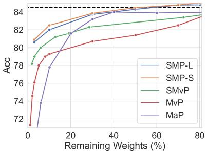  
(a) MNLI

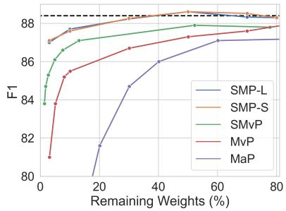  
(b) QQP

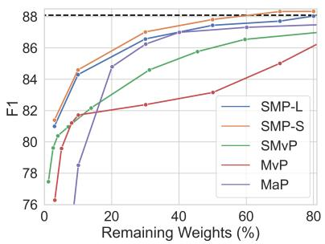  
(c) SQuAD

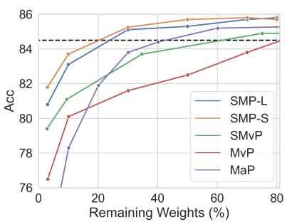  
(d) MNLI + KD

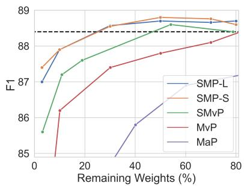  
(e) QQP + KD

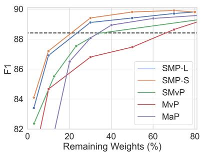  
(f) SQuAD + KD

Figure 1: Comparison of different pruning methods from 3% remaining weights to 80%. The black dashed line in the figures indicates the result of fine-tuned BERT. SMvP, MvP and MaP refer to soft-movement pruning, movement pruning and magnitude pruning, respectively. KD represents the results with knowledge distillation. We report the results of our method on 3%, 10%, 30%, 50%, 70%, and 80% remaining weights. Our method constantly outperforms other methods from low sparsity to high.
<table><tr><td></td><td>Remaining Weights</td><td>New Params Per Task</td><td>MNLI</td><td>SST-2</td><td>MRPC</td><td>CoLA</td><td>QNLI</td><td>QQP</td><td>RTE</td><td>STS-B</td><td></td></tr><tr><td>BERT</td><td>100%</td><td>110M</td><td> $\underline { { \mathrm { M } _ { \mathrm { A C C } } } }$  84.5</td><td>ACC 92.9</td><td>ACC 87.7</td><td>MCC 58.1</td><td>ACC 92.0</td><td>ACC 91.4</td><td>ACC 71.1</td><td>P Corr 91.2</td><td>Avg. 83.6</td></tr><tr><td>SuperT</td><td>86.8%</td><td>98M +  $\mathbf { \nabla } \cdot \theta _ { \mathbf { M } }$ </td><td>84.5</td><td>93.4</td><td>86.2</td><td>58.8</td><td>91.3</td><td>91.3</td><td>72.5</td><td>89.8</td><td>83.5</td></tr><tr><td>SMP (Our)</td><td>80%</td><td> $\theta _ { \mathbf { M } }$ </td><td>85.0</td><td>92.9</td><td>87.0</td><td>61.5</td><td>91.5</td><td>91.4</td><td>72.3</td><td>89.6</td><td>83.9</td></tr><tr><td>RoBERTa</td><td>100%</td><td>125M</td><td>87.6</td><td>94.8</td><td>90.2</td><td>63.6</td><td>92.8</td><td>91.9</td><td>78.7</td><td>91.2</td><td>86.4</td></tr><tr><td>SMP (Our)</td><td>80%</td><td> $\theta _ { \mathbf { M } }$ </td><td>87.6</td><td>94.9</td><td>89.9</td><td>65.4</td><td>92.8</td><td>91.9</td><td>81.5</td><td>91.1</td><td>86.9</td></tr></table>

Table 2: Performance on GLUE development. Our results are averaged from five random seeds. The results of SuperT are from (Liang et al., 2021), and the remaining weights and new parameters per task in SuperT are averaged over all tasks. Note all results are from the setting without knowledge distillation for a fair comparison.

We also validate our method on GLUE and report the results at 80% remaining weights in Table 2. Compared to full-model fine-tuning, our method achieves better performance on two PLMs by only removing 20% parameters in the encoder while keeping the remaining parameters unchanged. Compared to SuperT, which searches 8 different sparsity levels for each task, our method achieves better performance by using the same sparsity levels. In addition, our method also saves more than 98M new parameters per task compared to SuperT.

<table><tr><td rowspan="2"></td><td rowspan="2">Masking Function</td><td colspan="2">MNLI</td><td colspan="3">SQuAD</td></tr><tr><td>80%</td><td>10%</td><td>3%</td><td>80% 10%</td><td>3%</td></tr><tr><td>T G</td><td> $\sigma ( \mathbf { S } _ { ( . ) } { } ^ { l } ) > \tau$ </td><td>N/A 85.0</td><td>N/A 81.0</td><td>N/A 80.1</td><td>N/A</td><td>N/A N/A</td></tr><tr><td>L</td><td> ${ \bf S } _ { ( \cdot ) } { } ^ { \stackrel { \prime } { } } \geq S ^ { v }$ </td><td>84.8</td><td>82.0 80.6</td><td>88.2</td><td>83.1</td><td>79.3</td></tr><tr><td></td><td> $\mathrm { T o p } _ { v } ( \mathbf { S } _ { ( \cdot ) } { } ^ { l } )$ </td><td></td><td>80.9</td><td>88.0 88.3</td><td>84.3</td><td>81.0</td></tr><tr><td> $S$ </td><td> $\mathrm { T o p } _ { v _ { ( \cdot ) } ^ { l } } ( \mathbf { S } _ { ( \cdot ) } ^ { \quad l } )$ </td><td>85.0</td><td>82.5</td><td></td><td>84.6</td><td>81.4</td></tr></table>

Table 3: Influence of different masking functions. We report the results in MNLI and SQuAD with 80%, 10% and 3% remaining weights. N/A means that our method with corresponding masking function fails to converge in our setting. Masking function is to transform $\mathbf { S } _ { ( \cdot ) }$ to the binary mask $\mathbf { M } _ { ( \cdot ) } ^ { l }$ of $\mathbf { W } _ { ( \cdot ) } ^ { l } .$ . T refers to the thresholding masking function following (Sanh et al., 2020), and τ is the threshold. $G$ and $L$ are global and local masking functions, and $S ^ { v }$ is the smallest value in the top v% after sorting all S together. S refers to our proposed masking function, and $v _ { ( \cdot ) } ^ { l }$ is from Eq. 4.

## 6 Analysis

## 6.1 Masking Function

In this section, we discuss the influence of different masking functions. Table 3 shows the results of different masking functions on our method without knowledge distillation. Contrary to previous pruning methods, the thresholding masking function $T$ fails to converge in our method due to the difficulty in controlling the sparsity during training. For global masking function $G ,$ we sort all 85M BERT encoder weights and remain Top v% weights in each training step. Compared to local masking functions $L ,$ G takes more than twice the training times due to the computational cost of sorting 85M weights. Although it took the longest to train, it still underperforms L at 10% and 3% remaining weights. Contrary to $G ,$ our proposed masking function S outperforms L without additional training time since S directly assigns the remaining weights of each matrix. More results of masking functions S and L are also available in Table 1 and Figure 1.

Figure 2 displays the distribution of remaining weights in different layers in MNLI with 10% remaining weights. We find G assigns too many remaining weights for $\mathbf { W } _ { U }$ and $\mathbf { W } _ { V }$ , which are four times larger than other matrices. It causes other weight matrices such as ${ \bf W } _ { Q }$ to be more sparse than S and L. Following previous studies (Sanh et al., 2020; Mallya and Lazebnik, 2018), we also find that overall sparsity tends to increase with the depth of the layer. However, only $\mathbf { W } _ { U }$ and $\mathbf { W } _ { V }$ follow this pattern in all three matrices. Since $\mathbf { W } _ { U }$ and $\mathbf { W } _ { V }$ occupy more than 60% of the weight in each layer, it causes the overall distribution of each layer also follows their trend as well.

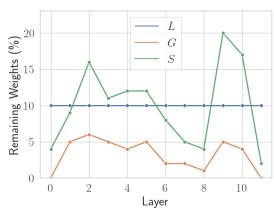  
(a) $\mathbf { W } _ { Q }$

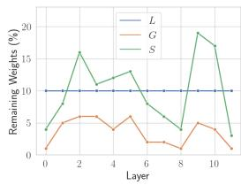  
(b) $\mathbf { W } _ { K }$

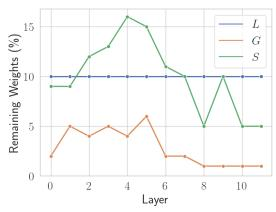

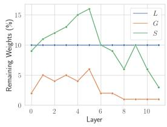

(c) $\mathbf { W } _ { V }$  
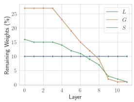

(d) $\mathbf { W } _ { O }$  
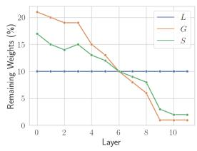  
(f) $\mathbf { W } _ { D }$

(e) $\mathbf { W } _ { U }$  
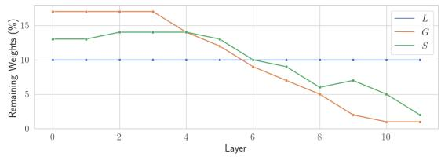  
(g) Overall  
Figure 2: Distribution of remaining weights corresponding to each layer. Overall refers to the overall remaining weights of each layer. $\mathbf { W } _ { ( \cdot ) }$ is the remaining weights for each weight matrix in BERT encoder. L, G and S in figures refer to the masking functions following Table 3.

To understand the behavior of attention heads, we also display the remaining weights ratio of each head in Figure 3. Each row represents a matrix containing 12 heads. Due to space limitation and the similar distribution between $\mathbf { W } _ { Q }$ and ${ \bf W } _ { K }$ , we only show $\mathbf { W } _ { Q }$ and $\mathbf { W } _ { V }$ . Instead of assigning sparsity uniformly to each head, the sparsity of each head is not uniform in three masking functions, with most heads having only below 1% or below remaining weights. Furthermore, three masking functions show similar patterns even with different ways of assigning remaining weights. For our masking function S, S can assign more remaining weights to important heads compared to L, and some heads in ${ \bf W } _ { Q }$ achieve more than 60% remaining weights at 9th layer. For global masking function G, due to most of remaining weights being assigned to $\mathbf { W } _ { U }$ and $\mathbf { W } _ { D }$ , the average remaining weights ratio of $\mathbf { W } _ { Q }$ and $\mathbf { W } _ { V }$ in G are only 3.2% and 2.8%, which causes G to underperform other masking functions.

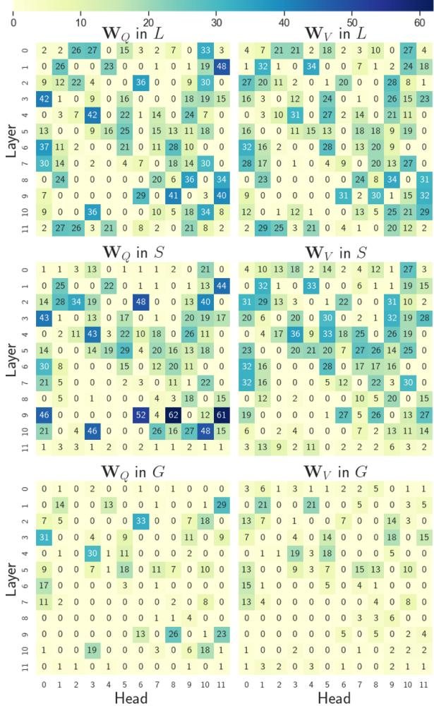  
Figure 3: Remaining weights ratio per attention head of $\mathbf { W } _ { Q }$ and $\mathbf { W } _ { V }$ in MNLI with 10% remaining weights. Each cell refers to the remaining weights ratio of the corresponding attention head. The darker the color, the higher the ratio of remaining weight. L, G and S in figures refer to the masking functions following Table 3.

## 6.2 Task-Specific Head

To validate the effectiveness of our task-specific head initialization method, we compare it with training from scratch.

<table><tr><td rowspan="2"></td><td colspan="3">MNLI</td><td colspan="3">SQuAD</td></tr><tr><td>80%</td><td>10%</td><td>3%</td><td>80%</td><td>10%</td><td>3%</td></tr><tr><td>From scratch</td><td>84.6</td><td>81.7</td><td>80.5</td><td>87.5</td><td>84.2</td><td>80.7</td></tr><tr><td>Initialization</td><td>84.8</td><td>82.0</td><td>80.6</td><td>88.0</td><td>84.3</td><td>81.0</td></tr></table>

Table 4: Influence of different task-specific head methods. “From scratch” refers to training head from scratch following previous pruning methods. “Initialization” refers to our initialization method.

Table 4 shows the results of SMP-L in MNLI and SQuAD with 80%, 10% and 3% remaining weights. For training from scratch, we randomly initial the head and fine-tune it with the learning rate of 3e-5 following previous pruning methods. Results show our method achieves better performance with task-specific heads frozen.

## 6.3 Training Objective

Regularization term in training objective is a key factor for our method. We find that our method is hard to converge at high sparsity without regularization term R in Table 5. With the increase of sparsity, the performance gap between with and without R sharply increases. SMP-L without R even fails to converge at 10% and 3% remaining weights in SQuAD.

<table><tr><td rowspan="2"></td><td colspan="3">MNLI</td><td colspan="2">SQuAD</td></tr><tr><td>80%</td><td>10%</td><td>3%</td><td>80% 10%</td><td>3%</td></tr><tr><td>SMP-L</td><td>84.8</td><td>82.0</td><td>80.6</td><td>88.0 84.3</td><td>81.0</td></tr><tr><td>w/o R</td><td>84.2</td><td>80.1</td><td>69.2</td><td>86.6 N/A</td><td>N/A</td></tr></table>

Table 5: Influence of regularization term. R refers to the regularization term. N/A refers to unable convergence.

As analyzed in section 4.3, we find the remaining weights in attention heads are more uniform without R. For example, the standard deviation of remaining weights in each attention head is 3.75 compared to 12.4 in SMP-L with R in MNLI with 10% remaining weights. In other words, without R, it cannot assign more remaining weights to important heads as in Figure 3.

## 7 Conclusion

In this paper, we propose a simple but effective task-specific pruning method called Static Model Pruning (SMP). Considering previous methods, which perform both pruning and fine-tuning to adapt PLMs to downstream tasks, we find finetuning can be redundant since first-order pruning already converges PLMs. Based on this, our method focuses on using first-order pruning to replace finetuning. Without fine-tuning, our method strongly outperforms other first-order methods. Extensive experiments also show that our method achieves state-of-the-art performances at various sparsity. For the lottery ticket hypothesis in BERT, we find it contains sparsity subnetworks that achieve original performance without training them, and these subnetworks at 80% remaining weights even outperform fine-tuned BERT on GLUE.

## 8 Limitation

Like all unstructured pruning methods, SMP is hard to achieve inference speedup compared to structured pruning methods. Since SMP prunes model without fine-tuning, this also limits the extension of SMP to structured pruning methods. However, we find that most rows of the sparsity matrices in SMP are completely pruned at high sparsity level. This allows us to directly compress the size of matrices, resulting in faster inference. For example, the 3% remaining weights model of MNLI can be compressed to 47.43% of the model actual size (resulting in around 1.37 inference speedup) without retraining or performance loss. By removing rows of matrices that contain less than 10 remaining weights, we can further compress it to 25.19% actual size (1.76 inference speedup) with 0.9 accuracy drop. We expect that a carefully designed loss function during training could result in even smaller actual model size and faster inference speedup, which we leave it in the future.

## 9 Acknowledgments

The research work is supported by the National Key Research and Development Program of China under Grant No. 2021ZD0113602, the National Natural Science Foundation of China under Grant Nos. 62276015, 62176014, the Fundamental Research Funds for the Central Universities.

## References

Ahmad Aghaebrahimian. 2017. Quora question answer dataset. In International Conference on Text, Speech, and Dialogue, pages 66–73. Springer.

Yoshua Bengio, Nicholas Léonard, and Aaron Courville. 2013. Estimating or propagating gradients through stochastic neurons for conditional computation. arXiv preprint arXiv:1308.3432.

Tianlong Chen, Jonathan Frankle, Shiyu Chang, Sijia Liu, Yang Zhang, Zhangyang Wang, and

Michael Carbin. 2020. The lottery ticket hypothesis for pre-trained BERT networks. Advances in Neural Information Processing Systems, 2020- December(NeurIPS):1–13.

Jacob Devlin, Ming-Wei Chang, Kenton Lee, and Kristina Toutanova. 2019. BERT: Pre-training of deep bidirectional transformers for language understanding. In Proceedings ofthe 2019 Conference of the North American Chapter of the Association for Computational Linguistics: Human Language Technologies, Volume 1 (Long and Short Papers), pages 4171–4186, Minneapolis, Minnesota. Association for Computational Linguistics.

Jonathan Frankle and Michael Carbin. 2018. The lottery ticket hypothesis: Finding sparse, trainable neural networks. arXiv preprint arXiv:1803.03635.

Tianyu Gao, Adam Fisch, and Danqi Chen. 2021. Making pre-trained language models better few-shot learners. ACL-IJCNLP 2021 - 59th Annual Meeting of the Association for Computational Linguistics and the 11th International Joint Conference on Natural Language Processing, Proceedings of the Conference, pages 3816–3830.

Song Han, Jeff Pool, John Tran, and William Dally. 2015. Learning both weights and connections for efficient neural network. In Advances in Neural Information Processing Systems (NeurIPS).

Xiaoqi Jiao, Yichun Yin, Lifeng Shang, Xin Jiang, Xiao Chen, Linlin Li, Fang Wang, and Qun Liu. 2020. TinyBERT: Distilling BERT for natural language understanding. In Findings of the Association for Computational Linguistics: EMNLP 2020.

Zhenzhong Lan, Mingda Chen, Sebastian Goodman, Kevin Gimpel, Piyush Sharma, and Radu Soricut. 2020. Albert: A lite bert for self-supervised learning of language representations. In International Conference on Learning Representations (ICLR).

Chen Liang, Simiao Zuo, Minshuo Chen, Haoming Jiang, Xiaodong Liu, Pengcheng He, Tuo Zhao, and Weizhu Chen. 2021. Super tickets in pre-trained language models: From model compression to improving generalization. ACL-IJCNLP 2021 - 59th Annual Meeting of the Association for Computational Linguistics and the 11th International Joint Conference on Natural Language Processing, Proceedings ofthe Conference, (Figure 1):6524–6538.

Christos Louizos, Max Welling, and Diederik P Kingma. 2017. Learning sparse neural networks through l\_0 regularization. arXiv preprint arXiv:1712.01312.

Christos Louizos, Max Welling, and Diederik P. Kingma. 2018. Learning sparse neural networks through l regularization. In International Conference on Learning Representations (ICLR).

Arun Mallya and Svetlana Lazebnik. 2018. Piggyback: Adding multiple tasks to a single, fixed network by learning to mask. ArXiv, abs/1801.06519.

Suyog Gupta Michael H. Zhu. 2018. To prune, or not to prune: Exploring the efficacy of pruning for model compression. In International Conference on Learning Representations (ICLR).

Pavlo Molchanov, Stephen Tyree, Tero Karras, Timo Aila, and Jan Kautz. 2017. Pruning convolutional neural networks for resource efficient inference. In International Conference on Learning Representations (ICLR).

Haotong Qin, Yifu Ding, Mingyuan Zhang, Qinghua Yan, Aishan Liu, Qingqing Dang, Ziwei Liu, and Xianglong Liu. 2022. BiBERT: Accurate Fully Binarized BERT. arXiv preprint arXiv, pages 1–24.

Pranav Rajpurkar, Jian Zhang, Konstantin Lopyrev, and Percy Liang. 2016. Squad: 100, 000+ questions for machine comprehension of text. In EMNLP.

Victor Sanh, Thomas Wolf, and Alexander M. Rush. 2020. Movement pruning: Adaptive sparsity by finetuning. Advances in Neural Information Processing Systems, 2020-Decem(NeurIPS):1–14.

Sheng Shen, Zhen Dong, Jiayu Ye, Linjian Ma, Zhewei Yao, Amir Gholami, Michael W. Mahoney, and Kurt Keutzer. 2020. Q-bert: Hessian based ultra low precision quantization of bert. Proceedings ofthe AAAI Conference on Artificial Intelligence (AAAI).

Alex Wang, Amanpreet Singh, Julian Michael, Felix Hill, Omer Levy, and Samuel R. Bowman. 2019. GLUE: A multi-task benchmark and analysis platform for natural language understanding. In International Conference on Learning Representations (ICLR).

Wenhui Wang, Furu Wei, Li Dong, Hangbo Bao, Nan Yang, and Ming Zhou. 2020. Minilm: Deep selfattention distillation for task-agnostic compression of pre-trained transformers. In Advances in Neural Information Processing Systems (NeurIPS).

Adina Williams, Nikita Nangia, and Samuel Bowman. 2018. A broad-coverage challenge corpus for sentence understanding through inference. In NAACL.

Mengzhou Xia, Zexuan Zhong, and Danqi Chen. 2022. Structured pruning learns compact and accurate models. arXiv preprint arXiv:2204.00408.

Runxin Xu, Fuli Luo, Chengyu Wang, Baobao Chang, Jun Huang, Songfang Huang, and Fei Huang. 2022. From dense to sparse: Contrastive pruning for better pre-trained language model compression. In Thirty-Sixth AAAI Conference on Artificial Intelli gence (AAAI).

## A Standard Deviation of Tasks

We also report our standard deviation of tasks from 5 random runs in Table 6 and 7.

<table><tr><td rowspan="2"></td><td colspan="2">with KD</td><td colspan="2">without KD</td></tr><tr><td>50%</td><td>10%</td><td>3% 10%</td><td>3%</td></tr><tr><td>MNLI MACC std.</td><td>SMP-L</td><td>0.17 0.26</td><td>0.19 0.27</td><td>0.20</td></tr><tr><td>QQP</td><td>SMP-S</td><td>0.13 0.24</td><td>0.30 0.25</td><td>0.28</td></tr><tr><td>ACC std.</td><td>SMP-L</td><td>0.04 0.01</td><td>0.08 0.06</td><td>0.01</td></tr><tr><td></td><td>SMP-S</td><td>0.02 0.03</td><td>0.02 0.01</td><td>0.02</td></tr><tr><td>SQuAD</td><td>SMP-L</td><td>0.17 0.09</td><td>0.03</td><td>0.36 0.01</td></tr><tr><td>F1 std.</td><td>SMP-S</td><td>0.10 0.07</td><td>0.02</td><td>0.42 0.07</td></tr></table>

Table 6: Standard deviation of Table 1

<table><tr><td>SMP(BERT)</td><td>SMP(RoBERTa)</td></tr><tr><td>MNLI 0.15</td><td>0.12</td></tr><tr><td>QNLI</td><td>0.15 0.11</td></tr><tr><td>QQP</td><td>0.03 0.14</td></tr><tr><td>SST2</td><td>0.36 0.28</td></tr><tr><td>MRPC</td><td>1.21 0.44</td></tr><tr><td>COLA</td><td>0.69 0.65</td></tr><tr><td>STSB</td><td>0.14 0.16</td></tr><tr><td>RTE</td><td>1.59 0.74</td></tr></table>

Table 7: Standard deviation of Table 2

## ACL 2023 Responsible NLP Checklist

## A For every submission:

✓ A1. Did you describe the limitations of your work? Left blank.

 A2. Did you discuss any potential risks of your work? Not applicable. Left blank.

✓ A3. Do the abstract and introduction summarize the paper’s main claims? Left blank.

✗ A4. Have you used AI writing assistants when working on this paper? Left blank.

## B ✗ Did you use or create scientific artifacts?

Left blank.

 B1. Did you cite the creators of artifacts you used? No response.

 B2. Did you discuss the license or terms for use and / or distribution of any artifacts? No response.

 B3. Did you discuss if your use of existing artifact(s) was consistent with their intended use, provided that it was specified? For the artifacts you create, do you specify intended use and whether that is compatible with the original access conditions (in particular, derivatives of data accessed for research purposes should not be used outside of research contexts)? No response.

 B4. Did you discuss the steps taken to check whether the data that was collected / used contains any information that names or uniquely identifies individual people or offensive content, and the steps taken to protect / anonymize it? No response.

 B5. Did you provide documentation of the artifacts, e.g., coverage of domains, languages, and linguistic phenomena, demographic groups represented, etc.? No response.

 B6. Did you report relevant statistics like the number of examples, details of train / test / dev splits, etc. for the data that you used / created? Even for commonly-used benchmark datasets, include the number of examples in train / validation / test splits, as these provide necessary context for a reader to understand experimental results. For example, small differences in accuracy on large test sets may be significant, while on small test sets they may not be. No response.

## C ✓ Did you run computational experiments?

Left blank.

✓ C1. Did you report the number of parameters in the models used, the total computational budget (e.g., GPU hours), and computing infrastructure used? Left blank.

✓ C2. Did you discuss the experimental setup, including hyperparameter search and best-found hyperparameter values? Left blank.

✓ C3. Did you report descriptive statistics about your results (e.g., error bars around results, summary statistics from sets of experiments), and is it transparent whether you are reporting the max, mean, etc. or just a single run? Left blank.

✓ C4. If you used existing packages (e.g., for preprocessing, for normalization, or for evaluation), did you report the implementation, model, and parameter settings used (e.g., NLTK, Spacy, ROUGE, etc.)? Left blank.

D ✗ Did you use human annotators (e.g., crowdworkers) or research with human participants? Left blank.

 D1. Did you report the full text of instructions given to participants, including e.g., screenshots, disclaimers of any risks to participants or annotators, etc.? No response.

 D2. Did you report information about how you recruited (e.g., crowdsourcing platform, students) and paid participants, and discuss if such payment is adequate given the participants’ demographic (e.g., country of residence)? No response.

 D3. Did you discuss whether and how consent was obtained from people whose data you’re using/curating? For example, if you collected data via crowdsourcing, did your instructions to crowdworkers explain how the data would be used? No response.

 D4. Was the data collection protocol approved (or determined exempt) by an ethics review board? No response.

 D5. Did you report the basic demographic and geographic characteristics of the annotator population that is the source of the data? No response.