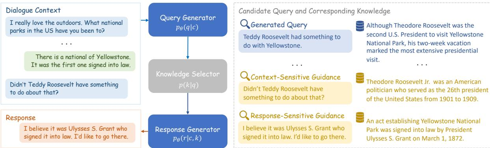
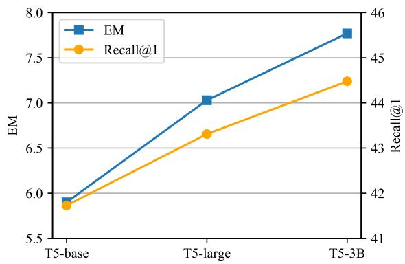
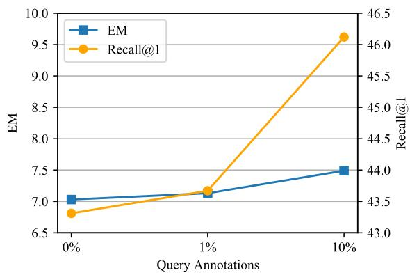

# Query Enhanced Knowledge-Intensive Conversation via Unsupervised Joint Modeling

Mingzhu Cai Siqi Bao Xin Tian Huang He Fan Wang Hua Wu Baidu Inc., China

{caimingzhu, baosiqi, tianxin06, hehuang, wang.fan, wu\_hua}@baidu.com

## Abstract

In this paper, we propose an unsupervised query enhanced approach for knowledgeintensive conversations, namely QKConv. There are three modules in QKConv: a query generator, an off-the-shelf knowledge selector, and a response generator. QKConv is optimized through joint training, which produces the response by exploring multiple candidate queries and leveraging corresponding selected knowledge. The joint training solely relies on the dialogue context and target response, getting exempt from extra query annotations or knowledge provenances. To evaluate the effectiveness of the proposed QKConv, we conduct experiments on three representative knowledgeintensive conversation datasets: conversational question-answering, task-oriented dialogue, and knowledge-grounded conversation. Experimental results reveal that QKConv performs better than all unsupervised methods across three datasets and achieves competitive performance compared to supervised methods.

## 1 Introduction

In addition to open-domain chitchat, there exist various knowledge-intensive conversations, such as conversational question-answering, task-oriented dialogue, and knowledge-grounded conversation. Although large-scale language models can implicitly store common knowledge within parameters (Petroni et al., 2019; Zhao et al., 2020b), they are known to suffer from producing plausible statements with factual errors (a.k.a. knowledge hallucination) (Roller et al., 2021; Marcus, 2020). Therefore, there is a trend to rely on external resources, such as Wikipedia databases or search engine results, to facilitate knowledge-intensive conversations (Dinan et al., 2019; Komeili et al., 2022).

In knowledge-intensive conversations, the most straightforward way to retrieve external knowledge is to take the dialogue context as the query and use an off-the-shelf retriever to return the knowledge entry. However, it encounters some difficulties in retrieving appropriate knowledge (Shuster et al., 2021). As the focus or topic changes along with the conversation flow, the outdated information in the dialogue context brings extra noise to the retriever, resulting in obsolete or irrelevant knowledge retrieved. Moreover, the dialogue context has a native misalignment with the short and interrogative query preferred in existing retrievers.

Some methods choose to finetune a task-specific retriever to enhance the performance of knowledge selection (Guu et al., 2020; Shuster et al., 2021; Glass et al., 2022). However, this strategy is usually computationally expensive (e.g., finetuning a dense retriever requires constant recomputation for massive knowledge entries) or even infeasible for complex retrieval systems (e.g., retraining a search engine is impractical). Some other methods choose to generate a self-contained query based on the dialogue context (Yu et al., 2020; Anantha et al., 2021; Chen et al., 2022). This strategy relies on careful query annotations to guarantee the completeness of essential information extraction and the adaptation to the knowledge selector.

In this paper, we introduce a novel unsupervised query enhanced approach for knowledge-intensive conversations, namely QKConv. As shown in Figure 1, QKConv consists of three modules: a query generator, an off-the-shelf knowledge selector, and a response generator. Specifically, QKConv is optimized through joint training, which produces the response by exploring multiple candidate queries and leveraging corresponding selected knowledge. We also integrate two types of query guidance to regulate query generation and facilitate joint training: context-sensitive guidance (e.g., the last context utterance) and response-sensitive guidance (e.g., the target response).

The benefits brought by QKConv’s design are three-fold. Firstly, the training of QKConv solely relies on the dialogue context and target response, getting exempt from extra query annotations or knowledge provenances. Secondly, the joint training of QKConv boosts query generation toward better knowledge selection and ensures end-to-end performances, compared to the individual optimization of each module. Thirdly, thanks to the query generation module, QKConv gets rid of the expensive computation of tuning knowledge selectors and has the generality to adopt various knowledge selectors.

  
Figure 1: Overview of QKConv’s joint training process. QKConv consists of three modules: a query generator, an off-the-shelf knowledge selector, and a response generator, where two generators share model parameters. During training, for a given dialogue context, QKConv learns to produce the target response by exploring multiple candidate queries and leveraging corresponding selected knowledge. Additionally, we integrate context-sensitive and response-sensitive guidance into the candidate query set to regulate query generation and facilitate joint training.

To evaluate the effectiveness of the proposed QK-Conv, we conduct experiments on three representative knowledge-intensive conversation datasets: conversational question answering QReCC (Anantha et al., 2021), task-oriented dialogue SMD (Eric et al., 2017), and knowledge-grounded conversation WoW (Dinan et al., 2019). Experimental results reveal that QKConv performs better than all unsupervised methods across three datasets and even outperforms supervised methods on some datasets. Specifically, QKConv’s generated query achieves superior knowledge selection performance, and QKConv exhibits robust knowledge utilization in response generation. We have released QKConv’s code and model checkpoints1, hoping to facilitate further research in knowledgeintensive conversations.

In summary, the main contributions of this paper are: (1) We propose an unsupervised query enhanced approach via joint training for knowledgeintensive conversations, namely QKConv. To the best of our knowledge, we are the first to utilize joint training for query generation. (2) We show that QKConv achieves state-of-the-art end-to-end results against all unsupervised methods and outperforms supervised methods on certain datasets. (3) We show that QKConv exhibits superior query quality and robust knowledge utilization in response generation.

## d-to-End Backpropagation2 Methodology

This paper introduces a query enhanced approach of QKConv, which incorporates query generation to boost knowledge-intensive conversations and optimizes the dialogue system via unsupervised joint training. As shown in Figure 1, QKConv consists of three modules: Query Generator to generate multiple queries based on the dialogue context; an off-the-shelf Knowledge Selector to find relevant knowledge given queries; Response Generator to produce the final response. In the following, we will elaborate the design of these modules and discuss the process of joint training in detail.

## 2.1 Query Enhanced Knowledge-Intensive Conversation Modeling

## Query Generator

The query generator aims to produce an effective query to retrieve appropriate knowledge for response generation. In the training process, with the dialogue context as input, the query generator will explore and produce multiple queries as candidates. The dialogue context is the concatenation of previous utterances $c = \{ u _ { 1 } , u _ { 2 } , \ldots , u _ { n } \}$ and the candidate query $q \in \mathcal { Q }$ is generated with

probability $p _ { \theta } ( q | c )$

## Knowledge Selector

The knowledge selector needs to find relevant knowledge from the knowledge base for a given query. To guarantee selection relevance, the offthe-shelf knowledge selector consists of one retriever for fast knowledge recall and one successive reranker for fine-grained relevance estimation. Given a candidate query q, the final knowledge selection score is the combination of two-stage scores (Gallagher et al., 2019):

$$
p ( k | q ) = \sigma \big ( S _ { r e t r i e v a l } ( k | q ) + S _ { r e r a n k } ( k | q ) \big )\tag{1}
$$

where $\sigma ( \cdot )$ refers to the sigmoid function. Unless specified, the knowledge with the highest score will be selected for the given query and used in the response generation.

## Response Generator

The response generator aims to produce an appropriate response grounded on selected knowledge. In the training process, with the dialogue context and candidate knowledge as input, the probability of producing the target response is estimated as $p _ { \theta } ( r | c , k )$ . In addition, the response and query generators share model parameters, with prompts added for task differentiation2.

## 2.2 Joint Training

Under such a design, the response generation in knowledge-intensive conversations is modeled as follows:

$$
p ( r | c ) \propto \sum _ { q \in \mathcal { Q } } p _ { \theta } ( q | c ) p ( k | q ) p _ { \theta } ( r | c , k )\tag{2}
$$

where c is the dialogue context, r is the target response, q is one candidate query, and k is its corresponding knowledge. The training objective is to maximize the generation probability of the target response through marginalization over candidate queries. Exploring multiple query candidates leads to diverse knowledge selection and generation probability of target response. Supposing one candidate query stimulates the knowledge coherent with the dialogue context and relevant to the target response, the joint training will encourage this query generation and facilitate knowledge utilization in response generation. Otherwise, the joint optimization will suppress the corresponding query generation and restrain knowledge utilization in response generation.

During training, we propose to integrate contextsensitive guidance (e.g., the last context utterance $u _ { n } )$ and response-sensitive guidance (e.g., the target response r) into the candidate query set. The benefits brought by the guidance integration are two-fold. Firstly, the query guidance can regulate query generation. Context-sensitive guidance suggests extracting essential information from the context, and response-sensitive guidance suggests predicting the focus of the target response. These two guidance act as references and help the query generator avoid non-sense queries in unsupervised training. Secondly, the two types of query guidance can facilitate joint training. Since selecting the relevant knowledge for the target response is challenging, constant exposure to irrelevant knowledge will make the model ignore given knowledge and generate generic responses. Incorporating contextsensitive (prior) and response-sensitive (posterior) guidance amplifies knowledge diversity and enhances the selection of relevant knowledge. The exposure to diverse knowledge (relevant and irrelevant) helps facilitate end-to-end joint training. In short, such incorporation helps avoid the degradation of non-sense query generation and knowledgeindependent response generation in joint training.

To alleviate the costly query generation and knowledge selection at each training step, we utilize iterative training to speed up the training process, which embraces an inner-outer loop structure for model training and data collection. In the outer loop, the inference is carried out over the train set to collect candidate queries with the up-to-date query generator and corresponding knowledge with the off-the-shelf knowledge selector. In the inner loop, the query and response generators are optimized jointly to maximize the probability of the target response. The inner-outer loop will iterate several times until convergence.

## 3 Experiments

## 3.1 Experiment Settings

## 3.1.1 Datasets

We conduct experiments on three datasets over diverse knowledge-intensive conversation tasks: QReCC (Anantha et al., 2021) for conversational question answering, Standford Multi-Domain (SMD) (Eric et al., 2017) for task-oriented dialogue, and Wizard of Wikipedia (WoW) (Dinan et al., 2019) for open-domain knowledge-grounded dialogue.

<table><tr><td>Datasets</td><td>Metrics</td><td>Compared Model</td><td>Extra Supervision</td><td>Pre-trained Model</td></tr><tr><td>QReCC</td><td>F1, EM</td><td>DPR(IHN)-FiD (Kim and Kim, 2022)† Raposo et al. (2022)‡</td><td>Selection Annotations</td><td>T5-base pegasus-large</td></tr><tr><td>SMD</td><td>Entity-F1, BLEU</td><td>Q-TOD (Tian et al., 2022)† UnifiedSKG (Xie et al., 2022)</td><td>Query Annotations</td><td>T5-large T5-large</td></tr><tr><td>WoW</td><td>KILT-F1, KILT-Rouge-L</td><td>Re2G (Glass et al., 2022)† Hindsight (Paranjape et al., 2022)‡</td><td>Selection Annotations</td><td>BART-large BART-large</td></tr></table>

Table 1: Summarization of the state-of-the-art supervised and unsupervised models. † and ‡ denote the state-of-theart supervised and unsupervised models, respectively.

QReCC3 contains 14K open-domain conversations with 80K question-answer pairs, where each conversational question is rewritten into a selfcontained query by human crowdworkers. The knowledge base is a collection of 54M passages split from 10M web pages and indexed by BM25.

SMD is a task-oriented dialogue dataset including 3K conversations. Each conversation is equipped with a small knowledge base.

Wizard of Wikipedia (WoW)4 is an open-domain dialogue dataset with 18K conversations. The conversations are grounded on knowledge from Wikipedia retrieved by TF-IDF.

## 3.1.2 Baselines

We compare QKConv to the previous state-of-theart supervised and unsupervised models on each dataset. Details about the compared models are summarized in Table 1. Supervised models leverage either query annotations or knowledge selection annotations, while unsupervised models only rely on the dialogue context and response. Among these models, tuning dense retrievers is employed in DPR (IHN)-FiD (Kim and Kim, 2022), Re2G (Glass et al., 2022), Hindsight (Paranjape et al., 2022), while the query generation method is preferred by Q-TOD (Tian et al., 2022) and Raposo et al. (2022). Compared to methods augmented by knowledge selection, UnifiedSKG (Xie et al., 2022) utilizes the entire knowledge base to generate the response.

## 3.1.3 Implementation Details

Knowledge Selector Following the retriever setting of the original dataset, BM25 and TF-IDF are employed for QReCC and WoW, respectively. However, the SMD dataset does not involve a retriever due to the fairly small knowledge base. For reranking, an off-the-shelf model RocketQA (Ren et al., 2021) is used for all datasets.

Generator We employ the same pre-trained model as the state-of-the-art supervised model to perform query and response generation, i.e., T5-base (220M) (Raffel et al., 2020) for QReCC, T5-large (770M) (Raffel et al., 2020) for SMD, and BARTlarge (400M) (Lewis et al., 2020a) for WoW.

Training QKConv is trained in an inner-outer loop structure that iteratively executes query generation, knowledge selection in the outer loop, and model updating in the inner loop. For query generation, we adopt beam search with a beam size of 4 as the decoding strategy and use all decoding results as candidate queries. Therefore, the set of query candidates consists of four generated queries, one response-sensitive guidance, and one context-sensitive guidance. The response-sensitive guidance refers to the target response. In light of previous common queries (Raposo et al., 2022; Shuster et al., 2021), the context-sensitive guidance refers to the last utterance of dialogue on QReCC and dialogue context on SMD and WoW. To familiarize pre-trained models with dialogue tasks, the generator is warmed up with the response generation task for a few epochs.

Inference The decoding strategy of query and response generation is beam search with a beam size of 4. We use the decoding result with the highest probability as the final result.

More details about hyperparameter settings are provided in Appendix A.

<table><tr><td></td><td colspan="2">QReCC</td><td colspan="2">SMD</td><td colspan="2">WoW</td></tr><tr><td></td><td>F1</td><td>EM</td><td>Entity F1</td><td>BLEU</td><td>KILT-F1</td><td>KILT-RL</td></tr><tr><td>Previous SOTA (w/ label)</td><td>30.40</td><td>4.70</td><td>71.11</td><td>21.33</td><td>12.98</td><td>11.39</td></tr><tr><td>Previous SOTA (w/o label)</td><td>18.90</td><td>1.00</td><td>65.85</td><td>17.27</td><td>13.39</td><td>11.92</td></tr><tr><td>QKConv</td><td>33.54</td><td>5.90</td><td>68.94</td><td>20.35</td><td>13.64</td><td>12.03</td></tr></table>

Table 2: Evaluation results on SMD, QReCC, and WoW test sets, with the best value of the dataset indicated by underlines and the best value from unsupervised methods written in bold.

## 3.2 Results

We evaluate the end-to-end performance of our models on the three knowledge-intensive dialogue datasets following the metrics used in prior studies (Anantha et al., 2021; Eric et al., 2017; Petroni et al., 2021). In particular, Entity-F1 (Eric et al., 2017) measures overlapping entities between generated response and ground truth. KILT-F1 and KILT-Rouge-L (KILT-RL) (Petroni et al., 2021) only award points to instances with accurate knowledge selection. Table 2 summarizes the results of our models and the state-of-the-art models trained with and without supervision on three datasets.

QKConv consistently outperforms the unsupervised results on three datasets and even surpasses the supervised results on QReCC and WoW. Compared to unsupervised models, on the F1 score, QK-Conv achieves a relative improvement of 78.2% on QReCC, 4.7% on SMD, and 1.9% on WoW, respectively. The encouraging improvements demonstrate that our proposed QKConv has strong effectiveness and robustness to generate high-quality responses across various knowledge-intensive conversations. In comparison to supervised SOTA with retriever finetuning, QKConv obtains the best F1 scores with a relative increment of 10.8% on QReCC, and 5.1% on WoW, respectively. As for the supervised models with query annotations, the relatively lower Entity-F1 on SMD suggests some room for improvement for unsupervised QKConv.

## 4 Discussion

In this section, to further dissect the proposed QKConv, more experiments are conducted on the QReCC dataset. Unless specified, the pre-trained model of T5-large is employed in the following experiments.

## 4.1 Query Generation Analysis

In this paper, a query enhanced approach is introduced for knowledge-intensive conversations. For an in-depth analysis of query incorporation, we will discuss three research questions regarding QK-Conv’s query on essential, modality, and superiority.

<table><tr><td>Query</td><td>Knowledge Recall@1</td><td>Query Statistics Length</td><td>C-F1</td><td>R-F1</td></tr><tr><td>Context</td><td>39.15</td><td>89.55</td><td>100</td><td>15.54</td></tr><tr><td>Last Utterance</td><td>9.27</td><td>6.44</td><td>29.95</td><td>11.83</td></tr><tr><td>Response</td><td>83.32</td><td>19.34</td><td>15.54</td><td>100</td></tr><tr><td>Golden Query</td><td>49.06</td><td>9.89</td><td>33.10</td><td>23.93</td></tr><tr><td>QKConv</td><td>43.31</td><td>19.49</td><td>48.01</td><td>23.05</td></tr></table>

Table 3: Knowledge selection results and corresponding query statistics on the QReCC test set. C-F1 and R-F1 are abbreviated for Context-F1 and Response-F1.

RQ1 Is it essential to generate queries for knowledge selection?

It is known that the most straightforward way is to employ the dialogue context or the last utterance as the query for knowledge selection. We compare the impact of various query types on knowledge selection, with results summarized in Table 3.5 The knowledge selection results by the target response and golden query are also provided for reference. Measure by the Recall@1 score, QKConv’s generated query improves knowledge selection performance by 4.16% compared to the dialogue context and narrows the gap to 5.75% compared to the golden query. In addition, the improvement reaches 34.04% compared to the widely adopted last utterance. These results suggest that query generation is essential in boosting knowledge selection.

RQ2 What is the generated query’s modality, similar to the dialogue context or the response?

As described in Section 2.2, QKConv incorporates context-sensitive and response-sensitive guidance to regulate query generation. After joint training, what is the modality of the generated query, similar to the dialogue context or the response? For this investigation, we estimate the similarity of the generated query to the dialogue context and the target response using the word overlapping F1 metric. The Context-F1 and Response-F1 results are summarized in Table 3, together with the query length statistics.

<table><tr><td>Model</td><td>Knowledge Selector MRR@10 Recall@1</td><td></td><td></td></tr><tr><td>CONQRR</td><td>Retriever</td><td>38.30</td><td>-</td></tr><tr><td rowspan="2">QKConv</td><td>Retriever</td><td>43.09</td><td>36.34</td></tr><tr><td>Retriever+Reranker</td><td>49.61</td><td>41.73</td></tr></table>

Table 4: Comparison of knowledge selection performance between QKConv and CONQRR with T5-base as the pre-trained model.

The relatively high value of Context-F1 indicates that the generated query gathers intensive information from the context. Meanwhile, the relatively high value of Response-F1 indicates that the generated query includes relevant information with the response. In short, the generated query exhibits a hybrid modality, incorporating intensive information from the dialogue context and some predicted hints toward the response. One qualitative example is also provided in Table 8 to illustrate this phenomenon.

RQ3 Is the performance of the generated query superior to other state-of-the-art approaches?

On the QReCC dataset, CONQRR (Wu et al., 2021) is the state-of-the-art query generation approach, which leverages query annotations and a reward function to optimize the query generation through supervised and reinforcement learning. CONQRR utilizes the BM25 retriever as the knowledge selector and employs T5-base as the pretrained model. Table 4 summarizes the knowledge selection performance of CONQRR and QKConv.

When compared under the same retriever, despite that QKConv is optimized via unsupervised joint training, the generated query achieves 4.79% higher MRR@10 than CONQRR. The remarkable improvement of generated queries confirms the superior performance of QKConv on knowledge selection. In addition, QKConv equipped with a reranker raises MRR@10 by 6.52% and Recall@1 by 5.39% significantly. These results confirm the benefits of adopting the combinatorial knowledge selector.

## 4.2 Knowledge Utilization Ability

QKConv also demonstrates strong knowledge utilization ability in response generation, apart from accurate knowledge selection in query generation. As the selected knowledge is not always appropriate, the response generator encounters the challenge of properly utilizing the selected knowledge. When confronting appropriate knowledge, the response generator is expected to ground on the knowledge and then incorporate it properly. In contrast, with irrelevant knowledge, the response generator should denoise and eliminate high reliance on it.

To investigate the knowledge utilization ability of QKConv, we divide the selected knowledge into accurate and inaccurate knowledge according to the Recall@1 metrics. We compare the response generator of QKConv with the response generator baseline. The baseline model is trained in an individually optimized manner (not joint training), with the dialogue context and knowledge selected by golden queries as input and the target response as output. In the evaluation phase, the same data is applied for comparisons.

Automatics evaluation We compute the F1 score between generated responses and ground truth and the KR-F1 score for both models. The KR-F1 score, adapted from Paranjape et al. (2022), evaluates the F1 score between generated response and selected knowledge (not golden knowledge). The optimal value for KR-F1 is the one being close to the KR-F1 by ground truth, which indicates a natural knowledge utilization rather than under-utilization or over-reliance.

Table 5 summarizes knowledge utilization ability with ground-truth results as references. For the overall F1 score, QKConv outperforms the baseline model by 1.87%. Considering results based on knowledge correctness, the KR-F1 for correct knowledge is more significant than incorrect knowledge by 3.73% in QKConv. The notable gap reveals that QKConv can distinguish knowledge associated with dialogue context and rely more on the correct knowledge. A similar but smaller gap (2.13%) can be found in the baseline model, which suggests that this ability is introduced by exposing diverse knowledge quality to response generation during training. Furthermore, with the correct knowledge, QKConv demonstrates a significantly higher F1 and closer KR-F1 than the baseline model.

<table><tr><td>Model</td><td>Overall</td><td colspan="2">Recall@1=1</td><td colspan="2">Recall@1=0</td></tr><tr><td></td><td>F1</td><td>F1</td><td>KR-F1</td><td>F1</td><td>KR-F1</td></tr><tr><td>Baseline</td><td>34.40</td><td>60.98</td><td>15.29</td><td>21.61</td><td>13.16</td></tr><tr><td>QKConv</td><td>36.27</td><td>63.20</td><td>14.31</td><td>23.55</td><td>10.58</td></tr><tr><td>Ground Truth</td><td>100</td><td>100</td><td>12.72</td><td>100</td><td>6.18</td></tr></table>

Table 5: Comparisons of knowledge utilization ability between QKConv and individually optimized baseline model, with the best value written in bold. KR-F1 evaluates the overlap between generated response and selected knowledge.
<table><tr><td>Model</td><td>Coherence</td><td>Groundedness</td><td>Engagingness</td></tr><tr><td></td><td colspan="3">Recall@1=1</td></tr><tr><td>Baseline</td><td>1.64</td><td>2</td><td>1.63</td></tr><tr><td>QKConv</td><td>1.78</td><td>2</td><td>1.76</td></tr><tr><td></td><td colspan="3">Recall@1=0</td></tr><tr><td>Baseline</td><td>0.89</td><td>1.87</td><td>0.84</td></tr><tr><td>QKConv</td><td>1.16</td><td>1.60</td><td>1.11</td></tr></table>

Table 6: Human evaluation results with the best scores written in bold.

Human evaluation We randomly sampled 50 examples with correct knowledge and another 50 with incorrect knowledge. Crowd-sourcing workers evaluate each sample on three aspects with a range of [0, 1, 2]:

• Coherence assesses whether the response is relevant and consistent with the dialogue context.

• Groundedness assesses whether the response contains information from the given knowledge.

• Engagingness measures the willingness to have a long conversation.

Table 6 demonstrates that QKConv outperforms the baseline model regarding Coherence and Engagingness, while achieving similar levels of Groundedness with accurate knowledge and lower Groundedness (by 0.27) with inaccurate knowledge. These results indicate that compared to the individuallyoptimized baseline, QKConv can incorporate correct knowledge to a more natural degree and yield higher-quality responses.

In short, both automatic and human evaluation results confirm that QKConv attains robustness to different qualities of knowledge and a remarkable knowledge utilization ability to correct knowledge.

## 4.3 Effect of Guidance

We propose context-sensitive and responsesensitive guidance to regulate query generation and facilitate joint training. The query generation demonstrates a hybrid modality under the regulation of guidance as described in Section 4.1. To scrutinize the efficacy of guidance in joint training, we conduct ablation experiments with QKConv, detailed in Table 7.

<table><tr><td></td><td>F1</td><td>EM</td><td>Recall@1</td></tr><tr><td>QKConv</td><td>36.27</td><td>7.03</td><td>43.31</td></tr><tr><td>no guidance</td><td> $3 3 . 3 5 _ { \downarrow 2 . 9 2 }$ </td><td> $5 . 9 4 _ { \downarrow 1 . 0 9 }$ </td><td> $4 0 . 3 8 _ { \downarrow 2 . 9 3 }$ </td></tr><tr><td>w/ context-sensitive</td><td> $3 5 . 2 4 _ { \downarrow 1 . 0 3 }$ </td><td> $6 . 3 5 _ { \downarrow 0 . 6 8 }$ </td><td> $4 2 . 7 6 _ { \downarrow 0 . 5 5 }$ </td></tr><tr><td>w/ response-sensitive</td><td> $3 4 . 7 5 _ { \downarrow 1 . 5 2 }$ </td><td> $6 . 4 6 _ { \downarrow 0 . 5 7 }$ </td><td> $4 1 . 9 7 _ { \downarrow 1 . 3 4 }$ </td></tr></table>

Table 7: Comparisons of the effect of guidance.

In the absence of all guidance, our model witnesses a marked decrease in all metrics, resulting in 2.92%/1.09%/2.93% declines in F1/EM/Recall@1. With the incorporation of either guidance, knowledge selection and end-to-end performances are enhanced to a considerable extent but remain inferior to QKConv. These results indicate that both types of guidance contribute to joint training, and the combined implementation yields the most significant benefits. Despite the decline in performance, QKConv trained without guidance still outperforms the state-of-the-art models (Raposo et al. (2022) with 18.90 F1 and 1.00 EM), highlighting that the advantages of our method are brought by joint training and boosted by two types of query guidance.

## 4.4 Case Studies

We provide a cherry-picked example and a lemonpicked example in Table 8 to gain insight into the performance of QKConv. Additional examples are available in Appendix E.

The cherry-picked example inquires about the reaction of a previously stated book. For query generation, the query generated by QKConv is response-looking, attempting to reply to the conversation. Although the response-looking query contains certain counterfeit information, the book’s full title extracted from the conversation history contributes to accurate knowledge selection. For response generation, QKConv locates the relevant sentence within the long knowledge paragraph and generates an appropriate response.

The lemon-picked example inquires about an actor’s films in addition to the previously mentioned one. Our model’s generated query is also response-looking, extracting relevant information from the previous text and organizing it into a response. However, the model fails to consider the limiting word "other" in the last utterance, resulting in inappropriate knowledge selection and a similar response as in the previous dialogue history.

<table><tr><td colspan="2">Cherry-picked example</td></tr><tr><td>Dialogue History</td><td>User: what were some of john stossel&#x27;s most popular publications? System: give me a break: how i exposed hucksters, cheats, and scam artists and became the scourge of the liberal media is an autobiography documenting stossel&#x27;s career and philosophical transition.</td></tr><tr><td>QKConv Query</td><td>User: what was the response? give me a break: how i exposed hucksters, cheats, and scam artists and became the scourge of the liberal media received generally positive reviews from critics. (√)</td></tr><tr><td></td><td>Selected Knowledge give me a break: how I ... it was a new york times bestseller for 11 weeks. ... QKConv Response it was a new york times bestseller for 11 weeks.</td></tr><tr><td colspan="2">Lemon-picked example</td></tr><tr><td>Dialogue History</td><td>User: what part did victor mclaglen play in happy days? System: victor mclaglen was a minstrel show performer in the film, happy days.</td></tr><tr><td></td><td>User: what other films did he play in?</td></tr><tr><td>QKConv Query</td><td>victor mclaglen was a minstrel show performer in the film, happy days. (X) Selected Knowledge originally titled new orleans frolic, the story centers around margie (played by marjorie white ), ...</td></tr><tr><td>QKConv Response</td><td>victor mclaglen as minstrel show performer ... victor mclaglen played a minstrel show performer in the film, new orleans frolic.</td></tr></table>

Table 8: Examples of queries generated by QKConv on QReCC test set. Blue marks the provenance of queries, and the underline highlights the source of response. / inside the bracket indicates top-1 knowledge selection accuracy.

## 5 Related Work

Knowledge-Intensive Conversation To attend knowledge in conversations, some prior studies concentrate on how to ground the given knowledge (Ma et al., 2020; Xie et al., 2022) or elicit parametric knowledge from large language models (Zhao et al., 2020b). Recently, access to an external knowledge corpus has attracted a spate of interest, in line with our paper, and has come up with several datasets. For instance, some datasets provide a fixed small knowledge base for each sample (Eric et al., 2017; Wen et al., 2017; Dinan et al., 2019; Moghe et al., 2018). In more natural circumstances, using a uniform large-scale knowledge base for all samples, such as Wikipedia dumps, web crawl data, or even search engines, has become a trend (Zhou et al., 2018; Petroni et al., 2021; Anantha et al., 2021; Komeili et al., 2022). However, it should be noted that knowledge selection challenges increase with the size of the knowledge base, and selection performance bounds the performance of response generation. Therefore, the performance of knowledge selection is crucial for knowledge-intensive dialogue. Two primary directions to address knowledge selection are finetuning knowledge selectors and generating a context-independent query.

Retrieval-Augmented Generation Recently, an increasing interest has been shown in modeling a dense knowledge selector and response generator simultaneously, with the dialogue context as the query. Many of these works utilize joint training (Lewis et al., 2020b; Guu et al., 2020; Shuster et al., 2021; Huang et al., 2021; Thulke et al., 2021; Glass et al., 2022) or reinforcement learning (Zhao et al., 2020a) to modify the prior selection distribution. As opposed, some studies directly involve the posterior distribution of knowledge to enhance knowledge selection (Lian et al., 2019; Kim et al., 2020; Paranjape et al., 2022). However, repeated index rebuilding for the updated knowledge selector is time-consuming with the large-scale knowledge base, and the involvement of posterior distribution may render the training-inference discrepancy. Furthermore, a few works consider a complicated selection process attributed to the challenging and interrupted gradient propagation (Glass et al., 2022). This paper investigates the query generator rather than the selector and exploits off-the-shelf selectors to refrain from the above problems.

Query Generation A lengthy dialog context as the query reduces the efficiency of the knowledge selector and may be misaligned with the form preferred in off-the-shelf selectors. Prior works (Yu et al., 2020; Anantha et al., 2021; Vakulenko et al., 2021; Komeili et al., 2022; Tian et al., 2022) leverage query annotations as supervision to train query generators that convert a dialogue context into a context-independent query, but facing the problem of human-written queries often unavailable in practice. With the absence of external supervision, Mao et al. (2021) regards response and knowledge as training targets to expand the original query. However, memorizing response and knowledge has a heavy burden on the model for a large-scale knowledge base. Moreover, some current studies argue that the supervised learning of queries disconnects from knowledge selection and end-to-end performance (Wu et al., 2021; Chen et al., 2022). Instead, they exploit reinforcement learning with extra query and retrieval annotations to generate queries adaptive to downstream performance. In this paper, we propose a novel query enhanced approach that jointly trains the query generator with the response generator without additional supervision. The end-to-end training also ensures the downstream performance of queries. Furthermore, our approach with two query guidance gets exempt from the risk of generating unreadable sentences experienced frequently in reinforcement learning (Ouyang et al., 2022).

## 6 Conclusion

This paper introduces a query enhanced approach of QKConv for knowledge-intensive conversations, which is optimized via unsupervised joint training without any reliance on query annotations or knowledge provenances. The experiments are carried out on three knowledge-intensive conversation datasets: conversational question answering QReCC, taskoriented dialogue SMD, and knowledge-grounded conversation WoW. The proposed QKConv outperforms all unsupervised methods across three datasets. Compared to supervised methods, QK-Conv even establishes new state-of-the-art results on QReCC and WoW. Further analysis demonstrates that with joint training, the query generation adapts well to the knowledge selector, and the response generation has utilization robustness towards various knowledge.

## Limitations

As shown in Table 2, our approach underperforms the state-of-the-art supervised model on the SMD dataset, where the supervised SOTA labels a search instruction for each sample. In addition, the lemonpicked example in Table 8 demonstrates that sometimes it is challenging for the query generator to learn complicated expressions automatically. Despite our model’s superiority over all unsupervised methods, these gaps reveal some improvement room of QKConv. In Appendix D, we try to bridge the gaps by incorporating a few query annotations. Another limitation is that our approach suffers from the time-consuming off-the-shelf knowledge selection when given a large dataset and knowledge base. It takes half of the training hours in knowledge selection since it involves heavy computation of retrieval from a large-scale knowledge base and reranking with a cross-encoder.

## Acknowledgement

We would like to thank the anonymous reviewers for valuable comments. We thank Hua Lu and Yingzhan Lin for helpful discussions; Jingzhou He, Shiwei Huang, and Dou Hong for the help on resource coordination.

## References

Raviteja Anantha, Svitlana Vakulenko, Zhucheng Tu, Shayne Longpre, Stephen Pulman, and Srinivas Chappidi. 2021. Open-domain question answering goes conversational via question rewriting. In Proceedings ofthe 2021 Conference ofthe North American Chapter ofthe Associationfor Computational Linguistics: Human Language Technologies, pages 520–534.

Zhiyu Chen, Jie Zhao, Anjie Fang, Besnik Fetahu, Oleg Rokhlenko, and Shervin Malmasi. 2022. Reinforced question rewriting for conversational question answering. arXiv preprint arXiv:2210.15777.

Emily Dinan, Stephen Roller, Kurt Shuster, Angela Fan, Michael Auli, and Jason Weston. 2019. Wizard of wikipedia: Knowledge-powered conversational agents. In International Conference on Learning Representations.

Mihail Eric, Lakshmi Krishnan, Francois Charette, and Christopher D Manning. 2017. Key-value retrieval networks for task-oriented dialogue. In Proceedings of the 18th Annual SIGdial Meeting on Discourse and Dialogue, pages 37–49.

Luke Gallagher, Ruey-Cheng Chen, Roi Blanco, and J Shane Culpepper. 2019. Joint optimization of cascade ranking models. In Proceedings of the twelfth ACM international conference on web search and data mining, pages 15–23.

Michael Glass, Gaetano Rossiello, Md Faisal Mahbub Chowdhury, Ankita Naik, Pengshan Cai, and Alfio Gliozzo. 2022. Re2G: Retrieve, rerank, generate. In Proceedings ofthe 2022 Conference ofthe North

American Chapter of the Association for Computational Linguistics: Human Language Technologies, pages 2701–2715, Seattle, United States. Association for Computational Linguistics.

Kelvin Guu, Kenton Lee, Zora Tung, Panupong Pasupat, and Mingwei Chang. 2020. Retrieval augmented language model pre-training. In International Conference on Machine Learning, pages 3929–3938. PMLR.

Xinxian Huang, Huang He, Siqi Bao, Fan Wang, Hua Wu, and Haifeng Wang. 2021. Plato-kag: Unsupervised knowledge-grounded conversation via joint modeling. In Proceedings of the 3rd Workshop on Natural Language Processingfor Conversational AI, pages 143–154.

Byeongchang Kim, Jaewoo Ahn, and Gunhee Kim. 2020. Sequential latent knowledge selection for knowledge-grounded dialogue. In International Conference on Learning Representations.

Sungdong Kim and Gangwoo Kim. 2022. Saving dense retriever from shortcut dependency in conversational search. arXiv preprint arXiv:2202.07280v1.

Mojtaba Komeili, Kurt Shuster, and Jason Weston. 2022. Internet-augmented dialogue generation. In Proceedings of the 60th Annual Meeting of the Association for Computational Linguistics (Volume 1: Long Papers), pages 8460–8478.

Mike Lewis, Yinhan Liu, Naman Goyal, Marjan Ghazvininejad, Abdelrahman Mohamed, Omer Levy, Veselin Stoyanov, and Luke Zettlemoyer. 2020a. Bart: Denoising sequence-to-sequence pre-training for natural language generation, translation, and comprehension. In Proceedings ofthe 58th Annual Meeting of the Association for Computational Linguistics, pages 7871–7880.

Patrick Lewis, Ethan Perez, Aleksandra Piktus, Fabio Petroni, Vladimir Karpukhin, Naman Goyal, Heinrich Küttler, Mike Lewis, Wen-tau Yih, Tim Rocktäschel, Sebastian Riedel, and Douwe Kiela. 2020b. Retrieval-augmented generation for knowledgeintensive nlp tasks. In Advances in Neural Information Processing Systems, pages 9459–9474.

Rongzhong Lian, Min Xie, Fan Wang, Jinhua Peng, and Hua Wu. 2019. Learning to select knowledge for response generation in dialog systems. In IJCAI International Joint Conference on Artificial Intelligence, page 5081.

Longxuan Ma, Weinan Zhang, Runxin Sun, and Ting Liu. 2020. A compare aggregate transformer for understanding document-grounded dialogue. In Findings ofthe Associationfor Computational Linguistics: EMNLP 2020, pages 1358–1367.

Yuning Mao, Pengcheng He, Xiaodong Liu, Yelong Shen, Jianfeng Gao, Jiawei Han, and Weizhu Chen. 2021. Generation-augmented retrieval for opendomain question answering. In Proceedings of the

59th Annual Meeting ofthe Associationfor Computational Linguistics and the 11th International Joint Conference on Natural Language Processing (Volume 1: Long Papers), pages 4089–4100.

Gary Marcus. 2020. The next decade in AI: four steps towards robust artificial intelligence. arXiv preprint arXiv:2002.06177.

Nikita Moghe, Siddhartha Arora, Suman Banerjee, and Mitesh M Khapra. 2018. Towards exploiting background knowledge for building conversation systems. In Proceedings of the 2018 Conference on Empirical Methods in Natural Language Processing, pages 2322–2332.

Long Ouyang, Jeff Wu, Xu Jiang, Diogo Almeida, Carroll L Wainwright, Pamela Mishkin, Chong Zhang, Sandhini Agarwal, Katarina Slama, Alex Ray, et al. 2022. Training language models to follow instructions with human feedback. arXiv preprint arXiv:2203.02155.

Ashwin Paranjape, Omar Khattab, Christopher Potts, Matei Zaharia, and Christopher D Manning. 2022. Hindsight: Posterior-guided training of retrievers for improved open-ended generation. In International Conference on Learning Representations.

Fabio Petroni, Aleksandra Piktus, Angela Fan, Patrick Lewis, Majid Yazdani, Nicola De Cao, James Thorne, Yacine Jernite, Vladimir Karpukhin, Jean Maillard, et al. 2021. Kilt: a benchmark for knowledge intensive language tasks. In Proceedings of the 2021 Conference of the North American Chapter of the Associationfor Computational Linguistics: Human Language Technologies, pages 2523–2544.

Fabio Petroni, Tim Rocktäschel, Sebastian Riedel, Patrick Lewis, Anton Bakhtin, Yuxiang Wu, and Alexander Miller. 2019. Language models as knowledge bases? In Proceedings of the 2019 Conference on Empirical Methods in Natural Language Processing and the 9th International Joint Conference on Natural Language Processing (EMNLP-IJCNLP), pages 2463–2473.

Colin Raffel, Noam Shazeer, Adam Roberts, Katherine Lee, Sharan Narang, Michael Matena, Yanqi Zhou, Wei Li, and Peter J Liu. 2020. Exploring the limits of transfer learning with a unified text-to-text transformer. Journal of Machine Learning Research, 21(140):1–67.

Gonçalo Raposo, Rui Ribeiro, Bruno Martins, and Luísa Coheur. 2022. Question rewriting? assessing its importance for conversational question answering. In European Conference on Information Retrieval, pages 199–206.

Ruiyang Ren, Yingqi Qu, Jing Liu, Wayne Xin Zhao, Qiaoqiao She, Hua Wu, Haifeng Wang, and Ji-Rong Wen. 2021. Rocketqav2: A joint training method for dense passage retrieval and passage re-ranking.

In Proceedings of the 2021 Conference on Empirical Methods in Natural Language Processing, pages 2825–2835.

Stephen Roller, Emily Dinan, Naman Goyal, Da Ju, Mary Williamson, Yinhan Liu, Jing Xu, Myle Ott, Kurt Shuster, Eric M Smith, Y-Lan Boureau, and Jason Weston. 2021. Recipes for building an opendomain chatbot. In Proceedings of the 16th Conference ofthe European Chapter ofthe Associationfor Computational Linguistics.

Kurt Shuster, Spencer Poff, Moya Chen, Douwe Kiela, and Jason Weston. 2021. Retrieval augmentation reduces hallucination in conversation. In Findings of the Association for Computational Linguistics: EMNLP 2021, pages 3784–3803.

David Thulke, Nico Daheim, Christian Dugast, and Hermann Ney. 2021. Efficient retrieval augmented generation from unstructured knowledge for taskoriented dialog. arXiv preprint arXiv:2102.04643.

Xin Tian, Yingzhan Lin, Mengfei Song, Siqi Bao, Fan Wang, Huang He, Shuqi Sun, and Hua Wu. 2022. Q-tod: A query-driven task-oriented dialogue system. arXiv preprint arXiv:2210.07564.

Svitlana Vakulenko, Shayne Longpre, Zhucheng Tu, and Raviteja Anantha. 2021. Question rewriting for conversational question answering. In Proceedings of the 14th ACM International Conference on Web Search and Data Mining, pages 355–363.

Tsung-Hsien Wen, David Vandyke, Nikola Mrkšic, Mil-´ ica Gasic, Lina M Rojas Barahona, Pei-Hao Su, Stefan Ultes, and Steve Young. 2017. A network-based end-to-end trainable task-oriented dialogue system. In Proceedings ofthe 15th Conference ofthe European Chapter ofthe Associationfor Computational Linguistics: Volume 1, Long Papers, pages 438–449.

Zeqiu Wu, Yi Luan, Hannah Rashkin, David Reitter, and Gaurav Singh Tomar. 2021. Conqrr: Conversational query rewriting for retrieval with reinforcement learning. arXiv preprint arXiv:2112.08558.

Tianbao Xie, Chen Henry Wu, Peng Shi, Ruiqi Zhong, Torsten Scholak, Michihiro Yasunaga, Chien-Sheng Wu, Ming Zhong, Pengcheng Yin, Sida I Wang, et al. 2022. Unifiedskg: Unifying and multi-tasking structured knowledge grounding with text-to-text language models. arXiv preprint arXiv:2201.05966.

Shi Yu, Jiahua Liu, Jingqin Yang, Chenyan Xiong, Paul Bennett, Jianfeng Gao, and Zhiyuan Liu. 2020. Fewshot generative conversational query rewriting. In Proceedings of the 43rd International ACM SIGIR conference on research and development in Information Retrieval, pages 1933–1936.

Xueliang Zhao, Wei Wu, Can Xu, Chongyang Tao, Dongyan Zhao, and Rui Yan. 2020a. Knowledgegrounded dialogue generation with pre-trained language models. In Proceedings of the 2020 Conference on Empirical Methods in Natural Language Processing (EMNLP), pages 3377–3390.

Yufan Zhao, Wei Wu, and Can Xu. 2020b. Are pre-trained language models knowledgeable to ground open domain dialogues? arXiv preprint arXiv:2011.09708.

Kangyan Zhou, Shrimai Prabhumoye, and Alan W Black. 2018. A dataset for document grounded conversations. In Proceedings ofthe 2018 Conference on Empirical Methods in Natural Language Processing, pages 708–713.

## A Model Details

We apply iterative training of our model with an inner-outer loop structure several times until convergence. We used 8 NVIDIA A100 GPUs with approximately 4 hours for each iteration.

The outer loop executes query generation and knowledge selection to collect training data. Given a query for QReCC and WoW, we retrieve top-50 knowledge from the knowledge base and get the top-1 after reranking. For SMD, we obtain top-3 knowledge after reranking due to the requirement of multiple knowledge for response generation.

The inner loop updates the model with collected data. The hyperparameters are the same for all datasets but differentiate the learning rate by model scale, detailed in Table 9. The model checkpoint is determined by the F1 score in the validation set.

<table><tr><td rowspan="2">Parameters</td><td colspan="2">Model Scale</td></tr><tr><td>Base</td><td>Large</td></tr><tr><td>Optimizer</td><td>AdamW</td><td>AdamW</td></tr><tr><td>Learning Rate</td><td>5e-5</td><td>1e-5</td></tr><tr><td>LR Scheduler</td><td>Linear</td><td>Linear</td></tr><tr><td>Batch Size</td><td>16</td><td>16</td></tr><tr><td>Inner Epoch</td><td>2</td><td>2</td></tr><tr><td>Input Length</td><td>1024</td><td>1024</td></tr><tr><td>Output Length</td><td>128</td><td>128</td></tr></table>

Table 9: Hyperparameters used in QReCC, SMD, and WoW.

## B Scoring Criteria in Human Evaluation

The criteria of human evaluation are provided in Table 10.

## C Model Scalability

Motivated by the generally observed phenomenon that the generation ability improves with the model size, we evaluate the scalability of QKConv on the QReCC dataset with T5-base, T5-large, and T5-3B. The metrics of EM and Recall@1 are criteria to evaluate response generation and query generation, respectively. As shown in Figure 2, the EM scores of generated response increase by roughly 0.9% with each scale-up, and Recall@1 scores of generated query experience a 1.4% average boost for each scale-up. Specifically, there is a more significant benefit when increasing the model size from T5-base to T5-large than T5-large to T5-3B. Furthermore, as the improved knowledge selection also contributes to response generation, the EM scores have a more notable relative increase (+16.4%) compared to the Recall@1 score (+3.4%).

<table><tr><td>Score</td><td>Coherence</td></tr><tr><td>0</td><td>- The response is not related with the context. - The response simply repeats the context.</td></tr><tr><td></td><td>- The response has obvious conflicts with context. - There are serious logic conflicts within response. - The response has minor conflicts with the context.</td></tr><tr><td>1</td><td>- There are some minor logic conflicts in response. - The response is coherent with the context.</td></tr><tr><td></td><td></td></tr><tr><td>Score</td><td>Groundedness - The response contains no information.</td></tr><tr><td>0</td><td>- The response simply repeats the context and con- tains no additional information.</td></tr><tr><td>1</td><td>- The response contains a little additional informa- tion.</td></tr><tr><td>2</td><td>- The response has appropriate information.</td></tr><tr><td>Score</td><td>Engagingness</td></tr><tr><td>0</td><td>- I don&#x27;t want to talk with this system.</td></tr><tr><td>1</td><td>- It is kind of boring, but it is still ok to talk with this system.</td></tr><tr><td>2</td><td>- I would like to talk with this system for a long conversation.</td></tr></table>

Table 10: Score details of metrics in human evaluation.

## D Few Query Supervision

QKConv has limitations in resolving complex query conditions. To bridge the gaps, we incorporate a few query annotations into training. To be specific, 1% or 10% of human-rewritten queries replace the context-sensitive guidance during training to regulate query generation and facilitate joint training. Figure 3 shows that some query annotations can further improve query generation and response generation, especially with more supervised data. It is worth noting that the marginal benefit of knowledge selection on response generation is relatively small in models of the same scale. According to the examples in Table 11, adding 1% supervised data has a minor impact on the queries, while adding 10% supervised data enables the model to rewrite the last utterance without impairing its original ability to extract previous contexts.

  
Figure 2: Effects of model scaling on QReCC test set.

  
Figure 3: Performance of QKConv in the zero-shot and few-shot settings of QReCC.

## E Additional Qualitative Results

The following tables provide qualitative results of models in Table 2 for all datasets. For query generation, Table 13 and Table 14 contain examples of SMD and WoW where the generated queries also support the heterogeneous query generation modality. The query generator of QKConv tends to extract relevant information from the dialogue context or generate a plausible response-looking query interfusing the essential information from the dialogue context. The response-looking query guides knowledge selection toward the target response, while the authentic information derived from the dialogue context ensures the relevance of knowledge selection. For response generation, the generated response on all datasets exemplifies our model’s superior knowledge utilization ability. The selected knowledge passages are lengthy on QReCC and WoW, while top-3 knowledge is selected on SMD. Therefore, the knowledge inevitably includes useless information for reply. However, QKConv is capable of denoising and locating the appropriate span within the long knowledge passage.

<table><tr><td colspan="2">Cherry picked example</td></tr><tr><td>Dialogue History</td><td>User: what were some of john stossel&#x27;s most popular publications? System: give me a break: how i exposed hucksters, cheats, and scam artists and became the scourge of the liberal media is an autobiography documenting stossel&#x27;s career and philosophical transition.</td></tr><tr><td>QKConv Query</td><td>User: what was the response? give me a break: how i exposed hucksters, cheats, and scam artists and became the scourge of the</td></tr><tr><td>QKConv (1%) Query</td><td>liberal media received generally positive reviews from critics. (√) give me a break: how i exposed hucksters, cheats, and scam artists and became the scourge of the</td></tr><tr><td>QKConv (10%) Query</td><td>liberal media received mixed reviews from critics. (√) what was the response to give me a break: how i exposed hucksters, cheats, and scam artists and</td></tr><tr><td>Golden Query</td><td>became the scourge of the liberal media by john stossel? (√) what was the response to give me a break: how i exposed hucksters, cheats, and scam artists and</td></tr><tr><td colspan="2">Lemon picked example</td></tr><tr><td>Dialogue History</td><td>User: what part did victor mclaglen play in happy days? System: victor mclaglen was a minstrel show performer in the film, happy days.</td></tr><tr><td></td><td>User: what other films did he play in?</td></tr><tr><td>QKConv Query QKConv (1%) Query</td><td>victor mclaglen was a minstrel show performer in the film, happy days. (X) victor mclaglen was a minstrel show performer in the film, happy days. (X)</td></tr><tr><td>QKConv (10%) Query</td><td>what other films did victor mclaglen play in besides happy days? victor mclaglen was a minstrel</td></tr><tr><td>Golden Query</td><td>show performer in the film, happy days. (√) what other speaking films did victor mclaglen play in besides happy days?</td></tr></table>

Table 11: Examples of queries generated by QKConv on QReCC test set. All examples are uncased. 1% and 10% following QKConv mean the proportion of query annotations used in the few-shot setting. Blue indicates the helpful information in the dialogue context, and Bold highlights the main difference between queries. / inside the bracket indicates top-1 selection accuracy.

<table><tr><td>Dialogue history</td><td>User: when did the tv show the rifleman air System: the rifleman aired from september 30, 1958, to april 8, 1963. User: in what network</td></tr><tr><td></td><td>QKConv Query the rifleman aired from september 30, 1958, to april 8, 1963 on nbc</td></tr><tr><td>Selected Knowledge</td><td>the rifleman - wikipedia ... the rifleman aired on abc from september 30, 1958, to april 8, 1963, as a production of four star television ...</td></tr><tr><td>QKConv Reply the rifleman aired on abc</td><td>User: when did the milwaukee bucks win</td></tr><tr><td>Dialogue history</td><td>the nba championship System: the milwaukee bucks won an nba championship in 1971. User: who was the team's coach in 1971</td></tr><tr><td></td><td>QKConv Query the milwaukee bucks's coach in 1971 was john mccartney.</td></tr><tr><td>Selected Knowledge</td><td>List of Milwaukee Bucks head coaches ... The franchise won its only NBA champion-</td></tr><tr><td></td><td>ship .. Larry Costello ...</td></tr><tr><td></td><td>QKConv Reply the milwaukee bucks won its only nba cham- pionship in the 1971 nba finals under the leadership of its first coach, larry costello.</td></tr><tr><td>Dialogue history</td><td>User: what is the forecast for the next 7 da- ys System: for what city are you interested in?</td></tr><tr><td>Selected Knowledge</td><td>User: cleveland, will it be windy? QKConv Query the forecast for cleveland, will it be windy? cleveland, stormy, dry, stormy, hail, warm, hot, stormy</td></tr><tr><td></td><td>boston, foggy, snow, windy, blizzard, clear skies, windy, overcast oakland, windy, hail, overcast, dry, hot, hail , clear skies QKConv Reply it will not be windy in cleveland this week.</td></tr><tr><td>Dialogue history</td><td>User: what time is my doctor apartment and who is it with?</td></tr><tr><td></td><td>System: are you talking about the doctor appointment on wednesday or the one on the 5th? User: the one on wednesday.</td></tr><tr><td></td><td>QKConv Query your doctor apartment on wednesday is at 1 pm.</td></tr><tr><td>Selected Knowledge</td><td>7pm, wednesday, father, doctor appointment 6pm, the 5th, Alex, doctor appointment</td></tr><tr><td></td><td>2pm, thursday, Jon, dentist appointment QKConv Reply your doctor appointment on wednesday is at 7pm with your father.</td></tr></table>

Table 12: Examples of QReCC test set. Blue marks the provenance of queries, and the underline indicates the source of response.

Table 13: Examples of SMD test set. Blue marks the provenance of queries, and the underline indicates the source of response.

<table><tr><td>Dialogue history</td><td>User: I own a Ferrari, do you know anyth- ing about them? System: Yes! Ferrari is a company based</td></tr><tr><td></td><td>in Maranello, Italy User: I see, who founded Ferrari? QKConv Query ferrari is a company based in maranello, italy</td></tr><tr><td>Selected Knowledge</td><td>i see, who founded ferrari? Ferrari (; ) is an Italian luxury sports car manufacturer based in Maranello.</td></tr><tr><td></td><td>Founded by Enzo Ferrari in 1939 ... QKConv Reply Ferrari was founded by Enzo Ferrari in 1939</td></tr><tr><td></td><td>Dialogue history User: My mother always enjoyed jazz mu- sic. I might try to find a jazz concert to</td></tr><tr><td></td><td>give it a try QKConv Query jazz music is a genre of music that originated</td></tr><tr><td>Selected</td><td>in New Orleans. Jazz is a music genre that originated in the</td></tr><tr><td>Knowledge</td><td>African-American communities of New O-</td></tr><tr><td rowspan="2"></td><td>rleans, United States ...</td></tr><tr><td>QKConv Reply Jazz is a music genre that originated in the African-American communities of New Or- leans</td></tr></table>

Table 14: Examples of WoW dev set. Blue marks the provenance of queries, and the underline indicates the source of response.

A For every submission: ✓ A1. Did you describe the limitations of your work? After Section 6.

✗ A2. Did you discuss any potential risks of your work? Left blank.

✓ A3. Do the abstract and introduction summarize the paper’s main claims? In Section 1.

✗ A4. Have you used AI writing assistants when working on this paper? Left blank.

B ✗ Did you use or create scientific artifacts? Left blank.

 B1. Did you cite the creators of artifacts you used? No response.

 B2. Did you discuss the license or terms for use and / or distribution of any artifacts? No response.

 B3. Did you discuss if your use of existing artifact(s) was consistent with their intended use, provided that it was specified? For the artifacts you create, do you specify intended use and whether that is compatible with the original access conditions (in particular, derivatives of data accessed for research purposes should not be used outside of research contexts)? No response.

 B4. Did you discuss the steps taken to check whether the data that was collected / used contains any information that names or uniquely identifies individual people or offensive content, and the steps taken to protect / anonymize it? No response.

 B5. Did you provide documentation of the artifacts, e.g., coverage of domains, languages, and linguistic phenomena, demographic groups represented, etc.? No response.

 B6. Did you report relevant statistics like the number of examples, details of train / test / dev splits, etc. for the data that you used / created? Even for commonly-used benchmark datasets, include the number of examples in train / validation / test splits, as these provide necessary context for a reader to understand experimental results. For example, small differences in accuracy on large test sets may be significant, while on small test sets they may not be. No response.

## C ✓ Did you run computational experiments?

In Section 3 and Section 4.

✓ C1. Did you report the number of parameters in the models used, the total computational budget (e.g., GPU hours), and computing infrastructure used? In Appendix A.

✓ C2. Did you discuss the experimental setup, including hyperparameter search and best-found hyperparameter values? In Section 3.1 and Appendix A.

✗ C3. Did you report descriptive statistics about your results (e.g., error bars around results, summary statistics from sets of experiments), and is it transparent whether you are reporting the max, mean, etc. or just a single run? Left blank.

✓ C4. If you used existing packages (e.g., for preprocessing, for normalization, or for evaluation), did you report the implementation, model, and parameter settings used (e.g., NLTK, Spacy, ROUGE, etc.)? In Section 3.1.

D ✗ Did you use human annotators (e.g., crowdworkers) or research with human participants? Left blank.

 D1. Did you report the full text of instructions given to participants, including e.g., screenshots, disclaimers of any risks to participants or annotators, etc.? No response.

 D2. Did you report information about how you recruited (e.g., crowdsourcing platform, students) and paid participants, and discuss if such payment is adequate given the participants’ demographic (e.g., country of residence)? No response.

 D3. Did you discuss whether and how consent was obtained from people whose data you’re using/curating? For example, if you collected data via crowdsourcing, did your instructions to crowdworkers explain how the data would be used? No response.

 D4. Was the data collection protocol approved (or determined exempt) by an ethics review board? No response.

 D5. Did you report the basic demographic and geographic characteristics of the annotator population that is the source of the data? No response.