# REV: Information-Theoretic Evaluation of Free-Text Rationales

Hanjie Chen♡∗ Faeze Brahman♠♢ Xiang Ren♠♣ Yangfeng Ji♡

Yejin Choi♠♢ Swabha Swayamdipta♣

♡Department of Computer Science, University of Virginia

♠Allen Institute for AI ♣University of Southern California

♢ Paul G. Allen School of Computer Science & Engineering, University of Washington {hc9mx,yangfeng}@virginia.edu {faezeb,xiangr,yejinc}@allenai.org swabhas@usc.edu

## Abstract

Generating free-text rationales is a promising step towards explainable NLP, yet evaluating such rationales remains a challenge. Existing metrics have mostly focused on measuring the association between the rationale and a given label. We argue that an ideal metric should focus on the new information uniquely provided in the rationale that is otherwise not provided in the input or the label. We investigate this re search problem from an information-theoretic perspective using conditional -information (Hewitt et al., 2021). More concretely, we propose a metric called REV (Rationale Evaluation with conditional -information), to quantify the amount of new, label-relevant information in a rationale beyond the information already available in the input or the label. Experiments across four benchmarks with reasoning tasks, including chain-of-thought, demonstrate the effectiveness of REV in evaluating rationale-label pairs, compared to existing metrics. We further demonstrate REV is consistent with human judgments on rationale evaluations and provides more sensitive measurements of new information in free-text rationales. When used alongside traditional performance metrics, REV provides deeper insights into models’ reasoning and prediction processes.

## 1 Introduction

Model explanations have been indispensable for trust and interpretability in natural language processing (NLP) (Ribeiro et al., 2016, 2020; Lipton, 2018; Chen et al., 2020, 2021a). Free-text rationales, which explain a model prediction in natural language, have been especially appealing due to their flexibility in eliciting the reasoning process behind the model’s decision making (Camburu et al.,

2018; Narang et al., 2020; Rajani et al., 2019; Kumar and Talukdar, 2020; Brahman et al., 2021), making them closer to human explanations. However, existing metrics for free-text rationale evaluation remain narrowly focused on the extent to which a rationale can help a (proxy) model predict the label it explains (i.e., accuracy based) (Hase et al., 2020; Wiegreffe et al., 2021). These metrics offer little understanding of the new information contained in the rationale, as added to the original input, that could explain why the label is selected— the very purpose a rationale is designed to serve. For instance, the two rationales $r _ { 1 } ^ { * }$ and $\hat { r } _ { 1 , a }$ in Fig. 1 would be considered equally valuable under existing metrics, even though they supply different amount of novel and relevant information.

In this paper, we overcome this shortcoming by introducing an automatic evaluation for free-text rationales along two dimensions: (1) whether the rationale supports (i.e., is predictive of) the intended label, and (2) how much new information does it provide to justify the label, beyond what is contained in the input. For example, rationale $\hat { r } _ { 1 , b }$ in Fig. 1 violates (1) because it is not predictive of the label, “enjoy nature”. Rationale $\hat { r } _ { 1 , a }$ does support the label but contains no new information that justifies it, beyond what is stated in the input x; thus, it violates (2). Rationale $r _ { 1 } ^ { * }$ is satisfied along both dimensions: it supports the label and does so by providing new and relevant information, beyond what is in the input. Our proposed evaluation is designed to penalize both $\boldsymbol { { \hat { r } } _ { 1 , a } }$ and $\hat { r } _ { 1 , b } .$ while rewarding rationales like $r _ { 1 } ^ { * }$

We introduce $\mathrm { R E V } ^ { 2 }$ which adapts an information-theoretic framework from Xu et al. (2020) for evaluating free-text rationales along the two dimensions mentioned above. Specifically, REV is based on conditional -information (Hewitt et al., 2021), which quantifies the degree of information contained in a representation beyond another (baseline) representation, accessible to a model family . As our baseline representation, we consider any vacuous rationale which simply (and declaratively) combines an input with a given label, without providing any new information relevant to answering why the label was chosen. REV adapts conditional -information to evaluate rationales, where we compare two representations—one from an evaluation model trained to produce the label given the input and the rationale, and the other from another evaluation model for the same task but considering only the input (disguised as a vacuous rationale). Other metrics do not take into consideration vacuous rationales, and are hence unable to measure new and label-relevant information in rationales.

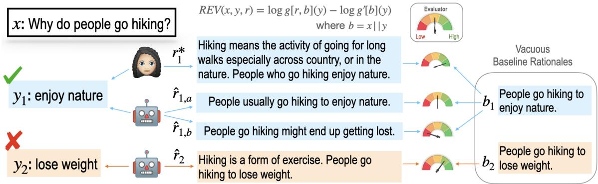  
Figure 1: Our evaluation framework for different free-text rationales (r). $r _ { 1 } ^ { * }$ is a human-written rationale, $\boldsymbol { { \hat { r } } } _ { 1 , a }$ and $\hat { r } _ { 1 , b }$ are two generated rationales for the true label $y _ { 1 }$ . Our metric, REV, based on CVI (Hewitt et al., 2021) is able to distinguish all three rationales by measuring how much new and label-relevant information each adds over a vacuous rationale, $b ;$ performance-based evaluations can only distinguish between $\boldsymbol { { \hat { r } } } _ { 1 , a }$ and $\hat { r } _ { 1 , b } .$ . For an (arguably) incorrect label, $y _ { 2 }$ , REV still gives a positive score highlighting that $\hat { r } _ { 2 }$ is able to provide new information for why it supports $y _ { 2 } .$ . Prediction accuracy can be augmented with REV to provide a fuller interpretability of model decisions.

In our experiments, we present evaluations with REV for rationales under two reasoning tasks, commonsense question-answering (CQA; Talmor et al., 2019) and natural language inference (NLI; Bowman et al., 2015), across four benchmarks. Several quantitative evaluations demonstrate the capabilities of REV in providing evaluations along new dimensions for free-text rationales, while also being more consistent with human judgements compared to existing metrics. We also provide comparisons to demonstrate the sensitivity of REV to various degrees of input perturbations. Additionally, evaluation with REV offers insights into why rationales obtained through chain-of-thought prompting (Wei et al., 2022) do not necessarily improve prediction performance.

## 2 REV: Information-Theoretic Evaluation of Rationales

We introduce a new metric, REV, Rationale Evaluation with conditional -information, for evaluation of free-text rationales on the proposed dimensions (§2.2), based on the framework of conditional -information (§2.1).

We consider the setting where we have input $X ~ \in ~ \mathcal { X }$ , label $Y ~ \in ~ \mathcal { V }$ , and free-text rationale $R \in \mathcal R$ generated for label Y . A common strategy to evaluate rationale R is through an evaluator function $f : Z \to Y$ , which maps a variable Z to a label distribution. Here, Z can be defined based on the evaluation framework; e.g., Z can be a concatenation of X and R, or contains only X. These metrics evaluate the utility of R based on how much R helps f predict Y. The evaluator f is typically trained on a set of input, label and rationale triples $\mathcal { D } _ { \mathrm { t r a i n } } = \{ ( x _ { j } , y _ { j } , r _ { j } ) \}$ , and applied to $\mathcal { D } _ { \mathrm { t e s t } } = \{ ( x _ { i } , y _ { i } , r _ { i } ) \}$ for evaluation. The utility of R is formulated as the difference between the performance of the evaluator on predicting Y with R, and without it, i.e.

$$
\mathrm { P e r f } [ f ( Y | X , R ) ] - \mathrm { P e r f } [ f ( Y | X ) ] ,\tag{1}
$$

where a larger performance gap indicates a better rationale. Existing metrics (Hase et al., 2020; Wiegreffe et al., 2021) compute the performance gap based on prediction accuracies.

However, accuracy-based evaluation can only indicate whether or not a rationale is predictive of a label, but cannot quantify how much new information the rationale provides to justify the label.

Figure 1 illustrates this issue via an example. Here, accuracy-based evaluation can distinguish between $\boldsymbol { { \hat { r } } } _ { 1 , a }$ and $\hat { r } _ { 1 , b }$ since $\hat { r } _ { 1 , a }$ supports $y _ { 1 }$ and $\boldsymbol { \hat { r } } _ { 1 , b }$ does not. However, it is unable to distinguish between $r _ { 1 } ^ { * }$ and $\boldsymbol { { \hat { r } } } _ { 1 , a }$ (since both are predictive of $y _ { 1 } )$ , despite the fact that $\hat { r } _ { 1 , a }$ does not provide any unique and relevant information to answer why the label should be $y _ { 1 }$ . In practice, vacuous rationales such as $\hat { r } _ { 1 , a }$ are commonly seen in model generations (Sun et al., 2022; Wiegreffe and Marasovic, 2021). This calls for an evaluation metric which is able to identify and penalize such vacuous rationales.

## 2.1 An Information-Theoretic Perspective on Rationale Evaluation

The key quantity of interest for our evaluation of rationale R is the amount of new information expressed in R (e.g., background knowledge, reasoning process) that can justify a label Y. The mutual information between R and Y, $I ( Y ; R )$ , can be helpful for evaluating this quantity. However, we are not interested in the information that is already captured in the input X. A vacuous rationale, such as $\hat { r } _ { 1 , a }$ in Fig. 1—which simply combines the input X and the label, Y declaratively—captures all the information in X and Y without specifying any new information to help understand why $Y$ has been chosen for X. We denote such rationales as B. Thus, we argue that a good evaluation metric must be able to measure the amount of new and label-relevant information contained in a rationale beyond what is contained in any vacuous rationale, B, that leads to the prediction of Y. Then the new information in R beyond what is available in $B$ can be grounded with conditional mutual information (Shannon, 1948) as follows,

$$
I ( Y ; R \mid B ) = I ( Y ; R , B ) - I ( Y ; B ) ,\tag{2}
$$

where the difference of two information quantities demonstrates the performance gap in Equation 1.

Directly computing mutual information, however, is challenging because true distributions of random variables are usually unknown, and we do not have unbounded computation. A recently introduced information-theoretic framework called - information circumvents this by restricting the computation to certain predictive model families, (Xu et al., 2020). Given a model family that maps two random variables R and Y, -information defines the usable information that can be extracted from R by models in to predict Y, i.e. $I _ { \mathcal { V } } ( R \to Y )$

If generalizes to the set of all possible functions, then -information is mutual information (Shannon, 1948). In practice, it is feasible to estimate the usable information from R about Y by selecting any neural model without frozen parameters as $\mathcal { V } . ^ { \ 3 }$ Our approach to evaluate rationales builds on a modification of this framework for conditional information by Hewitt et al. (2021), as described below.

Conditional -information Following conditional mutual information in information theory (Cover and Thomas, 2006), -information has been extended to conditional -information (CVI; Hewitt et al., 2021). CVI quantifies the -usable information in R about $Y$ conditioned on a variable $B ,$ i.e.

$$
I _ { \mathcal { V } } ( R \to Y \mid B ) = H _ { \mathcal { V } } ( Y \mid B ) - H _ { \mathcal { V } } ( Y \mid R , B ) .
$$

Here B is any vacuous rationale that leads to the prediction of $Y$ . In this work, we consider B simply as the declarative combination of X and $Y$ $H _ { \nu } ( \cdot \mid \cdot )$ is the conditional -entropy (Xu et al., ( ∣ )2020; Hewitt et al., 2021; Ethayarajh et al., 2022), defined as

$$
H _ { \mathcal { V } } ( Y \mid B ) = \operatorname* { i n f } _ { f \in \mathcal { V } } \mathbb { E } [ - \log f [ b ] ( y ) ]\tag{3}
$$

$$
H _ { \mathcal V } ( Y \mid R , B ) = \operatorname* { i n f } _ { f \in \mathcal V } \mathbb { E } [ - \log f [ r , b ] ( y ) ] ,\tag{4}
$$

where f b and $f [ r , b ]$ produce a probability distribution over the labels given b and $[ r , b ]$ as inputs respectively.4 Further, given $g ^ { \prime } , g \in \mathcal { V }$ ]which optimize Equations 3 and 4 respectively, we consider pointwise CVI for individual triples $( r , y , b )$ :

$$
- \log g ^ { \prime } [ b ] ( y ) + \log g [ r , b ] ( y ) .\tag{5}
$$

2.2 Computing REV for Rationale Evaluation Building on the framework of CVI, we propose a new metric REV, for Rationale Evaluation with conditional -information. We compute REV over a given test set, $\mathcal { D } _ { \mathrm { t e s t } } = \{ ( x _ { i } , y _ { i } , r _ { i } ) \}$ , by estimating CVI over the set with evaluation models, $g , g ^ { \prime } \in \mathcal { V }$ For a test example $( x , y , r )$ , the REV score denoted as $\mathtt { R E V } ( x , y , r )$ is computed based on Equation 5, where b is constructed by combining x and $y .$

$$
\mathrm { R E V } \big ( x , y , r \big ) = - \log g ^ { \prime } [ b ] ( y ) + \log g [ r , b ] ( y ) .
$$

The REV score for the entire test corpus $\mathcal { D } _ { \mathrm { t e s t } } .$ is given by the average pointwise REV score:

$$
\mathrm { R E V } _ { \mathcal D } = \frac { 1 } { | { \mathcal D } _ { \mathrm { t e s t } } | } \sum _ { i = 1 } ^ { | { \mathcal D } _ { \mathrm { t e s t } } | } \mathrm { R E V } ( x _ { i } , y _ { i } , r _ { i } ) .\tag{6}
$$

Algorithm 1 Computing REV Scores   
1: Input: evaluation models g and $g ^ { \prime } ,$ test set   
$\mathcal { D } _ { \mathrm { t e s t } } = \{ ( x _ { i } , y _ { i } , r _ { i } ) \}$   
{( )}2: Initialize an empty list   
3: for $( x _ { i } , y _ { i } , r _ { i } ) \in \mathcal { D } _ { \mathrm { t e s t } }$ do   
4: Construct the baseline rationale $b _ { i }$   
5: REV $( x _ { i } , y _ { i } , r _ { i } )$   
$= - \log g ^ { \prime } [ b _ { i } ] ( y _ { i } ) + \log g [ r _ { i } , b _ { i } ] ( y _ { i } )$   
6: $S . \mathrm { a d d } ( \mathrm { R E V } ( x _ { i } , y _ { i } , r _ { i } ) )$   
7: end for   
8: R $\mathrm { E V } _ { \mathcal { D } } =$ mean   
9: Output: $S , \mathrm { R E V } _ { \mathcal { D } }$

Algorithm 1 shows the process of computing both pointwise and aggregate REV scores. The higher the REV score, the more additional (new and relevant) information the rationale r contains to explain the label beyond the baseline rationale $b . \mathrm { R E V } ( x _ { i } , y _ { i } , r _ { i } )$ can take positive, negative, or zero values. When $\mathsf { R E V } ( x _ { i } , y _ { i } , r _ { i } ) \ > \ 0 .$ , the rationale supplies additional new information for supporting the label $( \mathrm { e . g . , ~ } r _ { 1 } ^ { \ast }$ in Fig. 1); when $\operatorname { R E V } ( x _ { i } , y _ { i } , r _ { i } ) = 0$ , the rationale provides no additional information beyond the baseline (e.g., $\boldsymbol { { \hat { r } } } _ { 1 , a }$ in Fig. 1); and when $\mathsf { R E V } ( x _ { i } , y _ { i } , r _ { i } ) < 0$ , the rationale does not support the label $( \mathrm { e } . \mathrm { g } . , \hat { r } _ { 1 , b }$ in Fig. 1). REV can assign a positive score to a rationale for an incorrect prediction as long as the rationale supports it and provides additional information beyond a vacuous baseline rationale (e.g., $\hat { r } _ { 2 }$ in Fig. 1). Thus, REV cannot be seen as a replacement for prediction accuracy, but rather as an orthogonal metric to interpret the usefulness of a generated rationale for the model decision.

## 3 Experimental Setup

We outline our experimental setup by describing the reasoning tasks and datasets (§3.1), followed by the task and evaluation models (§3.2), and the baseline metrics for comparison (§3.3). Additional details on the setup are provided in Appendix B.

## 3.1 Datasets

We explore two reasoning tasks, namely CommonsenseQA (CQA) and Natural Language Inference (NLI) across four datasets, all containing humanannotated free-text rationales. For CQA task, we use ECQA (Aggarwal et al., 2021), CoS-E (v1.11; Rajani et al., 2019) and QuaRTz (Tafjord et al., 2019). For both ECQA and CoS-E, each commonsense question is paired with five candidate choices and the task is to select an answer from the candidates. ECQA contains higher quality humanwritten rationales compared to CoS-E (Aggarwal et al., 2021; Sun et al., 2022). QuaRTz is for opendomain reasoning about textual qualitative relationships, and the task is to select an answer from two options to the question based on the textual qualitative knowledge (rationale). For the NLI task, we use the e-SNLI (Camburu et al., 2018) dataset containing explanations for SNLI (Bowman et al., 2015), where the task is given a premise to predict if a hypothesis entails, contradicts or is neutral to it. More details on the datasets are in Appendix B.1.

## 3.2 Task and Evaluation Models

Task models We choose T5 Large (Raffel et al., 2020) as the task model (finetuned on groundtruth labels and rationales) to produce generated rationale-label pairs under three settings:

${ \mathrm { X Y } } ^ { * } { \xrightarrow { } } \mathbb { R } \mathrm { : }$ : Given an input text and the groundtruth label, generate a rationale.

• X→YR: Given an input text, generate a label followed by a rationale. Since T5 decodes tokens sequentially, each R is generated conditioned on the predicted Y.

• X→RY: Given an input text, generate a rationale followed by a label. Here, we compute a likelihood for each candidate Y conditioned on R, and then select the most probable candidate. This operation can improve the model prediction accuracy, while weakening the consistency and relevance between the generated rationales and predicted labels.

After training, we collect three types of rationalelabel pairs by applying the three task models on the test set of each dataset. In addition to these three settings, we also evaluate ground-truth labels paired with crowd-sourced rationales $( \boldsymbol { \Upsilon } ^ { * } ; \boldsymbol { \mathrm { R } } ^ { * } )$ .

Constructing a Baseline with Vacuous Rationales Given an input x and a label y (groundtruth or model-generated), we construct a baseline rationale b by declaratively combining x and y into a sentence. For the CQA task, we adopt a T5-3B model fine-tuned on a set of (question, answer, declarative sentence) tuples (Demszky et al., 2018) following Chen et al. (2021b).5 For the NLI task, we first use a template to convert (premise, hypothesis, label) tuple into a baseline rationale: “premise implies / contradicts / is not related to hypothesis”. Then we paraphrase these templated, 6 vacuous NLI rationales using a pre-trained model in order to prevent the evaluators from learning the template patterns. Table 1 shows some examples of constructed vacuous baseline rationales.

<table><tr><td>Task</td><td>Input</td><td>Label</td><td>Vacuous Baseline Rationale</td></tr><tr><td>CQA</td><td>Where can personal mushrooms be kept fresh?</td><td>refrigerator</td><td>Personal mushrooms can be kept fresh in the refrigerator.</td></tr><tr><td>NLI</td><td>Premise: A dog running in the surf. Hypothesise: A dog is at the beach.</td><td>entailment</td><td>A dog running in the surf indicates a dog is at the beach.</td></tr></table>

Table 1: Examples of constructed vacuous baseline rationales for CQA and NLI tasks. For NLI, the vacuous baseline rationale was obtained after paraphrasing.

Training Evaluation Models, $\smash { \begin{array} { l } { g } \\ { \pmb { \imath } } \end{array} }$ and $g ^ { \prime }$ We train two evaluation models, g and $g ^ { ' }$ , which take $[ r , b ]$ [ ]and b as inputs, respectively (see Equation 5 in §2). Both evaluators are based on fine-tuning T5 Large (Raffel et al., 2020) models. We use the training set $\mathcal { D } _ { t r a i n } = \{ ( x , y ^ { * } , r ^ { * } ) \}$ , where $\{ y ^ { * } \}$ and $\{ \boldsymbol r ^ { * } \}$ are {( )} { } { }gold labels and human-annotated rationales, respectively. We construct baseline rationales $\{ b ^ { * } \}$ based on $\{ ( x , y ^ { * } ) \}$ { }. The objective is to maximize the log-{( )}likelihood of $y ^ { * }$ given $[ \boldsymbol { r } ^ { * } , \boldsymbol { b } ^ { * } ]$ or $b ^ { * }$ . After train-[ ]ing, the evaluation models are applied to evaluate a rationale-label pair $( y , r )$ w.r.t. an input x. The rationale-label pair $( y , r )$ can be model-generated and the label may not be ground-truth (e.g., y2 in Fig. 1), while REV is able to provide an assessment on the rationale along the two dimensions (§1). We refer readers to the Appendix B.3 for results of using T5 Base, BART Large (Lewis et al., 2020), and GPT-2 Large (Radford et al., 2019) as evaluation model architectures.

## 3.3 Other Metrics for Rationale Evaluation

We compare with two existing automatic metrics for free-text rationale evaluation: LAS (Hase et al., 2020) and RQ (Wiegreffe et al., 2021). Analogous to our evaluation models, both approaches use proxy models; we use the same architecture (T5 Large) across metrics in our reported results.

Leakage-Adjusted Simulatability (LAS) Hase et al. (2020) evaluate the quality of free-text rationales via a proxy model, trained with the task model outputs as labels and original input texts combined with rationales as input sequences. The metric computes the difference between its prediction accuracy on the predicted label when the rationale is included into the input vs. when it is not, $\mathbb { 1 } [ \hat { y } \mid x , \hat { r } ] - \mathbb { 1 } [ \hat { y } \mid x ]$ , averaged over examples grouped based on whether they leak labels or not. The final LAS score is given by the macro average across groups.

Rationale Quality (RQ) Wiegreffe et al. (2021) propose a variant of the simulatability in Hase et al. (2020). The main difference is that gold labels are used to train the model proxy and evaluate rationale quality. Specifically, the quality of a rationale $\hat { r }$ is measured as $\mathbb { 1 } \big [ { \boldsymbol { y } } ^ { * } \mid { \boldsymbol { x } } , \hat { \boldsymbol { r } } \big ] - \mathbb { 1 } \big [ { \boldsymbol { y } } ^ { * } \mid { \boldsymbol { x } } \big ]$ , where $y ^ { \ast }$ [ ∣ ] [ ∣ ]is the gold label. RQ is the average score over all test examples without considering label leakage.

## 4 Evaluating REV

We first compare REV with existing metrics (§4.1) and human judgments (§4.2) on the ECQA dataset, as well as show REV on other CQA and NLI benchmarks. We then test the sensitivity of different metrics to input perturbations (§4.3). Next, we apply REV to generations via few-shot prompting (4.4). Additional experiments are listed in Appendix C.

## 4.1 Comparison Between Evaluation Metrics

We compare REV with LAS and RQ, in evaluating different rationale-label pairs on the ECQA dataset. In addition to ${ \mathrm { X Y } } ^ { * } { \mathrm { \to } } { \mathrm { R } } , { \mathrm { X } } { \mathrm { \to } } { \mathrm { Y } } { \mathrm { R } } , { \mathrm { X } } { \mathrm { \to } } { \mathrm { R Y } } .$ and $( \boldsymbol { \Upsilon } ^ { * } ; \boldsymbol { \mathrm { R } } ^ { * } )$ , we also explore the evaluation on the vacuous baseline rationales $\boldsymbol { ( \nabla ^ { * } ; B ) }$ that are constructed with ground-truth labels. LAS, RQ and REV are not directly comparable due to different comparison scales and criteria (e.g., log-probability vs. accuracy); hence, our focus remains on the ranking over different sources of rationale-label pairs.

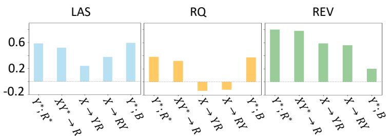

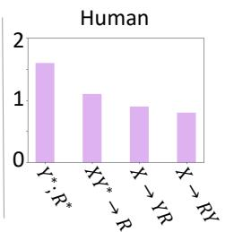  
Figure 2: Left: Automatic evaluation results of LAS, RQ and REV for rationale-label pairs on the ECQA test set. Right: Human evaluation for rationale-label pairs on 230 randomly selected examples from the ECQA test set.

Results are shown in Figure 2 (left panel). All three metrics rank the crowdsourced rationales $( \boldsymbol { \Upsilon } ^ { * } ; \boldsymbol { \mathrm R } ^ { * } )$ in ECQA the highest. While by definition, REV for vacuous rationales $\boldsymbol { ( \Upsilon ^ { * } ; B ) }$ is low, both LAS and RQ scores for these rationales are quite high, showing that these metrics are incapable of measuring the amount of additional information in rationales. Intuitively, we expect weaker rationalelabel consistency in X→RY setting compared to X→YR, as the labels are forcefully selected among the candidates as opposed to being freely generated by the task model (§3.2). While REV is able to capture this intuition and ranks X→YR higher than X→RY, LAS and RQ have a different ranking. Qualitative results comparing all three metrics are provided in Table 4 in Appendix C.1; Table 8 qualitatively analyzes rationales with negative REV scores.

We additionally analyze REV for “inputirrelevant rationales”: sentences extracted from a knowledge base that contain the ground-truth labels but do not necessarily explain the labels w.r.t. the inputs. Results in Appendix C.2 show that REV penalizes such irrelevant rationales.

Next, we apply REV to evaluate crowdsourced and model generated rationale-label pairs $\boldsymbol { ( \Upsilon ^ { * } ; R ^ { * } }$ $\mathrm { X Y } ^ { * } { \xrightarrow { } } \mathrm { R }$ , X→YR, X→RY) across different datasets. For each dataset, the evaluation models are trained on the training set with gold labels and crowdsourced rationales. The results are shown in Table 2. We observe that the gold rationales in the ECQA dataset achieve higher REV score than those in CoS-E. This observation is in line with the known quality issues of crowdsourced rationales in CoS-E (Aggarwal et al., 2021; Sun et al., 2022). Interestingly, model-generated rationales $( \mathrm { X Y } ^ { * } {  } \mathbf { R } )$ have higher REV score than crowdsourced rationales for CoS-E (see examples in Table 7). Please see Appendix C.3 for a qualitative analysis on CoS-E rationales. QuaRTz has better quality of rationales compared to ECQA, CoS-E, and e-SNLI. In the case of e-SNLI, the problem is severe as most of the crowdsourced or generated rationales do not provide reasoning but rather follow a label-specific template e.g., A implies (that) B (Kumar and Talukdar, 2020; Brahman et al., 2021).

<table><tr><td rowspan="2">Datasets</td><td colspan="3">Rationale-label pairs</td></tr><tr><td> $\boldsymbol { \mathrm { Y } } ^ { * } ; \boldsymbol { \mathrm { R } } ^ { * }$ </td><td> $\mathrm { X Y } ^ { * } {  } \mathbf { R }$  X→YR</td><td>X→RY</td></tr><tr><td>ECQA</td><td>0.7943</td><td>0.7806 0.5840</td><td>0.5599</td></tr><tr><td>CoS-E</td><td>0.2415</td><td>0.4050 0.2308</td><td>0.1198</td></tr><tr><td>QuaRTz</td><td>1.3919</td><td>1.3696 1.3449</td><td>1.0170</td></tr><tr><td>e-SNLI</td><td>0.0752</td><td>0.0079</td><td>0.0055 0.0047</td></tr></table>

Table 2: REV scores of different types of rationale-label pairs on the four datasets.

## 4.2 Human Evaluation

We collect crowdworker judgments via Amazon Mechanical Turk to understand how REV correlates with human judgments of rationales. We randomly sample 230 examples from the ECQA test set and ask workers to evaluate the four types of rationale-label pairs $( \boldsymbol { \Upsilon } ^ { * } ; \mathbb { R } _ { - } ^ { * } , \boldsymbol { \mathrm { X Y } } ^ { * } {  } \mathbb { R } , \bar { \boldsymbol { \mathrm { X } } } {  } \boldsymbol { \mathrm { Y } } \mathbb { R } .$ X→RY) for each example.7 We present workers with a question (input text), an answer (label) and an explanation (rationale), and ask them whether the explanation justifies the answer (yes/no). If they answer yes, we further ask them to evaluate the amount of additional information supplied by the explanation that explains why the answer might have been chosen for the question by choosing from none / little / some / enough, corresponding to a 4-point Likert-scale (0/1/2/3). We collect 3 annotations per instance and use majority vote to decide whether the rationale can justify the label. If yes, we take the average over the 3 human-annotated scores as the amount of information. Otherwise, we give a score of -1. More details of human evaluation are in Appendix C.4.

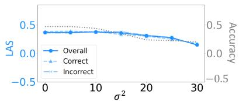  
(a) X→RY, LAS

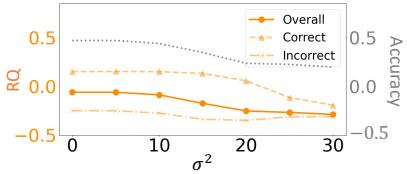  
(b) $\mathrm { X \to R Y , }$ RQ

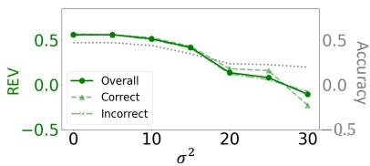  
(c) X→RY, REV

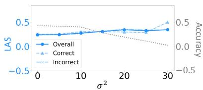  
(d) X→YR, LAS

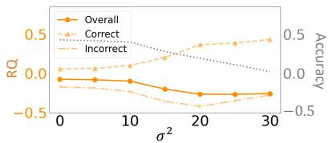  
(e) X→YR, RQ

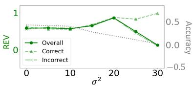  
(f) X→YR, REV  
Figure 3: Sensitivity test results of REV, LAS and RQ for X→RY and X→YR on the ECQA dataset. The X-axis shows different levels of noise $( \sigma ^ { 2 } )$ . We plot the curve of Accuracy (model prediction accuracy) vs. Noise in gray dashed line. We also separate the evaluation results on populations on which the model predictions are correct (“Correct”) or incorrect (“Incorrect”) in addition to the overall evaluation on all test examples (“Overall”).

Results are shown in the right panel of Fig. 2, where the ranking of the four types of rationalelabel pairs is $\mathbf { Y } ^ { \ast } ; \mathbf { R } ^ { \ast } > \mathbf { X } \mathbf { Y } ^ { \ast }  \mathbf { R } > \mathbf { X }  \mathbf { Y } \mathbf { R } >$ X→RY. While LAS and RQ rank X→RY better than X→YR (see the left part of Fig. 2), the ranking from REV is more consistent with human judgments, suggesting its effectiveness in evaluating rationales.

## 4.3 Is REV sensitive to input perturbations?

A robust metric should be sensitive to the change of rationale-label pairs and reflect their relationships under input perturbations. We test the sensitivity of all automatic metrics to input (X) perturbations in the task model, under two settings: X→YR and X→RY. Following Wiegreffe et al. (2021), we add zero-mean Gaussian noise ${ \mathcal { N } } ( 0 , \sigma ^ { 2 } )$ to input word embeddings during inference, inducing task models to produce progressively degenerate rationales and labels. Results in Fig. 4.3 indicate that REV (b) and RQ (c) follow similar trends as for X→RY. However, LAS is less sensitive to noise for both joint models, X→RY (a) and X→YR (d). Since the proxy model for LAS was trained on the task models’ predicted labels and generated rationales, it can overfit to the degenerate rationale-label pairs under input perturbations, hence being less sensitive to input noise during inference. The largest differences between REV and RQ are for X→YR.

We observe the task model can predict incorrect labels and then make up reasonable-sounding rationales for its wrong predictions under certain input perturbations; prior work also reports this finding (Narang et al., 2020; Wiegreffe et al., 2021). REV does not drop under a certain amount of input perturbations (e.g., $\sigma ^ { 2 } \le 2 0 )$ in Fig. 3 (f), likely because the generated rationales still provide new information for describing both correct and incorrect labels (also see the example in Table 6). However, as the noise exceeds the certain level, REV decreases indicating that the task model is no longer able to make up rationales for very noisy inputs. On the other hand, the behavior of RQ in Fig. 3 (e) is quite different to REV. Since RQ is computed based on gold labels (§3.3), it has reduced sensitivity to input perturbations. When the prediction accuracy decreases, the overall evaluation of RQ is dominated by the results on incorrect predictions, as shown in Fig. 3 (e). We refer readers to the Table 6 in Appendix C.5 for qualitative analysis on sensitivity test.

## 4.4 Evaluating Rationales in Few-shot Prompting

We test the ability of REV in evaluating rationales generated by few-shot prompting, and get insights into the reasoning and prediction processes of large language models (e.g., GPT-3).

GPT-3 Rationales for Gold Labels Wiegreffe et al. (2022) collected 250 high quality free-text rationales generated by few-shot prompting with

GPT-3 (Brown et al., 2020) for CQA (given gold labels). Each example was assessed by 3 crowdworkers. We focus on two aspects of their annotations: “supports the gold label” and “amount of information”. Crowdworkers provide a yes / no answer to justify whether a rationale supports the corresponding gold label. Only when the answer is yes, they are further asked to evaluate the amount of information contained in the rationale for justifying the label. The amount of information is roughly categorized into 3 levels: “Not Enough”, “Enough”, “Too Much”, each annotated with a Likert-scale scores for amount of information with the pointwise scores obtained by three automatic metrics, LAS, RQ, and REV. For automatic metrics, the evaluation models of REV and the proxy models of LAS and RQ are trained on the ECQA training set with gold labels and human-annotated rationales (§3.2). We observe that REV provides finer-grained assessment of the information contained in ratio nales compared to LAS and RQ which only take -1, 0, 1 values. When LAS and RQ are zero, it is unclear whether the rationale supports the label or not because the model proxy may predict the label based on the input only. The judgments of REV on whether rationales support labels (REV > 0 ) are close to human judgments (i.e., 80% agreement). The support rates of LAS and RQ are relatively low, i.e. 35% and 23%, while a large portion (56% and 60% respectively) corresponds to a zero LAS / RQ score.

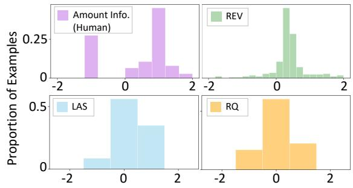  
Figure 4: Histograms of human-annotated amount of information and pointwise REV, LAS and RQ scores on GPT-3 few-shot prompted rationales for gold labels.

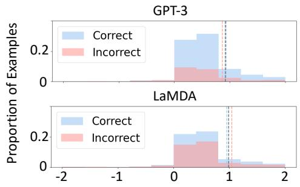  
Figure 5: Distributions of REV for rationales w.r.t. correct and incorrect predictions produced by GPT-3 and LaMDA respectively. The average REV scores over all instances, correctly predicted instances and incorrectly predicted instances are marked by gray, blue and red dashed lines respectively.

Chain of Thought Rationales Wei et al. (2022) propose chain ofthought prompting to teach large language models to produce intermediate reasoning steps (rationales) before prediction, which improves their prediction performance on a range of reasoning tasks (e.g., arithmetic and symbolic reasoning). However, the reported improvement is trivial for CQA (Wei et al., 2022), which motivates us to evaluate the intermediate rationales w.r.t. model predictions. We apply REV to analyze the generated rationales during intermediate reasoning steps and final predicted labels from GPT-3 text-davinci-002 (Brown et al., 2020) and LaMDA 10   
137B (Thoppilan et al., 2022).

Figure 5 shows the distributions of REV for correctly and incorrectly predicted instances from GPT-3 and LaMDA, respectively. For both GPT-3 and LaMDA, the REV distributions of correct and incorrect predictions are similar and most instances have positive REV scores. The average REV scores over correct and incorrect predictions (blue and red dashed lines, resp.) are close, especially for GPT-3. This is consistent with our observation that most generated rationales from the two models are describing their predicted labels. The prediction accuracy of GPT-3 is much higher than that of LaMDA (77% vs. 59%), while the average REV scores over all instances (gray dashed lines) are close (0.92 vs. 0.99). An insight we obtain is that the generated intermediate reasoning steps (rationales) support models’ predictions (consistent REV scores), but cannot guarantee their correctness (discrepant accuracies between GPT-3 and LaMDA). This partially explains the minor improvement of chain of thought prompting on CQA.

## 5 Related Work

Model rationales broadly fall into two categories: extractive rationales and free-text rationales. Extractive rationales contain some important features extracted from input texts that make models produce final predictions (Lei et al., 2016; DeYoung et al., 2020; Jain et al., 2020; Schulz et al., 2020). Free-text rationales are produced by generative models in the form of natural language. Compared to extractive rationales, free-text rationales explain model predictions in a more human-like way and fill the gap in explaining reasoning tasks (Camburu et al., 2018; Narang et al., 2020; Rajani et al., 2019; Kumar and Talukdar, 2020; Brahman et al., 2021).

Evaluations on extractive rationales have been well studied, generally from two perspectives — faithfulness and plausibility (DeYoung et al., 2020; Pruthi et al., 2022; Chan et al., 2022b). Faithfulness measures to which extent rationales reflect the true reasoning process of models, while plausibility evaluates how convincing rationales are to humans (Jacovi and Goldberg, 2020). Other perspectives include the ability of rationales in helping a student model simulate a teacher model (Pruthi et al., 2022) or bridging the communication between a classifier and a layperson (Treviso and Martins, 2020). Existing automatic metrics for free-text rationales focus on rationale-label association, and measure the utility of a rationale based on how much it helps a model proxy predict the given label (inspired by human simulatability (Doshi-Velez and Kim, 2017)) (Hase et al., 2020) or the gold label (Wiegreffe et al., 2021) given the input. Chan et al. (2022a) further propose a framework to evaluate the automatic metrics. However, none of them consider measuring the amount of additional new information in free-text rationales. Sun et al. (2022) conduct a human study on the additional knowledge provided by free-text rationales. This work is the first that proposes an automatic metric to quantify the new information in free-text rationales.

## 6 Conclusion

We introduce REV, an information-theoretic measure to evaluate the amount of new, label-relevant information in free-text rationales, beyond the information contained in the input. We empirically demonstrate the advantage of REV compared to existing metrics focusing simply on label-rationale association, and show that REV is more consistent with human judgments. REV also offers insights into evaluating rationales generated via few-shot prompting. While we recommend the usage of REV alongside traditional performance metrics, future work might explore a combined metric to measure the correctness of a prediction as well as the informativeness of the rationale towards this prediction. Ultimately, free-text rationales are for the benefit of human users and there exist multiple criteria for human utility of rationales (Joshi et al., 2023), beyond label relevance and informativeness.

## Limitations

In its current formulation, REV might reward a rationale for an incorrect prediction as long as the rationale supports the prediction with relevant additional information. Additionally, our metric does not consider the factuality of rationales. Future work might explore evaluation that penalizes rationales which support incorrect predictions, thus bridging together predictive performance with interpretability metrics. We considered a single declarative construction for baseline rationales and leave analyzing how different baseline construction impacts our metric to future work. Another limitation is that the utility of REV depends on the quality of crowd-sourced rationales used to train the evaluator. Building a good automatic metric REV requires high-quality rationales that provide sufficient new information (e.g., commonsense knowledge) to explain the corresponding labels. The architecture of evaluation models also has an impact on REV evaluation. Using different evaluator architectures may result in varying REV scores, as discussed in Appendix B.3.

## Ethics Statement

All datasets used in this work are public, and deal with situations encountered in daily life; these are the examples provided for human annotation. Generated rationales sometimes contain non-factual statements or misinformation. While it is plausible that some rationales generated by the model or some data instances might contain offensive material, to the best of our knowledge we did not encounter such examples. We did not collect any personal information (e.g. demographics and identities) of participants in any of the human evaluation experiments.

## Acknowledgements

We thank the anonymous reviewers for many valuable comments. We thank Sarah Wiegreffe, Aaron Chan, and the Mosaic team at the Allen Institute for AI for helpful discussions and suggestions.

## References

Shourya Aggarwal, Divyanshu Mandowara, Vishwajeet Agrawal, Dinesh Khandelwal, Parag Singla, and Dinesh Garg. 2021. Explanations for CommonsenseQA: New Dataset and Models. In Proceedings of the 59th Annual Meeting of the Association for Computational Linguistics and the 11th International Joint Conference on Natural Language Processing (Volume 1: Long Papers), pages 3050–3065, Online. Association for Computational Linguistics.

Sumithra Bhakthavatsalam, Chloe Anastasiades, and Peter Clark. 2020. Genericskb: A knowledge base of generic statements. arXiv preprint arXiv:2005.00660.

Samuel R. Bowman, Gabor Angeli, Christopher Potts, and Christopher D. Manning. 2015. A large annotated corpus for learning natural language inference. In Proceedings of the 2015 Conference on Empirical Methods in Natural Language Processing, pages 632–642, Lisbon, Portugal. Association for Computational Linguistics.

Faeze Brahman, Vered Shwartz, Rachel Rudinger, and Yejin Choi. 2021. Learning to rationalize for nonmonotonic reasoning with distant supervision. Proceedings ofthe AAAI Conference on Artificial Intelligence, 35(14):12592–12601.

Tom Brown, Benjamin Mann, Nick Ryder, Melanie Subbiah, Jared D Kaplan, Prafulla Dhariwal, Arvind Neelakantan, Pranav Shyam, Girish Sastry, Amanda Askell, et al. 2020. Language models are few-shot learners. Advances in neural information processing systems, 33:1877–1901.

Oana-Maria Camburu, Tim Rocktäschel, Thomas Lukasiewicz, and Phil Blunsom. 2018. e-snli: Natural language inference with natural language explanations. Advances in Neural Information Processing Systems, 31.

Aaron Chan, Shaoliang Nie, Liang Tan, Xiaochang Peng, Hamed Firooz, Maziar Sanjabi, and Xiang Ren. 2022a. Frame: Evaluating simulatability metrics for free-text rationales. arXiv preprint arXiv:2207.00779.

Aaron Chan, Maziar Sanjabi, Lambert Mathias, Liang Tan, Shaoliang Nie, Xiaochang Peng, Xiang Ren, and Hamed Firooz. 2022b. Unirex: A unified learning framework for language model rationale extraction. In International Conference on Machine Learning, pages 2867–2889. PMLR.

Hanjie Chen, Song Feng, Jatin Ganhotra, Hui Wan, Chulaka Gunasekara, Sachindra Joshi, and Yangfeng Ji. 2021a. Explaining neural network predictions on sentence pairs via learning word-group masks. In Proceedings of the 2021 Conference of the North American Chapter ofthe Association for Computational Linguistics: Human Language Technologies, pages 3917–3930, Online. Association for Computational Linguistics.

Jifan Chen, Eunsol Choi, and Greg Durrett. 2021b. Can NLI models verify QA systems’ predictions? In Findings of the Association for Computational Linguistics: EMNLP 2021, pages 3841–3854, Punta Cana, Dominican Republic. Association for Computational Linguistics.

Zhihong Chen, Yan Song, Tsung-Hui Chang, and Xiang Wan. 2020. Generating radiology reports via memory-driven transformer. In Proceedings of the 2020 Conference on Empirical Methods in Natural Language Processing (EMNLP), pages 1439–1449, Online. Association for Computational Linguistics.

Thomas M Cover and Joy A Thomas. 2006. Elements of information theory, 2nd edition. Wiley.

Dorottya Demszky, Kelvin Guu, and Percy Liang. 2018. Transforming question answering datasets into natural language inference datasets. arXiv preprint arXiv:1809.02922.

Jay DeYoung, Sarthak Jain, Nazneen Fatema Rajani, Eric Lehman, Caiming Xiong, Richard Socher, and Byron C. Wallace. 2020. ERASER: A benchmark to evaluate rationalized NLP models. In Proceedings of the 58th Annual Meeting of the Association for Computational Linguistics, pages 4443–4458, Online. Association for Computational Linguistics.

Finale Doshi-Velez and Been Kim. 2017. Towards a rigorous science of interpretable machine learning. arXiv preprint arXiv:1702.08608.

Kawin Ethayarajh, Yejin Choi, and Swabha Swayamdipta. 2022. Understanding dataset difficulty with -usable information. In Proceedings of the 39th International Conference on Machine Learning, volume 162 of Proceedings of Machine Learning Research, pages 5988–6008. PMLR.

Peter Hase, Shiyue Zhang, Harry Xie, and Mohit Bansal. 2020. Leakage-adjusted simulatability: Can models generate non-trivial explanations of their behavior in natural language? In Findings ofthe Association for Computational Linguistics: EMNLP 2020, pages 4351–4367, Online. Association for Computational Linguistics.

John Hewitt, Kawin Ethayarajh, Percy Liang, and Christopher Manning. 2021. Conditional probing: measuring usable information beyond a baseline. In Proceedings of the 2021 Conference on Empirical Methods in Natural Language Processing, pages 1626–1639, Online and Punta Cana, Dominican Republic. Association for Computational Linguistics.

Alon Jacovi and Yoav Goldberg. 2020. Towards faithfully interpretable NLP systems: How should we define and evaluate faithfulness? In Proceedings of the 58th Annual Meeting of the Association for Computational Linguistics, pages 4198–4205, Online. Association for Computational Linguistics.

Sarthak Jain, Sarah Wiegreffe, Yuval Pinter, and Byron C. Wallace. 2020. Learning to faithfully rationalize by construction. In Proceedings of the 58th Annual Meeting of the Association for Computational Linguistics, pages 4459–4473, Online. Association for Computational Linguistics.

Brihi Joshi, Ziyi Liu, Zhewei Tong, Aaron Chan, and Xiang Ren. 2023. Are machine rationales (not) useful to humans? measuring and improving human utility of free-text rationales. In Workshop on Trust and Reliance in AI-Human Teams (TRAIT) at the 2023 CHI Conference.

Sawan Kumar and Partha Talukdar. 2020. NILE : Natural language inference with faithful natural language explanations. In Proceedings of the 58th Annual Meeting of the Association for Computational Linguistics, pages 8730–8742, Online. Association for Computational Linguistics.

Tao Lei, Regina Barzilay, and Tommi Jaakkola. 2016. Rationalizing neural predictions. In Proceedings of the 2016 Conference on Empirical Methods in Natural Language Processing, pages 107–117, Austin, Texas. Association for Computational Linguistics.

Mike Lewis, Yinhan Liu, Naman Goyal, Marjan Ghazvininejad, Abdelrahman Mohamed, Omer Levy, Veselin Stoyanov, and Luke Zettlemoyer. 2020. BART: Denoising sequence-to-sequence pre-training for natural language generation, translation, and comprehension. In Proceedings ofthe 58th Annual Meeting of the Association for Computational Linguistics, pages 7871–7880, Online. Association for Computational Linguistics.

Zachary C Lipton. 2018. The mythos of model interpretability: In machine learning, the concept of interpretability is both important and slippery. Queue, 16(3):31–57.

Sharan Narang, Colin Raffel, Katherine Lee, Adam Roberts, Noah Fiedel, and Karishma Malkan. 2020. Wt5?! training text-to-text models to explain their predictions. arXiv preprint arXiv:2004.14546.

Danish Pruthi, Rachit Bansal, Bhuwan Dhingra, Livio Baldini Soares, Michael Collins, Zachary C Lipton, Graham Neubig, and William W Cohen. 2022. Evaluating explanations: How much do explanations from the teacher aid students? Transactions ofthe Associationfor Computational Linguistics, 10:359–375.

Alec Radford, Jeffrey Wu, Rewon Child, David Luan, Dario Amodei, Ilya Sutskever, et al. 2019. Language models are unsupervised multitask learners. OpenAI blog, 1(8):9.

Colin Raffel, Noam Shazeer, Adam Roberts, Katherine Lee, Sharan Narang, Michael Matena, Yanqi Zhou, Wei Li, Peter J Liu, et al. 2020. Exploring the limits of transfer learning with a unified text-to-text transformer. J. Mach. Learn. Res., 21(140):1–67.

Nazneen Fatema Rajani, Bryan McCann, Caiming Xiong, and Richard Socher. 2019. Explain yourself! leveraging language models for commonsense reasoning. In Proceedings ofthe 57th Annual Meeting ofthe Associationfor Computational Linguistics, pages 4932–4942, Florence, Italy. Association for Computational Linguistics.

Marco Tulio Ribeiro, Sameer Singh, and Carlos Guestrin. 2016. “why should i trust you?" explaining the predictions of any classifier. In Proceedings of the 22nd ACM SIGKDD international conference on knowledge discovery and data mining, pages 1135– 1144.

Marco Tulio Ribeiro, Tongshuang Wu, Carlos Guestrin, and Sameer Singh. 2020. Beyond accuracy: Behavioral testing of NLP models with CheckList. In Proceedings ofthe 58th Annual Meeting ofthe Associationfor Computational Linguistics, pages 4902– 4912, Online. Association for Computational Linguistics.

Karl Schulz, Leon Sixt, Federico Tombari, and Tim Landgraf. 2020. Restricting the flow: Information bottlenecks for attribution. In International Conference on Learning Representations.

Claude Elwood Shannon. 1948. A mathematical theory of communication. The Bell system technicaljournal, 27(3):379–423.

Jiao Sun, Swabha Swayamdipta, Jonathan May, and Xuezhe Ma. 2022. Investigating the benefits of freeform rationales. In Findings of the Association for Computational Linguistics: EMNLP 2022, pages 5867–5882, Abu Dhabi, United Arab Emirates. Association for Computational Linguistics.

Oyvind Tafjord, Matt Gardner, Kevin Lin, and Peter Clark. 2019. QuaRTz: An open-domain dataset of qualitative relationship questions. In Proceedings of the 2019 Conference on Empirical Methods in Natural Language Processing and the 9th International Joint Conference on Natural Language Processing (EMNLP-IJCNLP), pages 5941–5946, Hong Kong, China. Association for Computational Linguistics.

Alon Talmor, Jonathan Herzig, Nicholas Lourie, and Jonathan Berant. 2019. CommonsenseQA: A question answering challenge targeting commonsense knowledge. In Proceedings ofthe 2019 Conference ofthe North American Chapter ofthe Associationfor Computational Linguistics: Human Language Technologies, Volume 1 (Long and Short Papers), pages 4149–4158, Minneapolis, Minnesota. Association for Computational Linguistics.

Romal Thoppilan, Daniel De Freitas, Jamie Hall, Noam Shazeer, Apoorv Kulshreshtha, Heng-Tze Cheng, Alicia Jin, Taylor Bos, Leslie Baker, Yu Du, et al. 2022. Lamda: Language models for dialog applications. arXiv preprint arXiv:2201.08239.

Marcos Treviso and André F. T. Martins. 2020. The explanation game: Towards prediction explainability through sparse communication. In Proceedings ofthe Third BlackboxNLP Workshop on Analyzing and Interpreting Neural Networksfor NLP, pages 107–118, Online. Association for Computational Linguistics.

Jason Wei, Xuezhi Wang, Dale Schuurmans, Maarten Bosma, brian ichter, Fei Xia, Ed H. Chi, Quoc V Le, and Denny Zhou. 2022. Chain of thought prompting elicits reasoning in large language models. In Advances in Neural Information Processing Systems.

Sarah Wiegreffe, Jack Hessel, Swabha Swayamdipta, Mark Riedl, and Yejin Choi. 2022. Reframing human-AI collaboration for generating free-text explanations. In Proceedings of the 2022 Conference of the North American Chapter of the Association for Computational Linguistics: Human Language Technologies, pages 632–658, Seattle, United States. Association for Computational Linguistics.

Sarah Wiegreffe and Ana Marasovic. 2021. Teach me to explain: A review of datasets for explainable natural language processing. In Proceedings of the Neural Information Processing Systems Track on Datasets and Benchmarks, volume 1. Curran.

Sarah Wiegreffe, Ana Marasovic, and Noah A. Smith.´ 2021. Measuring association between labels and free-text rationales. In Proceedings ofthe 2021 Conference on Empirical Methods in Natural Language Processing, pages 10266–10284, Online and Punta Cana, Dominican Republic. Association for Computational Linguistics.

Thomas Wolf, Lysandre Debut, Victor Sanh, Julien Chaumond, Clement Delangue, Anthony Moi, Pierric Cistac, Tim Rault, Remi Louf, Morgan Funtowicz, Joe Davison, Sam Shleifer, Patrick von Platen, Clara Ma, Yacine Jernite, Julien Plu, Canwen Xu, Teven Le Scao, Sylvain Gugger, Mariama Drame, Quentin Lhoest, and Alexander Rush. 2020. Transformers: State-of-the-art natural language processing. In Proceedings ofthe 2020 Conference on Empirical Methods in Natural Language Processing: System Demonstrations, pages 38–45, Online. Association for Computational Linguistics.

Yilun Xu, Shengjia Zhao, Jiaming Song, Russell Stewart, and Stefano Ermon. 2020. A theory of usable information under computational constraints. In International Conference on Learning Representations.

## A Properties of Conditional -information

As proved by Hewitt et al. (2021), CVI has several useful properties:

1. Non-Negativity: $I _ { \mathcal { V } } ( R \to Y \mid B ) \geq 0 .$

2. Independence: If Y and B are jointly independent of R, then $I _ { \mathcal { V } } ( R \to Y \mid B ) = 0 .$

3. Monotonicity: If $\mathcal { U } \subseteq \mathcal { V } .$ , then $H _ { \mathcal { V } } ( Y \mid B ) \le H _ { \mathcal { U } } ( Y \mid B )$

An implication from Monotonicity is complex models (e.g., pre-trained language models) might do better than simpler ones (e.g., linear models) in estimating -usable information. Since CVI measures the additional -usable information in R about Y beyond what’s already extracted from B by models in , it grounds the goal of the proposed metric REV.

## B Additional Details on the Experimental Setup

## B.1 Datasets

For CQA task, we use ECQA (Aggarwal et al., 2021), $\mathrm { C o S – E } \left( \mathrm { v } 1 . 1 1 \right) ^ { 1 1 }$ (Rajani et al., 2019) and QuaRTz (Tafjord et al., 2019). Both ECQA and CoS-E originate from the CommonsenseQA dataset (Talmor et al., 2019), where each commonsense question is paired with 5 candidate choices and the task is to select an answer from the candidates. ECQA contains higher quality free-text rationales compared to CoS-E, in terms of comprehensiveness, coherence, non-redundancy, etc. (Aggarwal et al., 2021; Sun et al., 2022). QuaRTz is an open-domain reasoning task about textual qualitative relationships. Each instance contains a situated qualitative question, two answer options and a knowledge statement. The task is to select an answer from the two options to the question based on the textual qualitative knowledge. We use the knowledge statement as a free-text rationale since it explains why the answer is to the question. For NLI task, we use e-SNLI (Camburu et al., 2018) which is an extension of SNLI (Bowman et al., 2015) with augmented free-text human-written rationales. The task is to predict the entailment relationship between a 12 premise and a hypothesis. Figure 6 shows the summary statistics of the four datasets.

## B.2 Models

We use Huggingface Transformers (Wolf et al., 2020) to access all task and evaluation models. We train each model for up to 20 epochs with a learning rate 5e − 6 and a batch size 8. All experiments were performed on a single NVIDIA RTX 8000 GPU. Table 3 shows input-output formattings of different task models for different tasks.

## B.3 Comparison Between Evaluator Architectures

<table><tr><td>Datasets</td><td>#train</td><td>#dev</td><td>#test</td></tr><tr><td>ECQA</td><td>7598</td><td>1090</td><td>2194</td></tr><tr><td>CoS-E</td><td>8766</td><td>975</td><td>1221</td></tr><tr><td>QuaRTz</td><td>2696</td><td>384</td><td>784</td></tr><tr><td>e-SNLI</td><td>54933</td><td>9842</td><td>9824</td></tr></table>

Figure 6: Summary statistics of the datasets, where # counts the number of examples in the train/dev/test sets.

We apply REV to evaluate different types of free-text rationales w.r.t. labels on the ECQA dataset. Figure 7 shows REV scores of the four types of rationale-label pairs evaluated by four evaluator architectures. The ranking of the four groups of rationalelabel pairs is consistent across the four evaluators, i.e. $\boldsymbol { \mathrm { Y } } ^ { * } ; \boldsymbol { \mathrm { R } } ^ { * }$

$> X \mathbf { Y } ^ { * } { \xrightarrow { } } \mathbf { R } > X { \xrightarrow { } } \mathbf { Y } \mathbf { R } > X { \xrightarrow { } } \mathbf { R } \mathbf { Y }$ . This ranking is also consistent with human evaluation in §4.2. Since ECQA contains high-quality crowdsourced rationales (Aggarwal et al., 2021), it is expected that the REV of gold rationale-label pairs $( \boldsymbol { \Upsilon } ^ { * } ; \boldsymbol { \mathrm R } ^ { * } )$ is the highest. The REV of $\mathrm { X Y } ^ { * } { \xrightarrow { } } \mathbf { R }$ is close to that of $\boldsymbol { \mathrm { Y } } ^ { * } ; \boldsymbol { \mathrm { R } } ^ { * }$ , indicating the task model (T5 Large) can produce good quality rationales when it is prompted with ground-truth labels. All four evaluators agree that the generated rationales of $\mathrm { X } {  } \mathrm { Y } \mathrm { R }$ contain more additional background information for explaining the predicted labels than those of X→RY. This is consistent with our design of the X→RY in §3.3, where the generated rationales and labels have weakened relevance. For each type of rationale-label pairs, the four evaluators capture different amount of conditional -information, while T5 Large consistently outperforms other three models. In the reported experiments §4, we use T5 Large as the evaluation model.

<table><tr><td>Type</td><td>Input</td><td>Output</td></tr><tr><td>XY*→R</td><td>CQA: [question] question [choice] choice-1 ... [choice] choice-n [answer] gold label [rationale] NLI: [premise] premise [hypothesis] hypothesis [answer] gold label [rationale]</td><td>rationale &lt;eos&gt;</td></tr><tr><td rowspan="2">X→YR X→RY</td><td>CQA: [question] question [choice] choice-1 ... [choice] choice-n [answer] NLI: [premise] premise [hypothesis] hypothesis [answer]</td><td>label [rationale] rationale &lt;eos&gt;</td></tr><tr><td>CQA: [question] question [choice] choice-1 ... [choice] choice-n [rationale] NLI: [premise] premise [hypothesis] hypothesis [rationale]</td><td>rationale [answer] label &lt;eos&gt;</td></tr></table>

Table 3: The input-output formatting of different task models.

## C Additional Experiments

## C.1 Qualitative Analysis of Different Metrics on ECQA

Table 4 shows the qualitative analysis of different metrics on the four types of rationale-label pairs $( \boldsymbol { \Upsilon } ^ { \ast } ; \mathrm { R } ^ { \ast } , \boldsymbol { \mathrm { X Y } } ^ { \ast } {  } \mathrm { R } , \boldsymbol { \mathrm { X } } {  } \mathrm { Y } \mathrm { R } , \boldsymbol { \mathrm { X } } {  } \mathrm { R Y } )$ on the ECQA dataset. REV provides more accurate evaluations on those examples than LAS and RQ.

## C.1.1 Qualitative

## Analysis of Negative REV Scores in ECQA

Table 8 shows some examples of X→RY with negative REV scores on the ECQA dataset. When REV < 0, we observe in most cases the rationale does not support the given label, while indicating other labels, or something even beyond the label candidates (e.g., “helicopter" in the second example), or they could repeat the input (e.g., the first

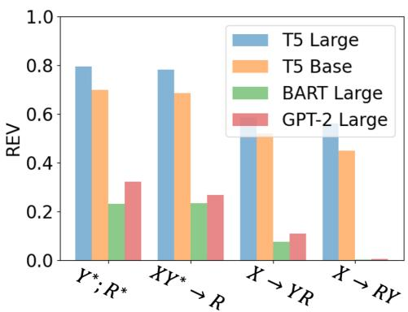  
Figure 7: REV for evaluating rationale-label pairs on the ECQA dataset with different evaluator architectures.

example). The same observation holds for other types of rationale-label pairs.

## C.2 Additional Analysis on Label-Related But Input-Irrelevant “Rationales”

In some cases, a rationale contains the given label and provides new information related to the label, but does not necessarily explain why the label is selected for the input. To evaluate such rationales, we randomly select 250 gold labels in ECQA and extract their related sentences from a large-scale knowledge base—GenericsKB (Bhakthavatsalam et al., 2020). Those sentences contain the labels, while might provide little or irrelevant new information to explain the labels w.r.t. the inputs. We use them as trivial rationales for evaluation. The average REV scores for those trivial rationales and their crowdsourced counterparts are 0.26 and 1.14 respectively, indicating the effectiveness of REV in identifying the new and relevant information in rationales. Table 5 shows the REV scores of some examples and the corresponding crowdsourced rationales. The results show that REV can distinguish the new information in different rationales and penalize meaningless rationales. Overall, REV gives higher scores to crowdsourced rationales than trivial sentences from GenericsKB.

## C.3 Qualitative Analysis of CoS-E Rationales

Table 7 shows the exemplar of REV scores for crowdsourced and model-generated $( \mathrm { X Y } ^ { * } {  } \mathbf { R } )$ rationales for CoS-E. The main observation is model-generated rationales $( \mathrm { X Y } ^ { * } {  } \mathbf { R } )$ generally support labels, though provide limited new information, while many crowdsourced rationales in CoS-E are noisy or uninformative. Specifically, compared to the crowdsourced rationales in CoS-E, we observe that $\mathrm { X Y } ^ { * } {  } \mathrm { R }$ can produce better rationales that support the labels, which also corresponds to higher REV scores. However, the new information contained in those rationales is still limited (please see examples). A possible reason is the task model $\boldsymbol { ( \mathrm { X Y } ^ { * } }$ →R) hardly learns to produce more informative rationales when trained using lower quality rationales from CoS-E, known quality issue as reported in prior work (Aggarwal et al., 2021; Sun et al., 2022).

## C.4 Human Evaluation Details

We randomly select 230 examples from the ECQA test set and conduct human evaluation on the four types of rationale-label pairs $( \boldsymbol { \Upsilon } ^ { \ast } ; \mathrm { R } ^ { \ast } , \boldsymbol { \mathrm { X Y } } ^ { \ast } {  } \mathrm { R } , \boldsymbol { \mathrm { X } } {  } \boldsymbol { \mathrm { Y } } \mathrm { R } , \boldsymbol { \mathrm { X } } {  } \mathrm { R } \boldsymbol { \mathrm { Y } } )$ w.r.t. each example through the Amazon Mechanical Turk (AMT). We select workers located in Australia, Canada, the UK, or the US, with a past HIT approval rate of >98% and >5000 HITs approved. Each instance is assessed by 3 workers. We pay the workers \$0.08 for assessing each instance.

Figure 8 shows the instructions we provide to workers. In Figure 9, we show three examples, illustrating when the explanation (rationale) does not justify the answer (label), when the explanation supports the answer while not supplying additional information, and when the explanation supports the answer and provides additional information. Figure 10 shows the interface of the actual hit for human evaluation.

For each instance, we provide a question (input), an answer (label), and an explanation (rationale), and ask the workers to answer the following two questions:

1. Does the Explanation justify the given Answer? (yes or no) The question is to ask workers to judge whether the rationale supports the label or not.

2. Ifyes, how much additional information does the Explanation have to justify the Answer beyondjust reiterating what is stated in Question and Answer? (No additional info, Little additional info, Some additional info, Enough additional info) We only ask this question if the workers choose $\mathbf { \bar { \psi } } _ { \mathbf { y e s } } , ,$ for the first question. We design this question to ask workers to evaluate the extent to which the rationale provides additional information for justifying the label beyond repeating it w.r.t. the input.

## C.5 Qualitative Results of Sensitivity Test

Table 6 shows some examples from the sensitivity test in $\ S 4 . 3$

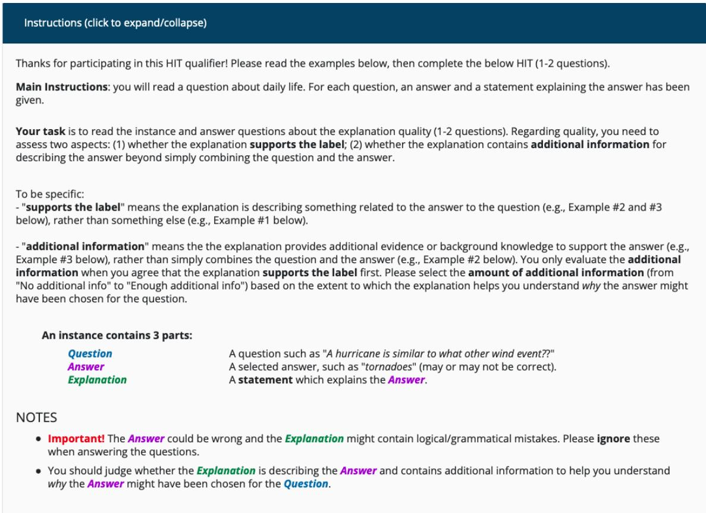  
Figure 8: The instructions of human evaluation in the user interface on AMT.

<table><tr><td rowspan="2">Type</td><td rowspan="2">Question</td><td rowspan="2">Label</td><td rowspan="2">Rationale</td><td colspan="3">Metric</td></tr><tr><td>REV</td><td>LAS</td><td>RQ</td></tr><tr><td rowspan="3"> $\boldsymbol { \mathrm { Y } } ^ { * } ; \boldsymbol { \mathrm { R } } ^ { * }$ </td><td>If you have a ticket and you are planning to eat hot dogs, where would you go?</td><td>baseball stadium</td><td>Hot dogs can be eaten at baseball stadium. When you go to a baseball stadium, you have a ticket and you may plan to eat hot dogs.</td><td>0.32</td><td>0</td><td>0</td></tr><tr><td>How does a person go to space?</td><td>space shuttle</td><td>People go to space by a vehicle specially designed to travel to space. That vehicle is called a space shuttle.</td><td>0.32</td><td>0</td><td>0</td></tr><tr><td>What is a dangerous outdoor activity for children?</td><td>sun themselves</td><td>Sunning themselves is a dangerous activity Children should not sun themselves</td><td>0.28</td><td>1</td><td>1</td></tr><tr><td rowspan="3"> $\mathrm { X Y } ^ { * } {  } \mathbf { R }$ </td><td>Where are old pictures kept?</td><td>attic</td><td>Attic is a place where old pictures are kept.</td><td>0.34</td><td>1</td><td>0</td></tr><tr><td>What would you be if you comfort friend?</td><td>friendly</td><td>Comforting friend is a good thing.</td><td>0.43</td><td>0</td><td>1</td></tr><tr><td>What do customers do to a waiter after the waiter serves customers?</td><td>pay to</td><td>Paying to a waiter is the action of paying. Waiters get paid to serve customers.</td><td>0.10</td><td>-1</td><td>0</td></tr><tr><td rowspan="3"> $\Chi { \to } \Nu \mathrm { R }$ </td><td>Where is there likely to be more than one desk drawer?</td><td>desk</td><td>Desk drawer is a drawer used for storing office supplies. There is likely to be more than one desk drawer in office.</td><td>-4.75</td><td>-1</td><td>1</td></tr><tr><td>What leads to someone's death when they are very depressed?</td><td>suicide</td><td>Suicide is the act of committing suicide. When someone is very depressed, suicide leads to their death.</td><td>0.57</td><td>0</td><td>0</td></tr><tr><td>Where are you normally when you take a bath?</td><td>hotel room</td><td>Hotel room is a place where people stay. Bathing is normally done in hotel rooms.</td><td>0.32</td><td>0</td><td>-1</td></tr><tr><td rowspan="3"> $\mathrm { X } { \to } \mathrm { R Y }$ </td><td>What is likely heard by those going to a party?</td><td>laughter</td><td>People go to a party to meet new people. People are likely to hear laughter at the party.</td><td>-0.10</td><td>1</td><td>0</td></tr><tr><td>What would you do if you have excitement and do not want to stay in your house?</td><td>go to gym</td><td>Go to gym is to go to a place where you can express information. If you have excitement and do not want to</td><td>0.53</td><td>1</td><td>0</td></tr><tr><td>If you're caught committing murder, an injection can lead to your own what?</td><td>die</td><td>stay in your house, then you would go somewhere. An injection can lead to one's own death. If you're caught committing murder, you can be injected into your own body</td><td>1.46</td><td>0</td><td>0</td></tr><tr><td>Input</td><td>Label</td><td>Crowdsourced Rationale</td><td>REV</td><td>Input-Irrelevant GenericsKB Sentence</td><td>REV</td></tr><tr><td>What form of government is most associated with kingdoms?</td><td>monarchy</td><td>Monarchy is a form of government with the monarch at the head. Monarchy is a form of government mostly associated with kingdoms.</td><td>0.65</td><td>Monarchies are countries.</td><td>-0.94</td></tr><tr><td>Bailey liked playing games against other people. He found it exhilarating. What might Bailey like about games?</td><td>competitiveness</td><td>When a game is played against someone, it is a competition and it promotes competitiveness. Games are competitive in nature when it involves people against each other.</td><td>0.37</td><td>Competitiveness also means education, research and innovation including in the area of environment.</td><td>-0.14</td></tr><tr><td>How is a dog likely to communicate with another dog?</td><td>bark</td><td>Bark is the sharp explosive cry of a dog, fox, or seal. The dog is likely to communicate with another dog with a bark.</td><td>2.11</td><td>Bark is covering.</td><td>-4.37</td></tr><tr><td>Where would you put a car near your house?</td><td>driveway</td><td>Driveway is a place near the house. A car can be put in the driveway.</td><td>0.48</td><td>Driveways are located in cars.</td><td>0.43</td></tr></table>

Table 4: Pointwise evaluation of REV, LAS and RQ on different types of rationale-label pairs. Incorrect labels are colored red.

Table 5: Exemplar of REV scores for crowdsourced rationales and label-related but input-irrelevant sentences containing the ground-truth label from GenericsKB for ECQA.

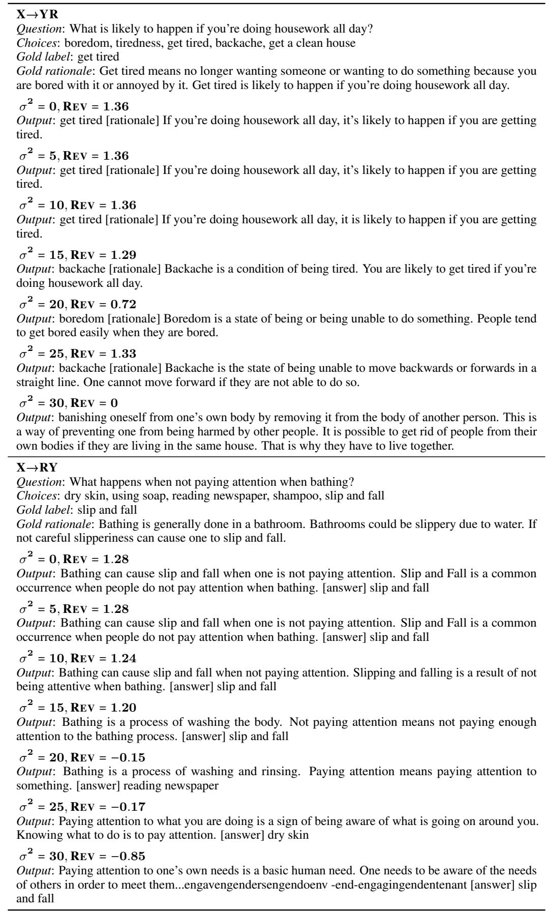  
Table 6: Examples of the two task models’ outputs under different levels of noise in sensitivity test.

<table><tr><td>Type</td><td>Input</td><td>Label</td><td>Rationale</td><td>REV</td></tr><tr><td>Crowdsourced</td><td>The goal was to hit the target, but a projectile ball can&#x27;t hit anything if it isn&#x27;t in what?</td><td>motion</td><td>if you stand still you get hit</td><td>-0.14</td></tr><tr><td rowspan="2"></td><td>When you get together with friends to watch film, you might do plenty of this?</td><td>have fun</td><td>when the working day is done</td><td>-0.27</td></tr><tr><td>They dealt with combustible mixtures in their experiments, this is why they kept a fire extinguisher where?</td><td>chemistry lab</td><td>mixtures mixing fruitsa</td><td>-0.17</td></tr><tr><td rowspan="3"> $X Y ^ { * }  R$ </td><td>The goal was to hit the target, but a projectile ball can&#x27;t hit anything if it isn&#x27;t in what?</td><td>motion</td><td>a projectile ball can&#x27;t hit anything if it&#x27;s not in motion</td><td>0.09</td></tr><tr><td>When you get together with friends to watch film, you might do plenty of this?</td><td>have fun</td><td>when you get together with friends to watch film, you might do plenty of fun</td><td>1.47</td></tr><tr><td>They dealt with combustible mixtures in their experiments, this is why they kept a fire extinguisher where?</td><td>chemistry lab</td><td>chemistry labs deal with combustible mixtures in their experiments.</td><td>0.74</td></tr></table>

Table 7: Exemplar of REV scores for crowdsourced and model-generated $( \mathbf { \boldsymbol { X } } \mathbf { \boldsymbol { Y } } ^ { * } {  } \mathbf { \boldsymbol { R } } )$ rationales for CoS-E.

<table><tr><td>Input</td><td>Label</td><td>Rationale</td><td>REV</td></tr><tr><td>What do people call it when they are going for run?</td><td>falling down</td><td>People call it run when they are going for run.</td><td>-1.06</td></tr><tr><td>What enables most people to transport themselves?</td><td>own cars</td><td>People who believe in god are able to transport themselves through helicopter.</td><td>-0.19</td></tr><tr><td>Where would you expect to find popcorn in a public place?</td><td>movie theater</td><td>Popcorn can be found in a public place.</td><td>-1.27</td></tr><tr><td>What are you usually at when you sit on a bench on a curb?</td><td>city</td><td>Ohio is a state in the United States. You are usually at street corner when you sit on bench on curb.</td><td>-0.27</td></tr></table>

Table 8: Exemplar of negative REV scores for rationale-label pairs from X→RY on the ECQA dataset.

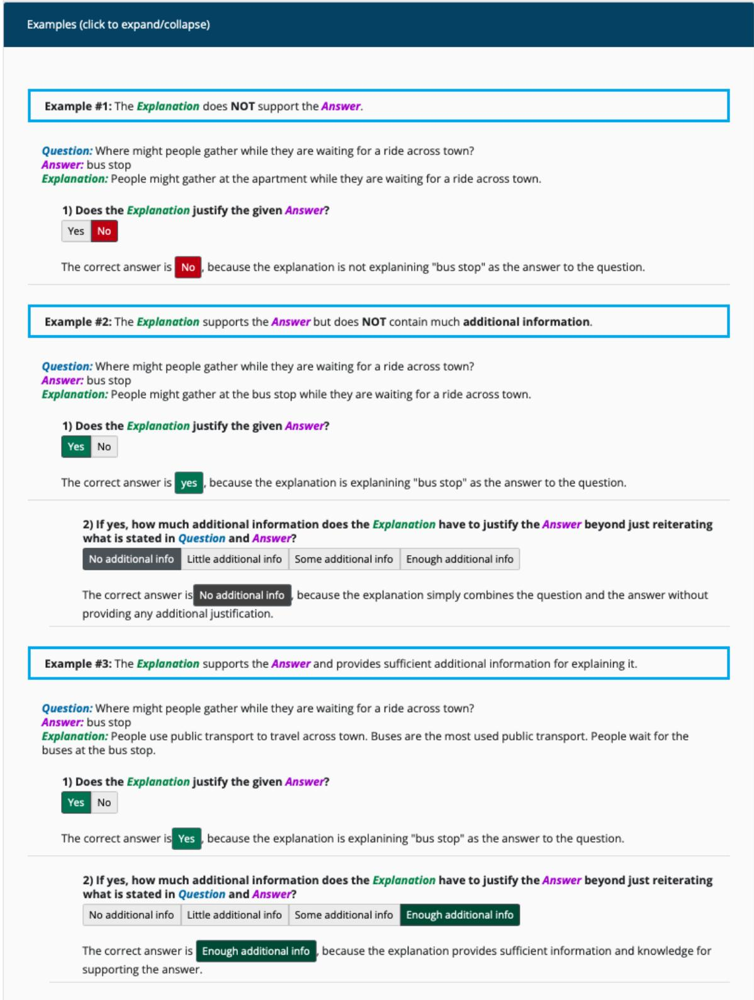  
Figure 9: Exemplars provided to worker in the user interface on AMT.

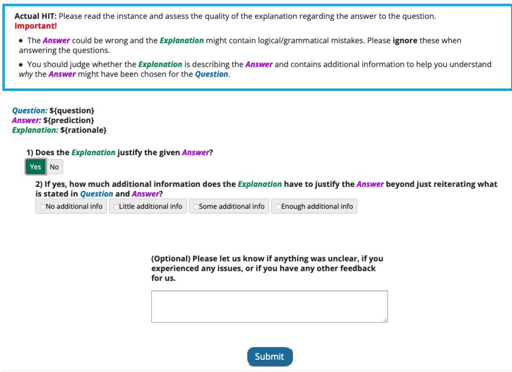  
Figure 10: The actual hit of human evaluation in the user interface on AMT.

A For every submission: ✓ A1. Did you describe the limitations of your work? 7 (Limitations)

✓ A2. Did you discuss any potential risks of your work? 8 (Ethics Statement)

✓ A3. Do the abstract and introduction summarize the paper’s main claims? 0, 1

✗ A4. Have you used AI writing assistants when working on this paper? Left blank.

## B ✗ Did you use or create scientific artifacts? Left blank.

 B1. Did you cite the creators of artifacts you used? No response.

 B2. Did you discuss the license or terms for use and / or distribution of any artifacts? No response.

 B3. Did you discuss if your use of existing artifact(s) was consistent with their intended use, provided that it was specified? For the artifacts you create, do you specify intended use and whether that is compatible with the original access conditions (in particular, derivatives of data accessed for research purposes should not be used outside of research contexts)? No response.

 B4. Did you discuss the steps taken to check whether the data that was collected / used contains any information that names or uniquely identifies individual people or offensive content, and the steps taken to protect / anonymize it? No response.

 B5. Did you provide documentation of the artifacts, e.g., coverage of domains, languages, and linguistic phenomena, demographic groups represented, etc.? No response.

 B6. Did you report relevant statistics like the number of examples, details of train / test / dev splits, etc. for the data that you used / created? Even for commonly-used benchmark datasets, include the number of examples in train / validation / test splits, as these provide necessary context for a reader to understand experimental results. For example, small differences in accuracy on large test sets may be significant, while on small test sets they may not be. No response.

## C ✓ Did you run computational experiments?

4

✓ C1. Did you report the number of parameters in the models used, the total computational budget (e.g., GPU hours), and computing infrastructure used? B, the main computational experiments are training T5 models (770 million parameters), which take about 12 hours to run with a single NVIDIA RTX 8000 965 GPU.

✓ C2. Did you discuss the experimental setup, including hyperparameter search and best-found hyperparameter values? 3, B

✓ C3. Did you report descriptive statistics about your results (e.g., error bars around results, summary statistics from sets of experiments), and is it transparent whether you are reporting the max, mean, etc. or just a single run? 4, C

✓ C4. If you used existing packages (e.g., for preprocessing, for normalization, or for evaluation), did you report the implementation, model, and parameter settings used (e.g., NLTK, Spacy, ROUGE, etc.)? 3, B, C

## D ✓ Did you use human annotators (e.g., crowdworkers) or research with human participants? 4.2

✓ D1. Did you report the full text of instructions given to participants, including e.g., screenshots, disclaimers of any risks to participants or annotators, etc.? 4.2, C.4

✓ D2. Did you report information about how you recruited (e.g., crowdsourcing platform, students) and paid participants, and discuss if such payment is adequate given the participants’ demographic (e.g., country of residence)? C.4

✓ D3. Did you discuss whether and how consent was obtained from people whose data you’re using/curating? For example, if you collected data via crowdsourcing, did your instructions to crowdworkers explain how the data would be used? 4.2, C.4

 D4. Was the data collection protocol approved (or determined exempt) by an ethics review board? Not applicable. Left blank.

 D5. Did you report the basic demographic and geographic characteristics of the annotator population that is the source of the data? Not applicable. Left blank.