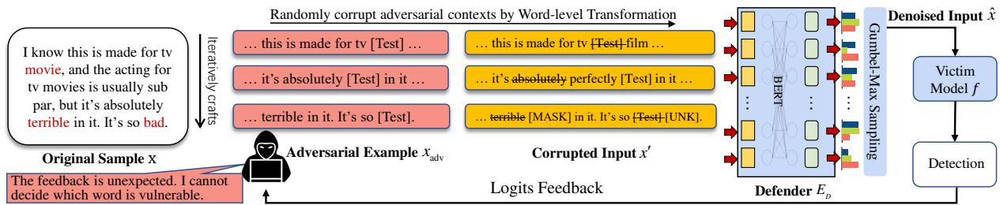
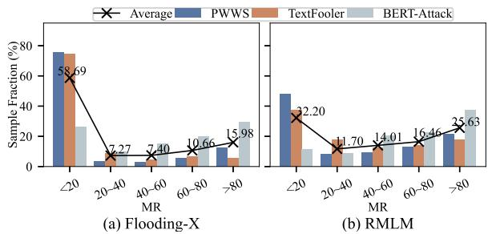
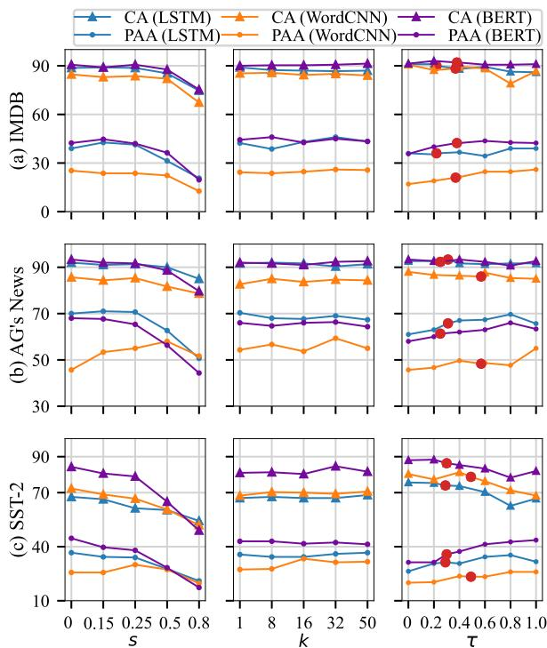
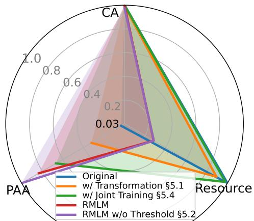
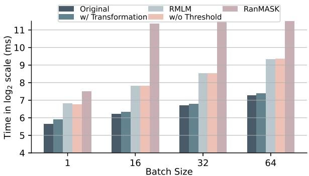

# RMLM: A Flexible Defense Framework for Proactively Mitigating Word-level Adversarial Attacks

Zhaoyang Wang† 1, Zhiyue Liu† 2, Xiaopeng Zheng1, Qinliang Su1, Jiahai Wang∗ 1,3,4 School of Computer Science and Engineering, Sun Yat-sen University, Guangzhou, China1 School of Computer, Electronics and Information, Guangxi University, Nanning, China2 Guangdong Key Laboratory of Big Data Analysis and Processing, Guangzhou, China3 Key Laboratory of Machine Intelligence and Advanced Computing, Ministry of Education4 {wangzhaoy22,zhengxp26}@mail2.sysu.edu.cn liuzhy@gxu.edu.cn {suqliang,wangjiah}@mail.sysu.edu.cn

## Abstract

Adversarial attacks on deep neural networks keep raising security concerns in natural language processing research. Existing defenses focus on improving the robustness of the victim model in the training stage. However, they often neglect to proactively mitigate adversarial attacks during inference. Towards this overlooked aspect, we propose a defense framework that aims to mitigate attacks by confusing attackers and correcting adversarial contexts that are caused by malicious perturbations. Our framework comprises three components: (1) a synonym-based transformation to randomly corrupt adversarial contexts in the word level, (2) a developed BERT defender to correct abnormal contexts in the representation level, and (3) a simple detection method to filter out adversarial examples, any of which can be flexibly combined. Additionally, our framework helps improve the robustness of the victim model during training. Extensive experiments demonstrate the effectiveness of our framework in defending against word-level adversarial attacks.

## 1 Introduction

Deep neural networks (DNNs) have achieved remarkable success in natural language processing (NLP). However, they are vulnerable when facing adversarial attacks (Alzantot et al., 2018; Liang et al., 2018; Zhong et al., 2020a; Wang et al., 2020). Textual adversarial attacks craft adversarial contexts by perturbing the input in order to fool the victim model, which keeps raising security issues.

General textual adversarial attacks can be categorized into three broad classes according to the perturbation grain, including character-level attacks (e.g., word misspelling) (Ebrahimi et al., 2018; Eger et al., 2019), word-level attacks (e.g., word substitution) (Huang et al., 2019; Ren et al., 2019; Li et al., 2020; Garg and Ramakrishnan, 2020; Jin et al., 2020), and sentence-level attacks (e.g., paraphrasing) (Ribeiro et al., 2018; Wang et al., 2020; Maheshwary et al., 2021). Character-level and sentence-level attacks often tend to create illegal and unnatural sentences, which could be detected by the spelling and grammar checker, respectively (Pruthi et al., 2019; Ge et al., 2019). Word-level attacks utilize synonym substitutions to craft adversarial examples that do not violate grammatical and semantic requirements (Samanta and Mehta, 2017; Garg and Ramakrishnan, 2020), and thus it is more challenging to defend against them. In this paper, we focus on the defense against such synonym-based word-level adversarial attacks.

Defense methods for textual adversarial attacks can be roughly divided into two categories (Li et al., 2021): empirical defense and certified robustness. Most empirical defense methods adopt and refine adversarial training (Zhu et al., 2020; Wang and Wang, 2020; Si et al., 2021; Ivgi and Berant, 2021) to improve the robustness of models. Another line of research (Liu et al., 2022; Dong et al., 2020; Le et al., 2022; Zeng et al., 2021b) adopt regularization or ensemble methods to achieve robustness to perturbations. Certified robustness (Huang et al., 2019; Jia et al., 2019; Ye et al., 2020) is dedicated to provably certified robustness by optimizing interval bound propagation upper bound. These methods primarily focus on improving the robustness of models during training, while rarely considering mitigating adversarial attacks during inference.

Most word-level adversarial attackers iteratively search and substitute vulnerable words in order to craft adversarial examples along with several tailor-made adversarial contexts to fool the victim model. We can achieve promising results in defense against these attacks if we can (1) confuse the attacker on searching vulnerable contexts, and (2) correct adversarial contexts. Towards this less explored direction, we propose a flexible framework Randomization Masked Language Modeling (RMLM), which leverages randomness of MLM to mitigate adversarial attacks during inference.

During inference, RMLM firstly applies (1) a synonym-based transformation to randomly corrupt potential adversarial contexts. However, this introduced noise can be detrimental to the victim model. Thanks to the pre-trained model that has extensive knowledge, BERT (Devlin et al., 2019) has been demonstrated to perform well on a range of NLP tasks (Raffel et al., 2020; Zheng et al., 2022; Zhong et al., 2020b). Thus, we develop (2) a BERT defender to correct corrupted contexts and remanent adversarial contexts in representation level. By sampling from the MLM head of the BERT defender, we can reconstruct a denoised input for the final prediction of the victim model. Note that the returned logits may confuse the attacker who heavily relies on precise logits feedback, since the feedback is based on the denoised sample instead of the expected adversarial input. Furthermore, we propose (3) a simple-yet-effective detection method to filter out adversarial samples based on the cooperation between the victim model and the BERT defender. During training, the robustness of the victim model can be improved since our randomized transformation and sampling operation could enable the BERT defender to offer abundant virtual samples for robust training. The above three components constitute the proposed framework RMLM, and each component can be deployed independently to provide defense.

In summary, our contributions are as follows:

1) We explore a new approach to defense against adversarial attacks in NLP, proactively mitigating adversarial attacks by confusing attackers and correcting adversarial contexts.

2) We propose a flexible framework RMLM that can effectively mitigate adversarial attacks and improve the robustness of the victim model during inference and training, respectively.

3) Extensive experiments across 3 DNNs, 3 attack methods, 6 defense baselines, 5 metrics, and 3 benchmark datasets demonstrate the superior performance of the proposed framework.

## 2 Related Work

Spelling and grammar checkers are successful in defense against character-level and sentence-level attacks which often violate grammatical requirements (Pruthi et al., 2019; Ge et al., 2019) during inference. However, few of them can effectively defend against word-level attacks. For defense against word-level attacks, most previous works employ empirical defense for robustness enhancement (Zhu et al., 2020; Si et al., 2021; Zhou et al., 2021; Ivgi and Berant, 2021; Dong et al., 2020; Liu et al., 2022), where they heavily rely on augmenting generated adversarial examples and increase the training cost (Liu et al., 2022). By contrast, RMLM does not require additional data for augmentation, making it more practical in realistic scenarios. Certified robustness (Huang et al., 2019; Jia et al., 2019; Ye et al., 2020) is dedicated to provable robustness by expanding interval bound propagation (Gowal et al., 2019) but often restricts both the attack space and model architectures. Yet each component of RMLM can be flexibly combined and applied to different models. Besides, we focus on “proactively mitigating adversarial attacks during inference” rather than “improving the robustness of victim models during training”.

Xie et al. (2018) show success in mitigating attacks in computer vision by randomized transformations. Zeng et al. (2021b) propose RanMASK to craft a mass of masked copies for the ensemble prediction. Despite the difference in corruption, RMLM corrupts the input only once since our BERT defender is developed to recover corrupted and remanent adversarial contexts, while RanMASK corrupts the input hundreds of times for doing the ensemble. Besides, we leverage the inherent randomness of RMLM for disturbing attackers’ search procedure and correcting adversarial contexts rather than achieving certified robustness.

## 3 Method

## 3.1 Background

Given a victim model $f$ and the dataset $\mathcal { D }$ $\{ ( x , y ) \}$ , where $x = [ w _ { 1 } , w _ { 2 } , \cdot \cdot \cdot , w _ { n } ]$ is the input text with n words and y is the label. The attacker crafts several adversarial contexts by substituting synonyms for words in x, resulting in a final adversarial example $x _ { \mathrm { a d v } }$ . The attacker iteratively searches for the one $x _ { \mathrm { a d v } }$ that can fool the victim model, i.e., arg max $f ( x _ { \mathrm { a d v } } ) \neq y$ . The goal of defense is to protect the victim model from making incorrect predictions on adversarial examples.

  
Figure 1: Overview of RMLM during inference. The attacker perturbs the original sample x with [Test] (e.g., synonyms or triggers) to iteratively search vulnerable contexts and craft adversarial examples $x _ { \mathrm { a d v } }$ . Every input $x _ { \mathrm { a d v } }$ would be randomly corrupted by our transformation to a corrupted input $x ^ { \prime }$ . BERT defender $E _ { D }$ would reconstruct $x ^ { \prime }$ to a denoised one xˆ by sampling from MLM head. The detection is performed to filter out adversarial ones and return logits of denoised input xˆ instead of the assumed malicious query/adversarial one $x _ { \mathrm { a d v } }$ to confuse the attacker.

## 3.2 Overview of RMLM

Fig. 1 shows the proposed framework, RMLM defending against adversarial attacks. Our framework utilizes a randomized transformation and a BERT defender to first corrupt and then correct adversarial contexts, reconstructing a denoised input which is expected to be less harmful to the victim model. And the randomness can make logits feedback full of uncertainty during the attacker’s search procedure, which may prevent the attacker from finding a fatal adversarial context to fool the victim model.

RMLM is composed with three components any of which could be flexibly combined: (1) a wordlevel synonym-based transformation (§3.3), (2) a developed BERT defender (§3.4), and (3) a simpleyet-effective detection method (§3.5).

## 3.3 Word-Level Transformation

Motivated by the MLM task (Devlin et al., 2019), we employ vanilla masking to corrupt the input text. The BERT defender pre-trained by MLM has the ability to identify and correct masked contexts in order to alleviate negative effects of corruption. However, the masking scheme does not account for synonym substitutions commonly used by attackers, suggesting that the BERT defender may not be able to effectively correct remanent adversarial contexts, leading to harm the victim model.

To this end, we devise a synonym-based transformation that is similar to the perturbation strategy used by attackers. We first prepare a lookup table $T$ that collects k synonyms for each input’s word $w _ { i }$ from WordNet (Miller, 1998)1. Based on the setting of BERT (Devlin et al., 2019), about

25% (i.e., transformation rate $s = 0 . 2 5 )$ of input tokens would be substituted with their synonyms in the lookup table. However, a mismatch between our transformation and masking of MLM may hinder leveraging BERT’s knowledge, since MLM in the large scale pre-training stage mainly uses the [MASK] token while not involving any synonyms. To mitigate this gap, we replace a token $w _ { i }$ with (1) a random synonym in $T$ (SYN), (2) [MASK] token, (3) [UNK] token, (4) a random token (RAND), and (5) unchanged token $w _ { i }$ (UNC) in 50%, 20%, 10%, 10% and 10% of the time, respectively.

## 3.4 BERT Defender

The randomized transformation for corrupting adversarial contexts has the side effect of harming the victim model, as the corrupted input is still noisy.

## 3.4.1 Fine-Tuning

We utilize the MLM task with our synonym-based transformation instead of original masking to fine-$\mathrm { t u n e } ^ { 2 }$ the BERT defender on the training set $\mathcal { D } _ { \mathrm { t r a i n } }$ to achieve the goal of correcting abnormal contexts. Fine-tuning would enable the BERT defender to (1) identify both the [MASK] token and synonyms which belong to remnant adversarial contexts, and (2) correct the identified abnormal token to the original one. The hidden vector of the MLM head for the corrupted token is used to predict the original token $w _ { i }$ with cross entropy function as follows:

$$
\mathcal { L } _ { \mathrm { m l m } } = \mathbb { E } _ { \mathcal { D } _ { \mathrm { t r a i n } } } \left[ - \sum _ { i \in \mathcal { C } } \log ( P _ { E _ { D } } \left( w _ { i } \mid x ^ { \prime } \right) ) \right] .\tag{1}
$$

where and $x ^ { \prime }$ denote corrupted tokens positions and the corrupted input, respectively. After optimization, our BERT defender is able to correct

both corrupted and remanent adversarial contexts, obtaining a denoised input. Thus, the victim model can suffer less from the noisy input.

## 3.4.2 Joint Training

The denoised input may not belong to the distribution learned by the victim model though our BERT defender after fine-tuning can recover most corrupted and adversarial contexts. Therefore, we propose to jointly train the BERT defender and the victim model to further improve the robustness.

For $( x = [ w _ { 1 } , \cdot \cdot \cdot , w _ { n } ] , y ) \in \mathcal { D } _ { \mathrm { t r a i n } }$ , we follow the aforementioned word-level transformation to form the corrupted input $x ^ { \prime } .$ . Then, BERT defender $E _ { D }$ encodes it as the hidden vectors $\pmb { h } = E _ { D } ( x ^ { \prime } )$ where $\pmb { h } = [ h _ { 1 } , h _ { 2 } , \cdots , h _ { n } ]$ denotes hidden representation for the tokens in the corrupted input. We sample a token $w _ { i } ^ { s }$ over the distribution softmax $\left( h _ { i } \right)$ rather than directly obtaining a token by arg max $\left( { { h _ { i } } } \right)$ to reconstruct the denoised input ${ \hat { x } } ,$ since introducing randomness is shown to be effective in mitigating adversarial attacks (Xie et al., 2018), and making it possible to offer abundant virtual samples for robust training. However, the sampling operation causes the non-differentiability problem (Nie et al., 2019) due to the discrete nature of texts which would prevent the gradients pass.

Gumbel-Softmax Relaxation To deal with the above issue, we adopt the Gumbel-Softmax relaxation (Jang et al., 2017; Maddison et al., 2017) to approximate $w _ { i } ^ { s }$ with a continuous form. Specifically, the Gumbel-Max trick (Maddison et al., 2017) and the softmax function are employed to sample discrete tokens and approximate discrete tokens, respectively. The Gumbel-Max trick samples the discrete token $w _ { i } ^ { s }$ as follows:

$$
w _ { i } ^ { s } = \underset { 1 \leq k \leq | \mathcal { V } | } { \arg \operatorname* { m a x } } ( h _ { i } ^ { ( k ) } + g _ { i } ^ { ( k ) } ) ,\tag{2}
$$

where $g _ { i } ^ { ( k ) } = - \log ( - \log ( U _ { i } ^ { ( k ) } ) )$ is sampled from the standard Gumbel distribution, with $U _ { i } ^ { ( k ) } \sim$ Uniform(0, 1), and  is the vocabulary size of the BERT defender. The continuous approximation $\widetilde { w } _ { i } ^ { s }$ of the discrete token $w _ { i } ^ { s }$ is given as follows:

$$
\widetilde { w } _ { i } ^ { s } = \operatorname { s o f t m a x } ( t ( h _ { i } + g _ { i } ) ) ,\tag{3}
$$

where t is the temperature and set to 1. $\widetilde { w } _ { i } ^ { s }$ is differentiable with respect to $h _ { i }$

The denoised input $\hat { x } = [ \widetilde { w } _ { 1 } ^ { s } , \widetilde { w } _ { 2 } ^ { s } , \cdot \cdot \cdot , \widetilde { w } _ { n } ^ { s } ]$ can e e ebe obtained by Eq. 3. Then, it is fed into the victim model f to get the probability $P = f ( { \hat { x } } )$ with respect to all M labels. And y is set to a one-hot vector where the element of the label is 1. The joint training objective is as follows:

Algorithm 1 The inference procedure of RMLM.   
Require: original input x; BERT defender $E _ { D } ;$ victim model   
$f ;$ transformation rate s; prior threshold τ; adversarial   
attacker.   
1: input $x _ { \mathrm { a d v } }$ crafted by the adversarial attacker   
2: $x ^ { \prime } \gets$ corrupt s of tokens in $x _ { \mathrm { a d v } }$ by our transformation   
3: Compute hidden vectors $\pmb { h } = E _ { D } \dot { ( } x ^ { \prime } )$   
4: Obtain $\hat { x } _ { 1 }$ and $\hat { x } _ { 2 }$ through Eq. 2   
5: Compute the entropy $\bar { S _ { \hat { x } _ { 1 } } }$ and $S _ { \hat { x } _ { 2 } }$ for $f ( \hat { x } _ { 1 } )$ and $f ( \hat { x } _ { 2 } )$   
6: $\mathbf { f } \operatorname* { m a x } ( S _ { \hat { x } _ { 1 } } , S _ { \hat { x } _ { 2 } } ) \ \tilde { < } \tau$ then   
7: Filter adversarial examples by Det $( \hat { x } _ { 1 } , \hat { x } _ { 2 } )$ in Eq. 5   
8: if $S _ { \hat { x } _ { 1 } } < S _ { \hat { x } _ { 2 } }$ then   
9: logit $\mathsf { \Phi } _ { \mathsf { i } } ( x _ { \mathrm { a d v } } ) \gets f ( \hat { x } _ { 1 } )$   
10: else   
11: logits $( x _ { \mathrm { a d v } } ) \gets f ( \hat { x } _ { 2 } )$   
12: return logits $( x _ { \mathrm { a d v } } )$

$$
\mathcal { L } _ { \mathrm { j o i n t } } = \mathbb { E } _ { \mathcal { D } _ { \mathrm { t r a i n } } } \left[ - \sum _ { m = 1 } ^ { M } y ^ { ( m ) } \mathrm { l o g } ( P ^ { ( m ) } ) \right] .\tag{4}
$$

After joint optimization, the victim model is expected to be more robust due to the proposed randomized word-level transformation and sampling operation could make the BERT defender provide rich virtual samples for robust training.

## 3.5 Detection

As depicted in Fig. 1, we insert a simple but empirically effective detection to filter out adversarial examples after obtaining the denoised input.

Due to adversarial attacks and randomized operations, the BERT defender may not be able to recover every corrupted input with high confidence to a definitely denoised sample ${ \hat { x } } .$ As a result, the predictions from the victim model f can vary significantly, providing an opportunity to detect adversarial examples. Specifically, we sample twice from the output distribution of the BERT defender to form ${ \hat { x } } _ { 1 }$ and ${ \hat { x } } _ { 2 }$ . Then, the “Normal” and “Adversarial” sample is distinguished by $I = \mathbb { 1 } _ { [ \mathrm { a r g m a x } ( f ( \hat { x } _ { 1 } ) ) = \mathrm { a r g m a x } ( f ( \hat { x } _ { 2 } ) ] }$ , in details as:

$$
\begin{array} { r } { \mathrm { D e t } ( \hat { x } _ { 1 } , \hat { x } _ { 2 } ) = \left\{ \begin{array} { l l } { \mathrm { A d v e r s a r i a l } , } & { I = 0 } \\ { \mathrm { N o r m a l } , } & { I = 1 } \end{array} \right. . } \end{array}\tag{5}
$$

However, we observe that this detection may miss-detect some original samples, particularly in datasets with data scarcity and short text length (e.g., SST-2 dataset (Socher et al., 2013)).

Prior Threshold We can set a threshold τ to more precisely control which inputs should be detected and which ones are skipped to reduce potential risk of miss-detection. We first apply the detection method in $\mathrm { E q . } 5$ to the training set and gather the miss-detected samples $\mathcal { D } _ { \mathrm { t r a i n } } ^ { * }$ . It is intuitive to set the average entropy of predictions as the threshold τ, calculated as follows:

$$
\tau = \frac { 1 } { | \mathcal { D } _ { \mathrm { t r a i n } } ^ { * } | } \sum _ { x \in \mathcal { D } _ { \mathrm { t r a i n } } ^ { * } } - \sum _ { m = 1 } ^ { M } P ^ { ( m ) } \mathrm { l o g } ( P ^ { ( m ) } ) ,\tag{6}
$$

where P predicted by the victim model is the probability of the denoised input xˆ with respect to M labels. During inference, for predictions with high confidence (entropy lower than τ ), we still use the detection in Eq. 5. For others lying in the decision boundary (entropy higher than τ), we skip the detection to avoid potential miss-detections.

The whole procedure of the inference stage of RMLM is summarized in Algorithm 1.

## 4 Experiments

## 4.1 Experimental Setup

Datasets Experiments are conducted on three benchmark classification datasets from phase-level to document-level tasks, including IMDB (Maas et al., 2011), AG’s News (Zhang et al., 2015), and SST-2 (Socher et al., 2013). The dataset statistics are listed in Table 1. IMDB is a documentlevel sentiment classification dataset about movie reviews. The essay-level AG’s News dataset is for multi-class news classification. SST-2 is a phraselevel sentiment analysis dataset. We set a longer truncated length (Maxlen) than previous works to provide more search and attack space for attackers.

Victim Models Three different types of DNNs are adopted as victim models, including longshort term memory (LSTM) (Hochreiter and Schmidhuber, 1997), word-based convolutional neural network (WordCNN) (Kim, 2014), and $\mathbf { B E R T _ { B A S E } }$ (Devlin et al., 2019). LSTM consists of 2 layers of 300-dimensional memory cells. Word-CNN uses three window sizes (i.e., 3, 4, and 5), and each channel size is 100. Both LSTM and Word-CNN use the 300-dimensional pre-trained GloVe embeddings (Pennington et al., 2014). BERTBASE contains 12 layers of 768-dimensional transformer blocks and one linear layer for classification.

<table><tr><td>Dataset</td><td># of classes</td><td>Train</td><td>Valid</td><td>Test</td><td>Truncated Len</td></tr><tr><td>IMDB</td><td>2</td><td>25000</td><td>0</td><td>25000</td><td>300</td></tr><tr><td>AG&#x27;s News</td><td>4</td><td>120000</td><td>0</td><td>7600</td><td>70</td></tr><tr><td>SST-2</td><td>2</td><td>6920</td><td>872</td><td>1821</td><td>32</td></tr></table>

Table 1: Dataset statistics.

Attack Methods Three strong word-level adversarial attack methods are employed as attackers. Ren et al. (2019) propose PWWS which considers the word saliency to determine the word replacement order for greedy attack. Jin et al. (2020) first identify the important words and then replace them with the semantically similar and grammatically correct words, named TextFooler. Li et al. (2020) propose BERT-Attack which uses BERT to find and substitute the vulnerable words in a semanticpreserving way.

Defense Methods Six defense baselines across empirical defense and certified robustness are compared. Following Si et al. (2021), adversarial training (AT) is implemented by augmenting generated adversarial data into the training set. SEM (Wang et al., 2021) deploys synonym encoding to map each cluster of synonyms to a unique encoding for defense. AMDA (Si et al., 2021) linearly interpolates the representations of inputs to form virtual samples for enhanced AT. Freelb++ (Li et al., 2021) extends the search region to a larger ℓ2-norm of Freelb (Zhu et al., 2020). Flooding-X (Liu et al., 2022) improves Flooding (Ishida et al., 2020) to boost model generalization by preventing further reduction of the training loss. Similar to our method, RanMASK (Zeng et al., 2021b) defends against attacks during inference but it aims at the ensemble prediction to achieve certified robustness by masking the input text hundreds of times.

Evaluation Metrics Five metrics are used to measure the performance.  and  represent higher or lower is better, respectively. (1) Clean accuracy (CA% ) is the classification accuracy of the model on clean data. (2) Post-attack accuracy (PAA% ) is the accuracy under adversarial attacks. (3) Attack success rate (ASR% ) is the percent of adversarial examples among all test samples that can successfully fool the victim model. (4) Query count (QC ) is the number of queries the attacker needs to search and craft one successful adversarial example. (5) Modification rate (MR% ) is the percent of words that are perturbed by the attacker.

<table><tr><td rowspan="2"></td><td rowspan="2">Method</td><td rowspan="2">No Attack CA↑</td><td colspan="4">PWWS</td><td rowspan="2"></td><td colspan="3">TextFooler</td><td rowspan="2"></td><td colspan="3">BERT-Attack</td></tr><tr><td>PAA↑</td><td>ASR↓</td><td>QC↑</td><td>PAA↑</td><td>ASR↓</td><td>QC↑</td><td>MR↑</td><td>PAA↑ ASR↓</td><td>QC↑</td><td>MR↑</td></tr><tr><td rowspan="10">IMDDB</td><td>Original AT</td><td>92.604 92.684</td><td>6.7 28.3</td><td>92.7 69.1</td><td>1543 1583</td><td>18.1 37.5</td><td>1.8 21.0</td><td>98.0 77.1</td><td>412 604</td><td>19.7 24.3</td><td>0.7 16.6</td><td>99.2 81.9</td><td>374 806</td><td>13.3 18.9</td></tr><tr><td>SEM</td><td></td><td></td><td></td><td></td><td></td><td></td><td></td><td></td><td></td><td></td><td></td><td></td><td></td></tr><tr><td></td><td>85.092</td><td>12.6</td><td>85.1</td><td>886</td><td>13.6</td><td>19.6</td><td>76.9</td><td>458</td><td>21.2</td><td>0.5</td><td>99.4</td><td>422</td><td>27.8</td></tr><tr><td>AMDA</td><td>92.588</td><td>49.0</td><td>46.7</td><td>1615</td><td>23.0</td><td>28.1</td><td>69.5</td><td>775</td><td>29.1</td><td>16.6</td><td>82.0</td><td>790</td><td>21.7</td></tr><tr><td>Freelb++</td><td>93.808</td><td>46.9</td><td>49.6</td><td>1601</td><td>19.5</td><td>32.0</td><td>65.6</td><td>739</td><td>28.9</td><td>8.7</td><td>90.7</td><td>1021</td><td>31.6</td></tr><tr><td>Flooding-X</td><td>92.484</td><td>46.4</td><td>49.7</td><td>1600</td><td>20.0</td><td>34.6</td><td>62.5</td><td>754</td><td>17.8</td><td>28.4</td><td>69.2</td><td>1189</td><td>52.9</td></tr><tr><td>RanMASK</td><td>92.972</td><td>53.6</td><td>41.9</td><td>1610</td><td>13.1</td><td>51.6</td><td>44.1</td><td>906</td><td>19.4</td><td>24.7</td><td>73.3</td><td>1696</td><td>60.3</td></tr><tr><td>RMLM</td><td>92.260</td><td>47.6</td><td>47.4</td><td>1619</td><td>38.9</td><td>54.7</td><td>39.4</td><td>1036</td><td>41.0</td><td>32.5</td><td>64.0</td><td>1973</td><td>64.0</td></tr><tr><td>w/o Threshold</td><td>90.344</td><td>50.4</td><td>43.1</td><td>1616</td><td>44.8</td><td>57.6</td><td>34.8</td><td>1069</td><td>45.5</td><td>35.8</td><td>59.5</td><td>2083</td><td>46.1</td></tr><tr><td>w/o Detection</td><td>92.376</td><td>39.1</td><td>57.1</td><td>1610</td><td>39.3</td><td>51.6</td><td>43.4</td><td>991</td><td>41.4</td><td>17.7</td><td>80.6</td><td>1569</td><td>37.4</td></tr><tr><td rowspan="10">AGCS SS</td><td>Original AT</td><td>94.368 94.434</td><td>45.1</td><td>52.0</td><td>248</td><td>26.8</td><td>39.0</td><td>58.5</td><td>151</td><td>29.9</td><td>38.8</td><td>58.7</td><td>220</td><td>22.8</td></tr><tr><td>SEM</td><td>93.579</td><td>62.3</td><td>33.6</td><td>254</td><td>28.3</td><td>55.2</td><td>41.2</td><td>166</td><td>30.7</td><td>46.4</td><td>50.6</td><td>225</td><td>22.2</td></tr><tr><td></td><td></td><td>59.8</td><td>36.0</td><td>167</td><td>17.2</td><td>65.7</td><td>29.7</td><td>104</td><td>20.6</td><td>24.6</td><td>73.7</td><td>202</td><td>41.4</td></tr><tr><td>AMDA</td><td>94.224</td><td>59.3</td><td>34.8</td><td>253</td><td>26.9</td><td>53.2</td><td>41.5</td><td>166</td><td>28.0</td><td>36.3</td><td>60.1</td><td>230</td><td>18.6</td></tr><tr><td>Freelb++</td><td>94.987</td><td>68.7</td><td>28.0</td><td>255</td><td>31.4</td><td>63.7</td><td>33.2</td><td>172</td><td>29.9</td><td>49.4</td><td>48.2</td><td>243</td><td>19.9</td></tr><tr><td>Flooding-X</td><td>93.579</td><td>50.5</td><td>44.1</td><td>251</td><td>22.7</td><td>46.6</td><td>48.4</td><td>158</td><td>27.8</td><td>35.2</td><td>61.0</td><td>209</td><td>28.5</td></tr><tr><td>RanMASK</td><td>92.842</td><td>45.5</td><td>50.8</td><td>251</td><td>32.2</td><td>59.7</td><td>34.9</td><td>174</td><td>33.4</td><td>44.0</td><td>36.6</td><td>406</td><td>25.3</td></tr><tr><td>RMLM</td><td>94.066</td><td>72.4</td><td>22.9</td><td>257</td><td>35.9</td><td>81.0</td><td>13.7</td><td>190</td><td>29.9</td><td>48.1</td><td>48.7</td><td>562</td><td>48.8</td></tr><tr><td>w/o Threshold</td><td>92.526</td><td>76.3</td><td>17.5</td><td>257</td><td>42.5</td><td>82.7</td><td>10.7</td><td>193</td><td>36.6</td><td>54.6</td><td>41.0</td><td>603</td><td>49.2</td></tr><tr><td>w/o Detection</td><td>94.118</td><td>59.4</td><td>36.3</td><td>254</td><td>38.9</td><td>77.0</td><td>17.5</td><td>188</td><td>28.8</td><td>27.2</td><td>70.8</td><td>458</td><td>44.8</td></tr><tr><td rowspan="10">SEM S2</td><td>Original AT</td><td>91.049 23.0</td><td></td><td>74.6</td><td></td><td>16.9</td><td>21.8</td><td>76.0</td><td>56</td><td>21.1</td><td>16.1</td><td>82.2</td><td></td><td>21.5</td></tr><tr><td></td><td>89.951</td><td>35.8</td><td>60.1</td><td>110 113</td><td>21.2</td><td>33.9</td><td>62.2</td><td>64</td><td>22.7</td><td>18.8</td><td>79.0</td><td>57 63</td><td>21.7</td></tr><tr><td></td><td>82.812</td><td></td><td>88</td><td></td><td></td><td>24.5</td><td></td><td>49</td><td>22.0</td><td>10.7</td><td></td><td>49</td><td>33.6</td></tr><tr><td>AMDA</td><td></td><td>23.7</td><td>70.7</td><td></td><td>18.7</td><td></td><td>69.7</td><td></td><td></td><td></td><td>86.8</td><td></td><td>21.5</td></tr><tr><td>Freelb++</td><td>89.841</td><td>40.6</td><td>54.9</td><td>112</td><td>17.9</td><td>36.1</td><td>59.9</td><td>66</td><td>22.8</td><td>25.7</td><td>71.5</td><td>71</td><td></td></tr><tr><td></td><td>91.104</td><td>34.5</td><td>62.0</td><td>112</td><td>18.4</td><td>33.8</td><td>62.7</td><td>64</td><td>21.8</td><td>25.3</td><td>72.1</td><td>68</td><td>22.2</td></tr><tr><td>Flooding-X</td><td>91.049</td><td>38.0</td><td>58.3</td><td>112</td><td>14.5</td><td>32.7</td><td>64.1 64.4</td><td>62 63</td><td>20.2 19.9</td><td>29.8 19.0</td><td>67.3 78.9</td><td>73 91</td><td>21.0 30.4</td></tr><tr><td>RanMASK RMLM</td><td>90.829 87.919</td><td>31.7 34.9</td><td>64.9 59.8</td><td>112 113</td><td>15.7 27.9</td><td>32.1 52.6</td></table>

Table 2: The main results of BERT as the victim model. “Original” means that the victim model does not use any defense methods. The best performance is marked in bold. The metric CA is evaluated on the whole test set, while other metrics are on the aforementioned 1,000 sample set. We will take ablation studies on detection later in §5.2.

<table><tr><td></td><td colspan="2">Method</td><td>Original</td><td>AT</td><td>SEM</td><td>Flooding-X</td><td>RMLM</td></tr><tr><td rowspan="5">IMDDB</td><td>| No Attack</td><td>CA</td><td>89.768</td><td>89.280</td><td>86.604</td><td>89.404</td><td>90.144</td></tr><tr><td>PWWS</td><td>PAA(ASR) QC(MR)</td><td>4.3(95.1) 1528(18.5)</td><td>5.5(93.8) 1523(28.4)</td><td>1.8(97.9) 1524(10.1)</td><td>15.8(82.3) 1555(13.3)</td><td>42.0(52.4) 1586(40.0)</td></tr><tr><td>TextFooler</td><td>PAA(ASR) QC(MR)</td><td>4.7(94.7) 446(28.4)</td><td>7.5(91.5) 520(29.4)</td><td>5.3(93.8) 438(16.3)</td><td>11.2(87.5) 562(26.0)</td><td>53.0(40.2) 995(39.0)</td></tr><tr><td>BERT-Attack</td><td>PAA(ASR) QC(MR)</td><td>0.7(99.2) 414(12.4)</td><td>0.5(99.4) 397(14.2)</td><td>0.1(99.9) 343(8.6)</td><td>3.9(95.6) 585(52.4)</td><td>25.0(71.5) 1720(60.7)</td></tr><tr><td rowspan="5">AG wSs</td><td>No Attack</td><td>CA</td><td>93.421</td><td>93.553</td><td>92.474</td><td>93.276</td><td>93.355</td></tr><tr><td>PWWS</td><td>PAA(ASR) QC(MR)</td><td>51.1(45.3) 251(15.2)</td><td>47.9(48.4) 250(19.2)</td><td>45.2(50.9) 249(16.8)</td><td>51.7(44.6) 250(18.4)</td><td>75.8(18.8) 258(33.9)</td></tr><tr><td>TextFooler</td><td>PAA(ASR) QC(MR)</td><td>44.5(52.4) 150(21.9)</td><td>41.8(55.0) 151(25.0)</td><td>35.8(61.1) 140(23.4)</td><td>45.2(51.6) 154(25.8)</td><td>81.2(13.0) 191(33.0)</td></tr><tr><td>BERT-Attack</td><td>PAA(ASR) QC(MR)</td><td>19.8(78.8) 256(30.2)</td><td>27.4(70.5) 211(25.8)</td><td>13.1(85.8) 213(25.8)</td><td>33.0(64.7) 263(29.1)</td><td>48.3(48.1) 582(48.1)</td></tr><tr><td rowspan="5">S2</td><td>No Attack</td><td>CA</td><td>81.490</td><td>82.317</td><td>77.705</td><td>81.933</td><td>78.693</td></tr><tr><td>PWWS</td><td>PAA(ASR) QC(MR)</td><td>17.5(77.9) 108(14.5)</td><td>17.5(78.0) 109(18.3)</td><td>12.6(83.4) 109(14.4)</td><td>19.6(75.5) 108(15.7)</td><td>27.7(63.8) 112(27.5)</td></tr><tr><td>TextFooler</td><td>PAA(ASR) QC(MR)</td><td>20.3(74.4) 53(16.0)</td><td>19.7(75.2) 54(20.9)</td><td>14.8(80.5) 52(18.5)</td><td>22.7(71.7) 53(17.2)</td><td>41.0(46.1) 74(24.8)</td></tr><tr><td>BERT-Attack</td><td>PAA(ASR) QC(MR)</td><td>12.7(84.0) 58(23.2)</td><td>10.6(86.7) 54(23.5)</td><td>7.9(89.6) 53(19.0)</td><td>24.7(69.2) 86(22.8)</td><td>16.9(77.8) 88(27.3)</td></tr></table>

Table 3: The main results of LSTM as the victim.
<table><tr><td></td><td colspan="2">Method</td><td>Original</td><td>AT</td><td>SEM</td><td>Flooding-X</td><td>RMLM</td></tr><tr><td rowspan="5">IMDDB</td><td>No Attack</td><td>CA</td><td>89.252</td><td>85.236</td><td>87.384</td><td>89.712</td><td>86.404</td></tr><tr><td>PWWS</td><td>PAA(ASR) QC(MR)</td><td>1.6(98.2) 1531(11.2)</td><td>0.8(99.0) 1553(7.3)</td><td>1.6(98.2) 1528(9.1)</td><td>2.4(97.2) 1521(11.2)</td><td>29.2(65.5) 1588(35.6)</td></tr><tr><td>TextFooler</td><td>PAA(ASR) QC(MR)</td><td>1.7(98.1) 372(19.3)</td><td>0.7(99.2) 355(14.4)</td><td>1.2(98.6) 378(17.1)</td><td>1.8(97.9) 384(18.1)</td><td>40.6(51.8) 928(39.5)</td></tr><tr><td>BERT-Attack</td><td>PAA(ASR) QC(MR)</td><td>0.0(100.0) 342(14.2)</td><td>0.0(100.0) 328(6.2)</td><td>0.1(99.9) 345(7.7)</td><td>0.2(99.8) 367(50.9)</td><td>13.2(84.5) 1263(58.0)</td></tr><tr><td rowspan="5">AGS S</td><td>| No Attack</td><td>CA PAA(ASR)</td><td>92.237 39.4(57.1)</td><td>89.737</td><td>91.000</td><td>92.171 42.3(53.8)</td><td>91.447</td></tr><tr><td>PWWS</td><td>QC(MR)</td><td>248(18.7)</td><td>20.0(77.4) 242(14.8)</td><td>34.2(61.9) 246(17.2)</td><td>247(17.5)</td><td>54.0(40.3) 252(28.7)</td></tr><tr><td>TextFooler</td><td>PAA(ASR) QC(MR)</td><td>41.0(55.4) 146(24.4)</td><td>19.1(78.4) 114(19.0)</td><td>36.3(59.5) 139(21.8)</td><td>42.7(53.3) 147(23.7)</td><td>68.9(23.9) 182(26.4)</td></tr><tr><td>BERT-Attack</td><td>PAA(ASR) QC(MR)</td><td>9.4(89.8) 152(25.0)</td><td>3.1(96.5) 131(14.2)</td><td>5.1(94.3) 143(21.4)</td><td>9.4(89.7) 168(30.0)</td><td>35.6(60.7) 496(40.8)</td></tr><tr><td rowspan="5">S2</td><td>No Attack</td><td>CA</td><td>79.572</td><td>68.314</td><td>78.034</td><td>78.198</td><td>78.199</td></tr><tr><td>PWWS</td><td>PAA(ASR) QC(MR)</td><td>16.0(79.2) 110(17.1)</td><td>7.3(88.8) 111(12.7)</td><td>12.3(83.8) 110(13.2)</td><td>17.3(76.9) 110(15.7)</td><td>19.6(74.5) 111(25.9)</td></tr><tr><td>TextFooler</td><td>PAA(ASR) QC(MR)</td><td>20.8(73.0) 55(18.9)</td><td>9.7(85.1) 46(15.4)</td><td>15.6(79.4) 52(18.0)</td><td>21.0(72.0) 55(17.9)</td><td>34.5(54.9) 69(26.4)</td></tr><tr><td>BERT-Attack</td><td>PAA(ASR) QC(MR)</td><td>5.6(92.7) 51(23.9)</td><td>4.1(93.7) 41(17.0)</td><td>3.7(95.1) 45(18.3)</td><td>19.8(73.6) 90(25.6)</td><td>8.3(89.2) 73(26.7)</td></tr></table>

Table 4: The main results of WordCNN as the victim.

Implementation Following Wang et al. (2021); Li et al. (2021); Alzantot et al. (2018); Zeng et al. (2021b), we uniformly sample 1,000 examples from the distribution of the entire test set for the evaluation. The evaluation is conducted with the help of OpenAttack (Zeng et al., 2021a). To make the evaluation more challenging, we allow attackers without limitations on QC and MR to generate different adversarial examples to target different methods dynamically. Hyperparameter and implementation details are listed in Appendix A.

## 4.2 Main Results

Table 2, 3, and 4 show experimental results of BERT, LSTM and WordCNN, respectively. We have the following observations: (1) In such challenging settings, DNNs are so fragile that their PAA drops sharply. SEM proposed for static evaluation is powerless to defend against attacks. (2) Our framework RMLM is universally effective for models with different architectures. Compared to the state-of-the-art method Flooding-X across all victim models and datasets, RMLM yields average absolute gains 15.9, 18.2, 199, and 12.2 for PAA, ASR, QC, and MR, respectively. For CA, RMLM is only 1.2 lower. The substantial increase in QC and MR indicates the success of mitigating attacks by confusing attackers and correcting adversarial contexts, respectively. Fig. 2 also shows that attacking RMLM is more costly since attackers often have to perturb more words for success. (3) Compared to RanMASK, our method performs average 22.4%, 15.5%, 12.3%, and 57.8% relative better on PAA, ASR, QC, and MR. Additionally, our method has an advantage over RanMASK in terms of computation resources, where is shown in Fig. 5.

<table><tr><td rowspan="2">Dataset</td><td rowspan="2">Method</td><td colspan="4">LSTM</td><td colspan="4">WordCNN</td><td colspan="4">BERT</td></tr><tr><td>PAA</td><td>ASR</td><td>QC</td><td>MR</td><td>PAA</td><td>ASR</td><td>QC</td><td>MR</td><td>PAA</td><td>ASR</td><td>QC</td><td>MR</td></tr><tr><td rowspan="2">IMDB</td><td>PWWS</td><td>47.5</td><td>44.8</td><td>1601</td><td>44.8</td><td>32.5</td><td>60.4</td><td>1602</td><td>39.9</td><td>50.4</td><td>43.1</td><td>1616</td><td>44.8</td></tr><tr><td>+Adaptive</td><td>34.6</td><td>60.7</td><td>2237</td><td>85.3</td><td>7.5</td><td>91.2</td><td>2172</td><td>75.8</td><td>33.4</td><td>63.0</td><td>2279</td><td>84.2</td></tr><tr><td rowspan="3"></td><td>Variation</td><td>27.2%↓</td><td>35.5%↑</td><td>39.7%↑</td><td>90.5%↑</td><td>76.9%↓</td><td>51.0%↑</td><td>35.6%↑</td><td>89.9%↑</td><td>33.7%↓</td><td>46.2%↑</td><td>41.0%↑</td><td>87.9%↑</td></tr><tr><td>PWWS</td><td>76.8</td><td>15.6</td><td>259</td><td>39.0</td><td>61.2</td><td>29.8</td><td>256</td><td>33.3</td><td>76.3</td><td>17.5</td><td>257</td><td>42.5</td></tr><tr><td>+Adaptive</td><td>60.5</td><td>35.4</td><td>383</td><td>60.4</td><td>35.2</td><td>61.1</td><td>375</td><td>49.9</td><td>46.4</td><td>50.3</td><td>380</td><td>63.4</td></tr><tr><td rowspan="3"></td><td>Variation</td><td>21.2%↓</td><td>126.7%↑</td><td>47.9%↑</td><td>55.0%↑</td><td>42.5%↓</td><td>105.1%↑</td><td>46.5%↑</td><td>49.8%↑</td><td>39.2%.↓</td><td>187.4%↑</td><td>47.9%↑</td><td>49.0%↑</td></tr><tr><td>PWWS</td><td>33.4</td><td>51.4</td><td>111</td><td>31.8</td><td>25.5</td><td>62.5</td><td>112</td><td>30.3</td><td>44.1</td><td>45.2</td><td>114</td><td>27.6</td></tr><tr><td>+Adaptive</td><td>14.2</td><td>81.4</td><td>158</td><td>48.0</td><td>10.4</td><td>86.3</td><td>158</td><td>46.6</td><td>18.7</td><td>78.3</td><td>161</td><td>51.8</td></tr><tr><td rowspan="2">SST-2</td><td>Variation</td><td>57.5%↓</td><td>58.5%↑</td><td>42.3%↑</td><td>51.1%↑</td><td>59.2%↓</td><td>38.0%↑</td><td>41.1%↑</td><td>53.5%↑</td><td>57.6%↓</td><td>73.1%↑</td><td>41.2%↑</td><td>87.6%↑</td></tr><tr><td></td><td></td><td></td><td></td><td></td><td></td><td></td><td></td><td></td><td></td><td></td><td></td><td></td></tr></table>

Table 5: The performance of different models with RMLM against PWWS and adaptive attack (“+Adaptive”) on three datasets. The threshold of RMLM is disabled to enhance the defense. The variation indicates the relative gap between adaptive attack and original PWWS.

  
Figure 2: Sample fraction of successful adversarial examples by MR for attacking Flooding-X and RMLM.

## 4.3 Adaptive Attack

We attempt to break our framework by devising an adaptive attack (Athalye et al., 2018). The adaptive attack is constructed after the defense method has been completely designed (Athalye et al., 2018; Tramèr et al., 2020), where the attacker can take advantage of the architecture of our framework RMLM. Based on the fact that the BERT defender would take a sampling operation to recover abnormal tokens before feeding into the victim model, we can insert several trigger tokens to attack the BERT defender. Specifically, PWWS algorithm (Ren et al., 2019) is enhanced with trigger insertions. We insert triggers (e.g., [MASK], [SEP], [unused]) to search the textual space to find vulnerable positions. These triggers are likely to be recovered by the BERT defender to other meaningful tokens that may change the contexts, leading to a malicious attack to the follow-up victim model.

Table 5 reports the results of RMLM against adaptive attack (“+Adaptive”) on three datasets. We find that this adaptive attack is more effective than PWWS in breaking RMLM, resulting in a sharp drop in PAA for three different types of victim models. However, we also notice that QC and MR significantly increase due to a mass of queries and perturbations. Although this adaptive attack is not a complete success, we believe that it still exposes potential vulnerabilities of RMLM.

## 5 Analysis and Discussion

In this section, we dig into the following questions: (1) What is the effectiveness of each component in mitigating attacks? §5.1. (2) How effective is our detection method in filtering adversarial examples? §5.2. (3) What is the impact of hyperparameters? §5.3. (4) How to handle additional computation burden problem in realistic scenarios? §5.4.

## 5.1 Analysis about Mitigating

The top block of Table 6 shows the results of the victim model directly equipped with our transformation and BERT defender which are the key components for mitigating attacks. We find that, (1) enabling the transformation during inference significantly boosts average PAA by 16.5. Attackers often have to double QC and MR, which is strong evidence that our word-level transformation can effectively confuse attackers. (2) It also shows improvement in defense when we directly insert the BERT defender before the input layer of the victim (w/ Defender), confirming it can correct adversarial contexts to mitigate attacks. (3) The performance except defending against TextFooler stops growing when two components are applied together, suggesting that the joint training is necessary.

<table><tr><td rowspan="2">Method</td><td rowspan="2">No Attack CA↑</td><td colspan="4">PWWS ASR↓</td><td rowspan="2"></td><td rowspan="2">TextFooler ASR↓</td><td rowspan="2">QC↑</td><td rowspan="2"></td><td rowspan="2"></td><td colspan="3">BERT-Attack MR↑</td></tr><tr><td>PAA↑</td><td></td><td>QC↑ MR↑</td><td>PAA↑</td><td>MR↑ PAA↑</td><td>ASR↓</td><td>QC↑</td></tr><tr><td>Victim</td><td>92.604</td><td>6.7</td><td>92.7</td><td>1542</td><td>18.1</td><td>1.8</td><td>98.1</td><td>412</td><td>19.7</td><td>0.7</td><td>99.2</td><td>373</td><td>13.3</td></tr><tr><td>Victim w/ Transformation</td><td>91.848</td><td>22.5</td><td>75.3</td><td>1564</td><td>32.3</td><td>30.0</td><td>67.0</td><td>818</td><td>38.4</td><td>6.2</td><td>93.2</td><td>868</td><td>19.7</td></tr><tr><td>Victim w/ Defender</td><td>88.980</td><td>15.8</td><td>82.1</td><td>1540</td><td>37.9</td><td>36.9</td><td>57.7</td><td>882</td><td>38.6</td><td>2.9</td><td>96.7</td><td>895</td><td>26.1</td></tr><tr><td>Victim w/ Transformation &amp; Defender</td><td>88.692</td><td>16.3</td><td>81.2</td><td>1555</td><td>37.5</td><td>39.7</td><td>54.8</td><td>904</td><td>39.7</td><td>2.9</td><td>96.7</td><td>872</td><td>24.5</td></tr><tr><td>RMLM</td><td>92.260</td><td>47.6</td><td>47.4</td><td>1619</td><td>38.9</td><td>54.7</td><td>39.4</td><td>1036</td><td>41.0</td><td>32.5</td><td>64.0</td><td>1973</td><td>64.0</td></tr><tr><td>RMLM w/o Fine-tuning</td><td>92.080</td><td>40.7</td><td>55.1</td><td>1584</td><td>43.1</td><td>51.9</td><td>42.8</td><td>996</td><td>38.9</td><td>24.1</td><td>73.5</td><td>1727</td><td>60.0</td></tr><tr><td>RMLM w/ MLM Masking</td><td>92.568</td><td>29.7</td><td>67.4</td><td>1581</td><td>40.4</td><td>48.5</td><td>47.7</td><td>1001</td><td>41.4</td><td>15.5</td><td>83.0</td><td>1502</td><td>59.3</td></tr></table>

Table 6: Analysis of RMLM with BERT as the victim model against various attacks on the IMDB dataset.

In the bottom block of Table 6, we validate the fine-tuning of the BERT defender and compare our transformation with masking. (1) Compared to RMLM w/o Fine-tuning, we find that fine-tuning on downstream tasks can improve the performance of the BERT defender. (2) The re-trained RMLM w/ MLM Masking achieves inferior defense performance than RMLM, indicating that corruption integrated with our synonyms substitution can better defend against attacks than simply masking.

## 5.2 Effect of Detection

As shown in Table 2, we first disable the prior threshold (w/o Threshold), this variant increases the risk of miss-detecting original samples though it can offer more defense, indicating that the threshold is a double-edged sword. Next, we totally disable the detection (w/o Detection), causing a 20.5% average drop in PAA. It confirms that this simple detection is effective in filtering adversarial inputs.

We quantitatively measure the detection error rate of original samples by comparing the CA metric among these detection variants. The error rates on IMDB, AG’s News and SST-2 datasets for detection (1) w/o Threshold are 2.0%, 1.5%, 6.7%, and (2) w/ Threshold are 0.1%, 0.05%, 0.3%. It is clearly that setting a threshold can reduce the risk of miss-detecting original samples particularly in datasets with data scarcity and short text length.

We conduct a further study on SST-2, as shown in Table 7. Our detection can identify the majority of original samples and a hand of adversarial ones. The prediction is still satisfying3. After disabling the threshold, the average accuracy of identifying original ones drops by 11.4 and the variation also increases. We conjecture that the lack of training data makes both the BERT defender and victim models poorly trained. Coupled with the short input length, predictions for original samples can also vary significantly, increasing the risk of missdetection. Some suggestions are offered in §6.

<table><tr><td></td><td>Original</td><td>Adversarial</td><td>Prediction</td></tr><tr><td>LSTM</td><td>96.85±0.58(84.35±0.62)</td><td>5.60±0.68(21.39±0.62)</td><td>77.54±0.38(73.29±0.27)</td></tr><tr><td>WordCNN</td><td>96.31±0.28(83.58±0.96)</td><td>6.75±1.07(24.87±2.15)</td><td>76.74±0.44(73.21±0.61)</td></tr><tr><td>BERT</td><td>97.11±0.45(88.14±0.93)</td><td>5.89±0.52(29.75±1.69)</td><td>80.84±0.48(79.49±0.47)</td></tr></table>

Table 7: Accuracy for detecting original and adversarial samples, and prediction on SST-2 mixed with adversarial ones. Numbers in brackets represent w/o Threshold.

## 5.3 Hyperparameter Analysis

Fig. 3 shows the impact of hyperparameters including the transformation rate s, max synonyms number k and prior threshold τ.

Transformation Rate The PAA increases when s > 0, showing that our transformation can help mitigate attacks. The CA keeps relatively stable for IMDB and AG’s News when s < 0.5, while for SST-2 when s < 0.15. Both CA and PAA decrease sharply if s is too large, since corrupting too much makes the BERT defender powerless to recover.

Max Synonym Number A moderate k can help the BERT defender identify more synonyms substituted by the attacker, while have little effect on the performance in the inference stage. However, the benefits of increasing k are limited and storing more synonyms would consume more resources.

Prior Threshold Setting τ to 0.0 or 1.0 indicates disabling detection or prior threshold, respectively. A proper τ can help RMLM balance CA and PAA. For the SST-2 dataset, a higher τ greatly increases the risk in miss-detecting original samples. Calculating this threshold using Eq. 6 is usually a good choice and can save a lot of tuning costs.

## 5.4 Flexibility in Realistic Scenarios

First, we would like to introduce a variant that has no additional overhead during inference.

  
Figure 3: Hyperparameter impacts with 100 samples of each dataset. PAA is averaged over all three attackers. Red points represent for the calculated threshold τ through Eq. 6. In exploring s and k, we disable the threshold since it depends on them.

A Computation-Friendly Variant The victim model after being jointly trained can be directly deployed for defense thanks to large training samples provided by our BERT defender. As shown in Table 8, this variant beats AMDA the best AT method on IMDB under 2 out of 3 attackers. Another realistic advantage is that it does not require augmenting adversarial examples. Further, it can achieve performance on par with Flooding-X when enabling the transformation, while only incurring a slight increase in computational overhead.

Through analysis, we argue that our framework RMLM is well-suited to realistic scenarios because it is a flexible framework that can easily reduce the computational overhead or improve defense performance by switching among variants, which is costless since they share the same trained model weights. Fig. 4 compares various variants of RMLM in terms of CA, PAA, and computational Resource. We have several practical suggestions: (1) For already deployed models, they can benefit from mitigating attacks by using our transformation (Victim w/ Transformation §5.1). (2) For most services, the best option is to deploy Victim w/ Joint Training introduced in §5.4. The computational resource keeps the same with the original model but owns dozens of times better defense performance. (3) When adversarial inputs dominate services, depending on the training data, RMLM or RMLM w/o Threshold (§5.2) can be selected to offer more defense performance though there is no free lunch in computational overhead.

<table><tr><td>Metric</td><td>No Attack</td><td>PWWS</td><td>TextFooler</td><td>BERT-Attack</td></tr><tr><td>CA /PAA</td><td>92.576(92.112)</td><td>38.3(40.5)</td><td>33.6(42.3)</td><td>33.8(31.9)</td></tr><tr><td>ASR</td><td>1</td><td>57.77(54.02)</td><td>62.95(52.04)</td><td>62.73(63.91)</td></tr><tr><td>QC</td><td>1</td><td>1578(1605)</td><td>679(967)</td><td>1016(1879)</td></tr><tr><td>MR</td><td>1</td><td>13.16(39.96)</td><td>14.70(40.16)</td><td>20.25(37.03)</td></tr></table>

Table 8: Results of BERT w/ Joint Training on IMDB. Numbers in brackets mean enabling our transformation.

  
Figure 4: Comparison of various variants of RMLM using normalized results. The inverse of model forward time is as the metric for Resource. Higher scores indicate better performance. Details are in Appendix B.

## 6 Conclusion

In this paper, we propose a framework RMLM for defending against word-level adversarial attacks during inference by confusing attackers and correcting adversarial contexts in both the word and representation levels. We also introduce a simple detection method to effectively filter out adversarial examples. Besides, we show that the robustness of victim models can be greatly improved by joint training with our BERT defender. Extensive experiments in a challenging evaluation setting demonstrate that RMLM owns superior defense performance across a range of models, attackers, and datasets. The analysis shows that RMLM’s flexibility allows it to balance defense performance and computation resources for handling realistic scenarios. We believe that our findings will facilitate future research on the security of NLP.

## Limitations

In this section, we discuss limitations of RMLM with integrity and attempt to provide valuable directions to further improve our method. There are some potential limitations as follows:

1) RMLM does not perform well on the SST-2 dataset, indicating it may not be applicable to phrase-level datasets with data scarcity. And in some extreme cases of short text, RMLM may often give incorrect predictions. We recommend doing more MLM pre-training using our wordlevel transformation if resources are available.

2) The mitigation is mainly contributed by the transformation and the BERT defender. However, there is a lack of exploration of different types of them in this paper. It is worth exploring different transformation schemes (e.g., span masking) and a lightweight model (e.g., AL-BERT (Lan et al., 2020)) as a defender to reduce the computation overhead.

3) The adopted evaluation is for testing the performance of defense against word-level adversarial attacks. RMLM may expose flaws in mitigating character-level or sentence-level attacks. The applicability of the proposed approach needs more investigation.

## Acknowledgments

We thank the anonymous reviewers for their valuable comments. This work is supported by the National Natural Science Foundation of China (62072483, 62276280), and the Guangdong Basic and Applied Basic Research Foundation (2022A1515011690, 2021A1515012298).

## References

Moustafa Alzantot, Yash Sharma, Ahmed Elgohary, Bo-Jhang Ho, Mani Srivastava, and Kai-Wei Chang. 2018. Generating natural language adversarial examples. In Proceedings of the 2018 Conference on Empirical Methods in Natural Language Processing, pages 2890–2896, Brussels, Belgium. Association for Computational Linguistics.

Anish Athalye, Nicholas Carlini, and David A Wagner. 2018. Obfuscated gradients give a false sense of security: Circumventing defenses to adversarial examples. In ICML.

Jacob Devlin, Ming-Wei Chang, Kenton Lee, and Kristina Toutanova. 2019. BERT: Pre-training of

deep bidirectional transformers for language understanding. In Proceedings of the 2019 Conference of the North American Chapter ofthe Associationfor Computational Linguistics: Human Language Technologies, Volume 1 (Long and Short Papers), pages 4171–4186, Minneapolis, Minnesota. Association for Computational Linguistics.

Xinshuai Dong, Anh Tuan Luu, Rongrong Ji, and Hong Liu. 2020. Towards robustness against natural language word substitutions. In International Conference on Learning Representations.

Javid Ebrahimi, Daniel Lowd, and Dejing Dou. 2018. On adversarial examples for character-level neural machine translation. In Proceedings of the 27th International Conference on Computational Linguistics, pages 653–663, Santa Fe, New Mexico, USA. Association for Computational Linguistics.

Steffen Eger, Gözde Gül ¸Sahin, Andreas Rücklé, Ji-Ung Lee, Claudia Schulz, Mohsen Mesgar, Krishnkant Swarnkar, Edwin Simpson, and Iryna Gurevych. 2019. Text processing like humans do: Visually attacking and shielding NLP systems. In Proceedings ofthe 2019 Conference ofthe North American Chapter of the Association for Computational Linguistics: Human Language Technologies, Volume 1 (Long and Short Papers), pages 1634–1647, Minneapolis, Minnesota. Association for Computational Linguistics.

Siddhant Garg and Goutham Ramakrishnan. 2020. BAE: BERT-based adversarial examples for text classification. In Proceedings ofthe 2020 Conference on Empirical Methods in Natural Language Processing (EMNLP), pages 6174–6181, Online. Association for Computational Linguistics.

Tao Ge, Xingxing Zhang, Furu Wei, and Ming Zhou. 2019. Automatic grammatical error correction for sequence-to-sequence text generation: An empirical study. In Proceedings ofthe 57th Annual Meeting of the Associationfor Computational Linguistics, pages 6059–6064, Florence, Italy. Association for Computational Linguistics.

Sven Gowal, Krishnamurthy Dvijotham, Robert Stanforth, Rudy Bunel, Chongli Qin, Jonathan Uesato, Relja Arandjelovic, Timothy Arthur Mann, and Pushmeet Kohli. 2019. Scalable verified training for provably robust image classification. In 2019 IEEE/CVF International Conference on Computer Vision, ICCV 2019, Seoul, Korea (South), October 27 - November 2, 2019, pages 4841–4850. IEEE.

Sepp Hochreiter and Jürgen Schmidhuber. 1997. Long short-term memory. Neural Computing, 9(8):1735– 1780.

Po-Sen Huang, Robert Stanforth, Johannes Welbl, Chris Dyer, Dani Yogatama, Sven Gowal, Krishnamurthy Dvijotham, and Pushmeet Kohli. 2019. Achieving verified robustness to symbol substitutions via interval bound propagation. In Proceedings of the

2019 Conference on Empirical Methods in Natural Language Processing and the 9th International Joint Conference on Natural Language Processing (EMNLP-IJCNLP), pages 4083–4093, Hong Kong, China. Association for Computational Linguistics.

Takashi Ishida, Ikko Yamane, Tomoya Sakai, Gang Niu, and Masashi Sugiyama. 2020. Do we need zero training loss after achieving zero training error? In Proceedings of the 37th International Conference on Machine Learning, pages 4604–4614.

Maor Ivgi and Jonathan Berant. 2021. Achieving model robustness through discrete adversarial training. In Proceedings of the 2021 Conference on Empirical Methods in Natural Language Processing, pages 1529–1544, Online and Punta Cana, Dominican Republic. Association for Computational Linguistics.

Eric Jang, Shixiang Gu, and Ben Poole. 2017. Categorical reparameterization with gumbel-softmax. In 5th International Conference on Learning Representations, ICLR 2017, Toulon, France, April 24-26, 2017, Conference Track Proceedings. OpenReview.net.

Robin Jia, Aditi Raghunathan, Kerem Göksel, and Percy Liang. 2019. Certified robustness to adversarial word substitutions. In Proceedings of the 2019 Conference on Empirical Methods in Natural Language Processing and the 9th International Joint Conference on Natural Language Processing (EMNLP-IJCNLP), pages 4129–4142, Hong Kong, China. Association for Computational Linguistics.

Di Jin, Zhijing Jin, Joey Tianyi Zhou, and Peter Szolovits. 2020. Is BERT really robust? A strong baseline for natural language attack on text classification and entailment. In The Thirty-Fourth AAAI Conference on Artificial Intelligence, AAAI 2020, The Thirty-Second Innovative Applications of Artificial Intelligence Conference, IAAI 2020, The Tenth AAAI Symposium on Educational Advances in Artificial Intelligence, EAAI 2020, New York, NY, USA, February 7-12, 2020, pages 8018–8025. AAAI Press.

Yoon Kim. 2014. Convolutional neural networks for sentence classification. In Proceedings of the 2014 Conference on Empirical Methods in Natural Language Processing (EMNLP), pages 1746–1751, Doha, Qatar. Association for Computational Linguistics.

Zhenzhong Lan, Mingda Chen, Sebastian Goodman, Kevin Gimpel, Piyush Sharma, and Radu Soricut. 2020. ALBERT: A lite BERT for self-supervised learning of language representations. In 8th International Conference on Learning Representations, ICLR 2020, Addis Ababa, Ethiopia, April 26-30, 2020. OpenReview.net.

Thai Le, Noseong Park, and Dongwon Lee. 2022. SHIELD: Defending textual neural networks against multiple black-box adversarial attacks with stochastic multi-expert patcher. In Proceedings ofthe 60th Annual Meeting ofthe Associationfor Computational

Linguistics (Volume 1: Long Papers), pages 6661– 6674, Dublin, Ireland. Association for Computational Linguistics.

Linyang Li, Ruotian Ma, Qipeng Guo, Xiangyang Xue, and Xipeng Qiu. 2020. BERT-ATTACK: Adversarial attack against BERT using BERT. In Proceedings ofthe 2020 Conference on Empirical Methods in Natural Language Processing (EMNLP), pages 6193–6202, Online. Association for Computational Linguistics.

Zongyi Li, Jianhan Xu, Jiehang Zeng, Linyang Li, Xiaoqing Zheng, Qi Zhang, Kai-Wei Chang, and Cho-Jui Hsieh. 2021. Searching for an effective defender: Benchmarking defense against adversarial word substitution. In Proceedings ofthe 2021 Conference on Empirical Methods in Natural Language Processing, pages 3137–3147, Online and Punta Cana, Dominican Republic. Association for Computational Linguistics.

Bin Liang, Hongcheng Li, Miaoqiang Su, Pan Bian, Xirong Li, and Wenchang Shi. 2018. Deep text classification can be fooled. In Proceedings ofthe Twenty-Seventh International Joint Conference on Artificial Intelligence, IJCAI 2018, July 13-19, 2018, Stockholm, Sweden, pages 4208–4215. ijcai.org.

Qin Liu, Rui Zheng, Bao Rong, Jingyi Liu, ZhiHua Liu, Zhanzhan Cheng, Liang Qiao, Tao Gui, Qi Zhang, and Xuanjing Huang. 2022. Flooding-X: Improving BERT’s resistance to adversarial attacks via lossrestricted fine-tuning. In Proceedings ofthe 60th Annual Meeting ofthe Associationfor Computational Linguistics (Volume 1: Long Papers), pages 5634– 5644, Dublin, Ireland. Association for Computational Linguistics.

Yinhan Liu, Myle Ott, Naman Goyal, Jingfei Du, Mandar Joshi, Danqi Chen, Omer Levy, Mike Lewis, Luke Zettlemoyer, and Veselin Stoyanov. 2019. Roberta: A robustly optimized bert pretraining approach. arXiv preprint arXiv:1907.11692.

Ilya Loshchilov and Frank Hutter. 2019. Decoupled weight decay regularization. In 7th International Conference on Learning Representations, ICLR 2019, New Orleans, LA, USA, May 6-9, 2019. OpenReview.net.

Andrew L. Maas, Raymond E. Daly, Peter T. Pham, Dan Huang, Andrew Y. Ng, and Christopher Potts. 2011. Learning word vectors for sentiment analysis. In Proceedings of the 49th Annual Meeting of the Association for Computational Linguistics: Human Language Technologies, pages 142–150, Portland, Oregon, USA. Association for Computational Linguistics.

Chris J. Maddison, Andriy Mnih, and Yee Whye Teh. 2017. The concrete distribution: A continuous relaxation of discrete random variables. In 5th International Conference on Learning Representations, ICLR 2017, Toulon, France, April 24-26, 2017, Conference Track Proceedings. OpenReview.net.

Rishabh Maheshwary, Saket Maheshwary, and Vikram Pudi. 2021. A strong baseline for query efficient attacks in a black box setting. In Proceedings ofthe 2021 Conference on Empirical Methods in Natural Language Processing, pages 8396–8409, Online and Punta Cana, Dominican Republic. Association for Computational Linguistics.

George A Miller. 1998. WordNet: An electronic lexical database. MIT press.

Nikola Mrkšic, Diarmuid Ó Séaghdha, Blaise Thomson,´ Milica Gašic, Lina M. Rojas-Barahona, Pei-Hao Su,´ David Vandyke, Tsung-Hsien Wen, and Steve Young. 2016. Counter-fitting word vectors to linguistic constraints. In Proceedings of the 2016 Conference of the North American Chapter of the Association for Computational Linguistics: Human Language Technologies, pages 142–148, San Diego, California. Association for Computational Linguistics.

Weili Nie, Nina Narodytska, and Ankit Patel. 2019. Relgan: Relational generative adversarial networks for text generation. In 7th International Conference on Learning Representations, ICLR 2019, New Orleans, LA, USA, May 6-9, 2019. OpenReview.net.

Jeffrey Pennington, Richard Socher, and Christopher Manning. 2014. GloVe: Global vectors for word representation. In Proceedings of the 2014 Conference on Empirical Methods in Natural Language Processing (EMNLP), pages 1532–1543, Doha, Qatar. Association for Computational Linguistics.

Danish Pruthi, Bhuwan Dhingra, and Zachary C. Lipton. 2019. Combating adversarial misspellings with robust word recognition. In Proceedings of the 57th Annual Meeting of the Association for Computational Linguistics, pages 5582–5591, Florence, Italy. Association for Computational Linguistics.

Colin Raffel, Noam Shazeer, Adam Roberts, Katherine Lee, Sharan Narang, Michael Matena, Yanqi Zhou, Wei Li, and Peter J. Liu. 2020. Exploring the limits of transfer learning with a unified text-to-text transformer. J. Mach. Learn. Res., 21:140:1–140:67.

Shuhuai Ren, Yihe Deng, Kun He, and Wanxiang Che. 2019. Generating natural language adversarial examples through probability weighted word saliency. In Proceedings of the 57th Annual Meeting of the Association for Computational Linguistics, pages 1085– 1097, Florence, Italy. Association for Computational Linguistics.

Marco Tulio Ribeiro, Sameer Singh, and Carlos Guestrin. 2018. Semantically equivalent adversarial rules for debugging NLP models. In Proceedings of the 56th Annual Meeting of the Association for Computational Linguistics (Volume 1: Long Papers), pages 856–865, Melbourne, Australia. Association for Computational Linguistics.

Suranjana Samanta and Sameep Mehta. 2017. Towards crafting text adversarial samples. ArXiv preprint, abs/1707.02812.

Chenglei Si, Zhengyan Zhang, Fanchao Qi, Zhiyuan Liu, Yasheng Wang, Qun Liu, and Maosong Sun. 2021. Better robustness by more coverage: Adversarial and mixup data augmentation for robust finetuning. In Findings ofthe Associationfor Computational Linguistics: ACL-IJCNLP 2021, pages 1569–1576, Online. Association for Computational Linguistics.

Richard Socher, Alex Perelygin, Jean Wu, Jason Chuang, Christopher D. Manning, Andrew Ng, and Christopher Potts. 2013. Recursive deep models for semantic compositionality over a sentiment treebank. In Proceedings of the 2013 Conference on Empirical Methods in Natural Language Processing, pages 1631–1642, Seattle, Washington, USA. Association for Computational Linguistics.

Florian Tramèr, Nicholas Carlini, Wieland Brendel, and Aleksander Madry. 2020. On adaptive attacks to adversarial example defenses. In Advances in Neural Information Processing Systems 33: Annual Conference on Neural Information Processing Systems 2020, NeurIPS 2020, December 6-12, 2020, virtual.

Boxin Wang, Hengzhi Pei, Boyuan Pan, Qian Chen, Shuohang Wang, and Bo Li. 2020. T3: Treeautoencoder constrained adversarial text generation for targeted attack. In Proceedings ofthe 2020 Conference on Empirical Methods in Natural Language Processing (EMNLP), pages 6134–6150, Online. Association for Computational Linguistics.

Xiaosen Wang, Jin Hao, Yichen Yang, and Kun He. 2021. Natural language adversarial defense through synonym encoding. In Proceedings of the Thirty-Seventh Conference on Uncertainty in Artificial Intelligence, pages 823–833.

Zhaoyang Wang and Hongtao Wang. 2020. Defense of word-level adversarial attacks via random substitution encoding. In KSEM (2), volume 12275 of Lecture Notes in Computer Science, pages 312–324. Springer.

Yonghui Wu, Mike Schuster, Zhifeng Chen, Quoc V Le, Mohammad Norouzi, Wolfgang Macherey, Maxim Krikun, Yuan Cao, Qin Gao, Klaus Macherey, et al. 2016. Google’s neural machine translation system: Bridging the gap between human and machine translation. ArXiv preprint, abs/1609.08144.

Cihang Xie, Jianyu Wang, Zhishuai Zhang, Zhou Ren, and Alan L. Yuille. 2018. Mitigating adversarial effects through randomization. In 6th International Conference on Learning Representations, ICLR 2018, Vancouver, BC, Canada, April 30 - May 3, 2018, Conference Track Proceedings. OpenReview.net.

Mao Ye, Chengyue Gong, and Qiang Liu. 2020. SAFER: A structure-free approach for certified robustness to adversarial word substitutions. In Proceedings of the 58th Annual Meeting of the Association for Computational Linguistics, pages 3465– 3475, Online. Association for Computational Linguistics.

Guoyang Zeng, Fanchao Qi, Qianrui Zhou, Tingji Zhang, Zixian Ma, Bairu Hou, Yuan Zang, Zhiyuan Liu, and Maosong Sun. 2021a. OpenAttack: An open-source textual adversarial attack toolkit. In Proceedings ofthe 59th Annual Meeting ofthe Associationfor Computational Linguistics and the 11th International Joint Conference on Natural Language Processing: System Demonstrations, pages 363–371, Online. Association for Computational Linguistics.

Jiehang Zeng, Xiaoqing Zheng, Jianhan Xu, Linyang Li, Liping Yuan, and Xuanjing Huang. 2021b. Certified robustness to text adversarial attacks by randomized [mask]. arXiv preprint arXiv:2105.03743.

Xiang Zhang, Junbo Jake Zhao, and Yann LeCun. 2015. Character-level convolutional networks for text classification. In Advances in Neural Information Processing Systems 28: Annual Conference on Neural Information Processing Systems 2015, December 7-12, 2015, Montreal, Quebec, Canada, pages 649–657.

Xiaopeng Zheng, Zhiyue Liu, Zizhen Zhang, Zhaoyang Wang, and Jiahai Wang. 2022. UECA-prompt: Universal prompt for emotion cause analysis. In Proceedings of the 29th International Conference on Computational Linguistics, pages 7031–7041, Gyeongju, Republic of Korea. International Committee on Com putational Linguistics.

Wanjun Zhong, Duyu Tang, Zenan Xu, Ruize Wang, Nan Duan, Ming Zhou, Jiahai Wang, and Jian Yin. 2020a. Neural deepfake detection with factual structure of text. In Proceedings ofthe 2020 Conference on Empirical Methods in Natural Language Processing (EMNLP), pages 2461–2470, Online. Association for Computational Linguistics.

Wanjun Zhong, Jingjing Xu, Duyu Tang, Zenan Xu, Nan Duan, Ming Zhou, Jiahai Wang, and Jian Yin. 2020b. Reasoning over semantic-level graph for fact checking. In Proceedings of the 58th Annual Meeting of the Association for Computational Linguistics, pages 6170–6180, Online. Association for Computational Linguistics.

Yi Zhou, Xiaoqing Zheng, Cho-Jui Hsieh, Kai-Wei Chang, and Xuanjing Huang. 2021. Defense against synonym substitution-based adversarial attacks via Dirichlet neighborhood ensemble. In Proceedings of the 59th Annual Meeting of the Association for Computational Linguistics and the 11th International Joint Conference on Natural Language Processing (Volume 1: Long Papers), pages 5482–5492, Online. Association for Computational Linguistics.

Chen Zhu, Yu Cheng, Zhe Gan, Siqi Sun, Tom Goldstein, and Jingjing Liu. 2020. Freelb: Enhanced adversarial training for natural language understanding. In 8th International Conference on Learning Representations, ICLR 2020, Addis Ababa, Ethiopia, April 26-30, 2020. OpenReview.net.

## A Implementation Details

## A.1 Hyperparameter Settings

The training hyperparameters across all three datasets for our framework RMLM are listed in Table 9. AdamW (Loshchilov and Hutter, 2019) is used as the optimizer for both fine-tuning and joint training. BERT defender of RMLM is initialized with pre-trained $\mathrm { B E R T _ { B A S E } } ^ { 4 }$ . Then it is fine-tuned on the training set of each dataset with MLM task. The transformation rate $s = 0 . 2 5$ and the maximum synonyms number k = 32 are set in default. During joint training, $s = 0 . 2 5$ and $k = 3 2$ are often the same as that in the fine-tuning stage. For the SST-2 dataset, we set s and k to 0.15 and 16 in default, reducing randomness to keep stable performance. The prior threshold τ is calculated by Eq. 6 over the training set of each dataset.

To ensure the reproducibility, we set a consistent random seed across all experiments.
<table><tr><td>Hyperparameter</td><td>Value</td></tr><tr><td>Batch size</td><td>64</td></tr><tr><td>LR for BERT Defender (MLM Fine tuning)</td><td>3e-5</td></tr><tr><td>LR for BERT Defender (Joint training)</td><td>1e-5</td></tr><tr><td>LR for Victim Models (Joint training)</td><td>1e-3</td></tr><tr><td>β of AdamW</td><td>(0.9,0.999)</td></tr><tr><td>€ of AdamW</td><td>1e-8</td></tr><tr><td>Weight Decay</td><td>1e-3</td></tr><tr><td>Warm-up steps</td><td>600</td></tr></table>

Table 9: Hyperparameter settings. “LR” is short for the learning rate.

Algorithm 2 Preparing the lookup table.   
Require: synonyms from WordNet; maximum synonym   
number k; threshold t; training data $\mathcal { D } _ { \mathrm { t r a i n } } = \{ ( \dot { x } , y ) \}$   
Ensure: synonym lookup table T   
1: procedure PREPARING THE SYNONYM LOOKUP TABLE   
2: $\boldsymbol { x } = [ w _ { 1 } , w _ { 2 } , \cdots , w _ { n } ]$   
3: for w in x do   
4: Try to collect k synonyms from WordNet   
5: Obtain k  r synonyms   
6: i $\cdot _ { r } > 0$ then   
7: if $\mathbf { i f } \ r > t$ then   
8: Pad r t remaining positions with random   
tokens, [UNK], and [MASK]   
9: else   
10: Pad r remaining positions with random   
tokens, [UNK], and [MASK]   
11: return synonym lookup table T

## A.2 Implementation of Lookup Table

The size of synonyms lookup table should be $| \nu | \times k ,$ where and k are the vocabulary size of BERT defender and the number of synonyms of one token, respectively. Table 10 shows the collected synonym examples. Note that these synonyms can also include irrelevant tokens or even antonyms since we do not apply any constraints (e.g., counter-fitting (Mrkšic et al.´ , 2016)). While these noisy tokens may contribute to improving the robustness of BERT defender.

<table><tr><td rowspan=1 colspan=1>Original Token|</td><td rowspan=1 colspan=1>Synonyms</td></tr><tr><td rowspan=1 colspan=1>glad</td><td rowspan=1 colspan=1>good, amazed, pleased, impressed,gladly, hopefully, delighted, happy,proud, grateful, optimistic, thankful,fantastic, hopeful, hope, nice, awesome,beaming, relieved, king, definitely, sure,speechless, sword, thank, regrets</td></tr><tr><td rowspan=1 colspan=1>movie</td><td rowspan=1 colspan=1>film, hollywood, sequel, miniseries,popcorn, filmmaker, bollywood, pic, ac-tor, actress, anime, comics, filming, cin-ematographer, comedy, adaptation, pic-ture, disney, cinema, netflix, gore, flick,blockbuster, motion, thriller</td></tr><tr><td rowspan=1 colspan=1>swim</td><td rowspan=1 colspan=1>lifeboat, backstroke, surf, aquatics, mer-maid, gymnastics, butterfly, diver, div-ing, swimming, freestyle, surfer, float,skate, drown, ski, drowning, boating,sailing, sprint, invitational, portage, re-lay, javelin, gymnast, volleyball</td></tr></table>

Table 10: Synonyms examples. Tokens colored in red are the irrelevant tokens.

The WordPiece tokenization (Wu et al., 2016) can cut words to sub-tokens which have rare synonyms. Besides, nouns often have less synonyms than other words. For words with less than k synonyms, we pad 10%, 20%, and 70% of the unfilled positions of the lookup table with random tokens, [UNK] token, and [MASK] token, respectively. As Devlin et al. (2019) mentioned, masking too much will harm BERT’s performance. For our transformation, padding too many meaningless tokens (e.g., [UNK] token) contributes to increasing the probability of substituting tokens with them instead of synonyms. Thus, we set a threshold $t = \lfloor k / 5 \rfloor$ to control the maximum padding number. The procedure of preparing the synonym lookup table T is shown in Algorithm 2.

## A.3 Implementation of Detection

The attacker query the victim model to get logits feedback for iterations and prediction for confirming whether it is a successful adversarial example. For example, given an original input pair $( x , y )$ , the attacker perturbs some words to craft $x _ { \mathrm { a d v } }$ and feeds it to the victim model $f .$ If arg max $f ( x _ { \mathrm { a d v } } ) \neq y ,$ $x _ { \mathrm { a d v } }$ is called a successful adversarial example, and the attack procedure will terminate.

We return a special prediction label “ 1” instead of arg max $f ( x _ { \mathrm { a d v } } )$ for “Adversarial” in Eq. 5 to tell the attacker that this query has been detected. Thus, the attack procedure will continue. Note that we will count it as an incorrect prediction if RMLM miss-detects original samples because of $- 1 \neq y$

## A.4 Attack and Defense Methods

Attack Methods For attackers including PWWS (Ren et al., 2019), TextFooler (Jin et al., 2020), and BERT-Attack (Li et al., 2020), we use default hyperparameters provided by OpenAttack library5 (Zeng et al., 2021a).

Defense Methods The original codes of AMDA (Si et al., 2021)6, Freelb++ (Li et al., 2021)7, Flooding-X (Liu et al., 2022)8, SEM (Wang et al., 2021)9 and RanMASK (Zeng et al., 2021b)10 are integrated to our evaluation framework. In almost all the cases, we use the original hyperparameters mentioned in their original papers. For a few cases, the best performed parameters are used instead of the original ones. The details are as follows:

1) AT. Following Si et al. (2021), the vanilla adversarial training method is implemented by augmenting 3000, 3000, and 4000 additional adversarial samples to the training set for IMDB, AG’s News, and SST-2, respectively.

2) SEM. We follow the original paper to set the size of the synonyms cluster to 10. The synonyms in each synonyms cluster are mapped into one unique word. The upper bound of the distance between the original word and its synonyms is set to 0.5. The clustering process is conducted in the word embedding space. The pre-trained 300-dimensional GloVe (Pennington et al., 2014) word embeddings after counterfitting (Mrkšic et al.´ , 2016) are adopted to implement synonym encoding.

3) AMDA. We augment the training data with   
3000, 3000, and 4000 adversarial examples gen-

erated from PWWS and TextFooler for IMDB, AG’s News, and SST-2 datasets, respectively. We mix up the pairs of hidden representations at the layer i of BERT. i is randomly chosen from 7, 9, 12 . The representation of [CLS] token is used for mixing. The linearly interpolation rate comes from a beta distribution $B e t a ( \alpha , \alpha )$ We select the best performed $\alpha \in \{ 0 . 2 , 0 . 4 , 2 . 0 , 4 . 0 , 8 . 0 \}$ for each dataset.

4) Freelb++. The $\ell _ { 2 } { \mathrm { - n o r m } }$ bound is removed by increasing the ascent steps t. For the AG’s News dataset, $t = 3 0$ is adopted following the original paper. The authors set $t = 1 0$ for the IMDB dataset in the original paper. However, it performs badly under our settings. The reason may be we set a much longer truncated length (208 300). And the SST-2 dataset is not involved in the original paper. Thus we select t from the range 5, 10, 15, 20, 25 to search for the best model of defending against attackers for each dataset. The training time increases dramatically, and the clean accuracy drops when t grows up. Finally, the t = 20 and t = 10 are set for the IMDB and SST-2 datasets.

## B Computational Overhead

6) RanMASK. We use the original hyperparameters in their paper (Zeng et al., 2021b) of RoBERTa (Liu et al., 2019). In details, the mask rates are 0.3, 0.9 and 0.3 for IMDB, AG’s News and SST-2 datasets. Majority voting strategy is adopted for the ensemble. The ensemble number is set to 100 which indicates each sample would require the model to forward 100 times to get the final ensemble prediction.

5) Flooding-X. We use the original hyperparameters setting in their paper (Liu et al., 2022) of BERT model. However, the hyperparameters of LSTM and WordCNN are not available. Besides, source codes do not contain criterion component. We have to implement a brute-force searching method with Flooding (Ishida et al., 2020) method to approximate the effectiveness.

We measure the computational overhead by testing the forward time of the model with one Nvidia RTX 3090 card. The inference time is averaged over the entire training set of IMDB. The metric Resource in Fig. 4 is calculated by averaging the inverse of model’s forward propagation time across 4 different batch sizes.

  
Figure 5: Inference time of different variations of RMLM with different batch sizes on the IMDB dataset. We compare RanMASK which also applies corruption during inference. “Original” also stands for “w/ Joint Training” introduced in §5.4.

As shown in Fig. 5, the additional computation of enabling our transformation is acceptable, considering that the defense performance can improve dozens of times. In details, the average additional overhead is about 12%. For RMLM or RMLM w/o Threshold, the costs are high but they can bring more defense performance. Note that the efficiency of RMLM is significantly better than RanMASK (Zeng et al., 2021b) which relies on costly hundreds of ensemble predictions.

## ACL 2023 Responsible NLP Checklist

## A For every submission:

✓ A1. Did you describe the limitations of your work? Sec. Limitations.

 A2. Did you discuss any potential risks of your work? Not applicable. Left blank.

✓ A3. Do the abstract and introduction summarize the paper’s main claims? Sec. Abstract and Sec. 1.

✗ A4. Have you used AI writing assistants when working on this paper? Left blank.

## B ✓ Did you use or create scientific artifacts?

Sec. 4 Experiments.

✓ B1. Did you cite the creators of artifacts you used? Sec. 4 Experiments and Appendix A.

✗ B2. Did you discuss the license or terms for use and / or distribution of any artifacts? The datasets we used are popular publicly available. The codes we implement the baselines can be found at GitHub. And they often do not have a license but with a citation. We cite their paper and put corresponding URLs in the footnote.

✓ B3. Did you discuss if your use of existing artifact(s) was consistent with their intended use, provided that it was specified? For the artifacts you create, do you specify intended use and whether that is compatible with the original access conditions (in particular, derivatives of data accessed for research purposes should not be used outside of research contexts)? Appendix A.

 B4. Did you discuss the steps taken to check whether the data that was collected / used contains any information that names or uniquely identifies individual people or offensive content, and the steps taken to protect / anonymize it? Not applicable. Left blank.

 B5. Did you provide documentation of the artifacts, e.g., coverage of domains, languages, and linguistic phenomena, demographic groups represented, etc.? Not applicable. Left blank.

✓ B6. Did you report relevant statistics like the number of examples, details of train / test / dev splits, etc. for the data that you used / created? Even for commonly-used benchmark datasets, include the number of examples in train / validation / test splits, as these provide necessary context for a reader to understand experimental results. For example, small differences in accuracy on large test sets may be significant, while on small test sets they may not be. Sec. 4 Experiments.

## C ✓ Did you run computational experiments?

Section 5.4 and Appendix B.

✓ C1. Did you report the number of parameters in the models used, the total computational budget (e.g., GPU hours), and computing infrastructure used? Appendix B.

✓ C2. Did you discuss the experimental setup, including hyperparameter search and best-found hyperparameter values? Appendix A.

✓ C3. Did you report descriptive statistics about your results (e.g., error bars around results, summary statistics from sets of experiments), and is it transparent whether you are reporting the max, mean, etc. or just a single run? Sec. 4 Experiments.

✓ C4. If you used existing packages (e.g., for preprocessing, for normalization, or for evaluation), did you report the implementation, model, and parameter settings used (e.g., NLTK, Spacy, ROUGE, etc.)? Appendix A.

D ✗ Did you use human annotators (e.g., crowdworkers) or research with human participants? Left blank.

 D1. Did you report the full text of instructions given to participants, including e.g., screenshots, disclaimers of any risks to participants or annotators, etc.? No response.

 D2. Did you report information about how you recruited (e.g., crowdsourcing platform, students) and paid participants, and discuss if such payment is adequate given the participants’ demographic (e.g., country of residence)? No response.

 D3. Did you discuss whether and how consent was obtained from people whose data you’re using/curating? For example, if you collected data via crowdsourcing, did your instructions to crowdworkers explain how the data would be used? No response.

 D4. Was the data collection protocol approved (or determined exempt) by an ethics review board? No response.

 D5. Did you report the basic demographic and geographic characteristics of the annotator population that is the source of the data? No response.