# Retrieve-and-Sample: Document-level Event Argument Extraction via Hybrid Retrieval Augmentation

Yubing Ren<sup>1,2</sup>, Yanan Cao<sup>1,2\*</sup>, Ping Guo<sup>1,2</sup>,

Fang Fang<sup>1,2</sup>, Wei Ma<sup>1,2</sup>∗, Zheng Lin<sup>1,2</sup>

<sup>1</sup>Institute of Information Engineering, Chinese Academy of Sciences, Beijing, China <sup>2</sup>School of Cyber Security, University of Chinese Academy of Sciences, Beijing, China {renyubing}@iie.ac.cn

## Abstract

Recent studies have shown the effectiveness of retrieval augmentation in many generative NLP tasks. These retrieval-augmented methods allow models to explicitly acquire prior external knowledge in a non-parametric manner and regard the retrieved reference instances as cues to augment text generation. These methods use similarity-based retrieval, which is based on a simple hypothesis: the more the retrieved demonstration resembles the original input, the more likely the demonstration label resembles the input label. However, due to the complexity of event labels and sparsity of event arguments, this hypothesis does not always hold in document-level EAE. This raises an interesting question: How do we design the retrieval strategy for document-level EAE? We investigate various retrieval settings from the input and label distribution views in this paper. We further augment document-level EAE with pseudo demonstrations sampled from event semantic regions that can cover adequate alternatives in the same context and event schema. Through extensive experiments on RAMS and WikiEvents, we demonstrate the validity of our newly introduced retrieval-augmented methods and analyze why they work.

## 1 Introduction

Transforming the large amounts of unstructured text on the Internet into structured event knowledge is a critical, yet unsolved goal of NLP, especially when addressing document-level text. Documentlevel Event Argument Extraction (document-level EAE) is the process of extracting informative event kernels from a document, which benefits many downstream applications, e.g., information retrieval, question answering, and event graph reasoning. Figure 1 presents an illustration of document-level EAE task. Given a TransportPerson event, document-level EAE aims to extract event arguments and identify the roles they take: the FSB (Preventer), 53 young men (Transporter), the illegal prayer hall (Origin), Syria (Destination).

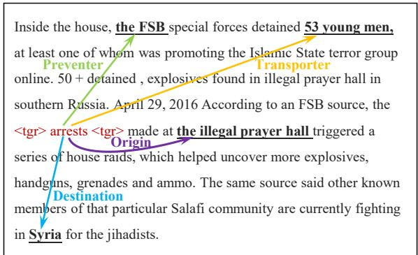  
Figure 1: An illustration of document-level EAE task. Special tokens <tgr> incorporate trigger words. Arguments are denoted by underlined words, and roles are denoted by arcs.

Retrieval-augmented methods have recently been successfully applied to many NLP tasks, e.g., dialogue response generation (Weston et al., 2018; Wu et al., 2019; Cai et al., 2019a,b), machine translation (Zhang et al., 2018; Xu et al., 2020; He et al., 2021) and information extraction (Lee et al., 2022; Zhang et al., 2022; Chen et al., 2022). These methods retrieve additional knowledge from various corpora to augment text generation, which allows models to (a) explicitly acquire prior external knowledge in a non-parametric manner, leading to great flexibility. (b) regard the retrieved reference instances as cues to generate text and learn by analogy. These retrieval-augmented methods use similarity-based retrieval, which is based on a simple hypothesis (Li et al., 2022): the more x<sub>r</sub> (retrieved demonstration) resembles x (original input), the more likely y<sub>r</sub> (demonstration label) resembles y (input label), so it will help the generation.

This hypothesis is intuitive: similar input results in similar output for most tasks (Khandelwal et al.,

2020, 2021). For example, in language modeling, Dickens is the author of and Dickens wrote will have essentially the same distribution over the next word. However, in document-level EAE, ${ \bf x } _ { r }$ resembles x cannot guarantee the equivalent distribution of ${ \bf y } _ { r }$ and $\mathbf { y }$ in label space. In a document, only a few words are event arguments, while other distracting context can mislead similarity-based retrieval and cause demonstration label ${ \bf y } _ { r }$ deviate from input label y. Furthermore, document-level EAE should predict not only the argument entity but also the correspondence between arguments and roles, which makes it challenging to find a demonstration with an identical event label to the original input. According to our statistics on RAMS dataset (Ebner et al., 2020), only 16.51% of instances can recall a sample with the same event schema through similarity-based retrieval.

This raises an interesting question: since document-level EAE doesn’t satisfy the hypothesis of similarity-based retrieval, how do we design the retrieval strategy for document-level EAE? In this paper, we explore various retrieval settings. First, if similar documents cannot guarantee the same distribution of event labels, does it make sense to pursue $\mathbf { x } _ { r }$ to be similar to x in retrieval process? To answer this, we first retrieve $\mathbf { x } _ { r } ,$ close to x in input space, as discrete demonstration to keep contextual semantic consistency (Setting 1); Then, since the essence of the above hypothesis is to pursue ${ \bf y } _ { r }$ resembles y, why don’t we directly retrieve ${ \bf y } _ { r }$ similar with y as the reference? So we recall ${ \bf y } _ { r }$ , close to y in label space, as discrete demonstration to alleviate the difficulty of learning the complex event pattern of y (Setting 2); To find depth cues to guide the model, we want a demonstration that has equal distribution with input document in both input and label space. Intuitively, it is impossible to retrieve the ideal demonstration in discrete space, so we try to sample a cluster of pseudo demonstrations in continuous space instead. Recent works (Wei et al., 2020) have shown that the vectors in an adjacency region can easily cover adequate alternatives of the same meaning. Inspired by this intriguing observation, we sample pseudo demonstrations from the intersection of the adjacent regions of x and y, thus preserving both context and event schema consistency with the input (Setting 3).

We present a systematic evaluation for analyzing various retrieval settings and observe that given a document, (1) context-consistency retrieval (Setting 1) helps the model identify the argument span more accurately than Setting 2. This suggests that in-distribution demonstration contexts can contribute to performance gains by improving the ability to recognize argument spans; (2) schema-consistency retrieval (Setting 2) makes the generated role labels more accurate than Setting 1, which indicates that conditioning on the label space contributes to better performance by alleviating the difficulty of learning the complex event pattern; and (3) adaptive hybrid retrieval (Setting 3) has achieved state-of-the-art (SOTA) performance among all generation-based baselines, indicating that this setting can generate diverse and faithful pseudo demonstrations with consistency in both input space and label space.

Overall, the contributions can be summarized as follows:

• We are the first to explore how to design the retrieval strategy for document-level EAE from the input and label distribution views. And our introduced retrieval strategies can recall demonstrations that can be helpful to demonstrate how the model should solve the task.

• We further propose a novel adaptive hybrid retrieval augmentation paradigm that adaptively samples pseudo demonstrations from continuous space for each training instance to improve the analogical capability of the model.

• Through extensive experiments on RAMS and WikiEvents, we demonstrate the validity of our newly introduced retrieval-augmented methods. We also conducted additional analytical experiments to discuss the reasons why different settings affect performance.

## 2 Methodology

Problem Definition. We formulate documentlevel EAE in the manner of Ebner et al. (2020): given a document $\mathbf { x } = \{ w _ { 1 } , w _ { 2 } , . . . , w _ { | \mathbf { x } | } \}$ , it contains a set of described events . Each event $e \in { \mathcal { E } }$ has its event type t and designated by a trigger (a text span in x). Each event type t specifies a role set $\mathcal { R } _ { t }$ . The event schema e is made up of event type and its associated role set. The task aims to extract all $( a , r )$ pairs for each $e \in { \mathcal { E } }$ , where $a \in \mathbf { x }$ is an argument—a text span in x and $r \in \mathcal { R } _ { t }$ is the role that a takes.

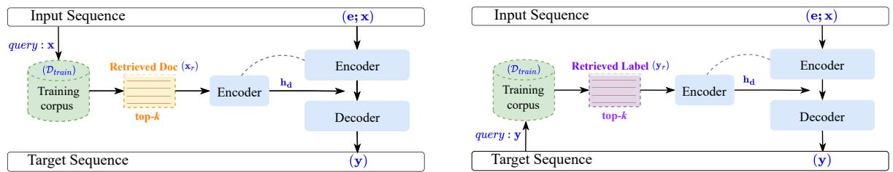  
(a) Context-Consistency Retrieval-Augmented DocEAE  
(b) Schema-Consistency Retrieval-Augmented DocEAE

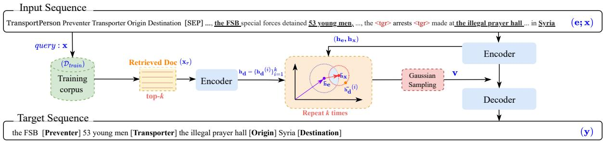  
(c) Adaptive Hybrid Retrieval-Augmented DocEAE  
Figure 2: An illustration of our proposed three retrieval-augmented methods. Sub-figures (a), (b), and (c) refer to the three retrieval-augmented methods, respectively. $\mathbf { x } _ { r }$ denotes the retrieved document, while $\mathbf { y } _ { r }$ means the retrieved event label. $\mathbf { h _ { d } }$ is the representation of the retrieved k discrete demonstrations, v is the sampled k pseudo demonstrations. The gray dashed lines in (a) and (b) denote that two encoders share parameters, as does (c).

For retrieval-augmented document-level EAE, we first retrieve the top-k potentially helpful demonstrations (discrete or continuous), then fuse them into the decoder to generate role records (a sequence of $( a , r )$ pairs). In the following, we first introduce how to reformulate document-level EAE as Retrieval-Augmented Generation (RAG), then describe various retrieval settings.

## 2.1 Basic RAG Architecture

We adopt the T5 model (Raffel et al., 2022), an encoder-decoder pre-trained model, as a backbone. The encoder-decoder LM models the conditional probability of selecting a new token $\mathbf { y } ^ { ( i ) }$ given the previous tokens $\mathbf { y } ^ { ( < i ) }$ and the encoder input [e; x] during the generation process. As a result, the total probability $p ( \mathbf { y } | \mathbf { x } , \mathbf { e } )$ of generating the output y given the input [e; x] is calculated as:

$$
p ( \mathbf { y } | \mathbf { x } , \mathbf { e } ) = \prod _ { i = 1 } ^ { | \mathbf { y } | } p \left( \mathbf { y } ^ { ( i ) } | \mathbf { y } ^ { ( < i ) } , \mathbf { x } , \mathbf { e } \right) ,\tag{1}
$$

where the input sequence is the concatenation of the document context and its event schema, constructed as <s> event schema [SEP] document context ${ < } / s { > }$ . The output y is the role record, presenting by the concatenation of each argument and its event role, i.e., $< s > a r g _ { 1 } r o l e _ { 1 } . . . a r g _ { n } r o l e _ { n } < / s > .$

In this paper, we decompose the modeling of $p ( \mathbf { y } \vert \mathbf { x } , \mathbf { e } )$ into two steps: retrieval and prediction. Given a query document x, we first retrieve top-k potentially helpful demonstrations d from training corpus $\mathcal { D } _ { \mathrm { t r a i n } }$ . We model this as sampling from a distribution $p ( \mathbf { d } | \mathbf { x } )$ . Then we use siamese network structures to obtain meaningful embeddings for input sequence [e; x] and demonstration d:

$$
\begin{array} { c } { \mathbf { h _ { e } , h _ { x } } = \mathrm { T } 5 \mathrm { - E n c o d e r } ( \mathrm { [ \mathbf { e } ; \mathbf { x } ] } ) , } \\ { \mathbf { h _ { d } } = \mathrm { T } 5 \mathrm { - E n c o d e r } ( \mathbf { d } ) . } \end{array}\tag{2}
$$

Then, we condition on both the retrieved d and the original input $[ \mathbf { e } ; \mathbf { x } ]$ to generate the output y—modeled as $p ( \mathbf { y } \vert \mathbf { d } , \mathbf { x } , \mathbf { e } )$ Specifically, we integrate k demonstration embeddings $\mathbf { h _ { d } } =$ $\{ \mathbf { h _ { d } } ^ { ( 1 ) } , \mathbf { \bar { h } _ { d } } ^ { ( 2 ) } , . . . , \mathbf { h _ { d } } ^ { ( k ) } \}$ into cross-attention module in all decoder layers by concatenating them to the encoder outputs and feed them all to decoder:

$$
\mathbf { y } = \mathrm { T 5 } \mathrm { - D e c o d e r } ( \mathrm { < b o s > } ; [ \mathbf { h _ { d } } ; \mathbf { h _ { e } } ; \mathbf { h _ { x } } ] ) ,\tag{3}
$$

where <bos> is the beginning token of decoder, $[ \mathbf { h _ { d } } ; \mathbf { h _ { e } } ; \mathbf { h _ { x } } ]$ denotes the encoder outputs we constructed for decoder input. In Setting 3, we use $\left[ \mathbf { v } ; \mathbf { h _ { e } } ; \mathbf { h _ { x } } \right]$ instead.

To obtain the overall likelihood of generating y, we treat d as a latent variable, yielding:

$$
\begin{array} { r } { p ( \mathbf { y } \vert \mathbf { x } , \mathbf { e } ) = p ( \mathbf { y } \vert \mathbf { d } , \mathbf { x } , \mathbf { e } ) p ( \mathbf { d } \vert \mathbf { x } ) . } \end{array}\tag{4}
$$

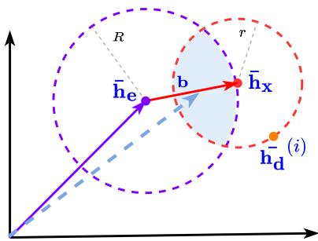  
Figure 3: The geometric diagram of the proposed Gaussian sampling. $\bar { \mathbf { h } } _ { \mathbf { e } } , \bar { \mathbf { h } } _ { \mathbf { x } }$ $\bar { \mathbf { h _ { d } ^ { \overline { { \mathbf { h } } } } } } ^ { ( i ) }$ are the representations of the event schema, the document and the i-th discrete demonstrations, $\bar { \mathbf { h } } _ { \mathbf { e } } = \mathrm { m e a n - p o o l i n g } ( \mathbf { h } _ { \mathbf { e } } ) , \bar { \mathbf { h } } _ { \mathbf { x } } =$ mean-pooling $( \mathbf { h } _ { \mathbf { x } } ) , \bar { \mathbf { h } _ { \mathbf { d } } } ^ { ( i ) } = \mathrm { m e a n } \mathbf { - } \mathrm { p o o l i n g } ( \mathbf { h } _ { \mathbf { d } } ^ { ( i ) } )$ . To sample pseudo demonstrations from event semantic region (the light blue intersection), we formalize $\mathbf { v } ^ { ( i ) } = \bar { \mathbf { h } } _ { \mathbf { e } } + \boldsymbol \omega ^ { ( \bar { i } ) } \odot$ b (i.e., the blue dashed arrow) as a pseudo demonstration, in which the bias vector $\mathbf { b } = \bar { \mathbf { h } } _ { \mathbf { x } } - \bar { \mathbf { h } } _ { \mathbf { e } } ,$ , scale vector $\omega ^ { ( i ) } \in ( 1 - r ^ { ( i ) } / R , 1 )$ , $r ^ { ( i ) } = \lvert \lvert \bar { \mathbf { h } } _ { \mathbf { x } } - \bar { \mathbf { h } _ { \mathbf { d } } } ^ { ( i ) } \rvert \rvert , R = \lvert \lvert \bar { \mathbf { h } } _ { \mathbf { x } } - \bar { \mathbf { h } } _ { \mathbf { e } } \rvert \rvert$

## 2.2 Demonstration Retrieval Design

The main challenge of demonstration retrieval is to design an appropriate retrieval strategy to recall demonstrations that can be helpful to demonstrate how the model should solve the task. In this part, we explore various retrieval settings. As shown in Figure 2, we categorize the retrieval setting into three categories: (1) Context-Consistency Retrieval; (2) Schema-Consistency Retrieval; and (3) Adaptive Hybrid Retrieval. The goal of all retrieval settings in this part is to find k demonstrations (whether discrete or continuous).

## Setting 1: Context-Consistency Retrieval

Since similar documents cannot guarantee the same distribution of event labels, Setting 1 aims to answer whether it makes sense to pursue ${ \bf x } _ { r }$ to be similar to x in the retrieval process. Given a query document x, we retrieve the instance document $\mathbf { x } _ { r }$ from the training corpus $\mathcal { D } _ { \mathrm { t r a i n } }$ that is the top-k relevant to the original input document, as discrete demonstrations d. For retrieval, we use S-BERT (Reimers and Gurevych, 2019) to retrieve semantically similar documents ${ \bf x } _ { r } \in \mathcal { D } _ { \mathrm { t r a i n } }$

## Setting 2: Schema-Consistency Retrieval

To explore whether conditioning on the label space contributes to performance gains, Setting 2 satisfies event schema consistency and aims to alleviate the difficulty of learning the complex event pattern of y. Given the event label y of input as query, we retrieve (also via S-BERT) the instance label ${ \bf y } _ { r }$ that is the top-k relevant to the input label from the training corpus $\mathcal { D } _ { \mathrm { t r a i n } }$ . During the inference, the query is the event schema e of test sample.

```latex
Algorithm 1: Gaussian Sampling
Input: The embeddings of schema, document and
discrete demonstrations, i.e. $\bar { \mathbf { h } } _ { \mathbf { e } } , \bar { \mathbf { h } } _ { \mathbf { x } }$ and
$\bar { \mathbf { h _ { d } } } = \{ \bar { \mathbf { h _ { d } } } ^ { ( 1 ) } , \bar { \mathbf { h _ { d } } } ^ { ( 2 ) } , . . . , \bar { \mathbf { h _ { d } } } ^ { ( k ) } \}$
Output: A set of pseudo demonstrations
$\mathbf { v } = \{ \mathbf { v } ^ { ( \mathrm { 1 } ) } , \mathbf { v } ^ { ( 2 ) } , . . . , \mathbf { v } ^ { ( k ) } \}$
1 Normalizing the importance of each element in
$\begin{array} { r } { \mathbf { b } = \bar { \mathbf { h } } _ { \mathbf { x } } - \bar { \mathbf { h } } _ { \mathbf { e } } \colon \mathcal { W } _ { r } = \frac { | \mathbf { b } | - \operatorname* { m i n } ( | \mathbf { b } | ) } { \operatorname* { m a x } ( | \mathbf { b } | ) - \operatorname* { m i n } ( | \mathbf { b } | ) } } \end{array}$
2 Initialize $i \gets 0$
3 while $i \le ( k - 1 )$ do
4 $i \gets i + 1$
5 $r ^ { ( i ) } = | | \bar { \mathbf { h } } _ { \mathbf { x } } - \bar { \mathbf { h } _ { \mathbf { d } } } ^ { ( i ) } | | , R = | | \bar { \mathbf { h } } _ { \mathbf { x } } - \bar { \mathbf { h } } _ { \mathbf { e } } | |$
6 Use reparametrizetion to calculate the current
scale vector:
$\begin{array} { r } { \omega ^ { ( i ) } \sim \mathcal { N } \left( \frac { 1 - r ^ { ( i ) } / R + 1 } { 2 } , \mathrm { d i a g } \left( \mathcal { W } _ { r } ^ { 2 } \right) \right) } \end{array}$
7 First sample a noise variable - from $\hat { \mathcal { N } } ( 0 , 1 )$
8 Then transform it to $\boldsymbol \omega ^ { ( i ) } = \boldsymbol \mu + \boldsymbol \epsilon \cdot \boldsymbol \sigma ,$ where
$\begin{array} { r } { \mu = 1 - \frac { r ^ { ( i ) } / R } { 2 } , \sigma = \mathcal { W } _ { r } . } \end{array}$
9 Calculate the current sample:
$\mathbf { v } ^ { ( i ) } = \bar { \mathbf { h } } _ { \mathbf { e } , \ast } \boldsymbol { \omega } ^ { ( i ) } \odot \mathsf { l }$ b
10 $\mathbf { v }  \mathbf { v } \cup \mathbf { v } ^ { ( i ) }$
11 end
```

## Setting 3: Adaptive Hybrid Retrieval

To find the ideal demonstration that has equal distribution with input document in both input and label space to guide the model, we propose a novel adaptive hybrid retrieval strategy to sample pseudo demonstrations from continuous space as depth cues to improve the analogical capability of model.

Given an instance document x, we first retrieve top-k helpful documents from the training corpus $\mathcal { D } _ { \mathrm { t r a i n } }$ . Conditioning on retrieved k discrete demonstrations, we adaptively determine k event semantic regions in continuous space for each training instance. Then we sample k pseudo demonstrations from k event semantic regions.

Event Semantic Region. We treat points in the event semantic region as the critical states of eventsemantic equivalence. Specifically, in order to consider both context and event schema consistency, we first determine the adjacent region of document and event schema by setting their adjacent radii (the orange circle and purple circle in Figure 3). Furthermore, we define the intersection of their adjacent regions as an event semantic region $\boldsymbol { \mathscr { \Lambda } } ( \bar { \bf h } _ { \bf e } , \bar { \bf h } _ { \bf x } )$ (the light blue region in Figure 3), which describes accurate alternatives in consistency with original context and event semantic meaning. Here we have k discrete demonstration embeddings $\bar { \mathbf { h _ { d } } }$ for k adjacent radii r, which determines k event semantic regions. For each event semantic region, we perform the following Gaussian sampling.

Gaussian Sampling. To obtain diverse and faithful pseudo demonstrations from the event semantic region for the training instance x, we apply a Gaussian sampling strategy k times to sample a cluster of vectors from k event semantic regions.

As shown in Figure 3, we first use scale vector $\boldsymbol { \omega } ^ { ( i ) }$ to transform the bias vector b $= \bar { \mathbf { h } } _ { \mathbf { x } } - \bar { \mathbf { h } } _ { \mathbf { e } }$ as $\boldsymbol { \omega } ^ { ( i ) } \odot \mathbf { b }$ , where is the element-wise product operation. Then, we construct a novel sample $\hat { \mathbf { v } ( i ) } = \bar { \mathbf { h } } _ { \mathbf { e } } + \omega ^ { ( i ) }$ b as a pseudo demonstration. As a result, the goal of the sampling strategy turns into finding a set of scale vectors, i.e. $\boldsymbol { \omega } = \{ \omega ^ { ( 1 ) } , \omega ^ { ( 2 ) } , . . . , \bar { \omega } ^ { ( k ) } \}$ . Intuitively, we can assume that $\boldsymbol { \omega } ^ { ( i ) }$ follows a distribution with Gaussian forms, formally:

$$
\omega ^ { ( i ) } \sim \mathcal { N } \left( \frac { 1 - r ^ { ( i ) } / R + 1 } { 2 } , \mathrm { d i a g } \left( \mathcal { W } _ { r } ^ { 2 } \right) \right) ,\tag{5}
$$

where $\begin{array} { r } { \mathcal { W } _ { r } = \frac { | \mathbf { b } | - \operatorname* { m i n } ( | \mathbf { b } | ) } { \operatorname* { m a x } ( | \mathbf { b } | ) - \operatorname* { m i n } ( | \mathbf { b } | ) } } \end{array}$ normalizes the importance of each dimension in b, the operation $| \cdot |$ takes the absolute value of each element in vector, which indicates the larger the value is, the more informative it is. $\textstyle \mu = { \frac { 1 - r ^ { ( i ) } / R + 1 } { 2 } }$ constrains the sampling range to event semantic region.

Since sampling is a non-differentiable operation that truncates the gradient, here we use a reparametrization trick to construct $\mathcal { N } ( 1 ~ -$ $\frac { r ^ { ( i ) } / R } { 2 } , \mathrm { d i a g } ( \mathcal { W } _ { r } ^ { 2 } ) )$ . We first sample a noise variable - from standard normal distribution $\mathcal { N } ( 0 , 1 )$ Then, instead of writing $\boldsymbol { \omega } ^ { ( i ) } \sim \mathcal { N } ( \mu , \sigma ^ { 2 } )$

$$
\boldsymbol \omega ^ { ( i ) } = \boldsymbol \mu + \boldsymbol \epsilon \cdot \boldsymbol \sigma ,\tag{6}
$$

$$
\begin{array} { r } { \mathrm { w h e r e } \epsilon \sim \mathcal N ( 0 , 1 ) , \mu = 1 - \frac { r ^ { ( i ) } / R } { 2 } , \sigma = \mathcal W _ { r } . } \end{array}
$$

Now the gradient is inside the expectation. We finally sample k pseudo demonstrations v from k event semantic regions to augment the text generation, that is $\mathbf { v } = \{ \mathbf { v } ^ { ( 1 ) } , \mathbf { v } ^ { ( 2 ) } , . . . , \mathbf { v } ^ { ( k ) } \}$ , where $\mathbf { v } ^ { ( i ) } \sim \mathcal { \perp } ( \bar { \mathbf { h } } _ { \mathbf { e } } , \bar { \mathbf { h } } _ { \mathbf { x } } )$ . k is the hyperparameter of the number of sampled vectors, which is determined by the number of discrete demonstrations. For a clearer presentation, Algorithm 1 summarizes the sampling process.

Algorithm 2: Decoding the output   
Input: role record   
y : <s> arg role<sub>1</sub>... arg role<sub>n</sub> </s>.   
Output: (arg, role) pairs.   
1 Initialize arg list [ ]   
2 for $\mathbf { y } ^ { i } \in \mathbf { y }$ do   
3 /\* Here consider multi-event scenario,   
separated by [SEP] \*/   
4 if $\mathbf { y } ^ { i } \neq [ \mathsf { S E P } ]$ then   
5 if $\mathbf { y } ^ { i } \notin$ role list then   
6 append y<sup>i</sup> to arg list   
7 else   
8 role $ \mathbf { y } ^ { i }$   
9 argument  arg list   
10 get a (arg, role) pair   
11 arg list  [ ]   
12 end   
13 else   
14 event index event index + 1   
15 arg list  [ ]   
16 end   
17 end

## 2.3 Training and Inference

The trainable parameters of the model are only the encoder-decoder LM, which is denoted as θ. Given a training dataset $\begin{array} { r l } { \mathcal { D } _ { \mathrm { t r a i n } } } & { { } = } \end{array}$ $\left\{ \left( \mathbf { x } _ { 1 } , \mathbf { y } _ { 1 } \right) , . . . , \left( \mathbf { x } _ { | \mathcal { D } _ { \mathrm { t r a i n } } | } , \mathbf { y } _ { | \mathcal { D } _ { \mathrm { t r a i n } } | } \right) \right\}$ , where each instance is a (document, role records) pair, the learning objective is a negative log-likelihood function:

$$
\mathcal { L } = - \sum _ { ( \mathbf { x } , \mathbf { y } ) \in \mathcal { D } _ { \operatorname { t r a i n } } } \log p ( \mathbf { y } | \mathbf { x } , \mathbf { d } , \mathbf { e } , \theta ) .\tag{7}
$$

After generating role records, we need to decode it back into (argument, role) pairs to calculate specific evaluation metrics. The detailed decoding process is in Algorithm 2.

## 3 Experiments

We evaluate our model’s performance on two commonly used document-level EAE benchmarks and compare it to prior works. Then we conduct additional analytical experiments on how the demonstration retrieval design affects performance.

## 3.1 Experimental Setup

Datasets. We conduct our experiments on two widely used document-level EAE datasets: RAMS (Ebner et al., 2020) and WikiEvents (Li et al., 2021). RAMS provides 9,124 annotated examples from news based on 139 event types and 65 roles. WikiEvents provides 246 annotated documents based on 50 event types and 59 roles.

<table><tr><td rowspan="2">Models</td><td colspan="2">RAMS</td><td colspan="3">WikiEvents</td><td rowspan="2">PLM</td></tr><tr><td>Arg-I</td><td>Arg-C</td><td>Arg-I</td><td>Arg-C</td><td>Head-C</td></tr><tr><td colspan="7">Multi-label classification-based Models</td></tr><tr><td>BERT-CRF (Shi and Lin, 2019)*</td><td></td><td>40.3</td><td></td><td>32.3</td><td>43.3</td><td>BERT-base</td></tr><tr><td>PAIE (Ma et al., 2022)*</td><td>54.7</td><td>49.5</td><td>68.9</td><td>63.4</td><td>66.5</td><td>BART-base</td></tr><tr><td></td><td>56.8 QA-based Models</td><td>52.2</td><td>70.5</td><td>65.3</td><td>68.4</td><td>BART-large</td></tr><tr><td colspan="7"></td></tr><tr><td>EEQA (Du and Cardie, 2020)*</td><td>46.4</td><td>44.0</td><td>54.3</td><td>53.2</td><td>56.9</td><td>BERT-base</td></tr><tr><td>DocMRC (Liu et al., 2021)*</td><td>48.7</td><td>46.7</td><td>56.9</td><td>54.5</td><td>59.3</td><td>BERT-large</td></tr><tr><td></td><td></td><td>45.7</td><td></td><td>43.3</td><td></td><td>BERT-base</td></tr><tr><td colspan="7">Generation-based Models</td></tr><tr><td>BART-Gen (Li et al., 2021)*</td><td>50.9</td><td>44.9</td><td>47.5</td><td>41.7</td><td>44.2</td><td>BART-base</td></tr><tr><td></td><td>51.2</td><td>47.1</td><td>66.8</td><td>62.4</td><td>65.4</td><td>BART-large</td></tr><tr><td>T5-baseline‡</td><td>45.1</td><td>37.3</td><td>44.8</td><td>39.1</td><td>39.3</td><td>T5-base</td></tr><tr><td></td><td>45.9</td><td>40.3</td><td>62.7</td><td>41.0</td><td>53.7</td><td>T5-large</td></tr><tr><td colspan="7">Our Models using Retrieval-augmented Generation</td></tr><tr><td>Setting 1: Context-Consistency Retrieval</td><td>52.2</td><td>44.9</td><td>59.8</td><td>40.4</td><td>58.7</td><td>T5-base</td></tr><tr><td>Setting 2: Schema-Consistency Retrieval</td><td>53.9</td><td>47.9</td><td>66.8</td><td>50.9</td><td>63.4</td><td>T5-large</td></tr><tr><td rowspan="2"></td><td>45.9</td><td>38.6</td><td>53.4</td><td>39.7</td><td>43.0</td><td>T5-base</td></tr><tr><td>49.1</td><td>41.0</td><td>64.4</td><td>53.8</td><td>61.8</td><td>T5-large</td></tr><tr><td rowspan="2">Setting 3: Adaptive Hybrid Retrieval</td><td>53.3</td><td>46.3</td><td>61.4</td><td>46.1</td><td>62.5</td><td>T5-base</td></tr><tr><td>54.6</td><td>48.4</td><td>69.6</td><td>63.4</td><td>68.4</td><td>T5-large</td></tr></table>

Table 1: Experimental results on RAMS and WikiEvents. ∗ means the results from (Ma et al., 2022), and ‡ denotes the results from our implemented models for a fairer comparison. We highlight the SOTA results (classification based method) with underlines. The best results among generation-based methods are marked in bold font.

Evaluation Metrics. Our results are reported as F-1 score of argument identification (Arg-I) and argument classification (Arg-C). For WikiEvents dataset, we follow Li et al. (2021) to additionally evaluate argument head F1 score (Head-C).

• Arg-I: an event argument is correctly identified if its offsets match those of any of the argument mentions.

• Arg-C: an event argument is correctly classified if its offset and role type both match the ground truth.

• Head-C: only considers the matching of the headword of an argument.

For the predicted argument, we find the nearest matched string to the golden trigger as the predicted offset. As an event type often includes multiple roles, we use micro-averaged role-level scores as the final metric.

Baselines. For strictly consistent comparison, we divide several state-of-the-art models into three categories: (1) Multi-label classification-based model:

BERT-CRF (Shi and Lin, 2019), PAIE (Ma et al., 2022); (2) QA-based model: EEQA (Du and Cardie, 2020) and DocMRC (Liu et al., 2021); and (3) Generation-based model: BART-Gen (Li et al., 2021) and T5-baseline. T5-baseline is our own baseline without the retrieval component: directly encodes input context to generate role records.

Experimental Settings. We initialize our models with the pre-trained T5 model, available in the HuggingFace Transformers library<sup>1</sup>. We consider two model sizes, base and large, containing respectively 220M and 770M parameters. We fine-tune the models on each dataset independently using AdamW (Loshchilov and Hutter, 2019) and conducted experiments on 4 NVIDIA-V100-32GB. Due to GPU memory limitation, we used different batch sizes for different models: 8 for T5-large and 16 for T5- base; In each experiment, we train the model with 5 fixed seeds (42, 66, 88, 99, 101) and 4 learning rates (2e-5, 3e-5, 4e-5, 5e-5), and vote for the best learning rate for each seed with the best dev-set Arg-C performance. We report the averaged Arg-

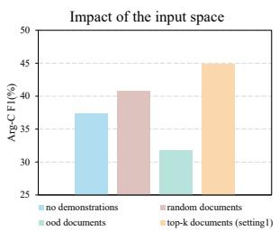  
(a) RAMS

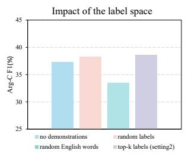  
(b) RAMS

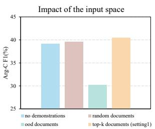  
(c) WikiEvents

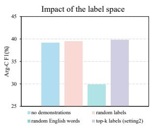  
(d) WikiEvents  
Figure 4: Impact of the input space and label space. Evaluated by Arg-C F1. More discussion is in Section 3.3.

C performance on the test set for selected checkpoints. We list other important hyperparameters in Appendix A.3.

## 3.2 Main Results

Table 1 presents the performance of all baselines and our models on RAMS and WikiEvents. From the results, we can conclude that:

(1) By retrieving reference demonstrations to augment text generation, our retrieval-augmented models can significantly outperform generationbased models. Our Setting 3 improves Arg-C F1 by 1.6%\~10.6% and 17.9%\~54.6% over the SOTA generation baseline BART-Gen and vanilla T5 on both datasets. Compared with sequence generation BART-Gen, our models do not require manually constructing the event template and can directly generate informative role records rather than irrelevant information. This verifies that the retrieval augmentation paradigm can improve the performance of generative document-level EAE.

(2) By reformulating document-level EAE as retrieval-augmented generation, our models can achieve competitive performance without manually designing specific questions. Our methods surpass most of the QA-based and classificationbased baselines and achieve competitive performance with SOTA. Furthermore, compared to the QA-based models, our Setting 3 also demonstrates superior performance (up to 2.3 Arg-C F1 gains on RAMS), which reveals that retrieving demonstrations as cues works better than asking questions.

(3) By generating pseudo-demonstrations in continuous space as depth cues to guide the model, our Setting 3 inspires the analogical capability of the model more than Setting 1 and 2. As in Table 1, continuous augmentation (Setting 3) significantly outperform the discrete augmentation methods (Setting 1 and 2) on both datasets, whether in base-model or large-model (1.3%\~16.1% for Arg-

<table><tr><td rowspan="2">Models</td><td colspan="2">RAMS</td></tr><tr><td>Arg-span acc</td><td>Arg-role acc</td></tr><tr><td>T5-baseline</td><td>45.5</td><td>45.6</td></tr><tr><td>Setting 1: Context-Consistency Retrieval</td><td>53.1</td><td>45.2</td></tr><tr><td>Setting 2: Schema-Consistency Retrieval</td><td>42.3</td><td>51.8</td></tr><tr><td>Setting 3: Adaptive Hybrid Retrieval</td><td>52.3</td><td>50.9</td></tr></table>

Table 2: Argument span/role prediction accuracy on RAMS.

I F1, 1.0%\~24.6% for Arg-C F1). These results demonstrate the stronger ability of adaptive hybrid augmentations than traditional augmentations for generalizing event-semantic-preserved demonstrations. And event semantic regions can generate diverse and faithful pseudo demonstrations to effectively improve the analogical capability of document-level EAE model.

## 3.3 Analysis

Impact of the input space. To explore the reason why context-consistency affects performance, we additionally experiment with two variants of the document (random documents and out-ofdistribution documents) on RAMS and WikiEvents. Specifically, “random documents” means that we randomly choose a set of k documents from their own training set as the demonstrations. “Out-ofdistribution documents” means that we randomly choose a set of k documents from each other’s training set as the demonstrations. Figure 4 shows that using out-of-distribution documents as references significantly drops the performance, and using random documents is better than no demonstrations. Setting 1 improves Arg-C F1 by about 6.0% and 11.8% over the “random documents” and no demonstrations. This is likely because using the in-distribution text as the context makes the task closer to language modeling since the LM always conditions on the in-distribution text during training. Furthermore, using in-distribution with similar text as context can further improve performance.

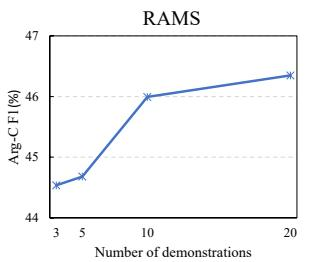

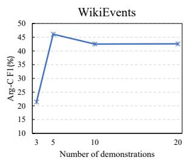  
Figure 5: Performance of Setting 3 on both datasets as a function of the number of demonstrations.

Impact of the label space. To explore the reason why schema consistency affects performance, we experiment with two variants of Setting 2 (random labels and random English words) on RAMS and WikiEvents. Specifically, “random labels” means that we randomly choose a set of k labels from their own training set as the demonstrations. “Random English words” means that we randomly choose a set of English words from https://pypi.org/ project/english-words/ (consists of 61,569 words) as the demonstrations. From Figure 4 we can see that the performance gap between using random/top-k labels (within the label space) and using random English words is significant. Setting 2 improves Arg-C F1 by about 0.65% and 2.5% over “random labels” and no demonstrations. This indicates that conditioning on the label space can alleviate the difficulty of learning the complex event pattern, which is why performance improves.

Argument span prediction accuracy. Argument span prediction accuracy in Table 2 illustrates the Arg-I precision of both datasets. As expected, Setting 1 identifies the argument span more accurately than Setting 2, and the gap in prediction accuracy is as large as 25.5%. This indicates that in-distribution demonstration contexts can improve the ability to recognize argument spans and contribute to performance gains.

Argument role prediction accuracy. We also evaluate the capability to generate golden argument role in target sequence. From Table 2 we can see that Setting 2 generates role labels more accurately than Setting 1, and the gap in prediction accuracy is 14.6%. This suggests that schema-consistency retrieval alleviates the difficulty of learning the complex event pattern, and conditioning on the label space contributes to better performance.

Impact of the number of demonstrations k. Figure 5 illustrates how the hyper-parameters k affect the extraction performance. We observe that gradually increasing the number of demonstrations significantly improves Arg-C F1 in RAMS, but not in WikiEvents. We conjecture that the reason is that the averaged context length (about 900 words) in WikiEvents is too long, which affects the original input representation in the cross-attention module.

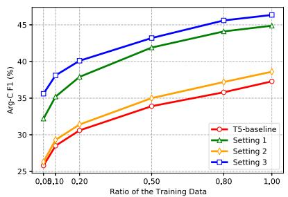  
(a) RAMS

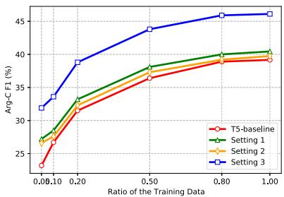  
(b) WikiEvents  
Figure 6: Arg-C F1 scores with different training data ratios on both benchmarks.

## 3.4 Few-shot Setting

To conduct detailed comparisons between different augmentation methods, we asymptotically increase the training data to analyze the performance of them on both datasets. Figure 6 shows the performance of them and T5-baseline with partial training samples. It demonstrates our approach achieves comparable performance with the T5- baseline model with only \~20% of training data, which indicates that our approach has great potential to achieve good results with very few data.

## 4 Related Work

Document-level Event Argument Extraction The goal of document-level EAE is to extract arguments from the whole document and assign them to right roles. On the task level, most of these works fall into three categories: (1) multi-label classification-based models (2) QA-based models (3) generation-based models. Specifically, Zhang et al. (2020); Xu et al. (2021); Huang and Jia (2021); Ren et al. (2022); Ma et al. (2022); Xu et al.

(2022) first identified argument spans and then fill each with a specific role via multi-label classification; Du and Cardie (2020); Liu et al. (2021); Wei et al. (2021) formulated document-level EAE as an question answering (QA) or machine reading comprehension (MRC) problem; Li et al. (2021) designed specific templates for each event type and frames EAE as conditional generation. Above methods conduct experiments on WikiEvents (Li et al., 2021), RAMS (Ebner et al., 2020), and Chinese financial dataset (Zheng et al., 2019).

Retrieval-Augmented Text Generation RAG has recently been successfully applied to many NLP tasks, e.g., dialogue response generation, machine translation, and information extraction. These methods retrieve additional knowledge from various corpora to augment text generation, which includes three major components: the retrieval source, retrieval strategy, and integration methods. Meanwhile, leveraging additional knowledge as the augmentation signal is a natural way to resolve the information insufficiency issue for information extraction. For example, Lee et al. (2022) proposed two demonstration retrieval methods for named entity recognition. Zhang et al. (2021) used the open-domain knowledge in Wikipedia as retrieval source for distantly supervised relation extraction. Du and Ji (2022) applied S-BERT (Reimers and Gurevych, 2019) to retrieve the most relevant example for event extraction.

## 5 Conclusion

In this paper, we explore how to design retrievalaugmented strategy for document-level EAE from the input and label distribution views. And our introduced retrieval strategies can recall demonstrations that can be helpful to demonstrate how the model should solve the task. We further propose a novel adaptive hybrid retrieval augmentation paradigm to generate the reference vectors as depth cues to improve the analogical capability of model. Through extensive experiments on RAMS and WikiEvents datasets, we demonstrate the validity of our newly introduced retrieval-augmented models. In the future, we plan to adapt our method to other document-level extraction tasks, such as document-level relation extraction.

## Limitations

We discuss the limitations of our research as follows:

• Firstly, since the T5-large model has many parameters and our task is document level, one training process will occupy four NVIDIA V100 32GB GPUs;

• Our paper mainly studies document-level EAE task. Although we believe our approach is compatible with all document-level extraction tasks, how to adapt it to those tasks still remains an open question.

## Acknowledgements

This work is supported by the National Key Research and Development Program of China (NO.2022YFB3102200) and Strategic Priority Research Program of the Chinese Academy of Sciences with No. XDC02030400.

## References

Deng Cai, Yan Wang, Wei Bi, Zhaopeng Tu, Xiaojiang Liu, Wai Lam, and Shuming Shi. 2019a. Skeletonto-response: Dialogue generation guided by retrieval memory. In Proceedings ofthe 2019 Conference of the North American Chapter ofthe Associationfor Computational Linguistics: Human Language Technologies, Volume 1 (Long and Short Papers), pages 1219–1228, Minneapolis, Minnesota. Association for Computational Linguistics.

Deng Cai, Yan Wang, Wei Bi, Zhaopeng Tu, Xiaojiang Liu, and Shuming Shi. 2019b. Retrievalguided dialogue response generation via a matchingto-generation framework. In Proceedings of the 2019 Conference on Empirical Methods in Natural Language Processing and the 9th International Joint Conference on Natural Language Processing (EMNLP-IJCNLP), pages 1866–1875, Hong Kong, China. Association for Computational Linguistics.

Xiang Chen, Lei Li, Ningyu Zhang, Chuanqi Tan, Fei Huang, Luo Si, and Huajun Chen. 2022. Relation extraction as open-book examination: Retrievalenhanced prompt tuning. In Proceedings of the 45th International ACM SIGIR Conference on Research and Development in Information Retrieval, SIGIR ’22, page 2443–2448, New York, NY, USA. Association for Computing Machinery.

Xinya Du and Claire Cardie. 2020. Event extraction by answering (almost) natural questions. In Proceedings ofthe 2020 Conference on Empirical Methods in Natural Language Processing (EMNLP), pages 671–683, Online. Association for Computational Linguistics.

Xinya Du and Heng Ji. 2022. Retrieval-augmented generative question answering for event argument extraction. arXiv preprint arXiv:2211.07067.

Seth Ebner, Patrick Xia, Ryan Culkin, Kyle Rawlins, and Benjamin Van Durme. 2020. Multi-sentence argument linking. In Proceedings ofthe 58th Annual Meeting of the Association for Computational Linguistics, pages 8057–8077, Online. Association for Computational Linguistics.

Qiuxiang He, Guoping Huang, Qu Cui, Li Li, and Lemao Liu. 2021. Fast and accurate neural machine translation with translation memory. In Proceedings of the 59th Annual Meeting of the Association for Computational Linguistics and the 11th International Joint Conference on Natural Language Processing (Volume 1: Long Papers), pages 3170–3180, Online. Association for Computational Linguistics.

Yusheng Huang and Weijia Jia. 2021. Exploring sentence community for document-level event extraction. In Findings ofthe Associationfor Computational Linguistics: EMNLP 2021, pages 340–351, Punta Cana, Dominican Republic. Association for Computational Linguistics.

Urvashi Khandelwal, Angela Fan, Dan Jurafsky, Luke Zettlemoyer, and Mike Lewis. 2021. Nearest neighbor machine translation. In International Conference on Learning Representations.

Urvashi Khandelwal, Omer Levy, Dan Jurafsky, Luke Zettlemoyer, and Mike Lewis. 2020. Generalization through memorization: Nearest neighbor language models. In International Conference on Learning Representations.

Dong-Ho Lee, Akshen Kadakia, Kangmin Tan, Mahak Agarwal, Xinyu Feng, Takashi Shibuya, Ryosuke Mitani, Toshiyuki Sekiya, Jay Pujara, and Xiang Ren. 2022. Good examples make a faster learner: Simple demonstration-based learning for low-resource NER. In Proceedings of the 60th Annual Meeting of the Associationfor Computational Linguistics (Volume 1: Long Papers), pages 2687–2700, Dublin, Ireland. Association for Computational Linguistics.

Huayang Li, Yixuan Su, Deng Cai, Yan Wang, and Lemao Liu. 2022. A survey on retrieval-augmented text generation. arXiv preprint arXiv:2202.01110.

Sha Li, Heng Ji, and Jiawei Han. 2021. Document-level event argument extraction by conditional generation. In Proceedings of the 2021 Conference of the North American Chapter of the Association for Computational Linguistics: Human Language Technologies, pages 894–908, Online. Association for Computational Linguistics.

Jian Liu, Yufeng Chen, and Jinan Xu. 2021. Machine reading comprehension as data augmentation: A case study on implicit event argument extraction. In Proceedings of the 2021 Conference on Empirical Methods in Natural Language Processing, pages 2716– 2725, Online and Punta Cana, Dominican Republic. Association for Computational Linguistics.

Ilya Loshchilov and Frank Hutter. 2019. Decoupled weight decay regularization. In International Conference on Learning Representations.

Yubo Ma, Zehao Wang, Yixin Cao, Mukai Li, Meiqi Chen, Kun Wang, and Jing Shao. 2022. Prompt for extraction? PAIE: Prompting argument interaction for event argument extraction. In Proceedings of the 60th Annual Meeting ofthe Associationfor Computational Linguistics (Volume 1: Long Papers), pages 6759–6774, Dublin, Ireland. Association for Computational Linguistics.

Colin Raffel, Noam Shazeer, Adam Roberts, Katherine Lee, Sharan Narang, Michael Matena, Yanqi Zhou, Wei Li, and Peter J. Liu. 2022. Exploring the limits of transfer learning with a unified text-to-text transformer. J. Mach. Learn. Res., 21(1).

Nils Reimers and Iryna Gurevych. 2019. Sentence-BERT: Sentence embeddings using Siamese BERTnetworks. In Proceedings ofthe 2019 Conference on Empirical Methods in Natural Language Processing and the 9th International Joint Conference on Natural Language Processing (EMNLP-IJCNLP), pages 3982–3992, Hong Kong, China. Association for Computational Linguistics.

Yubing Ren, Yanan Cao, Fang Fang, Ping Guo, Zheng Lin, Wei Ma, and Yi Liu. 2022. CLIO: Roleinteractive multi-event head attention network for document-level event extraction. In Proceedings of the 29th International Conference on Computational Linguistics, pages 2504–2514, Gyeongju, Republic of Korea. International Committee on Computational Linguistics.

Peng Shi and Jimmy Lin. 2019. Simple bert models for relation extraction and semantic role labeling. arXiv preprint arXiv:1904.05255.

Kaiwen Wei, Xian Sun, Zequn Zhang, Jingyuan Zhang, Guo Zhi, and Li Jin. 2021. Trigger is not sufficient: Exploiting frame-aware knowledge for implicit event argument extraction. In Proceedings ofthe 59th Annual Meeting ofthe Associationfor Computational Linguistics and the 11th International Joint Conference on Natural Language Processing (Volume 1: Long Papers), pages 4672–4682, Online. Association for Computational Linguistics.

Xiangpeng Wei, Heng Yu, Yue Hu, Rongxiang Weng, Luxi Xing, and Weihua Luo. 2020. Uncertaintyaware semantic augmentation for neural machine translation. In Proceedings ofthe 2020 Conference on Empirical Methods in Natural Language Processing (EMNLP), pages 2724–2735, Online. Association for Computational Linguistics.

Jason Weston, Emily Dinan, and Alexander Miller. 2018. Retrieve and refine: Improved sequence generation models for dialogue. In Proceedings of the 2018 EMNLP Workshop SCAI: The 2nd International Workshop on Search-Oriented Conversational AI, pages 87–92, Brussels, Belgium. Association for Computational Linguistics.

Yu Wu, Furu Wei, Shaohan Huang, Yunli Wang, Zhoujun Li, and Ming Zhou. 2019. Response generation by context-aware prototype editing. Proceedings of the AAAI Conference on Artificial Intelligence, 33(01):7281–7288.

Jitao Xu, Josep Crego, and Jean Senellart. 2020. Boosting neural machine translation with similar translations. In Proceedings of the 58th Annual Meeting of the Association for Computational Linguistics, pages 1580–1590, Online. Association for Computational Linguistics.

Runxin Xu, Tianyu Liu, Lei Li, and Baobao Chang. 2021. Document-level event extraction via heterogeneous graph-based interaction model with a tracker. In Proceedings of the 59th Annual Meeting of the Association for Computational Linguistics and the 11th International Joint Conference on Natural Language Processing (Volume 1: Long Papers), pages 3533–3546, Online. Association for Computational Linguistics.

Runxin Xu, Peiyi Wang, Tianyu Liu, Shuang Zeng, Baobao Chang, and Zhifang Sui. 2022. A two-stream AMR-enhanced model for document-level event argument extraction. In Proceedings ofthe 2022 Conference of the North American Chapter of the Association for Computational Linguistics: Human Language Technologies, pages 5025–5036, Seattle, United States. Association for Computational Linguistics.

Jingyi Zhang, Masao Utiyama, Eiichro Sumita, Graham Neubig, and Satoshi Nakamura. 2018. Guiding neural machine translation with retrieved translation pieces. In Proceedings of the 2018 Conference of the North American Chapter ofthe Associationfor Computational Linguistics: Human Language Technologies, Volume 1 (Long Papers), pages 1325–1335, New Orleans, Louisiana. Association for Computational Linguistics.

Yue Zhang, Hongliang Fei, and Ping Li. 2021. Readsre: Retrieval-augmented distantly supervised relation extraction. In Proceedings of the 44th International ACM SIGIR Conference on Research and Development in Information Retrieval, SIGIR ’21, page 2257–2262, New York, NY, USA. Association for Computing Machinery.

Yue Zhang, Hongliang Fei, and Ping Li. 2022. End-toend distantly supervised information extraction with retrieval augmentation. In Proceedings ofthe 45th International ACM SIGIR Conference on Research and Development in Information Retrieval, SIGIR ’22, page 2449–2455, New York, NY, USA. Association for Computing Machinery.

Zhisong Zhang, Xiang Kong, Zhengzhong Liu, Xuezhe Ma, and Eduard Hovy. 2020. A two-step approach for implicit event argument detection. In Proceedings of the 58th Annual Meeting of the Association for Computational Linguistics, pages 7479–7485, Online. Association for Computational Linguistics.

Shun Zheng, Wei Cao, Wei Xu, and Jiang Bian. 2019. Doc2EDAG: An end-to-end document-level framework for Chinese financial event extraction. In Proceedings ofthe 2019 Conference on Empirical Methods in Natural Language Processing and the 9th International Joint Conference on Natural Language Processing (EMNLP-IJCNLP), pages 337–346, Hong Kong, China. Association for Computational Linguistics.

## A Dataset and Model

## A.1 Dataset Statistics

RAMS is a document-level dataset of 9,124 annotated events from news based on an ontology of 139 event types and 65 roles. Each sample is a 5-sentence document, with the trigger word indicating a pre-defined event type and its argument scattered throughout the whole document. WikiEvents is another document-level dataset, providing 246 annotated documents from English Wikipedia articles based on 50 event types and 59 roles. Table 3 presents their detailed statistics.

<table><tr><td>Dataset</td><td>#Split</td><td>#Doc</td><td>#Event</td><td>#Argument</td></tr><tr><td rowspan="3">RAMS</td><td>Train</td><td>3,194</td><td>7,329</td><td>17,026</td></tr><tr><td>Dev</td><td>399</td><td>924</td><td>2,188</td></tr><tr><td>Test</td><td>400</td><td>871</td><td>2,023</td></tr><tr><td rowspan="3">WikiEvents</td><td>Train</td><td>206</td><td>3,241</td><td>4,542</td></tr><tr><td>Dev</td><td>20</td><td>345</td><td>428</td></tr><tr><td>Test</td><td>20</td><td>365</td><td>566</td></tr></table>

Table 3: Statistics of RAMS and WikiEvents datasets.

## A.2 Details of Baselines

We compare our model with the following previous models.

• BERT-CRF (Shi and Lin, 2019): a multi-label classification-based method that uses a BERTbased BIO-styled sequence labeling model. We report the results from Liu et al. (2021).

• PAIE (Ma et al., 2022): another multi-label classification-based method that defines a new prompt tuning paradigm for event argument extraction. We report the results from original paper.

• EEQA (Du and Cardie, 2020): the first Question Answering (QA) based model designed for sentence-level EAE task. We report the results from Ma et al. (2022).

• DocMRC (Liu et al., 2021): another QAbased method with implicit knowledge transfer and explicit data augmentation. We report the results from original paper.

• BART-Gen (Li et al., 2021): formulate the task as a sequence-to-sequence task and uses BART-large to generate corresponding arguments in a predefined format. For BART-large model, we report the results from origin paper. For BART-base model, we report the results from Ma et al. (2022).

## A.3 Implementation Details

We list other important hyperparameters in Table 4.

<table><tr><td rowspan="2">Hyperparameter</td><td colspan="2">RAMS</td><td colspan="2">WikiEvents</td></tr><tr><td>T5-base</td><td>T5-large</td><td>T5-base</td><td>T5-large</td></tr><tr><td>Batch size</td><td>16</td><td>8</td><td>16</td><td>8</td></tr><tr><td>Training epochs</td><td>50</td><td>50</td><td>20</td><td>40</td></tr><tr><td>Optimizer</td><td>AdamW</td><td>AdamW</td><td>AdamW</td><td>AdamW</td></tr><tr><td>Max input length</td><td>512</td><td>512</td><td>512</td><td>512</td></tr><tr><td>Max target length</td><td>64</td><td>64</td><td>512</td><td>512</td></tr><tr><td>Max demo length</td><td>150</td><td>100</td><td>200</td><td>100</td></tr><tr><td>k</td><td>20</td><td>20</td><td>5</td><td>5</td></tr></table>

Table 4: Hyperparameters

## A For every submission:

<sup>✓</sup> A1. Did you describe the limitations of your work? Limitations

<sup>✓</sup> A2. Did you discuss any potential risks of your work? Limitations

<sup>✓</sup> A3. Do the abstract and introduction summarize the paper’s main claims? Abstract

✗ A4. Have you used AI writing assistants when working on this paper? Left blank.

## B <sup>✓</sup> Did you use or create scientific artifacts?

## 3 Experiments

 B1. Did you cite the creators of artifacts you used? No response.

 B2. Did you discuss the license or terms for use and / or distribution of any artifacts? No response.

 B3. Did you discuss if your use of existing artifact(s) was consistent with their intended use, provided that it was specified? For the artifacts you create, do you specify intended use and whether that is compatible with the original access conditions (in particular, derivatives of data accessed for research purposes should not be used outside of research contexts)? No response.

 B4. Did you discuss the steps taken to check whether the data that was collected / used contains any information that names or uniquely identifies individual people or offensive content, and the steps taken to protect / anonymize it? No response.

 B5. Did you provide documentation of the artifacts, e.g., coverage of domains, languages, and linguistic phenomena, demographic groups represented, etc.? No response.

 B6. Did you report relevant statistics like the number of examples, details of train / test / dev splits, etc. for the data that you used / created? Even for commonly-used benchmark datasets, include the number of examples in train / validation / test splits, as these provide necessary context for a reader to understand experimental results. For example, small differences in accuracy on large test sets may be significant, while on small test sets they may not be. No response.

## C <sup>✓</sup> Did you run computational experiments?

3 Experiments

 C1. Did you report the number of parameters in the models used, the total computational budget (e.g., GPU hours), and computing infrastructure used? No response.

 C2. Did you discuss the experimental setup, including hyperparameter search and best-found hyperparameter values? No response.

 C3. Did you report descriptive statistics about your results (e.g., error bars around results, summary statistics from sets of experiments), and is it transparent whether you are reporting the max, mean, etc. or just a single run? No response.

 C4. If you used existing packages (e.g., for preprocessing, for normalization, or for evaluation), did you report the implementation, model, and parameter settings used (e.g., NLTK, Spacy, ROUGE, etc.)? No response.

D ✗ Did you use human annotators (e.g., crowdworkers) or research with human participants? Left blank.

 D1. Did you report the full text of instructions given to participants, including e.g., screenshots, disclaimers of any risks to participants or annotators, etc.? No response.

 D2. Did you report information about how you recruited (e.g., crowdsourcing platform, students) and paid participants, and discuss if such payment is adequate given the participants’ demographic (e.g., country of residence)? No response.

 D3. Did you discuss whether and how consent was obtained from people whose data you’re using/curating? For example, if you collected data via crowdsourcing, did your instructions to crowdworkers explain how the data would be used? No response.

 D4. Was the data collection protocol approved (or determined exempt) by an ethics review board? No response.

 D5. Did you report the basic demographic and geographic characteristics of the annotator population that is the source of the data? No response.