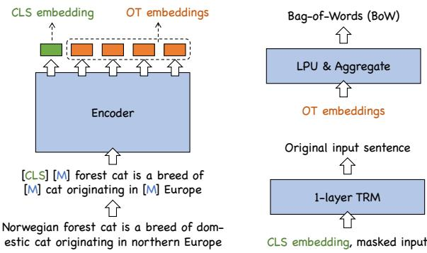
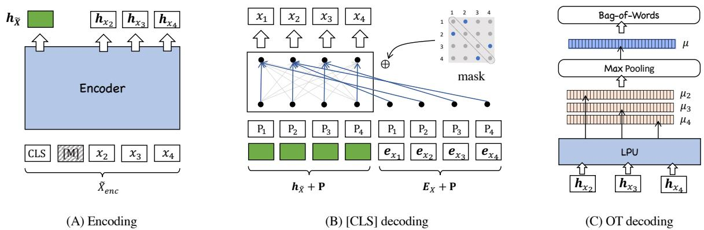

# RetroMAE-2: Duplex Masked Auto-Encoder For Pre-Training Retrieval-Oriented Language Models

Zheng Liu1†∗, Shitao Xiao2†, Yingxia Shao2∗, Zhao Cao1

1: Huawei Technologies Ltd. Co. 2: Beijing University of Posts and Telecommunications

zhengliu1026@gmail.com, stxiao,shaoyx @bupt.edu.cn,

caozhao1@huawei.com

## Abstract

To better support information retrieval tasks such as web search and open-domain question answering, growing effort is made to develop retrieval-oriented language models, e.g., RetroMAE (Xiao et al., 2022b) and many others (Gao and Callan, 2021; Wang et al., 2021a). Most of the existing works focus on improving the semantic representation capability for the contextualized embedding of the [CLS] token. However, recent study shows that the ordinary tokens besides [CLS] may provide extra information, which help to produce a better representation effect (Lin et al., 2022). As such, it’s necessary to extend the current methods where all contextualized embeddings can be jointly pre-trained for the retrieval tasks.

In this work, we propose a novel pre-training method called Duplex Masked Auto-Encoder, a.k.a. DupMAE. It is designed to improve the quality of semantic representation where all contextualized embeddings of the pre-trained model can be leveraged. It takes advantage of two complementary auto-encoding tasks: one reconstructs the input sentence with the [CLS] embedding; the other one predicts the bagof-words feature of the input sentence with the ordinary tokens’ embeddings. The two tasks are jointly conducted to train a unified encoder, where the whole contextualized embeddings are aggregated in a compact way to produce the final semantic representation. DupMAE is simple but empirically competitive: it substantially improves the pre-trained model’s representation capability and transferability, where superior retrieval performances can be achieved on popular benchmarks, like MS MARCO and BEIR. Our code is released at: https://github.com/staoxiao/RetroMAE.

## 1 Introduction

Neural retrieval is important to many real-world scenarios, such as web search, question answering, and conversational system (Huang et al., 2013; Karpukhin et al., 2020; Komeili et al., 2021; Izacard et al., 2022; Zhu et al., 2021; Dong et al., 2022). In recent years, pre-trained language models, e.g., BERT (Devlin et al., 2019), RoBERTa (Liu et al., 2019), T5 (Raffel et al., 2019), are widely adopted as the retrievers’ backbone networks. The generic pre-trained language models are not directly applicable to retrieval tasks. Thus, it calls for complex fine-tuning strategies, such as sophisticated negative sampling (Xiong et al., 2020; Qu et al., 2020), knowledge distillation (Hofstatter et al.¨ , 2021; Lu et al., 2022), and the joint optimization of retriever and ranker (Ren et al., 2021; Zhang et al., 2021). To reduce this effort and bring in better retrieval quality, there are growing interests in developing retrieval-oriented language models. One common practice is to leverage self-contrastive learning (Chang et al., 2020; Guu et al., 2020), where the language models are learned to discriminate heuristically acquired positive and negative samples in the embedding space. Later on, auto-encoding is found to be more effective (Wang et al., 2021a; Lu et al., 2021), where the language models are learned to reconstruct the input based on the generated embeddings. Recent works (Xiao et al., 2022b; Wang et al., 2022) further extend the auto-encoding methods by introducing sophisticated encoding and decoding mechanisms, which brings about remarkable improvements of retrieval quality on a wide variety of benchmarks.

The existing retrieval-oriented pre-trained models mainly rely on the contextualized embedding from the special token, i.e., [CLS], to represent the semantic about input (Gao and Callan, 2021; Lu et al., 2021; Xiao et al., 2022b; Wang et al., 2022). However, recent study finds that other ordinary tokens may provide extra information and help to generate better semantic representations (Lin et al., 2022). Such a statement is consistent with previous research (Luan et al., 2021; Santhanam et al., 2021), as multi-vector or token-granularity representations may give higher discriminative power than those based on one single vector. As a result, it is necessary to extend the previous works, such that the representation capability can be jointly pre-trained for both [CLS] and ordinary tokens.

  
Figure 1: DupMAE. Encoder: the sentence is masked and encoded as the contextualized embeddings for [CLS] and ordinary tokens. Decoder: the CLS embedding is joined with the masked input, where the original input is recovered by an 1- layer transformer; OT embeddings are mapped into vocabulary space via LPU and aggregated to predict the BoW feature.

To this end, we propose a novel auto-encoding framework called Duplex Masked Auto-Encoder, a.k.a. DupMAE (Figure 1). It employs two differentiated decoders working collaboratively, which aim to 1) improve each embedding’s individual capacity, as well as 2) contribute to the quality of the joint representation derived from all embeddings.

Workflow. DupMAE contains an unified encoder, which produces the contextualized embeddings for both [CLS] and ordinary tokens. The generated embeddings are used for two decoding tasks. On one hand, the [CLS] embedding, joined with the masked input, is used to recover the input sentence from an one-layer transformer. On the other hand, the ordinary tokens’ embeddings are transformed into the vocabulary space (V), i.e, V - dim vectors, with a linear projection unit (LPU). The transformation results are aggregated into a V -dim vector by max-pooling, where the bag-ofwords feature about the input is predicted.

Merits. The above workflow is highlighted by its simplicity: an one-layer transformer to recover the input, and a linear projection unit to preserve the BoW feature. Therefore, the pre-training is Cost-Effective given all decoding takes operate at a low cost. More importantly, the pre-training task is made highly Demanding on embedding quality: since the decoders are extremely simplified, it forces the encoder to fully extract the input information so that high-fidelity reconstruction can be made. Finally, the differentiated tasks may help the embeddings learn Complementary information: the [CLS] embedding focuses more on semantic information; while the OT embeddings, which directly preserve the BoW features, may incorporate more lexical information.

Representation. The contextualized embeddings from [CLS] and ordinary tokens are aggregated in a straightforward way to generate the representation of the input. The [CLS] embedding is reduced to a lower dimension by linear projection. The ordinary tokens’ embeddings, after transformed into the vocabulary space and aggregated by max-pooling, are sparsified by selecting the top-N elements. The two results are concatenated as one vector. With a proper configuration of linear projection and sparsification, it may preserve the same memory footprint and cost of inner-product computation as the conventional methods.

Our proposed method is simple but empirically competitive. We perform DupMAE on common pre-training corpus where a BERT-based scale encoder is produced. Our pre-trained model achieves superior performances in various downstream tasks. For supervised evaluations on MS MARCO, it reaches a MRR@10 of 42.6 in passage retrieval and a MRR@100 of 45.1 in document retrieval. For zero-shot evaluations on BEIR, it achieves an average NDCG@10 of 49.1 on all 18 datasets. It even notably outperforms strong baselines with more sophisticated fine-tuning approaches or much bigger model sizes. Therefore, it validates that the representation capability and transferability of the pre-trained model can be substantially improved thanks to DupMAE.

## 2 Related Works

Neural retrieval is critical for many real-world applications, such as web search, question answering, advertising and recommender systems (Karpukhin et al., 2020; Zhang et al., 2022; Xiao et al., 2022c, 2021, 2022a). It maps the query and document into embeddings within the same latent space, making their semantic relationship to be measured by the embedding similarity. In recent years, the pretrained language models have been widely applied to deep semantic retrieval such that discriminative representations can be generated for the queries and documents. Despite the preliminary progress achieved by early pre-trained models, like BERT (Devlin et al., 2019), it is noticed that the more advanced models bring little benefit to the retrieval quality, and it’s believed that the conventional pretraining algorithms are not compatible with the purpose of deep semantic retrieval (Gao and Callan, 2021; Lu et al., 2021; Wang et al., 2022).

  
Figure 2: Framework of DupMAE. The unified encoder generates the contextualized embeddings for the [CLS] and ordinary tokens (OT). The [CLS] decoding reconstructs the original sentence leveraging an one-layer transformer; the OT decoding predicts the BoW feature of the input on top of the linear projection unit (LPU) and max-pooling.

To mitigate the above problem, people become increasingly interested in developing retrieval oriented pre-trained models. For example, it is proposed to leverage self-contrastive learning (SCL) where the language models are pre-trained to discriminate positive samples generated by data augmentation and in-batch negative samples (Chang et al., 2020; Guu et al., 2020; Izacard et al., 2021). The SCL based algorithms are limited by many factors, like the quality of data augmentation and the requirement of huge amounts of negative samples. Later on, the auto-encoding based algorithms receive growing interests: the input sentences are encoded into embeddings, based on which the original sentences are reconstructed (Lu et al., 2021; Wang et al., 2021a). The recently proposed methods, such as SimLM (Wang et al., 2022) and Retro-MAE (Xiao et al., 2022b), extend the previous autoencoding framework by upgrading the encoding and decoding mechanisms, which substantially improves the quality of deep semantic retrieval.

The existing retrieval-oriented pre-training methods target on improving the semantic representation capacity for the contextualized embedding from the [CLS] token. However, it is noticed that the ordinary tokens may provide additional information besides [CLS], especially when dealing with long and semantic-rich documents (Luan et al., 2021; Humeau et al., 2019; Lin et al., 2022). As a result, it is necessary to extend the current works, where the representation capability can be enhanced for both types of contextualized embeddings.

## 3 Methodology

We start with an overview of DupMAE in this section. The framework of DupMAE is shown as Figure 2. There is an unified encoder (A), where the masked input is encoded into its contextualized embeddings. There are two decoders working collaboratively. One decoder is applied for [CLS] decoding (B): it employs a single-layer transformer, which reconstructs the original sentence based on the [CLS] embedding. The other one is used for OT decoding (C): it utilizes a linear projection unit (LPU), which transforms the ordinary token embeddings into the vocabulary space. The transformed results are aggregated by max-pooling, where the BoW feature of the input is predicted. The two decoding tasks are jointly conducted to train the encoder. The [CLS] and OT embeddings are aggregated for the final representation of the input. With proper dimension reduction, it may preserve the same computation cost of inner-product and memory footprint as one single dense vector.

## 3.1 Encoding

The input sentence X is sampled and masked as $\tilde { X } _ { e n c }$ by randomly replacing some of its tokens with the special token [M]. A moderate masking ratio is applied during the encoding stage (30%); as a result, the majority of the input information will be preserved by encoding result. The encoding network $\Phi ^ { e n c } ( \cdot )$ is used to transform the masked sentence into the contextualized embeddings for [CLS] $( \mathbf { h } _ { \tilde { X } } )$ and ordinary tokens $( \mathbf { H } _ { \tilde { X } _ { e n c } } ) \colon$

$$
{ \mathbf { h } } _ { \tilde { X } } , { \mathbf { H } } _ { \tilde { X } _ { e n c } } \gets \Phi _ { e n c } ( \tilde { X } _ { e n c } ) .\tag{1}
$$

In order to capture the in-depth semantics about the sentence, a full-scale BERT-like encoding network is used to generate to the contextualized embeddings. The masked tokens for the encoder are predicted following the typical form of masked language modeling (MLM) (Devlin et al., 2019). The training loss of MLM is denoted as $\mathcal { L } _ { m l m }$

## 3.2 [CLS] Decoding

The [CLS] embedding joins with the masked input (re-generated) to decode the original sentence. Following the recent auto-encoding based pre-training methods (Xiao et al., 2022b; Wang et al., 2022), the decoding is performed with a simplified network and an aggressive masking ratio. These settings will force the embedding to fully capture the input information where high-fidelity reconstruction can be made. Particularly, the input X is masked as $\tilde { X } _ { d e c }$ , with half of its tokens selected for masking. An one-layer transformer is utilized for decoding, and two hidden-state streams: $\mathbf { H } _ { 1 }$ (query stream), $\mathbf { H } _ { 2 }$ (context stream), are used as the input:

$$
\begin{array} { c } { { \mathbf { H } _ { 1 } \gets [ { \mathbf { h } _ { \tilde { X } } } + { \mathbf { p } } _ { 0 } , . . . , \mathbf { h } _ { \tilde { X } } + { \mathbf { p } } _ { N } ] , } } \\ { { \mathbf { H } _ { 2 } \gets [ { \mathbf { h } _ { \tilde { X } } } , \mathbf { e } _ { x _ { 1 } } + { \mathbf { p } } _ { 1 } , . . . , \mathbf { e } _ { x _ { N } } + { \mathbf { p } } _ { N } ] . } } \end{array}\tag{2}
$$

Here, $\mathbf { h } _ { \tilde { X } }$ is the [CLS] embedding from encoder, ${ \bf e } _ { x _ { i } }$ is the i-th token embedding, $\mathbf { p } _ { i }$ is the i-th position embedding. Given the above input, it performs self-attention w.r.t. the mask matrix $\mathbf { M } \in \mathbb { R } ^ { L \times L } ;$

$$
\begin{array} { l } { { \displaystyle { { \bf { Q } } } = { { \bf { H } } } _ { 1 } { \bf { W } } ^ { Q } , { \bf { K } } = { \bf { H } } _ { 2 } { \bf { W } } ^ { K } , { \bf { V } } = { \bf { H } } _ { 2 } { \bf { W } } ^ { V } } ; } \\ { ~ { \bf { M } } _ { i j } = \left\{ \begin{array} { l l } { 0 , } & { \mathrm { c a n b e ~ a t t e n d e d , } } \\ { - \infty , \mathrm { ~ m a s k e d } ; } \end{array} \right. } \\ { { \bf { A } } = \mathrm { s o f t m a x } ( \frac { { \bf { Q } } ^ { T } { \bf { K } } } { \sqrt { d } } + { \bf { M } } ) { \bf { V } } . } \end{array}\tag{3}
$$

The output A, together with $\mathbf { H } _ { 1 }$ (from the residual connection) are used to predict the original input. Finally, the following objective is optimized:

$$
\begin{array} { r } { \mathcal { L } _ { d e c } = \displaystyle \sum _ { x _ { i } \in X } \mathrm { C E } ( x _ { i } | \mathbf { A } , \mathbf { H } _ { 1 } ) . } \end{array}\tag{4}
$$

As the decoder only contains one transformer layer, each token $x _ { i }$ is reconstructed based on the unique context which are visible to the i-th row of M. The mask matrix is generated by the following rules:

$$
\mathbf { M } _ { i j } = \left\{ \begin{array} { l l } { 0 , ~ x _ { j } \in s ( X _ { \neq i } ) , \mathrm { ~ o r ~ } j _ { | i \neq 0 } = 0 } \\ { - \infty , \mathrm { ~ o t h e r w i s e . } } \end{array} \right.\tag{5}
$$

In the i-th row, the sampled positions $s ( X _ { \neq i } )$ and the first position are set to 0, meaning that they will be made visible to the i-th token during selfattention. Meanwhile, the non-sampled positions and the diagonal position (indicating the position of the i-th token itself) will be $- \infty$ , which will keep them masked during self-attention.

## 3.3 OT Decoding and Training Objective

The decoding task for OT embeddings are designed based on two considerations. On one hand, it will follow the same spirit as the [CLS] decoding task, where the decoding network is designed to be simplified. On the other hand, it will take a differentiated objective with the [CLS] decoding; therefore, it may facilitate the two types of embeddings to capture complementary information. In this place, we proposed the following decoding task for OT embeddings.

First of all, the OT embeddings (with masked tokens excluded) $\mathbf { H } _ { { \tilde { X } } _ { e n c } } \colon \{ \mathbf { h } _ { x _ { 1 } } , . . . , \mathbf { h } _ { x _ { N } } \}$ are linearly transformed into the vocabulary space:

$$
{ \pmb { \mu } } _ { x _ { i } } \gets \mathbf { h } _ { x _ { i } } ^ { T } \mathbf { W } ^ { O } , x _ { i } \in \tilde { X } _ { e n c } ,\tag{6}
$$

$( \mathbf { W } ^ { O } \in \mathbb { R } ^ { d \times | V | }$ , d: embedding dimension, $| V |$ : vocabulary size.) The transformed results are aggregated through token-wise max-pooling:

$$
\pmb { \mu } _ { \tilde { X } _ { e n c } }  t o k e n . \mathrm { M a x } ( \{ \pmb { \mu } _ { x _ { i } } | \tilde { X } _ { e n c } \} ) ,\tag{7}
$$

where the largest activation values of all tokens in $\tilde { X } _ { e n c }$ will be preserved for each vocabulary.

Secondly, we propose the following objective where the BoW feature of the input is recovered. As a result, the lexical information can be better encoded by the OT embeddings.

$$
\operatorname* { m i n . } - \sum _ { x \in s e t ( X ) } \log \frac { \exp ( \pmb { \mu } _ { \tilde { X } _ { e n c } } [ x ] ) } { \sum _ { x ^ { \prime } \in V } \exp ( \pmb { \mu } _ { \tilde { X } _ { e n c } } [ x ^ { \prime } ] ) } ,\tag{8}
$$

where $x \in s e t ( X )$ is a unique token of the input X, V is the whole vocabulary. The encoder’s loss, the decoding losses from [CLS] (Eq. 4) and OT (Eq. 8) are added up as our training objective:

$$
\operatorname* { m i n } . \mathcal { L } _ { m l m } + \mathcal { L } _ { d e c } + \mathcal { L } _ { B o W } .\tag{9}
$$

## 3.4 Representation

A remaining problem of DupMAE is how to generate the semantic representation for the input. It’s expected that the [CLS] and OT embeddings can be collaborated, where a stronger representation can be produced. Besides, it has to be compact, such that the retrieval process can be efficient in terms of computation cost and memory consumption. To these ends, we propose the following aggregation method. Firstly, the [CLS] embedding hX is linearly transformed to a lower dimension (d0):

$$
\hat { \mathbf { h } } _ { X }  \mathbf { h } _ { X } ^ { T } \mathbf { W } ^ { c l s } , \mathbf { W } ^ { c l s } \in \mathbb { R } ^ { d \times d ^ { \prime } } .\tag{10}
$$

Secondly, knowing that the OT embeddings are aggregated into a high-dim vector $\pmb { \mu } _ { X }$ , we directly reduce its dimension via sparsification:

$$
{ \hat { \pmb { \mu } } } _ { X }  \{ i : \pmb { \mu } _ { X } [ i ] \mid i \in I _ { X } \} .\tag{11}
$$

Here, $I _ { X }$ stands for the indexes where $\mu _ { X } [ i ] \in$ Top- $\mathbf { \nabla } \cdot \mathbf { k } ( \mu _ { X } )$ , k is the number of elements to be preserved for $\pmb { \mu } _ { X }$ . For each document, we concatenate the dim-reduction results of [CLS] and OT embeddings as its semantic representation: $[ \hat { \bf h } _ { X } ; \hat { \pmb { \mu } } _ { X } ]$ . For each query, we measure its relevance to a document based on the following form of inner-product:

$$
\langle q , d \rangle = \hat { \mathbf { h } } _ { q } ^ { T } \hat { \mathbf { h } } _ { d } + \sum _ { I _ { d } } \pmb { \mu } _ { q } [ i ] \pmb { \mu } _ { d } [ i ] .\tag{12}
$$

With proper configurations, the computation cost of inner product and memory footprint will be same as working conventional dense embeddings.

Fine-Tuning. The pre-trained encoder is finetuned with three steps. Firstly, the contrastive learning is conducted for the in-batch negatives (IB):

$$
\operatorname* { m i n } _ { \mathbf { \Phi } _ { q } } . - \sum _ { q } \log \frac { \exp ( \langle q , d ^ { + } \rangle ) } { \sum _ { d \in \{ d ^ { + } , \mathrm { I B } \} } \exp ( \langle q , d \rangle ) } .\tag{13}
$$

Secondly, we get the ANN hard negatives for each query based on the first-stage encoder D− (Xiong et al., 2020), and continue to perform contrastive learning with both hard and in-batch negatives:

$$
\operatorname* { m i n } . - \sum _ { q } \log \frac { \exp ( \langle q , d ^ { + } \rangle ) } { \sum _ { d \in \{ d ^ { + } , D ^ { - } , \mathrm { I B } \} } \exp ( \langle q , d \rangle ) } .\tag{14}
$$

Thirdly, we perform knowledge distillation: a crossencoder is trained to discriminate the positives $( d ^ { + } )$ from negatives (d−) for each query. Then, the soft labeled cross-entropy is minimized:

$$
\operatorname* { m i n } _ { \mathbf { \Phi } . - \sum _ { q } \sigma _ { q } ^ { d } \log \frac { \exp ( \langle q , d ^ { + } \rangle ) } { \sum _ { d \in \{ d ^ { + } , D ^ { - } \} } \exp ( \langle q , d \rangle ) } }\tag{15}
$$

where $\sigma _ { q } ^ { d }$ is the softmax activation of the crossencoder’s prediction of q and d’s relevance.

The first two fine-tuning steps are cost effective, as they only involve low-cost operations. The third step will bring a much larger cost due to the training and scoring of the cross-encoder. Nevertheless, it also helps to fine-tune the model for a better precision. In our experiments, comprehensive analysis is made for DupMAE’s impact on different stages.

## 4 Experiment

The empirical studies are conducted to explore the following research questions.

RQ 1. Whether DupMAE produces better semantic representations, compared with the existing competitive pre-training baselines?

RQ 2. Whether DupMAE is able to maintain its advantages throughout different situations?

RQ 3. Whether DupMAE benefits from the joint utilization of both [CLS] and OT embeddings, and what’s the individual contribution from each embedding?

RQ 4. Whether the pre-training tasks contribute to both [CLS] and OT embeddings?

Benchmarks. The experiments are conducted for both supervised and zero-shot settings. We choose the passage and document retrieval task of MS MARCO benchmark (Nguyen et al., 2016) for supervised evaluations. It contains queries from Bing Search, where ground-truth answers to the queries need to be retrieved from 8.8 million passages and 3 million documents, respectively. The queries from the dev set and TREC Deep Learning track in 2019 (DL’19) (Craswell et al., 2020) are used for evaluation. We leverage BEIR benchmark (Thakur et al., 2021) for zero-shot evaluations. It contains a total of 18 datasets, which covers diverse types of retrieval tasks, such as question answering, duplication detection, and fact verification, etc. Following the official evaluation script, the pre-trained models are fine-tuned with MS MARCO queries, and evaluated for their out-of-domain retrieval performances on each of the 18 datasets.

Baselines. We consider the following baselines for supervised evaluations according to their finetuning strategies. The first one only leverage hard or in-batch negatives, including ANCE (Xiong et al., 2020), SEED (Lu et al., 2021), ADORE (Zhan et al., 2021), COSTA (Ma et al., 2022), PROP (Ma et al., 2021a), B-PROP (Ma et al., 2021b), Aggretriever (Lin et al., 2022), and co-Condener (Gao and Callan, 2022). The second type leverage sophisticated fine-tuning strategies like knowledge distillation, including RocketQAv2 (Ren et al., 2021), AR2 (Zhang et al., 2021), AR2+SimANS (Zhou et al., 2022), SPLADEv2 (Formal et al., 2021), ColBERTv2 (Santhanam et al., 2021), ERNIE-Search (Lu et al., 2022),

<table><tr><td></td><td colspan="2">Passage Dev</td><td>DL’19</td></tr><tr><td>Methods</td><td>MRR@10</td><td>R@1000</td><td>NDCG@10</td></tr><tr><td>ANCE</td><td>0.330</td><td>0.959</td><td>0.648</td></tr><tr><td>SEED</td><td>0.339</td><td>0.961</td><td></td></tr><tr><td>coCondenser</td><td>0.382</td><td>0.717</td><td>0.684</td></tr><tr><td>Aggretriver</td><td>0.363</td><td>0.973</td><td>0.678</td></tr><tr><td>RocketQAv2</td><td>0.388</td><td>0.981</td><td></td></tr><tr><td>AR2</td><td>0.395</td><td>0.986</td><td></td></tr><tr><td>AR2+SimANS</td><td>0.409</td><td>0.987</td><td></td></tr><tr><td>SPLADEv2</td><td>0.368</td><td>0.979</td><td>0.729</td></tr><tr><td>ColBERTv2</td><td>0.397</td><td>0.984</td><td></td></tr><tr><td>ERNIE-Search</td><td>0.401</td><td>0.982</td><td></td></tr><tr><td>SimLM</td><td>0.411</td><td>0.987</td><td>0.714</td></tr><tr><td>RetroMAE (stage 3)</td><td>0.416</td><td>0.988</td><td>0.681</td></tr><tr><td>DupMAE (stage 2)</td><td>0.410</td><td>0.987</td><td>0.713</td></tr><tr><td>DupMAE (stage 3)</td><td>0.426</td><td>0.989</td><td>0.751</td></tr></table>

Table 1: MS MARCO passage retrieval.

SimLM (Wang et al., 2022), RetroMAE (Xiao et al., 2022b). We emphasize two methods for zero-shot evaluations. One is BM25, which is a common sparse retrieval method and a strong baseline in zero-shot settings. The other type are the largescale pre-trained retrievers based on contrastive learning: Contriever (Izacard et al., 2021) and the family of GTR-\* (Ni et al., 2021). Among them, GTR-XXL is a super large model with 4.8B parameters (over 40 larger than BERT base).

Implementation details. DupMAE utilizes a bi-directional transformer network as its encoder, with 12 layers, 768 hidden-dim, and a vocabulary of 30522 tokens (same as BERT base). The decoder is an one-layer transformer. The [CLS] embedding and OT embedding are reduced to dim-384 by default. As a result, it will preserve the same computation cost of inner-product as the baselines which use dim-768 embeddings. We also explore other configurations of dimensions in our experiments. The masking ratio is set to 0.3 for encoder and 0.5 for decoder. We leverage three commonly used corpora for pre-training: Wikipedia, BookCorpus (Devlin et al., 2019), and MS MARCO (Nguyen et al., 2016). The pre-training and fine-tuning take place on machines with 8 Nvidia V100 (32GB) GPUs. The models are implemented with PyTorch 1.8 and HuggingFace transformers 4.16.

## 4.1 Main Results

The supervised evaluations are shown as Table 1 and 2, where the following observations can be made. Firstly, DupMAE achieves superior performances on both tasks of MS MARCO. For passage retrieval, it reaches a MRR@10 of 0.426, outperforming the previous SOTA pre-trained models, like SimLM and RetroMAE, by +1% absolute point. For document retrieval, it achieves a MRR@100 of 0.451, leading to +1.9% absolute improvements. Such observations indicate that the pre-trained model’s representation quality is substantially improved with DupMAE. Note that DupMAE’s performances are much higher than baselines like ColBERTv2, SPLADE, and COIL. These methods utilize multi-vector for semantic representation, which is more expensive in terms of memory and computation. Besides, even with Dup-MAE (stage 2), which simply takes one-round of hard-negative sampling, we may outperform many of the baselines relying on sophisticated fine-tuning strategies, like knowledge distillation (ColBERTv2, ERNIE-Search) and joint learning of retriever and ranker (AR2, AR2+SimANS).

<table><tr><td></td><td colspan="2">Document Dev</td><td>DL’19</td></tr><tr><td>Methods</td><td>MRR@100</td><td>R@100</td><td>NDCG@10</td></tr><tr><td>BM25</td><td>0.277</td><td>0.807</td><td>0.519</td></tr><tr><td>BERT</td><td>0.389</td><td>0.877</td><td>0.594</td></tr><tr><td>ICT</td><td>0.396</td><td>0.882</td><td>0.605</td></tr><tr><td>PROP</td><td>0.394</td><td>0.884</td><td>0.596</td></tr><tr><td>B-PROP</td><td>0.395</td><td>0.883</td><td>0.601</td></tr><tr><td>COIL</td><td>0.397</td><td></td><td>0.636</td></tr><tr><td>ANCE (first-p)</td><td>0.377</td><td>0.893</td><td>0.615</td></tr><tr><td>ANCE (max-p)</td><td>0.384</td><td>0.906</td><td>0.628</td></tr><tr><td>STAR</td><td>0.390</td><td>0.913</td><td>0.605</td></tr><tr><td>Adore</td><td>0.405</td><td>0.919</td><td>0.628</td></tr><tr><td>SEED</td><td>0.396</td><td>0.902</td><td>0.605</td></tr><tr><td>COSTA</td><td>0.422</td><td>0.919</td><td>0.626</td></tr><tr><td>RetroMAE (stage 2)</td><td>0.432</td><td>0.935</td><td>0.593</td></tr><tr><td>DupMAE (stage 2)</td><td>0.451</td><td>0.950</td><td>0.667</td></tr></table>

Table 2: MS MARCO document retrieval.

To summary, the above observations reflect Dup-MAE’s two-fold merits to real-world applications: 1. it improves the best performance where neural retrievers may get, 2. it helps to produce strong retrieval quality in a cost-effective way.

For zero-shot settings, we report the retrieval performance on every single dataset, and measure the overall performance by taking the average of all 18 datasets (Table 3). Firstly, DupMAE achieves remarkable performance on BEIR, reaching an average NDCG@10 of 0.477 in all 18 datasets. It outperforms its close peer RetroMAE on 13 out of 18 datasets, and by +2.5% absolute point in total average. Secondly, it is known that BM25 is a strong baseline for zero-shot retrieval, which outperforms many of the existing pre-trained models on BEIR benchmark. Even for the massive-scale GTR-XXL, which uses as much as 4.8 billion parameters and huge amounts of pre-training data, it still loses to BM25 on 8 out 18 datasets. However, with Dup-MAE, we may outperform BM25 on 15 out of 18 datasets, leading to as much as +5.4% absolute improvement in total average. The above performances are impressive considering that DupMAE is merely based on a BERT-base scale encoder and uses much less pre-training data compared with other strong baselines, like Contriever and GTR.

<table><tr><td>Datasets</td><td>BMM25</td><td>BERT</td><td>SEED</td><td>Conser</td><td>Countiver</td><td>GT-base</td><td>GTRR-IL</td><td>ReAE</td><td>DUPMAE</td><td>UPMAAE</td></tr><tr><td>TREC-COVID</td><td>0.656</td><td>0.615</td><td>0.627</td><td>0.750</td><td>0.596</td><td>0.539</td><td>0.501</td><td>0.772</td><td>0.728</td><td>0.770↑</td></tr><tr><td>BioASQ</td><td>0.465</td><td>0.253</td><td>0.308</td><td>0.322</td><td>0.383</td><td>0.271</td><td>0.324</td><td>0.421</td><td>0.508</td><td>0.514↑</td></tr><tr><td>NFCorpus</td><td>0.325</td><td>0.260</td><td>0.278</td><td>0.277</td><td>0.328</td><td>0.308</td><td>0.342</td><td>0.308</td><td>0.346</td><td>0.366↑</td></tr><tr><td>NQ</td><td>0.329</td><td>0.467</td><td>0.446</td><td>0.486</td><td>0.498</td><td>0.495</td><td>0.568</td><td>0.518</td><td>0.570</td><td>0.578↑</td></tr><tr><td>HotpotQA</td><td>0.603</td><td>0.488</td><td>0.541</td><td>0.538</td><td>0.638</td><td>0.535</td><td>0.599</td><td>0.635</td><td>0.681</td><td>0.683↑</td></tr><tr><td>FiQA-2018</td><td>0.236</td><td>0.252</td><td>0.259</td><td>0.259</td><td>0.329</td><td>0.349</td><td>0.467</td><td>0.316</td><td>0.345</td><td>0.375↑</td></tr><tr><td>Signal-1M(RT)</td><td>0.330</td><td>0.204</td><td>0.256</td><td>0.261</td><td>0.199</td><td>0.261</td><td>0.273</td><td>0.265</td><td>0.213</td><td>0.237↑</td></tr><tr><td>TREC-NEWS</td><td>0.398</td><td>0.362</td><td>0.358</td><td>0.376</td><td>0.428</td><td>0.337</td><td>0.346</td><td>0.428</td><td>0.427</td><td>0.433↑</td></tr><tr><td>Robust04</td><td>0.408</td><td>0.351</td><td>0.365</td><td>0.349</td><td>0.476</td><td>0.437</td><td>0.506</td><td>0.447</td><td>0.479</td><td>0.503↑</td></tr><tr><td>ArguAna</td><td>0.315</td><td>0.265</td><td>0.389</td><td>0.298</td><td>0.446</td><td>0.511</td><td>0.540</td><td>0.433</td><td>0.474</td><td>0.465↓</td></tr><tr><td>Touche-2020</td><td>0.367</td><td>0.259</td><td>0.225</td><td>0.248</td><td>0.204</td><td>0.205</td><td>0.256</td><td>0.237</td><td>0.343</td><td>0.382↑</td></tr><tr><td>CQADupStack</td><td>0.299</td><td>0.282</td><td>0.290</td><td>0.347</td><td>0.345</td><td>0.357</td><td>0.399</td><td>0.317</td><td>0.320</td><td>0.336↑</td></tr><tr><td>Quora</td><td>0.789</td><td>0.787</td><td>0.852</td><td>0.853</td><td>0.865</td><td>0.881</td><td>0.892</td><td>0.847</td><td>0.845</td><td>0.853↑</td></tr><tr><td>DBPedia</td><td>0.313</td><td>0.314</td><td>0.330</td><td>0.339</td><td>0.413</td><td>0.347</td><td>0.408</td><td>0.390</td><td>0.418</td><td>0.419↑</td></tr><tr><td>SCIDOCS</td><td>0.158</td><td>0.113</td><td>0.124</td><td>0.133</td><td>0.165</td><td>0.149</td><td>0.161</td><td>0.150</td><td>0.153</td><td>0.165↑</td></tr><tr><td>FEVER</td><td>0.753</td><td>0.682</td><td>0.641</td><td>0.691</td><td>0.758</td><td>0.660</td><td>0.740</td><td>0.774</td><td>0.800</td><td>0.817↑</td></tr><tr><td>Climate-FEVER</td><td>0.213</td><td>0.187</td><td>0.176</td><td>0.211</td><td>0.237</td><td>0.241</td><td>0.267</td><td>0.232</td><td>0.232</td><td>0.219↓</td></tr><tr><td>SciFact</td><td>0.665</td><td>0.533</td><td>0.575</td><td>0.593</td><td>0.677</td><td>0.600</td><td>0.662</td><td>0.653</td><td>0.699</td><td>0.725↑</td></tr><tr><td>AVERAGE</td><td>0.423</td><td>0.371</td><td>0.391</td><td>0.407</td><td>0.448</td><td>0.416</td><td>0.458</td><td>0.452</td><td>0.477</td><td>0.491↑</td></tr></table>

Table 3: Zero-shot retrieval (NDCG@10) on BEIR. DupMAE† is the extended DupMAE via domain-adaptation, where indicates the improvement over DupMAE. The highest values w./w.o. DupMAE† are marked in bold and underlined, respectively.

Recently, it becomes popular to leverage domainadaptation to improve neural retrievers’ zero-shot performances (Xin et al., 2021; Wang et al., 2021b). In this place, we adopt a straightforward approach for domain adaptation: we continually perform DupMAE pre-training on BEIR unlabeled corpus before fine-tuning with the source domain training queries (denoted as DupMAE†). Despite simplicity, this approach is surprisingly effective, as performances are improved on 16 out of 18 datasets, leading to an average NDCG@10 of 0.491.

Given the analysis about the main experiment results in Table 1, 2 and 3, we may draw the following conclusions in response to RQ 1 and 2:

Con 1. DupMAE makes large improvements over the baselines, verifying that it substantially contributes to the pre-trained model’s representation capacity and transferability.

Con 2. DupMAE is able to maintain superior retrieval performances across different evaluation tasks on both supervised and zero-shot scenarios, which indicates DupMAE’s strong usability in real-world applications.

## 4.2 Ablation Studies

After verifying DupMAE’s overall effectiveness, it remains to figure out which factors contribute to its improvements. Thus, we perform ablation studies as Table 4. We use MS MARCO dataset for our exploration, and fine-tune the pre-trained models with hard negative samples (stage 2).

We conduct the following two sets of experiments. Firstly, we explore the impact from pretraining, whose results are shown in the upper part of Table 4. Remember that DupMAE includes two decoding tasks as discussed in Section 3.3: CLS decoding and OT decoding, we make evaluations for three alternative forms accordingly. 1) CLS decoding only, where only the [CLS] embedding is pre-trained 2) OT decoding only, where only the OT embeddings are pre-trained, 3) CLS and OT decoding, which is exactly the pre-training method used by DupMAE. We also introduce RetroMAE for comparison. Although RetroMAE and “CLS decoding only” share the same pre-training task, their representations are generated differently, as DupMAE jointly uses [CLS] and OT embeddings.

<table><tr><td></td><td></td><td colspan="5">MS MARCO (Passage) Dev</td></tr><tr><td></td><td>Methods</td><td>MRR@10</td><td>MRR@100</td><td>R@10</td><td>R@100</td><td>R@1000</td></tr><tr><td rowspan="3">1.</td><td>RetroMAE CLS decoding only</td><td>0.3928</td><td>0.4032 0.4099</td><td>0.6749 0.6906</td><td>0.9178 0.9229</td><td>0.9849 0.9840</td></tr><tr><td>OT decoding only</td><td>0.4008 0.4002</td><td>0.4092</td><td>0.6890</td><td>0.9213</td><td>0.9831</td></tr><tr><td>CLS and OT decoding</td><td>0.4102</td><td>0.4202</td><td>0.7049</td><td>0.9280</td><td>0.9874</td></tr><tr><td rowspan="4">2.</td><td>CLS:768</td><td>0.3941</td><td>0.4040</td><td>0.6865</td><td>0.9174</td><td>0.9871</td></tr><tr><td>OT:768</td><td>0.4019</td><td>0.4114</td><td>0.6934</td><td>0.9095</td><td>0.9814</td></tr><tr><td>CLS:384, OT:384</td><td>0.4102</td><td>0.4202</td><td>0.7049</td><td>0.9280</td><td>0.9874</td></tr><tr><td>CLS:384, OT:260</td><td>0.4071</td><td>0.4171</td><td>0.7037</td><td>0.9293</td><td>0.9882</td></tr></table>

Table 4: Ablation studies: 1. impact from pre-training, 2. impact from embedding dimensions.

We may get the following observations from the experiment results. Firstly, the joint utilization of the two pre-training tasks leads to the optimal retrieval quality, where the MRR@10 grows beyond “CLS only” and “OT only” by almost +1% absolute point. As a result, the effectiveness of jointly performing both pre-training tasks can be verified. Secondly, RetroMAE’s performance is inferior to other methods, especially “CLS pre-train only” which share the pre-training task with it. Such an observation reveals the different capacity between the two semantic representations: DupMAE relies on the contextualized embeddings from both [CLS] and ordinary tokens, while RetroMAE only leverages the [CLS] token’s embedding.

We further explore the impact from different semantic representations in the lower part of Table 4). As introduced in Section 3.3, DupMAE’s default semantic representation (dim-768) consists of two parts: half of its elements come from the linear projection of [CLS] embedding, while the other half come from the sparsification of OT embeddings (denoted as “CLS:384, OT:384”). In this place, we consider two variational formulations: (1) “CLS:768”, which directly uses the [CLS] embedding, and (2) “OT:768”, where the top 768 elements of the OT embeddings are used for the representation of the input. According to the experiment results, the performance of “OT:768” is slightly better than “CLS:768”. At the same time, “CLS:384, OT:384” (the default setting of DupMAE) gives rise to a better performance than both variational formulations. The above observations indicate that the contextualized embeddings from [CLS] and ordinary tokens may provide complementary information about the input data. As a result, the joint utilization of both types of embeddings is able to generate a more powerful semantic representation.

Note that although “CLS:384, OT:384” preserves the same computation cost of inner-product as “CLS:768”, it’s memory cost is slightly higher than “CLS:768”, as extra space is needed to save the indexes of OT embeddings’ sparsification results. Particularly, each index will take about 15 extra bits for index storage knowing that the vocabulary space is 30522 . In this place, we introduce another variational formulation “CLS:384, OT:260” by further reducing the dimension of OT embeddings. As a result, it may take the same memory footprint as “CLS:768”. It can be observed that the new combination “CLS:384, OT:260” still outperforms the first two variations, and maintains a similar performance as “CLS:384, OT:384”.

Given the above analysis, we may come to the following conclusions in response to RQ 3 and 4:

Con 3. The collaboration of [CLS] and OT embeddings brings stronger semantic representations, indicating that encoded information from the two types of embeddings are complementary to each other.

Con 4. Both tasks: [CLS] and OT decoding, contribute to DupMAE; the joint conduct of both tasks leads to the optimal performance.

## 5 Conclusion

This paper presents DupMAE, a new approach for retrieval-oriented pre-training, where the semantic representation capacities can be jointly enhanced for all contextualized embeddings of the language model. It employs two complementary tasks: one reconstructs the original input from the [CLS]’s embedding, the other one predicts the BoW features based on the OT embeddings. The two tasks are jointly conducted to learn an unified encoder. The two types of embeddings, with reduced dimensions, are aggregated to be a joint semantic representation. The effectiveness of our proposed method is empirically verified, where remarkable performances are achieved on MS MARCO and BEIR benchmarks throughout different situations.

## Limitations

Although DupMAE is to learn representation instead of generative models, it performs pre-training on open web data. Therefore, it is also subject to potential ethical and social risks, like bias, discrimination, and toxicity. Besides, DupMAE is pre-trained with comparatively limited amount of data due to the constraint on computation resources. Despite that it already achieves a promising retrieval performance at present, it remains to explore whether the performance can be further improved with the scaling up of pre-training data, by leveraging more high-quality datasets like C4 and OpenWebText.

## Acknowledgements

This work is supported by the National Natural Science Foundation of China (Nos. 62272054, 62192784) and Xiaomi Young Talents Program.

## References

Wei-Cheng Chang, Felix X Yu, Yin-Wen Chang, Yiming Yang, and Sanjiv Kumar. 2020. Pretraining tasks for embedding-based large-scale retrieval. arXiv preprint arXiv:2002.03932.

Nick Craswell, Bhaskar Mitra, Emine Yilmaz, Daniel Campos, and Ellen M Voorhees. 2020. Overview of the trec 2019 deep learning track. arXiv preprint arXiv:2003.07820.

Jacob Devlin, Ming-Wei Chang, Kenton Lee, and Kristina Toutanova. 2019. BERT: pre-training of deep bidirectional transformers for language understanding. In Proceedings ofthe 2019 Conference of the North American Chapter of the Association for Computational Linguistics: Human Language Technologies,, pages 4171–4186. Association for Computational Linguistics.

Qian Dong, Shuzi Niu, Tao Yuan, and Yucheng Li. 2022. Disentangled graph recurrent network for document ranking. Data Science and Engineering, pages 30–43.

Thibault Formal, Carlos Lassance, Benjamin Piwowarski, and Stephane Clinchant. 2021. Splade v2:´ Sparse lexical and expansion model for information retrieval. arXiv preprint arXiv:2109.10086.

Luyu Gao and Jamie Callan. 2021. Condenser: a pretraining architecture for dense retrieval. In Proceedings of the 2021 Conference on Empirical Methods in Natural Language Processing, pages 981–993.

Luyu Gao and Jamie Callan. 2022. Unsupervised corpus aware language model pre-training for dense passage retrieval. In Proceedings ofthe 60th Annual

Meeting of the Association for Computational Linguistics (Volume 1: Long Papers), pages 2843–2853, Dublin, Ireland.

Kelvin Guu, Kenton Lee, Zora Tung, Panupong Pasupat, and Ming-Wei Chang. 2020. Realm: Retrievalaugmented language model pre-training. arXiv preprint arXiv:2002.08909.

Sebastian Hofstatter, Sheng-Chieh Lin, Jheng-Hong¨ Yang, Jimmy Lin, and Allan Hanbury. 2021. Efficiently teaching an effective dense retriever with balanced topic aware sampling. In SIGIR, pages 113– 122.

Po-Sen Huang, Xiaodong He, Jianfeng Gao, Li Deng, Alex Acero, and Larry Heck. 2013. Learning deep structured semantic models for web search using clickthrough data. In CIKM, pages 2333–2338.

Samuel Humeau, Kurt Shuster, Marie-Anne Lachaux, and Jason Weston. 2019. Poly-encoders: Transformer architectures and pre-training strategies for fast and accurate multi-sentence scoring. arXiv preprint arXiv:1905.01969.

Gautier Izacard, Mathilde Caron, Lucas Hosseini, Sebastian Riedel, Piotr Bojanowski, Armand Joulin, and Edouard Grave. 2021. Towards unsupervised dense information retrieval with contrastive learning. arXiv preprint arXiv:2112.09118.

Gautier Izacard, Patrick Lewis, Maria Lomeli, Lucas Hosseini, Fabio Petroni, Timo Schick, Jane Dwivedi-Yu, Armand Joulin, Sebastian Riedel, and Edouard Grave. 2022. Few-shot learning with retrieval augmented language models. arXiv preprint arXiv:2208.03299.

Vladimir Karpukhin, Barlas Oguz, Sewon Min, Patrick Lewis, Ledell Wu, Sergey Edunov, Danqi Chen, and Wen-tau Yih. 2020. Dense passage retrieval for open-domain question answering. In Proceedings of the 2020 Conference on Empirical Methods in Natural Language Processing, pages 6769–6781.

Mojtaba Komeili, Kurt Shuster, and Jason Weston. 2021. Internet-augmented dialogue generation. arXiv preprint arXiv:2107.07566.

Sheng-Chieh Lin, Minghan Li, and Jimmy Lin. 2022. Aggretriever: A simple approach to aggregate textual representation for robust dense passage retrieval. arXiv preprint arXiv:2208.00511.

Yinhan Liu, Myle Ott, Naman Goyal, Jingfei Du, Mandar Joshi, Danqi Chen, Omer Levy, Mike Lewis, Luke Zettlemoyer, and Veselin Stoyanov. 2019. Roberta: A robustly optimized BERT pretraining approach. CoRR, abs/1907.11692.

Shuqi Lu, Di He, Chenyan Xiong, Guolin Ke, Waleed Malik, Zhicheng Dou, Paul Bennett, Tie-Yan Liu, and Arnold Overwijk. 2021. Less is more: Pretrain

a strong Siamese encoder for dense text retrieval using a weak decoder. In Proceedings ofthe 2021 Conference on Empirical Methods in Natural Language Processing, pages 2780–2791.

Yuxiang Lu, Yiding Liu, Jiaxiang Liu, Yunsheng Shi, Zhengjie Huang, Shikun Feng Yu Sun, Hao Tian, Hua Wu, Shuaiqiang Wang, Dawei Yin, et al. 2022. Ernie-search: Bridging cross-encoder with dualencoder via self on-the-fly distillation for dense passage retrieval. arXiv preprint arXiv:2205.09153.

Yi Luan, Jacob Eisenstein, Kristina Toutanova, and Michael Collins. 2021. Sparse, dense, and attentional representations for text retrieval. Transactions of the Association for Computational Linguistics, 9:329–345.

Xinyu Ma, Jiafeng Guo, Ruqing Zhang, Yixing Fan, and Xueqi Cheng. 2022. Pre-train a discriminative text encoder for dense retrieval via contrastive span prediction. arXiv preprint arXiv:2204.10641.

Xinyu Ma, Jiafeng Guo, Ruqing Zhang, Yixing Fan, Xiang Ji, and Xueqi Cheng. 2021a. Prop: pre-training with representative words prediction for ad-hoc retrieval. In WSDM, pages 283–291.

Xinyu Ma, Jiafeng Guo, Ruqing Zhang, Yixing Fan, Yingyan Li, and Xueqi Cheng. 2021b. B-prop: bootstrapped pre-training with representative words prediction for ad-hoc retrieval. In SIGIR, pages 1513– 1522.

Tri Nguyen, Mir Rosenberg, Xia Song, Jianfeng Gao, Saurabh Tiwary, Rangan Majumder, and Li Deng. 2016. Ms marco: A human generated machine reading comprehension dataset. In CoCo@ NIPS.

Jianmo Ni, Chen Qu, Jing Lu, Zhuyun Dai, Gustavo Hernandez´ Abrego, Ji Ma, Vincent Y Zhao,´ Yi Luan, Keith B Hall, Ming-Wei Chang, et al. 2021. Large dual encoders are generalizable retrievers. arXiv preprint arXiv:2112.07899.

Yingqi Qu, Yuchen Ding, Jing Liu, Kai Liu, Ruiyang Ren, Wayne Xin Zhao, Daxiang Dong, Hua Wu, and Haifeng Wang. 2020. Rocketqa: An optimized training approach to dense passage retrieval for open-domain question answering. arXiv preprint arXiv:2010.08191.

Colin Raffel, Noam Shazeer, Adam Roberts, Katherine Lee, Sharan Narang, Michael Matena, Yanqi Zhou, Wei Li, and Peter J Liu. 2019. Exploring the limits of transfer learning with a unified text-to-text transformer. arXiv preprint arXiv:1910.10683.

Ruiyang Ren, Yingqi Qu, Jing Liu, Wayne Xin Zhao, Qiaoqiao She, Hua Wu, Haifeng Wang, and Ji-Rong Wen. 2021. Rocketqav2: A joint training method for dense passage retrieval and passage re-ranking. arXiv preprint arXiv:2110.07367.

Keshav Santhanam, Omar Khattab, Jon Saad-Falcon, Christopher Potts, and Matei Zaharia. 2021. Colbertv2: Effective and efficient retrieval via lightweight late interaction. arXiv preprint arXiv:2112.01488.

Nandan Thakur, Nils Reimers, Andreas Ruckl¨ e, Ab-´ hishek Srivastava, and Iryna Gurevych. 2021. Beir: A heterogenous benchmark for zero-shot evaluation of information retrieval models. arXiv preprint arXiv:2104.08663.

Kexin Wang, Nils Reimers, and Iryna Gurevych. 2021a. Tsdae: Using transformer-based sequential denoising auto-encoder for unsupervised sentence embedding learning. arXiv preprint arXiv:2104.06979.

Kexin Wang, Nandan Thakur, Nils Reimers, and Iryna Gurevych. 2021b. Gpl: Generative pseudo labeling for unsupervised domain adaptation of dense retrieval. arXiv preprint arXiv:2112.07577.

Liang Wang, Nan Yang, Xiaolong Huang, Binxing Jiao, Linjun Yang, Daxin Jiang, Rangan Majumder, and Furu Wei. 2022. Simlm: Pre-training with representation bottleneck for dense passage retrieval. arXiv preprint arXiv:2207.02578.

Shitao Xiao, Zheng Liu, Weihao Han, Jianjin Zhang, Yingxia Shao, Defu Lian, Chaozhuo Li, Hao Sun, Denvy Deng, Liangjie Zhang, et al. 2022a. Progressively optimized bi-granular document representation for scalable embedding based retrieval. In WWW, pages 286–296.

Shitao Xiao, Zheng Liu, Yingxia Shao, and Zhao Cao. 2022b. Retromae: Pre-training retrieval-oriented language models via masked auto-encoder. arXiv preprint arXiv:2205.12035.

Shitao Xiao, Zheng Liu, Yingxia Shao, Tao Di, Bhuvan Middha, Fangzhao Wu, and Xing Xie. 2022c. Training large-scale news recommenders with pretrained language models in the loop. In SIGKDD, pages 4215–4225.

Shitao Xiao, Zheng Liu, Yingxia Shao, Defu Lian, and Xing Xie. 2021. Matching-oriented product quantization for ad-hoc retrieval. arXiv preprint arXiv:2104.07858.

Ji Xin, Chenyan Xiong, Ashwin Srinivasan, Ankita Sharma, Damien Jose, and Paul N Bennett. 2021. Zero-shot dense retrieval with momentum adversarial domain invariant representations. arXiv preprint arXiv:2110.07581.

Lee Xiong, Chenyan Xiong, Ye Li, Kwok-Fung Tang, Jialin Liu, Paul Bennett, Junaid Ahmed, and Arnold Overwijk. 2020. Approximate nearest neighbor negative contrastive learning for dense text retrieval. arXiv preprint arXiv:2007.00808.

Jingtao Zhan, Jiaxin Mao, Yiqun Liu, Jiafeng Guo, Min Zhang, and Shaoping Ma. 2021. Optimizing dense retrieval model training with hard negatives. In SI-GIR, pages 1503–1512.

Hang Zhang, Yeyun Gong, Yelong Shen, Jiancheng Lv, Nan Duan, and Weizhu Chen. 2021. Adversarial retriever-ranker for dense text retrieval. arXiv preprint arXiv:2110.03611.

Jianjin Zhang, Zheng Liu, Weihao Han, Shitao Xiao, Ruicheng Zheng, Yingxia Shao, Hao Sun, Hanqing Zhu, Premkumar Srinivasan, Weiwei Deng, et al. 2022. Uni-retriever: Towards learning the unified embedding based retriever in bing sponsored search. In SIGKDD, pages 4493–4501.

Kun Zhou, Yeyun Gong, Xiao Liu, Wayne Xin Zhao, Yelong Shen, Anlei Dong, Jingwen Lu, Rangan Majumder, Ji-Rong Wen, Nan Duan, et al. 2022. Simans: Simple ambiguous negatives sampling for dense text retrieval. arXiv preprint arXiv:2210.11773.

Mingdong Zhu, Derong Shen, Lixin Xu, and Xianfang Wang. 2021. Scalable multi-grained cross-modal similarity query with interpretability. Data Science and Engineering, pages 280–293.

## A Appendix

According to our experimental results in Table 4, the [CLS] and OT embeddings may jointly produce a stronger semantic representation to improve the retrieval quality. In this place, we provide a case analysis as Table 5 and 6, which will visualize the benefit introduced by each type of embedding, and help to explain the design of the pre-training tasks.

## A.1 Settings

In our exploration, the [CLS] embedding and OT embeddings (aggregated and sparsified in the same way as introduced in Section 3.3) are used independently for the retrieval tasks. That’s to say, the query and answer’s relationships are measured by the [CLS] embeddings’ similarity and OT embeddings’ similarity, respectively. We select queries from the evaluation set of MS MARCO for demonstration. For each query, we count it as a successful case w.r.t. a specific type of embeddings, if its ground-truth answer can be retrieved within the Top-10 results. If the ground-truth answer is missed by one type of embeddings, its Top-1 retrieved answer will be posted for comparison.

## A.2 Analysis

Given the limitation of space, we select four representative queries for demonstration. The four queries can be partitioned into two sets: in Table 5, the ground-truth answers are retrieved by [CLS] embeddings; while in Table 6, the ground-truth answers are retrieved by OT embeddings.

Good cases by [CLS] embeddings. In Table 5, the two queries’ ground-truth answers are retrieved by the [CLS] embeddings. For both cases, it calls for the pre-trained model to capture finegrained semantic relationships between the query and answer. In particular, the first query is essentially about the car brands which belong to Ford. The [CLS] embedding successfully establish the connection between “build” and “own” (marked in blue). Therefore, the ground-truth answer can be successfully retrieved. Similarly, the second query emphasizes “cncellation” fee. By identifying the relationship between “cncellation” and “Cancel” (marked in blue), the ground-truth answer is successfully retrieved once again. Comparatively, although OT embeddings retrieve answers with close lexical features, e.g., “built”, “fee” (marked in red), they appear to be less proficient in capturing the semantic relationships in both cases, where the correct answers are missed from their top-10 results.

Good cases by OT embeddings. In Table 6, the two queries’ ground-truth answers are retrieved by the OT embeddings. For both cases, it calls for the pre-trained model to precisely identify the ground-truth answers, which are not only semantically close to the queries, but also contain specific lexical features. Particularly, the first query asks about a certain type of material called “copper coated carbon rods”. As a result, it is important to retrieve the answer which contain exactly the same term. The [CLS] embedding finds “copper-clad steel” (marked in red). Although similar, it is different from the required term. While with the OT embeddings, the ground-truth answer is successfully retrieved. Note that it’s challenging for this case, knowing that the related term “Copper coated carbon electrods” (marked in blue) is wrapped in a long passage. The second query asks about the colour which represents selflessness. Although the [CLS] embedding finds the passage which is relevant to the symbolic meaning of colour (marked in red), it ignores the key term “selflessness” (marked in blue). On top of the OT embeddings, it successfully retrieves the ground-truth answer, which is not only semantically close to the required topic (color symbolism), but also contains the required term (selflessness).

Discussions. It is known that both semantic and lexical features are important to information retrieval problems, such as search engine and question answers. From the above analysis, we may types of embeddings work collaboratively.

<table><tr><td>Query</td><td>Retrieved answer by [CLS] embedding</td><td>Retrieved answer by OT embeddings</td></tr><tr><td>what cars does ford build?</td><td>What car companies does Ford own? Ford owns Jaguar (- 30%), Land Rover (-50%), Aston Martin (-%10), Lincoln, Mercury, Volvo (-70%), and Mazda (-40%). I&#x27;m not quite sure of those percentages, nor am I sure if Ford owns 100% owns Lincoln and Volvo, but there&#x27;s the basic gist of what Ford owns now. The above answer is incorrect. Ford has sold Jaguar, Volvo, &amp; Land Rover. (Ground-Truth. Rank 4th)</td><td>Passenger Cars. The Taurus, Sable and Lincoln are built in Chicago, while many of Ford&#x27;s engines are assembled in Brook Park, Ohio, with one Dearborn, Michigan, plant dedi- cated solely to auto parts. (Rank 1st)</td></tr><tr><td>delta airlines cncellation fee?</td><td>How to Cancel Flights on Delta Air Lines. When the credit is used to pay for new flights, the change fee will be assessed. For example, say you bought non-refundable Delta domestic flight tickets for $650, but your plans changed. When you are ready to purchase new flights, the fare has increased to $700. Your credit is $650 âx80x93 $200 change fee = $450, so your out-of-pocket cost to buy the new ticket is $700 - $450 = $250. Make sure to inform Delta before departure that you will not be on the flight and request the travel credit.our credit is $650 âx80x93 $200 change fee = $450, so your out-of-pocket cost to buy the new ticket is $700 - $450 = $250. Make sure to in- form Delta before departure that you will not be on the flight and request the travel credit. (Ground-Truth. Rank 3rd)</td><td>As of publication, Delta charges a minimum fee of $178 for most domestic flights and $250 on flights to Alaska, Hawaii and the Virgin Islands, with additional charges based on the pet and carrier weight. (Rank 1st)</td></tr></table>

Table 5: Cases where the [CLS] embedding helps to retrieve the ground-truth answers.
<table><tr><td rowspan=1 colspan=1>Query</td><td rowspan=1 colspan=1>Retrieved answer by [CLS] embedding</td><td rowspan=1 colspan=1>Retrieved answer by OT embeddings</td></tr><tr><td rowspan=1 colspan=1>what are copper coated carbonrods used for?</td><td rowspan=1 colspan=1>Copper-clad steel (CCS), also known as copper-covered steelor the trademarked name Copperweld is a bi-metallic prod-uct, mainly used in the wire industry that combines the highmechanical resistance of steel with the conductivity and resis-tance to corrosion of copper. (Rank 1st)</td><td rowspan=1 colspan=1>Coidan Graphite Products supply Graphite Electrodes primar-ily used for the secondary production of steel EAF and ladlefurnaces. Our graphite electrode stock has additional appli-cations, such as melting products in smelting furnaces, non-ferrous metals, ceramic products and to recycle waste. Thereare several grades of graphite electrodes, we can match thegrade with the application to lower your melting costs. Pleaseclick through to see properties of the graphite electrodes wecan offer, RP grade, HP grade, SHP grade and UHP graphiteelectrodes. In addition we supply graphite EDM electrodesfor the mould makers together with many other Spark Ero-sion applications. Copper coated carbon electrodes of manyshapes and sizes are used as gouging rods and welding rodsin foundry applications. (Ground-Truth. Rank 8th)</td></tr><tr><td rowspan=2 colspan=1>what color represents selfless-ness?</td><td rowspan=2 colspan=1>But since it is also taken as off-white, it can be the color ofdegradation or cowardice. Orange. Symbolic of enduranceand strength, orange is the color of fire and flame. it repre-sents the red of passion tempered by the yellow of wisdom. Itis the symbol of the sun. (Rank 1st)</td><td rowspan=1 colspan=1>Color Symbolism - The Deeper Meaning of Blue, Blue is on</td></tr><tr><td rowspan=1 colspan=1>the visual level a calm and peaceful color. We think of it interms of water, sky and universe. For most of us, sky andwater give us a sense of familiarity and consequently of se-curity. For many, the universe represents a larger unity andreligion. Therefore, this hue expresses security and spiritualdevotion. It is the color that leads to introspection and to ourvery essence. It represents such ideals as selflessness, sympa-thy, kindness, compassion and dedication. Blue is assigned tothe physical body and, on a larger scale, represents the mate-rial aspects of life including the planet earth. (Ground-Truth.Rank 1st)</td></tr></table>

Table 6: Cases where the OT embeddings help to retrieve the ground-truth answers.

observe that the two types of embeddings may have their own advantages: the [CLS] embeddings tend to be more proficient in capturing the semantic closeness, while the OT embeddings may better leverage the lexical similarity. In DupMAE, we design two differentiated auto-encoding tasks for [CLS] and OT embeddings. Although both tasks help to better encode the semantic information with the contextualized embeddings, the OT decoding task emphasizes more of the lexical information, because the BoW feature needs to be directly predicted by the aggregation results of OT embeddings. By having such differentiated tasks, the two types of embeddings may focus on strengthening their unique advantages. Finally, it will help to optimize the quality of the joint representation when both

## ACL 2023 Responsible NLP Checklist

## A For every submission:

✓ A1. Did you describe the limitations of your work? Section 6

 A2. Did you discuss any potential risks of your work? Not applicable. Left blank.

✓ A3. Do the abstract and introduction summarize the paper’s main claims? Abstract and section 1

✗ A4. Have you used AI writing assistants when working on this paper? Left blank.

## B ✗ Did you use or create scientific artifacts?

Left blank.

 B1. Did you cite the creators of artifacts you used? No response.

 B2. Did you discuss the license or terms for use and / or distribution of any artifacts? No response.

 B3. Did you discuss if your use of existing artifact(s) was consistent with their intended use, provided that it was specified? For the artifacts you create, do you specify intended use and whether that is compatible with the original access conditions (in particular, derivatives of data accessed for research purposes should not be used outside of research contexts)? No response.

 B4. Did you discuss the steps taken to check whether the data that was collected / used contains any information that names or uniquely identifies individual people or offensive content, and the steps taken to protect / anonymize it? No response.

 B5. Did you provide documentation of the artifacts, e.g., coverage of domains, languages, and linguistic phenomena, demographic groups represented, etc.? No response.

 B6. Did you report relevant statistics like the number of examples, details of train / test / dev splits, etc. for the data that you used / created? Even for commonly-used benchmark datasets, include the number of examples in train / validation / test splits, as these provide necessary context for a reader to understand experimental results. For example, small differences in accuracy on large test sets may be significant, while on small test sets they may not be. No response.

## C ✓ Did you run computational experiments?

Section 4

✓ C1. Did you report the number of parameters in the models used, the total computational budget (e.g., GPU hours), and computing infrastructure used? Section 4

✓ C2. Did you discuss the experimental setup, including hyperparameter search and best-found hyperparameter values? Section 4

✓ C3. Did you report descriptive statistics about your results (e.g., error bars around results, summary statistics from sets of experiments), and is it transparent whether you are reporting the max, mean, etc. or just a single run? Section 4

✓ C4. If you used existing packages (e.g., for preprocessing, for normalization, or for evaluation), did you report the implementation, model, and parameter settings used (e.g., NLTK, Spacy, ROUGE, etc.)? Section 4

D ✗ Did you use human annotators (e.g., crowdworkers) or research with human participants? Left blank.

 D1. Did you report the full text of instructions given to participants, including e.g., screenshots, disclaimers of any risks to participants or annotators, etc.? No response.

 D2. Did you report information about how you recruited (e.g., crowdsourcing platform, students) and paid participants, and discuss if such payment is adequate given the participants’ demographic (e.g., country of residence)? No response.

 D3. Did you discuss whether and how consent was obtained from people whose data you’re using/curating? For example, if you collected data via crowdsourcing, did your instructions to crowdworkers explain how the data would be used? No response.

 D4. Was the data collection protocol approved (or determined exempt) by an ethics review board? No response.

 D5. Did you report the basic demographic and geographic characteristics of the annotator population that is the source of the data? No response.