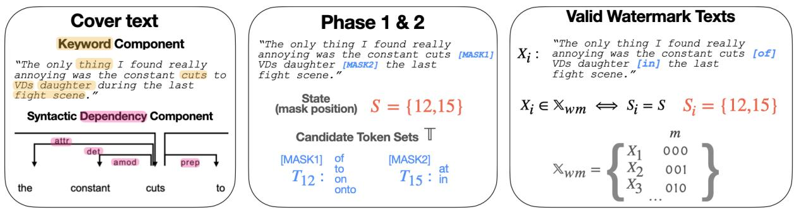
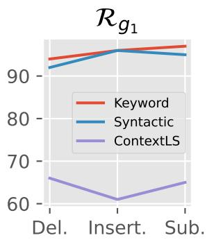
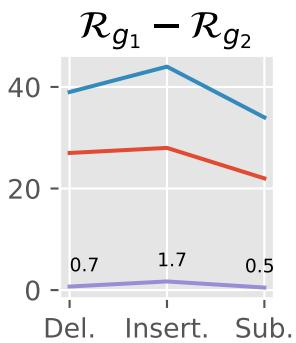
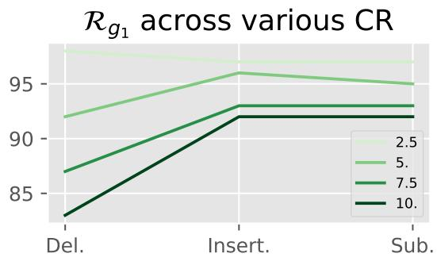

# Robust Multi-bit Natural Language Watermarking through Invariant Features

KiYoon Yoo1 Wonhyuk Ahn2 Jiho Jang1 Nojun Kwak1\*

1Seoul National University 2Webtoon AI

{961230,geographic,nojunk}@snu.ac.kr whahnize@gmail.com

## Abstract

Recent years have witnessed a proliferation of valuable original natural language contents found in subscription-based media outlets, web novel platforms, and outputs of large language models. However, these contents are susceptible to illegal piracy and potential misuse without proper security measures. This calls for a secure watermarking system to guarantee copyright protection through leakage tracing or ownership identification. To effectively combat piracy and protect copyrights, a multi-bit watermarking framework should be able to embed adequate bits of information and extract the watermarks in a robust manner despite possible corruption. In this work, we explore ways to advance both payload and robustness by following a well-known proposition from image watermarking and identify features in natural language that are invariant to minor corruption. Through a systematic analysis of the possible sources of errors, we further propose a corruption-resistant infill model. Our full method improves upon the previous work on robustness by +16.8% point on average on four datasets, three corruption types, and two corruption ratios.1

## 1 Introduction

Recent years have witnessed a proliferation of original and valuable natural language contents such as those found in subscription-based media outlets (e.g. Financial Times, Medium), web novel platforms (e.g. Wattpad, Radish) – an industry that has shown rapid growth, especially in the East Asian market (HanSol, 2022; Zeyi, 2021) – and texts written by human-like language models (OpenAI, 2022; Chiang et al., 2023; Taori et al., 2023). Without proper security measures, however, these contents are susceptible to illegal piracy and distribution, financially damaging the creators of the content and the market industry. In addition, the recent emergence of human-like language models like ChatGPT has raised concerns regarding the mass generation of disinformation (Goldstein et al., 2023). This calls for a secure watermarking system to guarantee copyright protection or detect misuse of language models.

Digital watermarking is a technology that enables the embedding of information into multimedia (e.g. image, video, audio) in an unnoticeable way without degrading the original utility of the content. Through embedding information such as owner/purchaser ID, its application includes leakage tracing, ownership identification, meta-data binding, and tamper-proofing. To effectively combat intentional evasion by the adversary or unintentional digital degradation, a watermarking framework should not only be able to embed adequate bits of information but also demonstrate robustness against potential corruption (Tao et al., 2014; Zhu et al., 2018). Watermarking in image and video contents has been extensively explored for pre-deep learning methods (Hsu and Wu, 1999; Wolfgang et al., 1999; Wang et al., 2001). With the advent of deep neural networks, deep watermarking has emerged as a new paradigm that improves the three key aspects of watermarking: payload (i.e. the number of bits embedded), robustness (i.e. accuracy of the extracted message), and quality of the embedded media.

Natural language watermarking uses text as the carrier for the watermark by imperceptibly modifying semantics and/or syntactic features. As opposed to altering the visual appearances (Rizzo et al., 2019), this type of modification makes natural language watermarking resistant to piracy based on manual transcription. Previous research has focused on techniques such as lexical substitution with predefined rules and dictionaries or structural transformation (Topkara et al., 2006a,b; Atallah et al., 2001). Through utilizing neural networks, recent works have either replaced the predefined set of rules with learning-based methodology (Abdelnabi and Fritz, 2021, AWT), thereby removing heuristics or vastly improved the quality of lexical substitution (Yang et al., 2022, ContextLS). Despite the superiority over traditional methods, however, recent works are not without their limitations: AWT is prone to error during message extraction especially when a higher number of bits are embedded and occasionally generates deteriorated watermarked samples due to its entire reliance on a neural network; ContextLS has a fixed upperbound on the payload and more importantly, does not consider extracting the bit message under corruption, which leads to low robustness. This work strives to advance both payload and robustness of natural language watermarking.

To build an effective robust watermarking system for natural language, we draw inspiration from a well-known proposition of a classical image watermarking work (Cox et al., 1997): That watermarks should "be placed explicitly in the perceptually most significant components" of an image. If this is achieved, the adversary must corrupt the content’s fundamental structure to destroy the watermark. This degrades the utility of the original content, rendering the purpose of pirating futile.

However, embedding the watermark directly on the "perceptually most significant components" is only possible for images due to the inherent perceptual capacity of images. That is, modification in individual pixels is much more imperceptible than on individual words. Due to this, while we adhere to the gist of the proposition, we do not embed directly on the most significant component. Instead, we identify features that are semantically or syntactically fundamental components of the text and thus, invariant to minor modifications in texts. Then we use them as anchor points to pinpoint the position of watermarks. After formulating a general framework for robust natural watermarking, we empirically study the effectiveness of various potential invariant features derived from the semantic and syntactic components. Through stepby-step analysis of the possible sources of errors during watermark extraction, we further propose a corruption-resistant infill model that is trained explicitly to be robust on possible types of corruption.

Our experimental results encompassing four datasets of various writing styles demonstrate the robustness of (1) relying on invariant features for watermark embedding (2) using a robustly trained infill model. The absolute robustness improvement of our full method compared with the previous work is +16.8% point on average on the four datasets, three corruption types, and two corruption ratios.

## 2 Preliminaries

## 2.1 Problem Formulation of Watermarking

In watermarking, the sender embeds a secret message m into the cover text X to attain the watermarked text $X _ { \mathrm { w m } } = \mathtt { E M B E D } ( X , m )$ . A cover text is the original document that is to be protected. A message, for instance, can be the ID of a purchaser or owner of the document represented in bit. The receiver2 attempts to extract the embedded message $\hat { m } = \mathtt { E X T R A C T } ( \tilde { X } _ { \mathrm { w m } } )$ from $\tilde { X } _ { \mathrm { w m } } = \mathrm { C O R R U P T } \big ( X _ { \mathrm { w m } } \big )$ which may be corrupted via intentional tampering by an adversary party as well as to natural degradation (e.g. typo) that may occur during distribution. We focus on blind watermarking, which has no access to the original cover text. The main objectives of the sender and the receiver are (1) to attain $X _ { \mathrm { w m } }$ that is semantically as similar as X so as not to degrade the utility of the original content and (2) to devise the embed and extract functions such that the extracted message is accurate.

## 2.2 Corruptions on Xwm

Conversely, the adversary attempts to interfere with the message extraction phase by corrupting the watermarked text, while maintaining the original utility of the text. For instance, an illegal pirating party will want to avoid the watermark being used to trace the leakage point while still wanting to preserve the text for illegal distribution. This constrains the adversary from corrupting the text too much both quantitatively and qualitatively. To this end, we borrow techniques from adversarial attack (Jin et al., 2020; Morris et al., 2020a) to alter the text and maintain its original semantics.

We consider word insertion (Li et al., 2021), deletion (Feng et al., 2018), and substitution (Garg and Ramakrishnan, 2020) across 2.5% to 5.0% corruption ratios of the number of words in each sentence following Abdelnabi and Fritz (2021). The number of words inserted/substituted/deleted is equal to ROUND $( C R \times N )$ where CR is the corruption ratio and N is the number of words in the sentence. This ensures shorter sentences containing little to no room for corruption are not severely degraded. To additionally constrain the corrupted text from diverging from the original text, we use the pretrained sentence transformer3 all-MiniLM-L6-v2, which was trained on multiple datasets consisting of 1 billion pairs of sentences, to filter out corrupted texts that have cosine similarity less than 0.98 with the original text.

  
Figure 1: Leftmost shows an example of a cover text and its keyword and syntactic dependency components (only partially shown due to space constraint); Middle shows Phase 1 and Phase 2; Rightmost shows an example of a valid watermark sample.

## 2.3 Infill Model

Similar to ContextLS (Yang et al., 2022), we use a pre-trained infill model to generate the candidates of watermarked sets. Given a masked sequence $X _ { \backslash i } = \{ x _ { 1 } , \cdots , x _ { i - 1 } , \mathbf { M A S K } , x _ { i + 1 } , \cdots , x _ { t } \}$ , an infill language model can predict the appropriate words to fill in the mask(s). An infill model parameterized by θ outputs the probability distribution of $x _ { i }$ over the vocabulary (v):

$$
P ( X _ { \backslash i } | \theta ) = p _ { i } \in \mathbb { R } _ { + } ^ { | v | } .\tag{1}
$$

We denote the set of top-k token candidates outputted by the infill model as

$$
\{ t _ { 1 } ^ { i } , \cdot \cdot \cdot , t _ { k } ^ { i } \} = \mathrm { { I N F I L L } } ( X _ { \backslash i } ; k ) .\tag{2}
$$

## 3 Framework for Robust Natural Language Watermarking

Our framework for natural language watermarking is composed of two phases. Phase 1 is obtaining state S from the text X (or $\tilde { X } _ { \mathrm { w m } } )$ using some function $g _ { 1 } . S$ can be considered as the feature abstracted from the text that contains sufficient information to determine the embedding process. Phase

2 comprises function $g _ { 2 }$ that takes X and S as inputs to generate the valid watermarked texts. We rely on the mask infilling model to generate the watermarked texts, which makes S the positions of the masks. The infill model generates the watermarked text $X _ { \mathrm { w m } }$ depending on the bit message. A general overview is shown in Figure 1.

## 3.1 Phase 1: Mask Position Selection

For the watermarking system to be robust against corruption, S should be chosen such that it depends on the properties of the text that are relatively invariant to corruption. That is, S should be a function of the invariant features of the text. More concretely, an ideal invariant feature is characterized by:

1. A significant portion of the text has to be modified for it to be altered.

2. Thus, it is invariant to the corruptions that preserve the utility (e.g. semantics, nuance) of the original text.

By construction, when S is a function of an ideal invariant feature, this allows recovering the identical state S for both X and $\tilde { X } _ { \mathrm { w m } } .$ , which will enhance the robustness of the watermark. In essence, we are trying to find which words should be masked for the watermark to be robust.

Given a state function $g _ { 1 } ( \cdot )$ , let $S \ = \ g _ { 1 } ( X )$ $\tilde { S } = g _ { 1 } ( \tilde { X } _ { \mathrm { w m } } )$ . Then, we define the robustness of $g _ { 1 }$ as follows:

$$
\mathcal { R } _ { g _ { 1 } } : = \mathbb { E } [ \mathbb { 1 } ( S = \tilde { S } ) ] .\tag{3}
$$

Here, 1 denotes the indicator function and E is the expectation operation.

We sought to discover invariant features in the two easily attainable domains in natural language: semantic and syntactic components. An illustration of these components is shown in Figure 1 Left.

<table><tr><td>Robustness</td><td>Corr. Types</td><td>ContextLS (Yang et al., 2022)</td><td>Keyword</td><td>Syntactic</td></tr><tr><td rowspan="3"> $\mathcal { R } _ { g _ { 1 } }$ </td><td>D</td><td>0.656</td><td>0.944</td><td>0.921</td></tr><tr><td>I</td><td>0.608</td><td>0.955</td><td>0.959</td></tr><tr><td>S</td><td>0.646</td><td>0.974</td><td>0.949</td></tr></table>

Table 1: Robustness of g1 $( \mathcal { R } _ { g _ { 1 } } )$ for ContextLS and Ours (Keyword, Syntactic) against three corruption types: Deletion (D), Insertion (I), and Substitution (S) under 5% corruption rate on IMDB. See Appendix Table 9 for full results.

Keyword Component On the semantic level, we first pinpoint keywords that ought to be maintained for the utility of the original text to be maintained. Our intuition is that keywords are semantically fundamental parts of a sentence and thus, are maintained and invariant despite corruption. This includes proper nouns as they are often not replaceable with synonyms without changing the semantics (e.g. name of a movie, person, region), which can be extracted by an off-the-shelf Named Entity Recognition model. In addition, we use an unsupervised method called YAKE (Campos et al., 2018) that outputs semantically essential words. After extracting the keywords, we use them as anchors and can determine the position of the masks by a simple heuristic. For instance, the word adjacent to the keyword can be selected as the mask.

Syntactic Dependency Component On the syntactic level, we construct a dependency parsing tree employing an off-the-shelf parser. A dependency parser describes the syntactic structure of a sentence by constructing a directed edge between a head word and its dependent word(s). Each dependent word is labeled as a specific type of dependency determined by its grammatical role. We hypothesize that the overall grammatical structure outputted by the parsing tree will be relatively robust to minor corruptions in the sentence. To select which type of dependency should be masked, we construct a predefined ordering to maintain the semantics of the watermarked sentences. The ordering is constructed by masking and substituting each type of dependency using an infill model and comparing its entailment score computed by an NLI model(e.g. RoBERTa-Large-NLI4) on a separate held-out dataset as shown in Alg. 1 (a more detailed procedure and the full list are provided in the Appendix A.4). Using the generated ordering, we mask each dependency until the target number of masks is reached. For both types of components (semantic & syntactic), we ensure that keywords are not masked.

Algorithm 1: Sorting syntactic dependency   
based on the NLI entailment score.   
Input: Sentence X   
Output: Sorted list L   
/\* Find dependency of each word in x X   
using Spacy \*/   
1 x.dep SPACY(X, x)   
/\* Initiate dictionary of lists per   
dependency type \*/   
2 $D [ x . { \dot { \mathsf { d e p } } } ] : [ { \mathsf { 1 } }$   
3 N len(X)   
/\* Loop through words and infill \*/   
4 for i 0 to N do   
5 X′  INFILL(X i)   
6 s NLI(X′, X)   
7 D[x.dep].append(s)   
8 for $\mathsf { v } \in D$ .values() do   
9 v  v.mean()   
10 L =   
sorted([k for k,v in D.items()],   
key=lambda x:x[1])   
return $L [ : : - 1 ]$

So how well do the aforementioned components fare against corruption? The results in Table 1 bolster our hypothesis that keywords and syntactic components may indeed act as invariant features as both show considerably high robustness across three different types of corruption measured by the ratio of mask matching samples. As opposed to this, ContexLS (Yang et al., 2022), which does not rely on any invariant features has a drastically lower $\mathcal { R } _ { g _ { 1 } }$ . This signifies that a different word is masked out due to the corruption, which hampers the watermark extraction process.

## 3.2 Phase 2: Watermark Encoding

In Phase 2, a set of valid watermarked texts is generated by $g _ { 2 } ( X , S )$ to embed or extract the message. For ours, since the state is the set of mask positions, this comprises using an infill model to select top-k words and alphabetically sort them to generate a valid set of watermarks. Concretely, using the notations from §2.3, $g _ { 2 } ( X , S )$ can be divided into the following steps:

$$
\mathcal { T } _ { i } = \{ t _ { 1 } ^ { i } , \cdot \cdot \cdot , t _ { k } ^ { i } \} = \mathtt { I N F I L L } ( X _ { \backslash i } ; k _ { 1 } ) , \forall i \in S
$$

(2) Filter $\mathcal { T } _ { i }$ to remove any punctuation marks, subwords, stopwords. Update $\mathcal { T } _ { i }$ by selecting top-k2 $( \leq k _ { 1 } )$ and sort them alphabetically.

(3) Form a cartesian product of the token sets $\mathbb { T } = \mathcal { T } _ { s _ { 1 } } \times \dots \times \mathcal { T } _ { s _ { j } }$ where $j = | S |$ . Let X be the set of texts with the corresponding tokens substituted $\left( \left| \mathbb { X } \right| = \left| \mathbb { T } \right| \right)$ .

(4) Generate a valid watermarked set ${ \mathbb X } _ { \mathrm { w m } } ~ =$ $\{ X _ { i } \in \mathbb { X } | g _ { 1 } ( X _ { w m } ) = g _ { 1 } ( X _ { i } ) \} \subseteq \mathbb { X }$ and assign a bit message for each element in the set ${ \mathbb X } _ { \mathrm { w m } }$

In (4), generating a valid set of watermarks means ensuring the message bit can be extracted without any error. This is done by keeping only those watermarked texts from X that have the same state as X (Figure 1 Middle and Right). Under zero corruption (when $X _ { \mathrm { w } m } { = } \tilde { X } _ { \mathrm { w m } } )$ , Phase 2 will generate the same sets of watermarked texts if S and $\tilde { S }$ are equivalent $( \mathrm { i . e . } \ g _ { 2 } ( X , S ) = g _ { 2 } ( \tilde { X } _ { \mathrm { w m } } , \tilde { S } ) )$ . Thus, our method is able to extract the watermark without any error when there is no corruption.

However, what happens when there is corruption in the watermarked texts? Even if the exact state is recovered, the same set of watermarked texts may not be recovered as the infill model relies on local contexts to fill in the masks. Noting this in mind, we can also define the robustness of $g _ { 2 }$ as

$$
\mathcal { R } _ { g _ { 2 } } : = \mathbb { E } [ \mathbb { 1 } ( g _ { 2 } ( X , S ) = g _ { 2 } ( \tilde { X } _ { \mathrm { w m } } , \tilde { S } ) ) ] .\tag{4}
$$

Figure 2 Right shows $\mathcal { R } _ { g _ { 1 } }$ and the difference between $\mathcal { R } _ { g _ { 1 } }$ and $\mathcal { R } _ { g _ { 2 } }$ . We observe that $\mathcal { R } _ { g _ { 2 } }$ is significantly lower than $\mathcal { R } _ { g _ { 1 } }$ for ours when we choose the infill model to be a vanilla pretrained language model such as BERT. While the type of invariant features does influence $\mathcal { R } _ { g _ { 2 } }$ , our key takeaway is that $\mathcal { R } _ { g _ { 2 } }$ is substantially lower than $\mathcal { R } _ { g _ { 1 } }$ in all cases5.

Interestingly, for ContextLS the gap between $\mathcal { R } _ { g _ { 1 } }$ and $\mathcal { R } _ { g _ { 2 } }$ is nearly zero, showing that Phase 1 is already a bottleneck for achieving robustness. The smaller gap can be explained by the use of smaller $\mathrm { t o p } { - } k _ { 2 } ( { = } 2 )$ and the incremental watermarking scheme, which incrementally increases the sequence to infill. This may reduce the possibility of a corrupted word influencing the infill model.

## 3.3 Robust Infill Model

To overhaul the fragility of Phase 2, we build an infill model robust to possible corruptions by finetuning $\theta$ to output a consistent word distribution when given $X _ { \backslash i }$ and ${ \tilde { X } } _ { \backslash i } .$ , a corrupted version of $X _ { \backslash i }$ . This can be achieved by minimizing the divergence of the two distributions $p _ { i }$ and $\tilde { p } _ { i }$ where ${ \tilde { p } } _ { i }$ refers to the word distribution of the corrupted sequence, $\tilde { X } _ { \backslash i }$ Instead of using the original word distribution as the target distribution, which is densely populated over $> 3 0 { , } 0 0 0$ tokens (for BERT-base), we form a sparse target distribution over the top- $\boldsymbol { \cdot } k _ { 1 }$ tokens by zeroing out the rest of the tokens and normalizing over the $k _ { 1 }$ tokens. This is because only the top-k tokens are used in our watermarking frame (see §3.2).

Figure 2: Robustness of $g _ { 1 }$ and the difference between robustness of $g _ { 1 }$ and $g _ { 2 }$ under 5% corruption rate on IMDB.
<table><tr><td rowspan=1 colspan=1>Dataset</td><td rowspan=1 colspan=1> $\Delta \mathcal { R } _ { g _ { 1 } }$         $\Delta \mathcal { R } _ { g _ { 2 } }$ </td></tr><tr><td rowspan=1 colspan=1>D1</td><td rowspan=1 colspan=1> $. 0 0 5 { \pm } . 0 0 4$     $. 1 1 3 { \pm } . 0 1 3$ </td></tr><tr><td rowspan=1 colspan=1>D2</td><td rowspan=1 colspan=1> $. 0 0 9 { \scriptstyle \pm . 0 0 7 }$     $. 0 7 0 { \scriptstyle \pm . 0 2 4 }$ </td></tr><tr><td rowspan=1 colspan=1>D3</td><td rowspan=1 colspan=1> $. 0 { \pm } . 0 0 2$      $. 1 4 2 \pm . 0 5 1$ </td></tr><tr><td rowspan=1 colspan=1>D4</td><td rowspan=1 colspan=1> $. 0 { \pm } . 0 0 2$      $. 1 5 1 { \pm } . 0 4 8$ </td></tr></table>

Table 2: Effect of applying robust infill model on the robustness of Phase 1 and 2 (With - Without) averaged over the three corruption types up to three decimal points. The four datasets (D1 - D4) are IMDB, Wikitext-2, Dracula, and Wuthering Heights, respectively. Further details about the datasets are in $\ S 4$

In addition, to improve the training dynamics, we follow the masking strategy proposed in §3.1 to choose the words to masks, instead of following the random masking strategy used in the original pretraining phase. This aligns distributions of the masked words at train time and test time, which leads to a better performance (robustness) given the same compute time. As opposed to this, since the original masking strategy randomly selects a certain proportion of words to mask out, this will provide a weaker signal for the infill model to follow.

We use the Kullback–Leibler (KL) divergence as our metric. More specifically, we use the ‘reverse KL’ as our loss term in which the predicted dis-

Wikitext-2

tribution (as opposed to the target distribution) is used to weigh the difference of the log distribution as done in Variational Bayes (Kingma and Welling, 2014). This aids the model from outputting a "zeroforcing" predicted distribution. The consistency loss between the two distributions is defined by

$$
\mathcal { L } _ { c o n } = \sum _ { i \in S } \mathrm { K L } ( \tilde { p _ { i } } | p _ { i } ) ,\tag{5}
$$

$$
\mathrm { w h e r e } \tilde { p _ { i } } = P ( \tilde { X } _ { \backslash i } | \theta ) ,\tag{6}
$$

$$
p _ { i } = P ( X _ { \backslash i } | \mathrm { F R E E Z E } ( \theta ) )\tag{7}
$$

for all i of the masked tokens. The graph outputting p is detached to train a model to output a consistent output when given a corrupted input. As we expected, using the robust infill model to the Syntactic component leads to a noticeable improvement in $\mathcal { R } _ { g _ { 2 } }$ , while that of $\mathcal { R } _ { g _ { 1 } }$ is negligible (Table 2).

The corrupted inputs are generated following the same strategy in §2.2 using a separate train dataset. We ablate our design choices in §5.3.

To summarize, the proposed framework

1. allows the embedding and extraction of watermarks faultlessly when there is no corruption.

2. can incorporate invariant features for watermark embedding, achieving robustness in the presence of corruption.

3. further enhance robustness in Phase 2 by utilizing a robust infill model.

## 4 Experiment

Dataset To evaluate the effectiveness of the proposed method, we use four datasets with various styles. IMDB (Maas et al., 2011) is a movie reviews dataset, making it more colloquial. WikiText-2 (Merity et al., 2016), consisting of articles from Wikipedia, has a more informative style. We also experiment with two novels, Dracula and Wuthering Heights (WH), which have a distinct style compared to modern English and are available on Project Gutenberg (Bram, 1897; Emily, 1847).

Metrics For payload, we compute bits per word (BPW). For robustness, we compute the bit error (BER) of the extracted message. We also measure the quality of the watermarked text by comparing it with the original cover text. Following Yang et al. (2022); Abdelnabi and Fritz (2021), we compute the entailment score (ES) using an NLI model (RoBERTa-Large-NLI) and semantic similarity (SS) by comparing the cosine similarity of the representations outputted by a pre-trained sentence transformer (stsb-RoBERTa-base-v2). We also conduct a human evaluation study to assess semantic quality.

<table><tr><td colspan="5">IMDB Methods</td></tr><tr><td>Metrics</td><td>ContextLS</td><td>Keyword</td><td>Syntactic</td><td>+RI</td></tr><tr><td colspan="2">BPW (↑)</td><td>0.100</td><td>0.116</td><td>0.125</td><td>0.144</td></tr><tr><td rowspan="3">BER(↓) @CR=0.025</td><td>D</td><td>0.219</td><td>0.127</td><td>0.100</td><td>0.074</td></tr><tr><td>I</td><td>0.303</td><td>0.153</td><td>0.153</td><td>0.106</td></tr><tr><td>S</td><td>0.273</td><td>0.142</td><td>0.133</td><td>0.110</td></tr><tr><td rowspan="3">BER(↓) @CR=0.05</td><td>D</td><td>0.392</td><td>0.252</td><td>0.277</td><td>0.200</td></tr><tr><td>I</td><td>0.355</td><td>0.201</td><td>0.242</td><td>0.163</td></tr><tr><td>S</td><td>0.343</td><td>0.218</td><td>0.220</td><td>0.177</td></tr></table>

<table><tr><td colspan="2">Metrics</td><td>AWT</td><td>ContextLS</td><td>Keyword</td><td>Syntactic</td><td>+RI</td></tr><tr><td colspan="2">BPW (↑)</td><td>0.100</td><td>0.083</td><td>0.092</td><td>0.090</td><td>0.136</td></tr><tr><td colspan="2">BER(↓)@CR=0</td><td>0.264</td><td>0.0</td><td>0.</td><td>0.</td><td>0.</td></tr><tr><td rowspan="3">BER(↓) @CR=0.025</td><td>D</td><td>0.273</td><td>0.224</td><td>0.202</td><td>0.162</td><td>0.136</td></tr><tr><td>I</td><td>0.272</td><td>0.289</td><td>0.222</td><td>0.216</td><td>0.205</td></tr><tr><td>S</td><td>0.279</td><td>0.266</td><td>0.176</td><td>0.155</td><td>0.157</td></tr><tr><td rowspan="3">BER(↓) @CR=0.05</td><td>D</td><td>0.284</td><td>0.410</td><td>0.326</td><td>0.321</td><td>0.282</td></tr><tr><td>I</td><td>0.272</td><td>0.338</td><td>0.246</td><td>0.235</td><td>0.201</td></tr><tr><td>S</td><td>0.289</td><td>0.342</td><td>0.256</td><td>0.228</td><td>0.201</td></tr><tr><td colspan="7">Dracula</td></tr><tr><td colspan="2">BPW (↑)</td><td>0.100</td><td>0.089</td><td>0.126</td><td>0.117</td><td>0.146</td></tr><tr><td colspan="2">BER(↓)@CR=0</td><td>0.111</td><td>0.</td><td>0.</td><td>0.</td><td>0.</td></tr><tr><td rowspan="3">BER(↓) @CR=0.025</td><td>D</td><td>0.236</td><td>0.201</td><td>0.116</td><td>0.076</td><td>0.030</td></tr><tr><td>I</td><td>0.218</td><td>0.299</td><td>0.181</td><td>0.133</td><td>0.063</td></tr><tr><td>S</td><td>0.231</td><td>0.272</td><td>0.140</td><td>0.130</td><td>0.081</td></tr><tr><td rowspan="3">BER(↓) @CR=0.05</td><td>D</td><td>0.286</td><td>0.373</td><td>0.255</td><td>0.248</td><td>0.177</td></tr><tr><td>I</td><td>0.264</td><td>0.375</td><td>0.228</td><td>0.279</td><td>0.155</td></tr><tr><td>S</td><td>0.281</td><td>0.337</td><td>0.207</td><td>0.229</td><td>0.164</td></tr><tr><td colspan="7">Wuthering Heights</td></tr><tr><td colspan="2">BPW (↑)</td><td>0.100</td><td>0.076</td><td>0.088</td><td>0.097</td><td>0.114</td></tr><tr><td colspan="2">BER(↓)@CR=0</td><td>0.100</td><td>0.</td><td>0.</td><td>0.</td><td>0.</td></tr><tr><td rowspan="3">BER(↓) @CR=0.025</td><td>D</td><td>0.224</td><td>0.194</td><td>0.102</td><td>0.088</td><td>0.063</td></tr><tr><td>I</td><td>0.212</td><td>0.284</td><td>0.144</td><td>0.132</td><td>0.068</td></tr><tr><td>S</td><td>0.224</td><td>0.271</td><td>0.161</td><td>0.143</td><td>0.096</td></tr><tr><td rowspan="3">BER(↓) @CR=0.05</td><td>D</td><td>0.283</td><td>0.379</td><td>0.253</td><td>0.240</td><td>0.169</td></tr><tr><td>I</td><td>0.258</td><td>0.363</td><td>0.224</td><td>0.268</td><td>0.133</td></tr><tr><td>S</td><td>0.276</td><td>0.363</td><td>0.231</td><td>0.245</td><td>0.161</td></tr></table>

Table 3: Comparison of payload and robustness on four datasets. +RI denotes adding the robust infill model to our Syntactic component. Top-1 numbers are shown in bold.

Implementation Details For ours and ContextLS (Yang et al., 2022), both of which operate on individual sentences, we use the smallest off-theshelf model (en-core-web-sm) from Spacy (Honnibal and Montani, 2017) to split the sentences. The same Spacy model is also used for NER (named entity recognizer) and building the dependency parser for ours. Both methods use BERT-base as the infill model and select top-32 $( k _ { 1 } )$ tokens. We set our payload to a similar degree with the compared method(s) by controlling the number of masks per sentence ( S ) and the $\mathrm { { t o p } - \it { k _ { 2 } } }$ tokens (§3.2); these configurations for each dataset are shown in Appendix Table 12. We watermark the first 5,000 sentences for each dataset and use TextAttack (Morris et al., 2020b) to create corrupted samples. For robust infilling, we finetune BERT for 100 epochs on the individual datasets. For more details, refer to the Appendix.

Compared Methods We compare our method with deep learning-based methods (Abdelnabi and Fritz, 2021, AWT)(Yang et al., 2022, ContextLS) for our experiments as pre-deep learning methods (Topkara et al., 2006b; Hao et al., 2018) that are entirely rule-based have low payload and/or low semantic quality (later shown in Table 4). More details about the compared methods are in §6.

## 4.1 Main Experiments

Table 3 shows the watermarking results on all four datasets. Some challenges we faced during training AWT and our approach to overcoming this are detailed in Appendix A.2. Since the loss did not converge on IDMB for AWT as detailed in appendix A.3, we omit the results for this.

We test the robustness of each method on corruption ratios (CR) of 2.5% and 5%. For ours, we apply robust infilling for the Syntactic Dependency Component, which is indicated in the final column by +RI. AWT suffers less from a larger corruption rate and sometimes outperforms our methods without RI. However, the BER at zero corruption rate is non-negligible, which is crucial for a reliable watermarking system. In addition, we observe qualitatively that AWT often repeats words or replaces pronouns on the watermarked sets, which seems to provide signals for extracting the message – this may provide a distinct signal for message extraction at the cost of severe quality degradation. Some examples are shown in Appendix A.7 and Tab. 17-19.

Our final model largely outperforms ContextLS in all the datasets and corruption rates. Additionally, both semantic and syntactic components are substantially more robust than ContextLS even without robust infilling in all the datasets. The absolute improvements in BER by using Syntactic component across corruption types with respect to ContextLS under CR=2.5% are 13.6%, 8.2%, 14.4%, and 12.9% points for the four datasets respectively when using the Syntactic component; For CR=5%, they are 10.0%, 10.2%, 11.0%, and 11.7% points.

## 4.2 Semantic Scores of Watermark

Table 4 shows the results for semantic metrics. While our method falls behind ContextLS, we achieve better semantic scores than all the other methods while achieving robustness. ContextLS is able to maintain a high semantic similarity by explicitly using an NLI model to filter out candidate tokens. However, the accuracy of the extracted message severely deteriorates in the presence of corruption as shown in the previous section. Using ordered dependencies sorted by the entailment score significantly increases the semantic metrics than using a randomly ordered one, denoted by "– NLI Ordering". The results are in Appendix Table 15.

<table><tr><td></td><td></td><td>[1]</td><td>[2]</td><td>AWT</td><td>ContextLS</td><td>Ours</td></tr><tr><td rowspan="2">IMDB</td><td>ES</td><td>0.843</td><td>0.867</td><td>0.958</td><td>0.985</td><td>0.975</td></tr><tr><td>SS</td><td>0.916</td><td>0.943</td><td>0.973</td><td>0.982</td><td>0.981</td></tr><tr><td rowspan="2">Wikitext-2</td><td>ES</td><td>0.888</td><td>0.907</td><td>0.935</td><td>0.986</td><td>0.966</td></tr><tr><td>SS</td><td>0.941</td><td>0.945</td><td>0.991</td><td>0.989</td><td>0.993</td></tr><tr><td rowspan="2">Dracula</td><td>ES</td><td>0.869</td><td>0.915</td><td>0.869</td><td>0.985</td><td>0.963</td></tr><tr><td>SS</td><td>0.910</td><td>0.889</td><td>0.855</td><td>0.986</td><td>0.971</td></tr><tr><td rowspan="2">WH</td><td>ES</td><td>0.882</td><td>0.893</td><td>0.947</td><td>0.984</td><td>0.964</td></tr><tr><td>SS</td><td>0.929</td><td>0.934</td><td>0.968</td><td>0.989</td><td>0.975</td></tr></table>

Table 4: [1]: Topkara et al. (2006b), [2]: Hao et al. (2018). Semantic scores (ES: entailment score, SS: semantic similarity) of the watermarked sets in relation to the original cover text. All numbers except ours are from Yang et al. (2022)
<table><tr><td>Metrics</td><td>AWT</td><td>ContextLS</td><td>Ours</td></tr><tr><td>Fluency∆(↓)</td><td>1.32±0.7</td><td>0.25±0.4</td><td>0.26±0.4</td></tr><tr><td>SS(↑)</td><td>2.97±0.8</td><td> $4 . 2 2 { \pm } 0 . 5 $ </td><td>3.90±0.8</td></tr></table>

Table 5: Human evaluation results on Likert scale (20 samples and 5 annotators).

We also conduct human evaluation comparing the fluency of the watermarked text and cover text (Fluency∆) and how much semantics is maintained (Semantic Similarity; SS) compared to the original cover text in Tab. 5. The details of the experiment are in appendix A.6. This is aligned with our findings in automatic metrics, but shows a distinct gap between ours and AWT. Notably, the levels of fluency change of ours and ContextLS compared to the original cover text are nearly the same.

## 5 Discussion

## 5.1 Comparison with ContextLS

Some design choices we differ from ContextLS is top- $k _ { 2 } ~ > ~ 2$ which determines the number of candidate tokens per mask. We can increase the payload depending on the requirement by choosing a higher $k _ { 2 } .$ . However, for ContextLS increasing $k _ { 2 }$ counter-intuitively leads to a lower payload. This is because ContextLS determines the valid watermark sets (those that can extract the message without er-

<table><tr><td></td><td>top-k2</td><td>2</td><td>3</td><td>4</td></tr><tr><td rowspan="2">BPW</td><td>ContextLS</td><td>0.100</td><td>0.033</td><td>0.021</td></tr><tr><td>Ours</td><td>0.100</td><td>0.161</td><td>0.211</td></tr><tr><td rowspan="2">Forward Pass</td><td>ContextLS</td><td>1994</td><td>2386</td><td>2801</td></tr><tr><td>Ours</td><td>94</td><td>94</td><td>94</td></tr></table>

Table 6: The effect of top-k on payload, # of forward pass to the infill model, and wall clock time for ContextLS and ours on IMDB. We fix our keyword ratio to 0.11.

## Coordination

Sci-fi movies/TV are usually underfunded, underappreciated and[nor] misunderstood. (ES=0.996, SS=0.989)

I thought the main villains were pretty well done and[but] fairly well acted. (ES=0.994, SS=0.994)

## Named Entity

The only reason this movie is not given a 1 (awful) vote is that the acting of both Ida[Ada] Lupino and Robert[Rob] Ryan is superb. (ES=0.993, SS=0.961)

I have not seen any other movies from the " Crime[Criminal] Doctor" series, so I can’t make any comparisons. (ES=0.994, SS=0.990)

ror) with much stronger constraints (for details see Eq. 5,6,7 of Yang et al. (2022)). This also requires an exhaustive search over the whole sentence with an incrementally increasing window, which leads to a much longer embedding / extraction time due to the multiple forward passes of the neural network. For instance, the wall clock time of embedding in 1000 sentences on IMDB is more than 20 times on ContextLS (81 vs. 4 minutes). More results are summarized in Table 6. Results for applying our robust infill model to ContextLS are in Appendix A.4.

## 5.2 Pitfalls of Automatic Semantic Metrics

Although the automatic semantic metrics do provide a meaningful signal that aids in maintaining the original semantics, they do not show the full picture. First, the scores do not accurately reflect the change in semantics when substituting for the coordination dependency (e.g. and, or, nor, but, yet). As shown in Table 7, both the entailment score and semantic similarity score overlook some semantic changes that are easily perceptible by humans. This is also reflected in the sorted dependency list we constructed in §3.1 - the average NLI score after infilling a coordination dependency is 0.974, which is ranked second. An easy fix can be made by placing the coordination dependency at the last rank or simply discarding it. We show in Appendix Table 11 that this also provides a comparable BPW and robustness.

Table 7: Entailment score between the cover text and the watermarked text. The original[watermarked] words are shown.
<table><tr><td colspan="2">Ran. Mask (FKL)</td><td>Ran. Mask (RKL)</td><td>Ours</td></tr><tr><td>BPW(↑)</td><td>0.121</td><td>0.129</td><td>0.144</td></tr><tr><td rowspan="3">BER(↓) @CR=0.025</td><td>D 0.106</td><td>0.101</td><td>0.074</td></tr><tr><td>I 0.141</td><td>0.139</td><td>0.106</td></tr><tr><td>S 0.138</td><td>0.137</td><td>0.110</td></tr></table>

Table 8: Ablation of masking design choices (FKL: Forward KL, RKL: Reverse KL). Ours is the final version used in the main experiments (our masking strategy + RKL).

Another pathology of the NLI model we observed was when a named entity such as a person or a region is masked out. Table 7 shows an example in ContextLS and how ES is abnormally high. Such watermarks may significantly hurt the utility of novels if the name of a character is modified. This problem is circumvented in ours by disregarding named entities (detected using NER) as possible mask candidates.

## 5.3 Ablations and Other Results

Ablations In this section, we ablate some of the design choices. First, we compare the design choices of our masking strategies (random vs. ours) and loss terms (Forward KL and Reverse KL) in Table 8. Our masking strategy improves both BPW and robustness compared to randomly masking out words. Though preliminary experiments showed RKL is more effective for higher payload and robustness, further experiments showed the types of KL do not significantly affect the final robustness when we use our masking strategy. We further present the results under character-based corruption and compare robustness against different corruption types in Appendix A.4.

Stress Testing Syntactic Component We experiment with how our proposed Syntactic component fares in a stronger corruption rate. The results are shown in Appendix Fig. 3. While the robustness is still over 0.9 for both insertion and substitution at CR=0.1, the robustness rapidly drops against deletion. This shows that our syntactic component is most fragile against deletion.

## 6 Related Works

Natural language watermarking embeds information via manipulation of semantics or syntactic features rather than altering the visual appearance of words, lines, and documents (Rizzo et al., 2019). This makes natural language watermarking robust to re-formatting of the file or manual transcription of the text (Topkara et al., 2005). Early works in natural language watermarking have relied on synonym substitution (Topkara et al., 2006b), restructuring of syntactic structures (Atallah et al., 2001), or paraphrasing (Atallah et al., 2003). The reliance on a predefined set of rules often leads to a low bit capacity and the lack of contextual consideration during the embedding process may result in a degraded utility of the watermarked text that sounds unnatural or strange.

With the advent of neural networks, some works have done away with the reliance on pre-defined sets of rules as done in previous works. Adversarial Watermarking Transformer (Abdelnabi and Fritz, 2021, AWT) propose an encode-decoder transformer architecture that learns to extract the message from the decoded watermarked text. To maintain the quality of the watermarked text, they use signals from sentence transformers and language models. However, due to entirely relying upon a neural network for message embedding and extraction, the extracted message is prone to error even without corruption, especially when the payload is high and has a noticeable artifact such as repeated tokens in some of the samples. Yang et al. (2022) takes an algorithmic approach for embedding and extraction of messages, making it errorless. Additionally, using a neural infill model along with an NLI model has shown better quality in lexical substitution than more traditional approaches (e.g. WordNet). However, robustness under corruption is not considered.

Image Watermarking Explicitly considering corruption for robustness and using different domains of the multimedia are all highly relevant to blind image watermarking, which has been extensively explored (Mun et al., 2019; Zhu et al., 2018; Zhong et al., 2020; Luo et al., 2020). Like our robust infill training, Zhu et al.; Luo et al. explicitly consider possible image corruptions to improve robustness. Meanwhile, transforming the pixel domain to various frequency domains using transform methods such as Discrete Cosine Transform has shown to be both effective and more robust (Potdar et al., 2005). The use of keywords and dependencies to determine the embedding position in our work can be similarly considered as transforming the raw text into semantic and syntactic domains, respectively.

Other Lines of Work Steganography is a similar line of work concealing secret data into a cover media focusing on covertness rather than robustness. Various methods have been studied in the natural language domain (Tina Fang et al., 2017; Yang et al., 2018; Ziegler et al., 2019; Yang et al., 2020; Ueoka et al., 2021). This line of works differs from watermarking in that the cover text may be arbitrarily generated to conceal the secret message, which eases the constraint of maintaining the original semantics.

Recently, He et al. (2022a) proposed to watermark outputs of language models to prevent model stealing and extraction. While the main objective of these works (He et al., 2022a,b) differs from ours, the methodologies can be adapted to watermark text directly. However, these are only limited to zero-bit watermarking (e.g. whether the text is from a language model or not), while ours allow embedding of any multi-bit information. Similarly, Kirchenbauer et al. (2023) propose to watermark outputs of language models at decoding time in a zero-bit manner to distinguish machine-generated texts from human-written text.

## 7 Conclusion

We propose using invariant features of natural language to embed robust watermarks to corruptions. We empirically validate two potential components easily discoverable by off-the-shelf models. The proposed method outperforms recent neural network-based watermarking in robustness and payload while having a comparable semantic quality. We do not claim that the invariant features studied in this work are the optimal approach. Instead, we pave the way for future works to explore other effective domains and solutions following the framework.

## Limitations

Despite its robustness, our method has subpar results on the automatic semantic metrics compared to the most recent work. This may be a natural consequence of the perceptibility vs. robustness trade-off (Tao et al., 2014; De Vleeschouwer et al., 2002): a stronger watermark tends to interfere with the original content. Nonetheless, by using some technical tricks (e.g. neural infill model, NLI-sorted ordering) our method is able to be superior to all the other methods including two traditional ones and a neural network-based method.

Techniques from adversarial attack were employed to simulate possible corruptions in our work. However, these automatic attacks does not always lead to imperceptible modifications of the original texts (Morris et al., 2020a). Thus, the corruptions used in our work may be a rough estimate of what true adversaries might do to evade watermarking. In addition, our method is not tested against paraphrasing, which may substantially change the syntactic component of the text. One realistic reason that deterred us from experimenting on paraphrasebased attacks was their lack of controllability compared to other attacks that have fine-grained control over the number of corrupted words. Likewise, for text resources like novels that value subtle nuances, the aforementioned property may discourage the adversary from using it to destroy watermarking.

## Acknowledgements

This work was supported by Korean Government through the IITP grants 2022-0-00320, 2021-0- 01343, NRF grant 2021R1A2C3006659 and by Webtoon AI at NAVER WEBTOON in 2022.

## References

Sahar Abdelnabi and Mario Fritz. 2021. Adversarial watermarking transformer: Towards tracing text provenance with data hiding. In 2021 IEEE Symposium on Security and Privacy (SP), pages 121–140. IEEE.

Mikhail J Atallah, Victor Raskin, Michael Crogan, Christian Hempelmann, Florian Kerschbaum, Dina Mohamed, and Sanket Naik. 2001. Natural language watermarking: Design, analysis, and a proof-ofconcept implementation. In International Workshop on Information Hiding, pages 185–200. Springer.

Mikhail J Atallah, Victor Raskin, Christian F Hempelmann, Mercan Karahan, Radu Sion, Umut Topkara, and Katrina E Triezenberg. 2003. Natural language watermarking and tamperproofing. In International

workshop on information hiding, pages 196–212. Springer.

Stoker Bram. 1897. Wuthering Heights.

Ricardo Campos, Vítor Mangaravite, Arian Pasquali, Alípio Mário Jorge, Célia Nunes, and Adam Jatowt. 2018. Yake! collection-independent automatic keyword extractor. In European Conference on Information Retrieval, pages 806–810. Springer.

Wei-Lin Chiang, Zhuohan Li, Zi Lin, Ying Sheng, Zhanghao Wu, Hao Zhang, Lianmin Zheng, Siyuan Zhuang, Yonghao Zhuang, Joseph E. Gonzalez, Ion Stoica, and Eric P. Xing. 2023. Vicuna: An opensource chatbot impressing gpt-4 with 90%\* chatgpt quality.

Ingemar J Cox, Joe Kilian, F Thomson Leighton, and Talal Shamoon. 1997. Secure spread spectrum watermarking for multimedia. IEEE transactions on image processing, 6(12):1673–1687.

Christophe De Vleeschouwer, J-F Delaigle, and Benoit Macq. 2002. Invisibility and application functionalities in perceptual watermarking an overview. Proceedings ofthe IEEE, 90(1):64–77.

Brontë Emily. 1847. Wuthering Heights.

Shi Feng, Eric Wallace, II Alvin Grissom, Pedro Rodriguez, Mohit Iyyer, and Jordan Boyd-Graber. 2018. Pathologies of neural models make interpretation difficult. In Empirical Methods in Natural Language Processing.

Siddhant Garg and Goutham Ramakrishnan. 2020. Bae: Bert-based adversarial examples for text classification. In Proceedings of the 2020 Conference on Empirical Methods in Natural Language Processing (EMNLP), pages 6174–6181.

Josh A Goldstein, Girish Sastry, Micah Musser, Renee DiResta, Matthew Gentzel, and Katerina Sedova. 2023. Generative language models and automated influence operations: Emerging threats and potential mitigations. arXiv preprint arXiv:2301.04246.

Park HanSol. 2022. Web-based novels ride tide of popularity as sources for webtoon, drama adaptations. The Korea Times.

Wei Hao, Lingyun Xiang, Yan Li, Peng Yang, and Xiaobo Shen. 2018. Reversible natural language watermarking using synonym substitution and arithmetic coding.

Xuanli He, Qiongkai Xu, Lingjuan Lyu, Fangzhao Wu, and Chenguang Wang. 2022a. Protecting intellectual property of language generation apis with lexical watermark. In Proceedings of the AAAI Conference on Artificial Intelligence, volume 36, pages 10758– 10766.

Xuanli He, Qiongkai Xu, Yi Zeng, Lingjuan Lyu, Fangzhao Wu, Jiwei Li, and Ruoxi Jia. 2022b. Cater: Intellectual property protection on text generation apis via conditional watermarks. In Advances in Neu ral Information Processing Systems.

Matthew Honnibal and Ines Montani. 2017. spaCy 2: Natural language understanding with Bloom embeddings, convolutional neural networks and incremental parsing. To appear.

Chiou-Ting Hsu and Ja-Ling Wu. 1999. Hidden digital watermarks in images. IEEE Transactions on image processing, 8(1):58–68.

Di Jin, Zhijing Jin, Joey Tianyi Zhou, and Peter Szolovits. 2020. Is bert really robust? a strong baseline for natural language attack on text classification and entailment. In Proceedings of the AAAI conference on artificial intelligence, volume 34, pages 8018–8025.

Diederik P Kingma and Max Welling. 2014. Autoencoding variational bayes. In Int. Conf. on Learning Representations.

John Kirchenbauer, Jonas Geiping, Yuxin Wen, Jonathan Katz, Ian Miers, and Tom Goldstein. 2023. A watermark for large language models. arXiv preprint arXiv:2301.10226.

Dianqi Li, Yizhe Zhang, Hao Peng, Liqun Chen, Chris Brockett, Ming-Ting Sun, and William B Dolan. 2021. Contextualized perturbation for textual adversarial attack. In Proceedings ofthe 2021 Conference ofthe North American Chapter ofthe Associationfor Computational Linguistics: Human Language Technologies, pages 5053–5069.

Xiyang Luo, Ruohan Zhan, Huiwen Chang, Feng Yang, and Peyman Milanfar. 2020. Distortion agnostic deep watermarking. In Proceedings of the IEEE/CVF Conference on Computer Vision and Pattern Recognition, pages 13548–13557.

Andrew L. Maas, Raymond E. Daly, Peter T. Pham, Dan Huang, Andrew Y. Ng, and Christopher Potts. 2011. Learning word vectors for sentiment analysis. In Proceedings of the 49th Annual Meeting of the Associationfor Computational Linguistics: Human Language Technologies, pages 142–150, Portland, Oregon, USA. Association for Computational Linguistics.

Stephen Merity, Caiming Xiong, James Bradbury, and Richard Socher. 2016. Pointer sentinel mixture models. arXiv preprint arXiv:1609.07843.

John Morris, Eli Lifland, Jack Lanchantin, Yangfeng Ji, and Yanjun Qi. 2020a. Reevaluating adversarial examples in natural language. In Proceedings ofthe 2020 Conference on Empirical Methods in Natural Language Processing: Findings, pages 3829–3839.

John X Morris, Eli Lifland, Jin Yong Yoo, and Yanjun Qi. 2020b. Textattack: A framework for adversarial attacks in natural language processing. Proceedings ofthe 2020 EMNLP, Arvix.

Seung-Min Mun, Seung-Hun Nam, Haneol Jang, Dongkyu Kim, and Heung-Kyu Lee. 2019. Finding robust domain from attacks: A learning framework for blind watermarking. Neurocomputing, 337:191– 202.

OpenAI. 2022. Introducing chatgpt.

Vidyasagar M Potdar, Song Han, and Elizabeth Chang. 2005. A survey of digital image watermarking techniques. In INDIN’05. 2005 3rd IEEE International Conference on Industrial Informatics, 2005., pages 709–716. IEEE.

Stefano Giovanni Rizzo, Flavio Bertini, and Danilo Montesi. 2019. Fine-grain watermarking for intellectual property protection. EURASIP Journal on Information Security, 2019(1):1–20.

Hai Tao, Li Chongmin, Jasni Mohamad Zain, and Ahmed N Abdalla. 2014. Robust image watermarking theories and techniques: A review. Journal of applied research and technology, 12(1):122–138.

Rohan Taori, Ishaan Gulrajani, Tianyi Zhang, Yann Dubois, Xuechen Li, Carlos Guestrin, Percy Liang, and Tatsunori B. Hashimoto. 2023. Stanford alpaca: An instruction-following llama model. https: //github.com/tatsu-lab/stanford\_alpaca.

Tina Tina Fang, Martin Jaggi, and Katerina Argyraki. 2017. Generating steganographic text with lstms. In Proceedings of the 55th Annual Meeting of the Association for Computational Linguistics-Student Research Workshop, CONF, pages 100–106.

Mercan Topkara, Giuseppe Riccardi, Dilek Hakkani-Tür, and Mikhail J Atallah. 2006a. Natural language watermarking: Challenges in building a practical system. In Security, Steganography, and Watermarking of Multimedia Contents VIII, volume 6072, pages 106–117. SPIE.

Mercan Topkara, Cuneyt M Taskiran, and Edward J Delp III. 2005. Natural language watermarking. In Security, Steganography, and Watermarking of Multimedia Contents VII, volume 5681, pages 441–452. SPIE.

Umut Topkara, Mercan Topkara, and Mikhail J Atallah. 2006b. The hiding virtues of ambiguity: quantifiably resilient watermarking of natural language text through synonym substitutions. In Proceedings of the 8th workshop on Multimedia and security, pages 164–174.

Honai Ueoka, Yugo Murawaki, and Sadao Kurohashi. 2021. Frustratingly easy edit-based linguistic steganography with a masked language model. In Proceedings of the 2021 Conference of the North

American Chapter of the Association for Computational Linguistics: Human Language Technologies, pages 5486–5492.

Ran-Zan Wang, Chi-Fang Lin, and Ja-Chen Lin. 2001. Image hiding by optimal lsb substitution and genetic algorithm. Pattern recognition, 34(3):671–683.

Raymond B Wolfgang, Christine I Podilchuk, and Edward J Delp. 1999. Perceptual watermarks for digital images and video. Proceedings of the IEEE, 87(7):1108–1126.

Xi Yang, Jie Zhang, Kejiang Chen, Weiming Zhang, Zehua Ma, Feng Wang, and Nenghai Yu. 2022. Tracing text provenance via context-aware lexical substitution. In Proceedings of the AAAI Conference on Artificial Intelligence, volume 36, pages 11613–11621.

Zhong-Liang Yang, Xiao-Qing Guo, Zi-Ming Chen, Yong-Feng Huang, and Yu-Jin Zhang. 2018. Rnnstega: Linguistic steganography based on recurrent neural networks. IEEE Transactions on Information Forensics and Security, 14(5):1280–1295.

Zhong-Liang Yang, Si-Yu Zhang, Yu-Ting Hu, Zhi-Wen Hu, and Yong-Feng Huang. 2020. Vae-stega: linguistic steganography based on variational auto-encoder. IEEE Transactions on Information Forensics and Security, 16:880–895.

Yang Zeyi. 2021. China is reinventing the way the world reads. Protocol.

Xin Zhong, Pei-Chi Huang, Spyridon Mastorakis, and Frank Y Shih. 2020. An automated and robust image watermarking scheme based on deep neural networks. IEEE Transactions on Multimedia, 23:1951–1961.

Jiren Zhu, Russell Kaplan, Justin Johnson, and Li Fei-Fei. 2018. Hidden: Hiding data with deep networks. In Proceedings ofthe European conference on computer vision (ECCV), pages 657–672.

Zachary Ziegler, Yuntian Deng, and Alexander M Rush. 2019. Neural linguistic steganography. In Proceedings of the 2019 Conference on Empirical Methods in Natural Language Processing and the 9th International Joint Conference on Natural Language Processing (EMNLP-IJCNLP), pages 1210–1215.

<table><tr><td rowspan="2">Robustness</td><td rowspan="2">Corr.  $\mathrm { T y p e s }$ </td><td rowspan="2">ContextLS</td><td rowspan="2">Keyword</td><td rowspan="2">Syntactic</td></tr><tr><td>(Yang et al., 2022)</td></tr><tr><td rowspan="3"> $\mathcal { R } _ { g _ { 1 } }$ </td><td>D</td><td>0.656</td><td>0.944</td><td>0.921</td></tr><tr><td>I</td><td>0.608</td><td>0.955</td><td>0.959</td></tr><tr><td>S</td><td>0.646</td><td>0.974</td><td>0.949</td></tr><tr><td rowspan="3"> $\mathcal { R } _ { g _ { 2 } }$ </td><td>D</td><td>0.649</td><td>0.679</td><td>0.535</td></tr><tr><td>I</td><td>0.591</td><td>0.679</td><td>0.517</td></tr><tr><td>S</td><td>0.641</td><td>0.756</td><td>0.612</td></tr></table>

Table 9: Robustness of $g _ { 1 }$ and $g _ { 2 }$ for three components against three corruption types: Deletion (D), Insertion (I), and Substitution (S) under 5% corruption rate on IMDB.

<table><tr><td rowspan="2"> $\mathcal { R } _ { g _ { 1 } }$ </td><td rowspan="2">Corr. Types</td><td rowspan="2"></td><td rowspan="2">Syntactic</td></tr><tr><td>Keyword</td></tr><tr><td rowspan="3">Wikitext-2</td><td>D</td><td>0.878</td><td>0.871</td></tr><tr><td>I</td><td>0.909</td><td>0.939</td></tr><tr><td>S</td><td>0.935</td><td>0.963</td></tr><tr><td rowspan="3">Dracula</td><td>D</td><td>0.947</td><td>0.940</td></tr><tr><td>I</td><td>0.953</td><td>0.972</td></tr><tr><td>S</td><td>0.987</td><td>0.963</td></tr><tr><td rowspan="3">WH</td><td>D</td><td>0.945</td><td>0.934</td></tr><tr><td>I</td><td>0.963</td><td>0.965</td></tr><tr><td>S</td><td>0.977</td><td>0.936</td></tr></table>

Table 10: Robustness of $g _ { 1 }$ on our proposed components against three corruption types: Deletion (D), Insertion (I), and Substitution (S) under 5% corruption rate.

## A Appendix

## A.1 Implementation Details

Dataset Split Following ContextLS, we subsampled the first 5000 sentences and used the same subset across all methods. Our preliminary experiments showed subsampling other samples only led to minor variability: standard error of the mean BPW across 3 trials 0.002. We use the same subset for all our experiments to avoid any confounding factors. For the robustness experiment, which had a stochastic element, the standard errors for BER’s for insertion and substitution were also marginal (both 0.004) compared to the performance gap.

To finetune our robust infill model, we required a train set other than the test set that will be watermarked. For IMDB and Wikitext-2, we used the original training split. For the novels datasets, we take the first 40% of the text as the train set and the rest as the test set. The same splits are also used for training AWT as well.

Corruption To test the robustness, we corrupt the first 1000 sentences of the 5000 test sets. Since the watermark embedding processes for ours and ContextLS are deterministic given the message, we run the embedding experiment once for a fixed random seed. Due to the implementation of TextAttack, some corruption modules may be non-deterministic, which will lead to a nondeterministic BER. We find that the deletion module we used is deterministic so we run the robustness experiment once. On the other hand, we create five corrupted samples per sample for insertion and substitution and report the mean for ours and ContextLS.

  
Figure 3: Robustness of $g _ { 1 }$ at higher corruption rate.

Computation Time The actual watermarking process does not require gradient computation. The largest bottleneck in the pipeline is the forward passes of the infill model. The actual wall clock time and the number of passes are detailed on §5.1. Training the infill model requires the most computation time. We finetune all our models in a single GPU environment using either Titan RTX or RTX 3090. Finetuning on Wikitext-2 was the longest among the datasets, which required approximately 22 GPU-hours for 100 epochs.

Training Details of Infill Model We use AdamW with a learning rate of 5e-5 using linear warmup 0.1 of the total training steps. All our models are trained for 100 epochs and we used the last checkpoint. For random masking, we simply mask out 15% of the words using whole word masking strategy.

## A.2 AWT Implementation Details

We use the official implementation and mostly adhere to the hyperparameters employed by AWT unless otherwise noted. In the original paper, the experiment was conducted only for a lower payload BPW=0.05 on the Wikitext-2 dataset, so implementation details for a higher payload BPW=0.1 or other datasets needed to be adjusted.

First, we replaced the AWD-LSTM language model with GPT-2, providing a superior language modeling capability. Second, when the payload was increased to BPW=0.1, the weighting term for the reconstruction loss (see Section IV-D) was doubled at the second training stage of AWT to make the model converge. Third, we combined data for Dracula and Wuthering Heights into a single dataset to train and evaluate the AWT model because we were unable to train the model for each dataset separately due to a lack of data.

For a fair comparison in robustness experiments, watermarked segments are concatenated and then split into sentences, to which corruption is applied on a per-sentence basis. Lastly, the corrupted segments are used to report BER against attacks. In addition, AWT constructs a dictionary of tokens using the corpus before watermarking embedding. This may introduce unknown tokens for insertion and substitution, in which case we exclude these tokens.

## A.3 AWT on IMDB dataset

The text reconstruction loss did not converge for the IMDB datasets. This led to a severe quality decrease in the watermarked sentence as shown below in Table 13. We nevertheless test the robustness under corruption. The BER@CR=0.05 for the three corruption types were 0.283, 0.278, and 0.299.

## A.4 More Results

Ordering of NLI and Discarding Coordination To define the ordering of syntactic dependency, we mask out each of the dependencies on the train set and then infill the masked-out dependencies. The infilled sentences are compared with the original sentence. A Pythonic algorithm for one sample is shown Alg. 1. This is done for 500 samples of IMDB. The resultant ordering is shown in Table 14.

As discussed in §5.2, substituting the coordination dependency (CC) is often leads to a semantic drift that is undetectable by automatic metrics. We also provide the BPW and robustenss results after discarding CC from the NLI ordering list in Table 11.

Character-based Corruption We also experiment with character-based corruption, which may happen when unintentionally during manual transcription. We simulate this type of corruption by randomly swapping a character with a neighboring character using TextAttack. Similar to our main experiment, we test on CR={2.5%, 5%}. On the IMDB dataset, our Syntactic Dependency Component model has a BER of .079 and .167, respectively. While our RI model did not explicitly train on this type of error, it nevertheless improves robustness to 0.063 and 0.142, respectively.

ContextLS + Robust Infill Using a finetuned infill model gave a meaningful boost in robustness in all datasets for our method. Is this model effective for ContextLS as well? Using an infill model trained using random masks is not always beneficial to the robustness of ContextLS and the improvement is marginal compared to that of ours (Appendix Table 16). This is expected given our analysis in §3.1 that Phase 1 is a strong bottleneck for ContextLS, yet we believe it can be further improved if a specific masking strategy used in ContextLS is adapted when finetuning the infill model.

## A.5 More Discussions

Computing BER For ours and ContextLS, the number of bits varies by sentence. This leads to an issue when computing BER as the predicted message may have less or more bits than the true message. To accurately assess BER, we assume that the true number of bits is unknown during extraction. When the extracted number of bits is less than the ground truth, we consider all unpredicted bits as errors. Conversely, when more bits are extracted, we truncate them and consider all over-extracted bits as errors.

## A.6 Human Evaluation

We collected human annotations of the watermarked texts through ClickWorker and disclosed the responses may be used for research purposes. The workers were recruited from United States, United Kingdom, and Ireland at the age of 20-99 who considered themselves with English as their native languages. The survey was designed to take approximately 40-60 minutes and the fee was 20 Euros, which was over the minimum wages of the three countries. We only used the responses that had an adequately high "semantic was completely maintained" answer proportion for those watermarked texts that were not altered from the cover text to ensure the instructions were followed. When thresholding this proportion by 0.5, 2 responses were discarded out of the 7 responses. Screenshots of the survey are in the last page in Figure 4. The survey consisted of 10 random samples each from Dracula and Wuthering Heights. We excluded Wikitext-2 as AWT preprocessed the name of the entities as unknown tokens, which may lead to substantial decrease in fluency for the annotators. IMDB was excluded as the text reconstruction loss did not converge for AWT, which led to incomprehensible sentences. Part 1 consisted of rating the fluency of each sentence including the original cover text. Fluency ∆ was computed by subtracting the fluency of the watermarked sample from the original one. Part 2 consisted of rating how much semantics is maintained given the reference sentence (cover text).

## A.7 Watermarked Examples

Examples of watermarked texts are provided in Table 17-20. The watermarked words are marked by color. For ours and ContextLS, some texts may be unaltered from the cover text if the original text is included in the valid watermarked sets. For AWT, this is only possible if the watermark has been embedded at a different section of the segment since it usually takes multiple sentences (40 words) as inputs. Thus, we display only those examples that have been modified for qualitative analysis. (Conversely, for human evaluation, we randomly sample sentences.) For Wikitext-2, which contains considerable amount of entities, many of the entities have been marked as unknown tokens on AWT outputs. We manually substitute these tokens for presentation purposes.

<table><tr><td>Metrics</td><td>With CC</td><td></td><td>Discarding CC</td></tr><tr><td colspan="3">IMDB</td></tr><tr><td>BPW (↑)</td><td></td><td>0.130</td><td>0.151</td></tr><tr><td rowspan="3">BER(↓) @CR=0.025</td><td>D I</td><td>0.072</td><td>0.085</td></tr><tr><td></td><td>0.113</td><td>0.123</td></tr><tr><td>S</td><td>0.111</td><td>0.125</td></tr><tr><td rowspan="3">BER(↓) @CR=0.05</td><td>D</td><td>0.195</td><td>0.224</td></tr><tr><td>I</td><td>0.161</td><td>0.194</td></tr><tr><td>S</td><td>0.187</td><td>0.200</td></tr><tr><td>ES (↑)</td><td></td><td>0.970</td><td>0.963</td></tr><tr><td>SS (↑)</td><td></td><td>0.974</td><td>0.978</td></tr><tr><td></td><td></td><td>Wikitext-2</td><td></td></tr><tr><td rowspan="2">BPW (↑)</td><td></td><td>0.099</td><td>0.115</td></tr><tr><td>D</td><td>0.137</td><td>0.132</td></tr><tr><td rowspan="3">BER(↓) @CR=0.025</td><td>I</td><td>0.197</td><td>0.180</td></tr><tr><td>S</td><td>0.142</td><td>0.140</td></tr><tr><td>D</td><td>0.274</td><td>0.231</td></tr><tr><td rowspan="3">BER(↓) @CR=0.05 ES (↑)</td><td>I</td><td>0.195</td><td>0.172</td></tr><tr><td>S</td><td>0.194</td><td>0.179</td></tr><tr><td></td><td>0.966</td><td>0.961</td></tr><tr><td>SS (↑)</td><td></td><td>0.993</td><td>0.993</td></tr><tr><td></td><td></td><td>Dracula</td><td></td></tr><tr><td>BPW (↑)</td><td></td><td>0.146</td><td></td></tr><tr><td rowspan="3">BER(↓) @CR=0.025</td><td>D</td><td>0.030</td><td>0.135</td></tr><tr><td>I</td><td>0.063</td><td>0.062</td></tr><tr><td>S</td><td>0.081</td><td>0.093</td></tr><tr><td rowspan="4">BER(↓) @CR=0.05</td><td>D</td><td></td><td>0.099</td></tr><tr><td>I</td><td>0.177</td><td>0.193</td></tr><tr><td>S</td><td>0.155</td><td>0.234</td></tr><tr><td></td><td>0.164</td><td>0.179</td></tr><tr><td>ES (↑)</td><td></td><td>0.963</td><td>0.944</td></tr><tr><td>SS (↑)</td><td></td><td>0.971</td><td>0.965</td></tr><tr><td></td><td>Wuthering Heights</td><td></td><td></td></tr><tr><td>BPW (↑)</td><td></td><td>0.114</td><td>0.113</td></tr><tr><td rowspan="3">BER(↓) @CR=0.025</td><td>D</td><td>0.063</td><td>0.075</td></tr><tr><td>I</td><td>0.068</td><td>0.114</td></tr><tr><td>S</td><td>0.096</td><td>0.117</td></tr><tr><td rowspan="4">BER(↓) @CR=0.05</td><td>D</td><td>0.169</td><td>0.204</td></tr><tr><td>I</td><td>0.133</td><td>0.200</td></tr><tr><td>S</td><td>0.161</td><td>0.190</td></tr><tr><td></td><td>0.964</td><td>0.942</td></tr><tr><td>ES (↑)</td><td></td><td></td><td></td></tr><tr><td>SS (↑)</td><td></td><td>0.975</td><td>0.969</td></tr></table>

Table 11: Watermarking embedding and extraction results after discarding the coordination dependency on IMDB.

<table><tr><td></td><td>Hyperparm.</td><td>Keyword</td><td>Syntactic</td></tr><tr><td rowspan="2">IMDB</td><td>KR</td><td>0.06</td><td>0.05</td></tr><tr><td> $k _ { 2 }$ </td><td>4</td><td>4</td></tr><tr><td rowspan="2">Wikitext-2</td><td>KR</td><td>0.06</td><td>0.07</td></tr><tr><td>k2</td><td>4</td><td>4*</td></tr><tr><td rowspan="2">Dracula</td><td>KR</td><td>0.07</td><td>0.03</td></tr><tr><td>k2</td><td>4</td><td>3</td></tr><tr><td rowspan="2">WH</td><td>KR</td><td>0.05</td><td>0.03</td></tr><tr><td> $k _ { 2 }$ </td><td>4</td><td>4</td></tr></table>

Table 12: Configurations used in each dataset to ensure payload around BPW=0.1. KR denotes the ratio of keyword to the number of words in the sentence. We ensure at least one keyword is selected in each sentence.

## Original and Watermarked

"Budget limitations, time restrictions, shooting a script and then cutting it, cutting it, cutting it... This crew is a group of good, young filmmakers;

political/strategic Show time \*very shooting a script and then cutting it, cutting it, cutting it... This crew is a group of good, young Gilbert

Table 13: Example of failing to reconstruct the cover text for AWT on IMDB.  
Types of Dependencies
<table><tr><td colspan="3"></td></tr><tr><td>1. expl</td><td>6. aux</td><td>11. predet</td></tr><tr><td>2. cc</td><td>7. prep</td><td>12. case</td></tr><tr><td>3. auxpass</td><td>8. det</td><td>13. csubj</td></tr><tr><td>4. agent</td><td>9. prt</td><td>14. acl</td></tr><tr><td>5. mark</td><td>10. parataxis</td><td>15. advcl</td></tr></table>

<table><tr><td>Metrics</td><td>ContextLS</td><td>∆</td><td>Ours</td><td>∆</td></tr><tr><td>BPW (↑)</td><td>0.100</td><td>+0.0</td><td>0.130</td><td>+1.3%</td></tr><tr><td>BER(↓) @CR=0.025</td><td>D I S</td><td>0.219 +2.0% 0.303 -0.5% 0.273 +1.6%</td><td>0.100 0.153 0.133</td><td>+2.8% +4.0% +2.2%</td></tr><tr><td>BER(↓) @CR=0.05</td><td>D I S</td><td>0.392 +1.4% 0.362 +2.0% 0.343 0.0%</td><td>0.279 0.236 0.224</td><td>+9.4% +7.9% +4.5%</td></tr></table>

Table 16: The effect of using Robust Infill (RI) model on ContextLS on the first 1,000 sentences of IMDB. A positive number denotes improvement in BER. For reference, we show the improvement in ours.  
Table 14: List of dependencies ordered by NLI entail score (Top-15). For details of each dependency, please refer to the Stanford Dependencies Manual.

<table><tr><td>Dataset</td><td>Metric</td><td>Keyword</td><td>Syntactic</td><td>+RI</td><td>-NLI Ord.</td></tr><tr><td rowspan="2">D1</td><td>ES</td><td>0.932</td><td>0.975</td><td>0.975</td><td>0.854</td></tr><tr><td>SS</td><td>0.967</td><td>0.982</td><td>0.981</td><td>0.946</td></tr><tr><td rowspan="2">D2</td><td>ES</td><td>0.895</td><td>0.966</td><td>0.966</td><td>0.696</td></tr><tr><td>SS</td><td>0.979</td><td>0.993</td><td>0.993</td><td>0.953</td></tr><tr><td rowspan="2">D3</td><td>ES</td><td>0.920</td><td>0.960</td><td>0.963</td><td>0.835</td></tr><tr><td>SS</td><td>0.964</td><td>0.974</td><td>0.971</td><td>0.939</td></tr><tr><td rowspan="2">D4</td><td>ES</td><td>0.910</td><td>0.964</td><td>0.964</td><td>0.790</td></tr><tr><td>SS</td><td>0.967</td><td>0.976</td><td>0.975</td><td>0.941</td></tr></table>

Table 15: Semantic scores (ES: entailment score, SS: semantic similarity) of the watermarked sets in for variants of our method.

<table><tr><td>Dracula Original</td></tr><tr><td>Ours Ours (Discarding CC) Context-LS AWT</td></tr><tr><td>I feared that the heavy odour would be too much for the dear child in her weak state, so I took them all away and opened a bit of the window to let in a little fresh air.</td></tr><tr><td>I feared that the heavy odour would be too much for the dear child in her weak state, so I took them all away but opened a bit of the window to let in a little fresh air.</td></tr><tr><td>I feared if the heavy odour would be too much for the dear child in her weak state, so I took</td></tr><tr><td>them all away and opened a bit of the window to let in a little fresh air. I feared that the heavy odour would be too heavy for the dear kid in her weak state, so II took them all away and opened a bit of the window to allow in a little fresh air.</td></tr><tr><td>&lt;eos&gt; &lt;eos&gt; that the heavy odour would be too much for the dear child in her weak state, so I</td></tr><tr><td>took them all away and opened he he he the window to let in a little fresh air. In the hall he opened the dining-room door, and we passed in, he closing the door carefully</td></tr><tr><td>behind him. In the hall he opened the dining-room door, as we passed in, he closing the door carefully</td></tr><tr><td>behind him. In the hall he opened the dining-room door, and we passed in, he closing the door carefully</td></tr><tr><td>behind him. In the hall he opened the dining-room door, and we passed in, he closing the door carefully</td></tr><tr><td>behind him. In the hall I opened the dining-room door, and we passed in, on closing the door carefully</td></tr><tr><td>behjnd him He had evidently read it, and was thinking it over as he sat with his hand to his brow. He had evidently read it, and was thinking it over as he sat with his hand to his brow.</td></tr><tr><td>He had evidently read it, and was thinking it over while he sat with his hand to his brow. He had evidently read it, and was thinking it over as he sat with his hand to his head.</td></tr><tr><td>He had evidently read it, and was thinking it over to he sat with the hand to the Dress. I had done my part, and now my next duty was to keep up my strength.</td></tr><tr><td>I had done my part, but now my next duty was to keep up my strength.</td></tr><tr><td>I was done my part, and now my next duty was to keep up my strength. I had performed my part, and now my new duty was to keep up my strength.</td></tr><tr><td>I had done my part, and now my next duty was keep keep up my strength.</td></tr><tr><td>I weren&#x27;t a-goin&#x27; to fight, so I waited for the food, and did with my &#x27;owl as the wolves, and lions, and tigers does.</td></tr><tr><td>I weren&#x27;t a-goin&#x27; to fight, so I waited for the food, or did with my &#x27;owl as the wolves, and lions, and tigers does.</td></tr><tr><td>I weren&#x27;t a-goin&#x27; to fight, so I waited for the food, and did with my &#x27;owl as the wolves, and lions, and tigers does.</td></tr><tr><td>I weren&#x27;t a-goin&#x27;to fight, so I waited for the food, and did with my owl as the wolves, and lions,</td></tr><tr><td>and tigers does. &lt;eos&gt; weren&#x27;t chased to fight, so &lt;eos&gt; waited for the food, and did with my &#x27;owl as the</td></tr></table>

Table 17: Samples of watermarked texts. The original cover text is shown in the first row.

<table><tr><td>Wuthering Heights Original</td></tr><tr><td>Ours</td></tr><tr><td>Ours (Discarding CC) Context-LS</td></tr><tr><td>AWT</td></tr><tr><td>"In general I'll allow that it would be, Ellen," she continued; "but what misery laid on Heathcliff could content me, unless I have a hand in it?</td></tr><tr><td>"In general I'll allow that it would be, Ellen," she continued; "and what misery laid on Heathcliff could content me, unless I have a hand in it?</td></tr><tr><td>“In general I'll allow that it would be, Ellen," she continued; “but what misery laid on Heathcliff could content me, unless I have a hand in it?</td></tr><tr><td>“In general I'll allow that it would be, Ellen," she continued; “but what misery laid on Heathcliff could content me, unless I have a hand in it?</td></tr><tr><td>that “In general I'll allow that it would be, Ellen," she continued; "but what misery laid on</td></tr><tr><td>Heathcliff could content me, unless I have a hand in it?</td></tr><tr><td>He took her education entirely on himself, and made it an amusement. He took her education entirely on himself, but made it an amusement.</td></tr><tr><td>He took her education entirely for himself, and made it an amusement.</td></tr><tr><td>He took her schooling entirely on himself, and made it an amusement.</td></tr><tr><td>He took her education entirely on himself, and made it an amusement.</td></tr><tr><td>I'm sure you would have as much pleasure as I in witnessing the conclusion of the fiend's existence; he'll be your death unless you overreach him; and he'll be my ruin.</td></tr><tr><td>I'm sure you would have as much pleasure as I in witnessing the conclusion of the fiend's</td></tr><tr><td>existence; he'll be your death unless you overreach him; and he'll be my ruin. I'm sure you would have as much pleasure as I in witnessing the conclusion of the fiend's</td></tr><tr><td>existence; he'll be your death if you overreach him; and he'll be my ruin.</td></tr><tr><td>I'm sure you would have as much pleasure as mine in witnessing the conclusion of the fiend's presence; he'll be your death unless you overreach him; and he'll be my ruin.</td></tr><tr><td>I'm sure you would have as much pleasure as as in witnessing the conclusion as the fiend's existence; as be your death unless you overreach him; and he'll be polyglot, ruin.</td></tr><tr><td>To my joy, he left us, after giving this judicious counsel, and Hindley stretched himself on the</td></tr><tr><td>hearthstone. To my joy, he left us, after giving this judicious counsel, while Hindley stretched himself on</td></tr><tr><td>the hearthstone. With my joy, he left us, after giving this judicious counsel, and Hindley stretched himself on</td></tr><tr><td>the hearthstone. To my joy, he left us, after *delivering* this judicious counsel, and Hindley stretched himself</td></tr><tr><td>on the hearthstone. To my joy, over left us, after giving this judicious counsel, and Hindley stretched himself &lt;eos&gt;</td></tr><tr><td>the hearthstone.</td></tr><tr><td>I heard my master mounting the stairs—the cold sweat ran from my forehead: I was horrified. I heard my master mounting the stairs—the cold sweat ran across my forehead: I was horrified.</td></tr><tr><td>I heard my master mounting the stairs—the cold sweat ran over my forehead: I was horrified.</td></tr><tr><td>I heard my master mounting the stairs— the cold sweat ran from my forehead: I was horrified.</td></tr><tr><td></td></tr><tr><td>of heard my master mounting the stairs—the cold sweat ran from my forehead: I was horrified.</td></tr><tr><td>Wikitext-2 Original</td></tr><tr><td>Ours Ours (Discarding CC)</td></tr><tr><td>Context-LS AWT</td></tr><tr><td>He was relieved by Yan Wu, a friend and former colleague who was appointed governor general</td></tr><tr><td>at Chengdu. He was relieved by Yan Wu, a friend and former colleague who was appointed governor general</td></tr><tr><td>at Chengdu. He was relieved by Yan Wu, a friend and former colleague who was appointed governor general</td></tr><tr><td>at Chengdu. He was relieved by Yan Wu, a friend and ex colleague who was named governor general at</td></tr><tr><td>Chengdu. He was relieved an Yan Wu , a friend and former colleague who was appointed governor</td></tr><tr><td>general at Chengdu. Keiser decided that this situation made it advisable to control and direct the divided division as</td></tr><tr><td>two special forces. Keiser decided that this situation made it advisable to control and direct the divided division as</td></tr><tr><td>two special forces.</td></tr><tr><td>Keiser decided because this situation made it advisable to control and direct the divided division as two special forces.</td></tr><tr><td>Keiser decided that this situation made it advisable to control and direct the divided unit as two special forces.</td></tr><tr><td>Keiser decided that this situation made it advisable to control and direct the divided division his two special forces</td></tr><tr><td>His greatest ambition was to serve his country as a successful civil servant, but he proved unable to make the necessary accommodations.</td></tr><tr><td>His greatest ambition was to serve his country as a successful civil servant, although he proved</td></tr><tr><td>unable to make the necessary accommodations. His greatest ambition was to serve his country with a successful civil servant, but he proved</td></tr><tr><td>unable to make the necessary accommodations . His greatest ambition was to serve his nation as a successful civil servant, but he proved unable to make the necessary accommodations.</td></tr><tr><td>IMDB Original</td></tr><tr><td>Ours Ours (Discarding CC) Context-LS</td></tr><tr><td>Photographer Gary(David Hasselhoff)is taking pictures for Linda(Catherine Hickland whose voice and demeanor resemble EE-YOR of the Winnie the Poo cartoon), a virgin studying</td></tr><tr><td>witchcraft, on the island resort without permission. Photographer Gary(David Hasselhoff)is taking pictures for Linda(Catherine Hickland whose voice or demeanor resemble EE-YOR of the Winnie the Poo cartoon), a virgin studying</td></tr><tr><td>witchcraft, on the island resort without permission. Photographer Gary(David Hasselhoff)is taking pictures with Linda(Catherine Hickland whose</td></tr><tr><td>witchcraft, on the island resort without permission. Photographer Gary(David Hasselhoff) is shooting pictures for Linda(Catherine Hickland</td></tr><tr><td>whose voice and demeanor resemble EE-YOR of the Winnie the Poo cartoon), a virgin studying witchcraft, on the island resort without permission.</td></tr><tr><td>It is amateur hour on every level. It is amateur hour of every level.</td></tr><tr><td>It is amateur hour of every level.</td></tr><tr><td>It is amateur hour on every floor.</td></tr><tr><td>A film that had a lot of potential that was probably held back by it's budget.</td></tr><tr><td>A film that had a lot of potential that was probably held back by it's budget.</td></tr><tr><td>A film that had a lot of potential that is probably held back by it's budget.</td></tr><tr><td>A film that had a lot of potential that was probably held back by it's budget.</td></tr><tr><td>A gathering of people at a Massachusetts island resort are besieged by the black magic powers of an evil witch killing each individual using cruel, torturous methods.</td></tr><tr><td>A gathering of people at a Massachusetts island resort was besieged by the black magic powers</td></tr><tr><td>of an evil witch killing each individual using cruel, torturous methods. A gathering of people at a Massachusetts island resort is besieged by the black magic powers</td></tr><tr><td>of an evil witch killing each individual using cruel, torturous methods. A gathering of people at a Massachusetts island resort are besieged by the black magic powers</td></tr><tr><td>of an evil witch killing each individual using cruel, torturous methods.</td></tr><tr><td>I have not seen any other movies from the "Crime Doctor" series, so I can't make any compar- isons.</td></tr><tr><td>I have not seen any other movies from the "Crime Doctor" series, and I can't make any comparisons.</td></tr><tr><td>I have not seen any other movies from the "Crime Doctor" series, so I can't make any compar- isons.</td></tr><tr><td>I have not seen any other movies from the "Criminal Doctor" series, so I can't make any comparisons.</td></tr></table>

Table 18: Samples of watermarked texts. The original cover text is shown in the first row.

Table 19: Samples of watermarked texts. The original cover text is shown in the first row.

Table 20: Samples of watermarked texts. The original cover text is shown in the first row. 2111

For each of the samples, rate each fluency on a 1\~5 scale. Please try to rate them independent of the others.   
Some samples may contain incomprehensible symbols.

1. I feared that the heavy odour would be too much for the dear child in her weak state, so I took them all away and opened a bit of the window to let in a little fresh air.

2. <eos> <eos> that the heavy odour would be too much for the dear child in her weak state, so I took them all away and opened he he he the window to let in a little fresh air.

3. I feared that the heavy odour would be too much for the dear child in her weak state, so I took them al away but opened a bit of the window to let in a little fresh air.

4. I feared that the heavy odour would be too heavy for the dear kid in her weak state, so Il took them all away and opened a bit of the window to allow in a little fresh air.

5. I feared if the heavy odour would be too much for the dear child in her weak state, so I took them all away and opened a bit of the window to let in a little fresh air.

For each of the samples, rate each fluency on a 1\~5 scale. (1: completely un-understandable, 5: completely understandable and fluent)

<table><tr><td></td><td>1</td><td>2</td><td>3</td><td>4</td><td>5</td></tr><tr><td>Sample 1</td><td>□</td><td>□</td><td>□</td><td>□</td><td>□</td></tr><tr><td>Sample 2</td><td>□</td><td>□</td><td>□</td><td>□</td><td>□</td></tr><tr><td>Sample 3</td><td>□</td><td>□</td><td>□</td><td>□</td><td>□</td></tr><tr><td>Sample 4</td><td>□</td><td>□</td><td>□</td><td>□</td><td>□</td></tr><tr><td>Sample 5</td><td>□</td><td>□</td><td>□</td><td>□</td><td>□</td></tr></table>

Figure 4: A screenshot of human evaluation survey evaluating fluency.

Part 2

## Instructions:

The reference sample is shown on the first line. Compared with the original sentence, rate how much of the original semantics are maintained. Some samples may not have been modified, in which case the right answer would be 5.

(1: the semantics has completely changed, 5: the original semantics is completely maintained)

\* Modified word(s) is(are) boldfaced and surrounded by asterisks.

Reference: I feared that the heavy odour would be too much for the dear child in her weak state, so I took them all away and opened a bit of the window to let in a little fresh air

1. \*<eos> <eos>\* that the heavy odour would be too much for the dear child in her weak state, so I took them all away and opened \*he he he\* the window to let in a little fresh air

2. I feared that the heavy odour would be too \*heavy\* for the dear \*kid\* in her weak state, so \*Il\* took them all away and opened a bit of the window to \*allow\* in a little fresh ain

3. I feared \*if\* the heavy odour would be too much for the dear child in her weak state, so I took them all away and opened a bit of the window to let in a little fresh air.

4. I feared that the heavy odour would be too much for the dear child in her weak state, so I took them all away \*but\* opened a bit of the window to let in a little fresh air

Compared with the original sentence, rate how much of the original semantics are maintained.

(1: the semantics has completely changed, 5: the original semantics is completely maintained)

<table><tr><td></td><td>1</td><td>2</td><td>3</td><td>4</td><td>5</td></tr><tr><td>Sample 1</td><td>□</td><td>□</td><td>□</td><td>□</td><td>□</td></tr><tr><td>Sample 2</td><td>□</td><td>□</td><td>□</td><td>□</td><td>□</td></tr><tr><td>Sample 3</td><td>□</td><td>□</td><td>□</td><td>□</td><td>□</td></tr><tr><td>Sample 4</td><td>□</td><td>□</td><td>□</td><td>□</td><td>□</td></tr></table>

Figure 5: A screenshot of human evaluation survey evaluating semantics compared to the original cover text.

## A For every submission:

✓ A1. Did you describe the limitations of your work? Limitations ofour works are discussed on page 9 after the conclusion.

 A2. Did you discuss any potential risks of your work? Not applicable. We did not find any potential risks in this work as this is a work trying to guarantee copyright protection.

✓ A3. Do the abstract and introduction summarize the paper’s main claims? Section 1.

✓ A4. Have you used AI writing assistants when working on this paper? Grammarly for correcting grammatical mistakes, suggesting better phrases

## B ✓ Did you use or create scientific artifacts?

Section 4

✓ B1. Did you cite the creators of artifacts you used? All datasets, methods are cited in Section 4 and in Section 2.

✗ B2. Did you discuss the license or terms for use and / or distribution of any artifacts? All artifcats used in this work are free to use for academic purposes

✓ B3. Did you discuss if your use of existing artifact(s) was consistent with their intended use, provided that it was specified? For the artifacts you create, do you specify intended use and whether that is compatible with the original access conditions (in particular, derivatives of data accessed for research purposes should not be used outside of research contexts)? All datasets, models, tools (e.g. TextAttack) are used for the intended purpose.

✗ B4. Did you discuss the steps taken to check whether the data that was collected / used contains any information that names or uniquely identifies individual people or offensive content, and the steps taken to protect / anonymize it? We did not check the following as they are public and well-known benchmarks.

✓ B5. Did you provide documentation of the artifacts, e.g., coverage of domains, languages, and linguistic phenomena, demographic groups represented, etc.? Some details ofthe dataset are explaiend in Section 4.

✓ B6. Did you report relevant statistics like the number of examples, details of train / test / dev splits, etc. for the data that you used / created? Even for commonly-used benchmark datasets, include the number of examples in train / validation / test splits, as these provide necessary context for a reader to understand experimental results. For example, small differences in accuracy on large test sets may be significant, while on small test sets they may not be. This is explained in Appendix A.1.

## C ✓ Did you run computational experiments?

Section 4

✓ C1. Did you report the number of parameters in the models used, the total computational budget (e.g., GPU hours), and computing infrastructure used? Some computing time is shown in Section 5. The computing resource is in Appendix A.1

✓ C2. Did you discuss the experimental setup, including hyperparameter search and best-found hyperparameter values? Hyperparameter used in this work is shown in the Appendix.

✓ C3. Did you report descriptive statistics about your results (e.g., error bars around results, summary statistics from sets of experiments), and is it transparent whether you are reporting the max, mean, etc. or just a single run? This is in Appendix A.1.

✓ C4. If you used existing packages (e.g., for preprocessing, for normalization, or for evaluation), did you report the implementation, model, and parameter settings used (e.g., NLTK, Spacy, ROUGE, etc.)? This is in Section 4.

## D ✓ Did you use human annotators (e.g., crowdworkers) or research with human participants? Section 4

✓ D1. Did you report the full text of instructions given to participants, including e.g., screenshots, disclaimers of any risks to participants or annotators, etc.? The details are in Appendix A.5.

✓ D2. Did you report information about how you recruited (e.g., crowdsourcing platform, students) and paid participants, and discuss if such payment is adequate given the participants’ demographic (e.g., country of residence)? The details are in Appendix A.5.

✓ D3. Did you discuss whether and how consent was obtained from people whose data you’re using/curating? For example, if you collected data via crowdsourcing, did your instructions to crowdworkers explain how the data would be used? The details are in Appendix A.5.

✗ D4. Was the data collection protocol approved (or determined exempt) by an ethics review board? Since the survey was evaluation of the machine-generated languages without any offensive contents, we did not see a reasonfor an ethics review. No private data was collectedfrom the crowdworkers.

✓ D5. Did you report the basic demographic and geographic characteristics of the annotator population that is the source of the data? The details are in Appendix A.5.