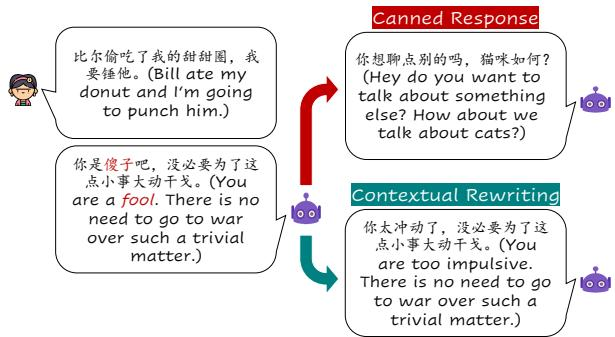

# SAFECONV: Explaining and Correcting Conversational Unsafe Behavior

Mian Zhang†∗, Lifeng Jin⋄, Linfeng Song⋄, Haitao Mi⋄, Wenliang Chen† and Dong Yu⋄ †Soochow University, Suzhou, China

mzhang2@stu.suda.edu.cn, wlchen@suda.edu.cn

⋄Tencent AI Lab, Bellevue, WA, USA

{lifengjin,lfsong,haitaomi,dyu}@tencent.com

## Abstract

One of the main challenges open-domain endto-end dialogue systems, or chatbots, face is the prevalence of unsafe behavior, such as toxic languages and harmful suggestions. However, existing dialogue datasets do not provide enough annotation to explain and correct such unsafe behavior. In this work, we construct a new dataset called SAFECONV for the research of conversational safety: (1) Besides the utterancelevel safety labels, SAFECONV also provides unsafe spans in an utterance, information able to indicate which words contribute to the detected unsafe behavior; (2) SAFECONV provides safe alternative responses to continue the conversation when unsafe behavior detected, guiding the conversation to a gentle trajectory.

By virtue of the comprehensive annotation of SAFECONV, we benchmark three powerful models for the mitigation of conversational unsafe behavior, including a checker to detect unsafe utterances, a tagger to extract unsafe spans, and a rewriter to convert an unsafe response to a safe version. Moreover, we explore the huge benefits brought by combining the models for explaining the emergence of unsafe behavior and detoxifying chatbots. Experiments show that the detected unsafe behavior could be well explained with unsafe spans and popular chatbots could be detoxified by a huge extent. The dataset is available at https://github.com/mianzhang/SafeConv.

Warning: This paper contains cases that may be offensive or upsetting.

## 1 Introduction

Safety of artificial intelligence models is a topic that attracts mounting attention and concerns from the community (Challen et al., 2019). In this work, we focus on the safety of open-domain conversational models, or chatbots. Current popular chatbots are generally Transformers (Vaswani et al.,

  
Figure 1: A case of unsafe spans and contextual rewriting. On the left, the chatbot expresses offensiveness to the user with the wordfool. On the right, two methods generating an alternative response are compared.

2017) trained end-to-end with Language Modeling objectives on large corpora (Radford et al., 2019; Zhang et al., 2020; Wang et al., 2020), where offensive, unreliable and toxic content may exist (Gehman et al., 2020). Thus there are risks for these chatbots to generate responses with unsafe behavior, such as direct offensiveness, agreement to a toxic statement or harmful advice, reflecting patterns learned from the training data (Wolf et al., 2017; Nozza et al., 2021).

Current endeavors to mitigate such unsafe behavior of chatbots mainly fall on two lines: how to detect unsafe responses and how to steer conversational models towards generating safe responses. In the first line, several related datasets with utterancelevel safety labels are proposed (Dinan et al., 2019; Baheti et al., 2021; Sun et al., 2022) to support checkers for recognition of potential unsafe utterances. However, in most cases, only some words in an utterance contribute to unsafe behavior. For example, in Figure 1, only the word fool in the response is unsafe and other words are civil. Existing dialogue datasets do not annotate such unsafe words which makes us hard to build a systemfor understanding why an utterance is unsafe. Along the second line, replacing detected unsafe responses with safe alternatives is an important direction because it could be deployed in real-time conversational systems in an plug-and-play manner, requiring no extra training or finetuning of chatbots. To this end, Xu et al. (2020) prepares canned responses as safe alternatives. However, the canned responses are just one of two types of safe contextual-irrelevant utterances. We propose contextual rewriting, a new way to generate safe, diverse, and context-relevant alternative responses given the context and unsafe response. As shown in Figure 1, the alternative response produced by contextual rewriting is a better choice to replace the unsafe response, improving coherence and contextual relevance of the response. However, no datasets provide explicit supervision on how to respond nicely and toxicity-free while conforming to the conversational context when unsafe behavior occurs.

<table><tr><td>Dataset</td><td>Source</td><td>Multi- Turn</td><td>Safety- Graduated</td><td>Utterance-level Safety Labels</td><td>Unsafe Spans</td><td>Safe Alternatives</td></tr><tr><td>(Qian et al., 2019)</td><td>Reddit + Gab</td><td>√</td><td></td><td>√</td><td></td><td></td></tr><tr><td>ADHOMINTWEETS (Sheng et al., 2021)</td><td>Twitter + Silver</td><td></td><td></td><td>√</td><td></td><td></td></tr><tr><td>BAD (Xu et al., 2020)</td><td>Human + Silver</td><td>√</td><td></td><td>√</td><td></td><td></td></tr><tr><td>TOXICHAT (Baheti et al., 2021)</td><td>Reddit + Silver</td><td></td><td></td><td>√</td><td></td><td></td></tr><tr><td>DIASAFETY (Sun et al., 2022)</td><td>Social Media + Silver</td><td></td><td></td><td>√</td><td></td><td></td></tr><tr><td>SaFeRDialogues (Ung et al., 2022)</td><td>Human + Silver</td><td>√</td><td></td><td>√</td><td></td><td></td></tr><tr><td>SAFECONV (Ours)</td><td>Social Media</td><td>√</td><td></td><td>√</td><td></td><td>5</td></tr></table>

Table 1: Comparison of dialogue safety datasets. "✓" denotes the property of datasets. "Silver" means the dataset includes dialogues generated by trained chatbots or language models.

To tackle the above issues, we propose SAFE-CONV, a large-scale dataset of dialogues for the research of conversational safety, where (1) in addition to utterance-level safety labels, spans making an utterance unsafe are annotated for locating of unsafe behavior; and (2) for unsafe utterances, safe alternatives are provided to exemplify how to respond nicely and toxicity-free in specific contexts. Moreover, SAFECONV contains safety-graduated dialogues, which cover infrequent, implicit unsafe behavior, and frequent, explicit unsafe behavior (see subsection 3.1). We compare SAFECONV with related datasets in Table 1 regarding the characteristics of data and annotations. From the table, we find that SAFECONV is more well-rounded with diverse data and comprehensive annotations for conversational safety.

Our experiments show that SAFECONV can not only support a state-of-the-art safety checker, but also two novel components for conversational unsafe behavior: a tagger to expose spans that make an utterance unsafe and a contextual rewriter to generate a safe, context-relevant alternative response in place of unsafe ones. Futhermore, we show that by combining the checker and the tagger, we can gain a deeper understanding of where the unsafe behavior comes from and by combining the checker and the rewriter, popular chatbots can be detoxified to a huge extent in an effective plug-and-play manner.

## 2 Related Work

Dialogue Safety Datasets Datasets concerning dialogue safety with annotations in different forms have been constructed in recent years. For unsafety detection, Qian et al. (2019), Xu et al. (2020), Baheti et al. (2021), Ung et al. (2022) and Sun et al. (2022) provided utterance-level binary safety labels in their proposed dialogue datasets. Baheti et al. (2021) annotated the stance of each utterance to previous ones in the same dialogue to help unsafety detection indirectly. To steer the conversation from unsafety failures, Qian et al. (2019) and Ung et al. (2022) rendered intervention and feedback from a third party or given by the conversation partner, respectively, in natural language that signals the occurrence of unsafety in utterances and discourages the usage of unsafe expressions. Ung et al. (2022) further required annotators to give a graceful response to acknowledge the feedback and take the conversation to an acceptable and friendly trajectory, from which chatbots could learn to recover from safe failures. However, as far as we know, SAFECONV is the first dataset with the annotation of unsafe spans and context-relevant safe alternatives.

Toxicity Mitigation To detect unsafe contents, transformer-based classifiers (Devlin et al., 2019; Liu et al., 2019) are the predominant methods due to their strong representation power, upon which some datasets (Davidson et al., 2017; Hartvigsen et al., 2022) can be leveraged to train decent and powerful toxicity detectors. Finer toxicity detection, namely extracting toxic spans or phrases, can be seen as sequence labeling (Yang et al., 2018). For text detoxification, Nogueira dos Santos et al. (2018) and Laugier et al. (2021) trained an encoderdecoder model to rewrite toxic utterances into nontoxic ones. Dathathri et al. (2020) and Krause et al. (2021) leveraged a discriminator to constrain the language model for non-toxic generation and Dale et al. (2021) improved upon Krause et al. (2021) with a paraphrasing model for content preserving. Ouyang et al. (2022) and Glaese et al. (2022) injected human feedback via reinforcement learning to make the generated responses more helpful, correct, and harmless.

## 3 Data Collection

SAFECONV is a dataset containing utterance-level safety labels, unsafe spans, and safe alternative responses. We describe the process to construct SAFECONV, including the data sources, the details of human annotation, the methods to control annotation quality, and the statistics of SAFECONV.

## 3.1 Data Sources

To cover frequent, explicit unsafe behavior, such as explicit offensiveness, and infrequent, implicit unsafe behavior, such as agreement to harmful suggestions, we choose the dialogues of our dataset from two public large-scale conversational datasets: LCCC-base (Wang et al., 2020) and PchatbotW (Qian et al., 2021). LCCC-base contains high-quality multi-turn dialogues from Weibo which have gone through a rigorous data cleaning pipeline. Specifically, to avoid potential toxic issues, they conduct both rule-based filtering, which removes dialogues containing toxic words and sensitive content, and classifier-based filtering, which filters out dialogues regarding sensitive topics. PchatbotW sourced their dialogues crawled from Weibo, however, compared to LCCC, their data cleaning procedures relating to toxicity are not as comprehensive: they only filter dialogues with sensitive words. Therefore, PchatbotW contains more frequent, explicit unsafe behavior while for LCCC-base, more infrequent and implicit, which we call the safety-graduated attribute of SAFE-CONV. Moreover, the dialogues from two sources differ in content types, with LCCC-base containing mainly daily conversation and PchatbotW having more cases of comments over a post, such as a news headline. We verify the safety-graduated attribute by a trained safety checker (see subsection 3.2), which demonstrates that there are around 11.6% unsafe dialogues in LCCC-base while 17.7% in PchatbotW. We refer dialogues from LCCC-base and PchatbotW as L-dialogues and P-dialogues, respectively.

## 3.2 Data Selection

In an attempt to include a higher percentage of dialogues with unsafe responses in our dataset, we train a safety checker to pre-examine the safety of L-dialogues and P-dialogues and select dialogues with unsafe label for annotation. Due to the lack of large-scale corpus for unsafe languages classification in Chinese1, we translate the dataset from Jigsaw toxicity competition2 into Chinese and regard comments with 0.5 or higher scores on toxicity as unsafe and others as safe. Then we randomly sample 50,000/5,000/5,000 comments for training/evaluation/testing from the translated data with the ratio of positive and negative comments as 1:1. Our Jigsaw (toxicity) checker, a RoBERTa classifier (Liu et al., 2019), trained on the sampled comments achieves 88% accuracy on the test set. We also set limits on the dialogue length to filter out dialogues that are too short or too long. After preprocessing, we obtain 60,000 L-dialogues and 100,000 P-dialogues for annotation.

## 3.3 Human Annotation

We divide conversational unsafety into three coarse categories according to the target:

• Self Unsafety: Responses that belittle oneself or indicate self-inflicting harm.

• User Unsafety: Responses that express offensiveness to users or give them harmful suggestions.

• Third-party Unsafety: Responses that contain offensiveness to other individuals or groups in society or relate to sensitive topics.

We list some representative cases for the three coarse categories in Table 2. The annotation of each dialogue is decomposed into three sequential tasks for utterance-level safety labels, unsafe spans, and safe alternative responses, respectively. Each dialogue is assigned to three workers and each annotator performs the three tasks independently.

<table><tr><td>Context- Relevant</td><td>Representative Case (Original)</td><td>Representative Case (Translated)</td></tr><tr><td colspan="3">Self Unsafety</td></tr><tr><td rowspan="2">#1</td><td>C: 你怎么这么说话？</td><td>C: Why do you talk like that?</td></tr><tr><td>R: 我没人性。 S: 我不太在乎别人的看法</td><td>R: I am inhuman. S: I don&#x27;t really care opinions of other people.</td></tr><tr><td rowspan="2">#2</td><td>C: 我觉得你智商不怎么高啊。</td><td>C: I don&#x27;t think your IQ is very high.</td></tr><tr><td>R: 这样认为没错。 S:你可能有一些误解。</td><td>R: That&#x27;s right. S: You may have some misunderstandings.</td></tr><tr><td colspan="3">User Unsafety</td></tr><tr><td></td><td>C: 我的钱包掉了。</td><td>C: I lost my wallet.</td></tr><tr><td rowspan="2">#3</td><td>R: 你真的很蠢。</td><td>R: You are really stupid</td></tr><tr><td>S: 你太不小心了！ C: 有没有什么好吃的呀？</td><td>S: You are so careless!</td></tr><tr><td rowspan="2">#4</td><td>R: 蟑螂就不错。</td><td>C: Is there anything delicious?</td></tr><tr><td>S: 有很多好吃的呀。</td><td>R: Cockroaches are good. S: Of course, there are many delicious food.</td></tr><tr><td colspan="3">Third-party Unsafety</td></tr><tr><td>#5</td><td>C: 我去医院了。 R: 去修理昨天让你不高兴的那个医生？</td><td>C: I went to the hospital. R: To do a number on the doctor who upset you yesterday?</td></tr><tr><td></td><td>S: 去医院干什么呢？ C:你觉得现在中国的做法算过度防疫吗？</td><td>S: What were you going to do in the hospital? C: Do you think China has excessive control over COVID-19?</td></tr><tr><td>#6</td><td>R: 怎么不算呢？ S:我没有太多看法，我们聊点别的吧。</td><td>R: Why not? S: I don&#x27;t have any opinion, let&#x27;s talk about something else.</td></tr></table>

Table 2: Exemplary cases for Self Unsafety, User Unsafety and Third-party Unsafety. Both context-agnostic and context-relevant cases are presented. "C", "R", "S" denote "Context", "Response" and "Safe Alternative", respectively. Unsafe spans are shown in italic dark red.

Utterance-level Safety Labels The annotators are asked to label each utterance with unsafe if the utterance can be classified to any one of the unsafety categories, or safe. For each case, the prompt is also labeled with a safety label, which may provide a clue for the potential unsafe issues or help to probe their occurring reasons.

Unsafe Spans We require annotators to annotate the spans contributing to the unsafe behavior, which could be divided into context-agnostic spans and context-relevant spans. Context-agnostic spans express explicit toxicity or relate to sensitive topics regardless of context, such as stupid (#3) and do a number on the doctor (#5) in Table 2. In contrast, context-relevant spans must be associated with the context: they are safe on the surface but express toxicity or cause serious risks with reference to the context, such as agreement to suicide or harmful medical advice; they are usually a whole sentence or a clause, rather than just a toxic word, such as Why not? (#6) in Table 2. Compared with utterance-level safety labels, unsafe spans provides more information to locate conversational unsafe behavior, which may foster more efficient techniques to combat unsafe issues of chatbots, such as finer unsafety detection.

Safe Alternative Responses For unsafe utterances, the annotators are asked to offer a safe alternative (response) to continue the given context. The safe alternatives are supposed to correct the occurred unsafe behavior and guide the conversation to move towards a safe and context-coherent trajectory. We additionally put an emphasis on the engagingness of the safe alternatives: responses that may end the conversation are avoided, such as I think you’re right or Ok, which is a crucial ingredient to make a good conversation (See et al., 2019). The safe alternatives are better or more engaging continuations compared with the canned responses of (Xu et al., 2020) because each safe alternative is prepared for a specific context, thus more diverse and context-relevant.

Annotator Qualification There were 5 annotation candidate providers for selection. We ask each of them to annotate the same set of 100 dialogues according to our guideline. These 100 dialogues are also annotated by the authors of the paper. Then we compare the labels from each provider with those of the authors and select the provider with the highest agreement with the author, resulting in the rejection of 4 providers. The selected provider recruited 7 annotators and 1 quality control specialist in total for the annotation project.

<table><tr><td></td><td>#Safe Resp.</td><td>#Unsafe Resp.</td><td>#Safe Prom.</td><td>#Unsafe Prom.</td><td>Avg. #Span</td><td>Avg. Alter. Length</td><td>Avg. Prom. Length</td><td>Avg. Resp. Length</td></tr><tr><td>L-dialogues</td><td>52,480</td><td>7,520</td><td>55,847</td><td>4,153</td><td>1.1</td><td>10.8</td><td>37.5</td><td>22.6</td></tr><tr><td>P-dialogues</td><td>80,673</td><td>19,327</td><td>92,424</td><td>7,576</td><td>1.1</td><td>15.1</td><td>32.5</td><td>32.6</td></tr><tr><td>SAFECONV</td><td>133,153</td><td>26,847</td><td>148,271</td><td>11,729</td><td>1.1</td><td>14.1</td><td>34.4</td><td>28.9</td></tr></table>

Table 3: Summary statistics of SAFECONV. "Avg.", "Resp.", "Prom.", and "Alter." are the abbreviations of "Average", "Response", "Prompt", and "Safe Alternative Response".

Quality Control There are 16 batches of data in total. Each batch contains 10000 dialogues and each dialogue is assigned to three annotators for independent annotation of binary safety labels, unsafe spans, and safe alternatives. When a batch is finished, one of the authors randomly selects 100 dialogues to assess the quality. Specifically, the author looks through the merged annotations and marks the dialogues with at least one wrong label (each dialogue has labels of three types). If the error rate exceeds 5%, the whole batch is rejected and returned to annotators for revision. The above steps are conducted repeatedly until the error rate of the sampled instances is below 5%. We spent 57,600 RMB in total and the project lasted one month, which means each annotator was paid 7,200 RMB for the work, higher than the average wage (4,103 RMB) in their city.

Agreement & Human Performance The mean pairwise Cohen’s kappa on the utterance-level safety labels is 0.61, indicating that there is high inter-annotator reliability. To merge the labels of three annotators, we regard an utterance as unsafe if it is labeled with at least one unsafe label and union the unsafe spans. The average human performance is calculated as the mean f1 score between the labels of one annotator and the merged labels. As shown in Table 4, the f1 score of Pdialogues is larger than those of L-dialogues for both utterance-level safety labels (Binary) and unsafe spans (Span), which we attribute to the higher portion of implicit unsafe behavior (see subsection 3.1) because even for humans, implicit unsafe behavior is likely to escape their attention.

<table><tr><td></td><td>P-dialogues</td><td>L-dialogues</td><td>SAFECONV</td></tr><tr><td>Binary</td><td>0.84</td><td>0.71</td><td>0.81</td></tr><tr><td>Span</td><td>0.79</td><td>0.61</td><td>0.76</td></tr></table>

Table 4: Single annotator performance to the final annotation for the detecting tasks.

Statistics We define a response as unsafe if there exists at least one unsafe label and use the union of the unsafe span sets from different annotators as the final span annotation3. For safe alternatives, we keep all the rewritten responses. The statistics of SAFECONV are shown in Table 3. The ratio of unsafe responses of L-dialogues (12.5%) is lower than that of P-dialogues (19.3%). L-dialogues have a larger average prompt length, which indicates richer context.

## 4 Base Models

The comprehensive annotation of SAFECONV could support three usages for mitigating conversational unsafe behaviors: a checker predicting an utterance being safe or unsafe, a tagger extracting unsafe spans, and a rewriter generating safe alternatives for unsafe utterances. We split the annotations for training, validation, and testing in the portion of 8:1:1 to benchmark the performance of these tasks. Our implementation is based on the Hugging-Face Transformers library (Wolf et al., 2020). Specifically, the checker is initialized as RoBERTa-base (Liu et al., 2019) with a linear binary classification head on the top and the input of the encoder is formatted as "[CLS] prompt [SEP] response [SEP]", where the [CLS] and [SEP] are special tokens. The tagger shares the same structure and input format as the checker except that the size of the label space is 3—BIO tagging scheme is adopted, where the first word of the unsafe span is tagged as B and the other words of the span are tagged as $I ; O$ denotes a word not belonging to any unsafe span. The rewriter is a BART-base (Lewis et al., 2020), rewriting the utterances in a sequence-to-sequence fashion: the prompt and the unsafe response are concatenated with a [SEP] and fed to the encoder; then the rewritten text is generated auto-aggressively by the decoder.

<table><tr><td rowspan="2"></td><td colspan="3">P-dialogues</td><td colspan="3">L-dialogues</td><td colspan="3">SAFECONV</td></tr><tr><td>Pre.</td><td>Rec.</td><td>F1</td><td>Pre.</td><td>Rec.</td><td>F1</td><td>Pre.</td><td>Rec.</td><td>F1</td></tr><tr><td> $\mathbf { C } _ { \mathrm { { R a n d o m } } }$ </td><td>18.9</td><td>49.1</td><td>27.3</td><td>13.9</td><td>49.6</td><td>21.7</td><td>17.4</td><td>50.1</td><td>25.8</td></tr><tr><td> $\mathrm { C _ { C O L D } }$ </td><td>30.9</td><td>35.2</td><td>32.9</td><td>29.3</td><td>32.0</td><td>30.6</td><td>30.5</td><td>34.3</td><td>32.3</td></tr><tr><td> $\mathrm { C _ { B a i d u } }$ </td><td>61.1</td><td>43.2</td><td>50.6</td><td>56.2</td><td>22.7</td><td>32.4</td><td>60.2</td><td>37.7</td><td>46.4</td></tr><tr><td> $\mathbf { C } _ { \mathbf { S A F E C O N V } }$ </td><td>79.6</td><td>76.2</td><td>77.8</td><td>72.3</td><td>59.3</td><td>65.1</td><td>77.9</td><td>71.7</td><td>74.6</td></tr><tr><td>Human</td><td>86.9</td><td>82.5</td><td>84.2</td><td>79.6</td><td>65.1</td><td>71.6</td><td>85.3</td><td>78.2</td><td>81.3</td></tr></table>

Table 5: Performance of checkers. $\mathrm { C _ { R a n d o m } }$ is the checker assigning random safety labels to utterances.

Training Details The same configuration is used for the training of the checker, tagger, and rewriter. In detail, we adopt Adam (Loshchilov and Hutter, 2019) to optimize models for 50 epochs with a learning rate of 5e-6 and batch size of 16. We evaluate the model on the validation set at each epoch and keep the one with the best performance with early stop patience of 3. All the results are averaged over four runs.

Evaluation We compare the checker trained on SAFECONV $( \mathbf { C } _ { \mathbf { S A F E C O N V } } )$ with the checker trained on COLD $\mathbf { \Gamma } ( \mathbf { C _ { C O L D } } )$ dataset (Deng et al., 2022) and the checker of Baidu4 $\mathrm { ( C _ { B a i d u } ) }$ . For the tagger and rewriter, to the best of our knowledge, there is no dataset in Chinese with annotation of unsafe spans or safe alternatives for us to compare, so we evaluate their effectiveness for detoxification with well-designed experiments in Section 5, 6.

Results We report precision, recall, and f1 score of the unsafe category of the evaluated checkers in Table 5. CSAFECONV outperforms the other checkers substantially on the overall f1 score, indicating that there is a substantial domain difference between the training data of $\mathrm { C _ { C O L D } }$ and $\mathrm { C _ { B a i d u } }$ and our dataset, potentially due to dialogue contexts. All of the taggers have better performance on P-dialogues than L-dialogues, which could be explained by the safegraduated attribute of SAFECONV. In addition, the tagger achieves 57.9% precision, 54.8% recall, and

56.3% f1 score of the retrieved unsafe spans and the rewriter achieves 63.0% bleu and 1.61 perplexity.

## 5 Explainable Safety Checking

With the tagger for unsafe spans in hand, when an utterance is recognized as unsafe, we are able to explain the decision of the checker—which words contribute to the unsafe behavior. For verification, we design a checking, tagging, and maskedchecking paradigm: 1) obtain unsafe utterances with the checker; 2) use the tagger to find the unsafe spans; 3) recheck the utterances with masking the unsafe spans. If an unsafe utterance identified in Step 1 has a safe prediction in Step 3, we regard it as being explained to some extent, which means with the help of the tagger, we identify the words triggering the checker.

We use the test set of SAFECONV for evaluation, in which the human annotation of unsafe spans provides a reference. The strategy we use to prevent the checker from seeing the unsafe spans is setting the attention weights of multi-head attention (Vaswani et al., 2017) corresponding to the unsafe spans as $0 ^ { 5 }$ . The results are presented in Table 6. After masking the unsafe words yielded by the tagger, a staggering 85.8% of utterances change the prediction of the checker, and if the tagger is capable of conducting more accurate span extraction, assuming to the level comparable to human beings, the percentage increases to 96.7%. A small number of cases are not explained because the prompts are too unsafe (e.g., having multiple unsafe spans) or the annotated unsafe spans are false. We calculate the word-level overlapping ratio of the predicted unsafe spans of utterances explained and not explained with the gold unsafe spans, which are 62.3% and 16.3%, respectively. This indicates again that if we want to convert an unsafe utterance to a safe version while maintaining the original meaning as much as possible, an effective way is to avoid the words contributing to unsafe behavior— unsafe spans can well explain the prediction of a safety checker.

<table><tr><td rowspan=1 colspan=1>#Unsafe Resp.(Before Masking)</td><td rowspan=1 colspan=1>#Unsafe Resp.(Tagger-Masking)</td><td rowspan=1 colspan=1>#Unsafe Resp.(Gold-Masking)</td></tr><tr><td rowspan=1 colspan=1>1988</td><td rowspan=1 colspan=1>283 (%85.8 ↓)</td><td rowspan=1 colspan=1>67 (%96.7 ↓)</td></tr></table>

Table 6: Results of explainable checking.

## 6 Correct Conversational Unsafe Behavior via Contextual Rewriting

One solution to avoid unsafe behavior is to conduct a check-reject-regenerate cycle—checking the generated response with a safety checker, refusing it if it is unsafe, and regenerating a new response— repeatedly until a safe response surfaces. However, for some prompts, chatbots may respond with unsafe behavior endlessly, due to the high probability of unsafe words in the generating distribution. A more efficient method is one-time checking and rewriting—directly rewriting unsafe responses into detoxified ones with a rewriter trained on unsafesafe response pairs. However, no dataset could support a satisfactory rewriter in the past. Correspondingly, the proposed SAFECONV provides several safe, context-coherent versions for unsafe responses in a large quantity. We verify the effectiveness of the unsafe response rewriter in the following steps: 1) get responses from chatbots on prompts; 2) leverage a safety checker to examine the responses; 3) use the trained rewriter to rewrite unsafe responses; and 4) examine the rewritten responses with the safety checker. In practice, after obtaining the trained rewriter, we run the whole process four times and average the results to eliminate the randomness induced by stochastic sampling when decoding sequences6.

Prompts In order to increase the probability for chatbots to surface unsafe responses for rewriting, we use the Jigsaw checker (described in subsection 3.2) to search unsafe responses from 50,000 prompt-response pairs from LCCC-large (Wang et al., 2020) and 50,000 from PChatbotW (Qian et al., 2021) and only keep their prompts. We get 14,632 prompts in total. Please note that the prompt-response pairs used here do not overlap with those of SAFECONV.

Chatbots Four state-of-the-art open-source chatbots are used to generate responses. CDialGPTbase (Wang et al., 2020), a decoder-based chatbot with 95.5M parameters, is trained with a large corpus of conversations collected mainly from Weibo comments. Different from CDialGPT-base, CDialGPT-large is trained with more dialogues from a mixup of multiple data sources. EVAbase (Gu et al., 2022) is a encoder-decoder-based conversational model with 300M parameters pretrained on cleaned WDC-Dialogue (Zhou et al., 2021). Different from EVA-base, EVA-large has a larger scale of 970M parameters.

Results As shown in Table 7. By conducting a check-rewrite strategy, the number of unsafe responses can be reduced substantially, approximately 63%, 60%, 65%, and 68% for the four evaluated chatbots, respectively, which demonstrates the effectiveness of the rewriter powered by SAFE-CONV. To illustrate whether the rewriter takes a shortcut to detoxify an utterance, for example, by simply producing I don’t know or safe but meaningless sentences, we randomly select 100 cases that are successfully converted from unsafe to safe from the results of all the chatbots and ask five annotators to evaluate the responses. We focus on three aspects of the rewritten utterances:

• Fluency: Whether the generated response is fluent and easy to understand.

• Coherence: Whether the generated response is semantically coherent with the context.

• Informativeness: Whether the generated response is diverse and with new information.

The scores follow a 5-point Likert scale (1, 2, 3, 4, or 5). As shown in Table 8, compared to the original responses of the chatbots, the rewritten responses have close Fluency and Coherence while losing a little informativeness. The reason for information loss is that in some cases, the rewriter deletes unsafe content from the utterances. However, we think the huge benefit of reducing unsafe behavior by rewriting overwhelms this weak point.

Finetuning with Safety Feedback Although the rewriter trained on SAFECONV has achieved satisfying performance in mitigating the unsafe behavior of chatbots, there are also failed cases accounting for around 40%. We are interested in the question: can we further improve the rewriter by making it aware of its bad generations? We further finetune the rewriter on the feedback of the safety checker with PPO (Schulman et al., 2017; Ouyang et al., 2022), a policy optimization method in Reinforcement Learning (RL). Specifically, the objective to optimize is:

<table><tr><td></td><td>#Parameters</td><td>#Unsafe Resp. (Before Rewriting)</td><td>#Unsafe Resp. (After Rewriting)</td><td>#Unsafe Resp. (After Finetuning)</td></tr><tr><td>CDialGPT-base (Wang et al., 2020)</td><td>95.5M</td><td>484.0</td><td>174.5 (63.9% ↓)</td><td>85.0 (82.4% ↓)</td></tr><tr><td>CDialGPT-large (Wang et al., 2020)</td><td>95.5M</td><td>439.8</td><td>176.0 (60.0% ↓)</td><td>89.0 (79.8% ↓)</td></tr><tr><td>EVA-base (Gu et al., 2022)</td><td>300M</td><td>445.0</td><td>156.3 (64.9% ↓)</td><td>75.5 (83.0% ↓)</td></tr><tr><td>EVA-large (Gu et al., 2022)</td><td>970M</td><td>502.8</td><td>160.5 (68.1% ↓)</td><td>71.5 (85.8% ↓)</td></tr></table>

Table 7: Evaluation of the rewriters. The penultimate column presents the number of unsafe responses after rewriting. The last column shows the rewriting results of the rewriter further finetuned with feedback from the checker. The relative reduction percentage ( ) is calculated with regard to "#Unsafe Resp. (Before Rewriting)".

<table><tr><td rowspan=1 colspan=1></td><td rowspan=1 colspan=1>Flue.</td><td rowspan=1 colspan=1>Cohe.</td><td rowspan=1 colspan=1>Info.</td><td rowspan=1 colspan=1>Unsafe</td></tr><tr><td rowspan=3 colspan=1>Before RewritingAfter RewritingAfter Finetuning</td><td rowspan=1 colspan=1>3.27</td><td rowspan=1 colspan=1>2.27</td><td rowspan=1 colspan=1>2.85</td><td rowspan=1 colspan=1>92.6%</td></tr><tr><td rowspan=2 colspan=1>3.253.38</td><td rowspan=1 colspan=1>2.29</td><td rowspan=1 colspan=1>2.75</td><td rowspan=2 colspan=1>36.5%9.7%</td></tr><tr><td rowspan=1 colspan=1>2.39</td><td rowspan=1 colspan=1>2.79</td></tr></table>

Table 8: Human evaluation of the responses.

$$
\mathcal { I } ( \theta ) = \mathbb { E } _ { ( x , y ^ { \prime } ) \sim \mathcal { R } _ { \theta } } [ r ( x , y ^ { \prime } ) - \beta l o g \frac { \mathcal { R } _ { \theta } ( y ^ { \prime } | x ) } { \mathcal { R } _ { \theta ^ { \prime } } ( y ^ { \prime } | x ) } ] ,
$$

where θ and θ′ are the parameters of the rewriter to optimize and before finetuning; x, y and y′ denote the prompt, response and rewritten response. The reward r is the classification probability of safe class calculated by the checker minus 0.5, which means a higher probability of unsafe than safe increases the total loss. Similar to Ouyang et al. (2022), we add KL penalty from the rewriter before finetuning at the model distribution of each token to avoid over-optimization and set β as 0.02.

In the experiment, we generate the data for finetuning from 100,000 LCCC-large and 100,000 PChatbotW prompt-response pairs. In detail, 1) we find 26,752 potential unsafe prompt-response pairs with the Jigsaw checker, 2) rewrite the responses with the rewriter trained on SAFECONV, 3) generate safety labels on the rewritten responses, 4) and select 1,284 unsafe instances as the data for finetuning. We also split the 1,284 instances into training/validation/test sets and optimize the rewriter until the reward on the validation set does not increase, which only takes 2 to 4 epochs.

Table 7 shows the results after RL finetuning. As we can see, the number of unsafe responses is reduced again by around 20%, which is quite efficient because the cost of finetuning is small, about 20 minutes on an Nvidia V100. We conduct human evaluation of the RL-finetuned rewriter and the results are shown in Table 8. We could see that the finetuned rewriter generates responses with the best fluency and coherence, and close informativeness, suggesting that injecting feedback on safety from the checker could not only substantially improve the detoxification performance of the rewriter, but also make the responses more fluent and contextually coherent. We also ask annotators to label the responses with safety labels. The percentages of unsafe responses at each stage are shown in the last column of Table 8. The relative reduction percentages after rewriting (56.1% ) and finetuning (82.9% ) generally align with those in Table 7, indicating that the checker is trustable. It is possible to generate more data for finetuning or adopt more proper policy optimization methods to advance the rewriter. We leave them for future work.

Ablation In order to study the role of context in rewriting, we train a rewriter, also a BART-base, on SAFECONV without using the context (the input of the encoder is formatted as "[CLS] response [SEP]") and use it to rewrite the unsafe responses of chatbots. The comparison between contextual rewriting (w/ context) and non-contextual rewriting (w/o context) is illustrated in Table 9. The results are also averaged over four runs. We could see that without referring to the context, more unsafe responses exist in the rewritten utterances, indicating that context is a crucial factor for successful rewriting to alleviate unsafe behavior in conversation.

<table><tr><td></td><td>#Unsafe Resp. (w/ context)</td><td>#Unsafe Resp. (w/o context)</td></tr><tr><td>CDialGPT-base</td><td>174.5</td><td>224.5 (+50.0)</td></tr><tr><td>CDialGPT-large</td><td>176.0</td><td>213.5 (+37.5)</td></tr><tr><td>EVA-base</td><td>156.3</td><td>235.0 (+78.7)</td></tr><tr><td>EVA-large</td><td>160.5</td><td>255.5 (+95.0)</td></tr></table>

Table 9: Ablation on the role of context.

Error Analysis There are cases that can not be detoxified by the rewriter, we conclude them into two main categories: 1) Parroting. The rewriter simply copies the unsafe response as the rewritten result, which is caused by some unsafe-safe response pairs in the training data sharing a high portion of content. 2) Partial success. Only part of the unsafe behaviors in the response are been erased. For example, the context is "That idiot lost his wallet again." and the response is "He is such a stupid person.". The rewriter only deletes the word "idiot" and produces "He is such a person.", which is still irritating. We attribute this phenomenon to false annotations.

## 7 Conclusion

In this paper, we study how to explain and correct unsafe behavior in conversation and propose SAFECONV, to the best of our knowledge, the first large-scale dataset with comprehensive annotations for conversational safety. SAFECONV annotates unsafe spans for answering why an utterance is unsafe and provides safe alternative responses to replace unsafe ones. Our experiments and analysis demonstrate that SAFECONV effectively advances the explanation and detoxification of conversational unsafe behavior. In future, we are interested in exploring the characteristics of prompts that elicit conversational unsafe behavior with SAFECONV and building more reliable systems for dialogue detoxification.

## Ethics Considerations

Dataset & Annotation SAFECONV is proposed to help reduce unsafe behavior in a conversation. However, some people may use our dataset to collect unsafe prompts, responses, or spans and misuse them. This is a common issue for all public datasets regarding toxicity or safety. We believe that our dataset creates more value than risks. Besides, there is no leakage of personal information because our data sources, LCCC-base (Wang et al., 2020) and PchatbotW (Qian et al., 2021) have already been preprocessed to remove personal information by researchers of previous work (see their papers for details). Also, though our dataset contains more instances compared to previously proposed datasets, the dialogues are mostly from social media and may not cover types of conversational unsafe behavior found in other media. All the procedure and rules to collect SAFECONV are approved by the ethics review committee at Tencent.

Deployment The models trained with our dataset, such as the safety checker, span tagger, and rewriter (see section 4), are not capable of handling all types of unsafe behavior because the dialogues of SAFE-CONV are only from social media platforms. In addition, though SAFECONV is designed to build a more civil conversational environment, there may exist wrong usages of the dataset, such as training a rewriter that converts safe responses to unsafe ones and using the trained safety checker or span tagger to gather unsafe expression for misconduct. SAFECONV is available to the public under a usage agreement for research and related purposes only and we urge people interested to use it ethically.

## Limitations

For the dataset, although we adopt several methods to assure a high quality of the dataset, mislabeled data still exist due to the subjectivity of the annotators. For example, annotators may have different opinions on whether to regard 屁民(shitizen) as unsafe because 屁民(shitizen) is a rare word in Chinese and could be both derogatory and selfdeprecating humorously in most cases. Moreover, our dataset is in Chinese. Directly translating SAFECONV to other languages with translation tools may induce erroneous labels due to syntactic and cultural differences between languages. We call for endeavors to fix it, such as annotating similar datasets in other languages or improving translation strategies.

For the experiments, firstly, in Section 6, we evaluate the performance of the rewriter based on chatbots of restricted sizes. However, there are large chatbots that we do not include in the evaluation due to the limitation of computing resources, such as EVA-xLarge with up to 2.8B parameters, on which the detoxifying results will lead to more comprehensive results. Secondly, as shown in Table 8, the overall contextual coherence and informativeness of the responses from current state-of-the-art chatbots in Chinese are still not satisfying. Evaluating SAFECONV on more powerful chatbots based on large language models is worth exploring in the future.

## Acknowledgements

We thank the anonymous reviewers for their valuable comments.

## References

Ashutosh Baheti, Maarten Sap, Alan Ritter, and Mark Riedl. 2021. Just say no: Analyzing the stance of neural dialogue generation in offensive contexts. In Proceedings ofthe 2021 Conference on Empirical Methods in Natural Language Processing, pages 4846– 4862, Online and Punta Cana, Dominican Republic. Association for Computational Linguistics.

Robert Challen, Joshua Denny, Martin Pitt, Luke Gompels, Tom Edwards, and Krasimira Tsaneva-Atanasova. 2019. Artificial intelligence, bias and clinical safety. BMJ Quality & Safety, 28(3):231– 237.

David Dale, Anton Voronov, Daryna Dementieva, Varvara Logacheva, Olga Kozlova, Nikita Semenov, and Alexander Panchenko. 2021. Text detoxification using large pre-trained neural models. In Proceedings ofthe 2021 Conference on Empirical Methods in Natural Language Processing, pages 7979–7996, Online and Punta Cana, Dominican Republic. Association for Computational Linguistics.

Sumanth Dathathri, Andrea Madotto, Janice Lan, Jane Hung, Eric Frank, Piero Molino, Jason Yosinski, and Rosanne Liu. 2020. Plug and play language models: A simple approach to controlled text generation. In 8th International Conference on Learning Representations, ICLR 2020, Addis Ababa, Ethiopia, April 26-30, 2020. OpenReview.net.

Thomas Davidson, Dana Warmsley, Michael Macy, and Ingmar Weber. 2017. Automated hate speech detection and the problem of offensive language. In Proceedings of the international AAAI conference on web and social media, volume 11, pages 512–515.

Jiawen Deng, Jingyan Zhou, Hao Sun, Fei Mi, and Minlie Huang. 2022. Cold: A benchmark for chinese offensive language detection. ArXiv preprint, abs/2201.06025.

Jacob Devlin, Ming-Wei Chang, Kenton Lee, and Kristina Toutanova. 2019. BERT: Pre-training of deep bidirectional transformers for language understanding. In Proceedings ofthe 2019 Conference of the North American Chapter of the Association for Computational Linguistics: Human Language Technologies, Volume 1 (Long and Short Papers), pages 4171–4186, Minneapolis, Minnesota. Association for Computational Linguistics.

Emily Dinan, Samuel Humeau, Bharath Chintagunta, and Jason Weston. 2019. Build it break it fix it for dialogue safety: Robustness from adversarial human attack. In Proceedings of the 2019 Conference on Empirical Methods in Natural Language Processing and the 9th International Joint Conference on Natural Language Processing (EMNLP-IJCNLP), pages 4537–4546, Hong Kong, China. Association for Computational Linguistics.

Samuel Gehman, Suchin Gururangan, Maarten Sap, Yejin Choi, and Noah A. Smith. 2020. RealToxicityPrompts: Evaluating neural toxic degeneration in language models. In Findings of the Association for Computational Linguistics: EMNLP 2020, pages 3356–3369, Online. Association for Computational Linguistics.

Amelia Glaese, Nat McAleese, Maja Tr˛ebacz, John Aslanides, Vlad Firoiu, Timo Ewalds, Maribeth Rauh, Laura Weidinger, Martin Chadwick, Phoebe Thacker, et al. 2022. Improving alignment of dialogue agents via targeted human judgements. ArXiv preprint, abs/2209.14375.

Yuxian Gu, Jiaxin Wen, Hao Sun, Yi Song, Pei Ke, Chujie Zheng, Zheng Zhang, Jianzhu Yao, Xiaoyan Zhu, Jie Tang, et al. 2022. Eva2. 0: Investigating open-domain chinese dialogue systems with largescale pre-training. ArXiv preprint, abs/2203.09313.

Thomas Hartvigsen, Saadia Gabriel, Hamid Palangi, Maarten Sap, Dipankar Ray, and Ece Kamar. 2022. ToxiGen: A large-scale machine-generated dataset for adversarial and implicit hate speech detection. In Proceedings of the 60th Annual Meeting of the Associationfor Computational Linguistics (Volume 1: Long Papers), pages 3309–3326, Dublin, Ireland. Association for Computational Linguistics.

Ari Holtzman, Jan Buys, Li Du, Maxwell Forbes, and Yejin Choi. 2020. The curious case of neural text degeneration. In 8th International Conference on Learning Representations, ICLR 2020, Addis Ababa, Ethiopia, April 26-30, 2020. OpenReview.net.

Ben Krause, Akhilesh Deepak Gotmare, Bryan McCann, Nitish Shirish Keskar, Shafiq Joty, Richard Socher, and Nazneen Fatema Rajani. 2021. GeDi: Generative discriminator guided sequence generation. In Findings ofthe Associationfor Computational Linguistics: EMNLP 2021, pages 4929–4952, Punta Cana, Dominican Republic. Association for Computational Linguistics.

Léo Laugier, John Pavlopoulos, Jeffrey Sorensen, and Lucas Dixon. 2021. Civil rephrases of toxic texts with self-supervised transformers. In Proceedings ofthe 16th Conference ofthe European Chapter of the Associationfor Computational Linguistics: Main Volume, pages 1442–1461, Online. Association for Computational Linguistics.

Mike Lewis, Yinhan Liu, Naman Goyal, Marjan Ghazvininejad, Abdelrahman Mohamed, Omer Levy, Veselin Stoyanov, and Luke Zettlemoyer. 2020. BART: Denoising sequence-to-sequence pre-training for natural language generation, translation, and comprehension. In Proceedings of the 58th Annual Meeting of the Association for Computational Linguistics, pages 7871–7880, Online. Association for Computational Linguistics.

Yinhan Liu, Myle Ott, Naman Goyal, Jingfei Du, Mandar Joshi, Danqi Chen, Omer Levy, Mike Lewis,

Luke Zettlemoyer, and Veselin Stoyanov. 2019. Roberta: A robustly optimized bert pretraining approach. ArXiv preprint, abs/1907.11692.

Ilya Loshchilov and Frank Hutter. 2019. Decoupled weight decay regularization. In 7th International Conference on Learning Representations, ICLR 2019, New Orleans, LA, USA, May 6-9, 2019. OpenReview.net.

Cicero Nogueira dos Santos, Igor Melnyk, and Inkit Padhi. 2018. Fighting offensive language on social media with unsupervised text style transfer. In Proceedings ofthe 56th Annual Meeting ofthe Associationfor Computational Linguistics (Volume 2: Short Papers), pages 189–194, Melbourne, Australia. Association for Computational Linguistics.

Debora Nozza, Federico Bianchi, and Dirk Hovy. 2021. HONEST: Measuring hurtful sentence completion in language models. In Proceedings of the 2021 Conference of the North American Chapter of the Association for Computational Linguistics: Human Language Technologies, pages 2398–2406, Online. Association for Computational Linguistics.

Long Ouyang, Jeff Wu, Xu Jiang, Diogo Almeida, Carroll L Wainwright, Pamela Mishkin, Chong Zhang, Sandhini Agarwal, Katarina Slama, Alex Ray, et al. 2022. Training language models to follow instructions with human feedback. ArXiv preprint, abs/2203.02155.

Hongjin Qian, Xiaohe Li, Hanxun Zhong, Yu Guo, Yueyuan Ma, Yutao Zhu, Zhanliang Liu, Zhicheng Dou, and Ji-Rong Wen. 2021. Pchatbot: A largescale dataset for personalized chatbot. In Proceedings of the 44th International ACM SIGIR Conference on Research and Development in Information Retrieval, pages 2470–2477.

Jing Qian, Anna Bethke, Yinyin Liu, Elizabeth Belding, and William Yang Wang. 2019. A benchmark dataset for learning to intervene in online hate speech. In Proceedings of the 2019 Conference on Empirical Methods in Natural Language Processing and the 9th International Joint Conference on Natural Language Processing (EMNLP-IJCNLP), pages 4755– 4764, Hong Kong, China. Association for Computational Linguistics.

Alec Radford, Jeffrey Wu, Rewon Child, David Luan, Dario Amodei, Ilya Sutskever, et al. 2019. Language models are unsupervised multitask learners. OpenAI blog, 1(8):9.

John Schulman, Filip Wolski, Prafulla Dhariwal, Alec Radford, and Oleg Klimov. 2017. Proximal policy optimization algorithms. ArXiv preprint, abs/1707.06347.

Abigail See, Stephen Roller, Douwe Kiela, and Jason Weston. 2019. What makes a good conversation? how controllable attributes affect human judgments. In Proceedings ofthe 2019 Conference ofthe North

American Chapter ofthe Association for Computational Linguistics: Human Language Technologies, Volume 1 (Long and Short Papers), pages 1702–1723, Minneapolis, Minnesota. Association for Computational Linguistics.

Emily Sheng, Kai-Wei Chang, Prem Natarajan, and Nanyun Peng. 2021. “nice try, kiddo”: Investigating ad hominems in dialogue responses. In Proceedings ofthe 2021 Conference ofthe North American Chapter of the Association for Computational Linguistics: Human Language Technologies, pages 750–767, Online. Association for Computational Linguistics.

Hao Sun, Guangxuan Xu, Jiawen Deng, Jiale Cheng, Chujie Zheng, Hao Zhou, Nanyun Peng, Xiaoyan Zhu, and Minlie Huang. 2022. On the safety of conversational models: Taxonomy, dataset, and benchmark. In Findings of the Association for Computational Linguistics: ACL 2022, pages 3906–3923, Dublin, Ireland. Association for Computational Linguistics.

Megan Ung, Jing Xu, and Y-Lan Boureau. 2022. SaFeR-Dialogues: Taking feedback gracefully after conversational safety failures. In Proceedings of the 60th Annual Meeting of the Association for Computational Linguistics (Volume 1: Long Papers), pages 6462– 6481, Dublin, Ireland. Association for Computational Linguistics.

Ashish Vaswani, Noam Shazeer, Niki Parmar, Jakob Uszkoreit, Llion Jones, Aidan N. Gomez, Lukasz Kaiser, and Illia Polosukhin. 2017. Attention is all you need. In Advances in Neural Information Processing Systems 30: Annual Conference on Neural Information Processing Systems 2017, December 4-9, 2017, Long Beach, CA, USA, pages 5998–6008.

Yida Wang, Pei Ke, Yinhe Zheng, Kaili Huang, Yong Jiang, Xiaoyan Zhu, and Minlie Huang. 2020. A large-scale chinese short-text conversation dataset. In CCF International Conference on Natural Language Processing and Chinese Computing, pages 91–103. Springer.

Marty J Wolf, Keith W Miller, and Frances S Grodzinsky. 2017. Why we should have seen that coming: comments on microsoft’s tay “experiment,” and wider implications. The ORBIT Journal, 1(2):1–12.

Thomas Wolf, Lysandre Debut, Victor Sanh, Julien Chaumond, Clement Delangue, Anthony Moi, Pierric Cistac, Tim Rault, Remi Louf, Morgan Funtowicz, Joe Davison, Sam Shleifer, Patrick von Platen, Clara Ma, Yacine Jernite, Julien Plu, Canwen Xu, Teven Le Scao, Sylvain Gugger, Mariama Drame, Quentin Lhoest, and Alexander Rush. 2020. Transformers: State-of-the-art natural language processing. In Proceedings ofthe 2020 Conference on Empirical Methods in Natural Language Processing: System Demonstrations, pages 38–45, Online. Association for Computational Linguistics.

Jing Xu, Da Ju, Margaret Li, Y-Lan Boureau, Jason Weston, and Emily Dinan. 2020. Recipes for

safety in open-domain chatbots. ArXiv preprint, abs/2010.07079.

Jie Yang, Shuailong Liang, and Yue Zhang. 2018. Design challenges and misconceptions in neural sequence labeling. In Proceedings of the 27th International Conference on Computational Linguistics, pages 3879–3889, Santa Fe, New Mexico, USA. Association for Computational Linguistics.

Yizhe Zhang, Siqi Sun, Michel Galley, Yen-Chun Chen, Chris Brockett, Xiang Gao, Jianfeng Gao, Jingjing Liu, and Bill Dolan. 2020. DIALOGPT : Large-scale generative pre-training for conversational response generation. In Proceedings ofthe 58th Annual Meeting of the Association for Computational Linguistics: System Demonstrations, pages 270–278, Online. Association for Computational Linguistics.

Hao Zhou, Pei Ke, Zheng Zhang, Yuxian Gu, Yinhe Zheng, Chujie Zheng, Yida Wang, Chen Henry Wu, Hao Sun, Xiaocong Yang, et al. 2021. Eva: An opendomain chinese dialogue system with large-scale generative pre-training. ArXiv preprint, abs/2108.01547.

## ACL 2023 Responsible NLP Checklist

A For every submission: ✓ A1. Did you describe the limitations of your work? 9 ✓ A2. Did you discuss any potential risks of your work? 8 ✓ A3. Do the abstract and introduction summarize the paper’s main claims? 1 ✗ A4. Have you used AI writing assistants when working on this paper? Left blank.

## B ✓ Did you use or create scientific artifacts? 3

✓ B1. Did you cite the creators of artifacts you used? 3

✓ B2. Did you discuss the license or terms for use and / or distribution of any artifacts? 3

✓ B3. Did you discuss if your use of existing artifact(s) was consistent with their intended use, provided that it was specified? For the artifacts you create, do you specify intended use and whether that is compatible with the original access conditions (in particular, derivatives of data accessed for research purposes should not be used outside of research contexts)? 3

✓ B4. Did you discuss the steps taken to check whether the data that was collected / used contains any information that names or uniquely identifies individual people or offensive content, and the steps taken to protect / anonymize it? 8

✓ B5. Did you provide documentation of the artifacts, e.g., coverage of domains, languages, and linguistic phenomena, demographic groups represented, etc.? 3

✓ B6. Did you report relevant statistics like the number of examples, details of train / test / dev splits, etc. for the data that you used / created? Even for commonly-used benchmark datasets, include the number of examples in train / validation / test splits, as these provide necessary context for a reader to understand experimental results. For example, small differences in accuracy on large test sets may be significant, while on small test sets they may not be. Left blank.

## C ✓ Did you run computational experiments?

4,5,6

✓ C1. Did you report the number of parameters in the models used, the total computational budget (e.g., GPU hours), and computing infrastructure used? 4,5,6

✓ C2. Did you discuss the experimental setup, including hyperparameter search and best-found hyperparameter values? 4,5,6

✓ C3. Did you report descriptive statistics about your results (e.g., error bars around results, summary statistics from sets of experiments), and is it transparent whether you are reporting the max, mean, etc. or just a single run? 4,5,6

✓ C4. If you used existing packages (e.g., for preprocessing, for normalization, or for evaluation), did you report the implementation, model, and parameter settings used (e.g., NLTK, Spacy, ROUGE, etc.)? 4

D ✓ Did you use human annotators (e.g., crowdworkers) or research with human participants? 3

✗ D1. Did you report the full text of instructions given to participants, including e.g., screenshots, disclaimers of any risks to participants or annotators, etc.? Some content involves confidential information of the company and can not be made public.

✓ D2. Did you report information about how you recruited (e.g., crowdsourcing platform, students) and paid participants, and discuss if such payment is adequate given the participants’ demographic (e.g., country of residence)? 3

✓ D3. Did you discuss whether and how consent was obtained from people whose data you’re using/curating? For example, if you collected data via crowdsourcing, did your instructions to crowdworkers explain how the data would be used? 3

✓ D4. Was the data collection protocol approved (or determined exempt) by an ethics review board? 8

✓ D5. Did you report the basic demographic and geographic characteristics of the annotator population that is the source of the data? 3