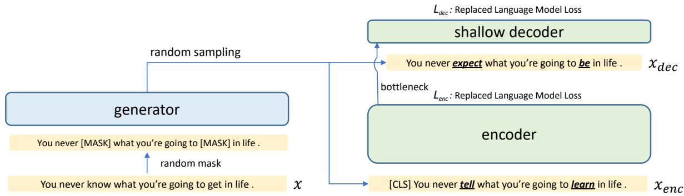
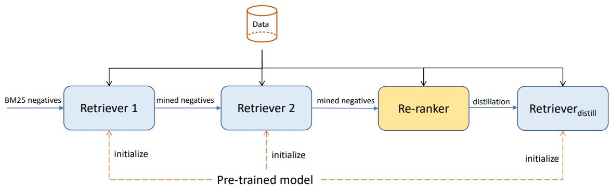
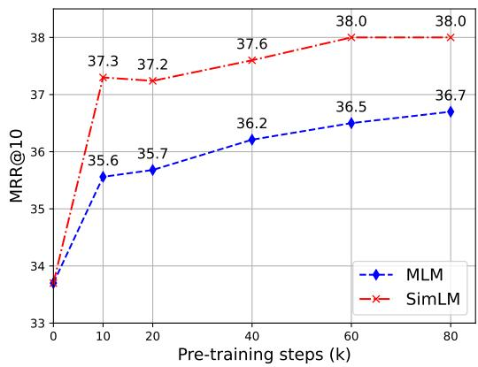

# SIMLM: Pre-training with Representation Bottleneck for Dense Passage Retrieval

Liang Wang, Nan Yang, Xiaolong Huang, Binxing Jiao Linjun Yang, Daxin Jiang, Rangan Majumder, Furu Wei

Microsoft Corporation

{wangliang,nanya,xiaolhu,binxjia,yang.linjun,djiang,ranganm,fuwei}@microsoft.com

## Abstract

In this paper, we propose SIMLM (Similarity matching with Language Model pre-training), a simple yet effective pre-training method for dense passage retrieval. It employs a simple bottleneck architecture that learns to compress the passage information into a dense vector through self-supervised pre-training. We use a replaced language modeling objective, which is inspired by ELECTRA (Clark et al., 2020), to improve the sample efficiency and reduce the mismatch of the input distribution between pre-training and fine-tuning. SIMLM only requires access to an unlabeled corpus and is more broadly applicable when there are no labeled data or queries. We conduct experiments on several large-scale passage retrieval datasets and show substantial improvements over strong baselines under various settings. Remarkably, SIMLM even outperforms multivector approaches such as ColBERTv2 (Santhanam et al., 2021) which incurs significantly more storage cost. Our code and model checkpoints are available at https://github.com/ microsoft/unilm/tree/master/simlm.

## 1 Introduction

Passage retrieval is an important component in applications like ad-hoc information retrieval, opendomain question answering (Karpukhin et al., 2020), retrieval-augmented generation (Lewis et al., 2020) and fact verification (Thorne et al., 2018). Sparse retrieval methods such as BM25 were the dominant approach for several decades, and still play a vital role nowadays. With the emergence of large-scale pre-trained language models (PLM) (Devlin et al., 2019), increasing attention is being paid to neural dense retrieval methods (Yates et al., 2021). Dense retrieval methods map both queries and passages into a low-dimensional vector space, where the relevance between the queries and passages are measured by the dot product or cosine similarity between their respective vectors.

<table><tr><td>PLM</td><td>MS-MARCO</td><td>GLUE</td></tr><tr><td>BERT</td><td>33.7</td><td>80.5</td></tr><tr><td>RoBERTa</td><td>33.1</td><td>88.1</td></tr><tr><td>ELECTRA</td><td>31.9</td><td>89.4</td></tr></table>

Table 1: Inconsistent performance trends between different models on retrieval task and NLU tasks. We report MRR@10 on the dev set of MS-MARCO passage ranking dataset and test set results on GLUE benchmark. Details are available in the Appendix A.

Like other NLP tasks, dense retrieval benefits greatly from a strong general-purpose pre-trained language model. However, general-purpose pretraining does not solve all the problems. As shown in Table 1, improved pre-training techniques that are verified by benchmarks like GLUE (Wang et al., 2019) do not result in consistent performance gain for retrieval tasks. Similar observations are also made by Lu et al. (2021). We hypothesize that, to perform robust retrieval, the [CLS] vector used for computing matching scores should encode all the essential information in the passage. The next-sentence prediction (NSP) task in BERT introduces some supervision signals for the [CLS] token, while RoBERTa (Liu et al., 2019) and ELECTRA do not have such sequence-level tasks.

In this paper, we propose SimLM to pre-train a representation bottleneck with replaced language modeling objective. SimLM consists of a deep encoder and a shallow decoder connected with a representation bottleneck, which is the [CLS] vector in our implementation. Given a randomly masked text segment, we first employ a generator to sample replaced tokens for masked positions, then use both the deep encoder and shallow decoder to predict the original tokens at all positions. Since the decoder only has limited modeling capacity, it must rely on the representation bottleneck to perform well on this pre-training task. As a result, the encoder will learn to compress important semantic information into the bottleneck, which would help train biencoder-based 1 dense retrievers. Our pretraining objective works with plain texts and does not require any generated pseudo-queries as for GPL (Wang et al., 2022).

Compared to existing pre-training approaches such as Condenser (Gao and Callan, 2021) or co-Condenser (Gao and Callan, 2022), our method has several advantages. First, it does not have any extra skip connection between the encoder and decoder, thus reducing the bypassing effects and simplifying the architecture design. Second, similar to ELECTRA pre-training, our replaced language modeling objective can back-propagate gradients at all positions and does not have [MASK] tokens in the inputs during pre-training. Such a design increases sample efficiency and decreases the input distribution mismatch between pre-training and fine-tuning.

To verify the effectiveness of our method, we conduct experiments on several large-scale web search and open-domain QA datasets: MS-MARCO passage ranking (Campos et al., 2016), TREC Deep Learning Track datasets, and the Natural Questions (NQ) dataset (Kwiatkowski et al., 2019). Results show substantial gains over other competitive methods using BM25 hard negatives only. When combined with mined hard negatives and cross-encoder based re-ranker distillation, we can achieve new state-of-the-art performance.

## 2 Related Work

Dense Retrieval The field of information retrieval (IR) (Manning et al., 2005) aims to find the relevant information given an ad-hoc query and has played a key role in the success of modern search engines. In recent years, IR has witnessed a paradigm shift from traditional BM25-based inverted index retrieval to neural dense retrieval (Yates et al., 2021; Karpukhin et al., 2020). BM25-based retrieval, though efficient and interpretable, suffers from the issue of lexical mismatch between the query and passages. Methods like document expansion (Nogueira et al., 2019) or query expansion (Azad and Deepak, 2019; Wang et al., 2023) are proposed to help mitigate this issue. In contrast, neural dense retrievers first map the query and passages to a low-dimensional vector space, and then perform semantic matching. Popular methods include DSSM (Huang et al., 2013), C-DSSM (Shen et al., 2014), and DPR (Karpukhin et al., 2020) etc.

Inference can be done efficiently with approximate nearest neighbor (ANN) search algorithms such as HNSW (Malkov and Yashunin, 2020).

Some recent works (Chen et al., 2021; Reimers and Gurevych, 2021; Sciavolino et al., 2021) show that neural dense retrievers may fail to capture some exact lexical match information. To mitigate this issue, Chen et al. (2021) proposes to use BM25 as a complementary teacher model, ColBERT (Khattab and Zaharia, 2020) instead replaces simple dot-product matching with a more complex token-level MaxSim interaction, while COIL (Gao et al., 2021) incorporates lexical match information into the scoring component of neural retrievers. Our proposed pre-training method aims to adapt the underlying text encoders for retrieval tasks, and can be easily integrated with existing approaches.

Pre-training for Dense Retrieval With the development of large-scale language model pre-training (Dong et al., 2019; Clark et al., 2020), Transformerbased models such as BERT (Devlin et al., 2019) have become the de facto backbone architecture for learning text representations. However, most pre-training tasks are designed without any prior knowledge of downstream applications. Chang et al. (2020) presents three heuristically constructed pre-training tasks tailored for text retrieval: inverse cloze task (ICT), body first selection (BFS), and wiki link prediction (WLP). These tasks exploit the document structure of Wikipedia pages to automatically generate contrastive pairs. Other related pretraining tasks include representative words prediction (Ma et al., 2021), contrastive span prediction (Ma et al., 2022), contrastive learning with independent cropping (Izacard et al., 2021), domainmatched pre-training (Oguz et al., 2022) or neighboring text pairs (Neelakantan et al., 2022) etc.

Another line of research builds upon the intuition that the [CLS] vector should encode all the important information in the given text for robust matching, which is also one major motivation for this paper. Such methods include Condenser (Gao and Callan, 2021), coCondenser (Gao and Callan, 2022), SEED (Lu et al., 2021), DiffCSE (Chuang et al., 2022), and RetroMAE (Liu and Shao, 2022) etc. Compared with Condenser and coCondenser, our pre-training architecture does not have skip connections between the encoder and decoder, and therefore forces the [CLS] vector to encode as much information as possible. RetroMAE (Liu and Shao, 2022) is a concurrent work at the time of writing that combines a bottleneck architecture and the masked auto-encoding objective.

  
Figure 1: Pre-training architecture of SimLM. Replaced tokens (underlined) are randomly sampled from the generator distribution.

## 3 SimLM

## 3.1 Pre-training

For pre-training, we assume there is a collection of passages $\mathbb { C } = \{ \mathbf { x } _ { i } \} _ { i = 1 } ^ { | \mathbb { C } | }$ , where x denotes a single passage. Since our motivation is to have a general pre-training method, we do not assume access to any query or human-labeled data.

The overall pre-training architecture is shown in Figure 1. Given a text sequence x, its tokens are randomly replaced with probability p by two sequential operations: random masking with probability $p$ denoted as $\mathbf { x } ^ { \prime } = \mathbf { M a s k } ( \mathbf { x } , p )$ , and then sampling from an ELECTRA-style generator g denoted as Sample $( g , \mathbf { x } ^ { \prime } )$ . Due to the randomness of sampling, a replaced token can be the same as the original one. The above operations are performed twice with potentially different replace probabilities $p _ { \mathrm { e n c } }$ and $p _ { \mathrm { d e c } }$ to get the encoder input $\mathbf { x } _ { \mathrm { e n c } }$ and decoder input $\mathbf { x } _ { \mathrm { d e c } }$

$$
\begin{array} { r } { \mathbf { x } _ { \mathrm { e n c } } = \mathbf { S } \mathrm { a m p l e } ( g , \mathbf { M a s k } ( \mathbf { x } , p _ { \mathrm { e n c } } ) ) } \\ { \mathbf { x } _ { \mathrm { d e c } } = \mathbf { S } \mathrm { a m p l e } ( g , \mathbf { M a s k } ( \mathbf { x } , p _ { \mathrm { d e c } } ) ) } \end{array}\tag{1}
$$

We also make sure that any replaced token in $\mathbf { x } _ { \mathrm { e n c } }$ is also replaced in $\mathbf { x } _ { \mathrm { d e c } }$ to increase the difficulty of the pre-training task.

The encoder is a deep multi-layer Transformer that can be initialized with pre-trained models like BERT (Devlin et al., 2019). It takes $\mathbf { x } _ { \mathrm { e n c } }$ as input and outputs the last layer [CLS] vector $\mathbf { h } _ { \mathrm { c l s } }$ as a representation bottleneck. The decoder is a

2-layer shallow Transformer with a language modeling head and takes $\mathbf { x } _ { \mathrm { d e c } }$ and $\mathbf { h } _ { \mathrm { c l s } }$ as inputs. Unlike the decoder component in autoregressive sequenceto-sequence models, the self-attention in our decoder is bi-directional. The pre-training task is replaced language modeling for both the encoder and decoder, which predicts the tokens before replacement at all positions. The loss function is the token-level cross-entropy. The encoder loss $L _ { \mathrm { e n c } }$ is shown as follows:

$$
\operatorname* { m i n } \ L _ { \mathrm { e n c } } = - { \frac { 1 } { | \mathbf { x } | } } \sum _ { i = 1 } ^ { | \mathbf { x } | } \log p ( \mathbf { x } [ i ] \mid \mathbf { x } _ { \mathrm { e n c } } )\tag{2}
$$

Similarly for the decoder loss $L _ { \mathrm { d e c } }$ . The final pretraining loss is their simple sum: $L _ { \mathrm { p t } } = L _ { \mathrm { e n c } } + L _ { \mathrm { d e c } } .$ We do not fine-tune the parameters of the generator as our preliminary experiments do not show any performance gain.

It is often reasonable to assume access to the target retrieval corpus before seeing any query. Therefore, we directly pre-train on the target corpus similar to coCondenser (Gao and Callan, 2022). After the pre-training finishes, we throw away the decoder and only keep the encoder for supervised fine-tuning.

Since the decoder has very limited modeling capacity, it needs to rely on the representation bottleneck to perform well on the pre-training task. For the encoder, it should learn to compress all the semantic information and pass it to the decoder through the bottleneck.

## 3.2 Fine-tuning

Compared to training text classification or generation models, training state-of-the-art dense retrieval models requires a relatively complicated procedure. In Figure 2, we show our supervised fine-tuning pipeline. In contrast to previous approaches, our proposed pipeline is relatively straightforward and does not require joint training (Ren et al., 2021b) or re-building index periodically (Xiong et al., 2021). Each stage takes the outputs from the previous stage as inputs and can be trained in a standalone fashion.

  
Figure 2: Illustration of our supervised fine-tuning pipeline. Note that we only use SimLM to initialize the biencoder-based retrievers. For cross-encoder based re-ranker, we use off-the-shelf pre-trained models such as $\mathrm { E L E C T R A _ { b a s e } }$

Retriever1 Given a labeled query-passage pair $( q ^ { + } , d ^ { + } )$ , we take the last-layer [CLS] vector of the pre-trained encoder as their representations $( \mathbf { h } _ { q ^ { + } } , \mathbf { h } _ { d ^ { + } } )$ . Both the in-batch negatives and BM25 hard negatives are used to compute the contrastive loss $L _ { \mathrm { { c o n t } } } \mathrm { { : } }$

$$
- \log { \frac { \phi ( q ^ { + } , d ^ { + } ) } { \phi ( q ^ { + } , d ^ { + } ) + \displaystyle \sum _ { n _ { i } \in \mathbb { N } } ( \phi ( q ^ { + } , n _ { i } ) + \phi ( d ^ { + } , n _ { i } ) ) } }\tag{3}
$$

Where N denotes all the negatives, and $\phi ( q , d )$ is a function to compute the matching score between query q and passage d. In this paper, we use temperature-scaled cosine similarity function: $\begin{array} { r } { \phi ( q , d ) = \exp ( \frac { 1 } { \tau } \cos ( { \bf h } _ { q } , { \bf h } _ { d } ) ) } \end{array}$ . τ is a temperature hyper-parameter and set to a constant 0.02 in our experiments.

Retriever2 It is trained in the same way as Retriever1 except that the hard negatives are mined based on a well-trained Retriever1 checkpoint.

Re-ranker is a cross-encoder that re-ranks the topk results of Retriever2. It takes the concatenation of query q and passage d as input and outputs a realvalued score $\theta ( q , d )$ . Given a labeled positive pair $( q ^ { + } , d ^ { + } )$ ) and n 1 hard negative passages randomly sampled from top-k predictions of Retriever2, we adopt a listwise loss to train the re-ranker:

$$
- \log \frac { \exp ( \theta ( q ^ { + } , d ^ { + } ) ) } { \exp ( \theta ( q ^ { + } , d ^ { + } ) ) + \sum _ { i = 1 } ^ { n - 1 } \exp ( \theta ( q ^ { + } , d _ { i } ^ { - } ) ) }\tag{4}
$$

The cross-encoder architecture can model the full interaction between the query and the passage, making it suitable to be a teacher model for knowledge distillation.

Retrieverdistill Although cross-encoder based reranker is powerful, it is not scalable enough for first-stage retrieval. To combine the scalability of biencoder and the effectiveness of cross-encoder, we can train a biencoder-based retriever by distilling the knowledge from the re-ranker. The reranker from the previous stage is employed to compute scores for both positive pairs and mined negatives from Retriever2. These scores are then used as training data for knowledge distillation. With n 1 mined hard negatives, we use KL (Kullback-Leibler) divergence $L _ { \mathrm { k l } }$ as the loss function for distilling the soft labels:

$$
L _ { \mathrm { k l } } = \sum _ { i = 1 } ^ { n } p _ { \mathrm { r a n k e r } } ^ { i } \log { \frac { p _ { \mathrm { r a n k e r } } ^ { i } } { p _ { \mathrm { r e t } } ^ { i } } }\tag{5}
$$

where $p _ { \mathrm { r a n k e r } }$ and $p _ { \mathrm { r e t } }$ are normalized probabilities from the re-ranker teacher and Retrieverdistill student. For training with the hard labels, we use the contrastive loss $L _ { \mathrm { { c o n t } } }$ as defined in Equation 3. The final loss is their linear interpolation: $L = L _ { \mathrm { k l } } + \alpha L _ { \mathrm { c o n t } } .$

Our pre-trained SimLM model is used to initialize all three biencoder-based retrievers but not the cross-encoder re-ranker. Since our pre-training method only affects model initialization, it can be easily integrated into other more effective training pipelines.

<table><tr><td rowspan="2">Model</td><td rowspan="2">+distill</td><td rowspan="2">single vector?</td><td colspan="3">MS MARCO dev</td><td rowspan="2">TREC DL 19</td><td rowspan="2">TREC DL 20</td></tr><tr><td>MRR@10</td><td>R@50</td><td>R@1k</td></tr><tr><td>Sparse retrieval</td><td></td><td></td><td></td><td></td><td></td><td>nDCG@10</td><td>nDCG@10</td></tr><tr><td>BM25</td><td></td><td>√</td><td>18.5</td><td>58.5</td><td>85.7</td><td>51.2*</td><td>47.7*</td></tr><tr><td>DeepCT (Dai and Callan, 2019)</td><td></td><td>√</td><td>24.3</td><td>69.0</td><td>91.0</td><td>57.2</td><td></td></tr><tr><td>docT5query (Nogueira and Lin)</td><td></td><td>√</td><td>27.7</td><td>75.6</td><td>94.7</td><td>64.2</td><td></td></tr><tr><td>Dense retrieval</td><td></td><td></td><td></td><td></td><td></td><td></td><td></td></tr><tr><td>ANCE (Xiong et al., 2021)</td><td></td><td>√</td><td>33.0</td><td></td><td>95.9</td><td>64.5†</td><td>64.6†</td></tr><tr><td>SEED (Lu et al., 2021)</td><td></td><td>√</td><td>33.9</td><td></td><td>96.1</td><td></td><td></td></tr><tr><td>TAS-B (Hofstätter et al., 2021)</td><td>√</td><td>√</td><td>34.0</td><td></td><td>97.5</td><td>71.2</td><td>69.3</td></tr><tr><td>RetroMAE (Liu and Shao, 2022)</td><td></td><td>√</td><td>35.0</td><td></td><td>97.6</td><td></td><td></td></tr><tr><td>COIL (Gao et al., 2021)</td><td></td><td></td><td>35.5</td><td></td><td>96.3</td><td>70.4</td><td></td></tr><tr><td>ColBERT (Khattab and Zaharia, 2020)</td><td></td><td></td><td>36.0</td><td>82.9</td><td>96.8</td><td></td><td></td></tr><tr><td>Condenser (Gao and Callan, 2021)</td><td></td><td>√</td><td>36.6</td><td></td><td>97.4</td><td>69.8</td><td></td></tr><tr><td>RocketQA (Qu et al., 2021)</td><td>√</td><td>S</td><td>37.0</td><td>85.5</td><td>97.9</td><td></td><td></td></tr><tr><td>PAIR (Ren et al., 2021a)</td><td>√</td><td>√</td><td>37.9</td><td>86.4</td><td>98.2</td><td></td><td></td></tr><tr><td>coCondenser (Gao and Callan, 2022)</td><td></td><td>√</td><td>38.2</td><td>86.5*</td><td>98.4</td><td>71.7*</td><td>68.4*</td></tr><tr><td>RocketQAv2 (Ren et al., 2021b)</td><td>√</td><td>√</td><td>38.8</td><td>86.2</td><td>98.1</td><td></td><td></td></tr><tr><td>AR2 (Zhang et al., 2021)</td><td>√</td><td>√</td><td>39.5</td><td>87.8</td><td>98.6</td><td></td><td></td></tr><tr><td>ColBERTv2 (Santhanam et al., 2021)</td><td>√</td><td></td><td>39.7</td><td>86.8</td><td>98.4</td><td>-</td><td></td></tr><tr><td>SIMLM</td><td>√</td><td>√</td><td>41.1</td><td>87.8</td><td>98.7</td><td>71.4</td><td>69.7</td></tr></table>

Table 2: Main results on MS-MARCO passage ranking and TREC datasets. Results with \* are from our reproduction with public checkpoints. : from Pyserini (Lin et al., 2021).

## 4 Experiments

## 4.1 Setup

Datasets and Evaluation We use MS-MARCO passage ranking (Campos et al., 2016), TREC Deep Learning (DL) Track 2019 (Craswell et al., 2020a) and 2020 (Craswell et al., 2020b), Natural Questions (NQ) (Kwiatkowski et al., 2019; Karpukhin et al., 2020) datasets for training and evaluation. The MS-MARCO dataset is based on Bing search results and consists of about 500k labeled queries and 8.8M passages. Since the test set labels are not publicly available, we report results on the development set with 6980 queries. The NQ dataset is targeted for open QA with about 80k question-answer pairs in the training set and 21M Wikipedia passages. For evaluation metrics, we use MRR@10, Recall@50, and Recall@1k for MS-MARCO, nDCG@10 for TREC DL, and Recall@20, Recall@100 for the NQ dataset.

Implementation Details For pre-training, we initialize the encoder with $\mathbf { B E R T _ { b a s e } }$ (uncased version). The decoder is a two-layer Transformer whose parameters are initialized with the last two layers of $\mathbf { B E R T _ { b a s e } }$ . The generator is borrowed from the $\mathrm { E L E C T R A _ { b a s e } }$ generator, and its parameters are frozen during pre-training. We pre-train for 80k steps for MS-MARCO corpus and 200k steps for NQ corpus, which roughly correspond to 20 epochs. Pre-training is based on 8 V100 GPUs. With automatic mixed-precision training, it takes about 1.5 days and 3 days for the MS-MARCO and NQ corpus respectively.

For more implementation details, please check out the Appendix section B.

## 4.2 Main Results

We list the main results in Table 2 and 4. For the MS-MARCO passage ranking dataset, the numbers are based on the Retrieverdistill in Figure 2. Our method establishes new state-of-the-art with MRR@10 41.1, even outperforming multi-vector methods like ColBERTv2. As shown in Table 3, ColBERTv2 has a 6x storage cost as it stores one vector per token instead of one vector per passage. It also requires a customized two-stage index search algorithm during inference, while our method can utilize readily available vector search libraries.

The TREC DL datasets have more fine-grained human annotations, but also much fewer queries (less than 100 labeled queries). We find that using different random seeds could have a 1%-2% difference in terms of nDCG@10. Though our model performs slightly worse on the 2019 split compared to coCondenser, we do not consider such difference as significant.

<table><tr><td></td><td>Index size</td><td>Index search</td></tr><tr><td>ColBERTv2</td><td>&gt;150GB</td><td>Two-stage</td></tr><tr><td>SIMLM</td><td>27GB</td><td>One-stage</td></tr></table>

Table 3: Comparison with ColBERTv2 (Santhanam et al., 2021) in terms of index storage cost (w/o any compression) and complexity of index search algorithms.

<table><tr><td>Model</td><td colspan="2">NQ</td></tr><tr><td>BM25</td><td>R@20 59.1</td><td>R@100 73.7</td></tr><tr><td> $\mathrm { D P R } _ { \mathrm { s i n g l e } }$  (Karpukhin et al., 2020)</td><td>78.4</td><td>85.4</td></tr><tr><td>ANCE (Xiong et al., 2021)</td><td>81.9</td><td>87.5</td></tr><tr><td>RocketQA (Qu et al., 2021)</td><td>82.7</td><td>88.5</td></tr><tr><td>Condenser (Gao and Callan, 2021)</td><td>83.2</td><td>88.4</td></tr><tr><td>PAIR (Ren et al., 2021a)</td><td>83.5</td><td>89.1</td></tr><tr><td>RocketQAv2 (Ren et al., 2021b)</td><td>83.7</td><td>89.0</td></tr><tr><td>coCondenser (Gao and Callan, 2022)</td><td></td><td></td></tr><tr><td></td><td>84.3</td><td>89.0</td></tr><tr><td>SIMLM</td><td>85.2</td><td>89.7</td></tr></table>

Table 4: Results on the test set of Natural Questions (NQ) dataset. Listed results of SimLM are based on $\mathbf { R e t r i e v e r _ { d i s t i l l } } .$

For passage retrieval in the open-domain QA setting, a passage is considered relevant if it contains the correct answer for a given question. In Table 4, our model achieves R@20 85.2 and R@100 89.7 on the NQ dataset, which are comparable to or better than other methods. For end-to-end evaluation of question answering accuracy, we will leave it as future work.

<table><tr><td>Model</td><td>MRR@10</td></tr><tr><td> $\mathrm { B E R T _ { b a s e } }$ </td><td>42.3</td></tr><tr><td>ELECTRAbase</td><td>43.7</td></tr><tr><td>SIMLM</td><td>42.9</td></tr></table>

Table 5: Re-ranker performance w/ different pretrained models on the dev set of MS-MARCO passage ranking dataset.

Though SimLM achieves substantial gain for biencoder-based retrieval, its success for re-ranking is not as remarkable. In Table 5, when used as initialization for re-ranker training, SimLM outperforms BERTbase by 0.6% but still lags behind $\mathrm { E L E C T R A _ { b a s e } }$

<table><tr><td>MRR@10 R@1k</td></tr><tr><td>coCondenser BM25 negatives 35.7</td></tr><tr><td>97.8 + mined negatives 38.2 98.4</td></tr><tr><td>+ distillation 40.2* 98.3* SIMLM</td></tr><tr><td>BM25 negatives (Retriever1) 38.0 98.3 + mined negatives (Retriever2) 39.1 98.6</td></tr><tr><td>+ distillation (Retrieverdistill) 41.1 98.7 Cross-encoder re-ranker 43.7 98.6</td></tr></table>

Table 6: Comparison with state-of-the-art dense retriever coCondenser under various settings on the dev set of MS-MARCO passage ranking dataset. Results with \* are from our reproduction.

Next, we zoom in on the impact of each stage in our training pipeline. In Table 6, we mainly compare with coCondenser (Gao and Callan, 2022). With BM25 hard negatives only, we can achieve MRR@10 38.0, which already matches the performance of many strong models like RocketQA (Qu et al., 2021). Model-based hard negative mining and re-ranker distillation can bring further gains. This is consistent with many previous works (Xiong et al., 2021; Ren et al., 2021b). We also tried an additional round of mining hard negatives but did not observe any meaningful improvement.

Based on the results of Table 6, there are many interesting research directions to pursue. For example, how to simplify the training pipeline of dense retrieval systems while still maintaining competitive performance? And how to further close the gap between biencoder-based retriever and crossencoder based re-ranker?

## 5 Analysis

## 5.1 Variants of Pre-training Objectives

Besides our proposed replaced language modeling objective, we also tried several other pre-training objectives as listed below.

Enc-Dec MLM uses the same encoder-decoder architecture as in Figure 1 but without the generator. The inputs are randomly masked texts and the pre-training objective is masked language modeling (MLM) over the masked tokens only. The mask rate is the same as our method for a fair comparison, which is 30% for the encoder and 50% for the decoder. In contrast, RetroMAE (Liu and Shao, 2022) uses a specialized decoding mechanism to derive supervision signals from all tokens on the

<table><tr><td>SIMLM</td><td>Enc-Dec MLM</td><td>Condenser</td><td>MLM</td><td>Enc-Dec RTD</td><td>AutoEncoder</td><td> $\mathrm { B E R T _ { b a s e } }$ </td></tr><tr><td>MRR@10 38.0</td><td>37.7</td><td>36.9</td><td>36.7</td><td>36.2</td><td>32.8</td><td>33.7</td></tr></table>

Table 7: Different pre-training objectives. Reported numbers are MRR@10 on the dev set of MS-MARCO passage ranking. We finetune the pre-trained models with official BM25 hard negatives.

decoder side.

Condenser is a pre-training architecture proposed by Gao and Callan (2021). Here we pre-train Condenser with a 30% mask rate on the target corpus. MLM is the same as the original BERT pretraining objective with a 30% mask rate.

Enc-Dec RTD is the same as our method in Figure 1 except that we use replaced token detection (RTD) (Clark et al., 2020) as a pre-training task for both the encoder and decoder. This variant shares some similarities with DiffCSE (Chuang et al., 2022). The main difference is that the input for DiffCSE encoder is the original text, making it a much easier task. Our preliminary experiments with DiffCSE pre-training do not result in any improvement.

AutoEncoder attempts to reconstruct the inputs based on the bottleneck representation. The encoder input is the original text without any mask, and the decoder input only consists of [MASK] tokens and [CLS] vector from the encoder.

$\mathbf { B E R T _ { b a s e } }$ just uses off-the-shelf checkpoint published by Devlin et al. (2019). It serves as a baseline to compare against various pre-training objectives.

The results are summarized in Table 7. Naive auto-encoding only requires memorizing the inputs and does not need to learn any contextualized features. As a result, it becomes the only pretraining objective that underperforms BERTbase. Condenser is only slightly better than simple MLM pre-training, which is possibly due to the bypassing effects of the skip connections in Condenser. Enc-Dec MLM substantially outperforms Enc-Dec RTD, showing that MLM is a better pre-training task than RTD for retrieval tasks. This is consistent with the results in Table 1. Considering the superior performance of RTD pre-trained models on benchmarks like GLUE, we believe further research efforts are needed to investigate the reason behind this phenomenon.

## 5.2 Effects of Replace Rate

In the experiments, we use fairly large replace rates (30% for the encoder and 50% for the decoder). This is in stark contrast to the mainstream choice of 15%. In Table 8, we show the results of pretraining with different replace rates. Our model is quite robust to a wide range of values with 30%- 40% encoder replace rate performing slightly better. Similar findings are also made by Wettig et al. (2022).

<table><tr><td>encoder</td><td>decoder</td><td>MRR@10</td></tr><tr><td>15%</td><td>15%</td><td>37.6</td></tr><tr><td>15%</td><td>30%</td><td>37.5</td></tr><tr><td>30%</td><td>30%</td><td>37.9</td></tr><tr><td>30%</td><td>50%</td><td>38.0</td></tr><tr><td>40%</td><td>60%</td><td>38.0</td></tr><tr><td>30%</td><td>100%</td><td>36.6</td></tr></table>

Table 8: MS-MARCO passage ranking performance w.r.t different token replace rates. Here the replace rate is the percentage of masked tokens fed to the generator.

One interesting extreme scenario is a 100% replace rate on the decoder side. In such a case, the decoder has no access to any meaningful context. It needs to predict the original texts solely based on the representation bottleneck. This task may be too difficult and has negative impacts on the encoder.

## 5.3 Effects of Pre-training Steps

  
Figure 3: Our pre-training objective converges faster and consistently outperforms vanilla masked language model pre-training. The y-axis shows the MRR@10 on the dev set of MS-MARCO dataset.

Since pre-training can be costly in terms of both time and carbon emission, it is preferred to have an objective that converges fast. Our proposed method shares two advantages of ELECTRA (Clark et al., 2020). First, the loss is computed over all input tokens instead of a small percentage of masked ones. Second, the issue of input distribution mismatch is less severe than MLM, where the [MASK] token is seen during pre-training but not for supervised fine-tuning. In Figure 3, our method achieves competitive results with only 10k training steps and converges at 60k, while MLM still slowly improves with more steps.

<table><tr><td>query</td><td>was winnie the pooh a boy</td></tr><tr><td> $\mathrm { B E R T _ { b a s e } }$ </td><td>Rank: 1, Relevant: X Passage: The little boy who talks to the animals in the Winnie-the-Pooh stories is called Christopher Robin, which is the name of A. A. Milne&#x27;s real-life son, who was born in 1920. On August 21, 1921, the real-life Christopher Robin Milne received a stuffed bear from Harrods for his first birthday ..</td></tr><tr><td>SIMLM</td><td>Rank: 1, Relevant: √ Passage: So, it looks like we were lied to our entire childhood! Winnie the Pooh is not a boy. SHE is a girl and she&#x27;s from Canada, not England. Really! In a new picture book called Finding Winnie: The True Story of the World&#x27;s Most Famous Bear, we learn that Winnie is actually named after .. </td></tr><tr><td>query</td><td>colorado routing number loveland colorado Rank: 1, Relevant: X</td></tr><tr><td> $\mathrm { B E R T _ { b a s e } }$ </td><td>Passage: Loveland, CO is currently served by one area code which is area code 970. In addition to Loveland, CO area code information read more about area code 970 details and Colorado area codes. . . .</td></tr><tr><td>SIMLM</td><td>Rank: 2, Relevant: √ Passage: 107006787 Routing Transit Number (RTN) for Advantage Bank Main Office located at Loveland, Colorado, CO, 80538, United States, Street Address 1475 NORTH DENVER AVENUE, Telephone Number 970-613-1982 ..</td></tr></table>

Table 9: Some (cherry-picked) examples from the dev set of MS-MARCO passage ranking dataset. We show the query, top retrieved passages from different models, and their binary relevance labels. Relevant text snippets are shown in italic. More examples are available in the Appendix.

## 5.4 On the Choice of Pre-training Corpus

<table><tr><td rowspan="2">Corpus</td><td colspan="2">MS-MARCO</td><td colspan="2">NQ</td></tr><tr><td>MRR@10</td><td>R@1k</td><td>R@20</td><td>R@100</td></tr><tr><td>none</td><td>33.7</td><td>95.9</td><td>82.9</td><td>88.0</td></tr><tr><td>MS-MARCO</td><td>38.0</td><td>98.3</td><td>83.3</td><td>88.6</td></tr><tr><td>Wikipedia</td><td>36.3</td><td>97.4</td><td>84.3</td><td>89.3</td></tr></table>

Table 10: Fine-tuning performance w.r.t different pretraining corpora. We use BM25 negatives for MS-MARCO and mined negatives for NQ. “Wikipedia” is the target retrieval corpus for NQ dataset. “none” use $\mathbf { B E R T _ { b a s e } }$ as the foundation model.

For a typical retrieval task, the number of candidate passages is much larger than the number of labeled queries, and many passages are never seen during training. Take the NQ dataset as an example, it has 21M candidate passages but only less than 80k question-answer pairs for training. In the experiments, we directly pre-train on the target corpus. Such pre-training can be regarded as implicit memorization of the target corpus in a query-agnostic way. One evidence to support this argument is that, as shown in Table 7, simple MLM pre-training on target corpus can have large performance gains.

An important research question to ask is: will there be any benefits of our method when pretraining on non-target corpus? In Table 10, the largest performance gains are obtained when the corpus matches between pre-training and finetuning. If we pre-train on the MS-MARCO corpus and fine-tune on the labeled NQ dataset or the other way around, there are still considerable improvements over the baseline. We hypothesize that this is due to the model’s ability to compress information into a representation bottleneck. Such ability is beneficial for training robust biencoder-based retrievers.

## 5.5 Case Analysis

To qualitatively understand the gains brought by pre-training, we show several examples in Table 9. The $\mathrm { B E R T _ { b a s e } }$ retriever can return passages with high lexical overlap while missing some subtle but key semantic information. In the first example, the retrieved passage by $\mathbf { B E R T _ { b a s e } }$ contains keywords like “boy”, “Winnie the Pooh”, but does not answer the question. In the second example, there is no routing number in the $\mathbf { B E R T _ { b a s e } }$ retrieved passage, which is the key intent of the query. Our proposed pre-training can help to learn better semantics to answer such queries. For more examples, please check out Table 14 in the Appendix.

## 6 Conclusion

This paper proposes a novel pre-training method SIMLM for dense passage retrieval. It follows an encoder-decoder architecture with a representation bottleneck in between. The encoder learns to compress all the semantic information into a dense vector and passes it to the decoder to perform well on the replaced language modeling task. When used as initialization in a dense retriever training pipeline, our model achieves competitive results on several large-scale passage retrieval datasets.

For future work, we would like to increase the model size and the corpus size to examine the scaling effects. It is also interesting to explore other pre-training mechanisms to support unsupervised dense retrieval and multilingual retrieval.

## Limitations

One limitation of SimLM is that it can not be used as a zero-shot dense retriever, since the pre-training framework does not have any contrastive objective. Fine-tuning on labeled data is necessary to get a high-quality model. On the other hand, although SimLM pre-training is quite efficient thanks to the replaced language modeling objective, it still requires extra computational resources to train the model.

## Ethical Considerations

If the retrieval corpus contains some offensive or biased texts, they could be exposed to users under certain queries through our dense retriever. To deal with such risks, we need to introduce toxic text classifiers or manual inspection to exclude such texts from the corpus.

## References

Dr. Hiteshwar Kumar Azad and Akshay Deepak. 2019. Query expansion techniques for information retrieval: a survey. Inf. Process. Manag., 56:1698– 1735.

Daniel Fernando Campos, Tri Nguyen, Mir Rosenberg, Xia Song, Jianfeng Gao, Saurabh Tiwary, Rangan Majumder, Li Deng, and Bhaskar Mitra. 2016. Ms marco: A human generated machine reading comprehension dataset. ArXiv, abs/1611.09268.

Wei-Cheng Chang, Felix X. Yu, Yin-Wen Chang, Yiming Yang, and Sanjiv Kumar. 2020. Pre-training tasks for embedding-based large-scale retrieval. In

8th International Conference on Learning Representations, ICLR 2020, Addis Ababa, Ethiopia, April 26-30, 2020. OpenReview.net.

Xilun Chen, Kushal Lakhotia, Barlas Oguz, Anchit˘ Gupta, Patrick Lewis, Stanislav Peshterliev, Yashar Mehdad, Sonal Gupta, and Wen tau Yih. 2021. Salient phrase aware dense retrieval: Can a dense retriever imitate a sparse one? ArXiv, abs/2110.06918.

Yung-Sung Chuang, Rumen Dangovski, Hongyin Luo, Yang Zhang, Shiyu Chang, Marin Soljacic, Shang-Wen Li, Scott Yih, Yoon Kim, and James Glass. 2022. DiffCSE: Difference-based contrastive learning for sentence embeddings. In Proceedings of the 2022 Conference of the North American Chapter of the Association for Computational Linguistics: Human Language Technologies, pages 4207– 4218, Seattle, United States. Association for Computational Linguistics.

Kevin Clark, Minh-Thang Luong, Quoc V. Le, and Christopher D. Manning. 2020. ELECTRA: pretraining text encoders as discriminators rather than generators. In 8th International Conference on Learning Representations, ICLR 2020, Addis Ababa, Ethiopia, April 26-30, 2020. OpenReview.net.

Nick Craswell, Bhaskar Mitra, Emine Yilmaz, Daniel Campos, and Ellen M Voorhees. 2020a. Overview of the trec 2019 deep learning track. ArXiv preprint, abs/2003.07820.

Nick Craswell, Bhaskar Mitra, Emine Yilmaz, Daniel Fernando Campos, and Ellen M. Voorhees. 2020b. Overview of the trec 2020 deep learning track. ArXiv, abs/2003.07820.

Zhuyun Dai and Jamie Callan. 2019. Context-aware sentence/passage term importance estimation for first stage retrieval. ArXiv, abs/1910.10687.

Jacob Devlin, Ming-Wei Chang, Kenton Lee, and Kristina Toutanova. 2019. BERT: Pre-training of deep bidirectional transformers for language understanding. In Proceedings of the 2019 Conference of the North American Chapter of the Association for Computational Linguistics: Human Language Technologies, Volume 1 (Long and Short Papers), pages 4171–4186, Minneapolis, Minnesota. Association for Computational Linguistics.

Li Dong, Nan Yang, Wenhui Wang, Furu Wei, Xiaodong Liu, Yu Wang, Jianfeng Gao, Ming Zhou, and Hsiao-Wuen Hon. 2019. Unified language model pre-training for natural language understanding and generation. In Advances in Neural Information Processing Systems 32: Annual Conference on Neural Information Processing Systems 2019, NeurIPS 2019, December 8-14, 2019, Vancouver, BC, Canada, pages 13042–13054.

Luyu Gao and Jamie Callan. 2021. Condenser: a pretraining architecture for dense retrieval. In Proceedings of the 2021 Conference on Empirical Methods

in Natural Language Processing, pages 981–993, Online and Punta Cana, Dominican Republic. Association for Computational Linguistics.

Luyu Gao and Jamie Callan. 2022. Unsupervised corpus aware language model pre-training for dense passage retrieval. In Proceedings ofthe 60th Annual Meeting of the Association for Computational Linguistics (Volume 1: Long Papers), pages 2843–2853, Dublin, Ireland. Association for Computational Linguistics.

Luyu Gao, Zhuyun Dai, and Jamie Callan. 2021. COIL: Revisit exact lexical match in information retrieval with contextualized inverted list. In Proceedings of the 2021 Conference of the North American Chapter of the Association for Computational Linguistics: Human Language Technologies, pages 3030–3042, Online. Association for Computational Linguistics.

Sebastian Hofstätter, Sheng-Chieh Lin, Jheng-Hong Yang, Jimmy J. Lin, and Allan Hanbury. 2021. Efficiently teaching an effective dense retriever with balanced topic aware sampling. Proceedings of the 44th International ACM SIGIR Conference on Research and Development in Information Retrieval.

Po-Sen Huang, Xiaodong He, Jianfeng Gao, Li Deng, Alex Acero, and Larry P. Heck. 2013. Learning deep structured semantic models for web search using clickthrough data. In 22nd ACM International Conference on Information and Knowledge Management, CIKM’13, San Francisco, CA, USA, October 27 - November 1, 2013, pages 2333–2338. ACM.

Gautier Izacard, Mathilde Caron, Lucas Hosseini, Sebastian Riedel, Piotr Bojanowski, Armand Joulin, and Edouard Grave. 2021. Unsupervised dense information retrieval with contrastive learning.

Vladimir Karpukhin, Barlas Oguz, Sewon Min, Patrick Lewis, Ledell Wu, Sergey Edunov, Danqi Chen, and Wen-tau Yih. 2020. Dense passage retrieval for open-domain question answering. In Proceedings of the 2020 Conference on Empirical Methods in Natural Language Processing (EMNLP), pages 6769– 6781, Online. Association for Computational Linguistics.

Omar Khattab and Matei Zaharia. 2020. Colbert: Efficient and effective passage search via contextualized late interaction over BERT. In Proceedings of the 43rd International ACM SIGIR conference on research and development in Information Retrieval, SI-GIR 2020, Virtual Event, China, July 25-30, 2020, pages 39–48. ACM.

Tom Kwiatkowski, Jennimaria Palomaki, Olivia Redfield, Michael Collins, Ankur Parikh, Chris Alberti, Danielle Epstein, Illia Polosukhin, Jacob Devlin, Kenton Lee, Kristina Toutanova, Llion Jones, Matthew Kelcey, Ming-Wei Chang, Andrew M. Dai, Jakob Uszkoreit, Quoc Le, and Slav Petrov. 2019.

Natural questions: A benchmark for question answering research. Transactions of the Association for Computational Linguistics, 7:452–466.

Patrick S. H. Lewis, Ethan Perez, Aleksandra Piktus, Fabio Petroni, Vladimir Karpukhin, Naman Goyal, Heinrich Küttler, Mike Lewis, Wen-tau Yih, Tim Rocktäschel, Sebastian Riedel, and Douwe Kiela. 2020. Retrieval-augmented generation for knowledge-intensive NLP tasks. In Advances in Neural Information Processing Systems 33: Annual Conference on Neural Information Processing Systems 2020, NeurIPS 2020, December 6-12, 2020, virtual.

Jimmy J. Lin, Xueguang Ma, Sheng-Chieh Lin, Jheng-Hong Yang, Ronak Pradeep, Rodrigo Nogueira, and David R. Cheriton. 2021. Pyserini: A python toolkit for reproducible information retrieval research with sparse and dense representations. Proceedings of the 44th International ACM SIGIR Conference on Research and Development in Information Retrieval.

Yinhan Liu, Myle Ott, Naman Goyal, Jingfei Du, Mandar Joshi, Danqi Chen, Omer Levy, Mike Lewis, Luke Zettlemoyer, and Veselin Stoyanov. 2019. Roberta: A robustly optimized bert pretraining approach. ArXiv, abs/1907.11692.

Zheng Liu and Yingxia Shao. 2022. Retromae: Pretraining retrieval-oriented transformers via masked auto-encoder. ArXiv, abs/2205.12035.

Shuqi Lu, Di He, Chenyan Xiong, Guolin Ke, Waleed Malik, Zhicheng Dou, Paul Bennett, Tie-Yan Liu, and Arnold Overwijk. 2021. Less is more: Pretrain a strong Siamese encoder for dense text retrieval using a weak decoder. In Proceedings of the 2021 Conference on Empirical Methods in Natural Language Processing, pages 2780–2791, Online and Punta Cana, Dominican Republic. Association for Computational Linguistics.

Xinyu Ma, J. Guo, Ruqing Zhang, Yixing Fan, and Xueqi Cheng. 2022. Pre-train a discriminative text encoder for dense retrieval via contrastive span prediction. ArXiv, abs/2204.10641.

Xinyu Ma, Jiafeng Guo, Ruqing Zhang, Yixing Fan, Xiang Ji, and Xueqi Cheng. 2021. Prop: Pre-training with representative words prediction for ad-hoc retrieval. Proceedings of the 14th ACM International Conference on Web Search and Data Mining.

Yu A. Malkov and D. A. Yashunin. 2020. Efficient and robust approximate nearest neighbor search using hierarchical navigable small world graphs. IEEE Transactions on Pattern Analysis and Machine Intelligence, 42:824–836.

Christopher D. Manning, Prabhakar Raghavan, and Hinrich Schütze. 2005. Introduction to information retrieval.

Arvind Neelakantan, Tao Xu, Raul Puri, Alec Radford, Jesse Michael Han, Jerry Tworek, Qiming Yuan, Nikolas A. Tezak, Jong Wook Kim, Chris Hallacy, Johannes Heidecke, Pranav Shyam, Boris Power, Tyna Eloundou Nekoul, Girish Sastry, Gretchen Krueger, David P. Schnurr, Felipe Petroski Such, Kenny Sai-Kin Hsu, Madeleine Thompson, Tabarak Khan, Toki Sherbakov, Joanne Jang, Peter Welinder, and Lilian Weng. 2022. Text and code embeddings by contrastive pre-training. ArXiv, abs/2201.10005.

Rodrigo Nogueira and Jimmy Lin. From doc2query to doctttttquery.

Rodrigo Nogueira, Wei Yang, Jimmy J. Lin, and Kyunghyun Cho. 2019. Document expansion by query prediction. ArXiv, abs/1904.08375.

Barlas Oguz, Kushal Lakhotia, Anchit Gupta, Patrick Lewis, Vladimir Karpukhin, Aleksandra Piktus, Xilun Chen, Sebastian Riedel, Scott Yih, Sonal Gupta, et al. 2022. Domain-matched pre-training tasks for dense retrieval. In Findings of the Association for Computational Linguistics: NAACL 2022, pages 1524–1534.

Yingqi Qu, Yuchen Ding, Jing Liu, Kai Liu, Ruiyang Ren, Wayne Xin Zhao, Daxiang Dong, Hua Wu, and Haifeng Wang. 2021. RocketQA: An optimized training approach to dense passage retrieval for open-domain question answering. In Proceedings of the 2021 Conference of the North American Chapter of the Association for Computational Linguistics: Human Language Technologies, pages 5835–5847, Online. Association for Computational Linguistics.

Nils Reimers and Iryna Gurevych. 2021. The curse of dense low-dimensional information retrieval for large index sizes. In Proceedings of the 59th Annual Meeting of the Association for Computational Linguistics and the 11th International Joint Conference on Natural Language Processing (Volume 2: Short Papers), pages 605–611, Online. Association for Computational Linguistics.

Ruiyang Ren, Shangwen Lv, Yingqi Qu, Jing Liu, Wayne Xin Zhao, QiaoQiao She, Hua Wu, Haifeng Wang, and Ji-Rong Wen. 2021a. PAIR: Leveraging passage-centric similarity relation for improving dense passage retrieval. In Findings of the Association for Computational Linguistics: ACL-IJCNLP 2021, pages 2173–2183, Online. Association for Computational Linguistics.

Ruiyang Ren, Yingqi Qu, Jing Liu, Wayne Xin Zhao, QiaoQiao She, Hua Wu, Haifeng Wang, and Ji-Rong Wen. 2021b. RocketQAv2: A joint training method for dense passage retrieval and passage re-ranking. In Proceedings of the 2021 Conference on Empirical Methods in Natural Language Processing, pages 2825–2835, Online and Punta Cana, Dominican Republic. Association for Computational Linguistics.

Keshav Santhanam, O. Khattab, Jon Saad-Falcon, Christopher Potts, and Matei A. Zaharia. 2021.

Colbertv2: Effective and efficient retrieval via lightweight late interaction. ArXiv, abs/2112.01488.

Christopher Sciavolino, Zexuan Zhong, Jinhyuk Lee, and Danqi Chen. 2021. Simple entity-centric questions challenge dense retrievers. In Proceedings of the 2021 Conference on Empirical Methods in Natural Language Processing, pages 6138–6148, Online and Punta Cana, Dominican Republic. Association for Computational Linguistics.

Yelong Shen, Xiaodong He, Jianfeng Gao, Li Deng, and Grégoire Mesnil. 2014. Learning semantic representations using convolutional neural networks for web search. Proceedings of the 23rd International Conference on World Wide Web.

James Thorne, Andreas Vlachos, Oana Cocarascu, Christos Christodoulopoulos, and Arpit Mittal. 2018. The fact extraction and VERification (FEVER) shared task. In Proceedings of the First Workshop on Fact Extraction and VERification (FEVER), pages 1–9, Brussels, Belgium. Association for Computational Linguistics.

Alex Wang, Amanpreet Singh, Julian Michael, Felix Hill, Omer Levy, and Samuel R. Bowman. 2019. GLUE: A multi-task benchmark and analysis platform for natural language understanding. In 7th International Conference on Learning Representations, ICLR 2019, New Orleans, LA, USA, May 6-9, 2019. OpenReview.net.

Kexin Wang, Nandan Thakur, Nils Reimers, and Iryna Gurevych. 2022. Gpl: Generative pseudo labeling for unsupervised domain adaptation of dense retrieval. In Proceedings of the 2022 Conference of the North American Chapter of the Association for Computational Linguistics: Human Language Technologies, pages 2345–2360.

Liang Wang, Nan Yang, and Furu Wei. 2023. Query2doc: Query expansion with large language models. ArXiv, abs/2303.07678.

Alexander Wettig, Tianyu Gao, Zexuan Zhong, and Danqi Chen. 2022. Should you mask 15% in masked language modeling? ArXiv, abs/2202.08005.

Lee Xiong, Chenyan Xiong, Ye Li, Kwok-Fung Tang, Jialin Liu, Paul N. Bennett, Junaid Ahmed, and Arnold Overwijk. 2021. Approximate nearest neighbor negative contrastive learning for dense text retrieval. In 9th International Conference on Learning Representations, ICLR 2021, Virtual Event, Austria, May 3-7, 2021. OpenReview.net.

Andrew Yates, Rodrigo Nogueira, and Jimmy Lin. 2021. Pretrained transformers for text ranking: BERT and beyond. In Proceedings ofthe 2021 Conference of the North American Chapter of the Association for Computational Linguistics: Human Language Technologies: Tutorials, pages 1–4, Online. Association for Computational Linguistics.

Hang Zhang, Yeyun Gong, Yelong Shen, Jiancheng Lv, Nan Duan, and Weizhu Chen. 2021. Adversarial retriever-ranker for dense text retrieval. ArXiv preprint, abs/2110.03611.

## A Details on Table 1

The numbers for the GLUE benchmark are from the official leaderboard 2. Note that the leaderboard submission from BERT does not use ensemble, so the comparison is not entirely fair. However, this does not change our conclusion that BERT generally performs worse than RoBERTa and ELEC-TRA on NLP tasks. For the MS-MARCO dataset, we fine-tune all the pre-trained models with BM25 hard negatives only. For BERT and RoBERTa, we use the same hyperparameters as discussed in Section 4.1. For ELECTRA, we train for 6 epochs with a peak learning rate $4 \times 1 0 ^ { - 5 }$ since it converges much slower.

## B Implementation Details

<table><tr><td colspan="2">MS-MARCO</td><td>Wikipedia</td></tr><tr><td># of passages</td><td>8.8M</td><td>21M</td></tr><tr><td>PLM</td><td>BERTbase</td><td>BERTbase</td></tr><tr><td>batch size</td><td>2048</td><td>2048</td></tr><tr><td>text length</td><td>144</td><td>144</td></tr><tr><td>learning rate</td><td> $3 \times 1 0 ^ { - 4 }$ </td><td>3 × 10 -4</td></tr><tr><td>warmup steps</td><td>4000</td><td>4000</td></tr><tr><td>train steps</td><td>80k</td><td>200k</td></tr><tr><td>encoder replace rate</td><td>30%</td><td>30%</td></tr><tr><td>decoder replace rate</td><td>50%</td><td>50%</td></tr></table>

Table 11: Hyper-parameters for pre-training. The Wikipedia corpus comes from DPR (Karpukhin et al., 2020) instead of the original one used for BERT pretraining.

The hyper-parameters for our proposed pretraining and fine-tuning are listed in Table 11 and 13, respectively. For supervised fine-tuning, One shared encoder is used to encode both the query and passages. We start with the official BM25 hard negatives in the first training round and then change to mined hard negatives. During inference, given a query, we use brute force search to rank all the passages for a fair comparison with previous works. The generator is initialized with the released one by ELECTRA authors 3, and its parameters are frozen during pre-training. All the reported results are based on a single run, we find that the numbers are quite stable with different random seeds.

For fine-tuning on the NQ dataset, we reuse most hyper-parameters values from MS-MARCO training. A few exceptions are listed below. We finetune for 20k steps with learning rate $5 \times 1 0 ^ { - 6 }$ . The maximum length for passage is 192. The mined hard negatives come from top-100 predictions that do not contain any correct answer.

## C Variants of Generators

In the ELECTRA pre-training, the generator plays a critical role. Using either a too strong or too weak generator hurts the learnability and generalization of the discriminator.

<table><tr><td>generator</td><td>MRR@10 R@1k</td></tr><tr><td>frozen generator</td><td>38.0 98.3</td></tr><tr><td>joint train</td><td>38.0 98.4</td></tr><tr><td>joint train w/ random init</td><td>37.8 98.4</td></tr></table>

Table 12: Variants of generators for SimLM pretraining. Performances are reported on the dev set of MS-MARCO with BM25 negatives only.

We also tried several variants of generators. In Table 12, “frozen generator” keeps the generator parameters unchanged during our pre-training, “joint train” also fine-tunes the generator parameters, and “joint train w/ random init” uses randomly initialized generator parameters. We do not observe any significant performance difference between these variants. In our experiments, we simply use the “frozen generator” as it has a faster training speed.

<table><tr><td></td><td>Retriever 1-2</td><td>Re-ranker</td><td> $\scriptstyle { \mathrm { R e t r i e v e r } } _ { \mathrm { d i s t i l l } }$ </td></tr><tr><td>learning rate</td><td> $2 \times 1 0 ^ { - 5 }$ </td><td> $3 \times 1 0 ^ { - 5 }$ </td><td> $3 \times 1 0 ^ { - 5 }$ </td></tr><tr><td>PLM</td><td>SIMLM</td><td> $\mathrm { E L E C T R A _ { b a s e } }$ </td><td> $\mathbf { S I M L M }$ </td></tr><tr><td># of GPUs</td><td>4</td><td>8</td><td>4</td></tr><tr><td>warmup steps</td><td>1000</td><td>1000</td><td>1000</td></tr><tr><td>batch size</td><td>64</td><td>64</td><td>64</td></tr><tr><td>epoch</td><td>3</td><td>3</td><td>6</td></tr><tr><td>T</td><td>0.02</td><td>n.a.</td><td>0.02</td></tr><tr><td>α</td><td>n.a.</td><td>n.a.</td><td>0.2</td></tr><tr><td>negatives depth</td><td>200</td><td>200</td><td>200</td></tr><tr><td>rerank depth</td><td>n.a.</td><td>200</td><td>n.a.</td></tr><tr><td>query length</td><td>32</td><td>n.a.</td><td>32</td></tr><tr><td>passage length</td><td>144</td><td>192†</td><td>144</td></tr><tr><td># of negatives</td><td>15</td><td>63</td><td>23</td></tr></table>

Table 13: Hyper-parameters for supervised fine-tuning on MS-MARCO passage ranking dataset. : Max length for the concatenation of the query and passage.

<table><tr><td>query</td><td>is the keto diet good for kidney disease</td></tr><tr><td> $\mathrm { B E R T _ { b a s e } }$ </td><td>Rank: 1, Relevant: X Passage: The keto diet (also known as ketogenic diet, low carb diet and LCHF diet) is a low carbohydrate, high fat diet. Maintaining this diet is a great tool for weight loss. More importantly though, according to an increasing number of studies, it helps reduce risk factors for diabetes, heart diseases, stroke . ..</td></tr><tr><td>SIMLM</td><td>Rank: 1, Relevant: √ Passage: 4-Many kidney issues have either a hyperinsulinemic characteristic, an autoimmune characteristic, and or a combination of autoimmunity or hyperinsulinism. A standard, low-ish carb paleo diet can fix most of</td></tr><tr><td>query</td><td>these issues. 5-For serious kidney damage a low-protein, ketogenic diet can be remarkably therapeutic. who announced the european recovery program?</td></tr><tr><td> $\mathrm { B E R T _ { b a s e } }$ </td><td>Rank: 1, Relevant: X Passage: 1 The CEEC submits its report estimating needs and the cost of the European Recovery Program (ERP) over four years. 2 It provides for the establishment of the Organization for European</td></tr><tr><td>SIMLM</td><td>Economic Cooperation (OEEC) to coordinate the program from the European side. 3 February 1948. Rank: 2, Relevant: √ Passage: Marshall Plan. Introduction. The Marshall Plan, also known as the European Recovery Program, channeled over $13 billion to finance the economic recovery ... The plan is named for Secretary of State</td></tr><tr><td>query</td><td>George C. Marshall, who announced it in a commencement speech at Harvard University on June 5, 1947. what is process control equipment</td></tr><tr><td>BERTbase</td><td>Rank: 1, Relevant: X Passage: What is process control? Process control is an algorithm that is used in the during the manufacturing</td></tr><tr><td>SIMLM</td><td>process in the industries for the active changing process based on the output of process monitoring. Rank: 1, Relevant: X Passage: Process equipment is equipment used in chemical and materials processing, in facilities like refineries, chemical plants, and wastewater treatment plants. This equipment is usually designed with a</td></tr></table>

Table 14: Additional examples from dev set of MS-MARCO passage ranking dataset.

## ACL 2023 Responsible NLP Checklist

A For every submission: ✓ A1. Did you describe the limitations of your work? Limitations section

✓ A2. Did you discuss any potential risks of your work? Ethical Considerations section

✓ A3. Do the abstract and introduction summarize the paper’s main claims? Abstract and Introduction section

✗ A4. Have you used AI writing assistants when working on this paper? Left blank.

## B ✓ Did you use or create scientific artifacts?

Section 3

✓ B1. Did you cite the creators of artifacts you used? Section 2 Section 4.1 setup

 B2. Did you discuss the license or terms for use and / or distribution of any artifacts? Not applicable. The datasets we use are well-known and widely used in the research community.

✗ B3. Did you discuss if your use of existing artifact(s) was consistent with their intended use, provided that it was specified? For the artifacts you create, do you specify intended use and whether that is compatible with the original access conditions (in particular, derivatives of data accessed for research purposes should not be used outside of research contexts)? The datasets we use are createdfor dense retrieval, so it is kind ofobvious that it is consistent with their intended use.

 B4. Did you discuss the steps taken to check whether the data that was collected / used contains any information that names or uniquely identifies individual people or offensive content, and the steps taken to protect / anonymize it? Not applicable. We do not collect new datasets.

✓ B5. Did you provide documentation of the artifacts, e.g., coverage of domains, languages, and linguistic phenomena, demographic groups represented, etc.? Section 4.1 setup

✓ B6. Did you report relevant statistics like the number of examples, details of train / test / dev splits, etc. for the data that you used / created? Even for commonly-used benchmark datasets, include the number of examples in train / validation / test splits, as these provide necessary context for a reader to understand experimental results. For example, small differences in accuracy on large test sets may be significant, while on small test sets they may not be. Section 4.1 Setup

## C ✓ Did you run computational experiments?

Section 4 Experiments

✓ C1. Did you report the number of parameters in the models used, the total computational budget (e.g., GPU hours), and computing infrastructure used? Section 4.1 Setup Appendix Section B

✓ C2. Did you discuss the experimental setup, including hyperparameter search and best-found hyperparameter values? Section 4.1 Setup Appendix Section B

✓ C3. Did you report descriptive statistics about your results (e.g., error bars around results, summary statistics from sets of experiments), and is it transparent whether you are reporting the max, mean, etc. or just a single run? Appendix Section B.

✓ C4. If you used existing packages (e.g., for preprocessing, for normalization, or for evaluation), did you report the implementation, model, and parameter settings used (e.g., NLTK, Spacy, ROUGE, etc.)? Appendix Section B

D ✗ Did you use human annotators (e.g., crowdworkers) or research with human participants? Left blank.

 D1. Did you report the full text of instructions given to participants, including e.g., screenshots, disclaimers of any risks to participants or annotators, etc.? No response.

 D2. Did you report information about how you recruited (e.g., crowdsourcing platform, students) and paid participants, and discuss if such payment is adequate given the participants’ demographic (e.g., country of residence)? No response.

 D3. Did you discuss whether and how consent was obtained from people whose data you’re using/curating? For example, if you collected data via crowdsourcing, did your instructions to crowdworkers explain how the data would be used? No response.

 D4. Was the data collection protocol approved (or determined exempt) by an ethics review board? No response.

 D5. Did you report the basic demographic and geographic characteristics of the annotator population that is the source of the data? No response.