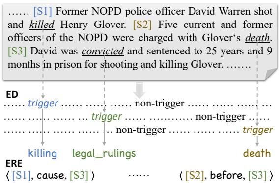
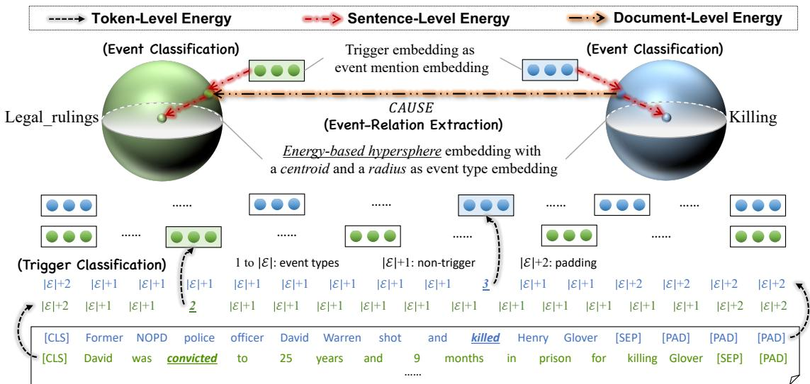
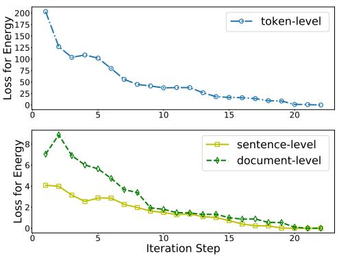
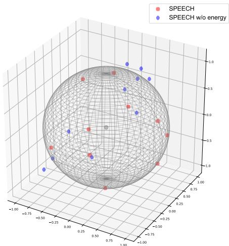

# SPEECH: Structured Prediction with Energy-Based Event-Centric Hyperspheres

Shumin Deng♥, Shengyu Mao♠, Ningyu Zhang♠∗, Bryan Hooi♥∗ ♥National University of Singapore & NUS-NCS Joint Lab, Singapore ♠Zhejiang University & AZFT Joint Lab for Knowledge Engine, China {shumin,dcsbhk}@nus.edu.sg, {shengyu,zhangningyu}@zju.edu.cn

## Abstract

Event-centric structured prediction involves predicting structured outputs of events. In most NLP cases, event structures are complex with manifold dependency, and it is challenging to effectively represent these complicated structured events. To address these issues, we propose Structured Prediction with Energy based Event-Centric Hyperspheres (SPEECH). SPEECH models complex dependency among event structured components with energybased modeling, and represents event classes with simple but effective hyperspheres. Experiments on two unified-annotated event datasets indicate that SPEECH is predominant in event detection and event-relation extraction tasks.

## 1 Introduction

Structured prediction (Taskar et al., 2005) is a task where the predicted outputs are complex structured components. This arises in many NLP tasks (Smith, 2011; Kreutzer et al., 2017; Wang et al., 2023) and supports various applications (Jagannatha and Yu, 2016; Kreutzer et al., 2021). In event-centric NLP tasks, there exists strong complex dependency between the structured outputs, such as event detection (ED) (Chen et al., 2015), event-relation extraction (ERE) (Liu et al., 2020b), and event schema induction (Li et al., 2020). Thus, these tasks can also be revisited as event-centric structured prediction problems (Li et al., 2013).

Event-centric structured prediction (ECSP) tasks require to consider manifold structures and dependency of events, including intra-/inter-sentence structures. For example, as seen in Figure 1, given a document containing some event mentions “David Warren shot and killed Henry Glover ... David was convicted and sentenced to 25 years and 9 months ...”, in ED task mainly considering intra-sentence structures, we need to identify event triggers (killed, convicted) from these tokens and categorize them into event classes (killing, legal\_rulings); in ERE task mainly considering inter-sentence structures, we need to find the relationship between each event mention pair, such as event coreference, temporal, causal and subevent relations.

  
Figure 1: Illustration of event-centric structured prediction tasks, with the examples of ED and ERE.

As seen from Figure 1, the outputs of ECSP lie on a complex manifold and possess interdependent structures, e.g., the long-range dependency of tokens, the association among triggers and event classes, and the dependency among event classes and event relations. Thus it is challenging to model such complex event structures while efficiently representing these events. Previous works increasingly apply deep representation learning to tackle these problems. Lin et al. (2020); Li et al. (2020) propose to predict event structures based on the event graph schema. Hsu et al. (2022) generate event structures with manually designed prompts. However, these methods mainly focus on one of ECSP tasks and their event structures are hard to represent effectively. Paolini et al. (2021); Lu et al. (2021, 2022) propose to extract multiple event structures from texts with a unified generation paradigm. However, the event structures of these approaches are usually quite simplistic and they often ignore the complex dependency among tasks. In this paper, we focus more on: (i) how to learn complex event structures for manifold ECSP tasks; and (ii) how to simultaneously represent events for these complex structured prediction models effectively.

To resolve the first challenging problem of modeling manifold event structures, we utilize energy networks (Lecun et al., 2006; Belanger and McCallum, 2016; Belanger et al., 2017; Tu and Gimpel, 2018), inspired by their potential benefits in capturing complex dependency of structured components. We define the energy function to evaluate compatibility of input/output pairs, which places no limits on the size of the structured components, making it powerful to model complex and manifold event structures. We generally consider token-, sentence-, and document- level energy respectively for trigger classification, event classification and event-relation extraction tasks. To the best of our knowledge, this work firstly address event-centric structured prediction with energy-based modeling.

To resolve the second challenging problem of efficiently representing events, we take advantage of hyperspheres (Mettes et al., 2019; Wang and Isola, 2020), which is demonstrated to be a simple and effective approach to model class representation (Deng et al., 2022). We assume that the event mentions of each event class distribute on the corresponding energy-based hypersphere, so that we can represent each event class with a hyperspherical centroid and radius embedding. The geometrical modeling strategy (Ding et al., 2021; Lai et al., 2021) is demonstrated to be beneficial for modelling enriched class-level information and suitable for constructing measurements in Euclidean space, making it intuitively applicable to manifold eventcentric structured prediction tasks.

Summarily, considering the two issues, we propose to address Structured Prediction with Energybased Event-Centric Hyperspheres (SPEECH), and our contributions can be summarized as follows:

• We revisit the event-centric structured prediction tasks in consideration of both complex event structures with manifold dependency and efficient representation of events.

• We propose a novel approach named SPEECH to model complex event structures with energy-based networks and efficiently represent events with event-centric hyperspheres.

• We evaluate SPEECH on two newly proposed datasets for both event detection and eventrelation extraction, and experiments demonstrate that our model is advantageous.

## 2 Related Work

Event-Centric Structured Prediction (ECSP). Since the boom in deep learning, traditional approaches to ECSP mostly define a scorefunction between inputs and outputs based on a neural network, such as CNN (Chen et al., 2015; Deng et al., 2020), RNN (Nguyen et al., 2016; Meng and Rumshisky, 2018; Nguyen and Nguyen, 2019), and GCN (Yan et al., 2019; Lai et al., 2020; Cui et al., 2020). With the development of pretrained large models, more recent research has entered a new era. Wang et al. (2019); Du and Cardie (2020); Liu et al. (2020a); Deng et al. (2021); Sheng et al. (2022) leverage BERT (Devlin et al., 2019) for event extraction. Han et al. (2020) and Wang et al. (2020a); Man et al. (2022); Hwang et al. (2022) respectively adopt BERT and RoBERTa (Liu et al., 2019) for event-relation extraction. Lu et al. (2021); Paolini et al. (2021); Lu et al. (2022) propose generative ECSP models based on pre-trained T5 (Raffel et al., 2020). Wang et al. (2023) tackle ECSP with code generation based on code pretraining. However, these approaches are equipped with fairly simplistic event structures and have difficulty in tackling complex dependency in events. Besides, most of them fail to represent manifold events effectively.

Energy Networks for Structured Prediction and Hyperspheres for Class Representation. Energy networks define an energy function over input/output pairs with arbitrary neural networks, which places no limits on the size of the structured components, making it advantageous in modeling complex and manifold event structures. Lecun et al. (2006); Belanger and McCallum (2016) associate a scalar measure to evaluate the compatibility to each configuration of inputs and outputs. (Belanger and McCallum, 2016) formulate deep energy-based models for structured prediction, called structured prediction energy networks (SPENs). Belanger et al. (2017) present end-to-end learning for SPENs, Tu and Gimpel (2018) jointly train structured energy functions and inference networks with largemargin objectives. Some previous researches also regard event-centric NLP tasks as structured prediction (Li et al., 2013; Paolini et al., 2021). Furthermore, to effectively obtain event representations, Deng et al. (2022) demonstrate that hyperspherical prototypical networks (Mettes et al., 2019) are powerful to encode enriched semantics and dependency in event structures, but they merely consider support for pairwise event structures.

## 3 Methodology

## 3.1 Preliminaries

For structured prediction tasks, given input $\mathbf { \boldsymbol { x } } \in \mathcal { X }$ we denote the structured outputs by ${ \mathbf { M } } _ { \Phi } ( { \pmb x } ) \in \tilde { \mathcal { V } }$ with a prediction model ${ { \bf { M } } _ { \Phi } }$ . Structured Prediction Energy Networks (SPENs) score structured outputs with an energy function $E _ { \Theta } : \mathcal { X } \times \tilde { \mathcal { Y } }  \mathbb { R }$ parameterized by Θ that iteratively optimize the energy between the input/output pair (Belanger and Mc-Callum, 2016), where lower energy means greater compatibility between the pair.

We introduce event-centric structured prediction (ECSP) following the similar setting as SPENs for multi-label classification and sequence labeling proposed by Tu and Gimpel (2018). Given a feature vector x belonging to one of T labels, the model output is $\mathbf { M } _ { \Phi } ( \pmb { x } ) = \{ 0 , 1 \} ^ { T } \in \tilde { \mathcal { V } }$ for all ${ \pmb x } .$ . The energy function contains two terms:

$$
\begin{array} { l } { { \displaystyle E _ { \Theta } ( { \pmb x } , { \pmb y } ) = E _ { \Theta } ^ { l o c a l } ( { \pmb x } , { \pmb y } ) + E _ { \Theta } ^ { l a b e l } ( { \pmb y } ) } } \\ { { \displaystyle ~ = \sum _ { i = 1 } ^ { T } y _ { i } V _ { i } ^ { \top } f ( { \pmb x } ) + w ^ { \top } g ( W { \pmb y } ) } } \end{array}\tag{1}
$$

where $\begin{array} { r } { E _ { \Theta } ^ { l o c a l } ( { \pmb x } , { \pmb y } ) = \sum _ { i = 1 } ^ { T } y _ { i } V _ { i } ^ { \top } f ( { \pmb x } ) } \end{array}$ is the sum of linear models, and $y _ { i } \in y , V _ { i }$ is a parameter vector for label i and $f ( { \pmb x } )$ is a multi-layer perceptron computing a feature representation for the input x; $E _ { \Theta } ^ { l a b e l } ( \pmb { y } ) = \pmb { w } ^ { \top } g ( W \pmb { y } )$ returns a scalar which quantifies the full set of labels, scoring y independent of $\mathbf { \delta } _ { \mathbf { x } , \mathbf { \delta } }$ , thereinto, w is a parameter vector, $g ( \cdot )$ is an elementwise non-linearity function, and $W$ is a parameter matrix learned from data indicating the interaction between labels.

After learning the energy function, prediction minimizes energy:

$$
\tilde { \pmb { y } } = \arg \operatorname* { m i n } _ { \pmb { y } \in \tilde { \mathcal { V } } } E _ { \Theta } ( \pmb { x } , \pmb { y } )\tag{2}
$$

The final theoretical optimum for SPEN is denoted by:

$$
\begin{array} { r l } { \underset { \Theta } { \operatorname* { m i n } } \underset { \Phi } { \operatorname* { m a x } } \sum } & { \left[ \triangle \left( \mathbf { M } _ { \Phi } ( \pmb { x } _ { i } ) , \pmb { y } _ { i } \right) - \right. } \\ & { \left. E _ { \Theta } \left( \pmb { x } _ { i } , \mathbf { M } _ { \Phi } ( \pmb { x } _ { i } ) \right) + E _ { \Theta } \left( \pmb { x } _ { i } , \pmb { y } _ { i } \right) \right] _ { + } } \end{array}\tag{3}
$$

where $[ a ] _ { + } = \operatorname* { m a x } ( 0 , a )$ , and $\triangle ( \tilde { \pmb { y } } , \pmb { y } )$ , often referred to “margin-rescaled” structured hinge loss, is a structured cost function that returns a nonnegative value indicating the difference between the predicted result y˜ and ground truth y.

## 3.2 Problem Formulation

In this paper, we focus on ECSP tasks of event detection (ED) and event-relation extraction (ERE). ED can be divided into trigger classification for tokens and event classification for sentences. We denote the dataset by $\mathcal { D } \ = \ \{ \mathcal { E } , \mathcal { R } , \mathcal { X } \}$ containing an event class set , a multi-faceted eventrelation set $\mathcal { R }$ and the event corpus $\mathcal { X } ,$ , thereinto, $\mathcal { E } = \{ e _ { i } \ | \ i \in [ 1 , | \mathcal { E } | ] \}$ contains event classes including a None; $\mathcal { R } = \{ r _ { i } \ | \ i \in [ 1 , | \mathcal { R } | ] \}$ contains $| \mathcal { R } |$ temporal, causal, subevent and coreference relationships among event mentions including a NA event-relation; $\mathcal { X } = \{ X _ { i } \mid i \in [ 1 , K ] \}$ consists of $K$ event mentions, where $X _ { i }$ is denoted as a token sequence $\pmb { x } = \{ \pmb { x } _ { j } \ | \ j \in [ 1 , L ] \}$ with maximum $L$ tokens. For trigger classification, the goal is to predict the index $t \left( 1 \leq t \leq L \right)$ of the trigger $\mathbf { \Delta } _ { \mathbf { \mathcal { X } } _ { t } }$ in each token sequence x and categorize $\mathbf { \mathcal { x } } _ { t }$ into a specific event class $e _ { i } \in \mathcal { E }$ . For event classification, we expect to predict the event label $e _ { i }$ for each event mention $X _ { i }$ . For event-relation extraction, we require to identify the relation $r _ { i } \in \mathcal { R }$ for a pair of event mentions $\ddot { \pmb X } _ { \langle i j \rangle } = ( \pmb X _ { i } , \pmb X _ { j } )$

In summary, our goal is to design an ECSP model ${ { \bf { M } } _ { \Phi } }$ , aiming to tackle the tasks of: (1) trigger classification: to predict the token label $\tilde { \pmb { y } } =$ ${ \bf M } _ { \Phi } ( { \pmb x } )$ for the token list x; (2) event classification: to predict the event class label $\tilde { { \cal Y } } = { \bf M } _ { \Phi } ( { \pmb X } )$ for the event mention X; (3) event-relation extraction: to predict the event-relation label $\tilde { z } = \mathbf { M } _ { \Phi } ( \ddot { \pmb { X } } )$ for the event mention pair $\ddot { X }$

## 3.3 Model Overview

As seen in Figure 2, SPEECH combines three levels of energy: token, sentence, as well as document, and they respectively serve for three kinds of ECSP tasks: (1) token-level energy for trigger classification: considering energy-based modeling is able to capture long-range dependency among tokens without limits to token size; (2) sentencelevel energy for event classification: considering energy-based hyperspheres can model the complex event structures and represent events efficiently; and (3) document-level energy for event-relation extraction: considering energy-based modeling enables us to address the association among event mention pairs and event-relations. We leverage the trigger embeddings as event mention embeddings; the energy-based hyperspheres with a centroid and a radius as event class embeddings, and these three tasks are associative to each other.

  
Figure 2: Overview of SPEECH with examples, where token-level energy serves for event trigger classification, sentence-level energy serves for event classification and document-level energy serves for event-relation extraction.

## 3.4 Token-Level Energy

Token-level energy serves for trigger classification. Given a token sequence $\pmb { x } = \{ \pmb { x } _ { j } | j \in [ 1 , L ] \}$ with trigger ${ \mathbf { } } x _ { t } ,$ we leverage a pluggable backbone encoder to obtain the contextual representation $f _ { 1 } ( \pmb { x } )$ for each token, such as pre-trained BERT (Devlin et al., 2019), RoBERTa (Liu et al., 2019), Distil-BERT (Sanh et al., 2019) and so on. We then predict the label $\tilde { \pmb { y } } = \mathbf { M } _ { \Phi } ( \pmb { x } )$ of each token with an additional linear classifier. Inspired by SPENs for sequence labeling (Tu and Gimpel, 2018), we also adopt an energy function for token classification.

Energy Function. The token-level energy function is inherited from Eq (1), defined as:

$$
\begin{array} { l } { \displaystyle E \Theta ( { \pmb x } , { \pmb y } ) = } \\ { - \left( \sum _ { n = 1 } ^ { L } \sum _ { i = 1 } ^ { | { \boldsymbol \mathcal { E } } | + 2 } \underbrace { y _ { n } ^ { i } \left( V _ { 1 , i } ^ { \top } f _ { 1 } ( { \pmb x } _ { n } ) \right) } _ { l o c a l } + \sum _ { n = 1 } ^ { L } \underbrace { y _ { n - 1 } ^ { \top } W _ { 1 } y _ { n } } _ { l a b e l } \right) } \end{array}\tag{4}
$$

where $y _ { n } ^ { i }$ is the $i _ { t h }$ entry of the vector $y _ { n } \in \mathsf { \pmb { y } } ,$ indicating the probability of the $n _ { t h }$ token ${ \bf { x } } _ { n }$ being labeled with $\textit { i } ( i$ for $\begin{array} { r } { e _ { i } , | \mathcal { E } | + 1 } \end{array}$ for non-trigger and $| \mathcal { E } | { + } 2$ for padding token). $f _ { 1 } ( \cdot )$ denotes the feature encoder of tokens. Here our learnable parameters are $\Theta = \left( V _ { 1 } , W _ { 1 } \right)$ , thereinto, $V _ { 1 , i } \in \mathbb { R } ^ { d }$ is a parameter vector for token label i, and $W _ { 1 } \in$ $\mathbb { R } ^ { ( | \mathcal { E } | + 2 ) \times ( | \mathcal { E } | + 2 ) }$ contains the bilinear product between $y _ { n - 1 }$ and $y _ { n }$ for token label pair terms.

Loss Function. The training objective for trigger classification is denoted by:

$$
\begin{array} { r l r } {  { \mathcal { L } _ { t o k } = \sum _ { i = 1 } ^ { L } [ \triangle ( \tilde { \pmb { y } } _ { i } , \pmb { y } _ { i } ) - E _ { \Theta } ( \pmb { x } _ { i } , \tilde { \pmb { y } } _ { i } )  } } \\ & { } & {  + E _ { \Theta } ( \pmb { x } _ { i } , \pmb { y } _ { i } ) ] _ { + } + \mu _ { 1 } \mathcal { L } _ { \mathrm { C E } } ( \tilde { \pmb { y } } _ { i } , \pmb { y } _ { i } ) } \end{array}\tag{5}
$$

where $\tilde { y } _ { i }$ and ${ \bf { \nabla } } \mathbf { \mathbf { } } \mathbf { \mathbf { } } \mathbf { \mathbf { { \mathit { y } } } } _ { i }$ respectively denote predicted results and ground truth. The first half of Eq (5) is inherited from Eq (3) for the energy function, and in the latter half, $\mathcal { L } _ { \mathrm { C E } } \left( \tilde { y } _ { i } , y _ { i } \right)$ is the trigger classification cross entropy loss, and $\mu _ { 1 }$ is its ratio.

## 3.5 Sentence-Level Energy

Sentence-level energy serves for event classification. Given the event mention $X _ { i }$ with the trigger $\mathbf { \Delta } _ { \mathbf { \mathcal { X } } _ { t } }$ , we utilize the trigger embedding $f _ { 1 } ( \pmb { x } _ { t } )$ as the event mention embedding $f _ { 2 } ( \pmb { X } )$ , where $f _ { 2 } ( \cdot )$ denotes the feature encoder of event mentions. We then predict the class of each event mention with energy-based hyperspheres, denoted by $\tilde { Y } = \mathbf { M } _ { \Phi } ( \pmb { X } )$

Specifically, we use an energy-based hypersphere to represent each event class, and assume that the event mentions of each event class should distribute on the corresponding hypersphere with the lowest energy. We then calculate the probability of the event mention X categorizing into the class $e _ { i }$ with a hyperspherical measurement function:

$$
\mathcal { S } ( X , \mathcal { P } _ { i } ) = \frac { \exp ^ { - [ \mathbf { \Gamma } \| \mathcal { P } _ { i } - f _ { 2 } ( \pmb { X } ) \| _ { 2 } - \gamma \mathbf { \Gamma } ] _ { + } } } { \sum _ { j = 1 } ^ { | \mathcal { E } | } \exp ^ { - [ \mathbf { \Gamma } \| \mathcal { P } _ { j } - f _ { 2 } ( \pmb { X } ) \| _ { 2 } - \gamma \mathbf { \Gamma } ] _ { + } } }\tag{6}
$$

where $[ a ] _ { + } = \operatorname* { m a x } ( 0 , a ) , \mathcal { P } _ { i }$ denotes the hypersphere centroid embedding of $\boldsymbol { e } _ { i } , \parallel \cdot \parallel$ denotes the Euclidean distance. $\gamma$ is the radius of the hypersphere, which can be scalable or constant. We simply set $\gamma = 1$ in this paper, meaning that each event class is represented by a unit hypersphere. Larger ${ \mathcal { S } } ( X , { \mathcal { P } } _ { i } )$ signifies that the event mention X are more likely be categorized into $\mathcal { P } _ { i }$ corresponding to $e _ { i }$ . To measure the energy score between event classes and event mentions, we also adopt an energy function for event classification.

Energy Function. The sentence-level energy function is inherited from Eq (1), defined as:

$$
\begin{array} { l } { { \displaystyle { E } _ { \Theta } ( X , Y ) = } } \\ { { \displaystyle { - \left( \sum _ { i = 1 } ^ { \lfloor \xi \rfloor } \underbrace { Y _ { i } \left( V _ { 2 , i } ^ { \top } f _ { 2 } ( X ) \right) } _ { l o c a l } + \underbrace { w _ { 2 } ^ { \top } g ( W _ { 2 } { \cal Y } ) } _ { l a b e l } \right) } } } \end{array}\tag{7}
$$

where $Y _ { i } \in Y$ indicates the probability of the event mention X being categorized to $e _ { i }$ . Here our learnable parameters are $\Theta = ( V _ { 2 } , w _ { 2 } , W _ { 2 } )$ , thereinto, $V _ { 2 , i } \in \mathbb { R } ^ { d }$ is a parameter vector for $e _ { i } , w _ { 2 } \in \mathbb { R } ^ { | \mathcal { E } | }$ and $W _ { 2 } \in \mathbb { R } ^ { | \mathcal { E } | \times | \mathcal { E } | }$

Loss Function. The training objective for event classification is denoted by:

$$
\begin{array} { r l r } {  { \mathcal { L } _ { s e n } = \sum _ { i = 1 } ^ { K } [ \triangle  ( \tilde { \mathbf { Y } } _ { i } , \mathbf { Y } _ { i } ) - E _ { \Theta } ( X _ { i } , \tilde { \mathbf { Y } } _ { i } )  } } \\ & { } & {  + E _ { \Theta } ( \mathbf { X } _ { i } , \mathbf { Y } _ { i } ) ] _ { + } + \mu _ { 2 } \mathcal { L } _ { \mathrm { C E } } ( \tilde { \mathbf { Y } } _ { i } , \mathbf { Y } _ { i } ) } \end{array}\tag{8}
$$

where the first half is inherited from Eq (3), and in the latter half, $\mathcal { L } _ { \mathrm { C E } }$ is a cross entropy loss for predicted results $\tilde { Y _ { i } }$ and ground truth $\mathbf { Y } _ { i \cdot \mu _ { 2 } }$ is a ratio for event classification cross entropy loss.

## 3.6 Document-Level Energy

Document-level energy serves for event-relation extraction. Given event mentions X in each document, we model the embedding interactions of each event mention pair with a comprehensive feature vector $f _ { 3 } ( \ddot { \bf X } _ { \langle i j \rangle } ) = \big [ f _ { 2 } ( { \bf X } _ { i } ) , \bar { f } _ { 2 } ( X _ { j } ) , f _ { 2 } ( X _ { i } )$ O $f _ { 2 } ( \pmb { X } _ { j } ) ]$ . We then predict the relation between each event mention pair with a linear classifier, denoted by $\tilde { z } = \mathbf { M } _ { \Phi } ( \ddot { \pmb { X } } )$ . Inspired by SPENs for multi-label classification (Tu and Gimpel, 2018), we also adopt an energy function for ERE.

Energy Function. The document-level energy function is inherited from Eq (1), defined as:

$$
\begin{array} { l } { { \displaystyle E _ { \Theta } ( \ddot { X } , z ) = } } \\ { { \displaystyle - \left( \sum _ { i = 1 } ^ { | { \mathcal R } | } \underbrace { z _ { i } \left( V _ { 3 , i } ^ { \top } f _ { 3 } ( \ddot { X } ) \right) } _ { l o c a l } + \underbrace { w _ { 3 } ^ { \top } g ( W _ { 3 } z ) } _ { l a b e l } \right) } } \end{array}\tag{9}
$$

where $z _ { i } \in z$ indicates the probability of the event mention pair $\ddot { X }$ having the relation of $r _ { i }$ . Here our learnable parameters are $\Theta = ( V _ { 3 } , w _ { 3 } , W _ { 3 } )$ thereinto, $V _ { 3 , i } \in \mathbb { R } ^ { 3 d }$ is a parameter vector for $r _ { i }$ $w _ { 3 } \in \mathbb { R } ^ { | \mathcal { R } | }$ and $W _ { 3 } \in \mathbb { R } ^ { | \mathcal { R } | \times | \mathcal { R } | }$

Loss Function. The training objective for eventrelation extraction is denoted by:

$$
\begin{array} { c } { \mathcal { L } _ { d o c } = \displaystyle \sum _ { k = 1 } ^ { N } \left[ \triangle \left( \tilde { z } _ { k } , z _ { k } \right) - E _ { \Theta } \left( \ddot { X } _ { k } , \tilde { z } _ { k } \right) \right. } \\ { \displaystyle \left. + E _ { \Theta } \left( \ddot { X } _ { k } , z _ { k } \right) \right] _ { + } + \mu _ { 3 } \mathcal { L } _ { \mathrm { C E } } \left( \tilde { z } _ { k } , z _ { k } \right) } \end{array}\tag{10}
$$

where the first half is inherited from $\operatorname { E q } \left( 3 \right)$ , and in the latter half, $\mathcal { L } _ { \mathrm { C E } } \left( \tilde { z } _ { k } , z _ { k } \right)$ is the event-relation extraction cross entropy loss, $\mu _ { 3 }$ is its ratio, and $N$ denotes the quantity of event mention pairs.

The final training loss for SPEECH $\mathbf { M } _ { \Phi }$ parameterized by Φ is defined as:

$$
\mathcal { L } = \lambda _ { 1 } \mathcal { L } _ { t o k } + \lambda _ { 2 } \mathcal { L } _ { s e n } + \lambda _ { 3 } \mathcal { L } _ { d o c } + \| \Phi \| _ { 2 } ^ { 2 }\tag{11}
$$

where $\lambda _ { 1 } , \lambda _ { 2 } , \lambda _ { 3 }$ are the loss ratios respectively for trigger classification, event classification and event-relation extraction tasks. We add the penalty term $\| \Phi \| _ { 2 } ^ { 2 }$ with $L _ { 2 }$ regularization.

## 4 Experiments

The experiments refer to event-centric structured prediction (ECSP) and comprise three tasks: (1) Trigger Classification; (2) Event Classification; and (3) Event-Relation Extraction.

## 4.1 Datasets and Baselines

<table><tr><td></td><td>MAVEN-ERE</td><td>ONTOEVENT-DOC</td></tr><tr><td># Document</td><td>4,480</td><td>4,115</td></tr><tr><td># Mention</td><td>112,276</td><td>60,546</td></tr><tr><td># Temporal</td><td>1,216,217</td><td>5,914</td></tr><tr><td># Causal</td><td>57,992</td><td>14,155</td></tr><tr><td># Subevent</td><td>15,841</td><td>1</td></tr></table>

Table 1: The statistics about MAVEN-ERE and ONTOEVENT-DOC used in this paper.

Datasets. Considering event-centric structured prediction tasks in this paper require fine-grained annotations for events, such as labels of tokens, event mentions, and event-relations, we select two newly-proposed datasets meeting the requirements: MAVEN-ERE (Wang et al., 2022) and ONTOEVENT-DOC (Deng et al., 2021). Note that ONTOEVENT-DOC is derived from ONTOEVENT (Deng et al., 2021) which is formatted in a sentence level. We reorganize it and make it format in a document level, similar to MAVEN-ERE. Thus the train, validation, and test sets of ONTOEVENT-DOC are also different from the original ONTO-EVENT. We release the reconstructed dataset and code in Github1 for reproduction. To simplify the experiment settings, we dismiss hierarchical relations of ONTOEVENT and coreference relations of MAVEN-ERE in this paper. More details of multifaceted event-relations of these two datasets are introduced in Appendix A and Github. We present the statistics about these two datasets in Table 1. The document quantity for train/valid/test set of MAVEN-ERE and ONTOEVENT are respectively 2,913/710/857, and 2,622/747/746.

<table><tr><td rowspan="2">Model</td><td colspan="3">MAVEN-ERE 一</td><td colspan="3">ONTOEVENT-DOC</td></tr><tr><td>P</td><td>R</td><td>F1</td><td>1 P</td><td>R</td><td>F1</td></tr><tr><td>DMCNN†</td><td> $6 0 . 0 9 \pm 0 . 3 6$ </td><td> $6 0 . 3 4 \pm 0 . 4 5$ </td><td> $6 0 . 2 1 \pm 0 . 2 1$ </td><td> $5 0 . 4 2 \pm 0 . 9 9$ </td><td> $5 2 . 2 4 \pm 0 . 4 6$ </td><td> $5 1 . 3 1 \pm 0 . 3 9$ </td></tr><tr><td>BiLSTM-CRF†</td><td> $6 1 . 3 0 \pm 1 . 0 7$ </td><td> $6 4 . 9 5 \pm 1 . 0 3$ </td><td> $6 3 . 0 6 \pm 0 . 2 3$ </td><td> $4 8 . 8 6 \pm 0 . 8 1$ </td><td> $5 5 . 9 1 \pm 0 . 5 6$ </td><td> $5 2 . 1 0 \pm 0 . 4 3$ </td></tr><tr><td>DMBERT†</td><td> $5 6 . 7 9 \pm 0 . 5 4$ </td><td> $7 6 . 2 4 \pm 0 . 2 6$ </td><td> $6 5 . 0 9 \pm 0 . 3 2$ </td><td> $5 3 . 8 2 \pm 1 . 0 1$ </td><td> $6 6 . 1 2 \pm 1 . 0 2$ </td><td> $5 9 . 3 2 \pm 0 . 2 4$ </td></tr><tr><td>BERT-CRF†</td><td> $6 2 . 7 9 \pm 0 . 3 4$ </td><td> $7 0 . 5 1 \pm 0 . 9 4$ </td><td> $6 5 . 7 3 \pm 0 . 5 7$ </td><td> $5 2 . 1 8 \pm 0 . 8 1$ </td><td> $6 2 . 3 1 \pm 0 . 4 5$ </td><td> $5 6 . 8 0 \pm 0 . 5 3$ </td></tr><tr><td> $\mathbf { M L B i N e t ^ { \ddag } }$ </td><td> $6 3 . 5 0 \pm 0 . 5 7$ </td><td> $6 3 . 8 0 \pm 0 . 4 7$ </td><td> $6 3 . 6 0 \pm 0 . 5 2$ </td><td> $5 6 . 0 9 \pm 0 . 9 3$ </td><td> $5 7 . 6 7 \pm 0 . 8 1$ </td><td> $5 6 . 8 7 \pm 0 . 8 7$ </td></tr><tr><td>TANL</td><td> $6 8 . 6 6 \pm 0 . 1 8$ </td><td> $6 3 . 7 9 \pm 0 . 1 9$ </td><td> $6 6 . 1 3 \pm 0 . 1 5$ </td><td> $5 7 . 7 3 \pm 0 . 6 5$ </td><td> $5 9 . 9 3 \pm 0 . 3 1$ </td><td> $5 9 . 1 3 \pm 0 . 5 2$ </td></tr><tr><td> $\mathrm { T E X T 2 E V E N T ^ { \ddagger } }$ </td><td> $5 9 . 9 1 \pm 0 . 8 3$ </td><td> $6 4 . 6 2 \pm 0 . 6 5$ </td><td> $6 2 . 1 6 \pm 0 . 2 5$ </td><td> $5 2 . 9 3 \pm 0 . 9 4$ </td><td> $6 2 . 2 7 \pm 0 . 4 9$ </td><td> $5 7 . 2 2 \pm 0 . 7 5$ </td></tr><tr><td> $_ \mathrm { C o r E D - B E R T ^ { \ddagger } }$ </td><td> $6 7 . 6 2 \pm 1 . 0 3$ </td><td> $6 9 . 4 9 \pm 0 . 6 3$ </td><td> $6 8 . 4 9 \pm 0 . 4 2$ </td><td> $6 0 . 2 7 \pm 0 . 5 5$ </td><td> $6 2 . 2 5 \pm 0 . 6 6$ </td><td> $6 1 . 2 5 \pm 0 . 1 9$ </td></tr><tr><td>SPEECH</td><td> $7 8 . 8 2 \pm 0 . 8 2$ </td><td> ${ \bf 7 9 . 3 7 \pm 0 . 7 5 }$ </td><td> ${ \bf 7 9 . 0 9 \pm 0 . 8 2 }$ </td><td> ${ \bf 7 4 . 6 7 \pm 0 . 5 8 }$ </td><td> $7 4 . 7 3 \pm 0 . 6 2$ </td><td> ${ \bf 7 4 . 7 0 \pm 0 . 5 8 }$ </td></tr><tr><td>w/o energy</td><td> $7 6 . 1 2 \pm 0 . 3 2$ </td><td> $7 6 . 6 6 \pm 0 . 2 5$ </td><td> $7 6 . 3 8 \pm 0 . 2 8$ </td><td> $7 1 . 7 6 \pm 0 . 3 8$ </td><td> $7 2 . 1 7 \pm 0 . 3 9$ </td><td> $7 1 . 9 6 \pm 0 . 3 8$ </td></tr></table>

Table 2: Performance (%) of trigger classification on MAVEN-ERE valid set and ONTOEVENT-DOC test set. : results are produced with codes referred to Wang et al. (2020b); : results are produced with official implementation. Best results are marked in bold, and the second best results are underlined.

## 4.2 Implementation Details

With regard to settings of the training process, Adam (Kingma and Ba, 2015) optimizer is used, with the learning rate of 5e-5. The maximum length L of a token sequence is 128, and the maximum quantity of event mentions in one document is set to 40 for MAVEN-ERE and 50 for ONTOEVENT-DOC. The loss ratios, $\mu _ { 1 } , \mu _ { 2 } , \mu _ { 3 }$ , for token, sentence and document-level energy function are all set to 1. The value of loss ratio, $\lambda _ { 1 } , \lambda _ { 2 } , \lambda _ { 3 }$ , for trigger classification, event classification and eventrelation extraction depends on different tasks, and we introduce them in Appendix B. We evaluate the performance of ED and ERE with micro precision (P), Recall (R) and F1 Score (F1).

Baselines. For trigger classification and event classification, we adopt models aggregated dynamic multi-pooling mechanism, i.e., DMCNN (Chen et al., 2015) and DMBERT (Wang et al., 2019); sequence labeling models with conditional random field (CRF) (Lafferty et al., 2001), i.e., BiLSTM-CRF and BERT-CRF; generative ED models, i.e., TANL (Paolini et al., 2021) and TEXT2EVENT (Lu et al., 2021). We also adopt some ED models considering document-level associations, i.e., MLBiNet (Lou et al., 2021) and CorED-BERT (Sheng et al., 2022). Besides, we compare our energy-based hyperspheres with the vanilla hyperspherical prototype network (HPN) (Mettes et al., 2019) and prototype-based model OntoED (Deng et al., 2021). Note that unlike vanilla HPN (Mettes et al., 2019) which represents all classes on one hypersphere, the HPN adopted in this paper represents each class with a distinct hypersphere. For event-relation extraction, we select RoBERTa (Liu et al., 2019), which is the same baseline used in MAVEN-ERE (Wang et al., 2022), and also serves as the backbone for most of recent ERE models (Hwang et al., 2022; Man et al., 2022).

## 4.3 Event Trigger Classification

We present details of event trigger classification experiment settings in Appendix B.1. As seen from the results in Table 2, SPEECH demonstrates superior performance over all baselines, notably MLBi-Net (Lou et al., 2021) and CorED-BERT (Sheng et al., 2022), even if these two models consider cross-sentence semantic information or incorporate type-level and instance-level correlations. The main reason may be due to the energy-based nature of SPEECH. As seen from the last row of Table 2, the removal of energy functions from SPEECH can result in a performance decrease. Specifically for trigger classification, energy-based modeling enables capture long-range dependency of tokens and places no limits on the size of event structures. In addition, SPEECH also excels generative models, i.e., TANL (Paolini et al., 2021) and TEXT2EVENT (Lu et al., 2021), thereby demonstrating the efficacy of energy-based modeling.

<table><tr><td rowspan="2">Model</td><td colspan="3">MAVEN-ERE</td><td colspan="3">ONTOEVENT-DOC</td></tr><tr><td>P</td><td>R</td><td>F1</td><td>P</td><td>R</td><td>F1</td></tr><tr><td>DMCNN</td><td> $6 1 . 7 4 \pm 0 . 3 2$ </td><td> $6 3 . 1 1 \pm 0 . 3 4$ </td><td> $6 2 . 4 2 \pm 0 . 1 5$ </td><td> $5 1 . 5 2 \pm 0 . 8 7$ </td><td> $5 2 . 8 4 \pm 0 . 6 1$ </td><td> $5 2 . 0 2 \pm 0 . 3 6$ </td></tr><tr><td>DMBERT</td><td> $5 9 . 4 5 \pm 0 . 4 8$ </td><td> $7 7 . 7 7 \pm 0 . 2 1$ </td><td> $6 7 . 3 9 \pm 0 . 2 5$ </td><td> $5 7 . 0 6 \pm 1 . 0 4$ </td><td> $7 2 . 9 7 \pm 1 . 1 1$ </td><td> ${ \bf 6 5 . 0 3 \pm 0 . 4 5 }$ </td></tr><tr><td>HPN</td><td> $6 2 . 8 0 \pm 0 . 7 2$ </td><td> $6 2 . 6 2 \pm 0 . 9 9$ </td><td> $6 2 . 7 1 \pm 0 . 8 5$ </td><td> $6 1 . 1 8 \pm 0 . 8 1$ </td><td> $6 0 . 8 8 \pm 0 . 7 9$ </td><td> $6 1 . 0 3 \pm 0 . 8 1$ </td></tr><tr><td>OntoED</td><td> $6 7 . 8 2 \pm 1 . 7 0$ </td><td> $6 7 . 7 2 \pm 1 . 5 2$ </td><td> $\underline { { 6 7 . 7 7 } } \pm 1 . 6 1$ </td><td> ${ \bf 6 4 . 3 2 \pm 1 . 1 5 }$ </td><td> $6 4 . 1 6 \pm 1 . 3 1$ </td><td> $\underline { { 6 4 . 2 5 } } \pm 1 . 2 2$ </td></tr><tr><td>TANL</td><td> $6 8 . 7 3 \pm 0 . 1 6$ </td><td> $6 5 . 6 5 \pm 0 . 6 3$ </td><td> $6 7 . 1 5 \pm 0 . 2 9$ </td><td> $6 0 . 3 4 \pm 0 . 7 1$ </td><td> $6 2 . 5 2 \pm 0 . 4 3$ </td><td> $6 1 . 4 2 \pm 0 . 5 1$ </td></tr><tr><td>TEXT2EVENT</td><td> $6 1 . 1 4 \pm 0 . 8 0$ </td><td> $6 5 . 9 3 \pm 0 . 6 9$ </td><td> $6 3 . 4 4 \pm 0 . 1 9$ </td><td> $5 6 . 7 6 \pm 0 . 9 7$ </td><td> $6 6 . 7 8 \pm 0 . 4 8$ </td><td> $6 1 . 3 6 \pm 0 . 7 7$ </td></tr><tr><td>SPEECH</td><td> $\mathbf { 7 2 . 9 1 \pm 0 . 7 6 }$ </td><td> $7 2 . 8 1 \pm 0 . 7 6$ </td><td> $7 2 . 8 6 \pm 0 . 7 7$ </td><td> $5 8 . 9 2 \pm 0 . 9 6$ </td><td> $5 8 . 4 5 \pm 1 . 0 8$ </td><td> $5 8 . 6 9 \pm 1 . 4 0$ </td></tr><tr><td>w/o energy</td><td> $7 1 . 2 2 \pm 0 . 5 8$ </td><td> $7 1 . 0 7 \pm 0 . 4 5$ </td><td> $7 1 . 1 2 \pm 0 . 4 5$ </td><td> $5 6 . 1 2 \pm 1 . 8 7$ </td><td> $5 5 . 6 9 \pm 1 . 6 6$ </td><td> $5 5 . 9 1 \pm 1 . 7 6$ </td></tr></table>

Table 3: Performance (%) of event classification on MAVEN-ERE valid set and ONTOEVENT-DOC test set.

## 4.4 Event Classification

The specifics of event classification experiment settings are elaborated in Appendix B.2, with results illustrated in Table 3. We can observe that SPEECH provides considerable advantages on MAVEN-ERE, while the performance on ONTOEVENT-DOC is not superior enough. ONTOEVENT-DOC contains overlapping where multiple event classes may exist in the same event mention, which could be the primary reason for SPEECH not performing well enough in this case. This impact could be exacerbated when joint training with other ECSP tasks. Upon comparison with prototype-based methods without energy-based modeling, i.e., HPN (Mettes et al., 2019) and OntoED (Deng et al., 2021), SPEECH is still dominant on MAVEN-ERE, despite HPN represents classes with hyperspheres and OntoED leverages hyperspheres integrated with eventrelation semantics. If we exclude energy functions from SPEECH, performance will degrade, as seen from the last row in Table 3. This insight suggests that energy functions contribute positively to event classification, which enable the model to directly capture complicated dependency between event mentions and event types, instead of implicitly inferring from data. Besides, SPEECH also outperforms generative models like TANL and TEXT2EVENT on MAVEN-ERE, indicating the superiority of energy-based hyperspherical modeling.

<table><tr><td rowspan=1 colspan=2>ERE Task</td><td rowspan=1 colspan=1>RoBERTa</td><td rowspan=1 colspan=1>SPEECH</td></tr><tr><td rowspan=1 colspan=1>Temporal</td><td rowspan=1 colspan=1>MAVEN-ERE+jointONTOEVENT-DOC+joint</td><td rowspan=1 colspan=1> ${ \bf 4 9 . 2 1 \pm 0 . 3 3 }$  ${ \bf 4 9 . 9 1 \pm 0 . 5 8 }$  $3 7 . 6 8 \pm 0 . 4 7$  $3 5 . 6 3 \pm 0 . 7 0$ </td><td rowspan=1 colspan=1> $3 9 . 6 4 \pm 0 . 7 9$  $4 0 . 2 3 \pm 0 . 3 4$  ${ \pm 2 . 3 6 \pm 0 . 7 1 }$  ${ \bf 6 5 . 6 9 \pm 0 . 3 9 }$ </td></tr><tr><td rowspan=1 colspan=1>Causal</td><td rowspan=1 colspan=1>MAVEN-ERE+jointONTOEVENT-DOC+joint</td><td rowspan=1 colspan=1> ${ \bf 2 9 . 9 1 \pm 0 . 3 4 }$  ${ \bf 2 9 . 0 3 \pm 0 . 9 1 }$  $3 5 . 4 8 \pm 1 . 7 7$  $4 4 . 9 9 \pm 0 . 2 9$ </td><td rowspan=1 colspan=1> $1 6 . 2 8 \pm 0 . 5 3$  $1 6 . 3 1 \pm 0 . 9 7$  ${ \bf 7 9 . 2 9 \pm 2 . 1 5 }$  ${ \bf 6 7 . 7 6 \pm 1 . 2 8 }$ </td></tr><tr><td rowspan=1 colspan=1>Subevent</td><td rowspan=1 colspan=1>MAVEN-ERE+joint</td><td rowspan=1 colspan=1> $1 9 . 8 0 \pm 0 . 4 4$  $1 9 . 1 4 \pm 2 . 8 1$ </td><td rowspan=1 colspan=1> ${ \bf 1 9 . 9 1 \pm 0 . 5 2 }$  ${ \pm 1 . 9 6 \pm 1 . 2 4 }$ </td></tr><tr><td rowspan=1 colspan=1>All Joint</td><td rowspan=1 colspan=1>MAVEN-ERE $\mathrm { O N T O E V E N T - D O C }$ </td><td rowspan=1 colspan=1> $3 4 . 7 9 \pm 1 . 1 3$  $2 8 . 6 0 \pm 0 . 1 3$ </td><td rowspan=1 colspan=1> $3 7 . 8 5 \pm 0 . 7 2$  ${ \pm 4 . 1 9 \pm 2 . 2 8 }$ </td></tr></table>

Table 4: F1 (%) performance of ERE on MAVEN-ERE valid set and ONTOEVENT-DOC test set. “+joint” in the $2 _ { n d }$ column denotes jointly training on all ERE tasks and evaluating on the specific one, with the same setting as Wang et al. (2022). “All Joint” in the last two rows denotes treating all ERE tasks as one task.

## 4.5 Event-Relation Extraction

We present the specifics of event-relation extraction experiment settings in Appendix B.3. As seen from the results in Table 4, SPEECH achieves different performance across the two ERE datasets. On ONTOEVENT-DOC dataset, SPEECH observably outperforms RoBERTa on all ERE subtasks, demonstrating the effectiveness of SPEECH equipped with energy-based hyperspheres, so that SPEECH can capture the dependency among event mention pairs and event-relation labels. While on MAVEN-ERE, SPEECH significantly outperforms RoBERTa on ERE subtasks referring to subevent relations or trained on all event-relations, but fails to exceed RoBERTa on ERE subtasks referring to temporal and causal relations. The possible reason is that MAVEN-ERE contains less positive eventrelations than negative NA relations. Given that SPEECH models all these relations equivalently with the energy function, it becomes challenging to classify NA effectively. But this issue will be markedly improved if the quantity of positive eventrelations decreases, since SPEECH performs better on subevent relations despite MAVEN-ERE having much less subevent relations than temporal and causal ones as shown in Table 1. Furthermore, even though ONTOEVENT-DOC containing fewer positive event-relations than NA overall, SPEECH still performs well. These results suggest that SPEECH excels in modeling classes with fewer samples. Note that SPEECH also performs well when training on all event-relations (“All Joint”) of the two datasets, indicating that SPEECH is still advantageous in the scenario with more classes.

## 5 Further Analysis

## 5.1 Analysis On Energy-Based Modeling

We list some values of energy loss defined in Eq (5), (8) and (10) when training respectively for token, sentence and document, as presented in Figure 3. The values of token-level energy loss are observably larger than those at the sentence and document levels. This can be attributed to the fact that the energy loss is related to the quantity of samples, and a single document typically contains much more tokens than sentences or sentence pairs. All three levels of energy loss exhibit a gradual decrease over the course of training, indicating that SPEECH, through energy-based modeling, effectively minimizes the discrepancy between predicted results and ground truth. The energy functions for token, sentence and document defined in Eq (4), (7) and (9), reflect that the implementation ofenergy-based modeling in SPEECH is geared towards enhancing compatibility between input/output pairs. The gradually-decreasing energy loss demonstrates that SPEECH can model intricate event structures at the token, sentence, and document levels through energy-based optimization, thereby improving the outcomes ofstructured prediction.

  
Figure 3: Illustration of loss for energy.

## 5.2 Case Study: Energy-Based Hyperspheres

As seen in Figure 4, we visualize the event class embedding of “Attack” and 20 event mention embeddings as generated by both SPEECH and SPEECH without energy functions. We observe that for SPEECH with energy-based modelling, the instances lie near the surface of the corresponding hypersphere, while they are more scattered when not equipped with energy-based modeling, which subsequently diminishes the performance of event classification. This observation suggests that SPEECH derives significant benefits from modeling with energy-based hyperspheres. The visualization results further demonstrate the effectiveness of SPEECH equipped with energy-based modeling.

  
Figure 4: Visualization of an example event class.

## 5.3 Error Analysis

We further conduct error analysis by a retrospection of experimental results and datasets. (1) One typical error relates to the unbalanced data distribution. Considering every event type and event-relation contain different amount of instances, unified modeling with energy-based hyperspheres may not always be impactful. (2) The second error relates to the overlapping event mentions among event types, meaning that the same sentence may mention multiple event types. As ONTOEVENT-DOC contains many overlappings, it might be the reason for its mediocre performance on ED. (3) The third error relates to associations with event-centric structured prediction tasks. As trigger classification is closely related to event classification, wrong prediction of tokens will also influence classifying events.

## 6 Conclusion and Future Work

In this paper, we propose a novel approach entitled SPEECH to tackle event-centric structured prediction with energy-based hyperspheres. We represent event classes as hyperspheres with token, sentence and document-level energy, respectively for trigger classification, event classification and event relation extraction tasks. We evaluate SPEECH on two event-centric structured prediction datasets, and experimental results demonstrate that SPEECH is able to model manifold event structures with dependency and obtain effective event representations. In the future, we intend to enhance our work by modeling more complicated structures and extend it to other structured prediction tasks.

## Acknowledgements

We would like to express gratitude to the anonymous reviewers for their kind comments. This work was supported by the Zhejiang Provincial Natural Science Foundation of China (No. LGG22F030011), Yongjiang Talent Introduction Programme (2021A-156-G), CAAI-Huawei Mind-Spore Open Fund, and NUS-NCS Joint Laboratory (A-0008542-00-00).

## Limitations

Although SPEECH performs well on event-centric structured prediction tasks in this paper, it still has some limitations. The first limitation relates to efficiency. As SPEECH involves many tasks and requires complex calculation, the training process is not very prompt. The second limitation relates to robustness. As seen in the experimental analysis in  4.5, SPEECH seems not always robust to unevenly-distributed data. The third limitation relates to universality. Not all eventcentric structured prediction tasks can simultaneously achieve the best performance at the same settings of SPEECH.

## References

David Belanger and Andrew McCallum. 2016. Structured prediction energy networks. In ICML, volume 48 of JMLR Workshop and Conference Proceedings, pages 983–992. JMLR.org.

David Belanger, Bishan Yang, and Andrew McCallum. 2017. End-to-end learning for structured prediction energy networks. In ICML, volume 70 of Proceedings of Machine Learning Research, pages 429–439. PMLR.

Yubo Chen, Liheng Xu, Kang Liu, Daojian Zeng, and Jun Zhao. 2015. Event extraction via dynamic multipooling convolutional neural networks. In ACL (1), pages 167–176. The Association for Computer Linguistics.

Shiyao Cui, Bowen Yu, Tingwen Liu, Zhenyu Zhang, Xuebin Wang, and Jinqiao Shi. 2020. Edgeenhanced graph convolution networks for event detection with syntactic relation. In EMNLP (Findings), pages 2329–2339. Association for Computational Linguistics.

Shumin Deng, Ningyu Zhang, Hui Chen, Chuanqi Tan, Fei Huang, Changliang Xu, and Huajun Chen. 2022. Low-resource extraction with knowledgeaware pairwise prototype learning. Knowl. Based Syst., 235:107584.

Shumin Deng, Ningyu Zhang, Jiaojian Kang, Yichi Zhang, Wei Zhang, and Huajun Chen. 2020. Metalearning with dynamic-memory-based prototypical network for few-shot event detection. In WSDM, pages 151–159. ACM.

Shumin Deng, Ningyu Zhang, Luoqiu Li, Hui Chen, Huaixiao Tou, Mosha Chen, Fei Huang, and Huajun Chen. 2021. Ontoed: Low-resource event detection with ontology embedding. In ACL/IJCNLP (1), pages 2828–2839. Association for Computational Linguistics.

Jacob Devlin, Ming-Wei Chang, Kenton Lee, and Kristina Toutanova. 2019. BERT: pre-training of deep bidirectional transformers for language understanding. In NAACL-HLT (1), pages 4171–4186. Association for Computational Linguistics.

Ning Ding, Xiaobin Wang, Yao Fu, Guangwei Xu, Rui Wang, Pengjun Xie, Ying Shen, Fei Huang, Hai-Tao Zheng, and Rui Zhang. 2021. Prototypical representation learning for relation extraction. In ICLR. OpenReview.net.

Xinya Du and Claire Cardie. 2020. Event extraction by answering (almost) natural questions. In EMNLP (1), pages 671–683. Association for Computational Linguistics.

Rujun Han, Yichao Zhou, and Nanyun Peng. 2020. Domain knowledge empowered structured neural net for end-to-end event temporal relation extraction. In EMNLP (1), pages 5717–5729. Association for Computational Linguistics.

I-Hung Hsu, Kuan-Hao Huang, Elizabeth Boschee, Scott Miller, Prem Natarajan, Kai-Wei Chang, and Nanyun Peng. 2022. DEGREE: A dataefficient generation-based event extraction model. In NAACL-HLT, pages 1890–1908. Association for Computational Linguistics.

EunJeong Hwang, Jay-Yoon Lee, Tianyi Yang, Dhruvesh Patel, Dongxu Zhang, and Andrew McCallum. 2022. Event-event relation extraction using probabilistic box embedding. In ACL (2), pages 235–244. Association for Computational Linguistics.

Abhyuday Jagannatha and Hong Yu. 2016. Structured prediction models for RNN based sequence labeling in clinical text. In EMNLP, pages 856–865. The Association for Computational Linguistics.

Diederik P. Kingma and Jimmy Ba. 2015. Adam: A method for stochastic optimization. In ICLR (Poster).

Julia Kreutzer, Stefan Riezler, and Carolin Lawrence. 2021. Offline reinforcement learning from human feedback in real-world sequence-to-sequence tasks. In SPNLP@ACL-IJCNLP, pages 37–43. Association for Computational Linguistics.

Julia Kreutzer, Artem Sokolov, and Stefan Riezler. 2017. Bandit structured prediction for neural sequence-to-sequence learning. In ACL (1), pages 1503–1513. Association for Computational Linguistics.

John D. Lafferty, Andrew McCallum, and Fernando C. N. Pereira. 2001. Conditional random fields: Probabilistic models for segmenting and labeling sequence data. In ICML, pages 282–289. Morgan Kaufmann.

Viet Dac Lai, Franck Dernoncourt, and Thien Huu Nguyen. 2021. Learning prototype representations across few-shot tasks for event detection. In EMNLP (1), pages 5270–5277. Association for Computational Linguistics.

Viet Dac Lai, Tuan Ngo Nguyen, and Thien Huu Nguyen. 2020. Event detection: Gate diversity and syntactic importance scores for graph convolution neural networks. In EMNLP (1), pages 5405–5411. Association for Computational Linguistics.

Yann Lecun, Sumit Chopra, Raia Hadsell, Marc Aurelio Ranzato, and Fu Jie Huang. 2006. A tutorial on energy-based learning. Predicting structured data.

Manling Li, Qi Zeng, Ying Lin, Kyunghyun Cho, Heng Ji, Jonathan May, Nathanael Chambers, and Clare R. Voss. 2020. Connecting the dots: Event graph schema induction with path language modeling. In EMNLP (1), pages 684–695. Association for Computational Linguistics.

Qi Li, Heng Ji, and Liang Huang. 2013. Joint event extraction via structured prediction with global features. In ACL (1), pages 73–82. The Association for Computer Linguistics.

Ying Lin, Heng Ji, Fei Huang, and Lingfei Wu. 2020. A joint neural model for information extraction with global features. In ACL, pages 7999–8009. Association for Computational Linguistics.

Jian Liu, Yubo Chen, Kang Liu, Wei Bi, and Xiaojiang Liu. 2020a. Event extraction as machine reading comprehension. In EMNLP (1), pages 1641–1651. Association for Computational Linguistics.

Kang Liu, Yubo Chen, Jian Liu, Xinyu Zuo, and Jun Zhao. 2020b. Extracting events and their relations from texts: A survey on recent research progress and challenges. AI Open, 1:22–39.

Yinhan Liu, Myle Ott, Naman Goyal, Jingfei Du, Mandar Joshi, Danqi Chen, Omer Levy, Mike Lewis, Luke Zettlemoyer, and Veselin Stoyanov. 2019. Roberta: A robustly optimized BERT pretraining approach. CoRR, abs/1907.11692.

Dongfang Lou, Zhilin Liao, Shumin Deng, Ningyu Zhang, and Huajun Chen. 2021. Mlbinet: A crosssentence collective event detection network. In ACL. Association for Computational Linguistics.

Yaojie Lu, Hongyu Lin, Jin Xu, Xianpei Han, Jialong Tang, Annan Li, Le Sun, Meng Liao, and Shaoyi Chen. 2021. Text2event: Controllable sequence-tostructure generation for end-to-end event extraction. In ACL/IJCNLP (1), pages 2795–2806. Association for Computational Linguistics.

Yaojie Lu, Qing Liu, Dai Dai, Xinyan Xiao, Hongyu Lin, Xianpei Han, Le Sun, and Hua Wu. 2022. Unified structure generation for universal information extraction. In ACL (1), pages 5755–5772. Association for Computational Linguistics.

Hieu Man, Nghia Trung Ngo, Linh Ngo Van, and Thien Huu Nguyen. 2022. Selecting optimal context sentences for event-event relation extraction. In AAAI, pages 11058–11066. AAAI Press.

Yuanliang Meng and Anna Rumshisky. 2018. Contextaware neural model for temporal information extraction. In ACL (1), pages 527–536. Association for Computational Linguistics.

Pascal Mettes, Elise van der Pol, and Cees Snoek. 2019. Hyperspherical prototype networks. In Advances in Neural Information Processing Systems 32, pages 1487–1497. Curran Associates, Inc.

Thien Huu Nguyen, Kyunghyun Cho, and Ralph Grishman. 2016. Joint event extraction via recurrent neural networks. In HLT-NAACL, pages 300–309. The Association for Computational Linguistics.

Trung Minh Nguyen and Thien Huu Nguyen. 2019. One for all: Neural joint modeling of entities and events. In AAAI, pages 6851–6858. AAAI Press.

Giovanni Paolini, Ben Athiwaratkun, Jason Krone, Jie Ma, Alessandro Achille, Rishita Anubhai, Cícero Nogueira dos Santos, Bing Xiang, and Stefano Soatto. 2021. Structured prediction as translation between augmented natural languages. In ICLR. OpenReview.net.

Colin Raffel, Noam Shazeer, Adam Roberts, Katherine Lee, Sharan Narang, Michael Matena, Yanqi Zhou, Wei Li, and Peter J. Liu. 2020. Exploring the limits of transfer learning with a unified text-to-text transformer. J. Mach. Learn. Res., 21:140:1–140:67.

Victor Sanh, Lysandre Debut, Julien Chaumond, and Thomas Wolf. 2019. Distilbert, a distilled version of BERT: smaller, faster, cheaper and lighter. In Fifth Workshop on Energy Efficient Machine Learning and Cognitive Computing - NeurIPS Edition (EMC2-NIPS). IEEE.

Jiawei Sheng, Rui Sun, Shu Guo, Shiyao Cui, Jiangxia Cao, Lihong Wang, Tingwen Liu, and Hongbo Xu. 2022. Cored: Incorporating type-level and instancelevel correlations for fine-grained event detection. In SIGIR, pages 1122–1132. ACM.

Noah A. Smith. 2011. Linguistic Structure Prediction. Synthesis Lectures on Human Language Technologies. Morgan & Claypool Publishers.

Benjamin Taskar, Vassil Chatalbashev, Daphne Koller, and Carlos Guestrin. 2005. Learning structured prediction models: a large margin approach. In ICML, volume 119 of ACM International Conference Proceeding Series, pages 896–903. ACM.

Lifu Tu and Kevin Gimpel. 2018. Learning approximate inference networks for structured prediction. In ICLR (Poster). OpenReview.net.

Haoyu Wang, Muhao Chen, Hongming Zhang, and Dan Roth. 2020a. Joint constrained learning for event-event relation extraction. In EMNLP (1), pages 696–706. Association for Computational Linguistics.

Tongzhou Wang and Phillip Isola. 2020. Understanding contrastive representation learning through alignment and uniformity on the hypersphere. In ICML, volume 119 of Proceedings ofMachine Learning Research, pages 9929–9939. PMLR.

Xiaozhi Wang, Yulin Chen, Ning Ding, Hao Peng, Zimu Wang, Yankai Lin, Xu Han, Lei Hou, Juanzi Li, Zhiyuan Liu, Peng Li, and Jie Zhou. 2022. MAVEN-ERE: A unified large-scale dataset for event coreference, temporal, causal, and subevent relation extraction. In EMNLP, pages 926–941. Association for Computational Linguistics.

Xiaozhi Wang, Xu Han, Zhiyuan Liu, Maosong Sun, and Peng Li. 2019. Adversarial training for weakly supervised event detection. In NAACL-HLT (1), pages 998–1008. Association for Computational Linguistics.

Xiaozhi Wang, Ziqi Wang, Xu Han, Wangyi Jiang, Rong Han, Zhiyuan Liu, Juanzi Li, Peng Li, Yankai Lin, and Jie Zhou. 2020b. MAVEN: A massive general domain event detection dataset. In EMNLP (1), pages 1652–1671. Association for Computational Linguistics.

Xingyao Wang, Sha Li, and Heng Ji. 2023. Code4struct: Code generation for few-shot structured prediction from natural language. In ACL (1). Association for Computational Linguistics.

Haoran Yan, Xiaolong Jin, Xiangbin Meng, Jiafeng Guo, and Xueqi Cheng. 2019. Event detection with multi-order graph convolution and aggregated attention. In EMNLP/IJCNLP (1), pages 5765–5769. Association for Computational Linguistics.

## Appendices

## A Multi-Faceted Event-Relations

Note that MAVEN-ERE and ONTOEVENT-DOC both includes multi-faceted event-relations.

MAVEN-ERE in this paper contains 6 temporal relations: BEFORE, OVERLAP, CONTAINS, SIMULTANEOUS, BEGINS-ON, ENDS-ON; 2

causal relations: CAUSE, PRECONDITION; and 1 subevent relation: subevent\_relations.

ONTOEVENT-DOC in this paper contains 3 temporal relations: BEFORE, AFTER, EQUAL; and 2 causal relations: CAUSE, CAUSEDBY.

We also add a NA relation to signify no relation between the event mention pair for the two datasets.

## B Implementation Details for Different Tasks

## B.1 Event Trigger Classification

Settings. We follow the similar evaluation protocol of standard ED models (Chen et al., 2015; Sheng et al., 2022) on trigger classification tasks. We present the results in Table 2 when jointly training with event classification and the whole ERE task (“All Joint” in Table 4). The backbone encoder is pretrained BERT (Devlin et al., 2019). The loss ratio, $\lambda _ { 1 } , \lambda _ { 2 } , \lambda _ { 3 }$ in Eq (11) are respectively set to 1, 0.1, 0.1 for both ONTOEVENT-DOC and MAVEN-ERE.

## B.2 Event Classification

Settings. We follow the similar evaluation protocol of standard ED models (Chen et al., 2015; Deng et al., 2021) on event classification tasks. We present the results in Table 3 when jointly training with trigger classification and all ERE subtasks (“+joint” in Table 4). The backbone encoder is pretrained DistilBERT (Sanh et al., 2019). The loss ratio, $\lambda _ { 1 } , \lambda _ { 2 } , \lambda _ { 3 }$ in Eq (11) are respectively set to 0.1, 1, 0.1 for ONTOEVENT-DOC and 1, 0.1, 0.1 for MAVEN-ERE.

## B.3 Event-Relation Extraction

Settings. We follow the similar ERE experiment settings with Wang et al. (2022) on several subtasks, by separately and jointly training on temporal, causal, and subevent event-relations. We present the results in Table 4 when jointly training with trigger classification and event classification tasks. The backbone encoder is pretrained Distil-BERT (Sanh et al., 2019). On ONTOEVENT-DOC dataset, the loss ratio, $\lambda _ { 1 } , \lambda _ { 2 } , \lambda _ { 3 }$ in Eq (11) are respectively set to 1, 0.1, 0.1 for all ERE subtasks. On MAVEN-ERE dataset, $\lambda _ { 1 } , \lambda _ { 2 } , \lambda _ { 3 }$ are respectively set to 0.1, 0.1, 1 for “All Joint” ERE subtasks in Table 4; 1, 1, 4 for “+joint”; 1, 0.1, 0.1 for “Temporal” and “Causal”; and 1, 0.1, 0.08 for “Subevent”.

## ACL 2023 Responsible NLP Checklist

A For every submission: ✓ A1. Did you describe the limitations of your work? Left blank.

 A2. Did you discuss any potential risks of your work? Not applicable. Left blank.

✓ A3. Do the abstract and introduction summarize the paper’s main claims? Abstract & at the end ofSection 1 & Section 6

✗ A4. Have you used AI writing assistants when working on this paper? Left blank.

## B ✓ Did you use or create scientific artifacts?

✓ B1. Did you cite the creators of artifacts you used? Section 4.1

✓ B2. Did you discuss the license or terms for use and / or distribution of any artifacts? Section 4

✓ B3. Did you discuss if your use of existing artifact(s) was consistent with their intended use, provided that it was specified? For the artifacts you create, do you specify intended use and whether that is compatible with the original access conditions (in particular, derivatives of data accessed for research purposes should not be used outside of research contexts)? Section 4

 B4. Did you discuss the steps taken to check whether the data that was collected / used contains any information that names or uniquely identifies individual people or offensive content, and the steps taken to protect / anonymize it? Not applicable. I use the existing benchmark

 B5. Did you provide documentation of the artifacts, e.g., coverage of domains, languages, and linguistic phenomena, demographic groups represented, etc.? Not applicable. needn’t to

✓ B6. Did you report relevant statistics like the number of examples, details of train / test / dev splits, etc. for the data that you used / created? Even for commonly-used benchmark datasets, include the number of examples in train / validation / test splits, as these provide necessary context for a reader to understand experimental results. For example, small differences in accuracy on large test sets may be significant, while on small test sets they may not be. Section 4.1

## C ✓ Did you run computational experiments?

Section 4 Datasets and Baselines are in Section 4.1 Implementation Details are in Section 4.2 & Appendix B Main experiments are in Section 4.3, 4.4, 4.5, and Further Analysis is in Section 5

✗ C1. Did you report the number of parameters in the models used, the total computational budget (e.g., GPU hours), and computing infrastructure used? I have listed the implementation details ofexperiments at Sec 4.2 & Appendix B. The total computational budget & computing infrastructure used are not the main concerns ofour work, and we also didn’t run time statistics. But we will provide more details when publication, and the codes will also mention more details on it.

✓ C2. Did you discuss the experimental setup, including hyperparameter search and best-found hyperparameter values? Section 4.2, Appendix B

✓ C3. Did you report descriptive statistics about your results (e.g., error bars around results, summary statistics from sets of experiments), and is it transparent whether you are reporting the max, mean, etc. or just a single run? We run our model and baselines multiple times and calculate an average with upper and lower bounds, which are shown in Section 4.3, 4.4, 4.5.

 C4. If you used existing packages (e.g., for preprocessing, for normalization, or for evaluation), did you report the implementation, model, and parameter settings used (e.g., NLTK, Spacy, ROUGE, etc.)? Not applicable. Implementation Details are in Section 4.2 & Appendix B

D ✗ Did you use human annotators (e.g., crowdworkers) or research with human participants? Left blank.

 D1. Did you report the full text of instructions given to participants, including e.g., screenshots, disclaimers of any risks to participants or annotators, etc.? No response.

 D2. Did you report information about how you recruited (e.g., crowdsourcing platform, students) and paid participants, and discuss if such payment is adequate given the participants’ demographic (e.g., country of residence)? No response.

 D3. Did you discuss whether and how consent was obtained from people whose data you’re using/curating? For example, if you collected data via crowdsourcing, did your instructions to crowdworkers explain how the data would be used? No response.

 D4. Was the data collection protocol approved (or determined exempt) by an ethics review board? No response.

 D5. Did you report the basic demographic and geographic characteristics of the annotator population that is the source of the data? No response.