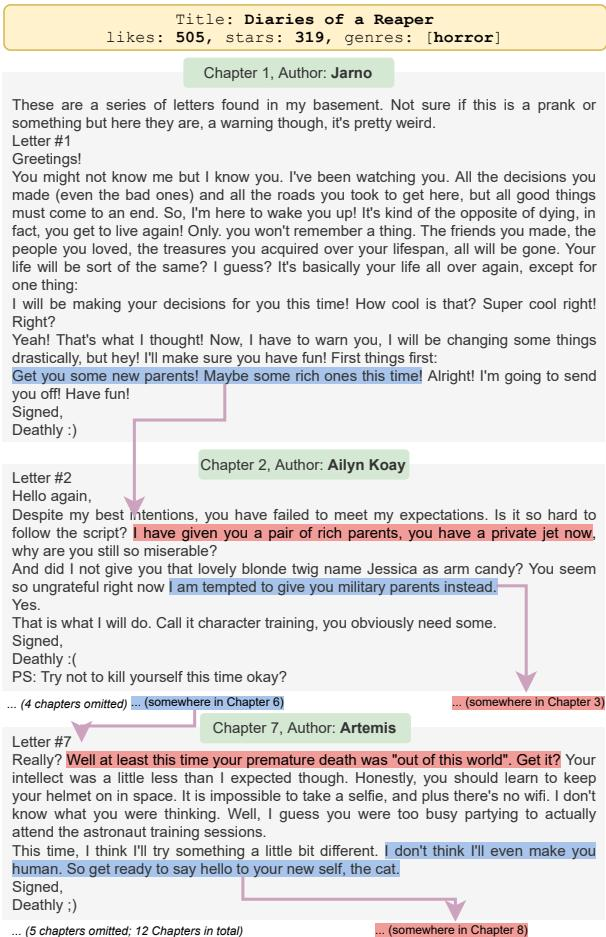
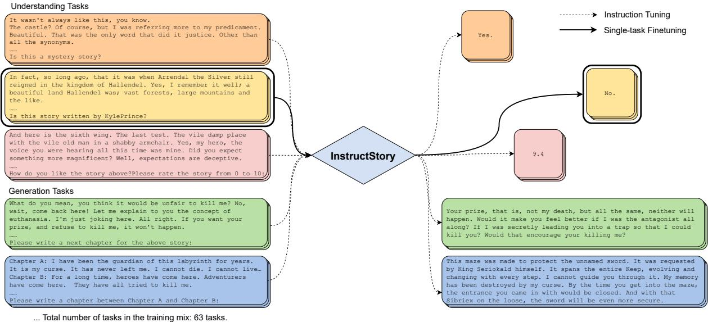

# STORYWARS: A Dataset and Instruction Tuning Baselines for Collaborative Story Understanding and Generation

Yulun Du and Lydia Chilton Columbia University New York City, New York, USA {yulundu, chilton}@cs.columbia.edu

## Abstract

Collaborative stories, which are texts created through the collaborative efforts of multiple authors with different writing styles and intentions, pose unique challenges for NLP models. Understanding and generating such stories remains an underexplored area due to the lack of open-domain corpora. To address this, we introduce STORYWARS, a new dataset of over 40,000 collaborative stories written by 9,400 different authors from an online platform. We design 12 task types, comprising 7 understanding and 5 generation task types, on STORY-WARS, deriving 101 diverse story-related tasks in total as a multi-task benchmark covering all fully-supervised, few-shot, and zero-shot scenarios. Furthermore, we present our instructiontuned model, INSTRUCTSTORY, for the story tasks showing that instruction tuning, in addition to achieving superior results in zero-shot and few-shot scenarios, can also obtain the best performance on the fully-supervised tasks in STORYWARS, establishing strong multi-task benchmark performances on STORYWARS.1

## 1 Introduction

Storytelling is crucial due to its vital role in human experience, history, and culture dating back to the earliest days of humanity. Humans possess the unique storytelling ability to structure a sequence of events, whether factual, fictional or a mixture of both, and create a coherent narrative that conveys a big picture while also including intricate details. Current story generation systems usually mimic this ability by starting with a plot then crafting the story. This can be done by linearly expanding (Peng et al., 2018, Yao et al., 2019, Martin et al., 2017) or hierarchically developing (Xu et al., 2018, Fan et al., 2018, Fan et al., 2019, Rashkin et al. 2020, Goldfarb-Tarrant et al., 2020) the story based on the given plot. Collaborative storytelling is distinctly challenging because there is no predetermined plot or story outline of events. Instead, collaborative stories are created through the collective efforts of multiple authors. Each author contributes a section sequentially, while also attempting to express their own personal intentions within the context of the jointly crafted and jointly owned story. It is a more challenging problem as it requires not only the ability to generate text, but also the capability to understand the previous context and contributions written by other authors.

  
Figure 1: An example story with 12 turns in the STORY-WARS dataset. In each turn, the author leaves a "floor" for the next author to continue collaboratively .

Large Language Models (LLMs) (Devlin et al. 2019, Liu et al., 2019, Yang et al. 2019, Raffel et al. 2019, Brown et al. 2020, Zhang et al. 2022, Chowdhery et al. 2022, Touvron et al. 2023) have demonstrated exceptional performance on various understanding and generation benchmarks, indicating their potential in addressing natural language processing (NLP) challenges related to collaborative storytelling. This prompts an intriguing question within the research community: How could LLMs synergize both their understanding and generation capabilities via multitask learning to address the challenges ofcollaborative storytelling?

We present STORYWARS, a dataset of over 40,000 stories gathered from an online collaborative storytelling platform2. Figure 1 shows an example story in the STORYWARS dataset. Each story contains rich information including its title, genres given by the initial author, chapters written by different authors, and human ratings including stars and likes. Each chapter was written by exactly one author and the previous author might leave a collaborativefloor (Coates, 1997) for the next author to continue. Therefore, for a model to generate a continuing chapter, it needs to understand the preceding context, including the title, genres, and the writing styles and intentions of previous authors conveyed in the collaborative floor.

Due to the multitask nature of collaborative storytelling and the rich information of the STORY-WARS, we design 12 task types, including both understanding and generation task types, as a multitask benchmark for an initial probe of collaborative storytelling. We follow the task definition from FLAN (Wei et al., 2021), where each task type contains multiple tasks. In the end, our benchmark contains 101 tasks in total, split such that it covers all fully-supervised, few-shot, and zeroshot learning application scenarios. It is important to note that prevailing multitask NLP benchmarks are either focusing on understanding (e.g. Wang et al., 2018, Wang et al., 2019) or generation (e.g. Gehrmann et al., 2021, Khashabi et al., 2021, Liu et al., 2021) alone, or only a subset of the learning scenarios. To our knowledge, we are the first to propose a story benchmark that contains both understanding and generation in all three scenarios.

Large language models have been shown to not only be fully-supervised, few-shot, and zero-shot learners but also multitask ones. Instruction Tuning (Wei et al., 2021, Sanh et al., 2022, Chung et al., 2022) has been the state-of-the-art approach for zero-shot and few-shot scenarios. However, it has not yet been applied in the fully-supervised setting. We evaluated Instruction Tuning on the benchmark and we found that in addition to achieving state-ofthe-art results in zero-shot and few-shot scenarios, when combined with single-task fine-tuning, Instruction Tuning can surpass single-task fine-tuning alone, resulting in a consistent performance boost of 1.53 points on average for all tasks.

Our contributions are as follows:

• We introduce a novel collaborative story dataset STORYWARS that comprises 40k stories written by 9.4k different authors, with rich information such as genres and human ratings, to promote research in the field of collaborative storytelling.

• We propose a new benchmark based on STO-RYWARS that consists of 7 understanding and 5 generation task types, totaling in 101 tasks for testing the fundamental abilities of LLMs to model collaborative stories. The benchmark covers the fully-supervised, few-shot, and zero-shot scenarios.

• We present INSTRUCTSTORY, a instructiontuned model that demonstrates strong performance on the STORYWARS benchmark in all three learning scenarios. In addition, we show for the first time that we could extend Instruction Tuning with a single-task finetuning stage to achieve superior performance and obtain robust performance boost.

## 2 Related Work

## 2.1 Story Datasets

The most popular story datasets that have been widely used by many story generation systems in the past are ROCStories (Mostafazadeh et al., 2016) and WritingPrompts (Fan et al., 2018). ROCStories comprises five-sentence commonsense short stories, and WritingPrompts includes 300k opendomain prompt-story pairs, neither of which are collaboratively written. On the other hand, Storium (Akoury et al., 2020) and roleplayerguild (Louis and Sutton, 2018), are collaborative and written by multiple authors in turns, but in a game setting. The key distinction of our STORYWARS dataset is that the stories are both collaborative and open-domain. For a comparison of these datasets, refer to Table 1.

<table><tr><td>Dataset</td><td># Stories</td><td># Words per story</td><td>Genres</td><td>Human Ratings</td><td>Open-Domain</td><td>Multi-Turn Collab.</td><td>User-Gen</td></tr><tr><td>ROCStories</td><td>98,156</td><td>88</td><td>x</td><td>x</td><td>L</td><td>x</td><td>X</td></tr><tr><td>WritingPrompts</td><td>303,358</td><td>735</td><td>X</td><td>X</td><td></td><td>X</td><td></td></tr><tr><td>roleplayerguild</td><td>1,439</td><td>3,079</td><td>x</td><td>x</td><td>x</td><td></td><td></td></tr><tr><td>Storium</td><td>5,743</td><td>19,278</td><td>x</td><td>x</td><td>X</td><td></td><td>L</td></tr><tr><td>STORYWARS</td><td>40,135</td><td>367</td><td>L</td><td>V</td><td>L</td><td>L</td><td>L</td></tr></table>

Table 1: Comparison of our STORYWARS dataset with previous story datasets.

## 2.2 Multitask NLP Benchmarks

Existing multitask NLP benchmarks tends to focus on evaluating either understanding (Wang et al., 2018, Wang et al., 2019) or generation (Gehrmann et al., 2021, Khashabi et al., 2021, Liu et al., 2021) capabilities of NLP models. There are taskspecific benchmarks that address both, such as those for dialog (Mehri et al., 2020) and code (Lu et al., 2021). For the task of storytelling, the LOT benchmark (Guan et al., 2022) focuses on both aspects but is limited to Chinese and has fewer tasks than our proposed STORYWARS dataset. BIGbench (Srivastava et al., 2022), which includes 204 tasks for understanding and generation, only tests zero-shot and few-shot abilities without finetuning. STORYWARS provides a benchmark for story understanding and generation with 101 tasks spanning all zero-shot, few-shot, and full-supervised scenarios for various applications.

## 2.3 Multitask NLP and Instruction Tuning

Current multitask LLMs mainly follow two approaches. The first approach involves finetuning, such as with ExT5 (Aribandi et al., 2022) and Muppet (Aghajanyan et al., 2021), where the model is made more generalized through multitask finetuning and then fine-tuned again on downstream tasks. The second approach focuses solely on zero-shot and few-shot performance, with the goal of bridging the gap between finetuning and these performance levels, as seen in FLAN (Wei et al., 2021), T0(Sanh et al., 2022), FLAN-T5 (Chung et al., 2022), and ZeroPrompt (Xu et al., 2022). These models often utilize Instruction Tuning or similar frameworks. In this paper, we extend Instruction Tuning’s capabilities to achieve superior performance in the full-supervised scenario as well.

## 3 Methodology

## 3.1 The STORYWARS Dataset

We obtained the STORYWARS dataset from storywars.net, an online collaborative storytelling platform where users can pitch ideas and create stories. However, once an initial chapter is published, the story becomes part of the Story Wars community and can be contributed to by other users. For a continuing chapter to be officially recognized, it must be voted in by other users, resulting in a high quality of stories on the platform.

We scraped and parsed the stories on Story Wars, ending up in obtaining 76k stories. We then used FastText (Bojanowski et al., 2017) language identification to filter for English stories and further cleaned the dataset by removing noisy stories based on GPT-2 perplexity (Radford et al., 2019). We also removed stories that are shorter than 30 words or stories with chapters that are shorter than 10 words. To further ensure the quality of the dataset, we also remove stories that have very low human ratings, such as likes and stars.

In consideration of ethical issues, we employed OpenAI Content Moderation $\mathrm { \ A P I s } ^ { 3 }$ and the Detoxify4 toxicity classifier to identify and remove potentially harmful content, such as toxicity, obscenity/sexual content, threats, insults, identity hate, and self-harm posts from the dataset. Furthermore, to safeguard user privacy, we replaced all URLs, email addresses, and phone numbers with special tokens <URL>, <EMAIL>, and <PHONE>.

After thorough data cleaning, we obtained a final dataset of 40,135 stories written by 9,494 authors. Due to the fact that the long tail of genres is very noisy, we made the simplifying assumption that each story contains a single dominant genre, if any. Each story in the dataset was structured with several key elements, including a title, a genre (which could be empty), the numbers of likes and stars received, the authors and the corresponding chapters.

We denote an arbitrary story in the dataset as $s \in S$ , where $S = \{ ( p , ( c _ { i } , a _ { i } ) _ { i = 0 } ^ { t } , g , r _ { l } , r _ { s } ) \}$ . That is, each story $s _ { i }$ is denoted by a 5-tuple of a title $p ,$ chapter-author pairs $( c _ { i } , a _ { i } )$ of t turns, a genre $^ { g , }$ a likes rating $r _ { l } .$ , and a stars rating $r _ { s }$

## 3.2 The Multitask Benchmark

## 3.2.1 Story Understanding Tasks

Genre Classification Understanding the genre of a story is essential for collaborative storytelling models to comprehend the context. The genre classification task involves identifying the genre of a story. This task can be formulated as a binary text classification problem, where given a story, the task is to predict whether it belongs to a specific genre $g .$ This can be represented as $g = f ( c _ { 1 } , c _ { 2 } , . . . , c _ { t } )$

Authorship Attribution Identifying the author of a text is a crucial step in understanding the writing style of an individual. Authorship attribution, traditionally, is the task of determining the author of a given text. In this paper, we formulate the task of authorship attribution as identifying the author of a specific chapter, represented as $a = f ( c )$

Authorship Verification Authorship Verification, in contrast to author attribution, is the task of determining whether two texts have been written by the same author by comparing their writing styles. The task is represented as $y = f ( c _ { i } , c _ { j } )$ , where y is a binary variable.

Connectivity Inference Understanding the chapter shifts in long-range stories can be a beneficial ability for collaborative storytelling. Following Sun et al. (2022), we also include the connectivity inference task, where the goal is to determine whether two given chapters are consecutive in a story. The task is represented as $y = f ( c _ { n } , c _ { m } )$

Temporal Inference Inspired from the Connectivity Inference task, we also aim to evaluate a model’s ability to understand the temporal relationships between chapters in a story. The Temporal Inference task involves determining whether two chapters in the same story are in the correct chronological order. For example, $( c _ { i } , c _ { i + 1 } )$ and $( c _ { i } , c _ { i + 5 } )$ would be considered positive instances, while $( c _ { i + 5 } , c _ { i } )$ would not. The task is represented as $y = f ( c _ { n } , c _ { m } )$ , where y is a binary variable.

Story Scoring Understanding human ratings of a story is crucial for generating texts that align with human preferences. Many dialog-related applications rely on human labelers to rate texts based on different criteria, e.g. LAMDA (Thoppilan et al., 2022). Since STORYWARS contains human ratings in the form of likes and stars, we propose to include a regression task for story scoring as a task type. We follow Raffel et al. (2019) and normalize the story ratings to a range from 0-10, with rounded scores to the nearest increment of 0.1, and convert the float to string. Given a rating score, such as $r _ { l } .$ the task is represented as $r _ { l } = f ( c _ { 1 } , c _ { 2 } , . . . , c _ { t } )$

Story Segmentation Although stories are already divided into chapters, it is still possible to evaluate models’ ability to identify chapter boundaries within a story, where one chapter concludes and another begins, in order to encourage the model to capture discourse-level information. We design the task of story segmentation as $c _ { 1 } , b _ { 1 } , c _ { 2 } , b _ { 2 } , . . . , b _ { t - 1 } , c _ { t } = f ( s )$ , where $b _ { i }$ is the boundary between two chapters.

## 3.2.2 Story Generation Tasks

Next Chapter Generation The next chapter generation problem is defined as an generation task that takes previous chapters and genre information as input, and then generates the subsequent chapter. This is represented as $c _ { k + 1 } = f ( c _ { 1 } , c _ { 2 } , . . . , c _ { k } , g )$

Conditional Story Generation The conditional story generation problem is defined as an generation task that also takes previous chapters and genre information as input, but then generates the entire continuation of the story until the conclusion instead. It further evaluates an NLP model’s capability to plan and organize the story. This is represented as $c _ { k + 1 } , c _ { k + 2 } , . . . , c _ { t } = f ( c _ { 1 } , c _ { 2 } , . . . , c _ { k } , g )$

Chapter Infilling In line with Ippolito et al. (2019), the chapter infilling task evaluates an NLP model’s ability to generate an intermediate chapter given the context of a preceding and subsequent chapter. This is represented as $c _ { k } = f ( c _ { k - 1 } , c _ { k + 1 } )$

Global Infilling Building on the chapter infilling task, the global infilling problem considers more extensive context information, including both preceding and subsequent chapters. This is represented as $c _ { k } = f ( c _ { 1 } , c _ { 2 } , . . . , c _ { k - 1 } , c _ { k + 1 } , . . . , c _ { t } )$

Temporal Ordering Following Lin et al. (2021), we also include a task that unscrambles chapter sequences based on temporal information, except that we simplify the problem by eliminating the requirement for the NLP model to infill masked chapters. This is represented as $c _ { 1 } , c _ { 2 } , . . . , c _ { t } =$ $f ( p e r m u t e ( c _ { 1 } , c _ { 2 } , . . . , c _ { t } ) )$

<table><tr><td>Task Type</td><td>#Tasks</td><td>Train</td><td>Dev</td><td>Test</td></tr><tr><td colspan="5">Fully-supervised</td></tr><tr><td>Genre Classification</td><td>27</td><td>2,000</td><td>250</td><td>250</td></tr><tr><td>Author Attribution</td><td>30</td><td>2,000</td><td>250</td><td>250</td></tr><tr><td>Author Verification</td><td>1</td><td>144,000</td><td>20,925</td><td>20,925</td></tr><tr><td>Connectivity Inference</td><td>1</td><td>59,402</td><td>7,521</td><td>6,963</td></tr><tr><td>Temporal Inference</td><td>1</td><td>84,632</td><td>9,480</td><td>8,928</td></tr><tr><td>Story Scoring</td><td>2</td><td>17,046</td><td>1,485</td><td>1,484</td></tr><tr><td>Story Segmentation</td><td>1</td><td>17,256</td><td>1,500</td><td>1,500</td></tr><tr><td>Next Chapter Generation</td><td>1</td><td>40,729</td><td>5,845</td><td>5,043</td></tr><tr><td>Conditional Story Generation</td><td>1</td><td>23,473</td><td>4,345</td><td>3,543</td></tr><tr><td>Chapter Infilling</td><td>1</td><td>23,473</td><td>4,345</td><td>3,543</td></tr><tr><td>Global Infilling</td><td>1</td><td>23,473</td><td>4,345</td><td>3,543</td></tr><tr><td>Temporal Ordering</td><td>1</td><td>78,554</td><td>8,932</td><td>8,407</td></tr><tr><td colspan="5">Few-shot</td></tr><tr><td>Genre Classification</td><td>10</td><td>32</td><td>32</td><td>200</td></tr><tr><td colspan="5">Zero-shot</td></tr><tr><td>Genre Classification</td><td>23</td><td>0</td><td>0</td><td>200</td></tr></table>

Table 2: Task statistics for the STORYWARS benchmark.

## 3.2.3 The Benchmark

Benchmark task statistics The 12 task types translate into 101 tasks based on STORYWARS, with 96 understanding tasks and 5 generation tasks. It is worth noting that the majority of the understanding tasks are genre classification tasks (60) and author attribution tasks (30). Out of the 60 genre classification tasks, we split them into 27 fullysupervised, 10 few-shot, and 23 zero-shot datasets, according to the genre frequency so that the split closely aligns with realistic data distribution. For the fully-supervised and few-shot tasks, we divided the data into training, dev, and test sets. For the zero-shot tasks, we used all the data as a test set by sampling. The remaining task types were used for fully-supervised scenarios. It is important to mention that all of the data in the fully-supervised, few-shot, and zero-shot scenarios are disjoint to prevent data leakage. The overall task data statistics can be found in the Table 2.

Evaluation metrics For the genre classification, author attribution, author verification, temporal inference, and connectivity inference tasks, we use F-1 score as the evaluation metric, due to the imbalance nature of the task data. For the story scoring tasks, in line with Raffel et al. (2019) for regression tasks, we use Spearman correlation coefficients as the evaluation metric, because it measures monotonic relationships. For the story segmentation task, we use Boundary Similarity (Fournier, 2013) as the evaluation metric. For the generation tasks, following the suggestions introduced in Chhun et al. (2022), Qin et al. (2019), and Gangal et al. (2021), we use BERTScore (Zhang\* et al., 2020) as the evaluation metric, as it has been shown by Chhun et al. (2022) to have better correlation with human evaluation at both the story-level and system-level for story generation systems than other automatic metrics including frequently-used BLEU (Papineni et al., 2002) and ROUGE (Lin, 2004). Also, Gangal et al. (2021) points out that in the narrative reordering problem, similar to our temporal ordering task, BERTScore also correlates quite well with human evaluations. We recognize that there is currently no widely accepted or reliable automatic evaluation metric in the field of story generation, and the use of automatic evaluation in this field is often criticized. However, for the purpose of fast and fair comparison, we chose to follow previous work and use the current best available metric, even though we acknowledge that it may not be perfect.

For evaluating the model performance, we calculate the macro-average of the performance on all tasks within each task type, this allows us to compare models across different task types. The metrics for understanding, generation, and overall performance are determined by the macro-average of the scores across the corresponding task types.

## 3.3 The INSTRUCTSTORY Framework

The main goal of instruction tuning is to evaluate the performance of unseen tasks in zero-shot and few-shot learning scenarios, and to show that it can improve the gap between zero-shot and fullysupervised learning performances. Additionally, we are interested in how instruction tuning can improve the performance of fully-supervised tasks.

To accomplish our goal, we propose a two-stage training approach called INSTRUCTSTORY. In the first stage, we use instruction tuning as a form of pre-finetuning Aghajanyan et al. (2021). During this stage, we use instructions instead of task prefixes proposed in Muppet Aghajanyan et al. (2021) to enhance the model’s ability to generalize to new instructions. In the second stage, after instruction tuning with the fully-supervised task mix, we use single-task finetuning to continually train the model for each fully-supervised task. We use T5-largelm-adapt (770m) as the base model for instruction tuning INSTRUCTSTORY and all of the training tasks are from the STORYWARS fully-supervised training split. Figure 2 illustrates the overall IN-STRUCTSTORY framework. The instructions we used are included in Appendix A.1.

  
Figure 2: INSTRUCTSTORY undergoes a two-stage training process. In stage 1 (99K), we instruction tune the model on 63 story tasks to improve generalization to unseen zero-shot and few-shot tasks. In stage 2 ( ), we perform single-task finetuning on each fully-supervised task to optimize performance on specific tasks.

## 4 Experimental Results

## 4.1 Baselines

We include several strong baseline models with a comparable number of parameters. For understanding tasks, we include BERT-large (345m), RoBERTa-large (354m), and DeBERTav2-xlarge (900m) as baselines. For generation tasks, we include GPT2-medium (345m), GPT2- large (774m), and OPT-350m as baselines. These models all have comparable or near-comparable numbers of parameters. To demonstrate the effectiveness of our method, we also include T5-largelm-adapt (770m) as a baseline model in the overall comparison. In addition, for the few-shot and zero-shot scenarios, we include the state-of-the-art instruction tuning model FLAN-T5-large (Chung et al., 2022) as a comparison baseline.

## 4.2 Experimental Setup

To train INSTRUCTSTORY, we use instruction tuning on T5-large-lm-adapt for 5 epochs using the fully-supervised task mix. We use the Adam optimizer with a learning rate of 5e-5 and a batch size of 64. At each gradient step, examples are randomly sampled from all tasks. The maximum input and target sequence lengths are set to 1024, and any longer inputs or targets will be truncated.

For the fully-supervised learning scenario, both INSTRUCTSTORY and all the baselines are finetuned on a single task for 10 epochs for each task. The best performing checkpoint for each task is chosen based on the performance on its dev set. Note that BERT-large, RoBERTa-Large, and DeBERTa-v2-xlarge all have a maximum sequence length of 512, while GPT2-medium and GPT2- Large have a maximum sequence length of 1024 and OPT-350m has a maximum sequence length of 2048. We truncate the data instances based on the respective max sequence lengths of the models.

For the few-shot learning scenario, we finetune all the models and use early stopping based on the dev set performance. Also, we are unable to use in-context learning demonstrations like in Chung et al. (2022), as the story lengths are often too long to fit within the max input sequence length.

For the zero-shot scenarios, we only compare IN-STRUCTSTORY with T5 and FLAN-T5, as the other baseline models have poor zero-shot performance.

More information about training specifics and hyperparamters can be seen in Appendix A.2.

## 4.3 Main Results

Fully-supervised Results The fully-supervised results are presented in Table 3. We show that IN-STRUCTSTORY can achieve a 1.53 point increase in the overall average score compared to the singletask finetuned T5 baseline. Additionally, for understanding tasks, INSTRUCTSTORY outperforms T5 by 2.06 points. When compared to other strong understanding baselines including BERT, RoBERTa, and DeBERTa, INSTRUCTSTORY also achieves the best results. For generation tasks, INSTRUCT-STORY outperforms T5 by 0.77 points. It also achieves favorable performance when compared to other strong generation baselines such as GPT2- medium and GPT2-large, although performing a little bit worse than OPT-350m. We hypothesize that the difference in performance between OPT-350m and INSTRUCTSTORY is due to the base model, specifically the size of the pretraining corpus (35B tokens vs 180B tokens).(Zhang et al., 2022)

<table><tr><td>Task Type</td><td>Task</td><td>BERT</td><td>RoBERTa</td><td>DeBERTa</td><td>T5</td><td>InstructStory</td></tr><tr><td rowspan="12">Genre Classification†</td><td>animals</td><td>82.69</td><td>86.02</td><td>82.24</td><td>82.88</td><td>86.79</td></tr><tr><td>fantasy</td><td>43.70</td><td>47.37</td><td>48.75</td><td>47.95</td><td>50.98</td></tr><tr><td>horror</td><td>45.67</td><td>55.64</td><td>60.15</td><td>52.05</td><td>53.33</td></tr><tr><td>war</td><td>59.77</td><td>68.97</td><td>76.00</td><td>70.59</td><td>78.26</td></tr><tr><td>poetry</td><td>78.90</td><td>85.71</td><td>79.65</td><td>81.97</td><td>84.96</td></tr><tr><td>drama</td><td>42.67</td><td>45.30</td><td>46.43</td><td>44.21</td><td>47.40</td></tr><tr><td>mystery</td><td>43.58</td><td>51.47</td><td>48.53</td><td>47.48</td><td>51.97</td></tr><tr><td>fanfiction</td><td>55.28</td><td>62.26</td><td>67.27</td><td>63.41</td><td>66.07</td></tr><tr><td>dystopia</td><td>43.48</td><td>57.14</td><td>61.16</td><td>52.23</td><td>63.55</td></tr><tr><td>sci-fi</td><td>65.42</td><td>61.07</td><td>67.24</td><td>62.69</td><td>66.67</td></tr><tr><td>AVG</td><td>51.86</td><td>61.15</td><td>62.20</td><td>60.15</td><td>61.88</td></tr><tr><td rowspan="10">Author Attribution†</td><td>aspiringwriter</td><td>66.67</td><td>69.57</td><td>62.02</td><td>60.40</td><td>67.18</td></tr><tr><td>sagittarius</td><td>50.94</td><td>54.74</td><td>58.02</td><td>48.52</td><td>64.81</td></tr><tr><td>Hope!</td><td>61.82</td><td>81.13</td><td>62.30</td><td>56.21</td><td>68.22</td></tr><tr><td>Shasta</td><td>52.17</td><td>55.56</td><td>58.49</td><td>37.04</td><td>59.38</td></tr><tr><td>Scorpio :)</td><td>61.82</td><td>81.13</td><td>62.30</td><td>56.21</td><td>68.22</td></tr><tr><td>Zed</td><td>67.27</td><td>72.94</td><td>81.82</td><td>73.27</td><td>78.85</td></tr><tr><td>Nathan.N</td><td>82.61</td><td>84.78</td><td>86.00</td><td>86.32</td><td>87.23</td></tr><tr><td>Ellipsis</td><td>78.85</td><td>83.67</td><td>59.38</td><td>67.89</td><td>78.00</td></tr><tr><td>Luke V.</td><td>72.09</td><td>69.77</td><td>69.23</td><td>63.24</td><td>73.79</td></tr><tr><td>Amelia Rose</td><td>50.00</td><td>70.10</td><td>68.57</td><td>53.62</td><td>68.97</td></tr><tr><td></td><td>AVG</td><td>64.52</td><td>72.31</td><td>69.08</td><td>62.03</td><td>70.79</td></tr><tr><td>Author Verification</td><td>author_verification</td><td>23.19</td><td>23.41</td><td>23.17</td><td>22.94</td><td>23.57</td></tr><tr><td>Temporal Inference</td><td>temporal_inference</td><td>72.90</td><td>77.74</td><td>80.18</td><td>78.51</td><td>79.04</td></tr><tr><td rowspan="2">Connectivity Inference Story Scoring</td><td>connectivity_inference</td><td>65.03</td><td>62.97</td><td>67.61</td><td>67.20</td><td>68.72</td></tr><tr><td>likes_scoring</td><td>53.54</td><td>75.74</td><td>60.81</td><td>67.35</td><td>68.82</td></tr><tr><td rowspan="2">Story Segmentation</td><td>stars_scoring</td><td>55.34</td><td>66.60</td><td>56.02</td><td>63.15</td><td>63.26</td></tr><tr><td>story_segmentation</td><td>31.38</td><td>47.28</td><td>41.09</td><td>46.87</td><td>47.33</td></tr><tr><td>Understanding AVG</td><td></td><td>51.90</td><td>59.43</td><td>57.39</td><td>57.56</td><td>59.62</td></tr><tr><td>Task Type</td><td>Task</td><td>GPT2-1</td><td>GPT2-m</td><td>OPT-350m</td><td>T5</td><td>InstructStory</td></tr><tr><td>Next Chapter Generation</td><td>next_chapter</td><td>81.35</td><td>80.90</td><td>83.25</td><td>82.17</td><td>82.43</td></tr><tr><td>Conditional Story Generation</td><td>conditional</td><td>79.40</td><td>79.33</td><td>82.39</td><td>81.10</td><td>81.24</td></tr><tr><td>Chapter Infilling</td><td>chapter_inflling</td><td>80.93</td><td>80.67</td><td>82.89</td><td>82.34</td><td>82.51</td></tr><tr><td>Global Infilling</td><td>global_infilling</td><td>81.49</td><td>81.30</td><td>83.70</td><td>82.22</td><td>82.44</td></tr><tr><td>Temporal Ordering</td><td>temporal_ordering</td><td>76.49</td><td>76.33</td><td>92.77</td><td>90.08</td><td>93.14</td></tr><tr><td colspan="2">Generation AVG</td><td>79.93</td><td>79.71</td><td>85.00</td><td>83.58</td><td>84.35</td></tr><tr><td colspan="2">Understanding and Generation Overall AVG</td><td>-</td><td>-</td><td>-</td><td>68.40</td><td>69.93</td></tr></table>

Table 3: Fully-supervised results of INSTRUCTSTORY and other baselines. Bold numbers indicate the best score across all models, and underlined numbers indicate cases where INSTRUCTSTORY outperforms the T5 baseline. Due to space limits, only 10 random tasks from the task type are shown. Full results can be found in the Appendix A.3.

Few-shot Results The few-shot results are shown in Table 4. For the few-shot scenario, INSTRUCT-STORY achieves the highest score of 61.44, followed by FLAN-T5 which achieved the second highest score of 59.45, outperforming all the T5, BERT, RoBERTa, and DeBERTa baselines. This demonstrates that even when instruction-tuned on a different dataset distribution, FLAN-T5 can still achieve competitive results when further fine-tuned for few-shot tasks.

<table><tr><td>task</td><td>BERT</td><td>RoBERTa</td><td>DeBERTa</td><td>T5</td><td>FLAN-T5</td><td>InstructStory</td></tr><tr><td>wordgames</td><td>59.65</td><td>80.90</td><td>77.27</td><td>62.40</td><td>71.05</td><td>73.68</td></tr><tr><td>rebellion</td><td>38.38</td><td>45.87</td><td>33.33</td><td>43.24</td><td>50.00</td><td>50.00</td></tr><tr><td>mythology</td><td>47.27</td><td>59.79</td><td>61.54</td><td>62.07</td><td>66.67</td><td>67.33</td></tr><tr><td>future</td><td>30.00</td><td>40.00</td><td>50.90</td><td>36.23</td><td>44.86</td><td>54.70</td></tr><tr><td>friendship</td><td>38.82</td><td>46.96</td><td>44.62</td><td>49.23</td><td>53.33</td><td>55.36</td></tr><tr><td>fairytale</td><td>45.93</td><td>60.32</td><td>65.52</td><td>74.07</td><td>72.09</td><td>79.59</td></tr><tr><td>dreams</td><td>47.48</td><td>64.15</td><td>58.62</td><td>78.16</td><td>71.26</td><td>76.74</td></tr><tr><td>crime</td><td>48.54</td><td>66.67</td><td>36.04</td><td>65.42</td><td>62.22</td><td>65.26</td></tr><tr><td>change</td><td>44.00</td><td>50.36</td><td>32.91</td><td>33.90</td><td>47.89</td><td>39.19</td></tr><tr><td>action</td><td>38.30</td><td>40.25</td><td>36.47</td><td>41.13</td><td>55.10</td><td>52.54</td></tr><tr><td>AVG</td><td>43.84</td><td>55.53</td><td>49.72</td><td>54.59</td><td>59.45</td><td>61.44</td></tr></table>

Table 4: Few-shot benchmark results. INSTRUCTSTORY outperforms all other baselines.

<table><tr><td>task†</td><td>T5</td><td>FLAN-T5</td><td>InstructStory</td></tr><tr><td>reality</td><td>32.56</td><td>39.56</td><td>39.47</td></tr><tr><td>lies</td><td>30.22</td><td>46.34</td><td>70.33</td></tr><tr><td>vampire</td><td>19.12</td><td>63.33</td><td>58.82</td></tr><tr><td>surreal</td><td>31.41</td><td>33.86</td><td>46.25</td></tr><tr><td>suspense</td><td>31.82</td><td>42.77</td><td>43.68</td></tr><tr><td>supernatural</td><td>39.34</td><td>48.28</td><td>45.33</td></tr><tr><td>family</td><td>14.88</td><td>51.16</td><td>60.00</td></tr><tr><td>revenge</td><td>35.00</td><td>58.06</td><td>57.14</td></tr><tr><td>crazy</td><td>30.00</td><td>42.31</td><td>43.08</td></tr><tr><td>world</td><td>30.63</td><td>34.92</td><td>50.75</td></tr><tr><td>AVG</td><td>32.09</td><td>47.79</td><td>60.00</td></tr></table>

Table 5: Zero-shot benchmark results. INSTRUCT-STORY out performs T5 and even FLAN-T5. †: Due to space limits, we only show 10 random tasks. Full results can be found in Appendix A.3.

Zero-shot Results We can see the zero-shot results in Table 5. In the zero-shot scenario, we compare INSTRUCTSTORY with T5 and FLAN-T5, and we can see that INSTRUCTSTORY has a significant improvement in zero-shot performance, a 28.08 increase from T5 and a 12.21 increase from FLAN-T5. This is expected because our instruction tuning training task mix has a similar, though unseen, data distribution to the zero-shot test sets.

## 4.4 Discussions

INSTRUCTSTORY brings a robust improvement in performance. By comparing T5 and INSTRUCT-STORY in Table 3, we see that INSTRUCTSTORY scores higher than T5 in every task type. The performance gain is consistent across all task types. Even on the task level, INSTRUCTSTORY achieves better results than T5 in 24 out of 27 genre classification tasks and 23 out of 30 authorship attribution tasks. This indicates that in fully-supervised scenario, one can confidently use the power of instruction tuning to improve performance.

<table><tr><td></td><td>IS</td><td> $\mathbf { I S _ { U } }$ </td><td> $\mathbf { I S _ { G } }$ </td><td>T5</td></tr><tr><td>Fully-sup AVG</td><td>61.88</td><td>61.27</td><td>60.45</td><td>60.15</td></tr><tr><td>Few-shot AVG</td><td>61.44</td><td>59.83</td><td>54.95</td><td>54.59</td></tr><tr><td>Zero-shot AVG</td><td>60.00</td><td>58.41</td><td>32.31</td><td>32.09</td></tr></table>

Table 6: INSTRUCTSTORY vs its variants $\mathrm { I S } _ { \mathrm { U } }$ and $\mathrm { I S _ { G } }$

Ablation: Instruction tuning with both understanding and generation tasks is more effective than instruction tuning with only understanding tasks or only generation tasks. Table 6 illustrates this by comparing the fully-supervised, fewshot, and zero-shot genre classification scores of INSTRUCTSTORY, its variants $\mathrm { I S } _ { \mathrm { U } }$ , and $\mathrm { I S _ { G } }$ , where ISU and $\mathrm { I S _ { G } }$ are instruction tuned with understanding tasks mix and generation tasks mix, separately. From the table, we can see that $\mathrm { I S } > \mathrm { I S } _ { \mathrm { U } } > \mathrm { I S } _ { \mathrm { G } } > \mathrm { T } 5$ across all zero-shot, few-shot, and fully-supervised learning scenarios, which indicates that instruction tuning with a mix of understanding and generation tasks is better than instruction tuning with only one of them.

## 5 Conclusion

We introduced a novel dataset STORYWARS and a multitask benchmark for collaborative story understanding and generation. Our proposed INSTRUCT-STORY model, which leverages instruction tuning as multitask pre-finetuning, outperformed both its single-task finetuning baseline and other strong models on the STORYWARS benchmark and established strong performance in all zero-shot, fewshot, and fully-supervised learning scenarios. We hope that our newly proposed STORYWARS dataset will serve as a catalyst for research in the field of collaborative storytelling and inspire further advancements in this area.

## 6 Limiations

Our proposed INSTRUCTSTORY method utilizes both single-task finetuning and instruction tuning to achieve good results. However, when finetuned on a new task, the model may suffer from the problem of catastrophic forgetting and lose its multitasking generalization abilities. Recent research by Scialom et al. (2022) has investigated this issue in instruction-tuned models and proposed a technique called Rehearsal to mitigate it. However, this work primarily focuses on zero-shot scenarios and does not address fully-supervised learning. It would be of interest to explore whether it is possible to finetune on a single task while preserving the model’s multitasking abilities and generalization capabilities. We leave this question as an area for future research.

Additionally, it is important to note that our approach of single-task finetuning for each downstream task results in multiple models being required to be served simultaneously, which can lead to increased computational costs. In practice, this is a trade-off that must be carefully considered, as it requires balancing performance requirements with the resources available. It can be an important factor to consider when implementing this approach in real-world settings.

In the end, a proper and thorough evaluation of collaborative story generation remains an on-going research. While automatic evaluation metrics such as BERTScore has the best human correlations at story-level and system-level per Chhun et al. (2022), it may not be comprehensive enough in evaluating the highly creative output of collaborative story generation. There is a need for more nuanced and sophisticated metrics that can capture the complexity and diversity of collaborative stories. Therefore, the development and validation of appropriate evaluation methods is crucial for progress in this field.

## 7 Ethical Considerations

In Section 3.1, we have discussed our procedures to identify and remove potential harmful content and user privacy information. However, it is important to also consider the broader ethical implications of using AI in collaborative storytelling. These include issues such as ensuring fair and unbiased representation, protecting data privacy, and preventing the use of AI-generated content for harmful purposes. For example, AI-generated stories or characters may perpetuate stereotypes or reinforce societal biases if they are trained on biased data. Therefore, it is crucial to consider and address these ethical issues in order to create inclusive and responsible AI-generated stories that do not harm individuals or groups.

## References

Armen Aghajanyan, Anchit Gupta, Akshat Shrivastava, Xilun Chen, Luke Zettlemoyer, and Sonal Gupta. 2021. Muppet: Massive multi-task representations with pre-finetuning. In Proceedings of the 2021 Conference on Empirical Methods in Natural Language Processing, pages 5799–5811, Online and Punta Cana, Dominican Republic. Association for Computational Linguistics.

Nader Akoury, Shufan Wang, Josh Whiting, Stephen Hood, Nanyun Peng, and Mohit Iyyer. 2020. STORIUM: A Dataset and Evaluation Platform for Machine-in-the-Loop Story Generation. In Proceedings of the 2020 Conference on Empirical Methods in Natural Language Processing (EMNLP), pages 6470–6484, Online. Association for Computational Linguistics.

Vamsi Aribandi, Yi Tay, Tal Schuster, Jinfeng Rao, Huaixiu Steven Zheng, Sanket Vaibhav Mehta, Honglei Zhuang, Vinh Q. Tran, Dara Bahri, Jianmo Ni, Jai Gupta, Kai Hui, Sebastian Ruder, and Donald Metzler. 2022. Ext5: Towards extreme multi-task scaling for transfer learning. In International Conference on Learning Representations.

Piotr Bojanowski, Edouard Grave, Armand Joulin, and Tomas Mikolov. 2017. Enriching word vectors with subword information. Transactions of the Association for Computational Linguistics, 5:135– 146.

Tom Brown, Benjamin Mann, Nick Ryder, Melanie Subbiah, Jared D Kaplan, Prafulla Dhariwal, Arvind Neelakantan, Pranav Shyam, Girish Sastry, Amanda Askell, Sandhini Agarwal, Ariel Herbert-Voss, Gretchen Krueger, Tom Henighan, Rewon Child, Aditya Ramesh, Daniel Ziegler, Jeffrey Wu, Clemens Winter, Chris Hesse, Mark Chen, Eric Sigler, Mateusz Litwin, Scott Gray, Benjamin Chess, Jack Clark, Christopher Berner, Sam McCandlish, Alec Radford, Ilya Sutskever, and Dario Amodei. 2020. Language models are few-shot learners. In Advances in Neural Information Processing Systems, volume 33, pages 1877–1901. Curran Associates, Inc.

Cyril Chhun, Pierre Colombo, Fabian M. Suchanek, and Chloé Clavel. 2022. Of human criteria and automatic metrics: A benchmark of the evaluation of story generation. In Proceedings of the 29th International Conference on Computational Linguistics, pages 5794–5836, Gyeongju, Republic of Korea. International Committee on Computational Linguistics.

Aakanksha Chowdhery, Sharan Narang, Jacob Devlin, Maarten Bosma, Gaurav Mishra, Adam Roberts, Paul Barham, Hyung Won Chung, Charles Sutton, Sebastian Gehrmann, Parker Schuh, Kensen Shi, Sasha Tsvyashchenko, Joshua Maynez, Abhishek Rao, Parker Barnes, Yi Tay, Noam M. Shazeer, Vinodkumar Prabhakaran, Emily Reif, Nan Du, Benton C. Hutchinson, Reiner Pope, James Bradbury, Jacob Austin, Michael Isard, Guy Gur-Ari, Pengcheng Yin, Toju Duke, Anselm Levskaya, Sanjay Ghemawat, Sunipa Dev, Henryk Michalewski, Xavier García, Vedant Misra, Kevin Robinson, Liam Fedus, Denny Zhou, Daphne Ippolito, David Luan, Hyeontaek Lim, Barret Zoph, Alexander Spiridonov, Ryan Sepassi, David Dohan, Shivani Agrawal, Mark Omernick, Andrew M. Dai, Thanumalayan Sankaranarayana Pillai, Marie Pellat, Aitor Lewkowycz, Erica Moreira, Rewon Child, Oleksandr Polozov, Katherine Lee, Zongwei Zhou, Xuezhi Wang, Brennan Saeta, Mark Díaz, Orhan Firat, Michele Catasta, Jason Wei, Kathleen S. Meier-Hellstern, Douglas Eck, Jeff Dean, Slav Petrov, and Noah Fiedel. 2022. Palm: Scaling language modeling with pathways. ArXiv, abs/2204.02311.

Hyung Won Chung, Le Hou, S. Longpre, Barret Zoph, Yi Tay, William Fedus, Eric Li, Xuezhi Wang, Mostafa Dehghani, Siddhartha Brahma, Albert Webson, Shixiang Shane Gu, Zhuyun Dai, Mirac Suzgun, Xinyun Chen, Aakanksha Chowdhery, Sharan Narang, Gaurav Mishra, Adams Wei Yu, Vincent Zhao, Yanping Huang, Andrew M. Dai, Hongkun Yu, Slav Petrov, Ed Huai hsin Chi, Jeff Dean, Jacob Devlin, Adam Roberts, Denny Zhou, Quoc Le, and Jason Wei. 2022. Scaling instruction-finetuned language models. ArXiv, abs/2210.11416.

Jennifer Coates. 1997. The construction of a collaborative floor in women’s friendly talk.

Jacob Devlin, Ming-Wei Chang, Kenton Lee, and Kristina Toutanova. 2019. BERT: Pre-training of deep bidirectional transformers for language understanding. In Proceedings of the 2019 Conference of the North American Chapter of the Association for Computational Linguistics: Human Language Technologies, Volume 1 (Long and Short Papers), pages 4171–4186, Minneapolis, Minnesota. Association for Computational Linguistics.

Angela Fan, Mike Lewis, and Yann Dauphin. 2018. Hierarchical neural story generation. In Proceedings of the 56th Annual Meeting of the Association for Computational Linguistics (Volume 1: Long Papers), pages 889–898, Melbourne, Australia. Association for Computational Linguistics.

Angela Fan, Mike Lewis, and Yann Dauphin. 2019. Strategies for structuring story generation. In Proceedings of the 57th Annual Meeting of the Association for Computational Linguistics, pages 2650–2660, Florence, Italy. Association for Computational Linguistics.

Chris Fournier. 2013. Evaluating text segmentation using boundary edit distance. In Proceedings

of the 51st Annual Meeting of the Association for Computational Linguistics (Volume 1: Long Papers), pages 1702–1712, Sofia, Bulgaria. Association for Computational Linguistics.

Varun Gangal, Steven Y. Feng, Eduard H. Hovy, and Teruko Mitamura. 2021. NAREOR: the narrative reordering problem. CoRR, abs/2104.06669.

Sebastian Gehrmann, Tosin Adewumi, Karmanya Aggarwal, Pawan Sasanka Ammanamanchi, Anuoluwapo Aremu, Antoine Bosselut, Khyathi Raghavi Chandu, Miruna-Adriana Clinciu, Dipanjan Das, Kaustubh Dhole, Wanyu Du, Esin Durmus, Ondˇrej Dušek, Chris Chinenye Emezue, Varun Gangal, Cristina Garbacea, Tatsunori Hashimoto, Yufang Hou, Yacine Jernite, Harsh Jhamtani, Yangfeng Ji, Shailza Jolly, Mihir Kale, Dhruv Kumar, Faisal Ladhak, Aman Madaan, Mounica Maddela, Khyati Mahajan, Saad Mahamood, Bodhisattwa Prasad Majumder, Pedro Henrique Martins, Angelina McMillan-Major, Simon Mille, Emiel van Miltenburg, Moin Nadeem, Shashi Narayan, Vitaly Nikolaev, Andre Niyongabo Rubungo, Salomey Osei, Ankur Parikh, Laura Perez-Beltrachini, Niranjan Ramesh Rao, Vikas Raunak, Juan Diego Rodriguez, Sashank Santhanam, João Sedoc, Thibault Sellam, Samira Shaikh, Anastasia Shimorina, Marco Antonio Sobrevilla Cabezudo, Hendrik Strobelt, Nishant Subramani, Wei Xu, Diyi Yang, Akhila Yerukola, and Jiawei Zhou. 2021. The GEM benchmark: Natural language generation, its evaluation and metrics. In Proceedings of the 1st Workshop on Natural Language Generation, Evaluation, and Metrics (GEM 2021), pages 96–120, Online. Association for Computational Linguistics.

Seraphina Goldfarb-Tarrant, Tuhin Chakrabarty, Ralph Weischedel, and Nanyun Peng. 2020. Content planning for neural story generation with aristotelian rescoring. In Proceedings of the 2020 Conference on Empirical Methods in Natural Language Processing (EMNLP), pages 4319–4338, Online. Association for Computational Linguistics.

Jian Guan, Zhuoer Feng, Yamei Chen, Ruilin He, Xiaoxi Mao, Changjie Fan, and Minlie Huang. 2022. LOT: A story-centric benchmark for evaluating Chinese long text understanding and generation. Transactions of the Association for Computational Linguistics, 10:434–451.

Daphne Ippolito, David Grangier, Chris Callison-Burch, and Douglas Eck. 2019. Unsupervised hierarchical story infilling. In Proceedings of the First Workshop on Narrative Understanding, pages 37–43, Minneapolis, Minnesota. Association for Computational Linguistics.

Daniel Khashabi, Gabriel Stanovsky, Jonathan Bragg, Nicholas Lourie, Jungo Kasai, Yejin Choi, Noah A. Smith, and Daniel S. Weld. 2021. GENIE: A leaderboard for human-in-the-loop evaluation of text generation. CoRR, abs/2101.06561.

Chin-Yew Lin. 2004. ROUGE: A package for automatic evaluation of summaries. In Text Summarization Branches Out, pages 74–81, Barcelona, Spain. Association for Computational Linguistics.

Shih-Ting Lin, Nathanael Chambers, and Greg Durrett. 2021. Conditional generation of temporally-ordered event sequences. In Proceedings of the 59th Annual Meeting of the Association for Computational Linguistics and the 11th International Joint Conference on Natural Language Processing (Volume 1: Long Papers), pages 7142–7157, Online. Association for Computational Linguistics.

Dayiheng Liu, Yu Yan, Yeyun Gong, Weizhen Qi, Hang Zhang, Jian Jiao, Weizhu Chen, Jie Fu, Linjun Shou, Ming Gong, Pengcheng Wang, Jiusheng Chen, Daxin Jiang, Jiancheng Lv, Ruofei Zhang, Winnie Wu, Ming Zhou, and Nan Duan. 2021. GLGE: A new general language generation evaluation benchmark. In Findings of the Association for Computational Linguistics: ACL-IJCNLP 2021, pages 408–420, Online. Association for Computational Linguistics.

Yinhan Liu, Myle Ott, Naman Goyal, Jingfei Du, Mandar Joshi, Danqi Chen, Omer Levy, Mike Lewis, Luke Zettlemoyer, and Veselin Stoyanov. 2019. Roberta: A robustly optimized BERT pretraining approach. CoRR, abs/1907.11692.

Annie Louis and Charles Sutton. 2018. Deep dungeons and dragons: Learning character-action interactions from role-playing game transcripts. In Proceedings of the 2018 Conference of the North American Chapter of the Association for Computational Linguistics: Human Language Technologies, Volume 2 (Short Papers), pages 708– 713, New Orleans, Louisiana. Association for Computational Linguistics.

Shuai Lu, Daya Guo, Shuo Ren, Junjie Huang, Alexey Svyatkovskiy, Ambrosio Blanco, Colin B. Clement, Dawn Drain, Daxin Jiang, Duyu Tang, Ge Li, Lidong Zhou, Linjun Shou, Long Zhou, Michele Tufano, Ming Gong, Ming Zhou, Nan Duan, Neel Sundaresan, Shao Kun Deng, Shengyu Fu, and Shujie Liu. 2021. Codexglue: A machine learning benchmark dataset for code understanding and generation. CoRR, abs/2102.04664.

Lara J. Martin, Prithviraj Ammanabrolu, William Hancock, Shruti Singh, Brent Harrison, and Mark O. Riedl. 2017. Event representations for automated story generation with deep neural nets. CoRR, abs/1706.01331.

S. Mehri, M. Eric, and D. Hakkani-Tur. 2020. Dialoglue: A natural language understanding benchmark for task-oriented dialogue. ArXiv, abs/2009.13570.

Nasrin Mostafazadeh, Nathanael Chambers, Xiaodong He, Devi Parikh, Dhruv Batra, Lucy Vanderwende, Pushmeet Kohli, and James Allen. 2016. A corpus and cloze evaluation for deeper understanding of

commonsense stories. In Proceedings of the 2016 Conference of the North American Chapter of the Association for Computational Linguistics: Human Language Technologies, pages 839–849, San Diego, California. Association for Computational Linguistics.

Kishore Papineni, Salim Roukos, Todd Ward, and Wei-Jing Zhu. 2002. Bleu: a method for automatic evaluation of machine translation. In Proceedings of the 40th Annual Meeting of the Association for Computational Linguistics, pages 311–318, Philadelphia, Pennsylvania, USA. Association for Computational Linguistics.

Nanyun Peng, Marjan Ghazvininejad, Jonathan May, and Kevin Knight. 2018. Towards controllable story generation. In NAACL Workshop.

Lianhui Qin, Antoine Bosselut, Ari Holtzman, Chandra Bhagavatula, Elizabeth Clark, and Yejin Choi. 2019. Counterfactual story reasoning and generation. In Proceedings of the 2019 Conference on Empirical Methods in Natural Language Processing and the 9th International Joint Conference on Natural Language Processing (EMNLP-IJCNLP), pages 5043–5053, Hong Kong, China. Association for Computational Linguistics.

Alec Radford, Jeff Wu, Rewon Child, David Luan, Dario Amodei, and Ilya Sutskever. 2019. Language models are unsupervised multitask learners.

Colin Raffel, Noam Shazeer, Adam Roberts, Katherine Lee, Sharan Narang, Michael Matena, Yanqi Zhou, Wei Li, and Peter J. Liu. 2019. Exploring the limits of transfer learning with a unified text-to-text transformer. CoRR, abs/1910.10683.

Hannah Rashkin, Asli Celikyilmaz, Yejin Choi, and Jianfeng Gao. 2020. PlotMachines: Outlineconditioned generation with dynamic plot state tracking. In Proceedings of the 2020 Conference on Empirical Methods in Natural Language Processing (EMNLP), pages 4274–4295, Online. Association for Computational Linguistics.

Victor Sanh, Albert Webson, Colin Raffel, Stephen Bach, Lintang Sutawika, Zaid Alyafeai, Antoine Chaffin, Arnaud Stiegler, Arun Raja, Manan Dey, M Saiful Bari, Canwen Xu, Urmish Thakker, Shanya Sharma Sharma, Eliza Szczechla, Taewoon Kim, Gunjan Chhablani, Nihal Nayak, Debajyoti Datta, Jonathan Chang, Mike Tian-Jian Jiang, Han Wang, Matteo Manica, Sheng Shen, Zheng Xin Yong, Harshit Pandey, Rachel Bawden, Thomas Wang, Trishala Neeraj, Jos Rozen, Abheesht Sharma, Andrea Santilli, Thibault Fevry, Jason Alan Fries, Ryan Teehan, Teven Le Scao, Stella Biderman, Leo Gao, Thomas Wolf, and Alexander M Rush. 2022. Multitask prompted training enables zero-shot task generalization. In International Conference on Learning Representations.

Thomas Scialom, Tuhin Chakrabarty, and Smaranda Muresan. 2022. Fine-tuned language models are continual learners.

Aarohi Srivastava, Abhinav Rastogi, Abhishek Rao, Abu Awal Md Shoeb, Abubakar Abid, Adam Fisch, Adam R. Brown, Adam Santoro, Aditya Gupta, Adrià Garriga-Alonso, Agnieszka Kluska, Aitor Lewkowycz, Akshat Agarwal, Alethea Power, Alex Ray, Alex Warstadt, Alexander W. Kocurek, Ali Safaya, Ali Tazarv, Alice Xiang, Alicia Par rish, Allen Nie, Aman Hussain, Amanda Askell, Amanda Dsouza, Ameet Annasaheb Rahane, Anan tharaman S. Iyer, Anders Andreassen, Andrea San tilli, Andreas Stuhlmuller, Andrew M. Dai, An drew D. La, Andrew Kyle Lampinen, Andy Zou, Angela Jiang, Angelica Chen, Anh Vuong, Ani mesh Gupta, Anna Gottardi, Antonio Norelli, Anu Venkatesh, Arash Gholamidavoodi, Arfa Tabassum, Arul Menezes, Arun Kirubarajan, Asher Mullokan dov, Ashish Sabharwal, Austin Herrick, Avia Efrat, Aykut Erdem, Ayla Karakacs, Bridget R. Roberts, Bao Sheng Loe, Barret Zoph, Bartlomiej Bojanowski, Batuhan Ozyurt, Behnam Hedayatnia, Behnam Neyshabur, Benjamin Inden, Benno Stein, Berk Ek mekci, Bill Yuchen Lin, Blake Stephen Howald, Cameron Diao, Cameron Dour, Catherine Stinson, Cedrick Argueta, C’esar Ferri Ram’irez, Chandan Singh, Charles Rathkopf, Chenlin Meng, Chitta Baral, Chiyu Wu, Chris Callison-Burch, Chris Waites, Christian Voigt, Christopher D. Manning, Christo pher Potts, Cindy Tatiana Ramirez, Clara Rivera, Clemencia Siro, Colin Raffel, Courtney Ashcraft, Cristina Garbacea, Damien Sileo, Daniel H Garrette, Dan Hendrycks, Dan Kilman, Dan Roth, Daniel Freeman, Daniel Khashabi, Daniel Levy, Daniel Gonz’alez, Danny Hernandez, Danqi Chen, Daphne Ippolito, Dar Gilboa, David Dohan, D. Drakard, David Jurgens, Debajyoti Datta, Deep Ganguli, De nis Emelin, Denis Kleyko, Deniz Yuret, Derek Chen, Derek Tam, Dieuwke Hupkes, Diganta Misra, Dil yar Buzan, Dimitri Coelho Mollo, Diyi Yang, Dong Ho Lee, Ekaterina Shutova, Ekin Dogus Cubuk, Elad Segal, Eleanor Hagerman, Elizabeth Barnes, Elizabeth P. Donoway, Ellie Pavlick, Emanuele Rodolà, Emma FC Lam, Eric Chu, Eric Tang, Erkut Erdem, Ernie Chang, Ethan A. Chi, Ethan Dyer, Ethan J. Jerzak, Ethan Kim, Eunice Engefu Manyasi, Evgenii Zheltonozhskii, Fan Xia, Fate meh Siar, Fernando Mart’inez-Plumed, Francesca Happ’e, François Chollet, Frieda Rong, Gaurav Mishra, Genta Indra Winata, Gerard de Melo, Ger mán Kruszewski, Giambattista Parascandolo, Gior gio Mariani, Gloria Wang, Gonzalo Jaimovitch L’opez, Gregor Betz, Guy Gur-Ari, Hana Galija sevic, Han Sol Kim, Hannah Rashkin, Hanna Ha jishirzi, Harsh Mehta, Hayden Bogar, Henry Shevlin, Hinrich Schütze, Hiromu Yakura, Hongming Zhang, Hubert Wong, Ian Aik-Soon Ng, Isaac Noble, Jaap Jumelet, Jack Geissinger, John Kernion, Jacob Hilton, Jaehoon Lee, Jaime Fernández Fisac, J. Brooker Simon, James Koppel, James Zheng, James Zou, Jan Koco’n, Jana Thompson, Jared Kaplan, Jarema Radom, Jascha Narain Sohl-Dickstein, Jason Phang,

Jason Wei, Jason Yosinski, Jekaterina Novikova, Jelle Bosscher, Jenni Marsh, Jeremy Kim, Jeroen Taal, Jesse Engel, Jesujoba Oluwadara Alabi, Ji acheng Xu, Jiaming Song, Jillian Tang, Jane W Waweru, John Burden, John Miller, John U. Balis Jonathan Berant, Jorg Frohberg, Jos Rozen, José Hernández-Orallo, Joseph Boudeman, Joseph Jones, Joshua B. Tenenbaum, Joshua S. Rule, Joyce Chua Kamil Kanclerz, Karen Livescu, Karl Krauth, Karthik Gopalakrishnan, Katerina Ignatyeva, Katja Markert Kaustubh D. Dhole, Kevin Gimpel, Kevin Ochieng Omondi, Kory Wallace Mathewson, Kristen Chia fullo, Ksenia Shkaruta, Kumar Shridhar, Kyle Mc Donell, Kyle Richardson, Laria Reynolds, Leo Gao, Li Zhang, Liam Dugan, Lianhui Qin, Lidia Contreras-Ochando, Louis-Philippe Morency, Luca Moschella, Luca Lam, Lucy Noble, Ludwig Schmidt, Luheng He, Luis Oliveros Col’on, Luke Metz, Lutfi Kerem cSenel, Maarten Bosma, Maarten Sap, Maartje ter Hoeve, Madotto Andrea, Maheen Saleem Farooqi, Manaal Faruqui, Mantas Mazeika, Marco Baturan, Marco Marelli, Marco Maru, M Quintana, Marie Tolkiehn, Mario Giulianelli, Martha Lewis, Martin Potthast, Matthew Leavitt, Matthias Hagen, M’aty’as Schubert, Medina Baitemirova, Melissa Arnaud Melvin Andrew McElrath, Michael A. Yee, Michael Cohen, Mi Gu, Michael I. Ivanitskiy, Michael Star ritt, Michael Strube, Michal Swkedrowski, Michele Bevilacqua, Michihiro Yasunaga, Mihir Kale, Mike Cain, Mimee Xu, Mirac Suzgun, Monica Tiwari, Mo hit Bansal, Moin Aminnaseri, Mor Geva, Mozhdeh Gheini, T MukundVarma, Nanyun Peng, Nathan Chi, Nayeon Lee, Neta Gur-Ari Krakover, Nicholas Cameron, Nicholas S. Roberts, Nicholas Doiron, Nikita Nangia, Niklas Deckers, Niklas Muennighoff, Nitish Shirish Keskar, Niveditha Iyer, Noah Con stant, Noah Fiedel, Nuan Wen, Oliver Zhang, Omar Agha, Omar Elbaghdadi, Omer Levy, Owain Evans, Pablo Antonio Moreno Casares, Parth Doshi, Pas cale Fung, Paul Pu Liang, Paul Vicol, Pegah Alipoormolabashi, Peiyuan Liao, Percy Liang, Pe ter W. Chang, Peter Eckersley, Phu Mon Htut, Pi-Bei Hwang, P. Milkowski, Piyush S. Patil, Pouya Pezeshkpour, Priti Oli, Qiaozhu Mei, QING LYU Qinlang Chen, Rabin Banjade, Rachel Etta Rudolph, Raefer Gabriel, Rahel Habacker, Ram’on Risco Delgado, Raphaël Millière, Rhythm Garg, Richard Barnes, Rif A. Saurous, Riku Arakawa, Robbe Raymaekers, Robert Frank, Rohan Sikand, Roman Novak, Roman Sitelew, Ronan Le Bras, Rosanne Liu, Rowan Jacobs, Rui Zhang, Ruslan Salakhut dinov, Ryan Chi, Ryan Lee, Ryan Stovall, Ryan Teehan, Rylan Yang, Sahib J. Singh, Saif M. Mo hammad, Sajant Anand, Sam Dillavou, Sam Shleifer, Sam Wiseman, Samuel Gruetter, Sam Bowman, Samuel S. Schoenholz, Sanghyun Han, Sanjeev Kwatra, Sarah A. Rous, Sarik Ghazarian, Sayan Ghosh, Sean Casey, Sebastian Bischoff, Sebastian Gehrmann, Sebastian Schuster, Sepideh Sadeghi, Shadi S. Hamdan, Sharon Zhou, Shashank Srivas tava, Sherry Shi, Shikhar Singh, Shima Asaadi, Shixiang Shane Gu, Shubh Pachchigar, Shubham Toshniwal, Shyam Upadhyay, Shyamolima Deb nath, Siamak Shakeri, Simon Thormeyer, Simone Melzi, Siva Reddy, Sneha Priscilla Makini, Soo hwan Lee, Spencer Bradley Torene, Sriharsha Hatwar, Stanislas Dehaene, Stefan Divic, Stefano Ermon, Stella Rose Biderman, Stephanie C. Lin, S. Prasad, Steven T. Piantadosi, Stuart M. Shieber, Summer Misherghi, Svetlana Kiritchenko, Swaroop Mishra, Tal Linzen, Tal Schuster, Tao Li, Tao Yu, Tariq A. Ali, Tatsuo Hashimoto, Te-Lin Wu, Theo Desbordes, Theodore Rothschild, Thomas Phan, Tianle Wang, Tiberius Nkinyili, Timo Schick, T. N. Kornev, Timothy Telleen-Lawton, Titus Tunduny, Tobias Gerstenberg, Trenton Chang, Trishala Neeraj, Tushar Khot, Tyler O’Brien Shultz, Uri Shaham, Vedant Misra, Vera Demberg, Victoria Nyamai, Vikas Raunak, Vinay Venkatesh Ramasesh, Vinay Uday Prabhu, Vishakh Padmakumar, Vivek Srikumar, William Fedus, William Saunders, William Zhang, W Vossen, Xiang Ren, Xiaoyu F Tong, Xinyi Wu, Xudong Shen, Yadollah Yaghoobzadeh, Yair Lakretz, Yang Song, Yasaman Bahri, Ye Ji Choi, Yichi Yang, Yiding Hao, Yifu Chen, Yonatan Belinkov, Yu Hou, Yu Hou, Yuntao Bai, Zachary Seid, Zhao Xinran, Zhuoye Zhao, Zi Fu Wang, Zijie J. Wang, Zirui Wang, Ziyi Wu, Sahib Singh, and Uri Shaham. 2022. Beyond the imitation game: Quantifying and extrapolating the capabilities of language models. ArXiv, abs/2206.04615.

Simeng Sun, Katherine Thai, and Mohit Iyyer. 2022. ChapterBreak: A challenge dataset for long-range language models. In Proceedings of the 2022 Conference of the North American Chapter of the Association for Computational Linguistics: Human Language Technologies, pages 3704–3714, Seattle, United States. Association for Computational Linguistics.

Romal Thoppilan, Daniel De Freitas, Jamie Hall, Noam Shazeer, Apoorv Kulshreshtha, Heng-Tze Cheng, Alicia Jin, Taylor Bos, Leslie Baker, Yu Du, YaGuang Li, Hongrae Lee, Huaixiu Steven Zheng, Amin Ghafouri, Marcelo Menegali, Yanping Huang, Maxim Krikun, Dmitry Lepikhin, James Qin, Dehao Chen, Yuanzhong Xu, Zhifeng Chen, Adam Roberts, Maarten Bosma, Yanqi Zhou, Chung-Ching Chang, Igor Krivokon, Will Rusch, Marc Pickett, Kathleen S. Meier-Hellstern, Meredith Ringel Morris, Tulsee Doshi, Renelito Delos Santos, Toju Duke, Johnny Soraker, Ben Zevenbergen, Vinodkumar Prabhakaran, Mark Diaz, Ben Hutchinson, Kristen Olson, Alejandra Molina, Erin Hoffman-John, Josh Lee, Lora Aroyo, Ravi Rajakumar, Alena Butryna, Matthew Lamm, Viktoriya Kuzmina, Joe Fenton, Aaron Cohen, Rachel Bernstein, Ray Kurzweil, Blaise Aguera-Arcas, Claire Cui, Marian Croak, Ed H. Chi, and Quoc Le. 2022. Lamda: Language models for dialog applications. CoRR, abs/2201.08239.

Hugo Touvron, Thibaut Lavril, Gautier Izacard, Xavier Martinet, Marie-Anne Lachaux, Timothée Lacroix, Baptiste Rozière, Naman Goyal, Eric Hambro, Faisal Azhar, Aur’elien Rodriguez, Armand Joulin, Edouard Grave, and Guillaume Lample. 2023. Llama: Open

and efficient foundation language models. ArXiv, abs/2302.13971.

Alex Wang, Yada Pruksachatkun, Nikita Nangia, Amanpreet Singh, Julian Michael, Felix Hill, Omer Levy, and Samuel Bowman. 2019. Superglue: A stickier benchmark for general-purpose language understanding systems. In Advances in Neural Information Processing Systems, volume 32. Curran Associates, Inc.

Alex Wang, Amanpreet Singh, Julian Michael, Felix Hill, Omer Levy, and Samuel Bowman. 2018. GLUE: A multi-task benchmark and analysis platform for natural language understanding. In Proceedings of the 2018 EMNLP Workshop BlackboxNLP: Analyzing and Interpreting Neural Networks for NLP, pages 353–355, Brussels, Belgium. Association for Computational Linguistics.

Jason Wei, Maarten Bosma, Vincent Y. Zhao, Kelvin Guu, Adams Wei Yu, Brian Lester, Nan Du, Andrew M. Dai, and Quoc V. Le. 2021. Finetuned language models are zero-shot learners. CoRR, abs/2109.01652.

Hanwei Xu, Yujun Chen, Yulun Du, Nan Shao, Yanggang Wang, Haiyu Li, and Zhilin Yang. 2022. Zeroprompt: Scaling prompt-based pretraining to 1, 000 tasks improves zero-shot generalization. CoRR, abs/2201.06910.

Jingjing Xu, Xuancheng Ren, Yi Zhang, Qi Zeng, Xiaoyan Cai, and Xu Sun. 2018. A skeleton-based model for promoting coherence among sentences in narrative story generation. In Proceedings of the 2018 Conference on Empirical Methods in Natural Language Processing, pages 4306–4315, Brussels, Belgium. Association for Computational Linguistics.

Zhilin Yang, Zihang Dai, Yiming Yang, Jaime Carbonell, Russ R Salakhutdinov, and Quoc V Le. 2019. Xlnet: Generalized autoregressive pretraining for language understanding. In Advances in Neural Information Processing Systems, volume 32. Curran Associates, Inc.

Lili Yao, Nanyun Peng, Weischedel Ralph, Kevin Knight, Dongyan Zhao, and Rui Yan. 2019. Planand-write: Towards better automatic storytelling. In The Thirty-Third AAAI Conference on Artificial Intelligence (AAAI-19).

Susan Zhang, Stephen Roller, Naman Goyal, Mikel Artetxe, Moya Chen, Shuohui Chen, Christopher Dewan, Mona Diab, Xian Li, Xi Victoria Lin, Todor Mihaylov, Myle Ott, Sam Shleifer, Kurt Shuster, Daniel Simig, Punit Singh Koura, Anjali Sridhar, Tianlu Wang, and Luke Zettlemoyer. 2022. Opt: Open pretrained transformer language models.

Tianyi Zhang\*, Varsha Kishore\*, Felix Wu\*, Kilian Q. Weinberger, and Yoav Artzi. 2020. Bertscore: Evaluating text generation with bert. In International Conference on Learning Representations.

## A Appendix

## A.1 Instruction Template examples

Please refer to Table 7 for the instruction template examples.

## A.2 Hypterparameters

Please refer to Table 8 for the hyperparameters.

<table><tr><td>name</td><td>value</td></tr><tr><td>batch size</td><td>64</td></tr><tr><td>learning rate</td><td>5e-5</td></tr><tr><td>training steps</td><td>50000</td></tr><tr><td>warmup steps</td><td>2000</td></tr></table>

Table 8: Hypterparameters for INSTRUCTSTORY

## A.3 Full results tables

Please refer to Table 9, Table 10, Table 11, and Table 12 for all full results.

<table><tr><td rowspan=1 colspan=2>task type                      input format</td><td rowspan=1 colspan=1>output format</td></tr><tr><td rowspan=1 colspan=1>genre classification</td><td rowspan=1 colspan=1>{story} Is this a {genre} story?</td><td rowspan=1 colspan=1>Yes or No</td></tr><tr><td rowspan=1 colspan=1>authorship attribution</td><td rowspan=1 colspan=1>{story } Is this story written by {author}?</td><td rowspan=1 colspan=1>Yes or No</td></tr><tr><td rowspan=1 colspan=1>authorship verification</td><td rowspan=1 colspan=1>Chapter A: $\{ \mathrm { c h a p t e r } _ { \mathrm { a } } \}$ Chapter B: {chapterb } Are thetwo story chapters above written by the same author?</td><td rowspan=1 colspan=1>Yes or No</td></tr><tr><td rowspan=1 colspan=1>connectivity inference</td><td rowspan=1 colspan=1>Chapter A: {chaptera } Chapter B:  $\{ { \mathrm { c h a p t e r } } _ { \mathrm { b } } \}$ CanChapter B be the next chapter of Chapter A?</td><td rowspan=1 colspan=1>Yes or No</td></tr><tr><td rowspan=1 colspan=1>temporal inference</td><td rowspan=1 colspan=1>Chapter A: $\{ \mathrm { c h a p t e r } _ { \mathrm { a } } \}$ Chapter B: $\{ { \mathrm { c h a p t e r } } _ { \mathrm { b } } \}$ DoesChapter A happen before Chapter B?</td><td rowspan=1 colspan=1>Yes or No</td></tr><tr><td rowspan=1 colspan=1>story scoring</td><td rowspan=1 colspan=1>{story} How do you like the story above? Please ratethe story from 0 to 10:</td><td rowspan=1 colspan=1>0.0 - 10.0</td></tr><tr><td rowspan=1 colspan=1>story segmentation</td><td rowspan=1 colspan=1>{story} Please segment the story into chapters:</td><td rowspan=1 colspan=1> $\{ { \mathrm { c } } _ { 1 } \}$ III $\left\{ \mathbf { c } _ { 2 } \right\}$ III $\{ \mathbf { c } _ { 3 } \}$ …</td></tr><tr><td rowspan=1 colspan=1>next chapter generation</td><td rowspan=1 colspan=1> $\big \{ \mathrm { s t o r y } _ { 0 : \mathrm { i } } \big \}$ Please write a next chapter for the abovestory:</td><td rowspan=1 colspan=1> $\{ { \mathrm { c h a p t e r } } _ { \mathrm { i } } \}$ </td></tr><tr><td rowspan=1 colspan=1>conditional story genera-tion</td><td rowspan=1 colspan=1> $\big \{ \mathrm { s t o r y } _ { 0 : \mathrm { i } } \big \}$ Please finish the whole story:</td><td rowspan=1 colspan=1> $\{ { \mathrm { s t o r y } } _ { \mathrm { i : } } \}$ </td></tr><tr><td rowspan=1 colspan=1>chapter infilling</td><td rowspan=1 colspan=1>Chapter A: $\{ \mathrm { c h a p t e r } _ { \mathrm { a } } \}$ Chapter B: $\{ { \mathrm { c h a p t e r } } _ { \mathrm { b } } \}$ Pleasewrite a chapter between Chapter A and Chapter B:</td><td rowspan=1 colspan=1> $\{ { \mathrm { c h a p t e r } } _ { \mathrm { i } } \}$ </td></tr><tr><td rowspan=1 colspan=1>global infilling</td><td rowspan=1 colspan=1>Previous chapters:     $\{ { \mathrm { s t o r y } } _ { \mathrm { p r e v } } \}$   Next chapters: $\{ \mathrm { s t o r y } _ { \mathrm { n e x t } } \}$ Based on the context of previous and nextchapters, please fill in a chapter in between:</td><td rowspan=1 colspan=1> $\{ { \mathrm { c h a p t e r } } _ { \mathrm { i } } \}$ </td></tr><tr><td rowspan=1 colspan=1>temporal ordering</td><td rowspan=1 colspan=1> $\{ { \mathrm { s t o r y } } _ { \mathrm { p e r m u t e } } \}$ Please rewrite the story in correct tem-poral order:</td><td rowspan=1 colspan=1> $\{ { \mathrm { s t o r y } } _ { \mathrm { c o r r e c t } } \}$ </td></tr></table>

Table 7: Instruction template examples.

<table><tr><td>task</td><td>BERT</td><td>RoBERTa</td><td>DeBERTa</td><td>T5</td><td>InstructStory</td></tr><tr><td>war</td><td>59.77</td><td>68.97</td><td>76.0</td><td>70.59</td><td>78.26</td></tr><tr><td>life</td><td>35.41</td><td>40.0</td><td>37.5</td><td>51.75</td><td>46.48</td></tr><tr><td>fanfiction</td><td>55.28</td><td>62.26</td><td>67.27</td><td>63.41</td><td>66.07</td></tr><tr><td>poetry</td><td>78.9</td><td>85.71</td><td>79.65</td><td>81.97</td><td>84.96</td></tr><tr><td>music</td><td>69.14</td><td>83.87</td><td>85.42</td><td>83.17</td><td>86.6</td></tr><tr><td>fantasy</td><td>43.7</td><td>47.37</td><td>48.75</td><td>47.95</td><td>50.98</td></tr><tr><td>humor</td><td>60.61</td><td>54.12</td><td>62.22</td><td>61.95</td><td>56.07</td></tr><tr><td>lgbt</td><td>48.08</td><td>60.24</td><td>63.83</td><td>59.81</td><td>55.77</td></tr><tr><td>school</td><td>36.14</td><td>63.24</td><td>65.22</td><td>51.22</td><td>51.76</td></tr><tr><td>game</td><td>58.62</td><td>77.55</td><td>77.42</td><td>68.24</td><td>69.57</td></tr><tr><td>sad</td><td>48.35</td><td>56.93</td><td>53.97</td><td>53.44</td><td>55.17</td></tr><tr><td>nature</td><td>39.51</td><td>51.43</td><td>48.08</td><td>51.85</td><td>47.17</td></tr><tr><td>magic</td><td>60.61</td><td>63.74</td><td>61.9</td><td>59.42</td><td>61.76</td></tr><tr><td>adventure</td><td>40.43</td><td>55.24</td><td>46.38</td><td>44.32</td><td>45.64</td></tr><tr><td>sci-fi</td><td>65.42</td><td>61.07</td><td>67.24</td><td>62.69</td><td>66.67</td></tr><tr><td>romance</td><td>54.84</td><td>59.68</td><td>60.29</td><td>56.52</td><td>62.12</td></tr><tr><td>hero</td><td>32.26</td><td>56.14</td><td>61.9</td><td>70.97</td><td>71.84</td></tr><tr><td>euphoric</td><td>28.26</td><td>40.35</td><td>44.83</td><td>44.59</td><td>43.1</td></tr><tr><td>space</td><td>72.73</td><td>74.23</td><td>78.72</td><td>80.0</td><td>78.9</td></tr><tr><td>survival</td><td>29.73</td><td>58.59</td><td>59.32</td><td>53.06</td><td>52.38</td></tr><tr><td>mystery</td><td>43.58</td><td>51.47</td><td>48.53</td><td>47.48</td><td>51.97</td></tr><tr><td>drama</td><td>42.67</td><td>45.3</td><td>46.43</td><td>44.21</td><td>47.4</td></tr><tr><td>royalty</td><td>72.73</td><td>74.0</td><td>68.18</td><td>74.75</td><td>75.47</td></tr><tr><td>dystopia</td><td>43.48</td><td>57.14</td><td>61.16</td><td>52.23</td><td>63.55</td></tr><tr><td>death</td><td>51.57</td><td>60.87</td><td>66.67</td><td>53.59</td><td>60.94</td></tr><tr><td>horror</td><td>45.67</td><td>55.64</td><td>60.15</td><td>52.05</td><td>53.33</td></tr><tr><td>animals</td><td>82.69</td><td>86.02</td><td>82.24</td><td>82.88</td><td>86.79</td></tr><tr><td>intellikat</td><td>76.47</td><td>80.43</td><td>72.41</td><td>72.0</td><td>80.0</td></tr><tr><td>Hope!</td><td>61.82</td><td>81.13</td><td>62.3</td><td>56.21</td><td>68.22</td></tr><tr><td>ArtemisNine</td><td>46.58</td><td>68.42</td><td>58.14</td><td>65.98</td><td>69.09</td></tr><tr><td>Mockingjay</td><td>50.98</td><td>64.52</td><td>57.97</td><td>31.58</td><td>55.63</td></tr><tr><td>Rosetta</td><td>70.83</td><td>78.72</td><td>73.79</td><td>69.81</td><td>78.0</td></tr><tr><td>ember</td><td>46.6</td><td>68.09</td><td>59.26</td><td>55.71</td><td>55.12</td></tr><tr><td>CheshireinWonderland</td><td>47.31</td><td>55.42</td><td>63.04</td><td>40.7</td><td>58.41</td></tr><tr><td>Ellipsis</td><td>78.85</td><td>83.67</td><td>59.38</td><td>67.89</td><td>78.0</td></tr><tr><td>Scorpio :)</td><td>58.82</td><td>73.08</td><td>61.54</td><td>53.42</td><td>64.83</td></tr><tr><td>DANDAN THE DANDAN</td><td>63.27</td><td>70.73</td><td>76.6</td><td>65.22</td><td>71.11</td></tr><tr><td>Luke V.</td><td>72.09</td><td>69.77</td><td>69.23</td><td>63.24</td><td>73.79</td></tr><tr><td>Windlion</td><td>87.13</td><td>90.38</td><td>93.07</td><td>88.89</td><td>92.16</td></tr><tr><td>Kitin</td><td>86.87</td><td>83.72</td><td>78.18</td><td>80.0</td><td>74.42</td></tr><tr><td>Tricia L</td><td>43.84</td><td>70.09</td><td>61.29</td><td>45.59</td><td>64.71</td></tr><tr><td>Nathan.N</td><td>82.61</td><td>84.78</td><td>86.0</td><td>86.32</td><td>87.23</td></tr><tr><td>Zed</td><td>67.27</td><td>72.94</td><td>81.82</td><td>73.27</td><td>78.85</td></tr><tr><td>CAPSLOCK</td><td>77.59</td><td>74.38</td><td>80.81</td><td>67.96</td><td>80.37</td></tr><tr><td>R</td><td>65.26</td><td>88.89</td><td>85.71</td><td>78.26</td><td>88.89</td></tr><tr><td>go!den-in-the-mist</td><td>78.85</td><td>84.96</td><td>78.9</td><td>66.17</td><td>72.73</td></tr><tr><td>Libra (inactive)</td><td>54.14</td><td>62.3</td><td>57.89</td><td>54.55</td><td>57.66</td></tr><tr><td>Silverfroststorm</td><td>75.79</td><td>67.83</td><td>55.7</td><td>51.5</td><td>63.16</td></tr><tr><td>Shasta</td><td>52.17</td><td>55.56</td><td>58.49</td><td>37.04</td><td>59.38</td></tr><tr><td>SaintSayaka</td><td>71.43</td><td>75.21</td><td>77.06</td><td>61.87</td><td>75.23</td></tr><tr><td>Amelia Rose</td><td>50.0</td><td>70.1</td><td>68.57</td><td>53.62</td><td>68.97</td></tr><tr><td>sagittarius</td><td>50.94</td><td>54.74</td><td>58.02</td><td>48.52</td><td>64.81</td></tr><tr><td>Phantim</td><td>66.67</td><td>81.55</td><td>78.1</td><td>70.59</td><td>76.79</td></tr><tr><td>Ara Argentum Aurum!</td><td>50.94</td><td>49.28</td><td>56.41</td><td>63.46</td><td>67.33</td></tr><tr><td>aspiringwriter</td><td>66.67</td><td>69.57</td><td>62.02</td><td>60.4</td><td>67.18</td></tr><tr><td>camel</td><td>71.15</td><td>73.12</td><td>77.06</td><td>64.41</td><td>66.67</td></tr><tr><td>darcy</td><td>62.65</td><td>65.98</td><td>63.64</td><td>66.67</td><td>64.86</td></tr><tr><td>author_verification</td><td>23.19</td><td>23.41</td><td>23.17</td><td>22.94</td><td>23.57</td></tr><tr><td>temporal_inference</td><td>72.90</td><td>77.74</td><td>80.18</td><td>78.51</td><td>79.04</td></tr><tr><td>connectivity_inference</td><td>65.03</td><td>62.97</td><td>67.61</td><td>67.20</td><td>68.72</td></tr><tr><td>likes_scoring</td><td>53.54</td><td>75.74</td><td>60.81</td><td>67.35 63.15</td><td>68.82 63.26</td></tr><tr><td>stars_scoring story_segmentation</td><td>55.34 31.38</td><td>66.60 47.28</td><td>56.02 41.09</td></tr><tr><td>Task</td><td>GPT2-1</td><td>GPT2-m</td><td>OPT-350m</td><td>T5</td><td>InstructStory</td></tr><tr><td>next_chapter</td><td>81.35</td><td>80.90</td><td>83.25</td><td>82.17</td><td>82.43</td></tr><tr><td>conditional</td><td>79.40</td><td>79.33</td><td>82.39</td><td>81.10</td><td>81.24</td></tr><tr><td>chapter_infilling</td><td>80.93</td><td>80.67</td><td>82.89</td><td>82.34</td><td>82.51</td></tr><tr><td>global_infilling</td><td>81.49</td><td>81.30</td><td>83.70</td><td>82.22</td><td>82.44</td></tr><tr><td>temporal_ordering</td><td>76.49</td><td>76.33</td><td>92.77</td><td>90.08</td><td>93.14</td></tr></table>

Table 9: Fully-supervised understanding results of INSTRUCTSTORY and other baselines. 3059

Table 10: Fully-supervised generation results of INSTRUCTSTORY and other baselines.

<table><tr><td>task</td><td>BERT</td><td>RoBERTa</td><td>DeBERTa</td><td>T5</td><td>FLAN-T5</td><td>InstructStory</td></tr><tr><td>wordgames</td><td>59.65</td><td>80.90</td><td>77.27</td><td>62.40</td><td>71.05</td><td>73.68</td></tr><tr><td>rebellion</td><td>38.38</td><td>45.87</td><td>33.33</td><td>43.24</td><td>50.00</td><td>50.00</td></tr><tr><td>mythology</td><td>47.27</td><td>59.79</td><td>61.54</td><td>62.07</td><td>66.67</td><td>67.33</td></tr><tr><td>future</td><td>30.00</td><td>40.00</td><td>50.90</td><td>36.23</td><td>44.86</td><td>54.70</td></tr><tr><td>friendship</td><td>38.82</td><td>46.96</td><td>44.62</td><td>49.23</td><td>53.33</td><td>55.36</td></tr><tr><td>fairytale</td><td>45.93</td><td>60.32</td><td>65.52</td><td>74.07</td><td>72.09</td><td>79.59</td></tr><tr><td>dreams</td><td>47.48</td><td>64.15</td><td>58.62</td><td>78.16</td><td>71.26</td><td>76.74</td></tr><tr><td>crime</td><td>48.54</td><td>66.67</td><td>36.04</td><td>65.42</td><td>62.22</td><td>65.26</td></tr><tr><td>change</td><td>44.00</td><td>50.36</td><td>32.91</td><td>33.90</td><td>47.89</td><td>39.19</td></tr><tr><td>action</td><td>38.30</td><td>40.25</td><td>36.47</td><td>41.13</td><td>55.10</td><td>52.54</td></tr></table>

Table 11: Few-shot results of INSTRUCTSTORY and other baselines.

<table><tr><td>task</td><td>T5</td><td>FLAN-T5</td><td>InstructStory</td></tr><tr><td>disease</td><td>30.36</td><td>62.3</td><td>67.69</td></tr><tr><td>harrypotter</td><td>29.63</td><td>84.21</td><td>85.71</td></tr><tr><td>dragons</td><td>30.22</td><td>70.42</td><td>95.0</td></tr><tr><td>art</td><td>34.53</td><td>54.84</td><td>87.36</td></tr><tr><td>memories</td><td>32.65</td><td>40.0</td><td>70.18</td></tr><tr><td>suspense</td><td>31.82</td><td>42.77</td><td>43.68</td></tr><tr><td>supernatural</td><td>39.34</td><td>48.28</td><td>45.33</td></tr><tr><td>angel</td><td>34.48</td><td>55.17</td><td>82.61</td></tr><tr><td>revenge</td><td>35.0</td><td>58.06</td><td>57.14</td></tr><tr><td>surreal</td><td>31.41</td><td>33.86</td><td>46.25</td></tr><tr><td>history</td><td>38.6</td><td>54.12</td><td>60.34</td></tr><tr><td>choices</td><td>40.51</td><td>28.7</td><td>50.0</td></tr><tr><td>vampire</td><td>19.12</td><td>63.33</td><td>58.82</td></tr><tr><td>lies</td><td>30.22</td><td>46.34</td><td>70.33</td></tr><tr><td>crazy</td><td>30.0</td><td>42.31</td><td>43.08</td></tr><tr><td>secret</td><td>36.19</td><td>39.49</td><td>44.59</td></tr><tr><td>pirates</td><td>35.97</td><td>41.51</td><td>65.63</td></tr><tr><td>world</td><td>30.63</td><td>34.92</td><td>50.75</td></tr><tr><td>hope</td><td>36.99</td><td>38.6</td><td>57.14</td></tr><tr><td>reality</td><td>32.56</td><td>39.56</td><td>39.47</td></tr><tr><td>family</td><td>14.88</td><td>51.16</td><td>60.0</td></tr><tr><td>emotions</td><td>34.67</td><td>34.67</td><td>60.18</td></tr><tr><td>strange</td><td>28.19</td><td>34.55</td><td>38.64</td></tr></table>

Table 12: Zero-shot results of INSTRUCTSTORY and other baselines.

## A For every submission:

✓ A1. Did you describe the limitations of your work? Limitation is section 6 after conclusion

✓ A2. Did you discuss any potential risks of your work? under ethical considerations in section 7

✓ A3. Do the abstract and introduction summarize the paper’s main claims? Left blank.

✗ A4. Have you used AI writing assistants when working on this paper? Left blank.

## B ✓ Did you use or create scientific artifacts?

Section 3 dataset

 B1. Did you cite the creators of artifacts you used? Not applicable. Left blank.

 B2. Did you discuss the license or terms for use and / or distribution of any artifacts? Not applicable. Left blank.

 B3. Did you discuss if your use of existing artifact(s) was consistent with their intended use, provided that it was specified? For the artifacts you create, do you specify intended use and whether that is compatible with the original access conditions (in particular, derivatives of data accessed for research purposes should not be used outside of research contexts)? Not applicable. Left blank.

✓ B4. Did you discuss the steps taken to check whether the data that was collected / used contains any information that names or uniquely identifies individual people or offensive content, and the steps taken to protect / anonymize it? Section 3.1

 B5. Did you provide documentation of the artifacts, e.g., coverage of domains, languages, and linguistic phenomena, demographic groups represented, etc.? Not applicable. Left blank.

✓ B6. Did you report relevant statistics like the number of examples, details of train / test / dev splits, etc. for the data that you used / created? Even for commonly-used benchmark datasets, include the number of examples in train / validation / test splits, as these provide necessary context for a reader to understand experimental results. For example, small differences in accuracy on large test sets may be significant, while on small test sets they may not be. Left blank.

## C ✓ Did you run computational experiments?

section 4

✓ C1. Did you report the number of parameters in the models used, the total computational budget (e.g., GPU hours), and computing infrastructure used? Section 4 specifies the number of parameters of models.

✓ C2. Did you discuss the experimental setup, including hyperparameter search and best-found hyperparameter values? section 4

 C3. Did you report descriptive statistics about your results (e.g., error bars around results, summary statistics from sets of experiments), and is it transparent whether you are reporting the max, mean, etc. or just a single run? Not applicable. Left blank.

✓ C4. If you used existing packages (e.g., for preprocessing, for normalization, or for evaluation), did you report the implementation, model, and parameter settings used (e.g., NLTK, Spacy, ROUGE, etc.)? section 3.2.3

D ✗ Did you use human annotators (e.g., crowdworkers) or research with human participants? Left blank.

 D1. Did you report the full text of instructions given to participants, including e.g., screenshots, disclaimers of any risks to participants or annotators, etc.? No response.

 D2. Did you report information about how you recruited (e.g., crowdsourcing platform, students) and paid participants, and discuss if such payment is adequate given the participants’ demographic (e.g., country of residence)? No response.

 D3. Did you discuss whether and how consent was obtained from people whose data you’re using/curating? For example, if you collected data via crowdsourcing, did your instructions to crowdworkers explain how the data would be used? No response.

 D4. Was the data collection protocol approved (or determined exempt) by an ethics review board? No response.

 D5. Did you report the basic demographic and geographic characteristics of the annotator population that is the source of the data? No response.