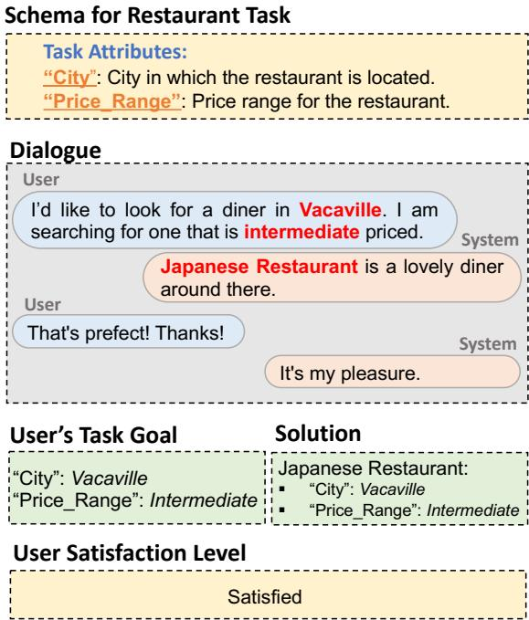
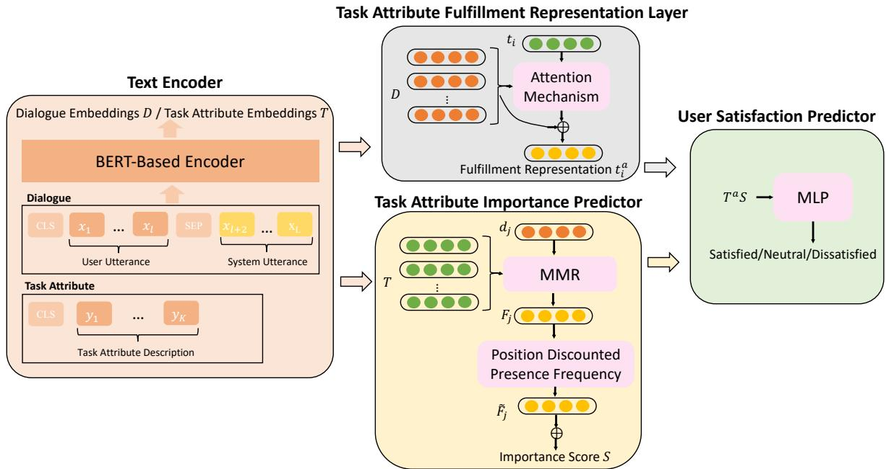
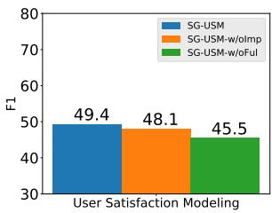
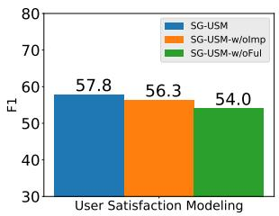
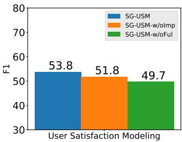
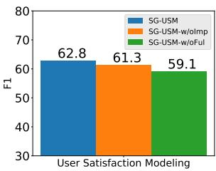
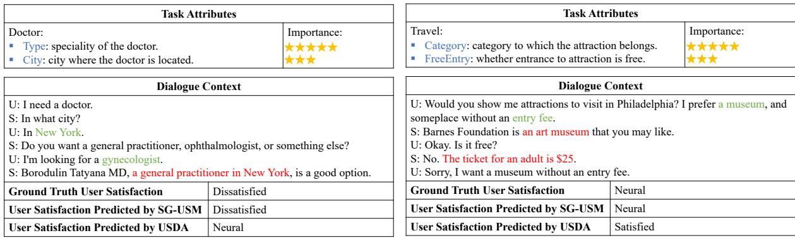
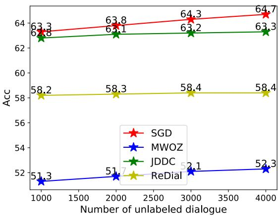
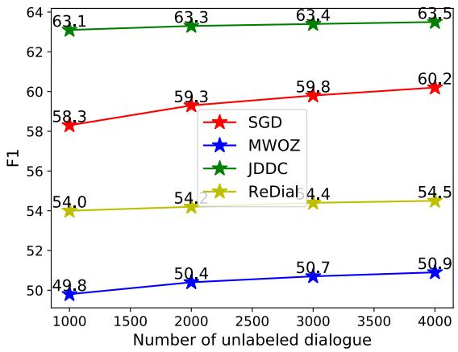

# Schema-Guided User Satisfaction Modeling for Task-Oriented Dialogues

Yue Feng †∗ Yunlong Jiao ‡ Animesh Prasad ‡

Nikolaos Aletras ‡ Emine Yilmaz †‡ Gabriella Kazai ‡

†University College London, London, UK

‡Amazon, London, United Kingdom

University of Sheffield, Sheffield, UK

†{yue.feng.20,emine.yilmaz}@ucl.ac.uk ‡{jyunlong,gkazai}@amazon.co.uk n.aletras@sheffield.ac.uk

## Abstract

User Satisfaction Modeling (USM) is one of the popular choices for task-oriented dialogue systems evaluation, where user satisfaction typically depends on whether the user’s task goals were fulfilled by the system. Task-oriented dialogue systems use task schema, which is a set of task attributes, to encode the user’s task goals. Existing studies on USM neglect explicitly modeling the user’s task goals fulfillment using the task schema. In this paper, we propose SG-USM, a novel schema-guided user satisfaction modeling framework. It explicitly models the degree to which the user’s preferences regarding the task attributes are fulfilled by the system for predicting the user’s satisfaction level. SG-USM employs a pre-trained language model for encoding dialogue context and task attributes. Further, it employs a fulfillment representation layer for learning how many task attributes have been fulfilled in the dialogue, an importance predictor component for calculating the importance of task attributes. Finally, it predicts the user satisfaction based on task attribute fulfillment and task attribute importance. Experimental results on benchmark datasets (i.e. MWOZ, SGD, ReDial, and JDDC) show that SG-USM consistently outperforms competitive existing methods. Our extensive analysis demonstrates that SG-USM can improve the interpretability of user satisfaction modeling, has good scalability as it can effectively deal with unseen tasks and can also effectively work in low-resource settings by leveraging unlabeled data.1

## 1 Introduction

Task-oriented dialogue systems have emerged for helping users to solve specific tasks efficiently (Hosseini-Asl et al., 2020). Evaluation is a crucial part of the development process of such systems. Many of the standard automatic evaluation metrics, e.g. BLEU (Papineni et al., 2002), ROUGE (Lin, 2004), have been shown to be ineffective in task-oriented dialogue evaluation (Deriu et al., 2021; Liu et al., 2016). As a consequence, User Satisfaction Modeling (USM) (Sun et al., 2021; Kachuee et al., 2021; Bodigutla et al., 2020; Song et al., 2019; Rebensburg et al., 2023) has gained momentum as the core evaluation metric for task-oriented dialogue systems. USM estimates the overall satisfaction of a user interaction with the system. In task-oriented dialogue systems, whether a user is satisfied largely depends on how well the user’s task goals were fulfilled. Each task would typically have an associated task schema, which is a set of task attributes (e.g. location, date for check-in and check-out, etc. for a hotel booking task), and for the user to be satisfied, the system is expected to fulfill the user’s preferences about these task attributes. Figure 1 shows an example of USM for task-oriented dialogues.

  
Figure 1: Task-oriented dialogue system has a predefined schema for each task, which is composed of a set of task attributes. In a dialogue, the user’s task goal is encoded by the task attribute and value pairs. The user is satisfied with the service when the provided solution fulfills the user’s preferences for the task attributes.

Effective USM models should have the following abilities: (1) Interpretability by giving insights on what aspect of the task the system performs well. For instance, this can help the system to recover from an error and optimize it toward an individual aspect to avoid dissatisfaction. (2) Scalability in dealing with unseen tasks, e.g. the model does not need to retrain when integrating new tasks. (3) Cost-efficiency for performing well in low-resource settings where it is often hard to collect and expensive to annotate task-specific data.

Previous work in USM follows two main lines of research. First, several methods use user behavior or system actions to model user satisfaction. In this setting, it is assumed that user satisfaction can be reflected by user behaviors or system actions in task-oriented dialogue systems, such as click, pause, request, inform (Deng et al., 2022; Guo et al., 2020). A second approach is to analyze semantic information in user natural language feedback to estimate user satisfaction, such as sentiment analysis (Sun et al., 2021; Song et al., 2019) or response quality assessment (Bodigutla et al., 2020; Zeng et al., 2020). However, both of these two lines of work do not take into account the abilities of interpretability, scalability, and cost-efficiency.

In this paper, we propose a novel approach to USM, referred to as Schema-Guided User Satisfaction Modeling (SG-USM). We hypothesize that user satisfaction should be predicted by the fulfillment degree of the user’s task goals that are typically represented by a set of task attribute and value pairs. Therefore, we explicitly formalize this by predicting how many task attributes fulfill the user’s preferences and how important these attributes are. When more important attributes are fulfilled, taskoriented dialogue systems should achieve better user satisfaction.

Specifically, SG-USM comprises a pre-trained text encoder to represent dialogue context and task attributes, a task attribute fulfillment representation layer to represent the fulfillment based on the relation between the dialogue context and task attributions, a task attribute importance predictor to calculate the importance based on the task attributes popularity in labeled and unlabeled dialogue corpus, and a user satisfaction predictor which uses task attributes fulfillment and task attributes importance to predict user satisfaction. SG-USM uses task attributes fulfillment and task attributes importance to explicitly model the fulfillment degree of the user’s task goals (interpetability). It uses an task-agnostic text encoder to create representations of task attributes by description, no matter whether the task are seen or not (scalability). Finally, it uses unlabeled dialogues in low-resource settings (cost-efficiency).

Experimental results on popular task-oriented benchmark datasets show that SG-SUM substantially and consistently outperforms existing methods on user satisfaction modeling. Extensive analysis also reveals the significance of explicitly modeling the fulfillment degree of the user’s task goals, the ability to deal with unseen tasks, and the effectiveness of utilizing unlabeled dialogues.

## 2 Related Work

Task-oriented Dialogue Systems. Unlike chitchat dialogue systems that aim at conversing with users without specific goals, task-oriented dialogue systems assist users to accomplish certain tasks (Feng et al., 2021; Eric et al., 2020). Task-oriented dialogue systems can be divided into module-based methods (Feng et al., 2022b; Ye et al., 2022; Su et al., 2022; Heck et al., 2020; Chen et al., 2020a; Wu et al., 2019a; Lei et al., 2018; Liu and Lane, 2016) and end-to-end methods (Feng et al., 2022a; Qin et al., 2020; Yang et al., 2020; Madotto et al., 2018; Yao et al., 2014). To measure the effectiveness of task-oriented dialogue systems, evaluation is a crucial part of the development process. Several approaches have been proposed including automatic evaluation metrics (Rastogi et al., 2020; Mrkšic et al.´ , 2017), human evaluation (Feng et al., 2022a; Goo et al., 2018), and user satisfaction modeling (Sun et al., 2021; Mehrotra et al., 2019). Automatic evaluation metrics, such as BLEU (Papineni et al., 2002), make a strong assumption for dialogue systems, which is that valid responses have significant word overlap with the ground truth responses. However, there is significant diversity in the space of valid responses to a given context (Liu et al., 2016). Human evaluation is considered to reflect the overall performance of the system in a real-world scenario, but it is intrusive, time-intensive, and does not scale (Deriu et al., 2021). Recently, user satisfaction modeling has been proposed as the main evaluation metric for task-oriented dialogue systems, which can address the issues listed above.

User Satisfaction Modeling. User satisfaction in task-oriented dialogue systems is related to whether or not, or to what degree, the user’s task goals are fulfilled by the system. Some researchers study user satisfaction from temporal user behaviors, such as click, pause, etc. (Deng et al., 2022; Guo et al., 2020; Mehrotra et al., 2019; Wu et al., 2019b; Su et al., 2018; Mehrotra et al., 2017). Other related studies view dialogue action recognition as an important preceding step to USM, such as request, inform, etc. (Deng et al., 2022; Kim and Lipani, 2022). However, sometimes the user behavior or system actions are hidden in the user’s natural language feedback and the system’s natural language response (Hashemi et al., 2018). To cope with this problem, a number of methods are developed from the perspective of sentiment analysis (Sun et al., 2021; Song et al., 2019; Engelbrecht et al., 2009) and response quality assessment (Bodigutla et al., 2020; Zeng et al., 2020). However, all existing methods cannot explicitly predict user satisfaction with fine-grained explanations, deal with unseen tasks, and alleviate low-resource learning problem. Our work is proposed to solve these issues.

## 3 Schema-guided User Satisfaction Modeling

Our SG-USM approach formalizes user satisfaction modeling by representing the user’s task goals as a set of task attributes, as shown in Figure 1. The goal is to explicitly model the degree to which task attributes are fulfilled, taking into account the importance of the attributes. As shown in Figure 2, SG-USM consists of a text encoder, a task attribute fulfillment representation layer, a task attribute importance predictor, and a user satisfaction predictor. Specifically, the text encoder transforms dialogue context and task attributes into dialogue embeddings and task attribute embeddings using BERT (Devlin et al., 2019). The task attribute fulfillment representation layer models relations between the dialogue embeddings and the task attribute embeddings by attention mechanism to create task attribute fulfillment representations. Further, the task attribute importance predictor models the task attribute popularity in labeled and unlabeled dialogues by the ranking model to obtain task attribute importance weights. Finally, the user satisfaction predictor predicts user satisfaction score on the basis of the task attribute fulfillment representations and task attribute importance weights using a multilayer perceptron.

## 3.1 Text Encoder

The text encoder takes the dialogue context (user and system utterances) and the descriptions of task attributes as input and uses BERT to obtain dialogue and task attribute embeddings, respectively.

Considering the limitation of the maximum input sequence length of BERT, we encode dialogue context by each dialogue turn. Specifically, the BERT encoder takes as input a sequence of tokens with length $L _ { : }$ denoted as $X = ( x _ { 1 } , . . . , x _ { L } )$ . The first token $x _ { 1 }$ is [CLS], followed by the tokens of the user utterance and the tokens of the system utterance in one dialogue turn, separated by [SEP]. The representation of [CLS] is used as the embedding of the dialogue turn. Given a dialogue with N dialogue turns, the output dialogue embeddings is the concatenation of all dialogue turn embeddings $D = [ d _ { 1 } ; d _ { 2 } ; . . . ; d _ { N } ]$

To obtain task attribute embeddings, the input is a sequence of tokens with length $K ,$ denoted as $Y ~ = ~ \{ y _ { 1 } , . . . , y _ { K } \}$ . The sequence starts with [CLS], followed by the tokens of the task attribute description. The representation of [CLS] is used as the embedding of the task attribute. The set of task attribute embeddings are denoted as $T = \left\{ t _ { 1 } , t _ { 2 } , . . . , t _ { M } \right\}$ , where M is the number of task attributes.

## 3.2 Task Attribute Fulfillment Representation Layer

The task attribute fulfillment representation layer takes the dialogue and task attribute embeddings as input and calculates dialogue-attended task attribute fulfillment representations. This way, whether each task attribute can be fulfilled in the dialogue context is represented.

Specifically, the task attribute fulfillment representation layer constructs an attention vector by a bilinear interaction, indicating the relevance between dialogue and task attribute embeddings. Given the dialogue embeddings D and i-th task attribute embedding $t _ { i }$ , it calculates the relevance as follows,

$$
A _ { i } = \mathrm { s o f t m a x } ( \exp ( D ^ { \mathsf { T } } W _ { a } t _ { i } ) ) ,\tag{1}
$$

  
Figure 2: The architecture of SG-USM for user satisfaction modeling on task-oriented dialogues.

where $W _ { a }$ is the bilinear interaction matrix to be learned. $A _ { i }$ represents the attention weights of dialogue turns with respect to the i-th task attribute. Then the dialogue-attended i-th task attribute fulfillment representations are calculated as follows,

$$
t _ { i } ^ { a } = D A _ { i } .\tag{2}
$$

The dialogue-attended task attribute fulfillment representations for all task attributes are denoted as:

$$
T ^ { a } = [ t _ { 1 } ^ { a } , t _ { 2 } ^ { a } , . . . , t _ { M } ^ { a } ] .\tag{3}
$$

where M is the number of the task attributes.

## 3.3 Task Attribute Importance Predictor

The task attribute importance predictor also takes the dialogue and task attribute embeddings as input and calculates attribute importance scores. The importance scores are obtained by considering both the task attribute presence frequency and task attribute presence position in the dialogue.

First, we use the Maximal Marginal Relevance (MMR) (Carbonell and Goldstein, 1998) to select the top relevant task attributes for the dialogue context. The selected task attributes are then used to calculate the task attribute presence frequency in the dialogue. The MMR takes the $j \cdot$ -th dialogue turn embeddings $d _ { j }$ and task attribute embeddings $T$ as input, and picks the top K relevant task attributes for the j-th dialogue turn:

$$
R _ { j } = \underset { t _ { i } \in T \setminus U } { \operatorname { a r g m a x } } \big [ \lambda \cos ( t _ { i } , d _ { j } ) - ( 1 - \lambda ) \operatorname* { m a x } _ { t _ { k } \in U } \cos ( t _ { i } , t _ { k } ) \big ]\tag{4}
$$

where U is the subset of attributes already selected as top relevant task attributes, cos is the cosine similarity between the embeddings. λ trades off between the similarity of the selected task attributes to the dialogue turn and also controls the diversity among the selected task attributes. The task attribute presence frequency vector for the j-th dialogue turn is computed as follows,

$$
F _ { j } = [ f _ { j } ^ { 1 } , f _ { j } ^ { 2 } , f _ { j } ^ { 3 } , . . . , f _ { j } ^ { M } ]\tag{5}
$$

$$
f _ { j } ^ { i } = \left\{ { \begin{array} { l l } { 1 } & { i \in R _ { j } } \\ { 0 } & { i \not \in R _ { j } } \end{array} } \right.\tag{6}
$$

where M is the number of the task attributes.

However, the task attribute presence frequency vector does not reward task attributes that appear in the beginning of the dialogue. The premise of task attribute importance score is that task attributes appearing near the end of the dialogue should be penalized as the graded importance value is reduced logarithmically proportional to the position of the dialogue turn. A common effective discounting method is to divide by the natural log of the position:

$$
\widetilde { F } _ { j } = \frac { F _ { j } } { l o g ( j + 1 ) }\tag{7}
$$

The task attribute importance predictor then computes the importance score on the basis of the sum of the discounted task attribute presence frequency of all dialogues. Given the dialogue corpus (including both labeled and unlabeled dialogues) with Z dialogues $C = \{ D _ { 1 } , D _ { 2 } , . . . , D _ { Z } \}$ , the task attribute importance scores are calculated as follow:

$$
S = \mathrm { s o f t m a x } ( \sum _ { l = 1 } ^ { Z } \sum _ { j = 1 } ^ { \mathrm { N u m } ( D _ { l } ) } \widetilde { F _ { j } ^ { l } } )\tag{8}
$$

where Num is the number of the dialogue turn in dialogue $D _ { l }$ , and $\widetilde { F _ { j } ^ { l } }$ is the discounted task attribute presence frequency of j-th dialogue turn in dialogue $D _ { l }$

## 3.4 User Satisfaction Predictor

Given the dialogue-attended task attribute fulfillment representations $T ^ { a }$ and the task attribute importance scores S, the user satisfaction labels are obtained by aggregating task attribute fulfillment representations based on task attribute importance scores. This way, the user satisfaction is explicitly modeled by the fulfillment of the task attributes and their individual importance.

Specifically, an aggregation layer integrates the dialogue-attended task attribute fulfillment representations by the task attribute importance scores as follows:

$$
h = T ^ { a } S\tag{9}
$$

Then the Multilayer Perceptron (MLP) (Hastie et al., 2009) with softmax normalization is employed to calculate the probability distribution of user satisfaction classes:

$$
p = { \mathrm { s o f t m a x } } ( \mathrm { M L P } ( h ) )\tag{10}
$$

## 3.5 Training

We train SG-USM in an end-to-end fashion by minimizing the cross-entropy loss between the predicted user satisfaction probabilities and the ground-truth satisfaction:

$$
{ \mathcal { L } } = - y \mathrm { l o g } ( p )\tag{11}
$$

where $y$ is the ground-truth user satisfaction. Pretrained BERT encoders are used for encoding representations of utterances and schema descriptions respectively. The encoders are fine-tuned during the training process.

## 4 Experimental Setup

## 4.1 Datasets

We conduct experiments using four benchmark datasets containing task-oriented dialogue on different domains and languages (English and Chinese), including MultiWOZ2.1 (MWOZ) (Eric et al., 2020), Schema Guided Dialogue (SGD) (Rastogi et al., 2020), ReDial (Li et al., 2018), and JDDC (Chen et al., 2020b).

MWOZ and SGD are English multi-domain taskoriented dialogue datasets, which include hotel, restaurant, flight, etc. These datasets contain domain-slot pairs, where the slot information could correspond to the task attributes.

ReDial is an English conversational recommendation dataset for movie recommendation. The task attributes are obtained from the Movie2 type on Schema.org.

JDDC is a Chinese customer service dialogue dataset in E-Commerce. The task attributes are obtained from the Product3 type on Schema.org.cn, which provides schemas in Chinese.

Specifically, we use the subsets of these datasets with the user satisfaction annotation for evaluation, which is provided by Sun et al (Sun et al., 2021). We also use the subsets of these datasets without the user satisfaction annotation to investigate the semi-supervised learning abilities of SG-USM. Table 1 displays the statistics of the datasets in the experiments.

<table><tr><td>Characteristics</td><td>MWOZ</td><td>SGD</td><td>ReDial</td><td>JDDC</td></tr><tr><td>Language</td><td>English</td><td>English</td><td>English</td><td>Chinese</td></tr><tr><td>#Dialogues</td><td>1,000</td><td>1,000</td><td>1,000</td><td>3,300</td></tr><tr><td>#Utterances</td><td>12,553</td><td>13,833</td><td>11,806</td><td>54,517</td></tr><tr><td>#Avg Turn</td><td>23.1</td><td>26.7</td><td>22.5</td><td>32.3</td></tr><tr><td>#Attributes</td><td>37</td><td>215</td><td>128</td><td>13</td></tr><tr><td>%Sat. Class</td><td>27:39:34</td><td>22:30:48</td><td>23:26:51</td><td>23:53:24</td></tr><tr><td>#TrainSplit</td><td>7,648</td><td>8,674</td><td>7,372</td><td>38,146</td></tr><tr><td>#ValidSplit</td><td>952</td><td>1,074</td><td>700</td><td>5,006</td></tr><tr><td>#TestSplit</td><td>953</td><td>1,085</td><td>547</td><td>4,765</td></tr><tr><td>#Unlabeled Dialogues</td><td>4,000</td><td>4,000</td><td>4,000</td><td>4,000</td></tr></table>

Table 1: Statistics of the task-oriented dialogue datasets.

## 4.2 Baselines and SG-USM Variants

We compare our SG-USM approach with competitive baselines as well as state-of-the-art methods in user satisfaction modeling.

HiGRU (Jiao et al., 2019) proposes a hierarchical structure to encode each turn in the dialogue using a word-level gated recurrent unit (GRU) (Dey and Salem, 2017) and a sentence-level GRU. It uses the last hidden states of the sentence-level GRU as inputs of a multilayer perceptron (MLP) (Hastie et al., 2009) to predict the user satisfaction level.

HAN (Yang et al., 2016) applies a two-level attention mechanism in the hierarchical structure of

<table><tr><td rowspan="2">Model</td><td colspan="4">MWOZ</td><td colspan="4">SGD</td><td colspan="4">ReDial</td><td colspan="4">JDDC</td></tr><tr><td>Acc</td><td>P</td><td>R</td><td>F1</td><td>Acc</td><td>P</td><td>R</td><td>F1</td><td>Acc</td><td>P</td><td>R</td><td>F1</td><td>Acc</td><td>P</td><td>R</td><td>F1</td></tr><tr><td>HiGRU</td><td>44.6</td><td>43.7</td><td>44.3</td><td>43.7</td><td>50.0</td><td>47.3</td><td>48.4</td><td>47.5</td><td>46.1</td><td>44.4</td><td>44.0</td><td>43.5</td><td>59.7</td><td>57.3</td><td>50.4</td><td>52.0</td></tr><tr><td>HAN</td><td>39.0</td><td>37.1</td><td>37.1</td><td>36.8</td><td>47.7</td><td>47.1</td><td>44.8</td><td>44.9</td><td>46.3</td><td>40.0</td><td>40.3</td><td>40.0</td><td>58.4</td><td>54.2</td><td>50.1</td><td>51.2</td></tr><tr><td>Transformer</td><td>42.8</td><td>41.5</td><td>41.9</td><td>41.7</td><td>53.1</td><td>48.3</td><td>49.9</td><td>49.1</td><td>47.5</td><td>44.9</td><td>44.7</td><td>44.8</td><td>60.9</td><td>59.2</td><td>53.4</td><td>56.2</td></tr><tr><td>BERT</td><td>46.1</td><td>45.5</td><td>47.4</td><td>45.9</td><td>56.2</td><td>55.0</td><td>53.7</td><td>53.7</td><td>53.6</td><td>50.5</td><td>51.3</td><td>50.0</td><td>60.4</td><td>59.8</td><td>58.8</td><td>59.5</td></tr><tr><td>USDA</td><td>49.9</td><td>49.2</td><td>49.0</td><td>48.9</td><td>61.4</td><td>60.1</td><td>55.7</td><td>57.0</td><td>57.3</td><td>54.3</td><td>52.9</td><td>53.4</td><td>61.8</td><td>62.8</td><td>63.7</td><td>61.7</td></tr><tr><td>SG-USM-L</td><td>50.8*</td><td>49.3</td><td>50.2*</td><td>49.4*</td><td>62.6</td><td>58.5</td><td>57.2*</td><td>57.8*</td><td>57.9*</td><td>54.7</td><td>53.0</td><td>53.8</td><td>62.5*</td><td>62.6</td><td>63.9</td><td>62.8*</td></tr><tr><td>SG-USM-L&amp;U</td><td>52.3*</td><td>50.4*</td><td>51.4*</td><td>50.9*</td><td>64.7*</td><td>61.6*</td><td>58.8*</td><td>60.2*</td><td>58.4*</td><td>55.8*</td><td>53.2*</td><td>54.5*</td><td>63.3*</td><td>63.1*</td><td>64.1*</td><td>63.5*</td></tr></table>

Table 2: Performance of SG-USM and baselines on various evaluation benchmarks. Numbers in bold denote the best model performance for a given metric. Numbers with indicate that SG-USM model is better than the best-performing baseline method (underlined scores) with statistical significance (t-test, p < 0.05).

HiGRU to represent dialogues. An MLP takes the dialogue representation as inputs to predict the user satisfaction level.

Transformer (Vaswani et al., 2017) is a simple baseline that takes the dialogue context as input and uses the standard Transformer encoder to obtain the dialogue representations. An MLP is used on the encoder to predict the user satisfaction level.

BERT (Devlin et al., 2019) concatenates the last 512 tokens of the dialogue context into a long sequence with a [SEP] token for separating dialogue turns. It uses the [CLS] token of a pre-trained BERT models to represent dialogues. An MLP is used on the BERT to predict the user satisfaction level.

USDA (Deng et al., 2022) employs a hierarchical BERT encoder to encode the whole dialogue context at the turn-level and the dialogue-level. It also incorporates the sequential dynamics of dialogue acts with the dialogue context in a multi-task framework for user satisfaction modeling.

We also report the performance of two simpler SG-USM variants:

SG-USM(L) only uses the dialogues with groundtruth user satisfaction labels to train the model.

SG-USM(L&U) uses both labeled and unlabeled dialogues in the training process. It takes the dialogues without user satisfaction annotation as the inputs of task attribute importance predictor module to obtain more general and accurate task attribute importance scores.

For a fair comparison with previous work and without loss of generality, we adopt BERT as the backbone encoder for all methods that use pretrained language models.

## 4.3 Evaluation Metrics

Following previous work (Deng et al., 2022; Cai and Chen, 2020; Choi et al., 2019; Song et al., 2019), we consider a three-class classification task for user satisfaction modeling by treating the rating “</=/> 3” as “dissatisfied/neutral/satisfied”. Accuracy (Acc), Precision (P), Recall (R), and F1 are used as the evaluation metrics.

## 4.4 Training

We use BERT-Base uncased, which has 12 hidden layers of 768 units and 12 self-attention heads to encode the utterances and schema descriptions. We apply a two-layer MLP with the hidden size as 768 on top of the text encoders. ReLU is used as the activation function. The dropout probability is 0.1. Adam (Kingma and Ba, 2014) is used for optimization with an initial learning rate of 1e-4. We train up to 20 epochs with a batch size of 16, and select the best checkpoints based on the F1 score on the validation set.

## 5 Experimental Results

## 5.1 Overall Performance

Table 2 shows the results of SG-USM on MWOZ, SGD, ReDial, and JDDC datasets. Overall, we observe that SG-USM substantially and consistently outperforms all other methods across four datasets with a noticeable margin. Specifically, SG-USM(L) improves the performance of user satisfaction modeling via explicitly modeling the degree to which the task attributes are fulfilled. SG-USM(L&U) further aids the user satisfaction modeling via predicting task attribute importance based on both labeled dialogues and unlabeled dialogues. It appears that the success of SG-USM is due to its architecture design which consists of the task attribute fulfillment representation layer and the task attribute importance predictor. In addition, SG-USM can also effectively leverage unlabeled dialogues to alleviate the cost of user satisfaction score annotation.

  
(a) MWOZ

  
(b) SGD

  
(c) ReDial

  
(d) JDDC

Figure 3: Performance of SG-USM by ablating the task attribute importance and task attribute fulfillment components across datasets.  
  
(a) Example 1

<table><tr><td rowspan=1 colspan=3>Task Attributes</td></tr><tr><td rowspan=1 colspan=2>Travel: Category: category to which the attraction belongs.FreeEntry: whether entrance to attraction is free.</td><td rowspan=1 colspan=1>Importance:</td></tr><tr><td rowspan=1 colspan=3>Dialogue Context</td></tr><tr><td rowspan=1 colspan=3>U: Would you show me attractions to visit in Philadelphia? I prefer a museum, andsomeplace without an entry fee.S: Barnes Foundation is an art museum that you may like.U: Okay. Is it free?S: No. The ticket for an adult is $25U: Sorry, I want a museum without an entry fee.</td></tr><tr><td rowspan=1 colspan=1>Ground Truth User Satisfaction</td><td rowspan=1 colspan=2>Neural</td></tr><tr><td rowspan=1 colspan=1>User Satisfaction Predicted by SG-USM</td><td rowspan=1 colspan=2>Neural</td></tr><tr><td rowspan=1 colspan=1>User Satisfaction Predicted by USDA</td><td rowspan=1 colspan=2>Satisfied</td></tr></table>

(b) Example 2  
Figure 4: Case study on SG-USM and USDA on SGD dataset. The yellow represents the importance of task attributes. The texts in green are the users’ preferences for the task attributes. The texts in red are the attributes of the provided solutions.

## 5.2 Ablation Study

We also conduct an ablation study on SG-USM to study the contribution of its two main components: task attribute importance and task attribute fulfillment.

## Effect of Task Attribute Importance

To investigate the effectiveness of task attribute importance in user satisfaction modeling, we eliminate the task attribute importance predictor and run the model on MWOZ, SGD, ReDial, and JDDC. As shown in Figure 3, the performance of SG-USMw/oImp decreases substantially compared with SG-USM. This indicates that the task attribute importance is essential for user satisfaction modeling. We conjecture that it is due to the user satisfaction relates to the importance of the fulfilled task attributes.

## Effect of Task Attribute Fulfillment

To investigate the effectiveness of task attribute fulfillment in user satisfaction modeling, we compare SG-USM with SG-USM-w/oFul which eliminates the task attribute fulfillment representation.

Figure 3 shows the results on MWOZ, SGD, Re-Dial, and JDDC in terms of F1. From the results, we can observe that without task attribute fulfillment representation the performances deteriorate considerably. Thus, utilization of task attribute fulfillment representation is necessary for user satisfaction modeling.

## 5.3 Discussion

## Case Study

We also perform a qualitative analysis on the results of SG-USM and the best baseline USDA on the SGD dataset to delve deeper into the differences of the two models.

We first find that SG-USM can make accurate inferences about user satisfaction by explicitly modeling the fulfillment degree of task attributes. For example, in the first case in Figure 4, the user wants to find a gynecologist in New York. SG-USM can correctly predict the dissatisfied label by inferring that the first important task attribute “Type” is not fulfilled. In the second case, the user wants to find a museum without an entry fee. SG-USM can yield the correct neural label by inferring that the second important task attribute “FreeEntry” is not fulfilled. From our analysis, we think that SG-USM achieves better accuracy due to its ability to explicitly model how many task attributes are fulfilled and how important the fulfilled task attributes are. In contrast, the USDA does not model the fulfillment degree of task attributes, thus it cannot properly infer the overall user satisfaction.

<table><tr><td rowspan="2">Model</td><td colspan="4">MWOZ</td><td colspan="4">ReDial</td></tr><tr><td>Acc</td><td>P</td><td>R</td><td>F1</td><td>Acc</td><td>P</td><td>R</td><td>F1</td></tr><tr><td>USDA</td><td>32.8</td><td>34.5</td><td>32.2</td><td>33.1</td><td>25.4</td><td>29.5</td><td>26.4</td><td>27.3</td></tr><tr><td>SG-USM(L)</td><td>40.9*</td><td>38.9*</td><td>41.3*</td><td>40.2*</td><td>30.8*</td><td>34.6*</td><td>30.7*</td><td>32.1*</td></tr><tr><td>SG-USM(L&amp;U)</td><td>43.1*</td><td>40.9*</td><td>43.5*</td><td>42.8*</td><td>32.3*</td><td>36.4*</td><td>32.8*</td><td>33.4*</td></tr></table>

Table 3: Performance of SG-USM and the best baseline USDA on zero-shot learning ability. All the models are trained on SGD and tested on MWOZ and ReDial. Numbers in bold denote best results in that metric. Numbers with indicate that the model is better than the performance of baseline with statistical significance (t-test, p < 0.05).

  
Figure 5: Performance of SG-USM trained with different numbers of unlabeled dialogues on MWOZ, SGD, ReDial, and JDDC datasets.

## Dealing with Unseen Task Attributes

We furhter analyze the zero-shot capabilities of SG-USM and the best baseline of USDA. The SGD, MWOZ, and ReDial datasets are English dialogue datasets that contain different task attributes. Therefore, we train models on SGD, and test models on MWOZ and ReDial to evaluate the zero-shot learning ability. Table 3 presents the Accuracy, Precision, Recall, and F1 of SG-USM and USDA on MWOZ and ReDial. From the results, we can observe that SG-USM performs significantly better than the baseline USDA on both datasets. This indicates that the agnostic task attribute encoder of SG-USM is effective. We argue that it can learn shared knowledge between task attributes and create more accurate semantic representations for unseen task attributes to improve performance in zeroshot learning settings.

## Effect of the Unlabeled Dialogues

To analyze the effect of the unlabeled dialogues for SG-USM, we test different numbers of unlabeled dialogues during the training process of SG-USM. Figure 5 shows the Accuracy and F1 of SG-USM when using 1 to 4 thousand unlabeled dialogues for training on MWOZ, SGD, ReDial, and JDDC. From the results, we can see that SG-USM can achieve higher performance with more unlabeled dialogues. This indicates that SG-USM can effectively utilize unlabeled dialogues to improve the performance of user satisfaction modeling. We reason that with a larger corpus, the model can more accurately estimate the importance of task attributes.

## 6 Conclusion

User satisfaction modeling is an important yet challenging problem for task-oriented dialogue systems evaluation. For this purpose, we proposed to explicitly model the degree to which the user’s task goals are fulfilled. Our novel method, namely SG-USM, models user satisfaction as a function of the degree to which the attributes of the user’s task goals are fulfilled, taking into account the importance of the attributes. Extensive experiments show that SG-

USM significantly outperforms the state-of-the-art methods in user satisfaction modeling on various benchmark datasets, i.e. MWOZ, SGD, ReDial, and JDDC. Our extensive analysis also validates the benefit of explicitly modeling the fulfillment degree of a user’s task goal based on the fulfillment of its constituent task attributes. In future work, it is worth exploring the reasons of user dissatisfaction to better evaluate and improve task-oriented dialogue systems.

## Limitations

Our approach builds on a task schema that characterizes a task-oriented dialogue system’s domain. For example, the schema captures various attributes of the task. For some domains, when a schema is not pre-defined, it first needs to be extracted, e.g., from a corpus of dialogues. In this paper, we used BERT as our LM to be comparable with related work, but more advanced models could further improve the performance. A limitation of our task attribute importance scoring method is that it currently produces a static set of weights, reflecting the domain. In the future, the importance weights may be personalized to the current user’s needs instead.

## References

Praveen Kumar Bodigutla, Aditya Tiwari, Spyros Matsoukas, Josep Valls-Vargas, and Lazaros Polymenakos. 2020. Joint turn and dialogue level user satisfaction estimation on multi-domain conversations. In Findings of the Association for Computational Linguistics: EMNLP 2020, pages 3897–3909.

Wanling Cai and Li Chen. 2020. Predicting user intents and satisfaction with dialogue-based conversational recommendations. In Proceedings ofthe 28th ACM Conference on User Modeling, Adaptation and Personalization, pages 33–42.

Jaime Carbonell and Jade Goldstein. 1998. The use of mmr, diversity-based reranking for reordering documents and producing summaries. In Proceedings ofthe 21st annual international ACM SIGIR conference on Research and development in information retrieval, pages 335–336.

Lu Chen, Boer Lv, Chi Wang, Su Zhu, Bowen Tan, and Kai Yu. 2020a. Schema-guided multi-domain dialogue state tracking with graph attention neural networks. In Proceedings ofthe AAAI Conference on Artificial Intelligence, volume 34, pages 7521–7528.

Meng Chen, Ruixue Liu, Lei Shen, Shaozu Yuan, Jingyan Zhou, Youzheng Wu, Xiaodong He, and

Bowen Zhou. 2020b. The jddc corpus: A large-scale multi-turn chinese dialogue dataset for e-commerce customer service. In LREC.

Jason Ingyu Choi, Ali Ahmadvand, and Eugene Agichtein. 2019. Offline and online satisfaction prediction in open-domain conversational systems. In Proceedings ofthe 28th ACM International Conference on Information and Knowledge Management, pages 1281–1290.

Yang Deng, Wenxuan Zhang, Wai Lam, Hong Cheng, and Helen Meng. 2022. User satisfaction estimation with sequential dialogue act modeling in goaloriented conversational systems. In Proceedings of the ACM Web Conference 2022, pages 2998–3008.

Jan Deriu, Alvaro Rodrigo, Arantxa Otegi, Guillermo Echegoyen, Sophie Rosset, Eneko Agirre, and Mark Cieliebak. 2021. Survey on evaluation methods for dialogue systems. Artificial Intelligence Review, 54(1):755–810.

Jacob Devlin, Ming-Wei Chang, and Kristina Toutanova. 2019. Bert: Pre-training of deep bidirectional transformers for language understanding. In Proceedings of NAACL-HLT, pages 4171–4186.

Rahul Dey and Fathi M Salem. 2017. Gate-variants of gated recurrent unit (gru) neural networks. In 2017 IEEE 60th international midwest symposium on circuits and systems (MWSCAS), pages 1597–1600. IEEE.

Klaus-Peter Engelbrecht, Florian Gödde, Felix Hartard, Hamed Ketabdar, and Sebastian Möller. 2009. Modeling user satisfaction with hidden markov models. In Proceedings of the SIGDIAL 2009 Conference, pages 170–177.

Mihail Eric, Rahul Goel, Shachi Paul, Abhishek Sethi, Sanchit Agarwal, Shuyang Gao, Adarsh Kumar, Anuj Kumar Goyal, Peter Ku, and Dilek Hakkani-Tür. 2020. Multiwoz 2.1: A consolidated multi-domain dialogue dataset with state corrections and state tracking baselines. In LREC.

Yue Feng, Gerasimos Lampouras, and Ignacio Iacobacci. 2022a. Topic-aware response generation in task-oriented dialogue with unstructured knowledge access. EMNLP.

Yue Feng, Aldo Lipani, Fanghua Ye, Qiang Zhang, and Emine Yilmaz. 2022b. Dynamic schema graph fusion network for multi-domain dialogue state tracking. In Proceedings ofthe 60th Annual Meeting ofthe Associationfor Computational Linguistics (Volume 1: Long Papers), pages 115–126.

Yue Feng, Yang Wang, and Hang Li. 2021. A sequenceto-sequence approach to dialogue state tracking. In Proceedings of the 59th Annual Meeting of the Association for Computational Linguistics (Volume 1: Long Papers), pages 1714–1725.

Chih-Wen Goo, Guang Gao, Yun-Kai Hsu, Chih-Li Huo, Tsung-Chieh Chen, Keng-Wei Hsu, and Yun-Nung Chen. 2018. Slot-gated modeling for joint slot filling and intent prediction. In Proceedings of the 2018 Conference of the North American Chapter of the Association for Computational Linguistics, pages 753–757.

Liyi Guo, Rui Lu, Haoqi Zhang, Junqi Jin, Zhenzhe Zheng, Fan Wu, Jin Li, Haiyang Xu, Han Li, Wenkai Lu, et al. 2020. A deep prediction network for understanding advertiser intent and satisfaction. In Proceedings of the 29th ACM International Conference on Information & Knowledge Management, pages 2501–2508.

Seyyed Hadi Hashemi, Kyle Williams, Ahmed El Kholy, Imed Zitouni, and Paul A Crook. 2018. Measuring user satisfaction on smart speaker intelligent assistants using intent sensitive query embeddings. In Proceedings ofthe 27th ACM International Conference on Information and Knowledge Management, pages 1183–1192.

Trevor Hastie, Robert Tibshirani, Jerome H Friedman, and Jerome H Friedman. 2009. The elements ofstatistical learning: data mining, inference, and prediction, volume 2. Springer.

Michael Heck, Carel van Niekerk, Nurul Lubis, Christian Geishauser, Hsien-Chin Lin, Marco Moresi, and Milica Gasic. 2020. Trippy: A triple copy strategy for value independent neural dialog state tracking. In Proceedings of the 21th Annual Meeting of the Special Interest Group on Discourse and Dialogue, pages 35–44.

Ehsan Hosseini-Asl, Bryan McCann, Chien-Sheng Wu, Semih Yavuz, and Richard Socher. 2020. A simple language model for task-oriented dialogue. In Proceedings of the 34th International Conference on Neural Information Processing Systems, pages 20179–20191.

Wenxiang Jiao, Haiqin Yang, Irwin King, and Michael R Lyu. 2019. Higru: Hierarchical gated recurrent units for utterance-level emotion recognition. In Proceedings of the 2019 Conference of the North American Chapter of the Association for Computational Linguistics, pages 397–406.

Mohammad Kachuee, Hao Yuan, Young-Bum Kim, and Sungjin Lee. 2021. Self-supervised contrastive learning for efficient user satisfaction prediction in conversational agents. In Proceedings of the 2021 Conference of the North American Chapter of the Association for Computational Linguistics, pages 4053– 4064.

To Eun Kim and Aldo Lipani. 2022. A multi-task based neural model to simulate users in goal-oriented dialogue systems. SIGIR.

Diederik P Kingma and Jimmy Ba. 2014. Adam: A method for stochastic optimization. CoRR.

Wenqiang Lei, Xisen Jin, Min-Yen Kan, Zhaochun Ren, Xiangnan He, and Dawei Yin. 2018. Sequicity: Simplifying task-oriented dialogue systems with single sequence-to-sequence architectures. In Proceedings of the 56th Annual Meeting of the Association for Computational Linguistics (Volume 1: Long Papers), pages 1437–1447.

Raymond Li, Samira Ebrahimi Kahou, Hannes Schulz, Vincent Michalski, Laurent Charlin, and Chris Pal. 2018. Towards deep conversational recommendations. Advances in neural information processing systems, 31.

Chin-Yew Lin. 2004. Rouge: A package for automatic evaluation of summaries. In Text summarization branches out, pages 74–81.

Bing Liu and Ian Lane. 2016. Attention-based recurrent neural network models for joint intent detection and slot filling. Interspeech 2016, pages 685–689.

Chia-Wei Liu, Ryan Lowe, Iulian Serban, Michael Noseworthy, Laurent Charlin, and Joelle Pineau. 2016. How not to evaluate your dialogue system: An empirical study of unsupervised evaluation metrics for dialogue response generation. In EMNLP.

Andrea Madotto, Chien-Sheng Wu, and Pascale Fung. 2018. Mem2seq: Effectively incorporating knowledge bases into end-to-end task-oriented dialog systems. In Proceedings of the 56th Annual Meeting of the Association for Computational Linguistics (Volume 1: Long Papers), pages 1468–1478.

Rishabh Mehrotra, Mounia Lalmas, Doug Kenney, Thomas Lim-Meng, and Golli Hashemian. 2019. Jointly leveraging intent and interaction signals to predict user satisfaction with slate recommendations. In The World Wide Web Conference, pages 1256– 1267.

Rishabh Mehrotra, Imed Zitouni, Ahmed Hassan Awadallah, Ahmed El Kholy, and Madian Khabsa. 2017. User interaction sequences for search satisfaction prediction. In Proceedings ofthe 40th International ACM SIGIR conference on research and development in information retrieval, pages 165–174.

Nikola Mrkšic, Diarmuid Ó Séaghdha, Tsung-Hsien ´ Wen, Blaise Thomson, and Steve Young. 2017. Neural belief tracker: Data-driven dialogue state tracking. In Proceedings of the 55th Annual Meeting of the Associationfor Computational Linguistics (Volume 1: Long Papers), pages 1777–1788.

Kishore Papineni, Salim Roukos, Todd Ward, and Wei-Jing Zhu. 2002. Bleu: a method for automatic evaluation of machine translation. In Proceedings of the 40th annual meeting of the Association for Computational Linguistics, pages 311–318.

Libo Qin, Xiao Xu, Wanxiang Che, Yue Zhang, and Ting Liu. 2020. Dynamic fusion network for multidomain end-to-end task-oriented dialog. In Proceedings of the 58th Annual Meeting of the Association for Computational Linguistics, pages 6344–6354.

Abhinav Rastogi, Xiaoxue Zang, Srinivas Sunkara, Raghav Gupta, and Pranav Khaitan. 2020. Towards scalable multi-domain conversational agents: The schema-guided dialogue dataset. In Proceedings of the AAAI Conference on Artificial Intelligence, volume 34, pages 8689–8696.

Mika Rebensburg, Stefan Hillmann, and Nils Feldhus. 2023. Automatic user experience evaluation of goaloriented dialogs using pre-trained language models. In In Proc. ESSV 2023 (March 1–3, Munich), TUDpress.

Kaisong Song, Lidong Bing, Wei Gao, Jun Lin, Lujun Zhao, Jiancheng Wang, Changlong Sun, Xiaozhong Liu, and Qiong Zhang. 2019. Using customer service dialogues for satisfaction analysis with contextassisted multiple instance learning. In Proceedings of the 2019 Conference on Empirical Methods in Natural Language Processing (EMNLP), pages 198–207.

Ning Su, Jiyin He, Yiqun Liu, Min Zhang, and Shaoping Ma. 2018. User intent, behaviour, and perceived satisfaction in product search. In Proceedings of the Eleventh ACM International Conference on Web Search and Data Mining, pages 547–555.

Yixuan Su, Lei Shu, Elman Mansimov, Arshit Gupta, Deng Cai, Yi-An Lai, and Yi Zhang. 2022. Multi-task pre-training for plug-and-play task-oriented dialogue system. In Proceedings of the 60th Annual Meeting of the Association for Computational Linguistics (Volume 1: Long Papers), pages 4661–4676.

Weiwei Sun, Shuo Zhang, Krisztian Balog, Zhaochun Ren, Pengjie Ren, Zhumin Chen, and Maarten de Rijke. 2021. Simulating user satisfaction for the evaluation of task-oriented dialogue systems. In Proceedings of the 44th International ACM SIGIR Conference on Research and Development in Information Retrieval, pages 2499–2506.

Ashish Vaswani, Noam Shazeer, Niki Parmar, Jakob Uszkoreit, Llion Jones, Aidan N Gomez, Łukasz Kaiser, and Illia Polosukhin. 2017. Attention is all you need. Advances in neural information processing systems, 30.

Chien-Sheng Wu, Andrea Madotto, Ehsan Hosseini-Asl, Caiming Xiong, Richard Socher, and Pascale Fung. 2019a. Transferable multi-domain state generator for task-oriented dialogue systems. In Proceedings of the 57th Annual Meeting of the Association for Computational Linguistics, pages 808–819.

Zhijing Wu, Yiqun Liu, Qianfan Zhang, Kailu Wu, Min Zhang, and Shaoping Ma. 2019b. The influence of image search intents on user behavior and satisfaction. In Proceedings of the Twelfth ACM International Conference on Web Search and Data Mining, pages 645–653.

Shiquan Yang, Rui Zhang, and Sarah Erfani. 2020. Graphdialog: Integrating graph knowledge into endto-end task-oriented dialogue systems. In Proceedings ofthe 2020 Conference on Empirical Methods

in Natural Language Processing (EMNLP), pages 1878–1888.

Zichao Yang, Diyi Yang, Chris Dyer, Xiaodong He, Alex Smola, and Eduard Hovy. 2016. Hierarchical attention networks for document classification. In Proceedings ofthe 2016 conference ofthe North American chapter of the association for computational linguistics, pages 1480–1489.

Kaisheng Yao, Baolin Peng, Geoffrey Zweig, Dong Yu, Xiaolong Li, and Feng Gao. 2014. Recurrent conditional random field for language understanding. In 2014 IEEE International Conference on Acoustics, Speech and Signal Processing (ICASSP), pages 4077– 4081. IEEE.

Fanghua Ye, Yue Feng, and Emine Yilmaz. 2022. Assist: Towards label noise-robust dialogue state tracking. In Findings of the Association for Computational Linguistics: ACL 2022, pages 2719–2731.

Zhaohao Zeng, Sosuke Kato, Tetsuya Sakai, and Inho Kang. 2020. Overview of the ntcir-15 dialogue evaluation (dialeval-1) task.

A For every submission: ✓ A1. Did you describe the limitations of your work? In the last section

✓ A2. Did you discuss any potential risks of your work? Section 5

✓ A3. Do the abstract and introduction summarize the paper’s main claims? Section 1

✗ A4. Have you used AI writing assistants when working on this paper? Left blank.

B ✗ Did you use or create scientific artifacts? Left blank.

 B1. Did you cite the creators of artifacts you used? No response.

 B2. Did you discuss the license or terms for use and / or distribution of any artifacts? No response.

 B3. Did you discuss if your use of existing artifact(s) was consistent with their intended use, provided that it was specified? For the artifacts you create, do you specify intended use and whether that is compatible with the original access conditions (in particular, derivatives of data accessed for research purposes should not be used outside of research contexts)? No response.

 B4. Did you discuss the steps taken to check whether the data that was collected / used contains any information that names or uniquely identifies individual people or offensive content, and the steps taken to protect / anonymize it? No response.

 B5. Did you provide documentation of the artifacts, e.g., coverage of domains, languages, and linguistic phenomena, demographic groups represented, etc.? No response.

 B6. Did you report relevant statistics like the number of examples, details of train / test / dev splits, etc. for the data that you used / created? Even for commonly-used benchmark datasets, include the number of examples in train / validation / test splits, as these provide necessary context for a reader to understand experimental results. For example, small differences in accuracy on large test sets may be significant, while on small test sets they may not be. No response.

## C ✓ Did you run computational experiments?

Section 5

✓ C1. Did you report the number of parameters in the models used, the total computational budget (e.g., GPU hours), and computing infrastructure used? Section 5

✓ C2. Did you discuss the experimental setup, including hyperparameter search and best-found hyperparameter values? Section 5

✓ C3. Did you report descriptive statistics about your results (e.g., error bars around results, summary statistics from sets of experiments), and is it transparent whether you are reporting the max, mean, etc. or just a single run? Section 5

✓ C4. If you used existing packages (e.g., for preprocessing, for normalization, or for evaluation), did you report the implementation, model, and parameter settings used (e.g., NLTK, Spacy, ROUGE, etc.)? Section 5

D ✗ Did you use human annotators (e.g., crowdworkers) or research with human participants? Left blank.

 D1. Did you report the full text of instructions given to participants, including e.g., screenshots, disclaimers of any risks to participants or annotators, etc.? No response.

 D2. Did you report information about how you recruited (e.g., crowdsourcing platform, students) and paid participants, and discuss if such payment is adequate given the participants’ demographic (e.g., country of residence)? No response.

 D3. Did you discuss whether and how consent was obtained from people whose data you’re using/curating? For example, if you collected data via crowdsourcing, did your instructions to crowdworkers explain how the data would be used? No response.

 D4. Was the data collection protocol approved (or determined exempt) by an ethics review board? No response.

 D5. Did you report the basic demographic and geographic characteristics of the annotator population that is the source of the data? No response.