# Self-Adaptive In-Context Learning: An Information Compression Perspective for In-Context Example Selection and Ordering

Zhiyong Wu♦†, Yaoxiang Wang♣†∗, Jiacheng Ye♠†∗ , Lingpeng Kong♠ ♦Shanghai AI Laboratory ♣Xiamen University ♠The University of Hong Kong {jcye2,lpk}@cs.hku.hk, {wuzhiyong,wangyaoxiang}@pjlab.org.cn,

## Abstract

Despite the impressive few-shot performance of in-context learning (ICL), it remains a common practice to randomly select examples to serve as the context. In this paper, we advocate self-adaptive in-context learning, a new principle for ICL, in which the self-adaption mechanism is introduced to help each input find an in-context example organization (i.e., selection and permutation) that can derive the correct output, thus maximizing performance. To validate the effectiveness of self-adaptive ICL, we propose a general select-then-rank framework and a set of novel selection and ranking algorithms. Upon extensive evaluation on eight different NLP datasets, our self-adaptive ICL method achieves a 40% relative improvement over the common practice setting. Further analysis reveals the great potential of selfadaptive ICL as a promising method to close the gap between ICL and finetuning. Our code will be released to facilitate future research.

## 1 Introduction

The increasing scale of pre-trained language models (PLMs) has brought emergent abilities (Wei et al., 2022) via in-context learning (ICL), where the PLMs learn to do downstream tasks simply by conditioning on a prompt containing a few examples of their kinds (Brown et al., 2020a). Due to its impressive performance, ICL has now emerged as a popular and efficient way of using PLMs. However, ICL is inherently unstable: given different prompts, the performance of ICL on downstream tasks can vary from almost random to comparable with state-of-the-art systems (Zhao et al., 2021; Lu et al., 2022; Gao et al., 2021), depending on the quality of the prompts.

The instability of ICL motivates researchers to explore methods that search for high-performing prompts. Note that a prompt within the context of

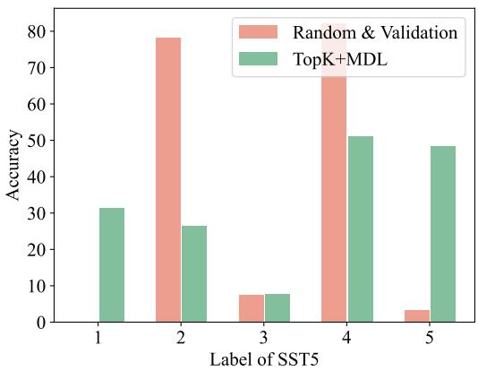  
Figure 1: Corpus-level method (red bar) is highly biased towards majority classes, given 8 in-context examples labeled as 2 5 4 4 4 1 2 3.

ICL contains two ingredients: some input-output pairs (i.e., in-context examples) and a template that wraps these examples into a natural language instruction. Extensive research has been carried out on searching for a better template (Gao et al., 2021; Shin et al., 2020; Sorensen et al., 2022; Deng et al., 2022). In contrast, very few efforts have been spent on searching for the best in-context example organization. 1 Recent work, however, has pointed out that the organization of in-context examples can have a significant influence on ICL’s performance (Lu et al., 2022; Liu et al., 2022; Rubin et al., 2022).

This paper fills this gap by proposing a framework for in-context example searching and ranking. While one can also trivially extend template searching methods to conduct in-context example searching, these methods operate at the corpuslevel. They first construct a small candidate template set using PLMs (Gao et al., 2021; Shin et al., 2020), data mining algorithms (Jiang et al., 2020), or by hands (Sorensen et al., 2022). After that, each candidate will be applied to the whole validation set for inference. According to validation performance, the best template will be adapted for testing. However, existing solutions have the following problems: (i) Their performance relies heavily on the availability of a large-scale high-quality validation set; (ii) Corpus-level methods can be sub-optimal (see Figure 1) because finding a universal template that suits all testing samples perfectly is unlikely. Such majority bias (Zhao et al., 2021) will significantly hurt user experience in practice and make corpus-level methods less robust.

To tackle these issues, we seek to construct a good-performing in-context example organization for each testing sample individually, without access to a validation dataset. This problem, namely self-adaptive in-context learning, is essentially an NP-hard combinatorial optimization problem that cannot be solved within polynomial time. We thus formulate it as a search problem and propose a general two-stage framework to cope with the issue of massive search space.

In the first stage, we apply heuristic rules (e.g., nearest neighbors based on semantic similarity) to filter candidate examples. Given a much smaller candidate set, we then apply algorithms to rank different organizations and look for the best-performing one. Our ranking algorithms are theoretically supported by the Minimal Description Length (MDL) principle and can shed light on why certain permutations are better than others.

Our contributions are summarized as follows:

• To the best of our knowledge, we are the first to formally define the problem of self-adaptive in-context learning and formulate it as a twostage search problem. We propose a general framework to address this problem.

• We achieve state-of-the-art performance using the proposed framework and outrun the previous best-performing methods by a large relative improvement. We also find that instancelevel ICL methods are generally more robust than corpus-level counterparts. Such empirical success shows a great promise of selfadaptive ICL.

• We conduct extensive analysis for selfadaptive ICL and make some exciting findings. For instance, in Section 6.3 we reveal that self-adaptive ICL still has much room for improvement. With better search methods, we might be able to close the gap between ICL and finetuning.

• We will open-source the proposed framework to facilitate future research. This unified framework enables researchers to identify important design choices in previous methods and paves the way for further improvements.

## 2 Related Work

Despite the surprising zero-shot performance of PLMs, recent works show that ICL can bring the performance to the next level. Augmenting PLMs with ICL achieves SOTA results on a wide range of NLP tasks, ranging from question answering (Joshi et al., 2017), information retrieval (Tay et al., 2022), math word problem (Cobbe et al., 2021), commonsense reasoning (Geva et al., 2021), and fact checking (Rae et al., 2021) etc. The instability of ICL, however, has encouraged researchers to explore methods that search for robust and high-performing prompts. These methods can be categorized as follows based on the target of searching/optimization:

Template search focuses on searching for the template that can guide PLM’s behavior and steer its best performance. Great advances have been made in template searching using various methods: PLMs (Gao et al., 2021), heuristic rules (Jiang et al., 2020; Shin et al., 2020; Prasad et al., 2022; Xu et al., 2022), reinforcement learning (Deng et al., 2022), genetic algorithms (Kumar and Talukdar, 2021), or by hands (Sorensen et al., 2022; Zhao et al., 2021). Nonetheless, all these methods require a high-quality validation set to do prompt selection or optimization. Unlike them, our framework does not require a validation set.

When the validation set is not available, researchers propose to search prompts using entropy (Lu et al., 2022) or mutual information (Sorensen et al., 2022). It’s worth mentioning that these two works and all aforementioned methods search at the corpus-level: they pick the bestperforming template with or without a validation set and then equally apply this template to all test examples during inference. However, corpus-level methods might be sub-optimal. If we consider the No Free Lunch Theorem, finding one single template that works well for all testing examples is nearly impossible.

In-context example search, unlike template search, is rarely explored in the literature despite that they also have a huge impact on ICL performance (Zhao et al., 2021; Lu et al., 2022). Lu et al. (2022) first propose a learning-free corpuslevel method for in-context example search. However, they only consider an impractical setting with only 4 examples and their 24 permutations $( ^ { 4 } P _ { 4 } = 4 ! = 2 4 )$ . Liu et al. (2022) find examples that are semantically similar to a test sample can serve as a good choice for its in-context examples. However, the reason why such a simple heuristic works is unclear. Su et al. (2022) extend this nearest neighbor search and further take the diversity of examples into consideration. Inspired by these methods, recent studies propose to learn to retrieve in-context examples (Rubin et al., 2022).

## 3 Problem formulation

Given a test sample $\left( \mathbf { x } , y \right)$ , the probability of generating the target $y$ using a casual PLM $\mathcal { P }$ can be formulated as follows:

$$
p ( y | \mathbf x ) = \mathcal { P } \left( \mathcal { V } ( y ) | c , \mathcal { T } ( \mathbf x ) \right) ,\tag{1}
$$

where $\tau ( \cdot )$ is the template used to wrap up inputs and $c = \mathcal { T } ( \mathbf { x } _ { 1 } ) , \cdot \cdot \cdot , \mathcal { T } ( \mathbf { x } _ { k } )$ is the context string concatenating k input-output examples. To deal with classification tasks, a verbalizer $\mathcal { V } ( \cdot )$ is introduced to map each label/class y to a word/words in ${ \mathcal P } \mathrm { { s } }$ vocabulary. Note that in a special scenario when $k = 0$ , ICL degenerates to zero-shot prompting (Ye et al., 2022; Brown et al., 2020b).

The goal of self-adaptive ICL is then to find an optimal organization of $c \in { \mathcal { C } }$ that can drive the correct y for each input x, and maximize the task performance. We formulate this as a combinatorial optimization problem.

## 4 Method

In this section, we propose a two-stage framework to tackle the problem of self-adaptive ICL.

## 4.1 Overview

In such a combinatorial optimization problem, an exhaustive search is not tractable. So we need specialized algorithms that can quickly rule out large parts of the search space. We present an overview of our selection-then-rank framework here: We first use a selection module to reduce the search space. One straightforward choice for pre-ranking would be to use nearest-neighbor algorithms to select examples that are semantically similar to test samples. The results are then fed into the ranking module, which picks the best combination and permutation according to information-theoretic-driven criteria.

## 4.2 Selection

The goal of selection module is to filter out large parts of “less useful” examples and construct a small candidate set to reduce the search space. We present various selection methods below.

TopK Liu et al. (2022) and Gao et al. (2021) observe that context examples that are closer to the test sample in the embedding space consistently give rise to stronger performance. This observation leads to the TopK method which uses the nearest neighbors of a given test sample as the corresponding in-context examples.

VoteK Although ICL was originally proposed for few-shot settings, they often require a large example set to achieve good performance. VoteK (Su et al., 2022) proposes to alleviate this problem by selecting diverse yet representative examples. Intuitively, VoteK is built upon TopK, but it increases diversity by penalizing examples similar to those already selected.

DPP Inspired by VoteK, we also experimented with the determinantal point process (DPP) based method, which is proposed for set selection problems where diversity is preferred. We refer readers to Kulesza and Taskar (2011) for details of DPP.

## 4.3 Ranking

With the candidates returned by the selection module, the goal of the ranking module is to determine the best organization among candidates. Our ranking algorithm is inspired by the compression viewpoint of Solomonoff’s general theory of inference (Solomonoff, 1964) and Minimum Description Length (MDL) principle (Grünwald, 2007) from information theory.

Both Solomonoff’s theory and the MDL formalize Occam’s razor and hold that a good model of data is a model that is good at losslessly compressing the data, including the cost of describing the model itself. These theories have led to advances in VAE (Kingma and Welling, 2013), and information bottleneck methods (Tishby and Zaslavsky, 2015). Inspired by the compression viewpoint of learning, we recast the problem of self-adaptive in-context learning into a similar paradigm. We assume that a good organization of in-context examples is the organization that is good at losslessly compressing testing samples. This allows us to give a clear optimization objective when searching for the best organization $c ^ { * }$ :

$$
\boldsymbol { c } ^ { * } = \underset { \boldsymbol { c } \in \mathbf { C } } { \arg \operatorname* { m i n } } \ L _ { \boldsymbol { \theta } } ( y | \boldsymbol { c } , \mathbf { x } ) + L ( \boldsymbol { \theta } ) ,\tag{2}
$$

where each c represents one possible organization of examples. $L _ { \theta } ( \mathbf { y } | c , \mathbf { x } )$ is the codelength required to compress and transmit testing label y given the organization c and testing input x. $L ( \theta )$ is the codelength required to describe the model, which can be ignored during ranking since all organizations use the same model without parameter updating. The codelength required for data transmission can be calculated using Shannon-Huffman code:

$$
L _ { \theta } ( y | c , { \bf x } ) = - l o g _ { 2 } p ( y | c , { \bf x } ) .\tag{3}
$$

However, since we don’t have access to testing label $y$ when ranking, the exact computation of $p ( \boldsymbol { y } | \boldsymbol { c } , \mathbf { x } )$ is impossible. To tackle this problem, we propose to compute the expectation of codelength as the surrogate:

$$
\begin{array} { r } { L _ { \theta } ( y | c , \mathbf { x } ) \approx - \mathbb { E } _ { q ( y _ { i } | Y ) } l o g _ { 2 } p ( y _ { i } | c , \mathbf { x } ) , } \end{array}\tag{4}
$$

where $q ( y _ { i } | Y )$ is the prior of $y _ { i }$ among all possible labels Y. A natural design choice of the prior is a uniform distribution, given that most datasets are label-balanced. However, since we focus on instance-level selection rather than corpus level, the likelihood $p ( y _ { i } | Y )$ can vary significantly given different samples. We thus model this term using $p ( y _ { i } | c , \mathbf { x } )$ , leading to our final objective:

$$
\boldsymbol { c } ^ { * } = \underset { \boldsymbol { c } \in \mathbf { C } } { \arg \operatorname* { m i n } } - \mathbb { E } _ { p ( y _ { i } \mid \boldsymbol { c } , \mathbf { x } ) } l o g _ { 2 } p ( y _ { i } | \boldsymbol { c } , \mathbf { x } ) .\tag{5}
$$

Now that we have an interpretable metric for ranking, we can brute-force all possible permutations to obtain the optimal ranking result. Although we have significantly reduced the search space using the selection module, enumerating all organizations is still infeasible. For instance, if we want to search for the best organization that contains 8 examples, even a small candidate set of 10 examples can result in 1.8 million choices $( \mathbf { A } _ { 1 0 } ^ { 8 } )$ . At the current stage, we randomly sample 10 permutations for ranking. We leave it as an interesting future work to investigate how to approximate the optimal ranking better.

## 4.4 Interpretation of $L _ { \theta } ( y | c , \mathbf { x } )$

Except for the compression viewpoint, we offer some other interpretations of our method here.

Connection to entropy When we use model confidence $p ( y _ { i } | c , \mathbf { x } )$ as the estimation of $q ( y _ { i } | Y )$ Eq 4 is basically calculating the entropy. Minimizing entropy is equivalent to searching for in-context examples that will lead to a skewed probability distribution. In other words, we are searching for in-context examples are will make PLMs very confident about its answer. This motivation is exactly opposite to the Local Entropy(LocalE) metric proposed by Lu et al. (2022), where they search by maximizing the entropy.

Connection to cross-entropy. Note that in this paper, we focus on instance level ICL and assume no validation set is available. However, when we have a validation set to directly compute $p ( \boldsymbol { y } | \boldsymbol { c } , \mathbf { x } )$ Eq 3 is exactly the categorical cross-entropy loss. Hence, trying to minimize the description length of the outputs is equivalent to minimizing the usual classification loss. This reveals why compression is another viewpoint of learning.

Connection to mutual information. Previous effort (Blier and Ollivier, 2018) has proved that the compression is limited by the mutual information between inputs and outputs:

$$
H ( y ) - \mathbb { E } _ { q } [ L ( y \mid x ) ] \le H ( y ) - H ( y \mid x ) = I ( y ; x ) ,
$$

where we assume the inputs and outputs follow the joint distribution $q .$ Based on this finding, any successful compression of the labels is, at the same time, a direct estimation of the mutual information between input and output. This connects our method to Sorensen et al. (2022) that selects templates by maximizing mutual information.

Difference to previous works. Except for the aforementioned connections and differences, our method significantly differs from Lu et al. (2022) and Sorensen et al. (2022) in that we perform instance-level selection without a validation set. Trivial extension of previous methods to our setting is impractical: Lu et al. (2022) requires a validation set to compute the Global Entropy, while the mutual information is always zero on instance-level setting according to Sorensen et al. (2022).

## 5 Experiments

## 5.1 Evaluation details

We perform experiments across eight different NLP datasets. Unless otherwise stated, all experiments are conducted using GPT2-XL (1.5B) (Radford et al., 2019). Our method is denoted as

TopK+MDL, in which we first use TopK to retrieve 30 candidates for each sample and then randomly sample 10 organizations (each with 8 examples) for ranking using MDL. All models and datasets are loaded from HuggingFace Hub. Templates are adopted from Ye et al. (2022); Gao et al. (2021) and detailed in Table 4. We ran all experiments three times with different random seeds and reported the average accuracies.

Datasets We consider two sentiment classification datasets (Socher et al., 2013): SST-2 and SST-5, three natural language inference datasets: SNLI (Bowman et al., 2015), MNLI (Williams et al., 2017), and QNLI (Wang et al., 2018), one multi-choice question answering dataset: Commonsense QA (CMS QA) (Talmor et al., 2019), two topic classification datasets: TREC (Hovy et al., 2001) and AgNews (Zhang et al., 2015).

Baselines We compare our framework with three groups of baselines: prompting, corpus-level methods, and instance-level methods. Prompting is a special case of ICL without in-context examples. For corpus-level methods, we consider two methods that require a validation set: GlobalIE (Lu et al., 2022) and Random & Validation, which picks 10 random organizations for each dataset and selects the best one according to the validation performance. We also consider validation-free baselines: Mutual Information (MI) (Sorensen et al., 2022) and a Random baseline that randomly initiates one organization for each dataset. For instancelevel methods, we consider TopK+LocalE (Lu et al., 2022), TopK (Liu et al., 2022) and a Random baseline that randomly selects 8 examples for each testing sample. We further add a Majority vote baseline that directly performs majority voting based on 8 examples retrieved by TopK.

Evaluation Strategy Due to the restricted test set access of some datasets (MNLI, QNLI, and CMS QA), we hold out a small subset (i.e., 10%) of the training set for validation for corpus-level methods, and report results on the validation set. For PROMPTING and instance-level methods, we directly evaluate them on the original validation set when the test set is not available.

## 5.2 Main Results

From Table 1, we first observe that ICL methods outperform prompting in most cases. However, we also note that bad in-context organizations (e.g., the random baseline) can hurt performance and make ICL performs even less well than prompting on SST-5. These results stress the importance of correct selection and permutation of in-context examples.

We first compare our methods with corpus-level methods. As shown in Table 1, our method shows consistent and clear superiority over corpus-level baselines. This result also validates our conjecture that corpus-level methods can be sub-optimal and self-adaptive in-context examples can significantly improve ICL performance. Remarkably, our method demonstrates a 40% relative improvement against the common practice in ICL (i.e., the Random baseline). Such improvement is encouraging as it shows that despite the surprising performance of ICL in many tasks, there is still a large room for improvement with advanced in-context example searching techniques.

Our method still registers decent improvements on most evaluated datasets even when compared with instance-level baselines. Compared with TopK+LocalE, our method makes a 17% relative improvement, this demonstrates the effectiveness of MDL as a ranking method.

However, we also notice that TopK is a very competitive baseline to our method. Using semantic search to retrieve examples will result in incontext examples whose input distribution and label are quite similar, or even identical, to the testing sample. This phenomenon leads to our hypothesis about the surprising effectiveness of TopK. First, as pointed out by Xie et al. (2021), ICL can be cast as an implicit Bayesian inference process, where the PLMs implicitly infer a concept when making the prediction. Based on this theoretic finding, we deduce that semantically similar in-context examples improve prediction by providing more evidence for Bayesian inference, especially for topic classification tasks like TREC and AgNews. Second, we conjecture that providing a series of examples with the same label as the testing sample introduces a “learning shortcut” for PLMs and biases the results. We further examine this hypothesis below.

## 5.3 Impact of label in ICL

To investigate the impact labels have on ICL, we calculate bias rate. Given a testing sample (x, y) and its in-context examples, the bias rate represents the percentage of in-context examples whose label is identical to y. As shown in Figure 2(a), the bias rate positively correlates with the performance. We conduct a more fine-grained exploration by corrupting the label space and breaking the input-label alignment. We corrupt the labels by exchanging label words between classes, e.g., exchanging label words between positive and negative classes in sentiment classification. As in Figure 2(a), we observe a clear performance drop with corrupted labels, which negatively correlates with the bias rate. These results suggest that in-context examples’ labels could significantly impact ICL performance. Recent debates (Min et al., 2022; Kim et al., 2022) on the effect of label distribution focus on corpus-level ICL, and our findings complement their studies.

<table><tr><td></td><td>SST-2</td><td>SST-5</td><td>SNLI</td><td>MNLI</td><td>QNLI</td><td>Trec</td><td>AgNews</td><td>CMS QA</td><td>AVG</td></tr><tr><td>Prompting</td><td>71.38</td><td>29.41</td><td>41.23</td><td>39.19</td><td>50.44</td><td>13.8</td><td>29.75</td><td>39.39</td><td>39.32 (52.99%↑)</td></tr><tr><td colspan="10">Corpus-level</td></tr><tr><td>Random</td><td>73.68</td><td>23.88</td><td>43.35</td><td>39.43</td><td>53.19</td><td>19.66</td><td>36.92</td><td>52.66</td><td>42.78 (40.41%↑)</td></tr><tr><td>Random &amp; Validation</td><td>87.86</td><td>40.10</td><td>49.27</td><td>43.26</td><td>51.12</td><td>32.67</td><td>52.01</td><td>53.75</td><td>51.25 (17.38%↑)</td></tr><tr><td>MI (Sorensen et al., 2022)</td><td>52.86</td><td>35.35</td><td>46.02</td><td>41.32</td><td>50.62</td><td>16.00</td><td>47.29</td><td>52.78</td><td>42.85 (40.63%↑)</td></tr><tr><td>GlobalE (Lu et al., 2022)</td><td>87.27</td><td>33.21</td><td>46.99</td><td>40.46</td><td>57.27</td><td>28.53</td><td>52.01</td><td>22.42</td><td>49.75 (20.92%↑)</td></tr><tr><td colspan="10">Instance-level</td></tr><tr><td>Random</td><td>77.17</td><td>25.65</td><td>43.41</td><td>41.17</td><td>53.09</td><td>18.33</td><td>32.71</td><td>52.93</td><td>43.06 (39.72%↑)</td></tr><tr><td>TopK (Liu et al., 2022)</td><td>83.91</td><td>37.01</td><td>57.54</td><td>45.72</td><td>59.72</td><td>40.80</td><td>88.89</td><td>51.51</td><td>58.14 (3.48%↑)</td></tr><tr><td>Majority vote</td><td>85.34</td><td>41.58</td><td>52.06</td><td>34.38</td><td>58.02</td><td>51.60</td><td>60.91</td><td>19.57</td><td>50.43 (19.29%↑)</td></tr><tr><td>TopK+LocalE (Lu et al., 2022)</td><td>67.12</td><td>31.65</td><td>46.78</td><td>41.51</td><td>52.66</td><td>36.20</td><td>81.88</td><td>53.07</td><td>51.36 (17.17%↑)</td></tr><tr><td>Ours (TopK+MDL)</td><td>91.51</td><td>40.27</td><td>58.77</td><td>46.56</td><td>61.43</td><td>42.47</td><td>87.94</td><td>53.15</td><td>60.16</td></tr></table>

Table 1: Evaluation results. Numbers in bold indicate the highest accuracy among all methods (except Majority vote). Numbers in the parenthesis represent the relative improvements our method achieved over baselines.

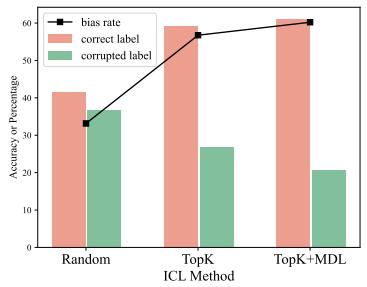  
(a)

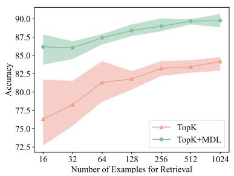  
(b)

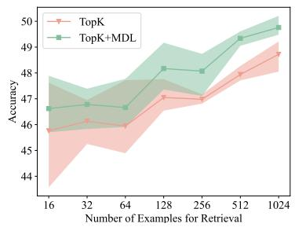  
(c)  
Figure 2: (a) Impact of the label in ICL. The bias rate reflects the percentage of in-context examples whose label is identical to the testing sample. (b) Few-shot results on SST2. (c) Few-shot results on SNLI.

## 6 Analysis

The observed benefits of our method raise the natural question of why and how it helps and whether the same performance improvements can be transferred to other PLMs or prompts. In this section, we conduct comprehensive experiments and analyses to understand the strength and weaknesses of our method.

## 6.1 When a large set of annotated examples is not available

Despite the surprising performance of ICL, a largescale training set is not always available for retrieval in practice. To address this concern, we conduct experiments under the few-shot setting. We randomly sample 16, 32, 64, 128, 256, 512, and 1024 examples as the candidates for searching. We select two representative tasks (SST2 and SNLI) for evaluation and run each experiment three times with different random seeds.

As shown in Figure 2(b) and 2(c), our method consistently outperforms the strong baseline TopK as in the full-data setting. This demonstrated the general applicability of our method in both full-data and few-shot scenarios. We also observe that the performance steadily increases with the growing number of annotated examples.

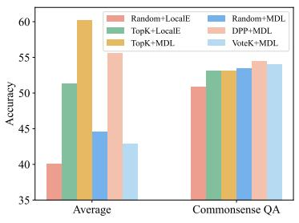  
(a)

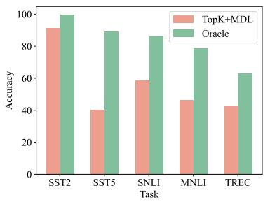  
(b)

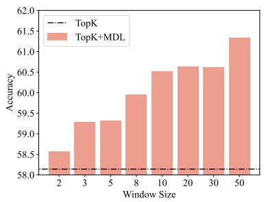  
(c)

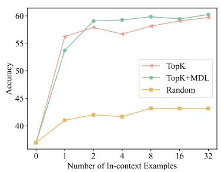  
(d)

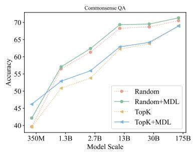  
(e)

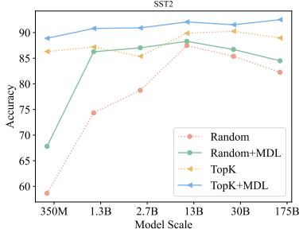  
(f)  
Figure 3: (a) impact of different selection methods. (b) the accuracy of our ranking method. (c) impact of window size(number of permutations to be ranked). (d) impact of the number of in-context examples. (e,f) impact of mode scales on Commonsense QA and SST2.

## 6.2 Impact of selection methods

We conduct most experiments using the popular TopK method for candidate example selection. Here we evaluate three other alternatives: random, DPP and VoteK. Figure 3(a) shows that using TopK for example selection outperforms all other alternatives on average. However, we also observe that the superiority of TopK is mainly in simple classification tasks with limited label space. On multi-choice tasks like Commonsense QA, all three alternatives outperform TopK (right side of Figure 3(a)). Note that although multi-choice tasks are also classification tasks, they have a huge label space like NLG tasks. The frustration of TopK on multi-choice tasks suggests that the popular TopK method does not work well for tasks with large label space and searching for better selection methods holds immense prospects, and therefore remains an interesting field of further research.

## 6.3 Accuracy of ranking method

In our ranking module, we randomly select 10 different organizations for each testing sample and use MDL to select the best-performing one in an unsupervised manner. Despite the superior performance of MDL, the accuracy of using MDL for in-context example ranking has not been discussed.

<table><tr><td>Dataset</td><td>TopK</td><td>TopK+MDL</td><td>TopK+LocalE</td><td>Random</td></tr><tr><td>SST-2</td><td>0.6861(83.91)</td><td>0.6810(91.51)</td><td>0.6928(67.12)</td><td>0.6918(77.17)</td></tr><tr><td>SNLI</td><td>1.0981(57.54)</td><td>1.0929(58.77)</td><td>1.0983(46.78)</td><td>1.0974(43.41)</td></tr><tr><td>CMS QA</td><td>4.9883(51.51)</td><td>4.9371(53.15)</td><td>4.9692(53.07)</td><td>4.9629(52.93)</td></tr><tr><td>Trec</td><td>5.5618(40.80)</td><td>5.4496(42.47)</td><td>5.7434(36.20)</td><td>5.7859(18.33)</td></tr></table>

Table 2: Average MDL of each method.

To understand the ranking accuracy of MDL, we assume a perfect ranking method oracle, which can always select the organization that leads to correct prediction if there is any. In the implementation, we first obtain predictions for all 10 organizations. If at least one prediction matches the ground truth, we consider this testing example solvable by oracle. As shown in Figure 3(b), there are significant performance gaps between oracle and TopK+MDL. Although such oracle performance only exists theoretically, it’s still encouraging to see the enormous promise of ICL: with better selection and ranking methods (e.g., supervised methods (Rubin et al., 2022)), we might be able to bridge the performance gap between ICL and finetuning.

We investigate the correlation between MDL and accuracy by selecting four representative datasets and reporting the MDL of each method. As shown in Table 2, a smaller MDL generally indicates a higher accuracy (in the brackets). This validates the effectiveness of MDL as the criterion for incontext example searching. It’s also interesting to see that tasks with lower MDL are generally easier to learn (as explained in § 4.3), thus ICL has a better performance.

## 6.4 Impact of hyperparameter

In this subsection, we investigate how different hyperparameters affect our performance.

Increasing the window size of our method can steadily boost performance, by trading efficiency for better performance. We vary window size (i.e., number of organizations to be ranked per sample) from 2 to 50, and report the average accuracy. As shown in Figure 3(c), the performance steadily increases with the window size. We even observe gains when the window size is two. In particular, on tasks with short input lengths like SST2, using a window size of 2 already shows a clear gain (+3.19 in accuracy) over TopK. However, the improvement is achieved by sacrificing efficiency, i.e., window size hits 50 means performing forward passing for the test set 50 times. Together with findings above, we conclude that we must keep improving the accuracy of ranking methods to achieve a better efficiency-effectiveness trade-off.

Increasing the number of in-context examples boosts accuracy for most tasks. We gradually increase the number of in-context examples (denoted as N) from 0 (prompting) to 32. From Figure 3(d), we see that increasing N consistently improves the performance on average. We also note that the random baseline reaches the performance plateau from N = 8. Such contradictions suggest that when analyzing the impact of N, the organization of examples is critical. Sometimes we find increasing N not helpful because we are not using the “right” organization. Our results raise an interesting question for future research: can we achieve finetuning-level performance by using thousands or even more examples as context?

Larger model size does not guarantee better performance, but our method can bring consistent improvements over strong baselines. We use OPT and vary the model size from 350M to 175B. We have a mixed observation that blindly applying huge models does not always result in the best performance. For simple tasks like SST2 (see Figure 3(f)), we reach the performance plateau after 1.3B. And for SNLI, a 30B OPT even outperforms the 175B counterpart. Large models are powerful when dealing with complex tasks like Commonsense QA. From Figure 3(e), we can see steady and significant improvement whenever we scale up the model size. In addition, our method brings consistent improvements over baselines regardless of model sizes on all tasks evaluated.

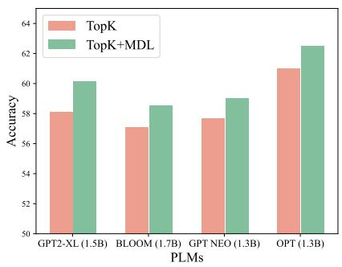  
Figure 4: The average performance of TopK and our method on different PLMs.

## 6.5 Robustness

Generability across different PLMs. We explore how our method generalizes between different PLMs. We average our results across datasets and present the results in Figure 4. On four different PLMs tested, our method consistently and significantly outperforms the strong TopK baseline. Overall, we have observed that our method is robust across various datasets and PLMs.

Generability across different prompts. As sensitivity to prompt engineering is a key weakness of ICL, we evaluate the robustness of our method given different templates. We select two representative tasks (i.e., SST2 and SNLI) to conduct experiments, each with three different templates. As shown in Figure 5, our method is robust given different prompting templates. But still, the differences in prompting templates cause large variances in performance. The findings here motivate a line of research that simultaneously searches for the best template and in-context organization, which is rarely explored in the literature.

## 7 Conclusion

This paper proposes a new paradigm for ICL: selfadaptive ICL. Unlike existing efforts that universally use one single example organization on all testing samples, we propose a general two-stage select-then-rank framework to search in-context examples at the instance-level. We instantiate this framework with an information-theory-driven ranking algorithm. Empirical results suggest that selfadaptive in-context learning can significantly outperform the common practice in ICL by a large margin. We reveal the great potential of self-adaptive in-context learning and point out several interesting research problems in method analysis.

## 8 Limitation

Despite the demonstrated effectiveness of selfadaptive ICL, this new paradigm suffers from the following limitations. (I) As we discussed in § 6.4, due to the large search space, we need to trade efficiency for effectiveness. So how to balance the efficiency-effectiveness trade-off is an important decision choice to make when deploying selfadaptive ICL methods. (II) As shown in § 6.1, the gains of our method shrink when the size of the retrieval set gets smaller. To maximize performance, we require a high-quality retrieval set, which might not always be available when dealing with unseen tasks in practice. We also note that both limitations can be alleviated with better selection and ranking algorithms.

The remarkable performance of our method should partially attribute to the powerful TopK selection method, so we also discuss the limitation of TopK here. Despite its popularity, our analysis (§ 6.2) reveals that TopK’s effectiveness is limited to simple NLU tasks with limited label space, and it does not work well with tasks with large or even infinite label space (QA, multi-choice, and NLG). This limitation signals a new direction for ICL research: we need better selection methods to adapt ICL methods to more tasks.

## 9 Acknowledgement

Yaoxiang, Zhiyong, and Jiacheng participate in coding and discussion. Yaoxiang and Zhiyong conduct the evaluation and analysis. Zhiyong leads the project and writes this manuscript. We want to thank members of Shark-NLP and reviewers for their valuable feedback.

## References

Léonard Blier and Yann Ollivier. 2018. The description length of deep learning models. Advances in Neural Information Processing Systems, 31.

Samuel R Bowman, Gabor Angeli, Christopher Potts, and Christopher D Manning. 2015. A large annotated corpus for learning natural language inference. arXiv preprint arXiv:1508.05326.

Tom Brown, Benjamin Mann, Nick Ryder, Melanie Subbiah, Jared D Kaplan, Prafulla Dhariwal, Arvind Neelakantan, Pranav Shyam, Girish Sastry, Amanda Askell, et al. 2020a. Language models are few-shot learners. Advances in neural information processing systems, 33:1877–1901.

Tom Brown, Benjamin Mann, Nick Ryder, Melanie Subbiah, Jared D Kaplan, Prafulla Dhariwal, Arvind Neelakantan, Pranav Shyam, Girish Sastry, Amanda Askell, et al. 2020b. Language models are few-shot learners. Advances in neural information processing systems, 33:1877–1901.

Karl Cobbe, Vineet Kosaraju, Mohammad Bavarian, Jacob Hilton, Reiichiro Nakano, Christopher Hesse, and John Schulman. 2021. Training verifiers to solve math word problems. arXiv preprint arXiv:2110.14168.

Mingkai Deng, Jianyu Wang, Cheng-Ping Hsieh, Yihan Wang, Han Guo, Tianmin Shu, Meng Song, Eric P Xing, and Zhiting Hu. 2022. Rlprompt: Optimizing discrete text prompts with reinforcement learning. arXiv preprint arXiv:2205.12548.

Tianyu Gao, Adam Fisch, and Danqi Chen. 2021. Making pre-trained language models better few-shot learners. In Proceedings of the 59th Annual Meeting of the Association for Computational Linguistics and the 11th International Joint Conference on Natural Language Processing (Volume 1: Long Papers), pages 3816–3830.

Mor Geva, Daniel Khashabi, Elad Segal, Tushar Khot, Dan Roth, and Jonathan Berant. 2021. Did aristotle use a laptop? a question answering benchmark with implicit reasoning strategies. Transactions ofthe Associationfor Computational Linguistics, 9:346–361.

Peter D Grünwald. 2007. The minimum description length principle. MIT press.

Eduard Hovy, Laurie Gerber, Ulf Hermjakob, Chin-Yew Lin, and Deepak Ravichandran. 2001. Toward semantics-based answer pinpointing. In Proceedings ofthe First International Conference on Human Language Technology Research.

Zhengbao Jiang, Frank F Xu, Jun Araki, and Graham Neubig. 2020. How can we know what language models know? Transactions of the Association for Computational Linguistics, 8:423–438.

Mandar Joshi, Eunsol Choi, Daniel S Weld, and Luke Zettlemoyer. 2017. Triviaqa: A large scale distantly supervised challenge dataset for reading comprehension. In Proceedings of the 55th Annual Meeting of the Association for Computational Linguistics (Volume 1: Long Papers), pages 1601–1611.

Junyeob Kim, Hyuhng Joon Kim, Hyunsoo Cho, Hwiyeol Jo, Sang-Woo Lee, Sang-goo Lee, Kang Min Yoo, and Taeuk Kim. 2022. Ground-truth labels matter: A deeper look into input-label demonstrations. arXiv preprint arXiv:2205.12685.

Diederik P Kingma and Max Welling. 2013. Autoencoding variational bayes. arXiv preprint arXiv:1312.6114.

Alex Kulesza and Ben Taskar. 2011. k-dpps: Fixedsize determinantal point processes. In ICML.

Sawan Kumar and Partha Talukdar. 2021. Reordering examples helps during priming-based few-shot learning. In Findings of the Association for Computational Linguistics: ACL-IJCNLP 2021, pages 4507–4518.

Jiachang Liu, Dinghan Shen, Yizhe Zhang, William B Dolan, Lawrence Carin, and Weizhu Chen. 2022. What makes good in-context examples for gpt-3? In Proceedings of Deep Learning Inside Out (Dee-LIO 2022): The 3rd Workshop on Knowledge Extraction and Integrationfor Deep Learning Architectures, pages 100–114.

Yao Lu, Max Bartolo, Alastair Moore, Sebastian Riedel, and Pontus Stenetorp. 2022. Fantastically ordered prompts and where to find them: Overcoming few-shot prompt order sensitivity. In Proceedings of the 60th Annual Meeting of the Association for Computational Linguistics (Volume 1: Long Papers), pages 8086–8098.

Sewon Min, Xinxi Lyu, Ari Holtzman, Mikel Artetxe, Mike Lewis, Hannaneh Hajishirzi, and Luke Zettlemoyer. 2022. Rethinking the role of demonstrations: What makes in-context learning work? arXiv preprint arXiv:2202.12837.

Archiki Prasad, Peter Hase, Xiang Zhou, and Mohit Bansal. 2022. Grips: Gradient-free, edit-based instruction search for prompting large language models. arXiv preprint arXiv:2203.07281.

Alec Radford, Jeffrey Wu, Rewon Child, David Luan, Dario Amodei, and Ilya Sutskever. 2019. Language models are unsupervised multitask learners.

Jack W Rae, Sebastian Borgeaud, Trevor Cai, Katie Millican, Jordan Hoffmann, Francis Song, John Aslanides, Sarah Henderson, Roman Ring, Susannah Young, et al. 2021. Scaling language models: Methods, analysis & insights from training gopher. arXiv preprint arXiv:2112.11446.

Ohad Rubin, Jonathan Herzig, and Jonathan Berant. 2022. Learning to retrieve prompts for in-context learning. arXiv preprint arXiv:2112.08633.

Taylor Shin, Yasaman Razeghi, Robert L Logan IV, Eric Wallace, and Sameer Singh. 2020. Autoprompt: Eliciting knowledge from language models with automatically generated prompts. In Proceedings of

the 2020 Conference on Empirical Methods in Natural Language Processing (EMNLP), pages 4222– 4235.

Richard Socher, Alex Perelygin, Jean Wu, Jason Chuang, Christopher D. Manning, Andrew Y. Ng, and Christopher Potts. 2013. Recursive deep models for semantic compositionality over a sentiment treebank. In Proceedings of the 2013 Conference on Empirical Methods in Natural Language Processing, EMNLP 2013, 18-21 October 2013, Grand Hyatt Seattle, Seattle, Washington, USA, A meeting of SIGDAT, a Special Interest Group of the ACL, pages 1631–1642. ACL.

Ray J Solomonoff. 1964. A formal theory of inductive inference. part i. Information and control, 7(1):1– 22.

Taylor Sorensen, Joshua Robinson, Christopher Rytting, Alexander Shaw, Kyle Rogers, Alexia Delorey, Mahmoud Khalil, Nancy Fulda, and David Wingate. 2022. An information-theoretic approach to prompt engineering without ground truth labels. In Proceedings of the 60th Annual Meeting of the Association for Computational Linguistics (Volume 1: Long Papers), pages 819–862.

Hongjin Su, Jungo Kasai, Chen Henry Wu, Weijia Shi, Tianlu Wang, Jiayi Xin, Rui Zhang, Mari Ostendorf, Luke Zettlemoyer, Noah A Smith, et al. 2022. Selective annotation makes language models better fewshot learners. arXiv preprint arXiv:2209.01975.

Alon Talmor, Jonathan Herzig, Nicholas Lourie, and Jonathan Berant. 2019. Commonsenseqa: A question answering challenge targeting commonsense knowledge. In Proceedings of the 2019 Conference of the North American Chapter of the Association for Computational Linguistics: Human Language Technologies, Volume 1 (Long and Short Papers), pages 4149–4158.

Yi Tay, Vinh Q Tran, Mostafa Dehghani, Jianmo Ni, Dara Bahri, Harsh Mehta, Zhen Qin, Kai Hui, Zhe Zhao, Jai Gupta, et al. 2022. Transformer memory as a differentiable search index. arXiv preprint arXiv:2202.06991.

Naftali Tishby and Noga Zaslavsky. 2015. Deep learning and the information bottleneck principle. In 2015 ieee information theory workshop (itw), pages 1–5. IEEE.

Alex Wang, Amanpreet Singh, Julian Michael, Felix Hill, Omer Levy, and Samuel Bowman. 2018. Glue: A multi-task benchmark and analysis platform for natural language understanding. In Proceedings of the 2018 EMNLP Workshop BlackboxNLP: Analyzing and Interpreting Neural Networks for NLP, pages 353–355.

Jason Wei, Yi Tay, Rishi Bommasani, Colin Raffel, Barret Zoph, Sebastian Borgeaud, Dani Yogatama, Maarten Bosma, Denny Zhou, Donald Metzler, et al.

<table><tr><td>Dataset</td><td>Task</td><td>Data Split</td></tr><tr><td>SST-2</td><td>Sentiment Classification</td><td>6920/872/1821/</td></tr><tr><td>SST-5</td><td>Sentiment Classification</td><td>8544/1101/2210</td></tr><tr><td>SNLI</td><td>Natural Language Inference</td><td>550152/10000/10000</td></tr><tr><td>MNLI</td><td>Natural Language Inference</td><td>392702/19647/19643</td></tr><tr><td>QNLI</td><td>Natural Language Inference</td><td>104743/5463/5463</td></tr><tr><td>Trec</td><td>Topic Classification</td><td>5452/0/500</td></tr><tr><td>AgNews</td><td>Topic Classification</td><td>120000/0/7600</td></tr><tr><td>CMS QA</td><td>Commonsense Question Answering</td><td>9471/1221/1140</td></tr></table>

Table 3: Details of datasets.

2022. Emergent abilities of large language models.   
arXiv preprint arXiv:2206.07682.

Adina Williams, Nikita Nangia, and Samuel R Bowman. 2017. A broad-coverage challenge corpus for sentence understanding through inference. arXiv preprint arXiv:1704.05426.

Sang Michael Xie, Aditi Raghunathan, Percy Liang, and Tengyu Ma. 2021. An explanation of in-context learning as implicit bayesian inference. arXiv preprint arXiv:2111.02080.

Hanwei Xu, Yujun Chen, Yulun Du, Nan Shao, Yanggang Wang, Haiyu Li, and Zhilin Yang. 2022. Zeroprompt: Scaling prompt-based pretraining to 1,000 tasks improves zero-shot generalization. arXiv preprint arXiv:2201.06910.

Jiacheng Ye, Jiahui Gao, Qintong Li, Hang Xu, Jiangtao Feng, Zhiyong Wu, Tao Yu, and Lingpeng Kong. 2022. Zerogen: Efficient zero-shot learning via dataset generation. arXiv preprint arXiv:2202.07922.

Xiang Zhang, Junbo Zhao, and Yann LeCun. 2015. Character-level convolutional networks for text classification. Advances in neural information processing systems, 28.

Zihao Zhao, Eric Wallace, Shi Feng, Dan Klein, and Sameer Singh. 2021. Calibrate before use: Improving few-shot performance of language models. In International Conference on Machine Learning, pages 12697–12706. PMLR.

## A Datasets

Dataset information is detailed in Table 3.

## B Impact of hyperparameters

The results of adjusting the number of in-context examples and window size are shown in Figure 6 and 7, respectively.

## C Templates

The templates used in this paper are detailed in Table 4.

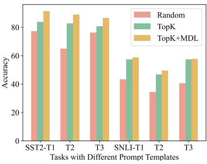  
Figure 5: Results of TopK and our method on SST2 and SNLI, using different prompts.

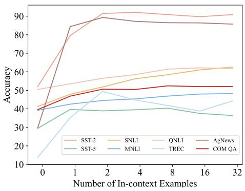  
Figure 6: Impact of number of in-context examples.

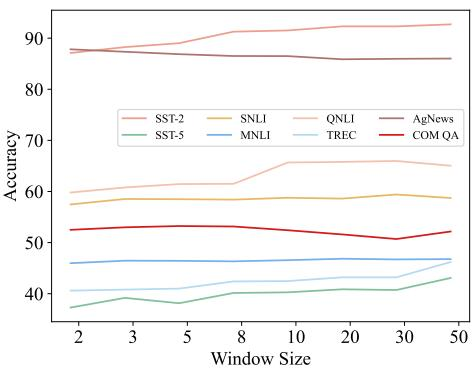  
Figure 7: Evaluation results with different window sizes (number of permutations to be ranked).

<table><tr><td>Task</td><td>Prompt</td><td>Class</td></tr><tr><td rowspan="2">SST-2</td><td>Positive Movie Review:  $\ " { < } \mathbf { X } > "$ </td><td>Positive</td></tr><tr><td>Negative Movie Review:  $" < \mathbf { X } > "$ </td><td>Negative</td></tr><tr><td rowspan="4">SST-5</td><td> $\ " < \mathbf { X } > "$  It is terrible.</td><td>Very Negative</td></tr><tr><td> $\ " < \mathbf { X } > "$  It is bad.</td><td>Negative</td></tr><tr><td> $\ " { < } \mathrm { X } { > } " \mathrm { I t i s } \mathrm { O K } .$ </td><td>Neutral</td></tr><tr><td> $\ " < \mathbf { X } > "$  It is good.  $\ " < \mathbf { X } > "$  It is great.</td><td>Positive</td></tr><tr><td rowspan="3">SNLI &amp; MNLI</td><td> $< X 1 > ? \mathrm { Y e s } , < X 2 >$ </td><td>Very Positive Entailment</td></tr><tr><td> $< \mathrm { X 1 > ? ~ M a y b e } , < \mathrm { X 2 } >$ </td><td>Neutral</td></tr><tr><td> $\mathrm { < X 1 > ? } ~ \mathrm { N o } , \mathrm { < X 2 > }$ </td><td>Contradiction</td></tr><tr><td rowspan="2">QNLI</td><td>&lt;C&gt; Can we know &lt;X&gt;? Yes.</td><td>Entailment</td></tr><tr><td>&lt;C&gt; Can we know &lt;X&gt;? No.</td><td>Contradiction</td></tr><tr><td rowspan="6">TREC</td><td> $\ " < \mathbf { X } > "$  It is about abbreviation.</td><td>ABBR</td></tr><tr><td> $\ " < \mathbf { X } > "$  It is about entity.</td><td>ENTY</td></tr><tr><td> $\ " < \mathbf { X } > "$  It is about description and abstract concept.</td><td>DESC</td></tr><tr><td> $\ " < \mathbf { X } > "$  It is about human being.</td><td>HUM</td></tr><tr><td> $\ " < \mathbf { X } > "$  It is about location.</td><td>LOC</td></tr><tr><td> $\ " < \mathbf { X } > "$  It is about numeric value.</td><td>NUM</td></tr><tr><td rowspan="4">AgNews</td><td> $\ " < \mathbf { X } > "$  It is about world.</td><td>World</td></tr><tr><td> $\ " < \mathbf { X } > "$  It is about sports.</td><td>Sports</td></tr><tr><td> $\ " < \mathbf { X } > "$  It is about business.</td><td>Business</td></tr><tr><td> $\ " < \mathbf { X } > "$  It is about science and technology.</td><td>Sci/Tech</td></tr><tr><td rowspan="5">Commonsense QA</td><td>Answer the following question: &lt;X&gt; Answer:  ${ \mathrm { < A > } } .$ </td><td>A</td></tr><tr><td>Answer the following question: &lt;X&gt; Answer: &lt;B&gt;.</td><td>B</td></tr><tr><td>Answer the following question: &lt;X&gt; Answer:  ${ \mathrm { - C } } { \mathrm { > } } .$ </td><td>C</td></tr><tr><td>Answer the following question: &lt;X&gt; Answer: &lt;D&gt;.</td><td>D</td></tr><tr><td>Answer the following question: &lt;X&gt; Answer: &lt;E&gt;.</td><td>E</td></tr></table>

Table 4: Templates of tasks. Placeholders $( \mathrm { e . g . , < X > }$ and ${ < } \mathsf { A } > )$ will be replaced by real inputs or answers (in Commonsense QA).

## A For every submission:

✓ A1. Did you describe the limitations of your work? section 8

✓ A2. Did you discuss any potential risks of your work? section 8, section 5.3, and section 1.

✓ A3. Do the abstract and introduction summarize the paper’s main claims? section 1

✗ A4. Have you used AI writing assistants when working on this paper? Left blank.

## B ✓ Did you use or create scientific artifacts?

abstract, section 5.1

✓ B1. Did you cite the creators of artifacts you used? section 5.1

✗ B2. Did you discuss the license or terms for use and / or distribution of any artifacts? The license will be discussed with the code base release after the anonymity period.

✓ B3. Did you discuss if your use of existing artifact(s) was consistent with their intended use, provided that it was specified? For the artifacts you create, do you specify intended use and whether that is compatible with the original access conditions (in particular, derivatives of data accessed for research purposes should not be used outside of research contexts)? abstract

 B4. Did you discuss the steps taken to check whether the data that was collected / used contains any information that names or uniquely identifies individual people or offensive content, and the steps taken to protect / anonymize it? Not applicable. Left blank.

 B5. Did you provide documentation of the artifacts, e.g., coverage of domains, languages, and linguistic phenomena, demographic groups represented, etc.? Not applicable. Left blank.

✓ B6. Did you report relevant statistics like the number of examples, details of train / test / dev splits, etc. for the data that you used / created? Even for commonly-used benchmark datasets, include the number of examples in train / validation / test splits, as these provide necessary context for a reader to understand experimental results. For example, small differences in accuracy on large test sets may be significant, while on small test sets they may not be. Appendix A

## C ✗ Did you run computational experiments?

Left blank.

 C1. Did you report the number of parameters in the models used, the total computational budget (e.g., GPU hours), and computing infrastructure used? No response.

 C2. Did you discuss the experimental setup, including hyperparameter search and best-found hyperparameter values? No response.

 C3. Did you report descriptive statistics about your results (e.g., error bars around results, summary statistics from sets of experiments), and is it transparent whether you are reporting the max, mean, etc. or just a single run? No response.

 C4. If you used existing packages (e.g., for preprocessing, for normalization, or for evaluation), did you report the implementation, model, and parameter settings used (e.g., NLTK, Spacy, ROUGE, etc.)? No response.

D ✗ Did you use human annotators (e.g., crowdworkers) or research with human participants? Left blank.

 D1. Did you report the full text of instructions given to participants, including e.g., screenshots, disclaimers of any risks to participants or annotators, etc.? No response.

 D2. Did you report information about how you recruited (e.g., crowdsourcing platform, students) and paid participants, and discuss if such payment is adequate given the participants’ demographic (e.g., country of residence)? No response.

 D3. Did you discuss whether and how consent was obtained from people whose data you’re using/curating? For example, if you collected data via crowdsourcing, did your instructions to crowdworkers explain how the data would be used? No response.

 D4. Was the data collection protocol approved (or determined exempt) by an ethics review board? No response.

 D5. Did you report the basic demographic and geographic characteristics of the annotator population that is the source of the data? No response.