# Sequence Parallelism: Long Sequence Training from System Perspective

Shenggui Li, Fuzhao Xue∗, Chaitanya Baranwal, Yongbin Li, Yang You School of Computing, National University of Singapore somerlee.9@gmail.com, f.xue@u.nus.edu

## Abstract

Transformer achieves promising results on various tasks. However, self-attention suffers from quadratic memory requirements with respect to the sequence length. Existing work focuses on reducing time and space complexity from an algorithm perspective. In this work, we propose sequence parallelism, a memory-efficient paral lelism to solve this issue from system perspective instead. Our approach is compatible with most existing parallelisms (e.g., data, pipeline, and tensor parallelism), which means our sequence parallelism makes 4D parallelism possible. More importantly, we no longer require a single device to hold the whole sequence. Besides, using efficient attention with linear complexity, our sequence parallelism enables us to train transformer with infinite long sequence. Specifically, we split the input sequence into multiple chunks and feed each chunk into its corresponding device (i.e., GPU). To compute the attention output, we integrated ring-style communication with self-attention calculation and proposed Ring Self-Attention (RSA). Experiments show that sequence parallelism performs well when scaling with batch size and sequence length. Compared with tensor parallelism, our approach achieved 13.7 and 3.0 maximum batch size and sequence length respectively when scaling up to 64 NVIDIA P100 GPUs. With efficient attention, sequence can handle sequence with over 114K tokens, which is over 27 longer than existing efficient attention works holding the whole sequence on a single device.

## 1 Introduction

Transformer-based language models (Radford et al., 2019; Brown et al., 2020; Devlin et al., 2018) have achieved impressive performance on various natural language understanding and generation tasks (e.g., Q&A (Qu et al., 2019; Yang et al., 2020), relation extraction (Xue et al., 2020b,a; Zhou et al.,

2020) and dialogue system (Ni et al., 2021)). Recently, Transformer also achieved promising results on computer vision tasks (Dosovitskiy et al., 2020; Zhang et al., 2020, 2021) and even on bioinformatics tasks (Elnaggar et al., 2020; Wang et al., 2021). These Transformer-based models learn powerful context-aware representation by applying self-attention to all pairs of tokens from the input sequence. This mechanism captures longterm dependencies at the token level for sequence modeling. However, self-attention suffers from quadratic memory requirements with respect to sequence length. Existing works focusing on long sequence modeling devote to solve this problem from algorithm perspective. That is, these works mainly try to reduce the time and space complexity of attention. In this paper, we focus on solving the long sequence training problem from system perspective. Existing system requires us to hold the whole sequence in one GPU, which limits the length of input sequence. Unfortunately, the long sequence is common in real-world applications. For instance, when we train Transformer for medical image classification, each image is much larger than it is in usual $( e . g . , 5 1 2 \times 5 1 2 \times 5 1 2 \mathrm { v s } 2 5 6 \times 2 5 6 \times 3 )$ . Then, each medical image has much more tokens (i.e., over 512 ). Each input sequence is much longer than usual. In this case, it is challenging to hold the whole sequence within single GPU.

In this paper, we designed and implemented sequence parallelism, which aims at breaking the limitation that we must store the whole sequence in one GPU. The proposed system can train transformerbased models with longer sequences and a larger batch size. Specifically, we first split the input sequence into multiple chunks along the sequence dimension and feed each sub-sequence chunk to one corresponding GPU. Each GPU thus only holds a part of the full sequence, i.e., a sub-sequence. To apply self-attention to the tokens from different chunks, the main challenge is to compute attention scores and outputs across GPUs efficiently. To tackle this problem, we proposed Ring Self-Attention (RSA), which circulates key and value embeddings across GPUs in a ring manner. In this case, each device is just required to keep the attention embeddings corresponding to its own subsequence. As a result, our sequence parallelism is memory-efficient, especially for long input sequences.

To model long sequences, existing works mainly focus on efficient attention (e.g., (Zaheer et al., 2020)) with linear instead of quadratic space complexity. In this paper, we aim to solve the long sequence modeling problem from the distributed system perspective. We evaluated our system on both vanilla attention to verify our system is a general solution, and evaluated on efficient attention setting to show the upper bound sequence length. Existing pipeline parallelism (Huang et al., 2018) and tensor parallelism (Shoeybi et al., 2019)) are designed to cope with a larger model size instead of longer sequences. However, when the sequence is long, the challenge is, existing parallelism must keep the whole sequence on one single device. Even if splitting model along hidden and attention-head dimension $( i . e .$ , tensor parallelism) or depth dimension (i.e., pipeline parallelism) can still process longer sequences to some extent, the attention-head and depth are much smaller than sequence length (e.g., 12 vs 512), which limits the training scalability and the maximum length of the input sequence. In contrast, our approach splits the whole sequence into multiple devices, enabling it to fit longer input data.

In summary, our main contributions are three folds:

• Our system breaks the length limitation of Transformer model training. Sequence parallelism splits long sequences into multiple chunks and feeds them into different devices. It is memory-efficient because each device only keeps the attention embeddings corresponding to its own sub-sequences. With linear space complexity attention, sequence parallelism can help us train the attention model with infinite long sequences.

• To our best knowledge, our work first proposed to use distributed system to handle long sequence training for attention-based models. Our implementation is fully based on PyTorch and is compatible with data parallelism, pipeline parallelism, and tensor parallelism without any extra compiler or library. This makes it possible to integrate sequence parallelism with data parallelism, pipeline parallelism and tensor parallelism into 4D parallelism, and pave the way to train large-scale models with long sequences.

• Our system achieves 3.0 maximum sequence length than SoTA (i.e., tensor parallelism) when scaling up to 64 NVIDIA P100 GPUs. On shorter sequence modeling, our system is still more memory-efficient, which achieves 13.7 maximum batch size. Using efficient attention with linear complexity, sequence can handle sequence with over 114K tokens, which is over 27 longer than existing sparse attention works holding the whole sequence on a single device.

## 2 Background

Self-attention We first briefly review the selfattention mechanism in Transformer. For an input sentence $X = \{ x _ { 1 } , \ldots , x _ { N } \}$ with N tokens, we encode every token x into three attention embeddings $( i . e .$ , query $q ,$ key k, value v). To model the dependency among tokens, self-attention computes the attention scores for each token $x _ { i }$ against all other tokens in X by multiplying $q _ { i }$ with k of all tokens. For parallel computing, q, k and v of all tokens are combined into three matrices: Q, K and $V .$ . The self-attention of an input sentence X is computed by the following formula:

$$
A t t e n t i o n ( Q , K , V ) = s o f t m a x ( \frac { Q K ^ { T } } { \sqrt { d _ { k } } } ) V\tag{1}
$$

where $d _ { k }$ is the dimension of the key. For multihead attention, please see Appendix A for details.

Pipeline parallelism Huge deep neural networks (Fedus et al., 2021; Raffel et al., 2020) have shown their effectiveness on various tasks. However, it is challenging to hold the whole model on one single device due to memory limitations. To overcome this, (Huang et al., 2018) proposed pipeline parallelism, model parallelism splitting the model layers into different partitions on separate accelerators. As shown in Figure 1a, they split the data along the batch dimension into micro-batches, and each device can process one micro-batch received from the previous device at a time. When the computation is pipelined across micro-batches, pipelining schemes need to ensure that inputs use consistent weight versions for both forward and backward computation to ensure correct weight update and model convergence (Narayanan et al., 2021).

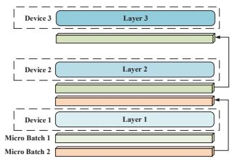  
(a) Pipeline parallelism

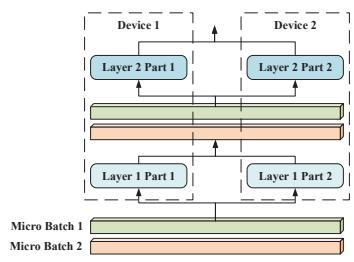  
(b) Tensor parallelism

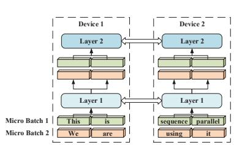  
(c) Sequence parallelism (Ours)  
Figure 1: The overall architecture of the proposed sequence parallelism and existing parallel approaches. For sequence parallelism, Device 1 and Device 2 share the same trainable parameters.

Tensor parallelism Different from pipeline parallelism which splits models by layer, tensor parallelism $( i . e . ,$ , Megatron) (Shoeybi et al., 2019)) introduces tensor splitting, where individual layers of the model are partitioned over multiple devices. Similar to our sequence parallelism, tensor parallelism is also designed for Transformerbased models. Each Transformer layer includes a self-attention block and a two-layer multi-layer perceptron (MLP) block. The MLP block can be formalized as:

$$
Y = \mathrm { { G e L U } } ( X A ) , Z = Y B\tag{2}
$$

where $G e L U$ is a non-linearity activation function, X is the input data, Z and Y are the outputs. Tensor parallelism splits the weight matrices A and B along columns and rows respectively. Then, the first and second GEMM in the MLP block above can be written as:

$$
{ \begin{array} { r l } & { \left[ \begin{array} { l } { A } \end{array} \right] = { \left[ \begin{array} { l l } { A _ { 1 } } & { A _ { 2 } } \end{array} \right] } } \\ & { \left[ \begin{array} { l l } { Y _ { 1 } } & { Y _ { 2 } } \end{array} \right] = { \left[ \begin{array} { l l } { \operatorname { G e L U } ( X A _ { 1 } ) } & { \operatorname { G e L U } ( X A _ { 2 } ) } \end{array} \right] } } \\ & { \left[ \begin{array} { l } { B } \end{array} \right] = { \left[ \begin{array} { l } { B _ { 1 } } \\ { B _ { 2 } } \end{array} \right] } } \\ & { Z = { \left[ \begin{array} { l l } { Z _ { 1 } + Z _ { 2 } } \end{array} \right] } = { \left[ \begin{array} { l l } { Y _ { 1 } } & { Y _ { 2 } } \end{array} \right] } { \left[ \begin{array} { l } { B _ { 1 } } \\ { B _ { 2 } } \end{array} \right] } } \end{array} }\tag{3}
$$

At the second GEMM, $Z _ { 1 }$ and $Z _ { 2 }$ need to undergo an all-reduce operation to give the final output before the dropout layer in the Transformer layer.

Similarly, Megatron splits the tensors in the selfattention layer as well. For multi-head attention, attention heads are split by column and allocated equally to the devices. The linear layer after the self-attention computation is split by row. An allreduce operation is needed at the linear layer output to aggregate attention output from all devices. Please refer to Megatron (Shoeybi et al., 2019) for more details about tensor parallelism.

## 3 Sequence parallelism

We propose sequence parallelism for training Transformer with longer sequences. The overview of sequence parallelism is shown in Figure 1c. Input sequences are split into multiple chunks and the sub-sequences are fed to different corresponding devices. All devices are holding the same trainable parameters but different sub-sequence input chunks. We will introduce and analyze sequence parallelism in detail below. We use the following notation in this section: (1) B: batch size; (2) L: sequence length; (3) H: hidden size of linear layers; (4) A: attention head size; (5) Z: number of attention heads; (6) N: number of GPUs.

## 3.1 Ring self-Attention

To distribute sub-sequences to multiple devices, the main challenge is calculating attention scores across devices. Therefore, we propose Ring Self-Attention (RSA) to compute attention output in a distributed setting. There are two steps in RSA to obtain the final output. Please note, we only consider bidirectional self-attention here to introduce RSA succinctly. We treat all heads equally so it can be extended to multi-head attention directly.

Given query embeddings $\{ q _ { 1 } ^ { 1 } , q _ { 2 } ^ { 1 } , . . . , q _ { L } ^ { N } \}$ , key embeddings $\{ k _ { 1 } ^ { 1 } , k _ { 2 } ^ { 1 } , . . . , k _ { L } ^ { N } \}$ and value embeddings $\{ v _ { 1 } ^ { 1 } , v _ { 2 } ^ { 1 } , . . . , v _ { L } ^ { N } \}$ , where $q _ { s } ^ { n }$ represents the key embedding of the $s ^ { t h }$ token in the the sequence which is on $n ^ { t h }$ device. We define all key embeddings on $n ^ { t h }$ device as $K ^ { n }$ . In RSA, $n ^ { { \dot { t } } h }$ device holds the corresponding query embeddings $Q ^ { n }$ , key embeddings $K ^ { n }$ and value embeddings $V ^ { n }$ . The embeddings on $n ^ { t h }$ device correspond to the $n ^ { t h }$ chunk whose sub-sequence length is $L / N$ . Our goal is to obtain $A t t e n t i o n ^ { n } ( Q ^ { n } , K , V )$ which is the self-attention layer output on $n ^ { t h }$ device. To this end, as shown in Figure 2a, we first transmit the key embeddings among devices to calculate the attention scores $Q K ^ { T }$ in a circular fashion. Such communication needs to be conducted N 1 times to make sure the query embeddings of each subsequence can multiply all the key embeddings. To be more specific, each device will compute the partial attention scores based on its local query and key embeddings first. Then, it will receive different key embeddings from the previous device and calculate the partial attention scores with respect to the new key embeddings for each ring-style communication. As a result, all query embeddings $\{ Q ^ { 1 } , Q ^ { 2 } , . . . , Q ^ { N } \}$ collected their corresponding attention scores $\{ \hat { S } ^ { 1 } , S ^ { 2 } , . . . , S ^ { N } \}$ on their own devices.

(a) Transmitting key embeddings among devices to calculate attention scores  
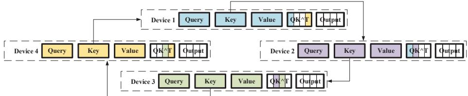

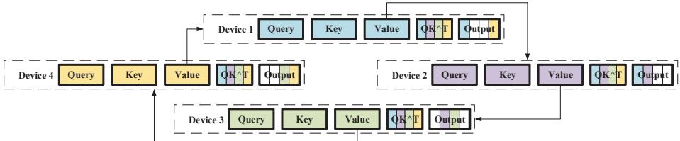  
(b) Transmitting value embeddings among devices to calculate the output of attention layers  
Figure 2: Ring Self-Attention

In the second stage of RSA, we can calculate the self-attention layer output $\{ O ^ { 1 } , O ^ { 2 } , . . . , O ^ { N } \}$ based on $\{ S ^ { 1 } , S ^ { 2 } , . . . , S ^ { N } \}$ and $\{ V ^ { 1 } , V ^ { 2 } , . . . , V ^ { N } \}$ . Since computing $O ^ { n }$ requires $S ^ { n }$ and all value embeddings, as we described in Figure 2b, we transmit all value embeddings instead of key embeddings in a similar way. For $O ^ { n }$ , we calculate $S ^ { n } V$ by:

$$
O ^ { n } = S ^ { n } V = \sum _ { i = 1 } ^ { N } S _ { i } ^ { n } V _ { i }\tag{4}
$$

where $V _ { i } = V ^ { n } , S _ { i } ^ { n }$ is $S ^ { n }$ after column splitting, which means $S _ { i } ^ { n } \in \mathbb { R } ^ { L / N \times L / N }$ but $S ^ { n } \in \bar { \mathbb { R } ^ { L / N \times \bar { L } } }$

## 3.2 Modeling

We analyzed and compared our sequence parallelism with tensor parallelism in both theoretical modeling and experiments, although tensor parallelism is not our direct baseline. To our best knowledge, sequence parallelism is the first system designed for breaking the length limitation of sequence, so there is actually no direct baseline for sequence parallelism. Therefore, as a distributed training system designed for attention-based models, we compare it with a SoTA model parallelism. Tensor parallelism (Narayanan et al., 2021) is compatible with data parallelism, pipeline parallelism. Our sequence parallelism is also compatible with them. We expect our system can outperform tensor parallelism with and without pipeline parallelism. We leave integrating sequence parallelism with data parallelism, pipeline parallelism and tensor parallelism into 4D parallelism as our future work. Here, we mainly focus on memory usage and communication cost of tensor parallelism and our sequence parallelism.

## 3.2.1 Memory usage

For memory usage, according to the architecture of Transformer, the comparison is divided into two parts, MLP block and attention block. In this part, we consider multi-head attention instead of selfattention for a fair and accurate comparison. We assume the optimizer is Adam used in Megatron.

MLP block As shown in Table 1, for the MLP blocks, tensor parallelism stores the matrices after row or column-style splitting of the whole sequence. Our sequence parallelism stores the matrices without row or column-style splitting of only one single sub-sequence on each GPU. If we assume that our sequence parallelism is more memory-efficient:

$$
\mathrm { \frac { 3 2 H ^ { 2 } } { N } + \frac { 4 B L H } { N } + B L H > 3 2 H ^ { 2 } + \frac { 5 B L H } { N } }\tag{5}
$$

We can find that, in MLP blocks, sequence parallelism is more memory-efficient when BL > 32H.

Table 1: MLP block memory usage comparison. M1 means the matrix before linear layer, and M2 is the trainable matrix of linear layer.
<table><tr><td></td><td>GEMM</td><td>M1</td><td>M2</td><td>output</td><td>Memory</td></tr><tr><td>Tensor parallelism</td><td>1st linear 2nd linear</td><td> $( \mathrm { { B } , \mathrm { { L } , \mathrm { { H } ) } } }$   $( \mathrm { B } , \mathrm { L } , \frac { 4 \mathrm { H } } { \mathrm { N } } )$ </td><td> $( \mathrm { H } , \frac { 4 \mathrm { H } } { \mathrm { N } } )$   $( \mathrm { \frac { 4 H } { N } , \mathrm { H } ) }$ </td><td> $( \mathrm { B } , \mathrm { L } , \frac { 4 \mathrm { H } } { \mathrm { N } } )$   $( \mathrm { { B } , \mathrm { { L } , \mathrm { { H } ) } } }$ </td><td> $\mathrm { \frac { 3 2 H ^ { 2 } } { N } + \frac { 4 B L H } { N } + B L H }$ </td></tr><tr><td>Sequence parallelism</td><td>1st linear 2nd linear</td><td> $( \mathrm { B } , \frac { \mathrm { L } } { \mathrm { N } } , \mathrm { H } )$   $( \mathrm { B } , \frac { \mathrm { L } } { \mathrm { N } } , 4 \mathrm { H } )$ </td><td>(H, 4H) (4H, H)</td><td> $( \mathrm { B } , \frac { \mathrm { L } } { \mathrm { N } } , 4 \mathrm { H } )$   $( \mathrm { B } , \frac { \mathrm { L } } { \mathrm { N } } , \mathrm { H } )$ </td><td> $\mathrm { 3 2 H ^ { 2 } + \frac { \Delta 5 B L H } { \Delta N } }$ </td></tr></table>

Table 2: Multi-head attention block memory usage comparison
<table><tr><td></td><td>Operation</td><td>M1</td><td>M2</td><td>output</td><td>Memory</td></tr><tr><td rowspan="4">Tensor parallelism</td><td> $Q / K / V$ </td><td> $( \mathrm { { B } , \mathrm { { L } , \mathrm { { H } ) } } }$ </td><td> $( \mathrm { H } , \frac { \mathrm { Z A } } { \mathrm { N } } )$ </td><td> $( \mathrm { B } , \frac { \mathrm { Z } } { \mathrm { N } } , \mathrm { L } , \mathrm { A } )$ </td><td></td></tr><tr><td> $Q K ^ { T }$ </td><td> $( \mathrm { B , \underset { N } { Z } , L , A } )$ </td><td> $( \mathrm { B } , \underline { { \underline { { L } } } } , \mathrm { L } , \mathrm { A } )$ </td><td> $( \mathrm { B } , \frac { \omega } { \mathrm { N } } , \mathrm { L } , \mathrm { L } )$ </td><td> $\mathrm { \frac { 1 6 A Z H } { N } + \frac { 4 B L Z A } { N } }$ </td></tr><tr><td> $A V$ </td><td> $( \mathrm { B } , \frac { \mathrm { Z } } { \mathrm { N } } , \mathrm { L } , \mathrm { L } )$ </td><td> $( \mathrm { B } , \frac { \mathrm { Z } } { \mathrm { N } } , \mathrm { L } , \mathrm { A } )$ </td><td> $( \mathrm { B } , \frac { \mathrm { Z } } { \mathrm { N } } , \mathrm { L } , \mathrm { A } )$ </td><td> $+ { \frac { \mathrm { B Z L ^ { 2 } } } { \mathrm { N } } } + \mathrm { B L H }$ </td></tr><tr><td>Linear</td><td> $( \mathrm { B } , \frac { \mathrm { \Delta } L } { \mathrm { N } } , \mathrm { L } , \mathrm { A } )$ </td><td> $( \frac { \mathrm { A Z } } { \mathrm { N } } , \mathrm { H } )$ </td><td>(B, L, H)</td><td></td></tr><tr><td rowspan="4">Sequence parallelism</td><td> $Q / K / V$ </td><td> $( \mathrm { B } , \frac { \mathrm { L } } { \mathrm { N } } , \mathrm { H } )$ </td><td>(H, AZ)</td><td> $( \mathrm { B } , \mathrm { Z } , \frac { \mathrm { L } } { \mathrm { W } } , \mathrm { A } )$ </td><td></td></tr><tr><td> $\mathrm { R i n g - } Q K ^ { T }$ </td><td> $( \mathrm { B } , \mathrm { Z } , \frac { \mathrm { L } } { \mathrm { N } } , \mathrm { A } )$ </td><td> $( \mathrm { B } , \mathrm { Z } , \frac { \mathrm { L } } { \mathrm { N } } , \mathrm { A } )$ </td><td> $( \mathrm { { B } , \mathrm { { Z } , \frac { L } { N } , \mathrm { { L } ) } } }$ </td><td> $\mathrm { 1 6 A Z H + \frac { 4 B Z L A } { N } }$ </td></tr><tr><td> $\operatorname { R i n g - } A V$ </td><td> $( \mathrm { B } , \mathrm { Z } , \frac { \mathrm { L } } { \mathrm { N } } , \mathrm { L } )$ </td><td> $( \mathrm { B } , \mathrm { Z } , \frac { \mathrm { L } } { \mathrm { N } } , \mathrm { A } )$ </td><td> $( \mathrm { B } , \mathrm { Z } , \frac { \mathrm { L } } { \mathrm { N } } , \mathrm { A } )$ </td><td> $+ { \frac { \mathrm { B Z L ^ { 2 } } } { \mathrm { N } } } + { \frac { \mathrm { B L H } } { \mathrm { N } } }$ </td></tr><tr><td>Linear</td><td> $( \mathrm { B } , \mathrm { Z } , \frac { \mathrm { L } } { \mathrm { N } } , \mathrm { A } )$ </td><td>(AZ, H)</td><td> $( \mathrm { B } , \frac { \mathrm { L } } { \mathrm { N } } , \mathrm { H } )$ </td><td></td></tr></table>

Multi-head attention block We compared the memory usage of multi-head attention block in Table 2. Tensor parallelism splits the attention heads here, but our sequence parallelism still splits the length dimension of the sequence data. By comparing the memory usages of multi-head attention block of the two parallelisms, we can find sequence parallelism is more memory-efficient if BL > 16AZ. As for communication, tensor parallelism needs an all-reduce operation in both the forward pass and backward pass when calculating the attention output. In our RSA, to facilitate tensor exchange between devices, our communication is equivalent to 2 all-reduce operations in the forward pass and 4 all-reduce operations in the backward pass. The extra communication cost of RSA can be offset by the lack of communication cost in the MLP block.

## 3.2.2 Communication cost

Megatron-LM uses all-reduce in its MLP layer and self-attention layer while the communication overhead in sequence parallelism mainly lies in the self-attention layer. Using the same notation as given above, we are able to calculate the amount of data transferred in sequence parallelism and tensor parallelism.

In both MLP block and multi-head attention block, sequence parallelism is more memoryefficient when we train Transformer with a longer sequence and a larger batch size.

In sequence parallelism, there is no communication in the MLP layer and communication only occurs in the self attention module. There are two ring-style P2P communication in the forward pass for calculating the attention score and attention output respectively. In the backward pass, there are two all-reduce collective communication and two ring-style P2P communication. The amount of data transferred is $2 ( N - 1 ) * B * Z * ( L / N )$ A in the forward pass and $6 ( N - 1 ) * B * Z * ( L / N ) * A$ in the backward pass. The combined amount of data transferred in calculating $Q K ^ { T }$ and AV will be $8 ( N - 1 ) * B * Z * ( L / N ) * A$

In tensor parallelism of Megatron-LM, the amount of data transferred in the forward pass and backward pass is the same as given by $2 ( N - 1 ) *$

$B { * } Z { * } ( L / N ) { * } A$ . Since there are 4 collective communication in the forward and backward passes of the MLP layer and self-attention layer, the total communication cost will be $8 ( N - 1 ) * B * Z$ \* $( L / N ) * A$

Thus, sequence parallelism has the same communication overhead compared with tensor parallelism in Megatron-LM. However, please note sequence parallelism has better compatibility with pipeline parallelism, which would further reduce the communication budget of sequence parallelism. In tensor parallelism, to save the communication bandwidth between pipeline stages which are often over different nodes, the tensor is split before transmitting to the next stage and all-gathered after transmission. As tensor has already been split along the sequence dimension in sequence parallelism, there is no need to split and all-gather between pipeline stages. Thus, sequence parallelism can have one less all-gather operation per pipeline stage.

## 4 Experiments

## 4.1 Experimental setup

We conducted our experiments on the Piz Daint supercomputer provided by Swiss National Supercomputing Center (CSCS). The Piz Daint supercomputer provides one P100 GPU (16GB GPU RAM) for each compute node and the compute nodes are connected by a high-bandwidth network. We chose two bidirectional language models, namely BERT Base and BERT Large, to evaluate our sequence parallelism. We also verified the convergence performance of sequence parallelism (see Appendix B). Since we are using the original model but different systems, the accuracy should be the same. The slight differences are from randomness.

## 4.2 Maximum batch size

Since our sequence parallelism is memory-efficient to handle larger batch sizes, we first investigated the maximum batch size we can reach with sequence parallelism. In this section, for a comprehensive comparison, we scaled with tensor or sequence parallelism on BERT Base and BERT Large. We also fixed the tensor or parallel size and then scale them with pipeline parallelism to evaluate the verify the compatibility with pipeline parallelism. We used tokens per second as the metric for throughput. To this end, we trained BERT Base and BERT Large for 150 iterations in total, and then we calculate the

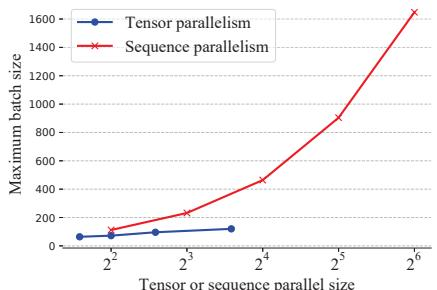  
(a) Maximum batch size of BERT Base scaling along tensor or sequence parallel size

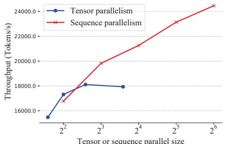  
(b) Throughput of BERT Base scaling along tensor or sequence parallel size

Figure 3: Scaling with sequence/tensor parallelism mean tokens processed per second within the last 100 iterations.

Scaling with sequence/tensor parallelism We fixed all hyper-parameters except the batch size and the tensor parallelism or sequence parallelism size. We trained the model with a sequence length of 512 and no pipeline parallelism is used. The tensor parallelism size in Megatron is limited by the number of attention heads and hidden size, because these two hyper-parameters are required to be divisible by the tensor parallelism size. Among them, the number of attention heads is small so it limits the tensor parallelism. Thus, tensor parallelism size is a maximum of 12 for the BERT Base model in Megatron. In contrast, for our sequence parallelism, only the sequence length is required to be divisible by the sequence parallelism size, so that we can scale sequence parallelism to a larger size since it is a much larger hyper-parameter than the number of attention heads.

For BERT Base, our sequence parallelism outperforms tensor parallelism in terms of memory consumption. Figure 3a shows that our system on 64 GPUs can achieve 13.7 larger batch size than Megatron on 12 GPUs. Even if we combine data parallelism and tensor parallelism to scale up to 64 GPUs for Megatron, our system would still support a larger batch size. In Figure 3b, we can observe sequence parallelism achieved comparable throughput with the same parallel size, and our system can extend to a larger parallel size to achieve better performance. For the results on BERT Large, please

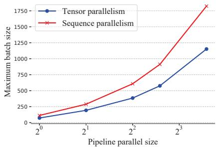  
(a) Maximum batch size of BERT base scaling along pipeline parallel size

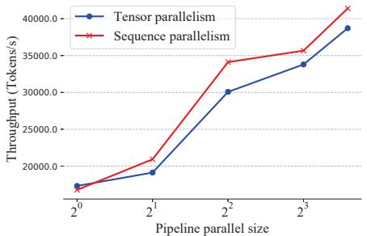  
(b) Throughput of BERT base scaling along pipeline parallel size  
Figure 4: Scaling with pipeline parallelism

## see Appendix C for details.

Scaling with pipeline parallelism To verify the compatibility with pipeline parallelism, we fixed the tensor parallelism and sequence parallelism size as 4 and scale the pipeline parallel size. For BERT Base, we can observe that sequence parallelism outperforms tensor parallelism on the maximum batch size in Figure 4a. It can be noted that sequence parallelism also achieved higher throughput when using more pipeline stages as shown in Figure 4b. This is because Megatron incurs extra communication costs between pipeline stages. Megatron holds the activation for the full sequence on each device. Thus, it needs to split the activation, transmit the partial activation to the next device, and gather back the partial activation when sending the activation between pipelines. This incurs less communication overhead compared to transmitting the whole activation between pipelines. However, this still brings more communication costs than ours, as no splitting and all-gather operation is required for our sub-sequence intermediate activation. Therefore, our sequence parallelism achieved better throughput when scaling along with pipeline parallel size.

## 4.3 Maximum sequence length

Sequence parallelism is designed for training Transformer-based models with longer input sequences, so we investigated the maximum sequence length it can handle. Similarly, we still compared tensor parallelism without pipeline par-

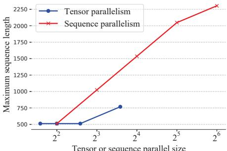  
(a) Maximum sequence length on BERT base

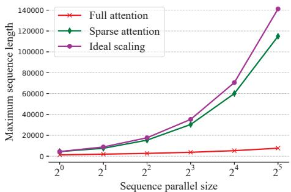  
(b) Sequence length upper bound  
Figure 5: Scaling with sequence length

Compared with tensor parallelism We fixed batch size as 64 for BERT Base and no pipeline parallelism was used. We show the maximum sequence length in Figure 5a. If we scale up to 64 GPUs, we can achieve around 3 maximum sequence length on BERT Base. Another observation is splitting along the number of attention heads limits the input sequence length of tensor parallelism in Megatron, but our sequence parallelism can scale easily by splitting a sequence into multiple chunks. When using the same 16 GPUs, our sequence parallelism still can achieve 1.4 larger sequence length than tensor parallelism. The gap is expected to widen if we use 32GB GPUs instead of 16GB GPUs.

Sequence length upper bound To investigate the maximum sequence length our system can handle on the cluster with 32 P100 GPUs. we set both data and pipeline parallel size as 1 and global batch size as 4. As efficient attention is widely used in long sequence training, we adapt Linformer (Wang et al., 2020), i.e., one low-rank attention algorithm with linear time and space complexity. Our sequence parallelism is compatible with the efficient attention. More importantly, as shown in Table 3, for memory usage in efficient attention block, all terms including sequence length L is divided by number of devices N, which means we can scale the sequence length to infinite long if we use efficient attention with linear complexity. To investigate the sequence length upper bound of sequence length on the efficient attention setting, we conduct experiments with both efficient and full attention. As shown in Figure 5b, if we use efficient attention on sequence parallelism, we can almost achieve ideal scaling. With 32 P100 GPUs, our sequence parallelism with efficient attention can handle the sequence with 114K tokens, which is over 27 longer than recent sparse attention papers holding the whole sequence on a single device (Zaheer et al., 2020; Wang et al., 2020).

Table 3: Efficient attention block memory usage. K is the projection dimension in Linformer (Wang et al., 2020)
<table><tr><td></td><td>Operation</td><td>M1</td><td>M2</td><td>output</td><td>Memory</td></tr><tr><td rowspan="5">Linformer Sequence parallelism</td><td> $Q / K / V$ </td><td> $( \mathrm { B } , \frac { \mathrm { L } } { \mathrm { N } } , \mathrm { H } )$ </td><td> $( \mathrm { H } , \mathrm { A } \mathrm { Z } )$ </td><td> $( \mathrm { B } , \mathrm { Z } , \frac { \mathrm { L } } { \mathrm { N } } , \mathrm { A } )$ </td><td></td></tr><tr><td>Projection</td><td> $( \mathrm { B } , \mathrm { Z } , \frac { \mathrm { L } } { \mathrm { N } } , \mathrm { A } )$ </td><td> $( \frac { \mathrm { L } } { \mathrm { N } } , \mathrm { K } )$ </td><td> $( \mathrm { B } , \mathrm { Z } , \mathrm { K } , \mathrm { A } )$ </td><td> $\mathrm { 2 A Z H + \frac { 2 B Z L A } { \Omega \Omega } }$ </td></tr><tr><td>Ring  $\cdot Q K ^ { T }$ </td><td> $( \mathrm { B } , \mathrm { Z } , \frac { \mathrm { L } } { \mathrm { N } } , \mathrm { A } )$ </td><td>(B, Z, K, A)</td><td> $( \mathrm { B } , \mathrm { Z } , \frac { \mathrm { L } } { \mathrm { N } } , \mathrm { K } )$ </td><td> $+ { \frac { \mathrm { B Z L K } } { \mathrm { N } } } ^ { \mathrm { N } } + { \frac { \mathrm { B L H } } { \mathrm { N } } }$ </td></tr><tr><td>Ring-AV</td><td> $( \mathrm { B } , \mathrm { Z } , { \frac { \mathrm { L } } { \mathrm { N } } } , \mathrm { K } )$ </td><td>(B, Z, K, A)</td><td> $( \mathrm { B } , \mathrm { Z } , \frac { \mathrm { L } } { \mathrm { N } } , \mathrm { A } )$ </td><td> $+ 2 \mathrm { B Z K A }$ </td></tr><tr><td>Linear</td><td> $( \mathrm { B } , \mathrm { Z } , \frac { \mathrm { L } } { \mathrm { N } } , \mathrm { A } )$ </td><td>(AZ, H)</td><td> $( \mathrm { B } , \frac { \mathrm { L } } { \mathrm { N } } , \mathbf { \bar { H } } )$ </td><td></td></tr></table>

Table 4: Weak scaling results. Parallel size is the tensor or sequence parallel size. Batch size denotes global batch size, respectively. Memory and Token/sec denote max allocated memory/MB and tokens processed per second. OOM means that CUDA out of memory occurs.
<table><tr><td rowspan="2">Parallel size</td><td rowspan="2">Batch size</td><td rowspan="2">Sequence length</td><td colspan="2">Tensor parallelism</td><td colspan="2">Sequence parallelism</td></tr><tr><td>Memory</td><td>Token/sec</td><td>Memory</td><td>Token/sec</td></tr><tr><td>1</td><td>64</td><td>512</td><td>8477.28</td><td>9946.15</td><td>8477.53</td><td>9261.04</td></tr><tr><td>2</td><td>128</td><td>512</td><td>9520.47</td><td>15510.19</td><td>8478.76</td><td>13938.22</td></tr><tr><td>4</td><td>256</td><td>512</td><td>12232.52</td><td>20701.96</td><td>8481.26</td><td>21269.91</td></tr><tr><td>8</td><td>512</td><td>512</td><td>00M</td><td>00M</td><td>8490.75</td><td>26401.64</td></tr><tr><td>1</td><td>64</td><td>256</td><td>3707.39</td><td>9752.61</td><td>3707.01</td><td>9340.13</td></tr><tr><td>2</td><td>64</td><td>512</td><td>4993.43</td><td>14195.17</td><td>4670.64</td><td>13144.16</td></tr><tr><td>4</td><td>64</td><td>1024</td><td>8175.93</td><td>19879.27</td><td>6601.88</td><td>18243.82</td></tr><tr><td>8</td><td>64</td><td>2048</td><td>14862.09</td><td>22330.5</td><td>10536.38</td><td>21625.51</td></tr></table>

## 4.4 Weak scaling

Strong scaling limits the upper bound of batch size and sequence length within a single device, so we mainly discuss weak scaling in this section. We scale the batch size and sequence length separately when increasing the number of nodes. We fixed the pipeline parallelism size as 8. In Table 4, sequence parallelism achieved almost constant memory usage when scaling along with the global batch size, which outperforms tensor parallelism by a large margin. As for weak scaling along the sequence length, our method still uses much less memory with comparable throughput.

## 5 Discussion

Although there are other related works including DeepSpeed (Rasley et al., 2020), GShard (Lepikhin et al., 2020), GSPMD (Xu et al., 2021), etc., they are not our direct baseline in experiments. Deep-Speed is an efficient method to optimize memory footprint in data parallel training by using ZeRO Optimizer (Rajbhandari et al., 2021) and ZeRO-Offload (Ren et al., 2021). DeepSpeed and our method optimize training in different dimensions and they are actually compatible with each other. Our method is orthogonal to DeepSpeed just as how DeepSpeed can be integrated with Megatron. Thus, Megatron should be our baseline.

GShard and GSPMD are two libraries built for the TensorFlow community to partition model parameters in distributed training. GSPMD is developed based on GShard. These two methods rely on the static computation graph of TensorFlow to train larger models while we provide a plug-andplay tool based on PyTorch’s dynamic computation graph to train on longer sequences. The difference in the computation paradigms makes them unsuitable as our baseline.

We also highlight again that, although sequence parallelism can perform decent on large model training, a more highly important use case is training mid-scale but very long sequence. One example is AlphaFold (Jumper et al., 2021), which uses only 86M parameters but is required to be trained with very long sequence (from 1K to 4K).

## 6 Conclusion

In this paper, we proposed sequence parallelism for training transformer with longer sequence. Sequence parallelism is designed to break the limitation of sequence length on a single device. We have shown that sequence parallelism can handle longer sequence and is more memory-efficient than SoTA. In particular, sequence parallelism achieves 3.0 maximum sequence length and 13.7 maximum batch size than tensor parallelism when scaling up to 64 GPUs. Unlike both tensor and pipeline parallelism, sequence parallelism is not limited by the smaller hyper-parameters (e.g., number of attention heads, number of layers). Therefore, our sequence parallelism can be adapted as long as the sequence length is divisible by sequence parallel size. With efficient attention, sequence parallelism can handle sequence with over 114K tokens, which is over 27 longer than existing efficient attention works holding the whole sequence on a single device. We used a language model (i.e., BERT) to evaluate our system, but it can also be adapted to vision tasks. This work paves the way to process large images (Hou et al., 2019) by ViT (Dosovitskiy et al., 2020) as a larger image means more patches or longer sequences.

## Limitations

In order to perform communication between subsequences during training, the use of sequence parallelism can result in increased communication costs, which in turn can slow down the training process. However, by combining sequence parallelism with pipeline parallelism, this issue can be alleviated and the communication cost can be made comparable to advanced forms of model parallelism such as tensor parallelism. Nonetheless, sequence parallelism still incurs higher communication costs than vanilla data parallelism.

While sequence parallelism is effective for training of unidirectional attention models as well as training and inference of bidirectional attention models, it poses a challenge for unidirectional attention models inference due to the autoregressive decoding process. This means that different devices cannot compute in parallel, resulting in reduced throughput and decreased GPU utilization.

## Acknowledgement

Yang You’s research group in NUS is being sponsored by NUS startup grant (Presidential Young Professorship), Singapore MOE Tier-1 grant, ByteDance grant, ARCTIC grant, SMI grant and Alibaba grant.

## References

Tom B Brown, Benjamin Mann, Nick Ryder, Melanie Subbiah, Jared Kaplan, Prafulla Dhariwal, Arvind Neelakantan, Pranav Shyam, Girish Sastry, Amanda Askell, et al. 2020. Language models are few-shot learners. arXiv preprint arXiv:2005.14165.

Jacob Devlin, Ming-Wei Chang, Kenton Lee, and Kristina Toutanova. 2018. Bert: Pre-training of deep bidirectional transformers for language understanding. arXiv preprint arXiv:1810.04805.

Alexey Dosovitskiy, Lucas Beyer, Alexander Kolesnikov, Dirk Weissenborn, Xiaohua Zhai, Thomas Unterthiner, Mostafa Dehghani, Matthias Minderer, Georg Heigold, Sylvain Gelly, et al. 2020. An image is worth 16x16 words: Transformers for image recognition at scale. arXiv preprint arXiv:2010.11929.

Ahmed Elnaggar, Michael Heinzinger, Christian Dallago, Ghalia Rihawi, Yu Wang, Llion Jones, Tom Gibbs, Tamas Feher, Christoph Angerer, Martin Steinegger, et al. 2020. Prottrans: Towards cracking the language of life’s code through self-supervised deep learning and high performance computing. arXiv preprint arXiv:2007.06225.

William Fedus, Barret Zoph, and Noam Shazeer. 2021. Switch transformers: Scaling to trillion parameter models with simple and efficient sparsity. arXiv preprint arXiv:2101.03961.

Le Hou, Youlong Cheng, Noam Shazeer, Niki Parmar, Yeqing Li, Panagiotis Korfiatis, Travis M Drucker, Daniel J Blezek, and Xiaodan Song. 2019. High resolution medical image analysis with spatial partitioning. arXiv preprint arXiv:1909.03108.

Yanping Huang, Youlong Cheng, Ankur Bapna, Orhan Firat, Mia Xu Chen, Dehao Chen, HyoukJoong Lee, Jiquan Ngiam, Quoc V Le, Yonghui Wu, et al. 2018. Gpipe: Efficient training of giant neural networks using pipeline parallelism. arXiv preprint arXiv:1811.06965.

John Jumper, Richard Evans, Alexander Pritzel, Tim Green, Michael Figurnov, Olaf Ronneberger, Kathryn

Tunyasuvunakool, Russ Bates, Augustin Žídek, Anna Potapenko, et al. 2021. Highly accurate protein structure prediction with alphafold. Nature, 596(7873):583–589.

Dmitry Lepikhin, HyoukJoong Lee, Yuanzhong Xu, Dehao Chen, Orhan Firat, Yanping Huang, Maxim Krikun, Noam Shazeer, and Zhifeng Chen. 2020. Gshard: Scaling giant models with conditional computation and automatic sharding. arXiv preprint arXiv:2006.16668.

Deepak Narayanan, Mohammad Shoeybi, Jared Casper, Patrick LeGresley, Mostofa Patwary, Vijay Korthikanti, Dmitri Vainbrand, Prethvi Kashinkunti, Julie Bernauer, Bryan Catanzaro, et al. 2021. Efficient large-scale language model training on gpu clusters. arXiv preprint arXiv:2104.04473.

Jinjie Ni, Tom Young, Vlad Pandelea, Fuzhao Xue, Vinay Adiga, and Erik Cambria. 2021. Recent advances in deep learning based dialogue systems: A systematic survey. arXiv preprint arXiv:2105.04387.

Chen Qu, Liu Yang, Minghui Qiu, W Bruce Croft, Yongfeng Zhang, and Mohit Iyyer. 2019. Bert with history answer embedding for conversational question answering. In Proceedings of the 42nd International ACM SIGIR Conference on Research and Development in Information Retrieval, pages 1133– 1136.

Alec Radford, Jeff Wu, Rewon Child, David Luan, Dario Amodei, and Ilya Sutskever. 2019. Language models are unsupervised multitask learners.

Colin Raffel, Noam Shazeer, Adam Roberts, Katherine Lee, Sharan Narang, Michael Matena, Yanqi Zhou, Wei Li, and Peter J. Liu. 2020. Exploring the limits of transfer learning with a unified text-to-text transformer. Journal ofMachine Learning Research, 21(140):1–67.

Samyam Rajbhandari, Olatunji Ruwase, Jeff Rasley, Shaden Smith, and Yuxiong He. 2021. Zero-infinity: Breaking the gpu memory wall for extreme scale deep learning. arXiv preprint arXiv:2104.07857.

Jeff Rasley, Samyam Rajbhandari, Olatunji Ruwase, and Yuxiong He. 2020. Deepspeed: System optimizations enable training deep learning models with over 100 billion parameters. In Proceedings of the 26th ACM SIGKDD International Conference on Knowledge Discovery & Data Mining, pages 3505–3506.

Jie Ren, Samyam Rajbhandari, Reza Yazdani Aminabadi, Olatunji Ruwase, Shuangyan Yang, Minjia Zhang, Dong Li, and Yuxiong He. 2021. Zerooffload: Democratizing billion-scale model training.

Mohammad Shoeybi, Mostofa Patwary, Raul Puri, Patrick LeGresley, Jared Casper, and Bryan Catanzaro. 2019. Megatron-lm: Training multi-billion parameter language models using model parallelism. arXiv preprint arXiv:1909.08053.

Qin Wang, Boyuan Wang, Zhenlei Xu, Jiaxiang Wu, Peilin Zhao, Zhen Li, Sheng Wang, Junzhou Huang, and Shuguang Cui. 2021. Pssm-distil: Protein secondary structure prediction (pssp) on low-quality pssm by knowledge distillation with contrastive learning.

Sinong Wang, Belinda Z Li, Madian Khabsa, Han Fang, and Hao Ma. 2020. Linformer: Self-attention with linear complexity. arXiv preprint arXiv:2006.04768.

Yuanzhong Xu, HyoukJoong Lee, Dehao Chen, Blake Hechtman, Yanping Huang, Rahul Joshi, Maxim Krikun, Dmitry Lepikhin, Andy Ly, Marcello Maggioni, et al. 2021. Gspmd: General and scalable parallelization for ml computation graphs. arXiv preprint arXiv:2105.04663.

Fuzhao Xue, Aixin Sun, Hao Zhang, and Eng Siong Chng. 2020a. An embarrassingly simple model for dialogue relation extraction. arXiv preprint arXiv:2012.13873.

Fuzhao Xue, Aixin Sun, Hao Zhang, and Eng Siong Chng. 2020b. Gdpnet: Refining latent multiview graph for relation extraction. arXiv preprint arXiv:2012.06780.

Zekun Yang, Noa Garcia, Chenhui Chu, Mayu Otani, Yuta Nakashima, and Haruo Takemura. 2020. Bert representations for video question answering. In Proceedings ofthe IEEE/CVF Winter Conference on Applications ofComputer Vision, pages 1556–1565.

Manzil Zaheer, Guru Guruganesh, Kumar Avinava Dubey, Joshua Ainslie, Chris Alberti, Santiago Ontanon, Philip Pham, Anirudh Ravula, Qifan Wang, Li Yang, et al. 2020. Big bird: Transformers for longer sequences. Advances in Neural Information Processing Systems, 33.

Hao Zhang, Aixin Sun, Wei Jing, Liangli Zhen, Joey Tianyi Zhou, and Rick Siow Mong Goh. 2021. Natural language video localization: A revisit in spanbased question answering framework. IEEE Transactions on Pattern Analysis and Machine Intelligence.

Hao Zhang, Aixin Sun, Wei Jing, and Joey Tianyi Zhou. 2020. Span-based localizing network for natural language video localization. In Proceedings of the 58th Annual Meeting ofthe Associationfor Computational Linguistics, pages 6543–6554, Online. Association for Computational Linguistics.

Wenxuan Zhou, Kevin Huang, Tengyu Ma, and Jing Huang. 2020. Document-level relation extraction with adaptive thresholding and localized context pooling. arXiv preprint arXiv:2010.11304.

## A Multi-head attnetion

Multi-head attention is designed to jointly consider the information from different subspaces of embedding. Compared with self-attention below, multihead attention has h query, key and value embeddings instead of the single one, where h denotes the number of heads. We obtain these embeddings with identical shapes by linear transformations. The multi-head attention can be described as:

$$
M u l t i H e a d ( Q , K , V ) = C o n c a t ( h e a d _ { 1 } , . . . , h e a d _ { h } ) W _ { \therefore } ^ { O }\tag{6}
$$

where $h e a d _ { i } = A t t e n t i o n ( Q _ { i } , K _ { i } , V _ { i } )$ and W denotes the linear transformations. All heads are concatenated and further projected by linear transformation $W ^ { O }$

## B Convergence performance

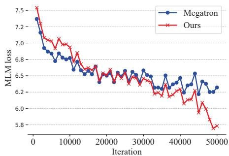

(a) Convergence performance of MLM loss  
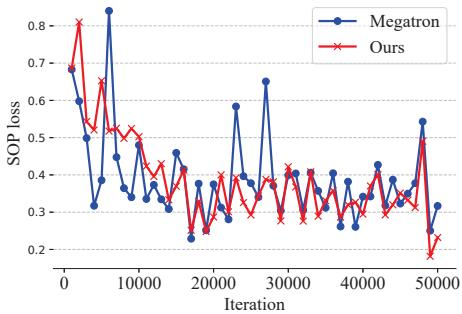  
(b) Convergence performance of SOP loss  
Figure 6: Convergence performance comparison between tensor parallelism and ours

We verified the convergence performance of sequence parallelism. Since sequence parallelism is just a distributed implementation of long sequence training, there is no change in model architecture, We expect sequence parallelism can achieve the same accuracy and convergence performance as training without sequence parallelism. We used the Wikipedia dataset (Devlin et al., 2018) and evaluated Megatron and our model on the development set every 1k iterations. We trained the BERT Large model for 50k iterations with the default hyperparameters used by Megatron. Our goal here is to verify the correctness of our implementation so we trained the model for fewer steps. We set parallel size as 4 for tensor parallelism in Megatron and sequence parallelism in our model. No pipeline was used for both models. In Figure 6, Our sequence parallelism shows good convergence on both the masked language modeling (MLM) loss and the sentence order prediction (SOP) loss. Compared with Megatron, sequence parallelism has a similar trend in convergence and achieved lower values for both MLM loss and SOP loss for 50k iterations.

## C Scaling with sequence/tensor parallelism

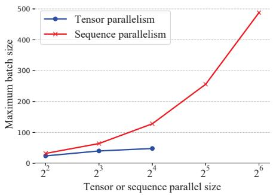

(a) Maximum batch size of BERT Large scaling along tensor or sequence parallel size  
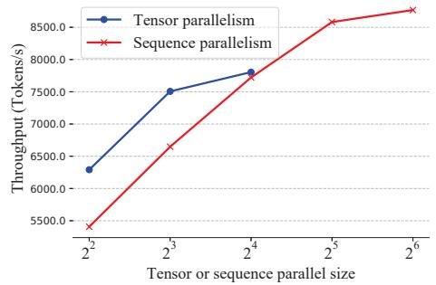  
(b) Throughput of BERT Large scaling along tensor or sequence parallel size  
Figure 7: Scaling with sequence/tensor parallelism

Compared with BERT Base setting, the only difference is, the tensor parallel size is a maximum of 16 for the BERT Large model in Megatron-LM. In Figure 7a, our method achieved 2.7 times larger batch size for BERT Large on 16 GPUs, and the batch size of sequence parallelism on 64 GPUs is 10.2 times larger than that of tensor parallelism on 16 GPUs. In Figure 7b, observe that our sequence parallelism achieved comparable throughput with the same parallel size, and more importantly, our system can extend to a larger parallel size to achieve better performance.

## D Scaling with pipeline parallelism

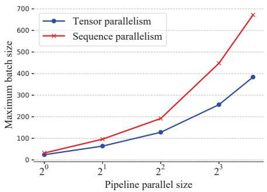

(a) Maximum batch size of BERT Large scaling along pipeline parallel size  
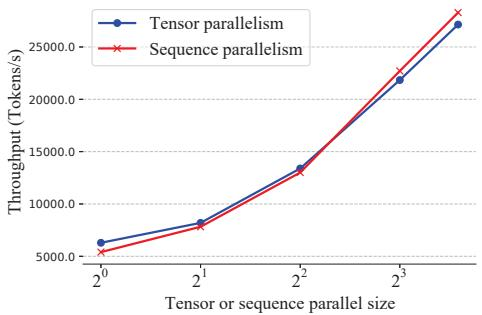  
(b) Throughput of BERT Large scaling along pipeline parallel size  
Figure 8: Scaling with pipeline parallelism

For BERT Large, sequence parallelism achieved higher maximum batch size than tensor parallelism in Figure 8a. Sequence parallelism also performs better on throughput when using more pipeline stages as shown in Figure 8b.

## E Maximum sequence length

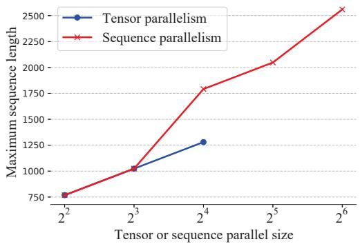  
Figure 9: Maximum sequence length on BERT Large

BERT Large Similarly, we compared tensor parallelism without pipeline parallelism. We fixed batch size as 16 for BERT Large and did not use pipeline parallelism. As shown in Figure 9. When we scale up to 64 GPUs, we can achieve around 2 maximum sequence length and scale better through splitting a sequence into multiple chunks on BERT Large.

## A For every submission:

✓ A1. Did you describe the limitations of your work? Limitation Section

 A2. Did you discuss any potential risks of your work? Not applicable. Left blank.

✓ A3. Do the abstract and introduction summarize the paper’s main claims? Yes, Introduction

✗ A4. Have you used AI writing assistants when working on this paper? Left blank.

## B ✗ Did you use or create scientific artifacts?

Left blank.

 B1. Did you cite the creators of artifacts you used? Not applicable. Left blank.

 B2. Did you discuss the license or terms for use and / or distribution of any artifacts? Not applicable. Left blank.

 B3. Did you discuss if your use of existing artifact(s) was consistent with their intended use, provided that it was specified? For the artifacts you create, do you specify intended use and whether that is compatible with the original access conditions (in particular, derivatives of data accessed for research purposes should not be used outside of research contexts)? Not applicable. Left blank.

 B4. Did you discuss the steps taken to check whether the data that was collected / used contains any information that names or uniquely identifies individual people or offensive content, and the steps taken to protect / anonymize it? Not applicable. Left blank.

 B5. Did you provide documentation of the artifacts, e.g., coverage of domains, languages, and linguistic phenomena, demographic groups represented, etc.? Not applicable. Left blank.

 B6. Did you report relevant statistics like the number of examples, details of train / test / dev splits, etc. for the data that you used / created? Even for commonly-used benchmark datasets, include the number of examples in train / validation / test splits, as these provide necessary context for a reader to understand experimental results. For example, small differences in accuracy on large test sets may be significant, while on small test sets they may not be. Not applicable. Left blank.

## C ✓ Did you run computational experiments?

Experiments Section

✓ C1. Did you report the number of parameters in the models used, the total computational budget (e.g., GPU hours), and computing infrastructure used? Exp settings

✓ C2. Did you discuss the experimental setup, including hyperparameter search and best-found hyperparameter values? Exp settings

 C3. Did you report descriptive statistics about your results (e.g., error bars around results, summary statistics from sets of experiments), and is it transparent whether you are reporting the max, mean, etc. or just a single run? Not applicable. Left blank.

 C4. If you used existing packages (e.g., for preprocessing, for normalization, or for evaluation), did you report the implementation, model, and parameter settings used (e.g., NLTK, Spacy, ROUGE, etc.)? Not applicable. Left blank.

D ✗ Did you use human annotators (e.g., crowdworkers) or research with human participants? Left blank.

 D1. Did you report the full text of instructions given to participants, including e.g., screenshots, disclaimers of any risks to participants or annotators, etc.? Not applicable. Left blank.

 D2. Did you report information about how you recruited (e.g., crowdsourcing platform, students) and paid participants, and discuss if such payment is adequate given the participants’ demographic (e.g., country of residence)? Not applicable. Left blank.

 D3. Did you discuss whether and how consent was obtained from people whose data you’re using/curating? For example, if you collected data via crowdsourcing, did your instructions to crowdworkers explain how the data would be used? Not applicable. Left blank.

 D4. Was the data collection protocol approved (or determined exempt) by an ethics review board? Not applicable. Left blank.

 D5. Did you report the basic demographic and geographic characteristics of the annotator population that is the source of the data? Not applicable. Left blank.