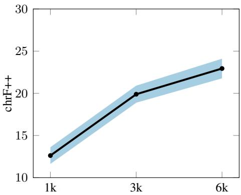
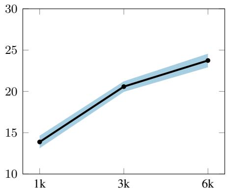
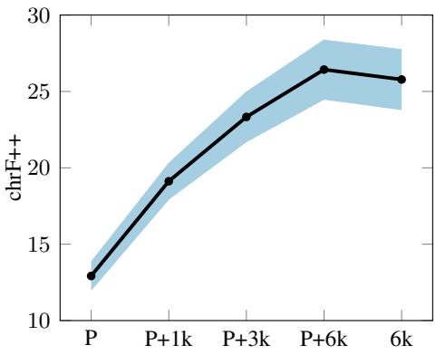
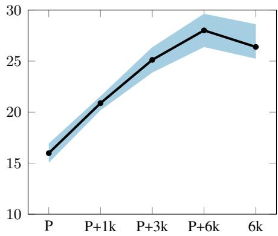
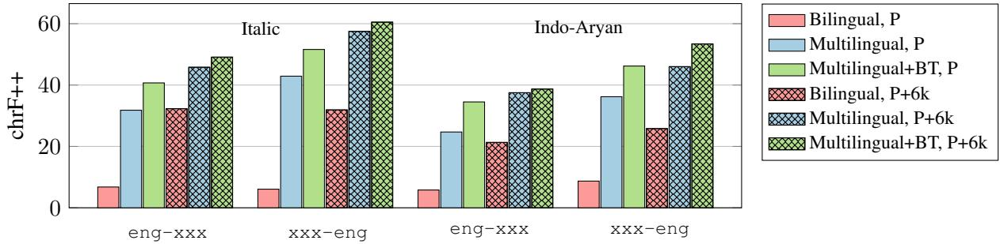

# Small Data, Big Impact: Leveraging Minimal Data for Effective Machine Translation

Jean Maillard Meta AI

Cynthia Gao Meta AI

Vedanuj Goswami† Meta AI

Philipp Koehn Johns Hopkins University

Elahe Kalbassi Meta AI

Angela Fan Meta AI

Kaushik Ram Sadagopan Meta AI

Francisco Guzmán Meta AI

## Abstract

For many languages, machine translation progress is hindered by the lack of reliable training data. Models are trained on whatever preexisting datasets may be available and then augmented with synthetic data, because it is often not economical to pay for the creation of largescale datasets. But for the case of low-resource languages, would the creation of a few thousand professionally translated sentence pairs give any benefit? In this paper, we show that it does.

We describe a broad data collection effort involving around 6k professionally translated sentence pairs for each of 39 low-resource languages, which we make publicly available. We analyse the gains of models trained on this small but high-quality data, showing that it has significant impact even when larger but lower quality pre-existing corpora are used, or when data is augmented with millions of sentences through backtranslation.

## 1 Introduction

State of the art machine translation models are able to cover hundreds of languages (Ma et al., 2021; Wang et al., 2022; Siddhant et al., 2022; NLLB Team et al., 2022) by relying on large amounts of annotated (Skadinš et al., 2014; Lison and Tiedemann, 2016; Agic and Vuli´ c´, 2019) and unannotated web crawled data (Schwenk et al., 2021; Heffernan et al., 2022). Translation for low-resource languages still faces significant challenges related to data availability, since many of these languages have neither large-scale parallel corpora nor a big presence on the web (Adelani et al., 2022b).

Techniques such as self-supervised learning (Ma et al., 2021; Liu et al., 2021) and backtranslation (Sennrich et al., 2016; Edunov et al., 2018; Fan et al., 2020) can be effective tools to reduce the reliance on annotation for translation models. In some cases, these techniques can be combined or even be applied iteratively (Hoang et al., 2018), leading to a feedback loop that can generate increasingly better translations. In order to be effective, however, such methods still require a certain amount of seed parallel data, which can be used to kickstart the process.

As a result, researchers and communities looking to train translation systems for low-resource languages may find themselves wondering how much parallel data is required to achieve a given performance target level.

In this paper, we describe a data collection effort for 39 low-resource languages, involving the creation of over 6k seed sentence pairs per language by professional translators, which we make publicly available with an open license. We analyse the behaviour of bilingual translation systems trained on varying amounts of this data, with and without the addition of pre-existing publicly available parallel datasets, and find that even comparatively small amounts of professionally produced parallel sentences can have an outsized impact. We find that gains coming from high quality data are further enhanced when training multilingual models of closely related high- and low-resource languages, and even more so when augmenting the dataset via backtranslation.

Overall, our results show that employing relatively small but high-quality, professionally translated datasets constitutes a promising and viable way towards achieving performant machine translation for low-resource languages, especially for those with high-resource relatives. This holds true even for languages for which some pre-existing data might already be publicly available, further highlighting the importance of high-quality training datasets.

Notably, parallel datasets of the scale discussed here are compact enough that coverage for a new language could plausibly be collected by a relatively small group of volunteers in a week, making these results relevant for the usage of machine translation technologies in crisis situations (Lewis et al., 2011).

Our main contributions are:

1. The creation and public release of a professionally translated seed dataset for 39 lowresource languages.

2. An analysis of the impact of this high-quality data, both in isolation and also when combined with pre-existing datasets, based on hundreds of trained models.

3. A study of how gains from high-quality parallel data compound when using multilingual training and backtranslation, showing that benefits from high-quality data do not get washed away when using stronger models or data augmentation.

## 2 Background

Low-resource language translation Despite very successful recent advances in neural machine translation, most of the gains have only benefited a handful of so called high-resource languages, which have enough textual resources to satisfy the substantial data requirements of state-of-theart techniques. The vast majority of the world’s languages are low-resource, and researchers have increasingly been focusing on evaluating performance in this challenging setting (Wenzek et al., 2021).

Benchmarks Traditionally, one of the biggest challenges to the development of low-resource translation systems has been the lack of high quality evaluation data. Several benchmarks focus on specific sets of languages, such as the MADAR dataset for Arabic dialects (Bouamor et al., 2018), the Autshumato benchmark covering 11 South African languages (McKellar, 2017), or the TICO-19 benchmark covering 35 languages for the domain of medical information related to the COVID-19 pandemic (Anastasopoulos et al., 2020). More recently, the FLORES-101 dataset (Goyal et al., 2022) and its expansion to over 200 languages (NLLB Team et al., 2022) has enabled multilingual evaluation across tens of thousands of directions, including many low-resource languages. Its domain is composed of an even mixture of travel guides (Wikitravel), children’s literature (Wikijunior), and news content (Wikinews).

Training corpora Much important work has gone towards the development of parallel corpora for low-resource languages, most of which focusing on individual language pairs (Tapo et al., 2021; Ali et al., 2021; Adelani et al., 2021; Azunre et al., 2021, inter alia). Adelani et al. (2022a) study the case of 15 low-resource African languages, most of which already have tens or hundreds of thousands of parallel sentences in the religious domain, and investigate how combining pre-trained models and a newly created corpus can lead to effective domain transfer.

Low-resource training Amongst the techniques that can be used to decrease the reliance on manually annotated data, bitext mining (Schwenk et al., 2021; Ramesh et al., 2022) enables finding pairs of translations among large collections of unannotated monolingual text. Heffernan et al. (2022) show its effectiveness for low-resource languages, but point out that it can be limited for the most data scarce languages. Backtranslation (Sennrich et al., 2016; Edunov et al., 2018) can be used to create pseudoparallel data from monolingual data in a target language. It relies on an initial, potentially low-quality translation model – thereby having some requirements on annotated data – and can also be applied iteratively for improved performance (Hoang et al., 2018). Self-supervision (Siddhant et al., 2020) is a method employing monolingual text denoising as a joint training objective, and its use has been suggested as a way of kick-starting an iterative backtranslation pipeline. Finally, multilingual translation, which is often combined with one or more of the above techniques, has been shown to improve low-resource translation performance via cross-lingual transfer (Firat et al., 2016; Fan et al., 2020; Ma et al., 2021; Wang et al., 2022; Siddhant et al., 2022; NLLB Team et al., 2022)

Training without parallel data Within the area of low-resource translation, Bapna et al. (2022) describe the development of translation systems for low-resource languages without using any parallel data at all, relying instead on crawled monolingual data and language transfer. Methods which don’t require parallel data are likely complementary to the seed data approach proposed in this paper. However, the over-reliance on cross-lingual transfer from a high-resource language opens up the risk of a translation system flattening the differences between related languages, as observed by NLLB Team et al. (2022) for Arabic dialects. This is a particularly thorny issue for communities of speakers of endangered languages which are at risk of being displaced by a related higher-resource language – as is the case for several of the languages covered in this paper. In such cases, we recommend the seed data approach, which opens the door for the communities to take ownership in preserving their languages, and aligns well with their desire to preserve the distinctiveness of their language in technological applications.

Crisis MT Low-resource machine translation has been studied in the context of crisis events, and has been proposed as a component of a rapid response infrastructure (Lewis et al., 2011). In particular, Lewis (2010) describe the creation of a system for Haitian Creole after the devastating 2010 earthquake, and Anastasopoulos et al. (2020) built a dataset to facilitate access to information related to the COVID-19 pandemic.

## 3 Data collection

Regardless of the many modelling improvements aimed at reducing the amount of required supervision, it is likely impossible for translation models to reach acceptable levels of quality without even small amounts of parallel data. This is especially true for approaches that explicitly rely on the preexistence of parallel corpora, such as backtranslation. As a result, low-resource languages with corpora that are too small to enable the use of these techniques are cut off from the improvements they bring. With this in mind, we set up a data collection effort for a number of low-resource languages which fit this criterion, resulting in a dataset of around six thousand English sentences translated into each of 39 low-resource languages.

Language selection In order to choose which languages to collect data for, we took several factors into account. First, we looked at the list of languages supported by Wikipedia. The usergenerated encyclopedia is one of the most visited websites in the world, and constitutes an important means of knowledge dissemination for many low-resource language communities. Crucially, Wikipedia has an open process towards supporting new languages,2 which has led to the platform supporting over 300 languages in 2022.3 This list of languages was cross-referenced with those currently supported by machine translation benchmarks, including the large FLORES-200 dataset. We then focussed our attention to those languages for which not enough high quality data was currently publicly available for large-scale training, looking in particular at those languages with fewer than 100,000 parallel training sentences and prioritising those with the least amount of high quality data (as determined by automatic metrics such as language identification). Finally, we partnered with linguists and identified those languages for which professional translators would be available.

Source sentence selection The dataset consists of English sentences translated into a number of low-resource languages. The source data was sampled from Wikimedia’s List of articles every Wikipedia should have, a collection of 10,000 Wikidata IDs corresponding to notable topics in different fields of knowledge and human activity. These are split into 11 categories such as People, History, Philosophy and Religion, Geography. We uniformly sampled a subset of IDs from which we would draw data, and mapped these to the corresponding English Wikipedia articles. From each of these articles we then sampled triplets of contiguous sentences, such that some amount of context would be provided, and ensured a maximum of one triplet would be sampled per article to guarantee a relatively uniform coverage of topics.

Finding translators The parallel dataset was created through human translation. We identified translators through various specialised language service providers. Through a vetting process, we selected translators that were native speakers in the target language, with a minimum of two years of professional experience and a degree in a relevant field of studies, such as translation or linguistics. All translators were additionally required to have a high level of English fluency, and had to pass an initial test to assess their translation proficiency.

Translation workflow Translators were provided with a clear set of instructions for the project, which can be seen in Appendix B. In addition to these general instructions, in order to avoid issues of mismatching script, spelling system or dialect with the available evaluation benchmarks, we established a set of linguistic guidelines to match the data that was collected for the FLORES-200 dataset. Translators referenced these guidelines while working on the creation of the dataset. The source sentences were translated directly from English for most languages. The only exceptions were Acehnese and Banjar in the Arabic script and Tamasheq in the Tifinagh script, which were transliterated from their respective Latin script datasets, that had in turn first been translated from English. Following this process we conducted a linguistic quality assessment phase in which all translations were checked for conformance with the linguistic guidelines, and automatic quality control checks were performed.

Compensation range The hourly compensation for translators averaged 25.80 US dollars, with a median of 25.60. The productivity rate generally ranged between 200-250 words per hour, with the exception of the Acehnese and Banjar transcriptions into Arabic which required less effort. Transcription of Tamashek into Tifinagh proved to be more difficult, and had a productivity rate close to that of translation. The full costs for the project also included quality assurance as well as other various expenses incurred by the language providers we partnered with.

Final dataset The final dataset size was chosen in order to obtain at least 6,000 parallel sentences per direction, while simultaneously maximising language coverage. Given the available budget, this resulted in a final dataset of 6,193 sentences translated into 39 languages, including three transcribed directions. The dataset is released under the open CC-BY-SA 4.0 license. A full list of the languages can be found in Appendix A.

## 4 Experimental Setup

## 4.1 Data

Bilingual models Our first set of experiment focuses on bilingual machine translation, both into and out of English. Beyond our newly developed seed corpus described in Section 3, we sourced additional pre-existing parallel sentences with English through the OpenSubtitles corpus (Lison and Tiedemann, 2016), the QCRI educational domain corpus (Abdelali et al., 2014), the PMIndia corpus (Haddow and Kirefu, 2020), the MultiIndicMT corpus (Nakazawa et al., 2021) as well as the GlobalVoices, Gnome, KDE, Sardware, Tatoeba, Ubuntu and Wikimedia corpora available through the OPUS repository (Tiedemann, 2012). The parallel sentences were obtained through the mtdata tool (Gowda et al., 2021).

Multilingual models Our second set of experiments involves training multilingual machine translation models for two clusters of related languages: an Italic model, trained on six low-resource languages (fur\_Latn, lij\_Latn, lmo\_Latn, scn\_Latn, srd\_Latn, vec\_Latn) and three related high-resource languages (cat\_Latn, ita\_Latn, spa\_Latn) along with English; and an Indo-Aryan model, with four lowresource (bho\_Deva, hne\_Deva, kas\_Deva, mag\_Deva) and two related high-resource languages (hin\_Deva, ben\_Beng), together with English. For these experiments, we collected additional parallel sentences between any two of the languages within each group. On top of the corpora mentioned in the previous paragraph, we also used the EU Bookshop (Tiedemann, 2012) and Europarl (Koehn, 2005) corpora for certain high-resource directions.

Backtranslation For the backtranslation experiments of Section 4.4, we sourced monolingual data from the Common Crawl project,6 and filtered it with the LID model provided by NLLB Team et al. (2022) in order to obtain a maximum of 2M sentences per language.

All models are evaluated on the devtest split of the FLORES-200 benchmark.

## 4.2 Bilingual experiments

For the bilingual experiments, we divide our 39 focus languages into two broad groups. The larger group, which we call unresourced languages, consists of the 27 languages for which we could find little (< 1 k) or no pre-existing parallel data available through public sources. The second group, which we call barely-resourced languages, consists of those languages that had at least one thousand pre-existing publicly available parallel sentences – these are listed in Table 1.

In order to study the data scaling properties, we randomly partition each seed dataset into three chunks: one consisting of 1k seed parallel sentences, one consisting of 2k, and the final one consisting of the remaining 3k sentences.

For each unresourced language, we consider two directions, into and out of English. For each direction, we train three models: on the first, the first two, and all three chunks of the seed data (training corpus sizes of 1k, 3k and 6k sentences respectively). This results in 162 models overall.

For the barely-resourced languages, we take the same basic approach, but always include the preexisting publicly available data. In addition, we also train models using the whole seed dataset only, and the publicly available data only. This results in 120 models.

All bilingual models use a transformer architecture (Vaswani et al., 2017) with 6 encoder layers and 6 decoder layers, 8 attention heads, 512- dimensional embeddings, 0.3 dropout, an effective batch size of 130k tokens, and are trained with an inverse square root learning rate schedule with warmup. Data for each model is tokenised with a language pair specific sentencepiece model (Kudo and Richardson, 2018). Training is conducted with fairseq (Ott et al., 2019), with each model being trained on a machine with 8 NVIDIA Tesla V100 Volta 32GB GPUs for at most 12 hours.

<table><tr><td>Language</td><td>Code</td><td>Script</td><td>Existing data</td></tr><tr><td>Friulian</td><td>fur</td><td>Latn</td><td>2k</td></tr><tr><td>Nigerian Fulfulde</td><td>fuv</td><td>Latn</td><td>2k</td></tr><tr><td>Chhattisgarhi</td><td>hne</td><td>Deva</td><td>35k</td></tr><tr><td>Ligurian</td><td>lij</td><td>Latn</td><td>1k</td></tr><tr><td>Limburgish</td><td>lim</td><td>Latn</td><td>3k</td></tr><tr><td>Magahi</td><td>mag</td><td>Deva</td><td>14k</td></tr><tr><td>Meitei</td><td>mni</td><td>Beng</td><td>6k</td></tr><tr><td>Nuer</td><td>nus</td><td>Latn</td><td>23k</td></tr><tr><td>Dari</td><td>prs</td><td>Arab</td><td>1k</td></tr><tr><td>Southern Pashto</td><td>pbt</td><td>Arab</td><td>26k</td></tr><tr><td>Sardinian</td><td>srd</td><td>Latn</td><td>2k</td></tr><tr><td>Tamasheq (Latin scr.)</td><td>taq</td><td>Latn</td><td>27k</td></tr></table>

Table 1: List of the 12 barely-resourced languages, for which some data (parallel sentences) was already publicly available.

## 4.3 Multilingual Experiments

Low-resource languages have been shown to significantly benefit from multilingual transfer (Arivazhagan et al., 2019; Bapna et al., 2022; NLLB Team et al., 2022), so it is reasonable to expect that any attempts at boosting low-resource translation performance would also involve multilingual training. In order to evaluate the data scaling and language transfer properties in this useful setting, we design an additional set of experiments focusing on two groups of languages.

• We train an Italic model on the low-resource Friulian, Ligurian, Lombard, Sicilian, Sardinian and Venetian, combined with the related high-resource Catalan, Italian and Spanish, plus English.

• We train an Indo-Aryan model on the lowresource Bhojpuri, Chhattisgarhi, Kashmiri (Devanagari script) and Magahi, combined with the related high-resource Hindi and Bengali, plus English.

Each model is trained on all available parallel data between any of its languages. We further conduct an ablation experiment for each model, by removing all seed data and training on the publicly available data only. The training setup is analogous to that of the bilingual experiments, but the architecture is scaled up to 12 layers and 8 attention heads for both encoder and decoder, 1024- dimensional embeddings, 0.1 dropout, and an effective batch size of 524k tokens. Multilingual models are trained on four machines, each with 8 NVIDIA Tesla V100 Volta 32GB GPUs, for a maximum of 48 hours.

## 4.4 Backtranslation

Our final set of experiments involves generating backtranslation data with the multilingual models, and training new multilingual models with this additional data. As discussed in Section 2, this technique can be particularly effective for improving low-resource translation performance. The unlabelled monolingual data it relies upon is more easily obtainable than parallel sentences (Heffernan et al., 2022), making this technique particularly important to boost performance for particularly data scarce settings. We run this experiment both using pre-existing data only, as well as with the addition of all seed data.

Despite monolingual data taking centre stage in backtranslation, the technique still depends on the existence of a seed translation model to augment the unannotated sentences with synthetic translations. We experiment with generating backtranslation data for the two multilingual models of Section 4.3, using both the full and ablated models.

For the Italic model, we provide backtranslations from the six low-resource languages into both eng\_Latn and ita\_Latn, and vice versa. For the Indo-Aryan model, we provide backtranslations from the four low-resource languages into both eng\_Latn and hin\_Deva, and vice versa.

## 5 Results and Analysis

We report all results using automatic evaluation metrics against the FLORES-200 benchmark. We rely on the chrF++ score (Popovic´, 2017), which is based on character-level n-gram overlap, and is complemented by unigram and bigram features. This score overcomes the limitations inherent to the more commonly used BLEU metric (Papineni et al., 2002), which relies on the availability of tokenisation tools for all languages and fails to accurately account for highly agglutinative languages.

## 5.1 Bilingual Experiments

A summary of bilingual translation performance on the unresourced languages in reported in Figures 1a and 1b. At the lowest training data level, consisting of 1k sentences, we obtain an average chrF++ score of 12.6 eng-xxx and 13.9 xxx-eng. Moving to the 3k-sized corpus, the average increases to 19.9 eng-xxx and 20.6 xxx-eng. Training on the full seed corpus, this further increases to 22.9 eng-xxx and 23.7 xxx-eng. On the whole, models perform at a similar level on the two translation directions, with a slightly larger spread on the eng-xxx direction.

Results on languages that already had some amount of parallel data publicly available – which we call barely-resourced – are reported separately, in Figures 1c and 1d. We find that, even though these languages already have pre-existing training data (accounting for 12k sentences per language, on average) the addition of a mere 1k parallel sentences from our high-quality dataset brings the average performance up from 12.9 to 19.0 chrF++ in the eng-xxx direction, and from 16.0 to 20.9 chrF++ in the xxx-eng direction. Notably, we see that training without the publicly available data has little effect. Indeed, the removal of all public data accounts for a mere average chrF++ drop of 0.7 eng-xxx and 1.1 xxx-eng , underlining the fundamental role that high quality annotated data can play in improving performance for data-scarce languages.

## 5.2 Multilingual Experiments

Results for the multilingual experiments on the Italic and Indo-Aryan language clusters are reported in Table 2.

For the xxx-eng directions, which target highresource English, we see that gains from multilingual training are substantial, averaging 25.6 chrF++ for the Italic model and 20.2 chrF++ for the Indo-Aryan model when compared to their respective bilingual versions (Appendix D). The multilingual model sees a lot more English data as target, and performs better on it. Gains are still sizable but relatively smaller for the eng-xxx directions, into low-resource languages. In this case, the average performance difference is of 13.6 and 16.2 chrF++ for the Italic and Indo-Aryan models, respectively.

For a comparison of the effects of seed data collection, column ∆ in Table 2 measures the performance difference of the P+6k and P multilingual models. For the eng-xxx direction the average difference is 14.0 and 12.9 chrF++ for the Italic and Indo-Aryan models respectively; in the reverse directions, the difference is 14.6 and 9.8. This confirms that the beneficial effects of cross-lingual transfer do not compensate for the gains achieved by higher quality data.

## 5.3 Backtranslation

Performance for the two multilingual models keeps steadily improving when adding backtranslation. By looking at column $\Delta _ { \mathrm { n o B T } }$ of Table 3, which compares multilingual models with and without backtranslated data, we see that all models trained with backtranslated data outperform their base counterparts for every single direction. Gains from backtranslation are generally more pronounced for the P models, which are trained without seed data. Overall, the same trend as in previous experiments holds true: as revealed by column ∆, which compares the P+6k and P backtranslation-augmented models, the models trained with seed data achieve the best performance for every direction.

## 6 Analysis

Figure 2 brings together the average performance of all models trained on the Italic and Indo-Aryan language clusters – bilingual, multilingual, and multilingual with backtranslation – both when trained only on pre-existing data alone (first set of bars), and when trained with the addition of high-quality seed data (hatched bars).

  
(a) Unresourced languages, eng-xxx

  
(b) Unresourced languages, xxx-eng

  
(c) Barely-resourced languages, eng-xxx

  
(d) Barely-resourced languages, xxx-eng

Figure 1: Average bilingual translation performance (chrF++). Unresourced languages are trained on increasing amounts of seed data (1k, 3k, 6k sentences). Barely-resourced languages are trained on pre-existing data (P), plus increasing amounts of seed data (P+1k, P+3k, P+6k), and seed data alone (6k). Full results in Appendix D.
<table><tr><td>Language</td><td colspan="3">eng-xxx</td><td colspan="3">xxx-eng</td></tr><tr><td></td><td>P</td><td>P+6k</td><td>Δ</td><td>P</td><td>P+6k</td><td>∆</td></tr><tr><td>fur_Latn</td><td>33.2</td><td>51.1</td><td>17.9</td><td>42.2</td><td>58.7</td><td>16.5</td></tr><tr><td>lij_Latn</td><td>33.8</td><td>50.0 32.6</td><td>16.2 6.0</td><td>53.6 40.6</td><td>62.4 52.7</td><td>8.8 12.1</td></tr><tr><td>1mo_Latn</td><td>26.6</td><td></td><td></td><td></td><td></td><td></td></tr><tr><td>scn_Latn</td><td>25.6</td><td>41.8</td><td>16.2</td><td>29.2</td><td>53.2</td><td>24.0</td></tr><tr><td>srd_Latn</td><td>36.4</td><td>50.0</td><td>13.6</td><td>46.0</td><td>57.8</td><td>11.8</td></tr><tr><td>vec_Latn</td><td>35.4</td><td>49.5</td><td>14.1</td><td>45.8</td><td>59.9</td><td>14.1</td></tr><tr><td>Average</td><td>31.8</td><td>45.8</td><td>14.0</td><td>42.9</td><td>57.5</td><td>14.6</td></tr></table>

<table><tr><td>Language</td><td colspan="3">eng-xxx</td><td colspan="3">xxx-eng</td></tr><tr><td></td><td>P</td><td>P+6k</td><td>∆</td><td>P</td><td>P+6k</td><td>∆</td></tr><tr><td>bho_Deva</td><td>24.3</td><td>36.3</td><td>12.0</td><td>34.2</td><td>43.6</td><td>9.4</td></tr><tr><td>hne_Deva</td><td>33.4</td><td>47.1</td><td>13.7</td><td>48.8</td><td>54.5</td><td>5.7</td></tr><tr><td>kas_Deva</td><td>10.3</td><td>15.5</td><td>5.2</td><td>18.5</td><td>31.1</td><td>12.6</td></tr><tr><td>mag_Deva</td><td>30.6</td><td>51.1</td><td>20.5</td><td>43.2</td><td>54.7</td><td>11.5</td></tr><tr><td>Average</td><td>24.7</td><td>37.5</td><td>12.9</td><td>36.2</td><td>46.0</td><td>9.8</td></tr></table>

Table 2: Performance of the Italic and Indo-Aryan multilingual models (chrF++) when trained on pre-existing data only (P) and both pre-existing and seed data (P+6k). ∆ measures the impact of adding seed data to multilingua models, measured as the difference between the P+6k and P multilingual models.

The same trends hold throughout our experiments: even with modelling improvements that aim to reduce the amount of required supervision, such as multilingual training and backtranslation, we observe that models trained on as little as 6k high-quality seed parallel sentences always come out ahead. This is true even for languages such as mag\_Deva and hne\_Deva, for which tens of thousands of pre-existing parallel sentences are

publicly available.

Crucially, we see that the multilingual model with seed data (“Multilingual, $\mathrm { P } { + } 6 \mathrm { k } ^ { \mathrm { } \mathrm { } \mathrm { } \mathrm { } }$ in the graph) outperforms in all but one case the version without seed data but with backtranslation (“Multilingual+BT, P”). In other words, even adding vast amounts of monolingual data (as much as 2M sentences for xxx-eng) cannot make up the difference that 6k high-quality parallel sentences make.

<table><tr><td>Language</td><td colspan="7">eng-xxx</td><td colspan="6">xxx-eng</td></tr><tr><td></td><td>#BT</td><td>P</td><td> $\Delta _ { \mathrm { n o B T } }$ </td><td>P+6k</td><td> $\Delta _ { \mathrm { n o B T } }$ </td><td>Δ</td><td>#BT</td><td>P</td><td> $\Delta _ { \mathrm { n o B T } }$ </td><td>P+6k</td><td> $\Delta _ { \mathrm { n o B T } }$ </td><td>∆</td></tr><tr><td></td><td></td><td></td><td></td><td></td><td></td><td></td><td></td><td></td><td></td><td></td><td></td><td></td></tr><tr><td>fur_Latn</td><td>0.3</td><td>47.7</td><td>14.5</td><td>56.4</td><td>5.3</td><td>8.7</td><td>2.0</td><td>53.7</td><td>11.5</td><td>61.9</td><td>3.2</td><td>8.2</td></tr><tr><td>lij_Latn</td><td>0.1</td><td>48.7</td><td>14.9</td><td>53.0</td><td>3.0</td><td>4.3</td><td>2.0</td><td>58.7</td><td>5.1</td><td>64.7</td><td>2.3</td><td>6.0</td></tr><tr><td>lmo_Latn</td><td>0.1</td><td>27.5</td><td>0.9</td><td>33.7</td><td>1.1</td><td>6.2</td><td>2.0</td><td>46.9</td><td>6.3</td><td>55.5</td><td>2.8</td><td>8.6</td></tr><tr><td>scn_Latn</td><td>1.9</td><td>28.8</td><td>3.2</td><td>45.1</td><td>3.3</td><td>16.3</td><td>2.0</td><td>41.3</td><td>12.1</td><td>57.1</td><td>3.9</td><td>15.8</td></tr><tr><td>srd_Latn</td><td>0.2</td><td>49.5</td><td>13.1</td><td>55.7</td><td>5.7</td><td>6.2</td><td>2.0</td><td>54.4</td><td>8.4</td><td>61.3</td><td>3.5</td><td>6.9</td></tr><tr><td>vec_Latn</td><td>1.5</td><td>41.8</td><td>6.4</td><td>50.7</td><td>1.2</td><td>8.9</td><td>2.0</td><td>54.4</td><td>8.6</td><td>62.3</td><td>2.4</td><td>7.9</td></tr><tr><td>Average</td><td></td><td>40.7</td><td>8.8</td><td>49.1</td><td>3.3</td><td>8.4</td><td></td><td>51.6</td><td>8.7</td><td>60.5</td><td>3.0</td><td>8.9</td></tr><tr><td>bho_Deva</td><td>0.9</td><td>33.7</td><td>9.4</td><td>38.5</td><td>2.2</td><td>4.8</td><td>2.0</td><td>46.3</td><td>12.1</td><td>50.4</td><td>6.8</td><td>4.1</td></tr><tr><td>hne_Deva</td><td>0.4</td><td>45.1</td><td>11.7</td><td>48.2</td><td>1.1</td><td>3.1</td><td>2.0</td><td>58.6</td><td>9.8</td><td>62.4</td><td>7.9</td><td>3.8</td></tr><tr><td>kas_Deva</td><td>0.6</td><td>14.2</td><td>3.9</td><td>15.8</td><td>0.3</td><td>1.6</td><td>2.0</td><td>22.3</td><td>3.8</td><td>38.1</td><td>7.0</td><td>15.8</td></tr><tr><td>mag_Deva</td><td>0.5</td><td>45.1</td><td>14.5</td><td>52.4</td><td>1.3</td><td>7.3</td><td>2.0</td><td>57.4</td><td>14.2</td><td>62.7</td><td>8.0</td><td>5.3</td></tr><tr><td>Average</td><td></td><td>34.5</td><td>9.9</td><td>38.7</td><td>1.2</td><td>4.2</td><td></td><td>46.2</td><td>10.0</td><td>53.4</td><td>7.4</td><td>7.3</td></tr></table>

Table 3: Performance of the backtranslation-augmented Italic and Indo-Aryan multilingual models (chrF++). $\Delta _ { \mathrm { n o B T } }$ denotes the performance difference between each model and its base multilingual version trained without backtranslation; ∆ denotes the effect of adding seed data to multilingual models using backtranslation, measured as the difference between the P+6k and P backtranslation models. #BT denotes the size of the backtranslation corpus for each direction, measured in millions of sentences.

  
Figure 2: Comparison of average performance (chrF++) on the Italic and Indo-Aryan languages for all model types trained, both with pre-existing data only (P) and with the addition of all seed data (P+6k, hatched).

## 7 Conclusions

In this paper, we have described a parallel data collection effort involving 6k seed parallel sentences for 39 languages, and investigated the effects of this relatively small but high-quality dataset on machine translation performance. By training hundreds of bilingual translation models, we have looked at the data scaling properties, and found that even when several thousand pre-existing sentences are already available, adding as little as a thousand high-quality parallel sentences can significantly boost performance.

To answer the question of whether stronger models can compensate for the lack of high-quality data, we moved beyond simple bilingual models and introduced two modelling improvements: multilingual training of closely related low- and highresource languages, and backtranslation. We found that models trained with the additional high-quality data performed consistently better. Even when augmenting the models with vast amounts of monolingual data via backtranslation, the beneficial effects of seed data were still present.

Overall, the results show that collecting highquality parallel data, produced by native speakers and manually aligned, is a fundamentally important investment for training machine translation models.

## 8 Limitations

Other ways of reducing the amount of required supervision could be attempted, but we do not expect that these would change the outcomes significantly. Self-supervised learning via masking / denoising objectives, either in the form of an auxiliary task or via the use of pretrained models, is one such approach. This however generally underperforms backtranslation, which can utilise the same monolingual data to more effect (NLLB Team et al., 2022), as we see in the experiments of Appendix E. Iterative backtranslation might offer an additional boost for data-scarce settings, but is very computationally intensive, complex, and any gains would almost certainly apply to models trained with the addition of seed data too.

The seed datasets that we release bring about large translation performance gains for a number of low-resource languages. We note that, due to budgetary and complexity constraints, the source data we used was sourced from English Wikipedia only. This is likely to have two effects. First, translating English-original data leads to so-called translationese effects one the low-resource side (Volansky et al., 2015), leading to decreased effectiveness for directions that target low-resource languages. Second, the data is unlikely to adequately cover diverse content from multiple cultures. An interesting avenue for future research would therefore involve studying the effects of seed parallel data that is originally translated from low-resource languages.

## References

Ahmed Abdelali, Francisco Guzman, Hassan Sajjad, and Stephan Vogel. 2014. The AMARA corpus: Building parallel language resources for the educational domain. In Proceedings of the Ninth International Conference on Language Resources and Evaluation (LREC’14), pages 1856–1862, Reykjavik, Iceland. European Language Resources Association (ELRA).

David Adelani, Jesujoba Alabi, Angela Fan, Julia Kreutzer, Xiaoyu Shen, Machel Reid, Dana Ruiter, Dietrich Klakow, Peter Nabende, Ernie Chang, Tajuddeen Gwadabe, Freshia Sackey, Bonaventure F. P. Dossou, Chris Emezue, Colin Leong, Michael Beukman, Shamsuddeen Muhammad, Guyo Jarso, Oreen Yousuf, Andre Niyongabo Rubungo, Gilles Hacheme, Eric Peter Wairagala, Muhammad Umair Nasir, Benjamin Ajibade, Tunde Ajayi, Yvonne Gitau, Jade Abbott, Mohamed Ahmed, Millicent Ochieng, Anuoluwapo Aremu, Perez Ogayo, Jonathan Mukiibi, Fatoumata Ouoba Kabore, Godson Kalipe, Derguene

Mbaye, Allahsera Auguste Tapo, Victoire Memdjokam Koagne, Edwin Munkoh-Buabeng, Valencia Wagner, Idris Abdulmumin, Ayodele Awokoya, Happy Buzaaba, Blessing Sibanda, Andiswa Bukula, and Sam Manthalu. 2022a. A few thousand translations go a long way! leveraging pre-trained models for African news translation. In Proceedings of the 2022 Conference of the North American Chapter ofthe Associationfor Computational Linguistics: Human Language Technologies, pages 3053–3070, Seattle, United States. Association for Computational Linguistics.

David Adelani, Dana Ruiter, Jesujoba Alabi, Damilola Adebonojo, Adesina Ayeni, Mofe Adeyemi, Ayodele Esther Awokoya, and Cristina España-Bonet. 2021. The effect of domain and diacritics in Yoruba– English neural machine translation. In Proceedings of the 18th Biennial Machine Translation Summit (Volume 1: Research Track), pages 61–75, Virtual. Association for Machine Translation in the Americas.

David Ifeoluwa Adelani, Jesujoba Oluwadara Alabi, Angela Fan, Julia Kreutzer, Xiaoyu Shen, Machel Reid, Dana Ruiter, Dietrich Klakow, Peter Nabende, Ernie Chang, Tajuddeen Gwadabe, Freshia Sackey, Bonaventure F. P. Dossou, Chris Chinenye Emezue, Colin Leong, Michael Beukman, Shamsuddeen Hassan Muhammad, Guyo Dub Jarso, Oreen Yousuf, Andre Niyongabo Rubungo, Gilles Hacheme, Eric Peter Wairagala, Muhammad Umair Nasir, Benjamin Ayoade Ajibade, Tunde Oluwaseyi Ajayi, Yvonne Wambui Gitau, Jade Abbott, Mohamed Ahmed, Millicent Ochieng, Anuoluwapo Aremu, Perez Ogayo, Jonathan Mukiibi, Fatoumata Ouoba Kabore, Godson Koffi Kalipe, Derguene Mbaye, Allahsera Auguste Tapo, Victoire Memdjokam Koagne, Edwin Munkoh-Buabeng, Valencia Wagner, Idris Abdulmumin, Ayodele Awokoya, Happy Buzaaba, Blessing Sibanda, Andiswa Bukula, and Sam Manthalu. 2022b. A few thousand translations go a long way! leveraging pre-trained models for african news translation. CoRR, abs/2205.02022.

Željko Agic and Ivan Vuli´ c. 2019.´ JW300: A widecoverage parallel corpus for low-resource languages. In Proceedings ofthe 57th Annual Meeting ofthe Association for Computational Linguistics, pages 3204– 3210, Florence, Italy. Association for Computational Linguistics.

Felermino D. M. A. Ali, Andrew Caines, and Jaimito L. A. Malavi. 2021. Towards a parallel corpus of portuguese and the bantu language emakhuwa of mozambique.

Antonios Anastasopoulos, Alessandro Cattelan, Zi-Yi Dou, Marcello Federico, Christian Federmann, Dmitriy Genzel, Franscisco Guzmán, Junjie Hu, Macduff Hughes, Philipp Koehn, Rosie Lazar, Will Lewis, Graham Neubig, Mengmeng Niu, Alp Öktem, Eric Paquin, Grace Tang, and Sylwia Tur. 2020. TICO-19: the translation initiative for COvid-19. In Proceedings of the 1st Workshop on NLP for COVID-19 (Part

2) at EMNLP 2020, Online. Association for Computational Linguistics.

Naveen Arivazhagan, Ankur Bapna, Orhan Firat, Dmitry Lepikhin, Melvin Johnson, Maxim Krikun, Mia Xu Chen, Yuan Cao, George Foster, Colin Cherry, Wolfgang Macherey, Zhifeng Chen, and Yonghui Wu. 2019. Massively multilingual neural machine translation in the wild: Findings and challenges.

Paul Azunre, Salomey Osei, Salomey Addo, Lawrence Asamoah Adu-Gyamfi, Stephen Moore, Bernard Adabankah, Bernard Opoku, Clara Asare-Nyarko, Samuel Nyarko, Cynthia Amoaba, Esther Dansoa Appiah, Felix Akwerh, Richard Nii Lante Lawson, Joel Budu, Emmanuel Debrah, Nana Boateng, Wisdom Ofori, Edwin Buabeng-Munkoh, Franklin Adjei, Isaac Kojo Essel Ampomah, Joseph Otoo, Reindorf Borkor, Standylove Birago Mensah, Lucien Mensah, Mark Amoako Marcel, Anokye Acheampong Amponsah, and James Ben Hayfron-Acquah. 2021. English-twi parallel corpus for machine translation.

Ankur Bapna, Isaac Caswell, Julia Kreutzer, Orhan Firat, Daan van Esch, Aditya Siddhant, Mengmeng Niu, Pallavi Baljekar, Xavier Garcia, Wolfgang Macherey, Theresa Breiner, Vera Axelrod, Jason Riesa, Yuan Cao, Mia Xu Chen, Klaus Macherey, Maxim Krikun, Pidong Wang, Alexander Gutkin, Apurva Shah, Yanping Huang, Zhifeng Chen, Yonghui Wu, and Macduff Hughes. 2022. Building machine translation systems for the next thousand languages.

Houda Bouamor, Nizar Habash, Mohammad Salameh, Wajdi Zaghouani, Owen Rambow, Dana Abdulrahim, Ossama Obeid, Salam Khalifa, Fadhl Eryani, Alexander Erdmann, and Kemal Oflazer. 2018. The MADAR Arabic dialect corpus and lexicon. In Proceedings ofthe Eleventh International Conference on Language Resources and Evaluation (LREC 2018), Miyazaki, Japan. European Language Resources Association (ELRA).

Sergey Edunov, Myle Ott, Michael Auli, and David Grangier. 2018. Understanding back-translation at scale. In Proceedings of the 2018 Conference on Empirical Methods in Natural Language Processing, pages 489–500, Brussels, Belgium. Association for Computational Linguistics.

Angela Fan, Shruti Bhosale, Holger Schwenk, Zhiyi Ma, Ahmed El-Kishky, Siddharth Goyal, Mandeep Baines, Onur Celebi, Guillaume Wenzek, Vishrav Chaudhary, Naman Goyal, Tom Birch, Vitaliy Liptchinsky, Sergey Edunov, Edouard Grave, Michael Auli, and Armand Joulin. 2020. Beyond english-centric multilingual machine translation. The Journal ofMachine Learning Research.

Orhan Firat, Kyunghyun Cho, and Yoshua Bengio. 2016. Multi-way, multilingual neural machine translation with a shared attention mechanism. In Proceedings

ofthe 2016 Conference ofthe North American Chapter of the Association for Computational Linguistics: Human Language Technologies, pages 866–875, San Diego, California. Association for Computational Linguistics.

Thamme Gowda, Zhao Zhang, Chris Mattmann, and Jonathan May. 2021. Many-to-English machine translation tools, data, and pretrained models. In Proceedings ofthe 59th Annual Meeting ofthe Associationfor Computational Linguistics and the 11th International Joint Conference on Natural Language Processing: System Demonstrations, pages 306–316, Online. Association for Computational Linguistics.

Naman Goyal, Cynthia Gao, Vishrav Chaudhary, Peng-Jen Chen, Guillaume Wenzek, Da Ju, Sanjana Krishnan, Marc’Aurelio Ranzato, Francisco Guzmán, and Angela Fan. 2022. The Flores-101 evaluation benchmark for low-resource and multilingual machine translation. Transactions ofthe Associationfor Computational Linguistics, 10:522–538.

Barry Haddow and Faheem Kirefu. 2020. Pmindia – a collection of parallel corpora of languages of india.

Kevin Heffernan, Onur Çelebi, and Holger Schwenk. 2022. Bitext mining using distilled sentence representations for low-resource languages.

Vu Cong Duy Hoang, Philipp Koehn, Gholamreza Haffari, and Trevor Cohn. 2018. Iterative backtranslation for neural machine translation. In Proceedings of the 2nd Workshop on Neural Machine Translation and Generation, pages 18–24, Melbourne, Australia. Association for Computational Linguistics.

Philipp Koehn. 2005. Europarl: A parallel corpus for statistical machine translation. In Proceedings of Machine Translation Summit X: Papers, pages 79–86, Phuket, Thailand.

Taku Kudo and John Richardson. 2018. SentencePiece: A simple and language independent subword tokenizer and detokenizer for neural text processing. In Proceedings of the 2018 Conference on Empirical Methods in Natural Language Processing: System Demonstrations, pages 66–71, Brussels, Belgium. Association for Computational Linguistics.

William Lewis. 2010. Haitian Creole: How to build and ship an MT engine from scratch in 4 days, 17 hours, & 30 minutes. In Proceedings of the 14th Annual conference ofthe European Associationfor Machine Translation, Saint Raphaël, France. European Association for Machine Translation.

William Lewis, Robert Munro, and Stephan Vogel. 2011. Crisis MT: Developing a cookbook for MT in crisis situations. In Proceedings of the Sixth Workshop on Statistical Machine Translation, pages 501–511, Edinburgh, Scotland. Association for Computational Linguistics.

Pierre Lison and Jörg Tiedemann. 2016. OpenSubtitles2016: Extracting large parallel corpora from movie and TV subtitles. In Proceedings ofthe Tenth International Conference on Language Resources and Evaluation (LREC’16), pages 923–929, Portorož, Slovenia. European Language Resources Association (ELRA).

Zihan Liu, Genta Indra Winata, and Pascale Fung. 2021. Continual mixed-language pre-training for extremely low-resource neural machine translation. In Findings of the Association for Computational Linguistics: ACL-IJCNLP 2021, pages 2706–2718, Online. Association for Computational Linguistics.

Shuming Ma, Li Dong, Shaohan Huang, Dongdong Zhang, Alexandre Muzio, Saksham Singhal, Hany Hassan Awadalla, Xia Song, and Furu Wei. 2021. Deltalm: Encoder-decoder pre-training for language generation and translation by augmenting pretrained multilingual encoders. CoRR, abs/2106.13736.

Cindy A. McKellar. 2017. Autshumato machine translation evaluation set. In Centre for Text Technology (CTexT).

Toshiaki Nakazawa, Hideki Nakayama, Chenchen Ding, Raj Dabre, Shohei Higashiyama, Hideya Mino, Isao Goto, Win Pa Pa, Anoop Kunchukuttan, Shantipriya Parida, Ondˇrej Bojar, Chenhui Chu, Akiko Eriguchi, Kaori Abe, Yusuke Oda, and Sadao Kurohashi. 2021. Overview of the 8th workshop on Asian translation. In Proceedings ofthe 8th Workshop on Asian Translation (WAT2021), pages 1–45, Online. Association for Computational Linguistics.

NLLB Team, Marta R. Costa-jussà, James Cross, Onur Çelebi, Maha Elbayad, Kenneth Heafield, Kevin Heffernan, Elahe Kalbassi, Janice Lam, Daniel Licht, Jean Maillard, Anna Sun, Skyler Wang, Guillaume Wenzek, Al Youngblood, Bapi Akula, Loic Barrault, Gabriel Mejia-Gonzalez, Prangthip Hansanti, John Hoffman, Semarley Jarrett, Kaushik Ram Sadagopan, Dirk Rowe, Shannon Spruit, Chau Tran, Pierre Andrews, Necip Fazil Ayan, Shruti Bhosale, Sergey Edunov, Angela Fan, Cynthia Gao, Vedanuj Goswami, Francisco Guzmán, Philipp Koehn, Alexandre Mourachko, Christophe Ropers, Safiyyah Saleem, Holger Schwenk, and Jeff Wang. 2022. No language left behind: Scaling humancentered machine translation.

Myle Ott, Sergey Edunov, Alexei Baevski, Angela Fan, Sam Gross, Nathan Ng, David Grangier, and Michael Auli. 2019. fairseq: A fast, extensible toolkit for sequence modeling. In Proceedings of the 2019 Conference ofthe North American Chapter ofthe Associationfor Computational Linguistics (Demonstrations), pages 48–53, Minneapolis, Minnesota. Association for Computational Linguistics.

Kishore Papineni, Salim Roukos, Todd Ward, and Wei-Jing Zhu. 2002. Bleu: a method for automatic evaluation of machine translation. In Proceedings ofthe

40th annual meeting of the Association for Computational Linguistics, pages 311–318.

Maja Popovic. 2017.´ chrf++: words helping character ngrams. In Proceedings ofthe Second Conference on Machine Translation, Volume 2: Shared Task Papers, pages 612–618, Copenhagen, Denmark. Association for Computational Linguistics.

Gowtham Ramesh, Sumanth Doddapaneni, Aravinth Bheemaraj, Mayank Jobanputra, Raghavan AK, Ajitesh Sharma, Sujit Sahoo, Harshita Diddee, Mahalakshmi J, Divyanshu Kakwani, Navneet Kumar, Aswin Pradeep, Srihari Nagaraj, Kumar Deepak, Vivek Raghavan, Anoop Kunchukuttan, Pratyush Kumar, and Mitesh Shantadevi Khapra. 2022. Samanantar: The largest publicly available parallel corpora collection for 11 indic languages. Transactions ofthe Associationfor Computational Linguistics, 10:145– 162.

Holger Schwenk, Guillaume Wenzek, Sergey Edunov, Édouard Grave, Armand Joulin, and Angela Fan. 2021. CCMatrix: Mining billions of high-quality parallel sentences on the web. In Proceedings of the 59th Annual Meeting ofthe Associationfor Computational Linguistics and the 11th International Joint Conference on Natural Language Processing (Volume 1: Long Papers), pages 6490–6500.

Rico Sennrich, Barry Haddow, and Alexandra Birch. 2016. Improving neural machine translation models with monolingual data. In Proceedings of the 54th Annual Meeting ofthe Associationfor Computational Linguistics (Volume 1: Long Papers), pages 86–96, Berlin, Germany. Association for Computational Linguistics.

Aditya Siddhant, Ankur Bapna, Yuan Cao, Orhan Firat, Mia Chen, Sneha Kudugunta, Naveen Arivazhagan, and Yonghui Wu. 2020. Leveraging monolingual data with self-supervision for multilingual neural machine translation. In Proceedings ofthe 58th Annual Meeting of the Association for Computational Linguistics, pages 2827–2835, Online. Association for Computational Linguistics.

Aditya Siddhant, Ankur Bapna, Orhan Firat, Yuan Cao, Mia Xu Chen, Isaac Caswell, and Xavier Garcia. 2022. Towards the next 1000 languages in multilingual machine translation: Exploring the synergy between supervised and self-supervised learning. CoRR, abs/2201.03110.

Raivis Skadinš, Jörg Tiedemann, Roberts Rozis, and Daiga Deksne. 2014. Billions of parallel words for free: Building and using the EU bookshop corpus. In Proceedings of the Ninth International Conference on Language Resources and Evaluation (LREC’14), pages 1850–1855, Reykjavik, Iceland. European Language Resources Association (ELRA).

Allahsera Auguste Tapo, Michael Leventhal, Sarah Luger, Christopher M. Homan, and Marcos Zampieri. 2021. Domain-specific mt for low-resource languages: The case of bambara-french.

Jörg Tiedemann. 2012. Parallel data, tools and interfaces in OPUS. In Proceedings of the Eighth International Conference on Language Resources and Evaluation (LREC’12), pages 2214–2218, Istanbul, Turkey. European Language Resources Association (ELRA).

Ashish Vaswani, Noam Shazeer, Niki Parmar, Jakob Uszkoreit, Llion Jones, Aidan N Gomez, Ł ukasz Kaiser, and Illia Polosukhin. 2017. Attention is all you need. In Advances in Neural Information Processing Systems, volume 30. Curran Associates, Inc.

Vered Volansky, Noam Ordan, and Shuly Wintner. 2015. On the features of translationese. Digital Scholarship in the Humanities, 30(1):98–118.

Hongyu Wang, Shuming Ma, Li Dong, Shaohan Huang, Dongdong Zhang, and Furu Wei. 2022. Deepnet: Scaling transformers to 1,000 layers.

Guillaume Wenzek, Vishrav Chaudhary, Angela Fan, Sahir Gomez, Naman Goyal, Somya Jain, Douwe Kiela, Tristan Thrush, and Francisco Guzmán. 2021. Findings of the WMT 2021 shared task on large-scale multilingual machine translation. In Proceedings of the Sixth Conference on Machine Translation, pages 89–99, Online. Association for Computational Linguistics.

## A Full language list

The full list of languages covered by the seed dataset is shown in Table 4.

## B Translation instructions

We include below the instructions that were shared with translators participating in this project.

## Important note

Your translations will be used to help train a Machine Translation engine. For this reason, this project requires Human Translation. The use of Machine Translation is strictly prohibited. Please read the section on Machine Translation for more details.

## General instructions

1. You will be translating different contents from Wikipedia pages. The source URL is available for more context. Please refer to it.

2. Do not convert any units of measurement. Translate them exactly as noted in the source content.

3. As the source material is Wikipedia pages, translations should use a formal tone.

4. Provide fluent translations without deviating too much from the source structure. Only allow necessary changes.

5. Do not expand or replace information compared to what is present in the source documents. Do not add any explanatory or parenthetical information, definitions, etc.

6. Do not ignore any meaningful text that was present in the source.

7. In case of multiple possible translations, please pick the one that makes the most sense (e.g., for gender concordance, cultural fit in the target language, level of formality, etc.).

8. Translations must be faithful to the source in terms of pragmatics such as (if applicable) level of hedging/modality, sentiment and its intensity, negation, speech effects (disfluencies), etc.

9. For proper nouns and common abbreviations, please see the guidelines on Named Entities below.

10. Idiomatic expressions should not be translated word for word. Use an equivalent idiom, if one exists. If no equivalent idiom exists, use an idiom of similar meaning. If no similar expressions exist in the target language, paraphrase the idiom such that the meaning is retained in the target language.

11. When a pronoun to be translated is ambiguous (for instance, when it could be interpreted as either him/her or he/she), opt for gender neutral pronouns (such as them/they) if those exist in the target language. However, when a pronoun to be translated is clearly marked for gender, you should follow the source material and continue to mark for gender.

## Machine translation

The translations you will provide are going to be used to train new Machine Translation engines. For this reason, the translations you provide should not be biased by existing Machine Translation providers. Therefore:

1. Translators should not reference any Machine Translation engine at all when translating, to avoid being biased by it.

<table><tr><td>Language name</td><td>Code</td><td>Script</td><td>Family</td><td>Subgrouping</td></tr><tr><td>Acehnese</td><td>ace</td><td>Arab</td><td>Austronesian</td><td>Malayo-Polynesian</td></tr><tr><td>Acehnese</td><td>ace</td><td>Latn</td><td>Austronesian</td><td>Malayo-Polynesian</td></tr><tr><td>Moroccan Arabic</td><td>ary</td><td>Arab</td><td>Afro-Asiatic</td><td>Semitic</td></tr><tr><td>Egyptian Arabic</td><td>arz</td><td>Arab</td><td>Afro-Asiatic</td><td>Semitic</td></tr><tr><td>Bambara</td><td>bam</td><td>Latn</td><td>Mande</td><td>Western Mande</td></tr><tr><td>Balinese</td><td>ban</td><td>Latn</td><td>Austronesian</td><td>Malayo-Polynesian</td></tr><tr><td>Bhojpuri</td><td>bho</td><td>Deva</td><td>Indo-European</td><td>Indo-Iranian</td></tr><tr><td>Banjar</td><td>bjn</td><td>Arab</td><td>Austronesian</td><td>Malayo-Polynesian</td></tr><tr><td>Banjar</td><td>bjn</td><td>Latn</td><td>Austronesian</td><td>Malayo-Polynesian</td></tr><tr><td>Buginese</td><td>bug</td><td>Latn</td><td>Austronesian</td><td>Malayo-Polynesian</td></tr><tr><td>Crimean Tatar</td><td>crh</td><td>Latn</td><td>Turkic</td><td>Southern Turkic</td></tr><tr><td>Southwestern Dinka</td><td>dik</td><td>Latn</td><td>Nilotic</td><td>Western Nilotic</td></tr><tr><td>Dzongkha</td><td>dzo</td><td>Tibt</td><td>Sino-Tibetan</td><td>Bodic</td></tr><tr><td>Friulian</td><td>fur</td><td>Latn</td><td>Indo-European</td><td>Italic</td></tr><tr><td>Nigerian Fulfulde</td><td>fuv</td><td>Latn</td><td>Atlantic-Congo</td><td>North-Central Atlantic</td></tr><tr><td>Guarani</td><td>grn</td><td>Latn</td><td>Tupian</td><td>Maweti-Guarani</td></tr><tr><td>Chhattisgarhi</td><td>hne</td><td>Deva</td><td>Indo-European</td><td>Indo-Iranian</td></tr><tr><td>Kashmiri</td><td>kas</td><td>Arab</td><td>Indo-European</td><td>Indo-Aryan</td></tr><tr><td>Kashmiri</td><td>kas</td><td>Deva</td><td>Indo-European</td><td>Indo-Aryan</td></tr><tr><td>Central Kanuri</td><td>knc</td><td>Arab</td><td>Nilo-Saharan</td><td>Western Saharan</td></tr><tr><td>Central Kanuri</td><td>knc</td><td>Latn</td><td>Nilo-Saharan</td><td>Western Saharan</td></tr><tr><td>Ligurian</td><td>lij</td><td>Latn</td><td>Indo-European</td><td>Italic</td></tr><tr><td>Limburgish</td><td>lim</td><td>Latn</td><td>Indo-European</td><td>Germanic</td></tr><tr><td>Lombard</td><td>1mo</td><td>Latn</td><td>Indo-European</td><td>Italic</td></tr><tr><td>Latgalian</td><td>1tg</td><td>Latn</td><td>Indo-European</td><td>Balto-Slavic</td></tr><tr><td>Magahi</td><td>mag</td><td>Deva</td><td>Indo-European</td><td>Indo-Iranian</td></tr><tr><td>Meitei</td><td>mni</td><td>Beng</td><td>Sino-Tibetan</td><td>Kuki-Chin-Naga</td></tr><tr><td>Maori</td><td>mri</td><td>Latn</td><td>Austronesian</td><td>Malayo-Polynesian</td></tr><tr><td>Nuer</td><td>nus</td><td>Latn</td><td>Nilotic</td><td>Western Nilotic</td></tr><tr><td>Dari</td><td>prs</td><td>Arab</td><td>Indo-European</td><td>Indo-Iranian</td></tr><tr><td>Southern Pashto</td><td>pbt</td><td>Arab</td><td>Indo-European</td><td>Indo-Iranian</td></tr><tr><td>Sicilian</td><td>scn</td><td>Latn</td><td>Indo-European</td><td>Italic</td></tr><tr><td>Shan</td><td>shn</td><td>Mymr</td><td>Tai-Kadai</td><td>Kam-Tai</td></tr><tr><td>Sardinian</td><td>srd</td><td>Latn</td><td>Indo-European</td><td>Italic</td></tr><tr><td>Silesian</td><td>szl</td><td>Latn</td><td>Indo-European</td><td>Balto-Slavic</td></tr><tr><td>Tamasheq</td><td>taq</td><td>Latn</td><td>Afro-Asiatic</td><td>Berber</td></tr><tr><td>Tamasheq</td><td>taq</td><td>Tfng</td><td>Afro-Asiatic</td><td>Berber</td></tr><tr><td>Central Atlas Tamazight</td><td>tzm</td><td>Tfng</td><td>Afro-Asiatic</td><td>Berber</td></tr><tr><td>Venetian</td><td>vec</td><td>Latn</td><td>Indo-European</td><td>Italic</td></tr></table>

Table 4: Focus languages for which seed data was collected. We adopt the same language subgrouping approach as NLLB Team et al. (2022).

2. All translations will be inspected, and those that are found to be too close to Machine Translation output will be returned to the translator. These will need to be revised, or the translator will be required to provide a quick explanation as to why the translation cannot be modified further without affecting its meaning.

## Named entities

Named Entities are people, places, organisations, etc., that are commonly referred to using a proper noun. This section provides guidance on how to

handle Named Entities. Please review the following guidelines carefully:

1. If there is a commonly used term in the target language for the Named Entity:

(a) If the most commonly used term is the same as in the source language, then keep it as it is.

(b) If the most commonly used term is a translation or a transliteration, then use that.

## 2. If there is no commonly used term:

(a) If possible, a transliteration of the original term should be used.

(b) If a transliteration would not be commonly understood in the context, and the source term would be more acceptable, you may retain it.

## C Experimental details

We compute ChrF++ scores using the sacrebleu implementation,7 with the following signature: chrF2++|nrefs:1|case: mixed|eff:yes|nc:6|nw:2|space:no| version:2.1.0.

Training is conducted via the fairseq framework; example training configurations for both bilingual and multilingual models are made available. 8

## D Performance of bilingual models

The full results of bilingual translation experiments for unresourced and barely-resourced languages is reported in Tables 5 and 6 respectively.

## E Self-supervised learning

In order to evaluate the effectiveness of selfsupervised learning on monolingual data (SSL), we conduct a series of experiments with our two multilingual models of Sections 4.3 and 4.4.

The setup of these experiments follows the denoising autoencoder technique of Liu et al. (2021). One possible approach would be to pre-train on a denoising task, and subsequently fine-tune on machine translation. As this was shown to hurt performance by NLLB Team et al. (2022), we instead follow their recommended multi-tasking approach. Along with the regular machine translation training, target sentences in noised form are fed to the encoder, with the objective of maximising the likelihood of predicting the unnoised sentence. Noising is performed by randomly masking spans of a sentence with a mixture of special <mask> tokens or randomly sampled tokens from the model’s vocabulary. The experiments are conducted in the P+6k setting, including all pre-existing publicly available corpora as well as the full seed data. To be able to directly compare the SSL and BT approaches, for these experiments we reuse the monolingual corpora of Section 4.4.

<table><tr><td>Language</td><td colspan="3">eng-xxx</td><td colspan="3">xxx-eng</td></tr><tr><td></td><td>1k</td><td>3k</td><td>6k</td><td>1k</td><td>3k</td><td>6k</td></tr><tr><td>ace_Arab</td><td></td><td>15.0</td><td>15.8</td><td></td><td>18.9</td><td>21.0</td></tr><tr><td>ace_Latn</td><td></td><td>21.7</td><td>25.1</td><td>17.6</td><td>20.0</td><td>25.2</td></tr><tr><td>ary_Arab</td><td>13.3</td><td>15.4</td><td>20.3</td><td>12.6</td><td>18.8</td><td>21.8</td></tr><tr><td>arz_Arab</td><td>14.4</td><td>18.3</td><td>21.2</td><td>17.3</td><td>21.0</td><td>24.3</td></tr><tr><td>bam_Latn</td><td>7.6</td><td>17.7</td><td>19.9</td><td>12.3</td><td>19.1</td><td>20.7</td></tr><tr><td>ban_Latn</td><td>18.4</td><td>25.9</td><td>29.4</td><td>17.3</td><td>24.0</td><td>27.8</td></tr><tr><td>bho_Deva</td><td>13.1</td><td>18.8</td><td>21.9</td><td>11.3</td><td>19.1</td><td>24.1</td></tr><tr><td>bjn_Arab</td><td></td><td>17.7</td><td>20.1</td><td>16.7</td><td>20.0</td><td>23.1</td></tr><tr><td>bjn_Latn</td><td>18.2</td><td>27.6</td><td>31.8</td><td></td><td>24.8</td><td>28.0</td></tr><tr><td>bug_Latn</td><td>12.0</td><td>20.7</td><td>23.7</td><td>16.9</td><td>18.8</td><td>21.7</td></tr><tr><td>crh_Latn</td><td></td><td>19.4</td><td>22.7</td><td></td><td>20.6</td><td>23.3</td></tr><tr><td>dik_Latn</td><td>11.0</td><td>14.9</td><td>17.8</td><td>16.0</td><td>16.7</td><td>19.9</td></tr><tr><td>dzo_Tibt</td><td></td><td>20.4</td><td>23.5</td><td></td><td>17.1</td><td>19.4</td></tr><tr><td>grn_Latn</td><td></td><td>19.3</td><td>23.3</td><td></td><td>21.3</td><td>24.2</td></tr><tr><td>kas_Arab</td><td>11.7</td><td>15.8</td><td>19.2</td><td></td><td>20.1</td><td>22.8</td></tr><tr><td>kas_Deva</td><td></td><td>9.3</td><td>10.5</td><td></td><td>17.9</td><td>19.8</td></tr><tr><td>knc_Arab</td><td>13.1</td><td>13.9</td><td>14.6</td><td></td><td>13.6</td><td>13.6</td></tr><tr><td>knc_Latn</td><td>11.7</td><td>15.9</td><td>18.9</td><td>16.9</td><td>18.4</td><td>21.5</td></tr><tr><td>lmo_Latn</td><td>6.0</td><td>20.8</td><td>23.6</td><td>17.7</td><td>22.9</td><td>26.7</td></tr><tr><td>ltg_Latn</td><td></td><td>25.0</td><td>29.8</td><td>17.1</td><td>24.9</td><td>29.3</td></tr><tr><td>mri_Latn</td><td>23.8</td><td>31.1</td><td>33.6</td><td>13.1</td><td>22.9</td><td>26.6</td></tr><tr><td>scn_Latn</td><td>16.3</td><td>25.4</td><td>29.6</td><td>16.9</td><td>24.8</td><td>29.0</td></tr><tr><td>shn_Mymr</td><td></td><td>19.4</td><td>22.1</td><td>11.4</td><td>21.0</td><td>24.1</td></tr><tr><td>szl_Latn</td><td>15.4</td><td>24.6</td><td>29.1</td><td>16.9</td><td>25.5</td><td>30.2</td></tr><tr><td>taq_Tfng</td><td>12.6</td><td>14.4</td><td>15.2</td><td>14.4</td><td>17.4</td><td>18.6</td></tr><tr><td>tzm_Tfng</td><td>15.7</td><td>20.5</td><td>23.2</td><td></td><td>19.1</td><td>22.0</td></tr><tr><td>vec_Latn</td><td>16.7</td><td>28.2</td><td>33.5</td><td>17.5</td><td>27.0</td><td>32.3</td></tr><tr><td>Average</td><td>13.2</td><td>19.9</td><td>22.9</td><td>15.6</td><td>20.6</td><td>23.7</td></tr></table>

Table 5: Translation performance (chrF++) of bilingual unresourced models trained on increasing amounts of seed data.

As can be seen in Table 7, we find that backtranslation outperforms self-supervised learning with the denoising objective on every single direction evaluated. Comparing these models to the ones trained without SSL in Table 2, we see that selfsupervision is generally beneficial when translating into the xxx-eng direction, but noticeably hurts performance when translating into one of the lowresource languages.

<table><tr><td>Language</td><td>#P</td><td>P</td><td>P+1k</td><td>P+3k</td><td>P+6k</td><td>6k</td></tr><tr><td></td><td colspan="6">eng-xxx</td></tr><tr><td>fur_Latn</td><td>2k</td><td>12.2</td><td>24.5</td><td>31.7</td><td>35.8</td><td>35.4</td></tr><tr><td>fuv_Latn</td><td>2k</td><td>17.1</td><td>16.9</td><td>17.4</td><td>18.2</td><td>16.6</td></tr><tr><td>hne_Deva</td><td>35k</td><td>13.1</td><td>18.9</td><td>22.7</td><td>26.5</td><td>26.1</td></tr><tr><td>lij_Latn</td><td>1k</td><td>4.8</td><td>23.4</td><td>29.8</td><td>34.4</td><td>34.1</td></tr><tr><td>lim_Latn</td><td>3k</td><td>7.8</td><td>16.6</td><td>25.5</td><td>30.0</td><td>30.0</td></tr><tr><td>mag_Deva</td><td>14k</td><td>10.1</td><td>16.5</td><td>21.4</td><td>26.4</td><td>27.1</td></tr><tr><td>mni_Beng</td><td>6k</td><td>12.7</td><td>15.8</td><td>18.3</td><td>20.3</td><td>18.7</td></tr><tr><td>nus_Latn</td><td>23 k</td><td>16.0</td><td>19.7</td><td>21.4</td><td>22.6</td><td>21.8</td></tr><tr><td>prs_Arab</td><td>1k</td><td>15.8</td><td>19.9</td><td>23.9</td><td>26.8</td><td>24.1</td></tr><tr><td>pbt_Arab</td><td>26k</td><td>10.3</td><td>15.8</td><td>19.0</td><td>21.9</td><td>21.9</td></tr><tr><td>srd_Latn</td><td>2k</td><td>9.9</td><td>27.3</td><td>32.9</td><td>36.8</td><td>35.6</td></tr><tr><td>taq_Latn</td><td>27k</td><td>11.5</td><td>14.1</td><td>16.0</td><td>17.4</td><td>17.9</td></tr><tr><td>Average</td><td>12k</td><td>11.8</td><td>19.1</td><td>23.3</td><td>26.4</td><td>25.8</td></tr><tr><td></td><td></td><td colspan="5">xxx-eng</td></tr><tr><td>fur_Latn</td><td>2k</td><td>4.1</td><td>24.4</td><td>31.3</td><td>36.2</td><td>35.6</td></tr><tr><td>fuv_Latn</td><td>2k</td><td>18.4</td><td>19.3</td><td>20.4</td><td>21.3</td><td>19.8</td></tr><tr><td>hne_Deva</td><td>35k</td><td>17.7</td><td>23.7</td><td>27.0</td><td>30.4</td><td>28.2</td></tr><tr><td>lij_Latn</td><td>1k</td><td>7.7</td><td>21.2</td><td>28.7</td><td>31.4</td><td>32.1</td></tr><tr><td>lim_Latn</td><td>3k</td><td>14.5</td><td>19.3</td><td>27.0</td><td>31.9</td><td>30.7</td></tr><tr><td>mag_Deva</td><td>14k</td><td>17.2</td><td>19.8</td><td>24.8</td><td>28.8</td><td>28.8</td></tr><tr><td>mni_Beng</td><td>6k</td><td>19.4</td><td>20.0</td><td>22.1</td><td>23.5</td><td>21.9</td></tr><tr><td>nus_Latn</td><td>23 k</td><td>18.9</td><td>18.9</td><td>20.4</td><td>21.7</td><td>20.1</td></tr><tr><td>prs_Arab</td><td>1k</td><td>16.7</td><td>21.9</td><td>26.6</td><td>29.4</td><td>28.5</td></tr><tr><td>pbt_Arab</td><td>26k</td><td>16.6</td><td>20.4</td><td>23.6</td><td>25.9</td><td>24.1</td></tr><tr><td>srd_Latn</td><td>2k</td><td>11.8</td><td>24.1</td><td>30.9</td><td>35.7</td><td>33.9</td></tr><tr><td>taq_Latn</td><td>27k</td><td>16.0</td><td>17.5</td><td>18.6</td><td>19.9</td><td>19.4</td></tr><tr><td>Average</td><td>12k</td><td>14.9</td><td>20.9</td><td>25.1</td><td>28.0</td><td>26.9</td></tr></table>

Table 6: Pre-existing data availability (#P, thousands of sentences) and performance (chrF++) of bilingual barely-resourced models using increasing amounts of seed data with (P+{1,3,6}k) and without (6k) preexisting data.

<table><tr><td>Language</td><td>eng-xxx</td><td></td><td>xxx-eng</td></tr><tr><td rowspan="3">fur_Latn</td><td>BT</td><td>SSL</td><td>BT SSL</td></tr><tr><td></td><td>50.4</td><td></td></tr><tr><td>56.4 53.0</td><td>61.9 49.8 64.7</td><td>59.3 62.2</td></tr><tr><td>lij_Latn lmo_Latn</td><td>33.7</td><td>32.5 55.5</td><td>53.1</td></tr><tr><td>scn_Latn</td><td>45.1 41.9</td><td>57.1</td><td>53.8</td></tr><tr><td>srd_Latn</td><td>55.7</td><td>49.9 61.3</td><td>58.7</td></tr><tr><td>vec_Latn</td><td>50.7 49.1</td><td>62.3</td><td>60.5</td></tr><tr><td>bho_Deva</td><td>38.5</td><td>36.9 50.4</td><td>46.3</td></tr><tr><td>hne_Deva</td><td>48.2</td><td>46.6 62.4</td><td>55.5</td></tr><tr><td>kas_Deva</td><td>15.8 13.9</td><td>38.1</td><td>33.7</td></tr><tr><td>mag_Deva</td><td>52.4 49.6</td><td>62.7</td><td>58.3</td></tr></table>

Table 7: Performance (chrF++) of the Italic and Indo-Aryan multilingual models augmented with either backtranslation (BT) or self-supervision (SSL), when using all available training data (P+6k).

## ACL 2023 Responsible NLP Checklist

## A For every submission:

✓ A1. Did you describe the limitations of your work? Left blank.

 A2. Did you discuss any potential risks of your work? Not applicable. Left blank.

✓ A3. Do the abstract and introduction summarize the paper’s main claims? Left blank.

✗ A4. Have you used AI writing assistants when working on this paper? Left blank.

## B ✓ Did you use or create scientific artifacts?

section 3

✓ B1. Did you cite the creators of artifacts you used? section 4

✓ B2. Did you discuss the license or terms for use and / or distribution of any artifacts? section 3

 B3. Did you discuss if your use of existing artifact(s) was consistent with their intended use, provided that it was specified? For the artifacts you create, do you specify intended use and whether that is compatible with the original access conditions (in particular, derivatives of data accessed for research purposes should not be used outside of research contexts)? Not applicable. All datasets used were intended for machine translation

 B4. Did you discuss the steps taken to check whether the data that was collected / used contains any information that names or uniquely identifies individual people or offensive content, and the steps taken to protect / anonymize it? Not applicable. Data collectedfrom Wikipedia

✓ B5. Did you provide documentation of the artifacts, e.g., coverage of domains, languages, and linguistic phenomena, demographic groups represented, etc.? section 3 – demographic information not available due to privacy regulations

✓ B6. Did you report relevant statistics like the number of examples, details of train / test / dev splits, etc. for the data that you used / created? Even for commonly-used benchmark datasets, include the number of examples in train / validation / test splits, as these provide necessary context for a reader to understand experimental results. For example, small differences in accuracy on large test sets may be significant, while on small test sets they may not be. For the created dataset: section 3 and Appendix A .

## C ✓ Did you run computational experiments?

sections 4, 5

✓ C1. Did you report the number of parameters in the models used, the total computational budget (e.g., GPU hours), and computing infrastructure used? section 4 (we report the size ofthe model in terms oflayers, embedding size, etc.)

✗ C2. Did you discuss the experimental setup, including hyperparameter search and best-found hyperparameter values? hyperparameter details in suppl. material

✓ C3. Did you report descriptive statistics about your results (e.g., error bars around results, summary statistics from sets of experiments), and is it transparent whether you are reporting the max, mean, etc. or just a single run? we report both descriptive statistics and exact per-model performance

✓ C4. If you used existing packages (e.g., for preprocessing, for normalization, or for evaluation), did you report the implementation, model, and parameter settings used (e.g., NLTK, Spacy, ROUGE, etc.)? section 3 and appendix

D ✓ Did you use human annotators (e.g., crowdworkers) or research with human participants? section 3

✗ D1. Did you report the full text of instructions given to participants, including e.g., screenshots, disclaimers of any risks to participants or annotators, etc.? this information is proprietary to the language service providers we relied upon

✓ D2. Did you report information about how you recruited (e.g., crowdsourcing platform, students) and paid participants, and discuss if such payment is adequate given the participants’ demographic (e.g., country of residence)? section 3

✓ D3. Did you discuss whether and how consent was obtained from people whose data you’re using/curating? For example, if you collected data via crowdsourcing, did your instructions to crowdworkers explain how the data would be used? data comesfrom wikipedia

 D4. Was the data collection protocol approved (or determined exempt) by an ethics review board? Not applicable. Left blank.

✗ D5. Did you report the basic demographic and geographic characteristics of the annotator population that is the source of the data? such information was not available to us due to privacy regulations