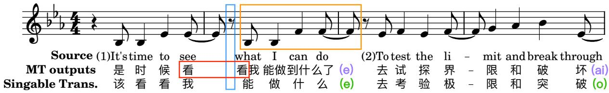
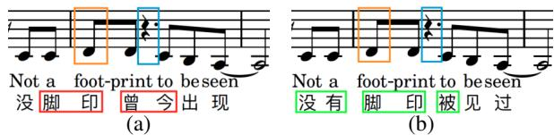
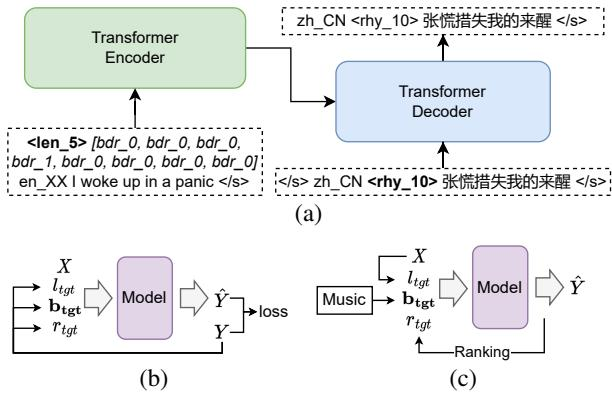
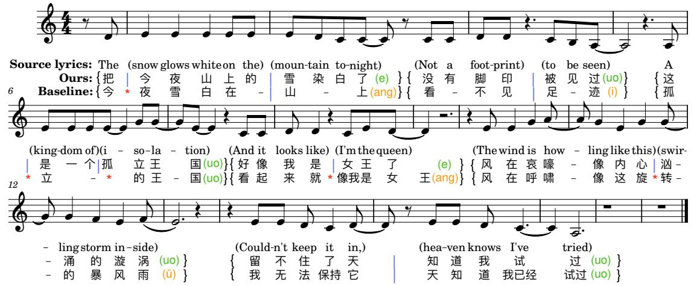
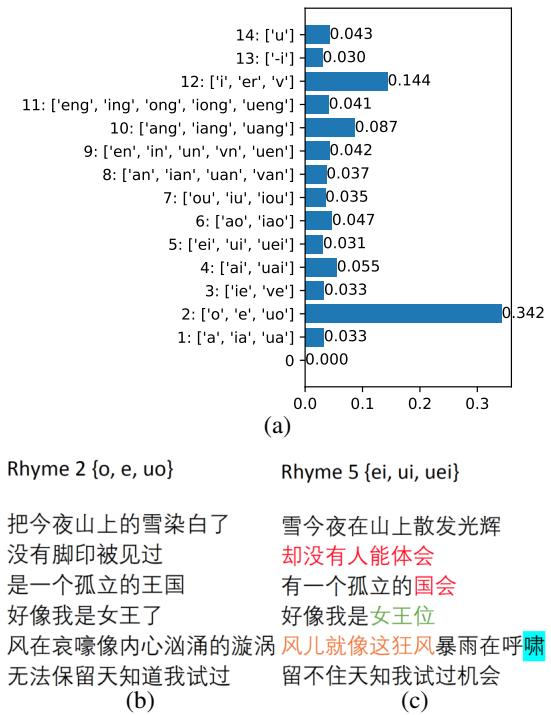
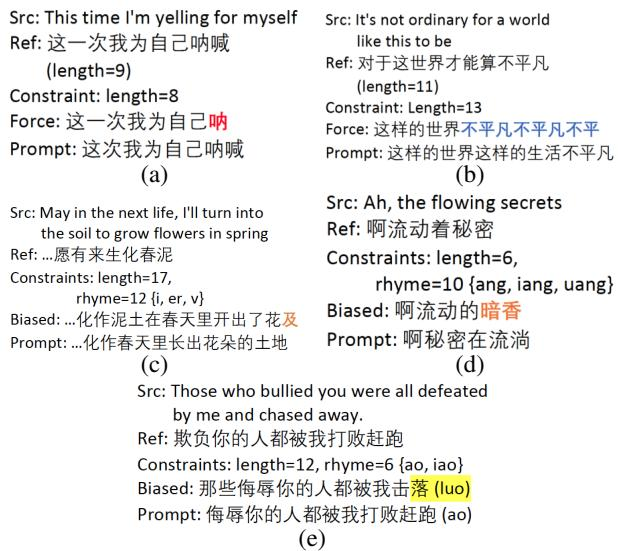
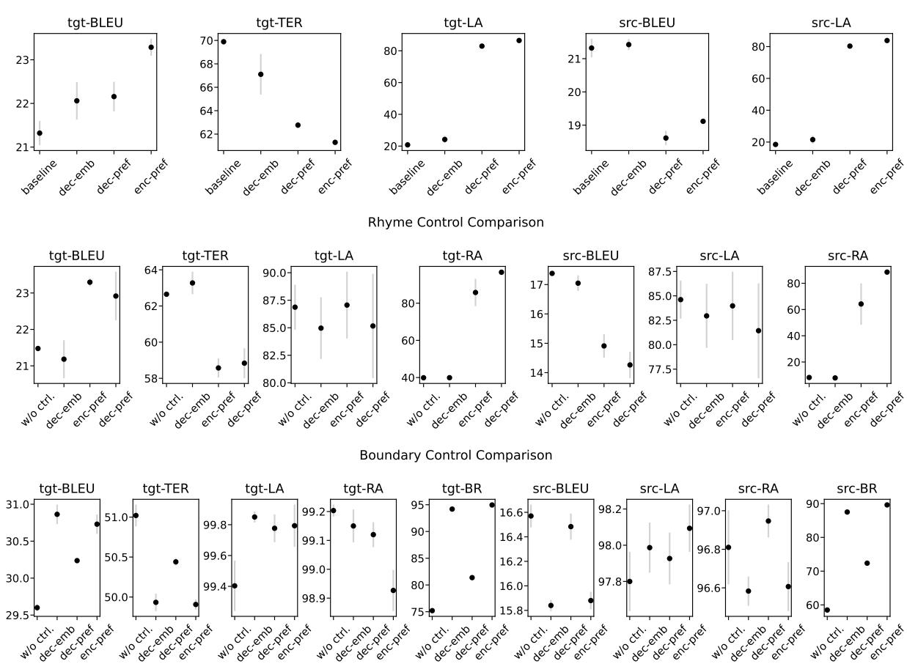
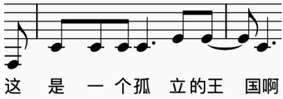
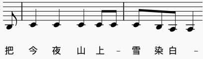
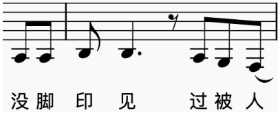

# Songs Across Borders: Singable and Controllable Neural Lyric Translation

Longshen Ou and Xichu Ma and Min-Yen Kan and Ye Wang

National University of Singapore

{longshen, ma\_xichu, kanmy, wangye}@comp.nus.edu.sg

## Abstract

The development of general-domain neural machine translation (NMT) methods has advanced significantly in recent years, but the lack of naturalness and musical constraints in the outputs makes them unable to produce singable lyric translations. This paper bridges the singability quality gap by formalizing lyric translation into a constrained translation problem, converting theoretical guidance and practical techniques from translatology literature to promptdriven NMT approaches, exploring better adaptation methods, and instantiating them to an English-Chinese lyric translation system. Our model achieves 99.85%, 99.00%, and 95.52% on length accuracy, rhyme accuracy, and word boundary recall. In our subjective evaluation, our model shows a 75% relative enhancement on overall quality, compared against naive finetuning1.

## 1 Introduction

With the globalization of entertainment, it is becoming increasingly common for people to appreciate songs in foreign languages. Meanwhile, artists are internationalizing their work and building territories worldwide. Nevertheless, an unfriendly barrier exists between the artists and the audience: most commercial songs are not written in multiple languages. Worse still, most existing song translations entirely ignore the music constraints, renderinglet	it	go them unsingable alone with the music. As a result, the language barrier complicates the interaction between artists and their audience.

Obtaining singable lyric translations can facilitate the globalization of the music publishing industry to further promote the growth of its \$5.9 billion USD market size (Verified Market Research, 2022). However, song translation is unusually difficult for human translators, due to music constraints and style requirements. If we can construct lyricspecific machine translation (MT) systems that can produce drafts that satisfy these constraints and requirements, the difficulty and cost of lyric translation will be largely reduced, as lyricists and translators can start with such automatic drafts and can focus on post-processing for quality and creativity.

However, obtaining singable lyrics from MT systems is challenging. Figure 1 shows two sentences of lyrics from the song Let It Go, together with an MT output and a singable translation. We observe a notable quality gap between them. While the MT output correctly translates the source, it ignores all the criteria that matter to make the output singable: (1) The second sentence of the MT outputs is unnatural because of incoherent vocabulary selection and lack of aesthetics. (2) Overcrowded syllables in the first sentence of the MT outputs force performers to break music notes in the orange box into multiple pieces to align them with lyrics. The rhythm pattern consequently diverges from the composer’s intention. (3) The two-syllable word in the redle box is situated across a musical pause (blue box), causing an unnatural pronunciation. (4) The endsyllables (purple text) are not of the same rhyme pattern, making the output miss a key chance for being poetic.

  
Figure 1: Translation comparison of a general-domain NMT system (2nd row), already been adapted with parallel lyric data, versus a singable translation (3rd row).

In contrast, the singable translation in the third row outperforms the MT output in all four aspects, all while maintaining translation fidelity: it perfectly aligns with each musical note, has the same end-rhyme pattern for the two sentences (green text), a natural stop at the musical pause, and higher naturalness. These properties make it a significantly more performable translation.

To address these quality gaps to obtain singable lyric translations from neural machine translation (NMT) systems, we formalize singable lyric translation as an instance of constrained translation, identify useful constraints, and propose a languagepair independent approach that combines translatology theoretical guidance with prompt-driven NMT. Our contributions are:

• We design an effective and flexible promptbased solution for necessary word boundary position control that enhances the outputs singability.

• We find that reverse-order decoding significantly contributes to the accuracy of promptbased rhyme control. With this decoding strategy as the basis, we further design a rhyme ranking scheme to facilitate picking the bestsuitable rhyme for translating input stanzas.

• We conduct comparative studies of different prompt forms’ effectiveness for controlling each aspect—length, rhyme, and necessary word boundary positions—and show the advantage of prompt-based control over control by modifying beam search.

• We show that adding back-translation of target-side monolingual data for fine-tuning is more effective in adapting the model to the lyric domain, compared with the more common practice of in-domain denoising pretraining.

## 2 Related Work

Lyric/Poetry Translation. Designing domainspecific MT systems for poetic text translation, e.g., poetry and lyrics, is an emerging and underexplored topic in MT. Two previous works conducted pioneering research on lyrics (Guo et al., 2022) and poetry (Ghazvininejad et al., 2018) translation separately by adopting a similar methodology of adjusting beam scores during beam search (referred to as biased decoding) to encourage the generation of outputs with desired constraints. However, there is plenty of room for improvement. As will be shown in later sections, biased decoding not only fails at effectiveness of control, but also negatively impacts text quality and other simultaneously-controlled aspects. Additionally, the inclusion of controlling aspects is insufficiently comprehensive. For example, GagaST (Guo et al., 2022) omits controls for rhyme, but rhyming is actually a critical desired property for song translations (Strangways, 1921).

Lyric Generation. Research on building lyricspecific language models shows the effectiveness of prompt-based control for outputs’ length, rhyme, stress pattern, and theme (Li et al., 2020; Ma et al., 2021; Xue et al., 2021; Ormazabal et al., 2022; Liu et al., 2022). However, several aspects remain to be enhanced.

First, the prompts’ forms vary: some works add prompts by additive embedding vectors (Li et al., 2020; Ma et al., 2021; Xue et al., 2021; Liu et al., 2022) and others by the prefix of input (Ormazabal et al., 2022; Liu et al., 2022). The lack of comparison makes it difficult to conclude the best prompt form for different control aspects.

In addition, prior works did not control for some aspects in a well-designed manner. For example, (Liu et al., 2022) enhances the music–lyric compatibility by controlling the number of syllables of each word in the output. However, music constraints are usually not that tight so that such finelevel controlling might be unnecessary. Additionally, we found that unfitted rhyme prompts damage the output quality. However, we have not seen research suggesting how to choose the best suitable end-rhyme without naively traversing all possible rhyme prompts.

Translatology: Singable Translation of Songs. We attribute the inability of singable lyric translation from general-domain MT systems to the completely different goal of lyric translation compared with normal interlingual translation (Low, 2005): without considering the rhythm, note values, and stress patterns from music, song translations that seem good on paper may become awkward when singing. When the auditory perception is dominated by music (Golomb, 2005), the goal of translation is not again predominated by preserving the semantics of source text (Franzon, 2008), but requires skilled handling of non-semantic aspects (Low, 2013) to attain the music–verbal unity, making it even an unusually complex task for human translators (Low, 2003).

Theory and techniques from translatology provide valuable guidelines for our method design. Particularly, the “Pentathlon Principle” (§3.1) from (Low, 2003) is a widely accepted theoretical guidance to obtain singable song translations (Franzon, 2008; Cheng, 2013; Stopar, 2016; Si-yang, 2017; Opperman et al., 2018; Sardiña, 2021; Pidhrushna, 2021). In addition, some practical translation tricks have also been mentioned in (Low, 2003), e.g., determining the last word first and from back to front when translating sentences in rhyme.

Denoising Pretraining. The deficiency of indomain data requires a powerful foundation model to ensure translation quality. We found large-scale denoising sequence-to-sequence pretraining (Lewis et al., 2019) a great candidate in our problem setting because it has been shown to be particularly effective in enhancing model’s performance on text generation tasks such as summarization (Akiyama et al., 2021) and translation (Liu et al., 2020; Tang et al., 2020), and also on domain-specific applications, e.g., (Yang et al., 2020; Soper et al., 2021; Obonyo et al., 2022). However, as indicated in (Liu et al., 2020), the effectiveness of pretraining is related to the amount of monolingual data. In our case where in-domain data are relatively deficient, adopting the same strategy for adaptation might not be optimal.

Back-Translation. Back-translation (BT) and its variants can effectively boost the performance of NMT models (Sennrich et al., 2015; Artetxe et al., 2017; Lample et al., 2018), and also show superior effectiveness in domain adaptation in low-resource settings (Hoang et al., 2018; Wei et al., 2020; Zhang et al., 2022). It is potentially a better adaptation method and may lead to higher output naturalness, which is required by singable translations.

Prompt-based Methods. Adding prompts during fine-tuning shows strong performance on lexical-constrained-MT (Susanto et al., 2020; Chousa and Morishita, 2021; Wang et al., 2022), as well as broad applicability on various controlling aspects such as output length (Lakew et al., 2019) and the beginning word of output (Li et al., 2022).

Compared to some earlier research that adds lexical constraints during beam search (Hokamp and Liu, 2017; Post and Vilar, 2018), the prompt based solution has a faster decoding speed and higher output quality (Susanto et al., 2020), hence might be the better option in our problem setting.

## 3 Method

To bridge the gaps of previous research, we identify comprehensive controlling aspects from the translatology literature, propose prompt-based solutions for each aspect, and explore more effective foundation models and adaptation methods.

## 3.1 Controlling Aspects

Are there some universal rules that we can adopt to obtain singable translations? We first rule out some prospective answers. Strictly keeping the positions of stressed syllables (Ghazvininejad et al., 2018) is inappropriate as stressing certain syllables is the property of stress-timed language. In contrast, syllable-timed languages, e.g., French and Mandarin, give syllables approximately equal prominence. Aligning the characters’ tone with the melody (Guo et al., 2022) is also not a good choice. On the one hand, this rule only applies to tonal languages. On the other hand, this rule is increasingly being ignored by the majority of songs composed in recent decades (Gao, 2017), indicating the marginalized importance of the intelligibility of songs, especially in pop2.

To achieve a comprehensive and languageindependent method, we define “singable translation” as following the “Pentathlon Principle” from (Low, 2003): that quality, singable translations are obtained by balancing five aspects—singability, rhythm, rhyme, naturalness, and sense. Table 1 lists these aspects and corresponding requirements, and how we actualize them in our model. Particularly, we identify (1)–(3) as the controlling aspects of our model and realize them with prompt-based control, while (4) and (5) are achieved from the perspectives of adaptation and pretraining.

## 3.2 Problem Formulation

We define the task that is tackled in this paper, singable and controllable lyric translation, as follows: given one line of lyrics X in a source language $\boldsymbol { L _ { s r c } }$ and a set of desired properties of output sentence $\{ l _ { t g t } , r _ { t g t } , \mathbf { b } _ { t g t } \}$ , generating text translation Y in target language $L _ { t g t }$ for X by modeling $P ( Y | X , l _ { t g t } , r _ { t g t } , \mathbf { b } _ { t g t } )$ , where (1) the total number of syllables of sentence Y to be precisely equal to length constraint $l _ { t g t } ; ( 2 ) Y$ ends with a word that is in the same rhyme type of rhyme constraint $r _ { t g t } ;$ (3) Y has word boundaries—the positions between two consecutive syllables that belong to different words—in all locations indicated in necessary word boundary constraint $\mathbf { b } _ { t g t } ; ( 4 ) Y$ is of maximal naturalness, and is fidelity to the sense of X.

<table><tr><td>Aspects</td><td>Requirements</td><td>Our Actualization</td></tr><tr><td>(1) Singability</td><td>Outputs are suitable for singing with the given melodies.</td><td>Enhance music-lyric compatibility by prompt-based necessary word boundary control.</td></tr><tr><td>(2) Rhythm</td><td>Outputs follow rhythm patterns in the music.</td><td>Prompt-based length (number of syllables) control.</td></tr><tr><td>(3) Rhyme</td><td>Outputs fulfil certain rhyme patterns.</td><td>Prompt-based end-rhyme control and paragraph-level rhyme ranking.</td></tr><tr><td>(4) Naturalness</td><td>Outputs read like lyrics originally composed in the target language.</td><td>Adapting with back-translation of in-domain target-side monolingual data</td></tr><tr><td>(5) Sense</td><td>Outputs are fidelity to the meaning of source sentences</td><td>Large-scale general-domain pretraining.</td></tr></table>

Table 1: The “pentathlon principle” and the actualizations in our model.

## 3.3 Prompt Methods for Controlling

Two types of special tokens are constructed as prompts for sentence-level control. For each sentence, the length and rhyme prompts are single token len\_i and rhy\_j, indicating the desired number of syllables of the output is i and that the desired end-rhyme type of output is j. The prompt for necessary word boundaries is a sequence of special tokens, bdr = bdr\_0, bdr\_1 len\_i, indicating the desired word boundary positions.

During the training process, these prompts are derived from the analysis of target-side sentences, guiding the model towards generating sentences with corresponding properties. Consequently, there is no need for accompanying music during training. At the inference stage, prompts can be crafted from either music or source-side sentences. For an overview of the system workflow, please refer to Figures 3b and 3c.

We conducted a group of experiments to test three different prompt methods to determine the best one for each control aspect. They are (1) Encpref: prompts are injected into the encoder’s input as a prefix. (2) Dec-pref: prompts are injected into the decoder’s input as a prefix. (3) Dec-emb: prompts are embedded into a vector and added toward the decoder’s input.

## 3.4 Word Boundary Control

Intra-word pause is a typical disfluency pattern of beginning language learners (Franco et al., 1998). However, improperly translated lyrics usually contain multi-syllable words that lies across musical pauses, as the blue box in Figure 2, so that the performer has to make awkward intra-word pauses while singing (Guo et al., 2022), causing a drop in pronunciation acceptability. Besides, we observe that positioning highlighted music notes, such as high notes or downbeats, as the orange box in Figure 2, onto a multi-syllable word’s second or later syllables can bring similar adverse effects due to abrupt changes of pitch and tension3.

  
Figure 2: Demonstration of the necessity of word boundary control. Blue box: musical pauses; orange box: notes highlighted by downbeats; red box: words interrupted by musical pauses or highlighted notes; green box: words without interruption.

We address these issues by carefully designing the placement of word boundaries in outputs, i.e., the points between two consecutive syllables that are from different words. Our aim is to ensure that word boundaries align precisely with the boundaries in music, i.e., the melody boundaries, which occur at musical pauses and before highlighted notes (the blue and orange boxes in Figure 2). In this way, we achieve higher compatibility between the output sentences and the accompanying music, enhance the fluency and consistency of pronunciation during singing, and hence lead to the gain of singability.

This solution is achieved by prompt-based word boundary control. We use the prompt bdr to represent melody boundary positions, indicating necessary word boundary positions. bdr is a sequence of special tokens, and each token corresponds to one syllable in the output. There are two types of special interior tokens: bdr\_1 and bdr\_0, representing after the corresponding syllable “there should be a word boundary” and “we do not care if there is a boundary”, respectively. At test time, bdr is obtained from accompanying music and serves as additional inputs. A well-trained word-boundaryaware model can hence place word boundaries at the desired positions to achieve better music–lyric compatibility. For locations where bdr\_0 is present (“don’t care”), the translation model operates unconstrained, maximizing translation naturalness.

During training, length and rhyme prompts can be obtained directly from the target sentences in the training samples, but not again for necessary word boundary prompts because they have to be obtained from accompanying music which is absent in training. Nevertheless, we offer a solution: we randomly sample from all actual word boundary positions from the target-side text and use this sampled subset as “pseudo ground truth” to construct bdr for training.

## 3.5 Reverse Order Decoding

## 3.5.1 Sentence-Level Control

We imitate the process of human translators translating texts in rhyme: translating the last word first, and from back to front, which is an old trick to keep rhyming patterns from being forced (Low, 2003). We implement this by reverse-order decoding. During fine-tuning with parallel data, we reverse the word order of target-side text while retaining the source-side text unchanged. This approach minimally changes the structure and workflow of offthe-shelf translation models.

## 3.5.2 Paragraph-Level Ranking

Controllability alone is not enough. For a given input sentence, the rhyming usually only looks good in certain rhyme types but appears forced in others (see Appendix C.2 for details). No matter how good the controllability is, the output quality will be severely damaged if an ill-fitting rhyme prompt is provided by the user. To avoid such problems, we need to determine the most suitable end-rhyme for translating one sentence, and further one paragraph consisting of multiple sentences. Previous research left this problem unsolved.

Fortunately, our reverse-order decoder simplifies the rhyme ranking process. During training, we use an additional special token rhy\_0 to nullify rhyme constraints for output. We achieve this by randomly converting a portion of each type of rhyme prompt to rhy\_0 during training. At inference time, for a given source sentence $X _ { i }$ and prompts $l _ { t g t } , r _ { t g t }$ and $\mathbf { b } _ { t g t }$ , we first use rhy\_0 as the rhyme prompt to do the first step of reverse-order decoding to obtain the end-word probability distribution,

$$
\begin{array} { r l } & { P ( y _ { - 1 } | X , l _ { t g t } , \mathbf { b } _ { t g t } , \mathrm { r h y } _ { - } 0 ) } \\ & { = [ p ( w _ { 1 } ) , p ( w _ { 2 } ) , \dots , p ( w _ { v } ) ] , } \end{array}\tag{1}
$$

where the v is the vocabulary size of the target language. Note that the $p ( w _ { j } )$ not only indicates the end-word probability, but also predicts output text quality and the likelihood of satisfaction of length and word boundary constraints of the rhymeunconstrained model, from a greedy point of view. Intuitively, starting with tokens with low probabilities will pull down the corresponding beams’ scores and degrade the output quality. On the contrary, sentences with higher quality can be obtained by starting decoding with $w _ { j }$ with higher $p ( w _ { j } )$ and we achieve this by giving the model a rhyme prompt that guides it towards starting with such $w _ { j }$ . We sum up the probability in Eq. 1 within each rhyme type to obtain the rhyme distribution of given inputs,

$$
p _ { i } = \sum _ { \substack { R h y ( w _ { j } ) \in \mathrm { r h y m e } i } } p ( w _ { j } )
$$

$$
\begin{array} { r l } & { P ( R h y ( Y ) | X , l _ { t g t } , \mathbf { b } _ { t g t } , \mathbf { r h y \_ 0 } ) } \\ & { \qquad = P ( R h y ( y _ { - 1 } ) | X , l _ { t g t } , \mathbf { b } _ { t g t } , \mathrm { r h y \_ 0 } ) } \\ & { \qquad = [ p _ { 1 } , p _ { 2 } , \ldots , p _ { u } ] , } \end{array}
$$

where $R h y ( \cdot )$ is a map between a word or the endword of a sentence to its rhyme type, u is the number of rhyme types in the target language. For a certain rhyme type $i ,$ a higher $p _ { i }$ value indicates a higher probability of successful rhyming and higher output quality.

When translating a paragraph of lyrics, we have multiple sentences together with their corresponding length and boundary prompts as input:

$$
\begin{array} { l } { { { \bf { X } } = [ X _ { 1 } , X _ { 2 } , \ldots , X _ { n } ] , \mathrm { w i t h } \mathrm { p r o m p t s } } } \\ { { \ l ( l _ { t g t _ { 1 } } , { \bf { b } } _ { t g t _ { 1 } } ) , ( l _ { t g t _ { 2 } } , { \bf { b } } _ { t g t _ { 2 } } ) , \ldots , ( l _ { t g t _ { n } } , { \bf { b } } _ { t g t _ { n } } ) ] . } } \end{array}
$$

With the assumption that every sentence is of equal importance, we compute a normalized rhyme distribution for this paragraph by

$$
\begin{array} { l } { { \displaystyle P ( R h y ( Y _ { k } ) ) = f ( X _ { k } , l _ { t g t _ { k } } , { \bf b } _ { t g t _ { k } } , { \bf r h y \mathrm { \tiny _ 0 ) , } } } \quad } \\ { { \displaystyle P ( R h y ( { \bf Y } ) ) = \mathrm { s o f t m a x } ( \sum _ { k = 1 } ^ { n } P ( R h y ( Y _ { k } ) ) ) } } \end{array}
$$

where $f$ refers to the first step of reverse-order decoding. We then use $P ( R h y ( \mathbf { Y } ) )$ as the rhyme ranking score of this paragraph to guide the rhyme selection.

  
Figure 3: (a): Structure of our English-to-Chinese lyric translation system. (b): Workflow of the fine-tuning stage. (c) Workflow of the inference stage.

## 3.6 Utilizing Monolingual Data

In-domain parallel data suffer from two issues. First, its amount is so limited that it is not comparable with general-domain data. Second, there are severe quality issues when target-side lyrics are translated by online communities, including wrong translation (Li, 2020), creative treason (Zhang, 2022), over-domestication (Xie and Lei, 2022), etc.

To mitigate the issue of data quantity and quality, we seek help from target-side monolingual lyric data. Our approach involves incorporating back-translation (Sennrich et al., 2015) of targetside in-domain monolingual data to augment the parallel data for fine-tuning. To demonstrate its effectiveness, we conduct a comparative study with the adaptation method in (Guo et al., 2022), which performs sentence-level denoising pretraining (Lewis et al., 2019) with in-domain data after general-domain pretraining.

Taken together, these innovations form our final control method, which we can apply to any foundation model. In the evaluation that follows, we instantiate our techniques with Multilingual BART (refer to Figure 3 for structure and workflow), producing the Singable Translation (Row 3) in Figure 1. Additional case studies are featured in Appendix C.

## 4 Experiment

We tested our methods with English–Chinese lyric translation. We obtained a small amount of parallel data (about 102K paired sentences after deduplication) by crawling data of both English–Chinese and Chinese–English pairs from an online lyric translation sharing platform4. For target-side monolingual data, we adopted lyric data from three publiclyavailable datasets567, resulting in about 5.5M sentences after deduplication. For details of dataset statistics and splits, data preprocessing, and back translation, please refers to Appendix A.

## 4.1 Model Configuration

We adopted Multilingual BART (Liu et al., 2020) as the foundation model. We set the batch size to the largest possible value to fit into one NVIDIA A5000 GPU (24G), did simple searching for best learning rate, and kept the majority of other hyperparameters as default. For all experiments, models were first trained to converge on back-translated data, and fine-tuned with parallel data afterward. Please refer to Appendix B for implementation details and hyperparameter setting.

## 4.2 Evaluation

The following metrics are used for objective evaluation: Sacre-BLEU (Post, 2018), TER (Snover et al., 2006), length accuracy (LA), rhyme accuracy (RA), and word boundary recall (BR). BLEU is a standard metric for various translation models. TER is also adopted because it directly reflects how much effort the lyricists need to spend to convert model outputs to perfectly singable lyrics. For length and rhyme control, we compare outputs’ lengths and rhymes with desired constraints and compute the accuracy. For word boundary control, we first obtain outputs’ word boundary locations using the Jieba tokenizer8, and then compute the recall value with the necessary word boundary prompts, indicating the ratio of satisfied desired word boundaries.

For models that are constraint-aware for any controlling aspects, we conducted testing over two groups of experiments, as below:

Target as constraints (tgt-const): For a given sentence pair, the length constraint is equal to the number of syllables of the target-side sentence; the rhyme constraint is equal to the rhyme category of the end-word of the target-side sentence; the boundary constraints are randomly sampled from word boundaries inside the target sentences. In this setting, the BLEU and TER scores represent the text quality directly.

<table><tr><td></td><td colspan="5">Tgt-const</td><td colspan="5">Src-const</td></tr><tr><td>Model</td><td>BLEU↑</td><td>TER↓</td><td>LA↑</td><td>RA↑</td><td>BR↑</td><td>BLEU↑</td><td>LA↑</td><td></td><td>RA↑</td><td>BR↑</td></tr><tr><td>Baseline</td><td>21.71</td><td>70.04</td><td>20.54</td><td>37.49</td><td>62.28</td><td></td><td>(21.71)</td><td>18.15</td><td>8.04</td><td>55.88</td></tr><tr><td>Ours</td><td>30.69</td><td>49.72</td><td>99.85</td><td>99.00</td><td></td><td>95.52</td><td>16.04</td><td>98.25</td><td>96.53</td><td>89.77</td></tr></table>

Table 2: Results of our final model versus the baseline model. Baseline: mBART pretraining + finetuning with parallel data. Ours: mBART pretraining + finetuning with BT and parallel data + full constraints. LA, RA, BR refer to length accuracy, rhyme accuracy, and boundary recall, respectively. The best result is bolded. BLEU scores of baseline in the src-const setting, given in (parentheses), is not considered in the comparison in this and following tables.

Source as constraints (src-const): For a given sentence pair, the length constraint is equal to the number of syllables of the source-side sentence; the rhyme constraint is randomly sampled from the real rhyme type distribution of lyrics in the target language, obtained from our monolingual dataset; the boundary constraints are randomly sampled from word boundaries inside the source sentences. This setting simulates real-world lyric translation cases and is more challenging.

In src-const, we do not compare constrained models with unconstrained ones on BLEU or compute TER for outputs, as target-side sentences often possess distinct properties (e.g., # syllables) from prompts generated by source sentences, rendering them not the ground truth. Owing to the divergence between references and prompts, models with more constraints yield lower BLEUs, and TER in srcconst fails to accurately reflect translation quality.

We compare our model with two baselines. The first is the unconstrained and un-adapted Baseline model presented in Table 2. The second is GagaST (Guo et al., 2022), which, to the best of our knowledge, is the only prior work on lyric translation. Due to data acquisition difficulties, we did not perform a model-level comparison with GagaST. Instead, we compared the effectiveness of their adaptation (in-domain denoising pre-training) and control method (biased decoding) with ours (BT and prompt-based control), and compare generation results through subjective evaluation.

## 5 Results

Table 2 shows the results of our final model. In the tgt-const setting, our model surpasses the baseline model on all objective aspects, not only with much higher BLEU and lower TER scores, but also achieves almost perfect length and rhyme accuracies and a competitive boundary recall score. The success of controlling length, rhyme, and word boundary while maintaining a high text quality enables our model to generate singable lyric translations. In addition, the controlling mechanism remains effective in the src-const setting, showing the generalizability of our methods.

<table><tr><td>Model</td><td>BLEU↑</td><td>TER↓</td></tr><tr><td>Transformer</td><td>8.97</td><td>84.92</td></tr><tr><td>mBart w/o ft</td><td>16.44</td><td>84.64</td></tr><tr><td>mBart pt + ft (baseline)</td><td>21.71</td><td>70.04</td></tr><tr><td>+ In-domain denoise pt</td><td>22.18</td><td>68.61</td></tr><tr><td>+ BT target side mono data</td><td>25.53</td><td>64.22</td></tr></table>

Table 3: Comparison of unconstrained models. Best result in bold.

<table><tr><td></td><td colspan="3">Tgt-const</td><td colspan="2">Src-const</td></tr><tr><td>Model</td><td>BLEU↑</td><td>TER↓</td><td>Len acc↑</td><td>BLEU↑</td><td>Len acc↑</td></tr><tr><td>Baseline</td><td>21.32</td><td>69.89</td><td>20.78</td><td>(21.32)</td><td>18.48</td></tr><tr><td>Dec-emb</td><td>22.06</td><td>67.11</td><td>24.18</td><td>21.42</td><td>21.52</td></tr><tr><td>Dec-pref</td><td>22.16</td><td>62.77</td><td>82.94</td><td>18.61</td><td>80.30</td></tr><tr><td>Enc-pref</td><td>23.29</td><td>61.30</td><td>86.49</td><td>19.12</td><td>83.78</td></tr></table>

Table 4: Comparison of prompt methods for length constraints. Decoding direction: normal. Best result in bolded, second best underlined.

## 5.1 Unconstrained Models

As in Table 3, both general-domain pretraining and in-domain fine-tuning are necessary to ensure translation quality. There are performance drops if any of the two components are canceled from the unconstrained model. Meanwhile, fine-tuning with back-translated in-domain monolingual data further contributes to the performance gain, showing higher adaptation effectiveness than in-domain pretraining. We also show BT’s contribution to improving naturalness in §5.5.

<table><tr><td rowspan="2">Model</td><td colspan="4">Tgt-const</td><td colspan="3">Src-const</td></tr><tr><td>BLEU↑</td><td>TER↓</td><td>LA↑</td><td>RA↑</td><td>BLEU↑</td><td>LA↑</td><td>RA↑</td></tr><tr><td>W/o ctrl</td><td>21.48</td><td>62.65</td><td>86.87</td><td>39.88</td><td>(17.38)</td><td>84.61</td><td>8.19</td></tr><tr><td>Dec-emb</td><td>21.18</td><td>63.27</td><td>84.97</td><td>39.90</td><td>17.05</td><td>82.95</td><td>7.87</td></tr><tr><td>Enc-pref</td><td>23.30</td><td>58.57</td><td>87.06</td><td>85.77</td><td>14.91</td><td>83.97</td><td>64.21</td></tr><tr><td>Dec-pref</td><td>22.92</td><td>58.84</td><td>85.16</td><td>96.66</td><td>14.26</td><td>81.43</td><td>88.52</td></tr></table>

Table 5: Comparison of prompt methods for rhyme constraints, when controlling length and rhyme together with reverse-order decoding. The best result is marked in bold, the second best underlined. W/o ctrl: lengthcontrol-only model.

<table><tr><td rowspan="2">Model</td><td colspan="4">Tgt-const</td><td colspan="4"></td></tr><tr><td>BLEU↑</td><td>TER↓</td><td>LA↑</td><td>RA↑</td><td>BR↑</td><td>BLEU↑</td><td>LA↑ RA↑</td><td>BR↑</td></tr><tr><td>W/o ctrl.</td><td>29.60</td><td>51.02</td><td>99.40</td><td>99.20</td><td>75.20</td><td>(16.57) 97.80</td><td>96.81</td><td>58.49</td></tr><tr><td>Dec-emb</td><td>30.86</td><td>49.93</td><td>99.85</td><td>99.15</td><td>94.19</td><td>15.84 97.99</td><td>96.58</td><td>87.52</td></tr><tr><td>Dec-pref</td><td>30.24</td><td>50.44</td><td>99.78</td><td>99.12</td><td>81.37</td><td>16.48 97.93</td><td>96.95</td><td>72.36</td></tr><tr><td>Enc-pref</td><td>30.73</td><td>49.91</td><td>99.79</td><td>98.93</td><td>94.96</td><td>15.88</td><td>98.09 96.61</td><td>89.62</td></tr></table>

Table 6: Comparison of prompt methods for word boundary constraints. Decoding direction: reverse. The best result in bold, the second best, underlined. W/o ctrl: model with only length and rhyme control.

<table><tr><td></td><td colspan="4">Tgt-const</td><td colspan="3">Src-const</td></tr><tr><td>Model</td><td>BLEU↑</td><td>TER↓</td><td>LA↑</td><td>BR↑</td><td>BLEU↑</td><td>LA↑</td><td>BR↑</td></tr><tr><td>Length-only</td><td>26.86</td><td>56.48</td><td>99.43</td><td>73.31</td><td>(20.91)</td><td>97.70</td><td>60.62</td></tr><tr><td>+ Biased dec</td><td>17.19</td><td>68.68</td><td>87.14</td><td>75.60</td><td>13.85</td><td>84.92</td><td>65.51</td></tr><tr><td>+ Prompt</td><td>27.21</td><td>56.07</td><td>99.77</td><td>95.22</td><td>16.04</td><td>98.25</td><td>89.77</td></tr></table>

Table 7: Comparison of prompt and biased decoding for word boundary control. Best in bold; second best, underlined.

## 5.2 Best Prompt Methods

We select the most effective prompt method for different controlling aspects in our final model. Here are the effectiveness comparisons.

Length Control. As shown in Table 4, the encoder-side prefix is the best prompt method for length control, with the highest length accuracy and higher translation quality than dec-pref.

Rhyme Control. As shown in Table 5, the decoder-side prefix is the best method for rhyme control, with a significantly higher rhyme accuracy than the second-best method encoder-side prefix.

Word Boundary Control.9 As shown in Table 6, enc-pref is the best for word boundary control with much higher effectiveness than dec-pref. It has comparable performance with dec-emb in tgt-const, but shows stronger controllability in the src-const setting, indicating better generalizability.

<table><tr><td colspan="2"></td><td colspan="4">Tgt-const</td><td colspan="3">Src-const</td></tr><tr><td colspan="2">Model</td><td>BLEU↑</td><td>TER↓</td><td>LA↑</td><td>RA↑</td><td>BLEU↑</td><td>LA↑</td><td>RA↑</td></tr><tr><td rowspan="3">L-to-R</td><td>Len only</td><td>26.86</td><td>56.48</td><td>99.43</td><td>40.04</td><td>(20.91)</td><td>97.70</td><td>8.44</td></tr><tr><td>+ Biased dec</td><td>24.77</td><td>59.68</td><td>98.50</td><td>83.18</td><td>18.58</td><td>96.38</td><td>80.90</td></tr><tr><td>Dec-pref</td><td>28.81</td><td>52.04</td><td>98.25</td><td>94.88</td><td>18.82</td><td>96.21</td><td>84.00</td></tr><tr><td rowspan="3">R-to-L</td><td>Len only</td><td>26.04</td><td>57.09</td><td>98.95</td><td>43.36</td><td>(20.63)</td><td>96.85</td><td>8.41</td></tr><tr><td>+ Biased dec</td><td>26.45</td><td>57.82</td><td>98.83</td><td>86.99</td><td>16.68</td><td>96.90</td><td>79.28</td></tr><tr><td>Dec-pref</td><td>29.59</td><td>50.95</td><td>99.25</td><td>99.23</td><td>16.89</td><td>97.60</td><td>96.80</td></tr></table>

Table 8: Comparison of rhyme control performance of biased decoding and prompt method. L-to-R: decode in normal order; R-to-L: decode in reverse order. In each group, the best result is marked by boldface, the second best is marked by underline.

## 5.3 Prompt-Based Word Boundary Control

As in Table 7, prompt-based control is much more successful than biased decoding in word boundary control, not only achieving high boundary recall (95.22% and 89.77%) but also slightly raising the length accuracy and text quality. On the contrary, biased decoding contributes limited power to word boundary control with the expense of significant drops in text quality and length control accuracy.

## 5.4 Prompt-Based Reverse-Order Decoding

Prompt vs. Biased Decoding. As in Table 8, the prompt-based method again shows higher effectiveness in rhyme control, while the biased decoding again negatively impacts text quality. As in Appendix C.3, the prompt-based control enables the model to adjust the expression of the entire sentence according to the given desired rhyme, achieving higher consistency, but the biased decoding sometimes abruptly changes the end-word to fulfill the constraint without considering whether it is compatible with input sentence and target-side context.

Normal vs. Reverse. Reverse-order decoding further raise the performance of prompt-based rhyme control, but conversely, only brings marginal improvement to biased-decoding-based control. A possible explanation is the inability of biased decoding to handle polyphones (see Appendix C.3). We observed multiple cases where one of the pronunciation of the end-word in its output does satisfy the rhyme requirement, but is not the pronunciation in that context. On the contrary, the prompt-based control is aware of the whole target-side sentence, and hence better controllability is achieved.

## 5.5 Human Evaluation

We employ five students from a local university with music performance or lyric composing backgrounds. We let participants evaluate outputs on five-point scales and take the average as the final score. Evaluations are from four dimensions: (1) sense, whether the translation output retains the meaning of the input sentence; (2) naturalness, whether the translation output sounds like lyrics composed initially in the target language; (3) music– lyric compatibility, the degree of outputs and music match with each other and the consequent singability gain; (4) Singable Translation Score (STS), the overall quality as singable translations, a singlevalue metric considering the satisfaction of all five perspectives in the Pentathlon Principle (§3.1)10.

<table><tr><td>Model</td><td>Sense</td><td>Naturalness</td><td>Compatibility</td><td>STS</td></tr><tr><td>Baseline</td><td>4.02</td><td>3.80</td><td>2.53</td><td>2.04</td></tr><tr><td>GagaST</td><td>3.84</td><td>3.72</td><td>4.01</td><td>2.97</td></tr><tr><td>Ours</td><td>3.95</td><td>3.78</td><td>4.42</td><td>3.57</td></tr><tr><td>- bdr</td><td>3.91</td><td>3.72</td><td>4.21</td><td>3.46</td></tr><tr><td>- rhy</td><td>4.15</td><td>4.03</td><td>4.21</td><td>3.24</td></tr><tr><td>- len</td><td>4.36</td><td>3.96</td><td>2.64</td><td>2.31</td></tr></table>

Table 9: Subjective evaluation results. bdr: word boundary control; rhy: rhyme control; len: length control.

Table 9 shows the subjective evaluation results of baseline, GagaST (Guo et al., 2022), our model, and some ablated variants. On the STS metric, which is the ultimate goal of singable lyric translation, our model significantly outperforms the baseline and GagaST by 75.0% and 20.2%, showing its ability to generate singable translations. Besides, our model performs especially well on music–lyric compatibility, by 74.7% and 10.2% higher scores than the baseline and GagaST. In contrast, the baseline model performs worst on the two metrics.

In addition, we show the contributions of different components by the ablated studies. The word boundary control raises music–lyric compatibility (+0.21) and overall quality (+0.11). The contribution from rhyme control is majorly on the overall quality part (+0.22), but with the expense of sense (-0.24) and naturalness (-0.31). Length control is the foundation of music–lyric compatibility (+1.57) and STS (+0.93), but with some expense of sense (- 0.21). Adaptation with BT increases sense (+0.34) and naturalness (+0.16).

## 6 Conclusion

We discussed how to obtain singable translations with prompt-driven NMT systems with the guidance of translatology theories. Specifically, we used back-translation to enhance translation quality and naturalness. We compared the effectiveness of different prompt methods in different controlling aspects and showed their advantage over biased decoding. We designed an effective word boundary control approach and presented a training strategy without the help of music data. We demonstrated the effectiveness of reverse-order decoding in NMT models for rhyme control and showed how it helps users to choose the best suitable rhymes for a paragraph of source text.

This work does not explore more detailed prompt manipulation, such as using varied prompts for the same constraint or examining prompt order’s impact on performance. We leave these investigations for future research.

## Limitations

The current system may require the user to have some music knowledge to compose the word boundary prompt from music. Hence, more efforts need to be made to fulfill this gap before such a system can operate fully automatically without the human user providing word boundary prompt themselves.

We use the back-translation of mono-lingual data to augment the parallel training data, but the quality, especially the text style of back-translations has room to improve. Although we have tried using iterative BT to gradually refine the backward direction MT model to adapt its outputs to lyric style, we found some errors gradually accumulated in the back-translated data, which finally made our model perform unsatisfactorily for negative sentences, together with the decrease of controlling effectiveness. Further exploration is needed in this aspect.

Similar to chat text, lyrics are usually composed in short sentences. Sometimes it would be challenging to guarantee the consistency of style and meaning for different sentences, if the current sentencelevel translation system are adopted. Hence, for building future lyric translation systems, it would be a better option to translate the lyrics directly at the paragraph level or document level.

## Ethics Statement

Our system will help facilitate the creation/recreation of lyrics for song composers. In addition, although our system is implemented in the direction of English-to-Chinese, the controlling aspects and approaches are universal because we did not take any language-specific aspects into account; hence can be easily implemented in other language pairs. Besides, the method and system discussed in this paper are suitable for creating/re-creating singable song lyrics in languages beyond the original version. They also have the potential to benefit language learning by translating domestic languages into other languages the learner is studying and facilitating learning by singing.

This methodology has limitations by putting the singability into priority. Translations from this system may sometimes not convey the exact meaning of the lyrics in the source language, causing misunderstanding in this case. For cases where conveying the original meaning is crucial, e.g., advertising and serious art songs, the translation outputs need to be checked and revised when necessary by the user before further usage.

For the training and evaluation of our system, all data is publicly available online. Specifically, Chinese Lyric Corpus11 is a public GitHub repository with an MIT license. Lyricstranslate.com is a lyric translation sharing platform, where all parallel lyrics we obtained are publicly available in this website. We adhere to the rules specified in the website’s robots.txt file when crawling. For all existing scientific artifacts used in this research, including datasets, models, and code, we ensure they are used in their original intended usage. For human evaluation, we collect evaluation scores without personal identifiers for subjective evaluation to ensure a fair comparison. We ensure that the questionnaire does not contain any offensive content. Please refer to Appendix E for more details of subjective evaluation.

## Acknowledgements

This project was funded by research grant A-0008150-00-00 from the Ministry of Education, Singapore.

## References

Kazuki Akiyama, Akihiro Tamura, and Takashi Ninomiya. 2021. Hie-BART: Document summarization with hierarchical BART. In Proceedings of the 2021 Conference of the North American Chapter of the Associationfor Computational Linguistics: Student

Research Workshop, pages 159–165, Online. Association for Computational Linguistics.

Mikel Artetxe, Gorka Labaka, Eneko Agirre, and Kyunghyun Cho. 2017. Unsupervised neural machine translation. arXiv preprint arXiv:1710.11041.

Hui Tung Cheng. 2013. Singable Translating: A Vieweroriented Approach to Cantonese Translation of Disney Animated Musicals. Ph.D. thesis, Chinese University of Hong Kong.

Katsuki Chousa and Makoto Morishita. 2021. Input augmentation improves constrained beam search for neural machine translation: NTT at WAT 2021. In Proceedings ofthe 8th Workshop on Asian Translation (WAT2021), pages 53–61, Online. Association for Computational Linguistics.

Alexandre Défossez. 2021. Hybrid spectrogram and waveform source separation. In Proceedings ofthe ISMIR 2021 Workshop on Music Source Separation.

Horacio Franco, Leonardo Neumeyer, and Harry Bratt. 1998. Modeling intra-word pauses in pronunciation scoring. In STiLL-Speech Technology in Language Learning.

Johan Franzon. 2008. Choices in song translation: Singability in print, subtitles and sung performance. The Translator, 14(2):373–399.

FeiGao. 2017. 歌曲写作中旋律与歌词的关系. 当代音乐, (24):106–107.

Marjan Ghazvininejad, Yejin Choi, and Kevin Knight. 2018. Neural poetry translation. In Proceedings of the 2018 Conference of the North American Chapter of the Association for Computational Linguistics: Human Language Technologies, Volume 2 (Short Papers), pages 67–71.

Harai Golomb. 2005. Music-linked translation [mlt] and mozart’s operas: Theoretical, textual, and practical perspectives. In Song and Significance, pages 121– 161. Brill.

Fenfei Guo, Chen Zhang, Zhirui Zhang, Qixin He, Kejun Zhang, Jun Xie, and Jordan Boyd-Graber. 2022. Automatic song translation for tonal languages. arXiv preprint arXiv:2203.13420.

Vu Cong Duy Hoang, Philipp Koehn, Gholamreza Haffari, and Trevor Cohn. 2018. Iterative backtranslation for neural machine translation. In Proceedings of the 2nd workshop on neural machine translation and generation, pages 18–24.

Chris Hokamp and Qun Liu. 2017. Lexically constrained decoding for sequence generation using grid beam search. arXiv preprint arXiv:1704.07138.

Terry K Koo and Mae Y Li. 2016. A guideline of selecting and reporting intraclass correlation coefficients for reliability research. Journal of chiropractic medicine, 15(2):155–163.

Surafel Melaku Lakew, Mattia Di Gangi, and Marcello Federico. 2019. Controlling the output length of neural machine translation. arXiv preprint arXiv:1910.10408.

Guillaume Lample, Alexis Conneau, Ludovic Denoyer, and Marc’Aurelio Ranzato. 2018. Unsupervised machine translation using monolingual corpora only. In 6th International Conference on Learning Representations, ICLR 2018, Vancouver, BC, Canada, April 30 - May 3, 2018, Conference Track Proceedings. OpenReview.net.

Mike Lewis, Yinhan Liu, Naman Goyal, Marjan Ghazvininejad, Abdelrahman Mohamed, Omer Levy, Ves Stoyanov, and Luke Zettlemoyer. 2019. Bart: Denoising sequence-to-sequence pre-training for natural language generation, translation, and comprehension. arXiv preprint arXiv:1910.13461.

Piji Li, Haisong Zhang, Xiaojiang Liu, and Shuming Shi. 2020. Rigid formats controlled text generation. In Proceedings of the 58th annual meeting of the association for computational linguistics, pages 742– 751.

Yafu Li, Yongjing Yin, Jing Li, and Yue Zhang. 2022. Prompt-driven neural machine translation. In Findings ofthe Associationfor Computational Linguistics: ACL 2022, pages 2579–2590.

Yuanze Li. 2020. 英文歌词翻译存在的问题及应遵循原则. 山西青年.

Nayu Liu, Wenjing Han, Guangcan Liu, Da Peng, Ran Zhang, Xiaorui Wang, and Huabin Ruan. 2022. Chip-Song: A controllable lyric generation system for Chinese popular song. In Proceedings ofthe First Workshop on Intelligent and Interactive Writing Assistants (In2Writing 2022), pages 85–95, Dublin, Ireland. Association for Computational Linguistics.

Yinhan Liu, Jiatao Gu, Naman Goyal, Xian Li, Sergey Edunov, Marjan Ghazvininejad, Mike Lewis, and Luke Zettlemoyer. 2020. Multilingual denoising pretraining for neural machine translation. Transactions ofthe Associationfor Computational Linguistics, 8:726–742.

Peter Low. 2003. Singable translations of songs. Perspectives: Studies in Translatology, 11(2):87–103.

Peter Low. 2005. The pentathlon approach to translating songs. In Song and significance, pages 185–212. Brill.

Peter Low. 2013. When songs cross language borders: Translations, adaptations and ‘replacement texts’. The Translator, 19(2):229–244.

Xichu Ma, Ye Wang, Min-Yen Kan, and Wee Sun Lee. 2021. Ai-lyricist: Generating music and vocabulary constrained lyrics. In Proceedings of the 29th ACM International Conference on Multimedia, pages 1002– 1011.

Ishmael Obonyo, Silvia Casola, and Horacio Saggion. 2022. Exploring the limits of a base BART for multidocument summarization in the medical domain. In Proceedings of the Third Workshop on Scholarly Document Processing, pages 193–198, Gyeongju, Republic of Korea. Association for Computational Linguistics.

Suezette Opperman, Marlie Van Rooyen, and Kobus Marais. 2018. An inter-semiotic approach to translation: Leonard cohen in afri-kaans. Literator: Journal ofLiterary Criticism, Comparative Linguistics and Literary Studies, 39(1):1–9.

Aitor Ormazabal, Mikel Artetxe, Manex Agirrezabal, Aitor Soroa, and Eneko Agirre. 2022. Poelm: A meter-and rhyme-controllable language model for unsupervised poetry generation. arXiv preprint arXiv:2205.12206.

Olena Pidhrushna. 2021. Functional approach to songs in film translation: Challenges and compromises. In SHS Web ofConferences, volume 105. EDP Sciences.

Matt Post. 2018. A call for clarity in reporting bleu scores. arXiv preprint arXiv:1804.08771.

Matt Post and David Vilar. 2018. Fast lexically constrained decoding with dynamic beam allocation for neural machine translation. arXiv preprint arXiv:1804.06609.

Lucía Camardiel Sardiña. 2021. The Translation of Disney Songs into Spanish: Differences Between the Peninsular Spanish and the Latin American Spanish Versions. Ph.D. thesis, University of Hawai’i at Manoa.

Rico Sennrich, Barry Haddow, and Alexandra Birch. 2015. Improving neural machine translation models with monolingual data. arXiv preprint arXiv:1511.06709.

Chen Si-yang. 2017. Practical strategies for devising singable song translations: A case study on wuhan university anthem translation. Overseas English.

Matthew Snover, Bonnie Dorr, Richard Schwartz, Linnea Micciulla, and John Makhoul. 2006. A study of translation edit rate with targeted human annotation. In Proceedings of the 7th Conference of the Associationfor Machine Translation in the Americas: Technical Papers, pages 223–231.

Elizabeth Soper, Stanley Fujimoto, and Yen-Yun Yu. 2021. BART for post-correction of OCR newspaper text. In Proceedings of the Seventh Workshop on Noisy User-generated Text (W-NUT 2021), pages 284–290, Online. Association for Computational Linguistics.

Andrej Stopar. 2016. Mamma mia, a singable translation! ELOPE: English Language Overseas Perspectives and Enquiries, 13(1):141–159.

A. H. FOX Strangways. 1921. SONG-TRANSLATION. Music and Letters, II(3):211–224.

Raymond Hendy Susanto, Shamil Chollampatt, and Liling Tan. 2020. Lexically constrained neural machine translation with levenshtein transformer. arXiv preprint arXiv:2004.12681.

Yuqing Tang, Chau Tran, Xian Li, Peng-Jen Chen, Naman Goyal, Vishrav Chaudhary, Jiatao Gu, and Angela Fan. 2020. Multilingual translation with extensible multilingual pretraining and finetuning. arXiv preprint arXiv:2008.00401.

Verified Market Research. 2022. Global Music Publishing Market Size By Type (Synchronization, Mechanical, Performance, Digital), By Application (Commercial, Common Weal), By Geographic Scope And Forecast.

Shuo Wang, Zhixing Tan, and Yang Liu. 2022. Integrating vectorized lexical constraints for neural machine translation. In Proceedings of the 60th Annual Meeting ofthe Associationfor Computational Linguistics (Volume 1: Long Papers), pages 7063–7073, Dublin, Ireland. Association for Computational Linguistics.

Hao-Ran Wei, Zhirui Zhang, Boxing Chen, and Weihua Luo. 2020. Iterative domain-repaired backtranslation. In Proceedings ofthe 2020 Conference on Empirical Methods in Natural Language Processing, EMNLP 2020, Online, November 16-20, 2020, pages 5884–5893. Association for Computational Linguistics.

Huixin Xie and Qinglan Lei. 2022. 归化异化视角下线上音乐平台歌词翻译分析. 海外英语.

Lanqing Xue, Kaitao Song, Duocai Wu, Xu Tan, Nevin L Zhang, Tao Qin, Wei-Qiang Zhang, and Tie-Yan Liu. 2021. Deeprapper: Neural rap generation with rhyme and rhythm modeling. arXiv preprint arXiv:2107.01875.

Wenmian Yang, Guangtao Zeng, Bowen Tan, Zeqian Ju, Subrato Chakravorty, Xuehai He, Shu Chen, Xingyi Yang, Qingyang Wu, Zhou Yu, et al. 2020. On the generation of medical dialogues for covid-19. arXiv preprint arXiv:2005.05442.

Hongxiao Zhang, Hui Huang, Jiale Gao, Yufeng Chen, Jinan Xu, and Jian Liu. 2022. Iterative constrained back-translation for unsupervised domain adaptation of machine translation. In Proceedings of the 29th International Conference on Computational Linguistics, pages 5054–5065, Gyeongju, Republic of Korea. International Committee on Computational Linguistics.

Yiran Zhang. 2022. 英文歌词文言文翻译中的创造性叛逆问题分析. 英语广场.

## A Data Preprocessing

## A.1 Dataset Details

The monolingual lyric corpus from three sources includes lyrics data in Chinese, and vast majority of them are in pop genre. Lyrics of one song contains multiple lines. Each line usually corresponds to one utterance in singing. The length of each line is usually short. There are 8.6 Chinese characters each line on average. Only a few cases contains lines longer than 20 Chinese characters.

<table><tr><td></td><td>一</td><td>Train</td><td>Validation</td><td>Test</td><td>Total</td></tr><tr><td rowspan="2">Back-translated</td><td>#songs</td><td>142,796</td><td>104</td><td>104</td><td>143,004</td></tr><tr><td>#sentences</td><td>2,720,603</td><td>2,164</td><td>2,175</td><td>2,724,942</td></tr><tr><td rowspan="2">Parallel</td><td>#songs</td><td>5,341</td><td>196</td><td>201</td><td>5,738</td></tr><tr><td>#sentences</td><td>102,177</td><td>4,011</td><td>4,006</td><td>110,194</td></tr></table>

Table 10: Dataset size of different splits.

The crawled parallel lyrics contains two parts. For the first part, the lyrics are created in English originally, and translated to Chinese by online communities. The second part is composed in Chinese originally and translated to English. Similarly, most of them are in pop genre.

## A.2 Dataset Splitting

Train/validation/test splitting is performed separately for BT and parallel data. Table 10 shows the detailed statistics.

## A.3 Data Preprocessing

We perform text normalization for all Chinese lyric text: all special symbols are removed; traditional characters are substituted with simplified characters12; sentences that are longer than 20 characters are removed; any duplicated sentences are removed. Finally, we split the datasets into train, validation, and test splits while ensuring no same songs exist in different splits.

For in-domain denoising pretraining experiments, text corrupting is performed by sentencelevel mask prediction. There is one mask for each sentence. For the span of masks, for sentences with length in (1, 3] and larger than 3, the mask span is sampled from a Poisson distribution with lambda equals 1 and 3, respectively.

## A.4 Back Translation

For back translation, we adopt a Transformer trained with generic-domain Chinese-to-English data13 to obtain sentence-level back translation.

## B Implementation details

Model Configuration At the early stage of our experiment, we found that fine-tuning with genericdomain data does not help with the translation quality of lyrics. Hence we adopt mBART without general-domain fine-tuning as the starting point of training. For the unadapted general-domain model, we use mbart-large-50-one-to-many14.

Our final model is obtained by fine-tuning mbartlarge-5015 (#param: 610,879,488) with both backtranslated monolingual data and parallel data. The tokenizer is modified to be character-level on the Chinese side for better controlling effectiveness. The model is trained on one Nvidia A5000 GPU (24GB) for 10 epochs and 3 epochs on backtranslation and parallel data, respectively, taking about 16 hours and 3 hours. The learning rate is set to 3e-5 and 1e-5, respectively, on BT and parallel data. They are the best value in {1e-5, 3e-5, 1e-4} for the baseline model on the two stages of training. Warm-up steps are set to 2500 and 300 for training with the BT and the parallel data. Dropout and label smoothing are set to 0. For decoding, beam-search with beam size 5 is adopted. The maximum output length is set to 30. All other hyperparameters remain as default values.

For the dec-emb experiments, instead of using sinusoidal encoding for prompts, we use learnable embedding to keep aligned with the positional em-

bedding of mBART.

Length Prompt. We construct 20 length tokens for length control, len\_1 to len\_20 for translation output. According to the authors’ observation, only an extremely tiny amount of lyrics in Mandarin have more than 20 characters in one line.

Rhyme Prompt. For rhyme control, we adopt the Chinese 14-rhyme scheme16 for possible rhyme type, implemented as rhy\_1 to rhy\_14. There is a special token rhy\_0 representing “no rhyme control”. This is achieved by randomly setting 1/15 of each type of rhyme prompt to rhy\_0 during training.

Word Boundary Prompt We first sample a number n from a categorical distribution with the ratio of 1:4:3:1 for 1, 2, 3, and 4 boundaries, and use n′ = min(number of words, n) as the number of bdr\_1 tokens. Then, we uniformly sample n′ times from all syllable boundary locations, without replacement, as the locations of these bdr\_1. After that, we initialize the prompt sequence as a sequence of bdr\_0 where the length of the sequence equals the number of syllables in the reference sentence. Finally, we substitute bdr\_0 with bdr\_1 for-   the sampled locations.

  
Figure 4: Translation comparison of the our model and the baseline (mBART + finetuning with parallel data). Source lyrics are from the first verse of the song Let It Go. Prompt: length equals to number of syllables of source text; 1st-ranked rhyme (type 2 {o, e, uo}); word boundary is extracted from melody, as shown in the source lyrics by parentheses. Sentence boundaries are marked by “{” and “}”. Satisfied and unsatisfied rhymes are marked by green and orange texts respectively. Satisfied and unsatisfied word boundaries are marked by | and \* respectively

  
Figure 5: (a): Rhyme ranking scores of different rhymes, when translating the the paragraph in Figure 4. (b) and (c): different translation output with different rhymes, using the rhyme with highest ranking score and with second lowest ranking score, respectively. Translation errors are marked in the right paragraph: wrong translation are marked with red, text marked in green does not conforms to target language grammar, orange text is repeated translation, highlighted word is in wrong rhyme.

## C More Case Studies

## C.1 Model Outputs

We show the translation comparison of the proposed model and the baseline model in Figure 4. The outputs are perfect in the number of syllables and rhyme constraints. With the guidance of word boundary constraints, the output has much higher music-lyric compatibility than the baseline’s output. For example, there is a downbeat lying on the note of the second word in the source lyrics, "snow", creating a melody boundary between the first and the second note. To get rid of pronunciation interruption, our system successfully places a word boundary here, avoiding the scenario where the second syllable of the word "今夜" is highlighted. Similarly, in the fourth sentence, our system places a word boundary at the place between the translation of "it looks like" and "I’m the queen", where there exists a musical pause.

  
Figure 6: Comparison of controlling by altering beam search and prompt. (a) and (b): length-controlled translation, where the desired output length is shorter than and longer than reference text length, respectively. (c), (d), and (e): translation with both length and rhyme control, obtained by normal-order and reverse-order decoding, respectively. Text in red: incomplete words; text in blue: repetition; test in orange: words irrelevant to source sentence; highlighted text: wrong rhyme.

## C.2 Different Rhyming Difficulties

We noticed that an improper rhyme prompt will lead to lower text quality and a lower chance of constraints being satisfied. For example, Figure 5 shows the rhyme ranking scores of one paragraph and different outputs when using different rhyme targets. With the 1st-ranked rhyme as prompt (Figure 5b), the output is perfect in length and rhyme control and has a satisfactory translation quality. However, with a rhyme that has a low score (Figure 5c), the rhyme control performance drops (one missing rhyme), and both sense and naturalness become questionable.

## C.3 Disadvantage of altering beam search

We show the disadvantages of controlling by altering beam search by examples.

Length Forcing Figures 6a and 6b show typical errors when the length constraint is different from the length of the reference sentence, which is usually the case at inference time. If the desired length is shorter than the reference, the beam search might end too soon, so the sentence will be incomplete (Figure 6a). If the desired length is longer than the reference (Figure 6b), there tends to be repetition in the outputs. Both cases significantly damage the translation quality, although the outputs may even have higher BLEU scores.

  
Figure 7: Error bar charts of comparative study of different prompt forms for controlling of different aspects. ref-: results in the tgt-const setting. src-: results in the src-const setting.

Biased decoding for rhyme A type of error frequently happens that the end-words in the outputs are biased toward words that satisfy the rhyme constraints but are irrelevant to the source sentences and are incompatible with other parts of the output sentences, as in Figures 6c and 6d. Such problems are much rarer in translations obtained by promptbased methods.

Figure 6e illustrates a possible explanation for the minor performance improvement observed when using a reverse-order decoder with biased decoding for rhyme control. The highlighted word in the biased decoding output, “落”, has multiple pronunciations. One of these, “lao”, meets the rhyme requirement. However, the correct pronunciation for this specific context is “luo”, which does not fulfill the rhyme constraint.

## D Error Bar

In order to reduce the randomness in the results of our comparative study, each experiment in §5.2

is run three times. Here we show more detailed results by the error bar charts in Figure 7.

## E Subjective Evaluation

We select the same five songs as GagaST (Guo et al., 2022) for our subjective testing. When doing this experiments, we ensure these songs are not in the training set.

As mentioned in §5.5, we evaluate the results from four aspects: sense, naturalness, music-lyric compatibility, and the Singable Translation Score (STS), an overall singable translation quality. The four metrics are evaluated at different levels. Sense and naturalness are evaluated for independent textonly sentences, melody compatibility is evaluated for each sentence given the music context, and the last metric is evaluated at the paragraph level. When evaluating STS, we show participants not only the music sheet containing melody notes and lyrics, but also with a singing audio. This audio file contains singing voice synthesized with original melody and generated lyrics, mixed with original musical accompaniments. The voice part is synthesized by ACE Studio17. The accompaniments is obtained by using a source separation model Demucs v3 mdx\_extra (Défossez, 2021).

To test the reliability of our subjective metrics, we computed the inter-rater agreement using intraclass coefficients (two-way mixed-effect, average measure model). The results are as follows: 0.8313 for sense, 0.7817 for naturalness, 0.8663 for musiclyric compatibility, and 0.7870 for Singable Translation Score. All of these values fall within the "good reliability" range suggested by (Koo and Li, 2016).

## E.1 Instructions For Human Evaluation

## Study information

\- Project Title: [hidden for anonymity]

\- Obtained IRB exemption from NUS-IRB, reference code: [hidden for anonymity]

\- Goal of the survey: This survey is for research purpose. Results from the participants will be used as the “Subjective Evaluation” section in our future publications.

\- Purpose of research: Evaluate the performance of automatic lyric generation systems developed by [hidden for anonymity]

\- If you would like to continue to answer this questionnaire as a participant,

You agree that your participation in this research is voluntary.

You can skip any questions if you refuse to answer. But for better data consistency, we recommend you finish all questions.

You will spend about 3 hours to finish the questionnaire.

Please time yourself while you fill out the questionnaire. You will receive 50 SGD for each hour of your participation. The maximum amount is 150 SGD.

## Steps of the questionnaire

The current version of lyric generation system generate lyrics in Mandarine according to given English sentences as input. You are going to evaluate these generated lyrics in a series of aspects. There will be two sections of evaluation, as in the below two sections.

For each evaluation aspects, you are going to evaluate them by assigning an integer score from [1,2,3,4,5].

## 1 Text-based evaluation

Generated lyrics, which is expected to retain the meaning of the input sentence.

## 1.2 Evaluation aspects

Note: for both criteria, evaluation will be sentence-level. You give score to one sentence at a time.

Figure 8: Instructions for human evaluation, page 1/4.

## How to evaluate:

More meaning of the original sentence is retained in the output, higher score this output deserves.

5 marks - The output perfectly retain the meaning of input sentences.

4 marks - Between 5 and 3.

3 marks - The output retained the overall meaning of input, but

some parts are not accurately translated,

or, some important parts in the input are ignored,

or, there are too much additional words so that the input's main idea slightly changed

2 marks - Although there are some words are successfully translated, but the output majorly change the meaning of input sentence.

1 mark - I did not see any relationship between the output and the input.

Note: we do not add penalty to outputs when

Outputs contains extra decorative words that are not in the input sentence in the source language, but did not change the main idea of input, or

Words that are not important, in the input sentence, are ignored in the outputs.

If the meaning of input sentence are well maintained in the outputs.

## (2) Naturalness

## How to evaluate

We only look at the output this time without considering input. The more natural the output is, higher score it deserve.

4 marks - Between 5 and 3.

3 marks - The output has good fluency, but not in the usual style of lyrics of Mandarin.

2 marks - The expression is so unnatural so that I don't accept it to be written as song lyrics.

1 marks - Output sentence conflict with Mandarin expression habit. I've never seen someone speak Chinese this way.

Note: Punctuation marks are deleted from output sentences. If you think that a sentence is not natural because of this reason, you can try to break the sentence according to the punctuation mark position of the input sentence and then assign a mark.

## Example

Input: like a swirling storm inside

5 marks output: 像内⼼汹涌的漩涡；1 mark output: 像旋转的暴⻛⾬

Figure 9: Instructions for human evaluation, page 2/4.

## 1.3 Questionnaire

Please finish the text\_based\_evaluation.xlsx.

We recommend you to finish it by 2-pass: 1st pass for Sense, and 2nd pass for Naturalness.

## 2 Listenting evaluation

Before you start:

We also provide the original version of the song. Please listen to it before your evaluation of our system outputs.

## 2.1 You will be shown

Original version of song in both audio and sheet format

Music sheet together with generated lyrics, and

Synthesized singing with original music and generated lyrics.

## 2.2 Evaluation aspects

## (1) Music-lyric compatibility:

Note: This is a sentence-level evaluation.

## How to evaluate

We look at the output sentence and the melody in music sheet, while listening to the synthesized song. The higher the compatibility between the lyrics and the music, the higher the score.

We give score according to "lyric-melody alignment" and "word boundary conflict".

"lyric-melody alignment": Do we have to divide original musical note to multiple ones, or extend the duration of certain words, to make the lyric and melody aligned together? If lyrics have same number of syllables with the melody note numbers, we don't need such adjustments.

"word boundary conflict": We consider two types of conflict: (1) a musical pause lies inside a multi-syllable word, so the pronunciation have to pause half way. (2) Or, the second (or later) syllable of a word is highlighted by the music instead of the first syllable. Usually we do not stress 2nd or later syllable of a word in Mandarin speaking, hence making the pronunciation unnatural.

5 marks: Lyrics syllable perfectly align with the music notes. No word boundary conflict.

4 marks: Lyrics syllable perfectly align with the music notes. There are some word boundary conflicts, but is acceptable

3 marks: Lyrics syllable perfectly align with the music notes. However, word boundary conflict is everywhere, so I feel weired to listen to the singing.

2 marks: Lyrics syllable mostly align with the melody notes.

1 mark: Lyrics basically do not align with the melody so lots of adjustments have been made to the melody.

Figure 10: Instructions for human evaluation, page 3/4.

Example

<table><tr><td>Mark</td><td colspan="5">Example Comment</td></tr><tr><td rowspan="4">1 mark</td><td></td><td></td><td></td><td></td><td rowspan="2">We have to break the last and the 2nd last notes</td></tr><tr><td></td><td></td><td></td><td></td></tr><tr><td></td><td></td><td></td><td></td><td>to multiple pieces to align with &quot;国啊&quot; and &quot;的王&quot;.</td></tr><tr><td></td><td></td><td></td><td></td><td></td></tr><tr><td rowspan="4">1 mark</td><td></td><td></td><td></td><td></td><td rowspan="2">We have to extend the duration of &quot;上&quot; and &quot;白&quot; to align with the notes.</td></tr><tr><td></td><td></td><td></td><td></td></tr><tr><td></td><td></td><td></td><td></td></tr><tr><td></td><td></td><td></td><td></td><td>There two word boundary conflicts in total: The</td></tr><tr><td></td><td></td><td></td><td></td><td></td><td></td></tr><tr><td>3 marks</td><td></td><td></td><td></td><td></td><td>word &quot;见过&quot; is broken up by a musical pause; The second syllable of word &quot;脚印&quot;, that is &quot;印&quot;, lies on a downbeat.</td></tr></table>

## (2) Singable Translation Score:

Note: This is a paragraph-level evaluation.

How to evaluate

This is a overall quality score to evaluate the output's singability and translation quality.

5 marks: It's not strange if you are told the lyrics are composed in Mandarin originally.

4 marks: The output is good in singability and rhyming, has overall accurate translation and naturalness, but still has room to improve.

3 marks: The output is good in singability and rhyming, but

not retain the meaning of original lyrics.

or, not natural

2 marks: The output seems like lyrics, but fails at music-lyric compatibility

Note: if you think rhyming (押韵) will make the song better but this output is not in rhyme, it deserve no more than 2 score. However, if you think rhyming is not necessary for this song and this output do has greate quality, you can give it higher marks.

1 mark: It's just a "歌词⼤意 (main idea of input)", and nothing else.

## 2.3 Questionnaire

Please finish the questionnaire at the google form link.

Figure 11: Instructions for human evaluation, page 4/4.

## A For every submission:

✓ A1. Did you describe the limitations of your work? The "Limitation" section.

✓ A2. Did you discuss any potential risks of your work? The "Ethics Statement" section.

✓ A3. Do the abstract and introduction summarize the paper’s main claims? The "Abstract" section.

✗ A4. Have you used AI writing assistants when working on this paper? Left blank.

## B ✓ Did you use or create scientific artifacts?

Data: Section 4; Section 4.2. Code and model: Appendix B; Appendix E.

✓ B1. Did you cite the creators of artifacts you used? Data: Section 4; Section 4.2. Code and model: Section 4.1; Appendix B; Appendix E.

✓ B2. Did you discuss the license or terms for use and / or distribution of any artifacts? The "Ethics Statement" section.

✓ B3. Did you discuss if your use of existing artifact(s) was consistent with their intended use, provided that it was specified? For the artifacts you create, do you specify intended use and whether that is compatible with the original access conditions (in particular, derivatives of data accessed for research purposes should not be used outside of research contexts)? The "Ethics Statement" section.

✓ B4. Did you discuss the steps taken to check whether the data that was collected / used contains any information that names or uniquely identifies individual people or offensive content, and the steps taken to protect / anonymize it? The "Ethics Statement" section.

✓ B5. Did you provide documentation of the artifacts, e.g., coverage of domains, languages, and linguistic phenomena, demographic groups represented, etc.? Appendix A.1.

✓ B6. Did you report relevant statistics like the number of examples, details of train / test / dev splits, etc. for the data that you used / created? Even for commonly-used benchmark datasets, include the number of examples in train / validation / test splits, as these provide necessary context for a reader to understand experimental results. For example, small differences in accuracy on large test sets may be significant, while on small test sets they may not be. Appendix A.2.

## C ✓ Did you run computational experiments?

Section 4.

✓ C1. Did you report the number of parameters in the models used, the total computational budget (e.g., GPU hours), and computing infrastructure used? Appendix B.

D ✓ Did you use human annotators (e.g., crowdworkers) or research with human participants? Section 5.5.

✓ C2. Did you discuss the experimental setup, including hyperparameter search and best-found hyperparameter values? Appendix B.

✓ C3. Did you report descriptive statistics about your results (e.g., error bars around results, summary statistics from sets of experiments), and is it transparent whether you are reporting the max, mean, etc. or just a single run? Section 5; Appendix D.

✓ C4. If you used existing packages (e.g., for preprocessing, for normalization, or for evaluation), did you report the implementation, model, and parameter settings used (e.g., NLTK, Spacy, ROUGE, etc.)? Section 4.2; Appendix A.3; Appendix E.

✓ D1. Did you report the full text of instructions given to participants, including e.g., screenshots, disclaimers of any risks to participants or annotators, etc.? Appendix E.1.

✓ D2. Did you report information about how you recruited (e.g., crowdsourcing platform, students) and paid participants, and discuss if such payment is adequate given the participants’ demographic (e.g., country of residence)? Section 5.5.

✓ D3. Did you discuss whether and how consent was obtained from people whose data you’re using/curating? For example, if you collected data via crowdsourcing, did your instructions to crowdworkers explain how the data would be used? "Study Information" in Appendix E.1.

✓ D4. Was the data collection protocol approved (or determined exempt) by an ethics review board? "Study Information" in Appendix E.1.

✓ D5. Did you report the basic demographic and geographic characteristics of the annotator population that is the source of the data? Section 5.5.