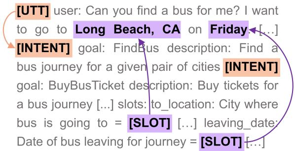
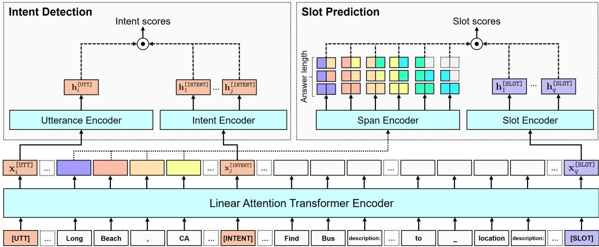

# Span-Selective Linear Attention Transformers for Effective and Robust Schema-Guided Dialogue State Tracking

Björn Bebensee Haejun Lee

Samsung Research

{b.bebensee,haejun82.lee}@samsung.com

## Abstract

In schema-guided dialogue state tracking models estimate the current state of a conversation using natural language descriptions of the service schema for generalization to unseen services. Prior generative approaches which decode slot values sequentially do not generalize well to variations in schema, while discriminative approaches separately encode history and schema and fail to account for inter-slot and intent-slot dependencies. We introduce SPLAT, a novel architecture which achieves better generalization and efficiency than prior approaches by constraining outputs to a limited prediction space. At the same time, our model allows for rich attention among descriptions and history while keeping computation costs constrained by incorporating linear-time attention. We demonstrate the effectiveness of our model on the Schema-Guided Dialogue (SGD) and MultiWOZ datasets. Our approach significantly improves upon existing models achieving 85.3 JGA on the SGD dataset. Further, we show increased robustness on the SGD-X benchmark: our model outperforms the more than 30 larger D3ST-XXL model by 5.0 points.

## 1 Introduction

Dialogue State Tracking (DST) refers to the task of estimating and tracking the dialogue state consisting of the user’s current intent and set of slotvalue pairs throughout the dialogue (Williams et al., 2013). Traditional approaches to DST assume a fixed ontology and learn a classifier for each slot (Chao and Lane, 2019). However, in real-world applications services can be added or removed requiring the model to be re-trained each time the ontology changes. Recently more flexible schemaguided approaches which take as input natural language descriptions of all available intents and slots and thus can be applied zero-shot to new services have been gaining popularity (Rastogi et al., 2020; Feng et al., 2021; Zhao et al., 2022; Gupta et al., 2022).

  
Figure 1: Span selection for schema-guided dialogue in practice. [SLOT] encodes the semantics of the natural language description of “to\_location” and is matched with the span representation of “Long Beach, CA”. Similarly [UTT] encodes the semantics of the current utterance and is matched with the target [INTENT] encoding.

Discriminative DST models are based on machine reading comprehension (MRC) methods, meaning they extract and fill in non-categorical slot values directly from the user utterances (Chao and Lane, 2019; Ruan et al., 2020; Zhang et al., 2021). We use the terms discriminative and extractive interchangeably when referring to these methods. Generative DST models leverage seq2seq language models which conditioned on the dialog history and a prompt learn to sequentially generate the appropriate slot values. Prior generative methods do not generalize well to variations in schema (Lee et al., 2021, 2022; Zhao et al., 2022) whereas discriminative methods separately encode history and schema and fail to account for inter-slot and intent-slot dependencies.

In this work we introduce the SPan-Selective Linear Attention Transformer, short SPLAT, a novel architecture designed to achieve better generalization, robustness and efficiency in DST than existing approaches. SPLAT is fully extractive and, unlike prior generative approaches, constrains the output space to only those values contained in the input sequence. Figure 1 shows an example of the key idea behind our approach. We jointly encode the natural language schema and full dialogue history allowing for a more expressive contextualization. Spans in the input are represented by aggregating semantics of each individual span into a single representation vector. Then we take a contrastive query-based pointer network approach (Vinyals et al., 2015) to match special query tokens to the target slot value’s learned span representation in a single pass.

  
Figure 2: An overview over the SPLAT model architecture. Intent scores are computed using the utterance representation $\mathbf { h } _ { i } ^ { \left[ \mathsf { U T T } \right] }$ and intent representations $\mathbf { h } _ { k } ^ { \scriptscriptstyle [ \mathrm { I N T E N T } ] }$ . A span encoder computes span representations $\mathbf { h } _ { m n } ^ { \mathsf { S P A N } }$ for all spans $x _ { m } , \ldots , x _ { n }$ . The target span is selected by matching the slot query $\mathbf { h } _ { q } ^ { \mathsf { [ S L O T ] } }$ to the target span $\mathbf { h } _ { i j } ^ { \mathsf { S P A N } }$

## Our main contributions are as follows:

## 2 Approach

• We propose novel span-selective prediction layers for DST which provide better generalization and efficiency by limiting the prediction space and inferring all predictions in parallel. We achieve state-of-the-art performance on the SGD-X benchmark outperforming the 30 larger D3ST by 5.0 points.

• We adopt a Linear Attention Transformer which allows more expressive contextualization of the dialogue schema and dialogue history with constrained prediction time. We show our model already outperforms other models with similar parameter budgets even without other modules we propose in Table 1 and 5.

• We pre-train SPLAT for better span representations with a recurrent span selection objective yielding significant further span prediction performance gains of up to 1.5 points.

## 2.1 Task Formulation

For a given dialog of T turns let U describe the set of utterances in the dialog history $U =$ $\{ u _ { 1 } , \dotsc , u _ { T } \}$ . Each $u _ { i }$ can represent either a user or a system utterance. The system is providing some service to the user defined by a service schema S. The service schema consists of a set of intents $I = \{ i _ { 1 } , \ldots , i _ { K } \}$ and their intent descriptions $D ^ { \mathrm { i n t e n t } } = \{ d _ { 1 } ^ { \mathrm { i n t e n t } } , \cdot \cdot , d _ { K } ^ { \mathrm { i n t e n t } } \}$ as well as a set of slots $S = \{ s _ { 1 } , \ldots , s _ { L } \}$ and their slot descriptions ${ \cal D } ^ { \mathrm { s l o t } } = \{ d _ { 1 } ^ { \mathrm { s l o t } } , \ldots , d _ { L } ^ { \mathrm { s l o t } } \}$

In practice we prepend each $u _ { i }$ with the speaker name (user or system) and a special utterance query token [UTT] which will serve as the encoding of the system-user utterance pair.

Each $d _ { i } ^ { \mathrm { s l o t } }$ consists of the slot name, a natural language description of the semantics of the slot and for categorical values an enumeration of all possible values this slot can assume. We also append a special slot query embedding token [SLOT] which serves as the slot encoding.

Some slot values are shared across all slots and their representation can be modeled jointly. Unless denoted otherwise these shared target values T are special tokens [NONE] and [DONTCARE] which correspond to the "none" and "dontcare" slot values in SGD and MultiWOZ.

## 2.2 Joint Encoding with Linear Attention

Linear Attention Transformers. In order to better capture the semantics of the input and to allow for a longer context as well as all the relevant schema descriptions to be encoded jointly we use a Transformer (Vaswani et al., 2017) with linear-time attention. Instead of computing the full attention matrix as the original Transformer does, its linear attention variants compute either an approximation of it (Choromanski et al., 2021) or only compute full attention for a fixed context window of size w around the current token and additional $n _ { \mathrm { g l o b a l } }$ global tokens, thus lowering the complexity of the attention computation from $O ( n ^ { 2 } )$ for a sequence of length n to $\mathcal { O } ( w + n _ { \mathrm { g l o b a l } } )$ (Beltagy et al., 2020; Zaheer et al., 2020).

We focus on the windowed variant and incorporate it to DST. We denote the Linear Attention Transformer with selective global attention parametrized by θ with input sequence  and its subset of global input tokens $\mathcal { G } \subseteq \mathcal { Z }$ , i.e. inputs corresponding to tokens at positions that are attended using the global attention mechanism, as $\mathsf { L A T } ( \mathcal { T } ; \mathcal { G } ; \theta )$ While we choose the Longformer (Beltagy et al., 2020) for our implementation, in practice any variants with windowed and global attention can be used instead.

Joint encoding. The full input sequence of length N is given as the concatenation of its components. We define the set of globally-attended tokens as the union of sets of tokens corresponding to the intent descriptions $D ^ { \mathrm { i n t e n t } }$ , the slot descriptions $D ^ { \mathrm { s l o t } }$ , and the shared target values T. Then, the joint encoding of N hidden states is obtained as the output of the last Transformer layer as

$$
\begin{array} { r l } & { \mathcal { T } = \left[ \mathsf { C L S } \right] U \left[ \mathsf { S E P } \right] T D ^ { \mathrm { i n t e n t } } D ^ { \mathrm { s l o t } } \left[ \mathsf { S E P } \right] } \\ & { \mathcal { G } = T \cup D ^ { \mathrm { i n t e n t } } \cup D ^ { \mathrm { s l o t } } } \\ & { E = \mathsf { L A T } ( \mathbb { Z } ; \mathcal { G } ; \theta ) . } \end{array}\tag{1}
$$

## 2.3 Intent Classification

Let $\mathbf { x } _ { i } ^ { [ \mathsf { U T T } ] }$ denote the representation of the encoded [UTT] token corresponding to the i-th turn. Given the encoded sequence $E ,$ , we obtain the final utterance representations by feeding $\mathbf { x } _ { i } ^ { \mathtt { [ U T T ] } }$ into the utterance encoder. Similarly for each intent $I = \{ i _ { 1 } , \ldots , i _ { t } \}$ and its respective [INTENT] token, we obtain final intent representations using the intent encoder:

$$
\begin{array} { r l } { \mathbf { h } _ { i } ^ { \mathrm { [ U 7 7 ] } } = \mathrm { L N } ( \mathrm { F F N } ( \mathbf { x } _ { i } ^ { \mathrm { [ U 7 7 ] } } ) ) } & { } \\ { \mathbf { h } _ { j } ^ { \mathrm { [ I N 7 E N 7 ] } } = \mathrm { L N } ( \mathrm { F F N } ( \mathbf { x } _ { j } ^ { \mathrm { [ I N 7 E N 7 ] } } ) ) } & { } \end{array}\tag{2}
$$

Here LN refers to a LayerNorm and FFN to a feedforward network.

We maximize the dot product similarity between each utterance representation and the ground truth active intent’s representation via cross-entropy:

$$
\begin{array} { r l } { \displaystyle \mathrm { s c o r e } _ { i  j } = \mathrm { s i m } ( \mathbf h _ { i } ^ { \lbrack \mathsf { U T T } ] } , \mathbf h _ { j } ^ { \lbrack \mathsf { I N T E N T } ] } ) } & { } \\ { \displaystyle \mathcal { L } _ { \mathrm { i n t e n t } } = - \frac { 1 } { T } \sum _ { i = 1 } ^ { T } \log \frac { \exp ( \mathrm { s c o r e } _ { i  j } ) } { \sum _ { k = 1 } ^ { K } \exp ( \mathrm { s c o r e } _ { i  k } ) } \cdot \mathbb { 1 } _ { \mathrm { G T } } } & { } \end{array}\tag{3}
$$

where $K$ is the number of intents and $\mathbb { 1 } _ { \mathrm { G T } }$ is an indicator function which equals 1 if and only if j is the ground truth matching i.

## 2.4 Span Pointer Module

We introduce a novel Span Pointer Module which computes span representations via a span encoder and extracts slot values by matching slot queries via a similarity-based span pointing mechanism (Vinyals et al., 2015).

First, for any given span of token representations $\mathbf { x } _ { i } , \ldots , \mathbf { x } _ { j }$ in the joint encoding E we obtain the span representation $\mathbf { h } _ { i j } ^ { \mathsf { S P A N } }$ by concatenating the span’s first and last token representation and feeding them into a 2-layer feed-forward span encoder (Joshi et al., 2020):

$$
\begin{array} { c } { { \bf { y } } _ { i j } = [ { \bf { x } } _ { i } ; { \bf { x } } _ { j } ] } \\ { { \bf { h } } _ { i j } ^ { \mathrm { { S P A N } } } = \mathrm { { L N } } ( \mathrm { { F F N } } _ { \mathrm { { G e L U } } } ( { \bf { y } } _ { i j } ) ) \times { \sf n } _ { - } \mathrm { { l a y e r s } } } \end{array}\tag{4}
$$

Similarly, for each slot token representation $\mathbf { x } ^ { [ \mathsf { S L O T } ] }$ in $E$ we compute a slot query representation $\mathbf { h } ^ { \left[ \mathsf { S L O T } \right] }$ with a 2-layer feed-forward slot encoder:

$$
{ \bf h } ^ { \tt G S L O T } = \mathrm { L N } ( { \tt F F N } _ { \tt G e L U } ( \mathbf { x } ^ { \tt G S L O T } ) ) \times \tt n \_ l a y e r s\tag{5}
$$

Given slots $S = \{ s _ { 1 } , \ldots , s _ { L } \}$ and corresponding slot query representations $\mathbf { h } _ { 1 } ^ { [ \mathsf { S L O T } ] } , \mathbf { \bar { \Phi } } , \mathbf { h } _ { L } ^ { [ \mathsf { S L O T } ] }$ we score candidate target spans by dot product similarity of the slot queries with their span representations. That is, for each slot query q with ground truth target span $x _ { i } , \ldots , x _ { j }$ we maximize sim $( \mathbf { h } _ { q } ^ { \mathsf { [ S L O T ] } } , \mathbf { h } _ { i j } ^ { \mathsf { S P A N } } )$ by cross-entropy. The loss function is given by

$$
\begin{array} { r } { \displaystyle \mathrm { s c o r e } _ { q \to i j } = \sin ( \mathbf { h } _ { q } ^ { [ \mathrm { S L 0 } \top ] } , \mathbf { h } _ { i j } ^ { \mathrm { S P A N } } ) } \\ { \displaystyle \mathcal { L } _ { \mathrm { s l o t } } = - \frac { 1 } { L } \sum _ { q = 1 } ^ { L } \log \frac { \exp ( \mathrm { s c o r e } _ { q \to i j } ) } { \sum _ { k = 1 } ^ { K } \exp ( \mathrm { s c o r e } _ { q \to k } ) } \cdot \mathbb { 1 } _ { \mathrm { G T } } } \end{array}\tag{6}
$$

where $L$ is the number of slots and K is the number of spans. sim $( \mathbf { h } _ { q } ^ { \mathsf { L S L O T } } ) , \mathbf { h } _ { i j } ^ { \mathsf { S P A N } } )$ denotes the similarity between the q-th slot query representation and the span representation of its ground truth slot value.

It is computationally too expensive to compute span representations for all possible spans. In practice however the length of slot values rarely exceeds some $L _ { \mathrm { a n s } }$ . Thus, we limit the maximum span length to $L _ { \mathrm { a n s } }$ and do not compute scores for spans longer than this threshold. This gives us a total number of $N \cdot L _ { \mathrm { { a n s } } }$ candidate spans.

Joint optimization. We optimize the intent and slot losses jointly via the following objective:

$$
{ \mathcal { L } } = { \frac { { \mathcal { L } } _ { \mathrm { s l o t } } + { \mathcal { L } } _ { \mathrm { i n t e n t } } } { 2 } }\tag{7}
$$

## 2.5 Pre-Training via Recurrent Span Selection

Since the span pointer module relies on span embedding similarity for slot classification we believe it is crucial to learn good and robust span representations. In order to improve span representations for down-stream applications to DST we pre-train SPLAT in a self-supervised manner using a modified recurrent span selection objective (Ram et al., 2021).

Given an input text  let $\mathcal { R } = \{ \mathcal { R } _ { 1 } , . . . , \mathcal { R } _ { a } \}$ be the clusters of identical spans that occur more than once. Following Ram et al. (2021) we randomly select a subset ${ \mathcal { M } } \subseteq { \mathcal { R } }$ of J recurring spans such that the number of their occurrences sums up to a maximum of 30 occurrences. Then, for each selected cluster of recurring spans $M _ { j }$ we randomly replace all but one occurrence with the query token [SLOT].

The slot query tokens act as the queries while the respective unmasked span occurrences act as the targets. Unlike the original recurrent span selection objective we do not use separate start and end pointers for the target spans but instead use our Span Pointer Module to learn a single representation for each target span.

We pre-train SPLAT to maximize the dot product similarity between the query token and the unmasked target span representation. The loss for the j-th cluster of identical masked spans is given by Equation (6) and the total loss is given as the sum of losses of over all clusters.

Effectively each sentence containing a masked occurrence of the span acts as the span description while the target span acts as the span value. This can be seen as analogous to slot descriptions and slot values in DST.

## 3 Experimental Setup

We describe our experimental setup including datasets used for pre-training and evaluation, implementation details, baselines and evaluation metrics in detail below.

## 3.1 Benchmark Datasets

We conduct experiments on the Schema-Guided Dialogue (SGD) (Rastogi et al., 2020), SGD-X (Lee et al., 2022) and MultiWOZ 2.2 (Zang et al., 2020) datasets.

Schema-Guided Dialogue. Unlike other taskoriented dialogue datasets which assume a single, fixed ontology at training and test time the SGD dataset includes new and unseen slots and services in the test set. This allows us to not only measure DST performance but also zero-shot generalization to unseen services. The dataset includes natural language descriptions for all intents and slots in its schema. We follow the standard evaluation setting and data split suggested by the authors.

SGD-X. The SGD-X benchmark is an extension of the SGD dataset which provides five additional schema variants of different linguistic styles which increasingly diverge in style from the original schema with v1 being most similar and v5 least similar. We can evaluate our model’s robustness to variations in schema descriptions by training our model on SGD and comparing evaluation results using the different included schema variants.

MultiWOZ. The MultiWOZ dataset is set of human-human dialogues collected in the Wizardof-OZ setup. Unlike in SGD the ontology is fixed and there are no unseen services at test time. There are multiple updated versions of the original MultiWOZ dataset (Budzianowski et al., 2018): MultiWOZ 2.1 (Eric et al., 2020) and MultiWOZ 2.2 (Zang et al., 2020) fix annotation errors of previous versions, MultiWOZ 2.3 (Han et al., 2021) is based on version 2.1 and adds co-reference annotations, MultiWOZ 2.4 (Ye et al., 2022) is also based on version 2.1 and includes test set corrections. However, MultiWOZ 2.2 is the only version of the dataset which includes a fully defined schema matching the ontology. We therefore choose the MultiWOZ 2.2 dataset for our experiments. We follow the standard evaluation setting and data split.

## 3.2 Evaluation Metrics

In line with prior work (Rastogi et al., 2020) we evaluate our approach according to the following two metrics.

Intent Accuracy: For intent detection the intent accuracy describes the fraction of turns for which the active intent has been correctly inferred.

Joint Goal Accuracy (JGA): For slot prediction JGA describes the fraction of turns for which all slot values have been predicted correctly. Following the evaluation setting from each dataset we use a fuzzy matching score for slot values in SGD and exact match in MultiWOZ.

## 3.3 Implementation Details

We base our implementation on the Longformer code included in the HuggingFace Transformers library (Wolf et al., 2020) and continue training from the base model (110M parameters) and large model (340M parameters) checkpoints. We keep the default Longformer hyperparameters in place, in particular we keep the attention window size set to 512. The maximum sequence length is 4096. During pre-training we train the base model for a total of 850k training steps and the large model for 800k training steps. During fine-tuning we train all models for a single run of 10 epochs and choose the model with the highest joint goal accuracy on the development set. We use the Adam optimizer (Kingma and Ba, 2014) with a maximum learning rate of $1 0 ^ { - 5 }$ which is warmed up for the first 10% of steps and subsequently decays linearly. We set the batch size to 32 for base models and to 16 for large models. We pre-train SPLAT on English Wikipedia. Specifically we use the KILT Wikipedia snapshot1 from 2019 (Petroni et al., 2021) as provided by the HuggingFace Datasets library (Lhoest et al., 2021).

For both SGD and MultiWOZ we set the shared target values T as the [NONE] and [DONTCARE] tokens and include a special intent with the name "NONE" for each service which is used as the target intent when no other intent is active. We set the maximum answer length $L _ { \mathrm { a n s } }$ to 30 tokens.

All experiments are conducted on a machine with eight A100 80GB GPUs. A single training run takes around 12 hours for the base model and 1.5 days for the large model.

## 4 Evaluation

We evaluate the effectiveness of our model through a series of experiments designed to answer the following questions: 1) How effective is the proposed model architecture at DST in general? 2) Does the model generalize well to unseen services? 3) Is the model robust to changes in schema such as different slot names and descriptions? 4) Which parts of the model contribute most to its performance?

## 4.1 Baselines

We compare our model to various discriminative and generative baseline approaches. Note that not all of them are directly comparable due to differences in their experimental setups.

Extractive baselines. SGD baseline (Rastogi et al., 2020) is a simple extractive BERT-based model which encodes the schema and last utterance separately and uses the embeddings in downstream classifiers to predict relative slot updates for the current turn. SGP-DST (Ruan et al., 2020) and DS-DST (Zhang et al., 2020) are similar but jointly encode utterance and slot schema. Multi-Task BERT (Kapelonis et al., 2022) is also similar but uses system action annotations which include annotations of slots offered or requested by the system (e.g. “[ACTION] Offer [SLOT] location [VALUE] Fremont”). paDST (Ma et al., 2019) combines an extractive component for non-categorical slots with a classifier that uses 83 hand-crafted features (including system action annotations) for categorical slots. Additionally it augments training data via back-translation achieving strong results but making a direct comparison difficult. LUNA (Wang et al., 2022) separately encodes dialogue history, slots and slot values and learns to first predict the correct utterance to condition the slot value prediction on.

Generative baselines. Seq2Seq-DU (Feng et al., 2021) first separately encodes utterance and schema and then conditions the decoder on the cross-attended utterance and schema embeddings. The decoder generates a state representation consisting of pointers to schema elements and utterance tokens. AG-DST (Tian et al., 2021) takes as input the previous state and the current turn and learns to generate the new state in a first pass and correcting mistakes in a second generation pass. AG-DST does not condition generation on the schema and slot semantics are learned implicitly so it is unclear how well AG-DST transfers to new services. DaP (Lee et al., 2021) comes in two variants which we denote as DaP (seq) and DaP (ind). DaP (ind) takes as input the entire dialogue history and an individual slot description and decodes the inferred slot value directly but requires one inference pass for each slot in the schema. DaP (seq) instead takes as input the dialogue history and the sequence of all slot descriptions and decodes all inferred slot values in a single pass. D3ST (Zhao et al., 2022) takes a similar approach and decodes the entire dialogue state including the active intent in a single pass. Categorical slot values are predicted via an index-picking mechanism.

<table><tr><td>Model</td><td>Pretrained Model</td><td>Single-Pass</td><td>Intent</td><td>JGA</td></tr><tr><td>With system action annotations</td><td></td><td></td><td></td><td></td></tr><tr><td>MT-BERT (Kapelonis et al., 2022)</td><td>BERT-base (110M)</td><td>X</td><td>94.7</td><td>82.7</td></tr><tr><td>paDST (Ma et al., 2019)</td><td>XLNet-large (340M)</td><td>x</td><td>94.8</td><td>86.5</td></tr><tr><td>No additional data</td><td></td><td></td><td></td><td></td></tr><tr><td>SGD baseline (Rastogi et al., 2020)</td><td>BERT-base (110M)</td><td>X</td><td>90.6</td><td>25.4</td></tr><tr><td>MT-BERT (Kapelonis et al., 2022)</td><td>BERT-base (110M)</td><td>x</td><td></td><td>71.9</td></tr><tr><td>DaP (ind) (Lee et al., 2021)</td><td>T5-base (220M)</td><td>x</td><td>90.2</td><td>71.8</td></tr><tr><td>SGP-DST (Ruan et al., 2020)</td><td>T5-base (220M)</td><td>X</td><td>91.8</td><td>72.2</td></tr><tr><td>D3ST (Base) (Zhao et al., 2022)</td><td>T5-base (220M)</td><td>√</td><td>97.2</td><td>72.9</td></tr><tr><td>D3ST (Large) (Zhao et al., 2022)</td><td>T5-large (770M)</td><td>√</td><td>97.1</td><td>80.0</td></tr><tr><td>D3ST (XXL) (Zhao et al., 2022)</td><td>T5-XXL (11B)</td><td>√</td><td>98.8</td><td>86.4</td></tr><tr><td>SPLAT (Base)</td><td>Longformer-base (110M)</td><td>√</td><td>96.7</td><td>80.1</td></tr><tr><td>SPLAT (Large)</td><td>Longformer-large (340M)</td><td>√</td><td>97.6</td><td>85.3</td></tr></table>

Table 1: Results on the SGD test set.
<table><tr><td>Model</td><td>Pretrained Model</td><td>Single-Pass</td><td>Intent</td><td>JGA</td></tr><tr><td>DS-DST† (Zhang et al., 2020)</td><td>BERT-base (110M)</td><td>x</td><td></td><td>51.7</td></tr><tr><td>Seq2Seq-DU (Feng et al., 2021)</td><td>BERT-base (110M)</td><td>√</td><td>90.9</td><td>54.4</td></tr><tr><td>LUNA (Wang et al., 2022)</td><td>BERT-base (110M)</td><td>X</td><td></td><td>56.1</td></tr><tr><td>AG-DST (Tian et al., 2021)</td><td>GPT-2 (117M)</td><td>x+</td><td></td><td>56.1</td></tr><tr><td>AG-DST (Tian et al., 2021)</td><td>PLATO-2 (310M)</td><td>x</td><td></td><td>57.3</td></tr><tr><td>DaP (seq) (Lee et al., 2021)</td><td>T5-base (220M)</td><td>√</td><td></td><td>51.2</td></tr><tr><td>DaP (ind) (Lee et al., 2021)</td><td>T5-base (220M)</td><td>X</td><td></td><td>57.5</td></tr><tr><td>D3ST (Base) (Zhao et al., 2022)</td><td>T5-base (220M)</td><td>√</td><td></td><td>56.1</td></tr><tr><td>D3ST (Large) (Zhao et al., 2022)</td><td>T5-1arge (770M)</td><td>√</td><td></td><td>54.2</td></tr><tr><td>D3ST (XXL) (Zhao et al., 2022)</td><td>T5-XXL (11B)</td><td>√</td><td></td><td>58.7</td></tr><tr><td>SPLAT (Base)</td><td>Longformer-base (110M)</td><td>√</td><td>91.4</td><td>56.6</td></tr><tr><td>SPLAT (Large)</td><td>Longformer-large (340M)</td><td>√</td><td>91.5</td><td>57.4</td></tr></table>

Table 2: Results on the MultiWOZ 2.2 test set. Results denoted by were reported in the original MultiWOZ 2.2 paper (Zang et al., 2020). : AG-DST uses a fixed two-pass generation procedure.

## 4.2 Main Results

Schema-Guided Dialogue. Table 1 shows results on the SGD test set. We report results for intent accuracy and JGA. We find that our model significantly outperforms models of comparable size in terms of JGA. In particular our 110M parameter SPLAT base model outperforms the 220M model D3ST base model by 7.2 JGA points and even achieves comparable performance to the much larger D3ST large model. Going from SPLAT base to SPLAT large we observe a significant performance improvement. In particular SPLAT large outperforms the D3ST large model by 5.3 JGA and nearly achieves comparable performance to the more than 30 larger D3ST XXL model.

<table><tr><td>Model</td><td>Params.</td><td>Orig.</td><td> $\mathbf { A v g . } \left( v _ { 1 } – v _ { 5 } \right)$ </td><td>Avg. ∆</td><td>Max ∆</td></tr><tr><td>DaP (ind) (Lee et al., 2021)</td><td>220M</td><td>71.8</td><td>64.0</td><td>-7.8</td><td></td></tr><tr><td>SGP-DST (Ruan et al., 2020)</td><td>220M</td><td> $7 2 . 2 / 6 0 . 5 ^ { * }$ </td><td>49.9*</td><td>-10.6</td><td></td></tr><tr><td>D3ST (Large) (Zhao et al., 2022)</td><td>770M</td><td>80.0</td><td>75.3</td><td>-4.7</td><td>-10.9</td></tr><tr><td>D3ST (XXL) (Zhao et al., 2022)</td><td>11B</td><td>86.4</td><td>77.8</td><td>-8.6</td><td>-17.5</td></tr><tr><td>SPLAT (Base)</td><td>110M</td><td>80.1</td><td>76.0</td><td>-4.1</td><td>-7.8</td></tr><tr><td>SPLAT (Large)</td><td>340M</td><td>85.3</td><td>82.8</td><td>-2.5</td><td>-5.3</td></tr></table>

Table 3: Joint goal accuracy on the five different SGD-X schema variants. Results denoted by ∗ are based on a reimplementation in the SGD-X paper which could not reproduce the original results.

<table><tr><td>Model</td><td>Params.</td><td>Seen</td><td>Unseen</td><td>Overall</td></tr><tr><td>SGP-DST1</td><td>220M</td><td>88.0</td><td>67.0</td><td>72.2</td></tr><tr><td>D3ST (Base)2</td><td>220M</td><td>92.5</td><td>66.4</td><td>72.9</td></tr><tr><td>D3ST (Large)2</td><td>770M</td><td>93.8</td><td>75.4</td><td>80.0</td></tr><tr><td>D3ST (XXL)2</td><td>11B</td><td>95.8</td><td>83.3</td><td>86.4</td></tr><tr><td>SPLAT (Base)</td><td>110M</td><td>94.5</td><td>75.2</td><td>80.1</td></tr><tr><td>SPLAT (Large)</td><td>340M</td><td>94.6</td><td>82.2</td><td>85.3</td></tr></table>

Table 4: Joint goal accuracy on the SGD test set on seen and unseen services. Baseline results are reported by 1Ruan et al. (2020) and 2Zhao et al. (2022) respectively.

We note that although paDST achieves the best performance of all baseline models in terms of JGA, it is not directly comparable because it is trained with hand-crafted features and additional back-translation data for training which has been shown to significantly improve robustness and generalization to unseen descriptions in schema-guided DST (Lee et al., 2022). Similarly, although Multi-Task BERT achieves good performance this can mostly be attributed to the use of system action annotation as Kapelonis et al. (2022) themselves demonstrate. Without system action annotations its performance drops to 71.9 JGA.

In terms of intent accuracy SPLAT base slightly underperforms D3ST base and D3ST large by 0.5 and 0.4 JGA while SPLAT large achieves better performance and slightly improves upon the D3ST large performance. Overall, SPLAT achieves strong performance on SGD.

MultiWOZ. Table 2 shows results on the Multi-WOZ 2.2 test set. As the majority of papers does not report intent accuracy on MultiWOZ 2.2 we focus our analysis on JGA. We find that SPLAT base outperforms most similarly-sized models including D3ST base and large and that SPLAT large performs better than all models aside from the more than 30 larger D3ST XXL. The notable exceptions to this are AG-DST and DaP (ind). AG-DST large achieves performance that is similar to SPLAT large using a generative approach but it performs two decoding passes, employs a negative sampling strategy to focus on more difficult examples and is trained for a fixed schema. DaP (ind) also achieves similar performance but needs one inference pass for every slot at every turn of the dialogue. This is much slower and simply not realistic in real-world scenarios with a large number of available services and slots. The sequential variant DaP (seq) which instead outputs the full state in a single pass performs much worse.

Comparison. While DaP (ind) shows strong performance that matches SPLAT on MultiWOZ, SPLAT fares much better than DaP (ind) on the SGD dataset. This can be seen to be indicative of a stronger generalization ability as MultiWOZ uses the same schema at training and test time whereas SGD includes new, unseen services at test time and thus requires the model to generalize and understand the natural language schema descriptions.

## 4.3 Robustness

DST models which take natural language descriptions of intents and slots as input naturally may be sensitive to changes in these descriptions. In order to evaluate the robustness of our model to such linguistic variations we perform experiments on the SGD-X benchmark. The SGD-X benchmark comes with five crowd-sourced schema variants v1 to v5 which increasingly diverge in style from the original schema. We train SPLAT on SGD and evaluate it on the test set using all five different schema variants.

As shown in Table 3, our model is considerably more robust to linguistic variations than all of the baseline models. On average SPLAT base loses around 4.1 points and SPLAT large loses around 2.5 points joint goal accuracy when compared to the results on the original schema. When considering the mean performance across all unseen schema variants SPLAT large significantly outperforms the more than 30 larger D3ST XXL by 5.0 points. These observations also hold for the base model: the 110M parameter SPLAT base even outperforms the 11B parameter D3ST XXL on the least similar schema variant $v _ { 5 }$ further highlighting the superior robustness of our model.

<table><tr><td rowspan="2">Model</td><td rowspan="2">Params.</td><td colspan="2">SGD</td><td colspan="2">MultiWOZ</td></tr><tr><td>Intent</td><td>JGA</td><td>Intent</td><td>JGA</td></tr><tr><td>Longformer (extr.)</td><td>110M</td><td>95.9</td><td>78.5</td><td>91.4</td><td>55.5</td></tr><tr><td>+ SPM</td><td>110M</td><td>97.0</td><td>79.0</td><td>91.4</td><td>56.1</td></tr><tr><td>+ SPM + RSS-PT</td><td>110M</td><td>96.7</td><td>80.1</td><td>91.4</td><td>56.6</td></tr><tr><td>Longformer (extr.)</td><td>340M</td><td>97.5</td><td>83.5</td><td>91.4</td><td>56.3</td></tr><tr><td>+ SPM</td><td>340M</td><td>98.2</td><td>83.8</td><td>91.4</td><td>57.8</td></tr><tr><td>+ SPM + RSS-PT</td><td>340M</td><td>97.6</td><td>85.3</td><td>91.5</td><td>57.4</td></tr></table>

Table 5: Ablation results on the SGD and MultiWOZ test sets. Longformer (extr.) refers to an extractive model with no span representations and simple start and end pointers for answer prediction, SPM refers to the Span Pointer Module and RSS-PT to pre-training with the Recurrent Span Selection objective.

## 4.4 Generalization to unseen domains

In real-world scenarios virtual assistants cover a wide range of services that can change over time as new services get added or removed requiring dialogue models to be re-trained. One of our goals is to improve generalization to unseen services thus minimizing the need for expensive data collection and frequent re-training. As the MultiWOZ dataset does not include any new and unseen services in its test set our analysis primarily focuses on the SGD dataset. Table 4 shows results on SGD with a separate evaluation for dialogues in seen and unseen domains. We find that SPLAT achieves better generalization and improves upon the baselines with a particularly large margin on unseen domains where SPLAT base outperforms D3ST base by 8.8 points and SPLAT base outperforms D3ST large by 6.8 points.

## 4.5 Ablation Study

We conduct an ablation study to identify the contribution of the different components to model performance. Results can be seen in Table 5. We compare a variant of our model which does not use span representations (referred to as “Longformer (extractive)”) but instead has two pointers [SLOT] and [/SLOT] which are used to select the start and end of the answer span. We find that using the Span Pointer Module to directly select the span improves performance across both model sizes and datasets. Furthermore, we find pre-training our model for better span representations via the recurrent span selection task to be crucial giving further significant performance gains for all sizes and datasets except the 340M parameter model on the MultiWOZ dataset where JGA slightly deteriorates. Across both model sizes gains from RSS pre-training are larger on the SGD dataset. We hypothesize that this may be attributed to better span representations learned through RSS pre-training which in turn generalize better to unseen domains.

## 5 Related Work

Extractive DST. Following the traditional extractive setting Chao and Lane (2019) propose a machine reading comprehension (MRC) approach which decodes slot values turn-by-turn using a different learned classifier for each slot. As a classifier has to be learned for each new slot this approach cannot easily be transferred to new slots.

Schema-guided approaches address this by explicitly conditioning predictions on a variable schema which describes intents and slots in natural language (Rastogi et al., 2020). Both Ruan et al. (2020) and Zhang et al. (2021) introduce schema-guided models but predict slots independently from one another requiring multiple encoder passes for each turn and failing to model intent-slot and inter-slot dependencies. Ma et al. (2019) use MRC for non-categorical and handcrafted features for categorical slots.

Generative DST. In an attempt to address the lack of ability to generalize to new domains and ontologies, Wu et al. (2019) propose incorporating a generative component into DST. Based on the dialog history and a domain-slot pair a state generator decodes a value for each slot. However as each slot is decoded independently the approach cannot model slot interdependencies. Feng et al. (2021) instead generate the entire state as a single sequence of pointers to the dialogue history and input schema but separately encode history and schema. Zhao et al. (2021) model DST fully as a text-to-text problem and directly generate the entire current state as a string. Lin et al. (2021) transfer a language model fine-tuned for seq2seq question answering to DST zero-shot using the dialog history as context and simply asking the model for the slot values. By also including a natural language schema in the input, Zhao et al. (2022) show that full joint modeling and rich attention between history and schema lead to better results in DST. Furthermore, they demonstrate the flexibility of this fully language driven paradigm by leveraging strong pre-trained language models for cross-domain zero-shot transfer to unseen domains. Gupta et al. (2022) show the effectiveness of using demonstrations of slots being used in practice instead of a natural language descriptions in the prompt.

## 6 Conclusion

In this work we introduced SPLAT, a novel architecture for schema-guided dialogue state tracking which learns to infer slots by learning to select target spans based on natural language descriptions of slot semantics, and further showed how to pretrain SPLAT via a recurrent span selection objective for better span representations and a stronger slot prediction performance. We find that our proposed architecture yields significant improvements over existing models and achieving 85.3 JGA on the SGD dataset and 57.4 JGA on the MultiWOZ dataset. In schema-guided DST the ability to generalize to new schemas and robustness to changes in schema descriptions is of particular interest. We demonstrated that our model is much more robust to such changes in experiments on the SGD-X benchmark where SPLAT outperforms the more than 30 larger D3ST-XXL model by 5.0 points.

## Limitations

One trade-off of limiting the prediction space using an extractive pointer module is that it does not support prediction of multiple slot values which is necessary for some dialogues in the MultiWOZ 2.3 and 2.4 datasets. To keep the architecture simple we do not consider cases in which slots take multiple values in this work, but we can effectively adapt our model for this setting by introducing sequential query tokens for each slot. Another limitation is that the span representation requires a computation of $O ( N \cdot L _ { \mathrm { a n s } } )$ complexity where N and $L _ { \mathrm { a n s } }$ represent the length of context and answer span, respectively. For very long answers this might occur significant computational costs compared to existing span prediction approaches which have O(N) complexity. However, this can be alleviated by adding a simple sampling and filtering step during training and prediction. We plan to further study and address these limitations in future work.

## Ethics Statement

We introduced a novel model architecture for schema-guided dialogue state tracking which leverages a natural language schema and a span pointer module to achieve higher accuracy in dialogue state tracking. All experiments were conducted on publicly available datasets which are commonly used in research on dialogue systems.

## References

Iz Beltagy, Matthew E Peters, and Arman Cohan. 2020. Longformer: The long-document transformer. arXiv preprint arXiv:2004.05150.

Paweł Budzianowski, Tsung-Hsien Wen, Bo-Hsiang Tseng, Iñigo Casanueva, Stefan Ultes, Osman Ramadan, and Milica Gašic. 2018.´ MultiWOZ - a largescale multi-domain Wizard-of-Oz dataset for taskoriented dialogue modelling. In Proceedings ofthe 2018 Conference on Empirical Methods in Natural Language Processing, pages 5016–5026, Brussels, Belgium. Association for Computational Linguistics.

Guan-Lin Chao and Ian Lane. 2019. BERT-DST: Scalable End-to-End Dialogue State Tracking with Bidirectional Encoder Representations from Transformer. In Proc. Interspeech 2019, pages 1468–1472.

Krzysztof Marcin Choromanski, Valerii Likhosherstov, David Dohan, Xingyou Song, Andreea Gane, Tamas Sarlos, Peter Hawkins, Jared Quincy Davis, Afroz Mohiuddin, Lukasz Kaiser, David Benjamin Belanger, Lucy J Colwell, and Adrian Weller. 2021. Rethinking attention with performers. In International Conference on Learning Representations.

Mihail Eric, Rahul Goel, Shachi Paul, Abhishek Sethi, Sanchit Agarwal, Shuyang Gao, Adarsh Kumar, Anuj Goyal, Peter Ku, and Dilek Hakkani-Tur. 2020. MultiWOZ 2.1: A consolidated multi-domain dialogue dataset with state corrections and state tracking baselines. In Proceedings of the Twelfth Language Resources and Evaluation Conference, pages 422–428, Marseille, France. European Language Resources Association.

Yue Feng, Yang Wang, and Hang Li. 2021. A sequenceto-sequence approach to dialogue state tracking. In Proceedings ofthe 59th Annual Meeting ofthe Associationfor Computational Linguistics and the 11th International Joint Conference on Natural Language Processing (Volume 1: Long Papers), pages 1714– 1725, Online. Association for Computational Linguistics.

Raghav Gupta, Harrison Lee, Jeffrey Zhao, Yuan Cao, Abhinav Rastogi, and Yonghui Wu. 2022. Show, don’t tell: Demonstrations outperform descriptions for schema-guided task-oriented dialogue. In Proceedings ofthe 2022 Conference ofthe North American Chapter ofthe Associationfor Computational Linguistics: Human Language Technologies, pages 4541–4549, Seattle, United States. Association for Computational Linguistics.

Ting Han, Ximing Liu, Ryuichi Takanabu, Yixin Lian, Chongxuan Huang, Dazhen Wan, Wei Peng, and Minlie Huang. 2021. Multiwoz 2.3: A multi-domain task-oriented dialogue dataset enhanced with annotation corrections and co-reference annotation. In CCF International Conference on Natural Language Processing and Chinese Computing, pages 206–218. Springer.

Mandar Joshi, Danqi Chen, Yinhan Liu, Daniel S Weld, Luke Zettlemoyer, and Omer Levy. 2020. Spanbert: Improving pre-training by representing and predicting spans. Transactions of the Association for Computational Linguistics, 8:64–77.

Eleftherios Kapelonis, Efthymios Georgiou, and Alexandros Potamianos. 2022. A multi-task bert model for schema-guided dialogue state tracking. arXiv preprint arXiv:2207.00828.

Diederik P Kingma and Jimmy Ba. 2014. Adam: A method for stochastic optimization. arXiv preprint arXiv:1412.6980.

Chia-Hsuan Lee, Hao Cheng, and Mari Ostendorf. 2021. Dialogue state tracking with a language model using schema-driven prompting. In Proceedings of the 2021 Conference on Empirical Methods in Natural Language Processing, pages 4937–4949, Online and Punta Cana, Dominican Republic. Association for Computational Linguistics.

Harrison Lee, Raghav Gupta, Abhinav Rastogi, Yuan Cao, Bin Zhang, and Yonghui Wu. 2022. Sgd-x: A benchmark for robust generalization in schemaguided dialogue systems. Proceedings of the AAAI Conference on Artificial Intelligence, 36(10):10938– 10946.

Quentin Lhoest, Albert Villanova del Moral, Yacine Jernite, Abhishek Thakur, Patrick von Platen, Suraj Patil, Julien Chaumond, Mariama Drame, Julien Plu, Lewis Tunstall, Joe Davison, Mario Šaško, Gunjan Chhablani, Bhavitvya Malik, Simon Brandeis, Teven Le Scao, Victor Sanh, Canwen Xu, Nicolas Patry, Angelina McMillan-Major, Philipp Schmid, Sylvain Gugger, Clément Delangue, Théo Matussière, Lysandre Debut, Stas Bekman, Pierric Cistac, Thibault Goehringer, Victor Mustar, François Lagunas, Alexander Rush, and Thomas Wolf. 2021. Datasets: A community library for natural language processing. In Proceedings ofthe 2021 Conference on Empirical Methods in Natural Language Processing: System Demonstrations, pages 175–184, Online and Punta Cana, Dominican Republic. Association for Computational Linguistics.

Zhaojiang Lin, Bing Liu, Andrea Madotto, Seungwhan Moon, Paul Crook, Zhenpeng Zhou, Zhiguang Wang, Zhou Yu, Eunjoon Cho, Rajen Subba, et al. 2021. Zero-shot dialogue state tracking via cross-task transfer. arXiv preprint arXiv:2109.04655.

Yue Ma, Zengfeng Zeng, Dawei Zhu, Xuan Li, Yiying Yang, Xiaoyuan Yao, Kaijie Zhou, and Jianping Shen. 2019. An end-to-end dialogue state tracking system with machine reading comprehension and wide & deep classification. arXiv preprint arXiv:1912.09297.

Fabio Petroni, Aleksandra Piktus, Angela Fan, Patrick Lewis, Majid Yazdani, Nicola De Cao, James Thorne, Yacine Jernite, Vladimir Karpukhin, Jean Maillard, Vassilis Plachouras, Tim Rocktäschel, and Sebastian Riedel. 2021. KILT: a benchmark for knowledge intensive language tasks. In Proceedings ofthe 2021 Conference of the North American Chapter of the Associationfor Computational Linguistics: Human Language Technologies, pages 2523–2544, Online. Association for Computational Linguistics.

Ori Ram, Yuval Kirstain, Jonathan Berant, Amir Globerson, and Omer Levy. 2021. Few-shot question answering by pretraining span selection. In Proceedings ofthe 59th Annual Meeting ofthe Associationfor Computational Linguistics and the 11th International Joint Conference on Natural Language Processing (Volume 1: Long Papers), pages 3066–3079, Online. Association for Computational Linguistics.

Abhinav Rastogi, Xiaoxue Zang, Srinivas Sunkara, Raghav Gupta, and Pranav Khaitan. 2020. Towards scalable multi-domain conversational agents: The schema-guided dialogue dataset. In Proceedings of the AAAI Conference on Artificial Intelligence, volume 34, pages 8689–8696.

Yu-Ping Ruan, Zhen-Hua Ling, Jia-Chen Gu, and Quan Liu. 2020. Fine-tuning bert for schema-guided zero-shot dialogue state tracking. arXiv preprint arXiv:2002.00181.

Xin Tian, Liankai Huang, Yingzhan Lin, Siqi Bao, Huang He, Yunyi Yang, Hua Wu, Fan Wang, and Shuqi Sun. 2021. Amendable generation for dialogue state tracking. In Proceedings ofthe 3rd Workshop on Natural Language Processingfor Conversational AI, pages 80–92, Online. Association for Computational Linguistics.

Ashish Vaswani, Noam Shazeer, Niki Parmar, Jakob Uszkoreit, Llion Jones, Aidan N Gomez, Łukasz Kaiser, and Illia Polosukhin. 2017. Attention is all you need. Advances in neural information processing systems, 30.

Oriol Vinyals, Meire Fortunato, and Navdeep Jaitly. 2015. Pointer networks. Advances in neural information processing systems, 28.

Yifan Wang, Jing Zhao, Junwei Bao, Chaoqun Duan, Youzheng Wu, and Xiaodong He. 2022. LUNA:

Learning slot-turn alignment for dialogue state tracking. In Proceedings of the 2022 Conference of the North American Chapter ofthe Associationfor Computational Linguistics: Human Language Technologies, pages 3319–3328, Seattle, United States. Association for Computational Linguistics.

Jason Williams, Antoine Raux, Deepak Ramachandran, and Alan Black. 2013. The dialog state tracking challenge. In Proceedings ofthe SIGDIAL 2013 Conference, pages 404–413, Metz, France. Association for Computational Linguistics.

Thomas Wolf, Lysandre Debut, Victor Sanh, Julien Chaumond, Clement Delangue, Anthony Moi, Pierric Cistac, Tim Rault, Rémi Louf, Morgan Funtowicz, Joe Davison, Sam Shleifer, Patrick von Platen, Clara Ma, Yacine Jernite, Julien Plu, Canwen Xu, Teven Le Scao, Sylvain Gugger, Mariama Drame, Quentin Lhoest, and Alexander M. Rush. 2020. Transformers: State-of-the-art natural language processing. In Proceedings of the 2020 Conference on Empirical Methods in Natural Language Processing: System Demonstrations, pages 38–45, Online. Association for Computational Linguistics.

Chien-Sheng Wu, Andrea Madotto, Ehsan Hosseini-Asl, Caiming Xiong, Richard Socher, and Pascale Fung. 2019. Transferable multi-domain state generator for task-oriented dialogue systems. In Proceedings ofthe 57th Annual Meeting ofthe Associationfor Computational Linguistics, pages 808–819, Florence, Italy. Association for Computational Linguistics.

Fanghua Ye, Jarana Manotumruksa, and Emine Yilmaz. 2022. MultiWOZ 2.4: A multi-domain task-oriented dialogue dataset with essential annotation corrections to improve state tracking evaluation. In Proceedings of the 23rd Annual Meeting of the Special Interest Group on Discourse and Dialogue, pages 351–360, Edinburgh, UK. Association for Computational Linguistics.

Manzil Zaheer, Guru Guruganesh, Kumar Avinava Dubey, Joshua Ainslie, Chris Alberti, Santiago Ontanon, Philip Pham, Anirudh Ravula, Qifan Wang, Li Yang, et al. 2020. Big bird: Transformers for longer sequences. Advances in Neural Information Processing Systems, 33:17283–17297.

Xiaoxue Zang, Abhinav Rastogi, Srinivas Sunkara, Raghav Gupta, Jianguo Zhang, and Jindong Chen. 2020. MultiWOZ 2.2 : A dialogue dataset with additional annotation corrections and state tracking baselines. In Proceedings of the 2nd Workshop on Natural Language Processing for Conversational AI, pages 109–117, Online. Association for Computational Linguistics.

Jianguo Zhang, Kazuma Hashimoto, Chien-Sheng Wu, Yao Wang, Philip Yu, Richard Socher, and Caiming Xiong. 2020. Find or classify? dual strategy for slot-value predictions on multi-domain dialog state tracking. In Proceedings ofthe Ninth Joint Conference on Lexical and Computational Semantics, pages

154–167, Barcelona, Spain (Online). Association for Computational Linguistics.

Yang Zhang, Vahid Noroozi, Evelina Bakhturina, and Boris Ginsburg. 2021. Sgd-qa: Fast schema-guided dialogue state tracking for unseen services. arXiv preprint arXiv:2105.08049.

Jeffrey Zhao, Raghav Gupta, Yuan Cao, Dian Yu, Mingqiu Wang, Harrison Lee, Abhinav Rastogi, Izhak Shafran, and Yonghui Wu. 2022. Descriptiondriven task-oriented dialog modeling. arXiv preprint arXiv:2201.08904.

Jeffrey Zhao, Mahdis Mahdieh, Ye Zhang, Yuan Cao, and Yonghui Wu. 2021. Effective sequence-tosequence dialogue state tracking. In Proceedings of the 2021 Conference on Empirical Methods in Natural Language Processing, pages 7486–7493, Online and Punta Cana, Dominican Republic. Association for Computational Linguistics.

## A Appendix

<table><tr><td>Symbol</td><td>Definition</td></tr><tr><td> $\mathsf { L A T }$ </td><td>Linear Attention Transformer</td></tr><tr><td> $\mathcal { T }$ </td><td>Input sequence</td></tr><tr><td> $\mathcal { G }$ </td><td>Global inputs</td></tr><tr><td> $\mathcal { M }$ </td><td>Set of masked recurring span clusters</td></tr><tr><td> $\mathcal { R }$ </td><td>Set of all recurring span clusters</td></tr><tr><td> $D ^ { \mathrm { i n t e n t } }$ </td><td>Intent descriptions</td></tr><tr><td> $D ^ { \mathrm { s l o t } }$ </td><td>Intent descriptions</td></tr><tr><td> $E$ </td><td>Joint encoding obtained from LAT</td></tr><tr><td> $I$ </td><td>Intents</td></tr><tr><td> $S$ </td><td>Slots</td></tr><tr><td> $T$ </td><td>Shared target tokens</td></tr><tr><td> $U$ </td><td>Utterances</td></tr><tr><td> $\mathbf { h } ^ { \left[ \mathrm { I N T E N T } \right] }$ </td><td>Intent embedding</td></tr><tr><td> $\mathbf { h } ^ { \left[ \mathsf { S L O T } \right] }$ </td><td>Slot embedding</td></tr><tr><td> $\mathbf { h } ^ { \left[ \mathsf { U T T } \right] }$ </td><td>Utterance embedding</td></tr><tr><td> $\mathbf { h } _ { i j } ^ { \mathsf { S P A N } }$ </td><td>Span embedding from position i to j</td></tr><tr><td> $\mathbf { x } _ { i }$ </td><td>Token representation at position ¿</td></tr><tr><td> $\theta$ </td><td>Model parameters</td></tr></table>

Table 6: Glossary of symbols

## ACL 2023 Responsible NLP Checklist

A For every submission: ✓ A1. Did you describe the limitations of your work? We discussed the limitations ofour work in the unnumbered limitations section.

✗ A2. Did you discuss any potential risks of your work? We only used publically available datasets that are commonly used in research on dialogue systems. We believe there are no significant risks associated with our work.

✓ A3. Do the abstract and introduction summarize the paper’s main claims? Abstract and section 1

✗ A4. Have you used AI writing assistants when working on this paper? Left blank.

B ✓ Did you use or create scientific artifacts? Discussed in section 3.1 and 3.3

✓ B1. Did you cite the creators of artifacts you used? Section 3.1 and 3.3

✗ B2. Did you discuss the license or terms for use and / or distribution of any artifacts? We only used publically available data and adhere to the creator’s license terms. The SGD dataset is freely available under the CC-BY-SA 4.0 and the MultiWOZ dataset is freely available under the MIT license.

✗ B3. Did you discuss if your use of existing artifact(s) was consistent with their intended use, provided that it was specified? For the artifacts you create, do you specify intended use and whether that is compatible with the original access conditions (in particular, derivatives of data accessed for research purposes should not be used outside of research contexts)? We only used publically available data and adhere to the creator’s license terms and their intended use. The SGD dataset isfreely available under the CC-BY-SA 4.0 and the MultiWOZ dataset isfreely available under the MIT license.

✗ B4. Did you discuss the steps taken to check whether the data that was collected / used contains any information that names or uniquely identifies individual people or offensive content, and the steps taken to protect / anonymize it? We only used publically available data that is commonly used in dialogue systems research and which does not uniquely identify people and which does not contain any personal data or offensive content.

✓ B5. Did you provide documentation of the artifacts, e.g., coverage of domains, languages, and linguistic phenomena, demographic groups represented, etc.? We did not create artifacts. Documentation of the artifacts used is provided in section 3.1 and 3.3.

✓ B6. Did you report relevant statistics like the number of examples, details of train / test / dev splits, etc. for the data that you used / created? Even for commonly-used benchmark datasets, include the number of examples in train / validation / test splits, as these provide necessary context for a reader to understand experimental results. For example, small differences in accuracy on large test sets may be significant, while on small test sets they may not be. Section 3.1

## C ✓ Did you run computational experiments?

## Section 3 and Section 4

✓ C1. Did you report the number of parameters in the models used, the total computational budget (e.g., GPU hours), and computing infrastructure used? Section 3.3

✓ C2. Did you discuss the experimental setup, including hyperparameter search and best-found hyperparameter values? Section 3.3

✓ C3. Did you report descriptive statistics about your results (e.g., error bars around results, summary statistics from sets of experiments), and is it transparent whether you are reporting the max, mean, etc. or just a single run? Section 3.3

✓ C4. If you used existing packages (e.g., for preprocessing, for normalization, or for evaluation), did you report the implementation, model, and parameter settings used (e.g., NLTK, Spacy, ROUGE, etc.)? Section 3.3

## D ✗ Did you use human annotators (e.g., crowdworkers) or research with human participants? Left blank.

 D1. Did you report the full text of instructions given to participants, including e.g., screenshots, disclaimers of any risks to participants or annotators, etc.? Not applicable. Left blank.

 D2. Did you report information about how you recruited (e.g., crowdsourcing platform, students) and paid participants, and discuss if such payment is adequate given the participants’ demographic (e.g., country of residence)? Not applicable. Left blank.

 D3. Did you discuss whether and how consent was obtained from people whose data you’re using/curating? For example, if you collected data via crowdsourcing, did your instructions to crowdworkers explain how the data would be used? Not applicable. Left blank.

 D4. Was the data collection protocol approved (or determined exempt) by an ethics review board? Not applicable. Left blank.

 D5. Did you report the basic demographic and geographic characteristics of the annotator population that is the source of the data? Not applicable. Left blank.