# StoryARG: a corpus of narratives and personal experiences in argumentative texts

Neele Falk and Gabriella Lapesa Institute for Natural Language Processing, University of Stuttgart {neele.falk,gabriella.lapesa}@ims.uni-stuttgart.de

## Abstract

Humans are storytellers, even in communication scenarios which are assumed to be more rationality-oriented, such as argumentation. Indeed, supporting arguments with narratives or personal experiences (henceforth, stories) is a very natural thing to do – and yet, this phenomenon is largely unexplored in computational argumentation. Which role do stories play in an argument? Do they make the argument more effective? What are their narra tive properties? To address these questions, we collected and annotated StoryARG, a dataset sampled from well-established corpora in computational argumentation (ChangeMyView and RegulationRoom), and the Social Sciences (Europolis), as well as comments to New York Times articles. StoryARG contains 2451 textual spans annotated at two levels. At the argumentative level, we annotate the function of the story (e.g., clarification, disclosure of harm, search for a solution, establishing speaker’s authority), as well as its impact on the effectiveness of the argument and its emotional load. At the level of narrative properties, we annotate whether the story has a plot-like development, is factual or hypothetical, and who the protagonist is.

What makes a story effective in an argument? Our analysis of the annotations in StoryARG uncover a positive impact on effectiveness for stories which illustrate a solution to a problem, and in general, annotator-specific preferences that we investigate with regression analysis.

## 1 Introduction

Narratives and argumentation are deeply related: this is a well established observation in psychology and social science. Although stories per se express something individual and concrete, they allow people to draw conclusions about matters of general interest, for example, social problems and injustices - something general is expressed through something concrete and can thus often be better understood (Fisher, 1985). In addition, stories have a unique effect on the recipient(s) (e.g., the other participants in a discussion): they offer room for interpretation, therefore encourage reflection, and precisely because they are individual, the recipient is required to take on the perspective of the other (Polletta and Lee, 2006; Hoeken and Fikkers, 2014), a quality that is becoming increasingly important in times of growing political polarization.

On the side of computational argumentation research, however, the role of narratives and personal experiences has barely been investigated, since in argumentative contexts they are often regarded as rather second-class (not logical, not verifiable). With our paper, the resource it presents, and the analysis we carry out, we aim at building a finegrained empirical picture of this phenomenon, crucial both in terms of its persuasiveness within an argument and its contribution to interpersonal communication.

While there are existing datasets that make it possible to develop classification methods to detect stories in argumentative texts (Park and Cardie, 2014; Song et al., 2016; Falk and Lapesa, 2022) the next step to be made is to understand these stories in terms of both their argumentative function and narrative properties. This paper presents StoryARG, a novel dataset that can be used to get a finer-grained picture of this phenomenon, helping filling an important gap in the study of "everyday" argumentation.

StoryARG has several novel features. First, it is based on a compilation of datasets that are well-established in computational argumentation (ChangeMyView (Egawa et al., 2019), Regulation-Room (Park and Cardie, 2018)) and Social Sciences (Europolis (Gerber et al., 2018)). This will allow us and others to exploit already available annotations to explore further research questions. Additionally, we included a newly collected sample: user comments to New York Times articles on veganism. Second, our interdisciplinary annotation schema is unique in that it integrates both the argumentative and the narrative perspective.

The argumentative layers we annotate are related to the argumentative function of the story (disclosure of harm, search for a solution, clarification, establishing speakers’ authority) as well as to the effectiveness of the argument, its stance and main claim. Additionally, it has been shown that emotions play a role in the persuasiveness of a story as they enable the listener to better empathize with it (Nabi and Green, 2014).

At the narrative level, we annotate whether the story has a clear plot or not, who is the protagonist (an individual, a group), whether the story is hypothetical or factual, as well as the narrative perspective (first hand vs. second hand) As a result, StoryARG contains 9 annotation layers, is annotated by 4 annotators and consists of a total of 2,451 instances in the context of 507 documents over the four corpora.

Do stories make an argument stronger? The annotations in StoryARG allow us to tackle a crucial question in the Social Sciences in the context of deliberative theory (Habermas, 1996): i.e. how do narratives affect the quality of a contribution? Our analysis shows that stories that illustrate a solution to a problem are perceived as more effective. Annotator-specific preferences highight the subjectivity of the task: in the spirit of recent developments in perspectivism in NLP (Basile, 2020; Uma et al., 2022) we don’t disregard them but integrate them in our regression analysis.

## 2 Related Work

(Computational) Linguistics Probably the earliest contributions to narratives in argumentation date back to antiquity where they were considered in the context of persuasion. According to Aristotle, they can serve to present the narrator as particularly credible, give them authority or to illustrate a point of view. Aristotle distinguishes between factual examples (for example, a historical event is transferred to the present or future and used as an analogy) and fictional examples (e.g. fables that illustrate a moral) (Aristotle, 1998). What is important for persuasion is not fundamentally the factuality of the story, but how plausible it seems.

In argument theory and argument mining, narratives and experiences are most frequently analyzed when serving as premises and have been analyzed as part of different argument schemes (Walton et al., 2008; Schröter, 2021). The most common schema is the argument of analogy (Walton, 2014) (the narrative or experience serves as an example from which a general conclusion can be derived) and the argument from authority / expert (Kienpointner, 1992) (a statement is valid because this person is an expert in a certain field of competence). These schemes also serve as the basis for existing work in computational linguistics that develop different annotation frameworks for argumentative texts in order to automatically classify types of claims and premises (Park et al., 2015b), study different flows of evidence types (Al-Khatib et al., 2017) or their effectiveness as a persuasion strategy (Wang et al., 2019). Depending on the research focus, the target phenomenon is termed and defined differently, for example, as anecdote (Song et al., 2016), testimony (Park and Cardie, 2018; Egawa et al., 2019; Al-Khatib et al., 2016), experiential knowledge (Park and Cardie, 2014) or personal story (Wang et al., 2019). This includes personal accounts, concrete events but also personal experiences with no narrative structure.

Social Science While this type of premise is studied in linguistics and computational linguistics more in terms of formal and structural properties, social science focuses on the role of narratives in the context of communication or deliberation with other people. The different types of narratives in arguments are often summarized under the more general term ’storytelling’. This phenomenon is considered, for example, in deliberation theory as an alternative form of reasoning and both positive and negative effects on the success of the deliberation process are examined here (Gerber et al., 2018). Apart from the fact that storytelling, as a simpler form of reasoning, allows all kinds of groups and social classes to access and participate in discourses, it plays a key role regardless of social background, as it takes on important cognitive and social functions, such as individual and collective identity formation, sharing socio-cultural knowledge, empathy and perspective-taking and guiding decision processes (Polletta and Lee, 2006; Black, 2008; Esau, 2018; Dillon and Craig, 2021).

The existing literature shows that there is no prevailing definition of arguments and narratives. The phenomenon includes complex personal experiences, as well as micro-stories, everyday narratives, anecdotes, and historical events. Narratives can be fully fleshed out (plot-like structure) or fragmented and implied. With this work, we propose a unified definition of narrative in argumentation which includes all the above mentioned variants. We do not limit ourselves to one type of narrative but rather annotate certain characteristics of the diverse types of narratives we find in argumentation. These characteristics allow for the grouping of the stories according to certain criteria. Thus, future research contributions can use the dataset together with the criteria to apply their desired definition of narratives in a specific context. With respect to the functions of narratives in argumentation, our annotation is based on the social science framework proposed by Maia et al. (2020), which we discuss in detail in section 4.3. We deliberately choose an interdisciplinary perspective here, as this has not yet been sufficiently explored with respect to the phenomenon in computational linguistics.

## 3 Corpus construction

We select sources from Argument Mining and Social Science that have already been annotated with some notion of storytelling, and add a sample of user comments about a controversial topic: veganism.

## 3.1 Source Data

Regulation Room We use 200 comments from the Cornell eRulemaking Corpus (CDCP) (Park and Cardie, 2018), which is based on the online deliberation platform regulationroom.org. On this platform users engage in discussions about proposed regulations by institutions or companies. In our corpus, we use comments from two discussions: banning peanut products from airlines to protect passengers with allergies (henceforth, peanuts, 150 comments) and consumer debt collection practices in the US (henceforth, cdcp, 50 comments). The comments from cdcp have been annotated with testimony on the span-level, based on an annotation schema developed by (Park et al., 2015a).

Change My View (CMV) We use 150 comments from the subreddit ChangeMyView, used in previous work to identify different types of premises, among which, testimony (Egawa et al., 2019).

Europolis This corpus was constructed based on a face-to-face deliberative discussion initiated by the European Union (Gerber et al., 2018). The corpus contains speech transcripts in German, English (professionally translated from Polish) and French. We annotate the 57 English spoken contributions that had originally been annotated with storytelling at the document level.

NYT Comments This subset consists of user comments posted below New York Times articles articles about the topic veganism. We annotate 100 comments.

## 3.2 Sampling Procedure

When source corpora were already annotated (cdcp, CMV, Europolis) we used the comments that contained testimonies or storytelling according to the gold label from the original annotation. When such annotation was not available (peanuts, NYT) we employed the models by Falk and Lapesa (2022) to sample comments for annotation. For the peanut thread and the NYT Comments we used textclassification models that were trained to detect the notion of storytelling as defined in the original annotation of the same corpus (so in the case of the peanut thread we used a model trained to detect testimonies using the gold labels from regulation room) or based on a mixed-domain model (for the NYT Comments we used a model trained on a concatenation of the existing gold annotations for both storytelling and testimony (CMV, Regulation Room and Europolis). We sampled comments from these two subsets that received high probabilities for storytelling. This sampling procedure makes the annotation more feasible as the human annotators would not have to read whole documents that in the end do not contain any stories or experiences. Table 1 provides an overview of the documents selected from the different source corpora.

<table><tr><td>source data</td><td>thread</td><td>genre</td><td>#(doc)</td><td>#(tok)</td></tr><tr><td>Europolis</td><td>immigration</td><td>spoken discuss.</td><td>57</td><td>128</td></tr><tr><td>Regulation Room</td><td>peanuts</td><td>online discuss.</td><td>150</td><td>402</td></tr><tr><td>Regulation Room</td><td>cdcp</td><td>online discuss.</td><td>50</td><td>253</td></tr><tr><td>CMV</td><td>diverse</td><td>reddit thread</td><td>150</td><td>495</td></tr><tr><td>NYT comments</td><td>veganism</td><td>newspaper com- ments</td><td>100</td><td>150</td></tr></table>

Table 1: Source data of the annotation study with corresponding number of documents and mean document length (in tokens).

## 4 Annotation

In what follows, we talk the reader through the annotation layers. The full annotation guidelines can be found in Appendix Section C, along with more

<table><tr><td>Annotation Layer</td><td>labels</td><td>property</td></tr><tr><td colspan="3">document level</td></tr><tr><td>stance</td><td>CLEAR, UNCLEAR</td><td>argumentative</td></tr><tr><td>claim</td><td>free text</td><td>argumentative</td></tr><tr><td></td><td>span level</td><td></td></tr><tr><td colspan="3"></td></tr><tr><td>experience type</td><td>STORY, EXPERIENTIAL KNOWLEDGE</td><td>narrative</td></tr><tr><td>protagonist1</td><td>INDIVIDUAL, GROUP, NON-HUMAN</td><td>narrative</td></tr><tr><td>protagonist2</td><td>INDIVIDUAL, GROUP, NON-HUMAN</td><td>narrative</td></tr><tr><td>proximity</td><td>FIRST-HAND, SECOND-HAND, OTHER</td><td>narrative</td></tr><tr><td>hypothetical</td><td>TRUE, FALSE</td><td>narrative</td></tr><tr><td>argumentative function</td><td>CLARIFICATION, DISCLOSURE OF HARM, SEARCH FOR SOLU-</td><td>argumentative</td></tr><tr><td></td><td>TION, ESTABLISH BACKGROUND</td><td>argumentative</td></tr><tr><td>effectiveness emotional appeal</td><td>LOW, MEDIUM, HIGH LOW, MEDIUM, HIGH</td><td></td></tr></table>

Table 2: Annotation layers and corresponding labels: overview

details on the annotation procedure (Appendix section A).

## 4.1 Extraction of Stories and Testimonials

First, the annotators had to evaluate for each document whether or not it contained a clear argumentative position (stance). If so, they were asked to briefly name or summarize it (claim). Next, they had to mark each span that was part of an experience. In the following we describe the narrative and argumentative properties that were annotated on the span-level (for each experience separately).

## 4.2 Narrative properties

Experience Type This category defines the degree of narrativity of an experience. A STORY follows a plot-like structure (e.g. has an introduction, middle section or conclusion) or contains a sequence of events. The annotators were instructed to pay attention to temporal adverbs as potential markers on the linguistic surface. The experience was labelled as EXPERIENTIAL KNOWLEDGE in case the discourse participant would mention personal experience as background knowledge (e.g. as a peanut-allergy sufferer), mentioning of recurring situations or the fragmentary recall of an event without sequentially recounting it.

In addition to marking a span as an experience, and indicating the experience type (story vs. experiential knowledge), annotators were asked to mark linguistic cues that they felt indicated such experiences. Marking such cues was optional and annotators were not bound to a minimum or maximum number of cues.

Protagonist For this annotation layer, the annotators had to select what type of main protagonists play a role in the experience. They had to define at least one, possibly two main protagonists out of three possible labels: INDIVIDUAL, GROUP or NON-HUMAN. An INDIVIDUAL refers to a person, a GROUP to a larger collective (e.g. the students, the immigrants) and NON-HUMAN describes institutions or companies.

Proximity This category determines the narrative perspective or narrative proximity. The story or experience can be either FIRST-HAND, SECOND-HAND (for example, the person tells about an experience that happened to a friend), or OTHER if the narrator does not know anyone of the protagonists personally (or the source is unclear).

Hypothetical This boolean label captures whether a story is factual or fictional (hypothetical). This frequently occurs when discourse participants develop a story as part of a thought experiment, e.g. Imagine being a lonely child...

Emotional Load The annotators were asked to rate the emotional load of a story on a 3-point scale.

## 4.3 Argumentative properties

The following annotation layers are more subjective and are based on an evaluation of the story regarding its argumentative goal and its effect on the target audience.

Argumentative Function This annotation layer aims to further categorize the experiences into one of four potential functions. The functions stem from a Social Science Framework (Maia et al., 2020) on which we also base our description in the annotation guidelines. However, we tried to simplify the wording and added illustrative examples for each function.

CLARIFICATION: this function is most closely related to the purpose of using the story as an analogy to make a more general statement about an issue. The story helps the discourse participant to illustrate their point of view or motivation. It can also be part of supporting identity formation, for example a participant describes their own habits of the vegan lifestyle in order to establish a collective identity of people following that kind of lifestyle.

DISCLOSURE OF HARM: This function can be assigned to stories with a negative sentiment. A report of a negative experience to trigger empathy and reveal injustice and disadvantages towards certain groups. In a weaker sense these can be disadvantages resulting from certain circumstances, in the worse case, they are experiences of discrimination, exploitation or stigmatization.

SEARCH FOR SOLUTION: In contrast to a disclosure of harm, a story can be used to propose a solution, to positively highlight certain established policies or concrete implementations, or, especially in the case of controversial discussions, to aim at dispute resolution.

ESTABLISH BACKGROUND: This function is related to the purpose of establishing oneself as an ‘expert’ about a certain topic or to make it clear that what is being discussed is within their scope of one’s own competence. This can help to gain more credibility. This function frequently occurs in the beginning of an argument to establish the background of the discourse participant and themselves as an authority. This function was not originally part of the framework by Maia et al. (2020) but was added as an additional function after the first revision of the guidelines.

Effectiveness This layer captures the annotators perceived effectiveness of a story within the argumentative context. The annotators where asked to rate this on a 3-point scale: does the story makes the overall contribution stronger?

The upper example in Table 3 illustrates a story (sequence of actions, plot structure realized for example through ’once’ and ’it was not until’) about a concrete event that happened on to a family on a flight. It describes a negative experience in which the family felt disadvantaged because of their child’s peanut allergy (DISCLOSURE OF HARM) and is narrated in the first person. The lower experience (Table 3) is a fictional, potentially recurring experience (EXPERIENTIAL KNOWLEDGE) intended to illustrate the new form of bullying in the digital age in contrast to traditional bullying situations. The narrator takes on an observer’s perspective (OTHER – they have not experienced what is being told themselves) and places the schoolchildren as a collective (GROUP) into the focus of this victim story (DISCLOSURE OF HARM).

## 5 Quantitative Properties

Experiences Spans and Types Out of 507 documents, 483 documents contain at least one experience and the annotators extracted a total of 2,451 experiences out of which 2,385 are connected to clear argumentative position. For most of the documents, the number of extracted spans for each document ranges between 1 and 5 spans

The majority of the spans range between 20 and 500 tokens; again there is a long tail of spans that deviate from this range and are very long (more than 1000 tokens). As expected, stories have more tokens on average (mean = 353) than spans of experiential knowledge (mean = 215) since these are narratives with a sequential character.

Comparing the different sub-corpora we can see that CMV and peanuts contain the highest number of spans, while Europolis, NYT comments and cpcp contain a less spans (Figure 1; CMV also has the longest average token length and NYT the shortest). On top of that we can observe that stories are less frequent than experiential knowledge.

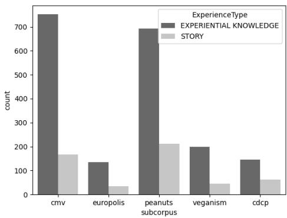  
Figure 1: distribution of stories and experiential knowledge per sub-corpus.

Proximity and protagonist While more personal experiences (first- or second-hand) often talk about individuals (FIRST-HAND=61%, SECOND-HAND=58%), stories whose narrative perspective is more general or from an observer’s point of view (other) more often talk about groups or institutions (GROUP=36%, NON-HUMAN=43%). Thus, the experiences can be arranged on a scale between personal (here individuals rather play the main role) and general (a collective or certain, social circumstances are in the foreground).

<table><tr><td>Claim</td><td>marked span</td><td>Properties</td></tr><tr><td>ban of serving peanuts if allergic people are on the flight</td><td>We have several times had issues with airlines not caring about the allergies. One Continental Flight attendant once insisted on that it was a rule that she had to serve peanuts to us and everyone around us even though we had informed them before hand that we had peanut allergies. I believe Continental since has stopped serving peanuts, but it was very unpleasant and we had to give Benadryl to our then 2 year old as he started wheezing. it was not</td><td>Experience Type: STORY Hypothetical: False Protagonist: INDIVIDUAL Proximity: FIRST-HAND Function: DISCLOSURE OF HARM Emotional Appeal: 2</td></tr><tr><td>Cyberbullying makes bullying more ubiqui- tous</td><td>until he was wheezing that the flight attendant was kind enough to inform the Captain and take back the peanuts! Instead of having to wait until after lunch or the corner of the playground at recess where the teacher can&#x27;t see, these kids have smartphones and can say hurtful things from anywhere, any time of the day. Instead of a kid getting called a faggot at school once or twice a day he&#x27;s getting facebook messages about how he should go kill himself.</td><td>Effectiveness: 3 Experience Type: EXPERI- ENTIAL KNOWLEDGE Hypothetical: True Protagonist: GROUP Proximity: OTHER Function: CLARIFICA- TION;DISCLOSURE OF HARM Emotional Appeal: 2</td></tr></table>

Table 3: Two example experience spans with corresponding annotations.

We can also observe differences with respect to proximity and protagonists when comparing the different sub-corpora. If we compare the distribution of narrative proximity across the sub-corpora we can see that first-hand stories are most frequent (76%) and second-hand stories are quite rare (10%) (more cases can be found in peanuts (15%). For Europolis, on the other hand, most experiences are reported from an external perspective (OTHER = 48%, FIRST-HAND = 42%).

We can observe a similar trend when we compare the main characters of the stories. The individual plays a more important role in CMV (57%), cdcp (52%) and peanuts (66%) while for Europolis and the NYT comments stories are more often about collectives, such as groups or institutions (Europolis: GROUP=56%, NON-HUMAN=24%; NYT comments: GROUP=21%, NON HUMAN=43%). On the one hand, this makes sense, since the topics of immigration and veganism are political topics of interest to society as a whole, whereas the other discussions tend to involve everyday topics with less social relevance. On the other hand, the setup of the discussions also plays a role: the discussion in Europolis is deliberative and conducted on a European level, therefore the participants see themselves as representatives of a larger collective (their country) and consequently more often take a broader perspective.

Argumentative Function Regarding the distribution of argumentative functions, we find that the amount of ESTABLISH BACKGROUND and CLARIFICATION is a lot higher than the more specific types DISCLOSURE OF HARM and SEARCH FOR SOLUTION (clarification=43%, background=38%, harm=10%, solution=9%). Comparing the two more specific functions, NYT comments shows a lot more solution-oriented experiences than disclosures of harms (15% vs. 3%). In this discourse, people often share positive experiences with the vegan lifestyle to illustrate the benefits of this on everyday life. There are also more solution-oriented experiences in Europolis (11%) - a corpus with a strong deliberative focus in which moderators facilitate productive and solution-oriented discussion. In peanuts and cdcp many experiences about harm are shared (12% and 21%, respectively), for example, by allergy sufferers who feel unfairly treated and disadvantaged and who want to trigger empathy and understanding in the other discourse participants by highlighting their suffering, to achieve a change in the regulations.

## 5.1 Agreement

Although the annotation study was designed as an extractive task, we can merge extracted experience spans based on token overlap to be able to compute agreement and to assess how many distinct stories have been identified by our annotators. We merge spans based on the relative amount of shared tokens (token overlap). Given two spans, we compute the relative overlap by dividing the number of overlapping tokens by the maximum number of tokens that are spanned by the two. Note that there are also many experiences only extracted by one of the annotators (little to no token overlap). Around 500 groups can be extracted that contain experiences which have the exact same start and end token and that the number increases with a higher tolerance in overlap ( 700 stories share 60% overlap, 800 share at least 40%).

We compute the agreement taking different subsets of the data with different tolerance levels for token overlap (0.6, 0.8 and 1.0). We compute Krippendorff’s alpha as it can express inter-rater reliability independent of the number of annotators and for incomplete data. The values range between -1 (systematic disagreement) and 1 (perfect agreement).

<table><tr><td>Annotation Layer</td><td>α (0.6)</td><td>α (0.8)</td><td>α (1.0)</td></tr><tr><td>experience type</td><td>0.53</td><td>0.52</td><td>0.47</td></tr><tr><td>proximity</td><td>0.56</td><td>0.57</td><td>0.57</td></tr><tr><td>hypothetical</td><td>0.68</td><td>0.75</td><td>0.77</td></tr><tr><td>emotional load</td><td>0.31</td><td>0.34</td><td>0.36</td></tr><tr><td>argumentative function</td><td>0.04</td><td>0.05</td><td>0.04</td></tr><tr><td>effectiveness</td><td>0.09</td><td>0.10</td><td>0.10</td></tr></table>

Table 4: Krippendorff’s alpha for different ranges of token overlap.

Table 4 depicts the agreement for each annotation layer. It becomes evident that there is a large difference between the narrative properties (moderate to high agreement) and the argumentative properties (low to no agreement). For most layers the token overlap plays a role – the more overlap between experiences, the higher the agreement (except experience type). Effectiveness and the argumentative function are highly subjective which calls for a closer investigation of annotator-specific differences (see Section 6).

Figure 2 illustrates the confusion matrix for each argumentative function. Here we can see that CLARIFICATION is often annotated as ESTABLISH BACKGROUND and vice versa. Furthermore, ESTABLISH BACKGROUND is frequently annotated with other functions. For the more specific functions DISCLOSURE OF HARM and SEARCH FOR SOLUTION, ESTABLISH BACKGROUND is also frequently annotated. We conclude that the functions do not allow for distinctive classification, but that an experience can take on several argumentative functions. It is difficult for the annotators to select a dominant one, which is why a multilabel annotation makes more sense. We can add this annotation layer using token-overlap: for each experience in the dataset, we therefore add any additional argumentative functions made by other annotators for that experience.

## 6 Analysis: what makes experiences effective in an argument?

In order to investigate which characteristics of experiences influence the annotators’ perceived effectiveness of the experience in the argument, we perform a regression analysis on our dataset. Which types of experiences are perceived as more or less effective?

The regression model contains effectiveness on a continuous scale (1 – 3, from low to high) as a dependent variable (DV) and the annotated properties (narrative and argumentative) of the experiences as independent variables (IV). Each annotated instance with a clear argumentative position represents a data point, we drop all instances with missing values in any of the annotation layers or an unclear stance (n = 2,367).

Besides the annotated properties we add the number of tokens as a continuous IV and convert the labels of emotional appeal to a continuous scale (1 – 3). Since we saw that the perceived effectiveness of experiences is subjective, we add the annotator as an IV to the model. This allows us to uncover general trends but also annotator-specific differences. The following formula describes the full model with 8 IVs and all two-way interactions.1.

$$
\begin{array} { c } { { \mathsf { E f f e c t i v e n e s s } \sim ( \mathsf { E x p e r i e n c e T y p e } \ + \mathsf { \Pi } } } \\ { { \mathsf { A r g F u n c t i o n } \ + \mathsf { E m o t i o n a l A p p e a l } \ + \mathsf { \Pi } \mathsf { h y p o t h e t i c a l } \ + \mathsf { \Pi } } } \\ { { \mathsf { p r o x i m i t y } \ + \mathsf { p r o t a g o n i s t } + \mathsf { \Pi } \mathsf { t o k e n s } \ + \mathsf { \Pi } \mathsf { a n n o t a t o r } \ \mathrm { \Pi } ^ { \star } \ 2 } } \end{array}
$$

We perform a step-wise model selection 2 to reduce the complexity of the model. We estimate the best fit in terms of adjusted $R ^ { 2 }$ (proportion of explained variance). The final model explains 31% of the variance. The most explanatory variables are the annotator (13.41%), the experience type (3.42%), the argumentative function (4.38%), the number of tokens (2.7%) and emotional appeal (1.4%). 3

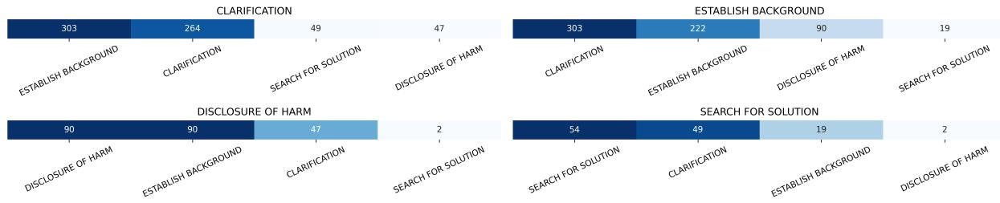  
Figure 2: confusion matrix for each argumentative function.

Which properties have the greatest effect on the perceived effectiveness?

The forest plot in figure 3 illustrates which values of the corresponding properties have the greatest impact on the effectiveness. In general experiences with stronger narrative character (ExperienceType = STORY) are perceived as more effective as well as those that are more affective (higher values for emotional appeal) or longer (higher number of tokens). These findings are consistent with findings from psychology: stories are particularly compelling when they ‘transport’ the listener to another world (narrative transportation), or in other words, when they stimulate a stronger narrative engagement (Nabi and Green, 2014; Green, 2021).

For the categorical IVs protagonist and argumentative function we can compare all values with the effect plots in Appendix Figure 3.4 We can observe that predicted effectiveness increases with specificity of argumentative function (increase from clarification to background to harm to solution), and SEARCH FOR SOLUTION predicts the highest effectiveness indicating a preference for solutionoriented experiences. With regard to the protagonists, the effectiveness increases from individual to general. Experiences in which a collective is the focus (group or country / institution) are perceived as more effective.

## Annotator preferences for argumentative functions

Figure 4(a) visualizes the predicted effectiveness for the interaction between the annotator and the argumentative functions. We can see that different annotators prefer different argumentative functions when it comes to perceived effectiveness. Annotator 3 and 4 show a similar trend (comparable to the single effect): more specific functions (e.g. harm or solution) lead to an increase in predicted effectiveness, compared to the more general functions (clarification, establish background) (the yellow and the orange line have a similar gradient across the functions). Opposed to that, annotator 1 clearly prefers search for solution over the other functions (highest peak for this function in the red line) while annotator 2 shows the opposite trend and perceives disclosures of harm as more effective (peak for this function in the blue line).

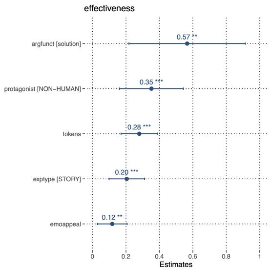  
Figure 3: Standardized beta values of selected terms (most explanatory regr. model, $R ^ { 2 } = 3 2 \% )$ : forest plot

Fictional stories are less effective when credibility is important Finally, we can also observe differences in the perception of the effectiveness of fictional versus factual narratives when they take on different argumentative functions. While fictional stories are perceived as effective in clarification and solution, the fictional character has a negative influence in establish background and harm: compare, in Figure 4(b), the increase in the blue line (factual stories) vs. drop in the silver line (fictional stories) for these functions. This indicates that credibility plays an important role when stories are used to establish the narrator as an expert or to elicit empathetic reactions with a harmful experience. The fictional nature of the experience could diminish authenticity, or, in the case of negative experiences, the audience is more likely to feel empathy if the experience happened to a person in reality.

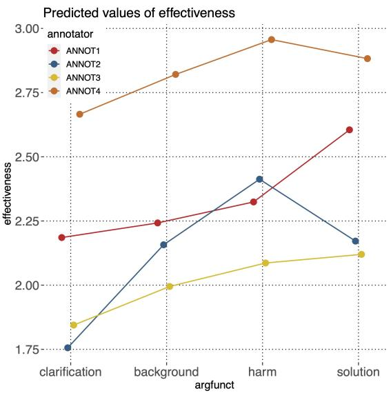  
(a) Interaction: annotator and argumentative function

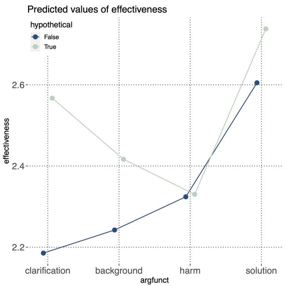  
(b) Interaction: hypothetical and argumentative function  
Figure 4: Marginalized effect of interaction terms

## 7 Conclusion

The role played by personal narratives in argumentation is widely acknowledged in the Social Sciences but so far not investigated in computational argumentation. StoryARG, the resource released in this paper, and the analysis we conduct is the first step towards filling this gap.

The interdisciplinary annotation scheme of StoryARG makes it unique in the landscape of research on computational argumentation: we integrate argumentative layers and narrative layers, thus uncovering interaction between the different facets of the phenomenon (e.g., positive impact on effectiveness for longer stories with a plot-like development). Crucially, the annotator-specific preferences uncovered in our annotations place our work in the broader debate on perspectivism and the importance of looking at disagreements as a resource and not as a bug.

StoryARG is sampled from existing reference corpora (plus a novel, out-of-domain sample), making the year-long effort invested in its annotation sustainable as our annotations can be compared with available ones for the same datasets. The dataset and annotation guidelines can be accessed via https://github.com/Blubberli/ storyArg.

## Limitations

The data set presented is still quite small for machine-learning models, as is the number of annotators (and thus the demographic diversity). Since the annotation required a lot of human effort, we chose fewer, but experienced, student assistants as annotators to ensure a high quality of the annotations.

The agreement for effectiveness and argumentative function is low. To address this weakness we used the following strategies: a) An examination of the confusion matrices reveals that the annotation scheme is not exclusive, that is, a story can take on multiple argumentative functions. We therefore include different, aggregated versions of our dataset that include this annotation layer as a multi-label layer (see Section 4). b) We address the subjectivity of the two annotation layers in a regression analysis (Section 6). The interactions between each annotator and certain annotated properties show annotator-specific differences, which should also not be ignored in the modeling.

A crowd-sourcing study could build on the initial findings and collect more annotations for effectiveness to investigate perspectivism in this context. Finally, we lacked sufficient space to analyze the existing annotations of the sub-corpora of our resource (e.g. testimony in CMV and Regulation Room) and discuss them with our new annotations. We see this as an opportunity for future work.

## Ethics Statement

Recent studies show that experiences and stories in argumentation can help bridge disagreements, especially when it comes to moral beliefs (Kubin et al., 2021). This is especially the case when experiences of harm are involved. The risk is that these are perceived as more credible than facts. Our presented data set contains such experiences and can possibly be misused to develop models that automatically generate such experiences. These can be used in political discourse for manipulation: it is much more difficult to check whether a story is ‘fake’ because it does not contain verifiable facts. Another risk is the training of models that extract personal information (since the data set contains personal experiences, such a model would be possible in principle).

## Acknowledgements

We would like to acknowledge the reviewers for their helpful comments and Eva Maria Vecchi for giving feedback on this work. Many thanks also to our student annotators who contributed greatly to this work and to Rebecca Pichler who collected the NYT comments for the veganism subcorpus. This work is supported by Bundesministerium für Bildung und Forschung (BMBF) through the project E-DELIB (Powering up e-deliberation: towards AI-supported moderation)

## References

Khalid Al-Khatib, Henning Wachsmuth, Matthias Hagen, and Benno Stein. 2017. Patterns of argumentation strategies across topics. In Proceedings of the 2017 Conference on Empirical Methods in Natural Language Processing, pages 1351–1357, Copenhagen, Denmark. Association for Computational Linguistics.

Khalid Al-Khatib, Henning Wachsmuth, Johannes Kiesel, Matthias Hagen, and Benno Stein. 2016. A news editorial corpus for mining argumentation strategies. In Proceedings of COLING 2016, the 26th International Conference on Computational Linguistics: Technical Papers, pages 3433–3443, Osaka, Japan. The COLING 2016 Organizing Committee.

Aristotle. 1998. The Complete Works ofAristotle: Revised Oxford Translation. Princeton University Press.

Valerio Basile. 2020. It’s the end of the gold standard as we know it. on the impact of pre-aggregation on the evaluation of highly subjective tasks. In DP@AI\*IA.

L. Black. 2008. Listening to the city: Difference, identity, and storytelling in online deliberative groups. Journal ofPublic Deliberation, 5:4.

S. Dillon and C. Craig. 2021. Storylistening: Narrative Evidence and Public Reasoning. Taylor & Francis.

Ryo Egawa, Gaku Morio, and Katsuhide Fujita. 2019. Annotating and analyzing semantic role of elementary units and relations in online persuasive arguments. In Proceedings of the 57th Annual Meeting of the Association for Computational Linguistics: Student Research Workshop, pages 422–428, Florence, Italy. Association for Computational Linguistics.

Katharina Esau. 2018. Capturing citizens’ values: On the role of narratives and emotions in digital participation. Analyse Kritik, 40(1):55–72.

Neele Falk and Gabriella Lapesa. 2022. Reports of personal experiences and stories in argumentation: datasets and analysis. In Proceedings of the 60th Annual Meeting ofthe Associationfor Computational Linguistics (Volume 1: Long Papers), pages 5530– 5553, Dublin, Ireland. Association for Computational Linguistics.

Walter R. Fisher. 1985. The narrative paradigm: In the beginning. Journal ofCommunication, 35(4):74–89.

Marlène Gerber, André Bächtiger, Susumu Shikano, Simon Reber, and Samuel Rohr. 2018. Deliberative abilities and influence in a transnational deliberative poll (europolis). British Journal ofPolitical Science, 48(4):1093–1118.

Melanie C. Green. 2021. Transportation into narrative worlds. In Entertainment-Education Behind the Scenes, pages 87–101. Springer International Publishing.

Jurgen Habermas. 1996. Between Facts and Norms: Contributions to a Discourse Theory of Law and Democracy. MIT Press, Cambridge, MA, USA.

Hans Hoeken and Karin M. Fikkers. 2014. Issuerelevant thinking and identification as mechanisms of narrative persuasion. Poetics, 44:84–99.

Manfred Kienpointner. 1992. Alltagslogik. Struktur und Funktion von Argumentationsmustern. Stuttgart-Bad Cannstatt: Frommann-Holzboog.

Jan-Christoph Klie, Michael Bugert, Beto Boullosa, Richard Eckart de Castilho, and Iryna Gurevych. 2018. The inception platform: Machine-assisted and knowledge-oriented interactive annotation. In Proceedings of the 27th International Conference on Computational Linguistics: System Demonstrations, pages 5–9. Association for Computational Linguistics. Veranstaltungstitel: The 27th International Conference on Computational Linguistics (COLING 2018).

Emily Kubin, Curtis Puryear, Chelsea Schein, and Kurt Gray. 2021. Personal experiences bridge moral and political divides better than facts. Proceedings ofthe National Academy of Sciences, 118(6).

Rousiley C. M. Maia, Danila Cal, Janine Bargas, and Neylson J. B. Crepalde. 2020. Which types of reasongiving and storytelling are good for deliberation? assessing the discussion dynamics in legislative and citizen forums. European Political Science Review, 12(2):113–132.

Robin L. Nabi and Melanie C. Green. 2014. The role of a narrative's emotional flow in promoting persuasive outcomes. Media Psychology, 18(2):137–162.

Joonsuk Park, Cheryl Blake, and Claire Cardie. 2015a. Toward machine-assisted participation in erulemaking: An argumentation model of evaluability. In Proceedings of the 15th International Conference on Artificial Intelligence and Law, ICAIL ’15, page 206–210, New York, NY, USA. Association for Computing Machinery.

Joonsuk Park and Claire Cardie. 2014. Identifying appropriate support for propositions in online user comments. In Proceedings ofthe First Workshop on Argumentation Mining, pages 29–38, Baltimore, Maryland. Association for Computational Linguistics.

Joonsuk Park and Claire Cardie. 2018. A corpus of eRulemaking user comments for measuring evaluability of arguments. In Proceedings of the Eleventh International Conference on Language Resources and Evaluation (LREC 2018), Miyazaki, Japan. European Language Resources Association (ELRA).

Joonsuk Park, Arzoo Katiyar, and Bishan Yang. 2015b. Conditional random fields for identifying appropriate types of support for propositions in online user comments. In Proceedings ofthe 2nd Workshop on Argumentation Mining, pages 39–44, Denver, CO. Association for Computational Linguistics.

Francesca Polletta and John Lee. 2006. Is telling stories good for democracy? rhetoric in public deliberation after 9/ii. American Sociological Review, 71(5):699– 723.

Juliane Schröter. 2021. Narratives argumentieren in politischen leserbriefen. Zeitschriftfür Literaturwissenschaft und Linguistik, 51(2):229–253.

Wei Song, Ruiji Fu, Lizhen Liu, Hanshi Wang, and Ting Liu. 2016. Anecdote recognition and recommendation. In Proceedings of COLING 2016, the 26th International Conference on Computational Linguistics: Technical Papers, pages 2592–2602, Osaka, Japan. The COLING 2016 Organizing Committee.

Alexandra N. Uma, Tommaso Fornaciari, Dirk Hovy, Silviu Paun, Barbara Plank, and Massimo Poesio. 2022. Learning from disagreement: A survey. J. Artif. Int. Res., 72:1385–1470.

Douglas Walton, Christopher Reed, and Fabrizio Macagno. 2008. Argumentation Schemes. Cambridge University Press.

Douglas N. Walton. 2014. Argumentation schemes for argument from analogy. In Systematic Approaches to Argument by Analogy, pages 23–40. Springer International Publishing.

Xuewei Wang, Weiyan Shi, Richard Kim, Yoojung Oh, Sijia Yang, Jingwen Zhang, and Zhou Yu. 2019. Persuasion for good: Towards a personalized persuasive dialogue system for social good. In Proceedings of the 57th Annual Meeting ofthe Associationfor Computational Linguistics, pages 5635–5649, Florence, Italy. Association for Computational Linguistics.

## Appendix

## A Annotation procedure

We conducted the annotation study in 5 rounds.

The first round was used as a pilot study to refine the guidelines. We discussed the the initial guidelines with a hired student who then annotated 15 comments. The guidelines were updated based on feedback and a discussion of this pilot study.

The second round was a training for our main annotators and consisted of 35 documents to clarify their questions. The guidelines were updated again with more guidance about difficult or unclear cases.

In the following three rounds the students annotated the 507 documents from this dataset. We hired 4 students (2 male, 2 female): three Master students in Computational Linguistics ( who have all participated in an Argument Mining course and thus have a background in this domain) and one Master student of Digital Humanities. All have a very high level of English proficiency (one native speaker). Countries of origin: Canada, Pakistan, Germany. The annotators were aware that the data from the annotation study was used for the research purposes of our project. We had continuous contact with them through the study and were always available to answer questions.

The students annotators have been paid 12,87 Euro per hour. The two female students annotated all three rounds, the male students annotated 2 rounds. As a result the first round was annotated by 4 annotators and the second and third by three. The entire study required a human effort of 400 hours (including meetings to discuss the annotations) over a period of approximately one year.

The study was conducted using the annotation tool INCEpTION (Klie et al., 2018). All annotator names are anonymized in the release of StoryARG.

## B Regression analysis: details

Table 5 shows all terms of the most explanatory regression model for predicting effectiveness annotations in StoryARG. The total amount of explained variance is 32.69 %.

Figure 5 visualizes the effects for argumentative function and protagonist. An increase in the corresponding lines means an increase in the perceived effectiveness for a certain value.

<table><tr><td></td><td>Df</td><td>Pr(F)</td><td>explvar</td></tr><tr><td>annotator</td><td>3</td><td>0.00</td><td>13.41</td></tr><tr><td>Functionsofpersonalexperiences</td><td>3</td><td>0.00</td><td>4.38</td></tr><tr><td>ExperienceType</td><td>1</td><td>0.00</td><td>3.42</td></tr><tr><td>tokens</td><td>1</td><td>0.00</td><td>2.70</td></tr><tr><td>Emotionalappeal</td><td>1</td><td>0.00</td><td>1.40</td></tr><tr><td>Functionsofpersonalexperiences:annotator</td><td>9</td><td>0.00</td><td>1.28</td></tr><tr><td>annotator:tokens</td><td>3</td><td>0.00</td><td>1.14</td></tr><tr><td>Functionsofpersonalexperiences:Hypothetical</td><td>3</td><td>0.00</td><td>0.94</td></tr><tr><td>Proximity:annotator</td><td>6</td><td>0.00</td><td>0.91</td></tr><tr><td>Hypothetical:annotator</td><td>3</td><td>0.00</td><td>0.61</td></tr><tr><td>Emotionalappeal:annotator</td><td>3</td><td>0.00</td><td>0.57</td></tr><tr><td>Functionsofpersonalexperiences:Protagonist</td><td>6</td><td>0.02</td><td>0.45</td></tr><tr><td>ExperienceType:tokens</td><td>1</td><td>0.00</td><td>0.33</td></tr><tr><td>Emotionalappeal:tokens</td><td>1</td><td>0.00</td><td>0.33</td></tr><tr><td>Protagonist</td><td>2</td><td>0.02</td><td>0.23</td></tr><tr><td>Hypothetical:Protagonist</td><td>2</td><td>0.04</td><td>0.19</td></tr><tr><td>Hypothetical</td><td>1</td><td>0.02</td><td>0.16</td></tr><tr><td>Proximity</td><td>2</td><td>0.11</td><td>0.13</td></tr><tr><td>ExperienceType:Proximity</td><td>2</td><td>0.16</td><td>0.11</td></tr><tr><td>ExperienceType:Hypothetical</td><td>1</td><td>0.77</td><td>0.00</td></tr><tr><td>Hypothetical:Proximity</td><td>2</td><td></td><td></td></tr><tr><td>sum R²</td><td></td><td>0.97</td><td>0.00 32.69</td></tr></table>

Table 5: Terms of the most explanatory regression model for predicting effectiveness, with degrees of freedom, statistical significance and explained variance.

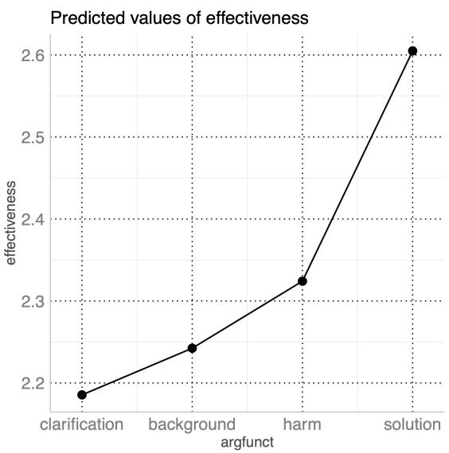  
(a) argumentative function

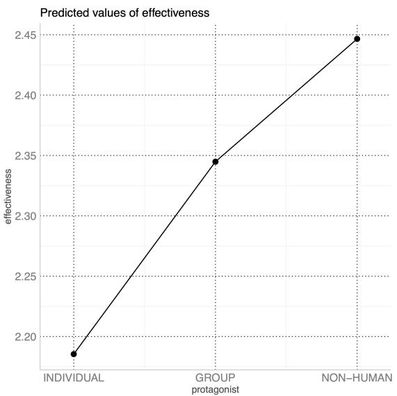  
(b) protagonist  
Figure 5: Single effects of argumentative function and protagonist for the final regression model. A positive effect (increase in the line) indicates that the corresponding level leads to a higher predicted effectiveness (reference level is the left-most label).

## C Annotation Guidelines

## Introduction

When people discuss with each other, they often not only rely on rational arguments, but also support their points of view with alternative forms of communication, for example, they share personal experiences. This happens above all in less formal contexts, i.e. when people or citizens discuss certain topics online or in small groups. The goal of the annotation study is to investigate where in the arguments the personal experiences are described, what functions they take within such arguments and what effect they can have on the other participants in the discourse.

At the core of the annotation is the discourse contribution or post that contains a personal experience. In the context of the whole contribution and with regard to the discourse topic, some properties of the experience will then be annotated in more detail.

## Instructions

Go to https://7c2696e6-eca6-4631-8b71-f3f912d92cf5.ma.bw-cloud-instance.org/login. html to open the annotation platform inception. Sign in with your User ID and password. Select the project StorytellingRound3 and then Annotation. You will see a list of documents that can be annotated. Once you select a document you will see the document view.

Each document is a contribution (either a comment from a discussion forum or a spoken contribution from a group discussion). In your settings increase the number of lines displayed on one page (e.g. 20) so that it is likely that you will see the whole contribution. The first line displays the underlying corpus.

  
Figure 6: Document view: The first line (orange) is the source of the contribution. On the right side (green) you can select different layers

As a first step you should read the document / post and try to understand and note down the position of the author. Then you should mark all experiences and annotate several properties for each of these.

## Stance

Select the layer stance. Because inception doesn’t allow document-based annotations you have to select the first line of the document, which contains the information about the source of the contribution (see figure 7).

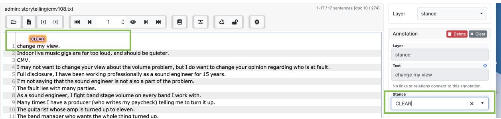  
Figure 7: General Stance: Select the layer stance and mark the first line (green). Then you should annotate whether the position is CLEAR or UNCLEAR for the whole contribution

Before you annotate make sure you have read the corpus-specific information: for each source you find general information about the topics discussed and the type of data (e.g. for Europolis, the information can be read in section C).

Read the contribution. Does the contribution explicitly or implicitly express an opinion on a certain issue? The issue can be explicitly mentioned (e.g. "I think peanuts should be completely banned from airplanes") or left implicit because it is one of the issues discussed in general (check the corresponding section on the source of the contribution to find a list of concrete issues being discussed) or because the author agrees or disagrees with another author ("I agree / disagree with X..."). Write down the position or idea that is conveyed within this post into the corresponding csv file. The csv file contains two columns: the ID of the document and the second column should contain the position of the corresponding contribution and should be filled out by you; e.g. if your document is the one of Figure 7 you should note down the position of the author into the column next to ’cmv77’. If you cannot identify a position or opinion within the contribution, select UNCLEAR.

## Europolis

This source is a group discussion of citizens from different European countries about the EU and the topic immigration. The contribution can convey a position towards one of the following targets:

• illegal immigrants should be legalized

• we should build walls and seal borders

• illegal immigrants should be sent back home

• integration / assimilation is a good solution for (illegal) immigration

• immigration should be controlled for workers with skills that are needed in a country

• immigration increases crime in our society

• Muslim immigrants threaten culture

## Regulation Room

The regulation room is an online platform where citizens can discuss specific regulations that are proposed by companies and institutes and that will affect everyday life of customers or employers.

## Peanut allergy

The target of the discussion is the following:

• The use of peanut products on airplanes should be restricted (e.g. completely banned, only be consumed in a specific area, banned if peanut allergy sufferers are on board).

You can have a look on the platform and the discussion about peanut product regulations via this link: http://archive.regulationroom.org/airline-passenger-rights/index.html%3Fp=52.html

## Consumer debt collection practices

This discussion is about how creditors and debt collectors can act to get consumers to pay overdue credit card, medical, student loan, auto or other loans in the US. The people discussing a sharing their opinion about the way information about debt is collected. Some people have their own business for collecting debts, some have experienced abusive methods for debt collection, such as constant calling or violation of data privacy.

You can have a look on the platform and the discussion about regulating consumer debt collection practices via this link: http://www.regulationroom.org/rules/ consumer-debt-collection-practices-anprm/

## Change my View

This is an online platform where a person presents an argument for a specific view. Other people can convince the person from the opposite view. The issue is always stated as the first sentence of the contribution. (see figure 8)

DISCLAIMER: Some of the topics discussed can include violence, suicide or rape. As the issue is always stated as the first sentence you can skip annotating the comment.

change my view.   
2Indoor live music gigs are far too loud, and should be quieter.   
3CMV.   
4 I may not want to change your view about the volume problem, but I do want to change your opinion regarding who is at fault.   
5Full disclosure, I have been working professionally as a sound engineer for 15 years.   
6I'm not saying that the sound engineer is not also a part of the problem.

Figure 8: change my view: If the source is change my view (orange) the issue is always stated as the first sentence of the contribution (green)

## NYT Comments

This data contains user comments extracted from newspaper articles related to the discourse about veganism. Veganism is discussed with regards to various aspects: ethical considerations, animal rights, climate change and sustainability, food industry etc.

## Annotation: Experience

Each document may contain several experiences. Make sure you have selected the layer personal experience (compare figure 11) Read the whole contribution and decide whether it contains personal experiences. Mark all spans in the text that mention or describes an experience. It is possible that there are several experiences. It is also possible that there is no experience, then you can directly click on finish document (Figure 9).

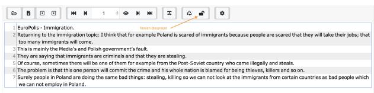  
Figure 9: Document view: Click finish document after you are done with the annotation.

A span describing an experience can cross sentence boundaries. If you are unsure about the exact boundaries, mark a little more rather than less. If an experience is distributed across spans, e.g. you feel like the experience is split up into parts and there are some irrelevant parts in between, still mark the whole experience, containing the spitted sub-spans and the irrelevant span in between. You should annotate 8 properties of each experience. Each property has more detailed guidelines and examples that should help you to annotate:

1. Experience Type: does the contribution contain a story or experiential knowledge?

2. Hypothetical: is the story hypothetical?

3. Protagonist: who is the main character / ’the experiencer’?

4. Proximity: is it a first-hand or second-hand experience?

5. Argumentative Function: what is the argumentative function of the experience?

6. Emotional Load: is the experience framed in an emotional tone?

7. Effectiveness of the experience: does the experience make the contribution more effective?

The order in which you annotate these is your own choice (some may find it easier to decide about the function of the experience first, others may want to start with main character). You can do it in the way that is easiest for you to annotate it and you can also do it differently for different experiences.

If there are specific words in the comment that triggered your decision to mark something as an experience, please select them by using the layer hints. Mark a word that you found being an indicator for your decision and press h to select it as a hint (compare Figure 10). You can mark as many words as you want but if there are no specific words that you found indicative, there is no need to mark anything.

## Experience Type

There are two different types of experiences, one is story and the other is experiential knowledge.

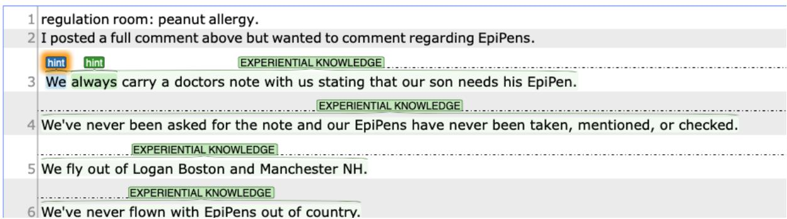  
Figure 10: hints: mark all words of a contribution that you would consider as being indicators for stories or experiences using the layer hints.

## STORY

Is the author recounting a specific situation that happened in the past and is this situation being acted out, that is, is a chain of specific events being recounted? Does the narrative have something like an introduction, a middle section\*, or a conclusion, this can for example be structured through the use of temporal adverbs, such as "once upon a time", "at the end", "at that time", "on X I was"...?

Example C.1. I think the new law on extended opening hours on Sundays has advantages. Once my mother-in-law had announced herself in the morning for a short visit. I went directly to the supermarket, which was still open. Could buy all the ingredients for the cake and then home, the cake quickly in the oven. In the end, my mother in law was thrilled, and I was glad that I could still buy something that day.

The person from the example narrates a concrete example. The experience follows a plot which is stressed by the temporal adverbs that structure the story-line (once, in the end).

## EXPERIENTIAL KNOWLEDGE

The speakers use experiential knowledge to support a statement, without creating an alternate scene and narration. In contrast to story complex narratives, information is presented without a story-line evolving in time and space. The author makes a more general statement about having experience or mentions the experience but does not recount it from beginning to the end. It is not retelling an entire story line.

Example C.2. As a teacher I have often seen how neglected children cause problems in the classroom.

In this example it becomes clear that the author has experiences because of being a teacher but these are not explicitly recounted. Figure 11 shows an example in inception with two different experiences and how to select the Experience Type for the second experience.

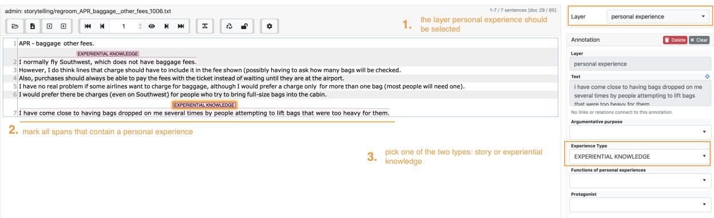  
Figure 11: Document view: Annotate experience type for the layer personal experience

Keep in mind that length is not necessarily an indicator for a story but the main criterion is whether the experience is about a concrete event: I flew from England to New Zealand and had to share my seat with

my 3-year old child. should be annotated as STORY, whereas Whenever Ifly I have to share my seat with   
my 3-year old child should be marked as EXPERIENTIAL KNOWLEDGE. Notesfor clarification:

  
Figure 12: hypothetical: set this filed to ’yes’ if the story or experience is clearly invented / made up / hypothetical.

A sequence/span should be annotated as experience if ...:

• ... the subject of the experience is someone else e.g. "A friend of mine works in a bar and she always complains about..."

• ... the recounted event did not happen, e.g. "I’ve been to McDonald’s several times and I’ve never had problems with my stomach after I ate there."

• ... the story is a hypothetical story but only if it is clear that it is based on some experience, e.g. ("sitting next to a dog would scare and frighten me a lot") but not ("sitting next to a dog can scare or frighten people". In this case set the property hypothetical to yes (compare Figure 12).)

A sequence/span should not be annotated as experience if ...:

• ... the speaker has information from a non-human source, e.g. I read in a book that people do X....

• ... the experience is just a discussion about people having a certain opinion, e.g. myfriends think that X should not be done... should not be marked as an experience, but myfriend told me, she had an accident where... should be marked as experience.

## Protagonist

Who is the story / experience about?

• INDIVIDUAL The main character of the experience is / are individuals.

• GROUP The main characters of the experience is a group of people.

• NON-HUMAN The main character is a non-human, for example an institution, a company or a country.

You should always annotate Protagonist1. This is the main character /experiencer. If there is more than one main character occurring in the experience that differs in the label (e.g. there is a group and in individual) use Protagonist2 to be able to identify two different main characters. Otherwise set Protagonist2 to NONE. Notes for clarification:

• a GROUP is defined as a collective of several people that have a sense of unity and share similar characteristics (e.g. values, nationality, interests). Annotate the main character as a GROUP if the group is explicitly described or labelled with a name that expresses their group identity (e.g. ’the vegans’, ’the dutch’, ’the victims’, ’the immigrants’, ’the children’)

## Proximity to the narrator

• FIRST-HAND The author has the experience themselves

• SECOND-HAND The author knows someone who had the experience

• OTHER The authors do not explicitly state that they know the participants of the experience or that they had the experience themselves

## Argumentative functions

In this step you will annotate the argumentative function of a story. The functions have been introduced by (Maia et al., 2020) who investigated how rational reason-giving and telling stories and personal experiences influence the discussion in different contexts. Read the text you marked as being the personal experience and decide on one of the following functions. If you cannot understand the function of the experience or story in the context of the argument, select UNCLEAR.

## CLARIFICATION

Through the story or personal experience in the argument, the authors clarify what position they take on the topic under discussion. The personal experience clarifies the motivation for an opinion or supports the argument of the discourse participant.

Example C.3. As someone who grew up in nature and then moved to the city, I think the nature park should definitely be free. I think it is necessary to be able to to retreat to nature when you live in such a large city.

The story or personal experience can help the discourse participant to identify with existing groups (pointing out commonalities) or to stand out from them (pointing out differences).

Example C.4. As an athlete, I definitely rely on the supplemental vitamins, so I benefit from a regulation that will make them available in supermarkets. I take about 5 different ones a day, so I am slightly above what the average consumer takes.

The story or personal experience can illustrate how a rule or law or certain aspects of the discourse topic effect everyday life.

Example C.5. I tried a new counter like this last week. You have to enter your name and then answer a few questions. The price is calculated automatically. So for me the new counters worked pretty well, I’m happy.

## ESTABLISH BACKGROUND

The participants mention experiential knowledge or share a story to emphasize that they are an ’expert in the field or that they have the background to be able to reason about a problem. The goal can be to strengthen their credibility.

Example C.6. I’m a swim trainer. I have worked in the Sacramento Swimming Pool for 5 years, both with children and young adults. Parents shouldn’t be allowed to participate at the training sessions, they put too much pressure on the kids sometimes.

## DISCLOSURE OF HARM

A negative experience is reported that was either made by the discourse participants themselves or that they can testify to and casts the experiencer as a victim. The experience highlights injustice or disadvantage. For example, the negative experience may describe some form of discrimination, oppression, violation of rights, exploitation, or stigmatization.

Example C.7. When I’m out with white friends, I’m often the only one asked for ID by the police. And if you say something against it, they take you to the police station. I often feel so powerless.

Example C.8. When my friend told them at work that he can no longer work so many hours because of his burn out, they asked him why he was so lazy. He told me that hurts a lot and now he doesn’t dare to talk about it openly.

## SEARCH FOR SOLUTION

A positive experience is reported that can serve as an example of how a particular rule can be implemented or adapted. It may indicate suggestions of what should or should not be done to achieve a solution to the problem. The experience may indicate a compromise.

Example C.9. When I was at this restaurant and they introduced the new regulation that you have to give your address and your name once you enter the restaurant, the owner of this place gave a QR-code at the entrance which you could just scan and it would automatically fill in your details. I think this can save a lot of time.

## Decision Rules:

• If you cannot decide between an experience being CLARIFICATION or ESTABLISH BACKGROUND, pick ESTABLISH BACKGROUND.

• If you cannot decide between an experience being DISCLOSURE OF HARM or CLARIFICATION, pick DISCLOSURE OF HARM.

• If you are uncertain about CLARIFICATION or SEARCH FOR SOLUTION select SEARCH FOR SOLUTION.

It can happen that an experience needs to be split into two parts because the parts have different functions. If so, split the experience into several parts and mark each with the corresponding function, e.g. [1]:I used to go to the cinema in town quite often[2]:Since they changed the program to more alternative movies, I stopped going there. I prefer mainstream over arthouse. Part [1] should be annotated as ESTABLISH BACKGROUND and part [2] as CLARIFICATION.

## Emotional load

Assess the emotional load of the experience / story and rate it with one of the following levels:

• LOW

• MEDIUM

• HIGH

As a reference level have a look at the following examples, one experience for each level of emotional load.

LOW:

Example C.10. In my country we have a tax that regulates selling and buying alcohol and tobacco in order to prevent to reduce the consumption of these.

MEDIUM:

Example C.11. My friend told me she went to the new cinema in the city center the other day and she was like super impressed about the selection of different popcorn flavours they had. She told me they even have salted caramel, which is my favourite flavour. A ban on selling flavoured popcorn would diminish the fun of going to the cinema.

HIGH:

Example C.12. I was riding my bike and suddenly this dog came from behind and jumped at my bike like crazy. I screamed and was terrified, but the owner just said "he does nothing, he just wants to play". After that, I no longer dared to go to this park.

## Effectiveness of the experience

Do you think the story or the experience supports the argument of the author and makes the contribution stronger? Rate the effectiveness of the experience within the argument on a scale from ’low’ to ’high’.

• LOW

• MEDIUM

• HIGH

Try to asses this regardless of whether you agree with the author’s position, but rather whether the story / experience helps you better understand the author’s perspective.

## ACL 2023 Responsible NLP Checklist

A For every submission: ✓ A1. Did you describe the limitations of your work? Page 9 in the main paper provides the limitations section

✓ A2. Did you discuss any potential risks of your work? Potential negative societal impact is described in the ethics statement, page 9

✓ A3. Do the abstract and introduction summarize the paper’s main claims? Abstract, Section 1

✗ A4. Have you used AI writing assistants when working on this paper? Left blank.

## B ✓ Did you use or create scientific artifacts?

Yes, the dataset released and documented in the entire paper.

✓ B1. Did you cite the creators of artifacts you used? Section 3 contains all references to the creators ofthe respective datasets

✓ B2. Did you discuss the license or terms for use and / or distribution of any artifacts? Licence is added to the dataset repository

 B3. Did you discuss if your use of existing artifact(s) was consistent with their intended use, provided that it was specified? For the artifacts you create, do you specify intended use and whether that is compatible with the original access conditions (in particular, derivatives of data accessed for research purposes should not be used outside of research contexts)? Not applicable. Left blank.

✓ B4. Did you discuss the steps taken to check whether the data that was collected / used contains any information that names or uniquely identifies individual people or offensive content, and the steps taken to protect / anonymize it? Appendix A

✓ B5. Did you provide documentation of the artifacts, e.g., coverage of domains, languages, and linguistic phenomena, demographic groups represented, etc.? Table 1 in the main text reports on domains, topics, size.

✓ B6. Did you report relevant statistics like the number of examples, details of train / test / dev splits, etc. for the data that you used / created? Even for commonly-used benchmark datasets, include the number of examples in train / validation / test splits, as these provide necessary context for a reader to understand experimental results. For example, small differences in accuracy on large test sets may be significant, while on small test sets they may not be. Section 3 and Section 5 report the statistics of the dataset.

## C ✗ Did you run computational experiments?

Left blank.

 C1. Did you report the number of parameters in the models used, the total computational budget (e.g., GPU hours), and computing infrastructure used? No response.

 C2. Did you discuss the experimental setup, including hyperparameter search and best-found hyperparameter values? No response.

 C3. Did you report descriptive statistics about your results (e.g., error bars around results, summary statistics from sets of experiments), and is it transparent whether you are reporting the max, mean, etc. or just a single run? No response.

 C4. If you used existing packages (e.g., for preprocessing, for normalization, or for evaluation), did you report the implementation, model, and parameter settings used (e.g., NLTK, Spacy, ROUGE, etc.)? No response.

## D ✓ Did you use human annotators (e.g., crowdworkers) or research with human participants? Section C Appendix

✓ D1. Did you report the full text of instructions given to participants, including e.g., screenshots, disclaimers of any risks to participants or annotators, etc.? Section A, Appendix

✓ D2. Did you report information about how you recruited (e.g., crowdsourcing platform, students) and paid participants, and discuss if such payment is adequate given the participants’ demographic (e.g., country of residence)? Section A, Appendix

✓ D3. Did you discuss whether and how consent was obtained from people whose data you’re using/curating? For example, if you collected data via crowdsourcing, did your instructions to crowdworkers explain how the data would be used? Section A, Appendix

 D4. Was the data collection protocol approved (or determined exempt) by an ethics review board? Not applicable. Left blank.

✓ D5. Did you report the basic demographic and geographic characteristics of the annotator population that is the source of the data? Section A, Appendix