# Subjective Crowd Disagreements for Subjective Data: Uncovering Meaningful CrowdOpinion with Population-level Learning

Tharindu Cyril Weerasooriya 1\*, Sarah Luger2, Saloni Poddar1, Ashiqur R. KhudaBukhsh1, Christopher M. Homan1 1Rochester Institute of Technology, USA 2Orange Silicon Valley \*cyriltcw@gmail.com

## Abstract

This paper contains content that can be offensive or disturbing.

Human-annotated data plays a critical role in the fairness of AI systems, including those that deal with life-altering decisions or moderating human-created web/social media content. Conventionally, annotator disagreements are resolved before any learning takes place. However, researchers are increasingly identifying annotator disagreement as pervasive and meaningful. They also question the performance of a system when annotators disagree. Particularly when minority views are disregarded, especially among groups that may already be underrepresented in the annotator population. In this paper, we introduce CrowdOpinion, an unsupervised learning based approach that uses language features and label distributions to pool similar items into larger samples of label distributions. We experiment with four generative and one density-based clustering method, applied to five linear combinations of label distributions and features. We use five publicly available benchmark datasets (with varying levels of annotator disagreements) from social media (Twitter, Gab, and Reddit). We also experiment in the wild using a dataset from Facebook, where annotations come from the platform itself by users reacting to posts. We evaluate CrowdOpinion as a label distribution prediction task using KL-divergence and a single-label problem using accuracy measures.

## 1 Introduction

Long term exposure to offensive, threatening, and hate speech posts through any public-facing social media platform can lead to depression or even physical injuries, specially at a younger age (Pedalino and Camerini, 2022). This is a persistent problem in social and web content where the impact could be not limited to just the targeted parties but expand to anyone in the community consuming the content (Benson, 1996; Fauman, 2008; Chandrasekharan et al., 2017; Müller and Schwarz, 2020).

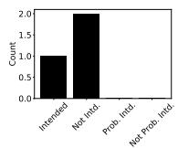  
(a) SIE1 “During the Thanksgiving season, many Americans support Jennie-O-cide.”

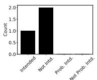

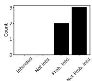  
(b) SIE2 “That’s not your real name. You’re supposed to have a foreign name or something.”  
(c) $\mathcal { D } _ { \mathsf { S I } } \mathrm { E } 3$ “what’s the difference between jelly and jam? i can’t jelly my d\*\*\* down your throat.”  
Figure 1: Examples from $\mathcal { D } _ { S I }$ (Sap et al., 2019), from human annotation for Twitter posts on whether they are intended to be offensive. These examples show how offense cannot generalize, and in cases when a majority of the annotators are not offended the input for a classifier is the majority voice.

Language used by content creators in social media (see Figure 1) with a subtle tone and syntax can hide the offensive content from the purview (Basile et al., 2019; Zubiaga et al., 2019) or machine learning classifiers (Kumar et al., 2021). This challenge has ethical and legal implications in many countries as these governments have imposed restrictions for platforms to identify and remove such harming content (Kralj Novak et al., 2022; Saha et al., 2019) citing the right for safety.

The ML classifiers generally rely on human feedback (Eriksson and Simpson, 2010; Dong et al., 2019). Because humans, as content creators or annotators (content moderators), are subjective in their opinions (Alm, 2011). Their feedback is essential to understanding subjective web or social media content. The standard practice is to ask multiple annotators about each post and then use the majority opinion or ML-based methods to determine the ground truth label (see Figure 2).

Typically, minority views are completely removed from the dataset before it is published. Yet these views are often meaningful and important (Aroyo and Welty, 2014; Kairam and Heer, 2016; Plank et al., 2014; Chung et al., 2019; Obermeyer et al., 2019; Founta et al., 2018). Figure 1 shows three tweets with offensive language that have been labeled by multiple annotators about the tweeter’s intent (Sap et al., 2019). In each case, the majority of annotators considers the offensiveness to be not intended. Yet a minority considers it to be intended. A classifier trained on such language data after these minority opinions are removed would not know about them. This is dangerous because abusers often obscure offensive language to sound unintended in case they are confronted (Sang and Stanton, 2022). And so, removing minority opinions could have dramatic impacts on the model’s performance if, say, it was trying to detect users creating hateful or offensive content on a social platform.

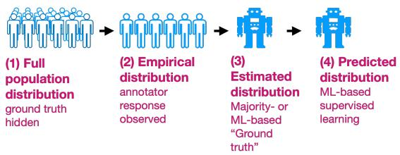  
Figure 2: Each learning example is associated with sets of labels: (1) the (hidden) full distribution of responses by the entire population of annotators/stakeholders; (2) the (observed) responses received often from human crowdworkers hired to annotate the data; (3) an estimate of the full population distribution based on the empirical distribution of the given item (and frequently of other items and anonymized identifiers for the annotators); (4) the prediction of a machine learning model trained on either the empirical or estimated distributions.

Consequently, a growing body of research advocates that published datasets include ALL annotations obtained for each item (Geng, 2016; Liu et al., 2019; Klenner et al., 2020; Basile, 2020; Prabhakaran et al., 2021). And a substantial body of research is studying annotator disagreement (Aroyo and Welty, 2014; Kairam and Heer, 2016; Plank et al., 2014; Chung et al., 2019; Obermeyer et al., 2019; Founta et al., 2018; Binns et al., 2017). Unfortunately, most existing datasets are based on 3–10 annotators per label, far too few, statistically speaking, to represent a population. Thus, learning over such a sparse space is challenging.

Liu et al. (2019) show that clustering in the space of label distributions can ameliorate the sparseness problem, indicating that data items with similar label distributions likely have similar interpretations. Thus, a model can pool labels into a single collection that is large enough to represent the underlying annotator population. Recent work by Davani et al.

(2022), studying annotator disagreement with majority vote and multi-label learning methods, has called out the need for cluster-based modeling to understand annotator disagreements.

The lack of annotator-level labels also hinders studying the annotator behaviors using methods that utilize those granular-level labels (Dawid and Skene, 1979; Rodrigues and Pereira, 2018; Gordon et al., 2022; Collins et al., 2022; Liu et al., 2023). We see this as a benefit to CrowdOpinion (CO) we propose, a technique applicable at a broader level for understanding and predicting annotator disagreements which mitigate granular-level annotations.

The motivation behind CrowdOpinion is to reduce inequity and bias in human-supervised machine learning by preserving the full distribution of crowd responses (and their opinions) through the entire learning pipeline. We focus our methods on web and social media content due to its subjectivity. Our contributions to this core problem in AI and NLP is a learning framework1 that uses unsupervised learning in Stage 1 on both the labels AND data features to better estimate soft label distributions. And in Stage 2, we use these labels from Stage 1 to train and evaluate with a supervised learning model. We consider the following three questions.

Q1: Does mixing languagefeatures and labels lead to better ground truth estimates than those that use labels only? This focuses on the first stage as a standalone problem and is difficult to answer directly, as “ground truth” from our perspective is the distribution of labels from a hidden population of would-be annotators, of which we often only have a small sample (3-10 annotators) per data item. We study four generative and one distance-based clustering methods, trained jointly on features and label distributions, where we vary the amount of weight given to features versus labels.

Q2: Does mixingfeatures and labels in thefirst stage lead to better label distribution learning in the second? We use the label distributions obtained from the first-stage models from Q1 as feedback for supervised learning. We compare our results with baselines from pooling based on labels only (Liu et al., 2019), predictions trained on the majority label for each item without clustering, and predictions trained on the label distribution for each item but without any other first-stage modeling. Our results show improvement over unaggregated baselines.

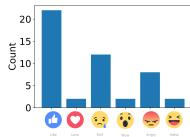  
(a) $\mathcal { D } _ { \mathsf { F B } } \mathrm { E 1 }$ “Some are calling President Obama the “deporter-in-chief,” rewriting his legacy.”

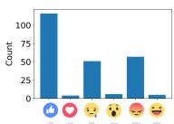  
(b) $\mathcal { D } _ { \mathsf { F B } } \mathrm { E } 2$ “Some criticized Obama administration attempting to deport immigrant women and children.”

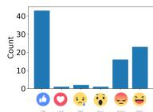  
(c) $\mathcal { D } _ { \mathsf { F B } } \mathrm { E } 3$ “Ted Cruz expressed that President Obama, instead of standing with our allies, insults them continuously.”  
Figure 3: Motivating examples from $\mathcal { D } _ { F B }$ (Wolf, 2016), demonstrating human disagreement to three posts. Reactions are like, love, sad, wow, angry, and haha.

Q3: Do our methods lead to better single-label learning (SL)? Since most applications consider only single-label prediction, we measure the model performance on single-label prediction via accuracy.

## 1.1 Beyond Experiments

Humans have annotated our benchmark datasets for specific tasks. However, this is not always the case in practice. Social networks have introduced reactions that allow users to react to platform content. We study this use case by predicting these reactions for Facebook posts (Wolf, 2016) as a special case.

Among the top 100 posts from Facebook (entropy > 1.2), 26 were about Donald Trump, with most of the label distribution mass divided between “like”, “haha”, and “angry”. Another 26 posts were about politics (but not Trump), with the label distribution mass generally divided between “angry” and “sad”. There were only two non-English posts and no sports-related posts. And interestingly, except for two non-English posts, all of the other top posts had a substantial portion of their mass on “angry”.

The bottom 100 set (entropy < 0.04) contains 46 posts about sports and 13 non-English posts. There was only one political post (and it was not about Trump). The label distribution pattern in this set was more dominated by “like” (> 98%), followed by reactions of either “love” or “haha”. “Like” was also dominant in the high entropy posts, but not to such a degree; based on this observation and (Tian et al., 2017), we eliminate it from our experiments.

Figure 3 illustrates some nuances in meaning that different label distributions reveal. All three are negative posts about Barack Obama, and all have most of their mass on $\mathbf { \tilde { \Pi } } ^ { 6 6 } \mathbf { \tilde { \Pi } } ^ { 1 \mathrm { i k e } } ^ { 3 }$ $\mathcal { D } _ { \mathsf { F B } } \mathrm { E } 1$ and FBE2 have similar distributions, in contrast to $\mathcal { D } _ { \mathsf { F B } } \mathrm { E } 3$ where, besides “like”, the distribution mass falls mainly on “haha” and “angry”. Perhaps this is because, in contrast to the first two posts which are from anonymous sources, the criticism on $\mathcal { D } _ { \mathsf { F B } } \mathrm { E } 3$ comes from a political rival, and maybe this provides a concrete target for ridicule?

## 1.2 Facebook’s Special Case

"Like" was the original Facebook reaction and platform users may find it a quick, default, and intuitive interaction. The over-representation of "like" on Facebook exemplifies how this dataset is an unusual human annotation case. It is unique not only in the human labeling behavior, but also in the resulting label distribution.

## 2 Methods - CrowdOpinion

In conventional, nondistributional supervised learning, clustering might happen over the feature space only as a form of data regularization (Nikulin and McLachlan, 2009); the labels, being strictly categorical and nondistributional, would be scalar and thus too simple to benefit from extensive modeling. In our setting, each data item $x _ { i } \in \mathcal X$ is associated with a vector $y _ { i } \in \mathcal { V }$ , representing the empirical distribution of ALL annotator responses, which we view as sample of a larger, hidden population. Our approach, CrowdOpinion (CO) is two-staged and summarized in Algorithm 1.

In Stage 1, we cluster together related data items and share among them a label distribution $\hat { y } _ { i }$ based on all labels from all items in each cluster. This stage resembles, in function, a deep vein of label estimation research begun by Dawid and Skene (Dawid and Skene, 1979; Carpenter, 2008; Ipeirotis et al., 2010; Pasternack and Roth, 2010; Weld et al., 2011; Raykar and Yu, 2012; Kairam and Heer, 2016; Gordon et al., 2021), except that (a) our output is an estimate of the distribution of label responses by the underlying population of annotators, not a single label, and (b) $y _ { i }$ in their models is a vector with one dimension for each annotator. To better handle the label sparseness common in most datasets, our $y _ { i }$ has one dimension for each label choice, representing the proportion of annotators who made that choice. Stage 2 performs supervised learning on these new item, label distribution pairs $( x _ { i } , \hat { y } _ { i } )$

Note that nearly any pair of clustering  and supervised learning algorithms can be used for stages one and two, respectively. Liu et al. (2019) performed the same kind of label regularization only using the label space $\mathcal { V } .$ , it is a baseline for our methods $( w = 0 )$ . Our main technical innovation is to perform label regularization based on the weightedjointfeature and label space $w \cdot \mathcal { X } \times ( 1 - w ) \cdot \mathcal { Y }$ , where $w \in [ 0 , 1 ]$ is the mixing parameter that determines the relative importance of  versus  during clustering.

Algorithm 1: CO- - -w   
1 Parameters:   
2 Clustering (or pooling) algorithm   
3 Hypothesis space $\mathcal { H }$   
4 Mixing parameter $w \in [ 0 , 1 ]$   
5 Inputs:   
6 Data features with empirical label   
distributions $( x _ { i } , y _ { i } ) _ { 1 \leq i \leq n }$ // BOTH   
$x _ { i }$ and $y _ { i }$ are vectors!   
7 Procedure:   
8 Stage 1:   
9 Perform clustering with on BOTH item   
features and labels, weighted and   
concatenated together:   
$( w \cdot x _ { i } , ( 1 - w ) \cdot y _ { i } ) _ { 1 \leq i \leq n }$   
10 Let $( \hat { x } _ { i } , \hat { y } _ { i } )$ be the centroid of the cluster   
$\pi _ { j }$ associated with each $( x _ { i } , y _ { i } )$   
11 Stage 2: Perform supervised learning on   
$( x _ { i } , \hat { y } _ { i } )$ over hypothesis space

We consider four clustering models used by Liu et al. (2019): a (finite) multinomial mixture model (FMM) with a Dirichlet prior over $\pi \sim$ $\operatorname { D i r } ( p , \gamma = 7 5 )$ , where $p$ is the number of clusters and each cluster distribution $\pi _ { j }$ is a multinomial distribution with Dirichlet priors $\operatorname { D i r } ( d , \gamma = 0 . 1 )$ where d is the size of the label space, using the bnpy library (Hughes and Sudderth, 2013), a Gaussian mixture model (GMM) and a K-means model (KM) from scikit-learn, and the Gensim implementation of Latent Dirichlet Allocation (LDA) (Reh˚u ˇ ˇrek and Sojka, 2010). Each of these models takes as a hyperparameter the number of clusters $p .$

We perform parameter search $( 4 ~ \leq ~ p ~ \leq$ 40) on the number of clusters, choosing arg $\begin{array} { r } { \operatorname* { m i n } _ { \boldsymbol { p } } \sum _ { i } K L ( ( x _ { i } , y _ { i } ) _ { w } , ( \hat { x } _ { i } , \hat { y } _ { i } ) _ { w } ) } \end{array}$ , i.e., the $p$ that minimizes the total KL divergence between the raw and clustered label distribution, where, e.g., $( x _ { i } , y _ { i } ) _ { w }$ denotes $\left( w \cdot x _ { i } , ( 1 - w ) \cdot y _ { i } \right)$ , i.e., the weighted concatenation of $x _ { i }$ and $y _ { i } .$

We also consider a soft, distance-based clustering method, called neighborhood-based pooling (NBP) in the context of PLL (Weerasooriya et al., 2020). For each data item i it averages over all data items $j$ within a fixed Kullback-Liebler (KL) ball of radius r:

$$
\hat { y } _ { i } = \overline { { \{ y _ { j } \mid K L \left( ( x _ { i } , y _ { i } ) _ { w } \| ( x _ { j } , y _ { j } ) _ { w } \right) < r \} } } .\tag{1}
$$

Here, the hyperparameter is the diameter r of the balls, rather than the number of clusters, and there is one ball for each data item. We perform hyperparameter search $( 0 \leq r \leq 1 5 )$ via methods used in (Weerasooriya et al., 2020). Table 2 summarizes model selection results using these methods.

The supervised model (CNN) for is a 1D convolutional neural network (Kim, 2014), with three convolution/max pool layers (of dimension 128) followed by a dropout (0.5) and softmax layer implemented with TensorFlow. The input to the model is a 384-dimension-vector text embedding, described below. Table 3 summarizes the supervised-learning based classification results.

We compare our methods against four baselines. PD is our CNN model but with no clustering; it is trained directly on the raw empirical label distributions $( y _ { i } )$ . SL the same model, but trained on one-hot encodings of most frequent label in each $y _ { i }$ . DS+CNN uses the Dawid and Skene (1979) model for and = CNN. CO- -CNN-0 is from Liu et al. (2019), which clusters on labels only.

We represent language features for both our unsupervised learning and classification experiments using a state-of-the-art pre-trained paraphrase-MiniLM-L6-v2 transformer model using SBERT (sentence-transformers) library (Reimers and Gurevych, 2019). We identified this pre-trained model based on STS benchmark scores at the time of writing. The feature vector size for each post is 384.

## 3 Experiments

## 3.1 Dataset Descriptions

As our approach focuses on human disagreement, we identified datasets that contain multiple annotators and multiple label choices per data item. We conducted our experiments on publicly available human-annotated English language datasets generated from social media sites (Facebook, Twitter, and Reddit). Each dataset consists of 2,000 posts and employs a 50/25/25 percent for train/dev/test split. Larger datasets are downsampled with random selection to 2,000 for a fairer comparison between them. The datasets vary in content, number of annotators per item, number of annotator choices, and source of content. More detailed descriptions of the datasets are included in the $\mathsf { A p - }$ pendix.

<table><tr><td>Dataset</td><td>No. of ants. (per item)</td><td>Total data items</td><td>No. of label choices</td><td>Avg. Entropy</td></tr><tr><td>DFB (Facebook)</td><td>Avg. 862.3</td><td>8000</td><td>5</td><td>0.784</td></tr><tr><td> $\mathcal { D } _ { \mathsf { G E } }$  (Reddit)</td><td>Avg. 4</td><td>54263</td><td>28</td><td>0.866</td></tr><tr><td> $\mathcal { D } _ { \boldsymbol { \mathrm { J 0 1 } } }$  (Twitter)</td><td>10</td><td>2000</td><td>5</td><td>0.746</td></tr><tr><td>DJQ2 (Twitter)</td><td>10</td><td>2000</td><td>5</td><td>0.586</td></tr><tr><td>DJQ3 (Twitter)</td><td>10</td><td>2000</td><td>12</td><td>0.993</td></tr><tr><td> $\mathcal { D } \varsigma _ { \perp }$  (Reddit)</td><td>Avg. 3</td><td>45318</td><td>4</td><td>0.343</td></tr></table>

Table 1: Experimental datasets summary: We calculated entropy per data item and averaged it over the dataset to measure uncertainty. $\scriptstyle { \mathcal { D } } _ { \mathsf { F B } }$ (Wolf, 2016), $\mathcal { D } _ { \mathsf { G E } }$ (Demszky et al., 2020), $\mathcal { D } _ { \mathbb { J } 0 1 - 3 }$ (Liu et al., 2016), and $\mathcal { D } _ { \mathsf { S I } }$ (Sap et al., 2019).
<table><tr><td>Dataset</td><td>DFB</td><td>DGE</td><td> ${ \mathcal { D } } { \boldsymbol { \mathfrak { I } } } _ { { \boldsymbol { \mathbb { Z } } } 1 }$ </td><td> ${ \mathcal { D } } { \mathfrak { J } } { \mathfrak { Q } } 2$ </td><td> $\underline { { \mathcal { D } \mathfrak { I } \mathfrak { Q } 3 } }$ </td><td> $\underline { { \mathcal { D } \mathsf { s } \mathtt { I } } }$ </td></tr><tr><td>Model</td><td>NBP</td><td>NBP</td><td>NBP</td><td>NBP</td><td>NBP</td><td>K-Means</td></tr><tr><td>KL (↓)</td><td>0.070</td><td>0.020</td><td>0.123</td><td>0.133</td><td>0.023</td><td>0.050</td></tr><tr><td>r/p</td><td>3</td><td>0.8</td><td>5.6</td><td>2.8</td><td>10.2</td><td>35</td></tr><tr><td>w</td><td>0.5</td><td>0</td><td>0.25</td><td>0.75</td><td>0</td><td>1.0</td></tr></table>

Table 2: Optimal label aggregation model summary with the parameters and KL-divergence. Here $r / p$ is the number of clusters for the generative models and r is the neighborhood size for distance-based clustering. K-Means is the optimum model for ${ \cal D } _ { S I } ,$ while NBP (distance-based clustering) is the optimal model for the remaining five datasets.

## 3.2 Results

To address Q1, i.e., whether mixtures of data features and labels in Stage 1 lead to better ground truth population estimates, Table 2 shows the model name, hyperparameter values, and mean KL divergence between the cluster centroid $\hat { y } _ { i }$ and each item’s empirical distribution $y _ { i }$ of the best cluster model for each dataset. The best choice for w varies considerably across the datasets. The two datasets, $\mathcal { D } _ { G E , J Q 3 }$ with the largest number of choices (28 and 12, respectively) both selected models with $w = 0 ,$ , i.e., the label distributions alone provided the best results. This was somewhat surprising, especially considering that in both cases the number of annotators per item is less than the number of label choices. We suspected that such sparse distributions would be too noisy to learn from. But apparently the size of these label spaces alone leads to a rich, meaningful signal.

On the other extreme, the dataset with the fewest annotators $( \mathcal { D } _ { S I } )$ per item selected a model with $w = 1 , \mathrm { i . e . }$ , it used only item features, and not the label distributions, to determine the clusters. This is what we would expect whenever there is relatively low confidence in the label distributions, which should be the case with so few labels per item. Interestingly, it was the only dataset that did not select NBP (K-Means).

In general, the mean KL-divergence for all selected models was quite low, suggesting that the items clustered together tended to have very similar label distributions. One might expect for there to be more divergence the higher w is, because clustering with higher w relies less directly on the label distributions. But, reading across the the results, there does not appear to be any relationship between w and KL-divergence. The datasets themselves are very different from one another, and so perhaps it is unlikely that something as simple as the mixing parameter w would change the final label assignment.

For Q2, i.e., whether mixtures of data features and labels in Stage 1 improve the label distribution prediction in Stage 2, we measure the mean KL $\left( y _ { i } \| \mathcal { H } ( x _ { i } ) \right)$ , where is one of the supervised learning models trained on each of the clustering models. For all datasets, the best cluster-based models in Table 3 outperform the baselines from Table 3. Among the clustering models, as with Q1 there is a lot of variation among which values for w give the best performance. But while the differences appear significant, they are not substantial, suggesting that subtle differences in the data or the inductive biases of particular clustering models are driving the variance.

It is interesting to note that DS+CNN is always close to the worst model and often the worst by far. This may be because (a) that model treats disagreement as a sign of poor annotation and seeks to eliminate it, whereas our model is designed to preserve disagreement (b) DS models individual annotator-item pairs and the datasets we study here (which are representative of most datasets currently available) have very sparse label sets, and so overfitting is a concern.

For Q3, Table 3 (bottom) shows the classification prediction results, where evaluation is measured by accuracy, i.e., the proportion of test cases where the arg max label of the (ground truth) training input label distribution is equal to that of the arg max predicted label distribution. Here the results are mixed between the non-clustering (Table 4) and clustering (Table 4) models, and the variation in terms of significance and substance is in line with Q1. Once again, DS+CNN is the overall worst performer, even though here the goal is single-label inference, i.e., exactly what DS is designed for.

KL-Divergence ( )
<table><tr><td></td><td>Dataset</td><td> $\mathcal { D } _ { \mathsf { F B } }$ </td><td> $\mathcal { D } _ { \mathsf { G E } }$ </td><td> ${ \mathcal { D } } _ { { \overline { { \mathbf { J } } } } 0 1 }$ </td><td> ${ \mathcal { D } } _ { \mathbf { J } { \boldsymbol { 0 } } 2 }$ </td><td> $\mathcal { D } _ { \mathfrak { J } \mathfrak { Q } 3 }$ </td><td> $\mathcal { D } _ { \mathsf { S I } }$ </td></tr><tr><td>Bassines</td><td>PD DS+CNN</td><td>0.857±0.006</td><td>2.011±0.001 3.247±0.012</td><td>1.092±0.004 1.042±0.005</td><td>1.088±0.003 1.035±0.003</td><td>1.462±0.00 3.197±0.034</td><td>0.889 ±0.00 1.514±0.067</td></tr><tr><td></td><td>Model (C)  $\mathbf { K L } , w = 0$ </td><td>GMM 0.684±0.001 1.987±0.001</td><td>LDA</td><td>GMM 0.427±0.01</td><td>K-Means 0.510±0.001</td><td>LDA 0.823±0.001</td><td>FMM 0.860±0.026</td></tr><tr><td></td><td>w = KL</td><td>0.75 0.680±0.001 1.995±0.001 0.450±0.001 0.499±0.001 0.884±0.001</td><td>0.50</td><td>1.0</td><td>0.25</td><td>1.0</td><td>1.0 0.991±0.003</td></tr></table>

Table 3: KL-divergence( ) results for the CO- -CNN-w models from Algorithm 1, using various choices for clustering and feature-label mixing w. Here w = 0 is the baseline from Liu et al. (2019); Weerasooriya et al. (2020) that uses label distributions in the clustering stage, and w = 1 means that only data feature are used. The best score is included in the table. Full set of results included in Appendix Table 6.The best score for each dataset bolded.  
Accuracy ( )
<table><tr><td></td><td>Dataset</td><td> $\mathcal { D } _ { \mathsf { F B } }$ </td><td> $\mathcal { D } _ { \mathsf { G E } }$ </td><td> $\mathcal { D } _ { \mathbb { J } { \mathbb { Q } } 1 }$ </td><td> ${ \mathcal { D } } _ { \mathbf { J } { \boldsymbol { 0 } } 2 }$ </td><td> $\mathcal { D } _ { \mathbf { J 0 3 } }$ </td><td> $\mathcal { D } _ { \mathsf { S I } }$ </td></tr><tr><td rowspan="5">Bassines</td><td>Others</td><td>一</td><td>0.652</td><td>0.82</td><td>0.76</td><td>0.81</td><td></td></tr><tr><td>DS+CNN</td><td></td><td>0.168±0.003</td><td>0.684±0.004</td><td>0.658±0.003</td><td></td><td>0.061±0.031 0.508±0.067</td></tr><tr><td>PD</td><td>0.780±0.001</td><td>0.987±0.001</td><td>0.601±0.001</td><td>0.800±0.001</td><td></td><td>0.880±0.020 0.734±0.001</td></tr><tr><td>SL Model (C)</td><td>0.790±0.005</td><td>0.942±0.003</td><td>0.701±0.002</td><td>0.810 ±0.001</td><td></td><td>0.888±0.030 0.759±0.002</td></tr><tr><td>Acc. (↑),w = 0</td><td>GMM 0.785±0.001</td><td>LDA 0.949±0.001</td><td>GMM 0.891±0.01</td><td>NBP 0.873±0.001</td><td>LDA</td><td>LDA</td></tr><tr><td></td><td>w = Acc. (↑)</td><td>1.0 0.798±0.001</td><td>1.0 0.950±0.001</td><td>0.75 0.901±0.01</td><td>0.25 0.897±0.001</td><td>0.75 0.883±0.001 0.920±0.045</td><td>0.880±0.001 0.932±0.001 0.5</td></tr></table>

Table 4: Accuracy( ) results for the CO- -CNN-w models from Algorithm 1, using various choices for clustering and feature-label mixing w. Here w = 0 is the baseline from Liu et al. (2019) that uses label distributions in the clustering stage, and w = 1 means that only data feature are used. Since accuracy is a non-distributional statistic, we use the most frequent label for inference (though not during training; we use the same trained models as in Table 2). Baselines; PD is trained on empirical distributions, and SL classifier is trained on the most frequent label. DS uses Dawid and Skene (1979) for label aggregation and our CNN model for prediction. The result for $\mathcal { D } _ { \mathsf { G E } }$ from Suresh and Ong (2021) and $\mathcal { D } _ { \mathbb { J } 0 1 - 3 }$ from Liu et al. (2019). Full set of results included in Appendix Table 7. The best score for each dataset bolded.
<table><tr><td></td><td>Post</td><td>Model</td><td>KL</td><td>hired</td><td>fired</td><td>quitting</td><td>other way</td><td>raise</td><td>hours</td><td>complains</td><td>support</td><td>going</td><td>home</td><td>none</td><td>other</td></tr><tr><td rowspan="6"> $\overline { { \mathcal { D } _ { \overline { { \mathbf { J } } } \hat { Q } 3 } \mathbf { E } 1 } }$ </td><td>Thank you Alice for all the attention u caused</td><td>Annotations CO-FMM-CNN-0</td><td>0.706</td><td>0 0.044</td><td>0 0.003</td><td>0 0.009</td><td>0 0.009</td><td>0 0.009</td><td>0 0.015</td><td>5 0.208</td><td>0.017</td><td>0 0.060</td><td>0 0.042</td><td>4 0.318</td><td>0 0.265</td></tr><tr><td>today at work</td><td>CO-FMM-CNN-1</td><td>1.11</td><td>0.07</td><td>0.063</td><td>0.136</td><td></td><td></td><td>0.002</td><td>0.293</td><td>0.019</td><td>0.019</td><td>0.043</td><td>0.071</td><td></td></tr><tr><td></td><td></td><td></td><td></td><td></td><td></td><td>0.084</td><td>0.091</td><td></td><td></td><td></td><td></td><td></td><td></td><td>0.098</td></tr><tr><td></td><td>CO-NBP-CNN-0.75</td><td>0.63</td><td>0.05</td><td>0.082</td><td>0.062</td><td>0.023</td><td>0.048</td><td>0.005</td><td>0.382</td><td>0.056</td><td>0.011</td><td>0.021</td><td>0.134</td><td>0.123</td></tr><tr><td>Going to work 4PM to</td><td></td><td></td><td></td><td></td><td></td><td></td><td></td><td></td><td></td><td></td><td></td><td></td><td>1</td><td></td></tr><tr><td>12AM is NOT what I</td><td>Annotations</td><td></td><td>0</td><td>0</td><td>1 0.019</td><td>0 0.009</td><td>1</td><td>1</td><td>4</td><td></td><td>5</td><td>0</td><td>0.157</td><td>0</td></tr><tr><td rowspan="3"></td><td>want to do.. I have my</td><td>CO-FMM-CNN-0</td><td>0.597</td><td>0.028</td><td>0.000</td><td></td><td></td><td>0.019</td><td>0.038</td><td>0.323</td><td>0.028</td><td>0.118</td><td>0.192</td><td></td><td>0.064</td></tr><tr><td>black sweatpants</td><td>CO-FMM-CNN-1</td><td>1.860</td><td>0.028</td><td>0.047</td><td>0.148</td><td>0.000</td><td>0.000</td><td>0.000</td><td>0.220</td><td>0.000</td><td>0.380</td><td>0.050</td><td>0.127</td><td>0.000</td></tr><tr><td>spread out, though</td><td>CO-NBP-CNN-0.75</td><td>0.522</td><td>0.002</td><td>0.047</td><td>0.138</td><td>0.000</td><td>0.039</td><td>0.021</td><td>0.220</td><td>0.001</td><td>0.244</td><td>0.080</td><td>0.207</td><td>0.001</td></tr></table>

Table 5: Two examples from $\mathcal { D } _ { J Q 3 }$ . In the first example the author’s sarcasm is missed by 4 out of 10 annotators who label the comment as none ofthe above butjob related and in the second, a similar sentiment is labeled as going to work when hours or complaining about work are chosen by others. The act of “laying out [work] clothes” was not noted by many annotators.

## 4 Discussions and Ethical Considerations

Our results for Qs 2–3 show that cluster-based aggregation universally improves the performance of distributional learning. This seems to confirm that clustering is a powerful tool for combating label sparseness to predict population-level annotator responses. However, results were mixed for singlelabel learning. Also, among the clustering methods in both distributional and single-label learning, there was relatively little variance in performance as w varies.

The latter is certainly a negative result with respect to the technical AI question of whether or not to use both data features and label distributions in cases when we do cluster. But it is positive in that, combined with the overall superior performance of clustering for population-level learning, it shows that either label features or label distributions are adequate for realizing the benefits of clustering as a means of label distribution regularization. It also suggests that annotator disagreements are, in fact, meaningful and essential.

To gain a better sense of how these methods can be used to address annotator inequality, we extract examples from $\mathcal { D } _ { \mathbb { J } 0 3 }$ (Table 5), $\mathcal { D } _ { F B }$ (Figure 5), and $\mathcal { D } _ { S I }$ (Figure 4). We select examples from among the data items with the lowest KLdivergence scores between their empirical label distributions and their predictions according to the CO-FMM-CNN-0 model. We report their predicted distributions according to this model and two other models at a data item level.

Here, we see that the predicted distributions seem to differ from the empirical distributions and each other in meaningful ways. This is because our models rely on other items with similar label distributions or language to normalize reactions. For instance, in example $\mathcal { D } _ { \mathsf { F B } } \mathrm { E 4 }$ , we see that the heavy annotator response to sad (795 responses) is retained when $w = 0 \left( 0 . 9 1 0 \right)$ , when only labels determine the clusters, but it decreases dramatically (to 0.165 and 0.126) as w increases. These examples show that when we introduce text into the clustering phase, the overall performance may not change, but qualitative differences may be quite significant at the item level.

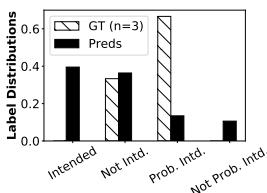

Annotator Demographics
<table><tr><td>Label</td><td>Gender</td><td>PL</td><td>Race</td><td>Age</td></tr><tr><td>PI</td><td>Woman</td><td>Mod. Cons.</td><td>Hispanic</td><td>33</td></tr><tr><td>PI</td><td>Woman</td><td>Mod. Cons.</td><td>White</td><td>35</td></tr><tr><td>NI</td><td>Woman</td><td>Liberal</td><td>White</td><td>18</td></tr></table>

(a) $\mathcal { D } _ { \mathsf { S I } } \mathrm { E } 4 \ ^ { \cdots } \mathrm { B P D }$ is a genetic condition caused by having two x chromosomes. When a man is diagnosed with BPD it’s just a professional way of saying he’s acting like ae $c ^ { * * * * }$ . Source: r/Incels

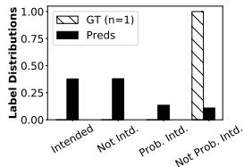

Annotator Demographics
<table><tr><td>Label</td><td>Gender</td><td>PL</td><td>Race</td><td></td></tr><tr><td>NPI</td><td>Man</td><td>Other</td><td>White</td><td> $\frac { \mathbf { A g e } } { 2 8 }$ </td></tr></table>

(c) $\mathcal { D } _ { \mathrm { S I } } \mathrm { E } 6$ “the klu klux klan. [repeat] the original boys in the hood”. Source: r/meanjokes

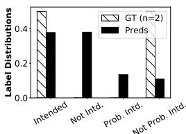

Annotator Demographics
<table><tr><td>Label</td><td>Gender</td><td>PL</td><td>Race</td><td>Age</td></tr><tr><td>NPI</td><td>Man</td><td>Liberal</td><td>White</td><td>29</td></tr><tr><td>I</td><td>Man</td><td>Liberal</td><td>White</td><td>39</td></tr></table>

(b) $\mathcal { D } _ { \mathsf { S I } } \mathtt { E 5 }$ “Why should you never rape elderly women? because sex is for procreation you f\*\*\*\*\*\* Heathen!” Source: r/darkjokes

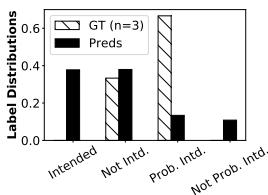

Annotator Demographics
<table><tr><td>Label</td><td>Gender</td><td>PL</td><td>Race</td><td>Age</td></tr><tr><td>PI</td><td>Man</td><td>Moderate Liberal</td><td>White</td><td>35</td></tr><tr><td>PI</td><td>Woman</td><td>Liberal</td><td>Asian</td><td>25</td></tr><tr><td>NI</td><td>Man</td><td>Liberal</td><td>White</td><td>35</td></tr></table>

(d) $\mathcal { D } _ { \mathsf { S I } } \mathrm { E } 7$ “She can’t regret it afterwards if she isn’t breathing.” Source: Gab  
Figure 4: Examples from $\mathcal { D } _ { S I }$ (Sap et al., 2019), human annotations (GT, striped bar) and predictions from the CO-FMM-CNN-1 model (Preds, solid bar). Here n = number of human annotators, Mod. Cons. = moderate conservative, PL = political leaning, I = intended, NI = not intended, PI = probably intended, and NPI = not probably intended.

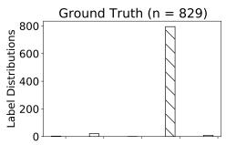

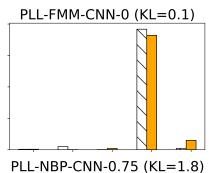

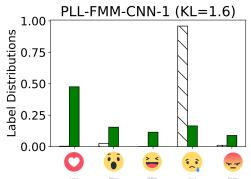

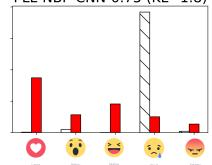  
Figure 5: Example post, $\mathcal { D } _ { F B } \mathrm { E 4 }$ post: “[i]t has been now about 15 hours since the child taken into water, so we know that we are working on recovering”. Here n denotes number of human annotators and KL is the KLdivergence when evaluated against the empirical ground truth. The striped bar denotes the human annotations. Reactions are love, wow, haha, sad, and angry.

The examples in Figure 4 were surfaced by randomly sampling Reddit $\mathcal { D } _ { \mathsf { S I } }$ for posts whose predictions, using our models, differed from the human annotation. These examples all elicit ways of interpreting social media posts that contrast model predictions, human annotator choices, and our observations about offensiveness and toxicity. Example $\mathcal { D } _ { \mathsf { S I } } \mathrm { E } 4$ , (Figure 4a) is an offensive joke that mocks women and people with a mental health disorder called borderline personality disorder (“BPD”). In contrast, the human annotation was split between not intended to be offensive and probably intended to be offensive. No human chose intended to be offensive, yet our algorithm predicted it might be, reflecting the deniability that comes from phrasing offensive speech as a “joke.”

Example $\mathcal { D } _ { \mathsf { S I } } \mathtt { E 5 }$ , (Figure 4c) is a joke about rape and older women. It is offensive because it associates rape with sex as opposed to rape with violence and sex with procreation. This is a challenging case for a typical ML classifier—there is no majority, and the label polarities are also opposite. In this case, our prediction correctly identifies the majority label. This may be due to our models grouping similar data items of similar content, supporting items such as this when there is contrasting confidence in human annotators.

Example $\mathcal { D } _ { \mathsf { S I } } \mathtt { E 6 }$ (Figure 4b) is offensive because it makes light of the hate group KKK wearing hoods by identifying them with an NWA song and film about African American teenagers (“boyz n the hood”). The PLL prediction also indicates that this post may have been intended to be offensive. But the human annotator thought it was probably not intended to be offensive. This is another case where our prediction aligns with our judgment.

Example E7, (Figure 4d) is offensive because it alludes to a woman being dead and thus not having agency; it seems threatening. Two human annotators chose this to be probably intended to be offensive, and one annotator considered it not intended to be offensive. The prediction finds this intended to be offensive.

A commonality among these examples is that they all contain an element of deniability—the poster can always claim they were only joking. One challenge with content moderation is where to draw the line. When does the potential harm of letting an offensive post through outweigh the winnowing of free discourse? The answer often depends on context. The population-level learning approach we advocate here can help provide a more nuanced view into annotator response. It may also provide context on opinions to inform decisions about what should and should not be censored.

Our work also supports the findings from (Sap et al., 2021), where they studied the underlying reasons why annotators disagree on subjective content, such as offensive language annotation. The examples show how the proposed models can identify offensive content even with unreliable training data (human annotations).

## 5 Conclusion

Human annotation is often an expensive-to-acquire, challenging, and subjective resource for supervised machine learning. The obstacles to using human decisions in ML classification tasks are even more apparent when the problem domain is social media content. The nuance, disagreement, and diversity of opinions by humans augment and enrich the complex decisions machine learning attempts to surface. To gain as much utility as possible from this valuable resource, we propose and subsequently CrowdOpinion to retain these human judgments in the data prediction pipeline for as long as possible. First, this work introduces a novel method for mixing language features and label features into label distribution estimators to improve populationlevel learning. Then, we evaluated our approach against different baselines and experimented with datasets containing varying amounts of annotator disagreements. Our results suggest that (i) clustering is an effective measure for countering the problem of label sparseness when learning a populationlevel distribution of annotator responses, (ii) data features or label distributions are equally helpful as spaces in which to perform such clustering, and thus (iii) label distributions are meaningful signals that reflect the content of their associated items.

## Limitations

Evaluation: We evaluate work as a single-label learning problem (accuracy) and a probability distribution (KL). These metrics do not fully capture the nuances of the crowd (Inel et al., 2014). We hope to build on this work by moving beyond general population-level predictions to predictions on subpopulations of interest, such as vulnerable communities. We hope to develop better methods for evaluating and assessing the performance of population-level learning.

The range of mixing (w =) of the language features and labels in our experiments could be further delved into. Our experiments cover weights ranging from 0 to 100 in quartiles, but this parameter, as a hyperparameter, could benefit from additional experiments in finer ranges.

Datasets: Our experimental datasets have been primarily in English. In addressing the ability to generalize, we hope to explore other offensive or hate speech-related datasets from other languages. The challenge of evaluating our models with other languages is acquiring a dataset with annotatorlevel labels, a rare resource for English datasets and challenging for other languages. Finally, we hope our methods open the discussion to building nuanced systems that capture human disagreement while studying subjective content on social media. Computation: As our experiments follow a twostage setup, the first phase (data mixing) of it can be further optimized to run on GPUs similar to the second phase (classification), which is running on GPU through the TensorFlow/Keras implementation. The first phase utilizes libraries through Sckitlearn, BNPY, and scripts through Python (NBP), which can be a bottleneck for implementing the work and expanding.

## Ethical Considerations

Our analysis constitutes a secondary study of publicly available datasets and thus is considered exempt from a federal human subjects research perspective. However, as with any study that involves data collected from humans, there is a risk that it can be used to identify people (Hovy and Spruit, 2016; Kralj Novak et al., 2022). We understand these risks and train and test our models on anonymized data to minimize them. In addition, it is essential to note that any methods identifying marginalized voices can also aid in selective censorship. Our models in Stage 1 and Stage 2, generate rich soft label distributions, this can be helpful for ML models to learn from a representative label. The distributions can also help with making decisions taking into account the right to freedom of expression and right to safety for human content creators, consumers, and annotators.

## Acknowledgments

The funding for this research was provided by a Google Research Award, along with support from Google Cloud Research credits. Additionally, resources from Research Computing at the Rochester Institute of Technology (2022) were utilized. We express our gratitude to the anonymous reviewers for their valuable feedback and suggestions on our work, as well as to the wider community for their support.

## References

Cecilia Ovesdotter Alm. 2011. Subjective Natural Language Problems: Motivations, Applications, Characterizations, and Implications. In Proceedings ofthe 49th Annual Meeting of the ACL : Human Language Technologies, pages 107–112.

Lora Aroyo and Chris Welty. 2014. The Three Sides of CrowdTruth. In Journal of Human Computation.

Valerio Basile. 2020. It’s the end of the gold standard as we know it. On the impact of pre-aggregation on the evaluation of highly subjective tasks. CEUR Workshop.

Valerio Basile, Cristina Bosco, Elisabetta Fersini, Nozza Debora, Viviana Patti, Francisco Manuel Rangel Pardo, Paolo Rosso, Manuela Sanguinetti, et al. 2019. Semeval-2019 task 5: Multilingual detection of hate speech against immigrants and women in twitter. In 13th International Workshop on Semantic Evaluation, pages 54–63. Association for Computational Linguistics.

Thomas W Benson. 1996. Rhetoric, civility, and community: Political debate on computer bulletin boards. Communication Quarterly, 44(3):359–378.

Lukas Biewald. 2020. Experiment tracking with weights and biases. Software available from wandb.com.

Reuben Binns, Michael Veale, Max Van Kleek, and Nigel Shadbolt. 2017. Like trainer, like bot? inheritance of bias in algorithmic content moderation. Social Informatics.

Bob Carpenter. 2008. Multilevel bayesian models of categorical data annotation.

Eshwar Chandrasekharan, Umashanthi Pavalanathan, Anirudh Srinivasan, Adam Glynn, Jacob Eisenstein, and Eric Gilbert. 2017. You can’t stay here: The efficacy of reddit’s 2015 ban examined through hate speech. Proceedings of the ACM on Human-Computer Interaction, 1(CSCW):1–22.

John Joon Young Chung, Jean Y Song, Sindhu Kutty, Sungsoo Hong, Juho Kim, and Walter S Lasecki. 2019. Efficient elicitation approaches to estimate collective crowd answers. CSCW, pages 1–25.

Katherine M. Collins, Umang Bhatt, and Adrian Weller. 2022. Eliciting and Learning with Soft Labels from Every Annotator. Proceedings of the AAAI Conference on Human Computation and Crowdsourcing, 10(1):40–52.

Aida Mostafazadeh Davani, Mark Díaz, and Vinodkumar Prabhakaran. 2022. Dealing with Disagreements: Looking Beyond the Majority Vote in Subjective Annotations. Transactions ofthe Associationfor Computational Linguistics, 10:92–110.

A. P. Dawid and A. M. Skene. 1979. Maximum likelihood estimation of observer error-rates using the em algorithm. 28(1):20–28.

Dorottya Demszky, Dana Movshovitz-Attias, Jeongwoo Ko, Alan Cowen, Gaurav Nemade, and Sujith Ravi. 2020. Goemotions: A dataset of fine-grained emotions.

Mei Xing Dong, David Jurgens, Carmen Banea, and Rada Mihalcea. 2019. Perceptions of Social Roles Across Cultures. Lecture Notes in Computer Science (including Lecture Notes in Artificial Intelligence and Lecture Notes in Bioinformatics).

Kimmo Eriksson and Brent Simpson. 2010. Emotional reactions to losing explain gender differences in entering a risky lottery. Judgment and Decision Making.

Michael A Fauman. 2008. Cyber bullying: Bullying in the digital age. American Journal of Psychiatry, 165(6):780–781.

Antigoni-Maria Founta, Constantinos Djouvas, Despoina Chatzakou, Ilias Leontiadis, Jeremy Blackburn, Gianluca Stringhini, Athena Vakali, Michael Sirivianos, and Nicolas Kourtellis. 2018. Large scale crowdsourcing and characterization of twitter abusive behavior.

Xin Geng. 2016. Label Distribution Learning. In IEEE Transactions on Knowledge and Data Engineering.

Mitchell L. Gordon, Michelle S. Lam, Joon Sung Park, Kayur Patel, Jeffrey T. Hancock, Tatsunori Hashimoto, and Michael S. Bernstein. 2022. Jury Learning: Integrating Dissenting Voices into Machine Learning Models. arXiv:2202.02950 [cs].

Mitchell L. Gordon, Kaitlyn Zhou, Kayur Patel, Tatsunori Hashimoto, and Michael S. Bernstein. 2021. The Disagreement Deconvolution: Bringing Machine Learning Performance Metrics In Line With Reality. Association for Computing Machinery.

Dirk Hovy and Shannon L. Spruit. 2016. The social impact of natural language processing. In ACL.

Michael C Hughes and Erik B Sudderth. 2013. bnpy: Reliable and scalable variational inference for Bayesian nonparametric models. NIPS, pages 1–4.

Oana Inel, Khalid Khamkham, Tatiana Cristea, Anca Dumitrache, Arne Rutjes, Jelle van der Ploeg, Lukasz Romaszko, Lora Aroyo, and Robert Jan Sips. 2014. Crowdtruth: Machine-human computation framework for harnessing disagreement in gathering annotated data. In Lecture Notes in Computer Science (including subseries Lecture Notes in Artificial Intelligence and Lecture Notes in Bioinformatics), volume 8797, pages 486–504. Springer International Publishing, Cham. ISSN: 16113349.

Panagiotis G Ipeirotis, Foster Provost, and Jing Wang. 2010. Quality management on amazon mechanical turk. In Proceedings of the ACM SIGKDD workshop on human computation, pages 64–67.

Sanjay Kairam and Jeffrey Heer. 2016. Parting crowds: Characterizing divergent interpretations in crowdsourced annotation tasks. In CSCW.

Yoon Kim. 2014. Convolutional neural networks for sentence classification. In EMNLP.

Manfred Klenner, Anne Göhring, and Michael Amsler. 2020. Harmonization sometimes harms. CEUR Workshops Proc.

Petra Kralj Novak, Teresa Scantamburlo, Andraž Pelicon, Matteo Cinelli, Igor Mozetic, and Fabiana Zollo.ˇ 2022. Handling Disagreement in Hate Speech Modelling. In Information Processing and Management of Uncertainty in Knowledge-Based Systems, Communications in Computer and Information Science,

pages 681–695, Cham. Springer International Publishing.

Deepak Kumar, Patrick Gage Kelley, Sunny Consolvo, Joshua Mason, Elie Bursztein, Zakir Durumeric, Kurt Thomas, and Michael Bailey. 2021. Designing Toxic Content Classification for a Diversity of Perspectives. arXiv:2106.04511 [cs]. ArXiv: 2106.04511.

Ruibo Liu, Chenyan Jia, Ge Zhang, Ziyu Zhuang, Tony X Liu, and Soroush Vosoughi. 2023. Second thoughts are best: Learning to re-align with human values from text edits.

Tong Liu, Christopher Homan, Cecilia Ovesdotter Alm, Megan Lytle, Ann Marie White, and Henry Kautz. 2016. Understanding discourse on work and jobrelated well-being in public social media. In ACL.

Tong Liu, Akash Venkatachalam, Pratik Sanjay Bongale, and Christopher M. Homan. 2019. Learning to Predict Population-Level Label Distributions. In HCOMP.

Karsten Müller and Carlo Schwarz. 2020. Fanning the Flames of Hate: Social Media and Hate Crime. Journal of the European Economic Association, 19(4):2131–2167.

Vladimir Nikulin and G McLachlan. 2009. Regularised k-means clustering for dimension reduction applied to supervised classification. In CIBB Conference.

Ziad Obermeyer, Brian Powers, Christine Vogeli, and Sendhil Mullainathan. 2019. Dissecting racial bias in an algorithm used to manage the health of populations. Science.

Jeff Pasternack and Dan Roth. 2010. Knowing what to believe (when you already know something). In ACL.

Federica Pedalino and Anne-Linda Camerini. 2022. Instagram Use and Body Dissatisfaction: The Mediating Role of Upward Social Comparison with Peers and Influencers among Young Females. International Journal ofEnvironmental Research and Public Health, 19(3):1543.

Barbara Plank, Dirk Hovy, and Anders Søgaard. 2014. Linguistically debatable or just plain wrong? In ACL.

Vinodkumar Prabhakaran, Aida Mostafazadeh Davani, and Mark Diaz. 2021. On releasing annotator-level labels and information in datasets. In Proceedings of The Joint 15th Linguistic Annotation Workshop (LAW).

Vikas C Raykar and Shipeng Yu. 2012. Eliminating spammers and ranking annotators for crowdsourced labeling tasks. JMLR, 13(1):491–518.

Radim Reh˚uˇ ˇrek and Petr Sojka. 2010. Software Framework for Topic Modelling with Large Corpora. In LREC.

Nils Reimers and Iryna Gurevych. 2019. Sentence-bert: Sentence embeddings using siamese bert-networks. In EMNLP.

Rochester Institute of Technology. 2022. Research computing services.

Filipe Rodrigues and Francisco Pereira. 2018. Deep learning from crowds. In AAAI, volume 32.

Koustuv Saha, Eshwar Chandrasekharan, and Munmun De Choudhury. 2019. Prevalence and Psychological Effects of Hateful Speech in Online College Communities. Proceedings ofthe ... ACM Web Science Conference. ACM Web Science Conference, 2019:255– 264.

Yisi Sang and Jeffrey Stanton. 2022. The Origin and Value of Disagreement Among Data Labelers: A Case Study of Individual Differences in Hate Speech Annotation. In Malte Smits, editor, Informationfor a Better World: Shaping the Global Future, volume 13192, pages 425–444. Springer International Publishing, Cham. Series Title: Lecture Notes in Computer Science.

Maarten Sap, Saadia Gabriel, Lianhui Qin, Dan Jurafsky, Noah A Smith, and Yejin Choi. 2019. Social bias frames: Reasoning about social and power implications of language.

Maarten Sap, Swabha Swayamdipta, Laura Vianna, Xuhui Zhou, Yejin Choi, and Noah A. Smith. 2021. Annotators with attitudes: How annotator beliefs and identities bias toxic language detection. CoRR, abs/2111.07997.

Varsha Suresh and Desmond C. Ong. 2021. Not All Negatives are Equal: Label-Aware Contrastive Loss for Fine-grained Text Classification. 27.

Ye Tian, Thiago Galery, Giulio Dulcinati, Emilia Molimpakis, and Chao Sun. 2017. Facebook sentiment: Reactions and emojis. In Proceedings of the Fifth International Workshop on Natural Language Processingfor Social Media, pages 11–16.

Tharindu Cyril Weerasooriya, Tong Liu, and Christopher M. Homan. 2020. Neighborhood-based Pooling for Population-level Label Distribution Learning. In ECAI.

Daniel S Weld, Peng Dai, et al. 2011. Human intelligence needs artificial intelligence. In Workshops at the Twenty-Fifth AAAI Conference on Artificial Intelligence.

Max Wolf. 2016. Interactive facebook reactions. https://github.com/minimaxir/ interactive-facebook-reactions.

Arkaitz Zubiaga, Ahmet Aker, Kalina Bontcheva, Maria Liakata, and Rob Procter. 2019. Detection and Resolution of Rumours in Social Media: A Survey. ACM Computing Surveys, 51(2):1–36.

## A Dataset Sources

1. $\mathcal { D } _ { G E }$ by Demszky et al. (2020) Available at https://github.com/ google-research/google-research/ tree/master/goemotions

2. $\mathcal { D } _ { J Q 1 - 3 }$ by Liu et al. (2016) - Available at https://github.com/Homan-Lab/pldl\_ data

3. $\mathcal { D } _ { S I }$ by Sap et al. (2019) - Available at https://homes.cs.washington.edu/ \~msap/social-bias-frames/index.html

4. $\mathcal { D } _ { F B }$ available at Wolf (2016)

## A.1 GoEmotions (DGE)

This is one of the largest, hate-speech related datasets of around 58,000 Reddit comments collected by Demszky et al. (2020). The comments are annotated by a total of 82 MTurkers with 27 emotions or “neutral,” yielding 28 annotation labels total: admiration, amusement, anger, annoyance, approval, caring, confusion, curiosity, desire, disappointment, disapproval, disgust, embarrassment, excitement,fear, gratitude, grief, joy, love, nervousness, optimism, pride, realization, relief, remorse, sadness, surprise, and neutral. The number of annotations per item varies from 1 to 16.

## A.2 Jobs (DJQ1-3)

Liu et al. (2016) asked five annotators each from MTurk and F8 platforms to label work related tweets according to three questions: point of view of the tweet $( \mathcal { D } _ { \mathbb { J } 0 1 } \mathrm { : }$ 1st person, 2nd person, 3rd person, unclear, or not job related), subject’s employment status $( { \mathcal { D } } _ { { \bar { \textrm { J } } } 0 2 } { \mathrm { : } }$ employed, not in labor force, not employed, unclear, and not job-related), and employment transition event $( { \mathcal { D } } _ { { \bar { \textrm { J } } } 0 3 } { \mathrm { : } }$ getting hired/job seeking, gettingfired, quitting a job, losing job some other way, getting promoted/raised, getting cut in hours, complaining about work, offering support, going to work, coming home from work, none of the above but job related, and not job-related).

## A.3 SBIC Intent $( \mathcal { D } _ { \mathsf { S I } } )$

The Social Bias Inference Corpus $( \mathcal { D } _ { \mathsf { S I } } )$ dataset is made up of 45,000 posts from Reddit, Twitter, and hate sites collected by Sap et al. (2019). It was annotated with respect to seven questions: offensiveness, intent to offend, lewdness, group implications, targeted group, implied statement, in-group language. Out of these predicates, we consider only the intent to offend question (as it had the richest label distribution patterns) with the label options: Intended, Probably Intended, Probably Not Intended, and Not Intended. The number of annotations per data item varies between 1 and 20 annotations.

## A.4 Facebook (DFB)

The original multi-lingual dataset is Facebook posts written on the 144 most-liked pages during 4 months in 2016. The posts all come from pages hosted by news entities or public figures with a large fanbase interacting through comments and reactions. Each item consists of the post text (we remove all non-text data) and we take as the la bel set the (normalized) distribution of the post’s reactions: like, love, haha, wow, sad, and angry. However, as like tends to dominate, following Tian et al. (2017) we eliminate that reaction before we normalize. We perform language detection 2 and subsample 2,000 English-only posts. The annotations per item varies widely from 50 to 71,399. In contrast to other datasets, $\mathcal { D } _ { \mathsf { F B } }$ is a special case since annotations for it come from users of the social network. The users are “reacting” to a post in contrast to a human annotator annotating a post for a specified task. The randomness of users reacting to a post and posts being from different domains make it a special case.

## B Experimental Setup

Our experimental setup consists of the following configurations; Setup #1 - Ubuntu 18.04, Intel i6- 7600k (4 cores) at 4.20GHz, 32GB RAM, and nVidia GeForce RTX 2070 Super 8GB VRAM. Setup #2 - Debian 9.8, Intel Xeon (6 cores) at 2.2GHz, 32GB RAM, and nVidia Tesla P100 12GB VRAM. For a single pass through on a dataset, the estimated time of completion is 8 hours per language representation model on Setup #2, which is the slowest out of the two.

In our experimental setup, we compare our language based models to other PLDL models based on annotations and baselines from prior research. For comparison sake, we built our own experimental setup similar to the models used by Liu et al. (2019); Weerasooriya et al. (2020).

Experiments tracked with “Weights and Biases“ by Biewald (2020).

## C Complete set of results for CO

See Table 6 for KL-Divergence and Table 7 and for accuracy results.

## D Entropy distributions

See Figure 6 for the Histograms.

## E Model Selection Parameters

<table><tr><td rowspan=1 colspan=1>Dataset</td><td rowspan=1 colspan=1></td><td rowspan=1 colspan=5>w = 0 w = 0.25 w = 0.50w = 0.75w = 1</td></tr><tr><td rowspan=1 colspan=1></td><td rowspan=1 colspan=1></td><td rowspan=1 colspan=5>Neighborhood Based Pooling Model</td></tr><tr><td rowspan=2 colspan=1> $\overline { D _ { \mathsf { F B } } }$ </td><td rowspan=2 colspan=1>rKL</td><td rowspan=2 colspan=2>0.8     1.40.085</td><td rowspan=1 colspan=1>3.0</td><td rowspan=1 colspan=2>3.6    4.6</td></tr><tr><td rowspan=1 colspan=1>0.093</td><td rowspan=1 colspan=1>0.070</td><td rowspan=1 colspan=2>0.080   0.098</td></tr><tr><td rowspan=2 colspan=1> $\overline { { \mathcal { D } _ { \mathsf { G E } } } }$ </td><td rowspan=2 colspan=1>rKL</td><td rowspan=2 colspan=1>0.80.020</td><td rowspan=2 colspan=1>1.10.032</td><td rowspan=1 colspan=1>0.6</td><td rowspan=2 colspan=2>0.9    10.60.363   0.232</td></tr><tr><td rowspan=1 colspan=1>0.252</td></tr><tr><td rowspan=2 colspan=1> $\mathcal { D } _ { \boldsymbol { \mathrm { J 0 1 } } }$ </td><td rowspan=2 colspan=1>rKL</td><td rowspan=2 colspan=1>3.50.133</td><td rowspan=1 colspan=1>5.6</td><td rowspan=1 colspan=1>3.4</td><td rowspan=1 colspan=2>5.6    2.8</td></tr><tr><td rowspan=1 colspan=1>0.123</td><td rowspan=1 colspan=1>0.120</td><td rowspan=1 colspan=1>0.131</td><td rowspan=1 colspan=1>0.456</td></tr><tr><td rowspan=2 colspan=1> $\overline { { \mathcal { D } _ { \mathfrak { J } _ { Q 2 } } } }$ </td><td rowspan=2 colspan=1>rKL</td><td rowspan=2 colspan=1>3.20.134</td><td rowspan=2 colspan=1>3.50.135</td><td rowspan=1 colspan=1>2.4</td><td rowspan=1 colspan=1>2.8</td><td rowspan=2 colspan=1>5.50.512</td></tr><tr><td rowspan=1 colspan=1>0.137</td><td rowspan=1 colspan=1>0.133</td></tr><tr><td rowspan=2 colspan=1> $\overline { { \mathcal { D } _ { \mathfrak { J } _ { Q 3 } } } }$ </td><td rowspan=2 colspan=1>rKL</td><td rowspan=2 colspan=1>10.20.023</td><td rowspan=1 colspan=2>5      6.1</td><td rowspan=1 colspan=1>8.7</td><td rowspan=1 colspan=1>3</td></tr><tr><td rowspan=1 colspan=1>0.024</td><td rowspan=1 colspan=2>0.027    0.028</td><td rowspan=1 colspan=1>0.884</td></tr><tr><td rowspan=2 colspan=1> $\overline { { \mathcal { D } _ { \mathsf { S I } } } }$ </td><td rowspan=2 colspan=1>rKL</td><td rowspan=1 colspan=1>2.4</td><td rowspan=1 colspan=1>9.3</td><td rowspan=1 colspan=2>4.8      9.8</td><td rowspan=1 colspan=1>11.4</td></tr><tr><td rowspan=1 colspan=1>0.160</td><td rowspan=1 colspan=3>0.176    0.180    0.190</td><td rowspan=1 colspan=1>0.350</td></tr></table>

Table 8: We achieve optimal label aggregation models on each label set with the presented neighborhood sizes (r) and KL-divergence (KL) for the datasets using NBP with KL-divergence as the loss function.

<table><tr><td rowspan="2">Data- set</td><td rowspan="2">Baseline  $w = 0$ </td><td colspan="4">CO-C-CNN-w</td></tr><tr><td> $w = 0 . 2 5$ </td><td> $w = 0 . 5 0$ </td><td> $w = 0 . 7 5$ </td><td> $w = 1$ </td></tr><tr><td colspan="7">C =FMM Clustering</td></tr><tr><td colspan="7"> $\overline { { 0 . 7 0 7 { \scriptstyle \pm 0 . 0 0 3 } } }$  0.686±0.0040.687±0.004  $\overline { { 0 . 6 8 9 { \pm 0 . 0 0 3 } } }$   $\overline { { { \bf 0 . 6 8 6 { \pm 0 . 0 0 3 } } } }$ </td></tr><tr><td> $\mathcal { D } _ { \mathsf { F B } }$   $\mathcal { D } _ { \mathsf { G E } }$ </td><td> $2 . 0 1 1 { \pm } 0 . 0 0 2$ </td><td> $2 . 0 1 0 { \scriptstyle \pm 0 . 0 0 1 }$ </td><td> $2 . 0 0 8 { \scriptstyle \pm 0 . 0 0 2 }$ </td><td> $2 . 0 0 5 { \scriptstyle \pm 0 . 0 0 1 }$ </td><td> $\mathbf { 2 . 0 0 4 } \pm \mathbf { 0 . 0 0 } 2$ </td><td></td></tr><tr><td> $\mathcal { D } _ { \boldsymbol { \mathrm { J 0 1 } } }$ </td><td> $\mathbf { 0 . 4 5 8 { \scriptstyle \pm 0 . 0 0 1 } }$ </td><td> $0 . 4 6 4 { \scriptstyle \pm 0 . 0 0 7 }$ </td><td> $0 . 4 6 8 { \pm } 0 . 0 1 1$ </td><td> $0 . 4 6 { \pm } 0 . 0 0 4$ </td><td> $0 . 4 6 1 { \scriptstyle \pm 0 . 0 0 6 }$ </td><td></td></tr><tr><td> $\mathcal { D } _ { \mathbb { J } 0 2 }$ </td><td> $\mathbf { 0 . 5 1 5 { \overset { . } { = } } 0 . 0 0 1 }$ </td><td> $0 . 5 2 2 { \scriptstyle \pm 0 . 0 0 9 }$ </td><td> $0 . 5 1 7 { \scriptstyle \pm 0 . 0 0 5 }$ </td><td> $0 . 5 1 5 { \scriptstyle \pm 0 . 0 0 3 }$ </td><td></td><td> $0 . 5 1 8 { \scriptstyle \pm 0 . 0 0 7 }$ </td></tr><tr><td> $\mathcal { D } _ { \mathbb { J } 0 3 }$ </td><td> $\mathbf { 0 . 8 8 7 } \pm \mathbf { 0 . 0 0 1 }$ </td><td> $0 . 8 9 2 { \scriptstyle \pm 0 . 0 0 4 }$ </td><td> $0 . 8 8 9 { \pm } 0 . 0 0 5$ </td><td> $0 . 8 8 9 { \pm } 0 . 0 0 3$ </td><td></td><td> $0 . 8 9 0 { \scriptstyle \pm 0 . 0 0 3 }$ </td></tr><tr><td> ${ \mathcal { D } } _ { \mathsf { S I } }$ </td><td> $0 . 9 9 1 { \scriptstyle \pm 0 . 0 0 3 }$ </td><td> $0 . 9 9 2 { \scriptstyle \pm 0 . 0 0 5 }$ </td><td> $0 . 9 9 3 { \scriptstyle \pm 0 . 0 0 3 }$ </td><td> $0 . 9 2 7 { \scriptstyle \pm 0 . 0 2 7 }$ </td><td></td><td> $\mathbf { 0 . 8 6 { \pm 0 . 0 2 6 } }$ </td></tr><tr><td colspan="7">C =GMM Clustering</td></tr><tr><td> $\mathcal { D } _ { \mathsf { F B } }$ </td><td> $\overline { { 0 . 6 8 4 { \pm 0 . 0 0 1 } } }$ </td><td> $\overline { { 0 . 6 8 3 { \pm } 0 . 0 0 3 } }$ </td><td> $\overline { { 0 . 6 8 2 { \pm } 0 . 0 0 1 } }$ </td><td>0.680±0.001</td><td></td><td> $\overline { { 0 . 6 8 5 { \pm } 0 . 0 0 2 } }$ </td></tr><tr><td> $\mathcal { D } _ { \mathsf { G E } }$ </td><td> $1 . 9 9 9 \pm 0 . 0 0 1$ </td><td> $\mathbf { 1 . 9 9 8 { \scriptstyle \pm 0 . 0 0 1 } }$ </td><td> $2 . 0 0 2 { \scriptstyle \pm 0 . 0 0 6 }$ </td><td> $2 . 0 0 0 { \scriptstyle \pm 0 . 0 0 3 }$ </td><td></td><td> $\mathbf { 1 . 9 9 8 } \pm \mathbf { 0 . 0 0 3 }$ </td></tr><tr><td> $\mathcal { D } _ { \boldsymbol { \mathrm { J 0 1 } } }$ </td><td> $0 . 4 5 0 { \scriptstyle \pm 0 . 0 0 1 }$ </td><td> $0 . 4 6 7 { \scriptstyle \pm 0 . 0 0 1 }$ </td><td> $0 . 4 4 7 { \scriptstyle \pm 0 . 0 0 4 }$ </td><td> $0 . 4 3 7 { \scriptstyle \pm 0 . 0 0 1 }$ </td><td></td><td> $\mathbf { 0 . 4 2 7 { \scriptstyle \pm 0 . 0 1 } }$ </td></tr><tr><td> $\mathcal { D } _ { \mathbb { J } 0 2 }$ </td><td> $0 . 5 1 3 { \scriptstyle \pm 0 . 0 0 2 }$ </td><td> $0 . 5 1 2 { \scriptstyle \pm 0 . 0 0 1 }$ </td><td> $\mathbf { 0 . 5 1 0 { \overset { . } { \bot } } 0 . 0 0 3 }$ </td><td> $0 . 5 1 4 { \scriptstyle \pm 0 . 0 0 1 }$ </td><td></td><td> $0 . 5 1 6 { \pm } 0 . 0 0 4$ </td></tr><tr><td> $\mathcal { D } _ { \mathbb { J } 0 3 }$ </td><td> $0 . 8 8 0 { \scriptstyle \pm 0 . 0 0 1 }$ </td><td> $0 . 8 8 1 { \scriptstyle \pm 0 . 0 0 1 }$ </td><td> $\mathbf { 0 . 8 7 0 { \overset { . } { = } } 0 . 0 0 1 }$ </td><td> $0 . 8 8 5 { \scriptstyle \pm 0 . 0 0 1 }$ </td><td></td><td> $0 . 8 8 9 { \pm } 0 . 0 0 5$ </td></tr><tr><td> ${ \mathcal { D } } _ { \mathsf { S I } }$ </td><td> $0 . 8 8 2 { \scriptstyle \pm 0 . 0 0 8 }$ </td><td> $\mathbf { 0 . 8 7 7 { \scriptstyle \pm 0 . 0 2 4 } }$ </td><td> $0 . 9 0 4 { \scriptstyle \pm 0 . 0 2 1 }$ </td><td> $0 . 9 { \pm } 0 . 0 3 1$ </td><td></td><td> $0 . 8 9 4 { \scriptstyle \pm 0 . 0 2 6 }$ </td></tr><tr><td colspan="7">C = K-Means clustering</td></tr><tr><td> $\overline { { \mathcal { D } _ { \mathsf { F B } } } }$ </td><td> $\overline { { { \bf 0 . 6 8 0 } \pm { \bf 0 . 0 } } }$ </td><td> $\overline { { 0 . 6 8 7 { \scriptstyle \pm 0 . 0 0 1 } } }$ </td><td> $\overline { { { \bf 0 . 6 8 0 } \pm 0 . 0 0 1 } }$ </td><td> $\overline { { 0 . 6 8 8 { \pm } 0 . 0 0 1 } }$ </td><td></td><td> $\overline { { 0 . 6 8 4 { \pm 0 . 0 } } }$ </td></tr><tr><td> $\mathcal { D } _ { \mathsf { G E } }$ </td><td> $\mathbf { 1 . 9 9 8 { \scriptstyle \pm 0 . 0 0 1 } }$ </td><td> $1 . 9 9 9 { \scriptstyle \pm 0 . 0 0 2 }$ </td><td> $2 . 0 0 2 { \scriptstyle \pm 0 . 0 0 6 }$ </td><td> $2 . 0 0 1 { \scriptstyle \pm 0 . 0 0 4 }$ </td><td></td><td> $2 . 0 0 0 { \scriptstyle \pm 0 . 0 0 4 }$ </td></tr><tr><td> $\mathcal { D } _ { \boldsymbol { \mathrm { J 0 1 } } }$ </td><td> $0 . 4 5 7 { \scriptstyle \pm 0 . 0 0 1 }$ </td><td> $0 . 4 5 6 { \pm } 0 . 0 $ </td><td> $0 . 4 5 7 { \scriptstyle \pm 0 . 0 0 1 }$ </td><td> $0 . 4 4 7 { \scriptstyle \pm 0 . 0 0 1 }$ </td><td></td><td> $\mathbf { 0 . 4 3 4 } \pm \mathbf { 0 . 0 0 1 }$ </td></tr><tr><td> $\mathcal { D } _ { \mathbb { J } 0 2 }$ </td><td> $\mathbf { 0 . 4 9 9 } \pm \mathbf { 0 . 0 0 1 }$ </td><td> $0 . 5 1 0 { \scriptstyle \pm 0 . 0 0 1 }$ </td><td> $0 . 5 1 0 { \scriptstyle \pm 0 . 0 0 2 }$ </td><td> $0 . 5 1 2 { \scriptstyle \pm 0 . 0 0 2 }$ </td><td></td><td> $0 . 5 1 3 { \scriptstyle \pm 0 . 0 0 1 }$ </td></tr><tr><td> $\mathcal { D } _ { \mathbb { J } 0 3 }$ </td><td> $0 . 8 7 4 { \scriptstyle \pm 0 . 0 0 1 }$ </td><td> $0 . 8 8 3 { \scriptstyle \pm 0 . 0 0 1 }$ </td><td> $\mathbf { 0 . 8 5 3 { \scriptstyle \pm 0 . 0 0 1 } }$ </td><td> $0 . 8 8 8 { \pm } 0 . 0 0 1$ </td><td></td><td> $0 . 8 8 9 { \pm } 0 . 0 0 1$ </td></tr><tr><td> $\underline { { \mathcal { D } } } _ { \mathsf { S I } }$ </td><td> $\mathbf { 0 . 8 5 7 { \scriptstyle \pm 0 . 0 0 8 } }$ </td><td> $0 . 8 8 6 { \scriptstyle \pm 0 . 0 2 4 }$ </td><td> $0 . 8 8 9 { \pm } 0 . 0 2 8$ </td><td> $0 . 8 9 5 { \scriptstyle \pm 0 . 0 2 8 }$ </td><td></td><td> $0 . 8 9 4 { \scriptstyle \pm 0 . 0 2 7 }$ </td></tr><tr><td colspan="7">C = LDA Clustering</td></tr><tr><td> $\scriptstyle { \mathcal { D } } _ { \mathsf { F B } }$ </td><td> $\overline { { 0 . 6 8 4 { \pm 0 . 0 } } }$ </td><td>0.683±0.0</td><td> $\overline { { 0 . 6 8 4 \pm 0 . 0 } }$ </td><td> $\overline { { 0 . 6 8 4 \pm 0 . 0 } }$ </td><td></td><td> $\overline { { 0 . 6 8 4 \pm 0 . 0 } }$ </td></tr><tr><td> $\mathcal { D } _ { \mathsf { G E } }$ </td><td> $\mathbf { 1 . 9 8 7 { \pm 0 . 0 } }$ </td><td> $1 . 9 9 7 { \scriptstyle \pm 0 . 0 }$ </td><td> $1 . 9 9 5 { \pm } 0 . 0 $ </td><td> $1 . 9 9 9 { \scriptstyle \pm 0 . 0 0 2 }$ </td><td></td><td> $1 . 9 9 9 { \scriptstyle \pm 0 . 0 0 1 }$ </td></tr><tr><td> $\mathcal { D } _ { \boldsymbol { \mathrm { J 0 1 } } }$ </td><td> $0 . 4 5 8 { \scriptstyle \pm 0 . 0 0 1 }$ </td><td> $0 . 4 5 7 { \scriptstyle \pm 0 . 0 0 1 }$ </td><td> $\mathbf { 0 . 4 5 6 { \scriptstyle \pm 0 . 0 0 1 } }$ </td><td> $0 . 4 5 9 { \scriptstyle \pm 0 . 0 0 1 }$ </td><td></td><td> $0 . 4 5 8 { \scriptstyle \pm 0 . 0 0 1 }$ </td></tr><tr><td> $\mathcal { D } _ { \mathbb { J } 0 2 }$ </td><td> $\mathbf { 0 . 5 1 2 { \pm 0 . 0 } }$ </td><td> $0 . 5 1 4 { \scriptstyle \pm 0 . 0 0 1 }$ </td><td> $0 . 5 1 5 { \pm } 0 . 0 $ </td><td> $0 . 5 1 3 { \scriptstyle \pm 0 . 0 0 1 }$ </td><td></td><td> $\mathbf { 0 . 5 1 2 { \overset { . } { \bot } } 0 . 0 0 1 }$ </td></tr><tr><td> $\mathcal { D } _ { \mathbb { J } 0 3 }$ </td><td> $0 . 8 8 4 { \pm } 0 . 0 $ </td><td> $0 . 8 8 5 { \pm } 0 . 0 $ </td><td> $0 . 8 8 0 { \scriptstyle \pm 0 . 0 0 1 }$ </td><td> $0 . 8 3 4 { \pm } 0 . 0$ </td><td></td><td> $\mathbf { 0 . 8 2 3 { \pm 0 . 0 } }$ </td></tr><tr><td> $\mathcal { D } _ { \mathsf { S I } }$ </td><td> $0 . 9 3 2 { \pm } 0 . 0$ </td><td> $0 . 9 8 0 { \pm } 0 . 0 \ $ </td><td> $0 . 9 2 { \pm } 0 . 0 4 5$ </td><td> $\mathbf { 0 . 8 6 7 { \scriptstyle \pm 0 . 0 1 8 } }$ </td><td></td><td> $0 . 9 0 5 { \scriptstyle \pm 0 . 0 2 3 }$ </td></tr><tr><td colspan="7">C =NBP Pooling</td></tr><tr><td> $\scriptstyle { \mathcal { D } } _ { \mathsf { F B } }$ </td><td> $\overline { { 0 . 6 8 8 { \pm } 0 . 0 0 3 } }$ </td><td></td><td>0.686±0.0010.687±0.002</td><td> $\overline { { 0 . 6 8 8 { \pm } 0 . 0 0 4 } }$ </td><td></td><td> $\overline { { 0 . 6 9 { \pm } 0 . 0 0 7 } }$ </td></tr><tr><td> $\mathcal { D } _ { \mathsf { G E } }$ </td><td> $2 . 0 0 2 { \scriptstyle \pm 0 . 0 0 5 }$ </td><td> $\mathbf { 2 . 0 { \pm } 0 . 0 0 2 }$ </td><td> $2 . 0 0 1 { \scriptstyle \pm 0 . 0 0 5 }$ </td><td> $2 . 0 0 1 { \scriptstyle \pm 0 . 0 0 1 }$ </td><td></td><td> $2 . 0 1 0 { \scriptstyle \pm 0 . 0 0 3 }$ </td></tr><tr><td> $\mathcal { D } _ { \boldsymbol { \mathrm { J 0 1 } } }$ </td><td> $0 . 4 6 9 { \scriptstyle \pm 0 . 0 0 9 }$ </td><td>0.485±0.026</td><td> $0 . 4 7 9 { \scriptstyle \pm 0 . 0 2 1 }$ </td><td> $0 . 4 7 5 { \scriptstyle \pm 0 . 0 1 2 }$ </td><td></td><td> $\mathbf { 0 . 4 5 7 } \pm \mathbf { 0 . 0 }$ </td></tr><tr><td> $\mathcal { D } _ { \mathbb { J } 0 2 }$ </td><td> $0 . 5 2 0 { \scriptstyle \pm 0 . 0 0 7 }$ </td><td> $0 . 5 1 9 { \pm } 0 . 0 1$ </td><td> $0 . 5 1 9 { \scriptstyle \pm 0 . 0 0 7 }$ </td><td> $0 . 5 2 2 { \pm } 0 . 0 1$ </td><td></td><td> $\mathbf { 0 . 5 1 3 { \scriptstyle \pm 0 . 0 0 1 } }$ </td></tr><tr><td> $\mathcal { D } _ { \mathbb { J } 0 3 }$ </td><td> $0 . 8 9 7 { \scriptstyle \pm 0 . 0 1 2 }$ </td><td> $0 . 8 8 9 { \pm } 0 . 0 0 5$ </td><td> $0 . 8 9 4 { \scriptstyle \pm 0 . 0 0 6 }$ </td><td></td><td> $0 . 8 8 9 { \scriptstyle \pm 0 . 0 0 7 }$ </td><td> $\mathbf { 0 . 8 8 3 \pm 0 . 0 }$ </td></tr><tr><td> $\mathcal { D } _ { \mathsf { S I } }$ </td><td> $0 . 9 0 0 { \scriptstyle \pm 0 . 0 2 4 }$ </td><td> $0 . 8 9 5 { \scriptstyle \pm 0 . 0 2 5 }$ </td><td> $0 . 8 9 4 { \pm } 0 . 0 2 8$ </td><td></td><td> $0 . 8 9 0 { \scriptstyle \pm 0 . 0 1 9 }$ </td><td> $\mathbf { 0 . 8 8 9 } \pm \mathbf { 0 . 0 2 7 }$ </td></tr></table>

Table 6: KL-divergence results for the CO- -CNN-w models from Algorithm 1, using various choices for clustering and feature-label mixing w. Here w = 0 is the baseline from Liu et al. (2019) that uses label distributions in the clustering stage, and $w = 1$ means that only data feature are used. The best score is bolded. Baseline from Liu et al. (2019).

<table><tr><td rowspan="2">Data-| set</td><td rowspan="2">Baseline  $w = 0$ </td><td colspan="3"> $\mathbf { C O - } \mathcal { C } \mathbf { - C N N } \mathbf { - } w$ </td></tr><tr><td> $w = 0 . 2 5$   $w = 0 . 5 0$ </td><td> $w = 0 . 7 5$ </td><td> $w = 1$ </td></tr><tr><td colspan="6"> $\scriptstyle { \overline { { \mathcal { C } = \mathbf { F M M C l u s t e r i n g } } } }$ </td></tr><tr><td colspan="6"> $\overline { { 0 . 7 7 7 { \scriptstyle \pm 0 . 0 1 0 } } }$   $\overline { { 0 . 7 8 9 { \pm } 0 . 0 0 1 } }$   $0 . 7 8 7 { \scriptstyle \pm 0 . 0 0 1 }$   $\mathbf { \overline { { 0 . 7 9 0 { \pm 0 . 0 0 1 } } } }$ </td></tr><tr><td> $\overline { { \mathcal { D } _ { \mathsf { F B } } } }$   $\mathcal { D } _ { \mathsf { G E } }$ </td><td> $\overline { { 0 . 7 8 0 { \pm } 0 . 0 0 1 } }$   $\overline { { { 0 . 9 4 9 } \pm 2 e ^ { - 1 6 } } }$ </td><td> $0 . 9 4 9 { \pm } 2 e ^ { - 1 6 }$  0.923±2e−16</td><td> $0 . 9 1 0 { \pm } 2 e ^ { - 1 6 }$ </td><td></td><td> $0 . 9 4 8 { \pm } 2 e ^ { - 1 6 }$ </td></tr><tr><td> $\mathcal { D } _ { \mathbb { J } { \mathbb { Q } } 1 }$ </td><td> $\mathbf { 0 . 8 9 2 { \pm 0 . 0 } }$ </td><td> $0 . 8 9 0 { \scriptstyle \pm 0 . 0 }$   $0 . 8 7 8 { \pm } 0 . 0 $ </td><td></td><td> $0 . 8 8 0 { \pm } 0 . 0 $ </td><td> $\mathbf { 0 . 8 9 2 } \pm \mathbf { 0 . 0 }$ </td></tr><tr><td> $\mathcal { D } _ { \mathbb { J } 0 2 }$ </td><td> ${ \bf 0 . 8 9 0 { \pm } 0 . 0 }$ </td><td> $0 . 8 1 2 { \pm } 0 . 0$   ${ \bf 0 . 8 9 0 { \pm } 0 . 0 }$ </td><td></td><td> $0 . 8 7 0 { \scriptstyle \pm 0 . 0 }$ </td><td> $0 . 8 3 0 { \pm } 0 . 0$ </td></tr><tr><td></td><td> $0 . 8 7 8 { \scriptstyle \pm 0 . 0 0 2 }$ </td><td> $0 . 8 8 0 { \scriptstyle \pm 0 . 0 0 2 }$   $0 . 8 7 0 { \scriptstyle \pm 0 . 0 0 3 }$ </td><td></td><td> $0 . 8 8 1 { \scriptstyle \pm 0 . 0 0 2 }$ </td><td> $0 . 8 8 0 { \scriptstyle \pm 0 . 0 0 2 }$ </td></tr><tr><td> $\mathcal { D } _ { \mathbb { J } 0 3 }$   $\mathcal { D } _ { \mathsf { S I } }$ </td><td> $0 . 9 4 9 { \pm } 0 . 0 $ </td><td> $\mathbf { 0 . 9 5 0 { \pm } 0 . 0 }$ </td><td> $0 . 9 4 0 { \scriptstyle \pm 0 . 0 }$ </td><td> $0 . 9 4 1 { \pm } 0 . 0 $ </td><td> $0 . 9 4 2 { \pm } 0 . 0$ </td></tr><tr><td colspan="6"></td></tr><tr><td> $\scriptstyle { \mathcal { D } } _ { \mathsf { F B } }$ </td><td> $\overline { { 0 . 7 8 5 { \pm } 0 . 0 0 1 } }$ </td><td>C = GMM Clustering  $\overline { { 0 . 7 8 9 { \pm } 0 . 0 0 1 } }$   $\overline { { 0 . 7 8 7 { \pm } 0 . 0 0 1 } }$ </td><td></td><td> $\mathbf { 0 . 7 9 8 { \pm 0 . 0 0 1 } }$ </td><td> $\overline { { 0 . 7 8 3 { \pm } 0 . 0 0 1 } }$ </td></tr><tr><td> $\mathcal { D } _ { \mathsf { G E } }$ </td><td> $0 . 9 4 0 { \scriptstyle \pm 0 . 0 0 1 }$ </td><td> $0 . 9 4 9 { \pm } 0 . 0 0 1$ </td><td> $0 . 9 4 2 { \scriptstyle \pm 0 . 0 0 6 }$ </td><td> $0 . 9 4 9 { \pm } 0 . 0 0 3$ </td><td> $0 . 9 5 0 { \scriptstyle \pm 0 . 0 0 3 }$ </td></tr><tr><td> $\mathcal { D } _ { \mathbb { J } { \mathbb { Q } } 1 }$ </td><td> $0 . 8 9 1 { \pm } 1 e ^ { - 1 6 }$ </td><td> $0 . 8 8 8 { \pm } 1 e ^ { - 1 6 }$ </td><td> $0 . 8 8 0 { \pm } 1 e ^ { - 1 6 }$ </td><td>0.901±1e−16</td><td> $0 . 8 9 0 { \scriptstyle \pm 0 . 0 }$ </td></tr><tr><td> $\mathcal { D } _ { \mathbb { J } 0 2 }$ </td><td> $0 . 8 7 0 { \pm } 1 e ^ { - 1 6 }$ </td><td> $\pm 1 e ^ { - 1 6 }$ </td><td> $0 . 8 6 5 { \pm } 1 e ^ { - 1 6 }$ </td><td> $0 . 8 0 0 { \pm } 1 e ^ { - 1 6 }$ </td><td> $0 . 8 0 1 { \scriptstyle \pm 0 . 0 }$ </td></tr><tr><td> $\mathcal { D } _ { \mathbb { J } 0 3 }$ </td><td> $0 . 8 8 0 { \scriptstyle \pm 0 . 0 0 2 }$ </td><td> $0 . 8 8 1 { \pm } 1 e ^ { - 1 6 }$ </td><td> $0 . 8 7 5 { \scriptstyle \pm 0 . 0 0 1 }$ </td><td> $0 . 8 7 0 { \scriptstyle \pm 0 . 0 0 2 }$ </td><td> $0 . 8 7 1 { \scriptstyle \pm 0 . 0 0 2 }$ </td></tr><tr><td> ${ \mathcal { D } } _ { \mathsf { S I } }$ </td><td> $\mathbf { 0 . 9 4 9 } \pm \mathbf { 0 . 0 }$ </td><td> $0 . 9 4 7 { \scriptstyle \pm 0 . 0 }$ </td><td> $0 . 9 4 5 { \pm } 0 . 0 \ $ </td><td> $0 . 9 4 4 { \pm } 0 . 0$ </td><td> $0 . 9 4 3 { \pm } 0 . 0 \ $ </td></tr><tr><td colspan="6">C = K-Means Clustering</td></tr><tr><td> $\overline { { \mathcal { D } _ { \mathsf { F B } } } }$ </td><td> $\overline { { 0 . 7 8 0 { \pm } 0 . 0 0 1 } }$ </td><td> $\overline { { 0 . 7 8 3 { \pm } 0 . 0 0 1 } }$ </td><td> $\overline { { 0 . 7 8 6 { \pm } 0 . 0 0 1 } }$ </td><td> $\overline { { 0 . 7 7 3 { \pm } 0 . 0 0 1 } }$ </td><td> $\overline { { 0 . 7 6 5 { \pm } 0 . 0 0 1 } }$ </td></tr><tr><td> $\mathcal { D } _ { \mathsf { G E } }$ </td><td> $0 . 9 4 0 { \scriptstyle \pm 0 . 0 0 0 }$ </td><td> $0 . 9 3 0 { \scriptstyle \pm 0 . 0 0 0 }$   $0 . 9 3 0 { \scriptstyle \pm 0 . 0 0 0 }$ </td><td></td><td> $0 . 9 0 2 { \scriptstyle \pm 0 . 0 0 0 }$ </td><td> $0 . 9 3 8 { \pm } 0 . 0 0 0$ </td></tr><tr><td> $\mathcal { D } _ { \mathbb { J } { \mathbb { Q } } 1 }$ </td><td> $0 . 8 9 0 { \scriptstyle \pm 0 . 0 }$ </td><td> $0 . 8 9 1 { \scriptstyle \pm 0 . 0 }$ </td><td> $\mathbf { 0 . 8 9 3 { \pm } 0 . 0 }$ </td><td> $0 . 8 9 0 { \scriptstyle \pm 0 . 0 }$ </td><td> $0 . 8 7 0 { \scriptstyle \pm 0 . 0 }$ </td></tr><tr><td> $\mathcal { D } _ { \mathbb { J } 0 2 }$ </td><td> $0 . 8 7 3 { \scriptstyle \pm 0 . 0 }$ </td><td> $0 . 8 7 0 { \scriptstyle \pm 0 . 0 }$ </td><td> $\mathbf { 0 . 8 7 5 { \pm } 0 . 0 }$ </td><td> $0 . 8 7 2 { \scriptstyle \pm 0 . 0 }$ </td><td> $0 . 8 7 0 { \scriptstyle \pm 0 . 0 }$ </td></tr><tr><td> $\mathcal { D } _ { \mathbb { J } 0 3 }$ </td><td> $0 . 8 8 1 { \pm } 0 . 0 $ </td><td> $0 . 8 7 8 { \pm } 0 . 0 $ </td><td> $0 . 8 7 5 { \scriptstyle \pm 0 . 0 }$ </td><td> $0 . 8 7 0 { \scriptstyle \pm 0 . 0 }$ </td><td> $0 . 8 3 0 { \scriptstyle \pm 0 . 0 0 1 }$ </td></tr><tr><td> ${ \mathcal { D } } _ { \mathsf { S I } }$ </td><td> $| 0 . 7 7 5 \pm 0 . 0 0 8 |$ </td><td> $\mathbf { 0 . 7 7 7 } \pm \mathbf { 0 . 0 0 7 }$   $0 . 7 6 { \pm } 0 . 0 2 8$ </td><td></td><td> $0 . 7 7 3 { \scriptstyle \pm 0 . 0 0 9 }$ </td><td> $0 . 7 5 9 { \pm } 0 . 0 2 3$ </td></tr><tr><td colspan="6">C = LDA Clustering</td></tr><tr><td> $\overline { { \mathcal { D } _ { \mathsf { F B } } } }$ </td><td> $\overline { { 0 . 7 8 4 \pm 0 . 0 } }$ </td><td> $\overline { { 0 . 7 8 2 \pm 0 . 0 } }$ </td><td> $\overline { { 0 . 7 8 7 \pm 0 . 0 } }$ </td><td> $\overline { { 0 . 7 8 8 { \pm } 0 . 0 } }$ </td><td> $\overline { { 0 . 7 8 9 { \pm } 0 . 0 } }$ </td></tr><tr><td> $\mathcal { D } _ { \mathsf { G E } }$ </td><td> $0 . 9 4 9 { \pm } 0 . 0 $ </td><td> $0 . 9 3 0 { \pm } 0 . 0 \ $   $0 . 9 3 5 { \pm } 0 . 0 \ $ </td><td> $0 . 9 3 2 { \pm } 0 . 0$ </td><td></td><td> $0 . 9 5 0 { \scriptstyle \pm 0 . 0 }$ </td></tr><tr><td> $\mathcal { D } _ { \mathbb { J } { \mathbb { Q } } 1 }$ </td><td> $0 . 8 9 1 { \scriptstyle \pm 0 . 0 }$ </td><td> $\mathbf { 0 . 8 9 3 { \pm } 0 . 0 }$   $0 . 8 9 0 { \scriptstyle \pm 0 . 0 }$ </td><td></td><td> $0 . 8 9 1 { \scriptstyle \pm 0 . 0 }$ </td><td> $0 . 8 9 1 { \scriptstyle \pm 0 . 0 }$ </td></tr><tr><td> $\mathcal { D } _ { \mathbb { J } 0 2 }$ </td><td> $0 . 8 7 3 { \scriptstyle \pm 0 . 0 }$ </td><td> $0 . 8 7 5 { \scriptstyle \pm 0 . 0 }$   $0 . 8 7 0 { \scriptstyle \pm 0 . 0 }$ </td><td></td><td> $0 . 8 7 8 { \pm } 0 . 0 $ </td><td> $\mathbf { 0 . 8 7 9 { \pm } 0 . 0 }$ </td></tr><tr><td> $\mathcal { D } _ { \mathbb { J } { \mathbb { Q } } 3 }$ </td><td> $0 . 8 8 0 { \pm } 0 . 0 $ </td><td> $0 . 8 8 1 { \pm } 0 . 0 $ </td><td> $0 . 8 8 2 { \pm } 0 . 0$ </td><td> $0 . 8 8 3 { \pm } 0 . 0$ </td><td> $0 . 8 7 9 { \scriptstyle \pm 0 . 0 0 1 }$ </td></tr><tr><td> $\underline { { \mathcal { D } _ { \mathsf { S I } } } }$ </td><td> $0 . 9 3 2 { \pm } 0 . 0$ </td><td> ${ \bf 0 . 9 8 0 { \pm } 0 . 0 }$   $0 . 9 2 { \pm } 0 . 0 4 5$ </td><td></td><td> $0 . 8 6 7 { \scriptstyle \pm 0 . 0 1 8 }$ </td><td> $0 . 9 0 5 { \scriptstyle \pm 0 . 0 2 3 }$ </td></tr><tr><td colspan="6"> ${ \overline { { \boldsymbol { \mathscr { C } } } } } = \mathbf { N B P }$  Clustering</td></tr><tr><td> $\overline { { \mathcal { D } _ { \mathsf { F B } } } }$ </td><td> $\overline { { 0 . 7 8 5 { \pm } 0 . 0 } }$ </td><td> $\overline { { 0 . 7 8 1 { \pm } 0 . 0 } }$   $\overline { { 0 . 7 8 0 { \pm } 0 . 0 } }$ </td><td></td><td> $\overline { { 0 . 7 8 7 \pm 0 . 0 } }$ </td><td> $\overline { { 0 . 7 8 5 { \pm } 0 . 0 } }$ </td></tr><tr><td> $\mathcal { D } _ { \mathsf { G E } }$ </td><td> $0 . 8 5 0 { \scriptstyle \pm 0 . 0 }$ </td><td> $0 . 8 2 0 { \scriptstyle \pm 0 . 0 }$   $0 . 8 1 0 { \scriptstyle \pm 0 . 0 }$ </td><td> $0 . 8 0 0 { \pm } 0 . 0 $ </td><td></td><td> $0 . 8 0 5 { \pm } 0 . 0 $ </td></tr><tr><td> $\mathcal { D } _ { \mathbb { J } { \mathbb { Q } } 1 }$ </td><td> $0 . 8 9 0 { \scriptstyle \pm 0 . 0 }$ </td><td> $0 . 8 7 9 { \scriptstyle \pm 0 . 0 }$   $0 . 8 9 0 { \scriptstyle \pm 0 . 0 }$ </td><td></td><td> $0 . 7 8 9 { \pm } 0 . 0 0 5$ </td><td> $\mathbf { 0 . 8 9 2 } \pm \mathbf { 0 . 0 }$ </td></tr><tr><td> $\mathcal { D } _ { \mathbb { J } 0 2 }$ </td><td> $0 . 8 7 3 { \scriptstyle \pm 0 . 0 }$ </td><td> $\mathbf { 0 . 8 9 7 { \scriptstyle \pm 0 . 0 } }$   $0 . 8 8 0 { \pm } 0 . 0 $ </td><td></td><td> $0 . 8 2 0 { \scriptstyle \pm 0 . 0 }$ </td><td> $0 . 8 6 5 { \pm } 0 . 0 $ </td></tr><tr><td> $\mathcal { D } _ { \mathbb { J } { \mathbb { Q } } 3 }$ </td><td> $0 . 8 8 0 { \scriptstyle \pm 0 . 0 0 2 }$ </td><td> $0 . 8 7 9 { \scriptstyle \pm 0 . 0 0 2 }$ </td><td> $0 . 8 6 5 { \scriptstyle \pm 0 . 0 0 2 }$ </td><td> $0 . 8 7 9 { \scriptstyle \pm 0 . 0 0 2 }$ </td><td> $0 . 8 8 1 { \pm } 0 . 0 $ </td></tr><tr><td> ${ \mathcal { D } } _ { \mathsf { S I } }$ </td><td> $0 . 7 5 5 { \pm } 0 . 0 3 6$ </td><td> $\mathbf { 0 . 7 6 7 { \overset { . } { \bot } } 0 . 0 1 9 }$ </td><td> $0 . 7 5 8 { \pm } 0 . 0 3 4$ </td><td> $0 . 7 6 1 { \scriptstyle \pm 0 . 0 1 6 }$ </td><td> $0 . 7 6 2 { \scriptstyle \pm 0 . 0 2 5 }$ </td></tr><tr><td></td><td></td><td></td><td></td><td></td><td></td></tr></table>

Table 7: Accuracy results for the CO- -CNN-w models from Algorithm 1, using various choices for clustering and featurelabel mixing w. Here w = 0 is the baseline from Liu et al. (2019) that uses label distributions in the clustering stage, and $w = 1$ means that only data feature are used. Since accuracy is a non-distributional statistic, we use the most frequent label for inference (though not during training; we use the same trained models as in Table 2). The best score is bolded. Baseline from Liu et al. (2019).

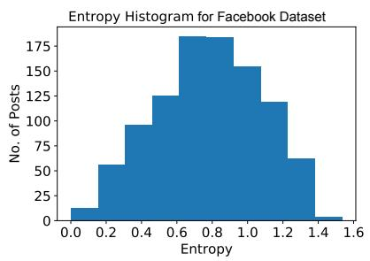

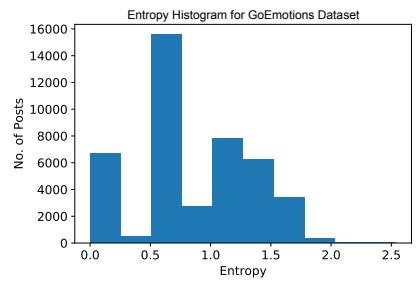

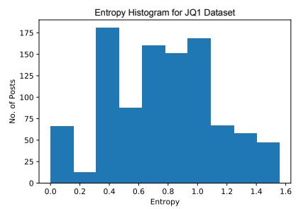

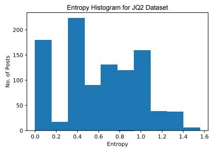

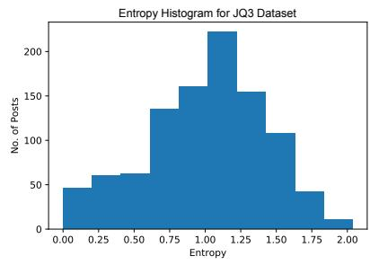

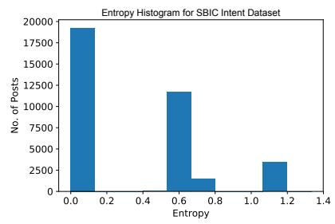  
Figure 6: Histograms of the label entropies per data item for each dataset. The histograms show similarities in the distributions of $\mathcal { D } _ { \mathsf { F B } }$ and JQ3, with a high relative level of entropy for the majority of their data items. On the other hand, the $\mathcal { D } _ { \mathbb { J } 0 3 }$ and $\mathcal { D } _ { \mathsf { G E } }$ datasets both have relatively large label spaces and both allow annotators to provide more than label per annotator per item, yet in terms of entropy distributions they are not similar. See Table 2 (main paper) for an overall summary of the datasets.

<table><tr><td rowspan=1 colspan=1>Dataset</td><td rowspan=1 colspan=1></td><td rowspan=1 colspan=5>w = 0 w = 0.25 w = 0.50 w = 0.75  $w = 1$ </td><td rowspan=1 colspan=5>w = 0 w = 0.25 w = 0.50 w = 0.75 w = 1</td></tr><tr><td rowspan=1 colspan=1></td><td rowspan=1 colspan=1></td><td rowspan=1 colspan=5>FMM Model</td><td rowspan=1 colspan=5>GMM Model</td></tr><tr><td rowspan=2 colspan=1> $\overline { D _ { \mathsf { F B } } }$ </td><td rowspan=1 colspan=1>p</td><td rowspan=1 colspan=1>4</td><td rowspan=1 colspan=1>30</td><td rowspan=1 colspan=3>36        4       32</td><td rowspan=1 colspan=1>26</td><td rowspan=1 colspan=1>17</td><td rowspan=1 colspan=3>37        26      11</td></tr><tr><td rowspan=1 colspan=1>KL</td><td rowspan=1 colspan=1>0.704</td><td rowspan=1 colspan=1>1.551</td><td rowspan=1 colspan=3>1.587     1.273   1.598</td><td rowspan=1 colspan=1>0.702</td><td rowspan=1 colspan=1>0.696</td><td rowspan=1 colspan=3>0.706     0.702   1.432</td></tr><tr><td rowspan=2 colspan=1>DGE</td><td rowspan=2 colspan=1>pKL</td><td rowspan=2 colspan=1>242.053</td><td rowspan=1 colspan=1>36</td><td rowspan=1 colspan=3>6        16      20</td><td rowspan=1 colspan=1>25</td><td rowspan=1 colspan=1>34</td><td rowspan=1 colspan=3>24        26      26</td></tr><tr><td rowspan=1 colspan=1>2.121</td><td rowspan=1 colspan=3>3.312     3.941   4.804</td><td rowspan=1 colspan=1>2.191</td><td rowspan=1 colspan=1>2.361</td><td rowspan=1 colspan=3>3.460     3.442   5.198</td></tr><tr><td rowspan=2 colspan=1>DJQ1</td><td rowspan=2 colspan=1>pKL</td><td rowspan=2 colspan=1>150.465</td><td rowspan=2 colspan=1>60.458</td><td rowspan=1 colspan=3>7         9       6</td><td rowspan=1 colspan=1>31</td><td rowspan=1 colspan=1>11</td><td rowspan=1 colspan=3>36       27       4</td></tr><tr><td rowspan=1 colspan=3>0.468     0.461   0.903</td><td rowspan=1 colspan=1>0.497</td><td rowspan=1 colspan=1>0.714</td><td rowspan=1 colspan=3>0.770     0.785   0.751</td></tr><tr><td rowspan=2 colspan=1>DJQ2</td><td rowspan=2 colspan=1>pKL</td><td rowspan=1 colspan=1>9</td><td rowspan=1 colspan=1>8</td><td rowspan=1 colspan=3>5         5       5</td><td rowspan=1 colspan=1>34</td><td rowspan=1 colspan=1>14</td><td rowspan=1 colspan=3>30       23       6</td></tr><tr><td rowspan=1 colspan=1>0.516</td><td rowspan=1 colspan=1>0.511</td><td rowspan=1 colspan=3>0.514     0.514   1.194</td><td rowspan=1 colspan=1>0.537</td><td rowspan=1 colspan=1>0.826</td><td rowspan=1 colspan=3>0.876     0.869   0.878</td></tr><tr><td rowspan=2 colspan=1>DJQ3</td><td rowspan=2 colspan=1>pKL</td><td rowspan=1 colspan=1>9</td><td rowspan=1 colspan=1>20</td><td rowspan=1 colspan=3>8        21      10</td><td rowspan=1 colspan=1>17</td><td rowspan=1 colspan=1>24</td><td rowspan=1 colspan=3>37        23      11</td></tr><tr><td rowspan=1 colspan=1>0.965</td><td rowspan=1 colspan=1>1.406</td><td rowspan=1 colspan=3>1.371     1.586   1.457</td><td rowspan=1 colspan=1>0.903</td><td rowspan=1 colspan=1>0.902</td><td rowspan=1 colspan=3>0.918     0.905   1.491</td></tr><tr><td rowspan=2 colspan=1> $\mathcal { D } _ { \mathsf { S I } }$ </td><td rowspan=2 colspan=1>pKL</td><td rowspan=1 colspan=1>21</td><td rowspan=1 colspan=1>30</td><td rowspan=1 colspan=2>37        4</td><td rowspan=1 colspan=1>5</td><td rowspan=1 colspan=1>12</td><td rowspan=1 colspan=1>13</td><td rowspan=1 colspan=3>10       35      33</td></tr><tr><td rowspan=1 colspan=1>0.942</td><td rowspan=1 colspan=1>0.940</td><td rowspan=1 colspan=2>0.932     0.566</td><td rowspan=1 colspan=1>0.355</td><td rowspan=1 colspan=1>0.849</td><td rowspan=1 colspan=1>0.711</td><td rowspan=1 colspan=3>1.935     1.989   1.932</td></tr><tr><td rowspan=1 colspan=1></td><td rowspan=1 colspan=1></td><td rowspan=1 colspan=1></td><td rowspan=1 colspan=1>K-M</td><td rowspan=1 colspan=3>eans Model</td><td rowspan=1 colspan=1></td><td rowspan=1 colspan=1>LDA</td><td rowspan=1 colspan=3>Model</td></tr><tr><td rowspan=2 colspan=1> $\mathcal { D } _ { \mathsf { F B } }$ </td><td rowspan=1 colspan=1>p</td><td rowspan=1 colspan=1>21</td><td rowspan=1 colspan=1>35</td><td rowspan=1 colspan=2>34       30</td><td rowspan=1 colspan=1>32</td><td rowspan=1 colspan=1>9</td><td rowspan=1 colspan=1>19</td><td rowspan=1 colspan=1>16</td><td rowspan=1 colspan=2>5       8</td></tr><tr><td rowspan=1 colspan=1>KL</td><td rowspan=1 colspan=1>0.702</td><td rowspan=1 colspan=1>0.710</td><td rowspan=1 colspan=2>0.733     0.705</td><td rowspan=1 colspan=1>0.715</td><td rowspan=1 colspan=1>0.680</td><td rowspan=1 colspan=1>0.584</td><td rowspan=1 colspan=1>0.687</td><td rowspan=1 colspan=2>0.689   0.690</td></tr><tr><td rowspan=2 colspan=1>DGE</td><td rowspan=2 colspan=1>pKL</td><td rowspan=1 colspan=1>27</td><td rowspan=1 colspan=1>34</td><td rowspan=1 colspan=2>19       31</td><td rowspan=1 colspan=1>28</td><td rowspan=1 colspan=1>14</td><td rowspan=1 colspan=1>17</td><td rowspan=1 colspan=1>14</td><td rowspan=1 colspan=2>4       17</td></tr><tr><td rowspan=1 colspan=1>2.322</td><td rowspan=1 colspan=1>2.593</td><td rowspan=1 colspan=1>3.541</td><td rowspan=1 colspan=1>4.430</td><td rowspan=1 colspan=1>4.293</td><td rowspan=1 colspan=1>1.907</td><td rowspan=1 colspan=1>1.997</td><td rowspan=1 colspan=1>1.985</td><td rowspan=1 colspan=2>2.494   2.938</td></tr><tr><td rowspan=2 colspan=1>DJQ1</td><td rowspan=2 colspan=1>pKL</td><td rowspan=1 colspan=1>35</td><td rowspan=1 colspan=1>21</td><td rowspan=1 colspan=1>35</td><td rowspan=1 colspan=1>35</td><td rowspan=1 colspan=1>22</td><td rowspan=1 colspan=1>37</td><td rowspan=1 colspan=1>35</td><td rowspan=1 colspan=1>14</td><td rowspan=1 colspan=2>22      10</td></tr><tr><td rowspan=1 colspan=1>0.471</td><td rowspan=1 colspan=1>0.463</td><td rowspan=1 colspan=1>0.467</td><td rowspan=1 colspan=1>0.477</td><td rowspan=1 colspan=1>0.463</td><td rowspan=1 colspan=1>0.450</td><td rowspan=1 colspan=1>0.449</td><td rowspan=1 colspan=1>0.435</td><td rowspan=1 colspan=2>0.480   0.470</td></tr><tr><td rowspan=2 colspan=1>DJQ2</td><td rowspan=1 colspan=1>p</td><td rowspan=1 colspan=1>11</td><td rowspan=1 colspan=1>16</td><td rowspan=1 colspan=1>34</td><td rowspan=1 colspan=1>30</td><td rowspan=1 colspan=1>33</td><td rowspan=1 colspan=1>19</td><td rowspan=1 colspan=1>7</td><td rowspan=1 colspan=1>5</td><td rowspan=1 colspan=1>19</td><td rowspan=1 colspan=1>9</td></tr><tr><td rowspan=1 colspan=1>KL</td><td rowspan=1 colspan=1>0.515</td><td rowspan=1 colspan=1>0.512</td><td rowspan=1 colspan=1>0.540</td><td rowspan=1 colspan=1>0.519</td><td rowspan=1 colspan=1>0.538</td><td rowspan=1 colspan=1>0.500</td><td rowspan=1 colspan=1>0.510</td><td rowspan=1 colspan=1>0.512</td><td rowspan=1 colspan=1>0.509</td><td rowspan=1 colspan=1>0.514</td></tr><tr><td rowspan=2 colspan=1>DJQ3</td><td rowspan=1 colspan=1>p</td><td rowspan=1 colspan=1>35</td><td rowspan=1 colspan=1>19</td><td rowspan=1 colspan=1>29</td><td rowspan=1 colspan=1>14</td><td rowspan=1 colspan=1>32</td><td rowspan=1 colspan=1>5</td><td rowspan=1 colspan=1>5</td><td rowspan=1 colspan=1>4</td><td rowspan=1 colspan=1>5</td><td rowspan=1 colspan=1>18</td></tr><tr><td rowspan=1 colspan=1>KL</td><td rowspan=1 colspan=1>0.969</td><td rowspan=1 colspan=1>0.938</td><td rowspan=1 colspan=1>0.948</td><td rowspan=1 colspan=1>0.912</td><td rowspan=1 colspan=1>0.953</td><td rowspan=1 colspan=1>0.889</td><td rowspan=1 colspan=1>0.887</td><td rowspan=1 colspan=1>0.886</td><td rowspan=1 colspan=1>0.880</td><td rowspan=1 colspan=1>0.890</td></tr><tr><td rowspan=2 colspan=1> $\mathcal { D } _ { \mathsf { S I } }$ </td><td rowspan=1 colspan=1>p</td><td rowspan=1 colspan=1>38</td><td rowspan=1 colspan=1>19</td><td rowspan=1 colspan=1>17</td><td rowspan=1 colspan=1>31</td><td rowspan=1 colspan=1>35</td><td rowspan=1 colspan=1>6</td><td rowspan=1 colspan=1>15</td><td rowspan=1 colspan=1>4</td><td rowspan=1 colspan=1>18</td><td rowspan=1 colspan=1>31</td></tr><tr><td rowspan=1 colspan=1>KL</td><td rowspan=1 colspan=1>0.856</td><td rowspan=1 colspan=1>0.564</td><td rowspan=1 colspan=1>0.108</td><td rowspan=1 colspan=1>0.100</td><td rowspan=1 colspan=1>0.050</td><td rowspan=1 colspan=1>0.935</td><td rowspan=1 colspan=1>0.935</td><td rowspan=1 colspan=1>0.496</td><td rowspan=1 colspan=1>0.397</td><td rowspan=1 colspan=1>0.296</td></tr></table>

Table 9: We achieve optimal label aggregation models on each dataset with the presented number of clusters (p) and KL-divergence (KL) for the datasets using the cluster sampler with KL-divergence as the loss function. $N _ { m a x }$ is the number of items out of training set (1,000 items) assigned to largest cluster for optimal label aggregation model (p). The mixing parameter (w) varies between [0, 1], where $w = 0$ is a special case of pooling with only labels (Liu et al., 2019; Weerasooriya et al., 2020). The lowest KL-divergence per dataset is highlighted in blue.

A For every submission: ✓ A1. Did you describe the limitations of your work? Section 4.2

✓ A2. Did you discuss any potential risks of your work? Section 4.1

✓ A3. Do the abstract and introduction summarize the paper’s main claims? Section 1

✗ A4. Have you used AI writing assistants when working on this paper? Left blank.

## B ✓ Did you use or create scientific artifacts?

Appendix A

✓ B1. Did you cite the creators of artifacts you used? Appendix A

✗ B2. Did you discuss the license or terms for use and / or distribution of any artifacts? We have cited the original owner (research papers)

✗ B3. Did you discuss if your use of existing artifact(s) was consistent with their intended use, provided that it was specified? For the artifacts you create, do you specify intended use and whether that is compatible with the original access conditions (in particular, derivatives of data accessed for research purposes should not be used outside of research contexts)? We have cited the original owner (research papers)

✓ B4. Did you discuss the steps taken to check whether the data that was collected / used contains any information that names or uniquely identifies individual people or offensive content, and the steps taken to protect / anonymize it? Section 4.1

✓ B5. Did you provide documentation of the artifacts, e.g., coverage of domains, languages, and linguistic phenomena, demographic groups represented, etc.? Appendix A

✓ B6. Did you report relevant statistics like the number of examples, details of train / test / dev splits, etc. for the data that you used / created? Even for commonly-used benchmark datasets, include the number of examples in train / validation / test splits, as these provide necessary context for a reader to understand experimental results. For example, small differences in accuracy on large test sets may be significant, while on small test sets they may not be. Section 3.1

## C ✓ Did you run computational experiments?

Section 3

✓ C1. Did you report the number of parameters in the models used, the total computational budget (e.g., GPU hours), and computing infrastructure used? Section 3

✓ C2. Did you discuss the experimental setup, including hyperparameter search and best-found hyperparameter values? Appendix B

 C3. Did you report descriptive statistics about your results (e.g., error bars around results, summary statistics from sets of experiments), and is it transparent whether you are reporting the max, mean, etc. or just a single run? No response.

✓ C4. If you used existing packages (e.g., for preprocessing, for normalization, or for evaluation), did you report the implementation, model, and parameter settings used (e.g., NLTK, Spacy, ROUGE, etc.)? Section 3

D ✗ Did you use human annotators (e.g., crowdworkers) or research with human participants? Left blank.

 D1. Did you report the full text of instructions given to participants, including e.g., screenshots, disclaimers of any risks to participants or annotators, etc.? No response.

 D2. Did you report information about how you recruited (e.g., crowdsourcing platform, students) and paid participants, and discuss if such payment is adequate given the participants’ demographic (e.g., country of residence)? No response.

 D3. Did you discuss whether and how consent was obtained from people whose data you’re using/curating? For example, if you collected data via crowdsourcing, did your instructions to crowdworkers explain how the data would be used? No response.

 D4. Was the data collection protocol approved (or determined exempt) by an ethics review board? No response.

 D5. Did you report the basic demographic and geographic characteristics of the annotator population that is the source of the data? No response.