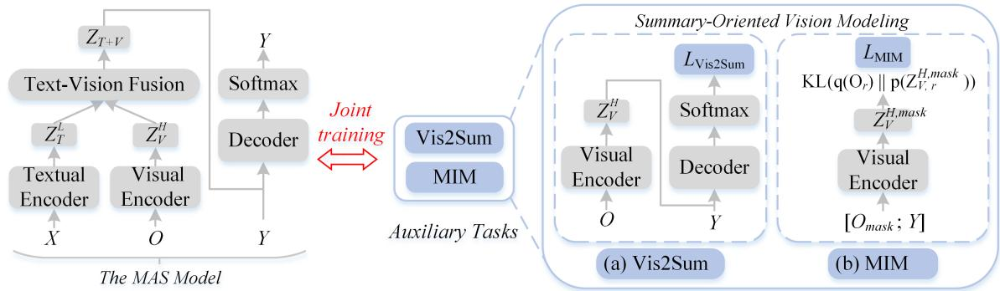

# Summary-Oriented Vision Modeling for Multimodal Abstractive Summarization

Yunlong Liang1∗, Fandong Meng2, Jinan Xu1†, Jiaan Wang2, Yufeng Chen1 and Jie Zhou2 1Beijing Key Lab of Traffic Data Analysis and Mining, Beijing Jiaotong University, Beijing, China 2Pattern Recognition Center, WeChat AI, Tencent Inc, China {yunlongliang,jaxu}@bjtu.edu.cn fandongmeng@tencent.com

## Abstract

Multimodal abstractive summarization (MAS) aims to produce a concise summary given the multimodal data (text and vision). Existing studies mainly focus on how to effectively use the visual features from the perspective of an article, having achieved impressive success on the high-resource English dataset. However, less attention has been paid to the visual features from the perspective of the summary, which may limit the model performance, especially in the low- and zero-resource scenarios. In this paper, we propose to improve the summary quality through summary-oriented visual features. To this end, we devise two auxiliary tasks including vision to summary task and masked image modeling task. Together with the main summarization task, we optimize the MAS model via the training objectives of all these tasks. By these means, the MAS model can be enhanced by capturing the summaryoriented visual features, thereby yielding more accurate summaries. Experiments on 44 languages, covering mid-high-, low-, and zeroresource scenarios, verify the effectiveness and superiority of the proposed approach, which achieves state-of-the-art performance under all scenarios. Additionally, we will contribute a large-scale multilingual multimodal abstractive summarization (MM-Sum) dataset.1

## 1 Introduction

Given an article and several images as inputs, as shown in Fig. 1, multimodal abstractive summarization (MAS) (Sanabria et al., 2018; Li et al., 2017, 2018a; Zhu et al., 2018; Jangra et al., 2020) aims to generate a concise textual summary, which can help people quickly grasp the core information. Therefore, MAS has widespread application and

  
Summary: Large queues formed at the Grand Palace in the Thai capital as mourners paid their respects to King Bhumibol Adulyadej, who died on Thursday.

Article: Thousands, dressed in black, waited to enter to sign a book of condolences at the palace in central Bangkok. Free buses were laid on to transport mourners from rural areas. [...] The crown prince and Princess Maha Chakri Sirindhorn were among those who paid their respects at the palace. On Friday, the king's body was transported in a convoy to the Temple of the Emerald Buddha in the Grand Palace from the hospital where he died. Cremation is not expected for several months. Large crowds of mourners lined the streets. many weeping, as the convoy passed. [...] King Bhumibol earned the devotion of Thais for his efforts to help the rural poor and was also seen as a stabilising figure in a country often wracked bv political turmoil. Thailand remains under military rule following a coup in 2014.[...]

Figure 1: An example of our MM-Sum dataset. Inputs: an article and image sequence pair; Output: summary. As we can see, the image sequence also concisely paraphrases the summary. The red content indicates its associated object is useless to the summary while the green counterparts represent important information.

attracts increasing attention with the rapid proliferation of multimedia content (Apostolidis et al., 2021; Feng et al., 2022; Qiu et al., 2022).

Recently, many studies have been carried out to effectively inject the visual features into MAS models (Li et al., 2018b, 2020b; Zhu et al., 2020, 2021; Zhang et al., 2021b,a; Palaskar et al., 2019; Liu et al., 2020; Yu et al., 2021a). For instance, Palaskar et al. (2019) and Zhang et al. (2021a) explore the hierarchy between the textual article and visual features, and integrate them into the MAS model. Liu et al. (2020) design a multistage fusion network to model the fine-grained interactions between the two modalities. And Yu et al. (2021a) study multiple multimodal fusion methods to infuse the visual features into generative pre-trained language models, e.g., BART (Lewis et al., 2020). Despite their success on the high-resource English dataset, they only model visual features from the perspective of an article and neglect the relevance of visual features to the summary, which restricts their potential performance especially on the training dataset with limited scale. For example, though the object “black clothes” in the first image of Fig. 1 is associated with the article content (red part), the object contributes little to the summary. Thus, the MAS model should focus on summary-oriented visual features. However, the visual features are generally implicitly learned via the MAS objective, which cannot help the model learn to explicitly discard the needless visual information.

To address this issue, in this paper, we propose a Summary-Oriented Vision enhanced MAS (SOV-MAS) training framework to generate more accurate summaries through explicitly improving the relevance of visual features to the summary. To this end, we design two summary-oriented vision modeling tasks, namely vision to summary task, and masked image modeling task. Specifically, as shown in Fig. 2, (1) the vision to summary task is to produce the concise summary by only taking the image sequence; (2) the masked image modeling task aims to predict the semantic class distribution of the regions in one fully masked image given the summary and the remaining images. Together with the main multimodal summarization task, the MAS model is optimized through the joint objectives of all these tasks. In this way, the model is enhanced to explicitly exploit the summary-oriented visual features, thus leading to more accurate summaries.

To validate the SOV-MAS framework on various languages and diverse settings, we construct the first large-scale Multilingual Multimodal Summarization dataset (MM-Sum) based on XL-Sum (Hasan et al., 2021), a multilingual summarization dataset. The MM-Sum covers 44 languages with mid-high-, low- and zero-resource scenarios. Experiments on these settings show that our model significantly outperforms related methods in terms of ROUGE (Lin, 2004) scores, especially under the low- and zero-resource settings, demonstrating its effectiveness. Besides, we extend our approach to two previous best MAS models (i.e., VG-BART and VG-T5 (Yu et al., 2021a)). Human evaluation and the results on How2 (Sanabria et al., 2018) benchmark further suggest the superiority and generalizability of our approach. In summary, our main contributions are:

• To the best of our knowledge, we are the first that contributes a large-scale multilingual multimodal summarization dataset (44 languages, 1.1M article-summary pairs with 3.5M images).

• We propose two general summary-oriented vision modeling tasks, which substantially boost the summary quality and are flexible and easy to be extended to existing MAS models.

• Experiments on MM-Sum show that our model builds new state-of-the-art performance in all scenarios, especially on the low and zero resource where the fewer the data are (midhigh low zero), the greater the improvement we gain. Besides, results on the How2 dataset show the generalizability of our approach.

• When jointly training the MAS model on multiple languages, we find that our model learns transferable visual features among languages, where the vision serves as an anchor in the zeroresource languages.

## 2 Background

## 2.1 Problem Formulation

Given an input article $\scriptstyle x = \{ x _ { k } \} _ { k = 1 } ^ { | \mathcal { X } | }$ and the corresponding object sequence $\mathcal { O } { = } \{ o _ { i j } \} _ { i { = } 1 , j { = } 1 } ^ { i { \leq } n , j { \leq } m }$ , where $x _ { k }$ denotes the k-th token and $o _ { i j }$ represents the detected j-th object of the i-th image (n, m is the number of images and detected objects in each image, respectively), the MAS task is defined as:

$$
p ( \mathcal { V } | \mathcal { X } , \mathcal { O } ) = \prod _ { t = 1 } ^ { | \mathcal { V } | } p ( y _ { t } | \mathcal { X } , \mathcal { O } , y _ { < t } ) ,
$$

where $y _ { < t }$ indicates the tokens before the t-th time step in the summary $\scriptstyle { \mathcal { Y } } = \{ y _ { t } \} _ { t = 1 } ^ { | { \mathcal { Y } } | }$

## 2.2 The MAS Model

Based on the pre-trained language models (e.g., BART), Yu et al. (2021a) design a variant of transformer (Vaswani et al., 2017) with four modules: textual encoder, visual encoder, text-vision fusion, and decoder, as shown in the left part of Fig. 2, which achieves good performance on MAS.

Textual Encoder. The input text is firstly tokenized and mapped to a sequence of token embeddings X. Then, the positional encodings $\mathbf { E } _ { p e }$ are pointwisely added to X to keep the positional information (Vaswani et al., 2017):

$$
\begin{array} { r } { \mathbf { Z } _ { T } ^ { 0 } = \mathbf { X } + \mathbf { E } _ { p e } , \{ \mathbf { Z } _ { T } ^ { 0 } , \mathbf { X } , \mathbf { E } _ { p e } \} \in \mathbb { R } ^ { | \mathcal { X } | \times d } , } \end{array}
$$

where d is the feature dimension. It forms the input features $\mathbf { Z } _ { T } ^ { 0 }$ to the encoder, which consists of L stacked layers and each layer includes two sublayers: 1) Multi-Head Attention (MHA) and 2) a position-wise Feed-Forward Network (FFN):

$$
\begin{array} { r } { { \bf S } _ { T } ^ { \ell } = \mathrm { M H A } ( { \bf Z } _ { T } ^ { \ell - 1 } ) + { \bf Z } _ { T } ^ { \ell - 1 } , { \bf S } _ { T } ^ { \ell } \in \mathbb { R } ^ { | \mathcal { X } | \times d } , } \end{array}
$$

$$
\begin{array} { r } { \mathbf { Z } _ { T } ^ { \ell } = \mathrm { F F N } ( \mathbf { S } _ { T } ^ { \ell } ) + \mathbf { S } _ { T } ^ { \ell } , \mathbf { Z } _ { T } ^ { \ell } \in \mathbb { R } ^ { | \mathcal { X } | \times d } , } \end{array}
$$

where $\mathbf { Z } _ { T } ^ { \ell }$ is the state of the ℓ-th encoder layer.

  
Figure 2: The overview of our model architecture. The left part is a general MAS model, which is enhanced by two summary-oriented vision modeling tasks. As shown in the right part, the two auxiliary tasks including (a) vision to summary task (Vis2Sum) and (b) masked image modeling task (MIM), are proposed to focus on the summary-oriented visual features and thus benefit the multimodal summarization task.

Visual Encoder. Following Yu et al. (2021a); Zhang et al. (2021a,b); Liang et al. (2021, 2022a,b), the object sequence is extracted from the image by the Faster R-CNNs (Ren et al., 2015) (actually, we have several images instead of only one image, please refer to § 3.1 for details). Then the visual features are fed into the visual encoder with H layers. Finally, we obtain the output visual features $\mathbf { Z } _ { V } ^ { H }$

$$
\begin{array} { r l } & { \mathbf { S } _ { V } ^ { h } = \mathrm { M H A } ( \mathbf { Z } _ { V } ^ { h - 1 } ) + \mathbf { Z } _ { V } ^ { h - 1 } , \mathbf { S } _ { V } ^ { h } \in \mathbb { R } ^ { | \mathcal { O } | \times d _ { v } } , } \\ & { \mathbf { Z } _ { V } ^ { h } = \mathrm { F F N } ( \mathbf { S } _ { V } ^ { h } ) + \mathbf { S } _ { V } ^ { h } , \mathbf { Z } _ { V } ^ { h } \in \mathbb { R } ^ { | \mathcal { O } | \times d _ { v } } , } \end{array}
$$

where $\mathbf { Z } _ { V } ^ { h }$ is the extracted visual features O.

Text-Vision Fusion. The fusion method is visionguided multi-head attention. Firstly, the query Q is linearly projected from the textual features $\mathbf { Z } _ { T } ^ { L }$ and the key K and value V are linearly projected from the visual features $\mathbf { Z } _ { V } ^ { H }$ . Secondly, a Crossmodal Multi-Head Attention (CMHA) is applied to get the text queried visual features M. Then, a forget gate G is used to filter redundant and noisy information from the visual features. Finally, we obtain the vision-guided output $\mathbf { Z } _ { T + V }$ by concatenating the textual features $\mathbf { Z } _ { T } ^ { L }$ and the result of a point-wise multiplication $\mathbf { G } \otimes \mathbf { M } .$ , and then linearly project it to the original dimension d. Formally, the text-vision fusion process is:

$$
\begin{array} { r l } & { \mathbf { Q } = \mathbf { Z } _ { T } ^ { L } \mathbf { W } _ { q } , \ \mathbf { Q } \in \mathbb { R } ^ { | \mathcal { X } | \times d _ { c } } , } \\ & { \mathbf { K } = \mathbf { Z } _ { V } ^ { H } \mathbf { W } _ { k } , \ \mathbf { V } = \mathbf { Z } _ { V } ^ { H } \mathbf { W } _ { v } , \ \mathbf { K } , \mathbf { V } \in \mathbb { R } ^ { | \mathcal { O } | \times d _ { c } } , } \\ & { \mathbf { M } = \mathrm { C M H A } ( \mathbf { Q } , \mathbf { K } , \mathbf { V } ) , \ \mathbf { M } \in \mathbb { R } ^ { | \mathcal { X } | \times d _ { c } } , } \\ & { \mathbf { G } = \mathrm { S i g m o i d } ( \mathrm { C o n c a t } ( \mathbf { Z } _ { T } ^ { L } , \mathbf { M } ) \mathbf { W } _ { g } + \mathbf { b } _ { g } ) , } \\ & { \mathbf { Z } _ { T + V } = \mathrm { C o n c a t } ( \mathbf { Z } _ { T } ^ { L } , \mathbf { G } \otimes \mathbf { M } ) \mathbf { W } _ { z } + \mathbf { b } _ { z } , } \end{array}
$$

where Concat is the concatenation operation and W and b are trainable weights.

Decoder. Similar to the encoder, but each of L decoder layers includes an additional Multi-Head

Cross-Attention sub-layer (MHCA):

$$
\begin{array} { r l } & { \mathbf { S } _ { d e c } ^ { \ell } = \mathrm { M H A } ( \mathbf { Z } _ { d e c } ^ { \ell - 1 } ) + \mathbf { Z } _ { d e c } ^ { \ell - 1 } , \mathbf { S } _ { d e c } ^ { \ell - 1 } \in \mathbb { R } ^ { | \mathcal { V } | \times d } , } \\ & { \mathbf { C } _ { d e c } ^ { \ell } = \mathrm { M H C A } ( \mathbf { S } _ { d e c } ^ { \ell } , \mathbf { Z } _ { T + V } ) + \mathbf { S } _ { d e c } ^ { \ell } , } \\ & { \mathbf { Z } _ { d e c } ^ { \ell } = \mathrm { F F N } ( \mathbf { C } _ { d e c } ^ { \ell } ) + \mathbf { C } _ { d e c } ^ { \ell } , \mathbf { C } _ { d e c } ^ { \ell } \in \mathbb { R } ^ { | \mathcal { V } | \times d } , } \end{array}\tag{1}
$$

where $\mathbf { Z } _ { d e c } ^ { \ell } \in \mathbb { R } ^ { | \mathcal { V } | \times d }$ denotes the state of the ℓ-th decoder layer. Then, at each decoding time step t, the top-layer (L-th) decoder hidden state $\mathbf { Z } _ { d e c , t } ^ { L }$ is fed into the softmax layer to produce the probability distribution of the next target token as:

$$
p ( y _ { t } | \mathcal { X } , \mathcal { O } , y _ { < t } ) = \mathrm { S o f t m a x } ( \mathbf { W } _ { o } \mathbf { Z } _ { d e c , t } ^ { L } + \mathbf { b } _ { o } ) ,
$$

where ${ \bf W } _ { o }$ and ${ \bf b } _ { o }$ are trainable weights.

Finally, the loss function is formalized as:

$$
\mathcal { L } _ { \mathrm { M A S } } = - \sum _ { t = 1 } ^ { | \mathcal { V } | } \log ( p ( y _ { t } | \mathcal { X } , \mathcal { O } , y _ { < t } ) ) .\tag{2}
$$

## 3 SOV-MAS Framework

Based on the vision-guided pre-trained language model described in § 2.2, we introduce the proposed Summary-Oriented Vision enhanced MAS ((SOV-MAS)) framework. Specifically, we firstly describe the process of visual features extraction in § 3.1. Then, to make the best use of visual features, we design two summary-oriented vision modeling tasks in § 3.2, namely vision to summary task and masked image modeling task. Finally, we describe the training and inference in § 3.3.

## 3.1 Visual Features Extraction

As described in § 2.2, there is an image sequence to be extracted by the Faster R-CNNs (Ren et al., 2015) pre-trained on Visual Genome (Krishna et al., 2017). Specifically, for the i-th input image, we obtain a set of detected objects from Faster R-CNNs, $i . e . , \mathbf { I } _ { i } = \{ \mathbf { v } _ { i , 1 } , \mathbf { v } _ { i , 2 } , \mathbf { v } _ { i , 3 } , . . . , \mathbf { v } _ { i , m } \}$ , where m is the number of extracted objects and $\mathbf { v } _ { i , * } \in \mathbb { R } ^ { d _ { v } }$ . Each object is captured by a dense feature representation, which can be mapped back to a bounding box / region (i.e., Region-of-Interest (RoI)). Finally, the image sequence is converted to visual features $\mathbf { I } { = } \{ \mathbf { v } _ { i j } \} _ { i { = } 1 , j { = } 1 } ^ { i { \leq } n , j { \leq } m }$

Besides these features from Faster R-CNN, given the fact that Transformer (Vasava et al., 2022) is becoming popular in computer vision, we experiment with the visual features extracted by the pretrained Transformer models (i.e., ViT (Dosovitskiy et al., 2020)).

To keep the order information of the image sequence, each image region is encoded as a sum of four types of features (Cho et al., 2021):

$$
\begin{array} { r } { \mathbf { o } _ { i j } = \mathbf { v } _ { i j } + \mathbf { E } _ { i j } ^ { b o x } + \mathbf { E } _ { i } ^ { i m g } + \mathbf { E } _ { j } ^ { r e g } ; i \leq n , j \leq m , } \end{array}
$$

where $\mathbf { E } _ { i j } ^ { b o x } \in \mathbb { R } ^ { d _ { v } }$ denotes RoI bounding box coordinates, which are encoded with a linear layer; $\mathbf { E } _ { i } ^ { i m g } \in \mathbb { R } ^ { d _ { v } }$ denotes image id embedding, which is used to discriminate regions from different images; and $\mathbf { E } _ { j } ^ { r e g } \in \mathbb { R } ^ { d _ { v } }$ denotes region id embedding. The image ids and region ids are encoded with learned embeddings (Devlin et al., 2019). The final visual embeddings are denoted as $\mathbf { O } { = } \{ \mathbf { o } _ { i j } \} _ { i { = } 1 , j { = } 1 } ^ { i { \leq } n , j { \leq } m }$ Then, they are fed into the visual encoder for better modeling the intramodal dynamics and enhancing the vision-specific order information.

## 3.2 Summary-Oriented Vision Modeling

We elaborately design two summary-oriented vision modeling tasks, namely vision to summary task and masked image modeling task, to focus on the summary-oriented visual features.

Vision to Summary Task (Vis2Sum). As illustrated in the right part of Fig. 2 (a), given the object sequence  extracted from the image sequence, the Vis2Sum task forces the MAS model to directly generate the corresponding summary  without seeing the article $\mathcal { X } .$ . In this manner, the MAS model could acquire the ability to roughly understand the summary and grasp the overall situation. Particularly, we firstly use the visual encoder to encode ${ \mathcal { O } } ,$ and then use the MAS decoder to predict . The training objective of this task can be formulated as:

$$
\mathcal { L } _ { \mathrm { V i s 2 S u m } } = - \sum _ { t = 1 } ^ { | \mathcal { V } | } \log ( p ( y _ { t } | \mathcal { O } , y _ { < t } ) ) ,\tag{3}
$$

$$
p ( y _ { t } | \mathcal { O } , y _ { < t } ) = \mathrm { S o f t m a x } ( \mathbf { W } _ { o } \mathbf { Z } _ { d e c , t } ^ { L , V } + \mathbf { b } _ { o } ) ,
$$

where $\mathbf { Z } _ { d e c , t } ^ { L , V }$ is the top-layer decoder hidden state at the t-th decoding step, while the input of MHCA is the visual features $\mathbf { Z } _ { V } ^ { H }$ instead of $\mathbf { Z } _ { T + V }$ in Eq. 1.

Masked Image Modeling Task (MIM). Our MIM task aims to predict the semantic class distribution of the regions in one fully masked image. As illustrated in the right part of Fig. 2 (b), for the input of the visual encoder, we firstly mask all regions in one random image (i.e., m objects/regions), which are replaced with zero vectors. Then, we concatenate the masked object sequence $\mathcal { O } _ { m a s k }$ and the summary . After feeding the concatenated input $[ \mathcal { O } _ { m a s k } ; \mathcal { V } ]$ to the encoder, an MLP classifier is stacked over the output of each masked region to predict the semantic class distribution. Specifically, we denote the predicted class distribution of the r-th masked region as $\mathrm { p } ( \mathbf { Z } _ { V , r } ^ { H , m a s k } )$ , and use ${ \bf q } ( { \bf O } _ { r } )$ to represent the class distribution detected by the Faster R-CNNs (Ren et al., 2015). The loss function for the MIM is to minimize the KL divergence (Kingma and Welling, 2013) of the two class distributions:

$$
\mathcal { L } _ { \mathrm { M I M } } = \sum _ { r = 1 } ^ { m } \mathrm { D } _ { \mathrm { K L } } ( q ( \mathbf { O } _ { r } ) | | p ( \mathbf { Z } _ { V , r } ^ { H , m a s k } ) ) .\tag{4}
$$

Besides, as a variant, we randomly mask regions in the image sequence with a probability of 15% following previous work (Xing et al., 2021). We denote it as masked region modeling (MRM) and show its effect in Tab. 4.

## 3.3 Training and Inference

Monolingual Training. For monolingual summarization, with the main MAS task and the two auxiliary tasks, the training objective on one specific language is finally formulated as:

$$
\mathcal { T } _ { \mathrm { M o n o } } = \mathcal { L } _ { \mathrm { M A S } } + \alpha \mathcal { L } _ { \mathrm { V i s 2 S u m } } + \beta \mathcal { L } _ { \mathrm { M I M } } ,\tag{5}
$$

where α and $\beta$ are balancing factors for the tradeoff between ${ \mathcal { L } } _ { \mathrm { M A S } }$ and the auxiliary objectives.

Multilingual Training. For multilingual summarization, the model can deal with inputs in multiple languages and predict the summary in the corresponding language. Specifically, for each language $l _ { k }$ in the set of K languages $L a n g = \{ l _ { 1 } , l _ { 2 } , . . . , l _ { K } \}$ the training objective is:

$$
\mathcal { T } _ { \mathrm { M u l t i } } = \sum _ { k = 1 } ^ { K } ( \mathcal { T } _ { \mathrm { M o n o } } ^ { l _ { k } } ) .\tag{6}
$$

During inference, the two auxiliary tasks are not involved and only the MAS model is used to conduct summarization.

<table><tr><td rowspan=1 colspan=1></td><td rowspan=1 colspan=3>Monolingual Training</td><td rowspan=1 colspan=3>Multilingual Training</td></tr><tr><td rowspan=1 colspan=1>Languages</td><td rowspan=1 colspan=1>mT5</td><td rowspan=1 colspan=1>VG-mT5</td><td rowspan=1 colspan=1>SOV-MAS (ours)</td><td rowspan=1 colspan=1>mT5</td><td rowspan=1 colspan=1>VG-mT5</td><td rowspan=1 colspan=1>SOV-MAS (ours)</td></tr><tr><td rowspan=1 colspan=1>Arabic</td><td rowspan=1 colspan=1>33.67/14.06/27.83</td><td rowspan=1 colspan=1>33.88/14.20/28.00</td><td rowspan=1 colspan=1>33.63/13.83/27.64</td><td rowspan=1 colspan=1>34.34/14.30/28.43</td><td rowspan=1 colspan=1>33.42/13.58/27.62</td><td rowspan=1 colspan=1>34.74/14.48/28.84</td></tr><tr><td rowspan=1 colspan=1>Chinese</td><td rowspan=1 colspan=1>40.20/25.39/33.49</td><td rowspan=1 colspan=1>39.99/25.19/33.19</td><td rowspan=1 colspan=1>40.59/25.32/33.36</td><td rowspan=1 colspan=1>40.30/24.97/33.04</td><td rowspan=1 colspan=1>40.14/25.29/33.31</td><td rowspan=1 colspan=1>41.59/26.52/34.53</td></tr><tr><td rowspan=1 colspan=1>English</td><td rowspan=1 colspan=1>36.99/15.18/29.64</td><td rowspan=1 colspan=1>37.17/14.88/29.41</td><td rowspan=1 colspan=1>37.26/15.02/29.61</td><td rowspan=1 colspan=1>36.65/13.91/28.53</td><td rowspan=1 colspan=1>36.62/14.13/28.76</td><td rowspan=1 colspan=1>37.86/15.23/29.89</td></tr><tr><td rowspan=1 colspan=1>Hindi</td><td rowspan=1 colspan=1>33.66/13.14/27.71</td><td rowspan=1 colspan=1>34.82/13.94/28.59</td><td rowspan=1 colspan=1>34.83/13.60/28.25</td><td rowspan=1 colspan=1>35.50/13.91/28.52</td><td rowspan=1 colspan=1>35.36/14.16/28.87</td><td rowspan=1 colspan=1>36.42/14.95/29.77</td></tr><tr><td rowspan=1 colspan=1>Indonesian</td><td rowspan=1 colspan=1>35.10/15.44/28.91</td><td rowspan=1 colspan=1>35.47/15.47/29.12</td><td rowspan=1 colspan=1>35.17/15.35/28.85</td><td rowspan=1 colspan=1>35.84/15.66/29.40</td><td rowspan=1 colspan=1>36.50/16.31/30.13</td><td rowspan=1 colspan=1>37.50/17.33/31.22</td></tr><tr><td rowspan=1 colspan=1>Persian</td><td rowspan=1 colspan=1>36.14/15.55/29.25</td><td rowspan=1 colspan=1>36.12/15.59/29.15</td><td rowspan=1 colspan=1>36.44/15.92/29.50</td><td rowspan=1 colspan=1>36.39/15.84/29.45</td><td rowspan=1 colspan=1>36.71/16.19/29.80</td><td rowspan=1 colspan=1>37.69/16.90/30.71</td></tr><tr><td rowspan=1 colspan=1>Portuguese</td><td rowspan=1 colspan=1>30.13/10.32/22.06</td><td rowspan=1 colspan=1>29.69/9.82/22.10</td><td rowspan=1 colspan=1>29.83/10.05/21.78</td><td rowspan=1 colspan=1>30.84/10.92/22.64</td><td rowspan=1 colspan=1>31.22/11.43/23.24</td><td rowspan=1 colspan=1>32.32/11.90/23.83</td></tr><tr><td rowspan=1 colspan=1>Russian</td><td rowspan=1 colspan=1>30.01/12.47/24.28</td><td rowspan=1 colspan=1>31.38/13.02/25.22</td><td rowspan=1 colspan=1>31.86/13.38/25.45</td><td rowspan=1 colspan=1>31.12/12.33/24.67</td><td rowspan=1 colspan=1>30.42/12.29/24.38</td><td rowspan=1 colspan=1>31.96/13.30/25.69</td></tr><tr><td rowspan=1 colspan=1>Spanish</td><td rowspan=1 colspan=1>29.51/10.48/22.51</td><td rowspan=1 colspan=1>29.50/10.62/22.47</td><td rowspan=1 colspan=1>29.27/10.40/22.43</td><td rowspan=1 colspan=1>29.91/10.70/22.66</td><td rowspan=1 colspan=1>30.57/10.96/23.21</td><td rowspan=1 colspan=1>31.20/11.64/23.73</td></tr><tr><td rowspan=1 colspan=1>Tamil</td><td rowspan=1 colspan=1>22.31/10.08/20.36</td><td rowspan=1 colspan=1>22.30/10.15/20.39</td><td rowspan=1 colspan=1>22.82/10.55/20.67</td><td rowspan=1 colspan=1>22.96/10.05/20.75</td><td rowspan=1 colspan=1>23.04/10.25/20.94</td><td rowspan=1 colspan=1>24.22/10.79/21.92</td></tr><tr><td rowspan=1 colspan=1>Turkish</td><td rowspan=1 colspan=1>30.37/14.39/26.79</td><td rowspan=1 colspan=1>30.51/14.41/26.76</td><td rowspan=1 colspan=1>31.02/14.64/27.20</td><td rowspan=1 colspan=1>31.93/14.69/27.76</td><td rowspan=1 colspan=1>31.44/14.73/27.71</td><td rowspan=1 colspan=1>32.94/15.77/29.01</td></tr><tr><td rowspan=1 colspan=1>Ukrainian</td><td rowspan=1 colspan=1>21.57/ 8.66/18.64</td><td rowspan=1 colspan=1>21.71/ 8.89/18.79</td><td rowspan=1 colspan=1>21.84/ 8.62/18.69</td><td rowspan=1 colspan=1>22.79/9.13/19.46</td><td rowspan=1 colspan=1>22.60/9.27/19.55</td><td rowspan=1 colspan=1>23.91/ 9.97/20.53</td></tr><tr><td rowspan=2 colspan=1>UrduVietnamese</td><td rowspan=1 colspan=1>38.22/17.25/31.37</td><td rowspan=1 colspan=1>38.07/17.31/31.54</td><td rowspan=1 colspan=1>38.10/16.98/31.18</td><td rowspan=1 colspan=1>38.15/17.12/31.36</td><td rowspan=1 colspan=1>38.04/17.32/31.67</td><td rowspan=1 colspan=1>39.38/18.38/32.76</td></tr><tr><td rowspan=1 colspan=1>32.18/15.84/24.83</td><td rowspan=1 colspan=1>32.18/15.98/24.84</td><td rowspan=1 colspan=1>32.22/15.99/24.95</td><td rowspan=1 colspan=1>33.71/16.72/25.97</td><td rowspan=1 colspan=1>33.78/17.06/26.32</td><td rowspan=1 colspan=1>34.78/17.85/27.17</td></tr><tr><td rowspan=1 colspan=1>Avg.</td><td rowspan=1 colspan=1>32.14/14.16/26.26</td><td rowspan=1 colspan=1>32.34/14.24/26.39</td><td rowspan=1 colspan=1>32.49/14.26/26.40</td><td rowspan=1 colspan=1>32.88/14.30/26.61</td><td rowspan=1 colspan=1>32.84/14.49/26.82</td><td rowspan=1 colspan=1>34.04/15.36/27.83</td></tr></table>

Table 1: The R-1/R-2/R-L results on the mid-high-resource scenario. $^ { 6 6 } \stackrel { * } { \sim } \stackrel { 1 * } { \sim } 1 \stackrel { * } { \sim } 1 \stackrel { * } { \sim } 1$ and $w ^ { * } / \dddot { \ddot { \sqrt { 1 0 } } }$ denote statistically significant better than the $\mathrm { ^ { 6 6 } V G - m T } 5 ^ { \mathrm { , 3 } }$ model with t-test $p < 0 . 0 5$ and $p < 0 . 0 1$ hereinafter, respectively. The “Avg.” indicates average score for each group and the best average scores are bold.

## 4 Experiments

## 4.1 MM-Sum Dataset

There is no multilingual MAS benchmark dataset until now. We construct one as follows.

Data Source and Data Construction. Based on the XL-Sum dataset (Hasan et al., 2021), we construct a Multilingual Multimodal abstractive Summarization (MM-Sum) dataset. The original XL-Sum dataset is crawled from the BBC website2 and its quality has been verified and ensured reliability by Hasan et al. (2021). However, the lack of associated image sequence in XL-Sum, makes it impossible to directly conduct research on MAS. Therefore, we strictly follow the procedure of (Hasan et al., 2021) to further offer the image sequence for the corresponding textual summarization dataset, where we maintain the articlesummary pair if it contains images and keep the image order appearing in the article.

Dataset Statistics and Splits. Tab. 7 of Appendix A shows the detailed statistic of our MM-Sum and please refer to it for details. According to the dataset size of each language, we split them into three settings: Mid-High Resource, Low Resource, and Zero Resource. For mid-high and low-resource languages, following Hasan et al. (2021), we utilize about 80% training:10% validation:10% test splitting with one exception (English splitting is 93%:3.5%:3.5%). For zero resource, we following Bugliarello et al. (2022) investigate two scenarios: few-shot and zero-shot. Therefore, we also randomly sample 100 instances as the few-shot learning data and then split the rest with about 50% validation and 50% test.

## 4.2 Setup and Metrics

Implementation Details. Please refer to Appendix B for implementation details including data pre-processing and hyper-parameters settings. Metrics. Following Hasan et al. (2021), we use the standard ROUGE scores (R-1, R-2, and R-L) (Lin, 2004) with the statistical significance test (Koehn, 2004) for a fair comparison.

## 4.3 Comparison Models

Text-Only MAS Systems.

• mT5: We choose the mT5 (Xue et al., 2021), a multilingual language model pre-trained on a large dataset of 101 languages, as the text-only baseline which is fine-tuned on our dataset.

Vision-Guided MAS Systems.

• VG-mT5: We implement the fusion method described in § 2.2 to inject visual features into the mT5 model, which is a strong baseline.

• SOV-MAS: It is the proposed model with two summary-oriented auxiliary tasks to enhance MAS model as described in § 3.

All the above models involve two training manners: monolingual training and multilingual training. Specifically, for monolingual training, we train the model on the training dataset of each language. For multilingual training, we train the model on the whole training dataset of mid-highresource and low-resource languages.

<table><tr><td rowspan=2 colspan=1>Languages</td><td rowspan=1 colspan=1>Monolingual</td><td rowspan=1 colspan=2>Training</td><td rowspan=1 colspan=3>Multilingual Training</td></tr><tr><td rowspan=1 colspan=1>mT5</td><td rowspan=1 colspan=1>VG-mT5</td><td rowspan=1 colspan=1>SOV-MAS (ours)</td><td rowspan=1 colspan=1>mT5</td><td rowspan=1 colspan=1>VG-mT5</td><td rowspan=1 colspan=1>SOV-MAS (ours)</td></tr><tr><td rowspan=1 colspan=1>Bengali</td><td rowspan=1 colspan=1>25.34/9.52/22.04</td><td rowspan=1 colspan=1>26.02/ 9.88/22.14</td><td rowspan=1 colspan=1>26.76/10.08/23.07</td><td rowspan=1 colspan=1>27.95/10.64/23.43</td><td rowspan=1 colspan=1>27.34/10.87/23.42</td><td rowspan=1 colspan=1>28.89/11.69/24.59</td></tr><tr><td rowspan=1 colspan=1>French</td><td rowspan=1 colspan=1>32.05/12.98/25.06</td><td rowspan=1 colspan=1>32.41/13.40/25.50</td><td rowspan=1 colspan=1>33.16/14.21/25.89</td><td rowspan=1 colspan=1>34.36/14.90/26.92</td><td rowspan=1 colspan=1>34.94/15.41/27.56</td><td rowspan=1 colspan=1>36.06/16.36/28.63</td></tr><tr><td rowspan=1 colspan=1>Gujarati</td><td rowspan=1 colspan=1>19.30/6.34/17.74</td><td rowspan=1 colspan=1>19.45/ 6.26/17.65</td><td rowspan=1 colspan=1>19.83/ 6.64/18.02</td><td rowspan=1 colspan=1>21.59/7.38/19.26</td><td rowspan=1 colspan=1>21.44/7.61/19.46</td><td rowspan=1 colspan=1>22.31/8.12/20.14</td></tr><tr><td rowspan=1 colspan=1>Hausa</td><td rowspan=1 colspan=1>36.36/15.37/28.85</td><td rowspan=1 colspan=1>35.69/14.75/28.22</td><td rowspan=1 colspan=1>36.81/15.31/29.12</td><td rowspan=1 colspan=1>38.37/16.59/30.34</td><td rowspan=1 colspan=1>38.14/16.60/30.45</td><td rowspan=1 colspan=1>39.40/17.53/31.04</td></tr><tr><td rowspan=1 colspan=1>Japanese</td><td rowspan=1 colspan=1>44.54/21.33/34.44</td><td rowspan=1 colspan=1>45.03/21.64/34.99</td><td rowspan=1 colspan=1>45.97/22.63/35.84</td><td rowspan=1 colspan=1>47.36/22.20/35.88</td><td rowspan=1 colspan=1>46.65/22.66/35.68</td><td rowspan=1 colspan=1>47.96/23.76/36.78</td></tr><tr><td rowspan=1 colspan=1>Marathi</td><td rowspan=1 colspan=1>20.39/8.96/18.65</td><td rowspan=1 colspan=1>20.60/9.06/18.75</td><td rowspan=1 colspan=1>21.08/ 9.46/19.09</td><td rowspan=1 colspan=1>21.91/ 9.52/19.64</td><td rowspan=1 colspan=1>21.72/9.49/19.82</td><td rowspan=1 colspan=1>22.59/ 9.98/20.39</td></tr><tr><td rowspan=1 colspan=1>Oromo</td><td rowspan=1 colspan=1>15.91/ 5.03/13.91</td><td rowspan=1 colspan=1>15.65/4.95/13.67</td><td rowspan=1 colspan=1>16.68/5.39/14.60</td><td rowspan=1 colspan=1>17.77/5.72/15.53</td><td rowspan=1 colspan=1>17.82/5.75/15.20</td><td rowspan=1 colspan=1>19.13/ 6.29/16.47</td></tr><tr><td rowspan=1 colspan=1>Pashto</td><td rowspan=1 colspan=1>36.14/14.06/29.74</td><td rowspan=1 colspan=1>35.97/14.08/29.67</td><td rowspan=1 colspan=1>36.45/14.06/29.79</td><td rowspan=1 colspan=1>37.34/14.41/30.39</td><td rowspan=1 colspan=1>37.21/14.70/30.59</td><td rowspan=1 colspan=1>38.11/15.53/31.44</td></tr><tr><td rowspan=1 colspan=1>Pidgin</td><td rowspan=1 colspan=1>35.22/12.93/27.27</td><td rowspan=1 colspan=1>35.14/12.88/27.27</td><td rowspan=1 colspan=1>35.58/13.02/27.46</td><td rowspan=1 colspan=1>36.33/13.60/28.29</td><td rowspan=1 colspan=1>37.21/14.48/29.14</td><td rowspan=1 colspan=1>38.02/15.31/30.07</td></tr><tr><td rowspan=1 colspan=1>Punjabi</td><td rowspan=1 colspan=1>27.43/10.07/22.68</td><td rowspan=1 colspan=1>27.27/9.76/22.44</td><td rowspan=1 colspan=1>28.25/10.57/23.14</td><td rowspan=1 colspan=1>29.98/11.14/24.41</td><td rowspan=1 colspan=1>29.75/11.48/24.72</td><td rowspan=1 colspan=1>30.78/12.10/25.52</td></tr><tr><td rowspan=1 colspan=1>Serbian Cyrillic</td><td rowspan=1 colspan=1>18.52/4.90/15.44</td><td rowspan=1 colspan=1>19.01/  4.92/15.72</td><td rowspan=1 colspan=1>19.80/ 5.20/16.41</td><td rowspan=1 colspan=1>23.11/7.18/19.14</td><td rowspan=1 colspan=1>22.92/7.43/19.39</td><td rowspan=1 colspan=1>23.85/7.93/20.06</td></tr><tr><td rowspan=1 colspan=1>Serbian Latin</td><td rowspan=1 colspan=1>18.50/4.40/15.11</td><td rowspan=1 colspan=1>18.49/ 4.67/15.42</td><td rowspan=1 colspan=1>18.55/ 4.75/15.29</td><td rowspan=1 colspan=1>21.28/6.04/17.41</td><td rowspan=1 colspan=1>20.66/5.82/17.21</td><td rowspan=1 colspan=1>22.39/6.84/18.59</td></tr><tr><td rowspan=1 colspan=1>Swahili</td><td rowspan=1 colspan=1>34.22/14.76/27.61</td><td rowspan=1 colspan=1>34.79/15.07/28.00</td><td rowspan=1 colspan=1>34.56/14.99/27.75</td><td rowspan=1 colspan=1>36.75/16.26/29.49</td><td rowspan=1 colspan=1>37.19/17.23/30.33</td><td rowspan=1 colspan=1>38.04/17.87/30.99</td></tr><tr><td rowspan=1 colspan=1>Telugu</td><td rowspan=1 colspan=1>17.06/5.83/15.29</td><td rowspan=1 colspan=1>17.20/5.95/15.30</td><td rowspan=1 colspan=1>17.56/6.09/15.66</td><td rowspan=1 colspan=1>18.68/6.50/16.52</td><td rowspan=1 colspan=1>18.92/ 6.77/16.84</td><td rowspan=1 colspan=1>20.19/7.38/17.91</td></tr><tr><td rowspan=1 colspan=1>Welsh</td><td rowspan=1 colspan=1>30.41/ 9.23/24.11</td><td rowspan=1 colspan=1>30.63/9.78/24.23</td><td rowspan=1 colspan=1>31.32/10.97/24.77</td><td rowspan=1 colspan=1>31.86/10.88/25.06</td><td rowspan=1 colspan=1>31.91/10.62/25.08</td><td rowspan=1 colspan=1>32.89/11.79/26.10</td></tr><tr><td rowspan=1 colspan=1>Avg.</td><td rowspan=1 colspan=1>27.42/10.38/22.52</td><td rowspan=1 colspan=1>27.55/10.47/22.59</td><td rowspan=1 colspan=1>28.16/10.90/23.06</td><td rowspan=1 colspan=1>29.64/11.53/24.11</td><td rowspan=1 colspan=1>29.59/11.79/24.32</td><td rowspan=1 colspan=1>30.71/12.57/25.25</td></tr></table>

Table 2: The R-1/R-2/R-L results on the low-resource scenario.

## 4.4 Main Results

Tab. 1, Tab. 2, and Tab. 3 present the main results on mid-high-, low-, and zero-resource scenarios under monolingual and multilingual training settings. Overall, our model obtains notably better results than the text-only “mT5” model on both settings. 1) In the monolingual training setting, we find that the fewer the data are (mid-high low zero), the greater the improvement we gain, showing that our approach plays an increasing role in vision modeling. 2) In the multilingual training setting, the results show that our approach learns transferable visual features among languages, especially on the zero-resource ones where the vision serves as an anchor. These results not only show the effectiveness of our approach but also the value of our MM-Sum dataset.

Results on Mid-High-Resource Scenario. In Tab. 1, 1) on the whole, the results of the multilingual training group (e.g., SOV-MAS) substantially outperform those of the monolingual training group, demonstrating the task knowledge among languages is transferable. 2) Under the monolingual training setting, the text-only baseline “mT5” performs worse than the “VG-mT5” model on most languages, showing that the visual features indeed supplement some crucial information for the summarization. With the summary-oriented vision modeling tasks, our model further promotes the quality of the summary (“SOV-MAS” vs. “VGmT5”), demonstrating the effectiveness of our approach. 3) Under the multilingual training setting, our model consistently and significantly surpasses both the text-only and vision-guided baselines by large margins (e.g., the previous best “VG-mT5”, up to 1.20/0.87/1.01 ROUGE scores on average).

Further, in the monolingual setting, the data scale is large while it may be not enough to learn better summary-oriented image features. That’s, the improved image features may not supplement much more information compared with the large textual data. However, in multilingual training, the data scale is much larger and enough for learning the better summary-oriented image features, which help the model capture more summary-related information. Thus, the SOV-MAS achieves more significant results than in a monolingual setting.

Results on Low-Resource Scenario. Under the low-resource languages, in Tab. 2, we observe similar findings as in the Mid-High-Resource scenario. This demonstrates that our conclusions are solid and convincing on general languages. All these results prove the effectiveness of our approach.

Further, in this setting, the data may be not enough for learning the better summary-oriented image features. However, the learned image features still could offer a sketch of the summary and help the model to focus more on the summaryrelated parts. This may compensate for the impact of insufficient data. Therefore, the SOV-MAS also obtains significant gains.

Results on Zero-Resource Scenario (Zero-Shot). On the zero-shot setting in the left group of Tab. 3, the “VG-mT5” model notably exceeds the textonly “mT5” model by averagely 0.56/0.22/0.49 ROUGE scores. It indicates that the image in our MM-Sum plays a key role when transferring knowledge from mid-high and low-resource languages to zero-resource languages via considering vision as the anchor, where the vision is free from different languages. Furthermore, our model presents significant improvements over the “mT5” model by averagely 1.27/0.41/1.05 ROUGE gains, which shows its effectiveness again.

<table><tr><td rowspan=2 colspan=3>Languages</td><td rowspan=1 colspan=3>Zero-Shot Setting</td><td rowspan=1 colspan=3>Few-Shot Setting</td></tr><tr><td rowspan=1 colspan=1></td><td rowspan=1 colspan=1>mT5</td><td rowspan=1 colspan=1>VG-mT5</td><td rowspan=1 colspan=1>SOV-MAS (ours)</td><td rowspan=1 colspan=1>mT5</td><td rowspan=1 colspan=1>VG-mT5</td><td rowspan=1 colspan=1>SOV-MAS (ours)</td></tr><tr><td rowspan=1 colspan=2>Amharic</td><td rowspan=1 colspan=1></td><td rowspan=1 colspan=1>0.05/0.00/0.05</td><td rowspan=1 colspan=1>0.06/0.01/ 0.07</td><td rowspan=1 colspan=1>0.15/0.01/ 0.15</td><td rowspan=1 colspan=1>10.50/ 2.50/9.39</td><td rowspan=1 colspan=1>10.86/ 2.58/ 9.68</td><td rowspan=1 colspan=1>9.61/ 2.06/ 8.33</td></tr><tr><td rowspan=1 colspan=3>Azerbaijani</td><td rowspan=1 colspan=1>6.79/1.66/6.25</td><td rowspan=1 colspan=1>6.92/1.76/6.42</td><td rowspan=1 colspan=1>7.55/1.93/ 6.99</td><td rowspan=1 colspan=1>10.57/  2.85/9.39</td><td rowspan=1 colspan=1>10.91/  3.07/ 9.80</td><td rowspan=1 colspan=1>12.39/3.53/10.93</td></tr><tr><td rowspan=1 colspan=3>Burmese</td><td rowspan=1 colspan=1>1.21/0.71/  1.07</td><td rowspan=1 colspan=1>1.27/0.67/ 1.11</td><td rowspan=1 colspan=1>1.41/0.74/ 1.18</td><td rowspan=1 colspan=1>33.67/14.16/23.67</td><td rowspan=1 colspan=1>33.45/14.23/23.77</td><td rowspan=1 colspan=1>32.97/13.12/22.87</td></tr><tr><td rowspan=1 colspan=3>Igbo</td><td rowspan=1 colspan=1>18.61/3.00/14.00</td><td rowspan=1 colspan=1>19.35/3.61/14.78</td><td rowspan=1 colspan=1>21.21/4.08/15.95</td><td rowspan=1 colspan=1>21.83/4.53/16.62</td><td rowspan=1 colspan=1>24.17/5.16/18.14</td><td rowspan=1 colspan=1>24.63/5.47/18.21</td></tr><tr><td rowspan=1 colspan=3>Kirundi</td><td rowspan=1 colspan=1>14.39/4.15/11.75</td><td rowspan=1 colspan=1>15.70/4.93/13.10</td><td rowspan=1 colspan=1>17.31/5.39/14.29</td><td rowspan=1 colspan=1>22.09/6.65/16.81</td><td rowspan=1 colspan=1>23.35/7.28/17.76</td><td rowspan=1 colspan=1>24.61/8.15/18.65</td></tr><tr><td rowspan=1 colspan=3>Korean</td><td rowspan=1 colspan=1>1.07/0.03/  1.04</td><td rowspan=1 colspan=1>1.23/0.02/ 1.23</td><td rowspan=1 colspan=1>1.13/0.04/ 1.09</td><td rowspan=1 colspan=1>9.49/4.47/  8.90</td><td rowspan=1 colspan=1>10.00/4.73/  9.41</td><td rowspan=1 colspan=1>8.65/ 4.22/8.15</td></tr><tr><td rowspan=1 colspan=3>Kyrgyz</td><td rowspan=1 colspan=1>4.99/1.55/ 4.70</td><td rowspan=1 colspan=1>5.52/1.61/  5.19</td><td rowspan=1 colspan=1>6.40/1.82/ 5.85</td><td rowspan=1 colspan=1>9.20/2.25/ 7.83</td><td rowspan=1 colspan=1>9.98/  2.67/ 8.75</td><td rowspan=1 colspan=1>10.96/ 2.96/ 9.37</td></tr><tr><td rowspan=1 colspan=3>Nepali</td><td rowspan=1 colspan=1>10.62/2.27/9.53</td><td rowspan=1 colspan=1>11.58/2.55/10.10</td><td rowspan=1 colspan=1>12.92/3.01/11.42</td><td rowspan=1 colspan=1>18.39/ 5.24/16.55</td><td rowspan=1 colspan=1>18.86/5.48/17.01</td><td rowspan=1 colspan=1>20.11/ 6.18/18.11</td></tr><tr><td rowspan=1 colspan=3>Scottish Gaelic</td><td rowspan=1 colspan=1>7.46/0.91/  6.63</td><td rowspan=1 colspan=1>6.61/1.11/ 6.01</td><td rowspan=1 colspan=1>8.03/1.45/ 7.01</td><td rowspan=1 colspan=1>21.68/5.55/16.96</td><td rowspan=1 colspan=1>20.99/ 6.32/17.03</td><td rowspan=1 colspan=1>24.25/ 6.59/18.85</td></tr><tr><td rowspan=1 colspan=3>Sinhala</td><td rowspan=1 colspan=1>0.11/0.00/0.11</td><td rowspan=1 colspan=1>0.12/0.01/ 0.12</td><td rowspan=1 colspan=1>0.15/0.01/ 0.14</td><td rowspan=1 colspan=1>14.82/5.28/12.77</td><td rowspan=1 colspan=1>14.12/5.24/12.14</td><td rowspan=1 colspan=1>13.76/4.52/11.48</td></tr><tr><td rowspan=1 colspan=3>Somali</td><td rowspan=1 colspan=1>9.32/1.89/ 7.76</td><td rowspan=1 colspan=1>9.58/2.37/ 8.13</td><td rowspan=1 colspan=1>11.64/2.70/ 9.65</td><td rowspan=1 colspan=1>23.96/ 5.43/16.93</td><td rowspan=1 colspan=1>23.96/5.72/17.34</td><td rowspan=1 colspan=1>26.26/ 6.71/18.79</td></tr><tr><td rowspan=1 colspan=3>Thai</td><td rowspan=1 colspan=1>16.34/0.74/16.21</td><td rowspan=1 colspan=1>17.79/0.72/17.60</td><td rowspan=1 colspan=1>17.83/0.73/17.67</td><td rowspan=1 colspan=1>24.09/4.88/18.36</td><td rowspan=1 colspan=1>23.76/4.45/17.65</td><td rowspan=1 colspan=1>24.89/4.42/19.55</td></tr><tr><td rowspan=1 colspan=3>Tigrinya</td><td rowspan=1 colspan=1>0.08/0.01/  0.08</td><td rowspan=1 colspan=1>0.08/0.01/  0.08</td><td rowspan=1 colspan=1>0.13/0.00/0.12</td><td rowspan=1 colspan=1>16.49/3.35/13.46</td><td rowspan=1 colspan=1>16.59/ 3.30/13.47</td><td rowspan=1 colspan=1>14.50/2.29/11.84</td></tr><tr><td rowspan=1 colspan=3>Uzbek</td><td rowspan=1 colspan=1>3.49/0.65/  3.25</td><td rowspan=1 colspan=1>4.77/1.01/4.46</td><td rowspan=1 colspan=1>6.02/1.32/5.54</td><td rowspan=1 colspan=1>9.83/  2.31/ 8.54</td><td rowspan=1 colspan=1>10.18/2.43/8.98</td><td rowspan=1 colspan=1>11.36/2.96/9.87</td></tr><tr><td rowspan=1 colspan=3>Yoruba</td><td rowspan=1 colspan=1>11.01/2.16/9.11</td><td rowspan=1 colspan=1>13.38/2.70/10.54</td><td rowspan=1 colspan=1>12.61/2.64/10.18</td><td rowspan=1 colspan=1>24.39/6.49/18.07</td><td rowspan=1 colspan=1>24.84/6.58/18.23</td><td rowspan=1 colspan=1>26.06/7.22/19.16</td></tr><tr><td rowspan=1 colspan=3>Avg.</td><td rowspan=1 colspan=1>7.03/1.31/ 6.10</td><td rowspan=1 colspan=1>7.59/1.53/ 6.59</td><td rowspan=1 colspan=1>8.30/1.72/ 7.15</td><td rowspan=1 colspan=1>18.07/ 5.07/14.29</td><td rowspan=1 colspan=1>18.40/5.28/14.61</td><td rowspan=1 colspan=1>19.00/5.36/14.96</td></tr></table>

Table 3: The R-1/R-2/R-L results on the zero-resource scenario, which includes zero-shot and few-shot settings.

Results on Zero-Resource Scenario (Few-Shot). On the few-shot setting, we merge the 100 samples of each zero-resource language to continue training the multilingual training model for 3,000 steps. The results are shown in the right group of Tab. 3, which shows that with a handful of data the models can greatly increase the ROUGE scores compared with zero-shot results. Our approach still achieves the best results, showing the effectiveness of our approach again. It also suggests that there is much room for further improvement using more data or other more advanced text-vision fusion methods.

Besides, we listed the results with the visual features extracted by the pretrained Transformer vision encoder, i.e., ViT (Dosovitskiy et al., 2020), in Tab. 8 and Tab. 9 of the appendix, demonstrating that our SOV-MAS still achieves better performance in almost all cases, showing its superiority.

## 5 Analysis

## 5.1 Ablation Study

We conduct ablation studies to investigate how well the two auxiliary tasks work. The results are shown in Tab. 4. We have the following findings:

• The Vis2Sum task shows a positive impact on the model performance (row 1 vs. row 0), demonstrating that the image sequence may reflect a sketch of the summary, which is beneficial to the summary generation;

• The MIM substantially improves the MAS model in terms of ROUGE scores (row 2 vs. row 0), suggesting that reconstructing the masked image with the summary is helpful to summarization;

<table><tr><td></td><td>Models</td><td>Mid-High Resource</td><td>Low Resource</td><td>Zero Resource</td></tr><tr><td>0</td><td>Baseline</td><td>32.84/14.49/26.82</td><td>29.59/11.79/24.32</td><td>7.59/1.53/6.59</td></tr><tr><td></td><td>w/ Vis2Sum</td><td>33.74/15.12/27.56</td><td>30.43/12.37/25.01</td><td>8.16/1.68/7.07</td></tr><tr><td>2</td><td>w/ MIM</td><td>33.59/15.04/27.48</td><td>30.37/12.21/24.94</td><td>7.93/1.65/6.98</td></tr><tr><td>3</td><td>w/ Vis2Sum&amp;MIM</td><td>34.04/15.36/27.83</td><td>30.71/12.57/25.25</td><td>8.30/1.72/7.15</td></tr><tr><td>4</td><td>w/MRM</td><td>33.18/14.58/26.92</td><td>29.99/11.85/24.43</td><td>7.68/1.57/6.65</td></tr></table>

Table 4: Ablation results under the multilingual training setting (Avg. R-1/R-2/R-L results), where each auxiliary task is separately added on the baseline.

• The two summary-oriented vision modeling tasks exhibit notable cumulative benefits (row 3 vs. rows 0 2), showing that focusing on the summary-oriented visual features is effective;

• The variant MRM makes relatively smaller contributions to the MAS model compared with the MIM (row 4 vs. row 2). The reason may be that it is easy for the concise summary to complete the masked globally full image rather than the masked locally disordered regions (actually, the local regions might not be mentioned in the summary as described in § 1, and thus it is hard to reconstruct them given the concise summary).

## 5.2 Human Evaluation

To further evaluate the performances of mT5, VGmT5 and our SOV-MAS, we conduct human studies on 50 samples randomly selected from English and Chinese test sets. We invited three Chinese postgraduate students who are highly proficient in English comprehension 3 to compare the generated summaries under the multilingual training setting and assess each summary from three independent perspectives: fluency (Flu.), conciseness (Conci.) and informativeness (Info.). We ask them to assess each aspect with a score ranging from 1 (worst) to 5 (best). The average results are presented in Tab. 5.

<table><tr><td rowspan="2">Models</td><td colspan="3">English</td><td colspan="3">Chinese</td></tr><tr><td>Flu.</td><td>Conci.</td><td>Info.</td><td>Flu.</td><td>Conci.</td><td>Info.</td></tr><tr><td>mT5</td><td>4.04</td><td>3.86</td><td>3.18</td><td>3.42</td><td>3.20</td><td>3.08</td></tr><tr><td>VG-mT5</td><td>4.22</td><td>4.08</td><td>3.36</td><td>3.74</td><td>3.42</td><td>3.26</td></tr><tr><td>SOV-MAS</td><td>4.56</td><td>4.38</td><td>3.88</td><td>3.98</td><td>3.76</td><td>3.64</td></tr></table>

Table 5: Human evaluation results in terms of fluency (Flu.), conciseness (Conci.) and informativeness (Info.).

Tab. 5 shows the human results on English and Chinese. We find that our SOV-MAS outperforms all compared models from all criteria in both languages, which further demonstrates the effectiveness and superiority of our model. The Fleiss’ Kappa scores (Fleiss and Cohen, 1973) of Flu., Conci and Info. are 0.69, 0.65 and 0.56, respectively, which indicates a substantial agreement among three evaluators. We also present a case study in Appendix C.

## 5.3 Results on How2 Dataset

To investigate the generality of the two summaryoriented vision modeling tasks, we extend them to two existing MAS models (i.e., VG-T5 and VG-BART (Yu et al., 2021a)), denoted as “SOV-MAS (T5)” and “SOV-MAS (BART)”, respectively. As shown in Tab. 6, we also compare our models with the following systems, including text-only models: S2S, PG, Trans., T5, and BART, and prior best vision-guided models: HA (RNN/Trans.), MFFG (RNN/Trans.), VG-T5, and VG-BART.

The results on How2 dataset (Sanabria et al., 2018), a widely-used English MAS dataset, show that our approach effectively boosts the model performance and notably outperforms both text-only and vision-guided methods, suggesting the effectiveness and generalizability of our approach.

## 6 Related Work

Abstractive Text Summarization (ATS). Given the input textual article, the goal of ATS is to generate a concise summary (Hermann et al., 2015; Wang et al., 2022b). Thanks to generative pretrained language models (Lewis et al., 2020), ATS has achieved remarkable performance (Paulus et al., 2018; Liu and Lapata, 2019; Zhang et al., 2020;

<table><tr><td rowspan=1 colspan=1>T</td><td rowspan=1 colspan=1>S2S (Luong et al., 2015)*PG (See et al., 2017)*Transf. (Vaswani et al., 2017)*T5 (Raffel et al., 2020)*BART (Lewis et al., 2020)*</td><td rowspan=1 colspan=1>58.6/40.6/53.857.2/39.5/52.859.0/41.0/54.362.8/45.0/57.564.0/46.4/58.9</td></tr><tr><td rowspan=3 colspan=1>T+V</td><td rowspan=1 colspan=1>HA (RNN) (Palaskar et al., 2019)*HA (Trans.) (Palaskar et al., 2019)*MFFG (RNN) (Liu et al., 2020)*MFFG (Trans.) (Liu et al., 2020)*VG-T5 (Yu et al., 2021a)*†VG-BART (Yu et al., 2021a)*†</td><td rowspan=1 colspan=1>60.3/42.5/55.760.2/43.1/55.962.3/46.1/58.261.6/45.1/57.463.3/45.3/58.066.3/49.4/61.4</td></tr><tr><td rowspan=2 colspan=1>SOV-MAS (T5)SOV-MAS (BART)</td><td rowspan=1 colspan=1>64.8/46.7/59.5</td></tr><tr><td rowspan=1 colspan=1>67.7/50.9/62.8</td></tr></table>

Table 6: The R-1/R-2/R-L results on test sets of How2 dataset (Sanabria et al., 2018). “∗” indicates that the results are taken from Yu et al. (2021a). “†” indicates the previous state-of-the-art models. T/V: text/vision.

Goodwin et al., 2020; Rothe et al., 2021; Xiao et al., 2022; Xu et al., 2020; Yu et al., 2021b; Liang et al., 2022c; Wang et al., 2022a).

Multimodal Abstractive Summarization (MAS). With the rapid growth of multimedia, many MAS datasets have been built such as: SportsSum (Tjondronegoro et al., 2011), MovieSum (Evangelopoulos et al., 2013), MSMR (Erol et al., 2003), MMSS (Li et al., 2017), MSS (Li et al., 2018a), How2 (Sanabria et al., 2018), MSMO (Zhu et al., 2018), E-DailyMail (Chen and Zhuge, 2018), ECproduct (Li et al., 2020a), and MM-AVS (Fu et al., 2021). All these datasets, covering video summarization, movie summarization, meeting records summarization, sentence summarization, product summarization, and news summarization, aim to generate a summary based on multimodal inputs (text, vision, or audio). With the data resources extensively used, the MAS task has attracted much attention, where the existing work mainly focuses on how to effectively exploit the additional features which are generally implicitly learned by the MAS objective, having achieved impressive performance on these high-resource English datasets (Li et al., 2018b, 2020b; Zhu et al., 2020, 2021; Zhang et al., 2021b,a; Yu et al., 2021a). For example, Palaskar et al. (2019) and Zhang et al. (2021a) explore the hierarchy between the textual article and visual features, and integrate them into the MAS model. Liu et al. (2020) design a multistage fusion network to model the fine-grained interactions between the two modalities. And Yu et al. (2021a) study multiple multimodal fusion methods to infuse the visual features into generative pre-trained language models, e.g., BART (Lewis et al., 2020).

Multilingual Abstractive Summarization. It aims to train a model that can produce a summary in any language. Existing studies mainly pay attention to constructing the multilingual abstractive summarization dataset and there have been many datasets publicly available: Multi-Ling2015 (Giannakopoulos et al., 2015), GlobalVoices (Nguyen and Daumé III, 2019), MultiSumm (Cao et al., 2020), MLSUM (Scialom et al., 2020), MultiHumES (Yela-Bello et al., 2021), MassiveSumm (Varab and Schluter, 2021), ML-GSum (Wang et al., 2021), and XL-Sum (Hasan et al., 2021). Most of these datasets are automatically constructed from online websites due to high human cost, which involves at least two languages.

There are two essential differences between the above work and ours:

i) The MAS datasets and multilingual abstractive summarization datasets are either in multimodal or multilingual, while ours includes both. It is obvious that conducting multilingual MAS is more challenging due to the more complex scene (Jangra et al., 2021). Besides, our MM-Sum includes 44 languages, covering three settings: mid-high, low, and zero resource. What is more, our MM-Sum has the property that the knowledge can be transferred from mid-high resource languages to low- and zero-resource ones through visual features (as the bridge) while they have not. Tab. 10 of Appendix D provides a detailed comparison of available languages, modalities, and scenes for all datasets.

ii) We mainly focus on how to obtain the summary-oriented visual features from the perspective of the summary rather than the article as existing work does. We thus propose two summaryoriented vision modeling tasks which are flexible and easy to be extended to existing MAS models.

## 7 Conclusion

In this paper, we propose to enhance the MAS model through two summary-oriented vision modeling tasks namely vision to summary task and masked image modeling task. They can explicitly force the MAS model to exploit the summaryoriented visual features and thus improve the summary quality. Extensive experiments on multiple settings demonstrate that our model significantly outperforms related baselines in terms of ROUGE scores and human evaluation. Furthermore, we contribute a large-scale multilingual MAS (MM-Sum)

dataset to the research community.

## Limitations

Although we show that our SOV-MAS outperforms the VG-mT5 model under different setups, there are some limitations worth considering to study in future work: (1) In this study, we only provide 44 languages and conduct experiments on them, and future work could extend our method to more languages; (2) The used MAS model is based on the generative pre-trained language model, i.e., mT5 (Xue et al., 2021). The large-scale model size can bring promising performance while it also consumes more training time (all mT5-based models in this work cost about five days under the multilingual training setting) and releases more carbon dioxide, which may be inconsistent with the theme of green AI. Therefore, the work related to model compression (e.g., knowledge distillation) may be possibly future work for the multilingual MAS task.

## Ethics Statement

In this section, we consider the potential ethical issues of our model. In this paper, we propose SOV-MAS which is trained on the publicly-available BBC datasets. Therefore, SOV-MAS might lead to incorrect summaries in applications and involve the same biases and toxic behaviors exhibited by the datasets. Besides, we crawled the dataset from the BBC website4 and its permissions are granted to copy, distribute and modify the contents under the terms of the Creative Commons AttributionShare-Alike 3.0 Unported License and Creative Commons CC0 License, respectively.

## Acknowledgements

The research work described in this paper has been supported by the National Key R&D Program of China (2020AAA0108001) and the National Nature Science Foundation of China (No. 61976015, 61976016, 61876198 and 61370130). The authors would like to thank the anonymous reviewers for their insightful comments and suggestions to improve this paper.

## References

Evlampios Apostolidis, Eleni Adamantidou, Alexandros I Metsai, Vasileios Mezaris, and Ioannis Patras.

2021. Video summarization using deep neural networks: A survey. Proc. ofthe IEEE, 109(11):1838– 1863.

Emanuele Bugliarello, Fangyu Liu, Jonas Pfeiffer, Siva Reddy, Desmond Elliott, Edoardo Maria Ponti, and Ivan Vulic. 2022. IGLUE: A benchmark for transfer learning across modalities, tasks, and languages. CoRR, abs/2201.11732.

Yue Cao, Xiaojun Wan, Jinge Yao, and Dian Yu. 2020. Multisumm: Towards a unified model for multilingual abstractive summarization. In Proc. ofAAAI, volume 34, pages 11–18.

Jingqiang Chen and Hai Zhuge. 2018. Abstractive textimage summarization using multi-modal attentional hierarchical RNN. In Proceedings of the 2018 Conference on Empirical Methods in Natural Language Processing, pages 4046–4056, Brussels, Belgium. Association for Computational Linguistics.

Jaemin Cho, Jie Lei, Hao Tan, and Mohit Bansal. 2021. Unifying vision-and-language tasks via text generation. In Proc. ofICML, volume 139, pages 1931– 1942.

Alexis Conneau and Guillaume Lample. 2019. Crosslingual language model pretraining. In Proc. of NIPS.

Jacob Devlin, Ming-Wei Chang, Kenton Lee, and Kristina Toutanova. 2019. BERT: Pre-training of deep bidirectional transformers for language understanding. In Proc. ofNAACL-HLT, pages 4171–4186.

Alexey Dosovitskiy, Lucas Beyer, Alexander Kolesnikov, Dirk Weissenborn, Xiaohua Zhai, Thomas Unterthiner, Mostafa Dehghani, Matthias Minderer, Georg Heigold, Sylvain Gelly, et al. 2020. An image is worth 16x16 words: Transformers for image recognition at scale. arXiv preprint arXiv:2010.11929.

B. Erol, D.-S. Lee, and J. Hull. 2003. Multimodal summarization of meeting recordings. In Proc. of ICME, volume 3, pages III–25.

Georgios Evangelopoulos, Athanasia Zlatintsi, Alexandros Potamianos, Petros Maragos, Konstantinos Rapantzikos, Georgios Skoumas, and Yannis Avrithis. 2013. Multimodal saliency and fusion for movie summarization based on aural, visual, and textual attention. IEEE Transactions on Multimedia, 15(7):1553– 1568.

Xiachong Feng, Xiaocheng Feng, and Bing Qin. 2022. MSAMSum: Towards benchmarking multi-lingual dialogue summarization. In Proceedings ofthe Second DialDoc Workshop on Document-grounded Dialogue and Conversational Question Answering, pages 1–12, Dublin, Ireland. Association for Computational Linguistics.

Joseph L. Fleiss and Jacob Cohen. 1973. The equivalence of weighted kappa and the intraclass correlation coefficient as measures of reliability. Educational and Psychological Measurement, pages 613–619.

Xiyan Fu, Jun Wang, and Zhenglu Yang. 2021. MM-AVS: A full-scale dataset for multi-modal summarization. In Proceedings ofthe 2021 Conference of the North American Chapter ofthe Associationfor Computational Linguistics: Human Language Technologies, pages 5922–5926, Online. Association for Computational Linguistics.

George Giannakopoulos, Jeff Kubina, John Conroy, Josef Steinberger, Benoit Favre, Mijail Kabadjov, Udo Kruschwitz, and Massimo Poesio. 2015. MultiLing 2015: Multilingual summarization of single and multi-documents, on-line fora, and call-center conversations. In Proceedings of the 16th Annual Meeting ofthe Special Interest Group on Discourse and Dialogue, pages 270–274, Prague, Czech Republic. Association for Computational Linguistics.

Travis Goodwin, Max Savery, and Dina Demner-Fushman. 2020. Flight of the PEGASUS? comparing transformers on few-shot and zero-shot multidocument abstractive summarization. In Proceedings of the 28th International Conference on Computational Linguistics, pages 5640–5646, Barcelona, Spain (Online). International Committee on Computational Linguistics.

Tahmid Hasan, Abhik Bhattacharjee, Md. Saiful Islam, Kazi Mubasshir, Yuan-Fang Li, Yong-Bin Kang, M. Sohel Rahman, and Rifat Shahriyar. 2021. XLsum: Large-scale multilingual abstractive summarization for 44 languages. In Findings ofthe Association for Computational Linguistics: ACL-IJCNLP 2021, pages 4693–4703, Online. Association for Computational Linguistics.

Karl Moritz Hermann, Tomáš Kociský, Edward Grefen-ˇ stette, Lasse Espeholt, Will Kay, Mustafa Suleyman, and Phil Blunsom. 2015. Teaching machines to read and comprehend. In Proc. ofNIPS, page 1693–1701.

Anubhav Jangra, Adam Jatowt, Sriparna Saha, and Mohammad Hasanuzzaman. 2021. A survey on multimodal summarization. CoRR, abs/2109.05199.

Anubhav Jangra, Sriparna Saha, Adam Jatowt, and Mohammad Hasanuzzaman. 2020. Multi-modal summary generation using multi-objective optimization. In Proc. ofSIGIR, pages 1745–1748.

Diederik P Kingma and Jimmy Ba. 2014. Adam: A method for stochastic optimization. arXiv preprint arXiv:1412.6980.

Diederik P Kingma and Max Welling. 2013. Autoencoding variational bayes. arXiv preprint arXiv:1312.6114.

Philipp Koehn. 2004. Statistical significance tests for machine translation evaluation. In Proceedings of the 2004 Conference on Empirical Methods in Natural Language Processing, pages 388–395, Barcelona, Spain. Association for Computational Linguistics.

Ranjay Krishna, Yuke Zhu, Oliver Groth, Justin Johnson, Kenji Hata, Joshua Kravitz, Stephanie Chen, Yannis Kalantidis, Li-Jia Li, David A Shamma, Michael Bernstein, and Li Fei-Fei. 2017. Visual genome: Connecting language and vision using crowdsourced dense image annotations. In Proc. of IJCV, pages 32–73.

Mike Lewis, Yinhan Liu, Naman Goyal, Marjan Ghazvininejad, Abdelrahman Mohamed, Omer Levy, Veselin Stoyanov, and Luke Zettlemoyer. 2020. BART: Denoising sequence-to-sequence pre-training for natural language generation, translation, and comprehension. In Proceedings ofthe 58th Annual Meeting of the Association for Computational Linguistics, pages 7871–7880, Online. Association for Computational Linguistics.

Haoran Li, Peng Yuan, Song Xu, Youzheng Wu, Xiaodong He, and Bowen Zhou. 2020a. Aspect-aware multimodal summarization for chinese e-commerce products. In Proc. of AAAI, volume 34, pages 8188– 8195.

Haoran Li, Junnan Zhu, Tianshang Liu, Jiajun Zhang, Chengqing Zong, et al. 2018a. Multi-modal sentence summarization with modality attention and image filtering. In Proc. of IJCAI, pages 4152–4158.

Haoran Li, Junnan Zhu, Cong Ma, Jiajun Zhang, and Chengqing Zong. 2017. Multi-modal summarization for asynchronous collection of text, image, audio and video. In Proceedings of the 2017 Conference on Empirical Methods in Natural Language Processing, pages 1092–1102, Copenhagen, Denmark. Association for Computational Linguistics.

Haoran Li, Junnan Zhu, Cong Ma, Jiajun Zhang, and Chengqing Zong. 2018b. Read, watch, listen, and summarize: Multi-modal summarization for asynchronous text, image, audio and video. IEEE Transactions on Knowledge and Data Engineering, 31(5):996–1009.

Mingzhe Li, Xiuying Chen, Shen Gao, Zhangming Chan, Dongyan Zhao, and Rui Yan. 2020b. VMSMO: Learning to generate multimodal summary for video-based news articles. In Proceedings of the 2020 Conference on Empirical Methods in Natural Language Processing (EMNLP), pages 9360–9369, Online. Association for Computational Linguistics.

Yunlong Liang, Fandong Meng, Jinan Xu, Yufeng Chen, and Jie Zhou. 2022a. MSCTD: A multimodal sentiment chat translation dataset. In Proceedings of the 60th Annual Meeting of the Association for Computational Linguistics (Volume 1: Long Papers), pages 2601–2613, Dublin, Ireland. Association for Computational Linguistics.

Yunlong Liang, Fandong Meng, Ying Zhang, Yufeng Chen, Jinan Xu, and Jie Zhou. 2021. Infusing multisource knowledge with heterogeneous graph neural network for emotional conversation generation. Proc. ofAAAI, pages 13343–13352.

Yunlong Liang, Fandong Meng, Ying Zhang, Yufeng Chen, Jinan Xu, and Jie Zhou. 2022b. Emotional conversation generation with heterogeneous graph neural network. Artificial Intelligence, 308:103714.

Yunlong Liang, Fandong Meng, Chulun Zhou, Jinan Xu, Yufeng Chen, Jinsong Su, and Jie Zhou. 2022c. A variational hierarchical model for neural crosslingual summarization. In Proceedings of the 60th Annual Meeting of the Association for Computational Linguistics (Volume 1: Long Papers), pages 2088– 2099, Dublin, Ireland. Association for Computational Linguistics.

Chin-Yew Lin. 2004. ROUGE: A package for automatic evaluation of summaries. In Text Summarization Branches Out, pages 74–81, Barcelona, Spain. Association for Computational Linguistics.

Nayu Liu, Xian Sun, Hongfeng Yu, Wenkai Zhang, and Guangluan Xu. 2020. Multistage fusion with forget gate for multimodal summarization in open-domain videos. In Proceedings of the 2020 Conference on Empirical Methods in Natural Language Processing (EMNLP), pages 1834–1845, Online. Association for Computational Linguistics.

Yang Liu and Mirella Lapata. 2019. Text summarization with pretrained encoders. In Proceedings of the 2019 Conference on Empirical Methods in Natural Language Processing and the 9th International Joint Conference on Natural Language Processing (EMNLP-IJCNLP), pages 3730–3740, Hong Kong, China. Association for Computational Linguistics.

Thang Luong, Hieu Pham, and Christopher D. Manning. 2015. Effective approaches to attention-based neural machine translation. In Proceedings ofthe 2015 Conference on Empirical Methods in Natural Language Processing, pages 1412–1421, Lisbon, Portugal. Association for Computational Linguistics.

Khanh Nguyen and Hal Daumé III. 2019. Global Voices: Crossing borders in automatic news summarization. In Proceedings of the 2nd Workshop on New Frontiers in Summarization, pages 90–97, Hong Kong, China. Association for Computational Linguistics.

Shruti Palaskar, Jindˇrich Libovický, Spandana Gella, and Florian Metze. 2019. Multimodal abstractive summarization for how2 videos. In Proceedings of the 57th Annual Meeting ofthe Associationfor Computational Linguistics, pages 6587–6596, Florence, Italy. Association for Computational Linguistics.

Romain Paulus, Caiming Xiong, and Richard Socher. 2018. A deep reinforced model for abstractive summarization. In Proc. ofICLR.

Jielin Qiu, Jiacheng Zhu, Mengdi Xu, Franck Dernoncourt, Trung Bui, Zhaowen Wang, Bo Li, Ding Zhao, and Hailin Jin. 2022. Mhms: Multimodal hierarchical multimedia summarization. arXiv preprint arXiv:2204.03734.

Colin Raffel, Noam Shazeer, Adam Roberts, Katherine Lee, Sharan Narang, Michael Matena, Yanqi Zhou, Wei Li, and Peter J. Liu. 2020. Exploring the limits of transfer learning with a unified text-to-text transformer. Journal ofMachine Learning Research, 21(140):1–67.

Shaoqing Ren, Kaiming He, Ross Girshick, and Jian Sun. 2015. Faster r-cnn: Towards real-time object detection with region proposal networks. In Proc. of NIPS, volume 28.

Sascha Rothe, Joshua Maynez, and Shashi Narayan. 2021. A thorough evaluation of task-specific pretraining for summarization. In Proceedings of the 2021 Conference on Empirical Methods in Natural Language Processing, pages 140–145, Online and Punta Cana, Dominican Republic. Association for Computational Linguistics.

Ramon Sanabria, Ozan Caglayan, Shruti Palaskar, Desmond Elliott, Loïc Barrault, Lucia Specia, and Florian Metze. 2018. How2: a large-scale dataset for multimodal language understanding. In Proc. ofthe Workshop on ViGIL.

Thomas Scialom, Paul-Alexis Dray, Sylvain Lamprier, Benjamin Piwowarski, and Jacopo Staiano. 2020. MLSUM: The multilingual summarization corpus. In Proceedings of the 2020 Conference on Empirical Methods in Natural Language Processing (EMNLP), pages 8051–8067, Online. Association for Computational Linguistics.

Abigail See, Peter J. Liu, and Christopher D. Manning. 2017. Get to the point: Summarization with pointergenerator networks. CoRR, abs/1704.04368.

Noam Shazeer and Mitchell Stern. 2018. Adafactor: Adaptive learning rates with sublinear memory cost. In Proc. ofICML, volume 80, pages 4596–4604.

Dian Tjondronegoro, Xiaohui Tao, Johannes Sasongko, and Cher Han Lau. 2011. Multi-modal summarization of key events and top players in sports tournament videos. In Proc. of IEEE WACV, pages 471– 478.

Daniel Varab and Natalie Schluter. 2021. MassiveSumm: a very large-scale, very multilingual, news summarisation dataset. In Proceedings of the 2021 Conference on Empirical Methods in Natural Language Processing, pages 10150–10161, Online and Punta Cana, Dominican Republic. Association for Computational Linguistics.

Himil Vasava, Pramegh Uikey, Gaurav Wasnik, and Raksha Sharma. 2022. Transformer-based architecture for empathy prediction and emotion classification. In Proceedings of the 12th Workshop on Computational Approaches to Subjectivity, Sentiment & Social Media Analysis, pages 261–264, Dublin, Ireland. Association for Computational Linguistics.

Ashish Vaswani, Noam Shazeer, Niki Parmar, Jakob Uszkoreit, Llion Jones, Aidan N Gomez, Ł ukasz Kaiser, and Illia Polosukhin. 2017. Attention is all you need. In Proc. ofNIPS, pages 5998–6008.

Danqing Wang, Jiaze Chen, Hao Zhou, Xipeng Qiu, and Lei Li. 2021. Contrastive aligned joint learning for multilingual summarization. In Findings of the Associationfor Computational Linguistics: ACL-IJCNLP 2021, pages 2739–2750, Online. Association for Computational Linguistics.

Jiaan Wang, Fandong Meng, Tingyi Zhang, Yunlong Liang, Jiarong Xu, Zhixu Li, and Jie Zhou. 2022a. Understanding translationese in cross-lingual summarization.

Jiaan Wang, Fandong Meng, Duo Zheng, Yunlong Liang, Zhixu Li, Jianfeng Qu, and Jie Zhou. 2022b. A survey on cross-lingual summarization.

Wen Xiao, Iz Beltagy, Giuseppe Carenini, and Arman Cohan. 2022. PRIMERA: Pyramid-based masked sentence pre-training for multi-document summarization. In Proceedings of the 60th Annual Meeting of the Associationfor Computational Linguistics (Volume 1: Long Papers), pages 5245–5263, Dublin, Ireland. Association for Computational Linguistics.

Yiran Xing, Zai Shi, Zhao Meng, Gerhard Lakemeyer, Yunpu Ma, and Roger Wattenhofer. 2021. KM-BART: Knowledge enhanced multimodal BART for visual commonsense generation. In Proceedings of the 59th Annual Meeting of the Association for Computational Linguistics and the 11th International Joint Conference on Natural Language Processing (Volume 1: Long Papers), pages 525–535, Online. Association for Computational Linguistics.

Song Xu, Haoran Li, Peng Yuan, Youzheng Wu, Xiaodong He, and Bowen Zhou. 2020. Self-attention guided copy mechanism for abstractive summarization. In Proceedings ofthe 58th Annual Meeting of the Associationfor Computational Linguistics, pages 1355–1362, Online. Association for Computational Linguistics.

Linting Xue, Noah Constant, Adam Roberts, Mihir Kale, Rami Al-Rfou, Aditya Siddhant, Aditya Barua, and Colin Raffel. 2021. mT5: A massively multilingual pre-trained text-to-text transformer. In Proceedings ofthe 2021 Conference ofthe North American Chapter of the Association for Computational Linguistics: Human Language Technologies, pages 483–498, Online. Association for Computational Linguistics.

Jenny Paola Yela-Bello, Ewan Oglethorpe, and Navid Rekabsaz. 2021. MultiHumES: Multilingual humanitarian dataset for extractive summarization. In Proceedings of the 16th Conference of the European Chapter of the Association for Computational Linguistics: Main Volume, pages 1713–1717, Online. Association for Computational Linguistics.

Tiezheng Yu, Wenliang Dai, Zihan Liu, and Pascale Fung. 2021a. Vision guided generative pre-trained language models for multimodal abstractive summarization. In Proceedings ofthe 2021 Conference on Empirical Methods in Natural Language Processing, pages 3995–4007, Online and Punta Cana, Dominican Republic. Association for Computational Linguistics.

Tiezheng Yu, Zihan Liu, and Pascale Fung. 2021b. AdaptSum: Towards low-resource domain adaptation for abstractive summarization. In Proceedings ofthe 2021 Conference ofthe North American Chapter ofthe Associationfor Computational Linguistics: Human Language Technologies, pages 5892–5904, Online. Association for Computational Linguistics.

Jingqing Zhang, Yao Zhao, Mohammad Saleh, and Peter Liu. 2020. PEGASUS: Pre-training with extracted gap-sentences for abstractive summarization. In Proc. of ICML, volume 119, pages 11328–11339.

Litian Zhang, Xiaoming Zhang, Junshu Pan, and Feiran Huang. 2021a. Hierarchical cross-modality semantic correlation learning model for multimodal summarization. arXiv preprint arXiv:2112.12072.

Zhengkun Zhang, Xiaojun Meng, Yasheng Wang, Xin Jiang, Qun Liu, and Zhenglu Yang. 2021b. Unims: A unified framework for multimodal summarization with knowledge distillation. arXiv preprint arXiv:2109.05812.

Junnan Zhu, Haoran Li, Tianshang Liu, Yu Zhou, Jiajun Zhang, and Chengqing Zong. 2018. MSMO: Multimodal summarization with multimodal output. In Proceedings of the 2018 Conference on Empirical Methods in Natural Language Processing, pages 4154–4164, Brussels, Belgium. Association for Computational Linguistics.

Junnan Zhu, Lu Xiang, Yu Zhou, Jiajun Zhang, and Chengqing Zong. 2021. Graph-based multimodal ranking models for multimodal summarization. Transactions on Asian and Low-Resource Language Information Processing, 20(4):1–21.

Junnan Zhu, Yu Zhou, Jiajun Zhang, Haoran Li, Chengqing Zong, and Changliang Li. 2020. Multimodal summarization with guidance of multimodal reference. In Proc. ofAAAI, volume 34, pages 9749– 9756.

## A Dataset Statistics and Splits.

Tab. 7 shows that our MM-Sum covers 44 languages and in total includes 1,078,215 articlesummary pairs with 3,479,348 images, where each article-summary pair contains about 3.23 images on average. The average article and summary length for all languages are about 520 and 84, respectively. According to the dataset size of each language, we split them into three settings: Mid-High Resource, Low Resource, and Zero Resource. For mid-high and low-resource languages, following Hasan et al. (2021), we utilize about 80% training:10% validation:10% test splitting with one exception (English splitting is 93%:3.5%:3.5%). For zero resource, we follow Bugliarello et al. (2022) who investigate two scenarios: few-shot and zero-shot. Therefore, we also randomly sample 100 instances as the fewshot learning data and then split the rest with about 50% validation and 50% test.

## B Implementation Details

Data Pre-Processing. Following Hasan et al. (2021), we pre-process the textual data by truncating or padding them into sequences of 512 tokens for  and the outputs  to 84 tokens after using the 250k wordpiece (Xue et al., 2021) vocabulary provided with the mT5 checkpoint. For the image sequence, after the feature extraction as described in § 3.1, we also truncate or pad the sequence length to 180 (i.e., five images: $5 * 3 6 ; \mathrm { n } { = } 5 , \mathrm { m } { = } 3 6 )$

Hyper-Parameters. Following Hasan et al. (2021), we use the $b a s e ^ { 5 }$ model of mT5 (Xue et al., 2021), in which $L = 1 2$ for both encoder and decoder. For the vision-related hyper-parameters mentioned in § 2.2, we follow Yu et al. (2021a) for a fair comparison. Specifically, we use a 4-layer encoder $( i . e . , H = 4 )$ with 8 attention heads and a 2048 feed-forward dimension. For all models, the dropout is set to 0.1 and the label smoothing is set to 0.1. The d, $d _ { c } ,$ and $d _ { v }$ are 768, 256, and 2048, respectively. The balancing factor α and $\beta$ in Eq. 5 are set to 1.0, which are not tuned. The K of Eq. 6 is 29, which is the sum of the number of mid-highand low-resource languages. During the monolingual training, we train all models on each language separately for 6-20 epochs (since the total training samples were limited, we had to be careful to prevent overfitting) on an NVIDIA Tesla V100 GPU with a batch size of 32. The models are optimized using Adam (Kingma and Ba, 2014) with $\beta _ { 1 } { = } 0 . 9$ and $\beta _ { 2 } { = } 0 . 9 9 8$ . We train all model weights with a slanted learning rate schedule (learning rate to $5 { \mathrm { e } } { \mathrm { - } } 4 )$ . During the multilingual training, following a similar training strategy (Conneau and Lample, 2019; Hasan et al., 2021), we sample each batch from a single language containing 256 samples and use a smoothing factor (0.5) so that batches of low-resource languages would be sampled at a higher rate, increasing their frequency during training. We set the training step to 35,000 steps on a distributed cluster of 8 NVIDIA Tesla V100 GPUs and trained about 5 days. We use the Adafactor optimizer (Shazeer and Stern, 2018) with a linear warm-up of 5,000 steps and the “inverse square root” learning rate schedule.

For inference, we use beam search with beam size 4 and length penalty of $\gamma = 0 . 6$ . When calculating the ROUGE scores, we use the multi-lingual rouge6 toolkit following Hasan et al. (2021). All experimental results reported in this paper are the average of three runs with different random seeds.

## C Case Study

Fig. 3 shows an example multimodal English document, the generated summary, and the ground truth summary. Though all generated summaries exhibit the core idea of the document and present factual consistency, ours has good lexical and semantics overlaps with the ground truth. And it is not difficult to find that with enhanced visual features our SOV-MAS can capture a sketch of the document, i.e., mourning the king with true devotion, and supplement a lot of details, i.e., dressed in black and weeping. These observations show that through two summary-oriented vision modeling tasks, our model could generate a better summary. We also believe that a more informative summary would meet the demand of the user.

## D Comparison to the Related Datasets

Tab. 10 provides information on the number of available languages, modalities, and scenes for all datasets. Specifically, multimodal abstractive summarization datasets and multilingual abstractive datasets are either multimodal or multilingual, while ours includes both. It is obvious that conducting multilingual multimodal abstractive summarization is more challenging due to the more complex scene (Jangra et al., 2021). Furthermore, our MM-Sum includes 44 languages, covering three settings: mid-high resource, low resource, and zero resource. What is more, our MM-Sum has the property that the knowledge can be transferred for MAS from mid-high-resource languages to lowand zero-resource languages via additional visual features as a bridge while they have not.

<table><tr><td colspan="3">Mid-High Resource</td><td colspan="3">Low Resource</td><td colspan="3">Zero Resource</td></tr><tr><td>Languages</td><td>#Samples</td><td>#Images</td><td>Languages</td><td>#Samples</td><td>#Images</td><td>Languages</td><td>#Samples</td><td>#Images</td></tr><tr><td>Arabic</td><td>41,977</td><td>95,762</td><td>Bengali</td><td>10,008</td><td>33,447</td><td>Amharic</td><td>7,153</td><td>11,895</td></tr><tr><td>Chinese</td><td>41,126</td><td>101,672</td><td>French</td><td>10,478</td><td>23,698</td><td>Azerbaijani</td><td>7,392</td><td>21,612</td></tr><tr><td>English</td><td>311,999</td><td>867,817</td><td>Gujarati</td><td>10,917</td><td>72,196</td><td>Burmese</td><td>5,614</td><td>13,727</td></tr><tr><td>Hindi</td><td>49,059</td><td>209,559</td><td>Hausa</td><td>7,536</td><td>17,023</td><td>Igbo</td><td>4,773</td><td>17,113</td></tr><tr><td>Indonesian</td><td>45,248</td><td>132,048</td><td>Japanese</td><td>8,802</td><td>25,261</td><td>Korean</td><td>5,049</td><td>15,908</td></tr><tr><td>Persian</td><td>29,547</td><td>87,768</td><td>Marathi</td><td>12,354</td><td>59,553</td><td>Kyrgyz</td><td>3,187</td><td>11,169</td></tr><tr><td>Portuguese</td><td>25,230</td><td>124,136</td><td>Oromo</td><td>7,551</td><td>16,160</td><td>Kirundi</td><td>7,088</td><td>15,352</td></tr><tr><td>Russian</td><td>65,276</td><td>216,237</td><td>Pashto</td><td>15,683</td><td>33,851</td><td>Nepali</td><td>6,766</td><td>18,891</td></tr><tr><td>Spanish</td><td>45,730</td><td>219,365</td><td>Pidgin</td><td>11,173</td><td>26,031</td><td>Scottish Gaelic</td><td>2,303</td><td>14,213</td></tr><tr><td>Tamil</td><td>19,939</td><td>72,441</td><td>Punjabi</td><td>10,068</td><td>46,874</td><td>Sinhala</td><td>3,192</td><td>8,198</td></tr><tr><td>Turkish</td><td>21,970</td><td>61,443</td><td>Serbian Cyrillic</td><td>8,737</td><td>39,577</td><td>Somali</td><td>7,358</td><td>17,545</td></tr><tr><td>Ukrainian</td><td>34,202</td><td>117,587</td><td>Serbian Latin</td><td>8,737</td><td>39,561</td><td>Tigrinya</td><td>6,790</td><td>14,777</td></tr><tr><td>Urdu</td><td>40,672</td><td>106,960</td><td>Swahili</td><td>9,825</td><td>26,770</td><td>Thai</td><td>7,339</td><td>31,414</td></tr><tr><td>Vietnamese</td><td>23,100</td><td>62,436</td><td>Telugu</td><td>12,388</td><td>58,206</td><td>Uzbek</td><td>4,421</td><td>11,840</td></tr><tr><td>Total Samples</td><td>1,078,215</td><td></td><td>Welsh</td><td>12,162</td><td>140,638</td><td>Yoruba</td><td>7,368</td><td>20,388</td></tr><tr><td>Total Images</td><td>3,479,348</td><td></td><td>Avg. of Images</td><td>3.23</td><td></td><td>Num. of Lang.</td><td>44</td><td></td></tr></table>

Table 7: Languages covered by our MM-Sum dataset, and the number of samples with corresponding images for each language. Here, a sample denotes an article-summary pair. We roughly split them into three scenarios according to the number of samples, i.e., Mid-High Resource, Low Resource, and Zero Resource.
<table><tr><td rowspan=1 colspan=1></td><td rowspan=1 colspan=3>Monolingual Training</td><td rowspan=1 colspan=3>Multilingual Training</td></tr><tr><td rowspan=1 colspan=1>Languages</td><td rowspan=1 colspan=1>mT5</td><td rowspan=1 colspan=1>VG-mT5</td><td rowspan=1 colspan=1>SOV-MAS (ours)</td><td rowspan=1 colspan=1>mT5</td><td rowspan=1 colspan=1>VG-mT5</td><td rowspan=1 colspan=1>SOV-MAS (ours)</td></tr><tr><td rowspan=1 colspan=1>Arabic</td><td rowspan=1 colspan=1>33.67/14.06/27.83</td><td rowspan=1 colspan=1>33.79/14.11/27.95</td><td rowspan=1 colspan=1>33.86/14.53/28.06</td><td rowspan=1 colspan=1>34.34/14.30/28.43</td><td rowspan=1 colspan=1>33.40/13.49/27.51</td><td rowspan=1 colspan=1>34.69/14.39/28.54</td></tr><tr><td rowspan=1 colspan=1>Chinese</td><td rowspan=1 colspan=1>40.20/25.39/33.49</td><td rowspan=1 colspan=1>40.31/25.45/33.51</td><td rowspan=1 colspan=1>40.61/25.37/33.39</td><td rowspan=1 colspan=1>40.30/24.97/33.04</td><td rowspan=1 colspan=1>40.19/25.31/33.35</td><td rowspan=1 colspan=1>41.51/26.34/34.41</td></tr><tr><td rowspan=1 colspan=1>English</td><td rowspan=1 colspan=1>36.99/15.18/29.64</td><td rowspan=1 colspan=1>37.25/14.97/29.54</td><td rowspan=1 colspan=1>37.29/15.18/29.82</td><td rowspan=1 colspan=1>36.65/13.91/28.53</td><td rowspan=1 colspan=1>36.69/14.16/28.79</td><td rowspan=1 colspan=1>37.77/15.14/29.81</td></tr><tr><td rowspan=1 colspan=1>Hindi</td><td rowspan=1 colspan=1>33.66/13.14/27.71</td><td rowspan=1 colspan=1>34.55/13.47/28.26</td><td rowspan=1 colspan=1>34.78/13.55/28.11</td><td rowspan=1 colspan=1>35.50/13.91/28.52</td><td rowspan=1 colspan=1>35.66/14.26/28.97</td><td rowspan=1 colspan=1>36.33/14.91/29.68</td></tr><tr><td rowspan=1 colspan=1>Indonesian</td><td rowspan=1 colspan=1>35.10/15.44/28.91</td><td rowspan=1 colspan=1>35.16/15.49/29.09</td><td rowspan=1 colspan=1>35.14/15.31/28.81</td><td rowspan=1 colspan=1>35.84/15.66/29.40</td><td rowspan=1 colspan=1>36.55/16.38/30.19</td><td rowspan=1 colspan=1>37.46/17.13/31.18</td></tr><tr><td rowspan=1 colspan=1>Persian</td><td rowspan=1 colspan=1>36.14/15.55/29.25</td><td rowspan=1 colspan=1>36.01/15.45/29.08</td><td rowspan=1 colspan=1>36.37/15.75/29.35</td><td rowspan=1 colspan=1>36.39/15.84/29.45</td><td rowspan=1 colspan=1>36.88/16.34/29.93</td><td rowspan=1 colspan=1>37.65/16.92/30.58</td></tr><tr><td rowspan=1 colspan=1>Portuguese</td><td rowspan=1 colspan=1>30.13/10.32/22.06</td><td rowspan=1 colspan=1>29.46/9.72/21.91</td><td rowspan=1 colspan=1>29.77/10.01/21.55</td><td rowspan=1 colspan=1>30.84/10.92/22.64</td><td rowspan=1 colspan=1>31.01/11.22/23.11</td><td rowspan=1 colspan=1>31.77/11.76/23.79</td></tr><tr><td rowspan=1 colspan=1>Russian</td><td rowspan=1 colspan=1>30.01/12.47/24.28</td><td rowspan=1 colspan=1>31.01/12.43/24.52</td><td rowspan=1 colspan=1>31.58/12.77/24.96</td><td rowspan=1 colspan=1>31.12/12.33/24.67</td><td rowspan=1 colspan=1>30.55/12.65/24.58</td><td rowspan=1 colspan=1>31.57/13.12/25.21</td></tr><tr><td rowspan=1 colspan=1>Spanish</td><td rowspan=1 colspan=1>29.51/10.48/22.51</td><td rowspan=1 colspan=1>29.37/10.59/22.52</td><td rowspan=1 colspan=1>29.19/10.32/22.37</td><td rowspan=1 colspan=1>29.91/10.70/22.66</td><td rowspan=1 colspan=1>30.37/10.94/23.02</td><td rowspan=1 colspan=1>31.00/11.56/23.58</td></tr><tr><td rowspan=1 colspan=1>Tamil</td><td rowspan=1 colspan=1>22.31/10.08/20.36</td><td rowspan=1 colspan=1>22.29/10.14/20.38</td><td rowspan=1 colspan=1>22.80/10.51/20.62</td><td rowspan=1 colspan=1>22.96/10.05/20.75</td><td rowspan=1 colspan=1>23.14/10.29/20.98</td><td rowspan=1 colspan=1>24.01/10.82/21.89</td></tr><tr><td rowspan=1 colspan=1>Turkish</td><td rowspan=1 colspan=1>30.37/14.39/26.79</td><td rowspan=1 colspan=1>30.44/14.40/26.77</td><td rowspan=1 colspan=1>30.91/14.60/27.16</td><td rowspan=1 colspan=1>31.93/14.69/27.76</td><td rowspan=1 colspan=1>31.41/14.71/27.70</td><td rowspan=1 colspan=1>32.67/15.70/28.77</td></tr><tr><td rowspan=1 colspan=1>Ukrainian</td><td rowspan=1 colspan=1>21.57/ 8.66/18.64</td><td rowspan=1 colspan=1>21.69/8.78/18.65</td><td rowspan=1 colspan=1>21.77/ 8.61/18.77</td><td rowspan=1 colspan=1>22.79/9.13/19.46</td><td rowspan=1 colspan=1>22.79/9.39/19.75</td><td rowspan=1 colspan=1>23.84/9.94/20.49</td></tr><tr><td rowspan=1 colspan=1>Urdu</td><td rowspan=1 colspan=1>38.22/17.25/31.37</td><td rowspan=1 colspan=1>38.11/17.27/31.51</td><td rowspan=1 colspan=1>38.19/17.12/31.38</td><td rowspan=1 colspan=1>38.15/17.12/31.36</td><td rowspan=1 colspan=1>38.01/17.21/31.55</td><td rowspan=1 colspan=1>39.22/18.31/32.62</td></tr><tr><td rowspan=1 colspan=1>Vietnamese</td><td rowspan=1 colspan=1>32.18/15.84/24.83</td><td rowspan=1 colspan=1>32.19/15.99/24.87</td><td rowspan=1 colspan=1>32.87/16.59/25.24</td><td rowspan=1 colspan=1>33.71/16.72/25.97</td><td rowspan=1 colspan=1>33.79/17.08/26.34</td><td rowspan=1 colspan=1>34.75/17.82/27.09</td></tr><tr><td rowspan=1 colspan=1>Avg.</td><td rowspan=1 colspan=1>32.14/14.16/26.26</td><td rowspan=1 colspan=1>32.25/14.16/26.32</td><td rowspan=1 colspan=1>32.49/14.26/26.40</td><td rowspan=1 colspan=1>32.88/14.30/26.61</td><td rowspan=1 colspan=1>32.89/14.53/26.84</td><td rowspan=1 colspan=1>33.87/15.27/27.69</td></tr></table>

Table 8: The R-1/R-2/R-L results on the mid-high-resource scenario with visual features extracted by Vision Transformer (ViT) (Dosovitskiy et al., 2020). $^ { 6 6 } \ast / \ast / \ast \ '$ and $^ { 6 6 } \pm / ^ { * } / ^ { * }$ denote statistically significant better than the “VG-mT5” model with t-test $p < 0 . 0 5$ and $p < 0 . 0 1$ hereinafter, respectively. The “Avg.” indicates the average score for each group and the best average scores are bold.

<table><tr><td rowspan=2 colspan=1>Languages</td><td rowspan=1 colspan=1>Monolingual</td><td rowspan=1 colspan=2>Training</td><td rowspan=1 colspan=3>Multilingual Training</td></tr><tr><td rowspan=1 colspan=1>mT5</td><td rowspan=1 colspan=1>VG-mT5</td><td rowspan=1 colspan=1>SOV-MAS (ours)</td><td rowspan=1 colspan=1>mT5</td><td rowspan=1 colspan=1>VG-mT5</td><td rowspan=1 colspan=1>SOV-MAS (ours)</td></tr><tr><td rowspan=1 colspan=1>Bengali</td><td rowspan=1 colspan=1>25.34/9.52/22.04</td><td rowspan=1 colspan=1>25.86/9.81/22.11</td><td rowspan=1 colspan=1>26.49/10.02/23.01</td><td rowspan=1 colspan=1>27.95/10.64/23.43</td><td rowspan=1 colspan=1>27.88/10.82/23.67</td><td rowspan=1 colspan=1>28.58/11.45/24.27</td></tr><tr><td rowspan=1 colspan=1>French</td><td rowspan=1 colspan=1>32.05/12.98/25.06</td><td rowspan=1 colspan=1>32.36/13.35/25.48</td><td rowspan=1 colspan=1>33.12/14.21/25.81</td><td rowspan=1 colspan=1>34.36/14.90/26.92</td><td rowspan=1 colspan=1>34.89/15.35/27.39</td><td rowspan=1 colspan=1>35.93/16.31/28.42</td></tr><tr><td rowspan=1 colspan=1>Gujarati</td><td rowspan=1 colspan=1>19.30/ 6.34/17.74</td><td rowspan=1 colspan=1>19.48/ 6.29/17.73</td><td rowspan=1 colspan=1>19.81/ 6.61/17.89</td><td rowspan=1 colspan=1>21.59/7.38/19.26</td><td rowspan=1 colspan=1>21.49/7.68/19.47</td><td rowspan=1 colspan=1>22.18/8.21/20.04</td></tr><tr><td rowspan=1 colspan=1>Hausa</td><td rowspan=1 colspan=1>36.36/15.37/28.85</td><td rowspan=1 colspan=1>35.77/14.88/28.34</td><td rowspan=1 colspan=1>36.55/15.12/29.03</td><td rowspan=1 colspan=1>38.37/16.59/30.34</td><td rowspan=1 colspan=1>38.11/16.64/30.47</td><td rowspan=1 colspan=1>39.28/17.51/31.01</td></tr><tr><td rowspan=1 colspan=1>Japanese</td><td rowspan=1 colspan=1>44.54/21.33/34.44</td><td rowspan=1 colspan=1>44.89/21.62/34.87</td><td rowspan=1 colspan=1>45.91/22.59/35.81</td><td rowspan=1 colspan=1>47.36/22.20/35.88</td><td rowspan=1 colspan=1>46.77/22.61/35.79</td><td rowspan=1 colspan=1>47.79/23.67/36.72</td></tr><tr><td rowspan=1 colspan=1>Marathi</td><td rowspan=1 colspan=1>20.39/8.96/18.65</td><td rowspan=1 colspan=1>20.61/ 9.09/18.88</td><td rowspan=1 colspan=1>21.09/9.55/19.27</td><td rowspan=1 colspan=1>21.91/9.52/19.64</td><td rowspan=1 colspan=1>21.79/9.55/19.83</td><td rowspan=1 colspan=1>22.61/ 10.12/20.45</td></tr><tr><td rowspan=1 colspan=1>Oromo</td><td rowspan=1 colspan=1>15.91/  5.03/13.91</td><td rowspan=1 colspan=1>15.49/4.95/13.51</td><td rowspan=1 colspan=1>16.52/5.42/14.57</td><td rowspan=1 colspan=1>17.77/5.72/15.53</td><td rowspan=1 colspan=1>17.79/ 5.79/15.43</td><td rowspan=1 colspan=1>18.82/6.36/16.48</td></tr><tr><td rowspan=1 colspan=1>Pashto</td><td rowspan=1 colspan=1>36.14/14.06/29.74</td><td rowspan=1 colspan=1>36.09/14.10/29.81</td><td rowspan=1 colspan=1>36.41/14.00/29.71</td><td rowspan=1 colspan=1>37.34/14.41/30.39</td><td rowspan=1 colspan=1>37.28/14.73/30.63</td><td rowspan=1 colspan=1>38.15/15.56/31.46</td></tr><tr><td rowspan=1 colspan=1>Pidgin</td><td rowspan=1 colspan=1>35.22/12.93/27.27</td><td rowspan=1 colspan=1>35.01/12.67/27.19</td><td rowspan=1 colspan=1>35.59/13.01/27.49</td><td rowspan=1 colspan=1>36.33/13.60/28.29</td><td rowspan=1 colspan=1>36.88/14.27/29.00</td><td rowspan=1 colspan=1>37.91/15.30/30.01</td></tr><tr><td rowspan=1 colspan=1>Punjabi</td><td rowspan=1 colspan=1>27.43/10.07/22.68</td><td rowspan=1 colspan=1>27.29/9.78/22.51</td><td rowspan=1 colspan=1>28.27/10.56/23.11</td><td rowspan=1 colspan=1>29.98/11.14/24.41</td><td rowspan=1 colspan=1>29.67/11.35/24.57</td><td rowspan=1 colspan=1>30.57/12.02/25.41</td></tr><tr><td rowspan=1 colspan=1>Serbian Cyrillic</td><td rowspan=1 colspan=1>18.52/4.90/15.44</td><td rowspan=1 colspan=1>18.96/4.96/15.75</td><td rowspan=1 colspan=1>19.67/ 5.18/16.40</td><td rowspan=1 colspan=1>23.11/ 7.18/19.14</td><td rowspan=1 colspan=1>22.91/ 7.41/19.34</td><td rowspan=1 colspan=1>23.88/7.98/20.00</td></tr><tr><td rowspan=1 colspan=1>Serbian Latin</td><td rowspan=1 colspan=1>18.50/4.40/15.11</td><td rowspan=1 colspan=1>18.55/4.69/15.53</td><td rowspan=1 colspan=1>18.58/ 4.88/15.42</td><td rowspan=1 colspan=1>21.28/6.04/17.41</td><td rowspan=1 colspan=1>20.54/  5.80/17.20</td><td rowspan=1 colspan=1>21.89/ 6.81/18.32</td></tr><tr><td rowspan=1 colspan=1>Swahili</td><td rowspan=1 colspan=1>34.22/14.76/27.61</td><td rowspan=1 colspan=1>34.71/15.00/27.91</td><td rowspan=1 colspan=1>34.57/14.95/27.72</td><td rowspan=1 colspan=1>36.75/16.26/29.49</td><td rowspan=1 colspan=1>37.13/17.20/30.07</td><td rowspan=1 colspan=1>38.02/17.81/30.91</td></tr><tr><td rowspan=1 colspan=1>Telugu</td><td rowspan=1 colspan=1>17.06/5.83/15.29</td><td rowspan=1 colspan=1>17.21/  5.98/15.35</td><td rowspan=1 colspan=1>17.51/  6.01/15.61</td><td rowspan=1 colspan=1>18.68/6.50/16.52</td><td rowspan=1 colspan=1>18.93/ 6.71/16.80</td><td rowspan=1 colspan=1>19.87/ 7.33/17.83</td></tr><tr><td rowspan=1 colspan=1>Welsh</td><td rowspan=1 colspan=1>30.41/9.23/24.11</td><td rowspan=1 colspan=1>30.75/ 9.73/24.29</td><td rowspan=1 colspan=1>31.31/10.65/24.76</td><td rowspan=1 colspan=1>31.86/10.88/25.06</td><td rowspan=1 colspan=1>31.90/10.77/25.11</td><td rowspan=1 colspan=1>32.86/11.75/26.02</td></tr><tr><td rowspan=1 colspan=1>Avg.</td><td rowspan=1 colspan=1>27.42/10.38/22.52</td><td rowspan=1 colspan=1>27.53/10.452/2.61</td><td rowspan=1 colspan=1>28.09/10.85/23.04</td><td rowspan=1 colspan=1>29.64/11.53/24.11</td><td rowspan=1 colspan=1>29.59/11.77/24.31</td><td rowspan=1 colspan=1>30.55/12.54/25.15</td></tr></table>

Table 9: The R-1/R-2/R-L results on the low-resource scenario with visual features extracted by Vision Transformer (ViT) (Dosovitskiy et al., 2020).
<table><tr><td rowspan=1 colspan=1></td><td rowspan=4 colspan=1>Input Image Sequence and Article: Thousands, dressed in black, waited to enter to sign a book of condolences at the palace in centralBangkok. Free buses were laid on to transport mourners from rural areas. A regent will stand in until the late king&#x27;s son, Crown PrinceMaha Vajiralongkorn, accedes to the throne. Prince Vajiralongkorn has asked for a delay while he grieves for his father, who at 88 wasthe world&#x27;s longest-reigning monarch. Speaking on state television late on Friday, Deputy PM Wissanu Krea-ngam said the head ofThailand&#x27;s privy council - currently former Prime Minister Prem Tinsulanonda - would be regent. &quot;The situation will not be used forlong,&quot; Mr Wissanu said. The crown prince and Princess Maha Chakri Sirindhorn were among those who paid their respects at the palace.On Friday, the king&#x27;s body was transported in a convoy to the Temple of the Emerald Buddha in the Grand Palace from the hospitalwhere he died. Cremation is not expected for several months. Large crowds of mourners lined the streets, many weeping, as the convoypassed. Millions more watched on TV. Flags are to fly at half-mast for the next 30 days and official mourning will last a year. People haveKing Bhumibol earned the devotion of Thais for his efforts to help the rural poor and was also seen as a stabilising figure in a countryoften wracked by political turmoil. Thailand remains under military rule following a coup in 2014. But critics argued he had endorsed</td></tr><tr><td rowspan=1 colspan=1></td></tr><tr><td rowspan=1 colspan=1></td></tr><tr><td rowspan=1 colspan=1></td><td rowspan=1 colspan=1></td></tr><tr><td rowspan=1 colspan=1></td><td rowspan=1 colspan=1>military takeovers and sometimes failed to speak out against human rights abuses. The crown prince, who is 64, spends much of his timeoverseas and is much less well known to Thais. Profile: Crown Prince Vajiralongkorn Strict lese-majeste laws protect the most seniormembers of Thailand&#x27;s royal family from insult or threat. Public discussion of the succession can be punishable by lengthy jail terms.</td></tr><tr><td rowspan=1 colspan=1>mT5</td><td rowspan=1 colspan=1>Thousands mourners at the Palace paid their respects to the King Bhumibol.</td></tr><tr><td rowspan=1 colspan=1>VG-mT5</td><td rowspan=1 colspan=1>Thousands mourners paid their respects to the King Bhumibol at the Palace in central Bangkok.</td></tr><tr><td rowspan=1 colspan=1>SOV-MAS</td><td rowspan=1 colspan=1>Large queues lined at the Palace in the central Bangkok as mourners with true devotion, dressed in black and weeping, paid their respectsto the King Bhumibol, who has died</td></tr><tr><td rowspan=1 colspan=1>Ground Truth</td><td rowspan=1 colspan=1>Large queues formed at the Grand Palace in the Thai capital as mourners paid their respects to King Bhumibol Adulyadej, who died onThursday.</td></tr></table>

Figure 3: An example of multimodal abstractive summarization in English.

<table><tr><td>Datasets</td><td>Num. of Lang.Modalities</td><td></td><td>Scenes</td></tr><tr><td>SportsSum (Tjondronegoro et al., 2011) MovieSum (Evangelopoulos et al., 2013)</td><td>1</td><td>T,V,A T,V,A</td><td>Sports Video Movies</td></tr><tr><td>MSMR (Erol et al., 2003)</td><td>1 1</td><td>T,V</td><td>Meeting Records</td></tr><tr><td>MMSS (Li et al., 2017)</td><td>2</td><td>T,V,A</td><td>Multimedia</td></tr><tr><td>MSS (Li et al., 2018a)</td><td>1</td><td>T,V</td><td>Sentence</td></tr><tr><td>How2 (Sanabria et al., 2018)</td><td>1</td><td>T,V,A</td><td>YouTube Video</td></tr><tr><td>MSMO (Zhu et al., 2018)</td><td>1</td><td>T,V</td><td>News</td></tr><tr><td>E-DailyMail (Chen and Zhuge, 2018)</td><td>1</td><td>T,V</td><td>DailyMail Video</td></tr><tr><td></td><td></td><td></td><td></td></tr><tr><td>EC-product (Li et al., 2020a) MM-AVS (Fu et al., 2021)</td><td>1 1</td><td>T,V T,V,A</td><td>E-Commerce Products CNN&amp;DailyMail Video</td></tr><tr><td>MultiLing2015 (Giannakopoulos et al., 2015)</td><td>38</td><td>T</td><td>Wikipedia</td></tr><tr><td>GlobalVoices (Nguyen and Daumé III, 2019)</td><td>15</td><td>T</td><td></td></tr><tr><td></td><td>2</td><td></td><td>News</td></tr><tr><td>MultiSumm (Cao et al., 2020)</td><td></td><td>T</td><td>News</td></tr><tr><td>MLSUM (Scialom et al., 2020)</td><td>5</td><td>T</td><td>News</td></tr><tr><td>MultiHumES (Yela-Bello et al., 2021)</td><td>3</td><td>T</td><td>Humanitarian Response</td></tr><tr><td>MassiveSumm (Varab and Schluter, 2021)</td><td>92</td><td>T</td><td>News</td></tr><tr><td>MLGSum (Wang et al., 2021)</td><td>12</td><td>T</td><td>News</td></tr><tr><td>XL-Sum (Hasan et al., 2021)</td><td>44</td><td>T</td><td>News</td></tr><tr><td>MM-Sum (Ours)</td><td>44</td><td>T,V</td><td>News</td></tr></table>

Table 10: Comparison of (1) previous multimodal abstractive summarization, (2) multilingual abstractive summarization, and (3) our MM-Sum. T/V/A: text/vision/audio modality.

## ACL 2023 Responsible NLP Checklist

A For every submission: ✓ A1. Did you describe the limitations of your work? 8 ✓ A2. Did you discuss any potential risks of your work? 9 ✓ A3. Do the abstract and introduction summarize the paper’s main claims? 1 ✗ A4. Have you used AI writing assistants when working on this paper? Left blank.

## B ✓ Did you use or create scientific artifacts? 4.1

✓ B1. Did you cite the creators of artifacts you used? 4.1

✓ B2. Did you discuss the license or terms for use and / or distribution of any artifacts? 9

✓ B3. Did you discuss if your use of existing artifact(s) was consistent with their intended use, provided that it was specified? For the artifacts you create, do you specify intended use and whether that is compatible with the original access conditions (in particular, derivatives of data accessed for research purposes should not be used outside of research contexts)? 9

✗ B4. Did you discuss the steps taken to check whether the data that was collected / used contains any information that names or uniquely identifies individual people or offensive content, and the steps taken to protect / anonymize it? Previous work (Hasan et al., 20) has checked this and our dataset is based on it.

✓ B5. Did you provide documentation of the artifacts, e.g., coverage of domains, languages, and linguistic phenomena, demographic groups represented, etc.? 4.1

✓ B6. Did you report relevant statistics like the number of examples, details of train / test / dev splits, etc. for the data that you used / created? Even for commonly-used benchmark datasets, include the number of examples in train / validation / test splits, as these provide necessary context for a reader to understand experimental results. For example, small differences in accuracy on large test sets may be significant, while on small test sets they may not be. Table 7 of Appendix

## C ✓ Did you run computational experiments?

✓ C1. Did you report the number of parameters in the models used, the total computational budget (e.g., GPU hours), and computing infrastructure used? 4.2

✓ C2. Did you discuss the experimental setup, including hyperparameter search and best-found hyperparameter values? 4.2

✓ C3. Did you report descriptive statistics about your results (e.g., error bars around results, summary statistics from sets of experiments), and is it transparent whether you are reporting the max, mean, etc. or just a single run? 4.4

✓ C4. If you used existing packages (e.g., for preprocessing, for normalization, or for evaluation), did you report the implementation, model, and parameter settings used (e.g., NLTK, Spacy, ROUGE, etc.)? 4.2

D ✓ Did you use human annotators (e.g., crowdworkers) or research with human participants? 5.3

✓ D1. Did you report the full text of instructions given to participants, including e.g., screenshots, disclaimers of any risks to participants or annotators, etc.? 5.3

✓ D2. Did you report information about how you recruited (e.g., crowdsourcing platform, students) and paid participants, and discuss if such payment is adequate given the participants’ demographic (e.g., country of residence)? 9

✓ D3. Did you discuss whether and how consent was obtained from people whose data you’re using/curating? For example, if you collected data via crowdsourcing, did your instructions to crowdworkers explain how the data would be used? 9

✓ D4. Was the data collection protocol approved (or determined exempt) by an ethics review board? 9

 D5. Did you report the basic demographic and geographic characteristics of the annotator population that is the source of the data? Not applicable. Left blank.