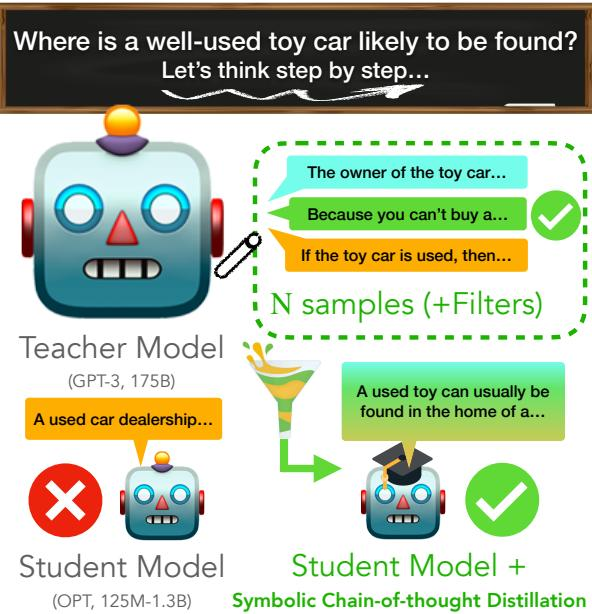
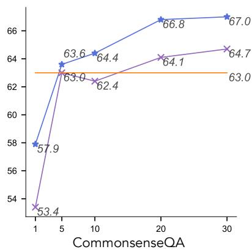
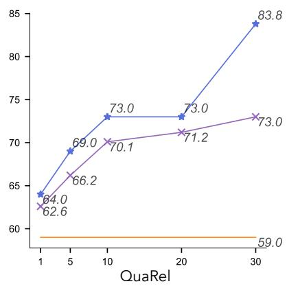
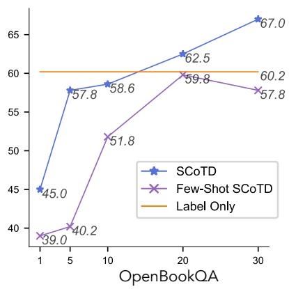
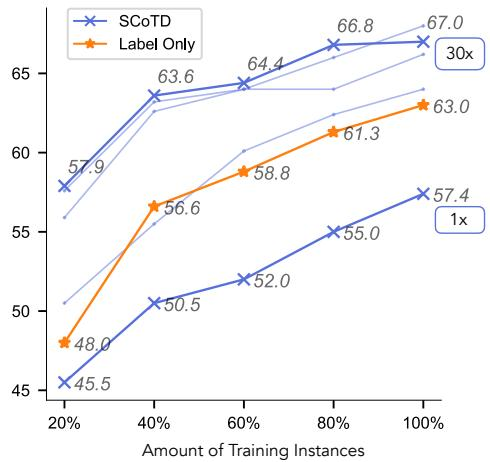
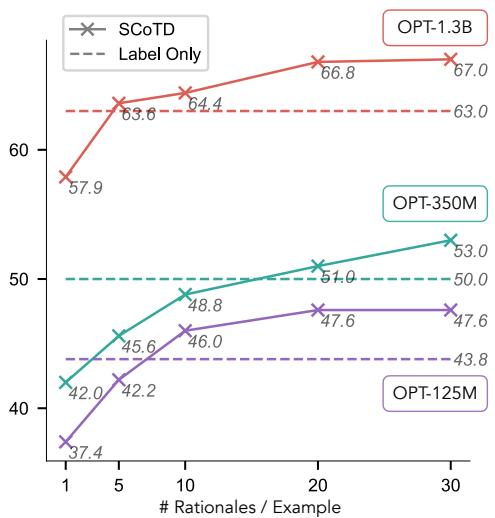
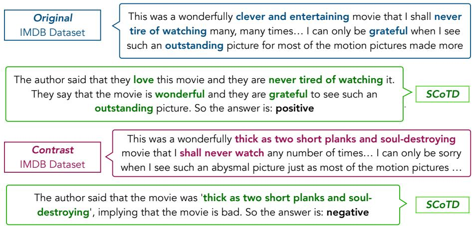
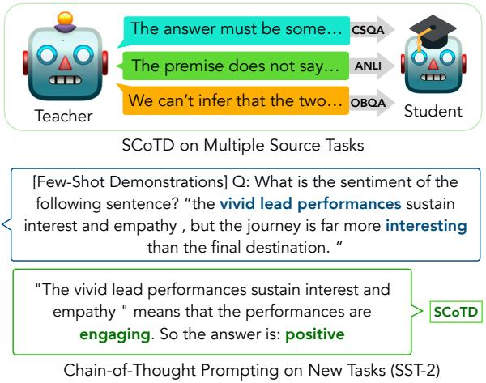
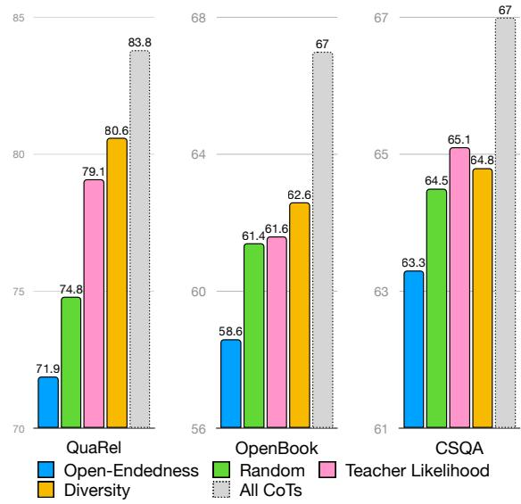
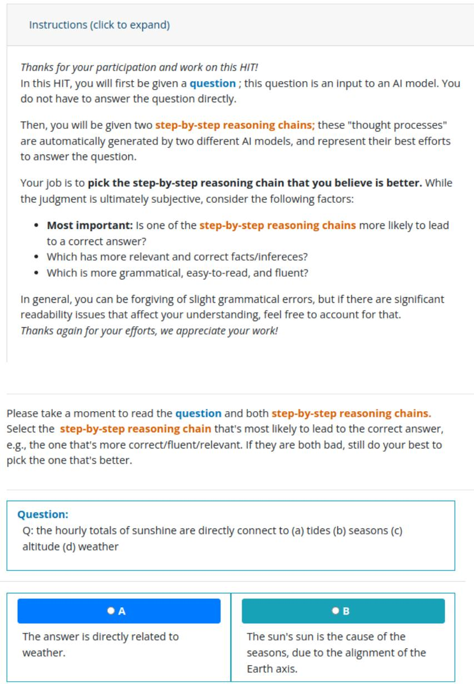

# Symbolic Chain-of-Thought Distillation: Small Models Can Also “Think” Step-by-Step

Liunian Harold Li∗†, Jack Hessel♣, Youngjae Yu♢, Xiang Ren◦, Kai-Wei Chang† & Yejin Choi♣♡

†University of California, Los Angeles, ♣Allen Institute for Artificial Intelligence ◦University of Southern California, ♢ Yonsei University, ♡University of Washington

## Abstract

Chain-of-thought prompting (e.g., “Let’s think step-by-step") primes large language models to verbalize rationalization for their predictions. While chain-of-thought can lead to dramatic performance gains, benefits appear to emerge only for sufficiently large models (beyond 50B parameters). We show that ordersof-magnitude smaller models (125M—1.3B parameters) can still benefit from chain-ofthought prompting. To achieve this, we introduce Symbolic Chain-of-Thought Distillation (SCoTD), a method to train a smaller student model on rationalizations sampled from a sig nificantly larger teacher model. Experiments across several commonsense benchmarks show that: 1) SCoTD enhances the performance of the student model in both supervised and few-shot settings, and especially for challenge sets; 2) sampling many reasoning chains per instance from the teacher is paramount; and 3) after distillation, student chain-of-thoughts are judged by humans as comparable to the teacher, despite orders of magnitude fewer parameters. We test several hypotheses regarding what properties of chain-of-thought samples are important, e.g., diversity vs. teacher likelihood vs. open-endedness. We release our corpus of chain-of-thought samples and code.

## 1 Introduction

Empirical scaling laws suggest that the accuracy of Large Language Models (LLMs) on benchmark tasks can be improved by increasing model size and pre-training data volume (Hoffmann et al., 2022). Beyond these training-time improvements, however, an inference-time strategy dubbed “chain-ofthought" (CoT) prompting,1 i.e., eliciting verbalizations of predictive processes via key-phrases like “Let’s think step-by-step" (Kojima et al., 2022), can similarly improve performance, e.g., Suzgun et al. (2022) demonstrate additional performance gains on a hard subset of the BigBench tasks (BIG-bench collaboration, 2022) using chain-of-thought.

  
Figure 1: Symbolic Chain-of-thought Distillation (SCoTD) applied to a student model, ranging in size from 125M–1.3B parameters. We show that fine-tuning on a (diverse and potentially filtered) corpus of expert chain-of-thought demonstrations from a teacher model is an effective strategy to make smaller models capable of chain-of-thought reasoning.

However, chain-of-thought prompting has only been shown to be beneficial for models of sufficient scale (e.g., with more than 60B parameters (Wei et al., 2022b)). In this work, we study whether small language models can be “taught" the capacity for chain-of-thought reasoning by larger language models. We adopt a simple strategy, which we call Symbolic Chain-of-thought Distillation (SCoTD): first, we sample chain-of-thought rationales from large language model given (unlabeled) input instances from a dataset; then, we train a smaller language model to predict the sampled rationale and sampled label. This process follows the “symbolic knowledge distillation” paradigm as in West et al. (2022), wherein corpora are sampled from a larger language model to serve as training data for a smaller one.

<table><tr><td>CommonsenseQA: Q: The man working in the attic swatted away a bee, but soon the single bee was an entire what? (a) swarm; (b) pack; (c) countryside; (d) soft drink; (e) field of flowers</td><td>GPT-3: The answer must be related to bees, but also connected with being numerous. Of the above answers, only swarm fits the scenario. So the answer is: (a) OPT-1.3B: The answer must be a swarm of bees. Of the above choices, only soft drink is used to describe a swarm of bees. So the answer is: (c) OPT-1.3B + SCoTD: The answer must be the name of something that has bees. Of the above choices, only swarms have bees. So the answer is: (a)</td></tr><tr><td>QuaRel: Q: Steve is waiting at the gym ... He starts hitting around a hockey puck with his stick. The gym has a carpeted floor and more friction than the ice rink he goes to. Which surface is rougher? (Å) carpet (B) ice rink</td><td>GPT-3: When something is smoother, it is easier to slide on and easier to pass through. So the carpet is rougher. So the answer is: (A) OPT-1.3B: is rougher than carpet. Thus, the gym floor is rougher than the ice rink. So the answer is: (A)  $O P T _ { - } I . 3 B + S C o T D \mathrm { : }$  When something is rougher, it has more friction. Thus, the gym has more friction than the ice rink he goes to. So the answer is: (A)</td></tr><tr><td>OpenBookQA: Q: Magnets may be attracted to (a) clay pots (b) roofing nails (c) paper plates (d) plastic cutlery</td><td>GPT-3: Magnets are attracted to metal objects. These objects include roofing nails. So the answer is: (b) OPT-1.3B: Magnets are attracted to clay pots, roofing nails, paper plates, plastic cutlery. So the answer is: (d)  $O P T _ { - } I . 3 B + S C o T D \mathrm { : }$  Magnets may be attracted to some metals, but not to clay pots,</td></tr></table>

Table 1: Few-shot chain-of-thoughts produced by GPT-3 (code-davinci-002, the teacher model), OPT-1.3B (the un-distilled student model), and $O P T - l . 3 B + S C o T D$ (ours), the student model trained using Symbolic Chainof-thought Distillation. §3 shows this process significantly improves the task-accuracy of the student model in a variety of settings, and in §3.1.1, human evaluations show that, even when the un-distilled student model happens to get the multiple choice question correct (see QuaRel example), humans tend to prefer $O P T - l . 3 B + S C o T D$

We find that through SCoTD, smaller language models learn to self-rationalize and perform significantly better on 3 commonsense QA tasks compared to learning without rationalizations. This result holds for both supervised and few-shot settings, and across student models of varying scales (125M– 1.3B parameters). Performance gains are especially pronounced when applying distilled chain-ofthought models to difficult scenarios like: contrast sets (Gardner et al., 2020) (§3.4; SCoTD significantly outperforms supervised learning on labels) and fully held-out tasks (§3.5; few-shot SCoTD significantly outperforms in-context learning).

Key to the success of this process is sampling a relatively large number of rationales per example from the teacher model (e.g., 30 rationales/example) (Figure 2). This is different from many prior practices that train with one rationale per example (Camburu et al., 2018; Li et al., 2022a). In ablation studies, we investigate several competing hypotheses for what are the most important factors within the corpus: we filter the corpus to CoTs that are assigned high probability by GPT-3 vs. filtering to CoTs that are diverse vs. filtering to CoTs that explain more open-ended input instances.

While diversity and high probability are reasonable filters that on average perform well, the “null hypothesis” of random downsampling performs well, suggesting that the sheer volume of the rationales is also a key contributing factor.

We will release code and the corpus of sampled chain-of-thoughts at https://github.com/ allenai/cot\_distillation.

## 2 Symbolic Chain-of-Thought Distillation

Our primary goal is to improve the accuracy of a (relatively small) student language model on a target classification2 task $\begin{array} { r } { \mathcal { D } _ { \mathrm { T e s t } } = \{ ( x _ { i } , y _ { i } ) \} . } \end{array}$ .3 We assume access to 1) (an unlabeled) training set $\mathcal { D } _ { \mathtt { T r a i n } } = \{ ( x _ { i } ) \}$ ; and 2) a large teacher language model (e.g., GPT-3 (Brown et al., 2020)), capable of generating chain-of-thoughts in a few-shot fashion.

Our first step is to curate a set of labeled chainof-thoughts to serve as few-shot rompts for $\tau$ For each target task, we sample a small number (e.g., 10) of examples $x _ { i }$ from $\mathcal { D } _ { \mathtt { T r a i n } } ,$ provide a gold classification label $y _ { i }$ , and manually author a chain-of-thought $z _ { i }$ for each to form the prompt set $\mathcal { P } = \{ ( x _ { i } , y _ { i } , z _ { i } ) \} ^ { 4 }$

Then, for each $x _ { i }$ in $\mathcal { D } _ { \mathtt { T r a i n } }$ , we sample N chainof-thoughts $\tilde { z } _ { i }$ along with the resulting prediction $\tilde { y } _ { i }$ from the teacher model, i.e.,

$$
( \tilde { y } _ { i } ^ { k } , \tilde { z } _ { i } ^ { k } ) \sim _ { N } \mathcal { T } ( y _ { i } , z _ { i } | x _ { i } , \mathcal { P } ) .
$$

The result of this sampling is a corpus $\begin{array} { r l } { \mathcal { C } } & { { } = } \end{array}$ $\{ ( x _ { i } , \{ ( \tilde { y } _ { i } ^ { k } , \tilde { z } _ { i } ^ { k } ) \} _ { k = 1 } ^ { N } ) \}$ which contain teacherpredicted chain-of-thoughts/labels. Depending on the experimental setting (details in § 3), we sometimes filter the entries of , e.g., in the fully supervised case where $\mathcal { D } _ { \mathtt { T r a i n } }$ instances have associated labels, we discard samples for which the sample the teacher model predicted an incorrect label. Next, we train the student model using the standard language modeling loss, i.e., we maximize

$$
E _ { ( x , \tilde { y } , \tilde { z } ) \sim \mathcal { C } } [ S ( \tilde { y } , \tilde { z } | x ) ] .
$$

After fine-tuning the student model on the corpus sampled from the teacher, to evaluate the model on a test instance $( x _ { t e s t } , y _ { t e s t } )$ from the target task, we decode both a chain-of-thought $\tilde { z } _ { t e s t }$ and a predicted label $\tilde { y } _ { t e s t }$ from the student and evaluate $\tilde { y } _ { t e s t }$ versus the true label $y _ { t e s t }$ . We consider two strategies for decoding. (1) Predict the most likely chain-of-thought and the label $\tilde { z } _ { t e s t } , \tilde { y } _ { t e s t } \ = \ \mathrm { a r g m a x } _ { z , y } S ( z , y | x _ { t e s t } )$ . This can be approximated by greedy decoding or beam search. (2) There may be different valid chainof-thoughts for a given question and as a result, large language models distribute probability mass for a certain label across many diverse chain-of-thoughts (Wang et al., 2022b). Thus, it is beneficial to marginalize out the reasoning paths to find the most consistent answer: $\begin{array} { r } { \tilde { y } _ { t e s t } = \mathrm { a r g m a x } _ { y } E _ { z \sim  { \mathcal S } ( z | x _ { t e s t } ) } {  { \boldsymbol S } } ( y | z , x _ { t e s t } ) } \end{array}$ . This can be approximated by sampling multiple reasoning paths and take a majority vote among the predicted answers, dubbed “self-consistency” (Wang et al., 2022b). We experiment with both approaches and conduct a discussion in §3.2.

## 3 Experiments

We evaluate primarily on 3 target tasks: 1) CommonsenseQA (CSQA) (Talmor et al., 2019), a 5- way multi-choice dataset; 2) OpenBookQA (Mihaylov et al., 2018), and 3) QuaRel (Tafjord et al., 2019). While any model capable of few-shot chain-of-thought could be substituted, we use the code-davinci-002 version of $\mathrm { G P T } { \cdot } 3 ^ { 5 }$ (Brown et al., 2020) as our teacher model . We use OPT (Zhang et al., 2022) as our student model . Our standard student model is OPT-1.3B (though we explore a range of student model sizes in §3.3).

<table><tr><td>Model</td><td>CoT</td><td>CSQA</td><td>QuaRel</td><td>OpenBookQA</td></tr><tr><td rowspan="3">GPT3-175B</td><td>No CoT</td><td>82.1</td><td>86.9</td><td>83.4</td></tr><tr><td>Greedy</td><td>77.6</td><td>83.3</td><td>71.8</td></tr><tr><td>Self-Consistency</td><td>81.3</td><td>86.0</td><td>86.4</td></tr><tr><td rowspan="3">OPT-1.3B</td><td>No CoT</td><td>20.5</td><td>9.7</td><td>2.8</td></tr><tr><td>Greedy</td><td>17.9</td><td>39.6</td><td>12.6</td></tr><tr><td>Self-Consistency</td><td>21.1</td><td>48.2</td><td>22.2</td></tr><tr><td>Random</td><td></td><td>20.0</td><td>50.0</td><td>25.0</td></tr></table>

(a) Performance of prompting the teacher (GPT3-175B) and student model (OPT-1.3B, before distillation). The student fails to outperform the random guess baseline.

<table><tr><td>Labeled Data</td><td>CoT</td><td>CSQA</td><td>QuaRel</td><td>OpenBookQA</td></tr><tr><td rowspan="3">Few-Shot</td><td>Label-Only</td><td>62.7</td><td>65.6</td><td>59.8</td></tr><tr><td>Greedy-CoT</td><td>64.6</td><td>64.7</td><td>48.8</td></tr><tr><td>SCoTD</td><td>64.7</td><td>73.0</td><td>57.8</td></tr><tr><td rowspan="3">Full</td><td>Label-Only</td><td>63.0</td><td>59.0</td><td>60.2</td></tr><tr><td>Greedy-CoT</td><td>68.2</td><td>71.2</td><td>50.0</td></tr><tr><td>SCoTD</td><td>67.0</td><td>83.8</td><td>67.0</td></tr></table>

(b) Performance of the the student model after distillation.  
Table 2: Performance before (a) and after (b) SCoTD.

We sample from GPT-3 with a temperature of $T = 1 . 0$ . For each training example, we sample N = 30 rationales. OPT is fine-tuned with a batch size of 32 and a learning rate of $2 \times 1 0 ^ { - 5 }$ . We use HuggingFace transformers (Wolf et al., 2019), Pytorch (Paszke et al., 2019), and $\mathbf { A c c e l e r a t e } ^ { 6 }$ for the implementation. Main experiments can be reproduced on one GPU with 48GB of memory.

## 3.1 Results in Default SCoTD Setting

We first consider both a few-shot learning setting and a supervised setting. For the few-shot setting, the only labeled examples available to our teacher/student models are contained in the prompt set $\mathcal { P }$ (but we use the unlabeled examples and teacher-generated chain-of-thoughts/labels for training).7 We also consider the supervised setting, where we assume access to labels in $\mathcal { D } _ { \mathtt { T r a i n } }$ . Supervised SCoTD involves simply discarding the samples within that do not have the correct label prior to fine-tuning the student: for CommonsenseQA, OpenBookQA, and QuaRel, this results in discarding 40.4%, 45.0%, 34.2% of chain-ofthoughts. For the few-shot setting, we decode with the self-consistency approach; for the supervised setting, we decode with greedy decoding (introduced in § 2; see an discussion in § 3.2).

  
Figure 2: For three commonsense QA tasks, accuracy (y-axis) improves significantly as the student is trained on more chain-of-thoughts sampled from the teacher (x-axis). Oversampling chain-of-thoughts is sometimes required to improve student performance beyond the supervised label-only baseline, e.g., as in OpenbookQA.

We compare SCoTD to 2 baselines: 1) Label-Only, the student is fine-tuned on just the label (in the few-shot setting, the label comes from the teacher and could be wrong; in the supervised setting, we use the gold label), instead of also with CoT; 2) Greedy-CoT, we decode a single-CoT per example (instead of N = 30 samples) from T for each training example instead of sampling. For additional reference, Table 2 (a) reports the performance of the student (and teacher) in a variety of few-shot settings prior to applying any distillation: No CoT = few shot prompting with labeled instances from but no $z _ { i } ,$ Greedy and Self-Consistency are prompting with CoT but with different decoding strategies (§ 2).

Table 2 (b) gives the performance of the student model after distillation in the supervised and fewshot settings. In all cases, distillation significantly improves the student model, and in all-but-one case, learning with CoT outperforms the label-only distillation baseline. While the student model initially fails to perform CoT through prompting (Table 2 (a)) it learns to do so through distillation.

The number of samples. In our default setting, to serve as our distillation corpus , we sample N = 30 rationales from the teacher for each (unlabelled) training instance. Figure 2 shows the performance of the student model when it is trained on corpora with fewer sampled CoT per instance:

results suggest that learning with multiple sampled (albeit nosier) rationales/chain-of-thoughts per example is more beneficial than learning with one (most likely) rationale. Will more rationales bring more performance improvement? We sampled more rationales from GPT-3 to train the student model; however, this does not bring more performance gains. When N = 50, the performance is similar to N = 30: the model achieves 67.0 in accuracy on OpenBookQA (v.s. 67.0), 67.2 on CommonsenseQA (v.s. 67.0), 84.9 on QuaRel (v.s. 83.8).

## 3.1.1 Human Evaluations

While SCoTD improves task accuracy significantly, we additionally conduct human evaluations to assess the generated chain-of-thoughts themselves (see Table 1 for samples). We sample instances from the CommonsenseQA, OpenBookQA, and QuaRel validation sets (300 instances per dataset), and conduct head-to-head human evaluations8 to assess:

Q1: Does SCoTD result in higher-quality chainof-thoughts? Test: OPT-1.3B versus OPT-1.3B + SCoTD. Result: Yes. We assess this hypothesis on two subsets of instances: 1) a pure random sample (N=900); and 2) a set of instances for which both models eventually predicted the correct label (N=654). The second setting focuses more closely on the chain-of-thoughts themselves rather than the predictive accuracy of the model. SCoTD is superior in both settings: for the random sample setting, SCoTD won in 59% of cases (p<.001), whereas in the correctness controlled setting, SCoTD won in 61% of cases (p<.001). Results hold with p < .05 for each QA dataset individually.

<table><tr><td>Model</td><td>Self-Consistency</td><td>CSQA</td><td>QuaRel</td><td>OpenBookQA</td></tr><tr><td rowspan="2">Few-Shot SCoTD</td><td>No</td><td>60.2</td><td>73.4</td><td>44.4</td></tr><tr><td>Yes</td><td>64.7 (+4.5)</td><td>73.0 (-0.4)</td><td>57.8 (+13.4)</td></tr><tr><td rowspan="2">SCoTD</td><td>No</td><td>67.0</td><td>83.8</td><td>65.8</td></tr><tr><td>Yes</td><td>66.8 (-0.2)</td><td>83.8 (-0.0)</td><td>63.6 (-2.2)</td></tr></table>

(a) Self-consistency is most helpful under the few-shot setting, where we train with unfiltered and noisy CoTs.
<table><tr><td rowspan="2">Dataset</td><td rowspan="2">Self-Consistency</td><td colspan="5">#Rationales/Example</td></tr><tr><td>1</td><td>5</td><td>10</td><td>20</td><td>30</td></tr><tr><td rowspan="2">CSQA</td><td>No</td><td>53.0</td><td>58.3</td><td>59.1</td><td>60.0</td><td>60.2</td></tr><tr><td>Yes</td><td>53.4 (+0.4)</td><td>63.0 (+4.7)</td><td>62.4 (+3.3)</td><td>64.1 (+4.1)</td><td>64.7 (+4.5)</td></tr><tr><td rowspan="2">QuaRel</td><td>No</td><td>62.2</td><td>68.7</td><td>69.8</td><td>70.9</td><td>73.4</td></tr><tr><td>Yes</td><td>62.6 (+0.4)</td><td>66.2 (-2.5)</td><td>70.1 (+0.3)</td><td>71.2 (+0.3)</td><td>73.0 (-0.4)</td></tr><tr><td rowspan="2">OpenBookQA</td><td>No</td><td>39.0</td><td>40.2</td><td>40.6</td><td>43.2</td><td>44.4</td></tr><tr><td>Yes</td><td>38.0 (-1.0)</td><td>37.6 (-2.6)</td><td>51.8 (+11.2)</td><td>59.8 (+16.6)</td><td>57.8 (+13.4)</td></tr></table>

(b) Performance of Few-Shot SCoTD with different numbers of sampled CoTs. Benefit of “self-consistency” is most prominent when training with multiple rationales per example on CSQA and OpenBookQA.  
Table 3: Student performance with and without selfconsistency.

Q2: Does a SCoTD student surpass the much larger teacher? Test: OPT-1.3B + SCoTD versus text-davinci-002. While the task accuracy of the teacher is still higher in most cases, the studentgenerated CoT are comparable.9 We again evaluate on: 1) a pure random sample (N=900); and 2) a correctness-controlled setting (N=659). The 100x smaller SCoTD’s generations are competitive in both cases; we can’t reject the null hypothesis of the crowd having equal preferences (OPT-1.3B + SCoTD wins in 47% and 51% of cases respectively, p > .01). Results hold for each dataset individually, as well.

## 3.2 Self-Consistency for the Student

Wang et al. (2022b) find that, for chain-of-thought prompted models, taking a majority vote over a large set of sample of predicted labels (resulting from a diverse range of CoTs) can improve performance. Our results regarding the effectiveness of sampling N = 30 rationales from the teacher during SCoTD are similar-in-spirit: i.e., we also show performance gains from sampling multiple rationalization chains per instance.

  
Figure 3: Performance on CSQA with different amount of training instances, from using only 20% of the x from $\mathcal { D } _ { \mathtt { T r a i n } }$ to using the full set (X-axis). Orange line is the Label Only baseline. Bottom blue line (marked with 1x) is SCoTD but with only 1 sampled rationale per instance; above are SCoTD with 5, 10, 20, 30 sampled rationales per instance, respectively.

A natural question is, does the student model exhibit the same phenomenon, i.e., can we sample multiple chain-of-thoughts from it and take a majority vote? We find that the student model can benefit from “self-consistency,” but not in all cases. In Table 3, we report the performance with/without self-consistency (majority vote among 30 sampled reasoning paths with a temperature of 0.7). When training with filtered CoTs (Table 3 (a) bottom rows) or training with few CoTs per example (Table 3 (b), when #CoTs/Example is small), the student model does not benefit from self-consistency. Only when we train with multiple rationales per example without filtering (the few-shot setting), self-consistency is beneficial on CSQA and Open-BookQA. Overall, the results show that student models benefit from being shown a diverse/noisy set of rationales, and that self-consistency can be effectively applied after distillation.

## 3.3 SCoTD across Model and Dataset Sizes

We also verify the effectiveness of SCoTD across model and dataset sizes; in these experiments, we consider the supervised setting.

Data scaling. Figure 3 shows the effect of varying the size of $\mathcal { D } _ { \mathtt { T r a i n } }$ (for simplicity, we show only performance on CSQA as an example). Learning with CoTs is beneficial under all data scales. Interestingly, SCoTD, trained with access to only 40% of the labelled data, can surpass the direct supervised label-only model with 100% of the labelled corpus; this result aligns with the argument in Zaidan et al. (2007) – providing more explanations from the teacher model could be more beneficial than providing more labels.

  
Figure 4: Performance on CSQA with three different model sizes.

Student model size scaling. Figure 4 presents results when varying the size of the student model from 125M to 1.3B parameters for CSQA. For all model three model sizes, SCoTD outperforms the standard supervised fine-tuning baseline (Label Only). Sampling multiple rationales per input instance is an effective strategy for all model sizes.

## 3.4 SCoTD on Challenging Contrast Sets

Can learning with explanations help generalization, as hypothesized by (Zaidan et al., 2007)? As a preliminary study, we show that SCoTD enables better generalization to contrast sets. Contrast sets (Gardner et al., 2020) are proposed to evaluate a model’s robustness to perturbations around the decision boundary, by asking annotators to modify the original test instances in small but meaningful ways that (typically) change the gold label.

We experiment on the IMDB (Maas et al., 2011) sentiment analysis task in the supervised setting; we consider the corresponding contrast set of IMDB proposed by Gardner et al. (2020). We train two models on the training set of IMDB: Label-Only and SCoTD. For efficiency, we sub-sample 100K examples from the training set of IMDB and truncate input sequences to 700 tokens. As shown in Figure 5, while both models with/without SCoTD achieve high performance on the original

IMDB test set (96.1% v.s. 95.5%, with the Label-Only model performing slightly better), the model with SCoTD achieves significantly higher performance on the contrast set: 92.0% vs. 81.6%. This result supports the hypothesis of (Zaidan et al., 2007); that explanations can support more robust generalization.

## 3.5 SCoTD on Unseen, Out-of-domain Tasks

Large language models can perform few-shot, incontext learning with chain-of-thought prompting, i.e., generating reasonable chain-of-thoughts on unseen tasks with a few demonstrations (Suzgun et al., 2022). We conduct a preliminary experiment, inspired by Min et al. (2021)’s MetaICL, to test whether student models trained with SCoTD acquire the same ability. We train a supervised SCoTD model on ANLI, CommonsenseQA, and OpenBookQA, and evaluate it on SST-2 (Socher et al., 2013), a sentiment analysis task.

The SCoTD model achieves a few-shot accuracy of 79.6% on the validation set (an example prediction is shown in Figure 6).10 Compared to a baseline model that learns with no CoT(i.e., a re-implementation of MetaICL trained on 3 source tasks); the baseline fails to recognize the input/output format of the new task and predicts answers out of the desired label set. It achieves (an effective) 0% accuracy on SST-2. This suggests the potential of including CoTs during instruction/incontext tuning (Wei et al., 2022a; Min et al., 2021).

## 4 What Factors are Important for Distillation?

An important factor underlying the performance gains highlighted in §3 was the number of chain-ofthoughts we sampled from the teacher model perinstance (more samples = better; Figure 2). Here we ask: is data volume the key contributing factor to the performance improvement? Or, are specific aspects of chain-of-thought samples key for the performance improvements?

We design several filters to identify potentially important examples/CoTs among the correct rationales. We apply designed filters (to be introduced) to ′, the corpus sampled from the teacher (with wrong CoTs dropped), that operationalize different hypotheses about what factors are important to distill. We control for dataset size when filtering, i.e., all filtered corpora have the same number of training CoTs. We downsample with a budget of 5 CoT per instance on average11. Then, we train the same student model on each of the filtered corpora, and compare on downstream tasks. If a student model trained on filtered corpus A tends to outperform the student model trained on filtered corpus B, then we argue that the property that produced corpus A is more important. The hypotheses we consider are:

  
Figure 5: Performance of SCoTD vs. label only supervision on the original and contrast IMDB dataset, along with sample predictions from SCoTD.

  
Figure 6: Schematic of SCoTD models transferring from training tasks (CSQA, ANLI, OBQA) to unseen tasks (SST-2).

Null hypothesis: data volume. As a null hypothesis, we randomly sub-sample 5 CoT per instance; this filter operationalizes the assumption that an arbitrary set of samples is sufficient.

Diversity. For each instance, we compute S-BERT (Reimers and Gurevych, 2019) embeddings12 of each of the chain-of-thoughts, and cluster the resulting embeddings using hierarchical clustering into k = 5 clusters. Then, we randomly sample a single instance from each cluster: the resulting sample covers all clusters, and thus represents a diverse+representative sample.

  
Figure 7: Downsampling ablations: we subset our chainof-thought distillation corpus with a fixed budget according to different criteria. In general, keeping a diverse set of rationales performs well, though a random sample often performs well too.

Teacher likelihood. For each instance, we keep the 5 CoT samples with the highest per-token loglikelihood according to the teacher model.

Open-endedness. Some instances in each dataset lead to a broader range of chain-of-thought samples than others. For example, on CommonsenseQA, the question “What form of alcohol is made from grapes?" leads to a narrower range of rationalizations vs. “Why might someone purposefully be going into trance?" We hypothesize that openended instances could benefit from relatively more sampled rationales. We sort instances into quintiles based on the unique bi-grams in their corresponding 30 CoTs; for high-ranking instances (more unique CoT bi-grams, like the “trance" example above), we keep more rationales and for low-ranking instances, we keep less rationales. We keep 1, 3, 5, 7, 9 rationales for instances of different bins (thus controlling for the total number of CoT).

Results Figure 7 reports the accuracy of the student model when fine-tuned on the different subsampled corpora for the three tasks we consider. Overall, random subsampling is a strong baseline, but, we see some evidence that diversity among the rationales is important. None of the models trained on the sub-sampled data could approach the model trained on the full 30x/instance CoT set. This suggests that the sheer volume of the CoTs is a key driving force for the performance improvement.

## 5 Related Work

Chain-of-thought prompting. As an extension of few-shot prompting (Brown et al., 2020), chainof-thought has proven more generally applicable than algorithmic/structured reasoning for which intermediate step generation was initially studied, e.g., by Roy and Roth (2015); Ling et al. (2017); Chiang and Chen (2019); Nye et al. (2021). Recent studies seek to improve and analyze CoTs from different perspectives: Wang et al. (2022b) improves the original CoTs through marginalizing over diverse reasoning paths while Wang et al. (2022a) marginalize over diverse prompts; Zelikman et al. (2022); Huang et al. (2022) improves CoT through a bootstrap manner of training on self-generated CoTs; Li et al. (2022b) introduce voting classifiers to filter sampled CoTs before final prediction; Golovneva et al. (2022) introduce some automatic metrics for automatic assessment of chain-of-thoughts. This study instead focuses on enabling CoT for smaller models via distillation.

Learning with explanations. Hase and Bansal (2022) discuss how explanations can serve as inputs (Talmor et al., 2020), targets (Hendricks et al.,

2016; Fidler et al., 2017; Camburu et al., 2018; Zhou et al., 2020; Narang et al., 2020; Kayser et al., 2021; Wiegreffe et al., 2022), and priors (Zhang et al., 2016; Srivastava et al., 2018) for machine learning models. Chain-of-thought extends earlier efforts which treat explanations as intermediate structures, generated at inference time (Rajani et al., 2019). Most related to our work is Li et al. (2022a), who do also learn with GPT-3 generated explanations; we show multiple samples improve significantly over their single-sample method, and also use chain-of-thought prompting at inference time vs. predicting explanations+labels via independent multitasking.

Knowledge distillation. Recent work, inspired by Knowledge Distillation (Hinton et al., 2015), has considered symbolic knowledge distillation, (West et al., 2022), i.e., instead of distilling from soft representations like logits, large language model serve as training data generators (Xiong et al., 2019; Petroni et al., 2019; Schick and Schütze, 2021; West et al., 2022; Liu et al., 2022; Meng et al., 2022; Bhagavatula et al., 2022); this paper continues this line of work.

Contemporaneous work. There are several contemporaneous papers: Huang et al. (2022), Magister et al. (2022), and Ho et al. (2022) all show that smaller models can benefit from large models chains of thought. We contributes beyond these by: 1) showing that sampling a large number of chain-of-thoughts is paramount; 2) exploring transfer performance to challenge sets/unseen tasks; and 3) analysis that address what factors are important in the teacher corpus.

## 6 Conclusion

We demonstrate the effectiveness of Symbolic Chain-of-thought Distillation (SCoTD): a method that enables smaller language models to effectively use chain-of-thought-style reasoning. We demonstrate the method’s effectiveness across several downstream tasks, different student model sizes, different levels of supervision, and in difficult settings (challenge sets, unseen tasks). Our ablations shed light on what factors are particularly important to distill in these chain-of-thoughts.

Our concrete recommendations are: 1) sampling multiple and diverse CoTs for each input instance, and 2) performing self-consistency when the teacher CoTs are noisy. Several promising avenues for future work include:

1. Exploring SCoTD for generation tasks in addition to classification tasks;

2. Scaling up the number of source tasks in § 3.5 to generalize to more tasks;

3. Using the down-sampling setup introduced in §4 to explore additional hypotheses about what other factors may be of importance in CoTs.

## Limitations

Several limitations of our study include:

1. only English-language chain-of-thoughts/tasks considered;

2. reliance on GPT-3, which is a closed-source product with an unknown training set (which could itself include some explanations); and

3. focusing only on a single type of student model, OPT.

More broadly, learning from and with explanations carries some specific risks related to automation bias. While a model might rationalize its predictions using a seemingly coherent string of natural language steps, even if it eventually gets the prediction correct, there’s no guarantee that the eventually predicted output actually results from a process represented by the rationalization. A user might assign excessive confidence to that system based on the chain-of-thought. We observed many cases where the chain of thought seemed promising only to result in models ultimately making incorrect predictions in the final few tokens. Caution should be taken when displaying chain-of-thoughts to users.

## Acknowledgment

We thank anonymous reviewers for their comments. This work is supported in part by the DARPA MCS program, NCSOFT NLP Center and a Sloan research fellowship.

## References

Chandra Bhagavatula, Jena D Hwang, Doug Downey, Ronan Le Bras, Ximing Lu, Keisuke Sakaguchi, Swabha Swayamdipta, Peter West, and Yejin Choi. 2022. I2d2: Inductive knowledge distillation with neurologic and self-imitation. arXiv preprint arXiv:2212.09246.

BIG-bench collaboration. 2022. Beyond the imitation game: Measuring and extrapolating the ca-

pabilities of language models. arXiv preprint arXiv:2206.04615.

Tom Brown, Benjamin Mann, Nick Ryder, Melanie Subbiah, Jared D Kaplan, Prafulla Dhariwal, Arvind Neelakantan, Pranav Shyam, Girish Sastry, Amanda Askell, Sandhini Agarwal, Ariel Herbert-Voss, Gretchen Krueger, Tom Henighan, Rewon Child, Aditya Ramesh, Daniel Ziegler, Jeffrey Wu, Clemens Winter, Chris Hesse, Mark Chen, Eric Sigler, Mateusz Litwin, Scott Gray, Benjamin Chess, Jack Clark, Christopher Berner, Sam McCandlish, Alec Radford, Ilya Sutskever, and Dario Amodei. 2020. Language models are few-shot learners. In Advances in Neural Information Processing Systems.

Oana-Maria Camburu, Tim Rocktäschel, Thomas Lukasiewicz, and Phil Blunsom. 2018. e-snli: Natural language inference with natural language explanations. Advances in Neural Information Processing Systems, 31.

Ting-Rui Chiang and Yun-Nung Chen. 2019. Semantically-aligned equation generation for solving and reasoning math word problems. NAACL.

Sanja Fidler et al. 2017. Teaching machines to describe images with natural language feedback. Advances in Neural Information Processing Systems, 30.

Matt Gardner, Yoav Artzi, Victoria Basmova, Jonathan Berant, Ben Bogin, Sihao Chen, Pradeep Dasigi, Dheeru Dua, Yanai Elazar, Ananth Gottumukkala, et al. 2020. Evaluating models’ local decision boundaries via contrast sets. Findings ofEMNLP.

Olga Golovneva, Moya Chen, Spencer Poff, Martin Corredor, Luke Zettlemoyer, Maryam Fazel-Zarandi, and Asli Celikyilmaz. 2022. ROSCOE: A suite of metrics for scoring step-by-step reasoning. arXiv preprint arXiv:2212.07919.

Peter Hase and Mohit Bansal. 2022. When can models learn from explanations? a formal framework for understanding the roles of explanation data. LNLS 2022, page 29.

Lisa Anne Hendricks, Zeynep Akata, Marcus Rohrbach, Jeff Donahue, Bernt Schiele, and Trevor Darrell. 2016. Generating visual explanations. In ECCV.

Geoffrey Hinton, Oriol Vinyals, and Jeff Dean. 2015. Distilling the knowledge in a neural network. stat, 1050:9.

Namgyu Ho, Laura Schmid, and Se-Young Yun. 2022. Large language models are reasoning teachers.

Jordan Hoffmann, Sebastian Borgeaud, Arthur Mensch, Elena Buchatskaya, Trevor Cai, Eliza Rutherford, Diego de Las Casas, Lisa Anne Hendricks, Johannes Welbl, Aidan Clark, Tom Hennigan, Eric Noland, Katie Millican, George van den Driessche, Bogdan Damoc, Aurelia Guy, Simon Osindero, Karen Simonyan, Erich Elsen, Jack W. Rae, Oriol Vinyals, and Laurent Sifre. 2022. Training compute-optimal large language models. arXiv preprint arXiv:2203.15556.

Jiaxin Huang, Shixiang Shane Gu, Le Hou, Yuexin Wu, Xuezhi Wang, Hongkun Yu, and Jiawei Han. 2022. Large language models can self-improve. arXiv preprint arXiv:2210.11610.

Maxime Kayser, Oana-Maria Camburu, Leonard Salewski, Cornelius Emde, Virginie Do, Zeynep Akata, and Thomas Lukasiewicz. 2021. E-vil: A dataset and benchmark for natural language explanations in vision-language tasks. In Proceedings ofthe IEEE/CVF International Conference on Computer Vision (ICCV), pages 1244–1254.

Takeshi Kojima, Shixiang Shane Gu, Machel Reid, Yutaka Matsuo, and Yusuke Iwasawa. 2022. Large language models are zero-shot reasoners. Advances in Neural Information Processing Systems.

Shiyang Li, Jianshu Chen, Yelong Shen, Zhiyu Chen, Xinlu Zhang, Zekun Li, Hong Wang, Jing Qian, Baolin Peng, Yi Mao, et al. 2022a. Explanations from large language models make small reasoners better. arXiv preprint arXiv:2210.06726.

Yifei Li, Zeqi Lin, Shizhuo Zhang, Qiang Fu, Bei Chen, Jian-Guang Lou, and Weizhu Chen. 2022b. On the advance of making language models better reasoners. arXiv preprint arXiv:2206.02336.

Wang Ling, Dani Yogatama, Chris Dyer, and Phil Blunsom. 2017. Program induction by rationale generation: Learning to solve and explain algebraic word problems. ACL.

Alisa Liu, Swabha Swayamdipta, Noah A Smith, and Yejin Choi. 2022. Wanli: Worker and ai collaboration for natural language inference dataset creation. arXiv preprint arXiv:2201.05955.

Andrew Maas, Raymond E Daly, Peter T Pham, Dan Huang, Andrew Y Ng, and Christopher Potts. 2011. Learning word vectors for sentiment analysis. In ACL.

Lucie Charlotte Magister, Jonathan Mallinson, Jakub Adamek, Eric Malmi, and Aliaksei Severyn. 2022. Teaching small language models to reason. arXiv preprint arXiv:2212.08410.

Yu Meng, Jiaxin Huang, Yu Zhang, and Jiawei Han. 2022. Generating training data with language models: Towards zero-shot language understanding. arXiv preprint arXiv:2202.04538.

Todor Mihaylov, Peter Clark, Tushar Khot, and Ashish Sabharwal. 2018. Can a suit of armor conduct electricity? a new dataset for open book question answering. In EMNLP.

Sewon Min, Mike Lewis, Luke Zettlemoyer, and Hannaneh Hajishirzi. 2021. MetaICL: Learning to learn in context. NAACL.

Sharan Narang, Colin Raffel, Katherine Lee, Adam Roberts, Noah Fiedel, and Karishma Malkan. 2020. Wt5?! training text-to-text models to explain their predictions. arXiv preprint arXiv:2004.14546.

Maxwell Nye, Anders Johan Andreassen, Guy Gur-Ari, Henryk Michalewski, Jacob Austin, David Bieber, David Dohan, Aitor Lewkowycz, Maarten Bosma, David Luan, Charles Sutton, and Augustus Odena. 2021. Show your work: Scratchpads for intermediate computation with language models.

Adam Paszke, Sam Gross, Francisco Massa, Adam Lerer, James Bradbury, Gregory Chanan, Trevor Killeen, Zeming Lin, Natalia Gimelshein, Luca Antiga, Alban Desmaison, Andreas Kopf, Edward Yang, Zachary DeVito, Martin Raison, Alykhan Tejani, Sasank Chilamkurthy, Benoit Steiner, Lu Fang, Junjie Bai, and Soumith Chintala. 2019. Pytorch: An imperative style, high-performance deep learning library. In Advances in Neural Information Processing Systems 32.

Fabio Petroni, Tim Rocktäschel, Sebastian Riedel, Patrick Lewis, Anton Bakhtin, Yuxiang Wu, and Alexander Miller. 2019. Language models as knowledge bases? In EMNLP-IJCNLP.

Nazneen Fatema Rajani, Bryan McCann, Caiming Xiong, and Richard Socher. 2019. Explain yourself! leveraging language models for commonsense reasoning. In ACL.

Nils Reimers and Iryna Gurevych. 2019. Sentence-BERT: Sentence embeddings using siamese bertnetworks. EMNLP-IJCNLP.

Subhro Roy and Dan Roth. 2015. Solving general arithmetic word problems. EMNLP.

Timo Schick and Hinrich Schütze. 2021. Generating datasets with pretrained language models. In EMNLP.

Richard Socher, Alex Perelygin, Jean Wu, Jason Chuang, Christopher D Manning, Andrew Y Ng, and Christopher Potts. 2013. Recursive deep models for semantic compositionality over a sentiment treebank. In EMNLP.

Shashank Srivastava, Igor Labutov, and Tom Mitchell. 2018. Zero-shot learning of classifiers from natural language quantification. In ACL.

Mirac Suzgun, Nathan Scales, Nathanael Schärli, Sebastian Gehrmann, Yi Tay, Hyung Won Chung, Aakanksha Chowdhery, Quoc V. Le, Ed H. Chi, Denny Zhou, and Jason Wei. 2022. Challenging big-bench tasks and whether chain-of-thought can solve them. arXiv preprint arXiv:2210.09261.

Oyvind Tafjord, Peter Clark, Matt Gardner, Wen-tau Yih, and Ashish Sabharwal. 2019. Quarel: A dataset and models for answering questions about qualitative relationships. In AAAI.

Alon Talmor, Jonathan Herzig, Nicholas Lourie, and Jonathan Berant. 2019. Commonsenseqa: A question answering challenge targeting commonsense knowledge. In NAACL-HLT.

Alon Talmor, Oyvind Tafjord, Peter Clark, Yoav Goldberg, and Jonathan Berant. 2020. Leap-of-thought: Teaching pre-trained models to systematically reason over implicit knowledge. Advances in Neural Information Processing Systems.

Xuezhi Wang, Jason Wei, Dale Schuurmans, Quoc Le, Ed Chi, and Denny Zhou. 2022a. Rationaleaugmented ensembles in language models. arXiv preprint arXiv:2207.00747.

Xuezhi Wang, Jason Wei, Dale Schuurmans, Quoc Le, Ed Chi, and Denny Zhou. 2022b. Self-consistency improves chain of thought reasoning in language models. arXiv preprint arXiv:2203.11171.

Jason Wei, Maarten Bosma, Vincent Y Zhao, Kelvin Guu, Adams Wei Yu, Brian Lester, Nan Du, Andrew M Dai, and Quoc V Le. 2022a. Finetuned language models are zero-shot learners. ICLR.

Jason Wei, Xuezhi Wang, Dale Schuurmans, Maarten Bosma, Ed Chi, Quoc Le, and Denny Zhou. 2022b. Chain of thought prompting elicits reasoning in large language models. Advances in Neural Information Processing Systems.

Peter West, Chandra Bhagavatula, Jack Hessel, Jena D Hwang, Liwei Jiang, Ronan Le Bras, Ximing Lu, Sean Welleck, and Yejin Choi. 2022. Symbolic knowledge distillation: from general language models to commonsense models. NAACL.

Sarah Wiegreffe, Jack Hessel, Swabha Swayamdipta, Mark Riedl, and Yejin Choi. 2022. Reframing human-ai collaboration for generating free-text explanations. NAACL.

Thomas Wolf, Lysandre Debut, Victor Sanh, Julien Chaumond, Clement Delangue, Anthony Moi, Pierric Cistac, Tim Rault, Rémi Louf, Morgan Funtowicz, Joe Davison, Sam Shleifer, Patrick von Platen, Clara Ma, Yacine Jernite, Julien Plu, Canwen Xu, Teven Le Scao, Sylvain Gugger, Mariama Drame, Quentin Lhoest, and Alexander M. Rush. 2019. Huggingface’s transformers: State-of-the-art natural language processing.

Wenhan Xiong, Jingfei Du, William Yang Wang, and Veselin Stoyanov. 2019. Pretrained encyclopedia: Weakly supervised knowledge-pretrained language model. In International Conference on Learning Representations.

Omar Zaidan, Jason Eisner, and Christine Piatko. 2007. Using “annotator rationales” to improve machine learning for text categorization. In Human Language Technologies 2007: The Conference of the North American Chapter of the Association for Computational Linguistics; Proceedings ofthe Main Conference, pages 260–267, Rochester, New York. Association for Computational Linguistics.

Eric Zelikman, Yuhuai Wu, and Noah D Goodman. 2022. Star: Bootstrapping reasoning with reasoning. Advances in Neural Information Processing Systems.

Susan Zhang, Stephen Roller, Naman Goyal, Mikel Artetxe, Moya Chen, Shuohui Chen, Christopher Dewan, Mona Diab, Xian Li, Xi Victoria Lin, Todor Mihaylov, Myle Ott, Sam Shleifer, Kurt Shuster, Daniel Simig, Punit Singh Koura, Anjali Sridhar, Tianlu Wang, and Luke Zettlemoyer. 2022. Opt: Open pretrained transformer language models.

Ye Zhang, Iain Marshall, and Byron C Wallace. 2016. Rationale-augmented convolutional neural networks for text classification. In EMNLP.

Wangchunshu Zhou, Jinyi Hu, Hanlin Zhang, Xiaodan Liang, Maosong Sun, Chenyan Xiong, and Jian Tang. 2020. Towards interpretable natural language understanding with explanations as latent variables. Advances in Neural Information Processing Systems.

## A Crowdworking details

A screenshot of the interface we use to collect the pairwise human judgments from §3.1.1 is given in Figure 8. We conduct a post-hoc analysis using a javascript timer to ensure that annotators were paid at least \$15/hr: crowdworkers who didn’t meet this hourly rate during annotation were awarded bonuses post-hoc to ensure they were paid that rate. We select crowdworkers with IP addresses in US,CA,NZ,AU,GB.

IRB Information Crowdworking studies of standard NLP corpora (involving no personal disclosures) are not required by our IRB to be reviewed by them. While the authors of this work are not lawyers and this is not legal advice, this opinion is based on United States federal regulation 45 CFR 46, under which this study qualifies as exempt. We do not release crowdworker IDs, so annotations cannot be back-traced to individual workers.

  
Figure 8: Crowdworking interface for pairwise judgements of chain-of-thought quality.

A For every submission: ✓ A1. Did you describe the limitations of your work? Limitations section (and throughout)

✓ A2. Did you discuss any potential risks of your work? Limitations section

✓ A3. Do the abstract and introduction summarize the paper’s main claims? Abstract

✗ A4. Have you used AI writing assistants when working on this paper? Left blank.

B ✓ Did you use or create scientific artifacts? Corpus of CoT, discussed throughout

✓ B1. Did you cite the creators of artifacts you used? We cited all datasets used throughout sec 3/4

✗ B2. Did you discuss the license or terms for use and / or distribution of any artifacts? We are still working with our legal dept. on the specific permissive licensefor data release, but will do so.

✗ B3. Did you discuss if your use of existing artifact(s) was consistent with their intended use, provided that it was specified? For the artifacts you create, do you specify intended use and whether that is compatible with the original access conditions (in particular, derivatives of data accessed for research purposes should not be used outside of research contexts)? The datasets we use are standard benchmarks, so we didn’t specifically discuss their use as a benchmark, but they are already widely cited.

✓ B4. Did you discuss the steps taken to check whether the data that was collected / used contains any information that names or uniquely identifies individual people or offensive content, and the steps taken to protect / anonymize it? Our newly collected data is just binary judgments untied to individual annotators.

✓ B5. Did you provide documentation of the artifacts, e.g., coverage of domains, languages, and linguistic phenomena, demographic groups represented, etc.? Sec 3; Limitations

✗ B6. Did you report relevant statistics like the number of examples, details of train / test / dev splits, etc. for the data that you used / created? Even for commonly-used benchmark datasets, include the number of examples in train / validation / test splits, as these provide necessary context for a reader to understand experimental results. For example, small differences in accuracy on large test sets may be significant, while on small test sets they may not be. We use standard splitsfor standard benchmarks, so we didn’t explicitly discuss the sizes.

## C ✓ Did you run computational experiments?

Sec 3

✓ C1. Did you report the number of parameters in the models used, the total computational budget (e.g., GPU hours), and computing infrastructure used? Sec 3

✓ C2. Did you discuss the experimental setup, including hyperparameter search and best-found hyperparameter values? Sec 3

✓ C3. Did you report descriptive statistics about your results (e.g., error bars around results, summary statistics from sets of experiments), and is it transparent whether you are reporting the max, mean, etc. or just a single run? Sec 3/4

✓ C4. If you used existing packages (e.g., for preprocessing, for normalization, or for evaluation), did you report the implementation, model, and parameter settings used (e.g., NLTK, Spacy, ROUGE, etc.)? Sec 3

D ✓ Did you use human annotators (e.g., crowdworkers) or research with human participants? Sec 3

✓ D1. Did you report the full text of instructions given to participants, including e.g., screenshots, disclaimers of any risks to participants or annotators, etc.? Appendix A

✓ D2. Did you report information about how you recruited (e.g., crowdsourcing platform, students) and paid participants, and discuss if such payment is adequate given the participants’ demographic (e.g., country of residence)? Appendix A

✓ D3. Did you discuss whether and how consent was obtained from people whose data you’re using/curating? For example, if you collected data via crowdsourcing, did your instructions to crowdworkers explain how the data would be used? Appendix A: crowdworkers presumably understood that their judgments were being used for AI research.

✓ D4. Was the data collection protocol approved (or determined exempt) by an ethics review board? Appendix A

✗ D5. Did you report the basic demographic and geographic characteristics of the annotator population that is the source of the data? We don’t know who the annotators are specifically, nor did we ask/need this information.