# Synthetic Text Generation with Differential Privacy: A Simple and Practical Recipe

Xiang Yue1,\*, Huseyin A. Inan2, Xuechen Li³,

Girish Kumar⁵, Julia McAnallen⁴, Hoda Shajari4, Huan Sun¹, David Levitan4, and Robert Sim²

1The Ohio State University, 2Microsoft Research, 3Stanford University, 4Microsoft, ⁵UC Davis

{yue.149,sun.397}@osu.edu

lxuechen@cs.stanford.edugkum@ucdavis.edu

{Huseyin.Inan,Julia.McAnallen,hodashajari,David.Levitan,rsim}@microsoft.com

## Abstract

Privacy concerns have attracted increasing attention in data-driven products due to the tendency of machine learning models to memorize sensitive training data. Generating synthetic versions of such data with a formal privacy guarantee, such as differential privacy (DP), provides a promising path to mitigating these privacy concerns, but previous approaches in this direction have typically failed to produce synthetic data of high quality. In this work, we show that a simple and practical recipe in the text domain is effective: simply fine-tuning a pre-trained generative language model with DP enables the model to generate useful synthetic text with strong privacy protection. Through extensive empirical analyses on both benchmark and private customer data, we demonstrate that our method produces synthetic text that is competitive in terms of utility with its non-private counterpart, meanwhile providing strong protection against potential privacy leakages.1

## 1 Introduction

The issue of privacy has gained increasing attention in natural language processing (NLP). Privacy attacks against common NLP pipelines have demonstrated that models trained without formal privacy guarantees can reveal membership information and enable training data reconstruction (Shokri et al., 2017; Carlini et al., 2021). Privacy concerns manifested through tightening legislation (e.g., GDPR (Art. 29 WP, 2014)) and growing discussions on policy and ethics call for improved approaches for privacy-preserving machine learning.

Among different approaches for learning with private data, learning with differential privacy (DP) (Dwork et al., 2006) has become the gold standard as its formal guarantee enables reasoning about the privacy loss in a principled manner and makes the approach resilient to strong privacy attacks (Carlini et al., 2019). Recent developments have substantially improved the computational efficiency and privacy-utility trade-off of DP machine learning (Subramani et al., 2021; Li et al., 2022b; Yu et al., 2022; De et al., 2022; Bu et al., 2022; Li et al., 2022a; Mehta et al., 2022, inter alia), demonstrating gains for learning models that perform specific downstream tasks.

In contrast to the above works, we study synthetic text generation by building generative text models with DP training algorithms (Figure 1). The goal of this approach is to learn a generative model that faithfully captures distributional properties of the training data (and the underlying distribution), as opposed to learning task-oriented models with specific functions. Compared to directly learning models for target tasks, this paradigm has several advantages: (1) DP-trained generative models can be used to draw synthetic data for learning an expanding set of task models without incurring any additional privacy loss (due to the post-processing property of DP); (2) Dataset debugging is made easy as synthetic text generated from DP-trained models can be shared more freely, and inspecting its samples poses less of a privacy concern compared to examining the original private data (Augenstein et al., 2020); (3) Synthetic data generated from DP-trained models can be retained for a longer time under certain existing policies (e.g., right to be forgotten) thanks to the fact that DP implies some degree of approximate machine unlearning (Bourtoule et al., 2021; Sekhari et al., 2021).

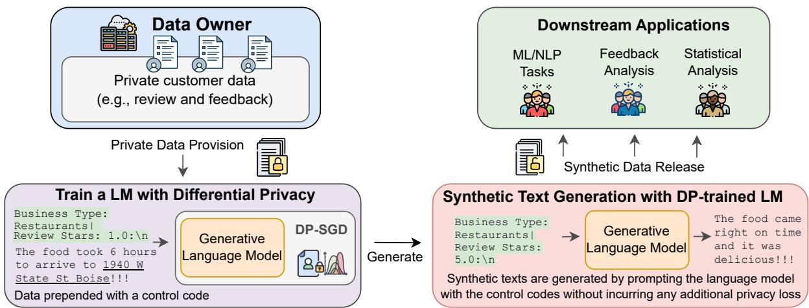  
Figure 1: Illustration of our problem and methodology. We propose to generate synthetic text with a formal privacy guarantee: we fine-tune a generative language model with DP and then leverage it for synthetic text generation using control codes. Privacy loss of the overall procedure can be controlled by the data generation stage as, by the robustness to post-processing property of DP, the downstream task stage does not incur any additional privacy loss

In this work, we initiate a systematic empirical study of the problem and show that DP language model (LM) fine-tuning can be an effective solution to synthetic text generation with privacy. In particular, we show that simply fine-tuning progressively larger autoregressively pre-trained language models on (private) data leads to models that generate increasingly useful synthetic text. For instance, we fine-tune a GPT-2 Large model (Radford et al. 2019) on a review dataset with DP at € = 4 and then use it to generate synthetic text to build downstream classifiers. The classification models achieve comparable performance (only 2-4% in accuracy away) to the classifiers trained on the original dataset.

Furthermore, we demonstrate that generating a small amount of synthetic data with DP is sufficient to create classification models that are on par with those trained directly on the entire original dataset with DP. One of the advantages of the synthetic data approach is that the privacy loss is fixed, and an unlimited number of downstream models can be built without incurring additional leakage. In contrast, training additional downstream models on the original data with DP accumulates privacy loss.

Distributional similarity evaluation additionally confirms that the synthetic text distribution resembles the original data distribution. We also uncover a novel phenomenon in DP-trained LMs that is of independent interest. Specifically, we observe a length truncation effect in text generation with DPtrained models, resulting in completions that are generally shorter than their non-DP counterparts and instances in the original dataset.

We further extensively study learning dynamics with DP by injecting specially-crafted canaries (Carlini et al., 2019) in the training data. This allows for (i) stress-testing the extent to which DP fine-tuning limits the leakage of private information and (ii) understanding the conditions under which a subject of interest would appear in synthetic generations.

Finally, we conclude our studies on an industriallevel private customer feedback dataset to show the feasibility of our approach in real-world scenarios.

## 2 Background

## 2.1 Differential Privacy

Definition 2.1 (Differential Privacy (DP) (Dwork et al., 2006)). A randomized algorithm M : D → S is (€, δ)-differentially private if for any two neighboring datasets $D , D ^ { \prime } \in \mathcal { D }$ that differ exactly in a single data sample, and for all sets $S \subseteq S$

$$
\mathbb { P } [ M ( D ) \in S ] \le e ^ { \epsilon } \mathbb { P } [ M ( D ^ { \prime } ) \in S ] + \delta .
$$

This definition provides a rigorous privacy guarantee by theoretically bounding the effect of a single data sample in the dataset. For a differentially private algorithm, the output distribution is statistically similar whether any individual data sample appears in the input dataset or not. The privacy parameter € quantifies the maximum allowable impact of a single individual's data on the outcome. δ specifies the maximum probability that the privacy guarantee may fail. An algorithm can typically be made $( \epsilon , \delta ) \ / – \mathrm { D P }$ by bounding the contribution of a single data sample and adding controlled noise from a predetermined distribution (e.g., Gaussian) (Dwork and Roth, 2014). Setting € and δ in practice often requires careful consideration of the specific use case and the acceptable trade-off between privacy and utility. We discuss our choice of € and $\delta$ in Section 4.1.

An appealing property of DP crucial to this work is robustness to post-processing. This property ensures that if the algorithm M satisfies $( \epsilon , \delta ) \ / – \mathrm { D P } ,$ then so does $F \circ M$ for any deterministic or randomized function F (which is independent of M). Namely, one can perform arbitrary post-processing without incurring additional privacy loss.

## 2.2 DP Stochastic Gradient Descent

Deep learning models can be trained with DP via a modification of the stochastic gradient descent (SGD) algorithm (Song et al., 2013; Bassily et al., 2014; Abadi et al., 2016). The modified algorithm clips per-sample gradients to bound the contribution of individual examples. Noise from a Gaussian distribution is sampled and added to the sum of the clipped gradients in a batch to obfuscate the gradient update. The resulting algorithm, called Differentially Private Stochastic Gradient Descent (DP-SGD), can be shown to be DP for some $( \epsilon , \delta )$ for each update of the model. Privacy parameters at the end of training can be computed via privacy composition algorithms (Abadi et al., 2016; Gopi et al., 2021a). In the next section, we will utilize DP-SGD to train a language model with privacy for synthetic text generation.

## 3 Method

In this section, we formally state the problem and present our method (see Figure 1 for an illustration) that produces a synthetic version of private text data with differential privacy.

## 3.1 Problem Statement

Let D be a database representing the collection of token sequences from a fixed dictionary V. We define a (randomized) mapping $M : \mathcal { D }  \mathcal { D }$ such that for a given dataset $D \in \mathcal { D }$ , the goal is to generate a synthetic version $M ( D ) = \tilde { D }$ with privacy constraints and utility desiderata.

Regarding privacy constraints, we require that M be $( \epsilon , \delta ) \ / – \mathrm { D P }$ with domain D. This requirement provides strong protection for the participants in the input dataset as this participation will be statistically indistinguishable to a certain degree through any adversary accessing the model or synthetic version of the dataset in the output.

For the case of utility, ideally, the synthetic version $\tilde { D }$ should be able to replace D in providing a training resource for models on relevant downstream applications. In other words, on target downstream tasks, models trained on the synthetic dataset $\tilde { D }$ are expected to have performance similar to the models trained on the original dataset D. More generally, distributional properties of the dataset D should be captured as much as possible in the synthetic version D without violating the aforementioned privacy requirement. These will be extensively explored in Section 4.

## 3.2 Synthetic Text Generation with DP

Conventionally, to generate synthetic text, an autoregressive language model (e.g. GPT-2 (Radford et al., 2019)) is trained on the original dataset and subsequently sampled using a sampling mechanism (e.g., beam search, top-k sampling (Fan et al., 2018), nucleus sampling (Holtzman et al., 2020), etc.) to produce synthetic sequences.

To make this operation differentially private, we adopt DP-SGD to fine-tune a pre-trained generative LM. The post-processing property of DP ensures that once the LM has been fine-tuned with DP, sampling from the model incurs no extra privacy loss.

It would be desirable to synthesize examples with labels. We achieve this by building a conditional generator introduced in (Keskar et al., 2019) to provide more explicit control over text generation. By using so-called control codes (Keskar et al., 2019), the probability distribution of a text sequence $x = ( x _ { 1 } , x _ { 2 } , \ldots , x _ { n } )$ is conditioned on a control code c and decomposed as:

$$
\mathbb { P } \left( x | c \right) = \prod _ { i = 1 } ^ { n } \mathbb { P } \left( x _ { i } | x _ { 1 } , x _ { 2 } , \ldots , x _ { i - 1 } , c \right) .
$$

A neural network $p _ { \theta } ( \cdot )$ is then trained to model each conditional distribution. The model can later be used to generate new samples conditioned on a control code c by sequentially sampling $p _ { \theta } ( x _ { 1 } | c ) , p _ { \theta } ( x _ { 2 } | \tilde { x } _ { 1 } , c ) , \dots , p _ { \theta } ( x _ { m } | \tilde { x } _ { 1 } , \dots \tilde { x } _ { m - 1 } , c )$ The advantage of this approach is that it provides flexibility in the text generation of the model by allowing the conditional control codes to specify a particular style, domain, sentiment, or category. For example, feedback data collected from users on a set of products may contain product types and review scores associated with each data sample. Control codes can be constructed as $c _ { p , r } = " P r o d u c t$ type: p | Review score: $\boldsymbol { r ^ { \prime \prime } }$ for different product type (p) and review score (r) pairs. In our method, we utilize control codes to prepend each sample with its corresponding categories as a simple preprocessing step. During the text generation, this allows us to use the control codes to generate as many samples as the original categorical distribution is preserved.

We point out that the categorical distribution in the original dataset may also be a piece of private information itself. However, its estimation could easily be privatized (Dwork and Roth, 2014) and for simplicity, we ignore the low-cost privacy loss of this step and use the exact categorical distribution of the original dataset in this paper.

## 4 Analyses on a Public Review Dataset

In this section, we extensively analyze our method with experiments on a public benchmark dataset: Yelp Open Dataset,2 which has been widely adopted for language modeling and text classification tasks. We then apply our method to an internal private customer feedback dataset in Section 5.

## 4.1 Experimental Setup

Dataset. The Yelp dataset contains review text data on businesses that can be studied for academic purposes. We select two attributes for the conditional generation as well as the downstream task applications: review stars (1-5) and business category. We sample 10 frequent business categories and remove the reviews that do not have ratings (Details can be found in Appendix A.1). This results in a dataset that has 1.9M reviews for training, 5000 for validation, and 5000 for testing.

Implementation Details. We utilize the public repository (Inan et al., 2022), which is based on Huggingface (Wolf et al., 2019) and Opacus (Yousefpour et al., 2021), for fine-tuning language models with DP. Specifically, we fine-tune three language models: GPT2 (Radford et al., 2019), GPT2-Medium, and GPT2-Large, for synthetic text generation. Additionally, we fine-tune the RoBERTa-base model (Liu et al., 2019) for downstream text classification tasks.

Control codes are constructed based on attributes such as “Business Type: Bar | Review Stars: 5.0"

<table><tr><td>Data Type</td><td>Data Generator</td><td>€</td><td>Rating</td><td>Category</td></tr><tr><td>Original</td><td>=</td><td>1</td><td>0.7334</td><td>0.7752</td></tr><tr><td rowspan="4">Synthetic</td><td>GPT2</td><td>∞ 4</td><td>0.6892 0.6656</td><td>0.7584 0.7478</td></tr><tr><td>GPT2-Medium</td><td>8</td><td>0.6878</td><td>0.7550</td></tr><tr><td></td><td>4</td><td>0.6756</td><td>0.7486</td></tr><tr><td>GPT2-Large</td><td>∞ 4</td><td>0.7090 0.6936</td><td>0.7576 0.7568</td></tr></table>

Table 1: Synthetic text generation with DP yields models that exhibit comparable accuracy in downstream tasks (review rating and business category classification) when compared to models trained on the synthetic text generated without privacy protection.

and are prepended to each sample. Hyperparameters are specified in Appendix A. For both synthetic text generation and classification, we set the maximum sequence length to 128, unless otherwise specified. During training, we evaluate the models on the dev dataset and select the checkpoint that achieves the best validation performance for the final evaluation on the test set.

We set the privacy parameter € to 4, which is supported by prior work (Yu et al., 2021a; Li et al., 2022b; Yu et al., 2022; De et al., 2022; Mehta et al., 2022) and real-world applications. For instance, the release of US population data uses $\epsilon = 1 3 . 6 4$ (Bureau, 2020), and the development of a nextword prediction model uses $\epsilon \ : = \ : 6 . 9 2$ (Google, 2022). Our $\epsilon = 4$ is smaller and provides stronger privacy protection. As recommended by (Hsu et al., 2014; De et al., 2022), δ should be smaller than the inverse of the dataset size N, and we set $\delta = 1 / ( N \cdot$ log N). The additive noise scale is calculated using the numerical composition algorithm (Gopi et al. 2021b), given the batch size and epochs for each setting mentioned in Appendix A for DP training.

To generate synthetic text samples, we employ top-k sampling (Fan et al., 2018) and nucleus sampling (top-p) (Holtzman et al., 2020), with $k = 5 0$ and $p = 0 . 9$ . To produce synthetic datasets that preserve categorical distributions (e.g., business category), we generate 100K samples from the finetuned models using the appropriate control codes.

## 4.2 Downstream Tasks on Synthetic Data

One way to evaluate the quality of the synthetic dataset is by examining the performance of downstream task models trained on it. We fine-tune RoBERTa-base models for classifying review ratings and business categories using the synthetic dataset. We further compare their performance with models trained on the original dataset. All models are evaluated on the same original test set.

<table><tr><td rowspan="2">Data Type</td><td rowspan="2">Data Size</td><td rowspan="2">DP Position</td><td colspan="2">Task Accuracy</td></tr><tr><td>Rating</td><td>Category</td></tr><tr><td>Original</td><td>1.9M</td><td>Task modeling</td><td>0.7014</td><td>0.7644</td></tr><tr><td>Original</td><td>100K</td><td>Task modeling</td><td>0.6689</td><td>0.7552</td></tr><tr><td>Synthetic</td><td>100K</td><td>Data Generator</td><td>0.6936</td><td>0.7568</td></tr></table>

Table 2: The model trained on synthetic data generated with DP-trained GPT2-Large (the last row) has similar performance compared to the models directly trained on the original dataset with DP (the first two rows).

The results are summarized in Table 1. The downstream task models trained on the synthetic data generated by GPT2 with DP (€ = 4) achieve comparable performance to the models trained on the synthetic data generated without DP (€ = ∞) and the models trained on the original dataset. Additionally, we observe that the quality of the synthetic generations improves when larger pre-trained language models are used (sampled generations can be found in Appendix F), and the performance gap between private and non-private generations diminishes. Surprisingly, models trained on synthetic data generated by GPT2-Large with DP exhibit similar or even better performance compared to models trained on synthetic data generated by GPT2 without DP. These results highlight the significant potential of our method for generating synthetic data across various downstream applications.

## 4.3 Synthetic Data Generation with DP v.s. Downstream Task Modeling with DP

It is natural to compare how downstream task models built on synthetic text generated by a DP-trained LM fare against models directly trained on the original data with DP. The results of this comparison are presented in Table 2.

We observe that by using the same privacy parameter (€ = 4), both approaches achieve comparable performances. However, it is important to note that training two task models on the private dataset with DP will result in a higher overall privacy loss than € = 4, and this loss will accumulate with additional downstream tasks. In contrast, the postprocessing property of DP allows us to train any number of models for different downstream tasks on the synthetic data generated by a DP-trained LM without incurring additional privacy loss.

An interesting observation is that once the synthetic data is generated with DP, a smaller dataset size (100K instead of 1.9M) is sufficient to produce superior downstream models compared to models directly trained with DP on the original data of the same size (as seen in the second row of Table 2).

<table><tr><td>Generator</td><td>€</td><td>F1↑</td><td>FID↓</td><td>MAUVE↑</td></tr><tr><td rowspan="2">GPT2</td><td>∞</td><td>0.5199</td><td>3.2368</td><td>0.7158</td></tr><tr><td>4</td><td>0.4786</td><td>4.7998</td><td>0.5579</td></tr><tr><td rowspan="2">GPT2-Medium</td><td>∞</td><td>0.5446</td><td>3.1464</td><td>0.7222</td></tr><tr><td>4</td><td>0.5076</td><td>4.1880</td><td>0.6085</td></tr><tr><td rowspan="2">GPT2-Large</td><td>∞</td><td>0.5852</td><td>3.0978</td><td>0.7238</td></tr><tr><td>4</td><td>0.5140</td><td>4.1352</td><td>0.6093</td></tr></table>

Table 3: Distribution distance between the synthetic and original data based on various metrics. Performance improves as larger models are used.

## 4.4 Similarity between Synth. and Real Data

To further assess the quality of the synthetic generations, we evaluate the similarity between the synthetic dataset and the original dataset. Unlike typical natural language generation tasks like machine translation or summarization, where gold references can be used for evaluation, it is challenging to directly compare synthetic generations with the original dataset when there is no one-toone mapping between them. In our evaluation, we measure the “similarity" from three different perspectives: Embedding Distribution Distance, Topic Difference, and Text Length Distribution.

Embedding Distribution Distance. To measure the embedding distribution distance between the synthetic and original data, we use sentencetransformers (Reimers and Gurevych, 2019) to embed both datasets. We calculate the distance between the two distributions using three metrics: 1) F1 Score: the harmonic mean of Precision and Recall (Kynkäänniemi et al., 2019). Precision estimates the average sample quality, while Recall measures the coverage of the sample distribution. 2) Fréchet Inception Distance (FID): FID calculates the feature-wise mean and covariance matrices of the embedding vectors and then measures the Fréchet distance between the two sets (Heusel et al., 2017). 3) MAUVE: MAUVE compares the distributions of the synthetic and original data using divergence frontiers (Pillutla et al., 2021).

We note that the absolute scale of these metrics may vary depending on the specific embedding models used. To account for this, we conduct the evaluations with five different pre-trained sentence transformers (details provided in Appendix A.6), and then compute the average for each metric.

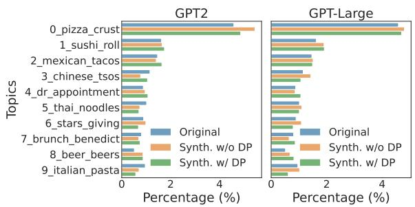  
Figure 2: Topic distributions of the synthetic and the original dataset are similar. The similarity further improves as the model size increases.

Table 3 shows the distribution distances between the synthetic data and the original data based on the metrics introduced above. We observe that the quality of the synthetic data improves as we use larger pre-trained models for private fine-tuning. Similar to the results of the previous section, we observe that the F1 score of the GPT2-Large model with DP (the last row) matches the F1 score of GPT2 model without privacy (the first row). On the other hand, there remains a gap between synthetic generations with and without DP for FID and MAUVE.

Topic Difference. Another approach to measuring the similarity between the synthetic and original data is to analyze their topic distributions. Topic modeling is a commonly used technique to uncover hidden semantic structures or abstract “topics" within a collection of documents. To compare the distributions of topics in the synthetic and original data, we combine them into a single collection and utilize an unsupervised topic model called BERTopic (Grootendorst, 2022) to extract the top 10 most frequent topics. The distributions of these topics for both the synthetic data and the original data are plotted in Figure 2. From the results, we observe that the topic distributions of the synthetic data, both with and without DP, are highly similar to those of the original data. This further demonstrates the high quality of the synthetic data generated using our approach.

Text Length Distribution. Lastly, we examine the distribution of sequence lengths in the synthetic data and compare them to the original data. To investigate whether the maximum sequence length or truncation during the pre-processing phase has a significant impact on the generations, we train two sets of generative models with maximum sequence

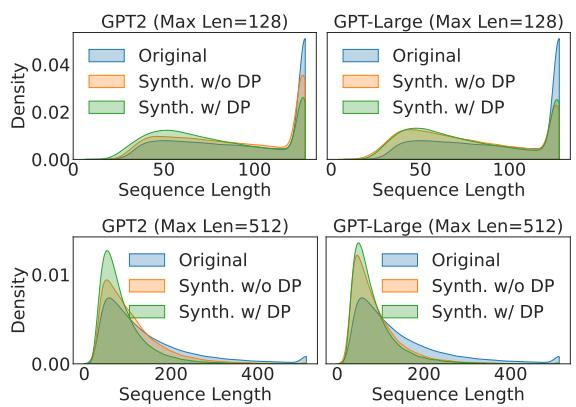  
Figure 3: Synthetic data generated w/ or w/o DP includes shorter sequences compared with the original data. This is more pronounced when the synthetic data is produced with DP, especially for the small model.

lengths of 128 and 512.

We plot the density of the sequence lengths in Figure 3. We observe that, in general, the synthetic data generated with or without privacy tends to be shorter than the original data (length truncation effect). Furthermore, we notice that the synthetic data generated with DP has a higher concentration of shorter sequences compared to the data generated without DP. Although the issue is somewhat mitigated with larger model sizes, it is not fully resolved, and we can still observe that the generations with DP are slightly shorter than their non-private counterparts using the same decoding strategy (e.g., average length of 84.5 vs. 89.4 for GPT2-Large).

## 4.5 Learning Dynamics with DP

In this section, we examine the learning dynamics with DP from two perspectives: (i) the preservation of private information specific to individuals; (ii) the generation of information that is common to many individuals (i.e., the subject of interest).

To analyze these dynamics, we extend the approach introduced in (Carlini et al., 2019). We construct “canary" samples that represent private information and the subject of interest respectively. These canary samples are then injected into the original training data to assess the extent to which they can be reconstructed in the synthetic generations. This allows us to evaluate how effectively private information is protected and how well the subject of interest is captured in the generations.

Leakage of Private Information. The objective of this experiment is to evaluate whether any private information, such as Personally Identifiable Information (PII), leaks in the generated text. We focus on measuring the leakage of PIIs, as they are direct identifiers of individuals and highly sensitive data governed by privacy regulations like GDPR.

<table><tr><td>Repetition</td><td>€</td><td>Perplexity Rank</td><td>Leaked Canaries</td></tr><tr><td rowspan="2">1</td><td>∞</td><td>1017/10000</td><td>0%</td></tr><tr><td>4</td><td>3926/10000</td><td>0%</td></tr><tr><td rowspan="2">10</td><td>∞</td><td>1/10000</td><td>0%</td></tr><tr><td>4</td><td>3320/10000</td><td>0%</td></tr><tr><td rowspan="2">100</td><td>∞</td><td>1/10000</td><td>80%</td></tr><tr><td>4</td><td>969/10000</td><td>0%</td></tr></table>

Table 4: Generations by a DP-trained LM show strong privacy protection against the leakage of injected canary sequences. “Perplexity Rank" means the rank of the canaries among a similar set of candidates by the model's perplexity. “Leaked Canaries" shows the percentage of canaries appearing in the synthetic generations.

We construct 5 artificial review-style canary sequences, each containing specific types of private information (e.g., “The food took literally 6 hours to arrive at 1940W State St Boise."; please refer to Appendix B for the full list).3 We conduct experiments by injecting these 5 canary sequences with varying repetition rates into the original dataset. The purpose of repeating the private information is to account for worst-case scenarios regarding privacy, as previous studies (Lee et al., 2022; Kandpal et al., 2022; Carlini et al., 2022) have demonstrated that data duplication is a major contributing factor to model memorization. After generating the synthetic data, we examine whether the private information (underlined text in the example) from the canary sequences appears in the generations. The results are presented in Table 4.

We observe that even with a repetition rate as high as 100, the private information from the canary sequences does not appear in the synthetic data when the model is trained with DP. In contrast, without DP, 4 out of 5 canary sequences verbatim appear in the synthetic data at this repetition rate. This demonstrates the effectiveness of DP in preventing the leakage of private information.

We note that the appearance of the canaries in the synthetic dataset is tied to the way we generate text. As such, our evaluation is not exhaustive, and we cannot completely rule out the possibility that canaries could be extracted from DP-trained models using alternative decoding methods and hyperparameters. To address this limitation, we directly examine the rank of the private information within a canary sequence (e.g., “1940W State St Boise") based on its perplexity compared to 10,000 similar candidates.4 The details of how we construct similar candidates are included in Appendix B.

<table><tr><td colspan="3">Original Data</td><td colspan="2">Synthetic Data</td></tr><tr><td>€</td><td># of samples</td><td>percentage</td><td># of samples</td><td>percentage</td></tr><tr><td>∞</td><td>100</td><td>0.005%</td><td>80</td><td>0.004%</td></tr><tr><td>∞</td><td>1000</td><td>0.053%</td><td>3678</td><td>0.194%</td></tr><tr><td>∞</td><td>10000</td><td>0.526%</td><td>57040</td><td>3.002%</td></tr><tr><td>4</td><td>100</td><td>0.005%</td><td>0</td><td>0.000%</td></tr><tr><td>4</td><td>1000</td><td>0.053%</td><td>10</td><td>0.001%</td></tr><tr><td>4</td><td>10000</td><td>0.526%</td><td>32271</td><td>1.698%</td></tr></table>

Table 5: Injection of a subject of interest in the original data and the appearance of it in the synthetic data

We present the average rank of the private information in the canary sequences in Table 4. Additionally, the perplexity distributions of all similar candidates for each canary type can be found in Figure 5 in Appendix C. Based on our investigation, we draw the following notable findings:

For all repetition levels, training the language model with DP effectively eliminates the risk of privacy leakage. The private information in the canary sequences does not achieve low ranks and is not distinguishable among similar candidates.

When the canary sequence appears only once in the training set, the risk of extraction during generation is relatively low. However, some canaries (e.g., Address and Plate in Figure 5) still obtain top ranks. This indicates that even if certain private information appears only once in the training set, models may still memorize it, potentially leading to leakage in synthetic generations. Additionally, when we repeat the canary sequences 10 or 100 times, they consistently achieve top ranks without DP. In contrast, models trained with DP consistently exhibit much higher ranks for the inserted sequences, with a leakage percentage of 0.

Appearance of a Subject of Interest. In this experiment, we aim to investigate whether a specific “subject of interest" can be extracted from fine-tuned models when it appears in multiple distinct instances in the training data. This evaluation allows us to assess the extent to which our DP guarantee (€ = 4) permits the generation of information that is common to many individuals.

First, we select the subject of interest “beautiful paintings by Van Gogh in a restaurant" that we want to be present in the synthetic generations.⁵ However, instead of replicating the subject, we simulate the scenario where different people may express this subject in different ways. To achieve this, we utilize a variant of GPT-3 (Brown et al., 2020) to generate a number of reviews (100, 1,000, and 10,000) that include this subject (more details can be found in Appendix D). Next, we inject different numbers of canary reviews into the original training dataset. After generating the synthetic dataset, we examine whether the subject of interest (including its substrings or paraphrases) appears in the synthetic data. The results are presented in Table 5.

Interestingly, we observe that without DP, when 100 canary samples are injected, the subject appears as frequently as it does in the original data. However, with 1,000 and 10,000 injected samples, the subject tends to be over-represented in the synthetic data. Conversely, when DP is applied, the subject is not present in the synthetic data even with 100 injected samples, and only appears in a few generations even with 1,000 injected samples. This indicates that while DP protects the privacy of individual samples, it also has a detrimental effect on learning and generating the tail of the data distribution. And with 10,000 injections, although over-generation of the subject still occurs, it happens to a lesser degree compared to the case without privacy protection.

## 5 Results on Private Customer Feedback

To demonstrate the effectiveness of our method in safeguarding utility and privacy in practical scenarios, we evaluate its performance using a Microsoft private feedback dataset obtained from customers.

Background. Industrial applications often receive a significant volume of customer feedback regarding their products. Customer feedback is valuable as it provides insights into product performance, user satisfaction, and areas for improvement. While customer feedback may not typically contain personally identifiable information, it may still include sensitive details that could potentially disclose the customer's identity. For example, customers might mention specific job titles, company names, or locations in their feedback. When combined with other publicly available information, these details could potentially be used to identify the customer and compromise their privacy. Protecting the privacy of this information is crucial to comply with privacy regulations such as the GDPR (Art. 29 WP, 2014), build trust with customers, and mitigate the risk of unauthorized access or misuse.

<table><tr><td>Data Type</td><td>€</td><td>A1</td><td>A2</td><td>A3</td></tr><tr><td>Original</td><td>-</td><td>0.690</td><td>0.716</td><td>0.563</td></tr><tr><td>Synthetic</td><td>∞</td><td>0.664</td><td>0.558</td><td>0.555</td></tr><tr><td>Synthetic</td><td>4</td><td>0.642</td><td>0.536</td><td>0.552</td></tr></table>

Table 6: Downstream task accuracy of models trained on the private customer feedback data and synthetic data generated by GPT2-Large models w/ and w/o DP.

Dataset. In our scenario, 1M customer feedback is collected on a set of Microsoft products. For downstream tasks, we are interested in three attributes of the feedback, which we call A(ttribute)1, A2 and A3. Attributes can be a number of product characteristics including, but not limited to, user satisfaction scores, date and time range, product name, product type, location, etc. Using the attributes (A1, A2, A3) together with a particular combination of their respective values, such as $( V _ { A 1 } , V _ { A 2 } , V _ { A 3 } )$ , the conditional text generation prompt becomes: $\mathrm { ^ { * } A 1 } \colon V _ { A 1 } \mid \mathrm { A } 2 \colon V _ { A 2 } \mid \mathrm { A } 3 \colon V _ { A 3 } \mathrm { ^ { , } }$ We use the GPT2-Large model with the settings described in Section 4.1 in our scenario.

Downstream Task Performance. Similar to Section 4.2, to measure the quality of synthetic data, we evaluate the performance of classification models trained on them. We train three classification models, to predict three attributes A1, A2, and A3 with 5, 45, and 5 classes respectively. We present the results in Table 6. We observe that the downstream task models trained on the synthetic data generated by GPT2-Large with DP (€ = 4) achieve comparable performance to the ones trained on the synthetic data generated without DP (€ = ∞). However, especially for A2, the performance gap between models trained on the synthetic data and the original data is more pronounced in this scenario. This is primarily due to the dataset size, which is roughly half of the one adopted in Section 4 and A2 having a much larger set of classes compared to the other attributes. This highlights the importance of collecting data sufficiently representing each class in scenarios where data contains a high number of sub-classes.

Text Length Distribution. We further compare the sequence lengths of the synthetic data generated with and without DP to the original dataset. The results are shown in Figure 4 of Appendix E. We notice a similar phenomenon that the data generated with DP exhibits a length truncation effect compared to the data generated without DP.

## 6 Related Work

Synthetic Data Generation with DP. The problem of DP synthetic data generation has been widely studied for tabular and image data in machine learning. Notable works in the literature on DP tabular data generation address the privacyutility trade-off problem by building Bayesian networks (Zhang et al., 2014), by preserving marginals (McKenna et al., 2021), or through training generative adversarial networks with DP-SGD (Kunar et al., 2021; Xie et al., 2018; Jordon et al., 2019; Tao et al., 2021). The literature on DP image generation has so far mostly focused on GAN-based methods (Augenstein et al., 2020; Xie et al., 2018; Neunhoeffer et al., 2021). To the best of our knowledge, there are only a few works on DP synthetic text generation. Bommasani et al. (2019) preliminarily outlined potential approaches without going in depth. A concurrent work (Mattern et al., 2022) generates synthetic data by fine-tuning pre-trained LMs with DP on a very small number of training samples (e.g., 25-5K). However, there are significant disparities in terms of methodology and experiment design. In terms of methodology, our approach offers simplicity and practicality for real-world use. We avoid the need to construct templates for different task instructions, and we do not introduce additional prompt-mismatch loss during the fine-tuning of LMs. Regarding evaluations, we not only assess downstream classification but also consider text distribution similarity using various metrics (Section 4.4). Moreover, we include a private Customer Feedback dataset obtained from real practice, alongside the publicly available review datasets (e.g., Yelp).

We point out that other one-to-one mapping approaches including both token-level (Weggenmann and Kerschbaum, 2018; Feyisetan et al., 2019, 2020; Xu et al., 2021a,b; Bo et al., 2021; Qu et al., 2021; Yue et al., 2021) and sentence-level (Krishna et al., 2021; Habernal, 2021; Meehan et al., 2022; Weggenmann et al., 2022) perturbations fail to satisfy our privacy requirement outlined in Section 3.1 even though they possess certain DP guarantees themselves. This is because we require that the procedure of synthetic text generation should be statistically similar whether a data sample appears in the original dataset or not. These one-to-one mapping methods focus on producing a perturbed version of a single data sample, therefore, cannot fulfill this requirement. Besides, such one-to-one perturbations cannot meet the requirement of GDPR (Art. 29 WP, 2014) with regard to "linkability" since the data owner can always link the perturbed text to a specific user as long as they keep the user meta record. However, our method can fulfill the requirement as the data owner cannot link any of the generated sequences to a specific user.

DP Fine-tuning of Language Models. DP finetuning has been recently demonstrated to be an effective privacy-preserving approach for solving a variety of NLP tasks including text classification, table-to-text generation, dialog generation, and semantic parsing (Li et al., 2022b; Yu et al., 2022; Mireshghallah et al., 2022; Du et al., 2023). However, past works have not studied these techniques for the problem of synthetic text generation. Unlike the above works, we initiate a careful empirical study of private fine-tuning for building synthetic text generation models, measure the different aspects of the approach, and demonstrate its general effectiveness as well as its unique limitations.

## 7 Conclusion

In this paper, we present a simple and practical recipe for generating synthetic text data with privacy guarantees. Our method is built upon pretrained language models and differential privacy, where the former enables us to generate highquality synthetic text data and the latter provides formal privacy guarantees that no single example in the training dataset can influence the trained model by a substantial amount probabilistically. We conduct comprehensive experiments evaluating both utility and privacy risks of the synthetic data. The results demonstrate that our method can generate high-quality text while mitigating privacy risks.

## 8 Limitations

Through extensive empirical analyses, we demonstrated that our proposed method can produce highutility synthetic text with strong privacy protection. However, we acknowledge there are limitations.

Our method captures general statistical properties of the original text but is not able to perfectly replicate all details. DP protects the privacy of individual samples in the original training text, but this means that DP also limits the model in learning the tail of the training distribution (Suriyakumar et al., 2021). Overall, strong DP guarantees render the generation of rare patterns in the original data unlikely. This means that the synthetic text generated from a DP-trained model may potentially miss valuable information conveyed in the outliers of the training text.

We observed in our conditional generation studies that DP disproportionally affects classes (corresponding to control codes) with different sample sizes. In particular, tight DP guarantees most negatively impact learning the distribution of small-size classes. Future work may study approaches that mitigate this negative impact for minority populations in private synthetic data generation.

We selected values for privacy parameters € = 4 and δ = 1/(N · log N) based on prior privacyutility trade-off studies for text classification and table-to-text generation (Li et al., 2022b; Yu et al., 2021b). We leave it to future work for a more extensive privacy-utility trade-off analysis for general synthetic text generation.

Our canary extraction experiments demonstrated that strong DP guarantees lead to strong empirical privacy even for “private" information (the subject) that appears across multiple training instances. However, we note that DP guarantees generally translate into strong empirical privacy guarantees only when individual samples have low or no correlation (Kifer and Machanavajjhala, 2011). It is therefore crucial that DP machine learning be applied in conjunction with other modes of privacypreserving techniques (e.g., data deduplication and redaction (Zhao et al., 2022)) for optimal protection. For deployments of DP synthetic text generation, one should also consider meaningful example boundaries.

## 9 Ethics Statement

In this work, we focus on the problem of synthetic text generation with formal privacy guarantees. Our goal is to generate synthetic text that preserves the statistical properties of the original text while also protecting the privacy of individuals. We take the issue of privacy very seriously and have designed our method to ensure that it meets the highest ethical standards. In particular, we have incorporated differential privacy, which is the gold-standard privacy mitigation technique employed in industry and by the US census bureau, to ensure that the synthetic generations do not compromise the privacy of individuals present in the original data. We also recognize that synthetic text generated by our model has the potential to be misused, and we encourage responsible and ethical use of our model. We encourage researchers and practitioners to consider the ethical implications of the method and to follow best practices in data privacy.

## Acknowledgements

The authors would thank all the anonymous reviewers for their valuable and constructive comments. The authors would also thank Microsoft and OSU NLP group colleagues for providing suggestions and feedback at different stages of the project.

## References

Martín Abadi, Andy Chu, Ian J. Goodfellow, H. Brendan McMahan, Ilya Mironov, Kunal Talwar, and Li Zhang. 2016. Deep learning with differential privacy. In Proceedings of the 2016 ACM SIGSAC Conference on Computer and Communications Security, Vienna, Austria, October 24-28, 2016, pages 308-318.

Art. 29 WP. 2014. Opinion 05/2014 on “Anonymisation Techniques".

Sean Augenstein, H. Brendan McMahan, Daniel Ramage, Swaroop Ramaswamy, Peter Kairouz, Mingqing Chen, Rajiv Mathews, and Blaise Agüera y Arcas. 2020. Generative models for effective ML on private, decentralized datasets. In 8th International Conference on Learning Representations, ICLR 2020, Addis Ababa, Ethiopia, April 26-30, 2020.

Raef Bassily, Adam D. Smith, and Abhradeep Thakurta. 2014. Private empirical risk minimization: Efficient algorithms and tight error bounds. In 55th IEEE Annual Symposium on Foundations of Computer Science, FOCS 2014, Philadelphia, PA, USA, October 18-21, 2014, pages 464–473.

Haohan Bo, Steven H. H. Ding, Benjamin C. M. Fung, and Farkhund Iqbal. 2021. ER-AE: Differentially private text generation for authorship anonymization. In Proceedings of the 2021 Conference of the North

American Chapter of the Association for Computational Linguistics: Human Language Technologies, pages 3997–4007.

Rishi Bommasani, Steven Wu, and Xanda Schofield. 2019. Towards private synthetic text generation. In NeurIPS 2019 Machine Learning with Guarantees Workshop.

Lucas Bourtoule, Varun Chandrasekaran, Christopher A Choquette-Choo, Hengrui Jia, Adelin Travers, Baiwu Zhang, David Lie, and Nicolas Papernot. 2021. Machine unlearning. In 42nd IEEE Symposium on Security and Privacy, SP 2021, San Francisco, CA, USA, 24-27 May 2021, pages 141–159. IEEE.

Tom B. Brown, Benjamin Mann, Nick Ryder, Melanie Subbiah, Jared Kaplan, Prafulla Dhariwal, Arvind Neelakantan, Pranav Shyam, Girish Sastry, Amanda Askell, Sandhini Agarwal, Ariel Herbert-Voss, Gretchen Krueger, Tom Henighan, Rewon Child, Aditya Ramesh, Daniel M. Ziegler, Jeffrey Wu, Clemens Winter, Christopher Hesse, Mark Chen, Eric Sigler, Mateusz Litwin, Scott Gray, Benjamin Chess, Jack Clark, Christopher Berner, Sam McCandlish, Alec Radford, Ilya Sutskever, and Dario Amodei. 2020. Language models are few-shot learners. In Advances in Neural Information Processing Systems 33: Annual Conference on Neural Information Processing Systems 2020, NeurIPS 2020, December 6-12, 2020, virtual.

Zhiqi Bu, Jialin Mao, and Shiyun Xu. 2022. Scalable and efficient training of large convolutional neural networks with differential privacy. ArXiv preprint abs/2205.10683.

US Census Bureau. 2020. Official release of source code for the disclosure avoidance system (das) used to protect against the disclosure of individual information based on published statistical summaries.

Nicholas Carlini, Daphne Ippolito, Matthew Jagielski, Katherine Lee, Florian Tramèr, and Chiyuan Zhang. 2022. Quantifying memorization across neural language models. ArXiv preprint, abs/2202.07646.

Nicholas Carlini, Chang Liu, Úlfar Erlingsson, Jernej Kos, and Dawn Song. 2019. The secret sharer: Evaluating and testing unintended memorization in neural networks. In 28th USENIX Security Symposium, USENIX Security 2019, Santa Clara, CA, USA, August 14-16, 2019, pages 267–284.

Nicholas Carlini, Florian Tramer, Eric Wallace, Matthew Jagielski, Ariel Herbert-Voss, Katherine Lee, Adam Roberts, Tom Brown, Dawn Song, Ulfar Erlingsson, et al. 2021. Extracting training data from large language models. In 30th USENIX Security Symposium, USENIX Security 2021, August 11-13, 2021, pages 2633–2650.

Soham De, Leonard Berrada, Jamie Hayes, Samuel L Smith, and Borja Balle. 2022. Unlocking highaccuracy differentially private image classification through scale. ArXiv preprint, abs/2204.13650.

Minxin Du, Xiang Yue, Sherman SM Chow, and Huan Sun. 2023. Sanitizing sentence embeddings (and labels) for local differential privacy. In Proceedings of the ACM Web Conference 2023, WWW 2023, Austin, TX, USA, 30 April 2023 - 4 May 2023, pages 2349– 2359.

Cynthia Dwork, Frank McSherry, Kobbi Nissim, and Adam D. Smith. 2006. Calibrating noise to sensitivity in private data analysis. In Theory of Cryptography, Third Theory of Cryptography Conference, TCC 2006, New York, NY, USA, March 4-7, 2006, Proceedings, volume 3876 of Lecture Notes in Computer Science, pages 265–284.

Cynthia Dwork and Aaron Roth. 2014. The algorithmic foundations of differential privacy. Found. Trends Theor. Comput. Sci., 9(3-4):211–407.

Angela Fan, Mike Lewis, and Yann Dauphin. 2018. Hierarchical neural story generation. In Proceedings of the 56th Annual Meeting of the Association for Computational Linguistics (Volume 1: Long Papers), pages 889–898.

Oluwaseyi Feyisetan, Borja Balle, Thomas Drake, and Tom Diethe. 2020. Privacy- and utility-preserving textual analysis via calibrated multivariate perturbations. In WSDM '20: The Thirteenth ACM International Conference on Web Search and Data Mining, Houston, TX, USA, February 3-7, 2020, pages 178– 186.

Oluwaseyi Feyisetan, Tom Diethe, and Thomas Drake. 2019. Leveraging hierarchical representations for preserving privacy and utility in text. In 2019 IEEE International Conference on Data Mining, ICDM 2019, Beijing, China, November 8-11, 2019, pages 210–219.

Google. 2022. Federated learning with formal differential privacy guarantees.

Sivakanth Gopi, Yin Tat Lee, and Lukas Wutschitz. 2021a. Numerical composition of differential privacy. In Advances in Neural Information Processing Systems 34: Annual Conference on Neural Information Processing Systems 2021, NeurIPS 2021, December 6-14, 2021, virtual, pages 11631–11642.

Sivakanth Gopi, Yin Tat Lee, and Lukas Wutschitz. 2021b. Numerical composition of differential privacy. In Advances in Neural Information Processing Systems 34: Annual Conference on Neural Information Processing Systems 2021, NeurIPS 2021, December 6-14, 2021, virtual, pages 11631–11642.

Maarten Grootendorst. 2022. Bertopic: Neural topic modeling with a class-based tf-idf procedure. ArXiv preprint, abs/2203.05794.

Ivan Habernal. 2021. When differential privacy meets NLP: The devil is in the detail. In Proceedings of the 2021 Conference on Empirical Methods in Natural Language Processing, pages 1522–1528.

Martin Heusel, Hubert Ramsauer, Thomas Unterthiner, Bernhard Nessler, and Sepp Hochreiter. 2017. Gans trained by a two time-scale update rule converge to a local nash equilibrium. In Advances in Neural Information Processing Systems 30: Annual Conference on Neural Information Processing Systems 2017, December 4-9, 2017, Long Beach, CA, USA, pages 6626–6637.

Ari Holtzman, Jan Buys, Li Du, Maxwell Forbes, and Yejin Choi. 2020. The curious case of neural text degeneration. In 8th International Conference on Learning Representations, ICLR 2020, Addis Ababa, Ethiopia, April 26-30, 2020.

Justin Hsu, Marco Gaboardi, Andreas Haeberlen, Sanjeev Khanna, Arjun Narayan, Benjamin C Pierce, and Aaron Roth. 2014. Differential privacy: An economic method for choosing epsilon. In IEEE 27th Computer Security Foundations Symposium, CSF 2014, Vienna, Austria, 19-22 July, 2014, pages 398– 410. IEEE.

Huseyin Inan, Andre Manoel, and Lukas Wutschitz. 2022. dp-transformers: Training transformer models with differential privacy.

James Jordon, Jinsung Yoon, and Mihaela van der Schaar. 2019. PATE-GAN: generating synthetic data with differential privacy guarantees. In 7th International Conference on Learning Representations, ICLR 2019, New Orleans, LA, USA, May 6-9, 2019.

Nikhil Kandpal, Eric Wallace, and Colin Raffel. 2022. Deduplicating training data mitigates privacy risks in language models. In International Conference on Machine Learning, ICML 2022, 17-23 July 2022, Baltimore, Maryland, USA, volume 162 of Proceedings of Machine Learning Research, pages 10697–10707.

Nitish Shirish Keskar, Bryan McCann, Lav R. Varshney, Caiming Xiong, and Richard Socher. 2019. Ctrl: A conditional transformer language model for controllable generation. ArXiv preprint, abs/1909.05858.

Daniel Kifer and Ashwin Machanavajjhala. 2011. No free lunch in data privacy. In Proceedings of the ACM SIGMOD International Conference on Management of Data, SIGMOD 2011, Athens, Greece, June 12-16, 2011, pages 193–204.

Satyapriya Krishna, Rahul Gupta, and Christophe Dupuy. 2021. ADePT: Auto-encoder based differentially private text transformation. In Proceedings of the 16th Conference of the European Chapter of the Association for Computational Linguistics: Main Volume, pages 2435–2439.

Aditya Kunar, Robert Birke, Zilong Zhao, and Lydia Chen. 2021. Dtgan: Differential private training for tabular gans. ArXiv preprint, abs/2107.02521.

Tuomas Kynkäänniemi, Tero Karras, Samuli Laine, Jaakko Lehtinen, and Timo Aila. 2019. Improved precision and recall metric for assessing generative

models. In Advances in Neural Information Processing Systems 32: Annual Conference on Neural Information Processing Systems 2019, NeurIPS 2019, December 8-14, 2019, Vancouver, BC, Canada, pages 3929–3938.

Katherine Lee, Daphne Ippolito, Andrew Nystrom, Chiyuan Zhang, Douglas Eck, Chris Callison-Burch, and Nicholas Carlini. 2022. Deduplicating training data makes language models better. In Proceedings of the 60th Annual Meeting of the Association for Computational Linguistics (Volume 1: Long Papers), pages 8424–8445.

Xuechen Li, Daogao Liu, Tatsunori Hashimoto, Huseyin A Inan, Janardhan Kulkarni, Yin Tat Lee, and Abhradeep Guha Thakurta. 2022a. When does differentially private learning not suffer in high dimensions? In Advances in Neural Information Processing Systems 35: Annual Conference on Neural Information Processing Systems 2022, NeurIPS 2022, New Orleans, LA, USA, November 28 - December 9, 2022.

Xuechen Li, Florian Tramèr, Percy Liang, and Tatsunori Hashimoto. 2022b. Large language models can be strong differentially private learners. In The Tenth International Conference on Learning Representations, ICLR 2022, Virtual Event, April 25-29, 2022.

Yinhan Liu, Myle Ott, Naman Goyal, Jingfei Du, Mandar Joshi, Danqi Chen, Omer Levy, Mike Lewis, Luke Zettlemoyer, and Veselin Stoyanov. 2019. RoBERTa: A robustly optimized BERT pretraining approach. ArXiv preprint, abs/1907.11692.

Justus Mattern, Zhijing Jin, Benjamin Weggenmann, Bernhard Schoelkopf, and Mrinmaya Sachan. 2022. Differentially private language models for secure data sharing. In Proceedings of the 2022 Conference on Empirical Methods in Natural Language Processing, EMNLP 2022, Abu Dhabi, United Arab Emirates, December 7-11, 2022.

Ryan McKenna, Gerome Miklau, and Daniel Sheldon. 2021. Winning the nist contest: A scalable and general approach to differentially private synthetic data. ArXiv preprint, abs/2108.04978.

Casey Meehan, Khalil Mrini, and Kamalika Chaudhuri. 2022. Sentence-level privacy for document embeddings. In Proceedings of the 60th Annual Meeting of the Association for Computational Linguistics (Volume 1: Long Papers), pages 3367–3380.

Harsh Mehta, Abhradeep Thakurta, Alexey Kurakin, and Ashok Cutkosky. 2022. Large scale transfer learning for differentially private image classification. ArXiv preprint, abs/2205.02973.

Fatemehsadat Mireshghallah, Richard Shin, Yu Su, Tatsunori Hashimoto, and Jason Eisner. 2022. Privacypreserving domain adaptation of semantic parsers. ArXiv preprint, abs/2212.10520.

Marcel Neunhoeffer, Steven Wu, and Cynthia Dwork. 2021. Private post-gan boosting. In 9th International Conference on Learning Representations, ICLR 2021, Virtual Event, Austria, May 3-7, 2021.

Krishna Pillutla, Swabha Swayamdipta, Rowan Zellers, John Thickstun, Sean Welleck, Yejin Choi, and Zaïd Harchaoui. 2021. MAUVE: measuring the gap between neural text and human text using divergence frontiers. In Advances in Neural Information Processing Systems 34: Annual Conference on Neural Information Processing Systems 2021, NeurIPS 2021, December 6-14, 2021, virtual, pages 4816–4828.

Chen Qu, Weize Kong, Liu Yang, Mingyang Zhang, Michael Bendersky, and Marc Najork. 2021. Natural language understanding with privacy-preserving bert. In CIKM '21: The 30th ACM International Conference on Information and Knowledge Management, Virtual Event, Queensland, Australia, November 1 - 5, 2021, pages 1488–1497.

Alec Radford, Jeffrey Wu, Rewon Child, David Luan, Dario Amodei, Ilya Sutskever, et al. 2019. Language models are unsupervised multitask learners. OpenAI blog, 1(8):9.

Nils Reimers and Iryna Gurevych. 2019. Sentence-BERT: Sentence embeddings using Siamese BERTnetworks. In Proceedings of the 2019 Conference on Empirical Methods in Natural Language Processing and the 9th International Joint Conference on Natural Language Processing (EMNLP-IJCNLP), pages 3982–3992.

Ayush Sekhari, Jayadev Acharya, Gautam Kamath, and Ananda Theertha Suresh. 2021. Remember what you want to forget: Algorithms for machine unlearning. In Advances in Neural Information Processing Systems 34: Annual Conference on Neural Information Processing Systems 2021, NeurIPS 2021, December 6-14, 2021, virtual, pages 18075–18086.

Reza Shokri, Marco Stronati, Congzheng Song, and Vitaly Shmatikov. 2017. Membership inference attacks against machine learning models. In 2017 IEEE Symposium on Security and Privacy, SP 2017, San Jose, CA, USA, May 22-26, 2017, pages 3–18. IEEE.

Shuang Song, Kamalika Chaudhuri, and Anand D Sarwate. 2013. Stochastic gradient descent with differentially private updates. In IEEE Global Conference on Signal and Information Processing, GlobalSIP 2013, Austin, TX, USA, December 3-5, 2013, pages 245–248.

Pranav Subramani, Nicholas Vadivelu, and Gautam Kamath. 2021. Enabling fast differentially private SGD via just-in-time compilation and vectorization. In Advances in Neural Information Processing Systems 34: Annual Conference on Neural Information Processing Systems 2021, NeurIPS 2021, December 6-14, 2021, virtual, pages 26409–26421.

Vinith M Suriyakumar, Nicolas Papernot, Anna Goldenberg, and Marzyeh Ghassemi. 2021. Chasing your long tails: Differentially private prediction in health care settings. In FAccT ’21: 2021 ACM Conference on Fairness, Accountability, and Transparency, Virtual Event / Toronto, Canada, March 3-10, 2021, pages 723–734.

Yuchao Tao, Ryan McKenna, Michael Hay, Ashwin Machanavajjhala, and Gerome Miklau. 2021. Benchmarking differentially private synthetic data generation algorithms. ArXiv preprint, abs/2112.09238.

Benjamin Weggenmann and Florian Kerschbaum. 2018. Syntf: Synthetic and differentially private term frequency vectors for privacy-preserving text mining. In The 41st International ACM SIGIR Conference on Research & Development in Information Retrieval, SIGIR 2018, Ann Arbor, MI, USA, July 08-12, 2018, pages 305–314.

Benjamin Weggenmann, Valentin Rublack, Michael Andrejczuk, Justus Mattern, and Florian Kerschbaum. 2022. DP-VAE: human-readable text anonymization for online reviews with differentially private variational autoencoders. In WWW '22: The ACM Web Conference 2022, Virtual Event, Lyon, France, April 25 - 29, 2022, pages 721–731.

Thomas Wolf, Lysandre Debut, Victor Sanh, Julien Chaumond, Clement Delangue, Anthony Moi, Pierric Cistac, Tim Rault, Rémi Louf, Morgan Funtowicz, et al. 2019. Huggingface's transformers: State-ofthe-art natural language processing. ArXiv preprint, abs/1910.03771.

Liyang Xie, Kaixiang Lin, Shu Wang, Fei Wang, and Jiayu Zhou. 2018. Differentially private generative adversarial network. ArXiv preprint, abs/1802.06739.

Nan Xu, Oluwaseyi Feyisetan, Abhinav Aggarwal, Zekun Xu, and Nathanael Teissier. 2021a. Densityaware differentially private textual perturbations using truncated gumbel noise. In FLAIRS.

Zekun Xu, Abhinav Aggarwal, Oluwaseyi Feyisetan, and Nathanael Teissier. 2021b. On a utilitarian approach to privacy preserving text generation. In Proceedings of the Third Workshop on Privacy in Natural Language Processing, pages 11–20.

Ashkan Yousefpour, Igor Shilov, Alexandre Sablayrolles, Davide Testuggine, Karthik Prasad, Mani Malek, John Nguyen, Sayan Ghosh, Akash Bharadwaj, Jessica Zhao, Graham Cormode, and Ilya Mironov. 2021. Opacus: User-friendly differential privacy library in PyTorch. ArXiv preprint, abs/2109.12298.

Da Yu, Saurabh Naik, Arturs Backurs, Sivakanth Gopi, Huseyin A. Inan, Gautam Kamath, Janardhan Kulkarni, Yin Tat Lee, Andre Manoel, Lukas Wutschitz, Sergey Yekhanin, and Huishuai Zhang. 2022. Differentially private fine-tuning of language models. In

The Tenth International Conference on Learning Representations, ICLR 2022, Virtual Event, April 25-29, 2022.

Da Yu, Huishuai Zhang, Wei Chen, and Tie-Yan Liu. 2021a. Do not let privacy overbill utility: Gradient embedding perturbation for private learning. In 9th International Conference on Learning Representations, ICLR 2021, Virtual Event, Austria, May 3-7, 2021.

Da Yu, Huishuai Zhang, Wei Chen, Jian Yin, and Tie-Yan Liu. 2021b. Large scale private learning via low-rank reparametrization. In Proceedings of the 38th International Conference on Machine Learning, ICML 2021, 18-24 July 2021, Virtual Event, volume 139 of Proceedings of Machine Learning Research, pages 12208–12218.

Xiang Yue, Minxin Du, Tianhao Wang, Yaliang Li, Huan Sun, and Sherman S. M. Chow. 2021. Differential privacy for text analytics via natural text sanitization. In Findings of the Association for Computational Linguistics: ACL-IJCNLP 2021, pages 3853-3866.

Jun Zhang, Graham Cormode, Cecilia M. Procopiuc, Divesh Srivastava, and Xiaokui Xiao. 2014. Privbayes: private data release via bayesian networks. In International Conference on Management of Data, SIG-MOD 2014, Snowbird, UT, USA, June 22-27, 2014, pages 1423–1434.

Xuandong Zhao, Lei Li, and Yu-Xiang Wang. 2022. Provably confidential language modelling. In Proceedings of the 2022 Conference of the North American Chapter of the Association for Computational Linguistics: Human Language Technologies, NAACL 2022, Seattle, WA, United States, July 10-15, 2022, pages 943–955.

## A Implementation Details and Hyperparameters

## A.1 Details of Yelp dataset

We sample 10 frequent business categories and remove the reviews that do not have ratings. 10 categories are: Restaurants, Bars, Shopping, Event Planning & Services, Beauty & Spas, Arts & Entertainment, Hotels & Travel, Health & Medical, Grocery, Home & Garden.

## A.2 Models trained without DP

We specify the hyperparameters for the models trained without DP in Table 7. We train all the models without DP on the Yelp dataset with 16 Tesla V100 GPUs and models on the internal feedback data with 2 Tesla A100 GPUs.

<table><tr><td>Model</td><td>Epochs</td><td>LR</td><td>Batch size</td></tr><tr><td>GPT2</td><td>5</td><td>5e-5</td><td>32</td></tr><tr><td>GPT2-M</td><td>5</td><td>5e-5</td><td>32</td></tr><tr><td>GPT2-L</td><td>5</td><td>2e-5</td><td>32</td></tr></table>

Table 7: Hyperparameter setting for models trained without DP.

## A.3 Models trained with DP

We specify the hyperparameters for the models trained with DP in Table 8. We train all the models with DP on the Yelp dataset with 16 Tesla V100 GPUs and models on the internal feedback data with 2 Tesla A100 GPUs.

<table><tr><td>Model</td><td>Epochs</td><td>LR</td><td>Batch size</td><td>Clip norm</td></tr><tr><td>GPT2</td><td>50</td><td>1e-4</td><td>4096</td><td>1.0</td></tr><tr><td>GPT2-M</td><td>25</td><td>1e-4</td><td>4096</td><td>1.0</td></tr><tr><td>GPT2-L</td><td>20</td><td>1e-4</td><td>4096</td><td>1.0</td></tr></table>

Table 8: Hyperparameter setting for models trained with DP.

## A.4 Models for downstream text classification tasks

We use Roberta-base model for all downstream text classification tasks. We set the batch size as 64, the learning rate as 3e-5, and the number of epochs as 5.

## A.5 Embedding Distance Metrics for Similarity between Synthetic and Real Data

1) F1 Score (Harmonic mean of Precision and Recall) (Kynkäänniemi et al., 2019). The Precision and Recall estimate the average sample quality and the coverage of the sample distribution by checking whether a generation falls within the surroundings (e.g., k = 3 nearest neighbors) of any original samples (measured by the Euclidean distances) and whether an original sample falls within the surroundings of any generations.

2) Fréchet Inception Distance (FID) (Heusel et al., 2017). The FID score is originally proposed to measure the quality of synthetic images in computer vision. Here we re-purpose it for synthetic text evaluation. It first calculates feature-wise mean and covariance matrices of the embedding vectors and then measures the distance of two sets based on Fréchet distance (Wasserstein-2 distance).

3) MAUVE (Pillutla et al., 2021) compares the distributions of the synthetic data and the original data using divergence frontiers. Specifically, after embedding the text into embedding vectors, it first groups them into several clusters and then counts the cluster assignments to form histograms. Finally, a divergence curve built upon the histograms is plotted and the area under the curve is reported as the metric to measure the gap between the two distributions.

## A.6 Embedding Models for Similarity between Synthetic and Real Data

We run 5 sentence-transformers from huggingface.co: "all-MiniLM-L6-v2", "paraphrase-MiniLM-L6-v2", "all-mpnet-base-v2", "stsbroberta-base-v2", "distilbert-base-nli-stsb-meantokens" and take the average for each metric.

## B Canary Sequences

We construct 5 types of canary sequences shown in Table 9. To calculate the perplexity rank in Table 4, for each canary type, we construct 10,000 similar candidates by replacing the canary placeholder with another randomly sampled named entity within the same category. The named entity lists are either obtained from the web (e.g., names and addresses) or generated randomly based on patterns (e.g., numbers, emails, license plates).

<table><tr><td>Type</td><td>Canary Sequence</td></tr><tr><td>Name</td><td>My name is Chelsey Ann. I had a hard time finding a good restaurant like this.</td></tr><tr><td>Address</td><td>The food took 6 hours to arrive to 1940 W State St Boise! Like literally!</td></tr><tr><td>Number</td><td>Driver couldn&#x27;t find my house, even tho I told him my number is 208-344-2163</td></tr><tr><td>Email</td><td>My issue is not with the driver 99% of the time however I just discovered they often send me phishing email to my personal account truss25@tuxreportsnews.com</td></tr><tr><td>Plate</td><td>I get my vehicle registered and they give me a new plate D76HTH</td></tr></table>

Table 9: The 5 canary sequences inserted into the Yelp training set for the privacy leakage analysis

## C Distributions of Perplexities of Private Information of Injected Canary Sequences

Figure 5 plots the distributions of perplexities of private information of injected canary sequences among their similar set of candidates measured by GPT2 models trained with and without DP.

## D Synthesize canary reviews with GPT-3

We use the model text-davinci-003with the prompt "Write a review talking about beautiful paintings by Van Gogh in a restaurant" to synthesize canary reviews. To increase the diversity, we try different values of hyperparameters (e.g., top-k/p) and filter duplicates.

## E Sequence Length Distribution of the Original and Synthetic Data Generated with and without DP

Figure 4 plots sequence length distributions of the synthetic data generated with and without DP and the original customer feedback data.

## F Sampled Synthetic Data

In this section, we randomly sample 15 synthetic examples generated by GPT2, GPT2-Medium, and GPT2-Large in Table 10, Table 11, and Table 12 respectively.

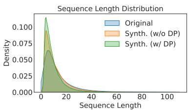  
Figure 4: Synthetic data generated with DP tends to be shorter compared to the data generated without DP. The plot shows sequence length distributions of the synthetic data generated with and without DP and the original customer feedback data.

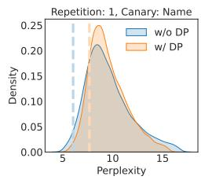

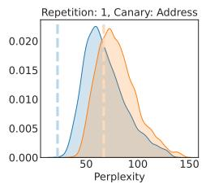

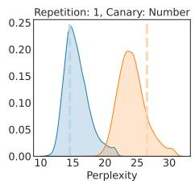

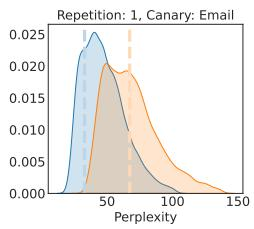

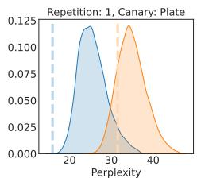

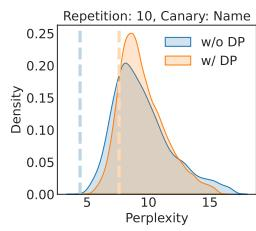

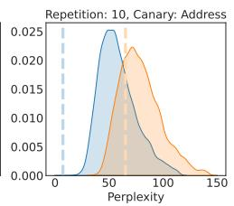

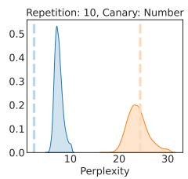

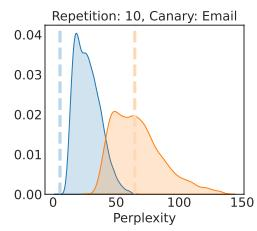

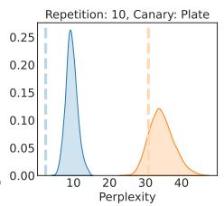

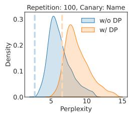

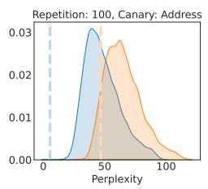

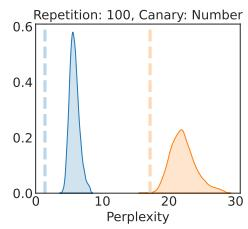

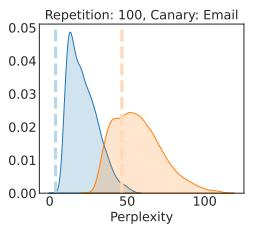

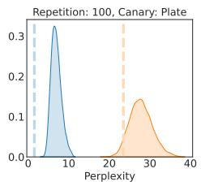  
Figure 5: Distributions of perplexities of private information of injected canary sequences among their similar set of candidates measured by GPT2 models trained with and without DP. The dashed lines represent the perplexity of private information. Even a single-time occurring private information can achieve top rank in a non-private model which is not the case in the models trained with DP

<table><tr><td>Generated Reviews</td><td>Business Category</td><td>Review Stars</td></tr><tr><td>I love sushi! I've never tried a dish on a different menu. We're not going to bother ordering anything else. The only reason I give it 4 stars is that it's not a divey bar where you can't order food, which is not very good. The food is good, especially with the addition of the spicy tuna. It may be good to get some of that spicy stuff when you order in. I'm not the kind of person who likes to eat raw tuna when I can.</td><td>Restaurants</td><td>4.0</td></tr><tr><td>Great food, atmosphere, and service. This is my go to spot for happy hour and specials. We were given free take out. Everything was delicious and fresh.</td><td>Restaurants</td><td>5.0</td></tr><tr><td>My boyfriend and I both have high hopes for this place. First, we wanted to order some of the burgers here. We didn't really need to ask. Our waiter suggested we check out the menu because it was pretty close. He said he liked it. My husband and i also ordered their burgers for him. So, my burger was cold, the side fries were undercooked and they just didn I got a side burger, it's like I've been drinking so long to get a second burger and it barely came out.</td><td>Restaurants</td><td>2.0</td></tr><tr><td>I don't want to waste a review on a place I love and can't stand, but the restaurant is very nice and the food is good. I will be back. The food was very good, although the portions were a little high, and it didn't take long to get the bowl of gumbo, the chicken queso, some meat. However, as for the drinks, they were decent, however I'm a sucker for a big bottle of water with a straw. We got the shrimp tartar and my husband got a cocktail</td><td>Event Plan- ning &amp; Ser- vices</td><td>4.0</td></tr><tr><td>If you are looking for a place to sit outside at night, I would highly recommend this place. The drinks are good and the atmosphere is chill and fun. I have been coming here for years for the best wine at an affordable price.</td><td>Arts &amp; Enter- tainment</td><td>5.0</td></tr><tr><td>After a few years, my family and I decided to try this property. The staff was friendly and accommodating. We rented a room on a whim (which wasn't super exciting since we already had it) and the hotel was ready for our new home. What can I say? So we were not only greeted and greeted at the door, but also told how much we love them. My daughter and her boyfriend both agreed to check them out on our own and left feeling satisfied.</td><td>Hotels Travel</td><td>&amp; 5.0</td></tr><tr><td>Horrible hotel. The hotel was built in 1914. It's a complete lie. I stayed on a Sunday morning. Two people were on the first floor, and the second floor was locked and was not accessible. When we were finally allowed to get a seat on my two couches, we got kicked by one of the front desk. The staff here are very rude. This hotel is on fire. Even the owners are rude and don't know what they're doing. My husband stayed at the hotel for 3 months with his friend. We have NEVER</td><td>Travel</td><td>&amp; 1.0</td></tr><tr><td>So glad we took our Yelp search into the realm of authentic Italian food. I went here for the first time today and ordered à Caesar salad. The Caesar dressing was fresh and a tasty addition to the salad and also very good. Definitely recommend the meatloaf as well. My only complaint would be the price, it was very over priced. For the amount of meat I was eating I’d expect the same amount. For my $50+ Caesar Salad I had to give them a try! Good quality food, good prices and good service.</td><td>Restaurants</td><td>4.0</td></tr><tr><td>This place is great. The gel manicure is super friendly and all the staff is very helpful. I would definitely go back here and recommend it to anyone! I'm going to give five stars because this place is BYOB. It's a little over two blocks from my</td><td>Beauty Spas Restaurants</td><td>5.0</td></tr><tr><td>house. Food is awesome, service is outstanding, drinks are decent. I've never had a bad meal here. They have a very reasonable price point for an authentic Chinese food.</td><td></td><td>5.0</td></tr><tr><td>Service was slow but the customer service was awful! The room was filthy, there was no shower and there wasn't even a lamp on the wall, it was in a dirty room with dirty sheets.</td><td>Hotels Travel</td><td>1.0</td></tr><tr><td>I ordered a cheesesteak and it had a mild flavor to it but nothing amazing. I also ordered the blackberry and bacon and I didn't get much flavor either.</td><td>Restaurants</td><td>2.0</td></tr><tr><td>I had a great time and the service was great. Very friendly. I will def come back here again! Just bought a car and we were looking for something different to eat there. I don't recommend anything on this menu unless your in the mood for a decent meal. My order was prepared ahead</td><td>Restaurants Restaurants</td><td>4.0 3.0</td></tr><tr><td>of time. The food was well done, with the right amount of flavor. For comparison, this might be better than a burger: it's $7 and you'll need a few extras. Delicious! A perfect brunch spot for lunch, brunch or dinner. Try the shrimp and grits.</td><td></td><td></td></tr><tr><td>I've tried a few burgers and it's ok. I don't eat fries (I never do) so don: put them on your salad or whatever else you have on hand. I have been here many times for brunch and dinner.</td><td>Restaurants</td><td>3.0</td></tr><tr><td>This place is one of the best BBQ spots around! They also have many amazing burgers on the menu. The food is always hot and always tasty.</td><td>Bars</td><td>5.0</td></tr><tr><td>One of the best concert venues in Reno. Great space and the sound and lighting is amazing. The sound guys in the stadium really help to get you into the atmosphere with your music and sound.</td><td>Arts &amp; Enter- tainment</td><td>5.0</td></tr><tr><td>We love this place. It has a variety of options in the menu, but I always get the fried chicken which is definitely a better option. If you don't like fried food, there is a decent selection of regular chicken. You could also choose to get their bbq, which I am not a fan of, and get a burger.</td><td>Restaurants</td><td>3.0</td></tr><tr><td>Love the new decor. The new tables are all wood. You don't feel like sitting on an old bed anymore. They even put their old fireplace on the inside. Food was OK - I like the steak house. I liked that you can customize the menu to your taste. The drinks are better too - especially the gin</td><td>Restaurants</td><td>4.0</td></tr><tr><td>Ordered a bunch of items, then received confirmation from my Santa that she had already shipped the items. She did that as I was in the middle of a drive-thru. When I got home I immediately called the store and asked what the order was for. They said that they had ordered a lot of stuff (which is nice) and they wanted to be sure. I said, "Well, what's in it for me?" They told me it would take a little bit to get out, but when I left they said they would send me another box.</td><td>Shopping</td><td>4.0</td></tr><tr><td>This place is a perfect addition to the community. You get a chance to enjoy some outdoor fun and enjoy all the outdoor activities that you'll find in the surrounding area. The staff is attentive and professional. It's a great place to hang out while having a blast.</td><td>Arts &amp; Enter- tainment</td><td>4.0</td></tr><tr><td>I ate here today. My wife and I were in the area. I ordered the "Gumbo Sushi". This was a good value considering the size of the bowl. It was cooked perfectly and the rice was fresh. This place is very well run, friendly and has a great variety of sushi!</td><td>Restaurants</td><td>5.0</td></tr><tr><td>We went here to be checked out. I had gone in about 1 1/2 months before. We asked about getting an appointment and were told they had no one there that could help us and we just had to go to the front desk and ask. They took care of us right away. Their nurse was super nice and helped us with our appointment. Šhe even made sure that we made it into the room without us knowing, and the COG were there to keep me calm during my appointment which was awesome! I would highly recommend this place. The room is</td><td>Medical</td><td></td></tr><tr><td>The food was awesome and friendly. Our server was excellent. I loved that the server wasn't intrusive with my order. The restaurant was clean and a lot of fun. If I could make it back here, I would. We will be back next time I'm in Tucson</td><td>Restaurants</td><td>5.0</td></tr><tr><td>I'm not a fan of Italian cuisine but this was very good. We had the spaghetti and meatballs, but they were also very tasty. Also had a meatball with bacon on top. The food is very inexpensive and very authentic, and the atmosphere is fun and intimate. We will definitely be back!</td><td>Restaurants</td><td>5.0</td></tr><tr><td>Was expecting a classy place for a casual date night and was disappointed. The drinks are not worth it. And the service was horrible!</td><td>Bars</td><td>1.0</td></tr><tr><td>We had a really good time with the team. They were friendly and the service was great. I had the shrimp tacos which were a total keeper. My boyfriend had his "Tacos" and he said they were delicious. The chips and salsa were good too. If your looking for some great local eats in Indy, I highly recommend this place.</td><td>Restaurants</td><td>5.0</td></tr><tr><td>I was looking for a spot to meet friends and I came across this beautiful place! Very quaint and intimate and the service was great as well. Our table was very small but it was fine as the chairs were just the right height to comfortably recline. I highly recommend this place. Will definitely be back!</td><td>Arts &amp; Enter- tainment</td><td>5.0</td></tr><tr><td>I love the food here. It's a bit pricey. My wife and I had an amazing experience there. The place is a great size, it was busy, and we ordered take out. There was also a server who was kind enough to come over, take our order, etc. After about 5 minutes, the waitress came back and said she would make our food for us. This is our first time there, so I think we should make sure we do not order wrong. We asked for the pork and the rice and she said they were out of rice</td><td>Restaurants</td><td>2.0</td></tr><tr><td>Pleasant experience. Great food and great service. Good music and the live music really helped bring out the crowd. Nice, clean place to grab a bite.</td><td>Bars</td><td>4.0</td></tr><tr><td>My boyfriend and I both order the chicken quesadilla, which comes with 3 pieces of chicken, 2 fried tortillas, sour cream, rice, and a guacamole. It comes out in about 5 minutes, the tacos are pretty good and the quinoa is a bit sweet for my taste. Our server was pretty nice, but was not very friendly or helpful. We're all pretty tired by the time we get to our table so we didn't want to spend the extra money. I don't know if my boyfriend got a bad batch of food</td><td>Restaurants</td><td>2.0</td></tr><tr><td>The dentist office at DDS was great. They were very professional and gave a great service. I've had numerous dental problems over the years, so I was happy to see that the dentists they employ are so professional. The only reason I gave them three stars is that there is no phone calling service to call for follow-up, and their website is so poor that I couldn't call and they'd have the call placed over an hour later.</td><td>Health Medical</td><td>&amp; 3.0</td></tr><tr><td>One of the best sushi places in the city! I usually get the chicken and fish roll! It is so fresh and has so much flavor! The service is excellent. They have a nice selection of beer and drinks. I highly recommend this place to everyone who loves sushi.</td><td>Restaurants</td><td>5.0</td></tr><tr><td>The food is phenomenal. The portions are generous. And the service is excellent. I'm so glad I tried The Little Noodle. I've had the chicken curry and the pad thai. It's so good.</td><td>Restaurants</td><td>5.0</td></tr><tr><td>There was a small part of me that wanted to try the curry but I was too fulī.</td><td>Restaurants</td><td>5.0</td></tr><tr><td>My first time at this spot. They were very friendly and accommodating. The place was clean and the service was excellent. I will be coming back! I had a burger and fries.</td><td>Bars</td><td>5.0</td></tr><tr><td>Food was really good! I wish they had a more modern menu but the food is so fresh it would take a long time for me to go back. Great prices too.</td><td>Restaurants</td><td>4.0</td></tr><tr><td>This place should be called Hotdog King because of the price. The food wasn't the best, the burgers were ok, but the whole menu was way too much to consume in one meal. My friend went with her boyfriend and ordered two different burgers. We ordered the cheesesteak medium rare. We waited another 5 minutes before the waiter came to take our food. He took our order and then asked if we wanted our drinks and food brought out. I didn't realize they only have a microwave and microwave oven. It wasnt even hot</td><td>Hotels Travel</td><td>&amp; 1.0</td></tr><tr><td>This place is an awesome experience! The owner and manager were so friendly, friendly and knowledgeable. There were plenty of great options to choose from and I loved every single meal I had! I will definitely be returning to this wonderful spot.</td><td>Event Plan- ning &amp; Ser- vices</td><td>5.0</td></tr><tr><td>Food and service was great. Food was just average and very mediocre. The place was pretty empty, so if you go to check it out be prepared to wait.</td><td>Restaurants</td><td>3.0</td></tr><tr><td>Just ordered the "special" platter of 6 shrimp, 5 wings, and a small drink. The platters are big enough to share, which is a nice touch for two people. I'm not sure what happened to these girls, but every time I walk in and ask for a gel manicure</td><td>Restaurants Beauty</td><td>5.0 &amp; 1.0</td></tr><tr><td>I'm treated with indifference. I have gone in 3 times and never been offered gel or cuticles or anything of the kind. It's just a horrible experience that can leave you feeling very unorganized and unappreciated. I had the worst experience with two different ladies, both of whom are very nice and have done a great job with my nails. The third time was very disappointing. Both ladies seemed to be very frustrated</td><td>Spas</td><td></td></tr><tr><td>If you want a good Cuban, get the ones in West Chester. It's always the same thing. Great service, delicious food and a great price.</td><td>Restaurants</td><td>4.0</td></tr><tr><td>I've been there twice and can't say enough good things about it. The food was absolutely delicious. We ordered the "Biscuits" and "Mac &amp; cheese". I am not sure why the mac and cheese is a biscuit but it was AMAZING! I would recommend coming here and eating it as your meal. This is the first time I’ve tried out this restaurant and it's definitely my new spot to stop in.</td><td>Bars</td><td>5.0</td></tr></table>

Table 10: Randomly sampled synthetic reviews generated by the GPT2 model trained with DP.

Table 11: Randomly sampled synthetic reviews generated by the GPT2-Medium model trained with DP.

Table 12: Randomly sampled synthetic reviews generated by the GPT2-Large model trained with DP.

## ACL 2023 Responsible NLP Checklist

A For every submission: A1. Did you describe the limitations of your work? 9 A2. Did you discuss any potential risks of your work? 10 A3. Do the abstract and introduction summarize the paper's main claims? 1 A4. Have you used AI writing assistants when working on this paper? Left blank.

## B  Did you use or create scientific artifacts? Left blank.

B1. Did you cite the creators of artifacts you used? No response.

B2. Did you discuss the license or terms for use and / or distribution of any artifacts? No response.

B3. Did you discuss if your use of existing artifact(s) was consistent with their intended use, provided that it was specified? For the artifacts you create, do you specify intended use and whether that is compatible with the original access conditions (in particular, derivatives of data accessed for research purposes should not be used outside of research contexts)? No response.

B4. Did you discuss the steps taken to check whether the data that was collected / used contains any information that names or uniquely identifies individual people or offensive content, and the steps taken to protect / anonymize it? No response.

B5. Did you provide documentation of the artifacts, e.g., coverage of domains, languages, and linguistic phenomena, demographic groups represented, etc.? No response.

B6. Did you report relevant statistics like the number of examples, details of train / test / dev splits, etc. for the data that you used / created? Even for commonly-used benchmark datasets, include the number of examples in train / validation / test splits, as these provide necessary context for a reader to understand experimental results. For example, small differences in accuracy on large test sets may be significant, while on small test sets they may not be. No response.

## CDid you run computational experiments? 4,5

C1. Did you report the number of parameters in the models used, the total computational budget (e.g., GPU hours), and computing infrastructure used? Appendix A

C2. Did you discuss the experimental setup, including hyperparameter search and best-found hyperparameter values? Appendix A

C3. Did you report descriptive statistics about your results (e.g., error bars around results, summary statistics from sets of experiments), and is it transparent whether you are reporting the max, mean, etc. or just a single run? 4

C4. If you used existing packages (e.g., for preprocessing, for normalization, or for evaluation), did you report the implementation, model, and parameter settings used (e.g., NLTK, Spacy, ROUGE, etc.)? 4.1

D  Did you use human annotators (e.g., crowdworkers) or research with human participants? Left blank.

D1. Did you report the full text of instructions given to participants, including e.g., screenshots, disclaimers of any risks to participants or annotators, etc.? No response.

D2. Did you report information about how you recruited (e.g., crowdsourcing platform, students) and paid participants, and discuss if such payment is adequate given the participants' demographic (e.g., country of residence)? No response.

D3. Did you discuss whether and how consent was obtained from people whose data you're using/curating? For example, if you collected data via crowdsourcing, did your instructions to crowdworkers explain how the data would be used? No response.

D4. Was the data collection protocol approved (or determined exempt) by an ethics review board? No response.

D5. Did you report the basic demographic and geographic characteristics of the annotator population that is the source of the data? No response.