# TECHS: Temporal Logical Graph Networks for Explainable Extrapolation Reasoning

Qika Lin1,2, Jun Liu1,3∗, Rui Mao4, Fangzhi Xu1,2, Erik Cambria4

1School of Computer Science and Technology, Xi’an Jiaotong University

2Shaanxi Provincial Key Laboratory of Big Data Knowledge Engineering

3National Engineering Lab for Big Data Analytics

4School of Computer Science and Engineering, Nanyang Technological University qikalin@foxmail.com, liukeen@xjtu.edu.cn, rui.mao@ntu.edu.sg, Leo981106@stu.xjtu.edu.cn, cambria@ntu.edu.sg

## Abstract

Extrapolation reasoning on temporal knowledge graphs (TKGs) aims to forecast future facts based on past counterparts. There are two main challenges: (1) incorporating the complex information, including structural dependencies, temporal dynamics, and hidden logical rules; (2) implementing differentiable logical rule learning and reasoning for explainability. To this end, we propose an explainable extrapolation reasoning framework TEemporal logiCal grapH networkS (TECHS), which mainly contains a temporal graph encoder and a logical decoder. The former employs a graph convolutional network with temporal encoding and heterogeneous attention to embed topological structures and temporal dynamics. The latter integrates propositional reasoning and first-order reasoning by introducing a reasoning graph that iteratively expands to find the answer. A forward message-passing mechanism is also proposed to update node representations, and their propositional and first-order attention scores. Experimental results demonstrate that it outperforms state-of-the-art baselines.

## 1 Introduction

Knowledge Graphs (KGs) are widely used in intelligent systems (Ji et al., 2022; Mao et al., 2022; Zhu et al., 2023), where knowledge is commonly represented by triplets in the form of $( s , r , o )$ . The limit of conventional KGs is that real-world knowledge usually evolves over time. For example, a fact (Donald Trump, presidentOf, USA) is incorrect now because Joe Biden has been the new president of the USA since 2021. For more comprehensive representations of knowledge, Temporal Knowledge Graphs (TKGs) (Liang et al., 2022) are proposed by introducing time information (time point or interval) via quadruplets, i.e., (s, r, o, t). Then, the former example is defined as (Donald Trump, presidentOf, USA, 2017/01/20-2021/01/20).

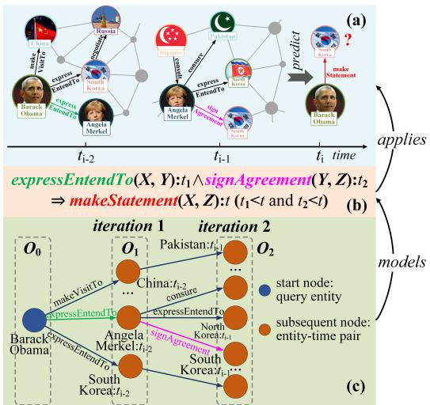  
Figure 1: (a) Illustration of a TKG and extrapolation reasoning. (b) An example of temporal rules that can be applied to answer the query in (a). (c) An example of the reasoning graph that is capable of modeling rule (b).

TKGs are usually incomplete (Cai et al., 2022; Liang et al., 2022). Many studies predicted future facts, based on past facts, namely TKG forecasting or extrapolation reasoning. Figure 1a shows the task that predicts facts at time $t _ { i }$ with the facts at $t _ { i - 2 }$ and $t _ { i - 1 }$ . A model should not only learn topology dependencies, i.e., the neighbor information of an entity (like Barack Obama at $t _ { i - 2 } )$ , but also learn temporal dynamics, i.e., the variations of properties of an entity over time (e.g., Angela Merkel evolves during $t _ { i - 2 } ~ \mathrm { t o } ~ t _ { i - 1 } )$ Thus, temporal embedding methods, e.g., TNT-ComplEx (Lacroix et al., 2020) and CyGNet (Zhu et al., 2021) were proposed. However, these blackbox methods fail to explain their predictions. An explainable method, xERTE (Han et al., 2021) conducted instanced propositional reasoning. However, the model is not scalable, as the evidence is entity-dependent, e.g., related to Barack Obama and other entities in Figure 1a. If we can learn the entity-independent rule in Figure 1b for the query (Barack Obama, makeStatement, ?, ti) in Figure 1a, the correct answer South Korea will be easily obtained after rule grounding.

Motivated by the fact that TKGs have many hidden logical rules to achieve explainable and accurate predictions, TLogic (Liu et al., 2022) searched first-order logical rules and used them for reasoning. However, this two-step pipeline method may cause error propagation issues. Generally, there are two main challenges for explainable extrapolation reasoning on TKGs: (1) TKGs contain diverse information, e.g., structural dependencies, temporal dynamics, and hidden logical rules that are difficult to incorporate together and achieve full coverage; (2) Logical rule representations are discrete and symbolic, resulting in the natural gap between logical rules and the continuous computation of neural networks. Thus, implementing differentiable logical rule learning and reasoning is not directly achievable (Yang et al., 2017).

To address above issues, we propose a unified framework TEemporal logiCal grapH networkS (TECHS). It first utilizes a graph convolutional network (GCN) to embed topological structures and temporal dynamics. To determine the weights of different edges between entities, a generic time encoding and a heterogeneous attention mechanism is introduced. Then, a logical decoder is proposed to integrate propositional and first-order reasoning to find the answer. A reasoning graph that contains both query entity and entity-time pair nodes is used to constantly expand over iterations. We update propositional and first-order attention weights as well as node representations via a novel forward message-passing mechanism. Finally, nodes’ attention weights with the same entity are aggregated as the answer indicator. Besides, first-order logical rules can be induced by a novel Forward Attentive Rule Induction (FARI) algorithm using learned first-order attention weights.

Our contributions are summarized as follows: (1) A unified framework TECHS is proposed to conduct explainable extrapolation reasoning on TKGs. To our best knowledge, this is the first study to jointly model structural dependencies, temporal dynamics, and propositional and first-order reasoning. (2) We integrate propositional and first-order reasoning in a logical decoder, where a forward message-passing is proposed to update their attention weights and node representations to achieve explainability. First-order logical rules are induced by a novel FARI algorithm. (3) Extensive experiments verify the effectiveness of each module and the superiority over state-of-the-art baselines.

## 2 Related Work

The studies of extrapolation reasoning can be categorized into the following three trends.

Static Embedding. By omitting time information in fact quadruplets, general KG embedding methods can be utilized for TKGs, such as TransE (Bordes et al., 2013), DistMult (Yang et al., 2015) and ComplEx (Trouillon et al., 2016). However, these methods simply consider the structural dependency in TKGs and ignore the temporal dynamics.

Temporal Embedding. TTransE (Leblay and Chekol, 2018) expanded TransE to the temporal setting by fusing temporal information in relation embeddings. Similarly, TA-DistMult and TA-TransE (García-Durán et al., 2018) learned relation representations with time information and calculated quadruplet plausibility by DistMult and TransE. Differently, DE-SimplE (Goel et al., 2020) proposed diachronic entity embedding which contained static segment and time-varying segment. Upon ComplEx, TNTComplEx (Lacroix et al., 2020) learned complex-valued embeddings for the entity, relation and time. RE-Net (Jin et al., 2020) learned the global representations of the time subgraph and the local representations of nodes on it. CyGNet (Zhu et al., 2021) introduced a timeaware copy-generation mechanism to model the probability of existing facts, occurring in the future and predicted whether new facts would emerge. However, the aforementioned methods are all in black-box fashion and lack of explainability.

Explainable Reasoning. xERTE (Han et al., 2021) proposed a human-understandable reasoning strategy, introducing an expanding query-relevant subgraph to achieve explainability. TITer (Sun et al., 2021) conducted reasoning from a query node and sequentially transferred to a new node related to the prior on TKGs until the answer was founded. Upon AnyBURL (Meilicke et al., 2019) that sampled paths to learn first-order rules in static KGs, TLogic (Liu et al., 2022) learned temporal logical rules with confidences via a temporal random walk. The candidate scores were obtained by rule applications in TKGs. However, xERTE and TITer conducted propositional reasoning by an end-toend framework that had limited scalability, as its reasoning process was query-specific. Although

TLogic learned query-independent first-order logical rules, its pipeline method might cause error propagation and performance degradation.

## 3 Preliminaries

A TKG can be represented as $\mathcal { G } = \{ \mathcal { E } , \mathcal { R } , \mathcal { T } , \mathcal { F } \}$ where , and denote the set of entity, relation and time, respectively. $\mathcal { F } \subset \mathcal { E } \times \mathcal { R } \times \mathcal { E } \times \mathcal { T }$ is the fact collection. Each fact is a quadruplet, such as $( s , r , o , t )$ where $s , o \in \mathcal { E } , r \in \mathcal { R }$ and $t \in \tau$ . For a query $( \tilde { s } , \tilde { r } , ? , \tilde { t } )$ in testing, the model needs to predict an answer entity o˜, based on the facts that occur earlier than $\tilde { t } , \mathrm { i . e . , } \tilde { t } > m a x ( \mathcal { T } _ { t r a i n } )$

Logical reasoning in KGs can be categorized as: propositional and first-order. Propositional reasoning, generally known as multi-hop reasoning (Ren and Leskovec, 2020; Zhang et al., 2021, 2022a), is entity-dependent that usually reasons over queryrelated paths to obtain an answer. First-order reasoning is entity-independent, using first-order logical (FOL) rules for different entities (Zhang et al., 2022b), describing causal knowledge in the form of body to head, e.g., premise conclusion, where new facts can be deduced, given observed ones. For efficient and explainable reasoning on TKGs, we define the FOTH rule and the reasoning graph.

Definition 1. First-order Temporal Horn (FOTH) Rule: Based on Horn rules (Lin et al., 2022) on static KGs, atoms in FOTH rule body are connected transitively by shared variables. Meanwhile, rule body and rule head have the same start and end variables. Time growth also needs to be satisfied, i.e., time sequence is increasing and the time in the rule head is the maximum. For example, the following rule $\epsilon , \exists X , Y , Z r _ { 1 } ( X , Y ) : t _ { 1 } \land r _ { 2 } ( Y , Z )$ $t _ { 2 } \Rightarrow r ( X , Z )$ : t is a FOTH rule with length 2 if $t _ { 1 } \leqslant t _ { 2 } < t . ~ X , Y$ and $Z$ are variables that can be instantiated as entities of TKGs by rule grounding. Noticeably, for rule learning and reasoning, $t _ { 1 } , t _ { 2 }$ and t are virtual time variables that are only used to satisfy the time growth and do not have to be instantiated. To represent the rule certainty, each rule is assigned with a confidence value $\epsilon \in [ 0 , 1 ]$ Definition 2. Reasoning Graph: For a query $( \tilde { s } , \tilde { r } , ? , \tilde { t } )$ we introduce a reasoning graph $\widetilde { \mathcal { G } } =$ $\{ \mathcal { O } , \mathcal { R } , \tilde { \mathcal { F } } \}$ efor propositional and first-order reasoneing. is a node set that consists of nodes in different iteration steps, i.e., $\mathcal { O } = \mathcal { O } _ { 0 } \cup \mathcal { O } _ { 1 } \cup \cdot \cdot \cdot \cup \mathcal { O } _ { L }$ $\mathcal { O } _ { 0 }$ only contains a query entity s˜ and others consist of nodes in the form of entity-time pairs. $( n _ { i } ^ { l } , \bar { r } , n _ { j } ^ { l + 1 } ) \in \widetilde { \mathcal { F } }$ is an edge that links nodes at two neighbor steps, i.e., $n _ { i } ^ { l } \in \mathcal { O } _ { l } , n _ { j } ^ { l + 1 } \in \mathcal { O } _ { l + 1 }$ and $\bar { r } \in \mathcal { R }$ . The reasoning graph is constantly expanded by searching for posterior neighbor nodes. For start node $n ^ { 0 } = { \tilde { s } } ,$ its posterior neighbors are $\mathcal { N } ( n ^ { 0 } ) =$ $\{ ( e _ { i } , t _ { i } ) | ( \tilde { s } , \bar { r } , e _ { i } , t _ { i } ) \in \mathcal { F } \wedge t _ { i } < \tilde { t } \}$ . For a node in following steps $n _ { i } ^ { l } = ( e _ { i } , t _ { i } ) \in \mathcal { O } _ { l }$ , its posterior neighbors are $\mathcal { N } ( n _ { i } ^ { l } ) = \{ ( e _ { j } , t _ { j } ) | ( e _ { i } , \bar { r } , e _ { j } , t _ { j } ) \in$ $\mathcal { F } \wedge t _ { i } \leqslant t _ { j } \wedge t _ { j } < \tilde { t } \}$ . Its prior parents are $\widetilde { \mathcal { N } } ( n _ { i } ^ { l } ) =$ $\{ ( n _ { j } ^ { l - 1 } , \bar { r } ) | n _ { j } ^ { l - 1 } \in \mathcal { O } _ { l - 1 } \wedge ( n _ { j } ^ { l - 1 } , \bar { r } , n _ { i } ^ { l } ) \in \widetilde { \mathcal { F } } \}$ . An eexample reasoning graph with two steps is shown in Figure 1c. To take prior nodes into account at the current step, an extra relation self is added. Then, $n _ { i } ^ { l } = ( e _ { i } , t _ { i } )$ can be obtained at the next step as $n _ { i } ^ { l + 1 } = \left( e _ { i } , t _ { i } \right) ( t _ { i }$ is the minimum time if $l = 0 )$

## 4 Methodology

There are three key technical parts in TECHS: temporal graph encoder, logical decoder, and extrapolation prediction. Figure 2 shows its architecture.

## 4.1 Temporal Graph Encoder

Generally, GCNs follow an iterative messagepassing strategy to continuously aggregate information from neighbor nodes. As conventional GCNs cannot model time information, we propose a temporal graph encoder. The generic time encoding (Xu et al., 2020) is introduced to embed times in TKGs as it is fully compatible with attention to capture temporal dynamics, which is defined as: $\begin{array} { r } { \mathbf { e } _ { t } = \sqrt { \frac { 1 } { d _ { t } } } [ \cos ( w _ { 1 } t + b _ { 1 } ) , \cdots , \cos ( w _ { d _ { t } } t + b _ { d _ { t } } ) ] } \end{array}$ $[ w _ { 1 } , \cdots , w _ { d _ { t } } ]$ and $[ b _ { 1 } , \cdots , b _ { d _ { t } } ]$ are trainable parameters for transformation weights and biases. $d _ { t }$ is the dimension of time embedding. Based on it, a temporal GCN is proposed by fusing neighbor information with the heterogeneous attention:

$$
\mathbf { h } _ { o } ^ { k + 1 } = \mathbf { W } _ { h 1 } ^ { k } \mathbf { h } _ { o } ^ { k } + \sum _ { ( s , r , t ) \in \widehat { N } ( o ) } \alpha _ { s , r , o , t } ^ { k } \mathbf { W } _ { h 2 } ^ { k } \mathbf { m } _ { s , r , t } ^ { k } ,\tag{1}
$$

where W denotes a transformation matrix. $\widehat { N }$ is the neighbor set. $\mathbf { m } _ { s , r , t } ^ { k }$ bis the message information of neighbors that contains subject, relation and time representations, which is given by:

$$
\mathbf { m } _ { s , r , t } ^ { k } = \mathbf { W } _ { m 1 } ^ { k } \left[ \left( \mathbf { h } _ { s } ^ { k } + \mathbf { e } _ { t } \right) \odot \left( \mathbf { g } _ { r } ^ { k } + \mathbf { e } _ { t } \right) \right] .\tag{2}
$$

h and g are the entity and relation embeddings, respectively. is the element-wise product of two embedding vectors. $\alpha _ { s , r , o , t } ^ { k }$ is a heterogeneous attention value to determine the importance of a current temporal edge. It is obtained by the correlation between time, relation and the current entities:

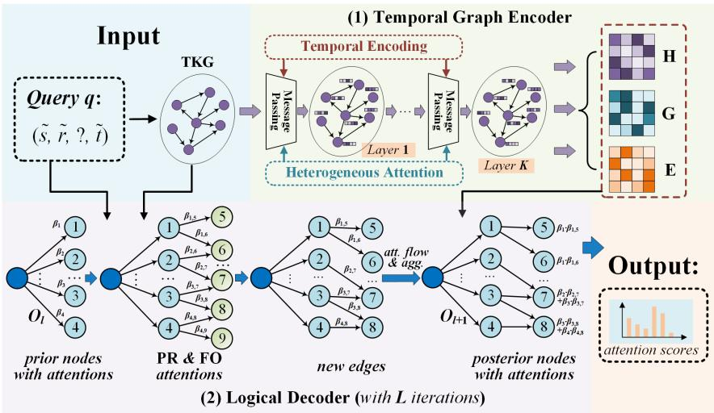  
Figure 2: An overview of the TECHS. The temporal graph encoder utilizes temporal encoding and heterogeneous attention for structural dependencies and temporal dynamics. The logical decoder combines propositional (PR) and first-order (FO) reasoning by continuously conducting forward message-passing in the reasoning graph.

$$
\begin{array} { r l } & { a _ { s , r , o , t } ^ { k } = \sigma \big ( ( \alpha ^ { k } ) ^ { \top } \mathbf { W } _ { a } ^ { k } [ \mathbf { e } _ { t } \| \mathbf { g } _ { r } ^ { k } \| ( \mathbf { h } _ { s } ^ { k } - \mathbf { h } _ { o } ^ { k } ) ] \big ) , } \\ & { \alpha _ { s , r , o , t } ^ { k } = \frac { \exp ( a _ { s , r , o , t } ^ { k } ) } { \sum _ { ( s ^ { \prime } , r ^ { \prime } , t ^ { \prime } ) \in \widehat { \mathcal { N } } ( o ) } \exp ( a _ { s ^ { \prime } , r ^ { \prime } , o , t ^ { \prime } } ^ { k } ) } , } \end{array}\tag{3}
$$

where σ is LeakyReLU (Xu et al., 2015). is concatenation. $\alpha ^ { k }$ is the attention vector to be learned.

Finally, the relation embedding is updated by $\mathbf { g } _ { r } ^ { k + 1 } = \mathbf { W } _ { r } ^ { k } \mathbf { g } _ { r } ^ { k }$ . At the last layer K, the representation matrix H, G and E of entity, relation and time are obtained, then feeding into the logical decoder.

## 4.2 Logical Decoder

For decoding the answer for query $( \tilde { s } , \tilde { r } , \tilde { . } , \tilde { t } )$ , we introduce an iterative forward message-passing mechanism in a continuously expanding reasoning graph, regulated by propositional and first-order reasoning. In the reasoning graph, we set three learnable parameters for each node $n _ { i } ^ { l }$ to guide the computation: node embedding $\mathbf { n } _ { i } ^ { l } ,$ , hidden FOTH embedding ${ \bf 0 } _ { n _ { i } ^ { l } }$ and reasoning attention $\beta _ { n _ { \dot { \alpha } } ^ { l } }$ . The start node $n ^ { 0 } { = } \dot { \tilde { s } }$ is initialized as its embedding $\mathbf { h } _ { \widetilde { s } }$ . A hidden FOTH representation ${ \bf 0 } _ { n ^ { 0 } }$ for $n ^ { 0 }$ is initialized as a query relation embedding $\mathbf { g } _ { \widetilde { r } }$ . The attention weight $\beta _ { n ^ { 0 } }$ for $n ^ { 0 }$ is initialized as 1. The node $\boldsymbol { n } _ { i } = ( e _ { i } , t _ { i } )$ are firstly represented by the linear transformation of GCN embeddings: $\mathbf { n } _ { i } { = } \mathbf { W } _ { n } [ \mathbf { h } _ { e _ { i } } \lVert \mathbf { e } _ { t _ { i } } ]$ . Constant forward computation is required in the reasoning sequence of the target, whether conducting multi-hop propositional reasoning or first-order logic reasoning. Thus, forward message-passing is proposed to pass information (i.e., representations and attention weights) from the prior nodes to their posterior neighbor nodes. The computation of each node is contextualized with prior information that contains both entity-dependent and entity-independent parts, reflecting the continuous accumulation of knowledge and credibility in the reasoning process.

Specifically, to update node embeddings in step l+1, its own feature and the information from its priors are integrated:

$$
\begin{array} { r } { \bar { \mathbf { n } } _ { j } ^ { l + 1 } { = } \mathbf { W } _ { n 1 } ^ { l } \bar { \mathbf { n } } _ { j } + \displaystyle \sum _ { n _ { i } ^ { l } , \bar { r } , n _ { j } ^ { l + 1 } } \beta _ { n _ { i } ^ { l } , \bar { r } , n _ { j } ^ { l + 1 } } \mathbf { W } _ { n 2 } ^ { l } \mathbf { m } _ { n _ { i } ^ { l } , \bar { r } , n _ { j } ^ { l + 1 } } , } \\ { ( n _ { i } ^ { l } , \bar { r } ) \in \widetilde { \mathcal { N } } ( n _ { j } ^ { l + 1 } ) \qquad } \end{array}\tag{4}
$$

where ${ \bf m } _ { n _ { i } ^ { l } , \bar { r } , n _ { i } ^ { l + 1 } }$ is the message from a prior node to its posterior node, which is given by the node and relation representations:

$$
\mathbf { m } _ { n _ { i } ^ { l } , \bar { r } , n _ { j } ^ { l + 1 } } = \mathbf { W } _ { m 2 } ^ { l } [ \mathbf { n } _ { i } ^ { l } \lVert \mathbf { g } _ { \bar { r } } \rVert \mathbf { n } _ { j } ] .\tag{5}
$$

This updating form superficially seems similar to the general message-passing in GCNs. However, they are actually different as ours is in a one-way and hierarchical manner, which is tailored for the tree-like structure of the reasoning graph.

The attention weight $\beta _ { n _ { i } ^ { l } , \bar { r } , n _ { j } ^ { l + 1 } }$ for each edge in a reasoning graph contains two parts: propositional and first-order attention. As propositional attention is entity-dependent, we compute it by the semantic association of entity-dependent embeddings between the message and the query:

$$
e _ { n _ { i } ^ { l } , \bar { r } , n _ { j } ^ { l + 1 } } ^ { 1 } = \mathrm { S I G M O I D } \big ( \mathbf { W } _ { p } ^ { l } [ \mathbf { m } _ { n _ { i } ^ { l } , \bar { r } , n _ { j } ^ { l + 1 } } ^ { 1 } \| \mathbf { q } ] \big ) ,\tag{6}
$$

where $\mathbf { q } = \mathbf { W } _ { q } [ \mathbf { h } _ { \tilde { s } } \vert \vert \mathbf { g } _ { \tilde { r } } \vert \vert \mathbf { e } _ { \tilde { t } } ]$ is the query embedding. As first-order reasoning focuses on the interaction among entity-independent relations, we first obtain the hidden FOTH embedding of an edge by fusing the hidden FOTH embedding of the prior node and current relation representation via a gated recurrent unit (GRU) (Chung et al., 2014). Then, the firstorder attention is given by:

$$
\begin{array} { r l } & { \mathbf { 0 } _ { n _ { i } ^ { l } , \bar { r } , n _ { j } ^ { l + 1 } } = \mathbf { G R U } \big ( \mathbf { g } _ { \bar { r } } , \mathbf { 0 } _ { n _ { i } ^ { l } } \big ) , } \\ & { e _ { n _ { i } ^ { l } , \bar { r } , n _ { j } ^ { l + 1 } } ^ { 2 } = \mathrm { S I G M O I D } \big ( \mathbf { W } _ { f } ^ { l } \mathbf { 0 } _ { n _ { i } ^ { l } , \bar { r } , n _ { j } ^ { l + 1 } } \big ) . } \end{array}\tag{7}
$$

Furthermore, the overall reasoning attention can be obtained by incorporating propositional and firstorder parts to realize the complementarity of these two reasoning methods. Since the prior node with high credibility leads to faithful subsequent nodes, the attention of the prior flows to the current edge. Then, the softmax normalization is utilized to scale edge attentions on this iteration to [0,1]:

$$
\begin{array} { r l } & { ~ e _ { n _ { i } ^ { l } , \bar { r } , n _ { j } ^ { l + 1 } } = \beta _ { n _ { i } ^ { l } } ( e _ { n _ { i } ^ { l } , \bar { r } , n _ { j } ^ { l + 1 } } ^ { 1 } + \lambda e _ { n _ { i } ^ { l } , \bar { r } , n _ { j } ^ { l + 1 } } ^ { 2 } ) , } \\ & { ~ \beta _ { n _ { i } ^ { l } , \bar { r } , n _ { j } ^ { l + 1 } } = \frac { \exp ( e _ { n _ { i } ^ { l } , \bar { r } , n _ { j } ^ { l + 1 } } ) } { \sum _ { ( n _ { i ^ { \prime } } ^ { l } , \bar { r } ^ { \prime } ) \in \widetilde { N } ( n _ { j } ^ { l + 1 } ) } \exp ( e _ { n _ { i ^ { \prime } } ^ { l } , \bar { r } ^ { \prime } , n _ { j } ^ { l + 1 } } ) } , } \end{array}\tag{8}
$$

where $\lambda$ is the weight for balancing the two reasoning types. Finally, the FOTH representation and attention of a new node $n _ { j } ^ { l + 1 }$ are aggregated from edges for the next iteration:

$$
\begin{array} { c } { { \displaystyle { \bf 0 } _ { n _ { j } ^ { l + 1 } } = \sum _ { \scriptstyle ( n _ { i } ^ { l } , \bar { r } ) \in \widetilde { \cal N } ( n _ { j } ^ { l + 1 } ) } \beta _ { n _ { i } ^ { l } , \bar { r } , n _ { j } ^ { l + 1 } } { \bf 0 } _ { n _ { i } ^ { l } , \bar { r } , n _ { j } ^ { l + 1 } } , } } \\ { { \displaystyle { ( n _ { i } ^ { l } , \bar { r } ) \in \widetilde { \cal N } ( n _ { j } ^ { l + 1 } ) } } } \\ { { \beta _ { n _ { j } ^ { l + 1 } } = \sum _ { \scriptstyle ( n _ { i } ^ { l } , \bar { r } ) \in \widetilde { \cal N } ( n _ { j } ^ { l + 1 } ) } \beta _ { n _ { i } ^ { l } , \bar { r } , n _ { j } ^ { l + 1 } } . } } \end{array}\tag{9}
$$

Insights of FOTH Rule Learning and Reasoning. In general, the learning and reasoning of first-order logical rules on KGs or TKGs are usually in twostep fashion (Galárraga et al., 2013, 2015; Qu and Tang, 2019; Zhang et al., 2019; Qu et al., 2021; Vardhan et al., 2020; Liu et al., 2022; Cheng et al., 2022; Lin et al., 2023). First, it searches over whole data to mine rules and their confidences. Second, for a query, the model instantiates all variables to find all groundings of learned rules and then aggregates all confidences of eligible rules. For example, for a target entity $^ { O , }$ its score can be the sum of learned rules with valid groundings and rule confidences can be modeled by a GRU. However, this is apparently not differentiable and cannot be optimized by an end-to-end manner. Thus, our model conducts the transformation of merging multiple rules by merging possible relations at each step, using first-order attention as:

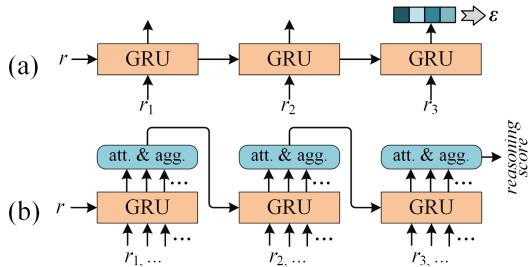  
Figure 3: Illustration of insights of FOTH rule learning and reasoning. (a) Learning rule confidence for a specific rule $r _ { 1 } ( X , Y _ { 1 } ) \land r _ { 2 } ( Y _ { 1 } , Y _ { 2 } ) \land r _ { 3 } ( Y _ { 2 } , Z ) \Rightarrow r ( X , Z )$ (time information is omitted). (b) Rule learning and reasoning process in TECHS, which performs attention aggregation of possible relations at each step to realize differentiable computing.

$$
\begin{array} { r l } & { S _ { o } \mathbf { = } { \displaystyle \sum _ { \gamma \in \Gamma } } \beta _ { \gamma } } \\ & { \quad = { \displaystyle \sum _ { \gamma \in \Gamma } } f \left[ \operatorname { G R U } ( \mathbf { g } _ { \gamma , h } , \mathbf { g } _ { \gamma , b ^ { 1 } } , \cdots , \mathbf { g } _ { \gamma , b ^ { | \gamma | } } ) \right] } \\ & { \quad \approx \displaystyle \prod _ { l = 1 } ^ { L } { \displaystyle \sum _ { n _ { j } \in \mathcal { O } _ { l } } } \bar { f } _ { l } \left[ \operatorname { G R U } ( \mathbf { g } _ { \bar { r } } , \mathbf { 0 } _ { n _ { j } } ^ { l } ) ) \right] . } \end{array}\tag{10}
$$

$\beta _ { \gamma }$ is the confidence of rule γ. $\mathbf { g } _ { \gamma , h }$ and $\mathbf { g } _ { \gamma , b ^ { i } }$ are the relation embeddings of head h and i-th body $b ^ { i }$ of this rule. $\bar { f } _ { l }$ is for the attention calculation. In this way, the differentiable process is achieved. This is an extension and progression of Neural-LP (Yang et al., 2017) and DURM (Sadeghian et al., 2019) on TKGs. Figure 3 intuitively illustrates such transformation. Finally, the real FOTH rules can be easily induced to constantly perform attention calculation over the reasoning graph, which is summarized as FARI in Algorithm 1.

## 4.3 Extrapolation Prediction

After attention weights for nodes in the last decoding step L have been obtained, we can aggregate node attentions with the same entity to get the entity score: $\begin{array} { r } { S _ { o } = \sum _ { n _ { i } ^ { L } = ( o , t _ { i } ) } \beta _ { n _ { i } ^ { L } } } \end{array}$ . All entity scores can be normalized into [0,1] by $\hat { y } _ { o } = \frac { S _ { o } } { \sum _ { p } S _ { p } }$ . Compared with the true label $y _ { o }$ , the model can be optimized by a binary cross-entropy loss:

$$
\mathcal { L } = - \sum _ { o } y _ { o } \log ( \hat { y } _ { o } ) + ( 1 - y _ { o } ) ( 1 - \log ( \hat { y } _ { o } ) ) .\tag{11}
$$

The number of nodes may explode in the logical decoder as it shows an exponential increase to reach $| \mathcal { N } ( n _ { i } ) | ^ { L }$ by iterations. For computational efficiency, posterior neighbors of each node are sampled with a maximum of M nodes in each iteration. For sampling M node in the reasoning graph, we follow a time-aware weighted sampling strategy, considering that recent events may have a greater impact on the forecast target. Specifically, for a posterior neighbor node with time $t ^ { \prime }$ , we compute its sampling weight by $\frac { \exp ( t ^ { \prime } - \tilde { t } ) } { \sum _ { \bar { t } } \exp ( \bar { t } - \tilde { t } ) }$ for the query $( \tilde { s } , \tilde { r } , \tilde { . } , \tilde { t } )$ , where t¯ denotes the time of all possible posterior neighbor nodes for a prior node. After computing attention weights for each edge in the same iteration, we select top-N among them with larger attention weights and prune others. As we add an extra $s e l f$ relation in the reasoning graph, the FARI algorithm can obtain all possible rules (no longer than length L) by deleting existing atoms with the self relation in induced FOTH rules.

Algorithm 1: FARI for FOTH rules.   
Input: the reasoning graph ${ \widetilde { \mathcal { G } } } ,$ attentions $e ^ { 2 } .$   
eOutput: the FOTH rule set Γ.   
1 Init $\dot { \Gamma } = \emptyset , B ( n _ { \tilde { s } } ^ { 0 } ) = [ 0 , [ ] ] , \mathcal { D } _ { 0 } [ n _ { \tilde { s } } ^ { 0 } ] = [ 1 , B ( n _ { \tilde { s } } ^ { 0 } ) ]$   
2 for l=1 to L ofdecoder iterations do   
3 Initialize node-rule dictionary $\mathcal { D } _ { l } ;$   
4 for node $n _ { j } ^ { l }$ in $\mathcal { O } _ { l }$ do   
5 Set rule body list $B ( n _ { j } ^ { l } ) = [ ]$   
6 for $( n _ { i } ^ { l - 1 } , \bar { r } ) o f \widetilde { \mathcal { N } } ( n _ { j } ^ { l } )$ in $\mathcal { O } _ { l - 1 }$ do   
7 Prior $e _ { i , l - 1 } ^ { 2 } , B ( \check { n } _ { i } ^ { l - 1 } ) = { \mathcal { D } } _ { l - 1 } [ n _ { i } ^ { l - 1 } ] ;$   
8 for weight ϵ, body γ in $B ( n _ { i } ^ { l - 1 } )$ do   
9 $\epsilon ^ { \prime } = e _ { i , l - 1 } ^ { 2 } \cdot e _ { n _ { i } ^ { l - 1 } , \bar { r } , n _ { j } ^ { l } } ^ { 2 }$   
10 $\gamma _ { b } ^ { \prime } = \gamma _ { b } . a d d ( \bar { r } ) ,$   
$B ( n _ { j } ^ { l } ) . a d d ( [ \epsilon ^ { \prime } , \gamma _ { b } ^ { \prime } ] )$   
11 $e _ { j , l } ^ { 2 } = s u m \{ [ \epsilon \in B ( n _ { j } ^ { l } ) ] \}$   
12 Add $n _ { j } ^ { l } \colon [ e _ { j , l } ^ { 2 } , B ( n _ { j } ^ { l } ) ]$ to $\mathcal { D } _ { l }$   
13 Normalize $e _ { j , l } ^ { 2 }$ of $n _ { j } ^ { l }$ in $\mathcal { O } _ { l }$ using softmax;   
14 for $n _ { i } ^ { L }$ in $\mathcal { O } _ { L }$ do   
15 $\dot { e _ { i , L } ^ { 2 } } , B ( n _ { i } ^ { L } ) = \mathcal { D } _ { L } [ n _ { j } ^ { L } ]$ ;   
16 for $\epsilon , \gamma _ { b } i n B ( n _ { i } ^ { L } )$ do   
17 $\Gamma . a d d ( [ \epsilon , \gamma _ { b } [ 1 ] ( X , Y _ { 1 } ) : t _ { 1 } \wedge \dots \wedge$   
$\gamma _ { b } [ L ] \vert \dot { ( Y _ { L - 1 } , Z ) } : t _ { L } \Rightarrow \tilde { r } ( X , Z ) : t ] )$   
18 Return rule set $\Gamma .$

## 5 Experiments and Results

## 5.1 Datasets and Experiment Setup

We conduct experiments on five common TKG datasets for extrapolation reasoning, i.e., ICEWS14, ICEWS18, ICEWS0515, WIKI (Leblay and Chekol, 2018) and YAGO (Mahdisoltani et al., 2015), which are the union ones of model xERTE, TITer and TLogic. The first three are all the subsets of Integrated Crisis Early Warning System (O’brien, 2010). The last two contain massive real facts that are distinguished by years. The statistics of these five datasets are detailed in Table 1.

<table><tr><td>Dataset</td><td>ε</td><td>|R|</td><td>T</td><td>|Ftrain|</td><td>|Fvalid|</td><td>|Ftest|</td></tr><tr><td>ICEWS14</td><td>7,128</td><td></td><td>230 365</td><td>63,685 13,823</td><td></td><td>13,222</td></tr><tr><td>ICEWS18</td><td></td><td></td><td></td><td>23,033 256 304 373,018 45,995</td><td></td><td>549,545</td></tr><tr><td>ICEWS0515</td><td></td><td></td><td></td><td>10,4882514,017 322,95869,224</td><td></td><td>69,147</td></tr><tr><td>WIKI</td><td>12,55424</td><td></td><td>232</td><td>539,286 67,538</td><td></td><td>63,110</td></tr><tr><td>YAGO</td><td>10,62310</td><td></td><td>189</td><td></td><td>16,154019,523</td><td>20,026</td></tr></table>

Table 1: The statistics of five TKG datasets.

For training and testing, we add an inverse relation for each relation in TKGs. Thus, for the head entity prediction of query $( ? , \tilde { r } , \tilde { o } , \tilde { t } )$ , we can predict results by its variant $( \tilde { o } , \tilde { r } ^ { - 1 } , ? , \tilde { t } )$ . For testing, time-filter setting is used in which all correct entities at the query time except for the true query object are filtered out from answers. For entities out of the final iteration of the reasoning graph, we set their scores as 0. Mean reciprocal rank (MRR) and Hits@k (H@k for abbreviation, k is 1, 3 or 10) are selected as evaluation metrics, where larger values denote better performance. The above settings are all in line with baselines for equal comparison.

We introduce fourteen baselines in three technical trends: (1) Static Embedding: TransE (Bordes et al., 2013), DistMult (Yang et al., 2015) and ComplEx (Trouillon et al., 2016). (2) Temporal Embedding: TTransE (Leblay and Chekol, 2018), TA-DistMult (García-Durán et al., 2018), TA-TransE (García-Durán et al., 2018), DE-SimplE (Goel et al., 2020), TNTComplEx (Lacroix et al., 2020), RE-Net (Jin et al., 2020) and CyGNet (Zhu et al., 2021). (3) Explainable Reasoning: xERTE (Han et al., 2021), TITer (Sun et al., 2021), AnyBURL (Meilicke et al., 2019) and TLogic (Liu et al., 2022). When conducting experiments, the default max number of sampled nodes and selected edges are 600 and 100, respectively. The learning rate, GCN layers, GCN dimensions, iteration steps, decoder dimensions and first-order weight λ are set to 0.001, 2, 200, 3, 50 and 0.65 by default. Adam algorithm (Kingma and Ba, 2015) is utilized to optimize the model parameters. When conducting experiments, out model is implemented in DGL (Wang et al., 2019) and Py-Torch (Paszke et al., 2019), and trained on a single GPU of NVIDIA Tesla V100 with 32G memory.

## 5.2 Comparison Results

In each dataset, we run five times with different random seeds and report their mean results in Table 2 and Table 3. As shown, our TECHS has achieved advanced performance. Compared with static embedding and temporal embedding models, e.g., the strongest RE-Net, our metrics have been greatly improved by 5.6%, 5.91%, 8.02% and 7.43% in ICEWS14. The performance of TECHS is also competitive with the explainable reasoning methods. It outperforms xERTE, TITer and AnyBURL by 3.09%, 2.15% and 14.21% MRR in ICEWS14, respectively. It demonstrates TECHS makes up for the shortcomings of simply using propositional reasoning or static first-order logical rules on TKGs. Finally, compared with the state-of-the-art TLogic, TECHS also shows certain improvements, i.e., achieving better performance on all twelve metrics of ICEWS14, ICEWS0515 and ICEWS18 datasets. TECHS has an average improvement of 0.92%, 1.65% and 1.26% on these three datasets. Besides, TECHS yields 0.48%, 3.37%, 1.77% and 2.12% improvements in MRR and Hits@10 metrics in WIKI and YAGO datasets, compared with the state-of-the-art TITer. In summary, the results show the superiority of our model that conducts temporal graph embedding as well as integrates propositional and first-order reasoning.

<table><tr><td rowspan="2">Model</td><td colspan="4">ICEWS14</td><td colspan="4">ICEWS0515</td><td colspan="4">ICEWS18</td></tr><tr><td>MRR</td><td>H@1</td><td>H@3</td><td>H@10</td><td>MRR</td><td>H@1</td><td>H@3</td><td>H@10</td><td>MRR</td><td>H@1</td><td>H@3</td><td>H@10</td></tr><tr><td>TransE</td><td>22.48</td><td>13.36</td><td>25.63</td><td>41.23</td><td>22.55</td><td>13.05</td><td>25.61</td><td>42.05</td><td>12.24</td><td>5.84</td><td>12.81</td><td>25.10</td></tr><tr><td>DistMult</td><td>27.67</td><td>18.16</td><td>31.15</td><td>46.96</td><td>28.73</td><td>19.33</td><td>32.19</td><td>47.54</td><td>10.17</td><td>4.52</td><td>10.33</td><td>21.25</td></tr><tr><td>ComplEx</td><td>30.84</td><td>21.51</td><td>34.48</td><td>49.58</td><td>31.69</td><td>21.44</td><td>35.74</td><td>52.04</td><td>21.01</td><td>11.87</td><td>23.47</td><td>39.87</td></tr><tr><td>TTransE</td><td>13.43</td><td>3.11</td><td>17.32</td><td>34.55</td><td>15.71</td><td>5.00</td><td>19.72</td><td>38.02</td><td>8.31</td><td>1.92</td><td>8.56</td><td>21.89</td></tr><tr><td>TA-DistMult</td><td>26.47</td><td>17.09</td><td>30.22</td><td>45.41</td><td>24.31</td><td>14.58</td><td>27.92</td><td>44.21</td><td>16.75</td><td>8.61</td><td>18.41</td><td>33.59</td></tr><tr><td>TA-TransE</td><td>17.41</td><td>0.00</td><td>29.19</td><td>47.41</td><td>19.37</td><td>1.81</td><td>31.34</td><td>50.33</td><td>12.59</td><td>0.01</td><td>17.92</td><td>37.38</td></tr><tr><td>DE-SimplE</td><td>32.67</td><td>24.43</td><td>35.69</td><td>49.11</td><td>35.02</td><td>25.91</td><td>38.99</td><td>52.75</td><td>19.30</td><td>11.53</td><td>21.86</td><td>34.80</td></tr><tr><td>TNTComplEx</td><td>32.12</td><td>23.35</td><td>36.03</td><td>49.13</td><td>27.54</td><td>19.52</td><td>30.80</td><td>42.86</td><td>21.23</td><td>13.28</td><td>24.02</td><td>36.91</td></tr><tr><td>RE-Net</td><td>38.28</td><td>28.68</td><td>41.34</td><td>54.52</td><td>42.97</td><td>31.26</td><td>46.85</td><td>63.47</td><td>28.81</td><td>19.05</td><td>32.44</td><td>47.51</td></tr><tr><td>CyGNet</td><td>32.73</td><td>23.69</td><td>36.31</td><td>50.67</td><td>34.97</td><td>25.67</td><td>39.09</td><td>52.94</td><td>24.93</td><td>15.90</td><td>28.28</td><td>42.61</td></tr><tr><td>xERTE†</td><td>40.79</td><td>32.70</td><td>45.67</td><td>57.30</td><td>46.62</td><td>37.84</td><td>52.31</td><td>63.92</td><td>29.31</td><td>21.03</td><td>33.51</td><td>46.48</td></tr><tr><td>TITer†</td><td>41.73</td><td>32.74</td><td>46.46</td><td>58.44</td><td></td><td></td><td></td><td></td><td>29.98</td><td>22.05</td><td>33.46</td><td>44.83</td></tr><tr><td>AnyBURL‡</td><td>29.67</td><td>21.26</td><td>33.33</td><td>46.73</td><td>32.05</td><td>23.72</td><td>35.45</td><td>50.46</td><td>22.77</td><td>15.10</td><td>25.44</td><td>38.91</td></tr><tr><td>TLogic†</td><td>43.04</td><td>33.56</td><td>48.27</td><td>61.23</td><td>46.97</td><td>36.21</td><td>53.13</td><td>67.43</td><td>29.82</td><td>20.54</td><td>33.95</td><td>48.53</td></tr><tr><td>TECHS</td><td>43.88</td><td>34.59</td><td>49.36</td><td>61.95</td><td>48.38</td><td>38.34</td><td>54.69</td><td>68.92</td><td>30.85</td><td>21.81</td><td>35.39</td><td>49.82</td></tr></table>

Table 2: The experiment results (%) in ICEWS14, ICEWS0515 and ICEWS18. The optimal and suboptimal values of each metric are marked in bold and underlined respectively. Results of “ ” are from Liu et al. (2022), “ ” means the results are from its original paper and others are all from Han et al. (2021).
<table><tr><td rowspan="2">Model</td><td colspan="2">WIKI</td><td colspan="2">YAGO</td></tr><tr><td>MRR</td><td>H@10</td><td>MRR</td><td>H@10</td></tr><tr><td>TTransE</td><td>29.27</td><td>42.39</td><td>31.19</td><td>51.21</td></tr><tr><td>TA-DistMult</td><td>44.53</td><td>51.71</td><td>54.92</td><td>66.71</td></tr><tr><td>DE-SimplE</td><td>45.43</td><td>49.55</td><td>54.91</td><td>60.17</td></tr><tr><td>TNTComplEx</td><td>45.03</td><td>52.03</td><td>57.98</td><td>66.69</td></tr><tr><td>CyGNet</td><td>33.89</td><td>41.86</td><td>52.07</td><td>63.77</td></tr><tr><td>RE-Net</td><td>49.66</td><td>53.48</td><td>58.02</td><td>66.29</td></tr><tr><td>xERTE</td><td>71.14</td><td>79.01</td><td>84.19</td><td>89.78</td></tr><tr><td>TITer</td><td>75.50</td><td>79.02</td><td>87.47</td><td>90.27</td></tr><tr><td>TECHS</td><td>75.98</td><td>82.39</td><td>89.24</td><td>92.39</td></tr></table>

Table 3: The experiment results (%) in WIKI and YAGO. The baseline results are from Sun et al. (2021).
<table><tr><td rowspan=1 colspan=1>Ablation</td><td rowspan=1 colspan=1>ICEWS14MRRH@10</td><td rowspan=1 colspan=1>ICEWS0515MRRH@10</td><td rowspan=1 colspan=1>ICEWS18MRR H@10</td></tr><tr><td rowspan=1 colspan=1>TECHS</td><td rowspan=1 colspan=1>43.8861.95</td><td rowspan=1 colspan=1>48.3868.92</td><td rowspan=1 colspan=1>30.85 49.82</td></tr><tr><td rowspan=4 colspan=1>w/o time∆w/o emd∆</td><td rowspan=1 colspan=1>43.4460.74</td><td rowspan=1 colspan=1>47.61 67.16</td><td rowspan=1 colspan=1>30.11 48.96</td></tr><tr><td rowspan=1 colspan=1>0.44  1.21</td><td rowspan=1 colspan=1>0.77  1.76</td><td rowspan=1 colspan=1>0.74 0.86</td></tr><tr><td rowspan=1 colspan=1>42.45 60.21</td><td rowspan=1 colspan=1>46.57 66.68</td><td rowspan=1 colspan=1>29.8748.34</td></tr><tr><td rowspan=1 colspan=1>1.43  1.74</td><td rowspan=1 colspan=1>1.81  2.24</td><td rowspan=1 colspan=1>0.98 1.48</td></tr><tr><td rowspan=4 colspan=1>w/o PR∆w/o FO∆</td><td rowspan=1 colspan=1>42.5758.41</td><td rowspan=1 colspan=1>46.1  65.36</td><td rowspan=1 colspan=1>28.84 46.93</td></tr><tr><td rowspan=1 colspan=1>1.31  3.54</td><td rowspan=1 colspan=1>2.28  3.56</td><td rowspan=1 colspan=1>2.01 2.89</td></tr><tr><td rowspan=1 colspan=1>42.8460.06</td><td rowspan=1 colspan=1>46.2765.49</td><td rowspan=1 colspan=1>29.78 47.59</td></tr><tr><td rowspan=1 colspan=1>1.04  1.89</td><td rowspan=1 colspan=1>2.11  3.43</td><td rowspan=1 colspan=1>1.07 2.23</td></tr></table>

Table 4: The ablation results (%). PR and FO denote propositional and first-order respectively.

## 5.3 Ablation Studies

To verify the effectiveness of each module in TECHS, ablation studies are carried out in Table 4. For “w/o time”, we remove the time embedding in the GCN. “w/o emd” means we remove the whole GCN encoder module and perform random initialization for embeddings. For the logical decoder, “w/o PR” or “w/o FO” means that we remove propositional or first-order attention in Eq. 8 when computing nodes’ attention for the ablation of the corresponding reasoning pattern. We analyze the results from the following two aspects: First, both topology structures and time dynamics in GCN embeddings contribute to extrapolation reasoning. When only removing time information, the metrics decrease slightly compared with the whole GCN ablation, e.g., 0.44% vs. 1.43% MRR drops in ICEWS14. Second, for logical reasoning, both propositional and first-order logic reasoning is important. Propositional reasoning has a bigger impact in ICEWS14 than first-order reasoning (3.54% vs. 1.89% Hits@10 drops), while they have roughly the same effect in ICEWS0515 and ICEWS18 (3.56% vs. 3.43%, 2.89% vs. 2.23% Hits@10 drops). This may be due to the different topology structures of different datasets, resulting in different logical reasoning patterns. In summary, ablation studies show that structural dependencies and temporal dynamics as well as propositional and first-order reasoning all bring positive gains.

## 5.4 Hyperparameter Analysis

We run our model with different hyperparameters to explore weight impacts in Figure 4. Figure 4a shows the changes in the performance of models with different sampling hyperparameters M and N, where small values would lead to great performance decline. This is because fewer nodes and edges lead to insufficient and unstable training, respectively. When increasing M and N, the GPU memory of the model will increase rapidly in Figure 4b, especially for M. We also record the average training time of one epoch with different M and N in Figure 4c. Its overall trend is consistent with Figures 4a and 4b. In general, TECHS is time efficient as the running time is between 0.2 and 1 hour.

Figure 4d shows the impact of different weights when using first-order reasoning, where smaller weights show worse results, generally. Thus, the FOTH rule is functional for extrapolation reasoning on TKGs. Different contextualized, e.g., vanilla RNN, GRU, LSTM (Hochreiter and Schmidhuber, 1997) for FOTH rule learning and reasoning are compared in Figure 4e, where GRU outperforms the other two competitors. RNN performs worst, showing that simple models are not competent enough for discrete structures of FOTH rules.

To explore the effects of decoder iterations on model performance, we carry out experiments with iteration L=1, 2, 3, 4 in ICEWS14, ICEWS0515 and ICEWS18. As Figure 4f shows, the performance generally improves with the iteration increasing. The metrics of L=3 and L=4 are similar, which shows that the answer is usually in the adjacent hops of the target entity. Larger hops bring more candidates, which may affect model performance, e.g., Hits@10 values drop when L=4 in ICEWS14 and ICEWS18. Therefore, L=3 is selected as the default setting in our experiments.

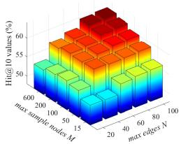  
(a) Model performance.

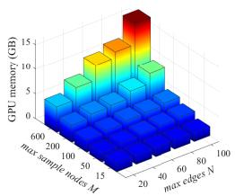  
(b) GPU memory.

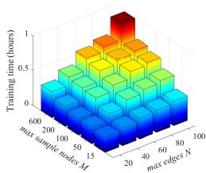  
(c) Model running time.

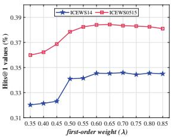  
(d) First-order weight.

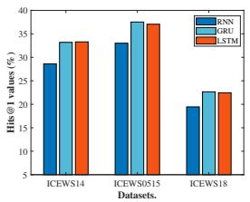  
(e) RNN implementations.

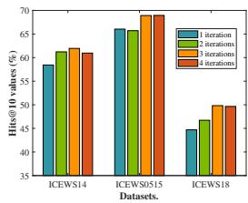  
(f) Effects of iterations.  
Figure 4: The effects of hyperparameters. (a), (b) and (c) are the effects of M and N on performance, GPU memory and training time. (d) denotes the impacts of the first-order weight. (e) and (f) show results with different RNN implementations and decoder iterations.

## 5.5 Case Study for Explainable Reasoning

Figure 5 visualizes two reasoning graphs on ICEWS14 and ICEWS0515, showing the extrapolation reasoning process of TECHS. The propositional attention weights of nodes are listed nearby them, which represent the propositional reasoning score of each node at the current step. For example, the uppermost propositional reasoning path from Massoud Barzani to Iran: 2014-08-26 in case B learned a large attention score for the correct answer Iran. Generally, nodes with more prior neighbors or larger prior attention weights significantly impact subsequent steps and the prediction of final entity scores. From both reasoning cases, we induce several FOTH rules using the FARI algorithm. Some typical ones with their confidence scores are shown in Table 5. For example, the rule [7] with lower confidence is learned for the prediction of the false candidate Iraq in case B. These attentions and FOTH rules demonstrate the explainability of our model. Besides, we observe that propositional and first-order reasoning have an incompletely consistent effect. Thus, they can be integrated to jointly guide the reasoning process, leading to more accurate reasoning results.

(b) case B in ICEWS0515  
No. ϵ premise conclusion   
[1] 0.22 makeAppeal(X,Y ):t consult−1(Y ,Y ):t makeStatement(Y ,Z):t appealCooperation(X,Z):t   
caseA [2] 0.13 hostVisit−1(X,Y1):t1 signAgreement(Y1,Y2):t2 praise(Y2,Z):t3 appealCooperation(X,Z):t   
[3] 0.06 expressIntentTo(X,Y ):t expressIntentTo(Y ,Y ):t makeStatement(Y ,Z):t appealCooperation(X,Z):t   
[4] 0.17 demand(X,Y1):t1 makeStatement(Y1,Y2):t2 engageCooperation−1(Y2,Z): t3 makeStatement(X,Z):t   
caseB [5] 0.16 consult(X,Y ):t expressIntentTo−1(Y ,Y ):t consult−1(Y ,Z):t makeStatement(X,Z):t   
[6] 0.10 demand(X,Y1):t1 consult(Y1,Y2):t2 makeStatement(Y2,Z):t3 makeStatement(X,Z):t   
[7] 0.04 praise(X,Y):t makeStatement(Y,Z):t makeStatement(X,Z):t  
Table 5: Some FOTH rules learned during the reasoning process correspond to two cases in Figure 5. Existing signs ( ) are omitted for better exhibition and relations marked with red represent the target relation to be predicted.

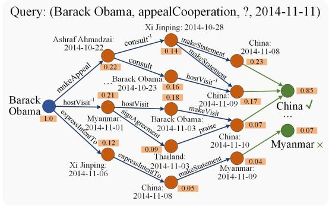

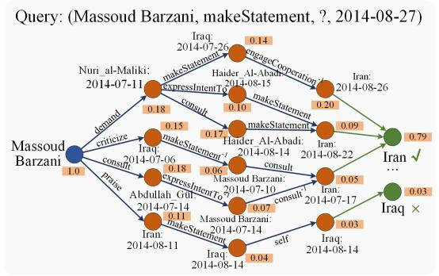  
Figure 5: Cases of the reasoning processes, where values in orange rectangles represent propositional attentions.

## 6 Conclusion

To effectively integrate complex information on TKGs and implement differentiable logical reasoning, this work proposes TECHS which mainly contains a temporal graph encoder and a logical decoder. The former utilizes the temporal encoding and heterogeneous attention to embed structural dependencies and temporal dynamics. The latter realizes differentiable rule learning and reasoning by continuously conducting forward message-passing in the proposed reasoning graph. Finally, FOTH rules can be easily induced by a novel FARI algorithm. In the future, we will explore mining more types of rules on TKGs, such as numerical rules (Wang et al., 2020), and expand to the scenario of inductive reasoning (Pan et al., 2022).

## 7 Limitations

Due to the massive combination of relations and times on TKGs, balancing the model performance and efficiency is challenging. Our model TECHS performs well as Section 5.2 and 5.4 discussed. However, there is also a limitation. TECHS is a two-step approach that can be further improved if we can fuse logical reasoning in the graph encoder like ConGLR (Lin et al., 2022). The model will be more efficient for computational space and time.

## Acknowledgments

This work was supported by National Key Research and Development Program of China (2022YFC3303600), National Natural Science Foundation of China (62137002, 62293553, 62250066, 62176207, 62192781, and 62250009), Innovative Research Group of the National Natural Science Foundation of China (61721002), “LENOVO-XJTU” Intelligent Industry Joint Laboratory Project, Foundation of Key National Defense Science and Technology Laboratory (6142101210201), Project of China Knowledge Centre for Engineering Science and Technology, Natural Science Basic Research Program of Shaanxi (2023-JC-YB-293), the Youth Innovation Team of Shaanxi Universities, XJTU Teaching Reform Research Project “Acquisition Learning Based on Knowledge Forest”.

## Ethical Statement

We honor the ethical code set out in the ACL Code of Ethics.

## References

Antoine Bordes, Nicolas Usunier, Alberto García-Durán, Jason Weston, and Oksana Yakhnenko. 2013. Translating embeddings for modeling multirelational data. In Advances in Neural Information Processing Systems (NeurIPS), pages 2787–2795.

Borui Cai, Yong Xiang, Longxiang Gao, He Zhang, Yunfeng Li, and Jianxin Li. 2022. Temporal knowledge graph completion: A survey. CoRR, abs/2201.08236.

Kewei Cheng, Jiahao Liu, Wei Wang, and Yizhou Sun. 2022. Rlogic: Recursive logical rule learning from knowledge graphs. In The 28th ACM SIGKDD Conference on Knowledge Discovery and Data Mining (KDD), pages 179–189. ACM.

Junyoung Chung, Çaglar Gülçehre, KyungHyun Cho, and Yoshua Bengio. 2014. Empirical evaluation of gated recurrent neural networks on sequence modeling. CoRR, abs/1412.3555.

Luis Galárraga, Christina Teflioudi, Katja Hose, and Fabian M. Suchanek. 2015. Fast rule mining in ontological knowledge bases with AMIE+. The VLDB Journal, 24(6):707–730.

Luis Antonio Galárraga, Christina Teflioudi, Katja Hose, and Fabian M. Suchanek. 2013. AMIE: association rule mining under incomplete evidence in ontological knowledge bases. In 22nd International World Wide Web Conference (WWW), pages 413–422. ACM.

Alberto García-Durán, Sebastijan Dumancic, and Mathias Niepert. 2018. Learning sequence encoders for temporal knowledge graph completion. In Proceedings ofthe 2018 Conference on Empirical Methods in Natural Language Processing (EMNLP), pages 4816–4821.

Rishab Goel, Seyed Mehran Kazemi, Marcus A. Brubaker, and Pascal Poupart. 2020. Diachronic embedding for temporal knowledge graph completion. In The Thirty-Fourth AAAI Conference on Artificial Intelligence (AAAI), pages 3988–3995.

Zhen Han, Peng Chen, Yunpu Ma, and Volker Tresp. 2021. Explainable subgraph reasoning for forecasting on temporal knowledge graphs. In 9th International Conference on Learning Representations (ICLR).

Sepp Hochreiter and Jürgen Schmidhuber. 1997. Long short-term memory. Neural computation, 9(8):1735– 1780.

Shaoxiong Ji, Shirui Pan, Erik Cambria, Pekka Marttinen, and Philip S. Yu. 2022. A survey on knowledge graphs: Representation, acquisition, and applications. TNNLS, 33(2):494–514.

Woojeong Jin, Meng Qu, Xisen Jin, and Xiang Ren. 2020. Recurrent event network: Autoregressive structure inferenceover temporal knowledge graphs. In EMNLP, pages 6669–6683.

Diederik P. Kingma and Jimmy Ba. 2015. Adam: A method for stochastic optimization. In 3rd International Conference on Learning Representations (ICLR).

Timothée Lacroix, Guillaume Obozinski, and Nicolas Usunier. 2020. Tensor decompositions for temporal knowledge base completion. In 8th International Conference on Learning Representations (ICLR).

Julien Leblay and Melisachew Wudage Chekol. 2018. Deriving validity time in knowledge graph. In Companion of the Web Conference (WWW), pages 1771– 1776. ACM.

Ke Liang, Lingyuan Meng, Meng Liu, Yue Liu, Wenxuan Tu, Siwei Wang, Sihang Zhou, Xinwang Liu, and Fuchun Sun. 2022. Reasoning over different types of knowledge graphs: Static, temporal and multi-modal. CoRR, abs/2212.05767.

Qika Lin, Jun Liu, Fangzhi Xu, Yudai Pan, Yifan Zhu, Lingling Zhang, and Tianzhe Zhao. 2022. Incorporating context graph with logical reasoning for inductive relation prediction. In The 45th International ACM SIGIR Conference on Research and Development in Information Retrieval (SIGIR), pages 893–903.

Qika Lin, Rui Mao, Jun Liu, Fangzhi Xu, and Erik Cambria. 2023. Fusing topology contexts and logical rules in language models for knowledge graph completion. Information Fusion, 90:253–264.

Yushan Liu, Yunpu Ma, Marcel Hildebrandt, Mitchell Joblin, and Volker Tresp. 2022. Tlogic: Temporal logical rules for explainable link forecasting on temporal knowledge graphs. In Thirty-Sixth AAAI Conference on Artificial Intelligence (AAAI), pages 4120– 4127. AAAI Press.

Farzaneh Mahdisoltani, Joanna Biega, and Fabian M. Suchanek. 2015. YAGO3: A knowledge base from multilingual wikipedias. In Seventh Biennial Conference on Innovative Data Systems Research.

Rui Mao, Xiao Li, Mengshi Ge, and Erik Cambria. 2022. MetaPro: A computational metaphor processing model for text pre-processing. Information Fusion, 86-87:30–43.

Christian Meilicke, Melisachew Wudage Chekol, Daniel Ruffinelli, and Heiner Stuckenschmidt. 2019. Anytime bottom-up rule learning for knowledge graph completion. In Proceedings of the Twenty-Eighth International Joint Conference on Artificial Intelligence (IJCAI), pages 3137–3143.

Sean P O’brien. 2010. Crisis early warning and decision support: Contemporary approaches and thoughts on future research. International Studies Review, 12(1):87–104.

Yudai Pan, Jun Liu, Lingling Zhang, Tianzhe Zhao, Qika Lin, Xin Hu, and Qianying Wang. 2022. Inductive relation prediction with logical reasoning using contrastive representations. In Proceedings of the

2022 Conference on Empirical Methods in Natural Language Processing (EMNLP), pages 4261–4274.

Adam Paszke, Sam Gross, Francisco Massa, Adam Lerer, James Bradbury, Gregory Chanan, Trevor Killeen, Zeming Lin, Natalia Gimelshein, Luca Antiga, Alban Desmaison, Andreas Köpf, Edward Z. Yang, Zachary DeVito, Martin Raison, Alykhan Tejani, Sasank Chilamkurthy, Benoit Steiner, Lu Fang, Junjie Bai, and Soumith Chintala. 2019. Pytorch: An imperative style, high-performance deep learning library. In Advances in Neural Information Processing Systems (NeurIPS), pages 8024–8035.

Meng Qu, Junkun Chen, Louis-Pascal A. C. Xhonneux, Yoshua Bengio, and Jian Tang. 2021. Rnnlogic: Learning logic rules for reasoning on knowledge graphs. In 9th International Conference on Learning Representations (ICLR).

Meng Qu and Jian Tang. 2019. Probabilistic logic neural networks for reasoning. In Advances in Neural Information Processing Systems (NeurIPS), pages 7710–7720.

Hongyu Ren and Jure Leskovec. 2020. Beta embeddings for multi-hop logical reasoning in knowledge graphs. In Advances in Neural Information Processing Systems (NeurIPS).

Ali Sadeghian, Mohammadreza Armandpour, Patrick Ding, and Daisy Zhe Wang. 2019. DRUM: end-toend differentiable rule mining on knowledge graphs. In Advances in Neural Information Processing Systems (NeurIPS), pages 15321–15331.

Haohai Sun, Jialun Zhong, Yunpu Ma, Zhen Han, and Kun He. 2021. Timetraveler: Reinforcement learning for temporal knowledge graph forecasting. In Proceedings of the 2021 Conference on Empirical Methods in Natural Language Processing (EMNLP), pages 8306–8319.

Théo Trouillon, Johannes Welbl, Sebastian Riedel, Éric Gaussier, and Guillaume Bouchard. 2016. Complex embeddings for simple link prediction. In Proceedings of the 33nd International Conference on Machine Learning (ICML), volume 48, pages 2071– 2080.

L. Vivek Harsha Vardhan, Guo Jia, and Stanley Kok. 2020. Probabilistic logic graph attention networks for reasoning. In Companion ofThe 2020 Web Conference, pages 669–673. ACM / IW3C2.

Minjie Wang, Lingfan Yu, Da Zheng, Quan Gan, Yu Gai, Zihao Ye, Mufei Li, Jinjing Zhou, Qi Huang, Chao Ma, Ziyue Huang, Qipeng Guo, Hao Zhang, Haibin Lin, Junbo Zhao, Jinyang Li, Alexander J. Smola, and Zheng Zhang. 2019. Deep graph library: Towards efficient and scalable deep learning on graphs. CoRR, abs/1909.01315.

Po-Wei Wang, Daria Stepanova, Csaba Domokos, and J. Zico Kolter. 2020. Differentiable learning of numerical rules in knowledge graphs. In 8th International Conference on Learning Representations (ICLR).

Bing Xu, Naiyan Wang, Tianqi Chen, and Mu Li. 2015. Empirical evaluation of rectified activations in convolutional network. CoRR, abs/1505.00853.

Da Xu, Chuanwei Ruan, Evren Körpeoglu, Sushant Kumar, and Kannan Achan. 2020. Inductive representation learning on temporal graphs. In 8th International Conference on Learning Representations (ICLR).

Bishan Yang, Wen-tau Yih, Xiaodong He, Jianfeng Gao, and Li Deng. 2015. Embedding entities and relations for learning and inference in knowledge bases. In 3rd International Conference on Learning Representations (ICLR).

Fan Yang, Zhilin Yang, and William W. Cohen. 2017. Differentiable learning of logical rules for knowledge base reasoning. In Advances in Neural Information Processing Systems (NeurIPS), pages 2319–2328.

Jing Zhang, Xiaokang Zhang, Jifan Yu, Jian Tang, Jie Tang, Cuiping Li, and Hong Chen. 2022a. Subgraph retrieval enhanced model for multi-hop knowledge base question answering. In Proceedings ofthe 60th Annual Meeting ofthe Associationfor Computational Linguistics (ACL), pages 5773–5784.

Wen Zhang, Jiaoyan Chen, Juan Li, Zezhong Xu, Jeff Z. Pan, and Huajun Chen. 2022b. Knowledge graph reasoning with logics and embeddings: Survey and perspective. CoRR, abs/2202.07412.

Wen Zhang, Bibek Paudel, Liang Wang, Jiaoyan Chen, Hai Zhu, Wei Zhang, Abraham Bernstein, and Huajun Chen. 2019. Iteratively learning embeddings and rules for knowledge graph reasoning. In The World Wide Web Conference (WWW), pages 2366–2377.

Yao Zhang, Hongru Liang, Adam Jatowt, Wenqiang Lei, Xin Wei, Ning Jiang, and Zhenglu Yang. 2021. GMH: A general multi-hop reasoning model for KG completion. In Proceedings of the 2021 Conference on Empirical Methods in Natural Language Processing (EMNLP), pages 3437–3446.

Cunchao Zhu, Muhao Chen, Changjun Fan, Guangquan Cheng, and Yan Zhang. 2021. Learning from history: Modeling temporal knowledge graphs with sequential copy-generation networks. In Thirty-Fifth AAAI Conference on Artificial Intelligence (AAAI), pages 4732–4740.

Yifan Zhu, Qika Lin, Hao Lu, Kaize Shi, Donglei Liu, James Chambua, Shanshan Wan, and Zhendong Niu. 2023. Recommending learning objects through attentive heterogeneous graph convolution and operationaware neural network. IEEE Transactions on Knowledge and Data Engineering (TKDE), 35(4):4178– 4189.

## ACL 2023 Responsible NLP Checklist

A For every submission: ✓ A1. Did you describe the limitations of your work? 7 ✓ A2. Did you discuss any potential risks of your work? 4.3 ✓ A3. Do the abstract and introduction summarize the paper’s main claims? 1 ✗ A4. Have you used AI writing assistants when working on this paper? Left blank.

## B ✗ Did you use or create scientific artifacts? Left blank.

 B1. Did you cite the creators of artifacts you used? No response.

 B2. Did you discuss the license or terms for use and / or distribution of any artifacts? No response.

 B3. Did you discuss if your use of existing artifact(s) was consistent with their intended use, provided that it was specified? For the artifacts you create, do you specify intended use and whether that is compatible with the original access conditions (in particular, derivatives of data accessed for research purposes should not be used outside of research contexts)? No response.

 B4. Did you discuss the steps taken to check whether the data that was collected / used contains any information that names or uniquely identifies individual people or offensive content, and the steps taken to protect / anonymize it? No response.

 B5. Did you provide documentation of the artifacts, e.g., coverage of domains, languages, and linguistic phenomena, demographic groups represented, etc.? No response.

 B6. Did you report relevant statistics like the number of examples, details of train / test / dev splits, etc. for the data that you used / created? Even for commonly-used benchmark datasets, include the number of examples in train / validation / test splits, as these provide necessary context for a reader to understand experimental results. For example, small differences in accuracy on large test sets may be significant, while on small test sets they may not be. No response.

## C ✓ Did you run computational experiments?

5

✓ C1. Did you report the number of parameters in the models used, the total computational budget (e.g., GPU hours), and computing infrastructure used? 5.4

✓ C2. Did you discuss the experimental setup, including hyperparameter search and best-found hyperparameter values? 5.1

✗ C3. Did you report descriptive statistics about your results (e.g., error bars around results, summary statistics from sets of experiments), and is it transparent whether you are reporting the max, mean, etc. or just a single run? No. We follow the same experimental setting and result presentation of previous studies for equal comparison. We runfive times with different random seeds and report their mean resultsfor each dataset.

✗ C4. If you used existing packages (e.g., for preprocessing, for normalization, or for evaluation), did you report the implementation, model, and parameter settings used (e.g., NLTK, Spacy, ROUGE, etc.)? No. We did not use such packages.

D ✗ Did you use human annotators (e.g., crowdworkers) or research with human participants? Left blank.

 D1. Did you report the full text of instructions given to participants, including e.g., screenshots, disclaimers of any risks to participants or annotators, etc.? No response.

 D2. Did you report information about how you recruited (e.g., crowdsourcing platform, students) and paid participants, and discuss if such payment is adequate given the participants’ demographic (e.g., country of residence)? No response.

 D3. Did you discuss whether and how consent was obtained from people whose data you’re using/curating? For example, if you collected data via crowdsourcing, did your instructions to crowdworkers explain how the data would be used? No response.

 D4. Was the data collection protocol approved (or determined exempt) by an ethics review board? No response.

 D5. Did you report the basic demographic and geographic characteristics of the annotator population that is the source of the data? No response.