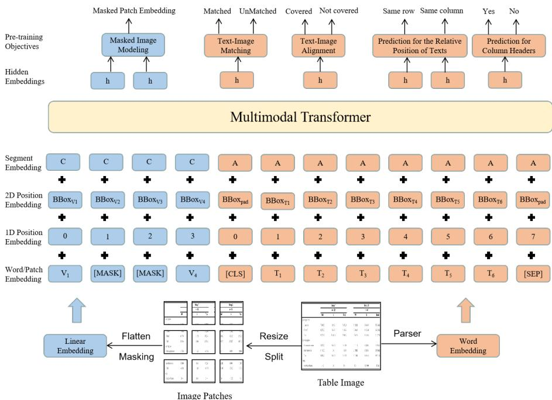
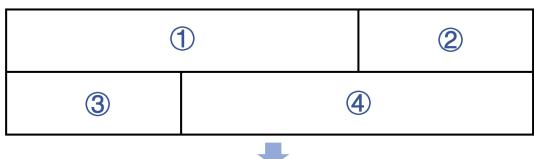

# TableVLM: Multi-modal Pre-training for Table Structure Recognition

Leiyuan Chen1,2, Chengsong Huang1,2 Xiaoqing Zheng1,2,∗

Jinshu Lin3, Xuanjing Huang1,2

1School of Computer Science, Fudan University, Shanghai, China 2Shanghai Key Laboratory of Intelligent Information Processing 3Hundsun {20210240034,huangcs19,zhengxq}@fudan.edu.cn linjs13607@hundsun.com, xjhuang@fudan.edu.cn

## Abstract

Tables are widely used in research and business, and are suitable for human consumption, but not easily machine-processable, particularly when tables are present in images. One of the main challenges to extracting data from images of tables is to accurately recognize table structures, especially for complex tables with cross rows and columns. In this study, we propose a novel multi-modal pre-training model for table structure recognition, named TableVLM. With a two-stream multi-modal transformer-based encoder-decoder architec ture, TableVLM learns to capture rich table structure-related features by multiple carefullydesigned unsupervised objectives inspired by the notion of masked visual-language modeling. To pre-train this model, we also created a dataset, called ComplexTable, which consists of 1, 000K samples to be released publicly. Experiment results show that the model built on pre-trained TableVLM can improve the performance up to 1.97% in tree-editing-distancescore on ComplexTable.

## 1 Introduction

Tables are quite useful for displaying data in an organized manner and they are widely used in research and business due to their readability and simplicity. Recently, such semi-structured (tabular) data has attracted more attention because of its ubiquitous presence in almost all types of documents such as medical records, insurance files, and scientific articles (Staar et al., 2018). However, in many cases, we can only access images of tabular data. The format information will be lost if a table is turned into an image. It is very hard to recover the structure of tables from their images because tables differ significantly in structure, notation, and representation. Once the table structure is accurately recognized, its texts can be easily extracted with the help of optical character recognition (OCR) toolkit and reorganized into a ta-

<table><tr><td rowspan="2">Childhood behavioral inhibition ①</td><td>②</td><td>Parental Mlness type (PIT)</td><td></td><td rowspan="2">Ali ③</td></tr><tr><td>PD</td><td>Pure MD</td><td>Controls</td></tr><tr><td>BI-</td><td>17.68±2.04 (n = 29)</td><td>17.71±1.28 (n = 11)</td><td>17.24±1.86 (n=21)</td><td>17.54±1.85 (n=61)</td></tr><tr><td>BI+</td><td>17.46±1.76 (n=16)</td><td>18.08 ± 2.39 (n = 5)</td><td>18.36 (n = 1)</td><td>17.64±1.84 (n = 22)</td></tr></table>

(a) An example of table image with multi-column headers, multi-row headers and some missing dividing lines.

<table><tr><td rowspan=2 colspan=1>Childhoodbehaviouralinhibition</td><td rowspan=1 colspan=3>Parental illness type(PIT)</td><td rowspan=2 colspan=1>All</td></tr><tr><td rowspan=1 colspan=1>PD</td><td rowspan=1 colspan=1>Pure MD</td><td rowspan=1 colspan=1>Controls</td></tr><tr><td rowspan=1 colspan=1>Bl-</td><td rowspan=1 colspan=1>17.68±2.04(n=29)</td><td rowspan=1 colspan=1>17.71±1.28(n=11)</td><td rowspan=1 colspan=1>17.24±1.86(n=21)</td><td rowspan=1 colspan=1>17.54±1.85(n=61)</td></tr><tr><td rowspan=1 colspan=1>Bl+</td><td rowspan=1 colspan=1>17.46±1.76(n=16)</td><td rowspan=1 colspan=1>18.08±2.39(n=5)</td><td rowspan=1 colspan=1>18.36(n=1)</td><td rowspan=1 colspan=1>17.64±1.84(n=22)</td></tr></table>

(b) The ground truth structure of the example table. The table cells used to show different headers are indicated by distinct colors.

<table><tr><td rowspan=1 colspan=1></td><td rowspan=1 colspan=1>PD</td><td rowspan=1 colspan=1>Pure MD</td><td rowspan=1 colspan=1>Controls</td><td rowspan=1 colspan=1></td></tr><tr><td rowspan=1 colspan=1>Bl-</td><td rowspan=1 colspan=1>17.68±2.04(n=29)</td><td rowspan=1 colspan=1>17.71±1.28(n=11)</td><td rowspan=1 colspan=1>17.24±1.86(n=21)</td><td rowspan=1 colspan=1>17.54±1.85(n=61)</td></tr><tr><td rowspan=1 colspan=1>Bl+</td><td rowspan=1 colspan=1>17.46±1.76(n=16)</td><td rowspan=1 colspan=1>18.08±2.39(n=5)</td><td rowspan=1 colspan=1>18.36(n=1)</td><td rowspan=1 colspan=1>17.64±1.84(n=22)</td></tr></table>

(c) The structure recognized by PDFlux

<table><tr><td rowspan=1 colspan=1>Childhoodbehaviouralinhibition</td><td rowspan=1 colspan=1></td><td rowspan=1 colspan=1>Parental illnesstype(PIT)</td><td rowspan=1 colspan=1></td><td rowspan=1 colspan=1>All</td></tr><tr><td rowspan=1 colspan=1></td><td rowspan=1 colspan=1>PD</td><td rowspan=1 colspan=1>Pure MD</td><td rowspan=1 colspan=1>Controls</td><td rowspan=1 colspan=1></td></tr><tr><td rowspan=1 colspan=1>BI-</td><td rowspan=1 colspan=1>17.68±2.04(n=29)</td><td rowspan=1 colspan=1>17.71±1.28(n=11)</td><td rowspan=1 colspan=1>17.24±1.86(n=21)</td><td rowspan=1 colspan=1>17.54±1.85(n=61)</td></tr><tr><td rowspan=1 colspan=1>Bl+</td><td rowspan=1 colspan=1>17.46±1.76(n=16)</td><td rowspan=1 colspan=1>18.08±2.39(n=5)</td><td rowspan=1 colspan=1>18.36(n=1)</td><td rowspan=1 colspan=1>17.64±1.84(n=22)</td></tr></table>

(d) The structure recognized by Tabby

Figure 1: Some typical mistakes made by two representative table recognition toolkits: PDFlux1 and Tabby2 (Shigarov et al., 2018). The former fails to recognize the multi-column header of “Parental illness type (PIT)” while the latter can not arrange all the headers as they were originally presented.

ble as they were presented in the image. Therefore, table structure recognition is considered a critical task for automatic document understanding, and many competitions around this task have been held in the research and business communities (Göbel et al., 2013; Gao et al., 2019; Jimeno-Yepes et al., 2021; Kayal et al., 2021).

Tables vary greatly in structure and style, which seriously hinders the machine from accurately recognizing their structures. Tabular data is typically organized in rows and columns, but possibly in a more complex structure. Tables may contain multirow and multi-column cells or their combinations (Singh et al., 2018). Certain styles might be applied by intentionally removing some horizontal or vertical dividing lines, using non-standard spacing and different text formatting (Singh et al., 2018). The diversity and complexity in the table’s structure and presentation pose a major challenge for recovering the structures of tables from their images.

A couple of methods have been proposed to address this challenge by applying the recent deep neural architectures, including graph neural networks (GNNs) (Zhou et al., 2020) and transformers (Vaswani et al., 2017), to image-based table structure recognition task (Li et al., 2019; Zhong et al., 2019a; Nassar et al., 2022). However, these methods still perform unsatisfactory, especially when encountering tables with more complex structures. For example, we show in Figure 1 some mistakes made by PDFlux and Tabby (Shigarov et al., 2018), two representative table recognition toolkits. PDFlux fails to recognize the multi-column header of “Parental illness type (PIT)”, and Tabby can not arrange all the headers as they were presented in the original image. Such typical mistakes were also commonly observed when applying other table structure recognition models to similar tables.

In this study, we explore the feasibility of pretraining a multi-modal model particularly designed for table structure recognition. In order to improve the recognition accuracy for tables with complex structures, two new pre-training tasks (or objectives) are introduced: prediction for column headers, and prediction for the relative position of texts, in addition to existing masked image modeling, text-image matching and text-image alignment tasks. Observing that there are no datasets that include a large number of complex tables, we created a new dataset, named ComplexTable, consisting of over 1, 000K tables and their images, ranging from tables in scientific articles to those in financial reports. Based on the proposed training methods and the created dataset, we developed a pre-trained multi-modal model, named TableVLM (Table Visual Language Model). Through extensive experimentation, we show that TableVLM pretrained on ComplexTable dataset with the newlyintroduced training objectives and fine-tuned afterward achieved the highest accuracy in the table structure recognition across multiple datasets.

Our contributions of this study are summarized as follows:

• We proposed TableVLM, a multi-modal pretrained model for table structure recognition, which is pre-trained with three traditional multi-modal pretraining tasks and two newlyintroduced ones (i.e., column headers prediction and relative positions of texts prediction).

• We constructed a new dataset, ComplexTable, consisting of over 1, 000K tables, in which most of them are those with more complex structures. The source code, created dataset, and pre-trained model were released publicly.

• Through extensive experimentation, we show that fine-tuned TableVLM achieved state-ofthe-art results across a wide range of datasets on table structure recognition, and outperformed the second-best model by 1.97% on complex table structure.

• We conducted an ablation study to prove the effectiveness of each proposed pretraining objective and its impact on downstream tasks.

## 2 Related Work

## 2.1 Table Structure Recognition

Early studies on table structure recognition usually adopted (often pre-defined) layout-based (Hassan and Baumgartner, 2007) or heuristic-based approaches (Oro and Ruffolo, 2009). In the layoutbased approaches, multiple possible table templates are first designed, and then each template will be matched against the images of documents containing tables for structure recognition. In the heuristicbased methods, a set of rules are specified for table detection and decomposition. Although these methods can achieve good results for lucid tables, they may fail when table styles become quite diverse or table structures become more complex.

Recently, due to the advance of machine learning techniques and the availability of large datasets, deep neural networks have been explored for many vision-related tasks. Image-to-text networks and graph neural networks are two popular networks for table structure recognition. An image-to-text network predicts a sequence of tokens by taking the encoding of an image as input, in which the encoder-decoder architecture is often used. Tablebank (Li et al., 2019) applies a traditional encoderdecoder architecture, where a convolutional neural network is used as the encoder and a recurrent neural network as the decoder. TableFormer (Nassar et al., 2022) extends the previous work and applies transformer-based architectures as both the encoder and decoder. GNN-based methods take vertex and edge features as input and generate their representations (often iteratively) using graph attention blocks. For the table structure recognition, each of the text cells is represented as a vertex in the graph (Xue et al., 2019, 2021; Chi et al., 2019a). However, the accuracy of recognized structures produced by these methods is still not comparable to the state-of-the-art (Li et al., 2020). Following the encoder-decoder architecture, we design two novel pretraining tasks specifically for table images, leading to the new state-of-the-art.

## 2.2 Multi-modal Pre-training Methods

Pre-trained models (PMs) have achieved impressive performance on various downstream tasks in both computer vision and text domains. PMs aim to learn better task-irrelevant representations from a large collection of data. Most PMs were trained in an unsupervised or a self-supervised way because they usually contain a large number of parameters and a huge volume of unlabelled data is required to tune their parameters. Pre-training tasks need to be carefully designed so that the features learned from large unlabelled texts can be well transferred to many downstream tasks.

In the multi-modal learning scenario, many pretraining tasks have been explored. ViLBERT (Lu et al., 2019) was proposed to obtain task-agnostic visio-linguistic representations by pre-training on four pretraining tasks: visual question answering, visual commonsense reasoning, grounding referring expressions, and caption-based image retrieval. Their experimental results show that the trained model can successfully align texts with their images. However, the datasets of these tasks need to be labeled manually. Therefore, the model was not trained in an unsupervised manner and this method cannot be trivially extended to other tasks.

VLBERT (Su et al., 2019) replaced two singlemodal networks (separately applied on input sentences and images respectively) with a unified single-stream architecture. Two pretraining tasks were used in VLBERT: masked language modeling with visual clues and masked region-of-interest classification with linguistic clues. The model was trained to predict the missing part from a modality by using the clue from another modality. The latter task aims to classify the masked patch in the image. These two tasks are not useful to table structure recognition because they were designed to reconstruct texts or images rather than the structures present in inputs.

In the pre-trained model for visually-rich document understanding, some useful pre-training tasks were proposed. Multilingual masked visuallanguage modeling was also explored in the pretraining phase (Xu et al., 2020b,a). Like the mask language modeling, the models were trained to predict the masked tokens based on their textual contexts and layout information. Xu et al. (2021) proposed two new pre-training tasks, text-image alignment (TIA) and text-image matching (TIM). These tasks were designed for table content extraction rather than table structure recognition.

## 3 Multi-modal Pre-training Scheme

In the following, we first present the architecture of TableVLM. Then, we depict our introduced embedding layer and proposed pre-training tasks. Finally, our pre-training method is described.

## 3.1 Architecture

We use an encoder-decoder architecture to perform the task of table structure recognition. We pre-train an encoder and a decoder separately with some pretraining tasks carefully designed for each of them. The encoder is trained to obtain better cross-modal representations and the decoder learns to generate a sequence of HTML tags where the table structures are well representated.

At the pretraining phase of the encoder, we use a unified text-image multi-modal transformer to learn cross-modal representations. The transformer has a multi-layer architecture and each layer mainly consists of multi-head self-attention and position-wise fully connected feed-forward networks (Vaswani et al., 2017). The input of the transformer is a sequence of embeddings, each of them is the concatenation of text embedding $\mathbf { Y } = \mathbf { y } _ { 1 : L }$ and image patch embedding $\mathbf { X } = \mathbf { x } _ { 1 : M }$ , where L and M are the lengths of textual and image patch sequences respectively. The outputs of the transformer are contextual text-and-image representations.

At the pretraining stage of the decoder, we freeze the parameters of the pre-trained encoder and take the encoder as a feature extractor that generates a feature representation of an input table image. Like the encoder, the architecture of the decoder has multi-layers and each layer consists of multi-head self-attention and position-wise fully connected feed-forward networks (Vaswani et al., 2017). The output of the decoder is a sequence of HTML tags that captures the structure of a table image.

## 3.2 Input Embedding

In addition to the table image, the textual and layout information of the table is quite useful and informative to table structure recognition and significantly affects the accuracy of recognition results. Therefore, we want the encoder can capture the features of texts, images, and their layouts simultaneously. The overall architecture of the encoder used at the pre-training stage is shown in Figure 2. Each type of information is converted to the corresponding embedding sequence before it goes through the encoder. The encoder establishes deep interactions within and between modalities by leveraging powerful attention-based transformers. To fulfill these requirements, we use different types of embeddings as follows.

Text Embedding Text embedding is the combination of word, position, and segment embeddings. By parsing an HTML file used to generate the image of a table (discuss later in Section 4), we can obtain the textual content and its corresponding 2D position information. Following the common practice, we use WordPiece (Wu et al., 2016) to tokenize the text sequence and assign each token to a certain segment $s _ { i } \in \left\{ \left[ \mathbb { A } \right] , \left[ \mathbb { B } \right] \right\}$ , where [A] denotes the first sentence and [B] the second one. During the pre-training practices, only [A] was used. We add [CLS] at the beginning of the sequence and [SEP] at the end of each text segment. Extra [PAD] tokens are appended to the end so that the length of each input sequence is equal to the maximum sequence length $L .$ The final text embedding is the sum of three feature embeddings. In addition to the token embedding, a 1D positional embedding represents the index of the token in an input sequence, and a segment embedding is used to distinguish different text segments.

Visual Embedding Likewise, this embedding is the combination of image, position, and segment embeddings. We use ResNet-18 as the backbone network of the visual encoder, whose parameters will be updated through back-propagation during the training. Given a document page image $I ,$ it is first resized to $2 2 4 \times 2 2 4$ and then fed into the visual encoder. The output feature map is averagepooled to a fixed size with the width W and height H. Next, it is flattened into a visual embedding sequence of length $W \times H$ . This sequence is denoted as VisTokEmb(I). A linear projection layer is further applied to each visual token embedding to unify the dimensionality with the text embeddings. Since the CNN-based visual backbone cannot capture the positional information, we also add a 1D positional embedding to these visual token embeddings. The 1D positional embedding is set to the same as text embedding. For the segment embedding, we attach all visual tokens to the visual segment [C].

Layout Embedding Layout embedding is used to capture the spatial layout information of an input table image. Following LayoutLMv2 (Xu et al., 2020a), we normalize and discretize all coordinates to integers in the range [0, 1000], and use two embedding layers to embed x-axis and y-axis features separately. Given the normalized bounding box of the i-th $( 0 \leq i < W H + L )$ text or visual token box $\mathbf { \Phi } _ { i } ~ = ~ ( x _ { \operatorname* { m i n } } , x _ { \operatorname* { m a x } } , y _ { \operatorname* { m i n } } , y _ { \operatorname* { m a x } } , w i d t h , h e i g h t )$ the layout embedding generation layer concatenates the features of six bounding boxes to produce a token-level 2D positional embedding (i.e., the layout embedding). An empty bounding box box $_ \mathrm { \cdot P A D } = ( 0 , 0 , 0 , 0 , 0 , 0 )$ is assigned to special tokens [CLS], [SEP] and [PAD].

## 3.3 Pre-training Tasks

In addition to three existing widely-used text-image matching, text-image alignment, and masked image modeling (Bao et al., 2021), we propose two new pre-training tasks for table structure recognition. The first is to predict column headers, and the second is to predict the relative position of texts, which are proved to be critical for recovering the image-based table structures. Therefore, we use five different self-supervised tasks during the pretraining stage.

Text-Image Alignment To help the model learn the spatial location correspondence between image and coordinates of bounding boxes, we adopt text-image alignment (TIA) as a fine-grained crossmodality alignment task. In TIA task, some cells in the table are randomly selected, and their image regions are covered on the table image. During pre-training, a classification layer is added to the encoder, and trained to predict whether the selected cell is covered by a specified image patch using the binary cross-entropy loss.

Text-Image Matching Text-image matching is the task of coarse-grained cross-modality alignment, which helps the model learn the correspondence between images and texts. We feed the output representation of [CLS] into a classifier that predicts whether a pair of the image and text belongs to the same document. For this task, the pairs of the image and text from the same document are taken as positive samples. We randomly replace either the image or text with that from another document to generate negative samples.

  
Figure 2: The architecture of the encoder used to pre-train a multi-modal model for table structure recognition. A pair of a table image and its structural representation in form of text sequence is parsed separately and transformed into their embeddings respectively. These embeddings are fed to a transformer to perform the pre-training tasks.

Masked Image Modeling To encourage the model to interpret visual content from contextual text and image representations, we adapt the MIM pre-training objective used in BEiT (Bao et al., 2021) to our multimodal transformer model. The MIM objective is an analog of the MLM objective. We randomly mask a percentage of about 40% image tokens with the block-wise masking strategy. The objective of MIM is driven by a cross-entropy loss to reconstruct the masked image tokens given the context of their surrounding text and image tokens. The labels of image tokens are produced by an image tokenizer, which assigns dense image pixels with discrete tokens according to a visual vocabulary (Ramesh et al., 2021). The used MIM helps to learn high-level layout structures rather than low-level noisy details.

Prediction for Column Headers Complex tables often have more than one row of column headers, which largely decide the structures of tables to be recognized. To this end, we propose a new pre-training task, named column header prediction, to better learn features reflecting the styles and layouts of column headers. For this task, some cells in the column headers are randomly selected and their corresponding text will be masked. The feature representation of the masked text is used to predict whether the masked text belongs to the column header of the table. The cells not in column headers are also masked randomly, which can be selected as negative samples.

Prediction for the Relative Position of Texts Complex tables often have a complex combination of row spans and column spans, which severely deteriorate the accuracy of the model. To capture the relative position between any two texts, we randomly mask some text tokens and ask the model to predict the relations among these tokens. During the pre-training, a bi-affine layer with the attention mechanism is applied to capture the relations between these tokens based on the feature representations produced by the encoder. A softmax layer is added to predict whether two tokens belong to the same row or same column.

## 3.4 Pre-training Decoder

In this study, table structure recognition is viewed as a generative task, and its goal is to generate the corresponding sequence of HTML codes given a table image. The decoder is also built upon a standard transformer-based decoder, which consists of a stack of 4 decoder layers with several multi-head attention and feed-forward layers.

To speed up the decoding process at the inference, we enforce the following constraints on the inputs. Texts that are longer than a given length will be truncated and images that are too large will be reshaped to meet the required size.

Width and height of images  1024 pixels.

Length of structural $t a g s \leq 5 1 2$ tokens.

When pre-training the decoder, we freeze the parameters of the pre-trained encoder and take it as a feature extractor that generates a feature map for a given table image. The generated feature vector of the input image is passed to the decoder to produce a sequence of HTML tags that represent the structure of the table. An example of table-to-HTML conversion is shown in Figure 3. For spanning cells, the opening tag is broken down into multiple tokens as ‘<’, ‘rowspan =’ and ‘colspan =’, the number of spanning cells, and ‘>’.

  
<table><thead><tr><td colspan="2″></td>td></td>/tr></thead> <tbody><tr><td></td><td colspan="2″></td></tr></tbody></table>  
Figure 3: An example of table-to-HTML conversion.

Given an input image of a table, we first resize the image to 448  448 pixels. The transformerbased decoder receives the feature vector of the image table produced by the TableVLM encoder as an input and generates the corresponding HTML tags of the table structure. This decoder is pre-trained on large table images automatically generated (see Section 4 for details) and then can be fine-tuned on some specific datasets.

## 4 The ComplexTable Dataset

The scarcity of comprehensive and intricate publicly accessible datasets stands out as a significant barrier that impedes the advancement of table structure recognition. Previous studies have typically required manual annotation of such datasets, yet the limited number of tables available is insufficient for training a large-scale model capable of effectively handling complex table structures. For example, Fang et al. (2012) collected a dataset comprising only 2000 tables extracted from a diverse array of subject-specific e-books, encompassing over 120 sources. Similarly, the ICDAR 2013 dataset (Gö- bel et al., 2013) encompasses a total of 67 Englishlanguage PDF documents spanning 238 pages. The primary rationale behind this scarcity stems from the arduous, expensive and time-intensive process of manual annotation.

In recent years, the introduction of tablebank (Li et al., 2019) has led to the emergence of numerous large-scale datasets for table structure recognition (Zhong et al., 2019a; Desai et al., 2021; Chi et al., 2019b). However, a predominant focus of these datasets lies in scientific tables. For instance, TableX (Desai et al., 2021) was meticulously constructed by preprocessing and postprocessing La-TeX code derived from articles on arXiv. Similarly, SciTSR (Chi et al., 2019b) was also generated from LaTeX source files. Consequently, the table styles present in these datasets often exhibit similarities, rendering them challenging to apply to other domains such as finance. Moreover, these datasets lack the richness and complexity necessary to accurately simulate real-world intricate table structures.

In this study, we present our newly developed large-scale dataset for tabular structure recognition, named ComplexTable. This dataset is synthetically generated using our auto HTML table creator, which generates table images along with corresponding structured HTML code. The ComplexTable dataset comprises over 1, 000k tables, provided as annotated PNG images, with annotations representing the table structure in HTML format. Similar to the approach adopted in SynthTabNet (Nassar et al., 2022), we classify tables as either “simple” or “complex.” A table is considered “simple” if it lacks multi-column or multi-row cells; otherwise, it is classified as “complex.” Notably, compared to SynthTabNet, ComplexTable exhibits a significantly higher proportion of complex tables, and the variety of table styles within the dataset is more diverse. For a detailed comparison, please refer to Table 1.

In order to construct a dataset that encompasses greater complexity and stylistic diversity, we implemented the following procedures. Firstly, we developed a wide array of style templates to encompass a broad spectrum of table appearances. These templates drew inspiration from various realworld sources, including scientific journals, financial statements, and general tables, among others.

<table><tr><td>Datasets</td><td>Source</td><td>Format</td><td>Sizes</td></tr><tr><td>Marmot</td><td>e-Books and Citeseer website</td><td>bmp, xml</td><td>958</td></tr><tr><td>ICDAR 2013</td><td>European Union and US Government websites</td><td>pdf, xml</td><td>150</td></tr><tr><td>ICDAR 2019</td><td>modern and archival documents with various formats</td><td>jpg, xml</td><td>3.6k</td></tr><tr><td>TableBank</td><td>Word and Latex documents on the internet</td><td>jpg, HTML</td><td>145k</td></tr><tr><td>SciTSR</td><td>LaTeX source files</td><td>pdf, Latex</td><td>15k</td></tr><tr><td>PubTabNet</td><td>scientific articles in PMCOA</td><td>png, HTML</td><td>568k</td></tr><tr><td>TabLeX</td><td>scientific paper from arXiv</td><td>jpg, Latex</td><td>3,00k</td></tr><tr><td>FinTabNet</td><td>annual reports of the S&amp;P 500 companies</td><td>png, HTML</td><td>112k</td></tr><tr><td>SynthTabNet</td><td>synthetically generated based on Tablebank, PubTabNet, and FinTabNet</td><td>png, HTML</td><td>600k</td></tr><tr><td>ComplexTable (ours)</td><td>synthetically generated by an auto HTML table creator</td><td>png, HTML</td><td>1,000k</td></tr></table>

Table 1: Existing public datasets available and the constructed ComplexTable dataset for table structure recognition.

To enhance the intricacy of table borders, our templates encompassed various types, including fullborder tables, tables with column dividers only, tables with line dividers only, irregular few-border tables, as well as a limited number of borderless tables. Moreover, we took careful consideration of column alignment and row alignment, ensuring that the dataset encompassed a balanced representation of left, center, right, and irregular alignments, with each accounting for a quarter of the dataset.

Subsequently, leveraging these style templates, we procedurally generate synthetic table structures. The generated tables adhere to a maximum size of 20 rows and columns. The table header consistently adopts a horizontal orientation and may span across multiple rows. Within the table body, a combination of row spans and column spans is allowed. Recognizing that spanning cells often pose challenges for accurate table structure identification by models, we deliberately increased the proportion of complex tables in our dataset. Specifically, 75% of the tables in ComplexTable contain merged cells. In certain instances, extreme table cells span five rows and five columns simultaneously. Following the creation of table structures, we populate the table cells with purely random text. Notably, to augment difficulty and complexity, some cell contents entail lengthy text that requires display across multiple lines. A style is randomly assigned to format the appearance of the synthesized table. Finally, to generate complete tables, we employ a web browser engine, which renders the table image.

## 5 Experiment

## 5.1 Data and Metrics

Tables employed in diverse scenarios often exhibit distinct styles. To demonstrate the transferability of our pretraining on ComplexTable, we assess the performance of TableVLM on two prominent publicly available datasets: PubTabNet and TableBank. PubTabNet originates from scientific papers, while TableBank comprises documents sourced from the internet. To evaluate the performance of our model in predicting table structure recognition, we employ three metrics to compare the predictions against the ground truth.

Exact Match Accuracy (EMA): This metric quantifies the exact correspondence between the prediction and the ground truth. Although achieving a high exact match accuracy remains challenging for complex table images, our objective is to enhance the model’s exact matching rate to the greatest extent possible.

Bilingual Evaluation Understudy Score (BLEU): Another evaluation metric used in this study is BLEU (Bilingual Evaluation Understudy), a widely employed measure in machine translation (Papineni et al., 2002). Recent research by Li et al. (2019) has successfully applied BLEU in the context of table structure recognition. In our analysis, we employ the well-known variant of BLEU-4, which combines a brevity penalty (BP) with a harmonic mean of precision scores for unigrams, bigrams, 3-grams, and 4-grams.

Tree-Edit-Distance-Based Similarity (TEDS): This metric quantifies the dissimilarity between two strings by calculating the minimum number of operations needed to transform one string into another. Considering the tree-like structure of HTML, Zhong et al. (2019a) suggests employing the tree edit distance as a means to assess the disparity between the predicted output and the ground truth.

This similarity score is calculated as follows:

$$
\mathrm { T E D S } \left( T _ { a } , T _ { b } \right) = 1 - \frac { \mathrm { E d i t D i s t } \left( T _ { a } , T _ { b } \right) } { \operatorname* { m a x } \left( \left| T _ { a } \right| , \left| T _ { b } \right| \right) }\tag{1}
$$

Where $T _ { a }$ and $T _ { b }$ represent two tables in the form of tree-structured HTML. The term EditDist refers to the tree-edit distance, while T denotes the number of nodes in tree T.

<table><tr><td rowspan=1 colspan=3>Model</td><td rowspan=1 colspan=5>Dataset</td><td rowspan=1 colspan=1>Simple</td><td rowspan=1 colspan=1>Complex</td><td rowspan=1 colspan=1>All</td></tr><tr><td rowspan=1 colspan=3>WYGIWS</td><td rowspan=1 colspan=5>TableBank</td><td rowspan=1 colspan=1>86.4</td><td rowspan=1 colspan=1></td><td rowspan=1 colspan=1>86.4</td></tr><tr><td rowspan=1 colspan=3>EDD</td><td rowspan=1 colspan=5>TableBank</td><td rowspan=1 colspan=1>86.0</td><td rowspan=1 colspan=1></td><td rowspan=1 colspan=1>86.0</td></tr><tr><td rowspan=1 colspan=2>LGPM</td><td rowspan=1 colspan=2>A</td><td rowspan=1 colspan=4>TableBank</td><td rowspan=1 colspan=1>Ta</td><td rowspan=1 colspan=1>88.7</td><td rowspan=1 colspan=1></td></tr><tr><td rowspan=3 colspan=3>MasterTableFormerTableVLM</td><td rowspan=1 colspan=2></td><td rowspan=1 colspan=2>Table</td><td rowspan=1 colspan=1>Bank</td><td rowspan=1 colspan=1>89.4</td><td rowspan=1 colspan=1></td><td rowspan=1 colspan=1>89.4</td></tr><tr><td rowspan=2 colspan=5>TableBankTableBank</td><td rowspan=1 colspan=1>3ank</td><td rowspan=1 colspan=1>89.6</td><td rowspan=1 colspan=1></td><td rowspan=2 colspan=1>89.690.2</td></tr><tr><td rowspan=1 colspan=1>90.2</td><td rowspan=1 colspan=1></td><td rowspan=1 colspan=1>90.2</td></tr><tr><td rowspan=1 colspan=3>LGPMA</td><td rowspan=1 colspan=5>PubTabNet</td><td rowspan=1 colspan=1>97.88</td><td rowspan=1 colspan=1>94.78</td><td rowspan=1 colspan=1>96.36</td></tr><tr><td rowspan=1 colspan=3>MasterTableFormerTableVLM</td><td rowspan=1 colspan=5>PubTabNetPubTabNetPubTabNet</td><td rowspan=1 colspan=1>97.9098.598.31</td><td rowspan=1 colspan=1>94.6895.095.53</td><td rowspan=1 colspan=1>96.3296.896.92</td></tr><tr><td rowspan=1 colspan=3>LGPMAMaster</td><td rowspan=1 colspan=5>ComplexTableComplexTable</td><td rowspan=2 colspan=1>90.5492.1794.73</td><td rowspan=2 colspan=1>86.8788.7990.43</td><td rowspan=2 colspan=1>88.7690.2192.18</td></tr><tr><td rowspan=1 colspan=3>TableVLM</td><td rowspan=1 colspan=5>ComplexTable</td></tr></table>

Table 2: The tree-edit-distance-based similarity (TEDS) of table structure recognition on TableBank, PubTabNet and ComplexTable datasets. A table is categorized as a simple table if it lacks multi-column or multi-row cells; otherwise, it is classified as a complex table. It is worth noting that the TableBank dataset does not include any complex tables.

## 5.2 Quantitative Analysis

In Table 2, we show the performance comparison of TableVLM with five current state-of-the-art (SOTA) models on three datasets. Detailed information regarding these models can be found in the appendix. Experimental results demonstrate that TableVLM exhibits superior performance across various datasets. Particularly, TableVLM outperforms all SOTA methods by a considerable margin on the TableBank dataset. Moreover, on Pub-TabNet, TableVLM achieves better overall performance compared to other SOTA models, owing to its improved accuracy in recognizing complex tables. We also provide the baseline results for the Complex dataset. The enhanced performance of TableVLM across different datasets can be primarily attributed to the incorporation of novel pretraining tasks for encoder pre-training.

## 5.3 Baseline models

The following five baseline models were used for comparison. WYGIWS, proposed by Deng et al. (2016), is an image-to-markup model that has been successfully applied to table structure recognition by Li et al. (2019). EDD (Zhong et al., 2019a) employs an attention-based encoder-dual-decoder architecture to convert table images into HTML code. LGPMA (Qiao et al., 2021) incorporates a soft pyramid mask learning mechanism in both local and global feature maps for table structure recognition. Master (Lu et al., 2021), originally designed for scene text recognition, is utilized for table structure recognition by Ye et al. (2021). A recent work, TableFormer (Nassar et al., 2022), has achieved superior performance compared to other state-of-the-art methods. However, the source codes of TableFormer (Nassar et al., 2022) are not released, and we are unable to re-implement it due to the lack of implementation details, we cannot evaluate its results on the Complex dataset.

## 5.4 Ablation experiments

We conducted ablation studies to validate the impact of pretraining tasks specially designed for TableVLM. The models were evaluated on ComplexTable dataset. Table 3 reports the results for different combinations of pre-training tasks. As a baseline, we employ a vanilla encoder-decoder model with random initialization, which shares the same architecture as TableVLM.

The evaluation of results is conducted using the three aforementioned metrics. The text-image alignment task and text-image matching task are widely adopted multimodal pre-training tasks that facilitate the alignment of text and image embeddings. Additionally, the masked image modeling task promotes the interpretation of visual content from contextual representations of text and images. Furthermore, we introduce two specialized pretraining tasks, namely prediction for column headers and prediction for the relative position of texts, which are specifically designed for table structure recognition.

The results presented in Table 3 reveal the significant contribution of various pre-training tasks in enhancing performance on the ComplexTable dataset. Specifically, the masked image modeling task yields a notable improvement of 1.95 TEDS score. Furthermore, prediction for column headers and prediction for the relative position of texts contribute an additional 1.39 TEDS score improvement on ComplexTable. By incorporating these five pre-training tasks, TableVLM achieves a new state-of-the-art performance in the field of table structure recognition.

## 6 Conclusions

In this study, we present TableVLM, a pre-trained multi-modal model particularly designed for recognizing the structures of complex tables from their images. A task-specific pre-training scheme with three new pre-training tasks has been proposed for training TableVLM, and the pre-training scheme has been proved to considerably improve the accuracy of table structure recognition across multiple datasets. A new dataset, ComplexTable, was also created to fill in a gap where there are no existing datasets that include a large number of complex tables with diversity in structures and styles. We hope that the created dataset and the pre-trained model (released publicly) could promote the research in table recognition and understanding.

<table><tr><td>Encoding Pretaining task</td><td>EMA(%)</td><td>BLEU</td><td>TEDS</td></tr><tr><td>vanilla TIA + TIM  $\mathrm { T I A } + \mathrm { T I M } + \mathrm { M I M }$  TableVLM (full-fledged)</td><td>57.31 63.24 66.40 68.58</td><td>0.8214 0.7937 0.8178 0.8324</td><td>89.5 88.84 90.79 92.18</td></tr></table>

Table 3: The result of ablation study with the encoder pre-trained with different pre-training tasks. The textimage alignment task is denoted as TIA, the text-image matching as TIM, and the masked image modeling as MIM. The experimental results show that the proposed two pre-training tasks significantly contribute to the table structure recognition.

## Limitations

In the case of ComplexTable, where table images are generated using an auto HTML table creator that utilizes a web browser engine for rendering, applying TableVLM directly to recognize the structure of handwritten tables without fine-tuning poses a challenge. This is particularly evident when dealing with handwritten tables found in ancient documents. Moreover, the process of annotating the structural information of tables in handwritten documents is both time-consuming and laborious. As a result, there is ample room for further exploration and improvement in enhancing the accuracy of table structure recognition for handwritten tables.

## Ethics Statement

This work fully comply with the ACL Ethics Policy. All the authors declare that there is no ethical issues in this paper submitted to ACL 2023 for review.

## Acknowledgements

The authors would like to thank the anonymous reviewers for their valuable comments. This work was supported by National Natural Science Foundation of China (No. 62076068), Shanghai Municipal Science and Technology Major Project (No. 2021SHZDZX0103), and Shanghai Municipal Science and Technology Project (No. 21511102800).

## References

Hangbo Bao, Li Dong, and Furu Wei. 2021. Beit: Bert pre-training of image transformers. ArXiv.

Zewen Chi, Heyan Huang, Heng-Da Xu, Houjin Yu, Wanxuan Yin, and Xianling Mao. 2019a. Complicated table structure recognition. CoRR, abs/1908.04729.

Zewen Chi, Heyan Huang, Heng-Da Xu, Houjin Yu, Wanxuan Yin, and Xianling Mao. 2019b. Complicated table structure recognition. CoRR, abs/1908.04729.

Yuntian Deng, Anssi Kanervisto, and Alexander M. Rush. 2016. What you get is what you see: A visual markup decompiler. ArXiv, abs/1609.04938.

Harsh Desai, Pratik Kayal, and Mayank Singh. 2021. Tablex: A benchmark dataset for structure and content information extraction from scientific tables. CoRR, abs/2105.06400.

Jing Fang, Xin Tao, Zhi Tang, Ruiheng Qiu, and Ying Liu. 2012. Dataset, ground-truth and performance metrics for table detection evaluation. In 2012 10th IAPR International Workshop on Document Analysis Systems, pages 445–449.

Liangcai Gao, Yilun Huang, Hervé Déjean, Jean-Luc Meunier, Qinqin Yan, Yu Fang, Florian Kleber, and Eva Lang. 2019. Icdar 2019 competition on table detection and recognition (ctdar). In 2019 International Conference on Document Analysis and Recognition (ICDAR), pages 1510–1515.

Max Göbel, Tamir Hassan, Ermelinda Oro, and Giorgio Orsi. 2013. Icdar 2013 table competition. In 2013 12th International Conference on Document Analysis and Recognition, pages 1449–1453.

T. Hassan and R. Baumgartner. 2007. Table recognition and understanding from pdf files. In Ninth International Conference on Document Analysis and Recognition (ICDAR 2007), volume 2, pages 1143–1147.

Kaiming He, Georgia Gkioxari, Piotr Dollár, and Ross B. Girshick. 2017. Mask R-CNN. CoRR, abs/1703.06870.

Antonio Jimeno-Yepes, Xu Zhong, and Douglas Burdick. 2021. ICDAR 2021 competition on scientific literature parsing. CoRR, abs/2106.14616.

Pratik Kayal, Mrinal Anand, Harsh Desai, and Mayank Singh. 2021. ICDAR 2021 competition on scientific table image recognition to latex. CoRR, abs/2105.14426.

Minghao Li, Lei Cui, Shaohan Huang, Furu Wei, Ming Zhou, and Zhoujun Li. 2019. Tablebank: Table benchmark for image-based table detection and recognition. CoRR, abs/1903.01949.

Yiren Li, Zheng Huang, Junchi Yan, Yi Zhou, Fan Ye, and Xianhui Liu. 2020. GFTE: graph-based financial table extraction. CoRR, abs/2003.07560.

Yinhan Liu, Myle Ott, Naman Goyal, Jingfei Du, Mandar Joshi, Danqi Chen, Omer Levy, Mike Lewis, Luke Zettlemoyer, and Veselin Stoyanov. 2019. Roberta: A robustly optimized BERT pretraining approach. CoRR, abs/1907.11692.

Jiasen Lu, Dhruv Batra, Devi Parikh, and Stefan Lee. 2019. Vilbert: Pretraining task-agnostic visiolinguistic representations for vision-and-language tasks. In NeurIPS.

Ning Lu, Wenwen Yu, Xianbiao Qi, Yihao Chen, Ping Gong, Rong Xiao, and Xiang Bai. 2021. Master: Multi-aspect non-local network for scene text recognition. Pattern Recognition, 117:107980.

Ahmed Nassar, Nikolaos Livathinos, Maksym Lysak, and Peter Staar. 2022. Tableformer: Table structure understanding with transformers.

Ermelinda Oro and Massimo Ruffolo. 2009. Pdf-trex: An approach for recognizing and extracting tables from pdf documents. In 2009 10th International Conference on Document Analysis and Recognition, pages 906–910.

Kishore Papineni, Salim Roukos, Todd Ward, and Wei-Jing Zhu. 2002. Bleu: a method for automatic evaluation of machine translation. In Proceedings of the 40th Annual Meeting of the Association for Computational Linguistics, pages 311–318, Philadelphia, Pennsylvania, USA. Association for Computational Linguistics.

Liang Qiao, Zaisheng Li, Zhanzhan Cheng, Peng Zhang, Shiliang Pu, Yi Niu, Wenqi Ren, Wenming Tan, and Fei Wu. 2021. Lgpma: Complicated table structure recognition with local and global pyramid mask alignment. In International Conference on Document Analysis and Recognition, pages 99–114. Springer.

Aditya Ramesh, Mikhail Pavlov, Gabriel Goh, Scott Gray, Chelsea Voss, Alec Radford, Mark Chen, and Ilya Sutskever. 2021. Zero-shot text-to-image generation. CoRR, abs/2102.12092.

Alexey Shigarov, Andrey Altaev, Andrey Mikhailov, Viacheslav Paramonov, and Evgeniy Cherkashin. 2018. Tabbypdf: Web-based system for pdf table extraction. In Information and Software Technologies, pages 257–269, Cham. Springer International Publishing.

Mayank Singh, Rajdeep Sarkar, Pawan Goyal, Animesh Mukherjee, and Soumen Chakrabarti. 2018. Ranking state-of-the-art papers via incomplete tournaments induced by citations from performance tables. CoRR, abs/1802.04538.

Peter W. J. Staar, Michele Dolfi, Christoph Auer, and Costas Bekas. 2018. Corpus conversion service: A machine learning platform to ingest documents at scale. CoRR, abs/1806.02284.

Weijie Su, Xizhou Zhu, Yue Cao, Bin Li, Lewei Lu, Furu Wei, and Jifeng Dai. 2019. VL-BERT: pretraining of generic visual-linguistic representations. CoRR, abs/1908.08530.

Ashish Vaswani, Noam Shazeer, Niki Parmar, Jakob Uszkoreit, Llion Jones, Aidan N. Gomez, Lukasz Kaiser, and Illia Polosukhin. 2017. Attention is all you need. CoRR, abs/1706.03762.

Yonghui Wu, Mike Schuster, Zhifeng Chen, Quoc V. Le, Mohammad Norouzi, Wolfgang Macherey, Maxim Krikun, Yuan Cao, Qin Gao, Klaus Macherey, Jeff Klingner, Apurva Shah, Melvin Johnson, Xiaobing Liu, Lukasz Kaiser, Stephan Gouws, Yoshikiyo Kato, Taku Kudo, Hideto Kazawa, Keith Stevens, George Kurian, Nishant Patil, Wei Wang, Cliff Young, Jason Smith, Jason Riesa, Alex Rudnick, Oriol Vinyals, Greg Corrado, Macduff Hughes, and Jeffrey Dean. 2016. Google’s neural machine translation system: Bridging the gap between human and machine translation. CoRR, abs/1609.08144.

Yang Xu, Yiheng Xu, Tengchao Lv, Lei Cui, Furu Wei, Guoxin Wang, Yijuan Lu, Dinei A. F. Florêncio, Cha Zhang, Wanxiang Che, Min Zhang, and Lidong Zhou. 2020a. Layoutlmv2: Multi-modal pre-training for visually-rich document understanding. CoRR, abs/2012.14740.

Yiheng Xu, Minghao Li, Lei Cui, Shaohan Huang, Furu Wei, and Ming Zhou. 2020b. Layoutlm: Pre-training of text and layout for document image understanding. Proceedings ofthe 26th ACM SIGKDD International Conference on Knowledge Discovery & Data Mining.

Yiheng Xu, Tengchao Lv, Lei Cui, Guoxin Wang, Yijuan Lu, Dinei A. F. Florêncio, Cha Zhang, and Furu Wei. 2021. Layoutxlm: Multimodal pre-training for multilingual visually-rich document understanding. ArXiv, abs/2104.08836.

Wenyuan Xue, Qingyong Li, and Dacheng Tao. 2019. Res2tim: Reconstruct syntactic structures from table images. In 2019 International Conference on Document Analysis and Recognition (ICDAR), pages 749–755.

Wenyuan Xue, Baosheng Yu, Wen Wang, Dacheng Tao, and Qingyong Li. 2021. Tgrnet: A table graph reconstruction network for table structure recognition. CoRR, abs/2106.10598.

Jiaquan Ye, Xianbiao Qi, Yelin He, Yihao Chen, Dengyi Gu, Peng Gao, and Rong Xiao. 2021. Pinganvcgroup’s solution for ICDAR 2021 competition on scientific literature parsing task B: table recognition to HTML. CoRR, abs/2105.01848.

Xu Zhong, Elaheh ShafieiBavani, and Antonio Jimeno-Yepes. 2019a. Image-based table recognition: data, model, and evaluation. CoRR, abs/1911.10683.

Xu Zhong, Jianbin Tang, and Antonio Jimeno-Yepes. 2019b. Publaynet: largest dataset ever for document layout analysis. CoRR, abs/1908.07836.

Jie Zhou, Ganqu Cui, Shengding Hu, Zhengyan Zhang, Cheng Yang, Zhiyuan Liu, Lifeng Wang, Changcheng Li, and Maosong Sun. 2020. Graph neural networks: A review of methods and applications. AI Open, 1:57–81.

## A Appendix

## A.1 Implementation Details of TableVLM

For the stage of pre-training encoder in TableVLM, we set hidden size d = 768 and use a 12-layer 12- head Transformer encoder and visual backbones use the ResNeXt101-FPN architecture. The numbers of parameters are approximately 200M. The model is initialized from the existing pre-trained model checkpoints. The text embedding is initialized from Roberta (Liu et al., 2019) and the visual embedding is initialized from a Mask-RCNN (He et al., 2017) model trained on PubLayNet (Zhong et al., 2019b). The rest of the parameters in the model are initialized randomly. The encoder uses an Adam optimizer with the learning rate of $2 \times 1 0 ^ { - 5 }$ , weight decay of $1 \times 1 0 ^ { - 2 }$ . The learning rate is linearly warmed up over the first 10% steps and then linearly decayed. The encoder is trained with a batch size of 16 for 5 epochs on ComplexTable. During the encoder pre-training, we sample images from the ComplexTable dataset and select a random sliding window of the text sequence if the text sequence is too long. We set the maximum sequence length $L = 5 1 2$ and assign all text tokens to the segment [A]. The output shape of the pooling layer is set to $W = H = 7$ so that it transforms the feature map into 49 image tokens. In TIA, 15% of the table cells are covered. In TIM, 15% images are replaced and 5% are dropped.

For the stage of pre-training decoder in TableVLM, the Transformer Decoder consists of four “Transformer Decoder Layers,” with an input feature size of 512, a feed-forward network of 1024, and 4 attention heads. During the decoder pre-training, we freeze the parameters of the encoder pre-training model. The table images that satisfy the conditions of formula 1 will be selected for pre-training from ComplexTable. The decoder also uses an Adam optimizer with the initializing learning rate is $1 \times 1 0 ^ { - 3 }$ for 5 epochs with a batch size of 16. Afterward, we reduce the learning rate to $1 \times 1 0 ^ { - 4 }$ , the batch size to 12, and train for 5 more epochs. At inference time, the output of the decoder is sampled with beam search (beam size = 3).

## ACL 2023 Responsible NLP Checklist

## A For every submission:

✓ A1. Did you describe the limitations of your work? limitation

 A2. Did you discuss any potential risks of your work? Not applicable. Left blank.

✓ A3. Do the abstract and introduction summarize the paper’s main claims? 1

✗ A4. Have you used AI writing assistants when working on this paper? Left blank.

## B ✓ Did you use or create scientific artifacts?

appendix

✓ B1. Did you cite the creators of artifacts you used? 23456

 B2. Did you discuss the license or terms for use and / or distribution of any artifacts? Not applicable. Left blank.

 B3. Did you discuss if your use of existing artifact(s) was consistent with their intended use, provided that it was specified? For the artifacts you create, do you specify intended use and whether that is compatible with the original access conditions (in particular, derivatives of data accessed for research purposes should not be used outside of research contexts)? Not applicable. Left blank.

✓ B4. Did you discuss the steps taken to check whether the data that was collected / used contains any information that names or uniquely identifies individual people or offensive content, and the steps taken to protect / anonymize it? 4

✓ B5. Did you provide documentation of the artifacts, e.g., coverage of domains, languages, and linguistic phenomena, demographic groups represented, etc.? 4

✓ B6. Did you report relevant statistics like the number of examples, details of train / test / dev splits, etc. for the data that you used / created? Even for commonly-used benchmark datasets, include the number of examples in train / validation / test splits, as these provide necessary context for a reader to understand experimental results. For example, small differences in accuracy on large test sets may be significant, while on small test sets they may not be. table in page 5

## C ✓ Did you run computational experiments?

5

✓ C1. Did you report the number of parameters in the models used, the total computational budget (e.g., GPU hours), and computing infrastructure used? appendix

✓ C2. Did you discuss the experimental setup, including hyperparameter search and best-found hyperparameter values? appendix

✓ C3. Did you report descriptive statistics about your results (e.g., error bars around results, summary statistics from sets of experiments), and is it transparent whether you are reporting the max, mean, etc. or just a single run? 5

✗ C4. If you used existing packages (e.g., for preprocessing, for normalization, or for evaluation), did you report the implementation, model, and parameter settings used (e.g., NLTK, Spacy, ROUGE, etc.)? we will opensource all the codes

D ✗ Did you use human annotators (e.g., crowdworkers) or research with human participants? Left blank.

 D1. Did you report the full text of instructions given to participants, including e.g., screenshots, disclaimers of any risks to participants or annotators, etc.? No response.

 D2. Did you report information about how you recruited (e.g., crowdsourcing platform, students) and paid participants, and discuss if such payment is adequate given the participants’ demographic (e.g., country of residence)? No response.

 D3. Did you discuss whether and how consent was obtained from people whose data you’re using/curating? For example, if you collected data via crowdsourcing, did your instructions to crowdworkers explain how the data would be used? No response.

 D4. Was the data collection protocol approved (or determined exempt) by an ethics review board? No response.

 D5. Did you report the basic demographic and geographic characteristics of the annotator population that is the source of the data? No response.