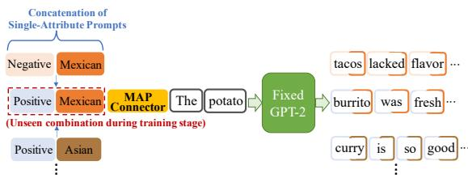
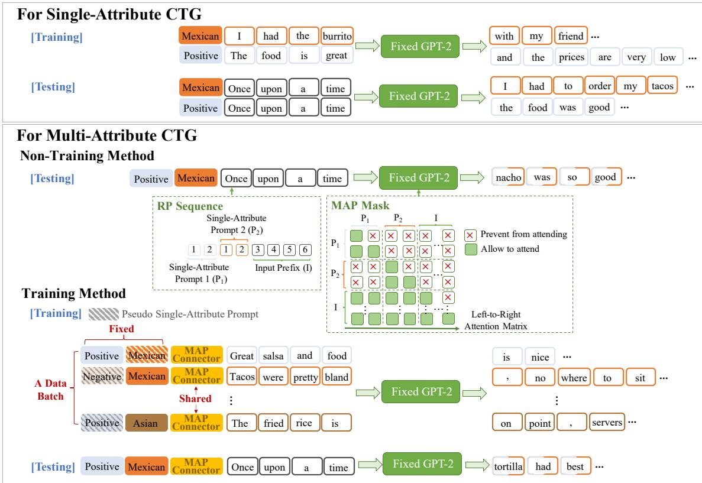
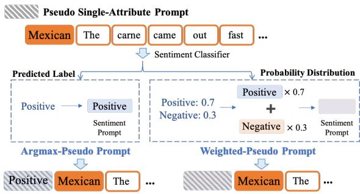
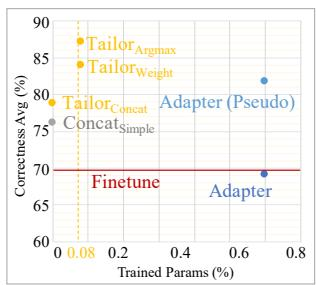
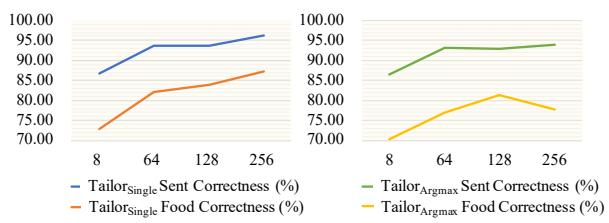

# Tailor: A Soft-Prompt-Based Approach to Attribute-Based Controlled Text Generation

Kexin Yang♠ ∗ Dayiheng Liu♠ † Wenqiang Lei♢ Baosong Yang♠ Mingfeng Xue♠

Boxing Chen♠ Jun Xie♠

♠Alibaba Group

♢National University of Singapore {kexinyang0528, losinuris}@gmail.com

## Abstract

Attribute-based Controlled Text Generation (CTG) refers to generating sentences that satisfy desirable attributes (e.g., emotions and topics). Existing work usually utilize fine-tuning or resort to extra attribute classifiers, yet suffer from increases in storage and inference time. To address these concerns, we explore attribute-based CTG in a parameter-efficient manner. In short, the proposed Tailor represents each attribute as a pre-trained continu ous vector (i.e., single-attribute prompt), which guides the generation of a fixed pre-trained language model (PLM) to satisfy a pre-specified attribute. These prompts can be simply concatenated as a whole for multi-attribute CTG without any re-training. Nevertheless, this may raise problems of fluency downgrading and position sensitivity. To solve this, Tailor provides two solutions to enhance the combination. The former contains a multi-attribute prompt mask and a re-indexing position sequence to bridge the gap between the training (one singleattribute prompt for each task) and the testing stage (concatenating two prompts). The latter introduces a trainable prompt connector to further enhance the combinations. Experiments demonstrate that, only requiring 0.08% extra training parameters of the GPT-2, Tailor can achieve effective and general improvements on eleven attribute-specific generation tasks.

## 1 Introduction

Attribute-based CTG (Zhang et al., 2022) focuses on generating sentences satisfying pre-specified attributes such as topic and sentiment, which remains extremely challenging in recent progress (Dathathri et al., 2020). Specifically, single-attribute CTG typically resorts to attribute-specific data, guiding the CTG model learning with supervised objectives (Keskar et al., 2019; Lyu et al., 2021; Ziegler et al., 2019). Nevertheless, multi-attribute CTG is generally zero-shot since no example of a sentence with specified attribute combination is accessible during training (Lample et al., 2019).

For both single and multi-attribute CTG, existing efforts can be roughly divided into two types: 1) fine-tuning a pre-trained language model (PLM) on the attribute-specific data (Ziegler et al., 2019) and 2) utilizing extra attribute classifiers. The former usually introduces control codes to generate various styles of sentences with one PLM, such as keywords (Keskar et al., 2019) and numerical sequence (Lyu et al., 2021). The latter applies extra attribute classifiers to guide a PLM, such as backpropagating gradients of these classifiers (Dathathri et al., 2020) or weighting output logits (Krause et al., 2021; Yang and Klein, 2021). However, this two types suffer from expensively re-training whole PLM (Yang and Klein, 2021) and higher latency during inference (Qian et al., 2022), respectively.

To overcome the aforementioned limitations, we propose Tailor – Text-attribute general controller, a soft-prompt-based approach to jointly include both single-attribute CTG and multi-attribute CTG in a unified manner.1 The key idea is to represent each attribute as a trainable continuous vector (i.e., the single-attribute prompt). These single-attribute prompts could be separately used or concatenated as a whole to control a fixed GPT-2 (Radford et al., 2019) for single and multi-attribute CTG, respectively.2 As simply concatenating always suffers from poor performances (see Appendix F), Tailor provides two effectively concatenating strategies without or with training after single-attribute CTG, namely non-training and training methods. First of all, we argue that the undesirable results of simply concatenating is due to the gap between the training and the testing stage. Specifically, the single-attribute prompt only attends to itself while being individually trained by the attribute-specific data. While testing, the second prompt also attends to the first one in the concatenation, with the simultaneous change of the position embeddings. To fill this gap, the non-training method introduces a Multi-Attribute Prompt mask (MAP mask) and a Re-indexing Position sequence (RP sequence) for the fixed GPT-2. MAP mask prevents distinct single-attribute prompts from cross-attention, and RP sequence ensures stable position information for the PLM after swapping, by individually numbering each prompt.

  
Figure 1: MAP connector concatenates single-attribute prompts and a pre-specified input prefix to the fixed GPT-2 for multi-attribute CTG, even is effective to the unseen combination (e.g, the combination of Positive sentiment and topic of Mexican food is not accessible to MAP connector during training).

Such a non-training method could be easily implemented and gets promising performances, but still has much space for improvement – there is no multi-attribute specific training stage for these prompts to adapt to work together. Therefore, the training method contains a trainable prompt to connect two single-attribute prompts as a whole to multi-attribute CTG. Inspired by the role of ‘and’ in connecting parallel phrases for natural sentences (Rudolph, 1989), as shown in Figure 1, the proposed Multi-Attribute Prompt connector (MAP connector) can be concatenated with any two singe-attribute prompts and hints a GPT-2 to multi-attribute CTG. Meanwhile, a pseudo-prompt based strategy is also provided for training the connector in unsupervised settings. With MAP connector, the combinations show strong performances on multi-attribute CTG on the popular benchmark YELP dataset (Lample et al., 2019). Furthermore, MAP connector can get encouraging improvements for the unseen combinations in the training stage (see Appendix F). The main contributions are:

• We propose Tailor, a soft-prompt-based approach to attribute-based CTG. To jointly include both single-attribute and multi-attribute CTG in a unified paradigm, Tailor employs a set of pre-trained prefixes to guide a fixed PLM to generate sentences with pre-specified attributes, and effectively concatenate them to generate multi-attribute sentences.

• We experimentally reveal the combining ability of continuous prompts. To enhance this combination, we explore two effective strategies without training (MAP mask + RP sequence) or with training (MAP connector) after single-attribute CTG. Especially, the MAP connector achieves strong performances on six multi-attribute generation tasks, and even works on the unseen ones.

## 2 Related Work

Attribute-Based CTG focuses on generating sentences containing pre-specified attributes, such as sentiment and topic. As a vital demand for intelligent writing (Zhang et al., 2022), existing efforts include fine-tuning PLMs and utilizing extra attribute classifiers. The first type usually fine-tunes separately and stores a full copy of PLM for each desirable attribute (Ziegler et al., 2019). To alleviate the storage problem, CTRL (Keskar et al., 2019) provides 55 kinds of control codes (i.e., special keywords) to fine-tune one PLM for generating sentences of various styles. StylePTB (Lyu et al., 2021) also proposes several style transfer tokens (i.e., a sequence of numbers) to guide a GPT-2 (Radford et al., 2019) to multiple styles transfer. GSum (Dou et al., 2021) introduces four guidance signals (e.g., keywords and relations) to enhance the controllability of PLMs in text summarization. Although they make successful attempts in attribute-based CTG, re-training whole PLMs could be expensive (Yang and Klein, 2021). To improve the flexibility and extensibility of the CTG model, the second type makes efforts in the inference stage. In short, utilizing extra attribute classifiers to guide PLMs in each generating step. PPLM (Dathathri et al., 2020) iteratively modifies latent representations of a GPT-2 referring to the gradient of attribute classifiers, yet notably increasing the inference time. To solve this problem, Fudge (Yang and Klein, 2021) uses an attribute predictor to adjust the output probabilities of a PLM. Similarly, GeDi (Krause et al., 2021) uses smaller PLMs as generative discriminators to hint a larger PLM generating sentences that satisfy desirable attributes. Despite their progress, the fluency of generating sentences tends to decrease compared with the original PLM (see § 4.2) and extra inference time costs still existed. In comparison, utilizing Tailor, PLMs can benefit from the manner of controllability on single-attribute prompt combinations, with a negligible decrease on text quality.

Prompt Learning is a new paradigm in NLP summarised as “Pre-train, Prompt and Predict” (Liu et al., 2021a). In short, it guides a single PLM to solve various downstream tasks by reformulating these tasks into a text-to-text manner. Recently, the continuous prompt has attracted attention (Gu et al., 2021; Liu et al., 2021b, 2022), which usually forms as a set of continuous task-specific vectors to the input. Despite their encouraging progress, the prompt composition is rarely explored but undoubtedly im portant in prompt learning. In that case, a composable task could be accomplished by composing various subtasks with multiple sub-prompts (Liu et al., 2021a). To achieve it, PTR (Han et al., 2021) introduces manual sub-prompts for entity recognition and relation classification, respectively. Then, these two kinds of prompts are composed by logic rules as a complete prompt for the relation extraction task. Unfortunately, the composition of continuous prompts is rarely explored yet has demon strated great potential (Qian et al., 2022). The main difference between contrastive prefix Qian et al. (2022) and Tailor is that the former needs attribute data to be occurred contrastively (e.g, positive and negative attribute data must be available at the same time), which might be limited for the single attribute. For multi-attribute, contrastive prefix trains a new prompt (twice the size of their single prompt) for each combination. Instead of it, Tailor only trains an extra prompt connector to enhance the combinations of single prompts. It can act as an efficient plug-and-play manner with extremely low training parameters to attribute-based CTG.

## 3 Methodology

## 3.1 Tailor for Single-Attribute CTG

Different from fine-tuning a full copy of PLMs for each attribute, our basic idea is to guide the generation of a PLM with a set of pre-trained continuous vectors, namely single-attribute prompts. Meanwhile, each prompt represents a desirable attribute. As shown in Figure 2 (top), we fix the parameters of a GPT-2 and train each prompt on the attributespecific data. After training, these prompts can act as plug-ins for desirable single-attribute CTG. For the prefix “Once upon a time”, the GPT-2 can continue with “I had to order my tacos ...” with a prompt representing the Mexican food topic or “ the food was good” with a prompt representing the positive sentiment. In this way, our method can be easily expanded: if a new attribute emerges, we only need to train an attribute prompt and then control a PLM to generate attribute-specific sentences. To be exact, we use language modeling learning object to train such a set of single-attribute prompts. In detail, k-th single-attribute prompt $S _ { k }$ with length $l _ { k }$ is first initialized randomly, where $S _ { k } ~ \in ~ \mathbb { R } ^ { l _ { k } \times d _ { e m b } }$ $d _ { e m b }$ is the word embedding dimension of the GPT-2. Meanwhile, given an attribute-specific sentence $\pmb { x } ~ = ~ \{ x _ { 1 } , x _ { 2 } , . . . , x _ { n } \}$ with length n, we get a word sequence matrix $X _ { e m b } \in \mathbb { R } ^ { n \times d _ { e m b } }$ after being embedded by GPT-2. Then, $S _ { k }$ is concatenated with $X _ { e m b }$ to form a input matrix as $[ S _ { k } ; X _ { e m b } ] \in \mathbb { R } ^ { ( l _ { k } + n ) \times d _ { e m b } }$ , and this matrix is fed into a fixed GPT-2. Finally, the language-modeling based learning object is:

$$
\mathcal { L } _ { s i n g l e } = \sum _ { t = 1 } ^ { n } \log P _ { \theta _ { g } ; \theta _ { S _ { k } } } \left( x _ { t } | S _ { k } , x _ { < t } \right) ,\tag{1}
$$

where $\theta _ { g }$ and $\theta _ { S _ { k } }$ denote the parameters of GPT-2 and the single-attribute prompt, respectively. Only $\theta _ { S _ { k } }$ are updated during the training stage.

## 3.2 Tailor for Multi-Attribute CTG

Inspired by the composition of discrete prompts (Han et al., 2021) to accomplish a complex task, our intuitive idea is to combine single-attribute prompts as a multi-attribute prompt to hint a PLM for multi-attribute CTG. To enjoy the benefit of our paradigm in single-attribute CTG, we first consider simply concatenating several single-attribute prompts as a whole multi-attribute prompt. Surprisingly, such a multi-attribute prompt can guide a GPT-2 to generate sentences containing multi attributes and get encouraging performances in unsupervised settings without any training (see § 4.2). Despite the progress, this straightforward method suffers from fluency decrease compared with single-attribute CTG. Meanwhile, it is position sensitive, i.e., the PLM tends to focus more on the single-attribute prompt that is closer to the input prefix (see Appendix F).

To polish such a paradigm while keeping plugand-play and storage-friendly advantages, as shown in Figure 2 (bottom), Tailor introduces a nontraining method to quickly and effectively alleviate the above problems of simply concatenation. Afterward, a training method is further provided to greatly enhance the combinations. We elaborate the two methods separately as follows.

  
Figure 2: The overview of Tailor to attribute-based CTG. We use 2-token-sized single-attribute prompts for illustration. Notably, the different colored text boxes denote different attribute-specific sentences. For multi-attribute sentences, we use bi-colored text boxes to highlight them.

## 3.2.1 Non-Training Method

To make better use of single-attribute prompts, reducing disparities between the training (a singleattribute prompt for each task) and the testing stage (concatenating more than one single-attribute prompt) is undoubtedly important. Specifically, the single-attribute prompt only attends to itself in the attention matrix while training, as each prompt is individually trained by the attribute-specific data. However, while in the testing stage for multiattribute CTG, the second prompt also focuses on the first one in the concatenation, with the simultaneous change of the position embedding. To fill this gap, MAP mask and RP sequence are introduced to the fixed PLM while generating. MAP mask avoids cross-attention between representations of single-attribute prompts to approximate the condition in the single-attribute CTG training stage. Meanwhile, the RP sequence keeps a stable prompt position for swapping, preventing such concatenating paradigm from position sensitivity. MAP Mask For the ease of implementation, we introduce MAP mask matrix $M _ { p }$ to the softmax logits of GPT-2. Given a vanilla attention module:

$$
A = \mathrm { S o f t m a x } ( \frac { Q K ^ { \top } } { \sqrt { d } } ) \in \mathbb { R } ^ { n \times n } ,\tag{2}
$$

where n is the length of input sentence x and $Q , K$ denote representations of query and key, respectively.3 For MAP Mask, given two single-attribute prompts $S _ { u } , S _ { v }$ with length being $l _ { u } , l _ { v }$ , respectively, the attention module is then modified as:

$$
\begin{array} { r l } & { \cal A = \mathrm { S o f t m a x } ( \frac { Q K ^ { \top } } { \sqrt { d } } + M _ { p } ) \in \mathbb { R } ^ { ( l _ { p } + n ) \times ( l _ { p } + n ) } , } \\ & { \cal M _ { p } ^ { i j } = \left\{ \begin{array} { l l } { \displaystyle - \infty } & { \displaystyle i \in [ l _ { u } , l _ { v } ] \mathrm { ~ a n d ~ } j \in [ 0 , l _ { u } ] , } \\ { \displaystyle 0 } & { \mathrm { o t h e r w i s e } , } \end{array} \right. } \end{array}\tag{3}
$$

where ${ \mathit { l } } _ { p } = { \mathit { l } } _ { u } + { \mathit { l } } _ { v } .$

RP Sequence Simple concatenation of singleattribute prompts always suffers from position sensitivity. To address this issue, we propose a simple but effective method to ensure position consistency while swapping. In short, we modify the position sequence of the PLM while concatenating.4 Given the original position sequence:

$$
\begin{array} { r } { i d = \{ \underbrace { 1 , . . . , l _ { u } } _ { \mathrm { L e n g t h ~ o f } S _ { u } } \underbrace { l _ { u } + 1 , . . . , l _ { p } } _ { \mathrm { L e n g t h ~ o f } S _ { v } } , \underbrace { l _ { p } + 1 , . . . , l _ { p } + n } _ { \mathrm { L e n g t h ~ o f ~ i n p u t ~ p r e f i x } } \} , } \end{array}\tag{4}
$$

the RP sequence can be defined as:

$$
\begin{array} { r } { i d _ { \mathrm { R P } } = \{ \underbrace { 1 , . . . , l _ { u } } _ { \mathrm { L e n g t h ~ o f } \ : S _ { u } } \underbrace { 1 , . . . , l _ { v } } _ { \mathrm { L e n g t h ~ o f } \ : S _ { v } } \underbrace { l _ { v } + 1 , . . . , l _ { v } + n } _ { \mathrm { L e n g t h ~ o f ~ i n p u t ~ p r e f i x } } \} , } \end{array}\tag{5}
$$

note that, $l _ { v } = l _ { u }$ . In that case, swapping does not bring any changes, since the position of prompts is fixed by the RP sequence while avoiding crossattention by the MAP mask.

## 3.2.2 Training Method

While the non-training method partly addresses the issues of combination, there is no multi-attribute specific training stage for these prompts to adapt to work together. Therefore, we provide a training method – MAP connector, which is also a continuous prompt trained for combining two singleattribute prompts to multi-attribute CTG. To utilize only single-attribute sentences for multi-attribute CTG, we propose a pseudo-attribute prompt based training strategy for MAP connector. The details of the pseudo-attribute prompt building method and the workflow of the MAP connector are as follows.

  
Figure 3: Building pseudo-attribute prompt.

Building Pseudo Single-Attribute Prompt Our key idea is to build another pseudo-attribute prompt for each single-attribute sentence, thus MAP connector could be trained in a multi-attribute circumstance. An overview of our building method is demonstrated in Figure 3, where a sentence with the topic of Mexican food is used as a showcase.5 To be exact, we first train an attribute classifier on the same single-attribute CTG training set. Thus, such a classifier with $n _ { c l a s s }$ classes corresponds to the pre-trained single-attribute prompt set ${ \pmb S } =$ $\{ S _ { 1 } , S _ { 2 } , . . . , S _ { n _ { c l a s s } } \}$ Given an attribute-specific sentence x of other attribute category, we first get the class probabilities set $\pmb { p } = \{ p _ { 1 } , p _ { 2 } , . . . , p _ { n _ { c l a s s } } \}$ Then, the pseudo single-attribute prompt can be obtained by two methods:

$$
\begin{array} { l } { { \displaystyle S _ { a } = S _ { \mathrm { I n d e x } ( \arg \operatorname* { m a x } ( { \pmb p } ) ) } , } } \\ { { \displaystyle S _ { w } = \sum _ { z = 1 } ^ { n _ { c l a s s } } p _ { z } S _ { z } , } } \end{array}\tag{6}
$$

where argmax-pseudo prompt method obtains the pseudo prompt $S _ { a }$ by using a single-attribute prompt corresponding to the predicted sentiment, Index( ) means getting the corresponding index. In contrast, weighted-pseudo prompt method utilizes the predicted probability distribution to multiply corresponding single-attribute prompts, respectively. Then these weighted prompts form a whole prompt $S _ { w }$ by element-wise addition.

The MAP Connector Workflow Figure 2 bottom illustrates the workflow of the MAP connector. In the training stage, we unify sentences containing different single attributes to train the MAP connector, each of which is added an extra pseudo singleattribute prompt (boxes with the slash pattern) by employing the aforementioned method. Specifically, for each training sample, we first concatenate two single-attribute prompts (real and pseudo), the MAP connector and the input sentence into a sequence, and then feed it into a fixed GPT-2. It is worth noting that only the parameters of the MAP connector are updated in the training stage. Therefore, given two single-attribute prompt $S _ { u }$ and $S _ { v } ,$ MAP connector $C$ with the length $l _ { C } ,$ $C \in \mathbb { R } ^ { l _ { C } \times d _ { e m b } }$ , we concatenate $S _ { u } , S _ { v } , C$ and the input sentence matrix $X _ { e m b }$ to form a input matrix as $[ S _ { u } ; S _ { v } ; C ; X _ { e m b } ]$ . The learning object is:

$$
\mathcal { L } _ { m u l t i } = \sum _ { t = 1 } ^ { n } \log P _ { \theta } \left( x _ { t } | S _ { u } , S _ { v } , C , x _ { < t } \right) ,\tag{7}
$$

where $\theta \ : = \ : [ \theta _ { g } ; \theta _ { S _ { u } } ; \theta _ { S _ { v } } ; \theta _ { C } ] . \theta _ { g } , \theta _ { S _ { u } } , \theta _ { S _ { v } }$ , and $\theta _ { C }$ denote the parameters of GPT-2, two singleattribute prompts and MAP connector, respectively. Only $\theta _ { C }$ are updated during the training stage. In the inference stage, we just decompose each multiattribute generation task as several single-attribute generation tasks and find corresponding singleattribute prompts. Then, these prompts are concatenated with MAP connector to generate sentences that satisfy multi attributes.

## 4 Experiments

## 4.1 Experimental Setup

Datasets We conduct experiments on the widelyused benchmark dataset YELP (Lample et al., 2019). It contains multiple single-attribute data that can verify Tailor’s performance on both singleattribute and multi-attribute CTG, while ensuring that the combination of these attributes is reasonable. Following previous works that conduct experiments on attributes of emotions and topics for multi-attribute CTG, we choose Yelp restaurants reviews of sentiment attributes (positive (PO) and negative (NE)) and topics of food type (Mexican (ME), American (AM) and Asian (AS) foods) to evaluate models. Specifically, each attribute contains 30,000 / 3,000 sentences for training / validation. For evaluation, to keep in line with previous works (Yang and Klein, 2021; Dathathri et al., 2020), we use 15 attribute-unrelated prefixes6 and ask the model to continue writing with them (for each of the 15 prefixes, 100 completions are generated, total: 1500 for each attribute) while satisfying pre-specified attribute as the final results.7

Automatic Evaluation Following Yang and Klein (2021); Dathathri et al. (2020), we automatically evaluate generation results from three aspects: (1) Correctness. We used $\mathrm { R o B E R T a _ { L a r g e } }$ (Liu et al., 2019) based attribute classifiers to compute the fraction of final sentences that contain a pre-specified attribute, details in Appendix C. (2) Text Quality. Grammar (GRAM) (Warstadt et al., 2019) indicates the averaged grammaticality probabilities of all final sentences, evaluated by a RoBERTa-based CoLA grammaticality model (Yang and Klein, 2021). Perplexity (PPL), we average the scores from $\mathrm { G P T - 2 _ { B a s e } , G P T - 2 _ { M e d i u m } }$ and $\mathrm { G P T } { - } 2 _ { \mathrm { L a r g e } }$ version of GPT-2 (Radford et al., 2019) as the final result. (3) Diversity. Following Li et al. (2015), we report the distinctness of the final results. Specifically, we count the number of unigrams, bigrams and trigrams and then normalize them by the total number of words $( i . e . , \mathrm { D i s t } - 1 / \mathrm { D i s t } - 2 / \mathrm { D i s t } - 3 )$ .

Human Evaluation Following Qian et al. (2022), we also conduct the human evaluation. For each model, three crowdsource evaluators are shown 15 randomly selected samples (one per each attributeunrelated prefixes) for each generation task (Total: 75 samples for single-attribute CTG and 90 samples for multi-attribute CTG), respectively. Then, they are asked to rate model results in two categories: the text quality of generation sentences and whether they contain the target attribute. Scores are ranged from 1 to 5, the higher the better.8

Tailor Settings $\mathrm { T a i l o r } _ { \mathrm { S i n g l e } }$ denotes the singleattribute prompts. For multi-attribute, ConcatSimple means simply concatenating two single-attribute prompts and $\mathrm { T a i l o r } _ { \mathrm { C o n c a t } }$ is our non-training method. $\mathrm { T a i l o r } _ { \mathrm { A r g m a x } }$ and ${ \mathrm { T a i l o r } } _ { \mathrm { W e i g h t } }$ represent using argmax-pseudo and weighted-pseudo prompts when training the MAP connector, respectively.

Baselines We compare Tailor with mainstream competitive models as follows. (1) Finetune, finetuning the original $\mathrm { G P T } { - } 2 _ { \mathrm { B a s e } }$ on attribute-specific data. As multi-attribute CTG is unsupervised, following Lyu et al. (2021), we sequentially apply the GPT-2 trained for corresponding singleattribute data multiple times. (2) Adapter, following Li and Liang (2021), we use the adapter for GPT-2 as same as Lin et al. (2020). Note that for multi-attribute CTG, we first use the same training method as mentioned in Finetune for Adapter. Besides, we use the same argmax-pseudo labeled sentences (see § 3.2.2) to train the Adapter (marked with ‘Pseudo’). (3) GeDi (Krause et al., 2021), using small PLMs to hint large ones. (4) PPLM (Dathathri et al., 2020), back-propagating gradients of extra attribute classifiers to a PLM9.

## 4.2 Main Results

Single-Attribute CTG As shown in Table 1, $\mathrm { T a i l o r } _ { \mathrm { S i n g l e } }$ outperforms PPLM and GeDi to a great extent on both correctness and text quality. Meanwhile, compared with other parameter-efficient learning model Adapter, $\mathrm { T a i l o r } _ { \mathrm { S i n g l e } }$ also gets improvements on both correctness $( \mathrm { e . g , + 9 . 1 9 \% }$ of Food) and diversity $( \mathrm { e . g , ~ + ~ } 0 . 0 2 \% \mathrm { ~ / ~ + ~ } 0 . 1 2 \% \mathrm { ~ / ~ }$ $+ ~ 0 . 2 5 \%$ of Food) with a similar scale of training parameters. However, with 0.08% training parameters of the GPT-2, $\mathrm { T a i l o r } _ { \mathrm { S i n g l e } }$ still has a performance gap with Finetune, $e . g . , - 4 . 1 4 \%$ correctness on Food. Fortunately, as the length of $\mathrm { T a i l o r } _ { \mathrm { S i n g l e } }$ increases (see Appendix F), this gap appears to narrow $( - ~ 0 . 3 3 \%$ $\mathrm { T a i l o r } _ { \mathrm { S i n g l e } }$ with the prompt length of 256). Then, we illustrate human evaluations in Table 3. Different from automatic evaluations, $\mathrm { T a i l o r } _ { \mathrm { S i n g l e } }$ obtains the same score with Finetune, even outperforms all baselines on attribute-relevance score. This experimental discovery demonstrate the limitations of only resorting to automatic evaluation, as also be mentioned in Welbl et al. (2021); Qian et al. (2022).

<table><tr><td rowspan="2">Method</td><td>Trained Params</td><td>Correctness</td><td colspan="2">Text Quality</td><td>Diversity</td></tr><tr><td>(%)</td><td>(%) ↑</td><td>GRAM↑</td><td>PPL↓</td><td>Dist-1/Dist-2/Dist-3 ↑</td></tr><tr><td>Finetune (Food) (2019)</td><td>100.000</td><td>87.53</td><td>0.78</td><td>40.60</td><td>0.04 / 0.22 / 0.42</td></tr><tr><td>Finetune (Sent) (2019)</td><td>100.000</td><td>97.95</td><td>0.76</td><td>42.83</td><td>0.04 / 0.21 / 0.41</td></tr><tr><td>GeDi (Food) (2021)</td><td>100.000</td><td>99.82</td><td>0.28</td><td>278.22</td><td>0.42 / 0.79 / 0.95</td></tr><tr><td>GeDi (Sent) (2021)</td><td>100.000</td><td>87.37</td><td>0.32</td><td>517.87</td><td>0.27 / 0.85 / 0.97</td></tr><tr><td>Adapter (Food) (2020)</td><td>0.100</td><td>74.70</td><td>0.75</td><td>43.85</td><td>0.04 / 0.23 / 0.46</td></tr><tr><td>Adapter (Sent) (2020)</td><td>0.100</td><td>93.32</td><td>0.74</td><td>47.01</td><td>0.04 / 0.22 / 0.45</td></tr><tr><td>PPLM (Food) (2020)</td><td>0.001</td><td>60.64</td><td>0.34</td><td>105.33</td><td>0.16 / 0.53 / 0.80</td></tr><tr><td>PPLM (Sent) (2020)</td><td>0.001</td><td>69.37</td><td>0.36</td><td>75.59</td><td>0.15 / 0.53 / 0.82</td></tr><tr><td> $\mathrm { T a i l o r } _ { \mathrm { S i n g l e } } \ ( \mathrm { F o o d } )$ </td><td>0.080</td><td>83.89</td><td>0.71</td><td>45.79</td><td>0.05 / 0.35 / 0.71</td></tr><tr><td> ${ \mathrm { T a i l o r } } _ { \mathrm { S i n g l e } } ( { \mathrm { S e n t } } )$ </td><td>0.080</td><td>93.80</td><td>0.71</td><td>46.20</td><td>0.06 / 0.35 / 0.70</td></tr></table>

Table 1: The main results of single-attribute CTG. Sent and Food: averaging the evaluation scores of all sentiment attributes and topics of food type, respectively. Trained Params: the ratio of the number of trainable parameters to the method Finetune. Correctness: the fraction of attribute-related sentences. GRAM: averaged grammaticality probabilities. PPL: perplexity scores. Dist-1/2/3: the distinctness of the final results (unigrams, bigrams and trigrams). means a higher score is better whereas is exactly the opposite. Bold values represent the maximum values of each sub-task in parameter-efficient method.
<table><tr><td rowspan="2">Method</td><td>Correctness (%)</td><td>Text Quality</td><td>Diversity</td></tr><tr><td>Avg. ↑ / Sent ↑ / Food ↑</td><td> $\operatorname { G R A M } \uparrow / \operatorname { P P L } \downarrow$ </td><td>Dist-1/Dist-2/Dist-3↑</td></tr><tr><td>Finetune</td><td>69.80 / 74.03 / 65.57</td><td>0.69 / 46.54</td><td>0.04 / 0.23 / 0.42</td></tr><tr><td>Adapter</td><td>69.10 / 74.10 / 64.10</td><td>0.77 / 37.89</td><td>0.03 / 0.21 / 0.42</td></tr><tr><td>Adapter (Pseudo)</td><td>81.71 / 89.95 / 73.46</td><td>0.75 / 45.63</td><td>0.04 / 0.22 / 0.45</td></tr><tr><td>Concatsimple</td><td>76.20 / 87.88 / 64.51</td><td>0.63 / 55.02</td><td>0.05 / 0.33 / 0.68</td></tr><tr><td>TailorConcat</td><td>78.82 / 87.54 / 70.10</td><td>0.63 / 52.76</td><td>0.05 / 0.32 / 0.68</td></tr><tr><td>TailorWeight</td><td>83.98 / 93.27 / 74.68</td><td>0.68 / 51.41</td><td>0.05 / 0.33 / 0.69</td></tr><tr><td> $\mathbf { T a i l o r _ { A r g m a x } }$ </td><td>87.15 / 92.97 / 81.32</td><td>0.69 / 52.73</td><td>0.05 / 0.33 / 0.69</td></tr></table>

  
Table 2: The main results of multi-attribute CTG. We average the scores of six combinations (two sentiment attributes three topic attributes of food type) as the final results. Adapter (Pseudo): using our argmax-pseudo labeled sentences to train the Adapter. $\mathrm { C o n c a t _ { S i m p l e } \mathrm { : } }$ simply concatenating two single-attribute prompts. Tailor-C: our non-training method. $\mathrm { T a i l o r } _ { \mathrm { A r g m a x } }$ and TailorWeight: using argmax-pseudo and weighted-pseudo prompts in the training stage of the MAP connector, respectively. For better view, Performances vs. Trained Params are as shown on the right figure. $\mathrm { T a i l o r } _ { \mathrm { A r g m a x } }$ gets the highest score with only 0.08% trained parameters of Finetune.

<table><tr><td>Method</td><td>Quality ↑</td><td>Attribute↑</td><td>All ↑</td></tr><tr><td></td><td>Single-Attribute CTG</td><td></td><td></td></tr><tr><td>Finetune</td><td>4.69</td><td>2.97</td><td>7.66</td></tr><tr><td>Adapter</td><td>4.66</td><td>2.64</td><td>7.30</td></tr><tr><td>PPLM</td><td>2.40</td><td>1.19</td><td>3.59</td></tr><tr><td> $\mathrm { T a i l o r _ { S i n g l e } }$ </td><td>4.62</td><td>3.04</td><td>7.66</td></tr><tr><td></td><td>Multi-Attribute CTG</td><td></td><td></td></tr><tr><td>Finetune</td><td>4.67</td><td>1.74</td><td>6.41</td></tr><tr><td>Adapter (Pseudo) TailorArgmax</td><td>4.79</td><td>1.91</td><td>6.70 6.94</td></tr></table>

Table 3: Results of human evaluation.

Multi-Attribute CTG As shown in Table 2, we compare three instantiations of Tailor and strong baselines in the single-attribute CTG experiment. First, $\mathrm { T a i l o r } _ { \mathrm { C o n c a t } }$ shows encouraging performances without any training, especially on correctness, outperforms fine-tuning (+ 13.51% Sentiment / + 4.53% Food) and Adapter (+ 13.44% Sentiment $/ + 6 . 0 0 \% \ \mathrm { F o o d } )$ . Besides, our training methods ${ \mathrm { T a i l o r } } _ { \mathrm { W e i g h t } }$ and $\mathrm { T a i l o r } _ { \mathrm { A r g m a x } }$ show improvements on all scores compared with TailorConcat, $e . g . , +$ $4 . 5 8 \% / \ : + \ : 1 1 . 2 2 \%$ correctness on the topic of food type attribute. Meanwhile, Tailor also outperforms Adapter with the same pseudo label strategy on both correctness and diversity, with a notable scale discrepancy of training parameters (0.08% vs 0.60%, i.e., 1:7.5). Meanwhile, Tailor seems to suffer from lower text diversity compared to PPLM and GeDi. This is because these methods have poor fluency (with many unreasonable words), while Dist-1/2/3 measure different words without considering whether they are reasonable. We supplement it by human evaluation. As shown in Table 3, the diversity of words considered by the index attribute, which shows the superiority of our method.

<table><tr><td rowspan="2">TP (%)</td><td rowspan="2">Method</td><td colspan="3">Correct (%)</td></tr><tr><td>Avg. ↑</td><td>Sent↑</td><td>Food↑</td></tr><tr><td>100.00</td><td>Single-Attribute CTG Finetune</td><td>54.08</td><td></td><td>54.08</td></tr><tr><td>100.00 0.10 0.10</td><td>Finetune Adapter Adapter</td><td>85.28 55.79 77.91</td><td>85.28 77.91</td><td>55.79</td></tr><tr><td>0.08 0.08</td><td>TailorSingle Tailorsingle</td><td>66.23 89.27</td><td>89.27</td><td>66.23</td></tr><tr><td></td><td></td><td></td><td></td><td></td></tr><tr><td>100.00</td><td></td><td>Multi-Attribute CTG</td><td></td><td></td></tr><tr><td></td><td>Finetune</td><td>60.60</td><td>73.45</td><td>47.75</td></tr><tr><td>0.60</td><td>Adapter</td><td>57.15</td><td>68.44</td><td>45.85</td></tr><tr><td>0.60</td><td>Adapter (Pseudo)</td><td>67.27</td><td>78.66</td><td></td></tr><tr><td>0.00</td><td></td><td></td><td></td><td>55.88</td></tr><tr><td></td><td> $\mathrm { T a i l o r } _ { \mathrm { C o n c a t } }$ </td><td>68.09</td><td>74.38</td><td>61.79</td></tr><tr><td>0.08</td><td> $\mathrm { T a i l o r w e i g h t }$ </td><td>70.32</td><td>84.18</td><td>56.46</td></tr><tr><td>0.08</td><td> $\mathrm { T a i l o r } _ { \mathrm { A r g m a x } }$ </td><td>71.41</td><td>83.63</td><td>59.18</td></tr><tr><td></td><td></td><td></td><td></td><td></td></tr></table>

Table 4: The main results of few-shot learning. Note that TP for multi-Attribute CTG means the extra training parameters as the percentage of Finetune after single-Attribute CTG. We average the scores of six combinations as the final results.

## 4.3 Further Discussions

Few-Shot Learning We conduct a few-shot learning setting to further analyze the effectiveness of Tailor. In detail, following Li and Liang (2021), we randomly sample from full dataset and obtain the few-shot dataset (training / validation / testing: 150 / 20 / 20 samples). Specifically, we sample three different few-shot datasets and average the scores of each method on three datasets as the final results. As shown in Table 4, three types of Tailor outperform other baselines on correctness, with 0.00% / 0.08% extra training parameters of Finetune.

Cross Domain Dataset Evaluating We further evaluate the performances of Tailor on combining attribute from different domain.10 Specifically, we choose SST-2 (Socher et al., 2013) and AG News (Zhang et al., 2015) for data sources of sentiment and topic attribute, respectively. As shown in

Appendix Table 10, Tailor still outperforms baselines in both correctness and diversity. Meanwhile, the text quality of Tailor has been improved by the Map Connector training (GRAM 0.59 to 0.68).

Inference Speed We also compare Tailor with extra classifier based CTG method on inference speed. As shown in Table 5, $\mathrm { T a i l o r } _ { \mathrm { S i n g l e } }$ outperforms baselines to a great extend on inference speed, which indicates computational efficacy of Tailor.

<table><tr><td>Methods</td><td>Inference Speed ↓</td></tr><tr><td>Tailorsingle</td><td>0.758 (1.00 ×)</td></tr><tr><td>GeDi</td><td>1.680 (0.45 ×)</td></tr><tr><td>PPLM</td><td>15.553 (0.05 ×)</td></tr></table>

Table 5: Inference speed comparisons (second/sample).

<table><tr><td rowspan="2">Method</td><td colspan="3">Correctness (%)</td></tr><tr><td>Avg. ↑</td><td>Sent ↑</td><td>Food ↑</td></tr><tr><td>TailorConcat</td><td>78.82</td><td>87.54</td><td>70.10</td></tr><tr><td>- MAP Mask</td><td>78.36</td><td>87.39</td><td>69.34</td></tr><tr><td>– RP Sequence</td><td>77.77</td><td>88.33</td><td>67.21</td></tr><tr><td>- Both</td><td>76.20</td><td>87.88</td><td>64.52</td></tr></table>

Table 6: The ablation study on using the MAP mask and the RP sequence of $\mathrm { T a i l o r } _ { \mathrm { C o n c a t } } .$ ‘–’ denotes removing the corresponding module from $\operatorname { T a i l o r } _ { \operatorname { C o n c a t } } .$ Note that, exchanging the concatenating order of prompts would bring different performances, except for $\mathrm { T a i l o r } _ { \mathrm { C o n c a t } } .$ Thus, we average the scores from these two situations of six attributes combinations.

Ablations of $\mathbf { T a i l o r } _ { \mathbf { C o n c a t } }$ Whether $\mathrm { T a i l o r } _ { \mathrm { C o n c a t } }$ enjoys the benefits from the MAP mask and the RP sequence is of concern. As shown in Table 6, both the MAP mask and the RP sequence are important to TailorConcat. More importantly, using these two strategies simultaneously can improve the performance while avoiding the position sensitivity.

## 5 Conclusions

In this paper, we explore attribute-based CTG in a soft-prompt-based manner—Tailor, which represents each attribute as a continuous prompt and effectively combines them as a multi-attribute prompt. For enhancing these combinations, Tailor provides two solutions, namely non-training (MAP mask + RP sequence) and training methods (MAP connector). As our first attempt to multiattribute CTG, combining more than two attributes still needs to be discussed. In the future, we will investigate extending Tailor to connect wider ranges of attributes, and expand it to other text-to-text generation tasks.

## Limitations

As we tentatively give a successful implementation of leveraging soft-prompt-based manner to benefit both single and multi-attribute CTG, such a paradigm deserves a closer and more detailed exploration. First, we explore multi-attribute CTG in the scenario of two-attribute composition, yet combining more attributes when generating a completion is more challenging and thrilling, and still in its fledgeless stage. Besides, while extensive experiments demonstrate that Tailor consistently improves attribute-based CTG, applying our approach on a wider variety of PLMs will evaluate the effectiveness of Tailor in a more generally way.

## Ethics Statement

All procedures performed in studies involving human participants were in accordance with the ethical standards of the institutional and/or national research committee and with the 1964 Helsinki declaration and its later amendments or comparable ethical standards. This article does not contain any studies with animals performed by any of the authors. Informed consent was obtained from all individual participants included in the study.

## References

Sumanth Dathathri, Andrea Madotto, Janice Lan, Jane Hung, Eric Frank, Piero Molino, Jason Yosinski, and Rosanne Liu. 2020. Plug and play language models: A simple approach to controlled text generation. In ICLR 2020. OpenReview.net.

Zi-Yi Dou, Pengfei Liu, Hiroaki Hayashi, Zhengbao Jiang, and Graham Neubig. 2021. Gsum: A general framework for guided neural abstractive summarization. In Proceedings ofthe 2021 Conference ofthe North American Chapter ofthe Associationfor Computational Linguistics: Human Language Technologies, NAACL-HLT 2021, Online, June 6-11, 2021, pages 4830–4842. Association for Computational Linguistics.

Joseph L Fleiss. 1971. Measuring nominal scale agreement among many raters. Psychological bulletin, 76(5):378.

Yuxian Gu, Xu Han, Zhiyuan Liu, and Minlie Huang. 2021. PPT: pre-trained prompt tuning for few-shot learning. CoRR, abs/2109.04332.

Xu Han, Weilin Zhao, Ning Ding, Zhiyuan Liu, and Maosong Sun. 2021. PTR: prompt tuning with rules for text classification. CoRR, abs/2105.11259.

Armand Joulin, Edouard Grave, Piotr Bojanowski, and Tomás Mikolov. 2017. Bag of tricks for efficient text classification. In EACL 2017, pages 427–431. Association for Computational Linguistics.

Nitish Shirish Keskar, Bryan McCann, Lav R. Varshney, Caiming Xiong, and Richard Socher. 2019. CTRL: A conditional transformer language model for controllable generation. CoRR, abs/1909.05858.

Ben Krause, Akhilesh Deepak Gotmare, Bryan McCann, Nitish Shirish Keskar, Shafiq R. Joty, Richard Socher, and Nazneen Fatema Rajani. 2021. Gedi: Generative discriminator guided sequence generation. In Findings ofEMNLP 2021, pages 4929–4952. Association for Computational Linguistics.

Guillaume Lample, Sandeep Subramanian, Eric Michael Smith, Ludovic Denoyer, Marc’Aurelio Ranzato, and Y-Lan Boureau. 2019. Multipleattribute text rewriting. In ICLR 2019. OpenReview.net.

Jiwei Li, Michel Galley, Chris Brockett, Jianfeng Gao, and Bill Dolan. 2015. A diversity-promoting objective function for neural conversation models. arXiv preprint arXiv:1510.03055.

Xiang Lisa Li and Percy Liang. 2021. Prefix-tuning: Optimizing continuous prompts for generation. In ACL 2021, pages 4582–4597. Association for Computational Linguistics.

Zhaojiang Lin, Andrea Madotto, and Pascale Fung. 2020. Exploring versatile generative language model via parameter-efficient transfer learning. In Findings of EMNLP 2020, volume EMNLP 2020 of Findings ofACL, pages 441–459. Association for Computational Linguistics.

Pengfei Liu, Weizhe Yuan, Jinlan Fu, Zhengbao Jiang, Hiroaki Hayashi, and Graham Neubig. 2021a. Pretrain, prompt, and predict: A systematic survey of prompting methods in natural language processing. CoRR, abs/2107.13586.

Xiao Liu, Kaixuan Ji, Yicheng Fu, Zhengxiao Du, Zhilin Yang, and Jie Tang. 2022. P-tuning v2: Prompt tuning can be comparable to fine-tuning universally across scales and tasks. In ACL 2022.

Xiao Liu, Yanan Zheng, Zhengxiao Du, Ming Ding, Yujie Qian, Zhilin Yang, and Jie Tang. 2021b. GPT understands, too. CoRR, abs/2103.10385.

Yinhan Liu, Myle Ott, Naman Goyal, Jingfei Du, Mandar Joshi, Danqi Chen, Omer Levy, Mike Lewis, Luke Zettlemoyer, and Veselin Stoyanov. 2019. Roberta: A robustly optimized BERT pretraining approach. CoRR, abs/1907.11692.

Yiwei Lyu, Paul Pu Liang, Hai Pham, Eduard H. Hovy, Barnabás Póczos, Ruslan Salakhutdinov, and Louis-Philippe Morency. 2021. Styleptb: A compositional benchmark for fine-grained controllable text style transfer. In NAACL-HLT 2021, pages 2116–2138. Association for Computational Linguistics.

Jing Qian, Li Dong, Yelong Shen, Furu Wei, and Weizhu Chen. 2022. Controllable natural language generation with contrastive prefixes. arXiv preprint arXiv:2202.13257.

Alec Radford, Jeffrey Wu, Rewon Child, David Luan, Dario Amodei, Ilya Sutskever, et al. 2019. Language models are unsupervised multitask learners. OpenAI blog, 1(8):9.

Elisabeth Rudolph. 1989. The role of conjunctions and particles for text connexity. In Text and discourse connectedness, page 175. John Benjamins.

Tianxiao Shen, Tao Lei, Regina Barzilay, and Tommi S. Jaakkola. 2017. Style transfer from non-parallel text by cross-alignment. In Advances in Neural Information Processing Systems 30: Annual Conference on Neural Information Processing Systems 2017, December 4-9, 2017, Long Beach, CA, USA, pages 6830–6841.

Richard Socher, Alex Perelygin, Jean Wu, Jason Chuang, Christopher D Manning, Andrew Y Ng, and Christopher Potts. 2013. Recursive deep models for semantic compositionality over a sentiment treebank. In Proceedings of the 2013 conference on empirical methods in natural language processing, pages 1631–1642.

Alex Warstadt, Amanpreet Singh, and Samuel R Bowman. 2019. Neural network acceptability judgments. Transactions of the Association for Computational Linguistics, 7:625–641.

Johannes Welbl, Amelia Glaese, Jonathan Uesato, Sumanth Dathathri, John Mellor, Lisa Anne Hendricks, Kirsty Anderson, Pushmeet Kohli, Ben Coppin, and Po-Sen Huang. 2021. Challenges in detoxifying language models. In Findings ofEMNLP 2021, pages 2447–2469. Association for Computational Linguistics.

Thomas Wolf, Lysandre Debut, Victor Sanh, Julien Chaumond, Clement Delangue, Anthony Moi, Pierric Cistac, Tim Rault, Rémi Louf, Morgan Funtowicz, Joe Davison, Sam Shleifer, Patrick von Platen, Clara Ma, Yacine Jernite, Julien Plu, Canwen Xu, Teven Le Scao, Sylvain Gugger, Mariama Drame, Quentin Lhoest, and Alexander M. Rush. 2020. Transformers: State-of-the-art natural language processing. In Proceedings of the 2020 Conference on Empirical Methods in Natural Language Processing: System Demonstrations, pages 38–45, Online. Association for Computational Linguistics.

Kevin Yang and Dan Klein. 2021. FUDGE: controlled text generation with future discriminators. In

NAACL-HLT 2021, pages 3511–3535. Association for Computational Linguistics.

Hanqing Zhang, Haolin Song, Shaoyu Li, Ming Zhou, and Dawei Song. 2022. A survey of controllable text generation using transformer-based pre-trained language models. CoRR, abs/2201.05337.

Xiang Zhang, Junbo Zhao, and Yann LeCun. 2015. Character-level convolutional networks for text classification. Advances in neural information processing systems, 28.

Daniel M. Ziegler, Nisan Stiennon, Jeffrey Wu, Tom B. Brown, Alec Radford, Dario Amodei, Paul F. Christiano, and Geoffrey Irving. 2019. Fine-tuning language models from human preferences. CoRR, abs/1909.08593.

## A Implement Details

We detail the hyperparameters and experimental settings of Tailor and baselines as follows.

1. Tailor. Tailor is implemented based on Huggingface (Wolf et al., 2020). In all experiments of Tailor, we set the length of $\mathrm { T a i l o r } _ { \mathrm { C o n c a t } }$ to 128, as same as the MAP connector for $\mathrm { T a i l o r } _ { \mathrm { A r g m a x } }$ and ${ \mathrm { T a i l o r w e i g h t } }$ . As for the learning rate and the warm-up steps, TailorSingle, TailorArgmax, and Tailor $\mathrm { \sf W e i g h t }$ are set to $5 \mathrm { e } { \cdot } 5$ (the learning rate) and 0 (the warm-up steps), respectively. Besides, to get a pseudo label for MAP connector, we use the $\mathrm { R o B E R T a _ { L a r g e } }$ based classifier for both sentiment and topic of food type attributes. The hyperparameters can be found in Appendix C. Note that, for a fair comparison, we only use the same training set for each classifier as for training Tailor.

2. Finetune.11 We use the $\mathrm { G P T } { - } 2 _ { \mathrm { B a s e } }$ with a language model head implemented based on Huggingface. The learning rate is set to 5e-3 and the warm-up step is set to 0.

3. Adapter.12 we set the bottleneck size to 5 to keep a similar size of training parameters with Tailor. The learning rate is set to 5e-5 and the warm-up step is set to 0.

4. GeDi.13 For a fair comparison, we use the generative discriminator of GeDi based on $\mathrm { G P T } { - } 2 _ { \mathrm { B a s e } }$ to guide generation of another $\mathrm { G P T } { - } 2 _ { \mathrm { B a s e } }$ . In inference, we use the $\omega = 3 0 , \rho = 0 . 8$ and $\tau = 0 . 8 ,$ , as reported in their implementation.

5. PPLM.14 We employ the original hyperparameter setting reported in Dathathri et al. (2020). In detail, $\gamma = 1 . 5 , \gamma _ { g m } = 0 . 9 , \lambda _ { k l } =$ 0.01, iterations=3 and step size=0.02.

In inference, to keep in line with previous works (Dathathri et al., 2020; Krause et al., 2021), we use top-k sampling with k=10 and fix the random seed as 42 for all models to get the final results, while the maximum generation length is set to 60.

## B Yelp Dataset

In this section, we elaborate the workflow of filtering, pre-processing and sub-sampling to get the attribute-specific dataset for training all models and the classifiers For correctness evaluation. First of all, we get the YELP dataset from Lample et al. (2019). In detail, each sample of the YELP dataset contains a review and the corresponding attributes.15 Then, we select the restaurant reviews sub-set as our original dataset. For dataset filtering, we use the dataset setup scripts offered by Lample et al. (2019), which contains a fastText(Joulin et al., 2017) classifier to filter sentences that are not written in English. After that, we filter the sentences with rated 3 stars, since they could be neutral in sentiment (Shen et al., 2017). Finally, we get the pre-processed dataset as illustrated in Table 8. For the classifiers that are used in correctness evaluation, we use the full dataset and details in Appendix C. Aside from it, for training Tailor and baselines, we randomly sample 30,000 / 3,000 sentences as training/validation data set for each attribute.

<table><tr><td>Model</td><td>F1 Score</td></tr><tr><td>Food Type Classifier</td><td>83.40</td></tr><tr><td>Sentiment Classifier</td><td>97.10</td></tr></table>

Table 7: The Performances of two classifiers on Yelp dataset.

## C Classifiers For Correctness Evaluation

We use the $\mathrm { R o B E R T a _ { L a r g e } }$ based model to train two classifiers for both sentiment and topic of food type attributes. To obtain a balanced dataset, we randomly over-sampling the raw dataset. Finally, we get 1500k / 15k / 15k topic-specific sentences and 1380k / 1k / 1k sentiment-specific sentences for training/validation/testing, respectively. For training two classifiers, the learning rate is set to 5e-5 and the warm-up step is set to 200. The performances on the testing set can be found in Table 7.

<table><tr><td>Attribute</td><td>PO</td><td>NE</td><td>All</td></tr><tr><td>ME</td><td>25,169</td><td>89,411</td><td>114,580</td></tr><tr><td>AM</td><td>72,641</td><td>299,293</td><td>371,934</td></tr><tr><td>AS</td><td>47,680</td><td>185,551</td><td>233,231</td></tr><tr><td>All</td><td>145,490</td><td>574,255</td><td>719,745</td></tr></table>

Table 8: The number of reviews for each attribute in Yelp dataset.

## D Human Evaluation Details

For human evaluation, we first set a guideline for evaluating, which includes the task background, key points, detailed descriptions, and examples of evaluation scores from 1 to 5. Then, we set an entry barrier for annotators. In detail, we organize a training program and a preliminary annotating examination (90 examples for each model) to select appropriate annotators with an approval rate higher than 95%.

Score Definition We define two categories in the human evaluation as follows:

1. Quality means whether the sentence corresponding to the option is fluent.

2. Attribute means whether the sentence corresponding to the option aligns with the target single attribute or multi attributes.

The scores are ranged from 1 to 5, and the higher score is better. The details are specified in Table 9. Following Qian et al. (2022), to obtain separate scores for both text quality and attribute correlation, the annotators are required to not attend to attribute correlation when evaluating the text quality (and vice versa). Aside from it, when the annotators feel that the sentences generated by different models perform similarly in terms of text quality, they are asked to give higher quality scores for sentences with longer lengths, which have more scope and diversity for expression yet have been ignored by automatic text quality evaluation metrics.

Inter-annotator agreement We use Fleiss’ kappa (Fleiss, 1971) to measure three annotator’s reliability.16 The results are: 0.24 for score the quality (fair agreement), 0.55 for the attribute score (substantial agreement).

<table><tr><td>Type</td><td>Scores and Details</td></tr><tr><td rowspan="5">Quality</td><td>1 - All of sentences are difficult to read and incomprehensible.</td></tr><tr><td>2 - Only a small part of sentences could be understood, which is readable and fluency.</td></tr><tr><td>3 -Apart from a few grammatical mistakes, sentences are clear and comprehensive.</td></tr><tr><td>4 - Sentences are free from grammatical errors and other linguistic inconsistencies, but could be better in style.</td></tr><tr><td>5 - Sentences are fluency and spontaneous, which equate to the text quality of human writing.</td></tr><tr><td rowspan="5">Attribute</td><td>1 - There is no attribute-related words or phrases in the sentences.</td></tr><tr><td>2 - There is only one attribute-related word or phrase in the sentences.</td></tr><tr><td>3 - Sentences contain multiple attribute-related words or phrases, but they are almost repetitive.</td></tr><tr><td>4 - Sentences contain multiple attribute-related words or phrases, a few of them are repetitive.</td></tr><tr><td>5 - Sentences contain multiple attribute-related words or phrases, none of them are repetitive.</td></tr></table>

Table 9: Details of scores for Quality and Attribute in human evaluation.
<table><tr><td>Method</td><td>Trained Params (%)</td><td>Correctness (%)  $\mathbf { A v g . } \uparrow / \mathrm { S e n t } \uparrow / \mathrm { N e w s } \uparrow$ </td><td>Text Quality GRAM ↑/PPL↓</td><td>Diversity Dist-1/Dist-2/Dist-3↑</td></tr><tr><td></td><td></td><td></td><td></td><td></td></tr><tr><td>Finetune Adapter</td><td>100.00 0.60</td><td>62.54 / 69.14 / 55.93 62.25 / 67.38 / 57.12</td><td>0.74 / 37.78 0.71 / 69.04</td><td>0.09 / 0.34 / 0.50 0.13 / 0.38 / 0.48</td></tr><tr><td>Adapter (Pseudo)</td><td>0.60</td><td>59.19 / 66.33 / 52.05</td><td>0.79 / 105.65</td><td>0.11 / 0.38 / 0.54</td></tr><tr><td>Concatsimple</td><td>0.00</td><td>55.81 / 74.35 / 37.27</td><td>0.47 / 49.39</td><td>0.11 / 0.47 / 0.80</td></tr><tr><td>TailorConcat</td><td>0.00</td><td>63.38 /68.08 / 58.67</td><td>0.59 /36.82</td><td>0.11 / 0.48 / 0.80</td></tr><tr><td> $\mathrm { T a i l o r } _ { \mathrm { A r g m a x } }$ </td><td>0.08</td><td>61.42 / 63.65 / 59.18</td><td>0.68 / 35.33</td><td>0.13 / 0.53 / 0.84</td></tr></table>

Table 10: The main results of multi-attribute CTG of SST-2 and AGNews dataset. We average the scores of eight combinations (two sentiment attributes four topic attributes of news) as the final results. Adapter (Pseudo): using our argmax-pseudo labeled sentences to train the Adapter. ConcatSimple: simply concatenating two single-attribute prompts. Tailor-C: our non-training method. $\mathrm { T a i l o r } _ { \mathrm { A r g m a x } } \mathrm { : }$ using argmax-pseudo prompts in the training stage of the MAP connector.

## E Experiments on Cross Domain Dataset

We also evaluate Tailor on the cross domain dataset SST-2 (Socher et al., 2013) and AGNews (Zhang et al., 2015). For the classifiers that are used in correctness evaluation, we also use the RoBERTaLarge based model to train two classifiers for both sentiment and topic of news attributes and reuse the parameters setting as in the experiment for YELP datasets. The F1 scores of two classifiers are 89.80 (sentiment) and 94.95 (news), respectively. For baselines and Tailor, we use the same experimenting setup as described in Appendix A. The experimental results of cross domain dataset are shown in Table 10.

## F Ablations

Length of Tailor As shown in Figure 4, we explore the length of both TailorSingle and TailorArgmax.

For singe-attribute prompt ${ \mathrm { T a i l o r } } _ { \mathrm { S i n g l e } } .$ , the performances increase alongside the length. But for TailorArgmax, it obtains the best performances with a length of 128, and the performances have a slight drop when we continue to increase the length.

  
Figure 4: The results of using TailorSingle and $\mathrm { T a i l o r } _ { \mathrm { A r g m a x } }$ with different lengths. The x-axis is the prompt length and the y-axis is the averaging correctness score (%).

Position Sensitivity We investigate the position sensitivity problem when concatenating two singleattribute prompts. As shown in Table 11, for simply concatenation, the GPT-2 tends to focus more on the prompt that is closer to the input prefix (i.e., the attribute behind the dash in Table 11). For instance, NE attribute gets a 3.14% improvement if we put the corresponding prompt close to the input prefix.

However, it also brings a 3.4% decrease for AM attribute as being away from the input prefix at the same time. In contrast, TailorConcat keeps the same performance after swapping.

<table><tr><td rowspan="2">Method</td><td rowspan="2">Combination</td><td colspan="3">Correctness (%)</td></tr><tr><td>Avg. ↑</td><td>Sent↑</td><td>Food↑</td></tr><tr><td>Concatsimple</td><td>NE+AM</td><td>68.40</td><td>76.93</td><td>59.87</td></tr><tr><td rowspan="3">TailorConcat</td><td>AM+NE</td><td>68.27</td><td>80.07</td><td>56.47</td></tr><tr><td>NE+AM</td><td>69.90</td><td>79.07</td><td>60.73</td></tr><tr><td>AM+NE</td><td>69.90</td><td>79.07</td><td>60.73</td></tr></table>

Table 11: The results on multi-attribute CTG of generating sentences satisfying negative sentiment (NE) and topic of American food (AM). NE+AM denotes putting the positive attribute prompt in first and American food attribute prompt in later when concatenating them, in contrast to AM+NE.

Unseen Combination In this part, we analyze the combining ability of Tailor on the unseen combination, which does not appear in Tailor’s training stage. In the implementation, we randomly select one combination, remove the corresponding data from the training set for the MAP connector, and then test the performance of the MAP connector on this multi-attribute generation task. As shown in Table 12, $\mathrm { T a i l o r } _ { \mathrm { A r g m a x } }$ still works to the unseen combination $_ \mathrm { P O + M E }$ and outperforms the non-training method $\mathrm { T a i l o r } _ { \mathrm { C o n c a t } }$ with 2.35% improvements.

<table><tr><td rowspan="2">Unseen</td><td rowspan="2">Method</td><td colspan="3">Correctness (%)</td></tr><tr><td>Avg. ↑</td><td>Sent ↑</td><td>Food ↑</td></tr><tr><td> $\mathrm { P O } + \mathrm { M E }$ </td><td> $\mathrm { T a i l o r } _ { \mathrm { C o n c a t } }$ </td><td>87.54</td><td>95.60</td><td>79.47</td></tr><tr><td>PO + ME</td><td> $\mathrm { T a i l o r } _ { \mathrm { A r g m a x } }$ </td><td>89.89</td><td>97.07</td><td>82.70</td></tr><tr><td>None</td><td> $\mathrm { T a i l o r } _ { \mathrm { A r g m a x } }$ </td><td>91.64</td><td>97.87</td><td>85.40</td></tr></table>

Table 12: The results on unseen combination to multiattribute CTG. PO + ME denotes the attribute combination of positive sentiment and topic of Mexican food.

## G Case Study

To intuitively display the effects of various attributes, we show some generation results of singleattribute CTG in Table 13 and multi-attribute CTG in Table 14, respectively.

<table><tr><td>Attribute</td><td>Method</td><td>Generation Results</td></tr><tr><td></td><td>Finetune</td><td>Once upon a time, I was very disappointed The meat was bland and the beans tasted as if they had been sitting out all day.</td></tr><tr><td>Negative Sentiment</td><td>Adapter PPLM</td><td>Once upon a time in the restaurant it was still dark and people weren't even talking... Once upon a time, computers would have been able read, interpret and write, and listen, listen</td></tr><tr><td></td><td>GeDi</td><td>and read... Once upon a time you either enter base build states or begin switching context switches and magic spells that alter your manifest...</td></tr><tr><td></td><td>TailorSingle</td><td>Once upon a time, you had to order your dinner. the foodcame out cold withno seasoning or flavorwhatsoever..</td></tr><tr><td></td><td>Finetune</td><td>Once upon a time they were busy but the food was amazing and service highly recommend</td></tr><tr><td>Positive</td><td>Adapter</td><td>for date night / evening out... Once upon a time I 'dlike to visit the city of lg, it was atlas! great food and amazing</td></tr><tr><td>Sentiment</td><td>PPLM</td><td>bartenders... Once upon a time in the world in which agreat deal of the work was done with the work was</td></tr><tr><td></td><td>GeDi</td><td>done in the world in the most.. Once upon a time, mankind thought of themselves asmerciful enlightened princes, with</td></tr><tr><td></td><td>TailorSingle</td><td>loving hearts. That prosperity and flourishing... Once upon a time, I was soexcitedto have my friends and family there that we wanted our</td></tr><tr><td></td><td>Finetune</td><td>food. the staff is great! they make usfeel at homewhen... Once upon a time I had the carne asada burritos they looked great. my wife's quesadilla was</td></tr><tr><td>Mexican</td><td>Adapter</td><td>the only thing that she liked. Once upon a time in my family I ordered thetaco and they came out with two different varieties</td></tr><tr><td>Food</td><td>PPLM</td><td>of beans. when it was finished we were asked. Once upon a time the user would use a calculator to get a price for the price of the goods that...</td></tr><tr><td></td><td>GeDi</td><td>Once upon a time Mexico had started guacamole called empty beans and children with Luis</td></tr><tr><td></td><td>Tailorsingle</td><td>María de Leonos. Juan said he didn't tell a Hispanic what he did.. Once upon a time I was in the area and had one of these burritos that were so delicious. we</td></tr><tr><td></td><td>Finetune</td><td>ordered them for...</td></tr><tr><td></td><td></td><td>Once upon a time I was eating my burger , the server looked at me and said something to him " you have no idea how bad that is..</td></tr><tr><td>American Food</td><td>Adapter</td><td>Once upon a time, I ordered the lobster bbq and we both got no meat. our server had been on call for over an hour before she left after talking to us again...</td></tr><tr><td></td><td>PPLM</td><td>Once upon a time there were some people who used the same the machines as they could be to get their hands on and get the best results.</td></tr><tr><td></td><td>GeDi</td><td>Once upon a time turkey sandwiches turned Uhhh ... majestic, religious grunge, weened suburbanham sandwich Americans applaud! Dove Bruffer » Briggs atte..</td></tr><tr><td></td><td>TailorSingle</td><td>Once upon a time I 'd go to the bbq and it was pretty empty. my friend had ourburger which we ordered with friesbut not in advance of eating at dinner...</td></tr><tr><td></td><td>Finetune</td><td>Once upon a time I've had the spicy tofu dish , but that was my only meal. It came out cold and tasted awful...</td></tr><tr><td>Asian</td><td>Adapter</td><td>Once upon a time I was craving something spicy, it tasted like the best Chinese food out there..</td></tr><tr><td>Food</td><td>PPLM</td><td>Once upon a time I made a stone of silver ring mail "Garden of the Winds Winds"</td></tr><tr><td></td><td>GeDi TailorSingle</td><td>Once upon a time bamboo noodles were the classical medicine and lemongrass fetish. sushi roll</td></tr><tr><td>Multi Attributes</td><td>Method</td><td>Generation Results</td></tr><tr><td rowspan="5">Negative +Mexican</td><td>Finetune</td><td>Once upon a time I ordered from there, it wasjust ok. . the service was ok, the food isnot worth the price</td></tr><tr><td>Adapter</td><td>Once upon a time I was in phoenix and the place wasnot clean, I went back to try to find one more spot. no problem.</td></tr><tr><td>Adapter (P)</td><td>Once upon a time I came here, the food was ok. however, they had anoverpriced chicken burrito on tap and their guacamole is not as good or fresh</td></tr><tr><td>TailorConcat</td><td>Once upon a time they had Mexican cuisine The service isterrible, it's not cleanand we were left hungry (I am so sorry for any inconvenience)...</td></tr><tr><td>TailorArgmax</td><td>Once upon a time, we would be served the burritos that were cooked with</td></tr><tr><td rowspan="4"></td><td>no flavor. TailorWeight now the</td><td>. They didn’t do it right and I will not return! Once upon a time I 'd had some of this Mexican food and it waspretty bland burritos are not good</td></tr><tr><td>Finetune</td><td>Once upon a time I had the chicken tacos and my fiancé ordered the</td></tr><tr><td>Adapter</td><td>carne asada torta . Both were outstanding . very clean well prepared Once upon a time I found it. The food and service was excellentas well. our</td></tr><tr><td>Adapter (P)</td><td>server, kate, had an outstanding experience with.. Once upon a time I went, we were in town for some reason and ordered thetacos</td></tr><tr><td rowspan="5"></td><td>TailorConcat</td><td>that day. everything was amazing! food isfresh Once upon a time we had some amazing lunch, which included twotortillas</td></tr><tr><td>and one TailorArgmax</td><td>taco the service was great! no complaints there are plenty of.. Once upon a time, I had the red bell chile and it was great ! our waitress came</td></tr><tr><td>TailorWeight</td><td>to get us as soon . . We ordered some tacos with chicken nachos that... Once upon a time I had the carne asada burrito and they were so good that it</td></tr><tr><td>Finetune</td><td>was one of my favorites. I will go back again for sure! Once upon a time, I tried it and had the worst hangover. after finishing my meal</td></tr><tr><td>Adapter</td><td>that day ( which was a great one ) all of sudden there is a cockroach. Once upon a time I hadthe lobster rolls, they were cold and not appetizing</td></tr><tr><td rowspan="6">Negative+American</td><td>Adapter (P)</td><td>I also received one of these with chicken wings</td></tr><tr><td></td><td>Once upon a time, I ordered the chicken sandwich. . It was good butnot quite as juicy or flavorful withany flavor at all</td></tr><tr><td>TailorConcat</td><td>Once upon a time, I would have ordered the shrimp and fish salad it was very drywithno flavor! I ate this place on Sunday night so...</td></tr><tr><td>TailorArgmax</td><td>Once upon a time, this was the place to be. I ordered my chicken burger and then there isno more fries or burgers at all! (if you don 't like that one )?</td></tr><tr><td>TailorWeight</td><td>Once upon a time they would serve you the burger but it was not cooked No saucein there! ( I're sorry )? so that could be considered food poisoning</td></tr><tr><td>Finetune</td><td>Once upon a time they brought us our food. the staff was verykindandfriendly I ordered shrimp cocktail , it's one of those restaurants...</td></tr><tr><td rowspan="4">Positive+American</td><td>Adapter</td><td>Once upon a time, the food came fastandfresh. the staff was attentiveand</td></tr><tr><td>Adapter (P)</td><td>we got everything orderedpromptly recommend this.. Once upon a time I had the lobster bisque , it was absolutely delicious. Service</td></tr><tr><td></td><td>is very attentive andfriendly</td></tr><tr><td>TailorConcat</td><td>Once upon a time, I hadthe lobster sandwichthat was good. it is one of my favourite dishes on this menu! (no other place in vegas has been more awesome.</td></tr><tr><td rowspan="5"></td><td>TailorArgmax</td><td>Once upon a time, I was in vegas with my girlfriend and she had the steak tasted great on its own! they were really friendly very tasty foodat their</td></tr><tr><td>TailorWeight</td><td>menu.. Once upon a time, I 'd have had thechorizo chicken sandwich . It is delicious Service was quick and friendly</td></tr><tr><td>Finetune</td><td>Once upon a time I was greeted, sat and waited patiently. the foodtook forever and there were only 6 of us that got our appetizers</td></tr><tr><td>Adapter</td><td>Once upon a time I got my food and was told that the service is slow then they came over to me with an "error"</td></tr><tr><td>Adapter (P)</td><td>Once upon a time, I would never recommend eating this place. the sushi was terrible and they...</td></tr><tr><td></td><td>TailorConcat it wasso bad</td><td>Once upon a time, my mom had to order the fried rice at night and she said that</td></tr><tr><td rowspan="3"></td><td>TailorArgmax</td><td>Once upon a time, I've had my rice and noodles at the Japanese buffet . They were so bland that..</td></tr><tr><td>TailorWeight</td><td>Once upon a time I had the spicy ramen It was too sweet and salty but now its like they have been replaced with something else...</td></tr><tr><td>Finetune</td><td>Once upon a time I was craving for something quick and easy, , they delivered! the food was fresh and delicious ! service is great</td></tr><tr><td rowspan="5">Positive Asian</td><td>Adapter</td><td>Once upon a time I came here from chicago and had the chicken with my husband, we were greeted by an awesome customer service..</td></tr><tr><td>Adapter (P)</td><td>Once upon a time, I would go to the sushi restaurant and order some sashimi</td></tr><tr><td>TailorConcat</td><td>they have èso many good things that can be found in... Once upon a time, when I 't had sushi at my own house it was great ( - ) the</td></tr><tr><td>TailorArgmax</td><td>food is amazing ! We were seated on our first day here... Once upon a time they hadsushi I always try the kabobs which is great for those who've never heard of them or even know what it means to be in chicago!</td></tr><tr><td>TailorWeight</td><td>: Once upon a time, I had the pho bao Now they're going back for an even better experience! This is my favorite dish on earth and one of their</td></tr></table>

Table 13: Samples of single-attribute CTG with input prefix ‘Once upon a time’. We highlight different attributespecific words or phrases for better view.

Table 14: Samples of multi-attribute CTG with input prefix ‘Once upon a time’. Negative + Mexican denotes generating sentences satisfying negative sentiment and topic of Mexican food. Adapter (P) denotes using the same argmax-pseudo labeled sentences (see § 3.2.2) to train the Adapter. We highlight different attribute-specific words or phrases for better view.

## A For every submission:

 A1. Did you describe the limitations of your work? Left blank.

 A2. Did you discuss any potential risks of your work? Left blank.

 A3. Do the abstract and introduction summarize the paper’s main claims? Left blank.

 A4. Have you used AI writing assistants when working on this paper? Left blank.

B  Did you use or create scientific artifacts? Left blank.

 B1. Did you cite the creators of artifacts you used? Left blank.

 B2. Did you discuss the license or terms for use and / or distribution of any artifacts? Left blank.

 B3. Did you discuss if your use of existing artifact(s) was consistent with their intended use, provided that it was specified? For the artifacts you create, do you specify intended use and whether that is compatible with the original access conditions (in particular, derivatives of data accessed for research purposes should not be used outside of research contexts)? Left blank.

 B4. Did you discuss the steps taken to check whether the data that was collected / used contains any information that names or uniquely identifies individual people or offensive content, and the steps taken to protect / anonymize it? Left blank.

 B5. Did you provide documentation of the artifacts, e.g., coverage of domains, languages, and linguistic phenomena, demographic groups represented, etc.? Left blank.

 B6. Did you report relevant statistics like the number of examples, details of train / test / dev splits, etc. for the data that you used / created? Even for commonly-used benchmark datasets, include the number of examples in train / validation / test splits, as these provide necessary context for a reader to understand experimental results. For example, small differences in accuracy on large test sets may be significant, while on small test sets they may not be. Left blank.

## C  Did you run computational experiments?

Left blank.

 C1. Did you report the number of parameters in the models used, the total computational budget (e.g., GPU hours), and computing infrastructure used? Left blank.

 C2. Did you discuss the experimental setup, including hyperparameter search and best-found hyperparameter values? Left blank.

 C3. Did you report descriptive statistics about your results (e.g., error bars around results, summary statistics from sets of experiments), and is it transparent whether you are reporting the max, mean, etc. or just a single run? Left blank.

 C4. If you used existing packages (e.g., for preprocessing, for normalization, or for evaluation), did you report the implementation, model, and parameter settings used (e.g., NLTK, Spacy, ROUGE, etc.)? Left blank.

D  Did you use human annotators (e.g., crowdworkers) or research with human participants? Left blank.

 D1. Did you report the full text of instructions given to participants, including e.g., screenshots, disclaimers of any risks to participants or annotators, etc.? Left blank.

 D2. Did you report information about how you recruited (e.g., crowdsourcing platform, students) and paid participants, and discuss if such payment is adequate given the participants’ demographic (e.g., country of residence)? Left blank.

 D3. Did you discuss whether and how consent was obtained from people whose data you’re using/curating? For example, if you collected data via crowdsourcing, did your instructions to crowdworkers explain how the data would be used? Left blank.

 D4. Was the data collection protocol approved (or determined exempt) by an ethics review board? Left blank.

 D5. Did you report the basic demographic and geographic characteristics of the annotator population that is the source of the data? Left blank.