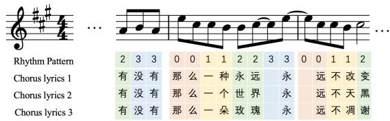
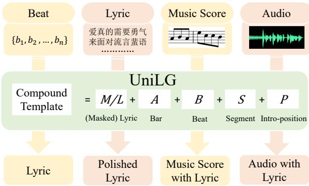
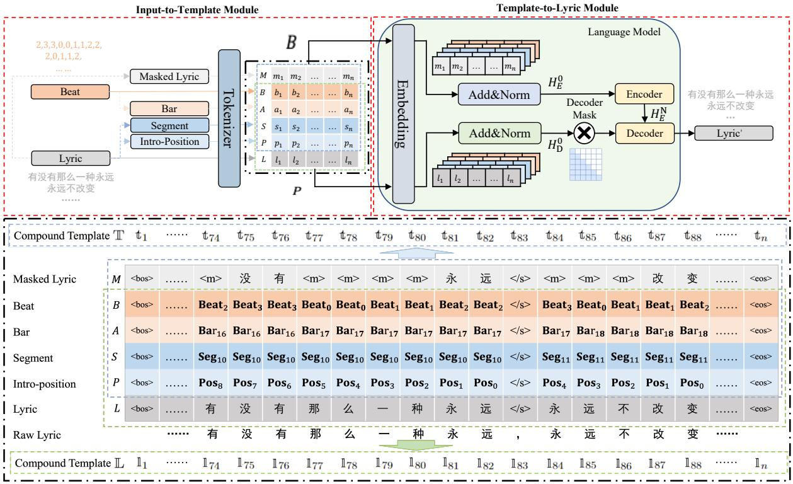
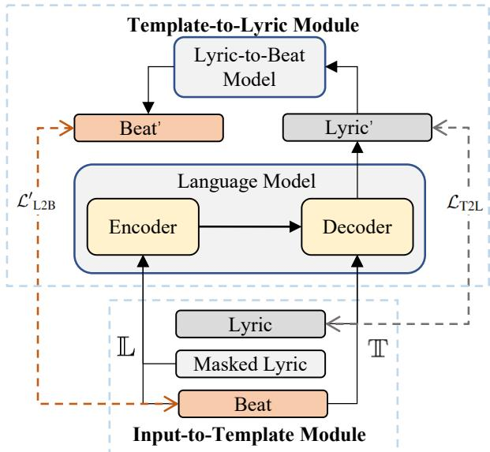
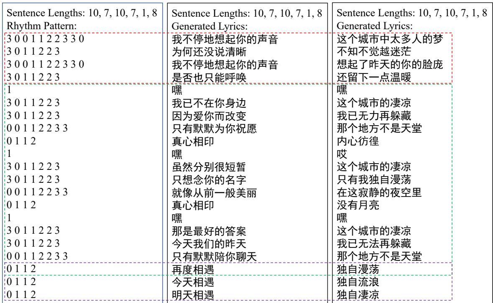
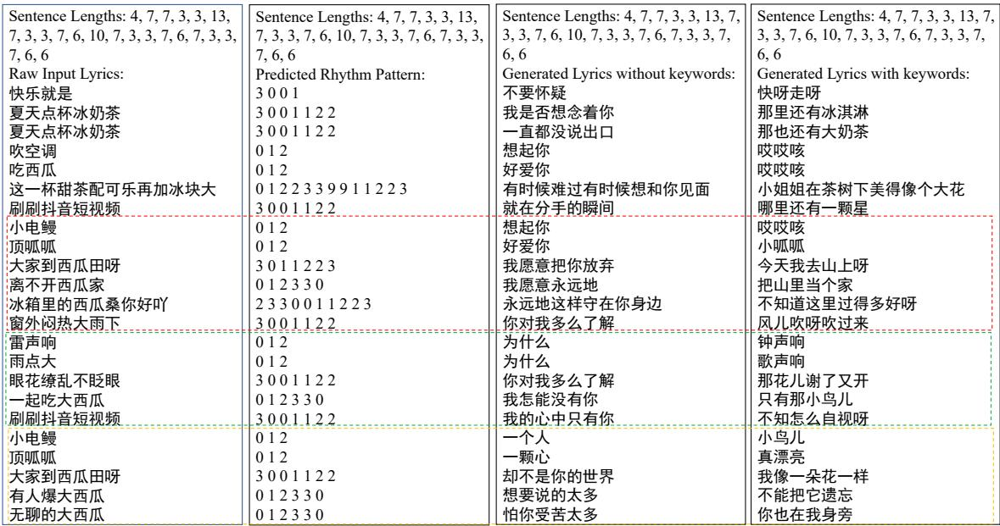
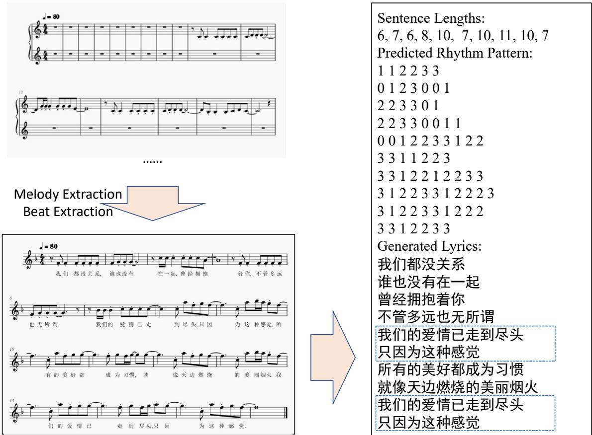
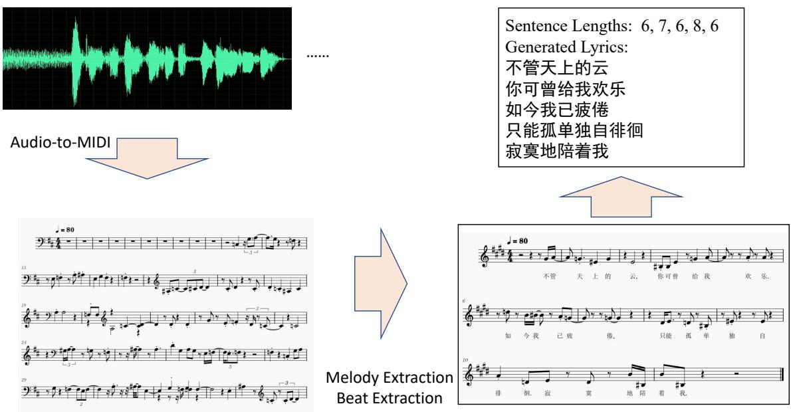
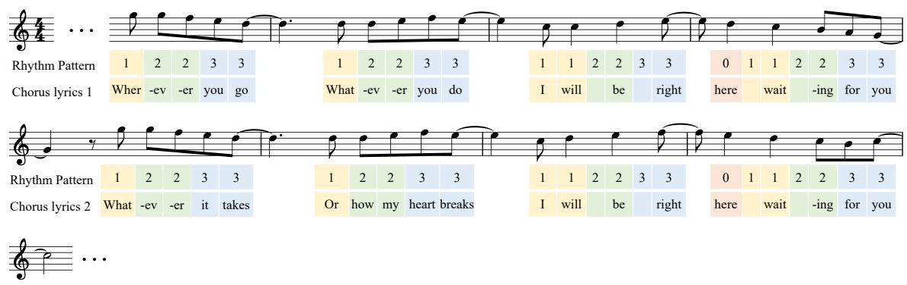

# UniLG: A Unified Structure-aware Framework for Lyrics Generation

Tao Qian1,2, Fan Lou2, Jiatong Shi3, Yuning Wu1, Shuai Guo1, Xiang Yin2, Qin Jin1∗ 1Renmin University of China, P.R.China

2ByteDance AI Lab

3Carnegie Mellon University, U.S.A

{qiantao, yuningwu, shuaiguo, qjin}@ruc.edu.cn, tianzhong.t, yinxiang.stephen}@bytedance.com, jiatongs@cs.cmu.edu

## Abstract

As a special task of natural language generation, conditional lyrics generation needs to consider the structure of generated lyrics1 and the relationship between lyrics and music. Due to various forms of conditions, a lyrics generation system is expected to generate lyrics conditioned on different signals, such as music scores, music audio, or partially-finished lyrics, etc. However, most of the previous works have ignored the musical attributes hidden behind the lyrics and the structure of the lyrics. Additionally, most works only handle limited lyrics generation conditions, such as lyrics generation based on music score or partial lyrics, they can not be easily extended to other generation conditions with the same framework. In this paper, we propose a unified structure-aware lyrics generation framework named UniLG. Specif ically, we design compound templates that incorporate textual and musical information to improve structure modeling and unify the dif ferent lyrics generation conditions. Extensive experiments demonstrate the effectiveness of our framework. Both objective and subjective evaluations show significant improvements in generating structural lyrics.

## 1 Introduction

Great progress has been made in natural language generation (NLG) with pre-trained language models in recent years (Lewis et al., 2020; Radford et al., 2019; Brown et al., 2020). Lyrics generation is also a special task of NLG (Chen and Lerch, 2020; Gill et al., 2020). Different from general natural language, lyrics eventually need to be presented with music after the composition. This requires the lyrics to follow song-writing rules (i.e., the structure of lyrics), such as clear paragraphs with chorus and verse concepts. However, most previous works ignore the musical concepts behind the lyrics and do not consider the structure of lyrics (Sheng et al., 2021; Qian et al., 2022). To explicitly model the structure of lyrics, some works introduce additional structural labels (e.g., sentence-level chorus and verse label), which inevitably require much effort for additional human annotation (Potash et al., 2015; Lu et al., 2019). To avoid the huge annotation cost, other works either adopt predefined formats (e.g., the number of syllables in each sentence) or linguistic tags (e.g., PoS, Part-of-Speech) to inject structural information (Li et al., 2020; Castro and Attarian, 2018). Nevertheless, given that those methods cannot directly indicate the structure of lyrics, the generated lyrics are still difficult to realize the musical concepts (e.g., chorus and verse). Moreover, most works only focus on certain lyrics generation conditions, such as generating lyrics given music scores or partially-finished lyrics etc., which hinders the application of a lyrics generation model in various scenarios.

  
Figure 1: Example chorus parts of a song. We use different colors for different beats2 within the bar3 and rhythm patterns are shown in 4/4 time signatures4. The same melody and rhythm pattern may repeat several times when meeting the chorus parts of the song. The melody and rhythm patterns can hint the correspondences between lyric sentences, e.g. the same or similar sentences.

To mitigate the issues in previous works, we propose a unified structure-aware lyrics generation framework named UniLG. As illustrated in Figure 1, the chorus parts of the songs share the same melody, so that the corresponding lyrics follow a similar pattern. Such a phenomenon inspires us that shared musical signals indicate the structure of lyrics and can be used to infer the relation across lyrics. Therefore, we design a compound template (i.e., a sequence of tuples) that incorporates both textual and musical information to model the structure of lyrics. The template is designed with rhythmic concepts in mind, and it can be extracted from different sources (e.g., audio, music score, etc.). As shown in Figure 2, the general interface in the template enables UniLG to generate lyrics based on various conditional signals without re-training the model. Additionally, we propose a cycle-consistency loss to enforce the reconstruction of the musical information from the generated lyrics to further improves the performance. To verify our proposed framework, we collect a test dataset named Song8k with chorus and verse labels for each sentence. Both objective and subjective evaluations on the test dataset demonstrate the effectiveness of our framework.

  
Figure 2: A general overview of our proposed framework. UniLG establishes relationships between various inputs and lyrics with the compound template, which enable our framework to generate lyrics conditioned on different signals (e.g., audio, music score, etc.).

In summary, the main contributions of this work are as follows:

• we propose a unified structure-aware lyrics generation framework named UniLG;

• we design a compound template that incorporates textual and musical information to achieve structure modeling and enable lyrics generation in various conditions;

• we introduce a cycle-consistency loss to validate the impact of musical information and further boost the performance;

• extensive experiments demonstrate the effectiveness of our method that achieves better structural modeling in lyrics generation.

## 2 Related Work

The existing lyrics generation approaches can be categorized into two types: 1) free lyrics generation, which generates lyrics either from scratch or based on some prefix prompts (Radford et al., 2019; Brown et al., 2020); and 2) conditional lyrics generation, which generates lyrics conditioned on control signals (e.g., music score, audio, etc.) (Saeed et al., 2019; Fan et al., 2019). In this work, we focus on conditional lyrics generation.

Recent works have shown the effectiveness of pre-trained language models in NLG (Lewis et al., 2020; Brown et al., 2020; Radford et al., 2019). As a special task of NLG, lyrics generation also follows the trend of using pre-trained language models. However, the pre-trained language models are trained with general text corpus and fail to consider the structure of lyrics (e.g., chorus and verse parts of the song), which is a salient feature for lyrics. Several works adopt pre-trained Transformer variants, such as GPT-2, as the backbone to improve the performance of lyrics generation but ignore the structure of lyrics as well (Zhang et al., 2020; Lee et al., 2019; Bao et al., 2019; Sheng et al., 2021; Qian et al., 2022). To achieve structural modeling, some works attempt to annotate the structural information of lyrics, however, this requires additional expensive human annotation (Potash et al., 2015; Lu et al., 2019). To avoid human labeling, SongNet chooses corpus with pre-defined formats (e.g., Ci5 and Sonnet), while some works regard the linguistic tags of lyrics as the structure information of lyrics (Li et al., 2020; Castro and Attarian, 2018). However, SongNet can not provide diverse representations for sentences, and the construction of linguistic tags is inconvenient and not humanfriendly. In addition, these methods cannot represent the structure of lyrics explicitly. Moreover, most previous lyrics generation works ignore the musical properties hidden behind the lyrics, that is, the lyrics will eventually be presented together with the music. To overcome all the above limitations, we propose a compound template in our framework that can be conveniently constructed. It provides discriminative representations and incorporates both textual and musical information to achieve structural modeling.

  
Figure 3: Illustration of the proposed two-stage pipeline of UniLG. In training, we construct a compound template with Masked Lyric (or Lyric) and Beat as the dotted blue (or green) box as described in Section 3.1 and 3.2. The character tokenizer is used in UniLG.

## 3 Method

Our proposed unified framework for lyrics generation (UniLG) contains two highlights: 1) it considers the structure of lyrics in the generation; 2) it can handle different lyrics generation conditions with different control signals, such as the music score, or music audio, or partial lyrics, etc.

For the structure of lyrics, as illustrated in Figure 1, the melody implies the structure of lyrics, which can be leveraged for lyrics structure modeling. However, large-scale (melody, lyrics) parallel data is generally difficult to obtain. We, therefore, propose using rhythm patterns6 that preserves the inter-correlation of lyrics as musical information to explicitly represent the structure of lyrics. As explored in previous works (Ju et al., 2021; McAuliffe et al., 2017), the defined rhythm patterns can be efficiently extracted from lyrics and different rhythmic sources (e.g., music score, music audio, etc.) without extra human annotation.

For handling various control signals of different lyrics generation conditions, the model should have the capacity to process different types of inputs, such as music score, music audio, rhythm patterns, partially-finished lyrics, etc. Therefore, we design a compound template (i.e., a sequence of tuples) that can incorporate both textual and musical information. So any type of input can be converted into a compound template, and then lyrics can be generated based on the compound template.

Figure 2 illustrates the overview of our proposed lyrics generation framework UniLG. We propose an intermediate compound template as a bridge between the rhythmic sources (e.g., audio, music score, etc.) and lyrics in UniLG. Specifically, the lyrics generation is decomposed into a two-stage pipeline consisting of an Input-to-Template stage and a Template-to-Lyric stage. In this section, we first describe the compound template in detail. We then present the two stages during training respectively. Finally, we discuss the inference procedure of UniLG to illustrate how to handle various control signals in different lyrics generation conditions with our unified framework.

## 3.1 Compound Template

To model the structure of the lyrics, the compound templates are designed to incorporate both musical and textual information. As shown in Figure 3, a compound template consists of five components, Masked Lyric M (or Lyric $L ) ,$ , Bar A, Beat $B ,$ , Segment $S ,$ and Intro-position $P$ . These components can be categorized into three aspects: semantic information, musical information, and textual information. The details of these aspects with corresponding components are as follows:

Semantic Information Aspect We introduce Lyric Symbols and Masked Lyric Symbols to leverage the pre-trained language model and achieve semantic control.

Lyric Symbols: We denote the Lyric, a sequence of Chinese character tokens, as $L \_ =$ $( l _ { 1 } , l _ { 2 } , . . . , l _ { n } ) = ( l _ { i } ) _ { i = 1 } ^ { n }$ , where $l _ { i }$ stands for the $i ^ { \mathrm { t h } }$ element of $L , l _ { i } \in \mathcal { C } \cup \mathcal { E }$ , n is the length of $L , { \mathcal { C } }$ refers to the set of Chinese characters and $\mathcal { E } = \left\{ \begin{array} { r l r l } \end{array} \right.$ $\langle / s \rangle , \langle b o s \rangle , \langle e o s \rangle \}$ is a set of special tokens, including the separation token between sentences $\langle / s \rangle$ , the start of sequence token bos , and end of sequence token eos .

Masked Lyric Symbols: We denote the Masked Lyric as $M = ( m _ { i } ) _ { i = 1 } ^ { n }$ , where $m _ { i }$ stands for the $i ^ { \mathrm { { t h } } }$ element of M, and $m _ { i } \in \mathcal { C } \cup \mathcal { E } \cup \{ \langle m \rangle \}$ , where $\langle m \rangle$ stands for mask token, which is widely used in masked language modeling (MLM) (Kenton and Toutanova, 2019; Lewis et al., 2020).

Musical Information Aspect As illustrated in Figure $^ { 3 , }$ the inter-correlation of lyrics can be preserved in the musical information, and two kinds of musical symbols, Beat Symbols and Bar Symbols, are designed to represent the musical information at a different level.

Beat Symbols: The Beat $B = ( b _ { i } ) _ { i = 1 } ^ { n }$ denotes the local musical information, where $b _ { i }$ (the $i ^ { \mathrm { { t h } } }$ element of $B , b _ { i } \in B \cup \mathcal { E } )$ , denotes the local musical information of $m _ { i }$ and $l _ { i \cdot } \ B = \{ { \bf B e a t } _ { i } \} _ { i = 0 } ^ { 3 } ,$ and Beat0, Beat1, Beat2, and Beat3 stand for $1 ^ { \mathrm { s t } } , 2 ^ { \mathrm { n d } }$ ， $3 ^ { \mathrm { r d } }$ , and $4 ^ { \mathrm { t h } }$ beat in a bar.

Bar Symbols: The Bar $A = ( a _ { i } ) _ { i = 1 } ^ { n }$ denotes the global musical information, where $a _ { i }$ (the $i ^ { \mathrm { t h } }$ element of $A , a _ { i } \in \mathcal { A } \cup \mathcal { E } )$ denotes the bar information of the $b _ { i \cdot } \ { \mathcal { A } } = \{ { \bf B a r } _ { i } \} _ { i = 0 } ^ { 5 1 1 }$ , and token $\mathbf { B a r } _ { j }$ stands for the $j ^ { \mathrm { t h } } \mathsf { b a r } ^ { 7 }$ . And $a _ { i }$ also indicates that the word $m _ { i }$ and $l _ { i }$ are supposed to be sung at bar $a _ { i }$

Textual Information Aspect Similar to SongNet, the Intro-position and segment symbols are adopted to model the textual information at word and sentence level (Li et al., 2020). In the following sections, we name the sub-sequence of any component between special symbols in $\mathcal { E }$ as a sentence.

Segment Symbols: The segment symbols provide global textual information to the compound template. We denote Segment as $S = ( s _ { i } ) _ { i = 1 } ^ { n }$ , where $s _ { i }$ (the $i ^ { \mathrm { { t h } } }$ element of S, $s _ { i } \in { \mathcal { S } } \cup { \mathcal { E } } )$ denotes the sentence position of the mi and $l _ { i } . s = \{ \mathbf { S e g } _ { i } \} _ { i = 0 } ^ { 2 5 5 }$ and $\mathbf { S e g } _ { j }$ stands for the $j ^ { \mathrm { t h } }$ sentence. For example, the lyrics shown in Figure 3 is the $1 0 ^ { \mathrm { t h } }$ and $1 1 ^ { \mathrm { t h } }$ sentences $( \mathbf { S e g } _ { 1 0 }$ and $\mathbf { S e g } _ { 1 1 } )$

Intro-Position Symbols: The Intro-Position $P =$ $( p _ { i } ) _ { i = 1 } ^ { n }$ denotes the local textual information, where $p _ { i }$ (the $i ^ { \mathrm { t h } }$ element of $P , p _ { i } \in \mathcal { P } \cup \mathcal { E } )$ denotes the local position within the sentence of the $m _ { i }$ and $l _ { i } . \ \mathcal { P } = \{ { \bf P o s } _ { i } \} _ { i = 0 } ^ { 3 1 }$ and the token $\mathbf { P o s } _ { i }$ stands for the $i ^ { \mathrm { { t h } } }$ reversed local position within the sentence or the distance to the end of token of the sentence. For example, in Figure 3, the $\mathbf { P o s } _ { 8 }$ means this position is 8 tokens away from the last token of the corresponding segment $( \mathbf { P o s } _ { 0 }$ in $\mathbf { S e g } _ { 1 0 } )$

The compound template is a tuple sequence consisting of five components, including Masked Lyric M (or Lyric L), Beat B, Bar A, Segment S, and Intro-Position P. As shown in the blue and green dotted box in the bottom of Figure 3, we can construct the template based on these components.

## 3.2 Input-to-Template Module

In this subsection, we discuss the construction procedure of the compound template given the lyrics $L = ( l _ { i } ) _ { i = 1 } ^ { n }$ in length n during training. To be specific, we first extract symbols (defined in Section 3.1) from lyrics L. Then, we combine them to construct the compound template:

(1) Masked Lyric $M = ( m _ { i } ) _ { i = 1 } ^ { n }$ . Similar to MLM, the M is constructed by randomly masking 85% of elements that are not in of lyrics L.

(2) Bar $A = ( a _ { i } ) _ { i = 1 } ^ { n }$ and Beat $B \ = \ ( b _ { i } ) _ { i = 1 } ^ { n }$ According to the time signatures, the bar information A can be obtained given beat information B. And the Beat B is extracted from lyrics $L$ through a Lyric-to-Beat model (details in Appendix $\mathbf { A } ) .$ , which predicts rhythm patterns in B for given lyrics $L$

(3) Segment ${ \cal S } ~ = ~ ( s _ { i } ) _ { i = 1 } ^ { n }$ , and Intro-poistion $P = ( p _ { i } ) _ { i = 1 } ^ { n }$ . As shown in Figure 3, the special tokens of appear in the position for all components, in other words, they have the same format information, and the S and $P$ can be extracted from either M, B, A, or $L .$ . For a sequence $Q \in \{ M , B , A , L \}$

S can be construct by counting the number of $\langle / s \rangle$ (if the number is c) before each position i and replace Seg with the corresponding $i ^ { \mathrm { { t h } } }$ token not in . Similarly, for a sequence $Q \in \{ M , B , A , L \}$ , P can be constructed by counting the distance away from the nearest $\langle / s \rangle$ in the right (if the distance is c) for each position i and replace Posc with the corresponding $i ^ { \mathrm { t h } }$ token not in .

As shown in the blue dotted box in the bottom of Figure 3, the compound template T, a tuple sequence including Masked Lyric M, Beat $B { \mathrm { , } }$ , Bar A, Segment S, and Intro-Position $P ,$ can be formulated as $\mathbb { T } = ( \mathfrak { t } _ { i } ) _ { i = 1 } ^ { n } = ( < m _ { i } , b _ { i } , a _ { i } , s _ { i } , p _ { i } > ) _ { i = 1 } ^ { n }$

## 3.3 Template-to-Lyric Module

Through the Input-to-Template module, we construct the template T and obtain paired lyrictemplate data. With such data, we adopt a pretrained encoder-decoder Transformer language model MT5 as backbone (Xue et al., 2021b). Figure 3 illustrates the procedure of the Template-to-Lyric module and the details are as follows:

Encoder Inputs and Decoder Inputs We define $H _ { E } ^ { 0 }$ and $H _ { \cal D } ^ { 0 }$ as the inputs of the Encoder and the Decoder respectively and their formulations are:

$$
\begin{array} { r } { { H } _ { E } ^ { 0 } = E _ { \mathbb { T } } = { \mathrm { L N } } ( E _ { M } + E _ { B } + E _ { A } + E _ { S } + E _ { P } ) } \\ { { H } _ { D } ^ { 0 } = E _ { \mathbb { L } } = { \mathrm { L N } } ( E _ { L } + E _ { B } + E _ { A } + E _ { S } + E _ { P } ) , } \end{array}\tag{1}
$$

where LN( ) denotes the layer normalization and $E _ { * }$ stands for token embedding sequences of $^ * \cdot$ Similar to the definition of the T in Section 3.2, the L denote the compound template that is a sequence of tuples: $\mathbb { L } = ( \mathbb { I } _ { i } ) _ { i = 1 } ^ { n } = ( < l _ { i } , b _ { i } , a _ { i } , s _ { i } , p _ { i } > ) _ { i = 1 } ^ { n } ,$ where the M is replaced by L in the T to obtain the L as shown in Figure 3.

Encoder and Decoder The Encoder and Decoder each consist of N Transformer layers. $H _ { E } ^ { t }$ and $H _ { { D } } ^ { t }$ denote the output of the $t ^ { \mathrm { { t h } } }$ encoder layer and decoder layer respectively. As shown in Figure 3, the output of Encoder and Decoder $H _ { E } ^ { N }$ and $H _ { \cal D } ^ { N }$ are:

$$
\begin{array} { l } { H _ { E } ^ { N } = \mathrm { E n c o d e r } ( H _ { E } ^ { 0 } ) } \\ { H _ { D } ^ { N } = \mathrm { D e c o d e r } ( H _ { E } ^ { N } , H _ { D } ^ { 0 } * \mathrm { M a s k } _ { D } ) , } \end{array}\tag{2}
$$

where Mask $_ { . D }$ denotes a causal decoder mask. And there is a projection layer for $H _ { D } ^ { N }$ to get the final distribution of the predicted lyrics.

Training with Cycle-consistency Loss The main training loss is to minimize the negative loglikelihood over the lyrics $L = ( l _ { i } ) _ { i = 1 } ^ { n }$ given the

  
Figure 4: Illustration of the training loss in the Templateto-Lyric module. As described in Section $3 . 2 ,$ we simplify the inputs for Bar B. Segment S and Intro-position P can be constructed with Masked Lyric M, Lyric L, and Beat B. The Lyric-to-Beat model is a pre-trained model and details can be found in Appendix A.

template $\mathbb { T } = ( \mathbb { t } _ { i } ) _ { i = 1 } ^ { n }$ as shown in the gray dotted line in Figure 4:

$$
\begin{array} { r l } & { \mathcal { L } _ { \mathrm { T 2 L } } = - \log P ( L | \mathbb { L } , \mathbb { T } ) } \\ & { \qquad = - \sum _ { i = 1 } ^ { n } \log P ( l _ { i } | \mathbb { I } _ { < i } ; \mathbb { t } _ { 1 } , . . . , \mathbb { t } _ { n } ) , } \end{array}\tag{3}
$$

where $\mathbb { L } = ( \mathbb { I } _ { i } ) _ { i = 1 } ^ { n }$ denote the compound template. The $\mathbb { I } _ { < i }$ stands for sequence $( \mathbb { I } _ { 1 } , \mathbb { I } _ { 2 } , . . . , \mathbb { I } _ { i - 1 } )$

As illustrated by the orange dotted line in Figure 4, we introduce the cycle-consistency loss (CCL) to enhance the impact of musical information. The Lyric-to-Beat model reconstructs the beat sequence from the predicted lyrics of the language model. The formulation of CCL is as follows:

$$
\begin{array} { r l } & { \mathcal { L ^ { \prime } } _ { \mathrm { L 2 B } } = - \log P ( B | L ^ { \prime } ) } \\ & { \qquad = - \Sigma _ { i = 1 } ^ { n } \log P ( b _ { i } | b _ { < i } ; l _ { 1 } ^ { \prime } , . . . , l _ { n } ^ { \prime } ) , } \end{array}\tag{4}
$$

where $L ^ { \prime } = ( l _ { i } ^ { \prime } ) _ { i = 1 } ^ { n }$ denotes the predicted lyrics by the language model, and $B = ( b _ { i } ) _ { i = 1 } ^ { n }$ denotes the Beat of input template T as in Figure 4.

Finally, the training objective of Template-to-Lyric model is to minimize the loss $\mathcal { L } _ { t o t } \mathrm { : \Omega }$

$$
\mathcal { L } _ { \mathrm { t o t } } = \mathcal { L } _ { \mathrm { T 2 L } } + \alpha * \mathcal { L } _ { \mathrm { L 2 B } } ^ { \prime } ,\tag{5}
$$

where $\alpha$ is a hyper-parameter to weigh CCL.

## 3.4 Inference Procedure

In this subsection, we describe the inference procedure of UniLG for various lyrics generation conditions. The major steps are shown in Algorithm 1, including "Beat Construction", "Masked Lyric Construction", and "Components Construction". Given the template T by Algorithm 1, the Template-to-Lyric module generates the Lyric L and the L autoregressively.

"Beat Construction" is a method to construct the Beat B from raw input X (e.g., beat, lyric, music score, audio, etc.)8. "Beat Construction" consists of "Sentence Length Generation" and "Beat Generation". "Sentence Length Generation" generates a sequence of numbers with each number denoting the length of one sentence9. "Beat Generation" generates the Beat based on the outputs from "Sentence Length Generation". For example, if "Sentence Length Generation" generate a sequence S = [3, 2], "Beat Generation" may return B = [ bos , Beat1, Beat3, Beat0, /s , Beat0, Beat1, /s , eos ].

To achieve content controllable generation, we use keywords  to construct the Masked Lyrics M. Based on the keyword 10, the model generates the lyrics in the MLM manner. The keywords can be either user-specified or sampled from the training corpus, which should appear in the generated lyrics. "Masked Lyric Construction" is a method to construct the masked lyrics M condition on Beat B and keywords . Similar to the construction of P and S in Section 3.2, given Beat B, M can be constructed by replacing the token that is not in with the mask token or keywords in K randomly.

"Components Construction" is a method to obtain the other components given M and B as described in Section 3.2, and organize all components for the template.

## 4 Experimental Settings

## 4.1 Dataset

We collect lyrics of 249,007 Chinese pop songs from Internet as the base of our experiments.

Lyric-Template Dataset. We use the pre-trained Lyric-to-Beat model to extract the lyric-template dataset from 249,007 lyrics. We randomly select 8000 songs for the validation and test set respectively, and the remaining songs are used for training. The data statistics are shown in Appendix B.

Algorithm 1 Template Construction In Inference   
Input: X: the raw input; : keywords.   
Output: T, generated compound template.   
Def Beat Construction(X):   
Case of X:   
a beat sequence : B = X   
a lyric sequence: B = Lyric-to-Beat(X)   
a MIDI file: B = MIDI-to-Beat(X)   
a audio file: B = Audio-to-Beat(X)   
None: S = Sentence Length Generation()   
B = Beat Generation(S)   
end Case   
return B   
B = Beat Construction(X)   
M = Masked Lyric Construction(B, )   
return T = Components Construction(B, M)

Additional Dataset: Song8k. We also annotate 8,000 songs with structure labels (sentence-level chorus and verse label) for evaluation and we name this dataset Song8k. For dataset settings, we use all 8,000 songs for further evaluation in the Templateto-Lyric module.

## 4.2 Baselines in Model Comparison

We compare with two baselines in the experiments: 1) MT5, a pre-trained Transformer language model (Xue et al., 2021b); 2) SongNet, a format-controlled text generation model (Li et al., 2020). MT5 and SongNet construct their inputs with the same corpus as the lyric-template dataset. MT5, SongNet, and UniLG have similar parameters and all models use the same pre-trained model as initialization for a fair comparison. The details of the model configuration, training, and decoding settings are reported in Appendix E and G.

## 4.3 Objective Evaluation Metrics

We use three kinds of objective evaluation metrics: general level, low level, and high level (more details can be found in Appendix F).

General Level: Besides perplexity (PPL), we use Integrity metric to evaluate the sentence integrity (Li et al., 2020), which calculates the average probability of the separation token given previous tokens.

Low Level: We use Format F1 and Beat F1 to evaluate the degree of consistency between the generated lyrics and the given textual format (Segment and Intro-Position) and rhythm patterns (Beat) in the template.

High Level: We use Song8k and a pre-trained model (details are in Appendix C) to evaluate the quality of the structure of generated lyrics. Specifically, the model predicts a chorus or verse label for each sentence in generated lyrics and compares it with the human annotations to obtain Structure F1.

## 4.4 Subjective Evaluation Metrics

As illustrated in Section ??, the Beat is important for the compound template and may have a big impact on our framework. We conduct subjective experiments for "Beat Construction", including "Sentence Length Generation" and "Beat Generation". Besides, we also conduct subjective experiments for model comparison. For each subjective experiment, we invite 43 annotators to evaluate the generated lyrics. Each annotator is required to score lyrics concerning four aspects. Each aspect is rated with an opinion score from 1 to 5 (from bad to excellent). The four aspects are as follows: 1) Coherence: the overall consistency of the topic of the entire song; 2) Fluency: the fluency of the semantic correlation within a sentence and between the sentence; 3) Correlation: the structural or semantic similarity among sentences, such as the distribution of words and corresponding relationships of sentences; 4) Fascination: the degree of fascinating sentences in annotators’ opinion.

## 5 Experiments Results

In this section, we report and analyze both objective and subjective experimental results. We also show some cases in Appendix H to verify the ability of UniLG to handle different generation conditions.

## 5.1 Objective Results

Model Comparison We compare MT5, SongNet, and UniLG on the Song8k and the test set of the lyric-template dataset. The results of the model comparison (in Table 1) show that MT5 achieves the best results in PPL and Integrity. Our UniLG outperforms baselines in Format F1, Beat F1, and Structure F1.The Structure F1 shows that our framework does generate the lyrics with better structure, which indicates that the musical information improves the structural modeling.

Ablation Study We further ablate our UniLG to verify the impact of musical and textual information as well as the CCL. From the results shown in Table 2, we see that the textual information (Seg&Pos), musical information (Bar&Beat), and

CCL play crucial roles in the overall performance. These modules of our framework show significant improvement, especially on the metrics of Beat F1 and Structure F1. The CCL may enhance the musical information to boost performance in Format F1, Beat F1, and Structure F1, but at the same time may introduce noise and cause degradation in general metrics (PPL and Integrity). The effectiveness of the CCL further proves that the musical information behind the lyrics does benefit the structure-aware lyric generation. We notice that the musical information (Bar&Beat) degrades the performance of the framework more than the textual information and CCL. This may be due to there being extra position embeddings for input data in MT5 model. When it comes to music information, missing Bar&Beat leads to a complete loss of information, while missing the Seg&Pos only partially loses position information.

## 5.2 Subjective Results

Template Construction As the template directly affects the Template-to-Lyric module, we perform the subjective evaluation on different settings of "Sentence Length Generation" and "Beat Generation" in Algorithm 1 to investigate the impact of the compound template.

For "Sentence Length Generation", we have 2 candidate settings: 1) Random, the length of the sentence is randomly chosen from 6 to 12; 2) 2- gram, the next sentence length is generated conditioned on the length of the previous sentence. We generate 40 songs in 6 to 16 sentences for each setting. Given two number sequences generated by "Sentence Length Generation" of two settings, the two Beat can be generated by the same method of "Beat Generation", whose setting is chosen randomly. The results in Table 3 show that Random and 2-gram strategies achieve comparable performance and different sentence length generation strategies have little influence on models.

For "Beat Generation", we have 3 candidate settings: 1) Random, the beat information for each character is randomly chosen from ; 2) Rule, the beat is non-decreasing than the previous one; 3) Sample, we compute the statistics of the beat sequence of each length in the lyric-template dataset and sample the beat sequence conditioned on the sequence length. We generate 40 songs in 6 to 16 sentences for each setting ("Sentence Lengths Generation" uses 2-gram). The result in Table 4 shows that musical information does influence the lyric generation, and the Sample method, which leads to more natural rhythm patterns, achieves the best performance on all metrics.

Table 1: Model comparison with objective metrics on the test set of lyric-template dataset and Song8k. T-L and S8 stand for lyric-template dataset and Song8k respectively.
<table><tr><td></td><td>Dataset</td><td>PPL(↓)</td><td>Intergrity(↓)</td><td>Format F1(%, ↑)</td><td>Beat F1(%, ↑)</td><td>Structure F1(%, ↑)</td></tr><tr><td>MT5</td><td>T-L</td><td>1.96</td><td>1.92</td><td>77.08</td><td>14.63</td><td></td></tr><tr><td>SongNet</td><td>T-L</td><td>2.62</td><td>2.39</td><td>86.36</td><td>31.19</td><td></td></tr><tr><td>UniLG</td><td>T-L</td><td>2.41</td><td>2.11</td><td>87.39</td><td>32.88</td><td>-</td></tr><tr><td>MT5</td><td>S8</td><td>1.99</td><td>2.10</td><td>76.11</td><td>14.37</td><td>50.02</td></tr><tr><td>SongNet</td><td>S8</td><td>2.68</td><td>2.66</td><td>85.79</td><td>31.56</td><td>50.68</td></tr><tr><td>UniLG</td><td>S8</td><td>2.19</td><td>2.14</td><td>88.91</td><td>34.25</td><td>53.71</td></tr></table>

Table 2: Ablation experiments on the test set of lyric-template dataset and Song8k. T-L and S8 stand for lyrictemplate dataset and Song8k respectively. CCL denotes the cycle-consistency loss in Section ??.
<table><tr><td></td><td>Dataset</td><td>PPL(↓)</td><td>Integrity(↓)</td><td>Format F1(%, ↑)</td><td> $\mathrm { B e a t } \ F 1 ( \% , \uparrow )$ </td><td>Structure F1(%, ↑)</td></tr><tr><td>UniLG</td><td>T-L</td><td>2.41</td><td>2.23</td><td>87.39</td><td>31.82</td><td></td></tr><tr><td>- Bar&amp;Beat</td><td></td><td>2.62</td><td>2.43</td><td>83.52</td><td>21.35</td><td></td></tr><tr><td>- Seg&amp;Pos</td><td></td><td>2.44</td><td>2.22</td><td>85.67</td><td>31.62</td><td></td></tr><tr><td>- CCL</td><td></td><td>2.45</td><td>2.21</td><td>85.84</td><td>30.42</td><td></td></tr><tr><td>UniLG</td><td>S8</td><td>2.19</td><td>2.14</td><td>88.91</td><td>34.25</td><td>53.71</td></tr><tr><td>- Bar&amp;Beat</td><td></td><td>2.58</td><td>2.61</td><td>86.72</td><td>31.65</td><td>51.08</td></tr><tr><td>- Seg&amp;Pos</td><td></td><td>2.23</td><td>2.22</td><td>86.68</td><td>31.52</td><td>50.98</td></tr><tr><td>- CCL</td><td></td><td>2.19</td><td>2.12</td><td>88.04</td><td>32.42</td><td>52.34</td></tr></table>

Table 3: The MOS score of different settings in "Sentence Length Generation".
<table><tr><td></td><td>Random</td><td>2-gram</td></tr><tr><td>Coherence</td><td> ${ \bf 3 . 3 1 \pm 0 . 0 7 }$ </td><td> ${ \bf 3 . 3 1 \pm 0 . 0 8 }$ </td></tr><tr><td>Fluency</td><td> $3 . 2 6 \pm 0 . 0 7$ </td><td> ${ \bf 3 . 2 7 \pm 0 . 0 7 }$ </td></tr><tr><td>Correlation</td><td> ${ \bf 3 . 1 1 \pm 0 . 0 8 }$ </td><td> ${ \bf 3 . 1 1 \pm 0 . 0 8 }$ </td></tr><tr><td>Fascination</td><td> $2 . 9 8 \pm 0 . 0 8$ </td><td> ${ \bf 3 . 0 6 \pm 0 . 0 7 }$ </td></tr></table>

Table 4: The MOS score of different settings in "Beat Generation".
<table><tr><td></td><td>Random</td><td>Rule</td><td>Sample</td></tr><tr><td>Coherence</td><td> $3 . 1 9 \pm 0 . 0 8$ </td><td> $3 . 2 5 \pm 0 . 0 8$ </td><td> ${ \bf 3 . 3 2 \pm 0 . 0 8 }$ </td></tr><tr><td>Fluency</td><td> $3 . 0 3 \pm 0 . 0 7$ </td><td> $3 . 2 4 \pm 0 . 0 7$ </td><td> ${ \bf 3 . 3 0 \pm 0 . 0 7 }$ </td></tr><tr><td>Correlation</td><td> $2 . 9 4 \pm 0 . 0 9$ </td><td> $3 . 0 6 \pm 0 . 0 9$ </td><td> ${ \bf 3 . 1 1 \pm 0 . 0 8 }$ </td></tr><tr><td>Fascination</td><td> $2 . 9 6 \pm 0 . 0 8$ </td><td> $2 . 9 9 \pm 0 . 0 9$ </td><td> ${ \bf 3 . 0 9 \pm 0 . 0 9 }$ </td></tr></table>

Model Comparison We also conduct the subjective comparison of UniLG with two baselines: MT5 and SongNet. We adapt 2-gram for "Sentence Length Generation" and Sample for Beat Generation in model comparison. We generate 120 songs in 6 to 16 sentences by each model with the same Masked Lyrics. The results in Table 5 show that our UniLG outperforms the baselines, which further validates the effectiveness of our framework. Table 1 and 5 prove that our compound template enables a stronger structure modeling ability than SongNet. This may be because that the compound template provides discriminative representations for lyrics under the guidance of musical information. The MT5 achieves better PPL and Integrity in Table 1 but gets lower MOS results in Fluency in Table 5. This indicates that MT5 may pay too much attention to the fluency of the text but lacking the logical correlation between sentences.

Table 5: The MOS score of model comparison.
<table><tr><td></td><td>MT5</td><td>SongNet</td><td>UniLG</td></tr><tr><td>Coherence</td><td> $3 . 2 5 \pm 0 . 0 5$ </td><td> $3 . 3 3 \pm 0 . 0 4$ </td><td> ${ \bf 3 . 4 0 \pm 0 . 0 4 }$ </td></tr><tr><td>Fluency</td><td> $3 . 0 8 \pm 0 . 0 5$ </td><td> $3 . 1 6 \pm 0 . 0 5$ </td><td> ${ \bf 3 . 2 5 \pm 0 . 0 4 }$ </td></tr><tr><td>Correlation</td><td> $3 . 0 3 \pm 0 . 0 5$ </td><td> $3 . 1 1 \pm 0 . 0 4$ </td><td> ${ \bf 3 . 1 9 \pm 0 . 0 4 }$ </td></tr><tr><td>Fascination</td><td> $2 . 9 9 \pm 0 . 0 6$ </td><td> $3 . 0 7 \pm 0 . 0 5$ </td><td> ${ \bf 3 . 1 5 \pm 0 . 0 6 }$ </td></tr></table>

## 5.3 Case Studies

We also show some cases in Appendix H to verify the ability of UniLG to handle different generation conditions. Although lyrics generated conditioned on the templates constructed by automatic method Template Construction are less satisfying (cases in Figure 5), the handcrafted template or template extracted by other resources achieves satisfying results as shown in Figure 6 and 7. These cases demonstrate that the template is humanunderstandable and can be manipulated by users directly as in Section 3.1. The results in Figure 8 and 9 indicate that the template acts as a bridge between lyrics and the rhythmic sources (e.g., audio, music score, etc.), which enables our UniLG to generate lyrics conditioned on different signals.

## 6 Conclusion

In this paper, we propose UniLG, a unified structure-aware lyric generation framework. With our designed compound template to indicate the structure of lyrics with textual and musical information, which acts as a bridge between the rhythmic sources and lyrics, UniLG can handle different lyrics generation conditions. We also introduce a cycle-consistency loss to enhance the impact of musical information to improve performance. Extensive experiments demonstrate the effectiveness of our framework, achieving significant improvement in both objective and subjective evaluations. We will explore topic-driven lyrics generation in our future work.

## Limitations

The limitations of our work include: 1) In our work, the structure of lyrics is the chorus and verse parts of songs, and it is learned in a data-driven manner, which highly relies on data quality. 2) The settings of the Lyric-to-Beat model will limit the effect of our model. For this work, we make an assumption that all songs are with 4/4 time signatures for the Lyric-to-Beat model. If the time signature is not 4/4, we need to re-train the Lyricto-Beat model.3) Better ”Beat Construction” can be investigated, such as using a language model to generate the beat sequence. We only explore the simple method and achieve satisfying results. 4) The model trained from scratch may not achieve satisfying results. And a GPU with at least 20G memory may be needed to use the pre-trained language model (MT5) to reproduce our work.

## Ethics Statement

Under the review of the company’s legal team, the data collected for research is under legally correct copyright. The artifacts we used (e.g., MT5, other codes, etc) are consistent with their intended use and meet corresponding licenses. The mother tongue of all annotators is Chinese and the annotators are recruited by the human resources departments and the payment is adequate enough (The annotators receive an hourly wage of 80 RMB, about 12 USD) according to the laws and regulations of our country. Before the experiments, we report key information about the requirements for human annotators, including the evaluation criteria and the usage of their annotations. We have used the data under the consensus of the industry and research and the final information used for research does not include any protected category.

## Acknowledgements

This work was partially supported by the National Natural Science Foundation of China (No. 62072462) and the National Key R&D Program of China under Grant No.2020AAA0108600.

## References

Hangbo Bao, Shaohan Huang, Furu Wei, Lei Cui, Yu Wu, Chuanqi Tan, Songhao Piao, and Ming Zhou. 2019. Neural melody composition from lyrics. In CCF International Conference on Natural Language Processing and Chinese Computing, pages 499–511. Springer.

Tom Brown, Benjamin Mann, Nick Ryder, Melanie Subbiah, Jared D Kaplan, Prafulla Dhariwal, Arvind Neelakantan, Pranav Shyam, Girish Sastry, Amanda Askell, et al. 2020. Language models are few-shot learners. Advances in neural information processing systems, 33:1877–1901.

Pablo Samuel Castro and Maria Attarian. 2018. Combining learned lyrical structures and vocabulary for improved lyric generation. arXiv preprint arXiv:1811.04651.

Yihao Chen and Alexander Lerch. 2020. Melodyconditioned lyrics generation with seqgans. In 2020 IEEE International Symposium on Multimedia (ISM), pages 189–196. IEEE.

Shangzhe Di, Zeren Jiang, Si Liu, Zhaokai Wang, Leyan Zhu, Zexin He, Hongming Liu, and Shuicheng Yan. 2021. Video background music generation with controllable music transformer. In Proceedings of the 29th ACM International Conference on Multimedia, pages 2037–2045.

Haoshen Fan, Jie Wang, Bojin Zhuang, Shaojun Wang, and Jing Xiao. 2019. A hierarchical attention based seq2seq model for chinese lyrics generation. In Pacific Rim International Conference on Artificial Intelligence, pages 279–288. Springer.

Satoru Fukayama, Kei Nakatsuma, Shinji Sako, Takuya Nishimoto, and Shigeki Sagayama. 2010. Automatic song composition from the lyrics exploiting prosody of the japanese language. In Proc. 7th Sound and Music Computing Conference (SMC), pages 299–302.

Harrison Gill, Daniel Lee, and Nick Marwell. 2020. Deep learning in musical lyric generation: an lstmbased approach. The Yale Undergraduate Research Journal, 1(1):1.

Zeqian Ju, Peiling Lu, Xu Tan, Rui Wang, Chen Zhang, Songruoyao Wu, Kejun Zhang, Xiangyang Li, Tao Qin, and Tie-Yan Liu. 2021. Telemelody: Lyric-tomelody generation with a template-based two-stage method. arXiv preprint arXiv:2109.09617.

Jacob Devlin Ming-Wei Chang Kenton and Lee Kristina Toutanova. 2019. Bert: Pre-training of deep bidirectional transformers for language understanding. In Proceedings of NAACL-HLT, pages 4171–4186.

Diederik P. Kingma and Jimmy Ba. 2015. Adam: A method for stochastic optimization. In 3rd International Conference on Learning Representations, ICLR 2015, San Diego, CA, USA, May 7-9, 2015, Conference Track Proceedings.

Hsin-Pei Lee, Jhih-Sheng Fang, and Wei-Yun Ma. 2019. icomposer: An automatic songwriting system for chinese popular music. In Proceedings of the 2019 Conference of the North American Chapter of the Associationfor Computational Linguistics (Demonstrations), pages 84–88.

Mike Lewis, Yinhan Liu, Naman Goyal, Marjan Ghazvininejad, Abdelrahman Mohamed, Omer Levy, Veselin Stoyanov, and Luke Zettlemoyer. 2020. Bart: Denoising sequence-to-sequence pre-training for natural language generation, translation, and comprehension. In Proceedings of the 58th Annual Meeting of the Associationfor Computational Linguistics, pages 7871–7880.

Piji Li, Haisong Zhang, Xiaojiang Liu, and Shuming Shi. 2020. Rigid formats controlled text generation. In Proceedings of the 58th Annual Meeting of the Association for Computational Linguistics, pages 742–751.

Xu Lu, Jie Wang, Bojin Zhuang, Shaojun Wang, and Jing Xiao. 2019. A syllable-structured, contextuallybased conditionally generation of chinese lyrics. In Pacific Rim International Conference on Artificial Intelligence, pages 257–265. Springer.

Michael McAuliffe, Michaela Socolof, Sarah Mihuc, Michael Wagner, and Morgan Sonderegger. 2017. Montreal forced aligner: Trainable text-speech alignment using kaldi. In Interspeech, volume 2017, pages 498–502.

Kristine Monteith, Tony R Martinez, and Dan Ventura. 2012. Automatic generation of melodic accompaniments for lyrics. In ICCC, pages 87–94.

Peter Potash, Alexey Romanov, and Anna Rumshisky. 2015. Ghostwriter: Using an lstm for automatic rap lyric generation. In Proceedings of the 2015 Conference on Empirical Methods in Natural Language Processing, pages 1919–1924.

Tao Qian, Jiatong Shi, Shuai Guo, Peter Wu, and Qin Jin. 2022. Training strategies for automatic song writing: A unified framework perspective. In ICASSP 2022- 2022 IEEE International Conference on Acoustics, Speech and Signal Processing (ICASSP), pages 4738– 4742. IEEE.

Alec Radford, Jeffrey Wu, Rewon Child, David Luan, Dario Amodei, Ilya Sutskever, et al. 2019. Language models are unsupervised multitask learners. OpenAI blog, 1(8):9.

Yi Ren, Xu Tan, Tao Qin, Jian Luan, Zhou Zhao, et al. 2020. Deepsinger: Singing voice synthesis with data mined from the web. In Proceedings ofthe 26th ACM SIGKDD International Conference on Knowledge Discovery & Data Mining, pages 1979–1989.

Asir Saeed, Suzana Ilic, and Eva Zangerle. 2019.´ Creative gans for generating poems, lyrics, and metaphors. arXiv preprint arXiv:1909.09534.

Noam Shazeer. 2020. Glu variants improve transformer. arXiv preprint arXiv:2002.05202.

Zhonghao Sheng, Kaitao Song, Xu Tan, Yi Ren, Wei Ye, Shikun Zhang, and Tao Qin. 2021. Songmass: Automatic song writing with pre-training and alignment constraint. In Proceedings of the AAAI Conference on Artificial Intelligence, volume 35, pages 13798– 13805.

Ashish Vaswani, Noam Shazeer, Niki Parmar, Jakob Uszkoreit, Llion Jones, et al. 2017. Attention is all you need. In Advances in neural information processing systems, pages 5998–6008.

Thomas Wolf, Lysandre Debut, Victor Sanh, Julien Chaumond, Clement Delangue, Anthony Moi, Pierric Cistac, Tim Rault, Rémi Louf, Morgan Funtowicz, Joe Davison, Sam Shleifer, Patrick von Platen, Clara Ma, Yacine Jernite, Julien Plu, Canwen Xu, Teven Le Scao, Sylvain Gugger, Mariama Drame, Quentin Lhoest, and Alexander M. Rush. 2020. Transformers: State-of-the-art natural language processing. In Proceedings of the 2020 Conference on Empirical Methods in Natural Language Processing: System Demonstrations, pages 38–45, Online. Association for Computational Linguistics.

Lanqing Xue, Kaitao Song, Duocai Wu, Xu Tan, Nevin L Zhang, Tao Qin, Wei-Qiang Zhang, and Tie-Yan Liu. 2021a. Deeprapper: Neural rap generation with rhyme and rhythm modeling. arXiv preprint arXiv:2107.01875.

Linting Xue, Noah Constant, Adam Roberts, Mihir Kale, Rami Al-Rfou, Aditya Siddhant, Aditya Barua, and Colin Raffel. 2021b. mt5: A massively multilingual pre-trained text-to-text transformer. In NAACL-HLT.

Rongsheng Zhang, Xiaoxi Mao, Le Li, Lin Jiang, Lin Chen, Zhiwei Hu, Yadong Xi, Changjie Fan, and Minlie Huang. 2020. Youling: an ai-assisted lyrics creation system. In Proceedings of the 2020 Conference on Empirical Methods in Natural Language Processing: System Demonstrations, pages 85–91.

Tianyi Zhang, Varsha Kishore, Felix Wu, Kilian Q Weinberger, and Yoav Artzi. 2019. Bertscore: Evaluating text generation with bert. In International Conference on Learning Representations.

## A Details of Lyric-to-Beat Model

The Lyric-to-Beat model aims to extract the rhythm patterns B from lyrics L. Previous works usually generate a fixed rhythm pattern with a rule-based method and lots of handcraft design is needed which constrains the diversity of rhythm patterns (Fukayama et al., 2010; Monteith et al., 2012). Following the method in previous work and the released project11, we obtain the lyric-beat dataset for training (Ju et al., 2021; Ren et al., 2020; Xue et al., 2021a). With such lyric-beat data, we adopt the sequence-to-sequence (Seq2Seq) framework to train this model:

$$
\begin{array} { r l } & { \mathcal { L } _ { \mathrm { L 2 B } } = - \log P ( B | L ) } \\ & { \qquad = - \Sigma _ { i = 1 } ^ { n } \log P ( b _ { i } | b _ { < i } ; l _ { 1 } , . . . , l _ { n } ) , } \end{array}\tag{6}
$$

where $L = ( l _ { i } ) _ { i = 1 } ^ { n }$ and $B = ( l _ { i } ) _ { i = 1 } ^ { n }$ denote the lyric and beat sequence and n indicate the length of the sequence (Vaswani et al., 2017). The $b _ { < i }$ stands for sequence $( b _ { 1 } , b _ { 2 } , . . . , b _ { i - 1 } )$

We conduct objective experiments with different settings on the lyric-beat dataset. The results are shown in Table 6 and we chose the MT5-based model for our framework. The Lyric-to-Beat model achieves average perplexity of 1.13 and accuracy of 92.18%. Due to high accuracy, the Lyric-to-Beat model provides a more efficient method than previous work to obtain the paired lyrics and beats data (Ju et al., 2021).

Table 6: The results of the Lyric-to-Beat model on lyricbeat testset, where L means the numbers of encoder and decoder layers, H means the attention heads of each layer, and D means the dimension of the hidden state.
<table><tr><td></td><td>PPL</td><td>Beat Acc(%)</td></tr><tr><td> $\mathrm { L } { = } 4 , \mathrm { H } { = } 4 , \mathrm { D } { = } 2 5 6$ </td><td>1.37</td><td>90.01</td></tr><tr><td> $_ { \mathrm { L = 8 , H = 6 , D = 5 1 2 } }$ </td><td>1.42</td><td>91.34</td></tr><tr><td> $\mathrm { L } { = } 8 , \mathrm { H } { = } 6 , \mathrm { D } { = } 5 1 2 ( \mathrm { M T } 5 )$ </td><td>1.13</td><td>92.18</td></tr></table>

## B Statics of Lyric-Template Dataset

Under the review of our legal team, the data for research is under legally correct copyright. And the statistics of this Lyric-Template dataset are as shown in Table 7.

Table 7: The statistics of Lyric-Template dataset.
<table><tr><td>data samples 249,007</td></tr><tr><td>average sents. per sample 37.01</td></tr><tr><td>average words per sample 293.36</td></tr></table>

## C Details of Lyric-to-Structure Model

Inspired by (Zhang et al., 2019), we train a Lyricto-Structure model on Song8k to verify the performance of our framework. With Song8k, we split 50 songs each for validation and test sets and others for training the Lyric-to-Structure model. Similar to the Lyric-to-Beat model in Appendix A, the Lyricto-Structure model predicts structure information for given lyrics. With Song8k dataset (mentioned in Section 4.1), we construct the lyric-structure dataset to train the Lyric-to-Structure model. We adopt the Seq2Seq framework to train this model:

$$
\begin{array} { r l } & { \mathcal { L } _ { \mathrm { L 2 S } } = - \log P ( S | L ) } \\ & { \qquad = - \Sigma _ { i = 1 } ^ { m } \log P ( s _ { i } | s _ { < i } ; l _ { 1 } , . . . , l _ { n } ) , } \end{array}\tag{7}
$$

where $L = ( l _ { i } ) _ { i = 1 } ^ { n }$ and ${ \cal S } ~ = ~ ( s _ { i } ) _ { i = 1 } ^ { m }$ stands for lyrics sequence, $l _ { i } , s _ { i } \ ( s _ { i } \in$ Chorus, Verse ) stands for $i ^ { t h }$ token in L and S, and n indicate the length of lyrics and m indicate the sentence numbers of lyrics (it’s also the length of S). The Lyric-to-Structure model achieves average perplexity of 1.78 and accuracy of 80.66%.

## D Module Details In Inference Procedure Algorithm

In this section, we will provide more details about the Lyric-to-Beat, MIDI-to-Beat, and Audio-to-Beat modules. Note that the relationship between generated lyrics and inputs is only rhythm patterns and the semantic information should be introduced through masked lyrics (as Algorithm 1 in Section 3.4) in our framework. Notice that the UniLG only produces lyrics and these outputs can be produced by using the alignment of input signals and templates.

## D.1 Lyric-to-Beat Module

This module contains a Lyric-to-Beat model as described in Appendix A. The Lyric-to-Beat model extracts the beat sequence from the lyrics.

## D.2 MIDI-to-Beat Module

Similar to TeleMelody (Ju et al., 2021), we extract the melody track from MIDI files and calculate the

beats information of notes in melody track12.

## D.3 Audio-to-Beat Module

We use Audio-to-MIDI tools13 to transcript the audio to MIDI file and use MIDI-to-Beat to extract the beats information from audio file.

## D.4 Video-to-Beat Module\*

Similar to recent video background music generation work, we can extract the visual beats14 from videos and map visual beats to our beats information (Di et al., 2021). But we haven’t done this part yet.

## E Model Configuration and Training Settings

Lyric-to-Beat Model In recent years, pre-trained auto-regressive language models have improved various downstream tasks’ performance significantly. We adopt MT5-based15 Lyric-to-Beat model in Seq2Seq framework (Xue et al., 2021b). The Lyric-to-Beat model consists of 8 encoder layers and 8 decoder layers and 6 attention heads for each layer. The hidden size of each layer is 512. The model is trained on a GeForce RTX 3090, and the batch size is 32 with 4096 tokens for each sample in the batch. Dropout with the rate of 0.1 is used for training and the activate function is gatedgelu (Shazeer, 2020). The model is finetuning with Adam optimizer with a learning rate of 0.0005 for 40,000 steps on the lyric-beat dataset (Kingma and Ba, 2015).

Lyric-to-Structure Model Inspired by BERTscore, we train a standard Seq2Seq Transformer to evaluate the performance of the structural modeling (Zhang et al., 2019). The Lyric-to-Structure model consists of 4 encoder layers and 4 decoder layers, and 4 attention heads for each layer. The hidden size of each layer is 256. The model is trained on a GeForce RTX 3090, and the batch size is 32 with 4096 tokens for each sample in the batch. Dropout with the rate of 0.2 is used for training. The model is trained with Adam optimizer with a learning rate of 0.0005 for

40,000 steps on the Song8k dataset (Kingma and Ba, 2015).

Model Comparison Similar to the Lyric-to-Beat module, we use the MT5-small from hugging face as initialization for following models (Wolf et al., 2020).

MT5 We fine-tune the MT5-small version with masked lyrics and lyrics data with Adam optimizer with a learning rate of 0.0001 and 8,000 warmup steps for 5 epochs on the lyric-template dataset. We use Masked Lyric and Lyric of the compound template as the input for the encoder and decoder of MT5, respectively, under the standard Seq2Seq framework. The MT5 doesn’t incorporate any musical and texture information.

SongNet We rewrite SongNet in the MT5 framework. Based on MT5, we tune the model with Adam optimizer with a learning rate of 0.0001 and 8,000 warmup steps for 5 epochs on the lyrictemplate dataset. SongNet constructs its input with masked lyrics, intro-position, and segments of the compound template. We use Segment, Introposition, Masked Lyric and Lyric of the compound template as the input for the encoder and decoder of SongNet, respectively, under the standard Seq2Seq framework. The SongNet doesn’t incorporate any musical information.

UniLG The parameters are the same as MT5. The Template-to-Lyric model is trained with The hyper-parameter of the CCL α (in Section 3.3) is determined by performance on the validation set and is 0.03. And the Lyric-to-Beat model for CCL is an MT5-based model in Table 6. The UniLG train with Adam optimizer with a learning rate of 0.0001 and 8,000 warmup steps for 5 epochs on the lyric-template dataset.

## F Definition of Objective Metrics

Integrity The Integrity is the metric to evaluate the sentence integrity (Li et al., 2020). Integrity calculates the average probability of the separation token given previous tokens. The formulation of Integrity is:

$$
{ \mathrm { I n t e g r i t y } } = { \frac { 1 } { | Y | } } \Sigma _ { y \in Y } 2 ^ { - \log P ( y _ { | y | } | y _ { 1 } , \ldots , y _ { | y | - 1 } ) } ,\tag{8}
$$

where Y is one piece of song, and y is one sentence of Y . y denotes the length of sentence y and Y denotes the number of sentences in Y.

F1 scores For given two sequences $A = ( a _ { i } ) _ { i = 1 } ^ { n }$ and $A ^ { \prime } = ( a _ { i } ^ { \prime } ) _ { i = 1 } ^ { m }$ , we define the formulation of Format F1 score is that:

$$
\mathbf { F 1 } ( A , A ^ { \prime } ) = \frac { 2 * \Sigma _ { i = 1 } ^ { \operatorname* { m i n } ( n , m ) } [ a _ { i } = = a _ { i } ^ { \prime } ] } { n + m } ,\tag{9}
$$

where [\*] denote 1 for \* is true or 0 otherwise. There are several F1 scores in our experiments, including Format F1, Beat F1, and Structure F1 scores.

Format F1 score We use $P = ( p _ { i } ) _ { i = 1 } ^ { n }$ stands for n positions of separation tokens in template of input data. And $P ^ { \prime } = ( p _ { i } ^ { \prime } ) _ { i = 1 } ^ { m }$ stands for m positions of separation tokens in corresponding generated results. The formulation of Format F1 score is: Format $\mathrm { F } 1 { = } \mathbf { F } \mathbf { 1 } ( P , P ^ { \prime } )$ .

Beat F1 score Similarly, we use $B = ( b _ { i } ) _ { i = 1 } ^ { n }$ stands for beat sequence with n tokens of input data. With the help of the Lyric-to-Beat model (details in Appendix A), we predicted beat sequence from generated lyrics with m tokens and annotate predicted beat sequence as $B ^ { \prime } = \{ b _ { 1 } ^ { \prime } , b _ { 2 } ^ { \prime } , . . . , b _ { m } ^ { \prime } \}$ The formulation of Beat F1 score is: Beat F1= $\mathbf { F 1 } ( B , B ^ { \prime } )$

Structure F1 score Similar to Format F1 score, we use ${ \cal S } = \{ s _ { 1 } , s _ { 2 } , . . . , s _ { n } \}$ stands for structure information sequence with n tokens of annotated 8,000 songs. We use the Lyric-to-Structure model (details in Appendix C) to predict structure information from generated lyrics. We use $S ^ { \prime } =$ $\{ s _ { 1 } ^ { \prime } , s _ { 2 } ^ { \prime } , . . . , s _ { m } ^ { \prime } \}$ to stand for predicted structure information. The formulation of the Structure F1 score (Struc. F1) is Struc. $\mathrm { F } 1 = \mathbf { F } \mathbf { 1 } ( S , S ^ { \prime } )$

## G Models’ Decoding Settings in Experiments

For the Lyric-to-Beat and Lyric-to-Structure modules, we use top-k sampling and the k in top-k is 2, the beams are 1, and the temperature is 0.5.

For the Template-to-Lyric module, we use a sample-based beam search strategy 16 in subjective experiments with temperature 2.0, k of top-k 48, beams is 12, repetition penalty is 1.5, and score time decay is 0.98 and adopts top-k sampling decoding strategy in objective experiments for efficiency with temperature 1.5, k of top-k 32, beams is 1, and repetition penalty is 1.1.

## H Case Studies for Different Conditional Signals

We show some cases for different inputs with rhythm resources. In the following figures (Figure 5-9), we use dotted boxes to address the corresponding or chorus parts. It’s obvious that the automatic template construction is less satisfying because the template may not contain chorus and verse parts. The template which is handcrafted or extracted from other resources achieves satisfying results. It’s clear that our framework can capture the correspondence between sentences with musical and textual structural information. And our framework can generate lyrics with structure and handle multiple inputs with rhythm resources.

It is worth noticing that UniLG cannot rely on multiple modalities at the same time. The essence is still to generate lyrics given beats, ignoring the additional information of multimodal inputs. And our new experiments such that the different input modalities of the same song are given as input to the framework show consistency between beats and lyrics as same as Figures 5, 6, 7, 8, and 9. The only differences of results in experiments indicate that the Audio-to-Beat suffers the performance of Audio-to-MIDI tools. To avoid redundant content, we don’t include these results.

## I Examples and Instructions For Other Languages

In Figure 1 and 10, the rhythm patterns shown are the start beat of the corresponding word and it’s flexible for any time signature and any-to-any correspondence between notes and words. To simplify the description, we only state our method with a 4/4 time signature, for it’s widely used in songwriting. In Figure 1 and 10, the same rhythm pattern may repeat several times when meeting the chorus parts of the song through the melody are not exactly the same. These figures also illustrate the concept of chorus parts of lyrics, similar sentences with correspondence.

It is obvious that the basic elements of Chinese words (Chinese characters) and English words (words) have different attributes in phonemes. The correspondence between notes and Chinese characters is one-to-many. However, the correspondence between notes and English words is many-to-many. Even though, the UniLG needs little adjustments except for generation lyrics on the music score and audio. For many-to-many correspondence languages, the procedure of extraction beats from MIDI should add a post-procession, that randomly skips 0 - 2 notes for each note and memorizes this information as the alignments for final outputs.

<table><tr><td rowspan=3 colspan=1>Sentence Lengths:7,4,7,9,7,8,7,6,7,10keywords:无意,茶,聆听Generated Lyrics:一个人漂泊远方我们走在一个陌生的山岗你看那熟悉的茶树下我静静聆听风声仿佛还在原地飞翔你从来不曾忘记我也不曾忘记你从来不曾怀念你在我心中永远的地方</td><td rowspan=3 colspan=2>Sentence Lengths:6,7,6,8,9,10,6,7,6,8,9,10keywords:自由,迷惘,回家Generated Lyrics:我愿为你歌唱或许有点迷惘</td><td rowspan=3 colspan=1>Sentence Lengths:4,6,7,7,9,7,7,10,7,6,13keywords:美,交换,难过Generated Lyrics:是美是愁爱情在我眼中有多少甜蜜温柔才能够让你快乐我用一生去为你停泊有多少付出承诺才能够让人值得因为你的爱还存在心中每当我不再难过我不想要逃避我知道现在的你就是我的唯一</td></tr><tr><td rowspan=1 colspan=1></td></tr><tr><td rowspan=1 colspan=1></td></tr></table>

Figure 5: The Cases of the generated results with automatic template construction in Section 3.4. The dotted boxes are used to address the corresponding or chorus parts.

  
Figure 6: The Cases of the generated results for simple handcraft constructed lyrics.

  
Figure 7: The Cases of the generated results for polishing lyrics with/without part of raw keywords.

  
Figure 8: The Cases of the generated results condition on music score inputs.

  
Figure 9: The Cases of the generated results condition on audio inputs. There is an audio fragment to verify the feasibility of our framework.

  
Figure 10: Example chorus parts of a song in English. Similar to Figure 1, we use different colors for different beats within the bar and rhythm patterns are shown in 4/4 time signatures. These lines show similar melody with similar lyrics.

## ACL 2023 Responsible NLP Checklist

A For every submission: ✓ A1. Did you describe the limitations of your work? Section: Limitation

✓ A2. Did you discuss any potential risks of your work? Section: Limitation

✓ A3. Do the abstract and introduction summarize the paper’s main claims? Section: Abstract, Introduction

✗ A4. Have you used AI writing assistants when working on this paper? Left blank.

B ✓ Did you use or create scientific artifacts? Section: Method, Experimental Settings, Experiments Results

✓ B1. Did you cite the creators of artifacts you used? Section: Related Work, Method, Experimental Settings, Experiments Results

✓ B2. Did you discuss the license or terms for use and / or distribution of any artifacts? Section: Experimental Settings, Ethics Statement, Appendix B Statics of Lyric-Template Dataset

✓ B3. Did you discuss if your use of existing artifact(s) was consistent with their intended use, provided that it was specified? For the artifacts you create, do you specify intended use and whether that is compatible with the original access conditions (in particular, derivatives of data accessed for research purposes should not be used outside of research contexts)? Section: Experimental Settings, Experiments Results, Appendix A Details of Lyric-to-Beat Model, E Model Configuration and Training Settings, G Models’ Decoding Settings in Experiments

✓ B4. Did you discuss the steps taken to check whether the data that was collected / used contains any information that names or uniquely identifies individual people or offensive content, and the steps taken to protect / anonymize it? Section: Appendix B Statics of Lyric-Template Dataset

✓ B5. Did you provide documentation of the artifacts, e.g., coverage of domains, languages, and linguistic phenomena, demographic groups represented, etc.? Section: Experimental Settings, Appendix E Model Configuration and Training Settings

✓ B6. Did you report relevant statistics like the number of examples, details of train / test / dev splits, etc. for the data that you used / created? Even for commonly-used benchmark datasets, include the number of examples in train / validation / test splits, as these provide necessary context for a reader to understand experimental results. For example, small differences in accuracy on large test sets may be significant, while on small test sets they may not be. Section: Experimental Settings, Appendix A Details of Lyric-to-Beat Model, B Statics of Lyric-Template Dataset, C Details ofLyric-to-Structure Model

## C ✓ Did you run computational experiments?

Section: Experiments Results, Appendix A Details of Lyric-to-Beat Model, C Details of Lyric-to-Structure Model

The Responsible NLP Checklist used at ACL 2023 is adoptedfrom NAACL 2022, with the addition ofa question on AI writing assistance.

✓ C1. Did you report the number of parameters in the models used, the total computational budget (e.g., GPU hours), and computing infrastructure used? Section: Appendix A Details of Lyric-to-Beat Model, C Details of Lyric-to-Structure Model, E Model Configuration and Training Settings

✓ C2. Did you discuss the experimental setup, including hyperparameter search and best-found hyperparameter values? Section: Appendix E Model Configuration and Training Settings, G Models’ Decoding Settings in Experiments

✓ C3. Did you report descriptive statistics about your results (e.g., error bars around results, summary statistics from sets of experiments), and is it transparent whether you are reporting the max, mean, etc. or just a single run? Section: Experiments Results, Appendix A Details of Lyric-to-Beat Model, B Statics of Lyric-Template Dataset, C Details of Lyric-to-Structure Model,

✓ C4. If you used existing packages (e.g., for preprocessing, for normalization, or for evaluation), did you report the implementation, model, and parameter settings used (e.g., NLTK, Spacy, ROUGE, etc.)? Section: Appendix A Details ofLyric-to-Beat Model, C Details ofLyric-to-Structure Model

D ✓ Did you use human annotators (e.g., crowdworkers) or research with human participants? Section: Experiments Results

 D1. Did you report the full text of instructions given to participants, including e.g., screenshots, disclaimers of any risks to participants or annotators, etc.? Not applicable. We report key information about the requirementsfor human annotators, and we report this in Ethics Statement.

✓ D2. Did you report information about how you recruited (e.g., crowdsourcing platform, students) and paid participants, and discuss if such payment is adequate given the participants’ demographic (e.g., country of residence)? Section: Ethics Statement

✓ D3. Did you discuss whether and how consent was obtained from people whose data you’re using/curating? For example, if you collected data via crowdsourcing, did your instructions to crowdworkers explain how the data would be used? Section: Ethics Statement

✓ D4. Was the data collection protocol approved (or determined exempt) by an ethics review board? Section: Ethics Statement

✓ D5. Did you report the basic demographic and geographic characteristics of the annotator population that is the source of the data? Section: Ethics Statement