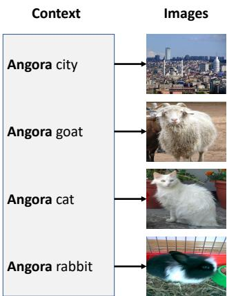
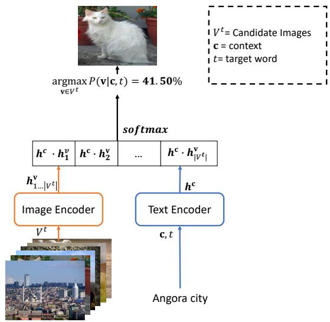
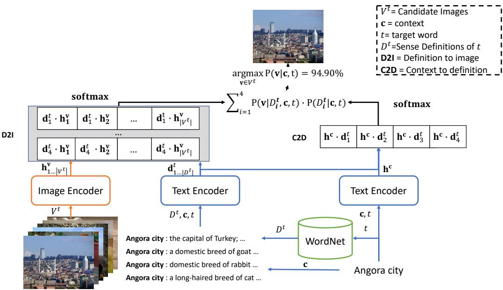
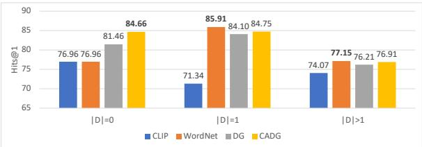
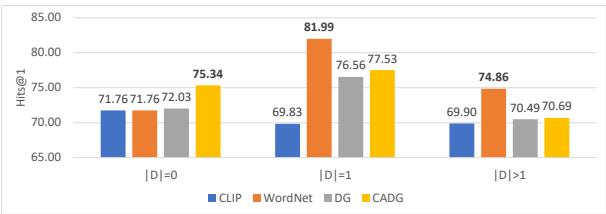
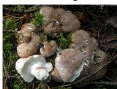

# Vision Meets Definitions: Unsupervised Visual Word Sense Disambiguation Incorporating Gloss Information

Sunjae Kwon1, Rishabh Garodia1, Minhwa Lee1, Zhichao Yang1, Hong Yu1,2,3,4 1UMass Amherst, 2UMass Lowell, 3UMass Chan Medical School, 4 VA Bedford Health Care sunjaekwon@umass.edu, rgarodia@umass.edu, minhwalee@umass.edu zhichaoyang@umass.edu, hong\_yu@uml.edu

## Abstract

Visual Word Sense Disambiguation (VWSD) is a task to find the image that most accurately depicts the correct sense of the target word for the given context. Previously, image-text matching models often suffered from recognizing polysemous words. This paper introduces an unsupervised VWSD approach that uses gloss information of an external lexical knowledge-base, especially the sense definitions. Specifically, we suggest employing Bayesian inference to incorporate the sense definitions when sense information of the answer is not provided. In addition, to ameliorate the out-of-vocabulary (OOV) issue, we propose a context-aware definition generation with GPT-3. Experimental results show that VWSD performance increased significantly with our Bayesian inference-based approach. In addition, our context-aware definition generation achieved prominent performance improvement in OOV examples exhibiting better performance than the existing definition generation method.

## 1 Introduction

With the development of deep learning technology, research on multimodality such as Visio-Linguistic Models (VLMs) has been actively conducted (Schneider and Biemann, 2022). In particular, state-of-the-art VLMs, such as image-text matching (ITM) models (Radford et al., 2021; Singh et al., 2022) and text-to-image generation models (Rombach et al., 2022; Seneviratne et al., 2022), are employed in many industrial projects, including image retrieval systems (Yuan and Lam, 2021; Yuan et al., 2021) and AI-assisted image generators (Das and Varshney, 2022; Seneviratne et al., 2022).

Visual Word Sense Disambiguation (VWSD) is a multimodal task of natural language processing (NLP) and computer vision that selects the image which corresponds to the intended meaning of the target word among a set of candidate images (Raganato et al., 2023). Figure 1 is an example of VWSD. For the ambiguous target word 1 ‘Angora’, we can notice that the answer image should be conditionally changed regarding the context. VWSD can play an important role in several downstream tasks including image retrieval (Chen et al., 2015), action recognition (Gella et al., 2017) and visual question answering (Whitehead et al., 2020).

  
Figure 1: An example of VWSD from SemEval-2023 task 1 dataset (Raganato et al., 2023). We can see that even if the target word (‘Angora’) is the same, different images should be selected according to the context.

Unsupervised VWSD can be formulated in the same way as the ITM task (Cao et al., 2022), that is, finding the images that best match the given context. However, VWSD often requires more complex reasoning on both text and images than conventional ITM models. The example in Figure 2 demonstrates that CLIP (Radford et al., 2021), a state-of-the-art (SOTA) ITM model, fails to recognize the answer image for the given context 2. This limitation of VLMs, where they fail to handle ambiguous words, was also reported in another study on an image generation model (Rassin et al., 2022).

To ameliorate this problem, we propose to disambiguate visual words with the assistance of a glossary of lexical knowledge-bases (LKBs) without the use of any further training or dataset. Specifically, we utilize the sense definitions of an ambiguous word that have been widely exploited in previous lexical semantic tasks (Raganato et al., 2017; Gella et al., 2017; Pilehvar and Camacho-Collados, 2019). Herein, since the answer sense of the target word is not provided in the VWSD setting, we propose an approach derived from Bayesian inference, using pretained ITM models. Moreover, in order to deal with out-of-vocabulary (OOV) words that cannot find the sense definitions of the target word in LKBs, we suggest the concept of context-aware definition generation (CADG). The definitions of a target word are generated by a large language model, GPT-3 (Brown et al., 2020), as auxiliary information for VWSD.

Experiments were conducted on SemEval-2023 (SE23) Task 1-Visual-WSD (Raganato et al., 2023), a publicly available VWSD dataset. Furthermore, in the experiments, we utilized two pretained SOTA ITM models: (1) CLIP (Radford et al., 2021) and (2) FLAVA (Singh et al., 2022). Experiments showed that our proposed approach significantly improved the performance of baseline ITM models. In addition, we demonstrated that our concept of CADG not only significantly increased the performance of OOV cases but is also more advantageous than the previous definition generation approach. We implement experimental codes in https://github.com/soon91jae/UVWSD.

The contributions of this paper can be summarized as follows:

• This paper introduces a new glossincorporated VWSD approach inspired by Bayesian inference.

• Experimental results show that our Bayesian inference-based approach boosted the unsupervised VWSD performance significantly without any additional training.

• Furthermore, we suggest the CADG method to challenge the OOV issue.

## 2 Related Work

## 2.1 Word and Visual Sense Disambiguation

VWSD task is closely relevant to a line of sense disambiguation studies. One of them is Word Sense

  
Figure 2: Illustrative concepts and an example input on a CLIP model (Radford et al., 2021).

Disambiguation (WSD) which automatically identifies ambiguous words into corresponding senses (O et al., 2018). The early stage of WSD research tried to employ diverse information in LKBs with unsupervised manners such as lexical similarity (Kilgarriff and Rosenzweig, 2000), knowledge-graph connectivity (Agirre et al., 2014; Kwon et al., 2021), and topic modeling (Chaplot and Salakhutdinov, 2018). After the emergence of pretrained language models (LMs) such as BERT (Devlin et al., 2019), LM-based transfer learning approaches have been actively studied (Huang et al., 2019; Barba et al., 2021b). In particular, gloss-enhanced WSD models that use sense definition and context together using a cross-encoder (Huang et al., 2019; Barba et al., 2021a) or bi-encoder (Blevins and Zettlemoyer, 2020) structures are not only overwhelm existing approaches but also robust against few-shot examples. Wahle et al. (2021) suggest incorporating WordNet knowledge into LMs while pre-training them. Specifically, the authors utilize a multi-task learning method that trains LMs with both mask language modeling loss and WSD task loss.

Visual Verb Sense Disambiguation (VVSD) is another task relevant to VWSD. VVSD is a multimodal sense disambiguation task that selects the correct sense of a pair of a given ambiguous verb word and image (Gella et al., 2017). Gella et al. (2017) suggest an unsupervised VVSD approach that takes advantage of various Visio-linguistic features (image representation, object label, image caption features) together and calculates the matching score between an image and a sense definition with a variant of Lesk algorithm. Vascon et al. (2021) propose a semi-supervised VVSD method based on game theoretic transduction for inference. Meanwhile, Gella et al. (2019) demonstrate that a VVSD model trained on multi-lingual VVSD dataset not only benefit the performance on verb sense disambiguation but also boost the performance of a downstream task, the multi-modal machine translation task.

  
Figure 3: Illustrative concepts and an example input on our gloss-enhanced framework on a CLIP model. Note that, even though the image encoder and the text encoder are the exactly same as those in Figure 2, our approach can correctly predict the answer image different from the original CLIP model’s prediction.

Our work is related to gloss-enhanced WSD models in that we are using both sense definition and context together. However, our study differs from previous WSD studies in that it tackles a multi-modal task. It is also relevant to VVSD in terms of multi-modal sense disambiguation. However, VVSD systems (Gella et al., 2016) are usually designed to analyze a small number of verb words, while the VWSD task contains a lot of nouns and adjectives. Finally, our work tackles a new VWSD task and we introduce a method of implementing sense definitions with SOTA ITM models based on Bayesian inference where sense definitions as a latent variable.

## 2.2 Definition Generation

Our CADG is related to the definition generation task introduced by Noraset et al. (2017). The purpose of the task is to generate a definition for a given word. Noraset et al. (2017) suggest utilizing recurrent neural network-based LMs (RNNLMs)

with the definitions collected from WordNet and GNU Collaborative International Dictionary of English (GCIDE). Gadetsky et al. (2018) propose definition generation models to handle polysemous words with context and the soft-attention mechanism. Li et al. (2020) propose to perform semantic decomposition of the meanings of words and then use discrete latent variables to model them to generate definitions. Malkin et al. (2021) show that a large language model (GPT-3) could generate definitions of neologisms without additional fine-tuning. Herein, the authors suggest generating neologisms with long short-term memory (LSTM) (Yu et al., 2019) and definitions of neologisms with a large pretrained LM, GPT-3 (Brown et al., 2020). CADG is similar to the one used by Malkin et al. (2021), which involves generating definitions using GPT-3. However, CADG differs in that it takes context into account when generating prompts. Additionally, this study differs from previous work in that it takes context into account when generating prompts and demonstrates that the definitions produced by CADG can be effectively used in downstream tasks, rather than focusing solely on the definition generation task itself.

## 3 Task Definition on Unsupervised VWSD

We formulate unsupervised VWSD as a multiclass classification task (Aly, 2005) as shown in Eq. 1. Unlike the image retrieval task (Jing et al., 2005)

that ranks the most relevant images for the given text or keyword, VWSD is designed to choose a specific target t in the given context c. Specifically, we define the task to find the image vˆ with the highest posterior probability from a set of images $V ^ { t }$ that consists of one answer image and other distractors on the target word.

$$
\hat { \mathbf { v } } = \underset { \mathbf { v } \in V ^ { t } } { \mathrm { a r g m a x } } P ( \mathbf { v } | \mathbf { c } , t )\tag{1}
$$

Any pretrained ITM models (e.g., CLIP) can calculate the posterior. In Figure 2, a set of candidate images $V ^ { t }$ is entered into the image encoder for the target word t. At the same time, the context c that includes t as a part is entered into the text encoder. Then, the inner product of the output hidden representations on images $\mathbf { h } _ { 1 \ldots | V ^ { t } | } ^ { v }$ and the context $\mathbf { h } ^ { c }$ are input to softmax function, which then computes a probability distribution over the images. Finally, the image that produces the highest probability will be selected as the prediction of the model for the target t, provided the context c.

## 4 Unsupervised VWSD Incorporating Gloss Information

Usually, zero-shot ITM models are pretrained without much consideration of polysemous words. For example, Figure 2 demonstrates that CLIP fails to predict the correct answer for the target word $\mathbf { \nabla } ^ { 6 } \mathbf { A } \mathbf { n } \mathbf { \cdot }$ gora’, although it is provided with a clear hint of ‘city’ in the given context. Therefore, the zero-shot performance of pretrained ITM models may be limited in the VWSD task. One solution is to use gloss information of a lexical knowledge-base (LKB), particularly exploiting sense definitions. This is because the definitions in LKBs elaborate on each sense for readers who do not know the meaning. Thus, we assume that the sense definitions in LKBs can boost ITM models to conduct VWSD, by injecting the meaning of the correct sense on the input of these models. However, since there is no correct sense information for the target word, it is difficult to apply it directly. For this reason, we suggest a novel gloss-incorporated VWSD approach inspired by Bayesian inference, as presented in Eq. 2.

Suppose $D ^ { t }$ is a set of definitions for the target word t extracted from an LKB. Herein, by using the chain rule, the posterior can be divided into two conditional probabilities associated with a latent

variable $D ^ { t }$

$$
P ( { \bf v } | { \bf c } , t ) = \sum _ { i = 1 } ^ { | D ^ { t } | } P ( { \bf v } | D _ { i } ^ { t } , { \bf c } , t ) P ( D _ { i } ^ { t } | { \bf c } , t )\tag{2}
$$

In this case, the right term $P ( D _ { i } ^ { t } | \mathbf { c } , t )$ (Context to Definition; C2D) is predicting the conditional probability over the given ith sense definition $D _ { i } ^ { t }$ for the given target word t and context c which is similar to the gloss-enhanced WSD models (Huang et al., 2019; Blevins and Zettlemoyer, 2020). Meanwhile, the left term $P ( \mathbf { v } | D _ { i } ^ { t } , \mathbf { c } , t )$ (Definition to Image; D2I) is the conditional probability of v for a given the ith sense definition, the context and the target word. In doing so, it allows for the development of sophisticated ITMs by enriching the context with its relevant sense definition. Finally, we can calculate $P ( \mathbf { v } | \mathbf { c } , t )$ by marginalizing over all available sense definitions $D _ { 1 . . . | D ^ { t } | } ^ { t }$

Figure 3 demonstrates an illustrative concept of our gloss-incorporated VWSD approach with a pretrained CLIP. First, similar to the original CLIP, a set of candidate images $V ^ { t }$ and a context c are input to the image encoder and the text encoder, respectively. Meanwhile, a set of definitions of the target word $D ^ { t }$ is extracted from an LKB. In our work, we utilize WordNet (Miller, 1995) which has been widely used in previous semantic analysis tasks (Pilehvar and Camacho-Collados, 2019; Bevilacqua et al., 2021) as our source of LKB. Then $D ^ { t } , \mathbf { c } ,$ and t are jointly inputted to the text encoder with the following template.

$$
\{ c o n t e x t \} : \{ i t h s e n s e ^ { \prime } s d e f i n i t i o n \}
$$

C2D is computed by the inner product of the hidden representations on the definitions $\bf d _ { 1 . . . | D ^ { t } | } ^ { t }$ and the context $\mathbf { h } ^ { c \top }$ . D2I is then calculated by the inner product of the hidden representations of the input images $\mathbf { h } _ { 1 \ldots | V ^ { t } | } ^ { v }$ and $\mathbf { d } _ { 1 \dots \mid D ^ { t } \mid } ^ { t } \bar { \mathbf { \Lambda } } _ $ . Both C2D and D2I input to the softmax function transformed into probability distributions. Then, we choose the image with the highest probability as the prediction. As a result, for the example in Figure 3, our model can predict the correct answer of the given context ‘Angora city’, whereas the original CLIP wrongly selects an image of ‘Angora cat’ that produced the highest probability (as shown in Figure 2), even though the network topology and the pretrained parameters in our model are the same as the original CLIP model.

<table><tr><td>Template:</td><td>{target wod} ({POS}):</td></tr><tr><td>Prompt:</td><td>angora (n):</td></tr><tr><td>Definition:</td><td>A Angora is a variety of long-haired domestic cat that originated in Turkey. ...</td></tr><tr><td colspan="2">(a) Malkin et al. (2021)&#x27;s definition generation.</td></tr><tr><td>Template:</td><td>Define “{target word}&quot; in {context}. {target wod} ({POS}):</td></tr><tr><td>Prompt:</td><td>Define “angora&quot; in angora city. angora (n):</td></tr><tr><td>Definition:</td><td>A city in Turkey that stands on the banks of the Angora River, near ..</td></tr></table>

(b) Our context-aware definition generation.  
Figure 4: Examples of GPT-3 generated definitions when context, target word, and part-of-speech are ‘angora city’, ‘angora’ and ‘noun’ (n) respectively.

## 5 Handling OOV with the Context-Aware Definition Generation

Not all words have their definitions available in a lexical knowledge-base. In particular, proper nouns, compound words, and foreign words frequently induce OOV issues. For example, in the SE23 dataset, about 14.33% of target words’ definitions are not found in the English WordNet. Therefore, we propose a solution to tackle the OOV issue with the definition generation approach. A previous study showed that GPT-3 can generate the definition of a novel word (Malkin et al., 2021). However, since this study does not consider the context of the word, it may not generate the definition in the correct sense. Thus, we suggest generating a definition with the prompt that considers both the context and the target word together.

Figure 4 presents the generated definitions by the approach of Malkin et al. (2021) (Figure 4a) and ours (Figure 4b). Here, we add a conditional sentence that inputs the context of a target word. For example, when the target word is ‘angora’ and the context is ‘angora city’, we use a conditional sentence, “Define “angora” in angora city.”, in front of the previous input “angora (n)”. Indeed, in the example, the definition generated with our method shows a better description compared to the previous method.

## 6 Experiments

## 6.1 Experimental Dataset

SE23 We used the dataset in the SemEval-2023 Task 1 VWSD challenge 34. It consists of 12,896 examples and 13,000 candidate images. Each example has 10 candidates that include 1 answer image and 9 distractors. Each context averagely contains 2.5 words. The dataset contains 14.33% OOV words (1,845 out of 12,869).

## 6.2 Experimental Setting

VWSD For the experiments, we adopted two SOTA zero-shot ITM models, CLIP 5 and FLAVA 6, as pretrained parameters are publicly available for both of them. Note that CLIP uses the text encoder and the image encoder at the same time while FLAVA contains the text encoder, the image encoder, and the multi-modal encoder. Herein, to calculate an image-text matching score, FLAVA uses the multi-modal encoder that cross-encodes image and text features simultaneously. In the case of calculating C2D, we exploit FLAVA’s text encoder as the same as Figure 3.

We used WordNet 3.0 7 as the main LKB. We also compare two GPT-3 generated definitions. The first one is Malkin et al. (2021)’s definition generation (DG). The other one is CADG (as described in Section 5). WN+CADG applies CADG’s definitions in the case of OOV and uses WordNet definitions otherwise.

Definition Generation We re-implemented Malkin et al. (2021)’s definition generation experimental setting. Specifically, we sampled a definition for each example by utilizing GPT-3’s Davinci variant which is known as the largest model and we generated samples with a temperature of 1.0.

Evaluation Criteria Following Raganato et al. (2023)’s setting, we evaluated VWSD models’ performance with the hits at 1 (Hits@1) and the mean reciprocal rank (MRR). Moreover, we used Student’s t-test (Student, 1908), to verify the significance of differences in performance between models.

<table><tr><td rowspan=2 colspan=1>Model</td><td rowspan=2 colspan=1>Source ofDefinitions</td><td rowspan=1 colspan=1>SE23</td></tr><tr><td rowspan=1 colspan=1>Hits@1  MRR</td></tr><tr><td rowspan=2 colspan=1>CLIP</td><td rowspan=2 colspan=1>一WNDGCADGWN+CADG</td><td rowspan=1 colspan=1>73.00   82.72</td></tr><tr><td rowspan=1 colspan=1>81.98   88.8381.64   88.3382.65   89.2883.08   89.60</td></tr><tr><td rowspan=1 colspan=1>FLAVA</td><td rowspan=1 colspan=1>一WNDGCADGWN+CADG</td><td rowspan=1 colspan=1>70.13   80.6778.34   86.6074.05   84.4975.13   84.5378.85   87.02</td></tr></table>

Table 1: Experimental comparison on the ITM models with and without the gloss integration. There are three types of the source of definitions: 1) WordNet (WN) 2) Malkin et al. (2021)’s definition generation (DG) approach and 3) our context-aware definition generation (CADG).

Others We prepared a pretrained WSD, $\mathrm { T } 5 _ { S e m C o r }$ (Wahle et al., 2021). This model is a generative WSD model that a T5-large model (Raffel et al., 2020) fine-tuned with SemCor (Raganato et al., 2017). Note that, SemCor is a large size word sense dataset annotated with the WordNet sense repository. Herein, we utilized the official checkpoint 8. In addition, we employed NLTK (Bird et al., 2009) to conduct word tokenization and part-of-speech tagging. All experiments were conducted on an NVIDIA A100 GPU with Ubuntu 22.04 version.

## 6.3 Experimental Results

The experimental results in Table 1 show that the performances of CLIP and FLAVA are 73.00 and 70.13 on Hits@1, respectively. Incorporating definition descriptions of external LKB (WN) or generated (DG and CADG) significantly enhanced the performance in every experimental model. First, incorporating WordNet with our Bayesian style inference (WN) outperformed both of ITM models, 8.98%p in CLIP $( p < 1 e - 1 0 )$ and 8.72%p $( p < 1 e - 1 0 )$ . DG and CADG also significantly improved performance in all cases $( p < 1 e - 7 )$ but the increment in FLAVA was relatively lower than that of the CLIP. WN+CADG achieved the highest performance in both of CLIP and FLAVA.

On the other hand, to scrutinize the reasons for the performance improvements in more detail, we categorized examples into three categories according to the number of WordNet senses $( | D | )$ of the target word. $| D | = 0$ examples are target words with no entry in WordNet (OOV). $| D | = 1$ examples are target words with only one sense in the WordNet (trivial). $| D | > 1$ examples are target words with more than one sense in the WordNet (ambiguous).

(a) CLIP  
  
(b) FLAVA  
Figure 5: Hits@1 score for the different number of definitions $( | D | )$ of a target word in WordNet.

Figure 5 presents that incorporating WordNet definition enhanced the performance on ambiguous and trivial words in both of CLIP and FLAVA. In particular, the performance gain was remarkable in trivial words (from 71.34 to 85.91 and from 69.83 to 81.99 for CLIP and FLAVA, respectively). Moreover, even for ambiguous words, the performance is significantly improved $( p < 1 e - 3 )$ without any additional training or the assistance of external systems such as WSD models. CADG substantially increased performance in both of OOV and trival words. Especially, when compared to DG, the performance differences are remarkable in OOV.

Meanwhile, while FLAVA shows prominent improvement via WordNet integration, the impact of generated definitions tends to be low compared to CLIP. Considering that WordNet definitions were manually constructed by experts, we speculate that this is because the model is sensitive to the quality of the input definitions.

## 7 Discussion

## 7.1 Analysis on Ambiguous Target Words

We analyzed the performance change according to the ambiguity level of the ambiguous target word.

<table><tr><td rowspan=1 colspan=1>D|</td><td rowspan=1 colspan=1># of Corrected</td><td rowspan=1 colspan=1># of Incorrected</td><td rowspan=1 colspan=1>Corrected Ratio</td></tr><tr><td rowspan=3 colspan=1>234</td><td rowspan=1 colspan=1>199</td><td rowspan=1 colspan=1>66</td><td rowspan=1 colspan=1>3.02</td></tr><tr><td rowspan=1 colspan=1>99</td><td rowspan=1 colspan=1>40</td><td rowspan=1 colspan=1>2.48</td></tr><tr><td rowspan=1 colspan=1>48</td><td rowspan=1 colspan=1>19</td><td rowspan=1 colspan=1>2.53</td></tr><tr><td rowspan=1 colspan=1>5</td><td rowspan=1 colspan=1>42</td><td rowspan=1 colspan=1>13</td><td rowspan=1 colspan=1>3.23</td></tr><tr><td rowspan=2 colspan=1>67</td><td rowspan=1 colspan=1>28</td><td rowspan=1 colspan=1>9</td><td rowspan=1 colspan=1>3.11</td></tr><tr><td rowspan=1 colspan=1>25</td><td rowspan=1 colspan=1>5</td><td rowspan=1 colspan=1>5.00</td></tr><tr><td rowspan=1 colspan=1>8</td><td rowspan=1 colspan=1>13</td><td rowspan=1 colspan=1>5</td><td rowspan=1 colspan=1>2.60</td></tr><tr><td rowspan=1 colspan=1>9</td><td rowspan=1 colspan=1>10</td><td rowspan=1 colspan=1>4</td><td rowspan=1 colspan=1>2.50</td></tr><tr><td rowspan=1 colspan=1>10</td><td rowspan=1 colspan=1>7</td><td rowspan=1 colspan=1>2</td><td rowspan=1 colspan=1>3.50</td></tr><tr><td rowspan=1 colspan=1> $1 0 < | D |$ </td><td rowspan=1 colspan=1>52</td><td rowspan=1 colspan=1>27</td><td rowspan=1 colspan=1>1.93</td></tr><tr><td rowspan=1 colspan=1>total</td><td rowspan=1 colspan=1>523</td><td rowspan=1 colspan=1>190</td><td rowspan=1 colspan=1>2.75</td></tr></table>

Table 2: Improvement rate on the ambiguous target words. D is the ambiguity level of target words. ‘# of Corrected’ indicates the number of examples incorrect in CLIP but become correct in CLIP+WN. On the other hand, ‘# of Incorrected’ means the number of examples correct in CLIP but become incorrect in CLIP+WN. The corrected ratio is # of Corrected # of Incorrected
<table><tr><td></td><td>Hits@1</td><td>MRR</td></tr><tr><td></td><td>74.07</td><td>82.72</td></tr><tr><td>CLIP+WN</td><td>77.15</td><td>88.83</td></tr><tr><td> $\overline { { \mathrm { T } 5 _ { S e m C o r } } }$ </td><td>77.12</td><td>85.21</td></tr></table>

Table 3: Experimental comparison of VWSD for the ambiguous target.

Table 2 presents the predictive change of the CLIP after incorporating WordNet. Herein, 523 examples go correct while 190 examples go incorrect. In particular, even in the case of highly ambiguous examples with D greater than 10, the improvement rate is 1.93, and incorporating WordNet positively affects the performance improvement. These results are in line with previous research findings that ambiguous words can be recognized pre-trained LMs according to the given context (Garí Soler and Apidianaki, 2021; Kwon et al., 2022). However, compared to the lower ambiguous cases, the performance improvement rate is lower. These results implies that enhancement for the highly ambiguous words are required.

Although WordNet integration improves performance for ambiguous target words, we still want to find out how competitive the performance improvement is. For this reason, we compared the performance of our WordNet-incorporated model with that of the pipeline system using the WSD model. To be specific, $\mathrm { T } 5 _ { S e m C o r } .$ , a finetuned WSD model, predicts WordNet sense in a given target word and context. The probability distribution for the candidate images was calculated based on the predicted sense.

Table 3 is the prediction result for ambiguous target words. Our model showed comparable results in the pipeline system and Hits@1 and achieved higher performance in MRR. This is due to the error cascading issue of pipeline systems (Finkel et al., 2006; Kwon et al., 2019). That is, in the pipeline system, errors in the WSD model directly lead to performance decrement. Otherwise, our approach is rather free from error cascading, since the C2D probability and the D2I probability work complementary to each other.

<table><tr><td>Generation Method</td><td>Agreement</td><td># Examples</td></tr><tr><td>DG</td><td>81.76</td><td>159</td></tr><tr><td>CADG</td><td>89.16</td><td>166</td></tr></table>

Table 4: Results of the human analysis on generated definitions.

## 7.2 Analysis on the Generated Definitions

## 7.2.1 Evaluation on the Generated Definitions

In order to evaluate the quality of the generated definitions, we randomly sampled 200 examples from SE23 dataset. For each example, two annotators evaluated the (binary) agreement on the generated definitions with Malkin et al. (2021)’s approach (DG) and our approach (CADG). Inter-annotator agreement (Kvålseth, 1989) was $\kappa = 0 . 6 2 5$ . Finally, we only accept 159 examples of DG and 166 examples of CADG unanimously agreed by the annotators.

Table 4 represents the average human agreement scores on DG and CADG. The results show that our CADG achieved a higher performance compared to DG. Especially, in Figure 4 and Table 5, we can find that the definitions of ambiguous words generated with CADG are semantically similar to that of the WordNet answer sense compared to DG, in line with the purpose for which it was designed.

## 7.2.2 Impact of the Generated Definitions’ Quality

We also verified whether the quality of the generated definitions would affect the VWSD performance. Table 6 presents the experimental results on VWSD examples when we utilize the generated definitions that agreed (Correct) and disagreed (Incorrect) by the both annotators. Table 6 demonstrates that the quality of the generated definitions affects the performance of the downstream VWSD task indeed.

<table><tr><td rowspan=1 colspan=1></td><td rowspan=1 colspan=1>Target Word</td><td rowspan=1 colspan=1>Context</td><td rowspan=1 colspan=1>WordNet Answer Definition</td><td rowspan=1 colspan=1>Generated Definition</td></tr><tr><td rowspan=3 colspan=1>DG</td><td rowspan=1 colspan=1>give</td><td rowspan=1 colspan=1>give communicate</td><td rowspan=1 colspan=1>convey or reveal information</td><td rowspan=1 colspan=1>to present something as a gift; to make a giftof something</td></tr><tr><td rowspan=1 colspan=1>landscape</td><td rowspan=1 colspan=1>landscape genre</td><td rowspan=1 colspan=1>painting depicting an expanse ofnatural scenery</td><td rowspan=1 colspan=1>A large area of land that can be seen fromone place</td></tr><tr><td rowspan=1 colspan=1>fauve</td><td rowspan=1 colspan=1>fauve painter</td><td rowspan=1 colspan=1>a member of a group of Frenchpainters who followed fauvism</td><td rowspan=1 colspan=1>A fauve is a wild or undomesticated animal.</td></tr><tr><td rowspan=4 colspan=1>CADG</td><td rowspan=1 colspan=1>give</td><td rowspan=1 colspan=1>give communicate</td><td rowspan=1 colspan=1>convey or reveal information</td><td rowspan=1 colspan=1>to convey (information, etc.)</td></tr><tr><td rowspan=2 colspan=1>landscape</td><td rowspan=2 colspan=1>landscape genre</td><td rowspan=2 colspan=1>painting depicting an expanse ofnatural scenery</td><td rowspan=2 colspan=1>a genre of art that depicts natural scenerysuch as mountains, forests, rivers, and so on</td></tr><tr><td rowspan=1 colspan=1>ivers, and so on</td></tr><tr><td rowspan=1 colspan=1>fauve</td><td rowspan=1 colspan=1>fauve painter</td><td rowspan=1 colspan=1>a member of a group of Frenchpainters who followed fauvism</td><td rowspan=1 colspan=1>vild be</td></tr></table>

Table 5: Examples of generated definitions with DG and CADG.

<table><tr><td>Model</td><td>Agreement</td><td>n</td><td>Hits@1</td><td>MRR</td></tr><tr><td>CLIP CLIP+DG</td><td>- Correct</td><td>159 130</td><td>71.70 83.85</td><td>82.29 89.76</td></tr><tr><td>CLIP+DG CLIP</td><td>Incorrect 一</td><td>29 166</td><td>68.97 68.67</td><td>78.83 79.78</td></tr><tr><td>CLIP+CADG</td><td>Correct</td><td>148</td><td>82.43</td><td>89.25</td></tr><tr><td>CLIP+CADG</td><td></td><td>18</td><td></td><td></td></tr><tr><td></td><td>Incorrect</td><td></td><td>66.67</td><td>77.45</td></tr></table>

Table 6: VWSD performance according to the quality of generated definitions.

<table><tr><td rowspan="2"></td><td colspan="3">n</td></tr><tr><td>1</td><td>2</td><td>3</td></tr><tr><td>DG</td><td>81.64</td><td>81.75</td><td>80.19</td></tr><tr><td>CADG</td><td>82.65</td><td>82.68</td><td>82.29</td></tr></table>

Table 7: The performance (Hits@1) according to the different number of sampled definitions (n).

## 7.2.3 Experiments on Multiple Generated Definitions

Since we sampled a definition for each input example in main experiments, it is still questionable whether the number of sampled definitions affects the performance of the model. Table 7 indicates the performance of DG and CADG according to the number of generated definitions (n) for each input. The results show that the number of sampled definitions is not significantly affecting the model’s performance. To be specific, when the number of generated definitions is 2 for each input, the performance of DG and CADG increased by 0.09%p and 0.03%p respectively. Furthermore, when the number of generated definitions is 3, we can see that the performance even slightly decreases both DG and CADG. As a result, sampling multiple definitions for each input does not significantly affect performance or rather decreases performance.

<table><tr><td rowspan=1 colspan=1>Target Word</td><td rowspan=1 colspan=1>Context</td><td rowspan=1 colspan=1>WordNet Definitions</td><td rowspan=1 colspan=1>Probs.</td></tr><tr><td rowspan=2 colspan=1>paddle</td><td rowspan=2 colspan=1>paddle beat</td><td rowspan=1 colspan=1>walk unsteadily</td><td rowspan=1 colspan=1>99.95%</td></tr><tr><td rowspan=1 colspan=1>give a spanking to</td><td rowspan=1 colspan=1>0.00%</td></tr><tr><td rowspan=2 colspan=1>Thompson</td><td rowspan=2 colspan=1>Thompsonsubmachine</td><td rowspan=1 colspan=1>United States classicalarchaeologist...</td><td rowspan=1 colspan=1>0.00%</td></tr><tr><td rowspan=1 colspan=1>English physicist(born in America) . . .</td><td rowspan=1 colspan=1>100.00%</td></tr></table>

Table 8: Examples of VWSD error cases. Probs. stands for $P ( D _ { i } ^ { t } | \mathbf { c } , t )$

## 7.3 Error Analysis

## 7.3.1 VWSD

Our model still suffers from error cascading from C2D probability though it is mitigated by the Bayesian style inference. The most typical error case is due to the error cascading in C2D probability calculation. Especially, due to the nature of neural networks (Guo et al., 2017), the overconfidence in the error classes frequently causes errors. For example, in Table 8, we found that among the 10 senses of the target word ‘paddle’ extracted from WordNet, the conditional probability for the correct sense was calculated as 0.00%, resulting in an error in the final posterior calculation. Another error case is when there is no correct sense in WordNet. In the example, the target word ‘Thompson’ indicates a firearm, but WordNet contains only personal information. This is a separate issue from OOV with no entry for the target word, and we observed that it mainly occurs in proper nouns.

## 7.3.2 Definition Generation

We found two representative error cases in the results of the definition generations: 1) misdisambiguation and 2) hallucination. The misdisambiguation is when the GPT3 generates the polysemy’s definition. In Figure 6a, considering the context of “lime oxide”, we would expect a definition of lime stone to be generated. However, we can notice that both approaches generate a definition for lime fruit. On the other hand, as pointed out in previous research (Ishii et al., 2022), we also observed that GPT3 generates hallucinations. Figure 6b is an example of the hallucination issue. albatrellus which is a type of a fungi in the context of “albatrellus genus,” nevertheless the definitions generated by both approaches are pertaining to the albatross, a species of bird. Detailed examples of error cases can be found in Appendix A.

## 8 Conclusion and Future Work

This paper introduces a novel VWSD methodology to effectively incorporate gloss information from an external resource. Our work mainly has two innovations: 1) Bayesian style inference for SOTA ITMs, and 2) Context-aware definition generation with GPT-3 to overcome the OOV issue. Experimental results show that our proposed Bayesian style inference-based WordNet integration significantly improves VWSD performance without additional training. For the ambiguous target words, the performance of our approach is comparable to pipeline systems using finetuned WSD models. Moreover, context-aware definition generation helps mitigate OOV issues in the downstream VWSD tasks and shows higher performance compared to the previous definition generation approach.

In the future, we plan to tackle the error cascading caused by over-confidence in C2D probability. For this, we may explore a prompting that is known to have good performance in zero-shot prediction (Liu et al., 2023). In addition, to deal with the hallucination and misdisambiguation problems of GPT-3 generated definitions, we may employ controllable generation by resampling (Ji et al., 2022).

## Limitations

Our work has the following limitations. First, we only used one evaluation data, namely SE23, because it is the only data suitable for the VWSD setting, especially for the OOV examples. In addition, our methodology relies entirely on WordNet. Therefore, this may be limited the model’s ability when the target word is a proper noun such as a named entity. Finally, we depend on the results of GPT-3 definition generation to handle OOV words. Since the generated definitions may contain errors, as revealed in the qualitative analyses, the errors led to incorrect predictions.

CADG’s Definitions Lime refers to both a fruit and a color. As a fruit, lime is a citrus fruit that …

DG’s Definitions A green citrus fruit that …

(a) An example of the misdisambiguation  
  
(b) An example of the hallucination  
Figure 6: Examples of incorrectly generated definitions.

CADG’s Definitions Resembling an albatross.

DG’s Definitions resembling an albatross; having long, narrow wings; sluggish in flight

## Ethical Consideration

The generated definitions were annotated by two annotators. Both annotators were fully paid by complying with local minimum wage regulation. In addition, in the sampled definition generations, the authors could not find any statements violating the ACL anti-harassment policy. However, generated definitions that authors have not vetted are still at risk of containing toxic or hates contents (e.g. racism, insulting or xenophobic).

## Acknowledgement

Research reported in this study was in part supported by the Center of Biomedical and Health Research in Data Sciences (CHORDS) in UMass Lowell.

## References

Eneko Agirre, Oier López de Lacalle, and Aitor Soroa. 2014. Random walks for knowledge-based word sense disambiguation. Computational Linguistics, 40(1):57–84.

Mohamed Aly. 2005. Survey on multiclass classification methods. Neural Netw, 19(1):9.

Edoardo Barba, Tommaso Pasini, and Roberto Navigli. 2021a. Esc: Redesigning wsd with extractive sense comprehension. In Proceedings of the 2021 Conference of the North American Chapter of the Associationfor Computational Linguistics: Human Language Technologies, pages 4661–4672.

Edoardo Barba, Luigi Procopio, and Roberto Navigli. 2021b. Consec: Word sense disambiguation as continuous sense comprehension. In Proceedings of the

2021 Conference on Empirical Methods in Natural Language Processing, pages 1492–1503.

Michele Bevilacqua, Tommaso Pasini, Alessandro Raganato, Roberto Navigli, et al. 2021. Recent trends in word sense disambiguation: A survey. In Proceedings of the Thirtieth International Joint Conference on Artificial Intelligence, IJCAI-21. International Joint Conference on Artificial Intelligence, Inc.

Steven Bird, Ewan Klein, and Edward Loper. 2009. Natural language processing with Python: analyzing text with the natural language toolkit. " O’Reilly Media, Inc.".

Terra Blevins and Luke Zettlemoyer. 2020. Moving down the long tail of word sense disambiguation with gloss informed bi-encoders. In Proceedings of the 58th Annual Meeting of the Association for Computational Linguistics, pages 1006–1017.

Tom Brown, Benjamin Mann, Nick Ryder, Melanie Subbiah, Jared D Kaplan, Prafulla Dhariwal, Arvind Neelakantan, Pranav Shyam, Girish Sastry, Amanda Askell, et al. 2020. Language models are few-shot learners. Advances in neural information processing systems, 33:1877–1901.

Min Cao, Shiping Li, Juntao Li, Liqiang Nie, and Min Zhang. 2022. Image-text retrieval: A survey on recent research and development. arXiv preprint arXiv:2203.14713.

Devendra Singh Chaplot and Ruslan Salakhutdinov. 2018. Knowledge-based word sense disambiguation using topic models. In Proceedings ofthe AAAI conference on artificial intelligence, volume 32.

Xinlei Chen, Alan Ritter, Abhinav Gupta, and Tom Mitchell. 2015. Sense discovery via co-clustering on images and text. In Proceedings of the IEEE Conference on Computer Vision and Pattern Recognition, pages 5298–5306.

Payel Das and Lav R Varshney. 2022. Explaining artificial intelligence generation and creativity. IEEE Signal Processing Magazine, 1053(5888/22).

Jacob Devlin, Ming-Wei Chang, Kenton Lee, and Kristina Toutanova. 2019. BERT: Pre-training of deep bidirectional transformers for language understanding. In Proceedings ofthe 2019 Conference of the North American Chapter ofthe Associationfor Computational Linguistics: Human Language Technologies, Volume 1 (Long and Short Papers), pages 4171–4186.

Jenny Rose Finkel, Christopher D Manning, and Andrew Y Ng. 2006. Solving the problem of cascading errors: Approximate bayesian inference for linguistic annotation pipelines. In Proceedings ofthe 2006 Conference on Empirical Methods in Natural Language Processing, pages 618–626.

Artyom Gadetsky, Ilya Yakubovskiy, and Dmitry Vetrov. 2018. Conditional generators of words definitions. In Proceedings of the 56th Annual Meeting of the Associationfor Computational Linguistics (Volume 2: Short Papers), pages 266–271.

Aina Garí Soler and Marianna Apidianaki. 2021. Let’s play mono-poly: Bert can reveal words’ polysemy level and partitionability into senses. Transactions of the Associationfor Computational Linguistics, 9:825– 844.

Spandana Gella, Desmond Elliott, and Frank Keller. 2019. Cross-lingual visual verb sense disambiguation. In Proceedings of the 2019 Conference of the North American Chapter ofthe Associationfor Computational Linguistics: Human Language Technologies, Volume 1 (Long and Short Papers), pages 1998– 2004.

Spandana Gella, Frank Keller, and Mirella Lapata. 2017. Disambiguating visual verbs. IEEE transactions on pattern analysis and machine intelligence, 41(2):311– 322.

Spandana Gella, Maria Lapata, and Frank Keller. 2016. Unsupervised visual sense disambiguation for verbs using multimodal embeddings. In 15th Annual Conference of the North American Chapter of the Associationfor Computational Linguistics: Human Language Technologies, pages 182–192. Association for Computational Linguistics.

Chuan Guo, Geoff Pleiss, Yu Sun, and Kilian Q Weinberger. 2017. On calibration of modern neural networks. In International conference on machine learning, pages 1321–1330. PMLR.

Luyao Huang, Chi Sun, Xipeng Qiu, and Xuan-Jing Huang. 2019. Glossbert: Bert for word sense disambiguation with gloss knowledge. In Proceedings of the 2019 Conference on Empirical Methods in Natural Language Processing and the 9th International Joint Conference on Natural Language Processing (EMNLP-IJCNLP), pages 3509–3514.

Y Ishii, ANDREA Madotto, and PASCALE Fung. 2022. Survey of hallucination in natural language generation. ACM Comput. Surv, 1(1).

Ziwei Ji, Nayeon Lee, Rita Frieske, Tiezheng Yu, Dan Su, Yan Xu, Etsuko Ishii, Yejin Bang, Andrea Madotto, and Pascale Fung. 2022. Survey of hallucination in natural language generation. ACM Computing Surveys.

Feng Jing, Mingjing Li, Hong-Jiang Zhang, and Bo Zhang. 2005. A unified framework for image retrieval using keyword and visual features. IEEE Transactions on Image Processing, 14(7):979–989.

Adam Kilgarriff and Joseph Rosenzweig. 2000. English senseval: Report and results. In LREC, volume 6, page 2.

Tarald O Kvålseth. 1989. Note on cohen’s kappa. Psychological reports, 65(1):223–226.

Sunjae Kwon, Youngjoong Ko, and Jungyun Seo. 2019. Effective vector representation for the korean namedentity recognition. Pattern Recognition Letters, 117:52–57.

Sunjae Kwon, Dongsuk Oh, and Youngjoong Ko. 2021. Word sense disambiguation based on context selection using knowledge-based word similarity. Information Processing & Management, 58(4):102551.

Sunjae Kwon, Zonghai Yao, Harmon Jordan, David Levy, Brian Corner, and Hong Yu. 2022. MedJEx: A medical jargon extraction model with Wiki’s hyperlink span and contextualized masked language model score. In Proceedings ofthe 2022 Conference on Empirical Methods in Natural Language Processing, pages 11733–11751, Abu Dhabi, United Arab Emirates. Association for Computational Linguistics.

Jiahuan Li, Yu Bao, Shujian Huang, Xinyu Dai, and Jiajun Chen. 2020. Explicit semantic decomposition for definition generation. In Proceedings ofthe 58th Annual Meeting ofthe Associationfor Computational Linguistics, pages 708–717.

Pengfei Liu, Weizhe Yuan, Jinlan Fu, Zhengbao Jiang, Hiroaki Hayashi, and Graham Neubig. 2023. Pretrain, prompt, and predict: A systematic survey of prompting methods in natural language processing. ACM Computing Surveys, 55(9):1–35.

Nikolay Malkin, Sameera Lanka, Pranav Goel, Sudha Rao, and Nebojsa Jojic. 2021. Gpt perdetry test: Generating new meanings for new words. In Proceedings ofthe 2021 Conference ofthe North American Chapter of the Association for Computational Linguistics: Human Language Technologies, pages 5542–5553.

George A Miller. 1995. Wordnet: a lexical database for english. Communications ofthe ACM, 38(11):39–41.

Thanapon Noraset, Chen Liang, Larry Birnbaum, and Doug Downey. 2017. Definition modeling: Learning to define word embeddings in natural language. In Proceedings of the AAAI Conference on Artificial Intelligence, volume 31.

Dongsuk O, Sunjae Kwon, Kyungsun Kim, and Youngjoong Ko. 2018. Word sense disambiguation based on word similarity calculation using word vector representation from a knowledge-based graph. In Proceedings ofthe 27th international conference on computational linguistics, pages 2704–2714.

Mohammad Taher Pilehvar and Jose Camacho-Collados. 2019. Wic: the word-in-context dataset for evaluating context-sensitive meaning representations. In Proceedings of the 2019 Conference of the North American Chapter of the Association for Computational Linguistics: Human Language Technologies, Volume 1 (Long and Short Papers), pages 1267–1273.

Alec Radford, Jong Wook Kim, Chris Hallacy, Aditya Ramesh, Gabriel Goh, Sandhini Agarwal, Girish Sastry, Amanda Askell, Pamela Mishkin, Jack Clark, et al. 2021. Learning transferable visual models from natural language supervision. In International Conference on Machine Learning, pages 8748–8763. PMLR.

Colin Raffel, Noam Shazeer, Adam Roberts, Katherine Lee, Sharan Narang, Michael Matena, Yanqi Zhou, Wei Li, and Peter J. Liu. 2020. Exploring the limits of transfer learning with a unified text-to-text transformer. Journal ofMachine Learning Research, 21(140):1–67.

Alessandro Raganato, Iacer Calixto, Asahi Ushio, Jose Camacho-Collados, and Mohammad Taher Pilehvar. 2023. SemEval-2023 Task 1: Visual Word Sense Disambiguation. In Proceedings of the 17th International Workshop on Semantic Evaluation (SemEval-2023).

Alessandro Raganato, Jose Camacho-Collados, and Roberto Navigli. 2017. Word sense disambiguation: A unified evaluation framework and empirical comparison. In Proceedings of the 15th Conference of the European Chapter of the Association for Computational Linguistics: Volume 1, Long Papers, pages 99–110.

Royi Rassin, Shauli Ravfogel, and Yoav Goldberg. 2022. Dalle-2 is seeing double: Flaws in wordto-concept mapping in text2image models. arXiv preprint arXiv:2210.10606.

Robin Rombach, Andreas Blattmann, Dominik Lorenz, Patrick Esser, and Björn Ommer. 2022. Highresolution image synthesis with latent diffusion models. In Proceedings of the IEEE/CVF Conference on Computer Vision and Pattern Recognition, pages 10684–10695.

Florian Schneider and Chris Biemann. 2022. Golden retriever: A real-time multi-modal text-image retrieval system with the ability to focus. In Proceedings of the 45th International ACM SIGIR Conference on Research and Development in Information Retrieval, pages 3245–3250.

Sachith Seneviratne, Damith Senanayake, Sanka Rasnayaka, Rajith Vidanaarachchi, and Jason Thompson. 2022. Dalle-urban: Capturing the urban design expertise of large text to image transformers. arXiv preprint arXiv:2208.04139.

Amanpreet Singh, Ronghang Hu, Vedanuj Goswami, Guillaume Couairon, Wojciech Galuba, Marcus Rohrbach, and Douwe Kiela. 2022. Flava: A foundational language and vision alignment model. In Proceedings of the IEEE/CVF Conference on Computer Vision and Pattern Recognition, pages 15638–15650.

Student. 1908. The probable error of a mean. Biometrika, pages 1–25.

Sebastiano Vascon, Sinem Aslan, Gianluca Bigaglia, Lorenzo Giudice, and Marcello Pelillo. 2021. Transductive visual verb sense disambiguation. In Proceedings of the IEEE/CVF Winter Conference on Applications ofComputer Vision, pages 3050–3059.

Jan Philip Wahle, Terry Ruas, Norman Meuschke, and Bela Gipp. 2021. Incorporating word sense disambiguation in neural language models. arXiv preprint arXiv:2106.07967.

Spencer Whitehead, Hui Wu, Yi Ren Fung, Heng Ji, Rogerio Feris, and Kate Saenko. 2020. Learning from lexical perturbations for consistent visual question answering. arXiv preprint arXiv:2011.13406.

Yong Yu, Xiaosheng Si, Changhua Hu, and Jianxun Zhang. 2019. A review of recurrent neural networks: Lstm cells and network architectures. Neural computation, 31(7):1235–1270.

Yifei Yuan and Wai Lam. 2021. Conversational fashion image retrieval via multiturn natural language feedback. In Proceedings ofthe 44th International ACM SIGIR Conference on Research and Development in Information Retrieval, pages 839–848.

Zhiqiang Yuan, Wenkai Zhang, Kun Fu, Xuan Li, Chubo Deng, Hongqi Wang, and Xian Sun. 2021. Exploring a fine-grained multiscale method for cross-modal remote sensing image retrieval. IEEE Transactions on Geoscience and Remote Sensing, 60:1–19.

## A Case Study on Incorrectly Generated Definitions

Table 10 and Table 9 present the all incorrectly generated definitions that described in Section 8. Herein, we found the following three error types: 1) Misdisambiguation, 2) Hallucination, and 3) Others.

First of all, the misdisambiguation cases are caused by bias in the pretraining, and we can notice that CADG has less misdisambiguation compared to DG. Especially, we can see that GPT-3 generated more than one definitions of the target words ‘conch’, ‘reaper’, and ‘ruin’ in DG, while we could not found such cases in our approach. On the other hand, hallucination cases are when the generated definitions are definitions of completely different terms with similar spellings (‘stonechat’ of CADG, ‘driftfish’ of DG), or cases in which the detailed descriptions are incorrect although they are somewhat similar (‘osteostraci of CADG, ‘nestor’ of DG). Especially, in Table 10 of ‘wulfenite’ and ‘cordierite,’ we can notice that definitions are generated with parts of each lexicon ("wulfen," and "cord"). Finally, in other cases, the generated definitions may not be in definition form (‘lynching’ of CADG, ‘areca’ of DG), or the contents of the target word is output as itself (‘wulfenite’ of CADG).

<table><tr><td>context</td><td>target word</td><td>GPT Definition</td><td>Agreement</td><td>Misdisambiguation</td><td>Hallucination</td><td>Others</td></tr><tr><td>niche condition</td><td>niche</td><td>A niche is a situation or activity that is spe- cially suited to a person's interests, abilities, or character.</td><td>FALSE</td><td>√</td><td></td><td></td></tr><tr><td>lighterage transfer</td><td>lighterage</td><td>the cost of using a lighter (a small ship used to transfer cargo from a larger ship to shore) to transfer cargo</td><td>FALSE</td><td></td><td></td><td></td></tr><tr><td>lynching practice stonechat chat</td><td>lynching stonechat</td><td>What is an example of a hate crime? a chatty person who talks excessively about</td><td>FALSE FALSE</td><td></td><td></td><td></td></tr><tr><td>wheatear thrush</td><td></td><td>trivial things of a pale yellowish-brown color, like that of</td><td>FALSE</td><td></td><td></td><td></td></tr><tr><td></td><td>wheatear</td><td>wheat</td><td></td><td></td><td></td><td></td></tr><tr><td>thank convey driftfish butterfish</td><td>thank</td><td>Thank you for your help. moving aimlessly or erratically; drifting.</td><td>FALSE FALSE</td><td></td><td></td><td></td></tr><tr><td>fumble blooper</td><td>driftfish fumble</td><td>fumble (verb): to make a mistake or do some-</td><td>FALSE</td><td></td><td></td><td></td></tr><tr><td></td><td></td><td>thing awkwardly</td><td></td><td></td><td></td><td></td></tr><tr><td>snoek table-fish variation dance</td><td>snoek variation</td><td>clad in snow; frosty. a repeated section of music in which the</td><td>FALSE FALSE</td><td></td><td></td><td></td></tr><tr><td>stationery paper</td><td></td><td>melodic, rhythmic, and/or harmonic content is altered each time it occurs of or relating to the writing and supplies used</td><td>FALSE</td><td></td><td></td><td></td></tr><tr><td>lime oxide</td><td>stationery lime</td><td>for writing by hand lime refers to both a fruit and a color. As a</td><td>FALSE</td><td></td><td></td><td></td></tr><tr><td>behemoth anomaly</td><td></td><td>fruit, lime is a citrus fruit that is used to add a sour or acidic flavor to food. a massive and powerful thing, often one that is</td><td></td><td></td><td></td><td></td></tr><tr><td>sic carbide</td><td>behemoth sic</td><td>difficult to control or deal with intentionally so written (used after a printed</td><td>FALSE FALSE</td><td></td><td></td><td></td></tr><tr><td></td><td></td><td>word or phrase to indicate that the spellings, punctuation, capitalization, etc., have been re- tained from the original).</td><td></td><td></td><td></td><td></td></tr><tr><td>wulfenite mineral osteostraci order</td><td>wulfenite osteostraci</td><td>containing or consisting of wulfenite mineral. a subclass of fish that includes the lampreys</td><td>FALSE FALSE</td><td></td><td></td><td></td></tr><tr><td>ramontchi shrub</td><td>ramontchi</td><td>and hagfishes a small, evergreen shrub of the genus Rham-</td><td>FALSE</td><td></td><td></td><td></td></tr><tr><td></td><td></td><td>nus, native to Japan and Korea. The ramontchi shrub is grown for its ornamental value, and its small, dark green leaves are used in traditional</td><td></td><td></td><td></td><td></td></tr><tr><td>nestor genus</td><td>nestor</td><td>medicine. A person who is very old or who has lived for</td><td>FALSE</td><td></td><td></td><td></td></tr><tr><td>Context</td><td>Target word</td><td>GPT Definition</td><td>Agreement</td><td>Misdisambiguation</td><td>Hallucination</td><td>Others</td></tr><tr><td>niche condition</td><td>niche</td><td>A distinct segment of a market, usually popu- lated by a group of people with specific needs</td><td>FALSE</td><td>V</td><td></td><td></td></tr><tr><td>lame fabric</td><td>lame</td><td>or interests. a person or animal that is lame in one or more legs</td><td>FALSE</td><td>√</td><td></td><td></td></tr><tr><td>razz mock burn turn</td><td>razz burn</td><td>a type of teased or tangled hair A burn is a type of injury to the skin or other</td><td>FALSE FALSE</td><td>√</td><td></td><td></td></tr><tr><td>bursera genus</td><td></td><td>tissues caused by heat, electricity, chemicals, or radiation. A burser is a small sac or saclike cavity con-</td><td>FALSE</td><td></td><td>√</td><td></td></tr><tr><td>mara rodent</td><td>bursera</td><td>taining synovial fluid, located between a bone and a tendon or between a bone and the skin. A small, gazelle-like antelope that is found in</td><td>FALSE</td><td>√</td><td></td><td></td></tr><tr><td>cordierite mineral distemper painting</td><td>mara cordierite</td><td>Africa. Resembling a cord or rope; twisted; rope-like. a disease of domesticated animals, especially</td><td>FALSE FALSE</td><td>√</td><td></td><td></td></tr><tr><td></td><td>distemper</td><td>dogs, caused by a virus and characterized by fever and gastrointestinal and nervous system disorders</td><td></td><td></td><td></td><td></td></tr><tr><td>pilate procurator driftfish butterfish</td><td>pilate</td><td>A type of exercise that uses slow, controlled movements to improve posture and flexibility.</td><td>FALSE</td><td></td><td></td><td></td></tr><tr><td>areca palm</td><td>driftfish areca</td><td>serene, drifting along peacefully (adj.)</td><td>FALSE FALSE</td><td></td><td></td><td>V</td></tr><tr><td>spiceberry shrub</td><td>spiceberry</td><td>A spiceberry is a flowering plant in the genus Spirea, native to North America and Asia.</td><td>FALSE</td><td></td><td></td><td></td></tr><tr><td>conch gastropod</td><td>conch</td><td>1. a spiral shell of certain marine Gastropoda 2. the shell of a Strombus, used as a trumpet by certain Native American peoples 3. in Bud-</td><td>FALSE</td><td>√</td><td></td><td></td></tr><tr><td>reaper agro-technology</td><td>reaper</td><td>dhism, a spiral shell that is blown as a horn, used to summon beings to assembly 1. Having a disastrous effect; causing ruin or destruction. 2. (Of a person) Bringing death or</td><td>FALSE</td><td>√</td><td></td><td></td></tr><tr><td>packera genus</td><td>packera</td><td>misfortune. A person who packs or wraps something, typi-</td><td>FALSE</td><td></td><td>√</td><td></td></tr><tr><td>variation dance</td><td>variation</td><td>cally for shipping. the act, process, or result of varying in quality,</td><td>FALSE</td><td>√</td><td></td><td></td></tr><tr><td></td><td></td><td>quantity, or degree: diversity: the variations in color of a parrot's plumage.</td><td></td><td></td><td></td><td></td></tr><tr><td>mamma exocrinopathy give communicate</td><td>mamma give</td><td>A mamma is a mother. to present something as a gift; to make a gift</td><td>FALSE FALSE</td><td>√ √</td><td></td><td></td></tr><tr><td>landscape genre</td><td>landscape</td><td>of something A large area of land that can be seen from one</td><td>FALSE</td><td>√</td><td></td><td></td></tr><tr><td>passer genus</td><td>passer</td><td>place a person who is authorized to pass or go</td><td>FALSE</td><td></td><td></td><td></td></tr><tr><td></td><td></td><td>through something, especially a military check- point of or relating to stationery or the office supplies</td><td></td><td></td><td></td><td></td></tr><tr><td>stationery paper calypso orchid</td><td>stationery calypso</td><td>used for writing and printing A style of music originating in Trinidad and</td><td>FALSE FALSE</td><td>√ √</td><td></td><td></td></tr><tr><td>lime oxide</td><td></td><td>Tobago that is characterized by a heavy rhythm, often created with drums, guitars, and other percussion instruments.</td><td></td><td></td><td></td><td></td></tr><tr><td>sic carbide</td><td>lime</td><td>A green citrus fruit that is used to add flavor to food and drinks. Meaning "so" or "very," sic is derived from the</td><td>FALSE</td><td>√</td><td></td><td></td></tr><tr><td>wulfenite mineral</td><td>sic</td><td>Latin adverb sic, meaning "thus" or "just as." relating to or resembling a wolf</td><td>FALSE</td><td></td><td></td><td></td></tr><tr><td>ramontchi shrub</td><td>wulfenite ramontchi</td><td>Ramontchi is a type of fish found in the rivers</td><td>FALSE FALSE</td><td></td><td></td><td></td></tr><tr><td></td><td></td><td>of southern Japan. It is prized for its delicate flavor and is often used in sushi. a mentor or guide, especially one who is older</td><td></td><td></td><td></td><td></td></tr><tr><td>nestor genus ruin destruction</td><td>nestor ruin</td><td>or more experienced 1. the remains of a building or city, typically</td><td>FALSE FALSE</td><td>√</td><td></td><td></td></tr><tr><td></td><td></td><td>one that is in ruins 2. a person or thing that is severely damaged or destroyed 3. a person's career, reputation, or life being ruined</td><td></td><td></td><td></td><td></td></tr><tr><td>pleiades nymph</td><td>pleiades</td><td>A group of seven stars in the constellation Tau- rus, typically visible to the naked eye. Also called the Seven Sisters.</td><td>FALSE</td><td>√</td><td></td><td></td></tr></table>

Table 9: Error cases of our CADG

Table 10: Error cases of DG (Malkin et al., 2021)

## ACL 2023 Responsible NLP Checklist

A For every submission: ✓ A1. Did you describe the limitations of your work? After the conclusion section and before the reference section

✓ A2. Did you discuss any potential risks of your work? In the limitation section

✓ A3. Do the abstract and introduction summarize the paper’s main claims? abstract, section 1

✗ A4. Have you used AI writing assistants when working on this paper? Left blank.

## B ✓ Did you use or create scientific artifacts?

section 3,4,5,6

✓ B1. Did you cite the creators of artifacts you used? section 3,4,5,6

✗ B2. Did you discuss the license or terms for use and / or distribution of any artifacts? We downloaded those in the official download site. Also, we got allowance to use the datasetfrom the creators.

 B3. Did you discuss if your use of existing artifact(s) was consistent with their intended use, provided that it was specified? For the artifacts you create, do you specify intended use and whether that is compatible with the original access conditions (in particular, derivatives of data accessed for research purposes should not be used outside of research contexts)? Not applicable. Left blank.

 B4. Did you discuss the steps taken to check whether the data that was collected / used contains any information that names or uniquely identifies individual people or offensive content, and the steps taken to protect / anonymize it? Not applicable. Left blank.

✓ B5. Did you provide documentation of the artifacts, e.g., coverage of domains, languages, and linguistic phenomena, demographic groups represented, etc.? section 6

✓ B6. Did you report relevant statistics like the number of examples, details of train / test / dev splits, etc. for the data that you used / created? Even for commonly-used benchmark datasets, include the number of examples in train / validation / test splits, as these provide necessary context for a reader to understand experimental results. For example, small differences in accuracy on large test sets may be significant, while on small test sets they may not be. section 6

## C ✓ Did you run computational experiments?

section 6

✓ C1. Did you report the number of parameters in the models used, the total computational budget (e.g., GPU hours), and computing infrastructure used? Section 6,

The Responsible NLP Checklist used at ACL 2023 is adoptedfrom NAACL 2022, with the addition ofa question on AI writing assistance.

✗ C2. Did you discuss the experimental setup, including hyperparameter search and best-found hyperparameter values? We do not have hyper-parameters. We just use the pertained irate-text matching model without any training.

✓ C3. Did you report descriptive statistics about your results (e.g., error bars around results, summary statistics from sets of experiments), and is it transparent whether you are reporting the max, mean, etc. or just a single run? Section 6

✓ C4. If you used existing packages (e.g., for preprocessing, for normalization, or for evaluation), did you report the implementation, model, and parameter settings used (e.g., NLTK, Spacy, ROUGE, etc.)? Section 6

D ✓ Did you use human annotators (e.g., crowdworkers) or research with human participants? Section 6

✗ D1. Did you report the full text of instructions given to participants, including e.g., screenshots, disclaimers of any risks to participants or annotators, etc.? We provide all annotation results in the attached submissionfile

✓ D2. Did you report information about how you recruited (e.g., crowdsourcing platform, students) and paid participants, and discuss if such payment is adequate given the participants’ demographic (e.g., country of residence)? Section 6

✓ D3. Did you discuss whether and how consent was obtained from people whose data you’re using/curating? For example, if you collected data via crowdsourcing, did your instructions to crowdworkers explain how the data would be used? Section 6

 D4. Was the data collection protocol approved (or determined exempt) by an ethics review board? Not applicable. Left blank.

✗ D5. Did you report the basic demographic and geographic characteristics of the annotator population that is the source of the data? We conducted the annotation on small dataset. Thus we only have two annotators