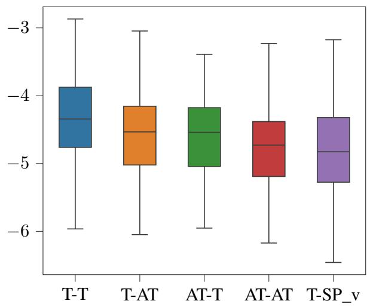
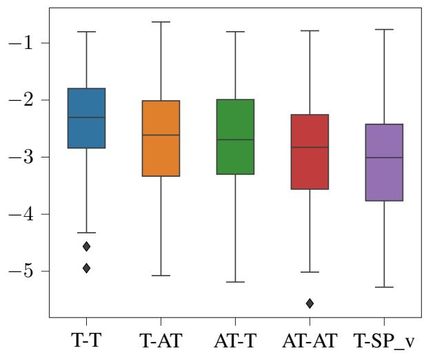
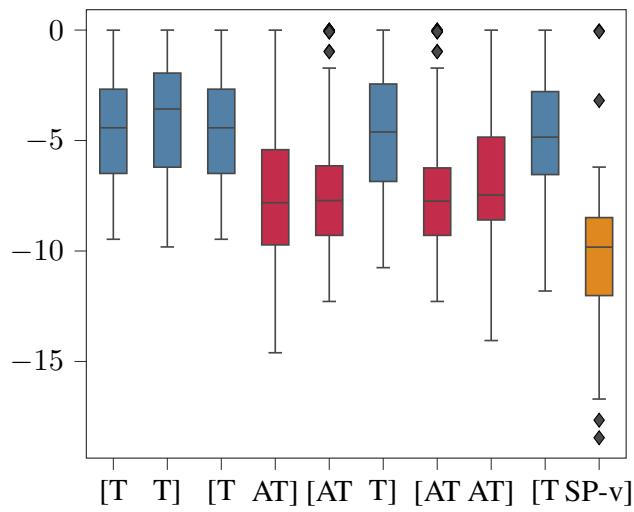
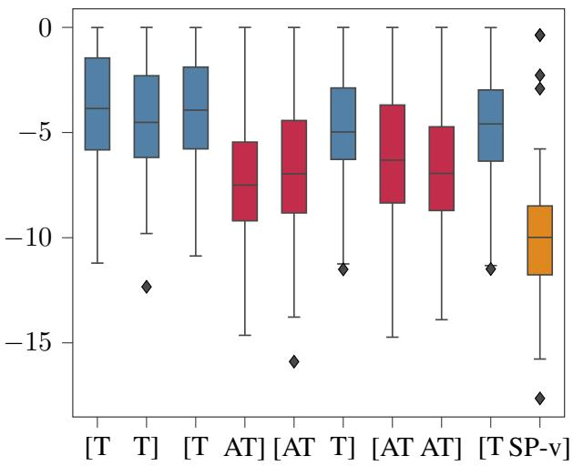

# We Understand Elliptical Sentences, and Language Models Should Too: A New Dataset for Studying Ellipsis and its Interaction with Thematic Fit

Davide Testa University of Pisa d.testa6@studenti.unipi.it

Emmanuele Chersoni The Hong Kong Polytechnic University emmanuele.chersoni@polyu.edu.hk

Alessandro Lenci University of Pisa alessandro.lenci@unipi.it

## Abstract

Ellipsis is a linguistic phenomenon characterized by the omission of one or more sentence elements. Solving such a linguistic construction is not a trivial issue in natural language processing since it involves the retrieval of non-overtly expressed verbal material, which might in turn require the model to integrate human-like syntactic and semantic knowledge. In this paper, we explored the issue of how the prototypicality of event participants affects the ability of Language Models (LMs) to handle elliptical sentences, and to identify the omitted arguments at different degrees of thematic fit, ranging from highly typical participants to semantically anomalous ones. With this purpose in mind, we built ELLie, the first dataset composed entirely of utterances containing different types of elliptical constructions, and structurally suited for evaluating the effect of argument thematic fit in solving ellipsis and reconstructing the missing element. Our tests demonstrated that the probability scores assigned by the models are higher for typical events than for atypical and impossible ones in different elliptical contexts, confirming the influence of prototypicality of the event participants in interpreting such linguistic structures. Finally, we conducted a retrieval task of the elided verb in the sentence in which the low performance of LMs highlighted a considerable difficulty in reconstructing the correct event.

## 1 Introduction

A key phenomenon of natural languages is ellipsis, the omission of a word or phrase that is expected to occupy a place in the syntactic structure of a sentence (McShane, 2005).1 Elliptical sentences are usually composed of a standard sentence (aka antecedent clause) and an elliptical clause, which is not fully propositional and apparently not wellformed from a syntactic point of view (Culicover and Jackendoff, 2005). Consider the following example, where the antecedent is underlined and the elliptical one is characterized by the verb omission:

(1) The engineer completed the project, but the student didn’t.

Since ellipsis represents a deviation from the simple compositional mapping between form and meaning, elliptical sentences have been the focus of many studies that seek to investigate how ellipsis is mentally represented, how the interpretation of the elided material is recovered, and consequently, how meaning can arise in the absence of form (Ginzburg and Sag, 2000; Schwabe and Winkler, 2003; Culicover and Jackendoff, 2006; Jacobson, 2012; Merchant, 2013, 2018; van Craenenbroeck and Temmerman, 2018). Over the years, such theoretical discussions have proven the presence of a structural parallelism between the two sentence components through which ellipsis resolution mechanisms can be activated. Currently, the most popular one is the indirect licensing mechanism (Culicover and Jackendoff, 2005) which rejects any kind of hidden (syntactic) level in the ellipsis site and involves a semantic identity procedure that consists of the recovery of linguistic material in the syntactic structure of the antecedent which, therefore, becomes relevant not only to the interpretation of the elliptical clause but also to its syntactic well-formedness.2 Elliptical items (aka orphans) are licensed by this inter-clause parallelism or by a single lexical licensor in the antecedent. In many cases, however, the establishment of such a co-reference relation with some contextual elements does not guarantee the perfect resolution of this syntactic gap and the speaker must search for a link to a real-world referent, relying on external event knowledge. For such reasons, ellipsis resolution is not a trivial task in human and machine language processing.

The goal of this work is to explore the ability of LMs to cope with elliptical sentences and to recover the missing elements. In particular, we investigate the role of event knowledge in ellipsis resolution. We focus our attention on verbal ellipsis, and ask the question whether different degrees of thematic fit (McRae and Matsuki, 2009), that is the compatibility between the omitted verb in the ellipsis site and its arguments, affect the capacity of a language model to interpret such linguistic structures. For example, in (1) there is a high thematic fit in the antecedent clause between the predicate completed and the two arguments engineer (as an agent) and project (as the patient/theme). The thematic fit relation defines a typicality gradient, ranging from highly typical, preferred arguments to violations of the selectional restrictions of the verb, at the lower side of the spectrum. Are thematic fit relations transferred to elliptical clauses? Are typical verbargument combinations somehow facilitating the job in reconstructing a full semantic representation when the verb is being omitted?

With those questions in mind, we explore the issue of how the prototypicality of event participants affects LMs in handling elliptical sentences, and whether these models are able to identify the omitted elements at different degrees of thematic fit. Our contribution to these issues is the creation of ELLie,3 the first dataset of elliptical utterances which is perfectly suited for a dynamic evaluation of thematic fit since it is composed of sentences that differ for their filler-argument typicality, ranging from highly typical to semantic anomalous ones.

The paper is organized as follows. Section 2 discusses previous works in this specific research area. Section 3 presents the design and structure of ELLie. In Section 4, we discuss the experiments conducted with the LMs on ELLie. Section 5 reports and discusses the results, while Section 6 shows how these can lead to further research.

## 2 Related Work

## 2.1 Ellipsis in Natural Language Processing

Ellipsis is a relatively understudied problem in the Natural Language Processing (NLP) literature, given the difficulty of its resolution and the scarcity of benchmarks for the task. However, the phenomenon is widely recognized as an important source of errors in tasks such as dialogue understanding and machine translation (Dzikovska et al., 2009; Chung and Gildea, 2010). Rønning et al. (2018) focused on sluice resolution in English, that is, the problem of finding antecedents of whfronted ellipsis. They used a Recurrent Neural Network trained with a multi-tasking approach, with POS Tagging, chunking, CCG Tagging4 and sentence compression as auxiliary tasks, and reported a consistent reduction of errors due to sluice. On the same line of research, Hansen and Sø- gaard (2020) introduced a dataset specifically on sluices by treating sluice resolution as a questionanswering task. The benchmark includes human gold annotations for 4, 000 sluices from dialogues that were collected from conversational questionanswering data.

Aralikatte et al. (2021) further extended the multitask approach by using a BERT-based architecture that was simultaneously trained on a question answering and a coreference resolution dataset, outperforming all the other single task and multitask baseline systems.

Finally, Warstadt et al. (2020) included a section on elliptical sentences in BLimP, a large benchmark dataset for evaluating what language models know about major grammatical phenomena in English. It consists of 67 sub-datasets each containing 1, 000 minimal pairs which are representative of a particular grammatical construction and consist of two minimally different sentences where one is grammatically acceptable and the other is not. However, sentences were structured in order to validate their correctness in terms of grammatical rules, but not their semantic plausibility or typicality in relation to general event knowledge.

## 2.2 Thematic Fit and Event Knowledge in Psycholinguistics and in NLP

Thematic fit is a notion introduced in a series of psycholinguistic studies investigating the effects of event-based priming in online sentence processing (McRae et al., 1998; Ferretti et al., 2001; McRae et al., 2005; Hare et al., 2009). A common finding of the above-mentioned studies is that, in psycholinguistic tasks, verbs prime their typical arguments and vice versa. Moreover, typical argument combinations lead to shorter reading times, shorter fixations in eye-tracking experiments and elicit smaller N400 amplitudes (Bicknell et al., 2010; Matsuki et al., 2011), suggesting that the prototypicality of the event representation comes with a reduced cognitive effort for human understanding. The main interpretation of such findings is that humans rely on Generalized Event Knowledge (GEK) for language comprehension (McRae and Matsuki, 2009), which works as a network of reciprocal activations between events and participants, and that thematic fit reflects somehow the “strength of activation” between the elements in this network.

Thematic fit has quickly become a hot topic also in NLP, and it was tackled either with unsupervised, vector-based approaches (Erk et al., 2010; Baroni and Lenci, 2010; Lenci, 2011; Greenberg et al., 2015a,b; Sayeed et al., 2016; Chersoni et al., 2016; Santus et al., 2017; Chersoni et al., 2017, 2019, 2020, 2021) or with supervised neural networks (Tilk et al., 2016; Hong et al., 2018; Zhang et al., 2019b,a; Marton and Sayeed, 2022).

Thematic fit can be estimated for given arguments in a sentence, by computing their typicality score for the semantic role of the verb given the arguments already realized in the sentence (e.g., the system is asked to output the typicality of the patient instrument for the verb play, given the agent musician in The musician played an instrument). Since the earlier works (Lenci, 2011; Tilk et al., 2016; Chersoni et al., 2016), the evaluation has been done by comparing sentence pairs that differed only for an argument, such that one was typical and the other was not (e.g., The mechanic fixed the engine vs. The journalistfixed the engine), and the system was expected to assign a higher thematic fit score to the typical one.

A recent work by Pedinotti et al. (2021) similarly tested the ability of Transformer-based LMs to manage argument typicality in the DTFit dataset (Vassallo et al., 2018), a benchmark for thematic fit that covers a wider variety of thematic roles, and they found that they achieve a performance comparable to the best vector space models. However, their predictions often rely on surface linguistic features, such as frequency and collocations, and therefore they have a poor generalization ability when tested on alternative benchmarks that control for these factors.

## 3 The ELLie Dataset

To the best of our knowledge, ELLie is the first dataset created to explore the complexity of the ellipsis phenomenon and its relation with thematic fit. Its structure was conceived to include multiple types of elliptical constructions, covering different thematic roles, and with the omitted elements (i.e., the verb or the whole verb phrase) having different degrees of thematic fit with the arguments in the context. The dataset is useful to investigate to what extent computational models encode the structured semantic information necessary for ellipsis resolution, and use it to make an accurate representation of the event context.

## 3.1 Data Preparation

After a preliminary study of the main English elliptical constructions presented in Culicover and Jackendoff (2005), we proceeded to create ELLie’s elliptical sentences. For creating our dataset tuples, in most cases5 we exploited the agent-verb pairs, triples, and quadruples already present in the DTFit dataset6 (for the typical and atypical condition) in order to have examples as cognitively grounded as possible. Differently from DTFit, besides typical vs. atypical argument conditions, we included also a semantically anomalous condition, in order to test whether a violation of selectional preferences7 makes the ellipsis more difficult to reconstruct.

ELLie includes the following elliptical constructions presented in Culicover and Jackendoff (2005):8

• Verb-phrase ellipsis (VP-ellipsis):

The photographer used the camera, and the reporter did too.

• Do-x anaphora:

The cook washed his hands before cooking, and so did the doctor before the surgery."

• Gapping:

"The businessman is reading the report, and the customer the menu."

• Pseudo-gapping:

"The child will drink the coke, and the student will the coffee."

• Sluicing:

"I know the electrician is checking something, but I don’t know what."

• Sluice-stranding:9

"The cook flipped the pancake with something, but I didn’t know what with."

## 3.2 Dataset Structure

ELLie is structured into five sub-dataset corresponding to different thematic roles: $\mathbf { A g e n t } _ { [ E L L i e ] }$ , Patient $[ E L L i e ]$ , Instrument $[ E L L i e ]$ , Location[ELLie], and Time[ELLie].

The dataset is organized in blocks of five sentences (i.e., quintuplets), each composed by an antecedent clause and an elliptical part, like in (1). Each sentence in a block differs from the other ones only for two elements: the candidate fillers of a given thematic role in both the antecedent and the elliptical clauses. These sentences represent five alternatives through which we analyze the typicality condition of the event’s participants (namely the argument filler in the antecedent and the elliptical one selected by the verb) according to different degrees of thematic fit, including highly typical arguments (T condition), atypical arguments (AT condition), up to semantic anomalous ones that violates selectional preferences (SP\_v condition). Table 1 contains an example of a quintuplet in ELLie.

The dataset is balanced from a structural point of view, as we aimed at using an equal number of quintuples for each sub-dataset and, where possible, the same number of elliptical constructions. The structure of ELLie is reported in Table 2, while Table 3 shows its composition in terms of the included elliptical constructions.

## 4 Experiments

We used ELLie as an evaluation dataset to test two Transformer-based LMs and analyze their behavior with elliptical constructions.

Models. We chose to use two pre-trained models available in the Transformers library on Hugging Face,10 since the main aim of this research was to identify the knowledge that such language models had acquired only through pre-training, without the intervention of fine-tuning.

GPT-2. (Radford et al., 2019) It is a 1.5B parameter Transformer LM trained with a causal language modeling objective, which is the task of predicting a token basing only on the previous sequence of tokens. It was trained on 8 million documents (40 GB of data) from WebText. For our experiments, we used the GPT-2 large version (36 layers, 1024 embedding size).

BERT. (Devlin et al., 2019) It is built around a series of stacked Transformer encoders and, unlike GPT, it is an autoencoding model based on masked language modeling and on a next-sentence prediction objectives. It means that this model is trained to predict a randomly-masked word in an input sentence using both its left and right context. Therefore, it builds a bidirectional representation of all the tokens in the sentence. It was trained on 13GB of data from English Wikipedia and the BooksCorpus. We chose to use BERT-base-cased (12 layers, 768 embedding size).

All the analyses were conducted using the Minicons library11 (Misra, 2022) which is a high-level wrapper around the transformers library from Hugging Face. The experiments are divided into three different tasks.

## Task 1: Sentence typicality score

We tested whether models can distinguish the most typical events from the atypical and/or implausible ones in elliptic constructions. As this presupposes that a model is able to identify that the missing element in the elliptical clause must be identical to the one overtly expressed in the antecedent, this task can be regarded as a sort of indirect test of the models’ ability in ellipsis resolution.

<table><tr><td>Sentence</td><td>Condition</td></tr><tr><td>The journalist writes an article, and the professor a book.</td><td>T - T</td></tr><tr><td>The journalist writes an article, and the professor a magazine.</td><td>T - AT</td></tr><tr><td>The journalist writes a song, and the professor a book.</td><td>AT - T</td></tr><tr><td>The journalist writes a song, and the professor a magazine.</td><td>AT - AT</td></tr><tr><td>The journalist writes an article, and the professor an apple.</td><td>T - SP_v</td></tr></table>

Table 1: Example of a sentence quintuple in Patient[ELLie]

<table><tr><td>Semantic Role</td><td>Quintuplets</td><td>Sentences</td></tr><tr><td>Agent</td><td>25</td><td>125</td></tr><tr><td>Patient</td><td>25</td><td>125</td></tr><tr><td>Instrument</td><td>25</td><td>125</td></tr><tr><td>Location</td><td>20</td><td>100</td></tr><tr><td>Time</td><td>20</td><td>100</td></tr><tr><td>Tot.</td><td>115</td><td>575</td></tr></table>

Table 2: ELLie Dataset structure.

<table><tr><td>E. constructions</td><td>Quintuplets</td><td>Sentences</td></tr><tr><td>VP-ellipsis</td><td>22</td><td>110</td></tr><tr><td>Do-x anaphora</td><td>22</td><td>110</td></tr><tr><td>Gapping</td><td>30</td><td>150</td></tr><tr><td>Pseudo-gapping</td><td>31</td><td>155</td></tr><tr><td>Sluicing1</td><td>10</td><td>50</td></tr><tr><td>Tot.</td><td>115</td><td>575</td></tr></table>

1 Sluicing class also includes the sluice-stranding construction.  
Table 3: ELLie composition in terms of elliptical constructions.

For each sentence in a block we computed its probability score. Before that, we did a further preliminary check by carrying out a normalization based on the number of tokens, to make sure that the results were not affected by the number of tokens into which a sentence is split.12

Since the two neural models have different training objectives, sentence probability is computed differently. In GPT-2, at each step, the probability of the entire model’s vocabulary is computed for that position given only the left context. Then, if the word is included in the model’s vocabulary, its probability is retrieved. Consequently, sentence probability is computed using the classical chain rule formula.

Conversely, Minicons library adopts the Pseudo-log-likelihood score (PLL) when using BERT, since the probability of a sentence cannot be computed using this autoencoding model, given its bidirectional architecture. This score is obtained by masking one token at a time, calculating the token’s probability given its left and right context, and then summing the logprobabilities for all the tokens (Salazar et al., 2020).

## Task 2: Fillers typicality score

The second task is a double dynamic thematic fit evaluation and consists in recovering the probability assigned by the models to the candidate fillers of the antecedent clause and the elliptical one. Their typicality score is represented by this probability value. So, we retrieved the specific position of each candidate filler analyzing the tokenization’s results both with the GPT-2 tokenizer and with the BERT one.13 Then, we retrieved the log-probability for each position for both the candidate fillers in each of the typicality conditions and semantic preference violation.14

## Task 3: Elided verb retrieval

As a further experiment, we designed a prompting task for retrieving the elided verbs of the elliptical clauses of each utterances, to analyze whether the models are able to recover and reconstruct the event context. First, we took all the elliptical utterances (typical, atypical and anomalous ones) and created for each of them two prompts to be used with the models, as shown in (2):15

(2) a. Elliptical sentence: The photographer used the camera, and the reporter did too.

b. Prompt GPT-2: The photographer used the camera, and the reporter did too. What the reporter did was

c. Prompt BERT: The photographer used the camera, and the reporter did too. What the reporter did was [MASK] the camera.

Then, GPT-2 was evaluated on a text-generation task and BERT on a fill-mask task. Performance was measured with verb retrieval accuracy, computed as the number of times the models were able to retrieve the target verb, which was identified via regular expressions.

GPT-2 was tested in two different configurations referring to distinct decoding methods. Both of them involve the generation of new tokens, but one exploits GPT’s sampling technique and the other one does not. In the former configuration, we used the top-p (nucleus) sampling method, setting the seed to reproduce the results. We generated the top-3 sentences in which only tokens with probabilities that add up to top-p = 0.92 or higher (given the previous words) are kept for generation. If the target verb was present in at least one of three generated sentences, then the model scored an accuracy hit.16 The other configuration simply retrieved the most likely sentence doing a greedy search without sampling. We decided to use also this decoding method because it is the same used by BERT. In addition, we evaluated GPT-2 performance also in retrieving the direct object. For the fill-mask task, we masked instead the target verb in the prompt and took the most likely words predicted by BERT to replace that mask.

## 5 Results and Analysis

We report here the results of the experiments carried out on ELLie.

Figures 1 and 2 show the probability distribution of sentences in the five candidate filler typicalityconditions extracted both from GPT-2 (Figure 1) and BERT (Figure 2). As can be seen from the two sets of boxplots, the models’ behavior is quite similar: They can assign significantly higher scores to the T-T condition compared to the conditions containing an atypical filler (i.e., T-AT, AT-T and AT-AT) or to the conditions including a selectional preference violation (T-SP\_v). By contrast, both the models are unable to make a meaningful distinction between atypical conditions and a selectional preference violation (T- SP\_v). Statistical significance was assessed with the Kruskal-Wallis test, followed by a pairwise Wilcoxon test to examine among which pairs of conditions differences were statistically significant. This shows that GPT-2 and BERT apparently cannot distinguish a plausible (even if atypical) event from an impossible one, when such events occur in elliptical constructions. Furthermore, we observe that the patient role is the most affected one by argument atypicality or by semantic preference violation among all thematic roles, as it records the lowest probability scores (see Table 4). A possible explanation is that models build a more robust patient prototype, allowing any kind of atypicality to be more easily detected. At the other extreme, we observed the biggest difficulty in discriminating between conditions for the location role.17

With regards to the second task, Figures 3 and 4 represent the probability distribution of each candidate filler for both parts of the sentences. So, each pair of boxplots represents the fillers probability distribution in a sentence with that specific typicality conditions (the left plot in a pair corresponds to the filler in the antecedent clause, the right plot to the filler in the elliptic part). The results confirm the ones in the previous task, but this time we notice that there is also a significant difference between the atypical levels and those recorded for semantic preference violations. Moreover, the models are now successful in identifying the typicality or atypicality of a candidate filler. This is confirmed by the fact that, regardless of the position of fillers in the antecedent or the elliptic clause of the sentence, typical fillers are ranked approximately with the same probability scores, and the same happens for atypical ones, as shown in Figures 3 and 4.

The last task proved to be the most interesting one for us, and the hardest one for the models. Table 5 shows the accuracy levels reached by GPT-2 (in both tested configurations) and by BERT. As can be seen, the scores are very low for both models. GPT-2 has the worst performance, but BERT does not achieve acceptable values either, considering that this model was also facilitated in the prompt by the presence of the direct object. Such a problem was then partly confirmed by doing an additional check on the output of BERT. For each sentence we ranked the first five predictions following a descending order of probability and observed that 55.8% of the correct answers belonged to rank 1 (i.e., the top prediction according to the model), but in 32.5% of the cases the correct verb was not present in any of the five top ranks. These results demonstrate a general difficulty of the models in reconstructing the implicit event in the elliptical construction, and this is evident not only with the recovery of the elided verb but also with that of the direct object for GPT-2.

  
Figure 1: GPT-2 Sentence probability distribution

Figure 2: BERT Sentence probability distribution
<table><tr><td></td><td>Agent</td><td>Patient</td><td>Instrument</td><td>Time</td><td>Location</td></tr><tr><td>T - AT</td><td>-4.650914</td><td>-4.825681</td><td>-4.391740</td><td>-4.660659</td><td>-4.308138</td></tr><tr><td>AT - T</td><td>-4.674135</td><td>-4.874788</td><td>-4.398410</td><td>-4.539760</td><td>-4.310295</td></tr><tr><td>AT - AT</td><td>-4.907347</td><td>-5.044332</td><td>-4.490215</td><td>-4.852760</td><td>-4.497562</td></tr><tr><td> $\mathrm { T } - \mathrm { S P \_ v }$ </td><td>-4.863820</td><td>-5.106049</td><td>-4.613507</td><td>-4.959277</td><td>-4.526281</td></tr></table>

Table 4: Average sentences probability based on filler condition for each semantic role extracted from GPT-2 (Results from BERT are almost the same)

  
Figure 3: Filler probability distribution based on paircondition (GPT-2) [blue = T / red = AT / orange = SP\_v]

  
Figure 4: Filler probability distribution based on paircondition (BERT) [blue = T / red = AT / orange = SP\_v]

<table><tr><td></td><td>GPT  $\underline { { \mathbf { \overline { { V } } } _ { [ N S ] } } }$ </td><td>GPT  $\mathbf { \frac { d O b j } { d t N S l } }$ </td><td> $\overline { { { \bf G P T } _ { - } { \bf V } _ { [ G S ] } } }$ </td><td>GPT  $\mathbf { \frac { d O b j } { d O S } }$ </td><td>BERT</td></tr><tr><td>T- T</td><td>0.24</td><td>0.16</td><td>0.18</td><td>0.16</td><td>0.60</td></tr><tr><td>T - AT</td><td>0.19</td><td>0.19</td><td>0.13</td><td>0.16</td><td>0.58</td></tr><tr><td>AT - T</td><td>0.22</td><td>0.16</td><td>0.16</td><td>0.16</td><td>0.63</td></tr><tr><td>AT - AT</td><td>0.18</td><td>0.19</td><td>0.15</td><td>0.16</td><td>0.56</td></tr><tr><td>T - SP_v</td><td>0.19</td><td>0.22</td><td>0.14</td><td>0.17</td><td>0.43</td></tr><tr><td>Tot.</td><td>0.20</td><td>0.18</td><td>0.15</td><td>0.16</td><td>0.56</td></tr></table>

Table 5: Verb and direct object retrieval accuracy with GPT-2 nuclues sampling (NS), GPT-2 greedy search (GS) and BERT.

However, analyzing the errors made by the models, we have observed a few cases in which GPT-2 tends to generate verbs that do not perfectly match the searched verb but still belong to the same domain. Consider the following example, where the model is correctly identifying a plausible activity for the agent in the antecedent, but not necessarily for the agent in the elliptical clause:

(3) Prompt: The butcher used the knife, and the soldier did too. What the soldier did was

GPT-2 answer: to cut the meat into Correct answer: (to) use the knife

Apparently it might prove that the model really understood the ellliptic sentence, but it is instead likely that such LMs still tend to rely on frequent verb-argument co-occurences previously observed during training (to cut the meat is a typical verb-object combination given the subject butcher), rather than constructing and updating contextual information about an event (see also the error analysis sections in Rambelli et al. (2020); Pedinotti et al. (2021), which illustrate similar findings).

These results prove that the prototypicality of event participants affects the way such linguistic constructions are managed by the two models. Notice that almost all the higher scores both in GPT-2 (only for verb-retrieval) and BERT correspond to the typicality condition in which the elliptical clause contains a typical filler (T-T and AT-T). This means that models struggle to retrieve the verb more when the prompt describes an event with atypical or semantically impossible participants.

Finally, since evidence from prompting tasks has proved that even minimum changes inside the prompt could lead to different results, we decided to conduct a pilot experiment on a subset of cases18 using the prompts as shown in (4):

(4)

a. Prompt GPT-2:

The photographer used the camera, and the reporter did too. The reporter

b. Prompt BERT:

The photographer used the camera, and the reporter did too. The reporter [MASK] the camera.

The idea is that such a structure should facilitate the model since we directly present the elliptical agent without the presence of any indirect interrogative proposition as in (2). Unexpectedly, the results were quite disappointing: GPT-2 improved by only 2/3 points compared to the values obtained over the entire dataset with the previous prompts, but BERT dropped by 20 points.

## 5.1 Do LMs Know How to Master Ellipsis?

Ellipsis is a complex phenomenon that has always been at the center of the debate in theoretical linguistics (van Craenenbroeck and Temmerman, 2018). The reason of its complexity is that its mastering requires the ability to replace the gap in the elliptical clause with structural information that exactly matches a phrase overtly expressed in the antecedent clause:

(5) a. The photographer used the camera, and the reporter did too

b. \*The photographer used the camera, and the piano did too

In (5), the expression did too is a signal that the verb phrase of the elliptic clause is used the camera. In particular, the reconstructed material must preserve the semantic constraints of its overt “copy”: (5b) is anomalous because piano violates the selectional preferences of the verb in the antecedent.

What do LMs know about such key features of ellipsis? Our experiments suggest that, at least in the tested models, this knowledge is still quite limited. The fact that in Task 1 the models are not able to distinguish between atypical and impossible sentences is a sign that they cannot reconstruct correctly the implicit elements from the antecedent. Since current LMs are quite good at this task when event typicality and impossibility are tested in main clauses (Kauf et al., 2022), the problem is likely to lie in their (in)ability to interpret the elliptic gap. This is directly confirmed by Task 3, in which models show a low accuracy in retrieving the missing element. Even BERT, which is “helped” by an informative prompt including the direct object, is not able to go beyond 60% of accuracy in the T-T condition, which drops to 43% in the T-SP\_v condition. This difference is revealing of BERT’s difficulty in dealing with ellipsis. Notice that we can judge (5b) to be semantically anomalous exactly because we are able to interpret the missing verb phrase as being identical to the one in the antecedent. The fact that the violation of selectional preferences is instead a confounding element for BERT shows that the model has not managed to solve the elliptical construction. Like in other cases, the model behavior seems to be guided more by lexical cues (e.g., highly frequent events), rather than by genuine linguistic structure.

## 6 Conclusion

In this paper, we proposed a new framework to evaluate ellipsis and its relationship with thematic fit and selectional preferences. We did this by creating ELLie, the first dataset composed of elliptical utterances and structurally suited for estimating the effect of argument thematic fit in solving ellipsis. We tested two LMs with a Transformer-based architecture in three different tasks to understand whether their ability to process elliptical constructions is affected by argument typicality and event knowledge. Experimental results suggest a limited mastery of elliptical sentences and a significant influence of prototypicality of event’s participants. Moreover, the tested models greatly struggle to recover the missing elements of elliptical clauses and, thus, to reconstruct the whole event context. Their performance (especially in Task 3) may also depend on the low occurrence of such constructions in the training corpora, since the ellipsis phenomenon tends to be more frequent in speech than in writing. Finally, the influence of event typicality suggests that LMs tend to rely on frequent lexical co-occurrences, without being able to reconstruct the implicit syntactic and semantic structure necessary to interpret elliptical sentences.

## Limitations and Future directions

The findings reported in this paper have to be seen in light of some limitations and, therefore, they just represent a first step. Most of these limitations are related to the ELLie dataset itself. First of all, though the predicate-argument combinations used in ELLie come from the DTFit dataset and were rated by humans, still the elliptical sentences need human judgements,19 which is one of the future research direction. Then, the dataset size is relatively small, especially comparing to other resources on ellipsis (e.g., the 1000 elliptical sentences of the BLimP dataset). Currently, ELLie was mainly conceived as an evaluation dataset but it could be enlarged and become useful for models fine-tuning, or for carrying out few-shot learning experiments via prompting. Moreover, we tested ELLie only with two popular language models, but future works should include the comparison with other systems (e.g., RoBERTa, XLNet, distilled Transformer models, GPT-3, etc.) or even with specialized models for ellipsis resolution, to see to what extent our findings are generalizable.

Concerning the experiments, some changes could be made in the evaluation of Task 3. First, we could test the prompts in (4) on the subsets for the other roles, and look for different prompt structures to see if this leads to performance changes. We could also adopt a softer evaluation for this task, by assessing the output in terms of similarity to the target answer.

Finally, another limitation is related to the strong dependence of our results to the language used for the analysis (i.e., English). From this point of view, a cross-linguistic study on the elliptical structures in ELLie could contribute to improve our work from both a theoretical and practical perspective.

## Acknowledgements

EC was supported by the General Research Fund (B-Q0AH) at the Hong Kong Polytechnic University. This research was partly funded by PNRR - M4C2 - Investimento 1.3, Partenariato Esteso

PE00000013 – «FAIR - Future Artificial Intelligence Research» - Spoke 1 «Human-centered AI», funded by the European Commission under the NextGeneration EU programme.

## References

Rahul Aralikatte, Matthew Lamm, Daniel Hardt, and Anders Søgaard. 2021. Ellipsis Resolution as Question Answering: An Evaluation. In Proceedings of EACL.

Marco Baroni and Alessandro Lenci. 2010. Distributional Memory: A General Framework for Corpus-Based Semantics. Computational Linguistics, 36(4):673–721.

Klinton Bicknell, Jeffrey L Elman, Mary Hare, Ken McRae, and Marta Kutas. 2010. Effects of Event Knowledge in Processing Verbal Arguments. Journal ofMemory and Language, 63(4):489–505.

Emmanuele Chersoni, Philippe Blache, and Alessandro Lenci. 2016. Towards a Distributional Model of Semantic Complexity. In Proceedings ofthe COLING Workshop on Computational Linguisticsfor Linguistic Complexity (CL4LC).

Emmanuele Chersoni, Ludovica Pannitto, Enrico Santus, Alessandro Lenci, and Chu-Ren Huang. 2020. Are Word Embeddings Really a Bad Fit for the Estimation of Thematic Fit? In Proceedings ofLREC.

Emmanuele Chersoni, Enrico Santus, Philippe Blache, and Alessandro Lenci. 2017. Is Structure Necessary for Modeling Argument Expectations in Distributional Semantics? In Proceedings ofIWCS.

Emmanuele Chersoni, Enrico Santus, Alessandro Lenci, Philippe Blache, and Chu-Ren Huang. 2021. Not All Arguments Are Processed Equally: A Distributional Model of Argument Complexity. Language Resources and Evaluation, pages 1–28.

Emmanuele Chersoni, Enrico Santus, Ludovica Pannitto, Alessandro Lenci, Philippe Blache, and C-R Huang. 2019. A Structured Distributional Model of Sentence Meaning and Processing. Natural Language Engineering, 25(4):483–502.

Won Ik Cho, Emmanuele Chersoni, Yu-Yin Hsu, and Chu-Ren Huang. 2021. Modeling the Influence of Verb Aspect on the Activation of Typical Event Locations with BERT. In Findings of ACL-IJCNLP 2021.

Tagyoung Chung and Daniel Gildea. 2010. Effects of Empty Categories on Machine Translation. In Proceedings of EMNLP, pages 636–645.

Peter W Culicover and Ray Jackendoff. 2005. Simpler Syntax. Oxford University Press.

Peter W. Culicover and Ray Jackendoff. 2006. The Simpler Syntax Hypothesis. TRENDS in Cognitive Sciences, 10:413–418.

Jacob Devlin, Ming-Wei Chang, Kenton Lee, and Kristina Toutanova. 2019. BERT: Pre-training of Deep Bidirectional Transformers for Language Understanding. In Proceedings ofNAACL.

Myroslava O Dzikovska, Charles B Callaway, Elaine Farrow, Johanna D Moore, Natalie Steinhauser, and Gwendolyn Campbell. 2009. Dealing with Interpretation Errors in Tutorial Dialogue. In Proceedings of SIGDIAL.

Katrin Erk, Sebastian Padó, and Ulrike Padó. 2010. A Flexible, Corpus-Driven Model of Regular and Inverse Selectional Preferences. Computational Linguistics, 36(4):723–763.

Todd R Ferretti, Marta Kutas, and Ken McRae. 2007. Verb Aspect and the Activation of Event Knowledge. Journal of Experimental Psychology: Learning, Memory, and Cognition, 33(1):182.

Todd R Ferretti, Ken McRae, and Andrea Hatherell. 2001. Integrating Verbs, Situation Schemas, and Thematic Role Concepts. Journal of Memory and Language, 44(4):516–547.

Jonathan Ginzburg and Ivan Sag. 2000. Interrogative Investigations. Stanford: CSLI Publications.

Clayton Greenberg, Vera Demberg, and Asad Sayeed. 2015a. Verb Polysemy and Frequency Effects in Thematic Fit Modeling. In Proceedings of the NAACL Workshop on Cognitive Modeling and Computational Linguistics.

Clayton Greenberg, Asad B Sayeed, and Vera Demberg. 2015b. Improving Unsupervised Vector-Space Thematic Fit Evaluation via Role-Filler Prototype Clustering. In Proceedings ofNAACL-HLT.

Victor Petrén Bach Hansen and Anders Søgaard. 2020. What Do You Mean ‘Why?’: Resolving Sluices in Conversations. In Proceedings ofAAAI.

Mary Hare, Michael Jones, Caroline Thomson, Sarah Kelly, and Ken McRae. 2009. Activating Event Knowledge. Cognition, 111(2):151–167.

Xudong Hong, Asad Sayeed, and Vera Demberg. 2018. Learning Distributed Event Representations with a Multi-task Approach. In Proceedings of\*SEM.

Pauline Jacobson. 2012. Direct Compositionality. In Markus Werning, Wolfram Hinzen, and Edouard Machery, editors, The Oxford Handbook of Compositionality, pages 109–128. Oxford University Press, Oxford.

Carina Kauf, Anna A Ivanova, Giulia Rambelli, Emmanuele Chersoni, Jingyuan S She, Zawad Chowdhury, Evelina Fedorenko, and Alessandro Lenci. 2022. Event Knowledge in Large Language Models: The Gap between the Impossible and the Unlikely. arXiv preprint arXiv:2212.01488.

Alessandro Lenci. 2011. Composing and Updating Verb Argument Expectations: A Distributional Semantic Model. In Proceedings of the ACL Workshop on Cognitive Modeling and Computational Linguistics.

Carol Madden-Lombardi, Peter Ford Dominey, and Jocelyne Ventre-Dominey. 2017. Grammatical Verb Aspect and Event Roles in Sentence Processing. PLOS One, 12(12).

Yuval Marton and Asad Sayeed. 2022. Thematic Fit Bits: Annotation Quality and Quantity Interplay for Event Participant Representation. In Proceedings of LREC.

Kazunaga Matsuki, Tracy Chow, Mary Hare, Jeffrey L Elman, Christoph Scheepers, and Ken McRae. 2011. Event-Based Plausibility Immediately Influences On-Line Language Comprehension. Journal of Experimental Psychology: Learning, Memory, and Cognition, 37(4):913.

Ken McRae, Mary Hare, Jeffrey L Elman, and Todd Ferretti. 2005. A Basis for Generating Expectancies for Verbs from Nouns. Memory & Cognition, 33(7):1174–1184.

Ken McRae and Kazunaga Matsuki. 2009. People Use their Knowledge of Common Events to Understand Language, and Do So as Quickly as Possible. Language and Linguistics Compass, 3(6):1417–1429.

Ken McRae, Michael J Spivey-Knowlton, and Michael K Tanenhaus. 1998. Modeling the Influence of Thematic Fit (and Other Constraints) in On-line Sentence Comprehension. Journal ofMemory and Language, 38(3):283–312.

Marjorie J. McShane. 2005. A Theory of Ellipsis. Oxford University Press.

Jason Merchant. 2013. Voice and Ellipsis. Linguistic Inquiry, 44(1):77–108.

Jason Merchant. 2018. Ellipsis: A Survey of Analytical Approaches. In Jeroen van Craenenbroeck and Tanja Temmerman, editors, A Handbook ofEllipsis. Oxford University Press.

Kanishka Misra. 2022. minicons: Enabling Flexible Behavioral and Representational Analyses of Transformer Language Models. arXiv preprint arXiv:2203.13112.

Paolo Pedinotti, Giulia Rambelli, Emmanuele Chersoni, Enrico Santus, Alessandro Lenci, and Philippe Blache. 2021. Did the Cat Drink the Coffee? Challenging Transformers with Generalized Event Knowledge. In Proceedings of\*SEM.

Alec Radford, Jeffrey Wu, Rewon Child, David Luan, Dario Amodei, and Ilya Sutskever. 2019. Language Models Are Unsupervised Multitask Learners. OpenAI Blog, 1(8):9.

Giulia Rambelli, Emmanuele Chersoni, Alessandro Lenci, Philippe Blache, and Chu-Ren Huang. 2020. Comparing Probabilistic, Distributional and Transformer-based Models on Logical Metonymy Interpretation. In Proceedings ofAACL-IJCNLP.

Ola Rønning, Daniel Hardt, and Anders Søgaard. 2018. Linguistic Representations in Multi-task Neural Networks for Ellipsis Resolution. In Proceedings ofthe EMNLP Workshop on Analyzing and Interpreting Neural Networks (BlackboxNLP).

Julian Salazar, Davis Liang, Toan Q Nguyen, and Katrin Kirchhoff. 2020. Masked Language Model Scoring. In Proceedings of ACL.

Enrico Santus, Emmanuele Chersoni, Alessandro Lenci, and Philippe Blache. 2017. Measuring Thematic Fit with Distributional Feature Overlap. In Proceedings ofEMNLP.

Asad Sayeed, Clayton Greenberg, and Vera Demberg. 2016. Thematic Fit Evaluation: An Aspect of Selectional Preferences. In Proceedings of the ACL Workshop on Evaluating Vector Space Representationsfor NLP.

Kerstin Schwabe and Susanne Winkler. 2003. The Interfaces: Deriving and Interpreting Omitted Structures. John Benjamins Publishing.

Mark Steedman and Jason Baldridge. 2011. Combinatory Categorial Grammar. Non-Transformational Syntax: Formal and Explicit Models of Grammar, pages 181–224.

Ottokar Tilk, Vera Demberg, Asad Sayeed, Dietrich Klakow, and Stefan Thater. 2016. Event Participant Modelling with Neural Networks. In Proceedings of EMNLP.

Jeroen van Craenenbroeck and Tanja Temmerman, editors. 2018. The Oxford Handbook ofEllipsis. Oxford University Press, Oxford.

Paolo Vassallo, Emmanuele Chersoni, Enrico Santus, Alessandro Lenci, and Philippe Blache. 2018. Event Knowledge in Sentence Processing: A New Dataset for the Evaluation of Argument Typicality. In Proceedings of the LREC Workshop on Linguistic and Neuro-Cognitive Resources (LiNCR).

Alex Warstadt, Alicia Parrish, Haokun Liu, Anhad Mohananey, Wei Peng, Sheng-Fu Wang, and Samuel R Bowman. 2020. BLiMP: The Benchmark of Linguistic Minimal Pairs for English. Transactions of the Associationfor Computational Linguistics, 8:377– 392.

Hongming Zhang, Jiaxin Bai, Yan Song, Kun Xu, Changlong Yu, Yangqiu Song, Wilfred Ng, and Dong Yu. 2019a. Multiplex Word Embeddings for Selectional Preference Acquisition. In Proceedings of EMNLP-IJCNLP.

Hongming Zhang, Hantian Ding, and Yangqiu Song. 2019b. SP-10K: A Large-scale Evaluation Set for Selectional Preference Acquisition. In Proceedings of ACL.

## ACL 2023 Responsible NLP Checklist

A For every submission: ✓ A1. Did you describe the limitations of your work? Limitations

 A2. Did you discuss any potential risks of your work? Not applicable. Left blank.

✓ A3. Do the abstract and introduction summarize the paper’s main claims? 1

✗ A4. Have you used AI writing assistants when working on this paper? Left blank.

## B ✓ Did you use or create scientific artifacts?

✓ B1. Did you cite the creators of artifacts you used? References

✓ B2. Did you discuss the license or terms for use and / or distribution of any artifacts? Left blank.

✓ B3. Did you discuss if your use of existing artifact(s) was consistent with their intended use, provided that it was specified? For the artifacts you create, do you specify intended use and whether that is compatible with the original access conditions (in particular, derivatives of data accessed for research purposes should not be used outside of research contexts)? Left blank.

 B4. Did you discuss the steps taken to check whether the data that was collected / used contains any information that names or uniquely identifies individual people or offensive content, and the steps taken to protect / anonymize it? Not applicable. Left blank.

✓ B5. Did you provide documentation of the artifacts, e.g., coverage of domains, languages, and linguistic phenomena, demographic groups represented, etc.? 3

✓ B6. Did you report relevant statistics like the number of examples, details of train / test / dev splits, etc. for the data that you used / created? Even for commonly-used benchmark datasets, include the number of examples in train / validation / test splits, as these provide necessary context for a reader to understand experimental results. For example, small differences in accuracy on large test sets may be significant, while on small test sets they may not be. Left blank.

## C ✓ Did you run computational experiments?

 C1. Did you report the number of parameters in the models used, the total computational budget (e.g., GPU hours), and computing infrastructure used? Not applicable. Left blank.

✓ C2. Did you discuss the experimental setup, including hyperparameter search and best-found hyperparameter values? 4

✓ C3. Did you report descriptive statistics about your results (e.g., error bars around results, summary statistics from sets of experiments), and is it transparent whether you are reporting the max, mean, etc. or just a single run? 5

✓ C4. If you used existing packages (e.g., for preprocessing, for normalization, or for evaluation), did you report the implementation, model, and parameter settings used (e.g., NLTK, Spacy, ROUGE, etc.)? 4

D ✗ Did you use human annotators (e.g., crowdworkers) or research with human participants? Left blank.

 D1. Did you report the full text of instructions given to participants, including e.g., screenshots, disclaimers of any risks to participants or annotators, etc.? No response.

 D2. Did you report information about how you recruited (e.g., crowdsourcing platform, students) and paid participants, and discuss if such payment is adequate given the participants’ demographic (e.g., country of residence)? No response.

 D3. Did you discuss whether and how consent was obtained from people whose data you’re using/curating? For example, if you collected data via crowdsourcing, did your instructions to crowdworkers explain how the data would be used? No response.

 D4. Was the data collection protocol approved (or determined exempt) by an ethics review board? No response.

 D5. Did you report the basic demographic and geographic characteristics of the annotator population that is the source of the data? No response.