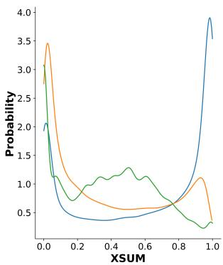
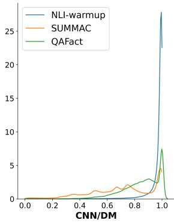
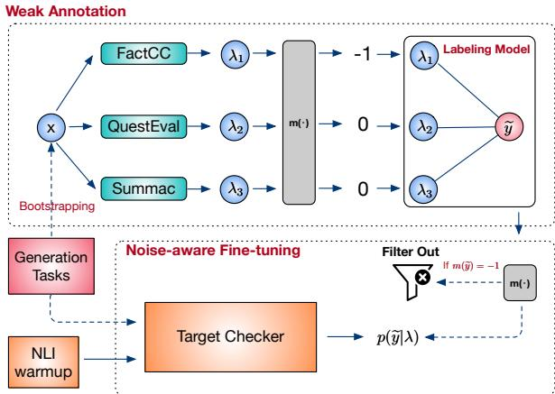
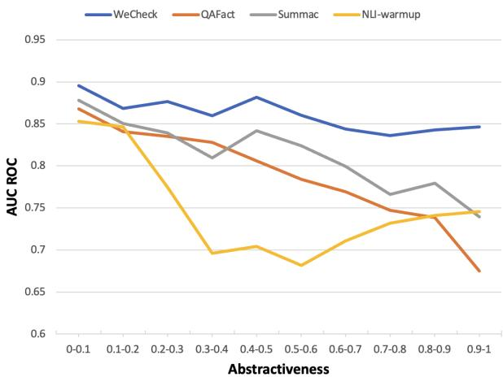

# WeCheck: Strong Factual Consistency Checker via Weakly Supervised Learning

Wenhao Wu1∗, Wei Li2, Xinyan Xiao2, Jiachen Liu2, Sujian Li1†, Yajuan Lyu2

1Key Laboratory of Computational Linguistics, MOE, Peking University

2Baidu Inc., Beijing, China

{waynewu,lisujian}@pku.edu.cn

{liwei85,xiaoxinyan,liujiachen,lvyajuan}@baidu.com

## Abstract

A crucial issue of current text generation models is that they often uncontrollably generate text that is factually inconsistent with inputs. Due to lack of annotated data, existing factual consistency metrics usually train evaluation models on synthetic texts or directly transfer from other related tasks, such as question answering (QA) and natural language inference (NLI). Bias in synthetic text or upstream tasks makes them perform poorly on text actually generated by language models, especially for general evaluation for various tasks. To alleviate this problem, we propose a weakly supervised framework named WeCheck that is di rectly trained on actual generated samples from language models with weakly annotated labels. WeCheck first utilizes a generative model to infer the factual labels of generated samples by aggregating weak labels from multiple resources. Next, we train a simple noise-aware classification model as the target metric using the inferred weakly supervised information. Comprehensive experiments on various tasks demonstrate the strong performance of WeCheck, achieving an average absolute improvement of 3.3% on the TRUE benchmark over 11B state-of-the-art methods using only 435M parameters. Furthermore, it is up to 30 faster than previous evaluation methods, greatly improving the accuracy and efficiency of factual consistency evaluation.1

## 1 Introduction

The research of text generation has achieved significant progress in recent years, but it still suffers the main issue of generating output which is factually inconsistent with the given inputs (Maynez et al., 2020). To tackle this issue, various metrics have been designed to check the consistency between generated text and the given inputs (Kryscinski et al., 2020; Scialom et al., 2021). As we know, how to construct such a metric has attracted increasing attention in a variety of fields (Wu et al., 2022b), including text summarization (Kryscinski et al., 2020; Wu et al., 2022a), dialogue generation (Welleck et al., 2019), and text simplification (Devaraj et al., 2022).

  
Figure 1: Probability density of factual consistency scores predicted by different metrics sampled from BART on XSum and CNN/DM datasets. The horizontal axis is the score ranged in [0, 1], and the vertical axis is the probability density.

Existing factual metrics can be classified into two types: one based on synthetic data and the other based on task transfer. Synthetic-data based metrics (Kryscinski et al., 2020; Mishra et al., 2021) apply data augmentation techniques to construct factual and non-factual texts as positive and negative samples, respectively. Metrics trained from these synthetic samples often perform poorly due to the significant mismatch between features of actual generated and synthetic text (e.g. distribution of factual errors) (Goyal and Durrett, 2021). Task-transfer based metrics utilize the reasoning ability of models trained on relevant upstream tasks, such as natural language inference (NLI) (Falke et al., 2019; Laban et al., 2022) and question answering (QA) (Wang et al., 2020; Fabbri et al.,

2022) and directly apply them to evaluate factual consistency without any adaption.

As described above, previous metrics are learned indirectly from other related resources but without seeing the actual generated text. In such cases, they may overfit to their upstream tasks and fail to generalize to actual generated samples that have significantly different data features. Figure 1 illustrates the probability density of three metrics, where the horizontal axis is metric scores and the vertical axis is the score density. Though these metrics are comparable in performance, they vary significantly in probability distributions, especially in the XSUM dataset, where sample features are greatly different from upstream tasks of these metrics2, NLI-warmup is extremely confident in predicting both very high and low scores while SUMMAC and QAFact are only confident in predicting low scores3. Furthermore, during testing, ensembling different metric scores by simply averaging will further improve their performance (Honovich et al., 2022). This also implies that the evaluation metrics learned from different resources are also complementary.

To bridge the gap between training and testing and mitigate the scarcity of labeled data, in this paper, we propose WeCheck, a factual consistency Checking framework based on Weakly supervised learning. Specifically, WeCheck is based on a learning paradigm that provides weak supervision via modeling multiple label sources without access to ground truth. Different from previous metrics, WeCheck directly utilizes the abundant actual generated samples bootstrapped from models trained on target downstream tasks, e.g. BART on text summarization. Then, WeCheck follows a two-step pipeline consisting of weak annotation and noiseaware fine-tuning to get the target metric model.

In the weak annotation step, by aggregating multiple weak supervision resources, we infer the unknown ground truth label of a sample. To reach this goal, we first provide each sample with a set of weak supervision signals calculated from various other metrics. These metrics are learned from various resources or tasks such as QA-based metrics and NLI-based metrics. After unifying and filtering these signals, we train a generative labeling model that models agreements and disagreements between them to infer the likelihood of their latent ground truth label. The inferred ground truth likelihood is then treated as a probabilistic label to provide weak supervision. In the second step, we apply noise-aware fine-tuning to train the target metric model. It is noted here, the weak annotation also brings noises to the supervision signal and brings new challenges to the model optimization process. As a solution, we first warmup our target metric model with NLI data for a better initialization before weakly supervised training. Then, after filtering out samples that are likely to be noisy, we finetune our target metric model with weak annotations. In summary, WeCheck could learn how to utilize multiple resources for weak annotation while recognizing and filtering the potential noises accompanied by weak supervision.

Experimental results show that WeCheck not only achieves state-of-the-art performance but also is computationally efficient. On the TRUE benchmark (Honovich et al., 2022), which is the current most comprehensive benchmark for factual consistency evaluation, WeCheck obtains an average ROC AUC of 84.8, 3.3% absolute improvement over previous 11B pre-trained task transferred metrics with only a size of 435M parameters. Moreover, it’s much more stable for various generation tasks, with much lower variance on different tasks. Thus, WeCheck is a simple but more effective and efficient metric for factual consistency evaluation.

We summarize our contributions as follows:

• We propose a novel factual consistency evaluation metric based on weakly supervised learning, namely WeCheck, which is directly trained on actual generated samples from language models with weakly annotated labels.

• WeCheck is both effective and efficient achieving 3.3% absolute improvement and up to 30 times faster comparing with previous state-ofart metrics.

• WeCheck is a general metric which is also more stable on various generation tasks and datasets than previous methods.

## 2 WeCheck Framework

Figure 2 illustrates the two-step pipeline of WeCheck framework. In the upper part of the figure, during the weak annotation step, we first calculate a set of weak supervision signals for each sample bootstrapped from target generation tasks. Then, we use a mapping function to unify the weak supervision signals and infer the likelihood of the ground truth label of each sample. After annotation, we apply noise-aware fine-tuning to train our target metric model, shown in the lower part of the figure. Noise-aware fine-tuning first warmup target metric model with NLI data and training it with filtered probabilistic labels. In the following, we introduce our problem definition and detailed method.

  
Figure 2: The overall framework of WeCheck, including weak annotation and noise-aware fine-tuning. Weak annotation infers the likelihood of each sample’s true label based on its weak supervision signal set λ, and noise-aware fine-tuning trains the target metric with the inferred likelihood of ground-truth label.

## 2.1 Problem Definition

Factual Consistency Evaluation Given a textual sequence as a premise, and another textual sequence as a hypothesis, which may be a generated summary or dialogue, the goal of a factual consistency metric $f _ { \theta }$ is to predict whether the hypothesis is factual consistent given the premise. For simplicity, we follow the previous textual entailment based framework (Kryscinski et al., 2019), which takes x, the concatenation of hypothesis and premise, as the input format and unifies the evaluation as a binary classification problem: $f _ { \theta } ( \pmb { x } ) \in [ 0 , 1 ]$ , where the predicted logit indicates the probability of x being factually consistent. Another advantage of using the entailment-based framework is that it is effective in terms of time complexity compared with other methods (Laban et al., 2022). Taking $f _ { \theta }$ as the target metric model, the goal of WeCheck is to train $f _ { \theta }$ into an efficient factual consistency metric.

Weakly Supervised Training In our weakly supervised settings, we first bootstrap a set of samples from the generation tasks, e.g. text summarization, and dialogue generation. Using various factual metrics trained from multiple resources, we provide each sample x with a set of weak signals $\pmb { \lambda } = ( \lambda _ { 1 } , \ldots , \lambda _ { k } )$ , where each $\lambda _ { i }$ is a logit separately calculated by a metric. We treat the ground truth label $\widetilde { y }$ of x as a hidden variable that can be eestimated by aggregating λ. To reach this goal, we train a labeling model $p _ { \phi }$ to model agreements and disagreements relations between weak signals in λ and estimate the probability distribution of the truth label, $p _ { \phi } ( \widetilde { y } | \lambda )$ . Then, we apply $p _ { \phi } ( \widetilde { y } | \lambda )$ to esupervise the metric model $f _ { \theta }$

## 2.2 Weak Annotation

To provide weak supervision for training, we follow data programming (Ratner et al., 2017; Bach et al., 2017), a weakly supervised learning paradigm based on modeling multiple label sources. However, in data programming, weak supervision signals are often produced by various checking clauses, e.g. whether word “causes” appears in the sentence ? and produce a discrete weak signal $\lambda _ { i } \in \{ 0 , 1 , - 1 \}$ , where 0/1 stands for a vote for positive/negative label and 1 stands for a abstain vote. However, in our scenario, due to the diversity of metric frameworks, outputs of different metrics often do not share a unified output format and are usually continuous. For example, QA-based metrics often produce continuous logits in [0, 1], and NLI-based metrics often produce discrete labels of entailment or contradiction. Thus, the first thing before training the labeling model is to unify weak supervision signals by a mapping function, m $( \lambda _ { i } ) \to \{ 0 , 1 , - 1 \}$ . In this way, we can model the transformed λ by a data programming based labeling model.

Weak Signal Unification We first unify all the weak supervision signals from different metrics into the same format, a logit $\lambda _ { i } \in [ 0 , 1 ]$ . For the metric with single logit output, we directly use its output as $\lambda _ { i } .$ . For multi-label classification output, we select the probability of predicting entailment. Notice that all the signals predicted by imperfect metrics will introduce a portion of noises. For a more reliable signal, the core idea for designing a mapping function m is to map signals that the metric has high confidence into $\{ 0 , 1 \}$ and abstain low-confidence signals by mapping them to 1. Generally, this can be achieved by setting thresholds on signals. But another important issue to be noticed is that, as shown in Figure 1, signal distributions vary significantly across metrics and datasets, which makes threshold selection difficult. Thus, we instead dynamically determine thresholds by setting constant probability mass that contains the highest confidence. Specifically, we choose to map the lowest $p ^ { - }$ percent and the highest $p ^ { + }$ percent of signal scores into label 0 and 1, separately, and map the rest interval of low-confident scores into -1. Given the inverse cumulative distribution function of the i-th signal $F _ { i }$ , we can calculate its positive and negative threshold $\gamma _ { i } ^ { + }$ and $\gamma _ { i } ^ { - }$ by:

$$
\gamma _ { i } ^ { + } = F _ { i } ( 1 - p ^ { + } ) , \quad \gamma _ { i } ^ { - } = F _ { i } ( p ^ { - } ) .\tag{1}
$$

The mapping function is then defined by:

$$
m ( \lambda _ { i } ) = \left\{ \begin{array} { c c } { { 0 } } & { { \lambda _ { i } \leq \gamma _ { i } ^ { - } } } \\ { { 1 } } & { { \lambda _ { i } \geq \gamma _ { i } ^ { + } } } \\ { { - 1 } } & { { \gamma _ { i } ^ { - } < \lambda _ { i } < \gamma _ { i } ^ { + } . } } \end{array} \right.\tag{2}
$$

For simplicity, we share $p ^ { - }$ and $p ^ { + }$ across different resources and datasets. By applying the mapping function, we unify each $\lambda _ { i }$ into a discrete label in $\{ 0 , 1 , - 1 \}$

Labeling model We treat the true label $\widetilde { y }$ of x as ea hidden variable and train the labeling model $p _ { \phi }$ to estimate $\widetilde { y }$ by aggregating $\lambda ^ { 4 }$ . The generative model $p _ { \phi }$ emodels the generation process of λ and $\widetilde { y }$ by their joint probability. Because all the weak esupervision signals are inferred from different resources, we treat them as independent variables. Then, given the prior $p ( \widetilde { y } ) ^ { 5 }$ , the joint probability is formulated by

$$
p _ { \phi } ( \lambda , \widetilde { y } ) = \prod _ { \lambda _ { i } \in \lambda } p _ { \phi } ( \lambda _ { i } , \widetilde { y } ) = \prod _ { \lambda _ { i } \in \lambda } p \left( \lambda _ { i } | \widetilde { y } \right) p \left( \widetilde { y } \right) ,\tag{3}
$$

following Bayesian rule. Next, we need to model the likelihood $p \left( \lambda _ { i } | \widetilde { y } \right)$ that labels the sample with $\lambda _ { i }$ ebased on the latent label ${ \widetilde { y } } .$ Following (Ratner eet al., 2017), we define the labeling process of $\lambda _ { i }$ as a sequence of Bernoulli process. Concretely, the i-th metric has a probability of $\beta _ { i }$ not to abstain the sample and a probability $\alpha _ { i }$ to label it correctly. Then, we calculate the likelihood by

$$
p _ { \phi } ( \lambda _ { i } | \widetilde { y } ) = \left\{ \begin{array} { r l } { \beta _ { i } \alpha _ { i } } & { \quad \lambda _ { i } \neq - 1 \land \lambda _ { i } = \widetilde { y } } \\ { \beta _ { i } ( 1 - \alpha _ { i } ) } & { \quad \lambda _ { i } \neq - 1 \land \lambda _ { i } \neq \widetilde { y } } \\ { 1 - \beta _ { i } } & { \quad \lambda _ { i } = - 1 , } \end{array} \right.\tag{4}
$$

where $\alpha _ { i } , \beta _ { i }$ are learnable hyper-parameters. Given all samples, we train the labeling model by optimizing:

$$
\mathcal { L } _ { \phi } = \operatorname* { m i n } _ { \phi } \sum _ { \lambda } \sum _ { \widetilde { y } \in \{ 0 , 1 \} } \log p _ { \phi } ( \lambda , \widetilde { y } ) .
$$

## 2.3 Noise Aware Fine-tuning

(5)

NLI Warmup After we get the labeling model $p _ { \phi } ,$ the next step is to train our metric model $f _ { \theta }$ with the weak supervision inferred by it. But in practice, we find direct training with weak supervision will cause the model easily converges to the local minima. This may because reasoning over a long range of context is challenging and weak supervisions are also potential to be noisy. These problems cause great difficulties in optimization. Inspired by the idea of curriculum learning (Bengio et al., 2009), we first warmup our metric model on NLI, an easier and closely related task. We use the mixture of four NLI datasets, MultiNLI (Williams et al., 2018), Fever-NLI (Thorne et al., 2018), LingNLI (Parrish et al., 2021) and Adversarial-NLI (Nie et al., 2020). Based on the warmed-up checkpoint, our metric model achieves much better results under weak supervision, which we will later show in our experiments.

Noise Filtering and Training After warming up, we train our metric model with weak supervision. Because the estimated latent labels $\widetilde { y }$ can still be enoisy due to the imperfect labeling model and weak supervision signals, we apply the likelihood of $\widetilde { y }$ ethat contains the certainty of the prediction as a soft probabilistic label instead of the discrete label for training. Based on the definition of joint probability in Eq. 3, we predict the likelihood of each sample by

$$
p _ { \phi } ( \widetilde { y } = 1 | \lambda ) = \frac { p _ { \phi } ( \lambda , 1 ) } { p _ { \phi } ( \lambda , 1 ) + p _ { \phi } ( \lambda , 0 ) } .\tag{6}
$$

With convenience, we abbreviate $p _ { \phi } ( \widetilde { y } = 1 | \lambda )$ as $p ( y ^ { + } )$ . Before training with $p ( y ^ { + } )$ e, we first filter out estimated samples with low confidence, by applying the similar procedure in weak signal unification. By reusing mapping function $m ,$ we filter out the low confident probabilistic label and get the final training set by

$$
\begin{array} { r } { \mathcal { X } = \{ ( { \pmb x } , p ( y ^ { + } ) ) | m ( p ( y ^ { + } ) ) \neq - 1 \} , } \end{array}\tag{7}
$$

where $p ( y ^ { + } )$ is the corresponding probabilistic label of x. Then, given $f _ { \theta }$ after warming up, we

finetune it by

$$
\begin{array} { l } { \displaystyle \mathcal { L } _ { f } = \displaystyle \operatorname* { m i n } _ { \theta } \sum _ { \pmb { x } \in \mathcal { X } } \left[ p ( y ^ { + } ) \log \left( f _ { \theta } ( \pmb { x } ) \right) \right. } \\ { \displaystyle \qquad + \left. ( 1 - p ( y ^ { + } ) ) \log ( 1 - f _ { \theta } ( \pmb { x } ) ) \right] , } \end{array}\tag{8}
$$

where $p ( y ^ { + } )$ is kept fixed without gradient backpropagation to $p _ { \phi }$ during training.

During inference, the model only needs to take the textual sequence x as input and output the logit prediction fθ(x).

## 3 Experimental Settings

In this section, we introduce the experimental settings of WeCheck including the evaluation benchmark, baseline models, and implementation details.

## 3.1 TRUE Benchmark

Recent works point out that the performance of a metric should be evaluated comprehensively across multiple tasks and datasets to reduce variance. Thus, we evaluate WeCheck on TRUE (Honovich et al., 2022), a benchmark consisting of 11 datasets of 4 tasks including text summarization, dialogue generation, paraphrasing, and fact checking, where each sample in datasets is annotated with a binary label manually. We only test on the first three tasks as fact checking is beyond our scope. Following TRUE, we normalize each metric score into a logit and report their Characteristic Area Under the Curve (ROC AUC) w.r.t binary logits. Evaluation with ROC AUC does not require metrics to set specific decision thresholds. Details of tasks and datasets of TRUE are introduce in the Appendix A.

## 3.2 Baseline

We evaluate WeCheck by comparing with recently proposed metrics. We categorize these baselines by types of their methods.

NLI-based Metrics FactCC (Kryscinski et al., 2020) is a BERT-based metric with synthetic training samples constructed from rule-based data augmentation. SUMMAC(SCZS) (Laban et al., 2022) aggregates sentence-level entailment scores for the final factual consistency score. We only report the zero-shot version SCZS instead of the supervised version SCCONV because it is more effective on the TRUE benchmark. ANLI (Honovich et al., 2022) directly apply a large 11B T5 trained on Adversarial-NLI (Nie et al., 2020) dataset for fact checking and achieve SOTA performance on TRUE.

QA-QG based Metrics QuestEval (Scialom et al., 2021) is a QA-QG based metric that jointly measures factual consistency and semantic relevance, where the importance of generated questions are weighted by a trained model. QAFactEval (QAFact) (Fabbri et al., 2022) is a metric designed by carefully optimizing each component of the QG-QA framework. ${ \bf Q } ^ { 2 }$ , from the version of Honovich et al. (2022), replace all the component of QA-QG framework into T5 11B large models.

Other Types BERTScore (BERTS) (Zhang et al., 2019a) measure the similarity of a generated text and its reference by aggregating tokenlevel similarities of their contextual representations. BARTScore (BARTS) (Yuan et al., 2021) evaluate the quality of generated text by its modeling perplexity of a fine-tuned BART (Lewis et al., 2020).

## 3.3 Implementation Details

All the baseline metrics are tested based on their open-sourced codes. The metric model of WeCheck is based on powerful pre-trained language model DeBERTaV3 (He et al., 2021). Following the description in § 2, we first warm up DeBERTaV3 on NLI datasets and apply it for weak supervised training. As regards to training data, we sample text summarization examples from BART fine-tuned on CNN/DM and XSum datasets. We sample dialogue generation examples from Mem-Net (Dinan et al., 2018) and dodecaDialogue (Shuster et al., 2020) trained on WoW dataset following Honovich et al. (2021). For paraphrase, we directly use samples in PAWS since it can be regard as a consistency checking dataset itself. For weak signals, we apply QAFact (Fabbri et al., 2022), SUMMAC (Laban et al., 2022), and the NLI warmed up DeBERTaV3 (NLI-warmup) as to provide weak signals for each sample as default. For weak signal unification, we set $p ^ { + }$ and $p ^ { - }$ in mapping function m to 0.75 and 0.25 based on validation. For labeling model $p _ { \phi }$ , we follow the implementation of Snorkel (Ratner et al., 2017) for efficiency and train it on CPUs with Adam optimizer. For noise-aware fine-tuning, we finetune the warmed up checkpoint with the learning rate of $1 e ^ { - 6 }$ , warmup steps of 500, and the total training steps of 3 epoch. We train on 4 NVIDIA Tesla V100 GPUs, and it takes around only 5000 steps to reach the best performance.

<table><tr><td></td><td colspan="6">Summarization</td><td colspan="3">Dialogue</td><td>Para.</td><td rowspan="2"></td><td rowspan="2">Ave</td><td rowspan="2">Var↓</td></tr><tr><td></td><td>Frank</td><td>SumE</td><td>MNBM</td><td>Q-C</td><td>Q-X</td><td>Ave</td><td>BEGIN</td><td> $Q ^ { 2 }$  DialF</td><td>Ave</td><td>PAWS</td></tr><tr><td>BERTS</td><td>84.3</td><td>77.2</td><td>62.8</td><td>69.1</td><td>49.5</td><td>68.6</td><td>87.9</td><td>70.0</td><td>64.2</td><td>74.0</td><td>77.5</td><td>71.4</td><td>140</td></tr><tr><td>BARTS</td><td>86.1</td><td>73.5</td><td>60.9</td><td>80.9</td><td>53.8</td><td>71.0</td><td>86.3</td><td>64.9</td><td>65.6</td><td>72.3</td><td>77.5</td><td>72.2</td><td>132</td></tr><tr><td>FactCC</td><td>76.4</td><td>75.9</td><td>59.4</td><td>76.4</td><td>64.9</td><td>70.6</td><td>64.4</td><td>63.7</td><td>55.3</td><td>61.1</td><td>64.0</td><td>66.7</td><td>60.1</td></tr><tr><td>SCzS</td><td>88.9</td><td>81.3</td><td>71.1</td><td>80.9</td><td>78.1</td><td>80.1</td><td>82.0</td><td>77.4</td><td>84.1</td><td>81.2</td><td>88.2</td><td>81.4</td><td>30.4</td></tr><tr><td>QuestEval</td><td>84.0</td><td>70.1</td><td>65.3</td><td>64.2</td><td>56.3</td><td>68.0</td><td>84.1</td><td>72.2</td><td>77.3</td><td>77.9</td><td>77.3</td><td>71.4</td><td>87.7</td></tr><tr><td>QAFact</td><td>87.8</td><td>77.4</td><td>68.7</td><td>83.3</td><td>76.9</td><td>78.8</td><td>76.3</td><td>80.4</td><td>84.5</td><td>80.4</td><td>85.0</td><td>80.0</td><td>34.4</td></tr><tr><td colspan="10">11B Large Models</td><td></td><td></td><td></td><td></td></tr><tr><td> $Q ^ { 2 }$ </td><td>87.8</td><td>78.8</td><td>68.7</td><td>83.5</td><td>70.9</td><td>77.9</td><td>79.7</td><td>80.9</td><td>86.1</td><td>82.2</td><td>89.7</td><td>80.7</td><td>51.6</td></tr><tr><td>ANLI</td><td>89.4</td><td>80.5</td><td>77.9</td><td>82.1</td><td>83.8</td><td>82.5</td><td>82.6</td><td>72.7</td><td>77.7</td><td>77.7</td><td>86.4</td><td>81.5</td><td>24.9</td></tr><tr><td colspan="10">Our Models</td><td></td><td></td><td></td><td></td><td></td></tr><tr><td>NLI-warmup</td><td>85.7</td><td>73.7</td><td>73.5</td><td>73.2</td><td>80.1</td><td>77.2</td><td>80.5</td><td>83.5</td><td>87.3</td><td>83.8</td><td>85.4</td><td>80.3</td><td>31.8</td></tr><tr><td>WeCheck</td><td>88.1</td><td>79.8</td><td>83.0</td><td>82.6</td><td>81.4</td><td>83.0</td><td>84.6</td><td>84.0</td><td>90.0</td><td>86.2</td><td>89.6</td><td>84.8</td><td>13.2</td></tr></table>

Table 1: ROC AUC scores of all baseline metrics on three evaluation tasks on TRUE benchmark, where Para., Q-C, Q-X are the abbreviations of paraphrase, QAGS-CNN/DM and QAGS-XSUM, respectively. Ave in block and penultimate column indicate the average performance on each task and the average performance on the overal benchmark, respectively. Var indicates variance across datasets. Results in bold and in underline indicate the best and second best performance (not including 11B baselines, as our model only have 435M parameters that comparable with other baselines).

## 4 Results

The experimental results on TRUE are reported in Table 1, where we report the performance of our model after warmed up training with NLI as NLIwarmup, and further trained with weak supervision as WeCheck. Surprisingly, pre-trained language model trained with only NLI-warmup can achieve 80.3 ROC AUC score, which is a comparable performance with previous best metric. NLI-warmup achieves the second best performance in 5 out of 9 datasets. After further training with weak supervision, WeCheck improves the evaluation performance over NLI-warmup by 4.5 ROC AUC, which not only largely surpasses all the baselines but also outperforms previous SOTA metric SCZS by 3.4 ROC AUC. Separately on each dataset, WeCheck achieves either the best (6 out of 9) or the second best performance in each dataset. Specifically, WeCheck achieves 5.4%, 7.2%, and 1.6% of relative improvements over previous best performing methods on summarization, dialogue and paraphrase, respectively. Furthermore, WeCheck has the lowest variance of 13.2 across different tasks. This demonstrates that the performance of WeCheck is more comprehensive and general rather than biased towards a certain type of data. On the MNBM dataset where samples are very different from NLI or QA data (samples in MNBM are sampled from XSUM, where hypothesis are extremely abstractive), WeCheck largely outperforms previous best metric QAFact by 14.3 point.

11B Baselines We also compare our models with large-scale 11B models based on task transfer. We compare with two models, $Q ^ { 2 }$ and ANLI based on 11B T5 reported by Honovich et al. (2022). As shown in Table 1, they surpass the same type of method with smaller parameter size, and can be regarded as approaching the best performance of task transfer based methods can achieve. However, with only 435M parameters, WeCheck significantly outperforms them by 3-4 points. This further validates the superiority of our weak supervision learning framework.

## 5 Analysis

To analyse how each module and settings work, we conduct analysis experiments on each module and settings of WeCheck.

Training Mechanism We first study how the mechanisms proposed in §2 affect the overall framework by removing or replacing them. The results are reported in Table 2. Most important of all, by removing the NLI-warmup before weak supervision training, the performance drops significantly on each task and drops an average of 19.3% on each dataset. This proves that NLI, as an easier and closely related task, provides a much better initialization for training with weak supervision. For noise-aware finetuning, we study how filtering potential noisy samples (Eq. 7) and the probabilistic label (Eq. 6) affect the overall performance. After removing noise filtering (w/o Noise Filter in Table 2), the performance drops around 1-2 points in each task and dataset in average. By replacing the probabilistic labels into hard labels (w/ Hard Label in Table 2), we observe around 0.1-0.2 drops in performance. This implies how to filter potential noisy samples is crucial in noise aware fine-tuning, and probabilistic labels also slightly help.

<table><tr><td></td><td>Sum.</td><td>Dial.</td><td>Para.</td><td>Ave</td></tr><tr><td>WeCheck</td><td>83.0</td><td>86.2</td><td>89.6</td><td>84.8</td></tr><tr><td>w/o NLI-warmup</td><td>67.8</td><td>75.7</td><td>50.7</td><td>68.5</td></tr><tr><td>w/o Noise Filter</td><td>81.6</td><td>85.3</td><td>78.2</td><td>83.7</td></tr><tr><td>w/ Hard Label</td><td>82.8</td><td>86.0</td><td>89.5</td><td>84.6</td></tr></table>

Table 2: Ablation study of different settings of WeCheck on summarization (Sum.), dialogue (Dial.) and paraphrase (Para.).

<table><tr><td>Sum.</td><td>Dial.</td><td>Para.</td><td>Sum.</td><td>Dial.</td><td>Para.</td><td>Ave</td></tr><tr><td rowspan="4">√</td><td></td><td></td><td>77.2</td><td>85.4</td><td>85.4</td><td>80.3</td></tr><tr><td></td><td></td><td>83.4</td><td>85.2</td><td>89.2</td><td>84.6</td></tr><tr><td>V</td><td></td><td>72.7</td><td>84.2</td><td>84.2</td><td>77.8</td></tr><tr><td></td><td>√</td><td>77.2</td><td>86.7</td><td>92.1</td><td>81.8</td></tr><tr><td>√</td><td>√</td><td>√</td><td>83.0</td><td>86.2</td><td>89.6</td><td>84.8</td></tr></table>

Table 3: Analysis on the effects of different task data. The left block indicates whether using a type of task data while the right block is the corresponding performance.

Effects of Task We also analyse how each bootstrapped task affect WeCheck. In Table 3, the left block rows indicate whether a type of task samples are used for training, and the right block rows are the corresponding performance. The first row is the results of NLI-warmup which does not use any task data for training. The second to forth rows separately train on summarization, dialogue, and paraphrase examples. The last row reports the default settings of WeCheck, which jointly train with all three task samples. From the results, we can conclude that, joint training on all tasks leads to a better performance on the comprehensive evaluation across tasks. For single task evaluation except dialogue, training using only the target task examples leads to better performance on this task than joint training. In horizontal comparisons of single task performance, we observe that summarization examples contribute most to the overall performance, improving the performance of checking summarization and paraphrase by 6.2 and 3.8 points. Paraphrase examples benefit evaluating paraphrase and dialogue by 6.7 and 1.3 points. Dialogue samples worsen the performance of WeCheck. We suppose that is because these samples are boostrapped from relative weak dialogue models, MemNet and dodecaDialogue, which are not even pre-trained models. Thus, dialogue samples have no contributions to NLI-warmup. By contrast, the summarization samples, which are the most difficult type for checking, benefit most to the overall performance.

Computational Efficiency We analyze the computational efficiency of WeCheck by comparing with other metrics based on different architectures. As reported in Table 4, we select three other representative metrics: SCZS based on sentence-level NLI, FactCC based on document-level NLI, and QAFact based on QA-QG framework. All these methods are tested on the TRUE benchmark with a single NVIDIA 32G V100 GPU and we report the relative time cost of each method comparing with WeCheck6. Despite FactCC is the fastest method reported from the results, its fact checking performance (Table 1) is much worse than others. Among the rest two methods with comparable performance, WeCheck is 2.9 times faster than SCZS and 30 times faster than QAFact.

Abstractiveness As mentioned above, abstractive hypotheses are challenging for current metrics, e.g. XSUM summaries from MNBM. We give an in-depth analysis of the effect of hypothesis abstractiveness on the metrics performance. Following See et al. (2017), we use the percentage of unique unigrams in a hypothesis w.r.t its premise to measure abstractivenss. Then, we spilt all the examples in TRUE into 10 bins according to their abstractiveness. For each bin, we measure the ROC AUC of WeCheck and the other three representative baselines: QAFact, Summac, and NLI-warmup. From the results in Figure 3, we observe a significant drop in the performance for all baselines as the hypothesis becomes more abstractive, while, WeCheck keeps its performance (around 0.85). Moreover, WeCheck consistently outperforms baseline metrics in every bin of abstractiveness. This further verifies the superiority of directly training with real task data.

Figure 3: : ROC AUC when splitting TRUE’s data according to abstractiveness.
<table><tr><td></td><td>#size</td><td>Sum.</td><td>Dial.</td><td>Para.</td><td>Ave</td></tr><tr><td>WeCheck</td><td>435M</td><td>1.0×</td><td>1.0×</td><td>1.0×</td><td>1.0×</td></tr><tr><td>SCzs</td><td>59M</td><td>3.5×</td><td>1.7×</td><td>3.4×</td><td>2.9×</td></tr><tr><td>FactCC</td><td>109M</td><td>0.2×</td><td>0.3×</td><td>0.3×</td><td>0.2×</td></tr><tr><td>QAFact</td><td>1097M</td><td>24×</td><td>26×</td><td>75×</td><td>30×</td></tr></table>

Table 4: Inference speed and parameter size (#size) of different metrics. The right block reports the relative time cost on TRUE comparing with WeCheck.

## 6 Labeling Model

We compare how different data programming based labeling models affect the final metric performance. In WeCheck, labeling model $p _ { \phi }$ learns to aggregate multi-resource labels to infer the hidden true label. Comparing concretely, our method is similar to Snorkel (Ratner et al., 2017). Because, in our scenario, the number of weak supervision signals is small and their relationships are relatively simple as they are trained from different tasks, we prefer this method over other recent more advanced ones.

In Table 5, we demonstrate the effectiveness of our labeling model by replacing it with other methods. In these baselines, simpler methods include: Average Signals, which simply averages all the weak signals as the probabilistic label $p ( y ^ { + } ,$ ); Major Vote, which select the most frequently appeared label in a unified weak signal set as the true label. More advanced methods include: Flying Squid (Fu et al., 2020), which applies an Ising model (Parsons, 2011) to model more complex relations in a unified weak signal set; Weasel (Cachay et al., 2021) is the current SOTA data programming method, which uses a neural network as the labeling method and trains it end-to-end with the target tasks model; DWS (Parker and Yu, 2021) treats the true label of a sample as the hidden variable and applies Estimation-Maximization (EM) for inference during training.

<table><tr><td>Labeling Model</td><td>Sum.</td><td>Dial.</td><td>Para.</td><td>Ave</td></tr><tr><td>Ours</td><td>83.0</td><td>86.2</td><td>89.6</td><td>84.8</td></tr><tr><td>Average Signal</td><td>81.7</td><td>86.0</td><td>88.7</td><td>83.9</td></tr><tr><td>Major Vote</td><td>81.5</td><td>85.6</td><td>84.3</td><td>83.8</td></tr><tr><td>Flying Squid</td><td>77.8</td><td>84.8</td><td>88.4</td><td>81.3</td></tr><tr><td>Weasel</td><td>74.0</td><td>84.4</td><td>87.7</td><td>79.0</td></tr><tr><td>EM</td><td>79.0</td><td>84.6</td><td>86.8</td><td>81.7</td></tr><tr><td>None</td><td>77.2</td><td>83.8</td><td>85.4</td><td>80.3</td></tr></table>

Table 5: Performance of WeCheck with different labeling models.

From the results in Table 5, our default labeling model outperforms all others. Furthermore, more complex methods (Flying Squid, Weasel, and EM) perform worse than simpler methods (Ours, Average Signal, and Major Vote). This further verifies that the relations between weak signals are simple, and complex modeling will not bring further improvements. From another perspective, overly simplistic approaches without any statistical modeling (Average Signal and Major Vote) also perform worse than our methods.

## 7 Related Work

Factual Consistency Evaluation Recently, automatically checking factual consistency has become an increasingly popular topic (Li et al., 2022). Reasoning over a long range of context for factual evaluation is a challenging task that even human annotators may frequently disagree with each other (Pagnoni et al., 2021). Thus, it is hard to collect a large-scale high-quality dataset for training a fully supervised model, and previous works search for indirect methods. One branch of them leverage the reasoning ability of NLI. Based on the model trained on NLI datasets, e.g. MNLI (Williams et al., 2018), ANLI (Nie et al., 2020), some works aggregate sentence-level entailment score for checking (Falke et al., 2019; Laban et al., 2022), while others adopt document-level NLI which directly reasoning over the full context (Maynez et al., 2020; Gehrmann et al., 2021). Another branch of methods apply QA-QG based pipeline for a more fine-grained checking. QAGS (Wang et al., 2020) and FEQA (Durmus et al., 2020) are the earliest attempt on this method, and QuestEval (Scialom et al., 2021) and QAFactEval (Fabbri et al., 2022) further improve this type of methods by applying NLI for answer matching.

Data Programming In this paper, we mainly focus on data programming (Ratner et al., 2016) (DP), a weak supervision paradigm proposed to infer correct labels based on noisy labels from labeling functions (LFs), which are rule-based decision-making processes that generate discrete labels. Following the DP paradigm, Snorkel (Ratner et al., 2017) is proposed to for rapid training, more recent works study how to adapt label model in DP (Ratner et al., 2019; Awasthi et al., 2020) or modeling more complex structure between LFs (Fu et al., 2020). DP is also applied to several NLP tasks. DWS (Parker and Yu, 2021) combine DP and CRF for weakly supervised named entity recognition, Min et al. (2019) apply DP for QA. Different from all previous tasks, our weak supervision signals are logits from other models, rather than discrete labels generated from rules.

## 8 Conclusion

In this paper, we propose a weakly supervised framework, WeCheck, which aggregates weakly supervised signals from multiple resources and trains a target metric model in a noise-aware manner. Different from previous metrics that trains from synthetic data or transferred from other tasks, WeCheck directly trains with the real generated text. WeCheck first annotates each sample with a probabilistic label via a labeling function that aggregates multiple resources. Then, in the noise-aware finetuning stage, WeCheck applies probabilistic labels to train the target metric model. Experimental results show that, WeCheck not only surpass previous methods in performance but also time efficient. Moreover, WeCheck is potential to be compatible with future more stronger metrics, bring further improvements to the overall performance.

## Limitations

Hyper-parameters Selection Some hyperparameters still acquire careful selection for WeCheck, e.g. $p ^ { + } , p ^ { - }$ . Also, using different set of hyper-parameters for different tasks and datasets will further boost performance. Thus, we need to train the model several time and select the best performing parameters based on validation.

End-to-End Training WeCheck applies the weak annotation and noise-aware fine-tuning twostep pipeline, where the noises in the first step will greatly affect the performance of the second step. By modifying the overall framework into end-toend training will solve this problem.

## Acknowledgement

This work was partially supported by National Key R&D Program of China (No. 2022YFC3600402) and National Social Science Foundation Project of China (21&ZD287).

## References

Abhijeet Awasthi, Sabyasachi Ghosh, Rasna Goyal, and Sunita Sarawagi. 2020. Learning from rules generalizing labeled exemplars. CoRR, abs/2004.06025.

Stephen H. Bach, Bryan Dawei He, Alexander Ratner, and Christopher Ré. 2017. Learning the structure of generative models without labeled data. In Proceedings of the 34th International Conference on Machine Learning, ICML 2017, Sydney, NSW, Australia, 6-11 August 2017, volume 70 of Proceedings of Machine Learning Research, pages 273–282. PMLR.

Yoshua Bengio, Jérôme Louradour, Ronan Collobert, and Jason Weston. 2009. Curriculum learning. In Proceedings of the 26th Annual International Conference on Machine Learning, ICML 2009, Montreal, Quebec, Canada, June 14-18, 2009, volume 382 of ACM International Conference Proceeding Series, pages 41–48. ACM.

Salva Rühling Cachay, Benedikt Boecking, and Artur Dubrawski. 2021. End-to-end weak supervision. In Advances in Neural Information Processing Systems 34: Annual Conference on Neural Information Processing Systems 2021, NeurIPS 2021, December 6- 14, 2021, virtual, pages 1845–1857.

Ashwin Devaraj, William Sheffield, Byron Wallace, and Junyi Jessy Li. 2022. Evaluating factuality in text simplification. In Proceedings of the 60th Annual Meeting of the Association for Computational Linguistics (Volume 1: Long Papers), pages 7331–7345, Dublin, Ireland. Association for Computational Linguistics.

Emily Dinan, Stephen Roller, Kurt Shuster, Angela Fan, Michael Auli, and Jason Weston. 2018. Wizard of wikipedia: Knowledge-powered conversational agents. CoRR, abs/1811.01241.

Esin Durmus, He He, and Mona Diab. 2020. FEQA: A question answering evaluation framework for faithfulness assessment in abstractive summarization. In Proceedings of the 58th Annual Meeting of the Associationfor Computational Linguistics, pages 5055– 5070, Online. Association for Computational Linguistics.

Nouha Dziri, Hannah Rashkin, Tal Linzen, and David Reitter. 2021. Evaluating groundedness in dialogue systems: The BEGIN benchmark. CoRR, abs/2105.00071.

Alexander Fabbri, Chien-Sheng Wu, Wenhao Liu, and Caiming Xiong. 2022. QAFactEval: Improved QAbased factual consistency evaluation for summarization. In Proceedings ofthe 2022 Conference ofthe North American Chapter of the Association for Computational Linguistics: Human Language Technologies, pages 2587–2601, Seattle, United States. Association for Computational Linguistics.

Alexander R. Fabbri, Wojciech Krysci´ nski, Bryan Mc-´ Cann, Caiming Xiong, Richard Socher, and Dragomir Radev. 2021. SummEval: Re-evaluating summarization evaluation. Transactions ofthe Associationfor Computational Linguistics, 9:391–409.

Tobias Falke, Leonardo F. R. Ribeiro, Prasetya Ajie Utama, Ido Dagan, and Iryna Gurevych. 2019. Ranking generated summaries by correctness: An interesting but challenging application for natural language inference. In Proceedings ofthe 57th Annual Meeting ofthe Associationfor Computational Linguistics, pages 2214–2220, Florence, Italy. Association for Computational Linguistics.

Daniel Y. Fu, Mayee F. Chen, Frederic Sala, Sarah M. Hooper, Kayvon Fatahalian, and Christopher Ré. 2020. Fast and three-rious: Speeding up weak supervision with triplet methods. In Proceedings of the 37th International Conference on Machine Learning, ICML 2020, 13-18 July 2020, Virtual Event, volume 119 of Proceedings of Machine Learning Research, pages 3280–3291. PMLR.

Sebastian Gehrmann, Tosin Adewumi, Karmanya Aggarwal, Pawan Sasanka Ammanamanchi, Anuoluwapo Aremu, Antoine Bosselut, Khyathi Raghavi Chandu, Miruna-Adriana Clinciu, Dipanjan Das, Kaustubh Dhole, Wanyu Du, Esin Durmus, Ondˇrej Dušek, Chris Chinenye Emezue, Varun Gangal, Cristina Garbacea, Tatsunori Hashimoto, Yufang Hou, Yacine Jernite, Harsh Jhamtani, Yangfeng Ji, Shailza Jolly, Mihir Kale, Dhruv Kumar, Faisal Ladhak, Aman Madaan, Mounica Maddela, Khyati Mahajan, Saad Mahamood, Bodhisattwa Prasad Majumder, Pedro Henrique Martins, Angelina McMillan-Major, Simon Mille, Emiel van Miltenburg, Moin Nadeem, Shashi Narayan, Vitaly Nikolaev, Andre Niyongabo Rubungo, Salomey Osei, Ankur Parikh, Laura Perez-Beltrachini, Niranjan Ramesh Rao, Vikas Raunak, Juan Diego Rodriguez, Sashank Santhanam, João Sedoc, Thibault Sellam, Samira Shaikh, Anastasia Shimorina, Marco Antonio Sobrevilla Cabezudo, Hendrik Strobelt, Nishant Subramani, Wei Xu, Diyi Yang, Akhila Yerukola, and Jiawei Zhou. 2021. The GEM benchmark: Natural language generation, its evaluation and metrics. In Proceedings of the 1st Workshop on Natural Language Generation, Evaluation, and Metrics (GEM 2021), pages 96–120, Online. Association for Computational Linguistics.

Tanya Goyal and Greg Durrett. 2021. Annotating and modeling fine-grained factuality in summarization. In Proceedings ofthe 2021 Conference ofthe North American Chapter ofthe Association for Computational Linguistics: Human Language Technologies, pages 1449–1462, Online. Association for Computational Linguistics.

Prakhar Gupta, Chien-Sheng Wu, Wenhao Liu, and Caiming Xiong. 2022. DialFact: A benchmark for fact-checking in dialogue. In Proceedings of the 60th Annual Meeting of the Association for Computational Linguistics (Volume 1: Long Papers), pages 3785–3801, Dublin, Ireland. Association for Computational Linguistics.

Pengcheng He, Jianfeng Gao, and Weizhu Chen. 2021. Debertav3: Improving deberta using electra-style pretraining with gradient-disentangled embedding sharing. CoRR, abs/2111.09543.

Karl Moritz Hermann, Tomas Kocisky, Edward Grefenstette, Lasse Espeholt, Will Kay, Mustafa Suleyman, and Phil Blunsom. 2015. Teaching machines to read and comprehend. Advances in neural information processing systems, 28:1693–1701.

Or Honovich, Roee Aharoni, Jonathan Herzig, Hagai Taitelbaum, Doron Kukliansy, Vered Cohen, Thomas Scialom, Idan Szpektor, Avinatan Hassidim, and Yossi Matias. 2022. TRUE: Re-evaluating factual consistency evaluation. In Proceedings of the Second DialDoc Workshop on Document-grounded Dialogue and Conversational Question Answering, pages 161– 175, Dublin, Ireland. Association for Computational Linguistics.

Or Honovich, Leshem Choshen, Roee Aharoni, Ella Neeman, Idan Szpektor, and Omri Abend. 2021. q2: Evaluating factual consistency in knowledgegrounded dialogues via question generation and question answering. In Proceedings ofthe 2021 Conference on Empirical Methods in Natural Language Processing, pages 7856–7870, Online and Punta Cana, Dominican Republic. Association for Computational Linguistics.

Wojciech Kryscinski, Nitish Shirish Keskar, Bryan Mc-Cann, Caiming Xiong, and Richard Socher. 2019. Neural text summarization: A critical evaluation. In Proceedings of the 2019 Conference on Empirical Methods in Natural Language Processing and the 9th International Joint Conference on Natural Language Processing, EMNLP-IJCNLP 2019, Hong Kong, China, November 3-7, 2019, pages 540–551. Association for Computational Linguistics.

Wojciech Kryscinski, Bryan McCann, Caiming Xiong, and Richard Socher. 2020. Evaluating the factual consistency of abstractive text summarization. In Proceedings of the 2020 Conference on Empirical Methods in Natural Language Processing (EMNLP), pages 9332–9346, Online. Association for Computational Linguistics.

Philippe Laban, Tobias Schnabel, Paul N. Bennett, and Marti A. Hearst. 2022. SummaC: Re-visiting NLIbased models for inconsistency detection in summarization. Transactions of the Association for Computational Linguistics, 10:163–177.

Mike Lewis, Yinhan Liu, Naman Goyal, Marjan Ghazvininejad, Abdelrahman Mohamed, Omer Levy, Veselin Stoyanov, and Luke Zettlemoyer. 2020. BART: Denoising sequence-to-sequence pre-training for natural language generation, translation, and comprehension. In Proceedings ofthe 58th Annual Meeting of the Association for Computational Linguistics, pages 7871–7880, Online. Association for Computational Linguistics.

Wei Li, Wenhao Wu, Moye Chen, Jiachen Liu, Xinyan Xiao, and Hua Wu. 2022. Faithfulness in natural language generation: A systematic survey of analysis, evaluation and optimization methods.

Joshua Maynez, Shashi Narayan, Bernd Bohnet, and Ryan McDonald. 2020. On faithfulness and factuality in abstractive summarization. In Proceedings of the 58th Annual Meeting of the Association for Computational Linguistics, pages 1906–1919, Online. Association for Computational Linguistics.

Sewon Min, Danqi Chen, Hannaneh Hajishirzi, and Luke Zettlemoyer. 2019. A discrete hard EM approach for weakly supervised question answering. In Proceedings of the 2019 Conference on Empirical Methods in Natural Language Processing and the 9th International Joint Conference on Natural Language Processing, EMNLP-IJCNLP 2019, Hong Kong, China, November 3-7, 2019, pages 2851–2864. Association for Computational Linguistics.

Anshuman Mishra, Dhruvesh Patel, Aparna Vijayakumar, Xiang Lorraine Li, Pavan Kapanipathi, and Kartik Talamadupula. 2021. Looking beyond sentencelevel natural language inference for question answering and text summarization. In Proceedings of the 2021 Conference ofthe North American Chapter of the Association for Computational Linguistics: Human Language Technologies, pages 1322–1336, Online. Association for Computational Linguistics.

Shashi Narayan, Shay B. Cohen, and Mirella Lapata. 2018. Don’t give me the details, just the summary! topic-aware convolutional neural networks for extreme summarization. In Proceedings of the 2018 Conference on Empirical Methods in Natural Language Processing, pages 1797–1807, Brussels, Belgium. Association for Computational Linguistics.

Yixin Nie, Adina Williams, Emily Dinan, Mohit Bansal, Jason Weston, and Douwe Kiela. 2020. Adversarial NLI: A new benchmark for natural language understanding. In Proceedings of the 58th Annual Meeting of the Association for Computational Linguistics, pages 4885–4901, Online. Association for Computational Linguistics.

Artidoro Pagnoni, Vidhisha Balachandran, and Yulia Tsvetkov. 2021. Understanding factuality in abstractive summarization with FRANK: A benchmark for factuality metrics. In Proceedings ofthe 2021 Conference ofthe North American Chapter ofthe Associationfor Computational Linguistics: Human Language Technologies, pages 4812–4829, Online. Association for Computational Linguistics.

Jerrod Parker and Shi Yu. 2021. Named entity recognition through deep representation learning and weak supervision. In Findings of the Association for Computational Linguistics: ACL-IJCNLP 2021, pages 3828–3839, Online. Association for Computational Linguistics.

Alicia Parrish, William Huang, Omar Agha, Soo-Hwan Lee, Nikita Nangia, Alex Warstadt, Karmanya Aggarwal, Emily Allaway, Tal Linzen, and Samuel R. Bowman. 2021. Does putting a linguist in the loop improve NLU data collection? In Findings of the Associationfor Computational Linguistics: EMNLP 2021, Virtual Event / Punta Cana, Dominican Republic, 16-20 November, 2021, pages 4886–4901. Association for Computational Linguistics.

Simon Parsons. 2011. Probabilistic Graphical Models: Principles and Techniques by daphne koller and nir friedman, MIT press, 1231 pp., \$95.00, ISBN 0-262- 01319-3. Knowl. Eng. Rev., 26(2):237–238.

Alexander Ratner, Stephen H Bach, Henry Ehrenberg, Jason Fries, Sen Wu, and Christopher Ré. 2017. Snorkel: Rapid training data creation with weak supervision. In Proceedings ofthe VLDB Endowment. International Conference on Very Large Data Bases, volume 11, page 269. NIH Public Access.

Alexander Ratner, Braden Hancock, Jared Dunnmon, Frederic Sala, Shreyash Pandey, and Christopher Ré. 2019. Training complex models with multi-task weak supervision. In The Thirty-Third AAAI Conference on Artificial Intelligence, AAAI 2019, The Thirty-First Innovative Applications ofArtificial Intelligence Conference, IAAI 2019, The Ninth AAAI Symposium on Educational Advances in Artificial Intelligence, EAAI 2019, Honolulu, Hawaii, USA, January 27 - February 1, 2019, pages 4763–4771. AAAI Press.

Alexander J. Ratner, Christopher De Sa, Sen Wu, Daniel Selsam, and Christopher Ré. 2016. Data programming: Creating large training sets, quickly. In Advances in Neural Information Processing Systems 29: Annual Conference on Neural Information Processing Systems 2016, December 5-10, 2016, Barcelona, Spain, pages 3567–3575.

Thomas Scialom, Paul-Alexis Dray, Sylvain Lamprier, Benjamin Piwowarski, Jacopo Staiano, Alex Wang, and Patrick Gallinari. 2021. QuestEval: Summarization asks for fact-based evaluation. In Proceedings of the 2021 Conference on Empirical Methods in Natural Language Processing, pages 6594–6604, Online and Punta Cana, Dominican Republic. Association for Computational Linguistics.

Abigail See, Peter J. Liu, and Christopher D. Manning. 2017. Get to the point: Summarization with pointergenerator networks. In Proceedings ofthe 55th Annual Meeting of the Association for Computational Linguistics, ACL 2017, Vancouver, Canada, July 30 - August 4, Volume 1: Long Papers, pages 1073–1083. Association for Computational Linguistics.

Kurt Shuster, Da Ju, Stephen Roller, Emily Dinan, Y-Lan Boureau, and Jason Weston. 2020. The dialogue dodecathlon: Open-domain knowledge and image grounded conversational agents. In Proceedings of the 58th Annual Meeting of the Association for Computational Linguistics, pages 2453–2470, Online. Association for Computational Linguistics.

James Thorne, Andreas Vlachos, Christos Christodoulopoulos, and Arpit Mittal. 2018. FEVER: a large-scale dataset for fact extraction and VERification. In Proceedings of the 2018 Conference of the North American Chapter of the Association for Computational Linguistics: Human Language Technologies, Volume 1 (Long Papers), pages 809–819, New Orleans, Louisiana. Association for Computational Linguistics.

Alex Wang, Kyunghyun Cho, and Mike Lewis. 2020. Asking and answering questions to evaluate the factual consistency of summaries. In Proceedings ofthe 58th Annual Meeting of the Association for Computational Linguistics, pages 5008–5020, Online. Association for Computational Linguistics.

Sean Welleck, Jason Weston, Arthur Szlam, and Kyunghyun Cho. 2019. Dialogue natural language inference. In Proceedings ofthe 57th Annual Meeting of the Association for Computational Linguistics, pages 3731–3741, Florence, Italy. Association for Computational Linguistics.

Adina Williams, Nikita Nangia, and Samuel Bowman. 2018. A broad-coverage challenge corpus for sentence understanding through inference. In Proceedings ofthe 2018 Conference ofthe North American Chapter of the Association for Computational Linguistics: Human Language Technologies, Volume 1 (Long Papers), pages 1112–1122, New Orleans, Louisiana. Association for Computational Linguistics.

Wenhao Wu, Wei Li, Jiachen Liu, Xinyan Xiao, Ziqiang Cao, Sujian Li, and Hua Wu. 2022a. FRSUM: Towards faithful abstractive summarization via enhancing factual robustness. In Findings ofthe Association for Computational Linguistics: EMNLP 2022, pages 3640–3654, Abu Dhabi, United Arab Emirates. Association for Computational Linguistics.

Wenhao Wu, Wei Li, Jiachen Liu, Xinyan Xiao, Sujian Li, and Yajuan Lyu. 2022b. Precisely the point: Adversarial augmentations for faithful and informative text generation. In Proceedings of the 2022 Conference on Empirical Methods in Natural Language Processing, pages 7160–7176, Abu Dhabi, United Arab Emirates. Association for Computational Linguistics.

Weizhe Yuan, Graham Neubig, and Pengfei Liu. 2021. Bartscore: Evaluating generated text as text generation. CoRR, abs/2106.11520.

Tianyi Zhang, Varsha Kishore, Felix Wu, Kilian Q. Weinberger, and Yoav Artzi. 2019a. Bertscore: Evaluating text generation with BERT. CoRR, abs/1904.09675.

Yuan Zhang, Jason Baldridge, and Luheng He. 2019b. PAWS: Paraphrase adversaries from word scrambling. In Proceedings ofthe 2019 Conference ofthe North American Chapter ofthe Association for Computational Linguistics: Human Language Technologies, Volume 1 (Long and Short Papers), pages 1298–1308, Minneapolis, Minnesota. Association for Computational Linguistics.

## A True Benchmark

The TRUE benchmark is composed of the following tasks and datasets.

Abstractive Summarization FRANK (Pagnoni et al., 2021) collect annotations for modelgenerated summaries on the CNN/DM (Hermann et al., 2015) and XSum (Narayan et al., 2018) datasets, resulting in 2250 annotated system outputs. SummEval (SumE) (Fabbri et al., 2021) collect human judgments for 16 model outputs on 100 articles taken from the CNN/DM dataset. MNBD (Maynez et al., 2020) sample 500 articles and annotate summaries generated by four different systems on XSum, as well as the gold summaries. QAGS (Wang et al., 2020) collect 474 generated summaries for CNN/DM and XSum, where each sample is annotated by three annotators.

Dialogue Generation BEGIN (Dziri et al., 2021) is a dataset for evaluating the factual consistency of knowledge-grounded dialogue systems. Dialogue responses are generated by fine-tuning two systems on Wizard of Wikipedia (WoW) (Dinan et al., 2018) dataset. $\mathbf { Q ^ { 2 } }$ (Honovich et al., 2021) annotate 1,088 generated dialogue responses from two dialogue models trained on WoW. Dial-Fact (DialF) (Gupta et al., 2022) introduce a tasks of dialogue fact-verification and propose a conversation clams dataset grounded on Wikipedia. In TRUE benchmark, one only need to verify weather a conversation claim is correct given its grounding.

Paraphrase Detection PAWS (Zhang et al., 2019b) construct a paraphrase identification with paraphrase and non-paraphrase pairs from Wikipedia and the Quora Question Pairs (QQP). In True benchmark, only samples from Wikipedia are applied for verification.

## ACL 2023 Responsible NLP Checklist

A For every submission: ✓ A1. Did you describe the limitations of your work? Section 9

✓ A2. Did you discuss any potential risks of your work? Section 9

✓ A3. Do the abstract and introduction summarize the paper’s main claims? In the introduction.

✗ A4. Have you used AI writing assistants when working on this paper? Left blank.

B ✗ Did you use or create scientific artifacts? Left blank.

 B1. Did you cite the creators of artifacts you used? No response.

 B2. Did you discuss the license or terms for use and / or distribution of any artifacts? No response.

 B3. Did you discuss if your use of existing artifact(s) was consistent with their intended use, provided that it was specified? For the artifacts you create, do you specify intended use and whether that is compatible with the original access conditions (in particular, derivatives of data accessed for research purposes should not be used outside of research contexts)? No response.

 B4. Did you discuss the steps taken to check whether the data that was collected / used contains any information that names or uniquely identifies individual people or offensive content, and the steps taken to protect / anonymize it? No response.

 B5. Did you provide documentation of the artifacts, e.g., coverage of domains, languages, and linguistic phenomena, demographic groups represented, etc.? No response.

 B6. Did you report relevant statistics like the number of examples, details of train / test / dev splits, etc. for the data that you used / created? Even for commonly-used benchmark datasets, include the number of examples in train / validation / test splits, as these provide necessary context for a reader to understand experimental results. For example, small differences in accuracy on large test sets may be significant, while on small test sets they may not be. No response.

## C ✓ Did you run computational experiments?

Section 4,5,6

✓ C1. Did you report the number of parameters in the models used, the total computational budget (e.g., GPU hours), and computing infrastructure used? Section 5

✓ C2. Did you discuss the experimental setup, including hyperparameter search and best-found hyperparameter values? Section 3.3

✗ C3. Did you report descriptive statistics about your results (e.g., error bars around results, summary statistics from sets of experiments), and is it transparent whether you are reporting the max, mean, etc. or just a single run? single run

✗ C4. If you used existing packages (e.g., for preprocessing, for normalization, or for evaluation), did you report the implementation, model, and parameter settings used (e.g., NLTK, Spacy, ROUGE, etc.)? Left blank.

D ✗ Did you use human annotators (e.g., crowdworkers) or research with human participants? Left blank.

 D1. Did you report the full text of instructions given to participants, including e.g., screenshots, disclaimers of any risks to participants or annotators, etc.? No response.

 D2. Did you report information about how you recruited (e.g., crowdsourcing platform, students) and paid participants, and discuss if such payment is adequate given the participants’ demographic (e.g., country of residence)? No response.

 D3. Did you discuss whether and how consent was obtained from people whose data you’re using/curating? For example, if you collected data via crowdsourcing, did your instructions to crowdworkers explain how the data would be used? No response.

 D4. Was the data collection protocol approved (or determined exempt) by an ethics review board? No response.

 D5. Did you report the basic demographic and geographic characteristics of the annotator population that is the source of the data? No response.