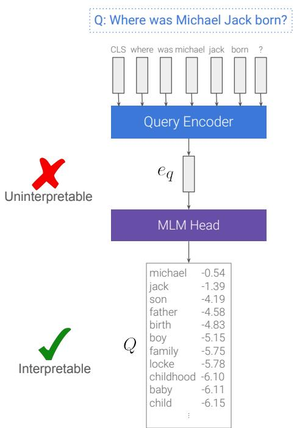
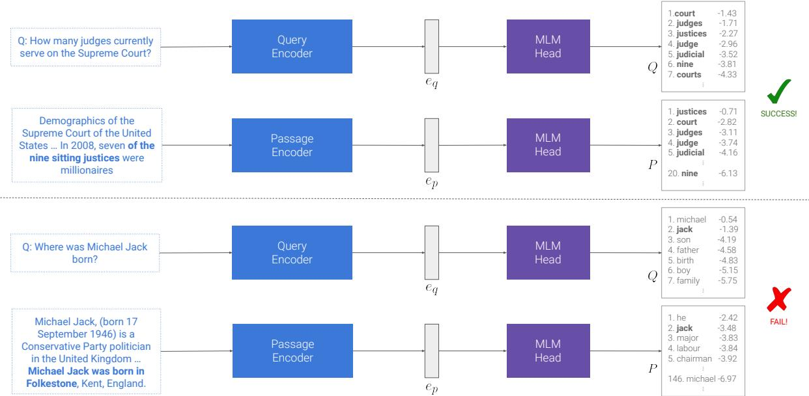
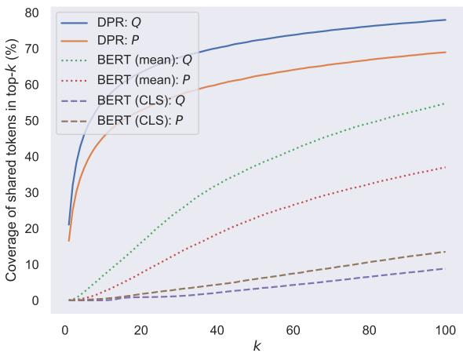
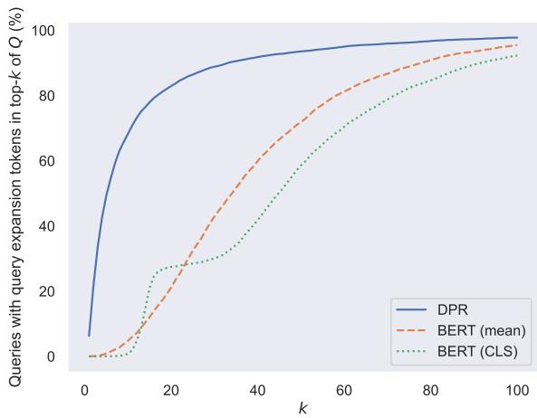
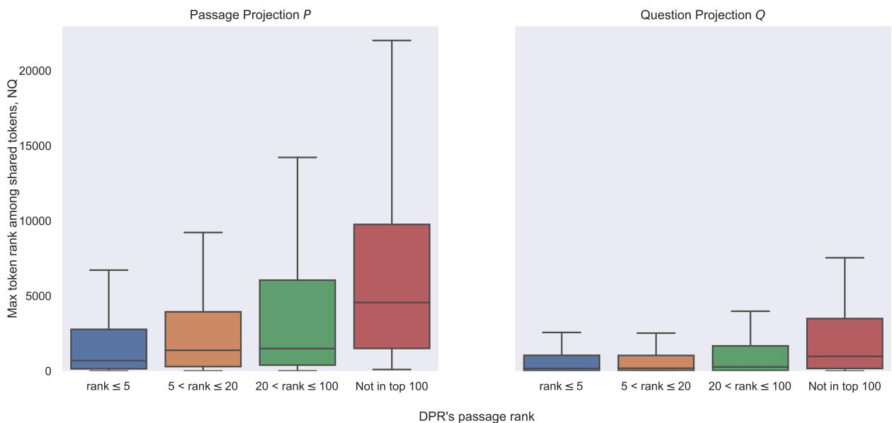
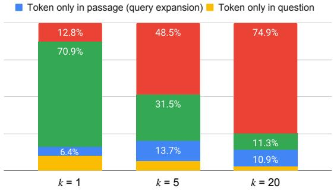
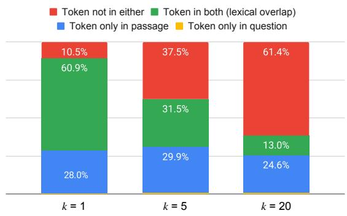
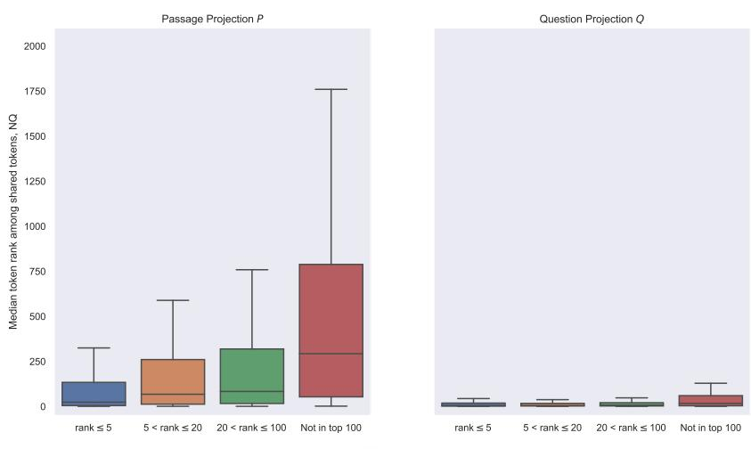
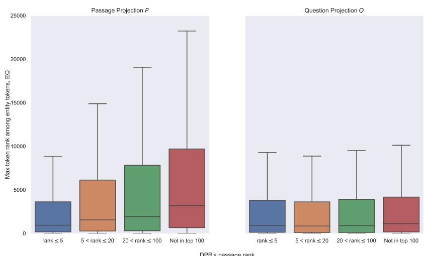
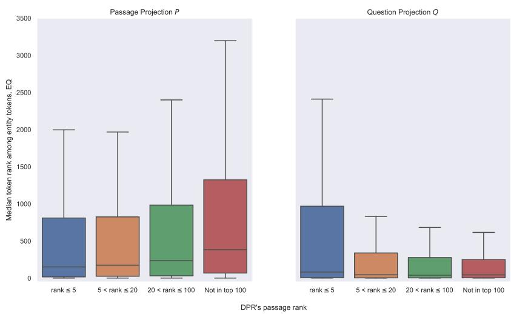

# What Are You Token About? Dense Retrieval as Distributions Over the Vocabulary

Ori Ram1 Liat Bezalel1 Adi Zicher1

Yonatan Belinkov2∗ Jonathan Berant1 Amir Globerson1

1Blavatnik School of Computer Science, Tel Aviv University 2Technion – IIT, Israel

ori.ram@cs.tau.ac.il, liatbezalel@mail.tau.ac.il, adizicher@mail.tau.ac.il

belinkov@technion.ac.il, joberant@cs.tau.ac.il, gamir@tauex.tau.ac.il

## Abstract

Dual encoders are now the dominant architecture for dense retrieval. Yet, we have little understanding of how they represent text, and why this leads to good performance. In this work, we shed light on this question via distributions over the vocabulary. We propose to interpret the vector representations produced by dual encoders by projecting them into the model’s vocabulary space. We show that the resulting projections contain rich semantic information, and draw connection between them and sparse retrieval. We find that this view can offer an explanation for some of the failure cases of dense retrievers. For example, we observe that the inability of models to handle tail entities is correlated with a tendency of the token distributions to forget some of the tokens of those entities. We leverage this insight and propose a simple way to enrich query and passage representations with lexical information at inference time, and show that this significantly improves performance compared to the original model in zero-shot settings, and specifically on the BEIR benchmark.1

## 1 Introduction

Dense retrieval models based on neural text representations have proven very effective (Karpukhin et al., 2020; Qu et al., 2021; Ram et al., 2022; Izacard et al., 2022a,b), improving upon strong traditional sparse models like BM25 (Robertson and Zaragoza, 2009). However, when applied off-theshelf (i.e., in out-of-domain settings) they often experience a severe drop in performance (Thakur et al., 2021; Sciavolino et al., 2021; Reddy et al., 2021). Moreover, the reasons for such failures are poorly understood, as the information captured in their representations remains under-investigated.

  
Figure 1: An example of our framework. We run the question “Where was Michael Jack born?” through the question encoder of DPR (Karpukhin et al., 2020), and project the question representation $e _ { q }$ to the vocabulary space using BERT’s masked language modeling head (Devlin et al., 2019). The result is a distribution over the vocabulary, Q. We apply the same procedure for passages as well. These projections enable reasoning about and improving retrieval representations.

In this work, we present a new approach for interpreting and reasoning about dense retrievers, through distributions induced by their query2 and passage representations when projected to the vocabulary space, namely distributions over their vocabulary space (Figure 1). Such distributions enable a better understanding of the representational nature of dense models and their failures, which paves the way to simple solutions that improve their performance.

  
Figure 2: A success case from Natural Questions (top) and a failure case from EntityQuestions (bottom) of DPR (Karpukhin et al., 2020), explained via projecting question and (its relevant) passage representations to the vocabulary space. Tokens in the top-20 of both question and passage vocabulary projections are marked in bold.

We begin by showing that dense retrieval representations can be projected to the vocabulary space, by feeding them through the masked language modeling (MLM) head of the pretrained model they were initialized from without any further training. This operation results in distributions over the vocabulary, which we refer to as query vocabulary projections and passage vocabulary projections.

Surprisingly, we find these projections to be highly interpretable to humans (Figure 2; Table 1). We analyze these projections and draw interesting connections between them and well-known concepts from sparse retrieval (§5). First, we highlight the high coverage of tokens shared by the query and the passage in the top-k of their projections. This obersvation suggests that the lexical overlap between query and passages plays an important role in the retrieval mechanism. Second, we show that vocabulary projections of passages they are likely to contain words that appear in queries about the given passage. Thus, they can be viewed as predicting the questions one would ask about the passage. Last, we show that the model implicitly implements query expansion (Rocchio, 1971). For example, in Figure 2 the query is “How many judges currently serve on the Supreme court?”, and the words in the query projection Q include “justices” (the common way to refer to them) and “nine” (the correct answer).

The above findings are especially surprising due to the fact that these retrieval models are fine-tuned in a contrastive fashion, and thus do not perform any prediction over the vocabulary or make any use of their language modeling head during finetuning. In addition, these representations are the result of running a deep transformer network that can implement highly complex functions. Nonetheless, model outputs remain “faithful” to the original lexical space learned during pretraining.

We further show that our approach is able to shed light on the reasons for which dense retrievers struggle with simple entity-centric questions (Sciavolino et al., 2021). Through the lens of vocabulary projections, we identify an interesting phenomenon: dense retrievers tend to “ignore” some of the tokens appearing in a given passage. This is reflected in the ranking assigned to such tokens in the passage projection. For example, the word “michael” in the bottom example of Figure 2 is ranked relatively low (even though it appears in the passage title), thereby hindering the model from retrieving this passage. We refer to this syndrome as token amnesia (§6).

We leverage this insight and suggest a simple inference-time fix that enriches dense representations with lexical information, addressing token amnesia. We show that lexical enrichment significantly improves performance compared to vanilla models on the challenging BEIR benchmark (Thakur et al., 2021) and additional datasets. For example, we boost the performance of the strong MPNet model on BEIR from 43.1% to 44.1%.

Taken together, our analyses and results demonstrate the great potential of vocabulary projections as a framework for more principled research and development of dense retrieval models.

## 2 Background

In this work, we suggest a simple framework for interpreting dense retrieves, via projecting their representations to the vocabulary space. This is done using the (masked) language modeling head of their corresponding pretrained model. We begin by providing the relevant background.

## 2.1 Masked Language Modeling

Most language models based on encoder-only transformers (Vaswani et al., 2017) are pretrained using some variant of the masked language modeling (MLM) task (Devlin et al., 2019; Liu et al., 2019; Song et al., 2020), which involves masking some input tokens, and letting the model reconstruct them.

Specifically, for an input sequence $x _ { 1 } , . . . , x _ { n }$ the transformer encoder is applied to output contextualized token representations $\boldsymbol { h } _ { 1 } , . . . , \boldsymbol { h } _ { n } \in \mathbb { R } ^ { d }$ Then, to predict the missing tokens, an MLM head is applied to their contextualized representations. The MLM head is a function that takes a vector $\pmb { h } \in \mathbb { R } ^ { d }$ as input and returns a distribution P over the model’s vocabulary , defined as follows:

$$
\mathrm { M L M - H e a d } ( h ) [ i ] = \frac { \exp ( v _ { i } ^ { \top } g ( h ) ) } { \sum _ { j \in \mathcal { V } } \exp ( v _ { j } ^ { \top } g ( h ) ) }\tag{1}
$$

$g : \mathbb { R } ^ { d }  \mathbb { R } ^ { d }$ is a potentially non-linear function (e.g., a fully connected layer followed by a Layer-Norm for BERT; Devlin et al. 2019), and $\pmb { v } _ { i } \in \mathbb { R } ^ { d }$ corresponds to the static embedding of the i-th item in the vocabulary.

## 2.2 Dense Retrieval

In dense retrieval, we are given a corpus of passages $\mathcal { C } = \{ p _ { 1 } , . . . , p _ { m } \}$ and a query q (e.g., a question or a fact to check), and we wish to compute query and passage representations $( e _ { q }$ and $e _ { p } ,$ respectively) such that similarity in this space implies high relevance of a passage to the query. Formally, let EncQ be a query encoder and EncP a passage encoder. These encoders are mappings from the input text to a vector in $\mathbb { R } ^ { d } .$ , and are obtained by fine-tuning a given LLM. Specifically, they return a pooled version of the LLM contextualized embeddings (e.g., the [CLS] embedding or mean pooling). We denote the embedding of the query and passage

vectors as follows:

$$
\begin{array} { r } { e _ { q } = \operatorname { E n c } _ { Q } ( q ) } \\ { e _ { p } = \operatorname { E n c } _ { P } ( p ) } \end{array}\tag{2}
$$

To fine-tune retrievers, a similarity measure $s ( q , p )$ is defined (e.g., the dot-product between $e _ { q }$ and $e _ { q }$ or their cosine similarity) and the model is trained in a contrastive manner to maximize retriever accuracy (Lee et al., 2019; Karpukhin et al., 2020). Importantly, in this process, the MLM head function does not change at all.

## 3 Vocabulary Projections

We now describe our framework for projecting query and passage representations of dense retrievers to the vocabulary space. Given a dense retrieval model, we utilize the MLM head of the model it was initialized from to map from encoder output representations to distributions over the vocabulary (Eq. 1). For example, for DPR (Karpukhin et al., 2020) we take BERT’s MLM head, as DPR was initialized from BERT. Given a query q, we use the query encoder $\operatorname { E n c } _ { Q }$ to obtain its representation $e _ { q }$ as in Eq. 2. Similarly, for a passage p we apply the passage encoder EncP to get $e _ { p }$ . We then apply the MLM head as in Eq. (1) to obtain the vocabulary projection:

$$
\begin{array} { r } { Q = \mathrm { M L M - H e a d } ( e _ { q } ) } \\ { P = \mathrm { M L M - H e a d } ( e _ { p } ) } \end{array}\tag{3}
$$

Note that it is not clear a-priori that Q and P will be meaningful in any way, as the encoder model has been changed since pretraining, while the MLMhead function remains fixed. Moreover, the MLM function has not been trained to decode “pooled” sequence-level representations (i.e., the results of CLS or mean pooling) during pretraining. Despite this intuition, in this work we argue that P and Q are actually highly intuitive and can facilitate a better understanding of dense retrievers.

## 4 Experiment Setup

To evaluate our framework and method quantitatively, we consider several dense retrieval models and datasets.

## 4.1 Models

We now list the retrievers used to demonstrate our framework and method. All dense models share the same architecture and size (i.e., that of BERTbase; 110M parameters), and all were trained in a contrastive fashion with in-batch negatives—the prominent paradigm for training dense models (Lee et al., 2019; Karpukhin et al., 2020; Chang et al., 2020; Qu et al., 2021; Ram et al., 2022; Izacard et al., 2022a; Ni et al., 2022; Chen et al., 2022). For the analysis, we use DPR (Karpukhin et al., 2020) and BERT (Devlin et al., 2019) as its pretrained baseline. For the results of our method, we also use S-MPNet (Reimers and Gurevych, 2019) and Spider (Ram et al., 2022). Our sparse retrieval model is BM25 (Robertson and Zaragoza, 2009). We refer the reader to App. A for more details.

<table><tr><td>Question</td><td>top-20 in Q</td><td>Passage</td><td>top-20 in P</td></tr><tr><td>where do the great lakes meet the ocean (A: the saint lawrence</td><td>lakes lake shore ocean confluence river water north canada meet east land rivers canoe sea border michigan con-</td><td>the great lakes , also called the laurent ##ian great lakes and the great lakes of north america , are a series of inter ##connected freshwater lakes located primarily in the up- per mid - east region of north america , on the canada – united states border , which connect to the atlantic ocean through the saint lawrence river . they consist of lakes</td><td>lakes lake the canada great freshwater water region ontario these central river rivers large basin core area</td></tr><tr><td>southern soul was con- sidered the sound of what independent record label (A: motown)</td><td>southern music label soul motown blues nashville vinyl sound independent1 labels country records genre dixie record released</td><td>soul music . the key sub ##gen ##res of soul include the detroit (motown) style , a rhythmic music influenced by gospel ; &quot; deep soul &quot; and &quot; southern soul &quot; , driving , energetic soul styles combining r &amp; b with southern gospel music sound ; ... which came out of the rhythm and blues style ...</td><td>soul music jazz funk blues rock musical fu- sion genre black pure classical genres pop southern melody art like rich urban</td></tr><tr><td>who sings does he love me with re ##ba (A: linda davis)</td><td>duet song love music solo re he motown me his &quot; pa album songs honey reprise bobby i peggy blues</td><td>&quot; does he love you &quot; is a song written by sandy knox and billy st ##rit ##ch , and recorded as a duet by american country music artists re ##ba mc ##ent ##ire and linda davis ...</td><td>he you him i it she his john we love paul who me does did yes why they how this</td></tr></table>

Table 1: Examples of questions and gold passages from the development set of Natural Questions, along with their 20 top-scored tokens in projections of DPR representations. Green tokens represent the lexical overlap signal (i.e., tokens that appear in both the question and the passage). Blue tokens represent query expansion (i.e., tokens that do not appear in the question but do appear in the passage).

## 4.2 Datasets

We follow prior work (Karpukhin et al., 2020; Ram et al., 2022) and consider six common open-domain question answering (QA) datasets for the evaluation of our framework: Natural Questions (NQ; Kwiatkowski et al. 2019), TriviaQA (Joshi et al., 2017), WebQuestions (WQ; Berant et al. 2013), CuratedTREC (TREC; Baudiš and Šedivý 2015), SQuAD (Rajpurkar et al., 2016) and EntityQuestions (EntityQs; Sciavolino et al. 2021). We also consider the BEIR (Thakur et al., 2021) and the MTEB (Muennighoff et al., 2022) benchmarks.

## 4.3 Implementation Details

Our code is based on the official repository of DPR (Karpukhin et al., 2020), built on Hugging Face

Transformers (Wolf et al., 2020).

For the six QA datasets, we use the Wikipedia corpus standardized by Karpukhin et al. (2020), which contains roughly 21 million passages of a hundred words each. For dense retrieval over this corpus, we apply exact search using FAISS (Johnson et al., 2021). For sparse retrieval we use Pyserini (Lin et al., 2021).

## 5 Analyzing Dense Retrievers via Vocabulary Projections

In Section 3, we introduce a new framework for interpreting representations produced by dense retrievers. Next, we describe empirical findings that shed new light on what is encoded in these representations. Via vocabulary projections, we draw connections between dense retrieval and well-known concepts from sparse retrieval like lexical overlap (§5.1), query prediction (§5.2) and query expansion (§5.3).

## 5.1 The Dominance of Lexical Overlap

Tokens shared by questions and their corresponding gold passages constitute the lexical overlap signal in retrieval, used by sparse models like BM25. We start by asking: how prominent are they in vocabulary projections? Figure 3 illustrates the coverage of these tokens in Q and P for DPR after training, compared to its initialization before training (i.e., BERT with mean or CLS pooling). In other words, for each k we check what is the percentage of shared tokens ranked in the top-k of Q and $P .$ Results suggest that after training, the model learns to rank shared tokens much higher than before. Concretely, 63% and 53% of the shared tokens appear in the top-20 tokens of $Q$ and $P$ respectively, compared to only 16% and 8% in BERT $( i . e .$ , before training). These numbers increase to 78% and 69% of the shared tokens that appear in the top-100 tokens of Q and P. In addition, we observed that for 71% of the questions, the topscored token in Q appears in both the question and the passage (App. B). These findings suggest that even for dense retrievers—which do not operate at the lexical level—lexical overlap remains a highly dominant signal.

  
Figure 3: The percentage of tokens shared by questions (from the development set of NQ) and their gold passages (i.e., the lexical overlap signal) that are covered by the top-k tokens of question vocabulary projection $Q$ and passage vocabulary projection $P$ as a function of k. Stop words and punctuation marks are excluded from this analysis.

## 5.2 Passage Encoders as Query Prediction

Our next analysis concerns the role of passage encoders. In §5.1, we show that tokens shared by the question and its gold passage are ranked high in both $Q$ and $P .$ . However, passages contain many tokens, and the shared tokens constitute only a small fraction of all tokens. We hypothesize that out of passage tokens, those that are likely to appear in relevant questions receive higher scores in P than others. If this indeed the case, it implies that passage encoders implicitly learn to predict which of the passage tokens will appear in relevant questions. To test our hypothesis, we analyze the ranks of question and passage tokens in passage vocabulary projections, P. Formally, let $\mathcal { T } _ { q }$ and $\mathcal { T } _ { p }$ be the sets of tokens in a question $q$ and its gold passage $p ,$ respectively. Table 2 shows the token-level mean reciprocal rank (MRR) of these sets in $P .$ . We observe that tokens shared by $q$ and $p$ (i.e., $\mathcal { T } _ { q } \cap \mathcal { T } _ { p } )$ are ranked significantly higher than other passage tokens $( i . e . , \tau _ { p } )$ . For example, in DPR the MRR of shared tokens is 26.1, while that of other passage tokens is only 3.0. In addition, the MRR of shared tokens in BERT is only 1.4. These findings support our claim that tokens that appear in relevant questions are ranked higher than others, and that this behavior is acquired during fine-tuning.

<table><tr><td rowspan="2" colspan="2"></td><td colspan="2">Token-Level MRR in  $P$ </td></tr><tr><td>DPR</td><td>BERT (mean)</td></tr><tr><td>Passage tokens</td><td> $\mathcal { T } _ { p }$ </td><td>3.0</td><td>0.5</td></tr><tr><td>Question tokens</td><td> $\mathcal { T } _ { q }$ </td><td>17.3</td><td>1.0</td></tr><tr><td>Shared tokens</td><td> $\dot { T _ { q } } \cap \mathcal { T } _ { p }$ </td><td>26.1</td><td>1.4</td></tr></table>

Table 2: An analysis of token-level MRR (in %) in passage vocabulary projections $P$ on the development set of NQ. For a question $q$ and its gold positive passage $p ,$ $\mathcal { T } _ { q }$ and $\mathcal { T } _ { p }$ are the corresponding sets of tokens, excluding stop words and punctuations. For a set $\tau$ , we report $\begin{array} { r } { \frac { 1 } { | \mathcal { T } | } \sum _ { t \in \mathcal { T } } \frac { 1 } { \mathrm { r a n k } _ { P } ( t ) } } \end{array}$

## 5.3 Query Encoders Implement Query Expansion

To overcome the “vocabulary mismatch” problem (i.e., when question-document pairs are semantically relevant, but lack significant lexical overlap), query expansion methods have been studied extensively (Rocchio, 1971; Voorhees, 1994; Zhao and Callan, 2012; Mao et al., 2021). The main idea is to expand the query with additional terms that will better guide the retrieval process. We define a token as a query expansion if it does not appear in the query itself but does appear in the query projection Q, and also in the gold passage of that query $p$ (excluding stop words and punctuation marks). Figure 4 shows the percentage of queries with at least one query expansion token in the top-k as a function of k for DPR and the BERT baseline (i.e., before DPR training). We observe that after training, the model promotes query expansion tokens to higher ranks than before. In addition, we found that almost 14% of the tokens in the top-5 of Q are query expansion tokens (cf. App B).

We note that there are two interesting classes of query expansion tokens: (1) synonyms of question tokens, as well as tokens that share similar semantics with tokens in q (e.g., “michigan” in the first example of Table 1). (2) “answer tokens” which contain the answer to the query (e.g., “motown” in the second example of Table 1). The presence of such tokens may suggest the model already “knows” the answer to the given question, either from pretraining or from similar questions seen during training (Lewis et al., 2021).

  
Figure 4: The percentage of questions from the (entire) development set of NQ with at least one query expansion token (i.e., a token that appears in the question’s gold passage but not in the question itself) in the top-k of the question vocabulary projection Q, as a function of k. Stop words and punctuation marks do not count as query expansion tokens.

Given these findings, we conjecture that the model “uses” these query expansion tokens to introduce a semantic signal to the retrieval process.

## 6 Token Amnesia

The analysis in Section 5 shows that vocabulary projections of passages (i.e., P) predict which of the input tokens are likely to appear in relevant questions. However, in some cases these predictions utterly fail. For example, in Figure 2 the token “michael” is missing from the top-k of the passage projection P. We refer to such cases as token amnesia. Here we ask, do these failure in query prediction hurt retrieval?

Next, we demonstrate that token amnesia indeed correlates with well-known failures of dense retrievers (§6.1). To overcome this issue, we suggest a lexical enrichment procedure for dense representations (§6.2) and demonstrate its effectiveness on downstream retrieval performance (§6.3).

## 6.1 Token Amnesia is Correlated with Retriever Failures

Dense retrievers have shown difficulties in out-ofdomain settings (Sciavolino et al., 2021; Thakur et al., 2021), where even sparse models like BM25 significantly outperform them. We now offer an intuitive explanation to these failures via token amnesia. We focus on setups where BM25 outperforms dense models and ask: why do dense retrieversfail to model lexical overlap signals? To answer this question, we consider subsets of NQ and EntityQs where BM25 is able to retrieve the correct passage in its top-5 results. We focus on these subsets as they contain significant lexical overlap between questions and passages (by definition, as BM25 successfully retrieved the correct passage). Let $q$ be a question and $p$ the passage retrieved by BM25 for $q ,$ and $Q$ and $P$ be their corresponding vocabulary projections for some dense retriever. Also, let $\tau \subseteq \nu$ be the set of tokens that appear in both $q$ and $p$ (excluding stop words). Figure 5 shows the maximum (i.e., lowest) rank of tokens from $\tau$ in the distributions P (left) and $Q$ (right) as a function of whether DPR is able to retrieve this passage (i.e., the rank of $p$ in the retrieval results of DPR). Indeed, the median max-rank over questions for which DPR succeeds to fetch $p$ in its top-5 results (blue box) is much lower than that of questions for which DPR fails to retrieve the passage (red box). As expected (due to the fact that questions contain less tokens than passages), the ranks of shared tokens in question projections $Q$ are much higher. However, the trend is present in Q as well. Additional figures (for EntityQs; as well as median ranks instead of max ranks) are given in App. C.

Overall, these findings indicate a correlation between token amnesia and failures of DPR. Next, we introduce a method to address token amnesia in dense retrievers, via lexical enrichment of dense representations.

## 6.2 Method: Lexical Enrichment

As suggested by the analysis in §6.1, dense retrievers have the tendency to ignore some of their input tokens. We now leverage this insight to improve these models. We refer to our method as lexical enrichment (LE) because it enriches text encodings with specific lexical items.

Intuitively, a natural remedy to the “token amnesia” problem is to change the retriever encoding such that it does include these tokens. For example, assume the query $q$ is “Where was Michael Jack born?” and the corresponding passage p contains the text “Michael Jack was born in Folkestone, England”. According to Figure 2, the token “michael” is ranked relatively low in $P _ { \mathrm { : } }$ , and DPR fails to retrieve the correct passage $p .$ We would like to modify the passage representation $e _ { p }$ and get an enriched version $e _ { p } ^ { \prime }$ that does have this token in its top-k projected tokens, while keeping most of the other projected tokens intact. This is our goal in LE, and we next describe the approach. We focus on enrichment of passage representations, as query enrichment works similarly. We first explain how to enrich representations with a single token, and then extend the process to multiple tokens.

  
Figure 5: An analysis of token amnesia. We consider questions for which BM25 retrieves a correct passage $( i . e .$ a passage that contains the answer) in its top-5, and analyze what ranks were assigned to tokens shared by the question and the passage in the passage vocabulary projection $P$ (left) and question vocabulary projection $Q$ (right). We plot the maximal token rank as a function of the rank assigned to the correct passage by DPR.

Single-Token Enrichment Assume we want to enrich a passage representation $e _ { p }$ with a token t $( e . g . , t = " m i c h a e l ^ { , }$ in the above example). If there were no other words in the passage, we’d simply want to find an embedding such that feeding it into the MLM would produce t as the top token.3 We refer to this embedding as the single-token enrichment of $t ,$ denote it by $\mathbf { \delta } _ { s t }$ and define it as:4

$$
\pmb { s } _ { t } = \mathop { \mathrm { a r g m a x } } _ { \hat { \pmb { s } } } \ \log \mathrm { M L M - H e a d } ( \hat { \pmb { s } } ) [ t ]\tag{4}
$$

In order to approximately solve the optimization problem in $\operatorname { E q . }$ . 4 for each t in the vocabulary, we use Adam with a learning rate of $0 . 0 1 . ^ { 5 }$ We stop when a (cross-entropy) loss threshold of 0.1 is reached for all tokens. We then apply whitening (Jung et al., 2022), which was proven effective for dense retrieval.

Multi-Token Enrichment Now suppose we have an input x (either a question or a passage) and we’d like to enrich its representation with its tokens $\boldsymbol { x } = [ x _ { 1 } , . . , x _ { n } ]$ , such that rare tokens are given higher weights than frequent ones (as in BM25). Then, we simply take its original representation $e _ { x }$ and add to it a weighted sum of the single-token enrichments (Eq. 4). Namely, we define:

$$
\begin{array} { c } { { \displaystyle e _ { x } ^ { \mathrm { l e x } } = \frac { 1 } { n } \sum _ { i = 1 } ^ { n } w _ { x _ { i } } \pmb { s } _ { x _ { i } } } } \\ { { \displaystyle e _ { x } ^ { \prime } = e _ { x } + \lambda \cdot \frac { e _ { x } ^ { \mathrm { l e x } } } { | | e _ { x } ^ { \mathrm { l e x } } | | } } } \end{array}\tag{5}
$$

Here $\lambda$ is a hyper-parameter chosen via cross validation. We use the inverse document frequency (Sparck Jones, 1972) of tokens as their weights: $w _ { x _ { i } } = \mathrm { I D F } ( x _ { i } )$ . The relevance score is then defined on the enriched representations.

<table><tr><td rowspan="2">Model</td><td rowspan="2">λ</td><td colspan="2">BEIR</td><td>EntityQs</td><td>TriviaQA</td><td>WQ</td><td>TREC</td><td>SQuAD</td></tr><tr><td colspan="2">nDCG@10</td><td colspan="5">Top-20 retrieval accuracy</td></tr><tr><td>BM25</td><td></td><td>42.9</td><td>42.3</td><td>71.4</td><td>76.4</td><td>62.4</td><td>81.1</td><td>71.2</td></tr><tr><td>BM25 (BERT/MPNet Tokens)</td><td>-</td><td>41.6</td><td>41.7</td><td>66.2</td><td>75.8</td><td>62.1</td><td>79.3</td><td>70.0</td></tr><tr><td>DPR</td><td></td><td>21.4</td><td>22.4</td><td>49.7</td><td>69.0</td><td>68.8</td><td>85.9</td><td>48.9</td></tr><tr><td>DPR + LE</td><td>5.0</td><td>26.4</td><td>27.6</td><td>65.4</td><td>75.3</td><td>73.2</td><td>87.9</td><td>59.7</td></tr><tr><td>S-MPNet</td><td>一</td><td>43.1</td><td>44.6</td><td>57.6</td><td>77.6</td><td>73.9</td><td>90.2</td><td>65.5</td></tr><tr><td> $\mathbf { S } \mathbf { - } \mathbf { M } \mathbf { P } \mathbf { N e t + L E }$ </td><td>0.5</td><td>44.1</td><td>45.7</td><td>68.5</td><td>78.9</td><td>74.5</td><td>90.4</td><td>69.0</td></tr><tr><td>Spider</td><td>-</td><td>27.4</td><td>26.4</td><td>66.3</td><td>75.8</td><td>65.9</td><td>82.6</td><td>61.0</td></tr><tr><td>Spider + LE</td><td>3.0</td><td>29.5</td><td>28.8</td><td>68.9</td><td>76.3</td><td>70.2</td><td>83.4</td><td>62.8</td></tr></table>

Table 3: Retrieval results on BEIR, the retrieval cluster of MTEB and five open-domain QA datasets. LE stands for lexical enrichment (our method; §6.2), that enriches query and passage representation with lexical information. λ is defined in Eq. 5. BM25 (BERT Vocabulary) refers to a model that operates over tokens from BERT’s vocabulary, rather than words. For each model and dataset, we compare the enriched (LE) model with the original, and mark in bold the better one from the two. We underline the best overall model for each dataset. Results for each of the BEIR datasets are given in Table 9. Top- 1, 5, 100 accuracy results are given in Tables 6, 7 & 8.

## 6.3 Results

Our experiments demonstrate the effectiveness of our method for multiple models, especially in zeroshot settings. Table 3 shows the results of several models with and without our enrichment method, LE. Additional results are given in App. D. The results demonstrate the effectiveness of LE when added to all baseline models. Importantly, our method improves the performance of S-MPNet— the best base-sized model on the MTEB benchmark to date (Muennighoff et al., 2022)—on MTEB and BEIR by 1.1% and 1.0%, respectively. When considering EntityQs (on which dense retrievers are known to struggle), we observe significant gains across all models, and S-MPNet and Spider obtain higher accuracy than BM25 that operates on the same textual units (i.e., BM25 with BERT vocabulary). This finding indicates that they are able to integrate semantic information (from the original representation) with lexical signals. Yet, vanilla BM25 is still better than LE models on EntityQs and SQuAD, which prompts further work on how to incorporate lexical signals in dense retrieval. Overall, it is evident that LE improves retrieval accuracy compared to baseline models for all models and datasets (i.e., zero-shot setting).

## 6.4 Ablation Study

We carry an ablation study to test our design choices from §6.2. We evaluate four elements of our method: (1) The use of IDF to highlight rare tokens, (2) Our approach for deriving single-token representations, (3) The use of whitening, and (4) The use of unit normalization.

IDF In our method, we create lexical representations of questions and passages, $e _ { x } ^ { \mathrm { l e x } }$ . These lexical representations are the average of token embeddings, each multiplied by its token’s IDF. We validate that IDF is indeed necessary – Table 4 demonstrates that setting $w _ { x _ { i } } = 1$ in Eq. 5 leads to a significant degradation in performance on EntityQs. For example, top-20 retrieval accuracy drops from 65.2% to 57.7%.

Single-Token Enrichment Eq. 4 defines our single-token enrichment: for each item in the vocabulary $v \in \mathcal { V } ,$ , we find an embedding which gives a one-hot vector peaked at v when fed to the MLM head. We confirm that this is necessary by replacing Eq. 4 with the static embeddings of the pretrained model (e.g., BERT in the case of DPR). We find that our approach significantly improves over BERT’s embeddings on EntityQs (e.g., the margin in top-20 accuracy is 3.4%).

Whitening & Normalization Last, we experiment with removing the whitening and $\ell _ { 2 }$ normalization. It is evident that they are both necessary, as removing either of them causes a dramatic drop in performance (3.8% and 2.2% in top-20 accuracy on EntityQs, respectively).

## 7 Related Work

Projecting representations and model parameters to the vocabulary space has been studied previously mainly in the context of language models. The approach was initially explored by nostalgebraist (2020). Geva et al. (2021) showed that feedforward layers in transformers can be regarded as key-value memories, where the value vectors induce distributions over the vocabulary. Geva et al. (2022) view the token representations themselves as inducing such distributions, with feed-forward layers “updating” them. Dar et al. (2022) suggest to project all transformer parameters to the vocabulary space. Dense retrieval models, however, do not have any language modeling objective during fine-tuning, yet we show that their representations can still be projected to the vocabulary.

<table><tr><td rowspan="2">Method</td><td colspan="4">NQ (Dev Set)</td><td colspan="4">EntityQs (Dev Set)</td></tr><tr><td>Top-1</td><td>Top-5</td><td>Top-20</td><td>Top-100</td><td>Top-1</td><td>Top-5</td><td>Top-20</td><td>Top-100</td></tr><tr><td>DPR</td><td>44.9</td><td>66.8</td><td>78.1</td><td>85.0</td><td>24.0</td><td>38.4</td><td>50.4</td><td>63.5</td></tr><tr><td>DPR + LE</td><td>44.4</td><td>67.5</td><td>79.4</td><td>86.0</td><td>38.3</td><td>54.0</td><td>65.2</td><td>76.1</td></tr><tr><td>No IDF</td><td>45.1</td><td>67.3</td><td>78.5</td><td>85.4</td><td>32.0</td><td>46.4</td><td>57.7</td><td>69.6</td></tr><tr><td>BERT embedding matrix</td><td>44.8</td><td>67.6</td><td>79.1</td><td>85.6</td><td>34.6</td><td>50.3</td><td>61.8</td><td>72.8</td></tr><tr><td>No whitening</td><td>44.1</td><td>66.3</td><td>78.7</td><td>85.2</td><td>34.6</td><td>49.7</td><td>61.4</td><td>72.9</td></tr><tr><td>No  $\ell _ { 2 }$  normalization</td><td>43.9</td><td>66.8</td><td>79.2</td><td>86.0</td><td>35.5</td><td>51.3</td><td>63.0</td><td>74.6</td></tr></table>

Table 4: Ablation study on the development set of Natrual Questions and Entity Questions. DPR + LE is our lexical enrichment method applied on DPR. No IDF removes the IDF weights in Eq. 5 (i.e., mean pooling). BERT embedding matrix replaces single-token enrichment $\mathbf { \boldsymbol { s } } _ { t }$ as defined in Eq. 4 with the static token embeddings of BERT, ${ \pmb v } _ { t } \left( \mathrm { E q . ~ } 1 \right)$ . No whitening removes whitening transformation. No $\ell _ { 2 }$ normalization removes the normalization of $e _ { x } ^ { \mathrm { l e x } }$

Despite the wide success of dense retrievers recently, interpreting their representations remains under-explored. MacAvaney et al. (2022) analyze neural retrieval models (not only dense retrievers) via diagnostic probes, testing characteristics like sensitivity to paraphrases, styles and factuality. Adolphs et al. (2022) decode the query representations of neural retrievers using a T5 decoder, and show how to “move” in representation space to decode better queries for retrieval.

Language models (and specifically MLMs) have been used for sparse retrieval in the context of termweighting and lexical expansion. For example, Bai et al. (2020) and Formal et al. (2021) learn such functions over BERT’s vocabulary space. We differ by showing that dense retrievers implicitly operate in that space as well. Thus, these approaches may prove effective for dense models as well. While we focus in this work on dense retrievers based on encoder-only models, our framework is easily extendable for retrievers based on autoregressive decoder-only (i.e., left-to-right) models like GPT (Radford et al., 2019; Brown et al., 2020), e.g., Neelakantan et al. (2022) and Muennighoff (2022).

## 8 Conclusion

In this work, we explore projecting query and passage representations obtained by dense retrieval to the vocabulary space. We show that these projections facilitate a better understanding of the mechanisms underlying dense retrieval, as well as their failures. We also demonstrate how projections can help improve these models. This understanding is likely to help in improving retrievers, as our lexical enrichment approach demonstrates.

## Limitations

We point to several limitations of our work. First, our work considers a popular family of models referred to as “dense retrievers”, but other approaches for retrieval include sparse retrievers (Robertson and Zaragoza, 2009; Bai et al., 2020; Formal et al., 2021), generative retrievers (Tay et al., 2022; Bevilacqua et al., 2022), late-interaction models (Khattab and Zaharia, 2020), inter alia. While our work draws interesting connections between dense and sparse retrieval, our main focus is on understanding and improving dense models. Second, all three dense models we analyze are bidirectional and were trained in a contrastive fashion. While most dense retrievers indeed satisfy these properties, there are works that suggested other approaches, both in terms of other architectures (Muennighoff, 2022; Neelakantan et al., 2022; Ni et al., 2022) and other training frameworks (Lewis et al., 2020; Izacard et al., 2022b). Last, while our work introduces new ways to interpret and analyze dense retrieval models, we believe our work is the tip of the iceberg, and there is still much work to be done in order to gain a full understanding of these models.

## Ethics Statement

Retrieval systems have the potential to mitigate serious problems caused by language models, like factual inaccuracies. However, retrieval failures may lead to undesirable behavior of downstream models, like wrong answers in QA or incorrect generations for other tasks. Also, since retrieval models are based on pretrained language models, they may suffer from similar biases.

## Acknowledgements

We thank Ori Yoran, Yoav Levine, Yuval Kirstain, Mor Geva and the anonymous reviewers for their valuable feedback. This project was funded by the European Research Council (ERC) under the European Unions Horizon 2020 research and innovation programme (grant ERC HOLI 819080), the Blavatnik Fund, the Alon Scholarship, the Yandex Initiative for Machine Learning, Intel Corporation, ISRAEL SCIENCE FOUNDATION (grant No. 448/20), Open Philanthropy, and an Azrieli Foundation Early Career Faculty Fellowship.

## References

Leonard Adolphs, Michelle Chen Huebscher, Christian Buck, Sertan Girgin, Olivier Bachem, Massimiliano Ciaramita, and Thomas Hofmann. 2022. Decoding a neural retriever’s latent space for query suggestion.

Yang Bai, Xiaoguang Li, Gang Wang, Chaoliang Zhang, Lifeng Shang, Jun Xu, Zhaowei Wang, Fangshan Wang, and Qun Liu. 2020. SparTerm: Learning termbased sparse representation for fast text retrieval.

Petr Baudiš and Jan Šedivý. 2015. Modeling of the question answering task in the YodaQA system. In Proceedings ofthe 6th International Conference on Experimental IR Meets Multilinguality, Multimodality, and Interaction - Volume 9283, CLEF’15, page 222–228, Berlin, Heidelberg. Springer-Verlag.

Jonathan Berant, Andrew Chou, Roy Frostig, and Percy Liang. 2013. Semantic parsing on Freebase from question-answer pairs. In Proceedings of the 2013 Conference on Empirical Methods in Natural Language Processing, pages 1533–1544, Seattle, Washington, USA. Association for Computational Linguistics.

Michele Bevilacqua, Giuseppe Ottaviano, Patrick Lewis, Wen-tau Yih, Sebastian Riedel, and Fabio Petroni. 2022. Autoregressive search engines: Generating substrings as document identifiers.

Tom B. Brown, Benjamin Mann, Nick Ryder, Melanie Subbiah, Jared Kaplan, Prafulla Dhariwal, Arvind Neelakantan, Pranav Shyam, Girish Sastry, Amanda

Askell, Sandhini Agarwal, Ariel Herbert-Voss, Gretchen Krueger, Tom Henighan, Rewon Child, Aditya Ramesh, Daniel M. Ziegler, Jeffrey Wu, Clemens Winter, Christopher Hesse, Mark Chen, Eric Sigler, Mateusz Litwin, Scott Gray, Benjamin Chess, Jack Clark, Christopher Berner, Sam McCandlish, Alec Radford, Ilya Sutskever, and Dario Amodei. 2020. Language models are few-shot learners. In Advances in Neural Information Processing Systems.

Wei-Cheng Chang, Felix X. Yu, Yin-Wen Chang, Yiming Yang, and Sanjiv Kumar. 2020. Pre-training tasks for embedding-based large-scale retrieval. In 8th International Conference on Learning Representations, ICLR 2020.

Xilun Chen, Kushal Lakhotia, Barlas Oguz, Anchit˘ Gupta, Patrick Lewis, Stan Peshterliev, Yashar Mehdad, Sonal Gupta, and Wen-tau Yih. 2022. Salient phrase aware dense retrieval: Can a dense retriever imitate a sparse one?

Guy Dar, Mor Geva, Ankit Gupta, and Jonathan Berant. 2022. Analyzing transformers in embedding space.

Jacob Devlin, Ming-Wei Chang, Kenton Lee, and Kristina Toutanova. 2019. BERT: Pre-training of deep bidirectional transformers for language understanding. In Proceedings ofthe 2019 Conference of the North American Chapter ofthe Associationfor Computational Linguistics: Human Language Technologies, Volume 1 (Long and Short Papers), pages 4171–4186, Minneapolis, Minnesota. Association for Computational Linguistics.

Thibault Formal, Benjamin Piwowarski, and Stéphane Clinchant. 2021. SPLADE: Sparse lexical and expansion model for first stage ranking. In Proceedings ofthe 44th International ACM SIGIR Conference on Research and Development in Information Retrieval, SIGIR ’21, page 2288–2292, New York, NY, USA. Association for Computing Machinery.

Mor Geva, Avi Caciularu, Kevin Ro Wang, and Yoav Goldberg. 2022. Transformer feed-forward layers build predictions by promoting concepts in the vocabulary space.

Mor Geva, Roei Schuster, Jonathan Berant, and Omer Levy. 2021. Transformer feed-forward layers are keyvalue memories. In Proceedings ofthe 2021 Conference on Empirical Methods in Natural Language Processing, pages 5484–5495, Online and Punta Cana, Dominican Republic. Association for Computational Linguistics.

Gautier Izacard, Mathilde Caron, Lucas Hosseini, Sebastian Riedel, Piotr Bojanowski, Armand Joulin, and Edouard Grave. 2022a. Unsupervised dense information retrieval with contrastive learning. Transactions on Machine Learning Research.

Gautier Izacard, Patrick Lewis, Maria Lomeli, Lucas Hosseini, Fabio Petroni, Timo Schick, Jane Dwivedi-Yu, Armand Joulin, Sebastian Riedel, and Edouard

Grave. 2022b. Atlas: Few-shot learning with retrieval augmented language models.

Jeff Johnson, Matthijs Douze, and Hervé Jégou. 2021. Billion-scale similarity search with GPUs. IEEE Transactions on Big Data, 7(3):535–547.

Mandar Joshi, Eunsol Choi, Daniel Weld, and Luke Zettlemoyer. 2017. TriviaQA: A large scale distantly supervised challenge dataset for reading comprehension. In Proceedings ofthe 55th Annual Meeting of the Associationfor Computational Linguistics (Volume 1: Long Papers), pages 1601–1611, Vancouver, Canada. Association for Computational Linguistics.

Euna Jung, Jungwon Park, Jaekeol Choi, Sungyoon Kim, and Wonjong Rhee. 2022. Isotropic representation can improve dense retrieval.

Vladimir Karpukhin, Barlas Oguz, Sewon Min, Patrick Lewis, Ledell Wu, Sergey Edunov, Danqi Chen, and Wen-tau Yih. 2020. Dense passage retrieval for opendomain question answering. In Proceedings of the 2020 Conference on Empirical Methods in Natural Language Processing (EMNLP), pages 6769–6781, Online. Association for Computational Linguistics.

Omar Khattab and Matei Zaharia. 2020. ColBERT: Efficient and effective passage search via contextualized late interaction over BERT. In Proceedings of the 43rd International ACM SIGIR Conference on Research and Development in Information Retrieval, SIGIR ’20, page 39–48, New York, NY, USA. Association for Computing Machinery.

Tom Kwiatkowski, Jennimaria Palomaki, Olivia Redfield, Michael Collins, Ankur Parikh, Chris Alberti, Danielle Epstein, Illia Polosukhin, Jacob Devlin, Kenton Lee, Kristina Toutanova, Llion Jones, Matthew Kelcey, Ming-Wei Chang, Andrew M. Dai, Jakob Uszkoreit, Quoc Le, and Slav Petrov. 2019. Natural questions: A benchmark for question answering research. Transactions ofthe Associationfor Computational Linguistics, 7:452–466.

Kenton Lee, Ming-Wei Chang, and Kristina Toutanova. 2019. Latent retrieval for weakly supervised open domain question answering. In Proceedings of the 57th Annual Meeting ofthe Associationfor Computational Linguistics, pages 6086–6096, Florence, Italy. Association for Computational Linguistics.

Patrick Lewis, Ethan Perez, Aleksandra Piktus, Fabio Petroni, Vladimir Karpukhin, Naman Goyal, Heinrich Küttler, Mike Lewis, Wen-tau Yih, Tim Rocktäschel, Sebastian Riedel, and Douwe Kiela. 2020. Retrieval-augmented generation for knowledgeintensive nlp tasks. In Advances in Neural Information Processing Systems, volume 33, pages 9459– 9474. Curran Associates, Inc.

Patrick Lewis, Pontus Stenetorp, and Sebastian Riedel. 2021. Question and answer test-train overlap in opendomain question answering datasets. In Proceedings of the 16th Conference of the European Chapter of

the Associationfor Computational Linguistics: Main Volume, pages 1000–1008, Online. Association for Computational Linguistics.

Jimmy Lin, Xueguang Ma, Sheng-Chieh Lin, Jheng-Hong Yang, Ronak Pradeep, and Rodrigo Nogueira. 2021. Pyserini: A python toolkit for reproducible information retrieval research with sparse and dense representations. In Proceedings of the 44th International ACM SIGIR Conference on Research and Development in Information Retrieval, SIGIR ’21, page 2356–2362, New York, NY, USA. Association for Computing Machinery.

Yinhan Liu, Myle Ott, Naman Goyal, Jingfei Du, Mandar Joshi, Danqi Chen, Omer Levy, Mike Lewis, Luke Zettlemoyer, and Veselin Stoyanov. 2019. RoBERTa: A robustly optimized bert pretraining approach.

Sean MacAvaney, Sergey Feldman, Nazli Goharian, Doug Downey, and Arman Cohan. 2022. ABNIRML: Analyzing the behavior of neural IR models. Transactions of the Association for Computational Linguistics, 10:224–239.

Yuning Mao, Pengcheng He, Xiaodong Liu, Yelong Shen, Jianfeng Gao, Jiawei Han, and Weizhu Chen. 2021. Generation-augmented retrieval for opendomain question answering. In Proceedings of the 59th Annual Meeting ofthe Associationfor Computational Linguistics and the 11th International Joint Conference on Natural Language Processing (Volume 1: Long Papers), pages 4089–4100, Online. Association for Computational Linguistics.

Niklas Muennighoff. 2022. SGPT: GPT sentence embeddings for semantic search.

Niklas Muennighoff, Nouamane Tazi, Loïc Magne, and Nils Reimers. 2022. MTEB: Massive text embedding benchmark.

Arvind Neelakantan, Tao Xu, Raul Puri, Alec Radford, Jesse Michael Han, Jerry Tworek, Qiming Yuan, Nikolas Tezak, Jong Wook Kim, Chris Hallacy, Johannes Heidecke, Pranav Shyam, Boris Power, Tyna Eloundou Nekoul, Girish Sastry, Gretchen Krueger, David Schnurr, Felipe Petroski Such, Kenny Hsu, Madeleine Thompson, Tabarak Khan, Toki Sherbakov, Joanne Jang, Peter Welinder, and Lilian Weng. 2022. Text and code embeddings by contrastive pre-training.

Jianmo Ni, Chen Qu, Jing Lu, Zhuyun Dai, Gustavo Hernández Ábrego, Ji Ma, Vincent Y. Zhao, Yi Luan, Keith B. Hall, Ming-Wei Chang, and Yinfei Yang. 2022. Large dual encoders are generalizable retrievers.

nostalgebraist. 2020. interpreting gpt: the logit lens.

Yingqi Qu, Yuchen Ding, Jing Liu, Kai Liu, Ruiyang Ren, Wayne Xin Zhao, Daxiang Dong, Hua Wu, and

Haifeng Wang. 2021. RocketQA: An optimized training approach to dense passage retrieval for opendomain question answering. In Proceedings of the 2021 Conference of the North American Chapter of the Associationfor Computational Linguistics: Human Language Technologies, pages 5835–5847, Online. Association for Computational Linguistics.

Alec Radford, Jeff Wu, Rewon Child, David Luan, Dario Amodei, and Ilya Sutskever. 2019. Language models are unsupervised multitask learners.

Pranav Rajpurkar, Jian Zhang, Konstantin Lopyrev, and Percy Liang. 2016. SQuAD: 100,000+ questions for machine comprehension of text. In Proceedings of the 2016 Conference on Empirical Methods in Natural Language Processing, pages 2383–2392, Austin, Texas. Association for Computational Linguistics.

Ori Ram, Gal Shachaf, Omer Levy, Jonathan Berant, and Amir Globerson. 2022. Learning to retrieve passages without supervision. In Proceedings of the 2022 Conference of the North American Chapter of the Associationfor Computational Linguistics: Human Language Technologies, pages 2687–2700, Seattle, United States. Association for Computational Linguistics.

Revanth Gangi Reddy, Vikas Yadav, Md Arafat Sultan, Martin Franz, Vittorio Castelli, Heng Ji, and Avirup Sil. 2021. Towards robust neural retrieval models with synthetic pre-training.

Nils Reimers and Iryna Gurevych. 2019. Sentence-BERT: Sentence embeddings using Siamese BERTnetworks. In Proceedings ofthe 2019 Conference on Empirical Methods in Natural Language Processing and the 9th International Joint Conference on Natural Language Processing (EMNLP-IJCNLP), pages 3982–3992, Hong Kong, China. Association for Computational Linguistics.

Stephen Robertson and Hugo Zaragoza. 2009. The probabilistic relevance framework: BM25 and beyond. Found. Trends Inf. Retr., 3(4):333–389.

Joseph Rocchio. 1971. Relevance feedback in information retrieval. The SMART retrieval system: experiments in automatic document processing, pages 313–323.

Christopher Sciavolino, Zexuan Zhong, Jinhyuk Lee, and Danqi Chen. 2021. Simple entity-centric questions challenge dense retrievers. In Proceedings of the 2021 Conference on Empirical Methods in Natural Language Processing, pages 6138–6148, Online and Punta Cana, Dominican Republic. Association for Computational Linguistics.

Kaitao Song, Xu Tan, Tao Qin, Jianfeng Lu, and Tie-Yan Liu. 2020. MPNet: Masked and permuted pretraining for language understanding. In Advances in Neural Information Processing Systems, volume 33, pages 16857–16867. Curran Associates, Inc.

Karen Sparck Jones. 1972. A statistical interpretation of term specificity and its application in retrieval. In Journal ofDocumentation, volume 28 no. 1, pages 11–21.

Yi Tay, Vinh Q. Tran, Mostafa Dehghani, Jianmo Ni, Dara Bahri, Harsh Mehta, Zhen Qin, Kai Hui, Zhe Zhao, Jai Gupta, Tal Schuster, William W. Cohen, and Donald Metzler. 2022. Transformer memory as a differentiable search index. In Advances in Neural Information Processing Systems.

Nandan Thakur, Nils Reimers, Andreas Rücklé, Abhishek Srivastava, and Iryna Gurevych. 2021. BEIR: A heterogeneous benchmark for zero-shot evaluation of information retrieval models. In Proceedings of the Neural Information Processing Systems Track on Datasets and Benchmarks, volume 1.

Ashish Vaswani, Noam Shazeer, Niki Parmar, Jakob Uszkoreit, Llion Jones, Aidan N Gomez, Ł ukasz Kaiser, and Illia Polosukhin. 2017. Attention is all you need. In Advances in Neural Information Processing Systems 30, pages 5998–6008.

Ellen M. Voorhees. 1994. Query expansion using lexical-semantic relations. In Proceedings of the 17th Annual International ACM SIGIR Conference on Research and Development in Information Retrieval, SIGIR ’94, page 61–69, Berlin, Heidelberg. Springer-Verlag.

Thomas Wolf, Lysandre Debut, Victor Sanh, Julien Chaumond, Clement Delangue, Anthony Moi, Pierric Cistac, Tim Rault, Remi Louf, Morgan Funtowicz, Joe Davison, Sam Shleifer, Patrick von Platen, Clara Ma, Yacine Jernite, Julien Plu, Canwen Xu, Teven Le Scao, Sylvain Gugger, Mariama Drame, Quentin Lhoest, and Alexander Rush. 2020. Transformers: State-of-the-art natural language processing. In Proceedings ofthe 2020 Conference on Empirical Methods in Natural Language Processing: System Demonstrations, pages 38–45, Online. Association for Computational Linguistics.

Le Zhao and Jamie Callan. 2012. Automatic term mismatch diagnosis for selective query expansion. In Proceedings of the 35th International ACM SIGIR Conference on Research and Development in Information Retrieval, SIGIR ’12, page 515–524, New York, NY, USA. Association for Computing Machinery.

## A Models: Further Details

DPR (Karpukhin et al., 2020) is a dense retriever that was trained on Natural Questions (Kwiatkowski et al., 2019). It was initialized from BERT-base (Devlin et al., 2019). Thus, we use the public pretrained MLM head of BERT-base to project DPR representations.

BERT (Devlin et al., 2019) We use BERT for dense retrieval, mainly as a baseline for DPR, as DPR was initialized from BERT. This allows us to track where behaviors we observe stem from: pretraining or retrieval fine-tuning. We use both CLS and mean pooling for BERT.

S-MPNet is a supervised model trained for Sentence Transformers (Reimers and Gurevych, 2019) using many available datasets for retrieval, sentence similarity, inter alia. It uses cosine similarity, rather than dot product, for relevance scores. It was initialized from MPNet-base (Song et al., 2020), and thus we use this model’s MLM head.

Spider (Ram et al., 2022) is an unsupervised dense retriever trained using the recurring span retrieval pretraining task. It was also initialized from BERT-base, and we therefore use the same MLM head for projection as the one used for DPR.

BM25 (Robertson and Zaragoza, 2009) is a lexical model based on tf-idf. We use two variants of BM25: (1) vanilla BM25, and (2) BM25 over BERT/MPNet tokens (e.g., $^ { \ast \ast } R e b a ^ { \ast \prime }  ^ { \ast } r e \# \# b a ^ { \ast \prime } ) . ^ { 6 }$ We consider this option to understand whether the advantages of BM25 stem from its use of different word units from the transformer models.

## B Analysis: Further Results

Figure 6 gives an analysis of the top-k tokens in the question projection Q and passage projection P.

## C Token Amnesia: Further results

Figure 7 gives further analyses of token amnesia: It contains the results for EntityQuestions, as well as analysis of median ranks in addition to max ranks (complements Figure 5).

## D Lexical Enrichment: Further Results

Table 9 gives the results of our method on the BEIR and MTEB benchmarks for all 19 datasets (complements Table 3). Table 6, Table 7 and Table 8 give the zero-shot results for $k \in \{ 1 , 5 , 1 0 0 \}$ , respectively (complement Table 3).

## E Dataset Statistics & Licenses

Table 5 details the license and number of test example for each of the six open-domain datasets used

  
(a) Question projection Q

  
(b) Passage projection P

Figure 6: An analysis of the top-k tokens in the vocabulary projection Q (a) for questions from the development set of NQ and P (b) for their corresponding gold passage of DPR. Specifically, we analyze what percentage of these top-k tokens are present in the question and/or the passage for $k \in \{ 1 , 5 , 2 0 \}$
<table><tr><td>Dataset</td><td>License</td><td>Test Ex.</td></tr><tr><td>Natural Questions</td><td>Apache-2.0</td><td>3,610</td></tr><tr><td>TriviaQA</td><td>Apache-2.0</td><td>11,313</td></tr><tr><td>WebQuestions</td><td>CC BY 4.0</td><td>2,032</td></tr><tr><td>CuratedTREC</td><td></td><td>694</td></tr><tr><td>SQuAD</td><td>CC BY-SA 4.0</td><td>10,570</td></tr><tr><td>EntityQs</td><td>MIT</td><td>22,075</td></tr></table>

Table 5: The license and number of test example in each of the datasets used in the paper.

in our work. For the BEIR benchmark, we refer the reader to Thakur et al. (2021) for number of examples and license of each of their datasets.

## F Computational Resources

Our method (LE) does not involve training models at all. Our computational resources have been used to evaluate LE on the BEIR benchmark, i.e., computing passage embeddings for each corpus and each model. We used eight Quadro RTX 8000 GPUs. Each experiment took several hours.

<table><tr><td>Model</td><td>EntityQs</td><td>TriviaQA</td><td>WQ</td><td>TREC</td><td>SQuAD</td></tr><tr><td>BM25 BM25 (BERT/MPNet Vocabulary)</td><td>43.5 37.6</td><td>46.3 45.4</td><td>18.9 19.2</td><td>34.6 33.0</td><td>36.7 35.6</td></tr><tr><td>DPR</td><td>24.3</td><td>37.3</td><td>30.5</td><td>51.3</td><td>16.0</td></tr><tr><td>DPR + LE S-MPNet</td><td>38.3 22.7</td><td>45.8 42.9</td><td>35.0 30.9</td><td>54.6 51.0</td><td>22.8 25.8</td></tr><tr><td> $\mathbf { S } \mathbf { - } \mathbf { M } \mathbf { P } \mathbf { N e t + L E }$ </td><td>37.3</td><td>47.3</td><td>37.1</td><td>54.0</td><td>30.0</td></tr><tr><td>Spider Spider + LE</td><td>35.0 40.7</td><td>41.7 43.7</td><td>22.3 27.8</td><td>38.2 43.2</td><td>22.2 23.5</td></tr></table>

Table 6: Top-1 retrieval accuracy in a “zero-shot” setting (i.e., datasets were not used for model training), complementary to Table 3. LE stands for lexical enrichment (our method; §6.2), that enriches query and passage representation with lexical information. BM25 (BERT Vocabulary) refers to a model that operates over tokens from BERT’s vocabulary, rather than words. For each model and dataset, we compare the enriched (LE) model with the original, and mark in bold the better one from the two. We underline the best overall model for each dataset.

<table><tr><td>Model</td><td>EntityQs</td><td>TriviaQA</td><td>WQ</td><td>TREC</td><td>SQuAD</td></tr><tr><td>BM25</td><td>61.0</td><td>66.3</td><td>41.8</td><td>64.6</td><td>57.5</td></tr><tr><td>BM25 (BERT/MPNet Vocabulary)</td><td>55.1 38.1</td><td>65.6</td><td>42.3</td><td>62.5</td><td>56.1</td></tr><tr><td>DPR DPR + LE</td><td>53.8</td><td>57.0 64.8</td><td>52.7 57.7</td><td>74.1 79.5</td><td>33.4 42.3</td></tr><tr><td>S-MPNet  $\mathbf { S } \mathbf { - } \mathbf { M } \mathbf { P } \mathbf { N e t + L E }$ </td><td>42.7 56.8</td><td>66.1 68.5</td><td>58.8 61.6</td><td>79.7 81.4</td><td>49.5 53.2</td></tr><tr><td>Spider</td><td>54.5</td><td>63.6</td><td>46.8</td><td></td><td></td></tr><tr><td></td><td></td><td></td><td></td><td>65.9</td><td>43.6</td></tr><tr><td>Spider + LE</td><td>58.0</td><td>64.4</td><td>52.2</td><td>70.0</td><td>44.9</td></tr></table>

Table 7: Top-5 retrieval accuracy in a “zero-shot” setting (i.e., datasets were not used for model training), complementary to Table 3. LE stands for lexical enrichment (our method; §6.2), that enriches query and passage representation with lexical information. BM25 (BERT Vocabulary) refers to a model that operates over tokens from BERT’s vocabulary, rather than words. For each model and dataset, we compare the enriched (LE) model with the original, and mark in bold the better one from the two. We underline the best overall model for each dataset.

<table><tr><td>Model</td><td>EntityQs</td><td>TriviaQA</td><td>WQ</td><td>TREC</td><td>SQuAD</td></tr><tr><td>BM25</td><td>80.0</td><td>83.2</td><td>75.5</td><td>90.3</td><td>82.0</td></tr><tr><td>BM25 (BERT/MPNet Vocabulary)</td><td>76.6</td><td>83.0</td><td>76.0</td><td>90.5</td><td>81.1</td></tr><tr><td>DPR DPR + LE</td><td>63.2</td><td>78.7</td><td>78.3</td><td>92.1</td><td>65.1</td></tr><tr><td></td><td>76.1</td><td>82.9</td><td>82.1</td><td>93.5</td><td>74.0</td></tr><tr><td>S-MPNet</td><td>71.7</td><td>84.8</td><td>83.0</td><td>95.1</td><td>78.4</td></tr><tr><td>S-MPNet + LE</td><td>78.6</td><td>85.1</td><td>83.8</td><td>95.0</td><td>80.7</td></tr><tr><td>Spider</td><td>77.4</td><td>83.5</td><td>79.7</td><td>92.8</td><td>76.0</td></tr><tr><td>Spider + LE</td><td>78.9</td><td>83.8</td><td>81.5</td><td>92.2</td><td>77.8</td></tr></table>

Table 8: Top-100 retrieval accuracy in a “zero-shot” setting (i.e., datasets were not used for model training), complementary to Table 3. LE stands for lexical enrichment (our method; §6.2), that enriches query and passage representation with lexical information. BM25 (BERT Vocabulary) refers to a model that operates over tokens from BERT’s vocabulary, rather than words. For each model and dataset, we compare the enriched (LE) model with the original, and mark in bold the better one from the two. We underline the best overall model for each dataset.

  
(a) Max rank among shared tokens, EntityQuestions

(b) Median rank among shared tokens, Natural Questions  
  
(c) Median rank among shared tokens, EntityQuestions

Figure 7: Further analysis of token amnesia (complementary to Figure 5). We consider questions for which BM25 retrieves a correct passage (i.e., a passage that contains the answer) in its top-5, and analyze what ranks were assigned to tokens shared by the question and the passage in the passage vocabulary projection P (left) and question vocabulary projection Q (right). We plot the max and median token rank as a function of the rank assigned to the correct passage by DPR, for Natural Questions (NQ) and EntityQuestions (EQ).

<table><tr><td rowspan="2">Dataset</td><td colspan="2">DPR</td><td colspan="2">Spider</td><td colspan="2">S-MPNet</td></tr><tr><td>Original</td><td>+ LE</td><td>Original</td><td>+LE</td><td>Original</td><td>+ LE</td></tr><tr><td>MS MARCO</td><td>18.4</td><td>20.9</td><td>14.6</td><td>16.2</td><td>40.0</td><td>40.3</td></tr><tr><td>TREC-COVID</td><td>22.2</td><td>30.8</td><td>30.5</td><td>32.0</td><td>51.0</td><td>51.3</td></tr><tr><td>NFCorpus</td><td>15.7</td><td>19.0</td><td>27.4</td><td>26.2</td><td>33.4</td><td>33.6</td></tr><tr><td>NQ</td><td>51.3</td><td>49.8</td><td>12.6</td><td>17.0</td><td>52.2</td><td>52.8</td></tr><tr><td>HotpotQA</td><td>32.6</td><td>37.7</td><td>40.4</td><td>43.1</td><td>45.2</td><td>48.3</td></tr><tr><td>FiQA-2018</td><td>10.5</td><td>13.0</td><td>1.0</td><td>11.2</td><td>49.3</td><td>49.8</td></tr><tr><td>ArguAna</td><td>10.8</td><td>14.1</td><td>31.2</td><td>31.0</td><td>39.6</td><td>49.2</td></tr><tr><td>Touché-2020</td><td>13.1</td><td>15.8</td><td>4.2</td><td>6.4</td><td>21.0</td><td>21.5</td></tr><tr><td>CQADupStack</td><td>12.7</td><td>18.0</td><td>21.3</td><td>21.7</td><td>44.6</td><td>44.7</td></tr><tr><td>Quora</td><td>16.8</td><td>42.4</td><td>73.0</td><td>75.6</td><td>87.0</td><td>87.3</td></tr><tr><td>DBPedia</td><td>26.9</td><td>28.5</td><td>20.0</td><td>22.3</td><td>34.1</td><td>34.8</td></tr><tr><td>SCIDOCS</td><td>7.4</td><td>10.1</td><td>13.1</td><td>12.8</td><td>23.6</td><td>23.5</td></tr><tr><td>FEVER</td><td>52.7</td><td>54.7</td><td>30.2</td><td>34.3</td><td>59.0</td><td>60.0</td></tr><tr><td>Climate-FEVER</td><td>18.2</td><td>22.9</td><td>12.4</td><td>22.4</td><td>23.1</td><td>23.6</td></tr><tr><td>SciFact</td><td>26.9</td><td>36.1</td><td>63.6</td><td>59.8</td><td>65.2</td><td>65.3</td></tr><tr><td>BioASQ</td><td>11.6</td><td>17.6</td><td>21.0</td><td>22.3</td><td>21.5</td><td>22.3</td></tr><tr><td>Signal-1M (RT)</td><td>13.6</td><td>21.1</td><td>25.3</td><td>26.1</td><td>24.9</td><td>25.3</td></tr><tr><td>TREC-NEWS</td><td>19.1</td><td>21.3</td><td>29.3</td><td>31.3</td><td>50.7</td><td>50.7</td></tr><tr><td>Robust04</td><td>22.4</td><td>22.7</td><td>36.4</td><td>35.9</td><td>50.0</td><td>50.0</td></tr><tr><td>Avg. (MTEB: Retrieval)</td><td>22.4</td><td>27.6</td><td>26.4</td><td>28.8</td><td>44.6</td><td>45.7</td></tr><tr><td>Avg. (BEIR)</td><td>21.4</td><td>26.4</td><td>27.4</td><td>29.5</td><td>43.1</td><td>44.1</td></tr></table>

Table 9: Retrieval results measured by nDCG@10 on BEIR (all datasets except MS MARCO) and the retrieval cluster of MTEB (first 15 datasets). LE stands for lexical enrichment (our method; §6.2), that enriches query and passage representation with lexical information.

A For every submission: ✓ A1. Did you describe the limitations of your work? After section 8 and before the references - as requested.

✓ A2. Did you discuss any potential risks of your work? After limitations

✓ A3. Do the abstract and introduction summarize the paper’s main claims? 5-6

✗ A4. Have you used AI writing assistants when working on this paper? Left blank.

## B ✓ Did you use or create scientific artifacts?

## 4

✓ B1. Did you cite the creators of artifacts you used? We cite all used datasets and models in Section 4.

✓ B2. Did you discuss the license or terms for use and / or distribution of any artifacts? Section F (in the appendix)

✓ B3. Did you discuss if your use of existing artifact(s) was consistent with their intended use, provided that it was specified? For the artifacts you create, do you specify intended use and whether that is compatible with the original access conditions (in particular, derivatives of data accessed for research purposes should not be used outside of research contexts)? All used datasets and models were createdfor research use.

 B4. Did you discuss the steps taken to check whether the data that was collected / used contains any information that names or uniquely identifies individual people or offensive content, and the steps taken to protect / anonymize it? Not applicable. Left blank.

 B5. Did you provide documentation of the artifacts, e.g., coverage of domains, languages, and linguistic phenomena, demographic groups represented, etc.? Not applicable. Left blank.

✓ B6. Did you report relevant statistics like the number of examples, details of train / test / dev splits, etc. for the data that you used / created? Even for commonly-used benchmark datasets, include the number of examples in train / validation / test splits, as these provide necessary context for a reader to understand experimental results. For example, small differences in accuracy on large test sets may be significant, while on small test sets they may not be. Section F (in the appendix)

## C ✓ Did you run computational experiments?

✓ C1. Did you report the number of parameters in the models used, the total computational budget (e.g., GPU hours), and computing infrastructure used? 4,G

✓ C2. Did you discuss the experimental setup, including hyperparameter search and best-found hyperparameter values? 6

✗ C3. Did you report descriptive statistics about your results (e.g., error bars around results, summary statistics from sets of experiments), and is it transparent whether you are reporting the max, mean, etc. or just a single run? Evaluaiton of our models require generating passage embeddings for several corpora, which is expensive. We thus ran each experiment only once for each model.

✓ C4. If you used existing packages (e.g., for preprocessing, for normalization, or for evaluation), did you report the implementation, model, and parameter settings used (e.g., NLTK, Spacy, ROUGE, etc.)? 4

D ✗ Did you use human annotators (e.g., crowdworkers) or research with human participants? Left blank.

 D1. Did you report the full text of instructions given to participants, including e.g., screenshots, disclaimers of any risks to participants or annotators, etc.? No response.

 D2. Did you report information about how you recruited (e.g., crowdsourcing platform, students) and paid participants, and discuss if such payment is adequate given the participants’ demographic (e.g., country of residence)? No response.

 D3. Did you discuss whether and how consent was obtained from people whose data you’re using/curating? For example, if you collected data via crowdsourcing, did your instructions to crowdworkers explain how the data would be used? No response.

 D4. Was the data collection protocol approved (or determined exempt) by an ethics review board? No response.

 D5. Did you report the basic demographic and geographic characteristics of the annotator population that is the source of the data? No response.