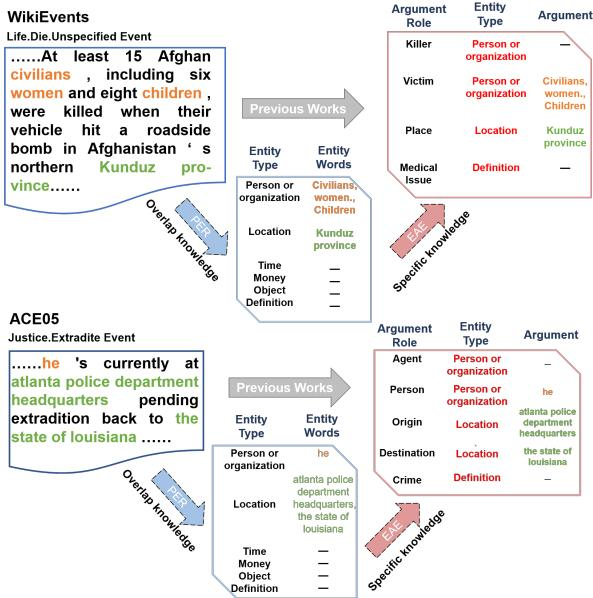
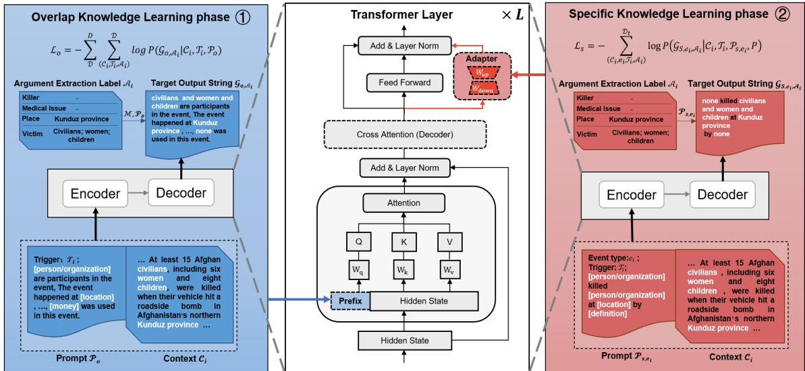
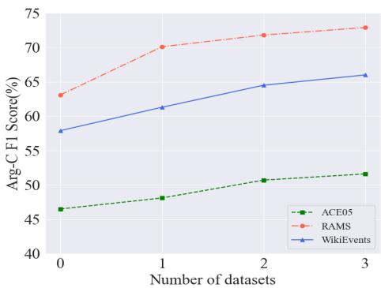

# What Is Overlap Knowledge in Event Argument Extraction? APE: A Cross-datasets Transfer Learning Model for EAE

Kaihang Zhang<sup>1</sup>, Kai Shuang <sup>1</sup>∗, Xinyue Yang<sup>1</sup>, Xuyang Yao<sup>2</sup> and Jinyu Guo<sup>13</sup>

<sup>1</sup>State Key Laboratory of Networking and Switching Technology,

Beijing University of Posts and Telecommunications

<sup>2</sup>China Telecom Research Institute

<sup>3</sup>University of Cambridge

{zkh1999, shuangk, crescent3919, guojinyu}@bupt.edu.cn

## Abstract

yaoxy11@chinatelecom.cn

The EAE task extracts a structured event record from an event text. Most existing approaches train the EAE model on each dataset indepen dently and ignore the overlap knowledge across datasets. However, insufficient event records in a single dataset often prevent the existing model from achieving better performance. In this paper, we clearly define the overlap knowledge across datasets and split the knowledge of the EAE task into overlap knowledge across datasets and specific knowledge of the target dataset. We propose APE model to learn the two parts of knowledge in two serial learn ing phases without causing catastrophic forgetting. In addition, we formulate both learning phases as conditional generation tasks and design Stressing Entity Type Prompt to close the gap between the two phases. The experiments show APE achieves new state-of-the-art with a large margin in the EAE task. When only ten records are available in the target dataset, our model dramatically outperforms the baseline model with average 27.27% F1 gain.<sup>1</sup>

## 1 Introduction

Event extraction (EE) is a pivotal task in information extraction. Typically, the event extraction task can be divided into two sub-tasks: event detection (ED) and event argument extraction (EAE). Thanks to recent works (Liu et al., 2022a; Sheng et al., 2022; Lai et al., 2020), event detection has achieved significant progress. The main challenge of EE lies in the EAE task.

The EAE task aims to extract a structured event record from an event text. Since different datasets often have various event types and argument structures, most studies (Ma et al., 2022; Lu et al., 2021; Liu et al., 2022b) train the EAE model on each dataset independently, such as ACE 2005 (Doddington et al., 2004), RAMS (Ebner et al., 2020), and WikiEvents (Li et al., 2021). However, one single dataset often cannot provide sufficient event records, which seriously prevents those models from achieving better performance. Especially in some industrial applications, the in-domain event record collection incurs expensive and timeconsuming manual annotation. We argue that there is abundant transferable all-purpose knowledge of the EAE task among different datasets, called overlap knowledge. Exploring the overlap knowledge from existing datasets can significantly improve the model’s performance and reduce the need for newly annotated data.

  
Figure 1: The illustration of overlap knowledge

How to transfer knowledge across datasets has yet to be well studied. Only Zhou et al. (2022) attempted to introduce variational information bottleneck to retain the shared knowledge between two datasets and achieved considerable success. Nevertheless, their model architecture restricts that they can only obtain overlap knowledge from up to two datasets. Moreover, it has not explicitly defined what is the overlap knowledge among the different datasets. Therefore, they use the EAE task’s training objective to train the model on two datasets jointly and roughly let the model distinguish what knowledge is shareable across datasets. The imprecise training objectives perplex the model to learn the overlap knowledge better.

In this work, we propose a Seek Common ground while Reserving Differences (SC-RD) framework to define the overlap knowledge clearly. SC-RD suggests defining overlap knowledge based on a cross-dataset common ground and isolating other knowledge into specific knowledge. As shown in Figure 1, every argument role in different datasets can be attached to an entity type. We introduce a finite entity type set (shown in Appendix Table 6) as the common ground across datasets. Based on the entity type set, we define the overlap knowledge as identifying entity words associated with the event by a given entity type. The specific knowledge is defined as identifying arguments based on the output of overlap knowledge. As illustrated in Figure 1, the two knowledge split the EAE task into two steps: In the first step, the model uses the overlap knowledge to focus on the entity word associated with the event. The second step finishes the EAE task based on the specific knowledge. Therefore, the EAE task can be reformulated as the product of two conditional probabilities:

$$
p \left( \boldsymbol { A } | \mathcal { X } , K \right) \propto p \left( \boldsymbol { w } | \mathcal { X } , k _ { o } \right) p \left( \boldsymbol { A } | \boldsymbol { w } , \mathcal { X } , k _ { s } \right)\tag{1}
$$

where is the event argument, w are event-related entity words, and  donates the event text. $k _ { o } \in K$ represents overlap knowledge, and $k _ { s } \in K$ represents specific knowledge. $p \left( w | \mathcal { X } , k _ { o } \right)$ is independent of datasets and can be learned from a pseudoentity recognition (PER) task on multi-datasets straightforwardly. The PER only identifies the entity words associated with the event so that EAE labels can be converted to PER labels by a manual mapping function. The structure definition of varies with the dataset, so we learn $p \left( \mathcal { A } | w , \mathcal { X } , k _ { s } \right)$ from the EAE task on the target dataset based on the overlap knowledge.

We implement the above idea in APE, which Assembles two Parameter-Efficient tuning methods to harmonize two parts of knowledge in one single model. Specifically, we introduce two learning phases (illustration in Figure 2) to learn overlap and specific knowledge, respectively. In the overlap learning phase, we merge multi-datasets and convert their unaligned EAE labels to aligned PER labels to optimize the Prefix, which is introduced to save overlap knowledge. In the specific learning phase, we load and freeze the trained Prefix and tune the Adapter’s parameters with the EAE task in the target dataset to save specific knowledge. All the pre-trained model’s parameters will be frozen like traditional parameter-efficient tuning methods. Furthermore, to ensure the overlap knowledge plays a part in the EAE task, we format both training tasks as conditional generation tasks and propose the Stressing Entity Type Prompt to ignite the overlap knowledge in the EAE task.

To the best of our knowledge, we are the first to clearly define the overlap knowledge across datasets, so we can give the model a transparent training objective to help it learn the overlap knowledge. Our model expands parameter-efficient tuning methods to the transfer learning scene. Since APE optimizes different parameters in two learning phases, learning the specific knowledge will not trigger catastrophic forgetting (McCloskey and Cohen, 1989) of the overlap knowledge.

We have conducted extensive experiments on three widely used datasets. The experimental results show that our proposed APE outperforms baselines with a large margin (2.7%, 2.1%, 3.4% F1 gain absolutely on three benchmarks). Moreover, it achieves 27.27% F1 score gain average over three datasets when only ten samples of the target dataset are available, indicating our model’s fewshot learning ability. Further analysis in Section 4.3 confirms the efficacy of the main components in our model.

## 2 Method

As illustrated in Figure 2, APE learns two parts of knowledge in two learning phases sequentially. To overcome catastrophic forgetting, our model (Section 2.2) assembles Prefix (Li and Liang, 2021) to save overlap knowledge and Adapter (Houlsby et al., 2019) to save specific knowledge, respectively. To fully use the overlap knowledge learned from multi-datasets, we carefully design the Task Formulation (Section 2.1) and the Stressing Entity Type Prompt (Section 2.3) of two learning phases.

## 2.1 Task Formulation

Our approach introduces PER task to learn overlap knowledge and EAE task to learn specific knowledge. Every NLP task can be treated as a “text-totext” problem (Raffel et al., 2020). Our approach formats both learning phases as conditional generation problems to narrow the gap between the two learning phases.

  
Figure 2: The framework of our APE model

Specifically, we define the event dataset as $\mathcal { D } =$ $\{ ( \mathcal { C } _ { i } , e _ { i } , \mathcal { T } _ { i } , \mathcal { A } _ { i } ) | i < | \mathcal { D } | \}$ , where $C _ { i }$ is the ith event context. $e _ { i }$ and $\mathcal { T } _ { i }$ are the event type and trigger of the ith event separately. $\mathcal { A } _ { i } = \{ ( r _ { j } , s p a n _ { j } ) , . . . \}$ is the argument set of the event, where $r _ { j }$ denotes the argument role, and $s p a n _ { j }$ is the offset of the argument. For both phases, the input of our model is a designed prompt $\mathcal { P }$ and a context $\mathcal { C } _ { i }$ . The target output string is an answered prompt  containing the answer to the task. The language model (LM) models the conditional probability of answered prompt $\mathcal { G }$ as:

$$
p \left( { \mathcal { G } } | { \mathcal { X } } , \ \theta \right) = \prod _ { i = 1 } ^ { | { \mathcal { G } } | } p \left( g _ { i } | g _ { < i } , \chi \right)\tag{2}
$$

$$
\mathcal { X } = [ \mathcal { P } ; [ S E P ] ; \mathcal { C } _ { i } ]\tag{3}
$$

Where $\mathcal { X }$ is the input of the model, θ donates the parameters of LM. The construction of $\mathcal { P }$ <sup>and</sup> G <sup>in</sup> two learning phases will be respectively described in section 2.3.

## 2.2 Model Architecture

Our APE model assembles Prefix and Adapter into pre-trained encoder-decoder Transformer (Vaswani et al., 2017). The model can acquire two parts of knowledge without causing catastrophic forgetting by optimizing different parameter regions in two learning phases.

For overlap knowledge, we equip each selfattention module with a short Prefix vector $P \in$ $\mathbb { R } ^ { | P | \times d _ { m o d e l } }$ to represent and save it. In each layer, the new self-attention module with overlap knowledge intervention is formalized as:

$$
{ \cal H } \gets L a y e r N o r m \left( { \cal H } ^ { ' } + { \cal H } \right)\tag{4}
$$

$$
H ^ { \prime } = M H S A \left( P \oplus H \right) _ { | P | : | P \oplus H | }\tag{5}
$$

Where $M H S A ( \bullet )$ denotes the multi-head selfattention mechanism, and $( \bullet ) _ { a : b }$ donates the slicing operation on the seq\_len dim from a to b. The Prefix will be assembled into the model in both learning phases since we use the overlap knowledge in the specific knowledge learning phase too. We optimize the Prefix $P$ only in the overlap knowledge learning phase, and freeze it in the specific knowledge learning phase.

For specific knowledge, we adopt an Adapter parallel with the feed-forward module to represent and save it. The Adaptor locates behind the Prefix to model the order of knowledge utilization in the SC-RD framework. The specific knowledge will be involved in the computation of $H _ { a d }$ , and the new feed-forward module with Adapter is formalized as:

$$
H \gets L a y e r N o r m \left( H + H _ { f f d } + H _ { a d } \right)\tag{6}
$$

$$
H _ { a d } = \textit { W } _ { u p } \sigma \left( \textit { W } _ { d o w n } H \right)\tag{7}
$$

Where $W _ { d o w n } ~ \in ~ \mathbb { R } ^ { d _ { m o d e l } \times d _ { a d a p t e r } }$ and $W _ { u p } \in$ R<sup>d</sup>adapter×<sup>d</sup>model are tunable parameters in the Adapter, $\sigma ( \bullet )$ is a nonlinear activation function, and $H _ { f f d }$ represents the output of the feed-forward layer. Only in the specific knowledge learning phase, we assemble the Adapter into the model and optimize it. Like traditional parameter-efficient tuning methods, the pre-trained parameters of the Transformer are frozen in both phases.

## 2.3 Stressing Entity Type Prompt

The Stressing Entity Type Prompt can indicate the model to generate words with the corresponding entity type in the designated location. We design the prompts under the same style in two learning phases, which uses identical special tokens to mark entity types. In the EAE task, those special tokens will ignite the overlap knowledge.

## 2.3.1 Overlap Knowledge Learning Phase

We introduce the PER task to align the diverse datasets and learn overlap knowledge from them. To convert EAE labels to PER labels, we manually create a mapping function $\mathcal { M } ( \boldsymbol { r } )$ which maps each argument role r to an entity type.

Prompt Construction The overlap knowledge is independent of datasets, so all datasets’ prompt in the overlap knowledge learning phase is identical. Entity-type special tokens mark the position expected to be filled by the model and the corresponding entity types. The model should recognize the right entity words by referring to the context $\mathcal { C } _ { i } .$ . The manual overlap knowledge prompt $\mathcal { P } _ { o }$ was designed as:

```ini
[person/organization] are a participant in the
event, the event happened at [location], [object]
are relate to the event, [definition] are the
terminology in the event, the event taken place
at [time], [money] was used in this event.
```

[ ] represents an entity-type special token, and the prompt natively contains the congruent relationship between the special token and entity type. Furthermore, we concatenate the event trigger $\mathcal { T } _ { i }$ of the given event with the prompt to help the model focus on the correct event.

Target Output String Construction As shown in Figure 2 ①, for an event context $\mathcal { C } _ { i }$ and its arguments $\mathbf { \mathcal { A } } _ { i }$ sampled from any event dataset, we first convert $\mathbf { \mathcal { A } } _ { i }$ to the PER label according to . Then, we construct the ground truth generation sequence $\mathcal { G } _ { o , A _ { i } }$ by filling the PER label into $\mathcal { P } _ { o }$ . If several words are categorized as the same type, they will be concatenated by “and”. If there is an empty set of some entity types, we fill “none” into $\mathcal { P } _ { o }$ to replace the special token.

## 2.3.2 Specific Knowledge Learning Phase

We learn the specific knowledge by finishing the EAE task based on the overlap knowledge. To ignite the overlap knowledge contained in the Prefix, we inherit entity-type special tokens from the overlap knowledge learning phase and build prompts according to the target dataset with those special tokens.

Prompt Construction In the target dataset, for each event type e<sub>i</sub>, we refer pre-defined prompt from Ma et al. (2022) and replace the textual argument roles in the prompt with the above entitytype special token according to $\mathcal { M } .$ . The entitytype special token hints to the model what entity type of words are most likely to serve as this argument role. For example, given an event type e: Life.Die.Unspecified, the renovated prompt $\mathcal { P } _ { s , e }$ can be got as:

```ini
Prompt from Ma et al. (2022):
Killer killed Victim at Place by MedicalIssue
Renovated prompt:
[person/organization] killed
[person/organization] at [location] by
[definition]
```

As shown in Figure 2 ②, following Ma et al. (2022), we concatenate the event type $e _ { i }$ and the event trigger $\mathcal { T } _ { i }$ of the given event sample with the renovated prompt.

Target Output String Construction For each event record $( \mathcal { C } _ { i } , e _ { i } , \mathcal { T } _ { i } , \mathcal { A } _ { i } )$ sampled from the target dataset, as shown in Figure 2 ②, we construct the ground truth generation sequence $\mathcal { G } _ { s , e _ { i } , \mathcal { A } _ { i } }$ by filling $A _ { i }$ into $\mathcal { P } _ { s , e _ { i } }$ . Like the overlap knowledge learning phase, arguments with the same role will be concatenated by “and” and the uninvolved argument role will be filled by “none”.

## 2.4 Training, Inference, and Decoding

Training First, in the overlap knowledge learning phase, the trainable parameters of our model are only the Prefix $P$ in each layer and the embedding of entity-type special tokens. The Adapter will be disabled. The training objective is to maximize $p \left( w | \mathcal { X } , k _ { o } \right)$ of Equation 1, which is equivalent to minimizing the negative loglikelihood loss in multidatasets $D = \{ \mathcal { D } _ { 1 } , \mathcal { D } _ { 2 } \ldots \}$

$$
\mathcal { L } _ { o } = - \sum _ { \mathcal { D } } ^ { D } \sum _ { ( \mathcal { C } _ { i } , \mathcal { T } _ { i } , \mathcal { A } _ { i } ) } ^ { \mathcal { D } } \log \left( P \left( \mathcal { G } _ { o , \mathcal { A } _ { i } } \middle | \mathcal { C } _ { i } , \mathcal { T } _ { i } , \mathcal { P } _ { o } \right) \right)\tag{8}
$$

Then, in the specific knowledge learning phase, we load and freeze all parameters learned from the overlap knowledge learning phase and assemble the Adapter into our model to save the specific knowledge. Only $W _ { d o w n }$ and $W _ { u p }$ in the Adapter will be optimized. The training objective is to maximize $p \left( \mathcal { A } | w , \mathcal { X } , k _ { s } \right)$ by minimizing the negative loglikelihood in the target dataset $\mathcal { D } _ { t }$

$$
\mathcal { L } _ { s } = - \sum _ { ( \mathcal { C } _ { i } , e _ { i } , \mathcal { T } _ { i } , \mathcal { A } _ { i } ) } ^ { \mathcal { D } _ { t } } \log \left( P \left( \mathcal { G } _ { S , e _ { i } , A _ { i } } \middle | \mathcal { C } _ { i } , \mathcal { T } _ { i } , \mathcal { P } _ { s , e _ { i } } , P \right) \right)\tag{9}
$$

Where P is the Prefix.

Inference In the inference stage, we assemble the trained Prefix and Adapter into the model. The input of APE is as same as the specific learning phase. Our model generates sequence by beam search strategy with $w i d t h = 1 0$ . The maximum sequence length is set to 100 tokens, which is plenty for every dataset.

Decoding Routinely, we decode the arguments from generated sequence by using regular expressions according to the $\mathcal { P } _ { s , e }$ for each sample. It is rare, but not all generated sequences are valid. For the argument roles we cannot decode from the generated sequence, we set “none” to them. Following Lu et al. (2021), we obtain the offset of the argument by finding the nearest matched string to the event trigger $\tau _ { i }$

## 3 Experiments Setup

## 3.1 Datasets

We evaluate our model on three popular datasets: ACE 2005 (Doddington et al., 2004), RAMS (Ebner et al., 2020), and WikiEvents (Li et al., 2021). ACE05 is a classical sentence-level dataset. We follow Wadden et al. (2019)’s pre-processing scripts on ACE05. RAMS and WikiEvents are both document-level datasets. Since the context of the document-level dataset sometimes exceeds the constraint, we follow Ma et al. (2022), which adds a window centering on the trigger words and only encodes the words within the window. The statistics of the datasets are listed in Appendix Table 7. The multi-datasets $D =$ ACE05, RAMS, WikiEvents in this work.

## 3.2 Baselines

We compare our APE model with the following state-of-the-art baseline models: (1) OneIE (Lin et al., 2020) jointly extracts the globally optimal IE result from a context. (2) EEQA (Du and Cardie, 2020) regards the event argument extraction task as an end-to-end question-answering (QA) task. (3) BART-Gen (Li et al., 2021) proposes a conditional generation approach to complete document-level EAE task. (4) PAIE (Ma et al., 2022) utilizes multirole prompts under extractive settings to capture argument interactions. (5) PAIE-Joint uses the same model in PAIE, but joint train the model in three datasets for a fair comparison with our model. (6) UnifiedEAE (Zhou et al., 2022) introduces variational information bottleneck to explore shared knowledge from two EAE datasets.

## 3.3 Evaluation Metric

Following baseline models, we adopt two metrics: Arg-I and Arg-C. Following Li et al. (2021), we add Head-C for WikiEvents datasets. Please refer to Appendix A for the detail of evaluation metric.

## 3.4 Implementation Details

We initialize the weight of the Transformer with BART model (Lewis et al., 2020). The length $| P |$ of Prefix is set to 70, and the inter-dim $d _ { a d a p t e r }$ of the Adapter is set to 512 for BART-base model and 768 for BART-large model. For simplicity, we initialize the Prefix and the Adapter randomly. We optimized our models on NVIDIA A40 GPU by AdamW (Loshchilov and Hutter, 2019) with $\beta _ { 1 } = 0 . 9 , \ \beta _ { 2 } = 0 . 9 9 9 , \ \epsilon = 1 e - 8 ,$ , and 10% warmup steps. We set the learning rate to 1e-3 for Prefix and 1e-4 for Adapter. To ensure the confidence of the result, we repeated the model training five times with five fixed seeds [14, 21, 28, 35, 42]. The reported experimental results are the average score. We exhibit some examples of $\mathcal { M } ( \boldsymbol { r } )$ (Table 10) and prompts (Table 11) in the Appendix. The complete $\mathcal { M } ( \boldsymbol { r } )$ and prompts of each dataset are available in our codebase.

## 4 Results and Analyses

To investigate the efficacy of our APE model, we compare our model with several state-of-the-art baseline models (4.1). Then, we verify the significance of transfer overlap knowledge (4.2) in the few-shot setting. We also perform ablation studies and further analysis to examine the effectiveness of the main components in our model (4.3).

## 4.1 Overall Performance

Table 1 present the main result of all baseline models and APE on three datasets. APE refers to our full model, which optimizes the Prefix in multidatasets. APE(Single) refers to the APE model trained in the transfer-disable setting, which optimizes the Prefix only in the target dataset. In the APE(Single), the overlap knowledge degrades into shared knowledge between different event types within the same target dataset.

Table 1: The Overall performance of our model and baselines. We bold the best result and underline the second best. b in column PLM denotes base model and l is large model.
<table><tr><td rowspan="2">Model</td><td rowspan="2">PLM</td><td colspan="2">ACE05</td><td colspan="2">RAMS</td><td colspan="3">WikiEvents</td></tr><tr><td>Arg-I</td><td>Arg-C</td><td>Arg-I</td><td>Arg-C</td><td>Arg-I</td><td>Arg-C</td><td>Head-C</td></tr><tr><td rowspan="2">OneIE</td><td>BERT-b</td><td>65.9</td><td>59.2</td><td>-</td><td>1</td><td></td><td>=</td><td></td></tr><tr><td>BERT-1</td><td>73.2</td><td>69.2</td><td></td><td></td><td></td><td></td><td></td></tr><tr><td rowspan="2">EEQA</td><td>BERT-b</td><td>68.2</td><td>65.4</td><td>46.4</td><td>44.0</td><td>54.3</td><td>53.2</td><td>56.9</td></tr><tr><td>BERT-1</td><td>70.5</td><td>68.9</td><td>48.7</td><td>46.7</td><td>56.9</td><td>54.5</td><td>59.3</td></tr><tr><td rowspan="2">BART-Gen</td><td>BART-b</td><td>59.6</td><td>55.0</td><td>50.9</td><td>44.9</td><td>47.5</td><td>41.7</td><td>44.2</td></tr><tr><td>BART-1</td><td>69.9</td><td>66.7</td><td>51.2</td><td>47.1</td><td>66.8</td><td>62.4</td><td>65.4</td></tr><tr><td rowspan="2">PAIE</td><td>BART-b</td><td>73.6</td><td>69.8</td><td>54.7</td><td>49.5</td><td>68.9</td><td>63.4</td><td>66.5</td></tr><tr><td>BART-1</td><td>75.7</td><td>72.7</td><td>56.8</td><td>52.2</td><td>70.5</td><td>65.3</td><td>68.4</td></tr><tr><td rowspan="2">PAIE-Joint</td><td>BART-b</td><td>73.8</td><td>69.5</td><td>53.3</td><td>48.3</td><td>69.3</td><td>63.7</td><td>65.9</td></tr><tr><td>BART-1</td><td>75.1</td><td>72.4</td><td>55.9</td><td>51.8</td><td>70.1</td><td>65.2</td><td>67.9</td></tr><tr><td>UnifiedEAE</td><td>BART-b</td><td>76.1</td><td>71.9</td><td>55.5</td><td>49.9</td><td>69.8</td><td>64.0</td><td>66.3</td></tr><tr><td rowspan="2">APE(Single)</td><td>BART-b</td><td>74.1</td><td>70.1</td><td>54.8</td><td>49.6</td><td>66.2</td><td>62.1</td><td>64.9</td></tr><tr><td>BART-1</td><td>75.3</td><td>72.9</td><td>56.3</td><td>51.7</td><td>70.6</td><td>65.8</td><td>68.4</td></tr><tr><td rowspan="2">APE</td><td>BART-b</td><td>75.5</td><td>72.9</td><td>56.1</td><td>51.6</td><td>70.7</td><td>66.0</td><td>68.7</td></tr><tr><td>BART-1</td><td>78.2</td><td>75.4</td><td>58.1</td><td>54.3</td><td>73.7</td><td>68.7</td><td>70.8</td></tr></table>

From Table 1, we have the following observations. First, APE achieves the highest F1 score on every evaluation metric compared with all the baselines model. Our base model obtained +1%, +1.7%, and +2% gain of Arg-C F1 scores on ACE05, RAMS, and WikiEvents, respectively. The large model expands the margin to +2.7%, +2.1%, and +3.4%. The results show that there is abundant overlap knowledge in multi-datasets, and our model can fully utilize it in the target dataset. Second, despite not relying on transfer learning, APE (Single) also achieves state-of-the-art performance on ACE05 and WikiEvents, and a competitive score on RAMS, which suggests that knowledge shared between different event types in a single dataset can also boost performance. Third, the PAIE-Joint even slightly worse than the PAIE. It donate that it is difficult for the model to find overlap knowledge by itself from datasets with various event structures, event types, and even different annotation guidelines. The APE can exploit the overlap knowledge from the transparent training objective of the PER task, and achieve better performance.

Table 2: Arg-C F1 score on few-shot setting
<table><tr><td rowspan=1 colspan=1>Dataset</td><td rowspan=1 colspan=1>ACE05    RAMS     Wiki.</td></tr><tr><td rowspan=3 colspan=1>1050PAIE100200</td><td rowspan=1 colspan=1> $3 . 3 { \scriptstyle \pm 2 . 1 }$      $4 . 3 { \scriptstyle \pm 1 . 4 }$      $5 . 7 { \scriptstyle \pm 3 . 6 }$ </td></tr><tr><td rowspan=1 colspan=1> $3 5 . 2 { \scriptstyle \pm 5 . 3 }$     $2 5 . 2 _ { \pm 6 . 1 }$     $3 1 . 4 { \scriptstyle \pm 4 . 6 }$  $3 9 . 6 { \scriptstyle \pm 2 . 5 }$     $3 0 . 4 { \scriptstyle \pm 2 . 1 }$     $4 2 . 1 _ { \pm 3 . 2 }$ </td></tr><tr><td rowspan=1 colspan=1> $5 1 . 2 { \scriptstyle \pm 1 . 3 }$     $3 5 . 8 { \scriptstyle \pm 1 . 9 }$     $5 3 . 2 { \scriptstyle \pm 1 . 7 }$ </td></tr><tr><td rowspan=1 colspan=1>10</td><td rowspan=1 colspan=1> $3 2 . 1 _ { \pm 7 . 1 }$     $2 6 . 3 { \scriptstyle \pm 4 . 2 }$    $3 6 . 7 _ { \pm 8 . 3 }$ </td></tr><tr><td rowspan=2 colspan=1>50APE100</td><td rowspan=1 colspan=1> $4 2 . 5 { \scriptstyle \pm 3 . 9 }$     $3 3 . 4 _ { \pm 4 . 1 }$     $4 7 . 6 _ { \pm 5 . 4 }$ </td></tr><tr><td rowspan=1 colspan=1> $5 3 . 2 { \scriptstyle \pm 1 . 7 }$     $3 8 . 5 { \scriptstyle \pm 1 . 6 }$     $5 5 . 6 { \scriptstyle \pm 2 . 6 }$ </td></tr><tr><td rowspan=1 colspan=1>200</td><td rowspan=1 colspan=1> $5 9 . 3 { \scriptstyle \pm 0 . 9 }$     $4 1 . 1 _ { \pm 1 . 2 }$     $5 9 . 5 { \scriptstyle \pm 1 . 5 }$ </td></tr></table>

## 4.2 Few-shot Setting

APE is exceptionally suited for lacking in-domain labeled data because APE can learn from outdomain event records. Therefore, we conduct a few-shot experiment to verify the ability of APE to reduce the dependence on target dataset samples. Specifically, we optimize Prefix on the other two intact datasets and train Adapter on the target dataset with few samples.

Table 2 reports the Arg-C F1 score in the target dataset with 10, 50, 100, and 200 random sampled event records. From the results, we obtain the following observations. 1). APE significantly outperforms the state-of-the-art baseline PAIE model in three benchmarks. 2). Especially in the case of only ten samples, APE achieves 27.27% F1 score gains average in three datasets. 3). APE with 200 samples achieves competitive scores with some baseline model trained on the whole WikiEvents or ACE05 dataset. The results indicate that APE significantly reduces the need for the scale of the target dataset.

Table 3: The performance of different variants on ACE05
<table><tr><td>Variant</td><td colspan="2">Param overlap specific</td><td>ACE05</td></tr><tr><td>APE</td><td>Prefix Adapter</td><td>72.9</td></tr><tr><td> $\mathbf { A P E } _ { r e v e r s e d }$ </td><td>Adapter Perfix</td><td>72.1</td></tr><tr><td>w/o Prefix</td><td>BART Adapter</td><td>71.5</td></tr><tr><td>w/o Adapter</td><td>Prefix BART</td><td>71.7</td></tr><tr><td>BART</td><td>BART BART</td><td>69.4</td></tr></table>

## 4.3 Detailed Analysis

In this section, we study the effectiveness of the main components in our model and take a deeper look at what contributes to APE’s final performance. All experiments will be based on the baseversion model and report the average Arg-C F1 scores on five seeds. The experimental conclusions are also proper for the large version model.

## 4.3.1 Model Architecture Design

We first explore the effectiveness of APE model architecture in preventing catastrophic forgetting. We tried variants of APE as follows: 1) APE<sub>reversed</sub>: it has the same model architecture as APE but saves overlap knowledge in the Adapter and specific knowledge in the Prefix. 2) w/o Prefix: it is an APE without Prefix, which updates all pretrained parameters to save overlap knowledge. 3) w/o Adapter: pre-trained parameters will be updated to save specific knowledge. 4) BART: it is a standard BART model without additional parameters. We optimize the model in the overlap knowledge learning phase and fine-tune it in the specific knowledge learning phase.

The result of ACE05 is summarized in Table 3, and the result of other datasets is in Appendix Table 8. All variants that save overlap and specific knowledge into different parameters outperform the plain BART model significantly. Since the plain BART model saves overlap and specific knowledge in the same parameters, serial learning phases will lead to catastrophic forgetting of previous knowledge.

Suppose we save both knowledges into new parameter regions (APE, APE<sub>reversed</sub>). In this case, we can also obtain a considerable performance gain because our task formulation is similar to the pretrain task of BART, where the entity-type special tokens can be seen as [MASK] tokens. Retaining the pre-training parameter is helpful to take the best advantage of PLM’s knowledge.

Table 4: The performance of different learning tasks
<table><tr><td>Task</td><td>ACE05</td><td>RAMS</td><td>Wiki.</td></tr><tr><td>Joint EAE Task</td><td>69.9</td><td>49.4</td><td>64.1</td></tr><tr><td>PER Task</td><td>72.9</td><td>51.6</td><td>66.0</td></tr></table>

Table 5: The performance of different prompt styles
<table><tr><td colspan="2">prompt style</td><td rowspan="2">ACE05</td><td rowspan="2">RAMS</td><td rowspan="2">Wiki.</td></tr><tr><td>overlap specific</td><td></td></tr><tr><td>ST</td><td>ST</td><td>72.9</td><td>51.6</td><td>66.0</td></tr><tr><td>NL</td><td>NL</td><td>72.1</td><td>51.1</td><td>65.3</td></tr><tr><td>NL</td><td>ST</td><td>69.5</td><td>49.3</td><td>63.5</td></tr></table>

Finally, there is a slightly negative effect when we reverse the parameter regions to save overlap and specific knowledge. We conjecture that $\mathbf { A P E } _ { r e v e r s e d }$ cannot model the order of knowledge utilization in the SC-RD framework.

## 4.3.2 Overlap Knowledge Learning Task

To investigate the effect of the PER task and its transparent training objective (Equation 8) in learning the overlap knowledge, we throw out the SC-RD framework and replace the PER task with Joint EAE Task like the previous work. The Joint EAE Task ignores the difference of datasets and merges multi-datasets to force the model directly learn overlap knowledge from the EAE training objective. The input and the target output string of the Joint EAE Task are as same as the specific knowledge learning phase. Two versions of Prefix will be respectively learned from the Joint EAE Task and the PER task and used in target datasets.

It can be observed in Table 4 that there is a 3.0%, 2.2%, and 1.9% decrease for the Arg-C F1 score on three datasets when changing the task. It is difficult for the model to discern the overlap knowledge from the imprecise EAE training objective. The PER task provides a transparent training objective to indicate the overlap knowledge explicitly.

## 4.3.3 Stressing Entity-Type Prompt

As aforementioned, prompts that keeping the same style in two learning phases can ignite the utilization of overlap knowledge in the specific knowledge learning phase and EAE inference scene. In order to verify it, we propose another prompt style named Natural Language Pronouns (NL), which replaces the entity-type Special Token (ST) with pronouns. The conversion between the two styles is shown in Appendix Table 9. We observe in Table 5 that there is a huge F1 score decrease of about 3.4% on the ACE05 dataset when we build prompts with different styles in two learning phases. The result indicates that narrowing the gap between the two phases is crucial to ignite the overlap knowledge. Meanwhile, the special token is a more powerful way to alert the model to the entity type than natural language.

  
Figure 3: The performance of different multi-datasets

## 4.3.4 Number of Datasets in Multi-datasets

In order to deeply observe the impact of the amount of the training data used in the overlap knowledge learning phase, we trained four versions of Prefix on varying numbers of training sets and transferred them to the target dataset. When the number of datasets was set to 0, the Prefix was randomly initialized and used directly without training. When the number of datasets was set to 1, we trained Prefix on {ACE05}. When the number of datasets was 2, we trained Prefix on {ACE05, RAMS}. Figure 3 shows the Arg-C F1 score increase as the number of datasets used to learn the overlap knowledge. The experiment result shows that with more available out-domain event records, the APE model can learn more abundant overlap knowledge and achieve better performance in the target dataset.

## 5 Related Works

## 5.1 Transfer Learning in EAE

Event argument extraction (EAE) aims to extract event arguments by the given event trigger and argument roles (Chen et al., 2015). Most existing approaches (Lin et al., 2020; Du and Cardie, 2020; Lu et al., 2021; Nguyen et al., 2022; Ma et al., 2022) suffer from insufficient training data and cannot perform better. Therefore, some studies (Liu et al., 2020b; Chen et al., 2020; Feng et al., 2020) focus on transferring knowledge from machine reading comprehension (MRC) datasets. Huang et al. (2022) leverages multilingual pre-trained models (Liu et al., 2020a; Xue et al., 2021) to achieve cross-lingual knowledge transfer. About transferring overlap knowledge from other available event datasets to the target dataset, only Zhou et al. (2022) attempt to introduce variational information bottleneck (Li and Eisner, 2019) to explore the overlap knowledge from two event datasets. Unlike their work, we clearly define the cross-dataset overlap knowledge in the EAE task. Our model does not limit the number of datasets and can explore overlap knowledge from all available datasets to achieve better performance.

## 5.2 Parameter-Efficient Tuning Method

Optimizing all the parameters of the PLMs means we need to save a complete fine-tuned model for every downstream task. The storage cost is prohibitively expensive with the increasing size of PLMs. Several parameter-efficient tuning methods (Houlsby et al., 2019; Hu et al., 2022; Mao et al., 2022; He et al., 2022) were proposed to mitigate this issue, which update a small number of taskspecific parameters while keeping other pre-trained parameters frozen. Houlsby et al. (2019)equip each Transformer layer with an Adapter, and only the Adapters are tunable to save task-specific knowledge of the downstream task. Inspired by significant effectiveness achieved in prompt learning (Brown et al., 2020; Gao et al., 2021), Li and Liang (2021) prepends Prefix vectors to the hidden state, and only the Prefix will be trained on downstream tasks. To the best of our knowledge, we are the first to assemble two parameter-efficient tuning methods to separate knowledge in transfer learning and overcome catastrophic forgetting.

## 6 Conclusion

In this work, we first define the shareable overlap knowledge across datasets and reformulate the EAE task into two learning phases. Then, we propose APE model, which assembles two parameterefficient tuning methods to save the overlap and specific knowledge. The experiment results show the efficiency of the cross-dataset transfer learning, and APE achieves new SOTA with a large margin in the EAE task. Our model significantly reduces the need for new event records and achieves superior performance with few samples of target datasets. The ablation studies verify that our approach can explore overlap knowledge from multi-datasets and overcome the well-known catastrophic forgetting issue. In the future, we would like to study overlap knowledge across datasets in other information extraction tasks.

## Limitations

This work introduces a pseudo-entity recognition (PER) task to supervise the model learning overlap knowledge. Since no additional entity annotation is available, we manually create a mapping function (r), which maps each argument role r to an entity type. With the help of the mapping function (r), the EAE label can be converted to the PER label. However, because the annotation of the EAE task is complicated, it is hard to avoid a few exceptional samples in the prior mapping function. Some entity words may be attached to impertinent entity types. For example, there is a triple of argument role, event type, and argument in RAMS’s movement.transportartifact.preventexit event: {Artifact, Object, Two pilots}. The "Artifact" argument is mapped to "Object" in (r), but we expect "Two pilots" can be mapped to "Person Or Organization". We tolerate such exceptional samples, and the occasional noise has not affected the training of APE.

## Ethics Statement

Event argument extraction (EAE) task is a welldefined and classic task in Information Extract (IE) field. In this work, our use of existing artifacts (e.g., datasets) was licensed and consistent with their intended use. We do not see other significant ethical concerns. Our model is excepted to be used in extracting structured event records from plain text.

## Acknowledgements

This work was supported by Beijing Natural Science Foundation(Grant No.4222032) and the Foundation for Innovative Research Groups of the National Natural Science Foundation of China(Grant No.61921003)

## References

Tom Brown, Benjamin Mann, Nick Ryder, Melanie Subbiah, Jared D Kaplan, Prafulla Dhariwal, Arvind Neelakantan, Pranav Shyam, Girish Sastry, Amanda Askell, et al. 2020. Language models are few-shot learners. Advances in neural information processing systems, 33:1877–1901.

Yubo Chen, Liheng Xu, Kang Liu, Daojian Zeng, and Jun Zhao. 2015. Event extraction via dynamic multipooling convolutional neural networks. In Proceedings ofthe 53rd Annual Meeting ofthe Association for Computational Linguistics and the 7th International Joint Conference on Natural Language Processing (Volume 1: Long Papers), pages 167–176, Beijing, China. Association for Computational Linguistics.

Yunmo Chen, Tongfei Chen, Seth Ebner, Aaron Steven White, and Benjamin Van Durme. 2020. Reading the manual: Event extraction as definition comprehension. In Proceedings ofthe Fourth Workshop on Structured Predictionfor NLP, pages 74–83, Online. Association for Computational Linguistics.

George R. Doddington, Alexis Mitchell, Mark A. Przybocki, Lance A. Ramshaw, Stephanie Strassel, and Ralph M. Weischedel. 2004. The automatic content extraction (ace) program - tasks, data, and evaluation. In International Conference on Language Resources and Evaluation.

Xinya Du and Claire Cardie. 2020. Event extraction by answering (almost) natural questions. In Proceedings ofthe 2020 Conference on Empirical Methods in Natural Language Processing (EMNLP), pages 671–683, Online. Association for Computational Linguistics.

Seth Ebner, Patrick Xia, Ryan Culkin, Kyle Rawlins, and Benjamin Van Durme. 2020. Multi-sentence argument linking. In Proceedings of the 58th Annual Meeting of the Association for Computational Linguistics, pages 8057–8077, Online. Association for Computational Linguistics.

Rui Feng, Jie Yuan, and Chao Zhang. 2020. Probing and fine-tuning reading comprehension models for few-shot event extraction. CoRR, abs/2010.11325.

Tianyu Gao, Adam Fisch, and Danqi Chen. 2021. Making pre-trained language models better few-shot learners. In Proceedings of the 59th Annual Meeting ofthe Associationfor Computational Linguistics and the 11th International Joint Conference on Natural Language Processing (Volume 1: Long Papers), pages 3816–3830, Online. Association for Computational Linguistics.

Junxian He, Chunting Zhou, Xuezhe Ma, Taylor Berg-Kirkpatrick, and Graham Neubig. 2022. Towards a unified view of parameter-efficient transfer learning. In The Tenth International Conference on Learning Representations, ICLR 2022, Virtual Event, April 25- 29, 2022. OpenReview.net.

Neil Houlsby, Andrei Giurgiu, Stanislaw Jastrzebski, Bruna Morrone, Quentin de Laroussilhe, Andrea Gesmundo, Mona Attariyan, and Sylvain Gelly. 2019. Parameter-efficient transfer learning for nlp. In International Conference on Machine Learning.

Edward J. Hu, Yelong Shen, Phillip Wallis, Zeyuan Allen-Zhu, Yuanzhi Li, Shean Wang, Lu Wang, and Weizhu Chen. 2022. Lora: Low-rank adaptation of large language models. In The Tenth International Conference on Learning Representations, ICLR 2022, Virtual Event, April 25-29, 2022. OpenReview.net.

Kuan-Hao Huang, I-Hung Hsu, Prem Natarajan, Kai-Wei Chang, and Nanyun Peng. 2022. Multilingual generative language models for zero-shot crosslingual event argument extraction. In Proceedings of the 60th Annual Meeting of the Association for Computational Linguistics (Volume 1: Long Papers), pages 4633–4646, Dublin, Ireland. Association for Computational Linguistics.

Viet Dac Lai, Tuan Ngo Nguyen, and Thien Huu Nguyen. 2020. Event detection: Gate diversity and syntactic importance scores for graph convolution neural networks. In Proceedings of the 2020 Conference on Empirical Methods in Natural Language Processing (EMNLP), pages 5405–5411, Online. Association for Computational Linguistics.

Mike Lewis, Yinhan Liu, Naman Goyal, Marjan Ghazvininejad, Abdelrahman Mohamed, Omer Levy, Veselin Stoyanov, and Luke Zettlemoyer. 2020. BART: Denoising sequence-to-sequence pre-training for natural language generation, translation, and comprehension. In Proceedings ofthe 58th Annual Meeting ofthe Associationfor Computational Linguistics, pages 7871–7880, Online. Association for Computational Linguistics.

Sha Li, Heng Ji, and Jiawei Han. 2021. Document-level event argument extraction by conditional generation. In Proceedings ofthe 2021 Conference ofthe North American Chapter of the Association for Computational Linguistics: Human Language Technologies, pages 894–908, Online. Association for Computational Linguistics.

Xiang Lisa Li and Jason Eisner. 2019. Specializing word embeddings (for parsing) by information bottleneck. In Proceedings of the 2019 Conference on Empirical Methods in Natural Language Processing and the 9th International Joint Conference on Natural Language Processing (EMNLP-IJCNLP), pages 2744–2754, Hong Kong, China. Association for Computational Linguistics.

Xiang Lisa Li and Percy Liang. 2021. Prefix-tuning: Optimizing continuous prompts for generation. In Proceedings ofthe 59th Annual Meeting ofthe Associationfor Computational Linguistics and the 11th International Joint Conference on Natural Language Processing (Volume 1: Long Papers), pages 4582– 4597, Online. Association for Computational Linguistics.

Ying Lin, Heng Ji, Fei Huang, and Lingfei Wu. 2020. A joint neural model for information extraction with global features. In Proceedings of the 58th Annual Meeting of the Association for Computational Linguistics, pages 7999–8009, Online. Association for Computational Linguistics.

Chunxi Liu, Qiaochu Zhang, Xiaohui Zhang, Kritika Singh, Yatharth Saraf, and Geoffrey Zweig. 2020a. Multilingual graphemic hybrid ASR with massive data augmentation. In Proceedings of the 1st Joint Workshop on Spoken Language Technologies for Under-resourced languages (SLTU) and Collaboration and Computing for Under-Resourced Languages (CCURL), pages 46–52, Marseille, France. European Language Resources association.

Jian Liu, Yubo Chen, Kang Liu, Wei Bi, and Xiaojiang Liu. 2020b. Event extraction as machine reading comprehension. In Proceedings of the 2020 Conference on Empirical Methods in Natural Language Processing (EMNLP), pages 1641–1651, Online. Association for Computational Linguistics.

Jian Liu, Yufeng Chen, and Jinan Xu. 2022a. Saliency as evidence: Event detection with trigger saliency attribution. In Proceedings ofthe 60th Annual Meeting ofthe Associationfor Computational Linguistics (Volume 1: Long Papers), pages 4573–4585, Dublin, Ireland. Association for Computational Linguistics.

Xiao Liu, Heyan Huang, Ge Shi, and Bo Wang. 2022b. Dynamic prefix-tuning for generative template-based event extraction. In Proceedings ofthe 60th Annual Meeting of the Association for Computational Linguistics (Volume 1: Long Papers), pages 5216–5228, Dublin, Ireland. Association for Computational Linguistics.

Ilya Loshchilov and Frank Hutter. 2019. Decoupled weight decay regularization. In 7th International Conference on Learning Representations, ICLR 2019, New Orleans, LA, USA, May 6-9, 2019. OpenReview.net.

Yaojie Lu, Hongyu Lin, Jin Xu, Xianpei Han, Jialong Tang, Annan Li, Le Sun, Meng Liao, and Shaoyi Chen. 2021. Text2Event: Controllable sequence-tostructure generation for end-to-end event extraction. In Proceedings of the 59th Annual Meeting of the Association for Computational Linguistics and the 11th International Joint Conference on Natural Language Processing (Volume 1: Long Papers), pages 2795–2806, Online. Association for Computational Linguistics.

Yubo Ma, Zehao Wang, Yixin Cao, Mukai Li, Meiqi Chen, Kun Wang, and Jing Shao. 2022. Prompt for extraction? PAIE: Prompting argument interaction for event argument extraction. In Proceedings ofthe 60th Annual Meeting of the Association for Computational Linguistics (Volume 1: Long Papers), pages 6759–6774, Dublin, Ireland. Association for Computational Linguistics.

Yuning Mao, Lambert Mathias, Rui Hou, Amjad Almahairi, Hao Ma, Jiawei Han, Scott Yih, and Madian Khabsa. 2022. UniPELT: A unified framework for parameter-efficient language model tuning. In Proceedings ofthe 60th Annual Meeting ofthe Associationfor Computational Linguistics (Volume 1: Long Papers), pages 6253–6264, Dublin, Ireland. Association for Computational Linguistics.

Michael McCloskey and Neal J. Cohen. 1989. Catastrophic interference in connectionist networks: The sequential learning problem. volume 24 of Psychology ofLearning and Motivation, pages 109–165. Academic Press.

Minh Van Nguyen, Bonan Min, Franck Dernoncourt, and Thien Nguyen. 2022. Joint extraction of entities, relations, and events via modeling inter-instance and inter-label dependencies. In Proceedings ofthe 2022 Conference of the North American Chapter of the Associationfor Computational Linguistics: Human Language Technologies, pages 4363–4374, Seattle, United States. Association for Computational Linguistics.

Colin Raffel, Noam Shazeer, Adam Roberts, Katherine Lee, Sharan Narang, Michael Matena, Yanqi Zhou, Wei Li, Peter J Liu, et al. 2020. Exploring the limits of transfer learning with a unified text-to-text transformer. J. Mach. Learn. Res., 21(140):1–67.

Jiawei Sheng, Rui Sun, Shu Guo, Shiyao Cui, Jiangxia Cao, Lihong Wang, Tingwen Liu, and Hongbo Xu. 2022. Cored: Incorporating type-level and instancelevel correlations for fine-grained event detection. In Proceedings of the 45th International ACM SIGIR Conference on Research and Development in Information Retrieval, SIGIR ’22, page 1122–1132, New York, NY, USA. Association for Computing Machinery.

Ashish Vaswani, Noam Shazeer, Niki Parmar, Jakob Uszkoreit, Llion Jones, Aidan N Gomez, Łukasz Kaiser, and Illia Polosukhin. 2017. Attention is all you need. Advances in neural information processing systems, 30.

David Wadden, Ulme Wennberg, Yi Luan, and Hannaneh Hajishirzi. 2019. Entity, relation, and event extraction with contextualized span representations. In Proceedings of the 2019 Conference on Empirical Methods in Natural Language Processing and the 9th International Joint Conference on Natural Language Processing (EMNLP-IJCNLP), pages 5784– 5789, Hong Kong, China. Association for Computational Linguistics.

Linting Xue, Noah Constant, Adam Roberts, Mihir Kale, Rami Al-Rfou, Aditya Siddhant, Aditya Barua, and Colin Raffel. 2021. mT5: A massively multilingual pre-trained text-to-text transformer. In Proceedings of the 2021 Conference of the North American Chapter of the Association for Computational Linguistics: Human Language Technologies, pages 483–498, Online. Association for Computational Linguistics.

Jie Zhou, Qi Zhang, Qin Chen, Liang He, and Xuanjing Huang. 2022. A multi-format transfer learning model for event argument extraction via variational information bottleneck. In Proceedings of the 29th International Conference on Computational Linguistics, COLING 2022, Gyeongju, Republic of Korea, October 12-17, 2022, pages 1990–2000. International Committee on Computational Linguistics.

## A Detail of Evaluation Metric

We adopt two widely-used evaluation metrics:

1. Argument Identification F1 score (Arg-I): when the predicted argument’s offsets match any of the gold argument labels in this event, we consider the predicted argument is correct.

2. Argument Classification F1 score (Arg-C): when the predicted argument’s argument role also matches the gold argument label, we consider the predicted argument is correct.

For the WikiEvents dataset, following Li et al. (2021), we add argument head F1 score (Head-C), which only focuses matching the headword of the arguments’ offsets.

Table 6: The finite entity type set
<table><tr><td rowspan=1 colspan=1>Entity Type</td><td rowspan=1 colspan=1>Description</td><td rowspan=1 colspan=1>Example</td></tr><tr><td rowspan=1 colspan=1>Person OrOrganization</td><td rowspan=1 colspan=1>The word that refers to a person or an organization</td><td rowspan=1 colspan=1>he, she, Bill, the president, ...</td></tr><tr><td rowspan=1 colspan=1>Location</td><td rowspan=1 colspan=1>The word that refers to a place or a region</td><td rowspan=1 colspan=1>Washinton DC, London, ...</td></tr><tr><td rowspan=1 colspan=1>Time</td><td rowspan=1 colspan=1>The word that indicates a time</td><td rowspan=1 colspan=1>10 June, 17 pm., ...</td></tr><tr><td rowspan=1 colspan=1>Money</td><td rowspan=1 colspan=1>The word that indicates money</td><td rowspan=1 colspan=1>$1,000, 6 million dollars, ..</td></tr><tr><td rowspan=1 colspan=1>Object</td><td rowspan=1 colspan=1>The word that refers to a materiality entity</td><td rowspan=1 colspan=1>The truck, bomb, gun, house, ...</td></tr><tr><td rowspan=1 colspan=1>Definition</td><td rowspan=1 colspan=1>The proper noun or immateriality entity</td><td rowspan=1 colspan=1>murder, crime of pillage</td></tr></table>

Table 7: The statistics of datasets, #Sent. is the number of sentences of the dataset, #Arg. is the number of arguments of the dataset.
<table><tr><td rowspan=2 colspan=1>Dataset</td><td rowspan=1 colspan=2>Train</td><td rowspan=1 colspan=2>Dev</td><td rowspan=1 colspan=2>Test</td></tr><tr><td rowspan=1 colspan=1>#Sent.</td><td rowspan=1 colspan=1>#Arg.</td><td rowspan=1 colspan=1>#Sent.</td><td rowspan=1 colspan=1>#Arg.</td><td rowspan=1 colspan=1>#Sent.</td><td rowspan=1 colspan=1>#Arg.</td></tr><tr><td rowspan=1 colspan=1>ACE05</td><td rowspan=1 colspan=1>17172</td><td rowspan=1 colspan=1>4859</td><td rowspan=1 colspan=1>923</td><td rowspan=1 colspan=1>605</td><td rowspan=1 colspan=1>832</td><td rowspan=1 colspan=1>576</td></tr><tr><td rowspan=1 colspan=1>RAMS</td><td rowspan=1 colspan=1>7329</td><td rowspan=1 colspan=1>17026</td><td rowspan=1 colspan=1>924</td><td rowspan=1 colspan=1>2188</td><td rowspan=1 colspan=1>871</td><td rowspan=1 colspan=1>2023</td></tr><tr><td rowspan=1 colspan=1>WikiEvents</td><td rowspan=1 colspan=1>5262</td><td rowspan=1 colspan=1>4552</td><td rowspan=1 colspan=1>378</td><td rowspan=1 colspan=1>428</td><td rowspan=1 colspan=1>492</td><td rowspan=1 colspan=1>566</td></tr></table>

Table 8: The performance of different variants on three datasets
<table><tr><td>Variant</td><td colspan="2">Param overlap specific</td><td>ACE05 RAMS</td><td>Wiki.</td></tr><tr><td>APE</td><td>Prefix</td><td>Adapter</td><td>72.9 51.6</td><td>66.0</td></tr><tr><td rowspan="2">APEreversed w/o Prefix</td><td>Adapter</td><td>Perfix</td><td>72.1 51.2</td><td>64.7</td></tr><tr><td>BART</td><td>Adapter</td><td>71.5 51.3</td><td>64.3</td></tr><tr><td>w/o Adapter</td><td>Prefix</td><td>BART</td><td>71.7 50.9</td><td>64.8</td></tr><tr><td>BART</td><td>BART</td><td>BART</td><td>69.4 49.1</td><td>63.7</td></tr></table>

Table 9: The conversion between entity-type special token and natural language pronouns
<table><tr><td rowspan=1 colspan=1>Entity Type</td><td rowspan=1 colspan=1>Special Token</td><td rowspan=1 colspan=1>Natural Language Pronouns</td></tr><tr><td rowspan=1 colspan=1>Person Or Organization</td><td rowspan=1 colspan=1>[person/organization]</td><td rowspan=1 colspan=1>someone</td></tr><tr><td rowspan=1 colspan=1>Location</td><td rowspan=1 colspan=1>[location]</td><td rowspan=1 colspan=1>someplace</td></tr><tr><td rowspan=1 colspan=1>Time</td><td rowspan=1 colspan=1>[time]</td><td rowspan=1 colspan=1>some time</td></tr><tr><td rowspan=1 colspan=1>Money</td><td rowspan=1 colspan=1>[money]</td><td rowspan=1 colspan=1>some money</td></tr><tr><td rowspan=1 colspan=1>Object</td><td rowspan=1 colspan=1>[object]</td><td rowspan=1 colspan=1>something</td></tr><tr><td rowspan=1 colspan=1>Definition</td><td rowspan=1 colspan=1>[definition]</td><td rowspan=1 colspan=1>some definition</td></tr></table>

Table 10: Some examples of $\mathcal { M } ( \boldsymbol { r } )$ in three datasets, the complete $\mathcal { M } ( \boldsymbol { r } )$ can be found in our codebase.
<table><tr><td rowspan=1 colspan=1>Dataset</td><td rowspan=1 colspan=1>Event Type</td><td rowspan=1 colspan=1>Event Argument Role</td><td rowspan=1 colspan=1>Entity Type</td></tr><tr><td rowspan=11 colspan=1>ACE05</td><td rowspan=3 colspan=1>Business.Declare-Bankruptcy</td><td rowspan=1 colspan=1>Org</td><td rowspan=1 colspan=1>person/organization</td></tr><tr><td rowspan=1 colspan=1>Place</td><td rowspan=1 colspan=1>location</td></tr><tr><td rowspan=1 colspan=1>Time</td><td rowspan=1 colspan=1>time</td></tr><tr><td rowspan=3 colspan=1>Business.End-Org</td><td rowspan=1 colspan=1>Place</td><td rowspan=1 colspan=1>location</td></tr><tr><td rowspan=1 colspan=1>Org</td><td rowspan=1 colspan=1>person/organization</td></tr><tr><td rowspan=1 colspan=1>Time</td><td rowspan=1 colspan=1>time</td></tr><tr><td rowspan=5 colspan=1>Justice.Arrest-Jail</td><td rowspan=1 colspan=1>Person</td><td rowspan=1 colspan=1>person/organization</td></tr><tr><td rowspan=1 colspan=1>Agent</td><td rowspan=1 colspan=1>person/organization</td></tr><tr><td rowspan=1 colspan=1>Crime</td><td rowspan=1 colspan=1>definition</td></tr><tr><td rowspan=1 colspan=1>Place</td><td rowspan=1 colspan=1>location</td></tr><tr><td rowspan=1 colspan=1>Time</td><td rowspan=1 colspan=1>time</td></tr><tr><td rowspan=13 colspan=1>RAMS</td><td rowspan=5 colspan=1>transaction.transfermoney.purchase</td><td rowspan=1 colspan=1>recipient</td><td rowspan=1 colspan=1>person/organization</td></tr><tr><td rowspan=1 colspan=1>beneficiary</td><td rowspan=1 colspan=1>person/organization</td></tr><tr><td rowspan=1 colspan=1>money</td><td rowspan=1 colspan=1>money</td></tr><tr><td rowspan=1 colspan=1>place</td><td rowspan=1 colspan=1>location</td></tr><tr><td rowspan=1 colspan=1>giver</td><td rowspan=1 colspan=1>person/organization</td></tr><tr><td rowspan=3 colspan=1>contact.mediastatement.broadcast</td><td rowspan=1 colspan=1>recipient</td><td rowspan=1 colspan=1>person/organization</td></tr><tr><td rowspan=1 colspan=1>communicator</td><td rowspan=1 colspan=1>person/organization</td></tr><tr><td rowspan=1 colspan=1>place</td><td rowspan=1 colspan=1>location</td></tr><tr><td rowspan=5 colspan=1>movement.transportartifact.disperseseparate</td><td rowspan=1 colspan=1>artifact</td><td rowspan=1 colspan=1>object</td></tr><tr><td rowspan=1 colspan=1>vehicle</td><td rowspan=1 colspan=1>object</td></tr><tr><td rowspan=1 colspan=1>origin</td><td rowspan=1 colspan=1>location</td></tr><tr><td rowspan=1 colspan=1>destination</td><td rowspan=1 colspan=1>location</td></tr><tr><td rowspan=1 colspan=1>transporter</td><td rowspan=1 colspan=1>person/organization</td></tr><tr><td rowspan=13 colspan=1>WikiEvents</td><td rowspan=4 colspan=1>Contact.RequestCommand.Meet</td><td rowspan=1 colspan=1>Communicator</td><td rowspan=1 colspan=1>person/organization</td></tr><tr><td rowspan=1 colspan=1>Recipient</td><td rowspan=1 colspan=1>person/organization</td></tr><tr><td rowspan=1 colspan=1>Topic</td><td rowspan=1 colspan=1>definition</td></tr><tr><td rowspan=1 colspan=1>Place</td><td rowspan=1 colspan=1>location</td></tr><tr><td rowspan=5 colspan=1>Justice.ChargeIndict.Unspecified</td><td rowspan=1 colspan=1>Prosecutor</td><td rowspan=1 colspan=1>person/organization</td></tr><tr><td rowspan=1 colspan=1>Defendant</td><td rowspan=1 colspan=1>person/organization</td></tr><tr><td rowspan=1 colspan=1>JudgeCourt</td><td rowspan=1 colspan=1>person/organization</td></tr><tr><td rowspan=1 colspan=1>Crime</td><td rowspan=1 colspan=1>definition</td></tr><tr><td rowspan=1 colspan=1>Place</td><td rowspan=1 colspan=1>location</td></tr><tr><td rowspan=4 colspan=1>Life.Die.Unspecified</td><td rowspan=1 colspan=1>Victim</td><td rowspan=1 colspan=1>person/organization</td></tr><tr><td rowspan=1 colspan=1>Place</td><td rowspan=1 colspan=1>location</td></tr><tr><td rowspan=1 colspan=1>Killer</td><td rowspan=1 colspan=1>person/organization</td></tr><tr><td rowspan=1 colspan=1>MedicalIssue</td><td rowspan=1 colspan=1>definition</td></tr></table>

Table 11: Some examples of prompt in three datasets, the complete prompts can be found in our codebase.
<table><tr><td rowspan=1 colspan=1>Dataset</td><td rowspan=1 colspan=1>Event Type</td><td rowspan=1 colspan=1>Prompt</td></tr><tr><td rowspan=3 colspan=1>ACE05</td><td rowspan=1 colspan=1>Life.Die</td><td rowspan=1 colspan=1>[person/organization] killed[person/organization]with [object] at [location]</td></tr><tr><td rowspan=1 colspan=1>Life.Injure</td><td rowspan=1 colspan=1>[person/organization] injured[person/organization]with [object] at [location]</td></tr><tr><td rowspan=1 colspan=1>Justice.Fine</td><td rowspan=1 colspan=1>[person/organization] courted orjudged fined [person/organization]at [location] for [definition] cost [money]</td></tr><tr><td rowspan=3 colspan=1>RAMS</td><td rowspan=1 colspan=1>conflict.attack.stabbing</td><td rowspan=1 colspan=1>[person/organization] attacked[person/organization]using [object] at [location]</td></tr><tr><td rowspan=1 colspan=1>artifactexistence.damagedestroy.n/a</td><td rowspan=1 colspan=1>[person/organization] damaged ordestroyed [object] using [object] in [location]</td></tr><tr><td rowspan=1 colspan=1>movement.transportartifact.n/a</td><td rowspan=1 colspan=1>[person/organization] transported [object]in [object] from [location] placeto [location] place</td></tr><tr><td rowspan=3 colspan=1>WikiEvents</td><td rowspan=1 colspan=1>Contact.Contact.Unspecified</td><td rowspan=1 colspan=1>[person/organization] communicated with[person/organization] about[definition] at [location]</td></tr><tr><td rowspan=1 colspan=1>ArtifactExistence.ManufactureAssemble.Unspecified</td><td rowspan=1 colspan=1>[person/organization] manufacturedor assembled or produced [object] from[object] using [object] at [location]</td></tr><tr><td rowspan=1 colspan=1>Life.Illness.Unspecified</td><td rowspan=1 colspan=1>[person/organization] has[definition] sickness orillness at [location]</td></tr></table>

A For every submission: <sup>✓</sup> A1. Did you describe the limitations of your work? 7: Limitations

<sup>✓</sup> A2. Did you discuss any potential risks of your work? 6: Conclusion 7: Limitations

<sup>✓</sup> A3. Do the abstract and introduction summarize the paper’s main claims? Abstract 1: Introduction

✗ A4. Have you used AI writing assistants when working on this paper? Left blank.

## B <sup>✓</sup> Did you use or create scientific artifacts?

2: Method 3: Experiments Setup 4: Results and Analyses

<sup>✓</sup> B1. Did you cite the creators of artifacts you used? 1: Introduction 2: Method 3: Experiments Setup 4: Results and Analyses 5: Related Works

<sup>✓</sup> B2. Did you discuss the license or terms for use and / or distribution of any artifacts? 3: Experiments Setup 8: Ethics Statement

<sup>✓</sup> B3. Did you discuss if your use of existing artifact(s) was consistent with their intended use, provided that it was specified? For the artifacts you create, do you specify intended use and whether that is compatible with the original access conditions (in particular, derivatives of data accessed for research purposes should not be used outside of research contexts)? 3: Experiments Setup 8: Ethics Statement

✗ B4. Did you discuss the steps taken to check whether the data that was collected / used contains any information that names or uniquely identifies individual people or offensive content, and the steps taken to protect / anonymize it? We didn’t collect the information ourselves. The datasets we used are all widely used public datasets. Their content is mostly from news and we do not see any anonymization risk.

<sup>✓</sup> B5. Did you provide documentation of the artifacts, e.g., coverage of domains, languages, and linguistic phenomena, demographic groups represented, etc.? 3: Experiments Setup

<sup>✓</sup> B6. Did you report relevant statistics like the number of examples, details of train / test / dev splits, etc. for the data that you used / created? Even for commonly-used benchmark datasets, include the number of examples in train / validation / test splits, as these provide necessary context for a reader to understand experimental results. For example, small differences in accuracy on large test sets may be significant, while on small test sets they may not be. 3: Experiments Setup

## C <sup>✓</sup> Did you run computational experiments?

3: Experiments Setup 4: Results and Analyses

<sup>✓</sup> C1. Did you report the number of parameters in the models used, the total computational budget (e.g., GPU hours), and computing infrastructure used? 3: Experiments Setup 4: Results and Analyses

<sup>✓</sup> C2. Did you discuss the experimental setup, including hyperparameter search and best-found hyperparameter values? 3: Experiments Setup

<sup>✓</sup> C3. Did you report descriptive statistics about your results (e.g., error bars around results, summary statistics from sets of experiments), and is it transparent whether you are reporting the max, mean, etc. or just a single run? 3: Experiments Setup 4: Results and Analyses

<sup>✓</sup> C4. If you used existing packages (e.g., for preprocessing, for normalization, or for evaluation), did you report the implementation, model, and parameter settings used (e.g., NLTK, Spacy, ROUGE, etc.)? 3: Experiments Setup

D ✗ Did you use human annotators (e.g., crowdworkers) or research with human participants? Left blank.

 D1. Did you report the full text of instructions given to participants, including e.g., screenshots, disclaimers of any risks to participants or annotators, etc.? No response.

 D2. Did you report information about how you recruited (e.g., crowdsourcing platform, students) and paid participants, and discuss if such payment is adequate given the participants’ demographic (e.g., country of residence)? No response.

 D3. Did you discuss whether and how consent was obtained from people whose data you’re using/curating? For example, if you collected data via crowdsourcing, did your instructions to crowdworkers explain how the data would be used? No response.

 D4. Was the data collection protocol approved (or determined exempt) by an ethics review board? No response.

 D5. Did you report the basic demographic and geographic characteristics of the annotator population that is the source of the data? No response.