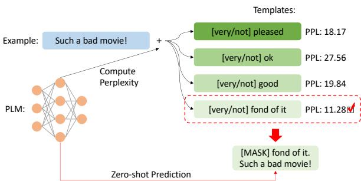
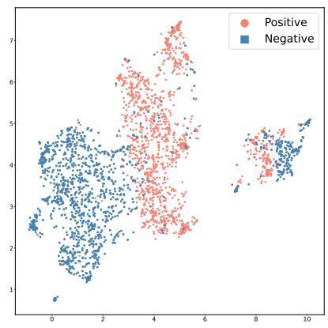
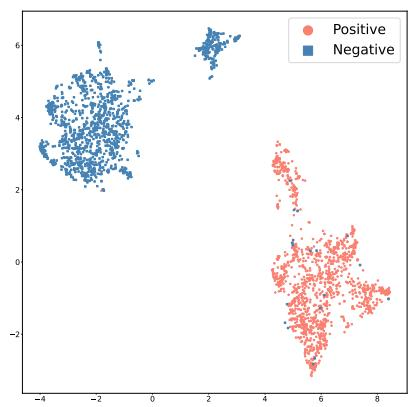
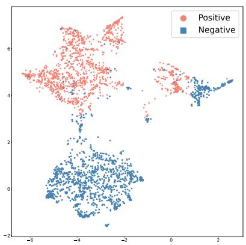
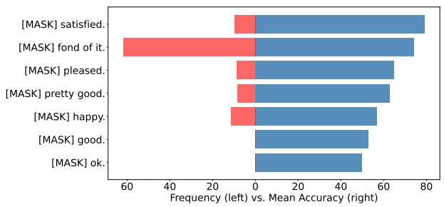
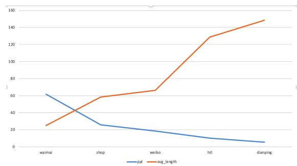

# What Makes Pre-trained Language Models Better Zero-shot Learners?

Jinghui Lu1, Dongsheng Zhu+ 2, Weidong Han+ 2, Rui Zhao 1, Brian Mac Namee 3, Fei Tan∗ 1

1 SenseTime Research

2 Fudan University 3 School of Computer Science, University College Dublin {lujinghui1, zhaorui, tanfei}@sensetime.com {dszhu20, wdhan20}@fudan.edu.cn {brian.macnamee}@ucd.ie

## Abstract

Current methods for prompt learning in zeroshot scenarios widely rely on a development set with sufficient human-annotated data to select the best-performing prompt template a posteriori. This is not ideal because in a real-world zero-shot scenario of practical relevance, no labelled data is available. Thus, we propose a simple yet effective method for screening reasonable prompt templates in zero-shot text classification: Perplexity Selection (Perplection). We hypothesize that language discrepancy can be used to measure the efficacy of prompt templates, and thereby develop a substantiated perplexity-based scheme allowing for forecasting the performance of prompt templates in advance. Experiments show that our method leads to improved prediction performance in a realistic zero-shot setting, eliminating the need for any labelled examples.

## 1 Introduction

Prompt learning has been demonstrated to be a successful remedy for challenges associated with pre-training and fine-tuning paradigm, especially in zero/few-shot scenarios (Gao et al., 2021; Schick and Schütze, 2021a,b; Tam et al., 2021; Lu et al., 2022a).

Research has repeatedly shown that various transformer-based language models can benefit from prompt learning. For example, decoder-only models, such as those in the GPT family (Brown et al., 2020), can better generalise to unseen cases by prefixing inputs with a few training examples (in natural language). This is known as in-context learning (Brown et al., 2020; Xie et al., 2021; Liu et al., 2022a). Encoder-decoder models, such as T5 (Raffel et al., 2020) or BART (Lewis et al., 2020), can leverage prompt learning to train versatile models for multiple tasks (Khashabi et al.,

2020; Lester et al., 2021). Bidirectional encoderonly models, such as those in the BERT family (Devlin et al., 2018; Liu et al., 2019), can also manifest impressive zero-shot capacity when given proper prompts. These prompts often take the form of pre-training tasks, such as next sentence prediction (Sun et al., 2022) or masked language modeling (MLM) (Gao et al., 2021; Schick and Schütze, 2021a,b; Tam et al., 2021)—also known as clozestyle prompt learning.

Despite its success in encoder-only models, cloze-style prompt learning is sensitive to the specific involved templates. Multiple studies have shown that the design and choice of prompt templates greatly affect the effectiveness of zero-shot learning (Tam et al., 2021; Zhao et al., 2021; Rubin et al., 2022). Ideally, they are supposed to be as close as possible to the language used in downstream task. For example, in a sentiment analysis task, a suitable template may be “[very/not] pleased.” that carries emotional information. However, other templates can also be used here like “[very/not] good.”.

As shown in Table 1, the performance of zeroshot learning using different sentiment-bearing templates can fluctuate significantly with different prompt templates. For the ECOMMERCE dataset, the template “[very/not] pleased.” achieves the best zero-shot accuracy of 73.12%, while using the template “[very/not] good.” results in an accuracy of only 55.68%—which is only slightly better than random guessing. Additionally, if we choose a sentiment-irrelevant template “[yellow/green] black.”, the accuracy significantly drops to 50.49%, indicating that the model has no classification ability. This shows that the performance of the model is largely shaped by templates used. Therefore, selecting the most appropriate templates for downstream tasks is crucial in zero-shot learning.

Current prompt learning methods still rely on a development set of human-annotated data for post-hoc template selection (Tam et al., 2021; Sun et al., 2022; Gao et al., 2021; Liu et al., 2021a): all candidate templates are evaluated using the development set and the best-performing one is chosen. This requires human annotators and does not align well with realistic zero-shot learning scenarios in which no human-annotated data is available. To address this problem, we propose a truly annotationfree perplexity-based template selection method for zero-shot prompt learning: Perplexity Selection (Perplection). Experiments show that Perplection is highly likely to select the most effective template accommodating true zero-shot scenarios.

<table><tr><td rowspan="2">Dataset</td><td colspan="2">1. [very/not] pleased.</td><td colspan="2">2. [very/not] good.</td><td colspan="2">3. [extremely/less] pleased.</td><td colspan="2">4. [yellow/green] black.</td></tr><tr><td>PPL</td><td>Acc.(%)</td><td>PPL</td><td> $\mathbf { A c c } . ( \% )$ </td><td>PPL</td><td> $\mathbf { A c c } . ( \% )$ </td><td>PPL</td><td>Acc.(%)</td></tr><tr><td>DOUBAN</td><td>24.61</td><td>57.12</td><td>40.93</td><td>50.98</td><td>28.80</td><td>56.68</td><td>71.01</td><td>51.31</td></tr><tr><td>WEIBO</td><td>19.78</td><td>61.79</td><td>30.37</td><td>51.16</td><td>22.34</td><td>58.35</td><td>44.45</td><td>50.92</td></tr><tr><td>WAIMAI</td><td>16.44</td><td>67.80</td><td>23.34</td><td>53.15</td><td>19.68</td><td>69.72</td><td>36.07</td><td>48.49</td></tr><tr><td>ECOMMERCE</td><td>14.07</td><td>73.12</td><td>18.45</td><td>55.68</td><td>16.88</td><td>67.49</td><td>28.56</td><td>50.49</td></tr></table>

Table 1: Summary of mean perplexity scores and zero-shot accuracy of different prompt templates.

In this paper, we first describe cloze-style prompt learning and corresponding terminologies in Section 2. Then, in Section 3, we present our hypothesis that underpins the work. Based on this hypothesis, in Section 4 we detail Perplection that uses perplexity to select templates a priori without the need of any annotated examples. Section 5 describes a pilot study and in Section 6, we present realistic experiments that show that Perplection leads to performance on par with other zero-shot prompt methods that utilise a development set. Finally, Section 7 discusses the underlying rationales and the potential impact of the work in a large language models (LLM) era.

To the best of our knowledge, we spearhead the performance screening of prompt templates for a realistic zero-shot text classification without using any human-annotated data. \*

## 2 Preliminaries

In this section, we describe basic concepts and terminologies associated with prompt learning.

## 2.1 Prompt Learning

Note that the prompting settings and terminologies used in this work are mainly derived from the work that focuses on manual/automatic cloze-style discrete templates (Gao et al., 2021; Schick and

Schütze, 2021a,b; Tam et al., 2021). As text classification is well studied in prompt-based learning tasks (Liu et al., 2021a), we use a simple binary sentiment analysis task to demonstrate zero-shot prompt learning in our work. Specifically, given an input text x, for example “I love this movie.”, we are interested in classifying the sentiment polarity, y, of this input text, i.e., ++ for positive or  for negative. The cloze-style prompt method modifies the input x and output y to further exploit the capabilities of pre-trained language models. Formally, we first manipulate input text x to construct a new input text, x′, by prefixing (or suffixing) x with a template text sequence, t, that includes a “[MASK]” token. So, $\boldsymbol { x } ^ { \prime } = [ \boldsymbol { x } , t ]$ or $x ^ { \prime } = [ t , x ]$ . For example, if we have an input $x = " I$ love this movie.” and we decide to prefix a template t =“Overall, it was a [MASK] movie.”, x′ will become “Overall, it was a [MASK] movie. I love this movie.”.

Next, x′ is fed into a language model to predict the likelihood with which different tokens fill “[MASK]”. This can be achieved by applying an MLM head. Usually, researchers use prior knowledge to limit the set of potential filled tokens to those relevant to the task of interest. For example, in the sentiment classification example only two tokens would be considered: “good” and ‘bad”. We call each of these a label word, w, (Liu et al., 2021a). Finally, we define a mapping function (or verbaliser) (Liu et al., 2021a), v, to reverse the predicted label word back to the target y, for example {good:++, bad: }. In this way the prompting method unifies a binary classification objective into an MLM objective, reusing a MLM head to perform zero-shot prediction.

## 2.2 Language Discrepancy and Objective Gap

Previous research (Liu et al., 2021a) has shown that prompt learning can help pre-trained language models better adapt to downstream tasks by bridging the gap between pre-training and the downstream task. To be specific, prompt learning allows pretrained language models to take on a greater role in prediction, rather than just extracting features.

In light of the above finding, we identify two obstacles to combining pre-training and a downstream task: language discrepancy and the objective gap. The objective gap describes the difference in training objectives between pre-training (e.g., next sentence prediction or MLM) and a downstream task (e.g., sequence classification or sequence labelling). Language discrepancy refers to the linguistic differences between a pre-training corpus and downstream datasets, including different vocabularies, word frequencies, syntactic arrangements, etc.

## 3 Hypotheses

This section proposes two hypotheses that underpin our work, and describes the way they interpret observations in the literature.

## 3.1 Hypothesis I: Cloze-style Prompting Offers a Better Feature Space

Our first hypothesis is that the use of a cloze-style prompt in text classification alters the input data distribution in a way that encourages the input data to be more effectively represented in a new feature space. To illustrate this, Figure 2 presents a UMAP (McInnes et al., 2018) visualisation of a sentiment analysis dataset, WEIBO, with and without prompt templates. It is obvious that after being prompted with a task-specific template, “[very/not] pleased.”, data from different classes is much better separated within the resultant feature space (Figure 2(b)) than when no prompt template is used (Figure 2(a)). This shows that a pre-trained language model can inherit zero-shot capabilities when given appropriate prompts, even without using any humanannotated examples.

So how do pre-trained language models construct such effective feature spaces? We conjecture that this is because some knowledge of downstream tasks has been implicitly encoded into models through pre-training (e.g., MLM for encoderonly model or Next Word Prediction for decoderonly models). Prompt learning finds a method to uncover the knowledge obtained in pre-training. Therefore, in this paper, we refer to this feature space as the “pre-trained feature space”.

## 3.2 Hypothesis II: Language Discrepancy Measures the Efficacy of Prompting

Additionally, we aim to understand what makes a template effective at forming a useful pre-trained feature space. We believe that the difference in language between pre-training corpora and downstream datasets after prompting can be used to assess the effectiveness of templates.

  
Figure 1: The procedure of the Perplection approach.

Figure 2(c) shows an example. When the text inputs are given a prompt that is unlikely to be used in sentiment analysis texts, “[yellow/green] black.”, the data from different classes is not well separated in the feature space (as compared to Figure 2(b)). We believe that this is because models rarely encounter the text “yellow black” or “green black” prefixed in a sentiment-bearing text in the pretraining corpora, and that this language discrepancy limits the model’s ability to effectively represent the data. In contrast, expressions like “[very/not] pleased.” (Figure 2(b)) are often used in context related to emotions and therefore appear more frequently together with sentiment-bearing text in the pre-training corpora. This makes it easier for the model to form a useful pre-trained feature space.

Broadly speaking, we suppose that the objective gap has been greatly reduced by reformulating the downstream task to use a prompt in text classification. The inconsistency is largely due to the language differences between the pre-training data and the downstream data. Using prompt templates helps to align the downstream text with the text in a pre-training corpus with respect to language discrepancy. The smaller the language discrepancy between the pre-training data and the downstream data that are being prompted, the more likely it is that the data will be represented well in the feature space, resulting in better zero-shot performance.

## 4 Method

As discussed in Section 3, a heuristic approach can be employed to select the most effective templates in zero-shot text classification. One way to do this is to utilise language discrepancy to “forecast” the performance of different prompt templates. Specifically, the prompt template that results in the lowest language discrepancy when prefixed to a given input text can be considered the most effective. However, how can the language discrepancy between downstream text and pre-training corpora be measured? In this study, we propose using perplexity (Brown et al., 1992) as an approximation of language discrepancy.

  
(a) No template

  
(b) [very/not] pleased.

  
(c) [yellow/green] black.  
Figure 2: UMAP visualisation of a sentiment analysis dataset WEIBO: (a) no template, (b) task-relevant template, and (c) irrelevant template. (Best viewed in color.)

Perplexity is one of the most common metrics for evaluating language models, and is defined as the exponential average negative log-likelihood of a sequence:

$$
\operatorname { P P L } ( x ) = \exp \left\{ - { \frac { 1 } { t } } \sum _ { i } ^ { t } \log p _ { \theta } ( x _ { i } \mid x _ { < i } ) \right\}\tag{1}
$$

where $\mathbf { \boldsymbol { \mathit { x } } _ { \lambda } } ~ = ~ \left[ \mathit { x } _ { 1 } , \mathit { x } _ { 2 } , . . . , \mathit { x } _ { t } \right]$ is a tokenised text sequence; and log pθ $( x _ { i } \mid x < i )$ is the loglikelihood of the $i ^ { t h }$ token conditioned on the preceding tokens $\textit { x } < \textit { i }$ computed by a language model. Intuitively, given a certain language model, lower perplexity for a corpus of sentences indicates a model is familiar with that corpus. Basically, the language model with the lowest perplexity is chosen as the most reliable proxy for modelling the distribution of the pre-training corpus.

Analogously, we assume that prompt templates resulting in low perplexity when prefixed to a given input are likely to be effective templates, eliminating the need for a human-annotated development set, which is required in most previous work (Liu et al., 2021a; Lester et al., 2021; Gao et al., 2021). Specifically, as shown in Figure 1, we prefix original input x with various prompt templates to form new prompted texts. For each template, since we have two label words (i.e., “very” and “not”), one original input x will generate two prompted texts (i.e., “Very pleased. Such a bad movie!” and “Not pleased. Such a bad movie!”). Then we compute the mean perplexity score of these two prompted texts as the score for the template. Finally, the template (where the label words will be replaced with "[MASK]" token) with lowest score is selected to be prefixed to the original input, constructing new input x′ (i.e., “[MASK] pleased. Such a bad movie!”) to perform a zero-shot prediction. This is quite different from previous methods with datasetspecific (Gao et al., 2021; Sun et al., 2022) or classspecific templates (Zhou et al., 2022). We refer to the method as Perplexity Selection (Perplection).

## 5 Pilot Study

The aim of the pilot study described in this section was to qualitatively validate the hypotheses proposed in Section 3, and to examine the utility of perplexity as a metric for screening prompt templates (another study that examines the utility of perplexity is presented in Appendix D). To this end, we manually curated four prompt templates as shown in Table 1. We then analysed the perplexity and zero-shot performance of each template, seeking to determine whether there is a correlation between perplexity and zero-shot performance.

## 5.1 Datasets

We conducted the pilot study using four publicly available Chinese sentiment analysis datasets from various domains. These datasets are: DOUBAN, a movie review dataset; WEIBO, a social media comment dataset; WAIMAI, a takeaway comment dataset; ECOMMERCE, an e-commerce dataset.

## 5.2 Perplexity

We use the Chinese RoBERTa model\* as the backbone pre-trained model. Given a pre-trained language model, we use it to compute the mean perplexity of downstream datasets that are being prompted, to approximate the language discrepancy. That is, lower perplexity indicates smaller language discrepancy between the pre-training corpus and the prompted downstream dataset.

Note that perplexity, as originally defined, applies specifically to causal language models (i.e., autoregressive language models). As suggested in previous work (Liu et al., 2019; Salazar et al., 2020), perplexity for bidirectional models like BERT/RoBERTa can be made analogous to that for causal language models by replacing log pθ $( x _ { i } \mid x < i )$ with log $p _ { \theta } \left( x _ { i } \mid c \right)$ in Equation 1. Here, c refers to the context text, which is the whole sentence except for the ith token. This suggests that the perplexity of each token is not only conditioned on the preceding tokens but also the succeeding tokens. We added a template to each example, replaced the “[MASK]” with label words from the prediction problem, and calculated the average perplexity for each example. We then averaged the perplexity scores of all examples to get the overall perplexity of the dataset.

During preliminary experiments, however, we found that this definition of perplexity has the drawback of favouring longer sentences. That is, a sentence is assigned a lower perplexity, not because the pre-trained language model is more able to model this sentence (i.e., low language discrepancy), but rather because the text is longer. We conjecture that this is due to the penalty term in Equation 1 that divides the sum of log-likelihood by the sequence length t. The detail of our preliminary experiments regarding perplexity are provided in Appendix A. The focus of this pilot study, however, is to illustrate the impact of language discrepancy rather than finding useful measures of perplexity. So, to mitigate against the drawbacks of the perplexity definition the four datasets used in our experiments were subsampled to include only sentences with between 14 and 15 words, as well as to enforce a 50:50 class balance. Also, all hand-crafted templates have similar lengths (in Chinese).

## 5.3 Zero-shot Result Analysis

The accuracies achieved using different prompt templates for four datasets are shown in Table 1. These results demonstrate that prompt learning can equip a pre-trained language model with zero-shot capability when proper templates are provided. However, the performance of Template 4 (i.e., “[yellow/green] black”) demonstrates that “unusual” prompting (i.e., texts that models are unlikely to see during pre-training) has limited contribution to zero-shot prediction, which is consistent with our expectation.

To conclude, the results of the pilot study verify our hypothesis that in prompt learning, task-related templates are more useful in shaping a good pretrained feature space. The big difference between zero-shot performance across different prompting approaches in the pilot study shows that it is crucial to search for ideal prompt templates in prompt learning. We argue that this problem can be addressed by using perplexity as discussed in the following subsection.

## 5.3.1 Perplexity Analysis

Table 1 also conveys a very clear message that as perplexity goes up, the zero-shot performance becomes worse. For example, the perplexity of Template 1 decreases from 24.61 (DOUBAN), to 19.78 (WEIBO), to 16.44 (WAIMAI), to 13.71 (ECOM-MERCE); while the zero-shot accuracy consistently increases from 57.12 (DOUBAN), to 61.79 (WEIBO), to 67.80 (WAIMAI), to 73.12 (ECOM-MERCE). This pattern can also be observed for Templates 2 and 3. Furthermore, when comparing sentiment-bearing templates (Templates 1-3) to the sentiment-irrelevant template (Template 4) across datasets, it is evident that the sentimentirrelevant template consistently yields the highest perplexity and the lowest accuracy. The experimental results can partially verify our hypotheses that as the language discrepancy decreases (i.e., lower perplexity), it is easier for prompts to align downstream data to a pre-trained feature space. The next section describes experiments that show how the Perplection approach takes advantage of this.

## 6 Experiments

In this section, we demonstrate the proposed Perplection approach in a more realistic and useful experimental setting to verify whether we can use language discrepancy to forecast the efficacy of prompt templates for zero-shot classification.

<table><tr><td colspan="7">Binary Classification</td><td colspan="3">Multi-class Classification</td></tr><tr><td>Manual Templates</td><td>DOUBAN</td><td>WEIBO</td><td>WAIMAI</td><td>ECOMMERCE</td><td>EPRSTMT</td><td>TNEWS</td><td></td><td>CSLDCP</td><td>IFLYTEK</td></tr><tr><td>MRandomB</td><td>57.89</td><td>60.37</td><td>69.31</td><td>71.61</td><td>62.26</td><td>24.90</td><td>27.57</td><td></td><td>45.29</td></tr><tr><td rowspan="2">MPerplectionB MRandomR</td><td>59.86</td><td>64.71</td><td>79.01</td><td>81.78</td><td>67.86</td><td></td><td>29.05</td><td>23.36</td><td>47.76</td></tr><tr><td>55.72</td><td>60.47</td><td>66.43</td><td>72.49</td><td>67.40</td><td>24.56</td><td>26.95</td><td></td><td>44.94</td></tr><tr><td>MPerplectionR</td><td>60.74</td><td>66.50</td><td>75.49</td><td>85.12</td><td>76.89</td><td></td><td>35.92</td><td>36.75</td><td>55.88</td></tr><tr><td>Automatic Templates</td><td></td><td></td><td></td><td></td><td></td><td></td><td></td><td></td><td></td></tr><tr><td>ARandomB APerplectionB</td><td>54.27 53.07</td><td>52.39 57.60</td><td>56.57 53.15</td><td>58.52 68.16</td><td></td><td>53.18 55.24</td><td>28.45 25.67</td><td>37.77 38.74</td><td>51.17 51.29</td></tr><tr><td></td><td></td><td></td><td></td><td></td><td></td><td></td><td></td><td></td><td></td></tr><tr><td>ARandomR</td><td>53.83</td><td>52.50</td><td>56.02</td><td>58.83</td><td>53.14</td><td></td><td>25.72</td><td>41.31</td><td>49.29</td></tr><tr><td>APerplectionR</td><td>59.21</td><td>67.04</td><td>72.19</td><td>73.94</td><td>53.11</td><td></td><td>27.34</td><td>39.31</td><td>51.18</td></tr></table>

Table 2: Results for text classification datasets. B and R stand for BERT and RoBERTa models, respectively. The bolded entries represent the superior performance of the Perplection variant compared to its random counterpart. The underlined entries denote the top-performing method among all variants.
<table><tr><td colspan="7">Binary Classification Multi-class Classification</td></tr><tr><td>State-of-the-art Methods</td><td>DOUBAN</td><td>WEIBO</td><td>WAIMAI</td><td>ECOMMERCE</td><td>EPRSTMT TNEWS</td><td>CSLDCP</td><td>IFLYTEK</td></tr><tr><td>Zero-PET (Schick and Schütze, 2021a)</td><td>51.64</td><td>51.52</td><td>56.71</td><td>60.82</td><td>59.51</td><td>22.58 32.19</td><td>75.29</td></tr><tr><td>NSP-BERT (Sun et al., 2022)</td><td>60.85</td><td>68.58</td><td>83.69 91.11</td><td>79.67</td><td>49.55</td><td>48.43</td><td>78.82</td></tr><tr><td>MPerplectionR</td><td>60.74</td><td>66.50</td><td>75.49</td><td>85.12</td><td>76.89 35.92</td><td>36.75</td><td>55.88</td></tr></table>

Table 3: A comparison of the performance of Perplection with that of recent state-of-the-art methods.
<table><tr><td>ID</td><td>Manual Template (binary)</td><td>Manual Template (multi-class)</td><td>Automatic Template (TNEWS)</td></tr><tr><td>1</td><td>[MASK] satisfied</td><td>This belongs to [MASK]</td><td>New [MASK]:</td></tr><tr><td>2</td><td>[MASK] fond of it</td><td>The words belong to [MASK]</td><td>Good [MASK]:</td></tr><tr><td>3</td><td>[MASK] pleased</td><td>Actually it is [MASK]</td><td>《[MASK]》</td></tr><tr><td>4</td><td>[MASK] pretty good</td><td>Probably it is [MASK]</td><td>Good [MASK] !</td></tr><tr><td>5</td><td>[MASK] happy</td><td>The direction is [MASK]</td><td>Net [MASK]:</td></tr><tr><td>6</td><td>[MASK] good</td><td>This is due to [MASK]</td><td>Good [MASK]I</td></tr><tr><td>7</td><td>[MASK] ok</td><td>Put it into [MASK]</td><td>New [MASK]I</td></tr><tr><td>8</td><td></td><td>It means [MASK]</td><td>. [MASK] !</td></tr><tr><td>9</td><td></td><td>Obviously counted as [MASK]</td><td>Good [MASK],</td></tr><tr><td>10</td><td></td><td>Obviously it is [MASK]</td><td>In [MASK],</td></tr><tr><td>11</td><td></td><td></td><td>New [MASK]:</td></tr></table>

Table 4: The templates used for binary sentiment analysis and topic multi-class classification datasets. Due to space considerations, for automatically generated templates, we only present templates used in TNEWS. The red text denotes Chinese punctuation marks. More details are provided in Appendix B.

## 6.1 Datasets

In addition to the datasets mentioned in Section 5.1, we also utilise four text classification datasets from the FewCLUE benchmark (Xu et al., 2021): EPRSTMT (e-commerce comment sentiment analysis), CSLDCP (scientific literature subject classification), TNEWS (news classification), and IFLYTEK (APP description topic classification). To evaluate whether Perplection can be extended to other languages, we also evaluate Perplection on three English datasets: SST-2 (sentiment analysis) (Wang et al., 2018), TweetEval (hate speech detection) (Barbieri et al., 2020), and AG News (multi-class topic classification) (Zhang et al., 2015). Note that in contrast to the pilot study, in these experiments we did not subsample the datasets to make their sentences the same length.

## 6.2 Setup

All manually crafted templates are presented in Table 4. All the verbalisers and manual templates for English datasets can be seen in Appendix C. We perform Perplection based on these manually designed templates (MPerplection). If perplexity is an ideal metric, the performance of this method will be better than random template-example matching (MRandom). We then construct a more aggressive setting where templates are generated automatically by LM-BFF algorithm (Gao et al., 2021) (more detail is included in Appendix B) and apply similar template selection procedures to those described for manually crafted templates. These are dubbed APerplection and ARandom. In order to obtain a robust assessment of the random variants, we conduct five independent runs of the experiments using different random seeds and report the average results. Note that both manually crafted and automatically generated templates are constructed to have similar lengths.

We report the results based on both RoBERTa and BERT\* to demonstrate the proposed method is agnostic to the pre-trained model used. We also report the performance of another two state-ofthe-art zero-shot prompting-based methods: NSP-BERT (Sun et al., 2022), and Zero-PET (Schick and Schütze, 2021a; Xu et al., 2021). They are strong baselines whose settings comply with the corresponding work (further implementation details are provided in Appendix C).

## 6.3 Results

Comparison to random baselines: The results of the Perplection variants and their corresponding random counterparts were compared in Table 2. It can be seen that when using manually crafted templates with both BERT and RoBERTa, Perplection was able to actively select more useful templates compared to the random selection, as indicated by the significant improvement in performance (MRandomB vs. MPerplectionB and MRandomR vs. MPerplectionR). Also, when using automatically generated templates, Perplection is able to choose more effective templates, particularly when using RoBERTa (ARandomR vs. APerplectionR). These findings suggest that the templates selected by perplexity are more useful and deliver better performance. However, results also show that Perplection is less effective when automatically generated templates are used, which will be discussed in the next section.

Manual templates vs. automatic templates: Table 2 shows that variants using manually generated templates outperform their counterparts using automatically generated templates. We conjecture that the poor quality of automatically generated templates may hinder the performance of Perplection. In other words, the pool of automatically generated templates may be insufficient in diversity for Perplection to have an impact.

<table><tr><td>Datasets</td><td>EPRSTMT</td><td>TNEWS</td><td>CSLDCP</td><td>IFLYTEK</td></tr><tr><td>Manual Std.</td><td>57.26</td><td>68.39</td><td>1.51</td><td>6.28</td></tr><tr><td>Automatic Std.</td><td>32.78</td><td>50.50</td><td>1.45</td><td>5.46</td></tr></table>

Table 5: Comparison of perplexity standard deviation.

<table><tr><td>Datasets</td><td>SST-2</td><td>TweetEval</td><td>AG News</td><td>Avg.</td></tr><tr><td>MRandomB</td><td>67.13</td><td>52.39</td><td>41.31</td><td>53.61</td></tr><tr><td>MPerplectionB</td><td>68.17</td><td>53.67</td><td>43.92</td><td>55.25</td></tr><tr><td>MRandomR</td><td>58.79</td><td>54.65</td><td>36.85</td><td>50.09</td></tr><tr><td>MPerplectionR</td><td>57.96</td><td>55.16</td><td>42.30</td><td>51.81</td></tr></table>

Table 6: Results for three English classification datasets.

As illustrated in Table 4, the majority of automatic template texts display minimal variations and lack coherence, which is in stark contrast to the manual templates. In this case, templates tend to generate similar perplexities, leading to little distinction between them based on perplexity. To illustrate this, we report the standard deviation of perplexity for both manual templates and automatic templates in Table 5. It can be observed that for all datasets, the standard deviation of perplexity for manual templates is higher than that of automatic templates, showing that perplexity is more useful when the templates are of higher diversity.

It is suspected that the quality of the automatically generated templates is constrained by the capacity of the pre-trained T5 model. We believe that this can be improved by changing the T5 backbone or resorting to other methods that automatically generate templates using annotation information (Lester et al., 2021; Liu et al., 2021b; Li and Liang, 2021; Liu et al., 2022b). We leave these explorations for future work.

Comparison to state-of-the-art approaches: We compare our best performing method (MPerplectionR) with other state-of-the-art zero-shot methods, results are shown in Table 3. We find that the performance of Perplection consistently surpasses Zero-PET for all datasets by a large margin except for TNEWS, and is competitive with NSP-BERT in some datasets such as DOUBAN (60.74 vs. 60.85). Note that both Zero-PET and NSP-BERT used a human-annotated development set to select the most suitable templates while Perplection does not require any annotated data.

For the IFLYTEK dataset, Perplection seems less competitive as compared to Zero-PET and NSP-BERT. Specifically, the latter two methods heavily rely on the post-hoc selected template “This is a [MASK] app.” (see Appendix C) with the development set quite close to target domain of interest, whereas Perplection has more generic templates (in Table 4, those prompts are task-related but not domain-relevant). Thus, the suboptimal performance of Perplection can also be explained by our hypothesis that generic templates are less effective at aligning the downstream data into a pre-trained feature space compared to those finegrained domain-specific templates. We suspect that this can be addressed by providing Perplection with several domain-related fine-grained templates to select from. We leave these explorations for future work. All observations, however, show that it is effective to use perplexity to rate templates and select desired ones accordingly.

Results on English datasets: Table 6 compares the performance of Perplection to random baselines on three English datasets. Perplection consistently tops the comparison in almost all cases except for SST-2 with RoBERTa. This observation supports the supposition that Perplection is agnostic to the pre-trained model used, and shows that it is promising to extrapolate results to other languages.

## 6.4 In-depth Analysis

We conduct an in-depth analysis based on MPerplectionR. For brevity, we apply each manual prompting setting to all examples from the four datasets (i.e., DOUBAN, WEIBO, WAIMAI, ECOM-MERCE) and aggregate the accuracy score as a post-hoc measurement of template quality. For each template, we also compute its frequency of being selected. The results are presented in Figure 3. It shows that templates with lower perplexity are more likely to achieve better performance. To be specific, there is 60% chance for Perplection to select the second best performing template (i.e., “[MASK] fond of it.”) and around 10% chance to select the best performing template (i.e., “[MASK] satisfied.”). For templates with no discriminative ability e.g., “[MASK] good.” and “[MASK] ok.”, our method has almost no chance to select them. Most importantly, the selection based on perplexity is annotation-agnostic and allows us to “foresee” the result to some extent without the need of a human-annotated development set. To conclude, the results demonstrate that perplexity is a reasonable metric for evaluating prompting settings.

  
Figure 3: Normalised frequency of being selected vs. template quality measured by mean accuracy.

## 7 Discussion

What contributes better zero-shot learners? This work empirically reveals that the large language discrepancy between the pre-training corpora and the downstream data may hinder the zeroshot generalization. On top of that, we develop a perplexity-based scheme that leverages cloze-style prompt templates to bridge language discrepancy and thus, fully releases the potential of pre-trained language models. The significance of this work lies in its pioneering study of a feasible objective for optimising REALISTIC zero-shot prompting templates. The idea may be applied to various variations (e.g., continuous prompts) beyond the discrete prompts currently being studied.

Why REALISTIC zero-shot matters? In this work, we constantly emphasise a realistic zero-shot scenarios (no labelled data), as opposed to the existing zero-shot setting in the field of NLP (Xu et al., 2021; Sun et al., 2022) or Multi-modality (Radford et al., 2021), where a development set is available for template selection or hyper-parameter tuning. Realistic zero-shot can be quite appealing for industrial scenarios and thus, this research opens up a new avenue for research in the field of zero-shot learning, probably inspiring follow-up studies in broader tasks for advancing the zero-shot learning in industrial applications (especially in many low-resource scenarios).

Potential impact in the LLM era. In light of the advancements in large language models (LLM) based on the decoder-only architecture (Zhao et al., 2023), searching for effective instructions or incontext demonstration examples (Zhang et al., 2022) has become an essential challenge. Perplection can be seamlessly applied to decoderonly models for searching effective instructions/incontext examples for various natural language generation (NLG) tasks. We make our code available for replication and further extension to NLG tasks by the community.

## 8 Conclusion

We developed Perplexity Selection Prompt (Perplection) a method that enables real-world zeroshot text classification without the use of any human-annotated data. A pilot study demonstrated that Perplexity can be an effective measure of the efficacy of templates. Experimental results show that, for datasets in both English and Chinese, our method can boost zero-shot performance of clozestyle prompt learning in binary sentiment analysis as well as multi-class classification, without using a development set. Further in-depth analysis supports the observation that Perplection can “foresee” the efficacy of prompt templates.

## 9 Limitations

In this study, we mainly utilised the BERT family of models for Chinese text classification tasks. Given the similarity with respect to transformer language models and pre-training paradigms, as well as the preliminary results on English datasets as discussed in Section 6.3, we may be able to extrapolate the results to other architectures/tasks/languages.

For example, Perplection can be seamlessly apply to decoder-only models (e.g., GLM (Du et al., 2022), LLaMA (Touvron et al., 2023)) to see whether it can boost the performance for those NLG tasks. But further investigation is needed to verify the utility of findings on other model architectures, tasks, and languages. In the future, we expect to see Perplection applied to different NLG tasks such as seq2seq information extraction (Lu et al., 2022b), question answering, arithmetic reasoning, machine translation or even multi-modality tasks.

Also, utilising Perplection may exacerbate the inherent limitations of pre-trained language models. We suspect that, in instances where the model has not been exposed to certain texts or concepts during pre-training, reliance on perplexity for template selection may result in subpar performance. In the future, we expect to explore whether we can alleviate this problem by certain annotation-free methods, such as continuous self-supervised training with downstream data, or extend our method in a few-shot setting where limited label information is available.

Besides, the use of perplexity as a metric has the drawback of favoring long texts, which forces us to design templates of the same length. Therefore, a length-agnostic metric can be considered as an alternative.

## 10 Ethics Statement

We honor the ACL Code of Ethics. No private data or non-public information was used in this work. We conducted our research in an objective and unbiased manner. We take full responsibility for the content of this paper and stand behind the accuracy and integrity of our work.

## Acknowledgements

We would like to thank anonymous reviewers for their insightful comments to help improve the paper. This publication has emanated from research conducted with the support of SenseTime Research.

## References

Francesco Barbieri, Jose Camacho-Collados, Luis Espinosa Anke, and Leonardo Neves. 2020. TweetEval: Unified benchmark and comparative evaluation for tweet classification. In Findings of the Association for Computational Linguistics: EMNLP 2020, pages 1644–1650, Online. Association for Computational Linguistics.

Peter F. Brown, Stephen A. Della Pietra, Vincent J. Della Pietra, Jennifer C. Lai, and Robert L. Mercer. 1992. An estimate of an upper bound for the entropy of English. Computational Linguistics, 18(1):31–40.

Tom Brown, Benjamin Mann, Nick Ryder, Melanie Subbiah, Jared D Kaplan, Prafulla Dhariwal, Arvind Neelakantan, Pranav Shyam, Girish Sastry, Amanda Askell, et al. 2020. Language models are few-shot learners. Advances in neural information processing systems, 33:1877–1901.

Jacob Devlin, Ming-Wei Chang, Kenton Lee, and Kristina Toutanova. 2018. Bert: Pre-training of deep bidirectional transformers for language understanding. arXiv preprint arXiv:1810.04805.

Zhengxiao Du, Yujie Qian, Xiao Liu, Ming Ding, Jiezhong Qiu, Zhilin Yang, and Jie Tang. 2022. GLM: General language model pretraining with autoregressive blank infilling. In Proceedings of the 60th Annual Meeting of the Association for Computational Linguistics (Volume 1: Long Papers), pages 320–335, Dublin, Ireland. Association for Computational Linguistics.

Tianyu Gao, Adam Fisch, and Danqi Chen. 2021. Making pre-trained language models better few-shot

learners. In Proceedings of the 59th Annual Meeting of the Association for Computational Linguistics and the 11th International Joint Conference on Natural Language Processing (Volume 1: Long Papers), pages 3816–3830, Online. Association for Computational Linguistics.

Daniel Khashabi, Sewon Min, Tushar Khot, Ashish Sabharwal, Oyvind Tafjord, Peter Clark, and Hannaneh Hajishirzi. 2020. UNIFIEDQA: Crossing format boundaries with a single QA system. In Findings ofthe Associationfor Computational Linguistics: EMNLP 2020, pages 1896–1907, Online. Association for Computational Linguistics.

Brian Lester, Rami Al-Rfou, and Noah Constant. 2021. The power of scale for parameter-efficient prompt tuning. In Proceedings of the 2021 Conference on Empirical Methods in Natural Language Processing, pages 3045–3059, Online and Punta Cana, Dominican Republic. Association for Computational Linguistics.

Mike Lewis, Yinhan Liu, Naman Goyal, Marjan Ghazvininejad, Abdelrahman Mohamed, Omer Levy, Veselin Stoyanov, and Luke Zettlemoyer. 2020. BART: Denoising sequence-to-sequence pre-training for natural language generation, translation, and comprehension. In Proceedings ofthe 58th Annual Meeting ofthe Associationfor Computational Linguistics, pages 7871–7880, Online. Association for Computational Linguistics.

Xiang Lisa Li and Percy Liang. 2021. Prefix-tuning: Optimizing continuous prompts for generation. In Proceedings ofthe 59th Annual Meeting ofthe Associationfor Computational Linguistics and the 11th International Joint Conference on Natural Language Processing (Volume 1: Long Papers), pages 4582– 4597, Online. Association for Computational Linguistics.

Jiachang Liu, Dinghan Shen, Yizhe Zhang, Bill Dolan, Lawrence Carin, and Weizhu Chen. 2022a. What makes good in-context examples for GPT-3? In Proceedings ofDeep Learning Inside Out (DeeLIO 2022): The 3rd Workshop on Knowledge Extraction and Integration for Deep Learning Architectures, pages 100–114, Dublin, Ireland and Online. Association for Computational Linguistics.

Pengfei Liu, Weizhe Yuan, Jinlan Fu, Zhengbao Jiang, Hiroaki Hayashi, and Graham Neubig. 2021a. Pretrain, prompt, and predict: A systematic survey of prompting methods in natural language processing. arXiv preprint arXiv:2107.13586.

Xiao Liu, Kaixuan Ji, Yicheng Fu, Weng Tam, Zhengxiao Du, Zhilin Yang, and Jie Tang. 2022b. P-tuning: Prompt tuning can be comparable to fine-tuning across scales and tasks. In Proceedings of the 60th Annual Meeting of the Association for Computational Linguistics (Volume 2: Short Papers), pages 61–68, Dublin, Ireland. Association for Computational Linguistics.

Xiao Liu, Yanan Zheng, Zhengxiao Du, Ming Ding, Yujie Qian, Zhilin Yang, and Jie Tang. 2021b. Gpt understands, too. arXiv preprint arXiv:2103.10385.

Yinhan Liu, Myle Ott, Naman Goyal, Jingfei Du, Mandar Joshi, Danqi Chen, Omer Levy, Mike Lewis, Luke Zettlemoyer, and Veselin Stoyanov. 2019. Roberta: A robustly optimized bert pretraining approach. arXiv preprint arXiv:1907.11692.

Jinghui Lu, Linyi Yang, Brian Namee, and Yue Zhang. 2022a. A rationale-centric framework for humanin-the-loop machine learning. In Proceedings of the 60th Annual Meeting of the Association for Computational Linguistics (Volume 1: Long Papers), pages 6986–6996, Dublin, Ireland. Association for Computational Linguistics.

Jinghui Lu, Rui Zhao, Brian Mac Namee, and Fei Tan. 2022b. Punifiedner: a prompting-based unified ner system for diverse datasets. ArXiv, abs/2211.14838.

Leland McInnes, John Healy, Nathaniel Saul, and Lukas Großberger. 2018. Umap: Uniform manifold approximation and projection. Journal ofOpen Source Software, 3(29):861.

Alec Radford, Jong Wook Kim, Chris Hallacy, Aditya Ramesh, Gabriel Goh, Sandhini Agarwal, Girish Sastry, Amanda Askell, Pamela Mishkin, Jack Clark, et al. 2021. Learning transferable visual models from natural language supervision. In International Conference on Machine Learning, pages 8748–8763. PMLR.

Colin Raffel, Noam Shazeer, Adam Roberts, Katherine Lee, Sharan Narang, Michael Matena, Yanqi Zhou, Wei Li, and Peter J. Liu. 2020. Exploring the limits of transfer learning with a unified text-to-text transformer. Journal ofMachine Learning Research, 21(140):1–67.

Ohad Rubin, Jonathan Herzig, and Jonathan Berant. 2022. Learning to retrieve prompts for in-context learning. In Proceedings of the 2022 Conference of the North American Chapter ofthe Associationfor Computational Linguistics: Human Language Technologies, pages 2655–2671, Seattle, United States. Association for Computational Linguistics.

Julian Salazar, Davis Liang, Toan Q. Nguyen, and Katrin Kirchhoff. 2020. Masked language model scoring. In Proceedings of the 58th Annual Meeting of the Associationfor Computational Linguistics, pages 2699–2712, Online. Association for Computational Linguistics.

Timo Schick and Hinrich Schütze. 2021a. Exploiting cloze-questions for few-shot text classification and natural language inference. In Proceedings of the 16th Conference of the European Chapter of the Associationfor Computational Linguistics: Main Volume, pages 255–269, Online. Association for Computational Linguistics.

Timo Schick and Hinrich Schütze. 2021b. It’s not just size that matters: Small language models are also fewshot learners. In Proceedings ofthe 2021 Conference of the North American Chapter of the Association for Computational Linguistics: Human Language Technologies, pages 2339–2352, Online. Association for Computational Linguistics.

Yi Sun, Yu Zheng, Chao Hao, and Hangping Qiu. 2022. NSP-BERT: A prompt-based few-shot learner through an original pre-training task —— next sentence prediction. In Proceedings of the 29th International Conference on Computational Linguistics, pages 3233–3250, Gyeongju, Republic of Korea. International Committee on Computational Linguistics.

Derek Tam, Rakesh R. Menon, Mohit Bansal, Shashank Srivastava, and Colin Raffel. 2021. Improving and simplifying pattern exploiting training. In Proceedings ofthe 2021 Conference on Empirical Methods in Natural Language Processing, pages 4980–4991, Online and Punta Cana, Dominican Republic. Association for Computational Linguistics.

Hugo Touvron, Thibaut Lavril, Gautier Izacard, Xavier Martinet, Marie-Anne Lachaux, Timothée Lacroix, Baptiste Rozière, Naman Goyal, Eric Hambro, Faisal Azhar, et al. 2023. Llama: Open and efficient foundation language models. arXiv preprint arXiv:2302.13971.

Alex Wang, Amanpreet Singh, Julian Michael, Felix Hill, Omer Levy, and Samuel Bowman. 2018. GLUE: A multi-task benchmark and analysis platform for natural language understanding. In Proceedings of the 2018 EMNLP Workshop BlackboxNLP: Analyzing and Interpreting Neural Networks for NLP, pages 353–355, Brussels, Belgium. Association for Computational Linguistics.

Sang Michael Xie, Aditi Raghunathan, Percy Liang, and Tengyu Ma. 2021. An explanation of in-context learning as implicit bayesian inference. arXiv preprint arXiv:2111.02080.

Liang Xu, Xiaojing Lu, Chenyang Yuan, Xuanwei Zhang, Huilin Xu, Hu Yuan, Guoao Wei, Xiang Pan, Xin Tian, Libo Qin, et al. 2021. Fewclue: A chinese few-shot learning evaluation benchmark. arXiv preprint arXiv:2107.07498.

Xiang Zhang, Junbo Jake Zhao, and Yann LeCun. 2015. Character-level convolutional networks for text classification. In NIPS.

Yiming Zhang, Shi Feng, and Chenhao Tan. 2022. Active example selection for in-context learning. In Proceedings of the 2022 Conference on Empirical Methods in Natural Language Processing, pages 9134– 9148, Abu Dhabi, United Arab Emirates. Association for Computational Linguistics.

Wayne Xin Zhao, Kun Zhou, Junyi Li, Tianyi Tang, Xiaolei Wang, Yupeng Hou, Yingqian Min, Beichen Zhang, Junjie Zhang, Zican Dong, et al. 2023. A

survey of large language models. arXiv preprint arXiv:2303.18223.

Zihao Zhao, Eric Wallace, Shi Feng, Dan Klein, and Sameer Singh. 2021. Calibrate before use: Improving few-shot performance of language models. In Proceedings of the 38th International Conference on Machine Learning, volume 139 of Proceedings ofMachine Learning Research, pages 12697–12706. PMLR.

Kaiyang Zhou, Jingkang Yang, Chen Change Loy, and Ziwei Liu. 2022. Learning to prompt for visionlanguage models. International Journal ofComputer Vision, 130(9):2337–2348.

## A Issue of Perplexity

We find that the current perplexity definition has the drawback of favouring longer sentences. That is, a sentence is assigned a lower perplexity, not because the pre-trained language model can more easily model this sentence (i.e., lower language discrepancy), but rather because the text is longer. We first use a simple comparison to demonstrate this as shown in Table 7. We calculate the perplexity of a meaningful sentence “Auntie: Don’t be too tired [haha]” which is 17.21. However, if we prefix this sentence with a long sequence of nonsense words, the perplexity even gets lower, i.e., 5.85. We then conduct a large scale test to see the correlation between perplexity and text length. The results are presented in Figure 4, it is obvious that the avg. perplexity is inversely proportional to avg. text length. In other words, a low perplexity of a sentence is partially contributed by a low language discrepancy but more likely to be contributed by a long text, which challenges our use of perplexity to measure language discrepency.

  
Figure 4: Line chart of average perplexity and average text length across different datasets. The x-axis represents the dataset, the blue line is the mean perplexity score while the orange line is the mean text length.

<table><tr><td>Text in Chinese</td><td>Translation</td><td>Perplexity</td></tr><tr><td>阿姨：不要太累了[哈哈]</td><td>Auntie: Don&#x27;t be too tired [haha]</td><td>17.21</td></tr><tr><td>撒娇大法，啊的身份拉升大盘撒娇大法，啊 的身份拉盘。阿姨：不要太累了[哈哈]</td><td>Coquetry Dafa, ah&#x27;s identity pulls up the big market Coquettish Dafa, ah&#x27;s identity pulls the plate. Auntie: Don&#x27;t be too tired [haha]</td><td>5.85</td></tr></table>

Table 7: Comparison of a long nonsense sentence with a short fluent sentence.
<table><tr><td>Dataset</td><td>Mapping</td></tr><tr><td>TNEWS</td><td>{100:&#x27;故事’(story),101:&#x27;文化’(cultural),102:&#x27;娱乐’(entertainment),103:&#x27;体育’(sports), 104:&#x27;财经’(finance),106:&#x27;房产&#x27;(real estate),107:&#x27;汽车’(automobile),108:&#x27;教育’(education), 109:&#x27;科技’(technology),110:&#x27;军事’(military),112:&#x27;旅游’(trip),113:&#x27;国际’(world-wide), 114:&#x27;股票’(stock),115:&#x27;农业’(agricultural),116:&#x27;电竞’(e-sports)}</td></tr><tr><td>CSLDCP</td><td>{&#x27;材料科学与工程’:&#x27;材料’(Materials),&#x27;力学&#x27;’:&#x27;力学’(Mechanics), &#x27;园艺学’:&#x27;园艺’(Horticulture),&#x27;水产’:&#x27;水产’(Aquaculture),&#x27;航空宇航科学与技术&#x27;:’航空’(Aerospace Science), &#x27;建筑学’:&#x27;建筑’(Architecture),&#x27;林学/林业工程’:&#x27;林业’(Forestry),&#x27;天文学’:&#x27;天文’(Astronomy), &#x27;机械工程’:&#x27;机械’(Mechanical),&#x27;地理学&#x27;:&#x27;地理’(Geography),&#x27;大气科学’:&#x27;大气’(Atmospheric Science), &#x27;测绘科学与技术’:&#x27;测绘’(Geodesy),&#x27;军事学’:’军事’(Military Science),&#x27;新闻传播学’:’新闻’(Journalism), &#x27;植物保护’：&#x27;植物’(Plant)}</td></tr><tr><td>IFLYTEK</td><td>{107:&#x27;团购’(group buy),110:&#x27;超市’(supermarket),113:&#x27;办公&#x27;(office),18:&#x27;动作’(motion),2:&#x27;免费’(free), 30: &#x27;情侣’(dating),3:&#x27;租车’(ride-hailing),42:&#x27;百科’(encyclopedia),48:&#x27;音乐’(music), 64:&#x27;民航’(airline), 75:&#x27;汽车’(automobile), 87:&#x27;美妆&#x27;(makeup),89:&#x27;餐饮’(food),91:&#x27;运动’(fitness),92:&#x27;支付’(payment)}</td></tr></table>

Table 8: The mapping of class names to label words with equal length. Translations are provided in brackets.
<table><tr><td rowspan=1 colspan=1>Task</td><td rowspan=1 colspan=1>| Perplection</td><td rowspan=1 colspan=1>| Zero-PET</td><td rowspan=1 colspan=1>|NSP-BERT</td></tr><tr><td rowspan=1 colspan=1>Sentiment Analysis datasets(i.e., WAIMAI, WEIBO,DOUBAN, ECOMMERCE,EPRSTMT)</td><td rowspan=1 colspan=1>Template1: [MASK]满意。([MASK] satisfied.)Template2: [MASK]喜欢。([MASK] font of it.)Template3: [MASK]高兴。([MASK] pleased.)Template4: [MASK]可以。([MASK] pretty good.)Template5: [MASK]开心。([MASK] happy.)Template6: [MASK]好。 ([MASK] good.)Template7: [MASK]行。([MASK] ok.)Label words: 很;不 (very; not)</td><td rowspan=1 colspan=1>Template: 这次买的东西很[MASK]。(The things I bought this time is very [MASK].)Label words: 好;差 (good; bad)</td><td rowspan=1 colspan=1>Template: 这次买的东西很[MASK].(The things I bought this time is very [MASK].)Label words: 好;差 (good; bad)</td></tr><tr><td rowspan=1 colspan=1>TNEWS</td><td rowspan=1 colspan=1>Template1: 这属于是[MASK]。(This belongs to [MASK])Template2: 此话属于[MASK]。(The words belong to [MASK])Template3: 实际上, [MASK]。(Actually it is [MASK])Template4: 应该算是[MASK]。(Probably it is [MASK])</td><td rowspan=1 colspan=1>Template: 这是—则[MASK]新闻。(This is a [MASK] news.)Label words: 故事;文化:娱乐... (story; cultural; entertainment...)</td><td rowspan=1 colspan=1>Template: 这是—则[MASK]新闻. (This is a [MASK] news.)Label words: 故事:文化:娱乐... (story; cultural; entertainment...)</td></tr><tr><td rowspan=1 colspan=1>CSLDCP</td><td rowspan=1 colspan=1>Template6: 归功于[MASK] 。(This is due to [MASK])Template7: 给它放到[MASK]。(Put it into [MASK])Template8: 它意思是[MASK]。(It means [MASK])Template9: 明显算[MASK]。(Obviously counted as [MASK])Template10: 显而易见[MASK]。(Obviously it is [MASK])Label words (TNEWS): 故事;文化;娱乐..(story; cultural; entertainment ...)</td><td rowspan=1 colspan=1>Template: 这是—篇[MASK]论文。(This is a [MASK] paper.)Label words: 材料;力学:园艺... (Materials; Mechanics; Horticulture...)</td><td rowspan=1 colspan=1>Template: 这是一则[MASK]论文. (This is a [MASK] paper.)Label words: 材料;力学;园艺 ... (Materials; Mechanics; Horticulture...)</td></tr><tr><td rowspan=1 colspan=1>IFLYTEK</td><td rowspan=1 colspan=1>Label words (CSLDCP): 材料:力学;园艺..(Materials; Mechanics; Horticulture...)Label words (IFLYTEK): 团购;超市;办公...(group buy; supermarket; office...)</td><td rowspan=1 colspan=1>Template: 这是—款[MASK]类软件。(This is a [MASK] app.)Label words: 团购;超市;办公 ... (group buy; supermarket; office...)</td><td rowspan=1 colspan=1>Template: 这是—则[MASK]类软件. (This is a [MASK] app.)Label words: 团购;超市;办公 ... (group buy; supermarket; office...)</td></tr></table>

Table 9: Manually generated templates and label words for Perplection, and other baselines Zero-PET and NSP-BERT. For Perplection and Zero-PET, we prefix the template. For NSP-BERT, we suffix the template as suggested in (Sun et al., 2022). Due to space considerations, we have omitted some label words, which can be referred to in Table 8. Translations are provided in brackets.

## B Automatic Template Generation

Similar to Gao et al. (2021), for the DOUBAN, WEIBO, WAIMAI, and ECOMMERCE datasets we fix the verbaliser to {very: ++, not: }, and use templates. Specifically, Gao et al. (2021) assume a few-shot scenario using ground truth label word as well as corresponding examples to generate a number templates. They then sort generated templates based on the aggregated generation probability (the calculation of generation probability also needs label information) of the whole training set. However, our experiment assumes a zero-shot scenario with no labelled data. Thus, for each dataset, we first randomly sample 50 examples from the pool. For each example, we use label words indicating both sentiments to generate templates, one for each sentiment, resulting in 100 templates in total. Then we remove duplicate templates, leaving around 59-73 templates remain per dataset respectively.

<table><tr><td rowspan=1 colspan=1>Dataset</td><td rowspan=1 colspan=1>Templates</td><td rowspan=1 colspan=1>Label Words</td></tr><tr><td rowspan=1 colspan=1>SST-2</td><td rowspan=1 colspan=1>Template1: that sounds like [MASK]Template2: this is obviously [MASK]Template3: it should be [MASK]Template4: actually, it&#x27;s [MASK]Template4: in fact, it&#x27;s [MASK]Template5: it&#x27;s very [MASK]Template6: it is [MASK]Template7: I mean it&#x27;s [MASK]Template8: it means [MASK]Template10: I think [MASK]</td><td rowspan=1 colspan=1>{&#x27;negative&#x27;: &#x27;negative&#x27;, &#x27;positive&#x27;: &#x27;positive&#x27;}</td></tr><tr><td rowspan=1 colspan=1>TweetEval</td><td rowspan=1 colspan=1>Template1: that sounds like [MASK]Template2: this is obviously [MASK]Template3: it should be [MASK]Template4: actually, it&#x27;s [MASK]Template4: in fact, it&#x27;s [MASK]Template5: it&#x27;s very [MASK]Template6: it is [MASK]Template7: I mean it&#x27;s [MASK]Template8: it&#x27;s like [MASK]Template10: whatever it is [MASK]</td><td rowspan=1 colspan=1>{0: &#x27;positive&#x27;, 1: &#x27;negative&#x27;}</td></tr><tr><td rowspan=1 colspan=1>AG News</td><td rowspan=1 colspan=1>Template1: this is [MASK]Template2: it is [MASK]Template3: I mean [MASK]Template4: actually, answer is [MASK]Template5: it should be [MASK]Template6: in fact, it&#x27;s [MASK]Template7: the sentence is [MASK]Template8: it belongs to [MASK]Template9: this news is [MASK]Template10: in my opinion [MASK]</td><td rowspan=1 colspan=1>0: &#x27;world&#x27;, 1: &#x27;sports&#x27;, 2: &#x27;business&#x27;, 3: &#x27;science&#x27;</td></tr></table>

Table 10: Manually generated templates and label words for Perplection in English datasets.

For the EPRSTMT, TNEWS, CSLDCP, and IFLY-TEK datasets, whose automatically generated templates have been made available,\*, we directly use those existing generated templates. We remove duplicate templates and around 11-22 templates remain per dataset. All automatically generated templates can be seen at URL masked for anonymous review.

<table><tr><td rowspan="2">Datasets</td><td colspan="3">1. [very/not] pleased.</td><td colspan="3">2. [yellow/red] black.</td></tr><tr><td>PPLg</td><td>PPLr</td><td>Diff.</td><td> $\mathbf { P P L _ { g } }$ </td><td>PPLr</td><td>Diff.</td></tr><tr><td>Douban</td><td>24.10</td><td>25.12</td><td>-1.02</td><td>67.91</td><td>74.11</td><td>-6.20</td></tr><tr><td>Weibo</td><td>19.17</td><td>20.39</td><td>-1.22</td><td>44.39</td><td>44.51</td><td>-0.12</td></tr><tr><td>Waimai</td><td>16.06</td><td>16.82</td><td>-0.76</td><td>22.60</td><td>24.07</td><td>-0.20</td></tr><tr><td>Online-shopping</td><td>13.55</td><td>14.58</td><td>-1.03</td><td>28.51</td><td>28.61</td><td>-0.10</td></tr></table>

Table 11: Mean perplexity of prompting with ground truth label word $( \mathrm { P P L _ { g } ) } .$ , prompting with reversed label word $( \mathrm { P P L } _ { \mathrm { r } } ) .$ , and difference between two templates computed by $\mathrm { P P L _ { g } }$ minus PPL (Diff.).

## C Implementation Details

In the implementation of Zero-PET, we use the pretrained Chinese-RoBERTa-wwm-ext model, which is identical to the model employed in Perplection. For NSP-BERT, we use google BERT-Chinese. Templates and label words for both baselines follow the best-performing setting reported in (Sun et al., 2022; Xu et al., 2021), as shown in Table 9. The manual generated templates (in Chinese) for Perplection are also shown in Table 9. A conversion is conducted to map class names to label words following (Xu et al., 2021) to ensure all prefixed texts have similar length, as shown in Table 8. For the CSLDCP and IFLYTEK datasets we randomly subsample 15 classes to facilitate the experiments.

In the implementation of English Perplection and its random counterparts, we use the pre-trained BERT-base-uncased\* and RoBERTa-base\* models. Templates and label words for English experiments are shown in Table 10. All experiments are conducted on a Tesla V100 GPU with 32GB memory.

## D Reverse Label Words

To briefly verify whether perplexity can be used to measure the quality of prompting, we perform a very simple experiment where we compute the mean perplexity score of prompted input $x ^ { \prime }$ with $\ddot { } / M A S K { } / \ '$ filled by ground truth label words for each dataset (called $\mathbf { P P L _ { g } } )$ ). Then we reverse the label words filled in previous input examples (e.g., we change “very pleased.” to “not pleased.” in a positive sentiment example) and recompute mean perplexity score (called $\bf P _ { \bf { P } } ( \bf _ { \bf { r } } )$ . Note that this experiment is based on RoBERTa. The results of this are shown in Table 11.

First, we notice that in Setting 1 (i.e., “[very/not] $p l e a s e d . ^ { \prime \prime } )$ , the mean perplexity of $\mathrm { P P L _ { g } }$ is always smaller than that of $\mathrm { P P L } _ { \mathrm { r } }$ by a clear margin which is encouraging. This shows that the pre-trained model can perceive the change of semantics in texts. When we see the perplexity of Setting 2 (i.e., “[yellow/red] $b l a c k ? { } ^ { \prime }$ , we find out the magnitude of change is much smaller, which demonstrates that replacing label words makes almost no difference to models if domain-irrelevant prompting is applied.

A For every submission: ✓ A1. Did you describe the limitations of your work? Section 9 Limitations

✓ A2. Did you discuss any potential risks of your work? Section 9 Limitations

✓ A3. Do the abstract and introduction summarize the paper’s main claims? Abstract and Section 1 Introduction

✗ A4. Have you used AI writing assistants when working on this paper? Left blank.

B ✗ Did you use or create scientific artifacts? Left blank.

 B1. Did you cite the creators of artifacts you used? No response.

 B2. Did you discuss the license or terms for use and / or distribution of any artifacts? No response.

 B3. Did you discuss if your use of existing artifact(s) was consistent with their intended use, provided that it was specified? For the artifacts you create, do you specify intended use and whether that is compatible with the original access conditions (in particular, derivatives of data accessed for research purposes should not be used outside of research contexts)? No response.

 B4. Did you discuss the steps taken to check whether the data that was collected / used contains any information that names or uniquely identifies individual people or offensive content, and the steps taken to protect / anonymize it? No response.

 B5. Did you provide documentation of the artifacts, e.g., coverage of domains, languages, and linguistic phenomena, demographic groups represented, etc.? No response.

 B6. Did you report relevant statistics like the number of examples, details of train / test / dev splits, etc. for the data that you used / created? Even for commonly-used benchmark datasets, include the number of examples in train / validation / test splits, as these provide necessary context for a reader to understand experimental results. For example, small differences in accuracy on large test sets may be significant, while on small test sets they may not be. No response.

## C ✓ Did you run computational experiments?

Left blank.

✓ C1. Did you report the number of parameters in the models used, the total computational budget (e.g., GPU hours), and computing infrastructure used? Section 5.2 Issue of Perplexity, Section 6.2 Setup, Appendix C Implementation Details

✓ C2. Did you discuss the experimental setup, including hyperparameter search and best-found hyperparameter values? Section 5.2 Issue of Perplexity, Section 6.2 Setup, Appendix A Issue of Perplexity, Appendix B Automatic Template Generation, Appendix C Implementation Details,

✓ C3. Did you report descriptive statistics about your results (e.g., error bars around results, summary statistics from sets of experiments), and is it transparent whether you are reporting the max, mean, etc. or just a single run? Section 6.3 Results, Section 6.4 In-depth Analysis

✓ C4. If you used existing packages (e.g., for preprocessing, for normalization, or for evaluation), did you report the implementation, model, and parameter settings used (e.g., NLTK, Spacy, ROUGE, etc.)? Section 5.2 Perplexity, Section 6.2 Setup, Appendix A Issue of Perplexity, Appendix B Automatic Template Generation, Appendix C Implementation Details,

D ✗ Did you use human annotators (e.g., crowdworkers) or research with human participants? Left blank.

 D1. Did you report the full text of instructions given to participants, including e.g., screenshots, disclaimers of any risks to participants or annotators, etc.? No response.

 D2. Did you report information about how you recruited (e.g., crowdsourcing platform, students) and paid participants, and discuss if such payment is adequate given the participants’ demographic (e.g., country of residence)? No response.

 D3. Did you discuss whether and how consent was obtained from people whose data you’re using/curating? For example, if you collected data via crowdsourcing, did your instructions to crowdworkers explain how the data would be used? No response.

 D4. Was the data collection protocol approved (or determined exempt) by an ethics review board? No response.

 D5. Did you report the basic demographic and geographic characteristics of the annotator population that is the source of the data? No response.