# What about em? How Commercial Machine Translation Fails to Handle (Neo-)Pronouns

Anne Lauscher1, Debora Nozza2, Archie Crowley3, Ehm Miltersen4, and Dirk Hovy2

1Data Science Group, Universität Hamburg, Germany

2Department of Computing Sciences, Bocconi University, Italy

3Linguistics, University of South Carolina

4School of Culture and Communication, Aarhus University

anne.lauscher@uni-hamburg.de, {debora.nozza, dirk.hovy}@unibocconi.it,

acrowley@sc.edu, e.hjorth.miltersen@gmail.com

## Abstract

As 3rd-person pronoun usage shifts to include novel forms, e.g., neopronouns, we need more research on identity-inclusive NLP. Exclusion is particularly harmful in one of the most popular NLP applications, machine translation (MT). Wrong pronoun translations can discriminate against marginalized groups, e.g., non-binary individuals (Dev et al., 2021). In this “reality check”, we study how three commercial MT systems translate 3rd-person pronouns. Concretely, we compare the translations of gendered vs. gender-neutral pronouns from English to five other languages (Danish, Farsi, French, German, Italian), and vice versa, from Danish to English. Our error analysis shows that the presence of a gender-neutral pronoun often leads to grammatical and semantic translation errors. Similarly, gender neutrality is often not preserved. By surveying the opinions of affected native speakers from diverse languages, we provide recommendations to address the issue in future MT research.

## 1 Introduction

Machine translation (MT) is one of the most common applications of NLP, with millions of daily users interacting with popular commercial providers (e.g., Bing, DeepL, or Google Translate). Given MT’s widespread use and the increased focus on fairness in language technologies (e.g., Hovy and Spruit, 2016; Blodgett et al., 2020), previous work has pointed to the potential ethical issues stemming from stereotypical biases encoded in the models, e.g., gender or age bias (e.g., Stanovsky et al., 2019; Levy et al., 2021, inter alia).

Still, these studies treat gender as a binary variable and ignore the larger spectrum of (possibly marginalized) identities, e.g., non-binary individuals. This gender exclusivity stands in stark contrast to the findings of Dev et al. (2021). Their survey of queer individuals showed that MT has the most potential for representational and allocational harms (Barocas et al., 2017) for non-cis users (compared to other NLP applications). In this context, survey respondents mentioned the translation of pronouns as particularly sensitive, as genderneutral pronouns might be translated into gendered pronouns, resulting in harmful misgendering.

While individual studies have investigated the translation of established (gender-neutral) pronouns (e.g., from Korean to English; Cho et al., 2019), NLP research, in general, has ignored the “modern world ofpronouns” as recently described by Lauscher et al. (2022). They discuss the large variety of existing phenomena in English 3rd-person pronoun usage, with more traditional neopronoun sets (e.g., xe/xem)1 and novel pronoun-related phenomena (e.g., nounself pronouns like vamp/vamp; Miltersen, 2016), which possibly match distinct aspects of an individuals identity.

As an example of ubiquitous NLP technology, truly inclusive MT should account for linguistic varieties that express identity aspects, like the large spectrum of pronouns related to the social push to respect diverse identities. However, until now, (a) there has been no information on how our systems (fail to) handle this linguistic shift, and (b) it is unclear how MT should deal with novel pronouns. This case is especially challenging when source language pronouns do not have direct correspondences in the target language.

Contributions. In this “reality check”, we investigate the handling of various (neo)pronouns in MT for advancing inclusive NLP. To this end, we combine an extensive analysis of MT performance across six languages (Danish, English, Farsi, French, German, and Italian) and three commercial MT engines (Bing, DeepL, and Google Translate) with results from the largest survey on pronoun usage among queer individuals in AI to date. We answer the following four research questions (RQs):

(RQ1) How do gender-neutral pronouns affect the overall translation quality? We show that compared to gendered pronouns, the translated output’s grammaticality and the source sequence’s semantic consistency drops by up to 16 percentage points and 47 percentage points, respectively, for some categories of neopronouns.

(RQ2) How do MT engines handle gender-neutral pronouns? We demonstrate that the strategies for how MT engines handle pronouns vary by pronoun category: while gendered pronouns are most often translated (89%), engines tend to simply copy some categories of neopronouns (e.g., 74% for the category of numberself-pronouns).

(RQ3) Which MT strategiesfor handling genderneutral pronouns “work”? We show that in 56% of cases when a traditional neopronoun is translated, it is translated to a gendered pronoun in the target language, likely leading to misgendering.

(RQ4) How should MT handle pronouns? The answers of 49 participants (149 participants in the pre-study) in our survey reflect the diversity of pronoun choices across English and other languages and the diversity of preferences in how individuals’ pronouns should be handled. There is no clear consensus! We thus recommend providing configuration options to adjust the treatment of pronouns to individuals’ needs.

## 2 Related Work

We review works on gender bias in MT and the broader area of (gender) identity inclusion in NLP. For a thorough survey on gender bias in MT, we refer to (Savoldi et al., 2021).

Gender Bias in MT. As with other areas of NLP (e.g., Bolukbasi et al., 2016; Gonen and Goldberg, 2019; Lauscher et al., 2020; Barikeri et al., 2021, inter alia), much research has been conducted on assessing (binary) gender bias in MT. Most prominently, Stanovsky et al. (2019) presented the WinoMT corpus, which allows for assessing occupational gender bias as an extension of Winogender (Rudinger et al., 2018) and WinoBias (Zhao et al., 2018). Troles and Schmid (2021) further extended WinoMT with gender-biased verbs and adjectives. Those corpora are template-based, while Levy et al. (2021) focused on collecting natural data, and Gonen and Webster (2020) proposed an automatic approach to detect gender issues in real-world input. Renduchintala et al. (2021) analyzed the effect of efficiency optimization on the measurable gender bias. Focusing on a different perspective, Hovy et al. (2020) assessed stylistic (gender) bias in translations. Other studies have examined specific language pairs, e.g., English and Hindi (Ramesh et al., 2021), English and Italian (Vanmassenhove and Monti, 2021), or English and Turkish (Ciora et al., 2021). Similarly, Cho et al. (2019) studied English–Korean translations focusing on translating gender-neutral pronouns from Korean. They introduced a measure reflecting the preservation of gender neutrality but do not consider any neopronouns. Based on similar data sets and measures, researchers have also addressed gender bias in MT, e.g., via domain adaptation (Saunders and Byrne, 2020), debiasing representations (Escudé Font and Costajussà, 2019), adding contextual information (Basta et al., 2020), and training on gender-balanced corpora (Costa-jussà and de Jorge, 2020). Some mitigation approaches exploit explicit gender annotations to guide the model in choosing the intended gender (e.g., Stafanovics et al.ˇ , 2020). In this context, Saunders et al. (2020) proposed a schema for adding inflection tags. For instance, they demonstrated how gender-neutral entities can be translated from English to another language by using a non-binary inflection tag.

Gender and Identity-Inclusion in NLP. While most MT studies on gender bias deal with a binary notion of gender, researchers have started to study non-binary gender and identity inclusivity in NLP downstream tasks and models. Qian et al. (2022) explored the robustness of models to demographic change using a perturber model that also considers non-binary gender identities, Cao and Daumé III (2020) studied gender inclusion in co-reference resolution, and Brandl et al. (2022) analyzed how gender-neutral pronouns are handled by language models in Danish, English, and Swedish for natural language inference and co-reference resolution. Nozza et al. (2022) and Holtermann et al. (2022) measured bias and harmfulness in language models towards LGBTQIA+ individuals. Other researchers focused on the problem more broadly. Orgad and Belinkov (2022) mention the binary treatment of gender as one of the essential pitfalls in gender bias evaluation, and Dev et al. (2021) surveyed the harms arising from non-binary exclusion in NLP, indicating MT as one particularly harmful application. Following up, Lauscher et al. (2022) explored the various phenomena related to 3rd-person pronoun usage in English, e.g., neopronouns. We are the first to study the translation of these novel pronoun-related phenomena in MT.

## 3 The Status Quo

To shed light on the state of identity inclusion through 3rd person pronouns in commercial MT, we conduct a thorough error analysis when translating from English (EN) to five diverse languages. We further describe an experiment opposite to this, translating from Danish (DA) to EN, in §3.3.

## 3.1 Experimental Setup

Our overall setup consists of 3 steps: (1) we create EN source sentences, each of which contains 3rd person pronouns representing different “pronoun categories” (e.g., gendered pronoun, etc.) in different grammatical cases. (2) Next, we employ an MT system to translate the EN sentences to five target languages. (3) Last, we let native speakers manually analyze the translations with respect to diverse criteria, e.g., grammaticality of the output.

Creation of EN Source Data. We start with the WinoMT data set (Stanovsky et al., 2019), designed to assess gender bias in MT and consisting of sentences that contain occupations stereotypically associated with women (e.g., secretary) or men (e.g., developer). We conduct an automatic morphological analysis on each pronoun in the data set.2 Based on the output, we randomly sample for each grammatical case (e.g., nominative, etc.), in which a 3rd person pronoun referring to an occupation appears in, two sentences: one in which the target occupation is stereotypically associated with men and one in which it is stereotypically associated with women. We then replace those pronouns with placeholders, indicating the case (e.g., <n> for nominative) of each. Since WinoMT does not contain pronouns in the possessive independent case, we create these by sampling additional sentences with possessive dependent pronouns and remove the target noun. Accordingly, we end up with 10 templates from WinoMT (2 for each of the 5 grammatical cases). Additionally, given that WinoMT sentences are designed to be more complex and ambiguous, we manually create two additional, simpler sentences for each grammatical case (10 in total). In these sentences, the pronoun placeholders refer to given names. In accordance with the WinoMT pattern, we choose the top name stereotypically associated with women and the top name stereotypically associated with men according to 2020 U.S. Social Security name statistics.3 We show example templates in Table 1.

We fill the placeholders with pronouns of the correct grammatical case taken from 8 sets of pronouns that reflect diverse pronoun-related phenomena as described by Lauscher et al. (2022). For example, we use she/ her /her/ hers/ herself as an instance of gendered pronouns, and vam/ vamp / vamps/ vamps/ vampself as an instance of nounself pronouns (Miltersen, 2016). The latter are prototypically derived from a noun, and possibly match distinct aspects of an individual’s identity. We list our test pronouns in Table 2. Our setup allows us to test the translation of sentences containing different types of pronouns, in all of their grammatical forms, in more and less complex sentences and in contexts that are prone to different stereotypical associations. Our procedure results in 164 EN sentences (4 sentences per 5 cases for each of the 8 pronoun sets plus 4 additional sentences for the variant themself instead of themselves).

Automatic Translation. Next, we automatically translate the EN source sentences to five languages: Danish (DA), Farsi (FA), French (FR), German (DE), and Italian (IT). We choose these languages based on (a) typological diversity, (b) our access to native speakers, and (c) their coverage by commercial MT. We ensure diversity with respect to family branches, scripts, and the handling of gender and pronouns in the languages: DE and DA represent the Germanic branch, FR and IT the Romanic branch, and FA the Iranian branch of Indo-European languages. DA, DE, FR, and IT employ the Latin script, and FA the Arabic one. Most importantly, the handling of grammatical gender and pronouns differs among languages. Concretely, DA, DE, FR, and IT are gendered languages but differ in their number of genders (e.g., DE has three grammatical genders while FR has two). While for DE and IT, there is currently no gender-neutral pronoun recognized by an institutional body, for FR, the dictionary Le Robert recently included the gender-neutral pronoun “iel”.

<table><tr><td>Case</td><td>Templates</td></tr><tr><td>Nominative</td><td>The attendant recognized the developer because &lt;n&gt; reads a lot of technical news. The analyst employed the housekeeper because &lt;n&gt; could not stand housework. Olivia lost the game, so &lt;n&gt; was sad. Liam received a good grade, so &lt;n&gt; was happy.</td></tr><tr><td>Accusative</td><td>The developer wanted free bread from the baker and made up a story for &lt;a&gt; about not having a kitchen. The attendant did not want to fight with the guard and gave &lt;a&gt; flowers. I like Olivia, so I met &lt;a&gt; today. I do not like Liam, so I do not want to meet &lt;a&gt; today.</td></tr><tr><td>Poss. Depen.</td><td>The mechanic visited the writer and helped on fixing &lt;pd&gt; car engine. The baker sold bread to the CEO and enjoyed &lt;pd&gt; visits. Liam lost &lt;pd&gt; phone.</td></tr><tr><td>Poss. Indep.</td><td>During lunch, the janitor looked for the attendant to steal &lt;pi&gt;. Last Saturday, the physician called the tailor to fix &lt;pi&gt;. I had no phone, so Olivia gave me &lt;pi&gt;.</td></tr><tr><td></td><td>I lost my notes, so Liam gave me &lt;pi&gt;. The farmer did not want to talk to the writer because &lt;n&gt; was burying &lt;r&gt; in writing a new novel. The chief employed the receptionist because &lt;n&gt; was too busy to answer those phone calls by &lt;r&gt; every day.</td></tr></table>

Table 1: The templates we use for each grammatical case. Placeholders are indicated with brackets and the grammatical case of the pronoun to fill, e.g., <pd> (possessive dependent pronoun). The first two templates for each case are extracted from WinoMT (Stanovsky et al., 2019), while the second two templates are added by us.

<table><tr><td>Phenomon</td><td>N</td><td>A</td><td>PD</td><td>PI</td><td>R</td></tr><tr><td>Gendered</td><td>he she</td><td>him</td><td>his</td><td>his</td><td>himself herself</td></tr><tr><td>Gender-neutral</td><td>they</td><td>her them</td><td>her their</td><td>hers theirs</td><td>themselves</td></tr><tr><td></td><td>xe</td><td>xem</td><td>xyr</td><td></td><td>themself xemself</td></tr><tr><td>Neo</td><td>ey</td><td>em</td><td>eir</td><td>xyrs eirs</td><td>emself</td></tr><tr><td>Nounself</td><td>vam</td><td>vamp</td><td>vamps</td><td>vamps</td><td>vampself</td></tr><tr><td>Emojiself Numberself</td><td>三 0</td><td>日 0</td><td>三 S Os</td><td>e s Os</td><td>self Oself</td></tr></table>

Table 2: Phenomena and 3rd person pronoun sets by which they are represented in our analysis when translating from English (EN  DA, DE, FA, FR, IT). We list the pronouns for each grammatical case: nominative (N), accusative (A), possesive dependent (PD), possessive independent (PI), and reflexive (R).

In contrast, FA is a gender-neutral language. Thus, there should also be no potential for misgendering in the resulting translations. Another interesting aspect is that two of the languages fall under the class of pro-drop languages (IT, FA)4, while the others do not allow for dropping the pronoun.

We focus on assessing the state of commercial MT, and accordingly rely on 3 established MT engines: Google Translate,5 Microsoft Bing,6 and DeepL Translator.7 Currently, DeepL does not cover Farsi (all other languages are covered by all three commercial MT engines).

Annotation Criteria. While initially, we wanted to focus solely on identity aspects conveyed by the pronouns, we noticed in an early pre-study that some of the translations exhibited more fundamental issues. This is why we resort to the following three categories, which allow us to answer research questions RQ1–RQ3, to guide our analysis of a translation B based on an EN sentence A: grammatical correctness, semantic consistency, and pronoun translation behavior.

(1) Grammatical Correctness. We ask our annotators to assess whether translation B is grammatically correct. Annotators are instructed to not let their judgment be affected by the occurrence of neopronouns that are potentially uncommon in the target language, e.g., emojiself pronouns.

(2) Semantic Consistency. We let our annotators judge whether B conveys the same message as A in two variants: First, we seek to understand whether independent of how the pronoun was translated the semantics of A are preserved. Second, we ask whether when also considering the pronoun translation, semantics are preserved.

(3) Pronoun Translation Behavior. The third category specifically focuses on assessing the translation of the pronoun. We investigate whether the pronoun was omitted (i.e., it is not present in B), copied (pronoun in B is exactly the same as in A), or translated (the system output some other string in B as correspondence to the pronoun in A). Note that none of these cases necessarily corresponds to a translation error (or translation success) – for instance, it might be a valid option to directly copy the pronoun from the input in the source language to fully preserve its individual semantics. If the pronoun was “translated”, we ask annotators to highlight its translation, and to further indicate if the translation corresponds to a common pronoun in the target language (and also, whether it still functions as a pronoun). If a common pronoun is chosen, we also collect its number and its commonly associated gender.

Annotation Process. As the evaluation task requires annotators to be familiar with the target language, the concept of neopronouns, and linguistic properties such as part-of-speech tags, we hired five native speakers of target languages who all hold a university degree, are proficient speakers of English, and have diverse gender identities (man, woman, non-binary). We payed our annotators 15C per hour, which is substantially above the minimum wage in Italy and in line with the main authors’ university recommendations for academic assistants.

All annotators demonstrated great interest in helping to make MT more inclusive and were familiar with the overall topic. We took a descriptive annotation approach (Röttger et al., 2022). Each annotator then underwent specific training in 1:1 sessions in which we showed them examples and offered room for discussions and questions. To facilitate the task and guide our annotators through the annotation criteria, we developed a specific annotation interface (see Appendix). To assess the reliability of our evaluation, we hired a second annotator for DE and IT to compute inter-annotator agreement and let the same native speaker of FA re-annotate a portion of the data to compute intraannotator agreement (50 instances each). We measured an inter-annotator-agreement (Krippendorff’s α) of 0.73 for DE and 0.69 for IT, and an intraannotator agreement (Abercrombie et al., 2023) of 0.86 for FA across all upper-level categories. We thus assume our conclusions to be valid. After completing the assessment, we gave every worker access to their annotations with the option to change and clean their results.

## 3.2 Results

Overall translation quality. We show the results on grammaticality and semantic consistency in Figures 1a–1c. Depending on the target language as well as the pronoun category, the performance varies greatly; for instance, while for gendered pronouns in FR 95% of the translations are grammatically correct, we observe a drop of 15 percentage points for emoji-self pronouns. Even more severely, only half (!) of the translations to IT are grammatically correct when starting with the gender-neutral pronoun “they” (Figure 1a). We make similar observations when asking annotators whether the meaning is preserved during the translation process (semantic consistency): Even when not considering the translation of the pronoun, in most cases, the performance drops when moving from a gendered to a gender-neutral pronoun set. We note the biggest drop, 34 percentage points, for FA and the category of noun-self pronouns (45% ) compared to gendered pronouns with 79% (Figure 1b). Compared to the results for gendered pronouns, we note the following maximum drops when aggregating over all languages we test: 16 percentage points for grammaticality, 13 percentage points for semantic consistency (pronoun excluded), both towards emoji-self pronouns, and a huge drop of 47 percentage points for semantic consistency when the pronoun is included in the assessment. We provide the aggregated plots in the Appendix.

Pronoun treatment strategies. We depict the different strategies of how pronouns are treated in the translation in Figures 2a–2c. Across all languages, the engines most often “translate” the pronouns (up to 62% for DE), i.e., some nonidentical string corresponding to the EN input pronoun is present in the output. The most unpopular strategy is to omit the pronoun. Unsurprisingly, the highest fraction of translations where this strategy is applied is present among the pro-drop languages, FA (14%) and IT (12%). Among the three translation engines, DeepL exhibits the highest fraction of pronoun translations (65%).8 In contrast, GTranslate is the engine with the largest pronoun copies (43%). Interestingly, we again observe a huge variation among the different pronoun groups: while the gendered pronouns (he, she) and the gender-neutral pronoun (they) are most often translated (89% and 90%, respectively) and are almost never copied to the output, our representatives of the number-self and emoji-self pronouns most often are (74% and 68%, respectively). This is also the case for the noun-self pronoun (vam) and the more traditional neopronouns (xe, ey), with roughly 58% of copies each. However, for these, the fraction of translations in turn greatly surpasses those of numberself and emojiself pronouns, with 41% and 37%.

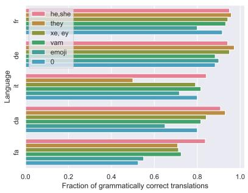  
(a) Grammaticality

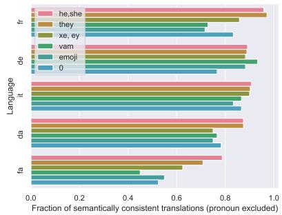  
(b) Semantics: pronoun excluded

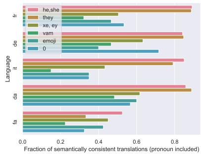  
(c) Semantics: pronoun included

Figure 1: Overall translation quality. We show the fraction (%) of grammatically correct (a) and semantically correct (pronoun excluded (b) or included (c)) translations aggregated across all three engines for five target languages (Danish (DA), Farsi (FA), French (FR), German (DE), Italian (IT)) given English input sentences containing the following pronoun groups: he, she (gendered); they (gender-neutral); xe, ey (“traditional” neopronouns); vam (nounself pronoun); (emojiself pronoun); and 0 (numberself pronoun).
<table><tr><td></td><td>Source</td><td>MT Output</td><td>Case</td><td>Issue Type</td></tr><tr><td></td><td>1 The attendant did not want to fight with Die Wärterin wollte sich nicht mit dem Accusative the guard and gave them flowers.</td><td>Wachmann streiten und schenkte ihm Blumen.</td><td></td><td>Potential Misgendering</td></tr><tr><td></td><td>2 Liam received a good grade, so vam was happy.</td><td>Liam erhielt eine gute Note, und Vam Nominative Semantic Inconsistency war zufrieden.</td><td></td><td></td></tr><tr><td>3</td><td>Olivia found eir ring.</td><td>Olivia fand einen Eir-Ring.</td><td></td><td>Poss. Depen. Semantic Inconsistency</td></tr><tr><td>4</td><td>During lunch, the janitor looked for the attendant to steal eirs.</td><td>Hausmeister nach dem Besucher, um Eurren zu stehlen.</td><td></td><td>e Während des Mittagessens suchte der Poss. Indep. Pronoun Mistranslation</td></tr><tr><td></td><td>5 Liam wanted a new haircut, so cut the hair self.</td><td>Liam wollte einen neuen Haarschnitt, Reflexive also schneiden Sie das Haar selbst.</td><td></td><td>Semantic Inconsistency</td></tr></table>

Table 3: Problems in the MT output. We show examples for EN to DE for different grammatical cases, pronouns, and issue types, and highlight the pronouns in the source sentence and the corresponding parts in the translation in bold.

Translation and Gender. We analyze pronouns that are translated to an existing singular pronoun in the target language in Figure 3. For the gendered source pronouns (he, she), the result is roughly balanced across commonly associated genders. For they, we observe a high proportion of genderneutral output pronouns (65%)—most often, gender neutrality is preserved. In contrast, for different types of neopronouns, the engines are likely to output a gendered pronoun. This finding is most pronounced for emojiself pronouns, with 50% and 23% of output pronouns commonly associated with male and female individuals, respectively. This amount of translations (73%) is likely to correspond to cases of misgendering.

Qualitative Analysis. For further illustration, we show examples of some problems we observe when translating to DE in Table 3. The output in Example 1 is generally correct. However, the genderneutral pronoun they is translated to the gendered pronoun er. Examples 2 and 3 show translations in which the pronoun correspondence is copied from the input but starts with a capital letter (or is even prepended to the succeeding word, e.g., Eir-Ring), as done for nouns or names. We note a similar problem in example 4. Additionally, the output string corresponding to the pronoun is neither copied from the input nor corresponds to a valid word in the target language (Eurren). Finally, in example 4, the emojiself pronoun appears in the output translation with the additional 2nd person pronoun variant Sie.

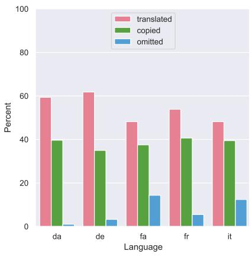  
(a) Language

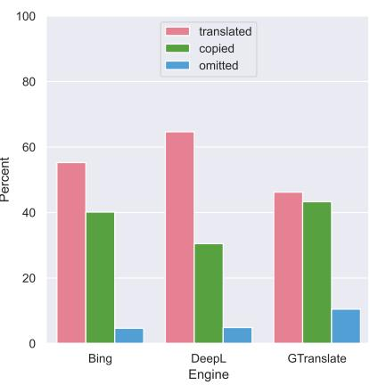  
(b) Translation engine

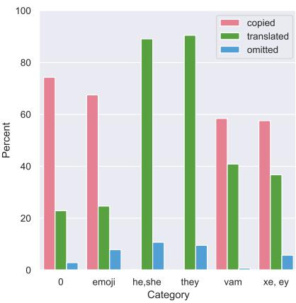  
(c) Pronoun group

Figure 2: Pronoun treatment strategies. We show the fraction (%) of translated, copied, and omitted pronouns (a) per language (French (FR), German (DE), Italian (IT), Danish (DA), Farsi (FA)), (b) per translation engine, and (c) per pronoun group in the English input sentence (he, she (gendered); they (gender-neutral); xe, ey (“traditional” neopronouns); vam (nounself pronoun); (emojiself pronoun); and 0 (numberself pronoun)).  
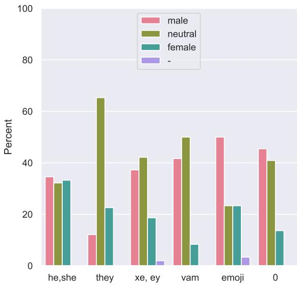  
Figure 3: Gender conveyed by the target language pronoun (male, neutral, female, unknown (–)) for translations that contain an existing third-person singular pronoun. We aggregate across languages. For Italian and French, we focus on the gender of the subject. We exclude Farsi due to its gender neutrality.

## 3.3 Translating to English

Experimental Setup. So far, we have started from EN source sentences. Here, we expand our perspective and conduct the inverse experiment: We translate to EN starting from DA sentences (as an example of a language with a recently emerging gender-neutral pronoun). To this end, we start from our EN templates and manually translate these to DA. We then fill the templates with the pronouns han (=he), hun (=she), hen (gender-neutral), resulting in 48 source sentences. We translate those automatically with the three commercial engines and let an English native speaker evaluate the output according to the same guidelines.

Results. The overall translation quality is relatively high; for instance, we find that 75% of translations are grammatically correct when starting from the gendered pronouns (han, hun), and only see a small drop for the gender-neutral pronoun (hen with 71%). However, surprisingly, the translation engines seem to never output the genderneutral option “they” when choosing an existing pronoun in the target language EN, not even when starting from hen. In contrast, in roughly 72% of the cases, hen is translated to he.

## 4 What Would Be a Good Translation?

Our results show that commercial engines cannot deal with pronouns as an open word class. Often, the output is not grammatical, and the meaning is inconsistent. Beyond these general aspects we have shown that pronoun treatment strategies vary. Next, we seek to understand how individuals would want their pronouns to be handled (RQ4).

<table><tr><td>Lang.</td><td>% Ment.</td><td>Pronoun sets</td></tr><tr><td>DE</td><td>35.00</td><td>er, sie, dey, ey, &lt;none&gt;</td></tr><tr><td>EN</td><td>30.00</td><td>he, she, they, it, &lt;no preference&gt;</td></tr><tr><td>DA</td><td>20.00</td><td>han, hun, den, de, she, they</td></tr><tr><td>IT</td><td>7.50</td><td>lei, lui</td></tr><tr><td>RU</td><td>5.00</td><td>OH, &lt;none&gt;</td></tr><tr><td>FA</td><td>2.50</td><td>19</td></tr></table>

Table 4: Fraction of mentions (in %) of native languages (Danish (DA), English (EN), German (DE), Italian (IT), Russian (RU), and Farsi (FA)) with associated pronouns participants of our survey identify with.

## 4.1 A Survey on Pronouns and MT

Survey Design and Distribution. To answer this RQ, we design a survey consisting of three parts: (1) a general part asks for the participant’s demographic information, e.g., age, (gender) identity, as well as their pronouns in English and their native languages. (2) The second part asks general opinions related to pronouns in artificial intelligence. (3) The last section deals specifically with MT: here, we ask how the individual would like their or their friends’ pronouns to be treated when translating from their native language to another.

Participants can choose from four treatment options we identified through informal discussions with affected individuals: (a) Avoid pronouns in the translation; (b) Copy the pronoun (in my native language) and don’t try to translate it; (c) Translate to a pronoun in the target language (if commonly associated identity matches); (d) List multiple pronouns in the translation possibly associated with diverse identities. Participants can also define additional options. We provide examples with genderneutral pronouns in English and encourage the participant to provide a translation in their native language. The institutional review board of the main authors’ university approved our study design. We distributed the survey through channels that allow us to target individuals potentially affected by the issue and who represent a wide variety of (gender) identities. Examples include QueerInAI,9 and local LGBTQIA+ groups, e.g., Transgender Network Switzerland.10 For validation, we ran a pre-study between March 22 and May 4, 2022 (with n=149). The main phase was open for participation between June 18 and August 1, 2022.

Results. In the main phase of our survey, 44 individuals participated. Their ages ranged from 14 to 43, with the majority between 20 and 30. For the analysis, we removed responses from participants under 18. The remaining participants provided diverse and sometimes multiple gender identity terms (e.g., non-binary, transgender, questioning, genderfluid) and speak diverse native languages (e.g., English, German, Persian). The fraction of mentions of native languages and provided pronoun sets per language are given in Table 4: participants identify with diverse and sometimes multiple pronoun sets (e.g., gendered pronouns, neopronouns) as well as no pronouns. Interestingly, some seem to use EN pronouns in their non-EN native language. This observation aligns with the finding that bilinguals tend to code-switch to their L2 if it provides better options to describe their gender identity (Kaplan, 2022). In a similar vein, some participants provided only a gendered option in their native language (e.g., er in German) but indicated to identify with a gender-neutral option in EN (e.g., they).

Concerning the translation policies, participants chose between 1 and 3 pre-defined options, and four provided additional ideas. The result is depicted in Figure 4. While the most popular option is (c) Translate to a pronoun in the target language (if commonly associated identity matches), there is no clear consensus and also strong tendencies towards gender-agnostic solutions. This finding is supported by the example-based analysis where we asked participants to translate from English to their native language. Table 5 illustrates this finding via participant answers for English to German translations (German native speakers). Participants used different options, like using the referent’s name or a neopronoun, to deal with the issue that there is no established gender-neutral pronoun in German.

Additional participant comments point to the difficulty of the problem, e.g., “this one’s tough because itfeels like different people are potentially going to have different desires on this one [...]”. Overall, we thus conclude that users’ preferences are as diverse as the community itself.

## 4.2 Recommendations

Based on our observations in §3 and the survey results, we provide three recommendations for making future MT more inclusive.

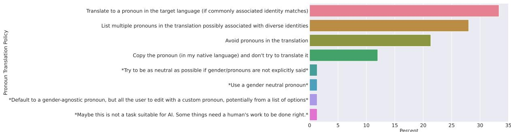

Figure 4: Results for our survey question relating to MT pronoun policies. Answers in asterisks (\*) were additionally provided by our participants. We show them here for completeness.
<table><tr><td>Translation policy</td><td>Translation</td></tr><tr><td>Referent&#x27;s name</td><td>Liam hat eine gute Note bekommen, also war Liam glücklich.</td></tr><tr><td>Ellipsis through alternative construct</td><td>Liam erhielt eine gute Note und war deshalb froh.</td></tr><tr><td>General noun (person)</td><td>Liam hat eine gute Note bekommen, deshalb war die Person glücklich.</td></tr><tr><td>Neopronoun</td><td>Liam hat eine gute Note bekommen, deswegen freut dey sich.</td></tr></table>

Table 5: German example translations for the English source sentence “Liam received a good grade, so they were happy.” provided by native speakers. Participants choose various policies for preserving gender neutrality.

(1) Consider pronouns an open word class when developing and testing MT systems. As we have demonstrated, popular commercial MT systems often fail when gender-neutral pronoun sets are part of the input, even when translating between resource-rich languages like EN and IT. Thus, NLP researchers and practitioners must make MT more robust even with regards to fundamental properties such as grammaticality. Extending existing data sets to reflect a larger variety of pronouns is crucial.

## (2) Ifpossible, provide optionsfor personalization.

Our survey demonstrated no clear consensus on how pronouns should be treated, and that users’ preferences and pronouns vary. Thus, if possible, i.e., if the user is aware of the pronouns referents in their input text identify with, and if they directly interact with the translation engine, the decision should be left to that user. This finding aligns with desideratum D5 for more identity-inclusive AI identified by Lauscher et al. (2022).

(3) Avoid potential misgendering as much as possible. If options for personalization are limited, no translation strategy will be ideal for all users. However, instead of “blindly” translating, which, as we have demonstrated, is likely to lead to misgendering, there are several other options that translation engines could choose that exhibit less potential for harm, e.g., gender-agnostic translations.

## 5 Conclusion

In this work, we have investigated the sensitivity of automatically translating pronouns: small words that can convey important identity aspects. To understand where current commercial MT stands with regards to this issue, we started with a thorough error analysis covering six languages and three MT engines. We demonstrated that the engines tested are more likely to produce low-quality output when starting from gender-neutral pronouns, and we further observed a high potential for misgendering. Emphasizing marginalized voices, we complemented our study with a survey of affected individuals. The answers led us to three recommendations for more inclusive MT. We hope our study will inform and fuel more research on these issues.

## Acknowledgements

Part of this work is funded by the European Research Council (ERC) under the European Union’s Horizon 2020 research and innovation program (grant agreement No. 949944, INTEGRATOR). Anne Lauscher’s work is funded under the Excellence Strategy of the Federal Government and the Länder. Debora Nozza and Dirk Hovy are members of the MilaNLP group and the Data and Marketing Insights Unit of the Bocconi Institute for Data Science and Analysis.

## Limitations

Naturally, our work comes with a number of limitations: for instance, we restrict ourselves to testing eight pronoun sets out of the rich plethora of existing options. To ensure diversity, we resort to one or two sets per pronoun group—we hope that individuals feel represented by our choices. Similarly, we only translate single sentences and don’t investigate translations of larger and possibly more complex texts and we only translate to a number of languages none of which is resource-lean. Our study demonstrates that simpler and shorter texts already exhibit fundamental problems in their translations, even to resource-rich languages.

## Ethics Statement

In this work, we present a reality check in which we show that established commercial MT systems struggle with the linguistic variety that is tied to the large spectrum of identities. Consequently, this work has an inherently ethical dimension: our intent is to point to the issue of subcultural exclusion in language technology. We acknowledge, however, that this issue is much bigger than the problems relating to the use of neopronouns and we hope to investigate the topic more globally in the future.

## References

Gavin Abercrombie, Verena Rieser, and Dirk Hovy. 2023. Consistency is key: Disentangling label variation in natural language processing with intra-annotator agreement. arXiv preprint arXiv:2301.10684.

Soumya Barikeri, Anne Lauscher, Ivan Vulic, and Goran´ Glavaš. 2021. RedditBias: A real-world resource for bias evaluation and debiasing of conversational language models. In Proceedings of the 59th Annual Meeting of the Association for Computational Linguistics and the 11th International Joint Conference on Natural Language Processing (Volume 1: Long Papers), pages 1941–1955, Online. Association for Computational Linguistics.

Solon Barocas, Kate Crawford, Aaron Shapiro, and Hanna Wallach. 2017. The problem with bias: Allocative versus representational harms in machine learning. In 9th Annual Conference of the Special Interest Group for Computing, Information and Society.

Christine Basta, Marta R. Costa-jussà, and José A. R. Fonollosa. 2020. Towards mitigating gender bias in a decoder-based neural machine translation model by adding contextual information. In Proceedings of the

The Fourth Widening Natural Language Processing Workshop, pages 99–102, Seattle, USA. Association for Computational Linguistics.

Su Lin Blodgett, Solon Barocas, Hal Daumé III, and Hanna Wallach. 2020. Language (technology) is power: A critical survey of “bias” in NLP. In Proceedings of the 58th Annual Meeting of the Association for Computational Linguistics, pages 5454– 5476, Online. Association for Computational Linguistics.

Tolga Bolukbasi, Kai-Wei Chang, James Zou, Venkatesh Saligrama, and Adam Kalai. 2016. Man is to computer programmer as woman is to homemaker? debiasing word embeddings. In Proceedings of the 30th International Conference on Neural Information Processing Systems, NIPS’16, page 4356–4364. Curran Associates Inc.

Stephanie Brandl, Ruixiang Cui, and Anders Søgaard. 2022. How conservative are language models? adapting to the introduction of gender-neutral pronouns. In Proceedings ofthe 2022 Conference ofthe North American Chapter ofthe Association for Computational Linguistics: Human Language Technologies, pages 3624–3630, Seattle, United States. Association for Computational Linguistics.

Yang Trista Cao and Hal Daumé III. 2020. Toward gender-inclusive coreference resolution. In Proceedings of the 58th Annual Meeting of the Association for Computational Linguistics, pages 4568–4595, Online. Association for Computational Linguistics.

Won Ik Cho, Ji Won Kim, Seok Min Kim, and Nam Soo Kim. 2019. On measuring gender bias in translation of gender-neutral pronouns. In Proceedings of the First Workshop on Gender Bias in Natural Language Processing, pages 173–181, Florence, Italy. Association for Computational Linguistics.

Chloe Ciora, Nur Iren, and Malihe Alikhani. 2021. Examining covert gender bias: A case study in Turkish and English machine translation models. In Proceedings of the 14th International Conference on Natural Language Generation, pages 55–63, Aberdeen, Scotland, UK. Association for Computational Linguistics.

Marta R. Costa-jussà and Adrià de Jorge. 2020. Finetuning neural machine translation on gender-balanced datasets. In Proceedings ofthe Second Workshop on Gender Bias in Natural Language Processing, pages 26–34, Barcelona, Spain (Online). Association for Computational Linguistics.

Sunipa Dev, Masoud Monajatipoor, Anaelia Ovalle, Arjun Subramonian, Jeff Phillips, and Kai-Wei Chang. 2021. Harms of gender exclusivity and challenges in non-binary representation in language technologies. In Proceedings of the 2021 Conference on Empirical Methods in Natural Language Processing, pages 1968–1994, Online and Punta Cana, Dominican Republic. Association for Computational Linguistics.

Joel Escudé Font and Marta R. Costa-jussà. 2019. Equalizing gender bias in neural machine translation with word embeddings techniques. In Proceedings of the First Workshop on Gender Bias in Natural Language Processing, pages 147–154, Florence, Italy. Association for Computational Linguistics.

Hila Gonen and Yoav Goldberg. 2019. Lipstick on a pig: Debiasing methods cover up systematic gender biases in word embeddings but do not remove them. In Proceedings ofthe 2019 Conference ofthe North American Chapter of the Association for Computational Linguistics: Human Language Technologies, Volume 1 (Long and Short Papers), pages 609–614, Minneapolis, Minnesota. Association for Computational Linguistics.

Hila Gonen and Kellie Webster. 2020. Automatically identifying gender issues in machine translation using perturbations. In Findings of the Association for Computational Linguistics: EMNLP 2020, pages 1991–1995, Online. Association for Computational Linguistics.

Carolin Holtermann, Anne Lauscher, and Simone Ponzetto. 2022. Fair and argumentative language modeling for computational argumentation. In Proceedings of the 60th Annual Meeting of the Association for Computational Linguistics (Volume 1: Long Papers), pages 7841–7861, Dublin, Ireland. Association for Computational Linguistics.

Dirk Hovy, Federico Bianchi, and Tommaso Fornaciari. 2020. “You sound just like your father” commercial machine translation systems include stylistic biases. In Proceedings ofthe 58th Annual Meeting of the Associationfor Computational Linguistics, pages 1686–1690, Online. Association for Computational Linguistics.

Dirk Hovy and Shannon L. Spruit. 2016. The social impact of natural language processing. In Proceedings ofthe 54th Annual Meeting ofthe Association for Computational Linguistics (Volume 2: Short Papers), pages 591–598, Berlin, Germany. Association for Computational Linguistics.

Jennifer Kaplan. 2022. Binary-constrained codeswitching among non-binary french-english bilinguals. Proceedings of the Linguistic Society of America, 7(1):5279.

Anne Lauscher, Archie Crowley, and Dirk Hovy. 2022. Welcome to the modern world of pronouns: Identityinclusive natural language processing beyond gender. In Proceedings of the 29th International Conference on Computational Linguistics, pages 1221– 1232, Gyeongju, Republic of Korea. International Committee on Computational Linguistics.

Anne Lauscher, Goran Glavaš, Simone Paolo Ponzetto, and Ivan Vulic. 2020.´ A general framework for implicit and explicit debiasing of distributional word vector spaces. In Proceedings of the AAAI Conference on Artificial Intelligence, pages 8131–8138.

Shahar Levy, Koren Lazar, and Gabriel Stanovsky. 2021. Collecting a large-scale gender bias dataset for coreference resolution and machine translation. In Findings of the Association for Computational Linguistics: EMNLP 2021, pages 2470–2480, Punta Cana, Dominican Republic. Association for Computational Linguistics.

Ehm Hjorth Miltersen. 2016. Nounself pronouns: 3rd person personal pronouns as identity expression. Journal ofLanguage Works-Sprogvidenskabeligt Studentertidsskrift, 1(1):37–62.

Debora Nozza, Federico Bianchi, Anne Lauscher, and Dirk Hovy. 2022. Measuring harmful sentence completion in language models for LGBTQIA+ individuals. In Proceedings of the Second Workshop on Language Technologyfor Equality, Diversity and Inclusion, pages 26–34, Dublin, Ireland. Association for Computational Linguistics.

Hadas Orgad and Yonatan Belinkov. 2022. Choose your lenses: Flaws in gender bias evaluation. In Proceedings of the 4th Workshop on Gender Bias in Natural Language Processing (GeBNLP), pages 151–167, Seattle, Washington. Association for Computational Linguistics.

Rebecca Qian, Candace Ross, Jude Fernandes, Eric Michael Smith, Douwe Kiela, and Adina Williams. 2022. Perturbation augmentation for fairer NLP. In NeurIPS 2022 Workshop on Robustness in Sequence Modeling.

Krithika Ramesh, Gauri Gupta, and Sanjay Singh. 2021. Evaluating gender bias in Hindi-English machine translation. In Proceedings of the 3rd Workshop on Gender Bias in Natural Language Processing, pages 16–23, Online. Association for Computational Linguistics.

Adithya Renduchintala, Denise Diaz, Kenneth Heafield, Xian Li, and Mona Diab. 2021. Gender bias amplification during speed-quality optimization in neural machine translation. In Proceedings ofthe 59th Annual Meeting ofthe Associationfor Computational Linguistics and the 11th International Joint Conference on Natural Language Processing (Volume 2: Short Papers), pages 99–109, Online. Association for Computational Linguistics.

Rachel Rudinger, Jason Naradowsky, Brian Leonard, and Benjamin Van Durme. 2018. Gender bias in coreference resolution. In Proceedings of the 2018 Conference of the North American Chapter of the Association for Computational Linguistics: Human Language Technologies, Volume 2 (Short Papers), pages 8–14, New Orleans, Louisiana. Association for Computational Linguistics.

Paul Röttger, Bertie Vidgen, Dirk Hovy, and Janet Pierrehumbert. 2022. Two contrasting data annotation paradigms for subjective NLP tasks. In Proceedings of the 2022 Conference of the North American Chapter of the Association for Computational Linguistics: Human Language Technologies, pages 175–190,

Seattle, United States. Association for Computational Linguistics.

Danielle Saunders and Bill Byrne. 2020. Reducing gender bias in neural machine translation as a domain adaptation problem. In Proceedings ofthe 58th Annual Meeting ofthe Associationfor Computational Linguistics, pages 7724–7736, Online. Association for Computational Linguistics.

Danielle Saunders, Rosie Sallis, and Bill Byrne. 2020. Neural machine translation doesn’t translate gender coreference right unless you make it. In Proceedings ofthe Second Workshop on Gender Bias in Natural Language Processing, pages 35–43, Barcelona, Spain (Online). Association for Computational Linguistics.

Beatrice Savoldi, Marco Gaido, Luisa Bentivogli, Matteo Negri, and Marco Turchi. 2021. Gender bias in machine translation. Transactions ofthe Association for Computational Linguistics, 9:845–874.

Arturs Stafanovi¯ cs, Toms Bergmanis, and Mˇ arcis Pinnis.¯ 2020. Mitigating gender bias in machine translation with target gender annotations. In Proceedings of the Fifth Conference on Machine Translation, pages 629–638, Online. Association for Computational Linguistics.

Gabriel Stanovsky, Noah A. Smith, and Luke Zettlemoyer. 2019. Evaluating gender bias in machine translation. In Proceedings ofthe 57th Annual Meeting ofthe Associationfor Computational Linguistics, pages 1679–1684, Florence, Italy. Association for Computational Linguistics.

Jonas-Dario Troles and Ute Schmid. 2021. Extending challenge sets to uncover gender bias in machine translation: Impact of stereotypical verbs and adjectives. In Proceedings of the Sixth Conference on Machine Translation, pages 531–541, Online. Association for Computational Linguistics.

Eva Vanmassenhove and Johanna Monti. 2021. gENder-IT: An annotated English-Italian parallel challenge set for cross-linguistic natural gender phenomena. In Proceedings of the 3rd Workshop on Gender Bias in Natural Language Processing, pages 1–7, Online. Association for Computational Linguistics.

Jieyu Zhao, Tianlu Wang, Mark Yatskar, Vicente Ordonez, and Kai-Wei Chang. 2018. Gender bias in coreference resolution: Evaluation and debiasing methods. In Proceedings of the 2018 Conference ofthe North American Chapter ofthe Associationfor Computational Linguistics: Human Language Technologies, Volume 2 (Short Papers), pages 15–20, New Orleans, Louisiana. Association for Computational Linguistics.

## A Data Sets and Licenses

In this work, we only made use of a single existing dataset, WinoMT11 (Stanovsky et al., 2019). We used the dataset to obtain EN templates in different grammatical cases, which we filled with the pronouns we test. The data set is licensed under MIT License. We will publish our selection of sentences from WinoMT as well as the additional sentences we added under the same license.

## B Additional Results

We provide additional results (aggregated across languages) in Figure 5.

## C Annotation Interface

We show a screenshot of our annotation interface in Figure 6. The interface was developed using HTML and JavaScript and hosted on the Amazon Mechanical Turk Sandbox.

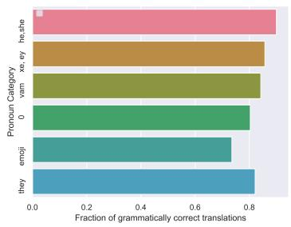  
(a) Grammaticality

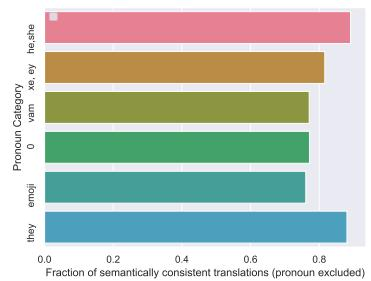  
(b) Semantics: pronoun excluded

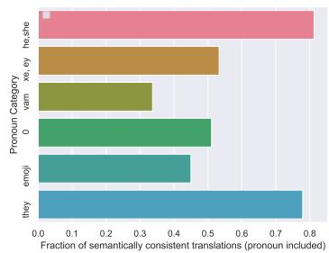  
(c) Semantics: pronoun included

Figure 5: Overall translation quality. We show the fraction (%) of grammatically correct (a) and semantically correct (pronoun excluded (b) or included (c)) translations aggregated across all three engines and five target languages given English input sentences containing the following pronoun groups: he, she (gendered); they (gender-neutral); xe, ey (“traditional” neopronouns); vam (nounself pronoun); (emojiself pronoun); and 0 (numberself pronoun).  
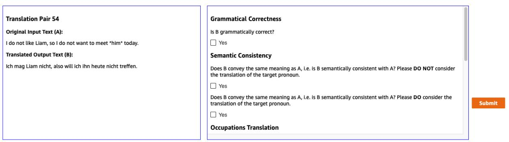

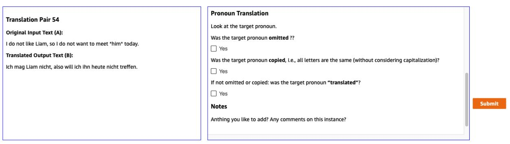

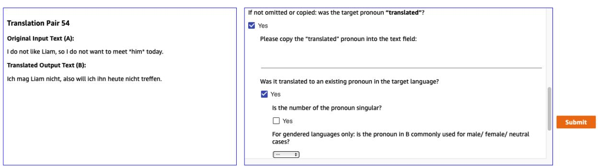  
(c) Translation Details  
Figure 6: Screenshot of our annotation interface. The translation pair (here: EN and DE) is displayed on the left side of the screen. Annotators answer the questions shown on the right side: (a) general questions about the translation quality, (b) questions relating to whether the pronoun was ommitted, copied, or translated, and (c) details relating to the treatment strategy.

## ACL 2023 Responsible NLP Checklist

## A For every submission:

✓ A1. Did you describe the limitations of your work? Section "Limitations" (after conclusion)

✗ A2. Did you discuss any potential risks of your work? We analyze the current state of identity inclusion in MT. Thus, our work points to risks of such systems.

✓ A3. Do the abstract and introduction summarize the paper’s main claims? Abstract, Intro (Section 1)

✗ A4. Have you used AI writing assistants when working on this paper? Left blank.

## B ✓ Did you use or create scientific artifacts?

Section 3.1

✓ B1. Did you cite the creators of artifacts you used? Section 3.1

✓ B2. Did you discuss the license or terms for use and / or distribution of any artifacts? See Appendix

✗ B3. Did you discuss if your use of existing artifact(s) was consistent with their intended use, provided that it was specified? For the artifacts you create, do you specify intended use and whether that is compatible with the original access conditions (in particular, derivatives of data accessed for research purposes should not be used outside of research contexts)? We use a data setfor evaluation ofMTfor evaluation ofMT.

✓ B4. Did you discuss the steps taken to check whether the data that was collected / used contains any information that names or uniquely identifies individual people or offensive content, and the steps taken to protect / anonymize it? The MT data is template-based and does not contain any personalised information. The survey design was IRB approved – here we collect data in anonymised form (Section 4.1)

✓ B5. Did you provide documentation of the artifacts, e.g., coverage of domains, languages, and linguistic phenomena, demographic groups represented, etc.? Section 3.1

✓ B6. Did you report relevant statistics like the number of examples, details of train / test / dev splits, etc. for the data that you used / created? Even for commonly-used benchmark datasets, include the number of examples in train / validation / test splits, as these provide necessary context for a reader to understand experimental results. For example, small differences in accuracy on large test sets may be significant, while on small test sets they may not be. Section 3.1

## C ✗ Did you run computational experiments?

Left blank.

 C1. Did you report the number of parameters in the models used, the total computational budget (e.g., GPU hours), and computing infrastructure used? No response.

 C2. Did you discuss the experimental setup, including hyperparameter search and best-found hyperparameter values? No response.

 C3. Did you report descriptive statistics about your results (e.g., error bars around results, summary statistics from sets of experiments), and is it transparent whether you are reporting the max, mean, etc. or just a single run? No response.

 C4. If you used existing packages (e.g., for preprocessing, for normalization, or for evaluation), did you report the implementation, model, and parameter settings used (e.g., NLTK, Spacy, ROUGE, etc.)? No response.

## D ✓ Did you use human annotators (e.g., crowdworkers) or research with human participants? Section 3 and 4

✓ D1. Did you report the full text of instructions given to participants, including e.g., screenshots, disclaimers of any risks to participants or annotators, etc.? Instructions in Section 3.1 and 4.1, screenshots in the appendix

✓ D2. Did you report information about how you recruited (e.g., crowdsourcing platform, students) and paid participants, and discuss if such payment is adequate given the participants’ demographic (e.g., country of residence)? Section 3.1 and 4.1

✓ D3. Did you discuss whether and how consent was obtained from people whose data you’re using/curating? For example, if you collected data via crowdsourcing, did your instructions to crowdworkers explain how the data would be used? Section 4.1

✓ D4. Was the data collection protocol approved (or determined exempt) by an ethics review board? Section 4.1

✓ D5. Did you report the basic demographic and geographic characteristics of the annotator population that is the source of the data? Section 4.1