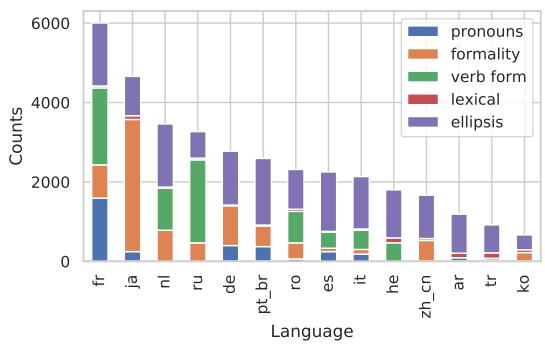
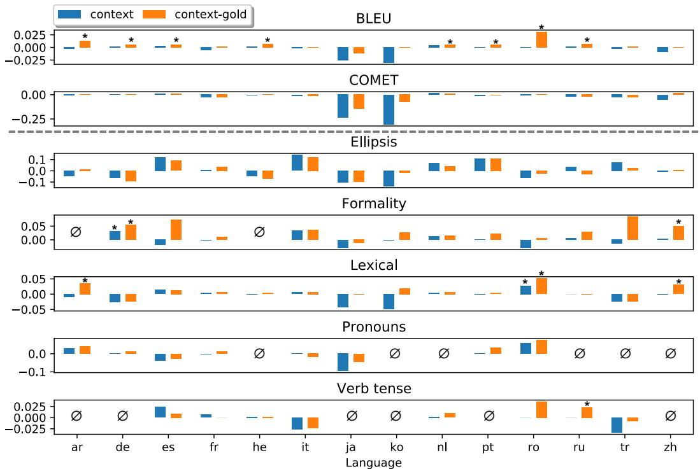
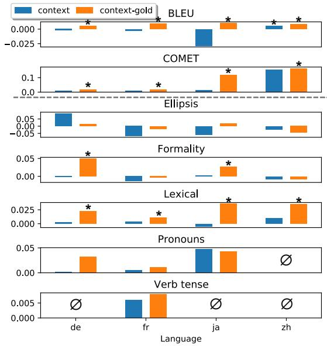
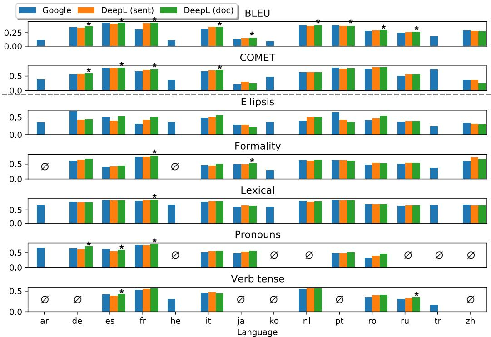
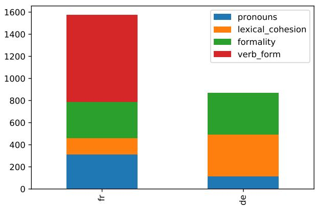
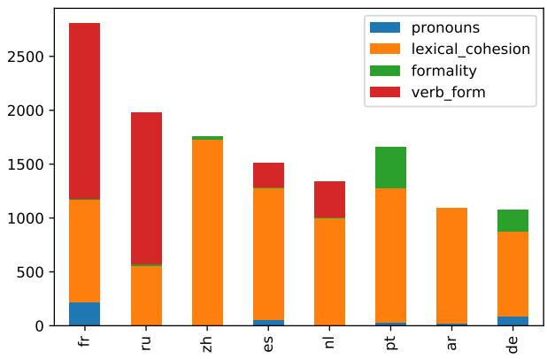

# When Does Translation Require Context? A Data-driven, Multilingual Exploration

Patrick Fernandes<sup>1,2,3</sup>∗ Kayo Yin<sup>4</sup>∗ Emmy Liu<sup>1</sup>

André F. T. Martins<sup>2,3,5</sup> Graham Neubig<sup>1</sup>

<sup>1</sup>Language Technologies Institute, Carnegie Mellon University, Pittsburgh, PA   
<sup>2</sup>Instituto Superior Técnico & LUMLIS (Lisbon ELLIS Unit), Lisbon, Portugal <sup>3</sup>Instituto de Telecomunicações, Lisbon, Portugal <sup>4</sup>University of California, Berkeley <sup>5</sup>Unbabel, Lisbon, Portugal

pfernand@cs.cmu.edu kayoyin@berkeley.edu

## Abstract

Although proper handling of discourse significantly contributes to the quality of machine translation (MT), these improvements are not adequately measured in common translation quality metrics. Recent works in context-aware MT attempt to target a small set of discourse phenomena during evaluation, however not in a fully systematic way. In this paper, we develop the Multilingual Discourse-Aware (MUDA) benchmark, a series of taggers that identify and evaluate model performance on discourse phenomena in any given dataset. The choice of phenomena is inspired by a novel methodology to systematically identify translations requiring context. We confirm the difficulty of previously studied phenomena while uncovering others that were previously unaddressed. We find that common context-aware MT models make only marginal improvements over context-agnostic models, which suggests these models do not handle these ambiguities effectively. We release code and data for 14 language pairs to encourage the MT community to focus on accurately capturing discourse phenomena.<sup>1</sup>

## 1 Introduction

In order to properly translate discourse phenomena including anaphoric pronouns, lexical cohesion, and discourse markers, a machine translation (MT) model must use information from previous utterances (Guillou et al., 2018; Läubli et al., 2018; Toral et al., 2018).

However, while generating proper translations of these phenomena is important for comprehension, they represent a small portion of words in natural language. Therefore, common metrics such as BLEU (Papineni et al., 2002) cannot be used to judge the quality of discourse translation.

<table><tr><td rowspan=1 colspan=1>Dataset</td><td rowspan=1 colspan=1>Lang.</td><td rowspan=1 colspan=1>Phenomena</td></tr><tr><td rowspan=1 colspan=1>Müller et al. (2018)</td><td rowspan=1 colspan=1>EN → DE</td><td rowspan=1 colspan=1>Pronouns</td></tr><tr><td rowspan=1 colspan=1>Bawden et al. (2018)</td><td rowspan=1 colspan=1>EN → FR</td><td rowspan=1 colspan=1>Pronouns, CoherenceLexical Ćonsistency</td></tr><tr><td rowspan=1 colspan=1>Voita et al. (2018)Voita et al. (2019b)</td><td rowspan=1 colspan=1>EN → RU</td><td rowspan=1 colspan=1>PronounsDeixis, EllipsisLexical Ćonsistency</td></tr><tr><td rowspan=1 colspan=1>Jwalapuram et al. (2020)</td><td rowspan=1 colspan=1>DE → ENFR → ENRU → EN</td><td rowspan=1 colspan=1>Pronouns, CoherenceLexical ConsistencyDiscourse Connectives</td></tr><tr><td rowspan=1 colspan=1>Our Work</td><td rowspan=1 colspan=1>14 Pairs (§5)</td><td rowspan=1 colspan=1>Pronouns, EllipsisFormalityLexical ConsistencyVerb Forms</td></tr></table>

Table 1: Some representative works on contextual machine translation that perform evaluation on discourse phenomena, contrasted to our work. For a more complete review see Maruf et al. (2021).

Recent work on neural machine translation (NMT) models that attempt to incorporate extrasentential context (Tiedemann and Scherrer, 2017; Miculicich et al., 2018; Maruf and Haffari, 2018, inter alia) often perform targeted evaluation of certain discourse phenomena, mostly focusing on ellipsis, formality (Voita et al., 2019b,a), and pronoun translation (Müller et al., 2018; Bawden et al., 2018; Lopes et al., 2020). However, only a limited set of discourse phenomena for a few language pairs have been studied (see summary in Table 1). The difficulty of broadening these studies stems from the reliance of previous work on introspection and domain knowledge to identify the relevant discourse phenomena, frequently involving expert speakers, which then requires engineering complex language-specific methods to create test suites or manually designing data for evaluation.

In this paper, we identify sentences that contain discourse phenomena through a data-driven, semiautomatic methodology. We apply this method to create a multilingual benchmark testing discourse phenomena in the domain of MT. First, we develop P-CXMI (§2) as a metric to identify when context is helpful in MT, or more broadly text generation in general. Then, we perform a systematic analysis of words with high P-CXMI to find categories of translations where context is useful (§3). We identify novel discourse phenomena that to our knowledge have not been addressed previously (e.g. consistency of verb forms), without requiring a-priori language-specific knowledge. Finally, we design a series of methods to automatically tag words belonging to the identified classes of ambiguities (§4) and we evaluate existing translation models for different categories of ambiguous translations (§5).

We examine a parallel corpus spanning 14 language pairs, measuring translation ambiguity and model performance. We find that the contextaware methods, while improving on standard evaluation metrics, only perform significantly better than context-agnostic baselines for certain discourse phenomena in our benchmark. Our benchmark provides a more fine-grained evaluation of translation models and reveals weaknesses of context-aware models, such as verb form cohesion. We also find that DeepL, a commercial document-level translation system, does better in our benchmark than its sentence-level ablation and Google Translate. We hope that the released benchmark and code, as well as our findings, will spur targeted evaluation of discourse phenomena in MT to cover more languages and more phenomena in the future.

## 2 Measuring Context Usage

## 2.1 Cross-Mutual Information

Past work on contrastive evaluation has examined correct and incorrect translations of specific discourse phenomena (Bawden et al., 2018; Müller et al., 2018), but this provides only a limited measure of context usage on phenomena defined by the creators of the dataset. We are therefore interested in devising a metric that is able to capture all context usage by a model, beyond a predefined set.

Conditional Cross-Mutual Information (CXMI) (Bugliarello et al., 2020; Fernandes et al., 2021) measures the influence of context on model predictions at the corpus level. CXMI is defined as:

$$
\begin{array} { r } { \begin{array} { l } { \mathrm { C X M I } ( C \to Y | X ) = \qquad } \\ { \qquad \mathrm { H } _ { q _ { M T _ { A } } } ( Y | X ) - \mathrm { H } _ { q _ { M T _ { C } } } ( Y | X , C ) , } \end{array} } \end{array}
$$

where X and $Y$ are a source and target sentence, respectively, C is the context, $\mathrm { H } _ { q _ { M T _ { A } } }$ is the entropy of a context-agnostic MT model, and $\mathrm { H } _ { q _ { M T _ { C } } }$ refers to a context-aware MT model. This quantity can be estimated over a held-out set with N sentence pairs and their respective context as:

$$
\begin{array} { r c l } { { \mathrm { C X M I } ( C \to Y | X ) \approx } } \\ { { } } & { { } } \\ { { } } & { { } } & { { - { \frac { 1 } { N } } \displaystyle \sum _ { i = 1 } ^ { N } \log { \frac { q _ { M T _ { A } } ( y ^ { ( i ) } | x ^ { ( i ) } ) } { q _ { M T _ { C } } ( y ^ { ( i ) } | x ^ { ( i ) } , C ^ { ( i ) } ) } } } } \end{array}
$$

Importantly, the authors find that training a sin-$g l e$ model $q _ { M T }$ as both the context-agnostic and context-aware model ensures that non-zero CXMI values are due to context and not other factors (see Fernandes et al. (2021) and §3.1 for details).

Although this approach is promising, it is defined only at a corpus level: as the previous equation shows, CXMI is estimated by over a full set of sentences. Since we are interested in measuring how important context is for single sentences or words within a sentence, we extend this definition to capture lower-level context dependency in the next section.

## 2.2 Context Usage Per Sentence and Word

Pointwise Mutual Information (P-MI) (Church and Hanks, 1990) measures the association between two random variables for specific outcomes. Mutual information can be seen as the expected value of P-MI over all possible outcomes of the variables.

Taking inspiration from this, we define the Pointwise Cross-Mutual Information (P-CXMI) for a source, target, context triplet $( x , y , C )$ as:

$$
\mathbf { P - C X M I } ( y , x , C ) = - \log \frac { q _ { M T _ { A } } ( y | x ) } { q _ { M T _ { C } } ( y | x , C ) }
$$

Intuitively, P-CXMI measures how much more (or less) likely a target sentence $y$ is when it is given context $C ,$ compared to not being given that context. Note that this is estimated according to the models $q _ { M T _ { A } }$ and $q _ { M T _ { C } }$ since, just like CXMI, this measure depends on their learned distributions.

We can also apply P-CXMI at the word level to measure how much more likely a particular word in a sentence is when it is given the context, by leveraging the auto-regressive property of the neural decoder. Given the triplet $( x , y , C )$ and the word index $i ,$ we can measure the P-CXMI for that particular word as:

$$
\begin{array} { r } { \mathrm { P - C X M I } ( i , y , x , C ) = - \log \frac { q _ { M T _ { A } } ( y _ { i } | y _ { t < i } , x ) } { q _ { M T _ { C } } ( y _ { i } | y _ { t < i } , x , C ) } } \end{array}
$$

Note that nothing constrains the form of C or even x and P-CXMI can, in principle, be applied to any conditional language modelling problem.

<table><tr><td rowspan=1 colspan=1>Avelile&#x27;s mother had HIV virus.Avelilehad the virus, she was born with the virus.阿维利尔的母亲是携有艾滋病病毒。阿维利尔也有艾滋病病毒。她一生下来就有。</td><td rowspan=1 colspan=1>Lexical Cohesion</td></tr><tr><td rowspan=1 colspan=1>Your daughter?Yourniece?Votrefille ?Votre nièce ?</td><td rowspan=1 colspan=1>Formality(T-V)</td></tr><tr><td rowspan=1 colspan=1>Roger. I got&#x27;em. Two-Six, this is Two-Six , we’remobile了解捕捉した。  $2 - 6 = 5 5 \frac { 8 } { 1 3 }$ </td><td rowspan=1 colspan=1>Formality(Honorifics)</td></tr><tr><td rowspan=1 colspan=1>Our tools today don&#x27;t look like shovels and picks.Theylook like the stuff we walk around with.As ferramentas de hoje não se parecem compás e picaretas.Elasse parecem com as coisas que usamos.</td><td rowspan=1 colspan=1>Pronouns</td></tr><tr><td rowspan=1 colspan=1>Louis XIV had a lot of people working for him. Theymadehis silly outfits, like this.Luis XIVteníaun montón de gente trabajando para él. Elloshacíansus trajes tontos, como éste.</td><td rowspan=1 colspan=1>Verb Form</td></tr><tr><td rowspan=1 colspan=1>They&#x27;re the ones who know what society is going to be like in another generation. Idon&#x27;t.Ancak onlar başka bir nesilde toplumun nasıl olacağınıbiliyorlar. Benbilmiyorum,</td><td rowspan=1 colspan=1>Ellipsis</td></tr></table>

Table 2: Examples of high P-CXMI tokens and corresponding linguistic phenomena. Contextual sentences are italicized. The high P-CXMI target token is highlighted in pink, source and contextual target tokens related to the high P-CXMI token are highlighted in blue and green respectively.

We use this metric to find words that are strongly context-dependent, which is to say that their likelihood increases greatly with context relative to other words. These words are the ones that likely correspond to discourse phenomena.

## 3 Which Translation Phenomena Benefit from Context?

To identify salient translation phenomena that require context, we perform a thematic analysis (Braun and Clarke, 2006), examining words with high P-CXMI across different language pairs and manually identifying patterns and categorizing them into phenomena where context is useful for translation.

To do so, we systematically examined (1) the mean P-CXMI per part-of-speech (POS) tag, (2) the words with the highest mean P-CXMI across the corpus, and (3) the individual words with the highest P-CXMI in a particular sentence.

## 3.1 Data & Model

To compare linguistic phenomena that arise during document-level translation across language pairs, we use a dataset consisting of TED talks’ transcripts and translations (Qi et al., 2018). We use this dataset due to its abundance of discourse phenomena, as well as its availability across many parallel languages. We study translation between English and Arabic, German, Spanish, French, Hebrew, Italian, Japanese, Korean, Dutch, Portuguese, Romanian, Russian, Turkish and Mandarin Chinese. These 14 target languages are chosen for their high availability of TED talks and linguistic tools, as well as for the diversity of language types in our comparative study (Table 4 in Appendix B). For each language pair, our dataset contains 113,711 parallel training sentences from 1,368 talks, 2,678 development sentences from 41 talks, and 3,385 testing sentences from 43 talks.

To obtain the P-CXMI for words in the data, we train a small Transformer (Vaswani et al., 2017) model for every target language and incorporate the target context by concatenating it with the current target sentence (Tiedemann and Scherrer, 2017). We train the model with dynamic context size (Fernandes et al., 2021), by sampling 0-3 target context sentences and estimating P-CXMI by using this model for $q _ { M T _ { A } }$ and $q _ { M T _ { C } }$ (details in Appendix G).

## 3.2 Analysis Procedure

We start our analysis by studying POS tags with high mean P-CXMI. In Appendix C, we report the mean P-CXMI for selected POS tags on test data. Some types of ambiguity, such as dual form pronouns (§3.3), can be linked to a single POS tag and be identified at this step, whereas others require finer inspection.

Next, we inspect the vocabulary items with high mean P-CXMI. At this step, we can detect phenomena that are reflected by certain lexical items that consistently benefit from context for translation.

Finally, we examine individual tokens that obtain the highest P-CXMI. In doing so, we identify patterns that do not depend on lexical features, but rather on syntactic constructions for example. In Table 2, we provide selected examples of tokens that have high P-CXMI and the discourse phenomenon we have identified from them.

## 3.3 Identified Phenomena

Through our thematic analysis of items with high P-CXMI, we identified various types of translation ambiguity. Unlike previous work, our method requires no prior knowledge of languages and easily scales to new languages (§4.4).

Although this procedure may find phenomena that are intuitive to the annotators, the data-driven approach makes confirmation bias less severe than works relying on introspection. Hence, our procedure can allow us to discover relevant phenomena that have not been previously addressed, such as verb forms. Examples of each phenomenon are given in Table 2.

## 3.3.1 Lexical Cohesion

Entities may have multiple possible translations in the target language, but the same entity should be referred to by the same word in a translated document. This is called lexical cohesion.

## 3.3.2 Formality

We identify two phenomena which fall under the general category of formality. First, several languages we examined have a T-V distinction (Appendix B, “Pronouns Politeness”) in which the second-person pronouns a speaker uses to refer to someone depend on the relationship between the speaker and the addressee.

Second, languages such as Japanese and Korean use honorifics to indicate formality, which are special titles or words expressing courtesy or respect for position.

## 3.3.3 Pronoun Choice

Unlike in English, many languages use gendered pronouns for pronouns other than the third-person singular, or assign gender based on formal rules rather than semantic ones. In order to assign the correct pronoun, it is therefore necessary to use the previous context to distinguish the grammatical gender of the antecedent.

## 3.3.4 Verb Form

While English verbs may have five forms <sup>2</sup>, other languages may have a more fine-grained verb morphology. For example, English has only a single form for the past tense, while the Spanish past tense consists of six verb forms. Verbs must be translated using the verb form that reflects the tone, mood and cohesion of the document.

## 3.3.5 Ellipsis

Ellipsis refers to the omission of superfluous words that are able to be inferred from the context. For instance, in the last row of Table 2, the English text does not repeat the verb know in the second sentence as it can be understood from the previous sentence. However, in Turkish, there is no natural way to translate the verb-phrase ellipsis, so context is important for translating the verb correctly.

## 4 Cross-phenomenon MT Evaluation

Next, we we develop a series of methods to automatically tag tokens belonging to these classes of ambiguous translations and propose the Multilingual Discourse-Aware (MuDA) benchmark for context-aware MT models.

## 4.1 MT Evaluation Framework

Given a pair of parallel source and target documents (X, Y), our MuDA tagger assigns one or more tags from a set of discourse phenomena $\{ t _ { i } ^ { 1 } , \cdots , t _ { i } ^ { n } \}$ to each target token $y _ { i } \in Y$ . Using the compare-mt toolkit (Neubig et al., 2019), we compute the mean word f-measure of system outputs compared to the reference for each tag. This allows us to identify which discourse phenomena models can translate more or less accurately.

  
Figure 1: Number of MuDA tags on TED test data. Exact numbers of each tag are given in Appendix D. Number of tags for other document-level datasets can be found in Appendix E.

## 4.2 Automatic Tagging

We now describe our taggers for each identified discourse phenomenon. Note that these do not require C-XMI to be calculated, and are based on reliable methods for identifying each phenomenon mentioned in subsection 3.3. For formality, pronoun choice and verb form, we created language-specific word lists that were verified by native speakers.

Not all phenomena are present in each language. Phenomena that are absent are indicated in Appendix D, as a zero count for that language.

Lexical Cohesion To tag words that require lexical cohesion, we first extract word alignments from a parallel corpus D = $\{ ( X _ { 1 } , Y _ { 1 } ) , \cdot \cdot \cdot , ( X _ { | D | } , Y _ { | D | } ) \}$ , where $\left( X _ { m } , Y _ { m } \right)$ denote the source and target reference document pair. We use the AWESOME aligner (Dou and Neubig, 2021) to obtain:

$$
A _ { m } = \{ \langle x _ { i } , y _ { j } \rangle \mid x _ { i }  y _ { j } , x _ { i } \in X _ { m } , y _ { j } \in Y _ { m } \} ,
$$

where each $x _ { i }$ and $y _ { j }$ are the lemmatized content source and target words and denotes a bidirectional word alignment. For each target word $y _ { j }$ that is aligned to source word $x _ { i }$ , if the alignment pair $\left. x _ { i } , y _ { j } \right.$ occurred at least 3 times already in the current document, excluding the current sentence, we tag $y _ { j }$ for lexical cohesion <sup>3</sup>.

Formality For languages with T-V distinction, we tag the target pronouns containing formality distinction if there has previously been a word pertaining to the same formality level in the same document.

Some languages such as Spanish often drop the subject pronoun, and T-V distinction is instead reflected in the verb form. For these languages, we use spaCy (Honnibal and Montani, 2017) and Stanza (Qi et al., 2020) to find POS tags and detect verbs with a second-person subject in the source, and conjugated in the second (T) or third (V) person in the target.

For languages with more complex honorifics systems, such as Japanese, we construct a word list of common honorifics-related words to tag (details in Appendix F.3).

Pronoun Choice To find pronouns in English that have multiple translations, we manually construct a list $P _ { \ell } = \{ \langle p _ { s } , \mathbf { p } _ { t } \rangle \}$ for each language (Appendix F.2), where each $p _ { s }$ is an English pronoun and $\mathbf { p } _ { t }$ the list of possible translations of $p _ { s }$ in the language ℓ. Then, for each aligned token pair $\langle x _ { i } , y _ { j } \rangle$ , if $x _ { i } , y _ { j }$ are both pronouns with $\langle x _ { i } , \mathbf { p } _ { t } | y _ { j } \in \mathbf { \pmb { p } } _ { t } \rangle \in P _ { \ell }$ , and the antecedent of $x _ { i }$ is not in current sentence, we tag $y _ { j }$ as an ambiguous pronoun. To obtain antencedents, we use AllenNLP (Gardner et al., 2017)’s coreference resolution module. This procedure is similar to Müller et al. (2018).

Verb Form For each target language, we define a list $V _ { \ell } = \{ v _ { 1 } , \cdot \cdot \cdot , v _ { k } \}$ of verb forms (Appendix F.3) where $v _ { i } \in V _ { \ell }$ if there exists a verb form in English $u _ { j }$ and an alternate verb form $v _ { k } \ne v _ { i }$ in the target language such that an English verb with form $u _ { j }$ may be translated to a target verb with form $v _ { i }$ or $v _ { k }$ depending on the context. Then, for each target token $y _ { j }$ , if $y _ { j }$ is a verb of form $v _ { j } \in V _ { \ell }$ , and another verb with form $v _ { j }$ has appeared previously in the same document, we tag $y _ { j }$ as ambiguous.

Ellipsis To detect translation ambiguity due to VP and NP ellipsis, we look for instances where the ellipsis occurs on the source side, but not on the target side, which means that the ellipsis must be resolved during translation. Since existing ellipsis models are limited to specific types of ellipsis, we first train an English (source-side) ellipsis detection model. To do so, we extract an ellipsis dataset from the English data in the Penn Treebank (Marcus et al., 1993) and train a BERT text classification model (Devlin et al., 2019), which achieves 0.77 precision and 0.73 recall (see Appendix F.4 for training details). Then, for each sentence pair where the source sentence is predicted to contain an ellipsis, we tag the word $y _ { j }$ in the target sentence $Y _ { m }$ if: (1) $y _ { j }$ is a verb, noun, proper noun or pronoun; (2) $y _ { j }$ has occurred in the previous target sentences of the same document; $( 3 ) y _ { j }$ is not aligned to any source words, that is, $\nexists x _ { i } \in X _ { m }$ s.t. $\langle x _ { i } , y _ { j } \rangle \in A _ { m }$

## 4.3 Evaluation of Automatic Tags

We apply the MuDA tagger to the reference translations of our TED talk data. We thus obtain an evaluation set of 3,385 parallel sentences for each of the 14 language pairs. In Appendix C we report the mean P-CXMI for each language and MuDA tag. Overall, we find higher P-CXMI on tokens with a tag compared to those without, which provides empirical evidence that models indeed rely on context to predict words with MuDA tags.

Appendix D shows that the frequency of tags varies significantly across languages. Overall, only 4.5% of the English sentences have been marked for ellipsis, giving an upper bound for the number of ellipsis tags in other languages. We find that languages from a different family than English have a relatively high number of ellipsis tags. We also find that Korean and especially Japanese have more formality tags than languages with T-V distinction, which reflects that register is more often important when translating to languages with honorifics.

Manual Evaluation To evaluate our tagger, we asked native speakers with computational linguistics backgrounds to manually verify MuDA tags for 8 languages on 50 randomly selected utterances as well as all words tagged with ellipsis in our corpus. This allows us to measure how many automatic tags violate the given definition of the linguistic tag. Table 3 reports the tags’ precision <sup>4</sup>.

<table><tr><td></td><td>lexical</td><td>formality</td><td>pronouns</td><td>verb form</td><td>ellipsis</td></tr><tr><td>es</td><td>1.00</td><td>0.92</td><td>1.00</td><td>1.00</td><td>0.53</td></tr><tr><td>fr</td><td>1.00</td><td>1.00</td><td>1.00</td><td>0.94</td><td>0.43</td></tr><tr><td>ja</td><td>1.00</td><td>1.00</td><td>1.00</td><td>一</td><td>0.41</td></tr><tr><td>ko</td><td>1.00</td><td>0.94</td><td>一</td><td>一</td><td>0.26</td></tr><tr><td>pt</td><td>0.99</td><td>0.88</td><td>1.00</td><td>一</td><td>0.31</td></tr><tr><td>ru</td><td>1.00</td><td>1.00</td><td>一</td><td>1.00</td><td>0.50</td></tr><tr><td>tr</td><td>1.00</td><td>1.00</td><td>一</td><td>1.00</td><td>0.57</td></tr><tr><td>zh</td><td>1.00</td><td>1.00</td><td>一</td><td>一</td><td>0.78</td></tr></table>

Table 3: Precision of MuDA tags on 50 utterances.

For all languages, we obtain high precision for all tags except ellipsis, confirming that the methodology can scale to languages where no native speakers were involved in developing the tags. For ellipsis, false positives often come from one-to-many or non-literal translations, where the aligner does not align all target words to the corresponding source word. We believe that the ellipsis tagger is still useful in selecting difficult examples that require context for translation; despite the low precision, we find a significantly higher P-CXMI on ellipsis words for many languages (Appendix C).<sup>5</sup>

## 4.4 Extension to New Languages

While MuDA currently supports 14 language pairs, our methodology can be easily extended to new languages. The lexical and ellipsis tags can be directly applied to other languages provided a word aligner between English and the new target language. The formality tag can be extended by adding a list of pronouns or verb forms related to formality in the new language. Similarly, the pronouns and verb forms tag can also be extended by providing a list of ambiguous pronouns and verb forms.

Exhaustively listing all relevant phenomena in document-level MT is extremely complex and beyond the scope of our paper. To identify new discourse phenomena on other languages, our thematic analysis can be reused as follows: (1) Train a model with dynamic context size on translation between the new language pair; (2) Use the model to compute P-CXMI for words in a parallel documentlevel corpus of the language pair; (3) Manually analyze the POS tags, vocabulary items and individual tokens with high P-CXMI; (4) Link patterns of tokens with high P-CXMI to particular discourse phenomena by consulting linguistic resources.

## 5 Exploring Context-aware MT

Our MuDA tagger can be applied to documents in the supported languages to create benchmarking datasets for discourse phenomena during translation. We use our benchmark of the TED talk dataset enhanced with MuDA tags to perform an exploration of context usage across languages with 4 models, including commercial systems.

## 5.1 Trained Models

We train a sentence-level and document-level concatenation-based small transformer (base) for every target language. While conceptually simple, concatenation approaches have been shown to outperform more complex models when properly trained. For the context-aware model, the major difference from §3.1 is that we use a static context size of 3, since we are not using these models to measure P-CXMI. (Lopes et al., 2020).

To evaluate stronger models, we additionally train a large transformer model (large) that was pretrained on a large, sentence-level corpora, for German, French, Japanese and Chinese. Further details can be found in Appendix G.

## 5.2 Commercial Models

To assess if commercially available machine translation engines are able to leverage context and therefore do well in MuDA, we consider two engines:<sup>6</sup> (1) the Google Cloud Translation v2 API. In early experiments, we assessed that this model only does sentence-level translation, but included it due to its widespread usage; (2) the DeepL v2 API. This model advertises its usage of context as part of translations and our experiments confirm this. Early experimentation with other providers (Amazon and Azure) indicated that these are not contextaware so we refrained from evaluating them.

To obtain provider translations, we feed the documents into an API request. To re-segment the translation into sentences, we include special marker tokens in the source that are preserved during translation and split the translation on those tokens. We also evaluate a sentence-level version of DeepL where we feed each sentence separately to compare with its document-level counterpart.

  
Figure 2: Impact of context on BLEU, COMET, and Word f-measure per tag for base context-aware models. BLEU, COMET and word f-measures statistically significantly higher than no-context (p < 0.05) are marked with \*. Languages for which the phenomenon doesn’t exist are marked with . BLEU scores are normalized between [0,1]

  
Figure 3: Impact of context on BLEU, COMET, and Word f-measure per tag for large models. Values that are statistically significantly higher than no-context (p < 0.05) are marked with \*. Languages for which the phenomenon doesn’t exist are marked with . BLEU scores are normalized between [0,1]

## 5.3 Results and Discussion

Figure 2 shows results for base models, trained either without (no-context) or with context, and for the latter with either predicted (context) or reference context (context-gold) during decoding. Results are reported with respect to standard MT metrics BLEU (Papineni et al., 2002) and COMET (Rei et al., 2020), as well as the MuDA benchmark. The corpus-level metrics BLEU and COMET are calculated over the entire corpus, rather than just the sentences tagged by MuDA.

First, we find that BLEU scores are highest for context-gold models for most language pairs, but context-agnostic models have higher COMET scores. Moreover, in terms of mean word f-measure overall, we do not find significant differences between the three systems. It is therefore difficult to see which system performs the best on documentlevel ambiguities using only corpus-level metrics.

For words tagged by MuDA as requiring context for translation, context-aware models often achieve significantly higher word f-measure than contextagnostic models on certain tags such as ellipsis and formality, but not on other tags such as lexical and verbform. This demonstrates how MuDA allows us to clarify which inter-sentential ambiguities context-aware models are able to resolve.

For the pretrained large models (Figure 3), context-aware models perform better than the context-agnostic on corpus-level metrics, especially COMET. On words tagged with MuDA, context-aware models generally obtain the highest f-measure as well, particularly when given reference context, especially on phenomena such as lexical and pronouns, but improvements are less pronounced than on corpus-level evaluation.

  
Figure 4: Scores for commercial models. DeepL (doc) BLEU, COMET and word f-measures statistically significantly higher than DeepL (sent) are marked with \*. Languages for which neither DeepL or Google translations are available are marked with . BLEU scores are normalized between [0,1]

Among commercial engines (Figure 4), DeepL outperforms Google on most metrics and language pairs. The sentence-level ablation of DeepL performs worse than its document-level system for most MuDA tags.

Current context-aware MT systems translate some inter-sentential discourse phenomena well, but are unable to consistently obtain significant improvements over context-agnostic counterparts on challenging MuDA data. Tables with all results can be found in Appendix H.

## 6 Related Work

Several works have worked on measuring the performance of MT models on contextual discourse phenomena. The first example of this was done by Hardmeier et al. (2010), which evaluated automatically the precision and recall of pronoun translation in statistical MT systems. Jwalapuram et al. (2019) proposed evaluating models on pronoun translation based on a pairwise comparison between translations that were generated with and without context, and later Jwalapuram et al. (2020)

extended this work to include more languages and phenomena in their automatic evaluation/test set creation. These works rely on prior domain knowledge and intuition to identify context-aware phenomena, whereas we take a systematic, data-driven approach.

Most works have focused on evaluating performance in discourse phenomena through the use of contrastive datasets. Müller et al. (2018) automatically create a dataset for anaphoric pronoun resolution to evaluate MT models in EN DE. Bawden et al. (2018) manually creates a dataset for both pronoun resolution and lexical choice in EN FR. Voita et al. (2018, 2019b) creates a dataset for anaphora resolution, deixis, ellipsis and lexical cohesion in EN RU. However, Yin et al. (2021) suggest that translating and disambiguating between two contrastive choices are inherently different, motivating our approach in measuring direct translation performance.

## 7 Conclusions and Future Work

We investigate types of ambiguous translations where MT models benefit from context using our proposed P-CXMI metric. We perform a datadriven thematic analysis across 14 languages to identify context-sensitive discourse phenomena, some of which (such as verbforms) have not been previously addressed in work on MT. In comparison to previous work, our approach is systematic, extensible, and does not require prior knowledge of the language. Additionally, the P-CXMI metric can be used to identify other context-dependent words in generation. We construct the MuDA benchmark that tags words in parallel corpora and evaluates models on 5 context-dependent phenomena. Our evaluation reveals that context-aware and commercial translation systems achieve small improvements over context-agnostic models on our benchmark, and we encourage further development of models that improve on context-aware translation.

## Limitations

While MuDA relies on set of hand-crafted rules for tagging specific phenomena, these rules might involve the use of other error-prone systems (such as coreference resolution and alignment models) and these errors might be susceptible to problems (such as lack of out-of-domain generalization) that could limit the applicability of our tagger. However, this could be fixed by extending MuDA to use newer and better versions of these systems.

The use of F-1 per tag with surface-form matching between reference/translation can also lead to penalizing translations that use context correctly but choose other equivalent words. Nevertheless, this should also be mitigable by extending the scoring method to, for example, match synonyms.

Finally, the benchmarking of context-aware models might not apply to newer, state-of-the-art translation models, especially if these leverage large language models that were trained on long-context data.

## Acknowledgements

We would like to thank Uri Alon, Ipek Baris, George Bejinariu, Hiba Belkadi, Chloé Billiotte, Giovanni Campagna, Remi Castera, Volkan Cirik, Taisiya Glushkova, Junxian He, Mert Inan, Alina Karakanta, Benno Krojer, Emma Landry, Chanyoung Park, Artidoro Pagnoni, Maria Ryskina, Odette Scharenborg, Melanie Sclar, Jenny Seok, Emma Schippers, Bogdan Vasilescu for advice on various languages and help with manual annotations.

We would also like to thank all the members of DeepSPIN and NeuLab who provided feedback on earlier versions of this work. This work was supported by the European Research Council (ERC StG DeepSPIN 758969), by EU’s Horizon Europe Research and Innovation Actions (UTTER, contract 101070631), by the P2020 program MAIA (LISBOA-01-0247-FEDER-045909), by the Portuguese Recovery and Resilience Plan through project C645008882-00000055 (NextGenAI, Center for Responsible AI), and by the Fundação para a Ciência e Tecnologia through contracts SFRH/BD/150706/2020 and UIDB/50008/2020.

## References

Loïc Barrault, Ondˇrej Bojar, Marta R. Costa-jussà, Christian Federmann, Mark Fishel, Yvette Graham, Barry Haddow, Matthias Huck, Philipp Koehn, Shervin Malmasi, Christof Monz, Mathias Müller, Santanu Pal, Matt Post, and Marcos Zampieri. 2019. Findings of the 2019 conference on machine translation (WMT19). In Proceedings ofthe Fourth Conference on Machine Translation (Volume 2: Shared Task Papers, Day 1), pages 1–61, Florence, Italy. Association for Computational Linguistics.

Rachel Bawden, Rico Sennrich, Alexandra Birch, and Barry Haddow. 2018. Evaluating discourse phenomena in neural machine translation. In Proceedings of the 2018 Conference of the North American Chapter ofthe Associationfor Computational Linguistics: Human Language Technologies, Volume 1 (Long Papers), pages 1304–1313, New Orleans, Louisiana. Association for Computational Linguistics.

Ann Bies, Mark Ferguson, Karen Katz, Robert Mac-Intyre, Victoria Tredinnick, Grace Kim, Mary Ann Marcinkiewicz, and Britta Schasberger. 1995. Bracketing guidelines for treebank ii style penn treebank project. University ofPennsylvania, 97:100.

Virginia Braun and Victoria Clarke. 2006. Using thematic analysis in psychology. Qualitative research in psychology, 3(2):77–101.

Emanuele Bugliarello, Sabrina J. Mielke, Antonios Anastasopoulos, Ryan Cotterell, and Naoaki Okazaki. 2020. It’s easier to translate out of English than into it: Measuring neural translation difficulty by crossmutual information. In Proceedings ofthe 58th Annual Meeting ofthe Associationfor Computational Linguistics, pages 1640–1649, Online. Association for Computational Linguistics.

Mauro Cettolo, Christian Girardi, and Marcello Federico. 2012. WIT3: Web inventory of transcribed and translated talks. In Proceedings ofthe 16th Annual conference ofthe European Associationfor Machine Translation, pages 261–268, Trento, Italy. European Association for Machine Translation.

Kenneth Ward Church and Patrick Hanks. 1990. Word association norms, mutual information, and lexicography. Computational Linguistics, 16(1):22–29.

Jacob Devlin, Ming-Wei Chang, Kenton Lee, and Kristina Toutanova. 2019. BERT: Pre-training of deep bidirectional transformers for language understanding. In Proceedings of the 2019 Conference of the North American Chapter ofthe Associationfor Computational Linguistics: Human Language Technologies, Volume 1 (Long and Short Papers), pages 4171–4186, Minneapolis, Minnesota. Association for Computational Linguistics.

Zi-Yi Dou and Graham Neubig. 2021. Word alignment by fine-tuning embeddings on parallel corpora. In Proceedings of the 16th Conference of the European Chapter of the Association for Computational Linguistics: Main Volume, pages 2112–2128, Online. Association for Computational Linguistics.

Miquel Esplà, Mikel Forcada, Gema Ramírez-Sánchez, and Hieu Hoang. 2019. ParaCrawl: Web-scale parallel corpora for the languages of the EU. In Proceedings ofMachine Translation Summit XVII Volume 2: Translator, Project and User Tracks, pages 118–119, Dublin, Ireland. European Association for Machine Translation.

Patrick Fernandes, Kayo Yin, Graham Neubig, and André F. T. Martins. 2021. Measuring and increasing context usage in context-aware machine translation. In Joint Conference of the 59th Annual Meeting of the Association for Computational Linguistics and the 11th International Joint Conference on Natural Language Processing (ACL-IJCNLP), Virtual.

Matt Gardner, Joel Grus, Mark Neumann, Oyvind Tafjord, Pradeep Dasigi, Nelson F. Liu, Matthew Peters, Michael Schmitz, and Luke S. Zettlemoyer. 2017. Allennlp: A deep semantic natural language processing platform.

Liane Guillou, Christian Hardmeier, Ekaterina Lapshinova-Koltunski, and Sharid Loáiciga. 2018. A pronoun test suite evaluation of the English–German MT systems at WMT 2018. In Proceedings of the Third Conference on Machine Translation: Shared Task Papers, pages 570–577, Belgium, Brussels. Association for Computational Linguistics.

Christian Hardmeier, Marcello Fondazione, and Bruno Kessler. 2010. Modelling pronominal anaphora in statistical machine translation.

Matthew Honnibal and Ines Montani. 2017. spaCy 2: Natural language understanding with Bloom embeddings, convolutional neural networks and incremental parsing. To appear.

Prathyusha Jwalapuram, Shafiq Joty, Irina Temnikova, and Preslav Nakov. 2019. Evaluating pronominal anaphora in machine translation: An evaluation measure and a test suite. In Proceedings ofthe 2019 Conference on Empirical Methods in Natural Language Processing and the 9th International Joint Conference on Natural Language Processing (EMNLP-IJCNLP), pages 2964–2975, Hong Kong, China. Association for Computational Linguistics.

Prathyusha Jwalapuram, Barbara Rychalska, Shafiq R. Joty, and Dominika Basaj. 2020. Can your contextaware MT system pass the dip benchmark tests? :

Evaluation benchmarks for discourse phenomena in machine translation. CoRR, abs/2004.14607.

Samuel Läubli, Rico Sennrich, and Martin Volk. 2018. Has machine translation achieved human parity? a case for document-level evaluation. In Proceedings ofthe 2018 Conference on Empirical Methods in Natural Language Processing, pages 4791–4796, Brussels, Belgium. Association for Computational Linguistics.

António Lopes, M. Amin Farajian, Rachel Bawden, Michael Zhang, and André F. T. Martins. 2020. Document-level neural MT: A systematic comparison. In Proceedings ofthe 22nd Annual Conference ofthe European Associationfor Machine Translation, pages 225–234, Lisboa, Portugal. European Association for Machine Translation.

Mitchell P. Marcus, Beatrice Santorini, and Mary Ann Marcinkiewicz. 1993. Building a large annotated corpus of English: The Penn Treebank. Computational Linguistics, 19(2):313–330.

Sameen Maruf and Gholamreza Haffari. 2018. Document context neural machine translation with memory networks. In Proceedings of the 56th Annual Meeting of the Association for Computational Linguistics (Volume 1: Long Papers), pages 1275–1284, Melbourne, Australia. Association for Computational Linguistics.

Sameen Maruf, Fahimeh Saleh, and Gholamreza Haffari. 2021. A survey on document-level neural machine translation: Methods and evaluation. ACM Comput. Surv., 54(2).

Lesly Miculicich, Dhananjay Ram, Nikolaos Pappas, and James Henderson. 2018. Document-level neural machine translation with hierarchical attention networks. In Proceedings of the 2018 Conference on Empirical Methods in Natural Language Processing, pages 2947–2954, Brussels, Belgium. Association for Computational Linguistics.

Makoto Morishita, Jun Suzuki, and Masaaki Nagata. 2020. JParaCrawl: A large scale web-based English-Japanese parallel corpus. In Proceedings of the 12th Language Resources and Evaluation Conference, pages 3603–3609, Marseille, France. European Language Resources Association.

Mathias Müller, Annette Rios, Elena Voita, and Rico Sennrich. 2018. A large-scale test set for the evaluation of context-aware pronoun translation in neural machine translation. In Proceedings of the Third Conference on Machine Translation: Research Papers, pages 61–72, Brussels, Belgium. Association for Computational Linguistics.

Graham Neubig, Zi-Yi Dou, Junjie Hu, Paul Michel, Danish Pruthi, and Xinyi Wang. 2019. compare-mt: A tool for holistic comparison of language generation systems. In Proceedings of the 2019 Conference of the North American Chapter of the Association for Computational Linguistics (Demonstrations), pages 35–41, Minneapolis, Minnesota. Association for Computational Linguistics.

Myle Ott, Sergey Edunov, Alexei Baevski, Angela Fan, Sam Gross, Nathan Ng, David Grangier, and Michael Auli. 2019. fairseq: A fast, extensible toolkit for sequence modeling. In Proceedings of the 2019 Conference ofthe North American Chapter ofthe Associationfor Computational Linguistics (Demonstrations), pages 48–53, Minneapolis, Minnesota. Association for Computational Linguistics.

Kishore Papineni, Salim Roukos, Todd Ward, and Wei-Jing Zhu. 2002. Bleu: a method for automatic evaluation of machine translation. In Proceedings ofthe 40th Annual Meeting ofthe Associationfor Computational Linguistics, pages 311–318, Philadelphia, Pennsylvania, USA. Association for Computational Linguistics.

Peng Qi, Yuhao Zhang, Yuhui Zhang, Jason Bolton, and Christopher D. Manning. 2020. Stanza: A python natural language processing toolkit for many human languages. In Proceedings ofthe 58th Annual Meeting of the Association for Computational Linguistics: System Demonstrations, pages 101–108, Online. Association for Computational Linguistics.

Ye Qi, Devendra Sachan, Matthieu Felix, Sarguna Padmanabhan, and Graham Neubig. 2018. When and why are pre-trained word embeddings useful for neural machine translation? In Proceedings ofthe 2018 Conference of the North American Chapter of the Associationfor Computational Linguistics: Human Language Technologies, Volume 2 (Short Papers), pages 529–535, New Orleans, Louisiana. Association for Computational Linguistics.

Ricardo Rei, Craig Stewart, Ana C Farinha, and Alon Lavie. 2020. COMET: A neural framework for MT evaluation. In Proceedings ofthe 2020 Conference on Empirical Methods in Natural Language Processing (EMNLP), pages 2685–2702, Online. Association for Computational Linguistics.

Jörg Tiedemann and Yves Scherrer. 2017. Neural machine translation with extended context. In Proceedings ofthe Third Workshop on Discourse in Machine Translation, pages 82–92, Copenhagen, Denmark. Association for Computational Linguistics.

Antonio Toral, Sheila Castilho, Ke Hu, and Andy Way. 2018. Attaining the unattainable? reassessing claims of human parity in neural machine translation. In Proceedings ofthe Third Conference on Machine Translation: Research Papers, pages 113–123, Brussels, Belgium. Association for Computational Linguistics.

Ashish Vaswani, Noam Shazeer, Niki Parmar, Jakob Uszkoreit, Llion Jones, Aidan N. Gomez, Lukasz Kaiser, and Illia Polosukhin. 2017. Attention is all you need. In Advances in Neural Information Processing Systems 30: Annual Conference on Neural Information Processing Systems 2017, December 4-9, 2017, Long Beach, CA, USA, pages 5998–6008.

Elena Voita, Rico Sennrich, and Ivan Titov. 2019a. Context-aware monolingual repair for neural machine translation. In Proceedings of the 2019 Conference on Empirical Methods in Natural Language Processing and the 9th International Joint Conference on Natural Language Processing (EMNLP-IJCNLP),

pages 877–886, Hong Kong, China. Association for Computational Linguistics.

Elena Voita, Rico Sennrich, and Ivan Titov. 2019b. When a good translation is wrong in context: Contextaware machine translation improves on deixis, ellipsis, and lexical cohesion. In Proceedings ofthe 57th Annual Meeting ofthe Associationfor Computational Linguistics, pages 1198–1212, Florence, Italy. Association for Computational Linguistics.

Elena Voita, Pavel Serdyukov, Rico Sennrich, and Ivan Titov. 2018. Context-aware neural machine translation learns anaphora resolution. In Proceedings of the 56th Annual Meeting of the Association for Computational Linguistics (Volume 1: Long Papers), pages 1264–1274, Melbourne, Australia. Association for Computational Linguistics.

Thomas Wolf, Lysandre Debut, Victor Sanh, Julien Chaumond, Clement Delangue, Anthony Moi, Pierric Cistac, Tim Rault, Remi Louf, Morgan Funtowicz, Joe Davison, Sam Shleifer, Patrick von Platen, Clara Ma, Yacine Jernite, Julien Plu, Canwen Xu, Teven Le Scao, Sylvain Gugger, Mariama Drame, Quentin Lhoest, and Alexander Rush. 2020. Transformers: State-of-the-art natural language processing. In Proceedings ofthe 2020 Conference on Empirical Methods in Natural Language Processing: System Demonstrations, pages 38–45, Online. Association for Computational Linguistics.

Kayo Yin, Patrick Fernandes, Danish Pruthi, Aditi Chaudhary, André F. T. Martins, and Graham Neubig. 2021. Do context-aware translation models pay the right attention? In Joint Conference of the 59th Annual Meeting of the Association for Computational Linguistics and the 11th International Joint Conference on Natural Language Processing (ACL-IJCNLP), Virtual.

<table><tr><td>Language</td><td>Family</td><td>Word Order</td><td>Pronouns Politeness</td><td>Gendered Pronouns</td><td>Gender Assignment</td></tr><tr><td>Arabic</td><td>Afro-Asiatic</td><td>VSO</td><td>None</td><td>1 and/or 2 and 3</td><td>Semantic-Formal</td></tr><tr><td>English</td><td>Indo-European</td><td>SVO</td><td>None</td><td>3.Sing</td><td>Semantic</td></tr><tr><td>German</td><td>Indo-European</td><td>SOV/SVO</td><td>Binary</td><td>3.Sing</td><td>Semantic-Formal</td></tr><tr><td>Spanish</td><td>Indo-European</td><td>SVO</td><td>Binary</td><td>1 and/or 2 and 3</td><td>Semantic-Formal</td></tr><tr><td>French</td><td>Indo-European</td><td>SVO</td><td>Binary</td><td>3.Sing</td><td>Semantic-Formal</td></tr><tr><td>Hebrew</td><td>Afro-Asiatic</td><td>SVO</td><td>None</td><td>1 and/or 2 and 3</td><td>Semantic-Formal</td></tr><tr><td>Italian</td><td>Indo-European</td><td>SVO</td><td>Binary</td><td>3.Sing</td><td>Semantic-Formal</td></tr><tr><td>Japanese</td><td>Japonic</td><td>SOV</td><td>Avoided</td><td>3</td><td>None</td></tr><tr><td>Korean</td><td>Koreanic</td><td>SOV</td><td>Avoided</td><td>3.Sing</td><td>None</td></tr><tr><td>Dutch</td><td>Indo-European</td><td>SOV/SVO</td><td>Binary</td><td>3.Sing</td><td>Semantic-Formal</td></tr><tr><td>Portuguese</td><td>Indo-European</td><td>SVO</td><td>Binary</td><td>3.Sing</td><td>Semantic-Formal</td></tr><tr><td>Romanian</td><td>Indo-European</td><td>SVO</td><td>Multiple</td><td>3.Sing</td><td>Semantic-Formal</td></tr><tr><td>Russian</td><td>Indo-European</td><td>SVO</td><td>Binary</td><td>3.Sing</td><td>Semantic-Formal</td></tr><tr><td>Turkish</td><td>Turkic</td><td>SOV</td><td>Binary</td><td>None</td><td>None</td></tr><tr><td>Mandarin</td><td>Sino-Tibetan</td><td>SVO</td><td>Binary</td><td>3.Sing</td><td>None</td></tr></table>

Table 4: Properties of the languages in our study.

## A MuDA Toolkit Usage

To tag an existing dataset and extract the tags for later use, run the following command:

```shell
python muda/main.py \
2 --src /path/to/src \
3 --tgt /path/to/tgt \
4 --docids /path/to/docids \
5 --dump-tags /tmp/maia_ende.tags \
6 --tgt-lang lang
```

To evaluate models on a particular dataset (reporting per-tag metrics dicussed in this paper), run the following command:

```shell
python muda/main.py \
2 --src /path/to/src \
3 --tgt /path/to/tgt \
4 --docids /path/to/docids \
5 --hyps /path/to/hyps.m1 /path/to/hyps.m2 \
6 --tgt-lang lang
```

## B Language Properties

Table 4 summarizes the properties of the languages analyzed in this work.

## C P-CXMI Results

Table 5 presents the average P-CXMI value per POS tag and per MuDA tag.

## D Tag Numbers

Table 6 lists the counts of each tag per language.

## E Tagging other Document-level Datasets

We report the number of tags found for two other document-level datasets commonly used in the literature: (1) IWSLT-17 (Cettolo et al., 2012) test sets for EN  DE and EN  FR and (2) A randomly subsampled portion of the news-commentary dataset for EN AR, DE, ES, FR, NL, PT, RU, ZH (Barrault et al., 2019). These results can be found respectively in Figure 5 and Figure 6.

  
Figure 5: Number of tags for EN DE and EN FR in the IWSLT17 dataset. Lexical cohesion and verb form are common phenomena in this dataset.

  
Figure 6: Number of tags across languages in the news-commentary dataset. Lexical cohesion and verb form are common phenomena in this dataset.

<table><tr><td></td><td>ar</td><td>de</td><td>es</td><td>fr</td><td>he</td><td>it</td><td>ja</td><td>ko</td><td>nl</td><td>pt</td><td>ro</td><td>ru</td><td>tr</td><td>zh</td></tr><tr><td>CXMI</td><td>0.073</td><td>0.008</td><td>0.011</td><td>0.011</td><td>0.021</td><td>0.015</td><td>0.067</td><td>0.035</td><td>0.005</td><td>0.009</td><td>0.051</td><td>0.015</td><td>0.016</td><td>0.081</td></tr><tr><td>P-CXMI</td><td>0.075</td><td>0.005</td><td>0.011</td><td>0.021</td><td>0.023</td><td>0.016</td><td>0.059</td><td>0.038</td><td>0.002</td><td>0.013</td><td>0.049</td><td>0.015</td><td>0.014</td><td>0.057</td></tr><tr><td>ADJ</td><td>0.017</td><td>-0.014</td><td>-0.011</td><td>0.000</td><td>-0.037</td><td>-0.008</td><td>0.001</td><td>-0.002</td><td>-0.006</td><td>-0.005</td><td>0.020</td><td>0.015</td><td>-0.006</td><td>0.007</td></tr><tr><td>ADP</td><td>0.017</td><td>-0.001</td><td>-0.004</td><td>-0.004</td><td>-0.006</td><td>-0.005</td><td>0.005</td><td>0.014</td><td>-0.005</td><td>-0.001</td><td>0.011</td><td>-0.003</td><td>-0.005</td><td>-0.001</td></tr><tr><td>ADV</td><td>0.038</td><td>-0.011</td><td>0.008</td><td>0.002</td><td>0.007</td><td>0.005</td><td>0.005</td><td>-0.006</td><td>0.001</td><td>0.011</td><td>0.062</td><td>0.023</td><td>-0.013</td><td>0.009</td></tr><tr><td>AUX</td><td>0.053</td><td>0.010</td><td>0.002 0.024</td><td>0.010</td><td>0.008 0.012</td><td>0.036 0.043</td><td>0.012 0.034</td><td>0.032</td><td>0.010</td><td>0.010</td><td>0.048</td><td>0.045</td><td>0.055</td><td>0.007</td></tr><tr><td>CCONJ</td><td>0.044</td><td>0.025</td><td>0.006</td><td>0.005 0.002</td><td>-0.004</td><td>0.001</td><td>0.011</td><td>-0.020 0.043</td><td>0.010 -0.007</td><td>0.009</td><td>0.165</td><td>0.042</td><td>-0.007</td><td>-0.023</td></tr><tr><td>DET</td><td>0.006</td><td>0.004</td><td>-0.024</td><td>0.013</td><td>0.010</td><td>-0.015</td><td>-0.087</td><td></td><td></td><td>0.002</td><td>0.046</td><td>0.018</td><td>0.011</td><td>0.008</td></tr><tr><td>INTJ</td><td>-0.066</td><td></td><td>0.000</td><td></td><td>-0.001</td><td>0.000</td><td>-0.008</td><td>0.004 0.003</td><td>0.037</td><td>-0.019</td><td>0.031</td><td>-0.041</td><td>-0.009</td><td></td></tr><tr><td>NOUN</td><td>0.012</td><td>-0.010</td><td></td><td>0.010</td><td></td><td>0.017</td><td>0.019</td><td>-0.046</td><td>-0.011</td><td>-0.003</td><td>0.044</td><td>-0.010</td><td>-0.006</td><td>-0.002</td></tr><tr><td>NUM</td><td>0.011</td><td>-0.005</td><td>-0.005</td><td>-0.008</td><td>0.002</td><td></td><td>0.006</td><td></td><td>-0.002</td><td>0.009</td><td>0.008</td><td>0.025</td><td>-0.000</td><td>0.004</td></tr><tr><td>PART</td><td>0.025</td><td>-0.007</td><td>0.029</td><td>0.063</td><td></td><td>-0.718</td><td>-0.009</td><td></td><td></td><td></td><td>0.018</td><td>0.016</td><td></td><td>-0.006</td></tr><tr><td>PRON</td><td>0.019</td><td>0.014</td><td>-0.002</td><td>0.021</td><td>0.039</td><td>0.003</td><td></td><td>0.047</td><td>0.006</td><td>0.013</td><td>0.029</td><td>0.023</td><td>0.000</td><td>0.023</td></tr><tr><td>PRON.1</td><td>0.015</td><td>0.011</td><td>0.009</td><td>0.015</td><td>0.043</td><td>0.021</td><td></td><td></td><td>0.008</td><td>0.015</td><td>0.046</td><td>0.015</td><td>-0.012</td><td>0.025</td></tr><tr><td>PRON.1.Plur</td><td>0.027</td><td>0.007</td><td>-0.002</td><td>0.008</td><td>0.082</td><td>0.004</td><td></td><td></td><td></td><td>0.045</td><td>0.012</td><td>0.013</td><td>-0.022</td><td>0.033</td></tr><tr><td>PRON.1.Sing</td><td>-0.036</td><td>0.014</td><td>0.017</td><td>0.020</td><td>0.016</td><td>0.037</td><td></td><td></td><td></td><td>0.001</td><td>0.075</td><td>0.015</td><td>-0.006</td><td></td></tr><tr><td>PRON.2</td><td>0.040</td><td>0.222</td><td>-0.020</td><td>0.037</td><td>0.108</td><td>0.015</td><td></td><td></td><td>0.013</td><td>0.171</td><td>-0.017</td><td>0.103</td><td>-0.026</td><td>0.009</td></tr><tr><td>PRON.2.Plur PRON.2.Sing</td><td>0.075</td><td>-0.055</td><td>-0.019</td><td>-0.008</td><td>0.088</td><td>0.011</td><td></td><td></td><td></td><td></td><td>-0.008</td><td>0.069</td><td>-0.024</td><td></td></tr><tr><td>PRON.3</td><td>0.009 0.018</td><td>0.226 0.026</td><td>-0.021 -0.009</td><td>0.357 0.024</td><td>0.125 0.031</td><td>0.052 -0.020</td><td></td><td></td><td>0.004</td><td>0.033</td><td>-0.033 0.029</td><td>0.412 0.042</td><td>-0.038</td><td></td></tr><tr><td>PRON.3.Dual PRON.3.Plur</td><td>0.057</td><td></td><td></td><td></td><td></td><td></td><td></td><td></td><td></td><td></td><td></td><td></td><td>0.008</td><td>0.045</td></tr><tr><td>PRON.3.Sing</td><td>0.016 0.017</td><td>0.017 0.032</td><td>-0.021 0.000</td><td>0.037 0.030</td><td>0.050 0.026</td><td>0.024 0.009</td><td></td><td></td><td></td><td>0.058 0.014</td><td>0.062 0.046</td><td>0.038 0.044</td><td>0.047</td><td>0.038</td></tr><tr><td>PRON.Plur</td><td></td><td>0.001</td><td>0.018</td><td>0.096</td><td></td><td>0.021</td><td></td><td></td><td></td><td>0.003</td><td></td><td>-0.027</td><td>-0.001</td><td></td></tr><tr><td>PRON.Sing</td><td></td><td>0.002</td><td>-0.005</td><td>0.025</td><td>-0.004</td><td>0.005</td><td></td><td></td><td></td><td>0.002</td><td></td><td>0.007</td><td></td><td></td></tr><tr><td>PROPN</td><td>0.016</td><td>-0.014</td><td>-0.002</td><td>0.018</td><td>0.017</td><td>-0.016</td><td>-0.018</td><td>0.003</td><td>-0.005</td><td>-0.013</td><td>0.007</td><td>0.021</td><td></td><td></td></tr><tr><td>PUNCT</td><td>0.129</td><td></td><td>0.012</td><td>0.001</td><td>0.019</td><td>0.019</td><td>0.353</td><td>0.017</td><td>0.018</td><td>0.021</td><td>0.005</td><td></td><td>-0.014</td><td>0.005</td></tr><tr><td>SCONJ</td><td></td><td>0.007</td><td></td><td></td><td></td><td>-0.000</td><td>0.004</td><td>0.005</td><td>0.005</td><td>0.003</td><td></td><td>0.017</td><td>0.022</td><td>0.106</td></tr><tr><td>SYM</td><td>0.137</td><td>-0.001</td><td>0.017</td><td>0.001</td><td>0.007</td><td></td><td>-0.034</td><td>-0.014</td><td>-0.010</td><td></td><td>0.044</td><td>-0.001</td><td></td><td></td></tr><tr><td></td><td>0.050</td><td>0.081</td><td>0.136</td><td>0.152</td><td></td><td>0.017</td><td>0.008</td><td>0.036</td><td>0.002</td><td>-0.071 0.005</td><td>0.047</td><td>-0.040 0.015</td><td>0.014</td><td>0.015 0.015</td></tr><tr><td>VERB</td><td>0.042</td><td>0.006</td><td>0.004 0.043</td><td>0.003 0.004</td><td>0.007 0.019</td><td>0.004 0.008</td></table>

Table 5: P-CXMI for all POS tags and our ambiguity tags. In the top two rows, CXMI is the average of P-CXMI for each sentence across the corpus, and P-CXMI is the average of P-CXMI over all tokens in the corpus. Per-tag values are the average of P-CXMI for each token with the tag. The 3 highest P-CXMI scores are highlighted in varying intensities of green.

## F Tagger Details

## F.1 Formality Words

Table 7 gives the list of words related to formality for each target language.

## F.2 Ambiguous Pronouns

Table 8 provides English pronouns and the list of possible target pronouns.

## F.3 Ambiguous Verbs

Table 9 lists verb forms that may require disambiguation during translation.

## F.4 Ellipsis Classifier

We train a BERT text classification model (Devlin et al., 2019) on data from the Penn Treebank, where we labeled each sentence containing the tag ‘\*?\*’ as containing ellipsis (Bies et al., 1995). We obtain 248,596 sentences total, with 2,863 tagged as ellipsis. Then, our model using HuggingFace Transformers (Wolf

<table><tr><td></td><td>pronouns</td><td>formality</td><td>verb form</td><td>lexical</td><td>ellipsis</td></tr><tr><td>ar</td><td>90</td><td>0</td><td>0</td><td>116</td><td>982</td></tr><tr><td>de</td><td>398</td><td>1000</td><td>0</td><td>19</td><td>1356</td></tr><tr><td>es</td><td>245</td><td>86</td><td>409</td><td>15</td><td>1496</td></tr><tr><td>fr</td><td>1591</td><td>839</td><td>1938</td><td>48</td><td>1586</td></tr><tr><td>he</td><td>0</td><td>0</td><td>468</td><td>122</td><td>1210</td></tr><tr><td>it</td><td>182</td><td>118</td><td>484</td><td>31</td><td>1320</td></tr><tr><td>ja</td><td>245</td><td>3328</td><td>0</td><td>94</td><td>990</td></tr><tr><td>ko</td><td>0</td><td>221</td><td>0</td><td>71</td><td>373</td></tr><tr><td>nl</td><td>0</td><td>783</td><td>1060</td><td>27</td><td>1590</td></tr><tr><td>pt_br</td><td>372</td><td>515</td><td>0</td><td>27</td><td>1677</td></tr><tr><td>ro</td><td>60</td><td>407</td><td>792</td><td>53</td><td>1002</td></tr><tr><td>ru</td><td>0</td><td>466</td><td>2091</td><td>41</td><td>668</td></tr><tr><td>tr</td><td>0</td><td>30</td><td>47</td><td>137</td><td>704</td></tr><tr><td>zh_cn</td><td>0</td><td>526</td><td>0</td><td>49</td><td>1092</td></tr></table>

Table 6: Total number of MuDA tags on TED test data. ’0’ indicates that the phenomenon does not apply to that language.  
et al., 2020). To address the imbalance in labels, we up-weight the loss for samples tagged as ellipsis by a factor of 100.

## G Training details

The transformer-small model has hidden size of 512, feedforward size of 1024, 6 layersa and 8 attention heads. The transformer-large model has hidden size of 1024, feedforward size of 4096, 6 layers, 16 attention heads.

As in Vaswani et al. (2017), we train using the Adam optimizer with $\beta _ { 1 } = 0 . 9$ and $\beta _ { 2 } = 0 . 9 8$ and use an inverse square root learning rate scheduler, with an initial value of $1 0 ^ { - 4 }$ for large model and $5 \times 1 0 ^ { - 4 }$ for the base and multi models, with a linear warm-up in the first 4000 steps.

For the pretrained models we used Paracrawl (Esplà et al., 2019) for German and French, JParacrawl (Morishita et al., 2020) for Japanese and the Backtranslated News from WMT2021 for Chinese.

Due to the sheer number of experiments, we use a single seed per experiment.

We base our experiments on the framework Fairseq (Ott et al., 2019).

## H Results Tables

<table><tr><td rowspan=1 colspan=1>de</td><td rowspan=1 colspan=1>dusie</td></tr><tr><td rowspan=1 colspan=1>es</td><td rowspan=1 colspan=1>tú, tu, tus, ti, contigo, tuyo, te, tuyausted, vosotros, vuestro, vuestra, vuestras, os</td></tr><tr><td rowspan=1 colspan=1>fr</td><td rowspan=1 colspan=1>tu, ton,ta, tes, toi, te, tien, tiens, tienne, tiennesvous, votre, vos</td></tr><tr><td rowspan=1 colspan=1>it</td><td rowspan=1 colspan=1>tu, tuo, tua, tuoilei, suo, sua, suoi</td></tr><tr><td rowspan=1 colspan=1>ja</td><td rowspan=1 colspan=1>だ,だっ,じゃ,だろう,だ,だけど,だっござい,ます,いらっしゃれ,いらっしゃい,ご覧,伺い,伺っ,存知,です，まし</td></tr><tr><td rowspan=1 colspan=1>ko</td><td rowspan=1 colspan=1>，对，，，，，，，，，，，</td></tr><tr><td rowspan=1 colspan=1>nl</td><td rowspan=1 colspan=1>jij, jouw, jou, jullie, jeu, men, uw</td></tr><tr><td rowspan=1 colspan=1>pt</td><td rowspan=1 colspan=1>tu, tua, teu, teus, tuas, tevocê, sua, seu, seus, suas, lhe</td></tr><tr><td rowspan=1 colspan=1>ro</td><td rowspan=1 colspan=1>tu, el, ea, voi, ei, ele, tău, ta, tale, tinedumneavoastră, dumneata, mata,matale,dânsul, dânsa dumnealui,dumneaei, dumnealor</td></tr><tr><td rowspan=1 colspan=1>ru</td><td rowspan=1 colspan=1>, , , , , , ,, , , , , </td></tr><tr><td rowspan=1 colspan=1>tr</td><td rowspan=1 colspan=1>sen, seninsiz, sizin</td></tr><tr><td rowspan=1 colspan=1>zh</td><td rowspan=1 colspan=1>你您</td></tr></table>

Table 7: Words related to formality for each target language.

<table><tr><td colspan="2">you it</td><td rowspan="2"></td></tr><tr><td colspan="2">ar they, them</td></tr><tr><td colspan="2"></td><td></td></tr><tr><td colspan="2">de</td><td>er, sie, es</td></tr><tr><td rowspan="6">es</td><td>it they, them</td><td>él, ella ellos, ellas</td></tr><tr><td>this</td><td>ésta, éste, esto</td></tr><tr><td>that these</td><td>esa, ese</td></tr><tr><td>those</td><td>estos, estas</td></tr><tr><td></td><td>aquellos, aquellas, ésos, ésas</td></tr><tr><td>it</td><td>il, elle, lui</td></tr><tr><td rowspan="6">fr</td><td>they, them</td><td>ils, elles</td></tr><tr><td>we</td><td>nous, on</td></tr><tr><td>this</td><td>celle, ceci</td></tr><tr><td>that</td><td></td></tr><tr><td></td><td>celle, celui</td></tr><tr><td>these, those</td><td>celles, ceux</td></tr><tr><td rowspan="6">it</td><td>it</td><td>esso, essa</td></tr><tr><td>this</td><td>questa, questo</td></tr><tr><td>that</td><td>quella, quello</td></tr><tr><td>these</td><td>queste, questi</td></tr><tr><td>those</td><td></td></tr><tr><td>I</td><td>quelle, quelli</td></tr><tr><td>ja</td><td>it</td><td>私，僕，俺 ele, ela, o, a</td></tr><tr><td rowspan="6">pt</td><td>them</td><td>eles, elas, os, as</td></tr><tr><td>they</td><td>eles, elas</td></tr><tr><td>this, that</td><td>este, esta, esse, essa</td></tr><tr><td>these, those</td><td>estes, estas, esses, essas</td></tr><tr><td></td><td></td></tr><tr><td></td><td></td></tr><tr><td rowspan="2"></td><td></td><td></td></tr><tr><td>it</td><td></td></tr><tr><td rowspan="2">ro</td><td>they, them</td><td>el, ea</td></tr><tr><td></td><td>ei, ele</td></tr></table>

Table 8: Ambiguous pronouns w.r.t. English for each target language.

<table><tr><td rowspan=1 colspan=1>es Im</td><td rowspan=1 colspan=1>perfect, Pluperfect, Future</td></tr><tr><td rowspan=1 colspan=1>fr</td><td rowspan=1 colspan=1>Imperfect, Past, Pluperfect</td></tr><tr><td rowspan=1 colspan=1>he | I</td><td rowspan=1 colspan=1>mperfect, Future, Pluperfect</td></tr><tr><td rowspan=1 colspan=1>it | I</td><td rowspan=1 colspan=1>mperfect, Pluperfect, Future</td></tr><tr><td rowspan=2 colspan=1>nl</td><td></td></tr><tr><td rowspan=1 colspan=1>Past</td></tr><tr><td rowspan=2 colspan=1>pt</td><td></td></tr><tr><td rowspan=1 colspan=1>Pluperfect</td></tr><tr><td rowspan=1 colspan=1>ro</td><td rowspan=1 colspan=1>Imperfect, Past, Future</td></tr><tr><td rowspan=1 colspan=1>ru</td><td rowspan=1 colspan=1>Past</td></tr><tr><td rowspan=1 colspan=1>tr</td><td rowspan=1 colspan=1>Pluperfect</td></tr></table>

Table 9: Ambiguous verb forms w.r.t. English for each target language.

<table><tr><td></td><td></td><td>ar</td><td>de</td><td>es</td><td>fr</td><td>he</td><td>it</td><td>ja</td><td>ko</td><td>nl</td><td>pt</td><td>ro</td><td>ru</td><td>tr</td><td>zh</td></tr><tr><td rowspan="3">BLEU</td><td>no-context</td><td>17.25</td><td>28.02</td><td>35.72</td><td>37.74</td><td>32.70</td><td>32.30</td><td>7.10</td><td>6.80</td><td>32.22</td><td>39.03</td><td>25.36</td><td>17.00</td><td>12.32</td><td>15.96</td></tr><tr><td>context</td><td>16.92</td><td>28.24</td><td>36.00</td><td>37.23</td><td>32.92</td><td>32.11</td><td>4.48</td><td>3.77</td><td>32.67</td><td>39.10</td><td>25.37</td><td>17.14</td><td>11.97 12.49</td><td>15.01 16.05</td></tr><tr><td>context-gold</td><td>18.61</td><td>28.60</td><td>36.27</td><td>37.96</td><td>33.41</td><td>32.37</td><td>5.96</td><td>6.92</td><td>32.73</td><td>39.55</td><td>28.49</td><td>17.70</td><td></td><td></td></tr><tr><td rowspan="3">COMET</td><td>no-context</td><td>0.0002</td><td>0.1841</td><td>0.3809</td><td>0.3087</td><td>0.0948</td><td>0.2608</td><td>-0.5366</td><td>-0.0275</td><td>0.3105</td><td>0.4562</td><td>0.3826</td><td>0.0033</td><td>0.2113</td><td>-0.1419</td></tr><tr><td>context</td><td>-0.0066</td><td>0.1846</td><td>0.3875</td><td>0.2811</td><td>0.0887</td><td>0.2496</td><td>-0.7728</td><td>-0.3339</td><td>0.3238</td><td>0.4444</td><td>0.3747</td><td>-0.0190</td><td>0.1831</td><td>-0.1917</td></tr><tr><td>context-gold</td><td>0.0025</td><td>0.1886</td><td>0.3879</td><td>0.2821</td><td>0.0922</td><td>0.2467</td><td>-0.6827</td><td>-0.1000</td><td>0.3218</td><td>0.4506</td><td>0.3805</td><td>-0.0173</td><td>0.1871</td><td>-0.1274</td></tr><tr><td rowspan="3">ellipsis</td><td>no-context</td><td>0.374</td><td>0.387</td><td>0.210</td><td>0.400</td><td>0.439</td><td>0.259</td><td>0.123</td><td>0.169</td><td>0.400</td><td>0.342</td><td>0.333</td><td>0.255</td><td>0.165</td><td>0.145</td></tr><tr><td>context</td><td>0.325</td><td>0.323</td><td>0.333</td><td>0.406</td><td>0.389</td><td>0.400</td><td>0.021</td><td>0.033</td><td>0.471</td><td>0.450</td><td>0.270</td><td>0.292</td><td>0.240</td><td>0.135</td></tr><tr><td>context-gold</td><td>0.388</td><td>0.296</td><td>0.300</td><td>0.435</td><td>0.371</td><td>0.381</td><td>0.025</td><td>0.150</td><td>0.444</td><td>0.450</td><td>0.306</td><td>0.226</td><td>0.187</td><td>0.154</td></tr><tr><td rowspan="3">formality</td><td>no-context</td><td>一</td><td>0.607</td><td>0.370</td><td>0.792</td><td>一</td><td>0.429</td><td>0.443</td><td>0.399</td><td>0.682</td><td>0.599</td><td>0.434</td><td>0.464</td><td>0.097</td><td>0.691</td></tr><tr><td>context</td><td>=</td><td>0.639</td><td>0.351</td><td>0.791</td><td>1</td><td>0.462</td><td>0.414</td><td>0.397</td><td>0.694</td><td>0.600</td><td>0.405</td><td>0.469</td><td>0.083</td><td>0.695</td></tr><tr><td>context-gold</td><td>=</td><td>0.661</td><td>0.443</td><td>0.803</td><td>=</td><td>0.464</td><td>0.431</td><td>0.425</td><td>0.697</td><td>0.622</td><td>0.440</td><td>0.492</td><td>0.182</td><td>0.741</td></tr><tr><td rowspan="3">lexical</td><td>no-context</td><td>0.639</td><td>0.762</td><td>0.819</td><td>0.826</td><td>0.723</td><td>0.766</td><td>0.615</td><td>0.574</td><td>0.821</td><td>0.853</td><td>0.661</td><td>0.624</td><td>0.671</td><td>0.645</td></tr><tr><td>context</td><td>0.630</td><td>0.736</td><td>0.833</td><td>0.830</td><td>0.722</td><td>0.772</td><td>0.572</td><td>0.524</td><td>0.825</td><td>0.851</td><td>0.689</td><td>0.624</td><td>0.647</td><td>0.644</td></tr><tr><td>context-gold</td><td>0.675</td><td>0.737</td><td>0.832</td><td>0.832</td><td>0.727</td><td>0.773</td><td>0.614</td><td>0.593</td><td>0.828</td><td>0.857</td><td>0.713</td><td>0.625</td><td>0.647</td><td>0.676</td></tr><tr><td rowspan="3">pronouns</td><td>no-context</td><td>0.660</td><td>0.613</td><td>0.576</td><td>0.774</td><td>一</td><td>0.548</td><td>0.473</td><td>-</td><td></td><td>0.452</td><td>0.356</td><td>1</td><td>1</td><td>一</td></tr><tr><td>context</td><td>0.691</td><td>0.614</td><td>0.538</td><td>0.771</td><td></td><td>0.549</td><td>0.377</td><td>1</td><td></td><td>0.451</td><td>0.414</td><td></td><td></td><td></td></tr><tr><td>context-gold</td><td>0.700</td><td>0.624</td><td>0.550</td><td>0.788</td><td>=</td><td>0.530</td><td>0.428</td><td>1</td><td></td><td>0.485</td><td>0.432</td><td>=</td><td></td><td></td></tr><tr><td rowspan="3">verb tense</td><td>no-context</td><td>=</td><td>=</td><td>0.263</td><td>0.435</td><td>0.227</td><td>0.308</td><td>=</td><td>=</td><td>0.477</td><td>=</td><td>0.292</td><td>0.215</td><td>0.128</td><td></td></tr><tr><td>context</td><td>一</td><td>一</td><td>0.287</td><td>0.442</td><td>0.229</td><td>0.282</td><td>一</td><td>=</td><td>0.479</td><td>一</td><td>0.292</td><td>0.215</td><td>0.094</td><td></td></tr><tr><td>context-gold</td><td></td><td></td><td>0.272</td><td>0.435</td><td>0.229</td><td>0.285</td><td></td><td></td><td>0.487</td><td></td><td>0.328</td><td>0.238</td><td>0.120</td><td></td></tr></table>

Table 10: BLEU, COMET, and Word f-measure per tag for base context-aware models. BLEU, COMET and word f-measures statistically significantly higher than no-context $( p < 0 . 0 5 )$ are underlined.

<table><tr><td></td><td></td><td>de</td><td>fr</td><td>ja</td><td>zh</td></tr><tr><td rowspan="3">BLEU</td><td>no-context</td><td>36.09</td><td>45.64</td><td>15.55</td><td>22.15</td></tr><tr><td>context</td><td>35.86</td><td>45.40</td><td>12.68</td><td>22.68</td></tr><tr><td>context-gold</td><td>36.69</td><td>46.60</td><td>16.60</td><td>22.98</td></tr><tr><td rowspan="3">COMET</td><td>no-context</td><td>0.5256</td><td>0.6332</td><td>0.0602</td><td>0.1160</td></tr><tr><td>context</td><td>0.5337</td><td>0.6425</td><td>0.0753</td><td>0.2705</td></tr><tr><td>context-gold</td><td>0.5427</td><td>0.6529</td><td>0.1808</td><td>0.2809</td></tr><tr><td rowspan="3">ellipsis</td><td>no-context</td><td>0.429</td><td>0.462</td><td>0.126</td><td>0.254</td></tr><tr><td>context</td><td>0.518</td><td>0.393</td><td>0.068</td><td>0.230</td></tr><tr><td>context-gold</td><td>0.444</td><td>0.444</td><td>0.144</td><td>0.209</td></tr><tr><td rowspan="3">formality</td><td>no-context</td><td>0.642</td><td>0.824</td><td>0.510</td><td>0.747</td></tr><tr><td>context</td><td>0.640</td><td>0.810</td><td>0.513</td><td>0.739</td></tr><tr><td>context-gold</td><td>0.692</td><td>0.820</td><td>0.537</td><td>0.739</td></tr><tr><td rowspan="3">lexical</td><td>no-context</td><td>0.773</td><td>0.864</td><td>0.704</td><td>0.661</td></tr><tr><td>context</td><td>0.776</td><td>0.868</td><td>0.699</td><td>0.671</td></tr><tr><td>context-gold</td><td>0.796</td><td>0.875</td><td>0.740</td><td>0.696</td></tr><tr><td rowspan="3">pronouns</td><td>no-context</td><td>0.633</td><td>0.790</td><td>0.493</td><td>一</td></tr><tr><td>context</td><td>0.635</td><td>0.795</td><td>0.541</td><td>一</td></tr><tr><td>context-gold</td><td>0.665</td><td>0.801</td><td>0.536</td><td>一</td></tr><tr><td rowspan="3">verb tense</td><td>no-context</td><td>一</td><td>0.526</td><td>一</td><td>一</td></tr><tr><td>context</td><td>一</td><td>0.532</td><td>一</td><td></td></tr><tr><td>context-gold</td><td>一</td><td>0.534</td><td>一</td><td></td></tr></table>

Table 11: Word f-measure per tag for large models. BLEU, COMET, word f-measures statistically significantly higher than no-context (p < 0.05) are underlined.

<table><tr><td></td><td></td><td>ar</td><td>de</td><td>es</td><td>fr</td><td>he</td><td>it</td><td>ja</td><td>ko</td><td>nl</td><td>pt</td><td>ro</td><td>ru</td><td>tr</td><td>zh</td></tr><tr><td rowspan="3">BLEU</td><td>Google</td><td>11.73</td><td>34.76</td><td>43.47</td><td>30.77</td><td>10.77</td><td>31.34</td><td>12.98</td><td>8.77</td><td>38.51</td><td>38.49</td><td>28.54</td><td>24.79</td><td>18.22</td><td>28.92</td></tr><tr><td>DeepL (sent)</td><td>X</td><td>34.29</td><td>42.00</td><td>42.57</td><td>X</td><td>35.41</td><td>14.88</td><td>X</td><td>37.58</td><td>37.37</td><td>28.98</td><td>25.67</td><td>X</td><td>27.94</td></tr><tr><td>DeepL (doc)</td><td>X</td><td>36.75</td><td>43.06</td><td>43.43</td><td>X</td><td>36.04</td><td>15.66</td><td>X</td><td>38.29</td><td>37.76</td><td>29.79</td><td>26.53</td><td>X</td><td>27.34</td></tr><tr><td rowspan="3">COMET</td><td>Google</td><td>0.3862</td><td>0.5480</td><td>0.7694</td><td>0.6655</td><td>0.3666</td><td>0.6707</td><td>0.2116</td><td>0.4721</td><td>0.6401</td><td>0.7925</td><td>0.7437</td><td>0.5121</td><td>0.7254</td><td>0.3697</td></tr><tr><td>DeepL (sent)</td><td>X</td><td>0.5750</td><td>0.7680</td><td>0.7121</td><td>X</td><td>0.6951</td><td>0.2973</td><td>X</td><td>0.6321</td><td>0.7513</td><td>0.8026</td><td>0.5501</td><td>X</td><td>0.3739</td></tr><tr><td>DeepL (doc)</td><td>X</td><td>0.5848</td><td>0.7882</td><td>0.7267</td><td>X</td><td>0.7049</td><td>0.2343</td><td>X</td><td>0.6357</td><td>0.7572</td><td>0.8121</td><td>0.5495</td><td>X</td><td>0.2453</td></tr><tr><td rowspan="3">ellipsis</td><td>Google</td><td>0.343</td><td>0.667</td><td>0.500</td><td>0.306</td><td>0.359</td><td>0.468</td><td>0.279</td><td>0.352</td><td>0.389</td><td>0.632</td><td>0.405</td><td>0.367</td><td>0.236</td><td>0.323</td></tr><tr><td>DeepL (sent)</td><td>X</td><td>0.417</td><td>0.400</td><td>0.422</td><td>X</td><td>0.500</td><td>0.275</td><td>X</td><td>0.500</td><td>0.421</td><td>0.458</td><td>0.385</td><td>X</td><td>0.303</td></tr><tr><td>DeepL (doc)</td><td>X</td><td>0.435</td><td>0.526</td><td>0.493</td><td>X</td><td>0.553</td><td>0.208</td><td>X</td><td>0.500</td><td>0.359</td><td>0.532</td><td>0.385</td><td>X</td><td>0.295</td></tr><tr><td rowspan="3">formality</td><td>Google</td><td>一</td><td>0.621</td><td>0.404</td><td>0.738</td><td>一</td><td>0.458</td><td>0.489</td><td>0.300</td><td>0.638</td><td>0.633</td><td>0.479</td><td>0.512</td><td>0.367</td><td>0.599</td></tr><tr><td>DeepL (sent)</td><td>一</td><td>0.641</td><td>0.419</td><td>0.733</td><td>一</td><td>0.455</td><td>0.487</td><td>X</td><td>0.610</td><td>0.625</td><td>0.533</td><td>0.533</td><td>X</td><td>0.729</td></tr><tr><td>DeepL (doc)</td><td>一</td><td>0.670</td><td>0.446</td><td>0.785</td><td>一</td><td>0.503</td><td>0.520</td><td>X</td><td>0.641</td><td>0.614</td><td>0.526</td><td>0.534</td><td>X</td><td>0.664</td></tr><tr><td rowspan="3">lexical</td><td>Google</td><td>0.665</td><td>0.786</td><td>0.854</td><td>0.827</td><td>0.697</td><td>0.794</td><td>0.602</td><td>0.611</td><td>0.825</td><td>0.860</td><td>0.700</td><td>0.635</td><td>0.677</td><td>0.693</td></tr><tr><td>DeepL (sent)</td><td>X</td><td>0.773</td><td>0.840</td><td>0.860</td><td>X</td><td>0.805</td><td>0.657</td><td>X</td><td>0.799</td><td>0.848</td><td>0.714</td><td>0.653</td><td>X</td><td>0.660</td></tr><tr><td>DeepL (doc)</td><td>X</td><td>0.776</td><td>0.841</td><td>0.872</td><td>X</td><td>0.812</td><td>0.640</td><td>X</td><td>0.802</td><td>0.846</td><td>0.713</td><td>0.649</td><td>X</td><td>0.657</td></tr><tr><td rowspan="3">pronouns</td><td>Google</td><td>0.670</td><td>0.648</td><td>0.626</td><td>0.757</td><td>一</td><td>0.511</td><td>0.486</td><td>一</td><td>一</td><td>0.488</td><td>0.326</td><td>一</td><td>一</td><td>一</td></tr><tr><td>DeepL (sent)</td><td>X</td><td>0.608</td><td>0.538</td><td>0.737</td><td>一</td><td>0.543</td><td>0.526</td><td>一</td><td>一</td><td>0.483</td><td>0.394</td><td>一</td><td>一</td><td>一</td></tr><tr><td>DeepL (doc)</td><td>X</td><td>0.706</td><td>0.588</td><td>0.789</td><td>一</td><td>0.551</td><td>0.557</td><td>一</td><td>一</td><td>0.513</td><td>0.472</td><td>一</td><td>一</td><td>一</td></tr><tr><td rowspan="3">verb tense</td><td>Google</td><td>一</td><td>一</td><td>0.415</td><td>0.529</td><td>0.311</td><td>0.450</td><td>一</td><td></td><td>0.554</td><td></td><td>0.358</td><td>0.314</td><td>0.167</td><td>一</td></tr><tr><td>DeepL (sent)</td><td>一</td><td></td><td>0.390</td><td>0.553</td><td>X</td><td>0.478</td><td>一</td><td></td><td>0.562</td><td></td><td>0.400</td><td>0.327</td><td>X</td><td></td></tr><tr><td>DeepL (doc)</td><td>一</td><td>一</td><td>0.426</td><td>0.562</td><td>X</td><td>0.445</td><td>一</td><td></td><td>0.567</td><td>1</td><td>0.411</td><td>0.349</td><td>X</td><td></td></tr></table>

Table 12: Scores for commercial models. DeepL (doc) BLEU, COMET and word f-measures statistically significantly higher than DeepL (sent) are underlined.

## ACL 2023 Responsible NLP Checklist

A For every submission: <sup>✓</sup> A1. Did you describe the limitations of your work? Last section in page 9 (unnumber)

✗ A2. Did you discuss any potential risks of your work? Work doesn’t have immediate ethical risk

<sup>✓</sup> A3. Do the abstract and introduction summarize the paper’s main claims? Section 1 and Abstract

✗ A4. Have you used AI writing assistants when working on this paper? Left blank.

## B <sup>✓</sup> Did you use or create scientific artifacts?

Section 4 and 5

<sup>✓</sup> B1. Did you cite the creators of artifacts you used? Section 4 and 5

✗ B2. Did you discuss the license or terms for use and / or distribution of any artifacts? Datasets used are commonly used by the community, and the (permissive) license for our tagger is in the official code repository

✗ B3. Did you discuss if your use of existing artifact(s) was consistent with their intended use, provided that it was specified? For the artifacts you create, do you specify intended use and whether that is compatible with the original access conditions (in particular, derivatives of data accessed for research purposes should not be used outside of research contexts)? Datasets used are commonly used by the community

 B4. Did you discuss the steps taken to check whether the data that was collected / used contains any information that names or uniquely identifies individual people or offensive content, and the steps taken to protect / anonymize it? Not applicable. Left blank.

<sup>✓</sup> B5. Did you provide documentation of the artifacts, e.g., coverage of domains, languages, and linguistic phenomena, demographic groups represented, etc.? Section 4

<sup>✓</sup> B6. Did you report relevant statistics like the number of examples, details of train / test / dev splits, etc. for the data that you used / created? Even for commonly-used benchmark datasets, include the number of examples in train / validation / test splits, as these provide necessary context for a reader to understand experimental results. For example, small differences in accuracy on large test sets may be significant, while on small test sets they may not be. Section 4

## C <sup>✓</sup> Did you run computational experiments?

Section 5

<sup>✓</sup> C1. Did you report the number of parameters in the models used, the total computational budget (e.g., GPU hours), and computing infrastructure used? Section 5.1 and Appendix F

<sup>✓</sup> C2. Did you discuss the experimental setup, including hyperparameter search and best-found hyperparameter values? Section 5.1 and Appendix F

<sup>✓</sup> C3. Did you report descriptive statistics about your results (e.g., error bars around results, summary statistics from sets of experiments), and is it transparent whether you are reporting the max, mean, etc. or just a single run? Section 5

<sup>✓</sup> C4. If you used existing packages (e.g., for preprocessing, for normalization, or for evaluation), did you report the implementation, model, and parameter settings used (e.g., NLTK, Spacy, ROUGE, etc.)? Section 4 and 5

D <sup>✓</sup> Did you use human annotators (e.g., crowdworkers) or research with human participants? Section 4.3

✗ D1. Did you report the full text of instructions given to participants, including e.g., screenshots, disclaimers of any risks to participants or annotators, etc.? We provide a brief description (but not full text instructions) in section 4.3

<sup>✓</sup> D2. Did you report information about how you recruited (e.g., crowdsourcing platform, students) and paid participants, and discuss if such payment is adequate given the participants’ demographic (e.g., country of residence)? Section 4.3

 D3. Did you discuss whether and how consent was obtained from people whose data you’re using/curating? For example, if you collected data via crowdsourcing, did your instructions to crowdworkers explain how the data would be used? Not applicable. Left blank.

 D4. Was the data collection protocol approved (or determined exempt) by an ethics review board? Not applicable. Left blank.

<sup>✓</sup> D5. Did you report the basic demographic and geographic characteristics of the annotator population that is the source of the data? Section 4.3