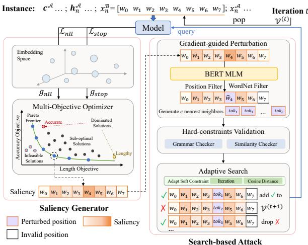
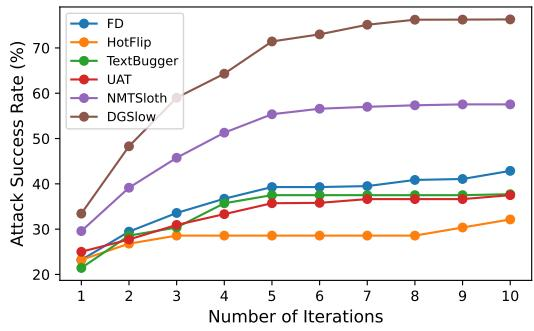
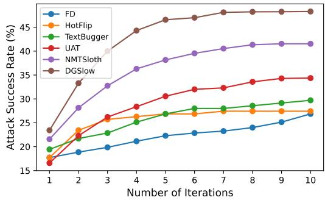
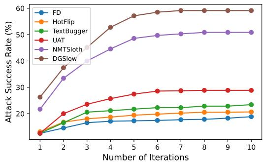

# White-Box Multi-Objective Adversarial Attack on Dialogue Generation

Yufei Li, Zexin Li, Yingfan Gao, Cong Liu University of California, Riverside {yli927,zli536,ygao195,congl}@ucr.edu

## Abstract

Pre-trained transformers are popular in stateof-the-art dialogue generation (DG) systems. Such language models are, however, vulnerable to various adversarial samples as studied in traditional tasks such as text classification, which inspires our curiosity about their robustness in DG systems. One main challenge of attacking DG models is that perturbations on the current sentence can hardly degrade the response accuracy because the unchanged chat histories are also considered for decision-making. Instead of merely pursuing pitfalls of performance metrics such as BLEU, ROUGE, we observe that crafting adversarial samples to force longer generation outputs benefits attack effectiveness—the generated responses are typically irrelevant, lengthy, and repetitive. To this end, we propose a white-box multi-objective attack method called DGSlow. Specifically, DGSlow balances two objectives—generation accuracy and length, via a gradient-based multiobjective optimizer and applies an adaptive searching mechanism to iteratively craft adver sarial samples with only a few modifications. Comprehensive experiments1 on four benchmark datasets demonstrate that DGSlow could significantly degrade state-of-the-art DG mod els with a higher success rate than traditional accuracy-based methods. Besides, our crafted sentences also exhibit strong transferability in attacking other models.

## 1 Introduction

Pre-trained transformers have achieved remarkable success in dialogue generation (DG) (Zhang et al., 2020; Raffel et al., 2020; Roller et al., 2021), e.g., the ubiquitous chat agents and voice-embedded chat-bots. However, such powerful models are fragile when encountering adversarial samples crafted by small and imperceptible perturbations (Goodfellow et al., 2015). Recent studies have revealed the vulnerability of deep learning in traditional tasks such as text classification (Chen et al., 2021; Guo et al., 2021; Zeng et al., 2021) and neural machine translation (Zou et al., 2020; Zhang et al., 2021). Nonetheless, investigating the robustness of DG systems has not received much attention.

Crafting DG adversarial samples is notably more challenging due to the conversational paradigm, where we can only modify the current utterance while the models make decisions also based on previous chat history (Liu et al., 2020). This renders small perturbations even more negligible for degrading the output quality. An intuitive adaptation of existing accuracy-based attacks, especially black-box methods (Iyyer et al., 2018; Ren et al., 2019a; Zhang et al., 2021) that merely pursue pitfalls for performance metrics, cannot effectively tackle such issues. Alternatively, we observed that adversarial perturbations forcing longer outputs are more effective against DG models, as longer generated responses are generally more semanticirrelevant to the references. Besides, such an objective is non-trivial because current large language models can handle and generate substantially long outputs. This implies the two attacking objectives— generation accuracy and length, can somehow be correlated and jointly approximated.

To this end, we propose a novel attack method targeting the two objectives called DGSlow, which produces semantic-preserving adversarial samples and achieves a higher attack success rate on DG models. Specifically, we define two objectiveoriented losses corresponding to the response accuracy and length. Instead of integrating both objectives and applying human-based parameter tuning, which is inefficient and resource-consuming, we propose a gradient-based multi-objective optimizer to estimate an optimal Pareto-stationary solution (Lin et al., 2019). The derived gradients serve as indicators of the significance of each word in a DG instance. Then we iteratively substitute those keywords using masked language modeling (MLM) (Devlin et al., 2019) and validate the correctness of crafted samples. The intuition is to maintain semantics and grammatical correctness with minimum word replacements (Zou et al., 2020; Cheng et al., 2020b). Finally, we define a unique fitness function that considers both objectives for selecting promising crafted samples. Unlike existing techniques that apply either greedy or random search, we design an adaptive search algorithm where the selection criteria are dynamically based on the current iteration and candidates’ quality. Our intuition is to avoid the search strapped in a local minimum and further improve efficiency.

We conduct comprehensive attacking experiments on three pre-trained transformers over four DG benchmark datasets to evaluate the effectiveness of our method. Evaluation results demonstrate that DGSlow overall outperforms all baseline methods in terms of higher attack success rate, better semantic preservance, and longer as well as more irrelevant generation outputs. We further investigate the transferability of DGSlow on different models to illustrate its practicality and usability in real-world applications.

Our main contributions are as follows:

• To the best of our knowledge, we are the first to study the robustness of large language models in DG systems against adversarial attacks, and propose a potential way to solve such challenge by re-defining DG adversarial samples.

• Different from existing methods that only consider a single objective, e.g., generation accuracy, we propose multi-objective optimization and adaptive search to produce semanticpreserving adversarial samples that can produce both lengthy and irrelevant outputs.

• Extensive experiments demonstrate the superiority of DGSlow to all baselines as well as the strong transferability of our crafted samples.

## 2 Dialogue Adversarial Generation

Suppose a chat bot aims to model conversations between two persons. We follow the settings (Liu et al., 2020) where each person has a persona $( \mathrm { e } . \mathrm { g } . , \mathrm { } c ^ { A }$ for person ), described with $L$ profile sentences $\big \{ { \hat { c } } _ { 1 } ^ { A } , . . . , c _ { L } ^ { A } \big \}$ . Person chats with the other person  through a N-turn dialogue $( \boldsymbol { x } _ { 1 } ^ { A } , \boldsymbol { x } _ { 1 } ^ { B } , \dot { \boldsymbol { \ldots } } , \boldsymbol { x } _ { N } ^ { A } , \boldsymbol { x } _ { N } ^ { B } )$ ), where N is the number of total turns and $x _ { n } ^ { \mathcal { A } }$ is the utterance that says in n-th turn. A DG model $f$ takes the persona $c ^ { A }$ , the entire dialogue history until n-th turn $\pmb { h } _ { n } ^ { \mathcal { A } } = ( x _ { 1 } ^ { B } , . . . , x _ { n - 1 } ^ { A } )$ , and $\boldsymbol { B ^ { \prime } } \boldsymbol { \mathrm { s } }$ current utterance $x _ { n } ^ { B }$ as inputs, generates outputs $x _ { n } ^ { \mathcal { A } }$ by maximizing the probability $p ( x _ { n } ^ { \mathcal { A } } | c ^ { \mathcal { A } } , \hat { h _ { n } ^ { \mathcal { A } } } , x _ { n } ^ { \mathcal { B } } )$ . The same process applies for $\boldsymbol { B }$ to keep the conversation going. In the following, we first define the optimization goal of DG adversarial samples and then introduce our multi-objective optimization followed by a searchbased adversarial attack framework.

## 2.1 Definition of DG Adversarial Samples

In each dialogue turn $n ,$ , we craft an utterance $x _ { n } ^ { B }$ that person  says to fool a bot targeting to mimic person . Note that we do not modify the chat history $\pmb { h } _ { n } ^ { \mathcal { A } } = ( x _ { 1 } ^ { B } , . . . , x _ { n - 1 } ^ { A } )$ , as it should remain unchanged in real-world scenarios.

Take person $\boldsymbol { B }$ as an example, an optimal DG adversarial sample in n-th turn is a utterance $x _ { n } ^ { B * }$

$$
\begin{array} { c } { { x _ { n } ^ { B * } = \arg \operatorname* { m i n } M ( x _ { n } ^ { r e f } , \hat { x } _ { n } ^ { A } ) } } \\ { { \hat { x } _ { n } ^ { B } } } \\ { { s . t . \hat { x } _ { n } ^ { A } \equiv f ( c ^ { A } , h _ { n } ^ { A } , \hat { x } _ { n } ^ { B } ) \wedge \rho ( x _ { n } ^ { B } , \hat { x } _ { n } ^ { B } ) > \epsilon } } \end{array}\tag{1}
$$

where $\rho ( . )$ is a metric for measuring the semantic preservance, e.g., the cosine similarity between the original input sentence $x _ { n } ^ { B }$ and a crafted sentence $\overset { \overline { { \boldsymbol { x } } } } { } _ { n } ^ { B } .$ . ϵ is the perturbation threshold. $M ( \cdot )$ is a metric for evaluating the quality of an output sentence $\hat { x } _ { n } ^ { A }$ according to a reference $x _ { n } ^ { r e f }$ . Existing work typically applies performance metrics in neural machine translation (NMT), e.g., BLEU score (Papineni et al., 2002), ROUGE (Lin and Och, 2004), as a measurement of $M ( \cdot )$ . In this work, we argue the output length itself directly affects the DG performance, and generating longer output should be considered as another optimization objective.

Accordingly, we define Targeted Confidence (TC) and Generation Length (GL). TC is formulated as the cumulative probabilities regarding a reference $x _ { n } ^ { r e f }$ to present the accuracy objective, while GL is defined as the number of tokens in the generated output sentence regarding an input $\hat { x } _ { n } ^ { B }$ to reflect the length objective:

$$
\left\{ \begin{array} { l l } { \mathrm { T C } ( \hat { x } _ { n } ^ { \mathcal { B } } ) = \sum _ { t } p _ { \theta } ( x _ { n , t } ^ { r e f } | c ^ { \mathcal { A } } , h _ { n } ^ { \mathcal { A } } , \hat { x } _ { n } ^ { \mathcal { B } } , x _ { n , < t } ^ { r e f } ) } \\ { \mathrm { G L } ( \hat { x } _ { n } ^ { \mathcal { B } } ) = | \hat { x } _ { n } ^ { \mathcal { A } } | = | f ( c ^ { \mathcal { A } } , h _ { n } ^ { \mathcal { A } } , \hat { x } _ { n } ^ { \mathcal { B } } ) | } \end{array} \right.\tag{2}
$$

Based on our DG definition in Eq. (1), we aim to craft adversarial samples that could produce small

  
Figure 1: Illustration of our DGSlow attack method. In each iteration, the current adversarial utterance $\hat { x } _ { n } ^ { B }$ , together with persona, chat history, and references, are fed into the model to obtain the word saliency via gradient descent. Then we mutate the positions with high word saliency and validate the correctness of the perturbed samples. The remaining samples query the model to calculate their fitness, and we select k prominent candidates using adaptive search for the next iteration.

TC and large GL. To this end, we propose a whitebox targeted DG adversarial attack that integrates multi-objective optimization and adaptive search to iteratively craft adversarial samples with wordlevel perturbations (see Figure 1).

## 2.2 Multi-Objective Optimization

Given a DG instance $( c ^ { \mathcal { A } } , h _ { n } ^ { \mathcal { A } } , x _ { n } ^ { \mathcal { B } } , x _ { n } ^ { r e f } )$ , an appropriate solution to produce lower TC is to minimize the log-likelihood (LL) objective for decoding $x _ { n } ^ { r e f } .$ i.e., the accumulated likelihood of next token $x _ { n , t } ^ { r e f }$ given previous tokens $x _ { n , < t } ^ { r e f }$

$$
\mathcal { L } _ { l l } = \sum _ { t } \log p _ { \theta } ( x _ { n , t } ^ { r e f } | c ^ { A } , h _ { n } ^ { A } , x _ { n } ^ { B } , x _ { n , < t } ^ { r e f } )\tag{3}
$$

In another aspect, crafting adversarial samples with larger GL can be realized by minimizing the decoding probability of eos token, which delays the end of decoding process to generate longer sequences. Intuitively, without considering the implicit Markov relationship in a DG model and simplifying the computational cost, we directly force an adversarial example to reduce the probability of predicting eos token by applying the Binary Cross Entropy (BCE) loss:

$$
\mathcal { L } _ { e o s } = \sum _ { t } ( l _ { t } ^ { e o s } - \mathbb { E } _ { t o k \sim p _ { t } } l _ { t } ^ { t o k } )\tag{4}
$$

where $l _ { t } ^ { t o k }$ is the logit at position t regarding a predicted token tok, and $p _ { t }$ is the decoding probability for the t-th token. Furthermore, we penalize adversarial samples that deviate too much from the original sentence to preserve semantics:

$$
\mathcal { L } _ { r e g } = \operatorname* { m a x } ( 0 , \epsilon - \rho ( x _ { n } ^ { B } , \hat { x } _ { n } ^ { B } ) )\tag{5}
$$

where $\rho$ and ϵ are semantic similarity and threshold as defined in $\operatorname { E q . } \left( 1 \right)$ . We formulate the stop loss as a weighted sum of eos loss and regularization penalty to represent the length objective:

$$
\mathcal { L } _ { s t o p } = \mathcal { L } _ { e o s } + \beta \mathcal { L } _ { r e g }\tag{6}
$$

where $\beta$ is a hyper-parameter that controls the penalty term’s impact level. Considering that the log-likelihood loss $\mathcal { L } _ { l l }$ and the stop loss $\mathcal { L } _ { s t o p }$ may conflict to some extent as they target different objectives, we assign proper weights $\alpha _ { 1 } .$ , α2 to each loss and optimize them based on the Multi-objective $O p \mathrm { - }$ timization (MO) theorem (Lin et al., 2019). Specifically, we aim to find a Pareto-stationary point by solving the Lagrange problem:

$$
\begin{array} { c } { \left( \begin{array} { c } { \hat { \alpha } _ { 1 } ^ { * } } \\ { \hat { \alpha } _ { 2 } ^ { * } } \\ { \lambda } \end{array} \right) = ( \boldsymbol { \mathcal { M } } ^ { \top } \boldsymbol { \mathcal { M } } ) ^ { - 1 } \boldsymbol { \mathcal { M } } \left[ \begin{array} { l } { - \mathcal { G } \mathcal { G } ^ { \top } \boldsymbol { c } } \\ { 1 - e ^ { \top } \boldsymbol { c } } \\ { \phantom { - } \lambda } \end{array} \right] } \\ { s . t . \ \boldsymbol { \mathcal { M } } = \left[ \begin{array} { l l } { \mathcal { G } \mathcal { G } ^ { \top } } & { e } \\ { e ^ { \top } } & { 0 } \end{array} \right] } \end{array}\tag{7}
$$

where $\mathcal { G } ~ = ~ [ g _ { l l } , g _ { s t o p } ]$ , and $g _ { l l } , \ g _ { s t o p }$ are gradients derived from $\mathcal { L } _ { l l } , \mathcal { L } _ { s t o p }$ w.r.t. the embedding layer, $e = [ 1 , 1 ] , c = [ c _ { 1 } , c _ { 2 } ]$ and $c _ { 1 } , \ : c _ { 2 }$ are two boundary constraints $\alpha _ { 1 } \geq c _ { 1 } , \alpha _ { 2 } \geq c _ { 2 }$ , λ is the Lagrange multiplier. The final gradient is defined as the weighted sum of the two gradients $g = \hat { \alpha } _ { 1 } ^ { * } \cdot g _ { l l } + \hat { \alpha } _ { 2 } ^ { * } \cdot g _ { s t o p }$ . Such gradients facilitate locating the significant words in a sentence for effective and efficient perturbations.

## 2.3 Search-based Adversarial Attack

We combine the multi-objective optimization with a search-based attack framework to iteratively generate adversarial samples against the DG model, as shown in the right part of Figure 1. Specifically, our search-based attacking framework contains three parts—Gradient-guided Perturbation (GP) that substitutes words at significant positions, Hardconstraints Validation (HV) that filters out invalid adversarial candidates, and Adaptive Search (AS) that selects k most prominent candidates based on different conditions for the next iteration.

Gradient-guided Perturbation. Let $x \quad =$ $[ w _ { 0 } , . . . , w _ { i } , . . . , w _ { n } ]$ be the original sentence where i denotes the position of a word $w _ { i }$ in the sentence. During iteration t, for the current adversarial sentence $\bar { \boldsymbol { x } } ^ { ( t ) } = [ w _ { 0 } ^ { ( t ) } , . . . , w _ { i } ^ { ( t ) } , . . . , w _ { n } ^ { ( t ) } ]$ , we first define Word Saliency (WS) (Li et al., 2016) which is used to sort the positions whose corresponding word has not been perturbed. The intuition is to skip the positions that may produce low attack effect so as to accelerate the search process. In our DG scenario, WS refers to the significance of a word in an input sentence for generating irrelevant and lengthy output. We quantified WS by average pooling the aforementioned gradient $g$ over the embedding dimension, and sort the positions according to an order of large-to-small scores.

For each position i, we define a candidate set $\mathbb { L } _ { i } ^ { ( t ) } \in \mathbb { D }$ where D is a dictionary consisting of all words that express similar meanings to $w _ { i } ^ { ( t ) }$ , considering the sentence context. In this work, we apply BERT masked language modeling (MLM) (Devlin et al., 2019) to generate c closest neighbors in the latent space. The intuition is to generate adversarial samples that are more fluent compared to rulebased synonymous substitutions. We further check those neighbors by querying the WordNet (Miller, 1998) and filtering out antonyms of $w _ { i } ^ { ( t ) }$ to build the candidate set. Specifically, we first create a masked sentence $x _ { m _ { i } } ^ { ( t ) } = [ w _ { 0 } ^ { ( t ) } , . . . , [ \mathbf { M A S K } ] , . . . , w _ { n } ^ { ( t ) } ]$ by replacing $w _ { i } ^ { ( t ) }$ with a [MASK] token. Then, we craft adversarial sentences $\hat { x } _ { i } ^ { ( t + 1 ) }$ by filling the [MASK] token in $x _ { m _ { i } } ^ { ( t ) }$ with different candidate tokens $\hat { w } _ { i } ^ { ( t + 1 ) }$

Hard-constraints Validation. The generated adversarial sentence ${ \hat { x } } ^ { ( t ) }$ could be much different from the original x after t iterations. To promisefluency, we validate the number of grammatical errors in $\dot { \hat { x } } ^ { ( t ) }$ using a Language Checker (Myint, 2021). Besides, the adversarial candidates should also preserve enough semantic information of the original one. Accordingly, we encode ${ \hat { x } } ^ { ( t ) }$ and x using a universal sentence encoder (USE) (Cer et al., 2018), and calculate the cosine similarity between their sentence embeddings as their semantic similarity. We record those generated adversarial candidates $\hat { x } ^ { ( t ) }$ whose 1) grammar errors are smaller than that of x and 2) cosine similarities with x are larger than a predefined threshold $\epsilon ,$ then put them into a set $\mathcal { \nu } ^ { ( t ) }$ , which is initialized before the next iteration.

Adaptive Search. For a DG instance $( c ^ { \mathcal { A } } , h _ { n } ^ { \mathcal { A } } , \hat { x } _ { n } ^ { \mathcal { B } } , x _ { n } ^ { r e f } )$ , we define a domain-specificfitness function $\varphi$ which measures the preference for a specific adversarial $\hat { x } _ { n } ^ { B }$ :

$$
\varphi ( \hat { x } _ { n } ^ { \mathcal { B } } ) = \frac { | f ( c ^ { A } , h _ { n } ^ { \mathcal { A } } , \hat { x } _ { n } ^ { \mathcal { B } } ) | } { \sum _ { t } p _ { \theta } ( x _ { n , t } ^ { r e f } | c ^ { A } , h _ { n } ^ { \mathcal { A } } , \hat { x } _ { n } ^ { \mathcal { B } } , x _ { n , < t } ^ { r e f } ) }\tag{8}
$$

The fitness serves as a criteria for selecting $\hat { x } _ { n } ^ { B }$ that could produce larger GL and has lower TC with respect to the references $x _ { n } ^ { r e f }$ , considering the persona $c ^ { A }$ and chat history $h _ { n } ^ { \mathcal { A } }$

After each iteration, it is straightforward to select candidates using Random Search (RS) or Greedy Search (GS) based on candidates’ fitness scores. However, random search ignores the impact of an initial result on the final result, while greedy search neglects the situations where a local optimum is not the global optimum. Instead, we design an adaptive search algorithm based on the iteration t as well as the candidates’ quality $q _ { t }$ . Specifically, $q _ { t }$ is defined as the averaged cosine similarity between each valid candidate and the original input:

$$
q _ { t } = \frac { \sum _ { \hat { x } ^ { ( t ) } \in \mathcal { V } ^ { ( t ) } } c o s ( \hat { x } ^ { ( t ) } , x ) } { | \mathcal { V } ^ { ( t ) } | }\tag{9}
$$

Larger $q _ { t }$ means smaller perturbation effects. The search preference $\xi _ { t }$ can be formulated as:

$$
\xi _ { t } = \frac { ( t - 1 ) e ^ { q _ { t } - 1 } } { T - 1 }\tag{10}
$$

where $T$ is the maximum iteration number. Given $t = [ 1 , . . . , T ]$ and $q _ { t } ~ \in ~ [ 0 , 1 ]$ $\xi _ { t }$ is also bounded in the range [0, 1]. We apply random search if $\xi _ { t }$ is larger than a threshold $\delta ,$ and greedy search otherwise. The intuition is to 1) find a prominent initial result using greedy search at the early stage (small $t ) .$ , and 2) avoid being strapped into a local minimum by gradually introducing randomness when there is no significant difference between the current adversarial candidates and the prototype (large $q _ { t } )$ . We select k (beam size) prominent candidates in $\mathcal { \nu } ^ { ( t ) }$ , where each selected sample serves as an initial adversarial sentence in the next iteration to start a new local search for more diverse candidates. We keep track of the perturbed positions for each adversarial sample to avoid repetitive perturbations and further improve efficiency.

<table><tr><td rowspan="2">Dataset</td><td colspan="4">DialoGPT</td><td colspan="4">BART</td><td colspan="4">T5</td></tr><tr><td>GL</td><td>BLEU</td><td>ROU.</td><td>MET.</td><td>GL</td><td>BLEU</td><td>ROU.</td><td>MET.</td><td>GL</td><td>BLEU</td><td>ROU.</td><td>MET.</td></tr><tr><td>BST</td><td>16.05</td><td>14.54</td><td>19.42</td><td>23.83</td><td>14.94</td><td>13.91</td><td>20.73</td><td>20.52</td><td>14.14</td><td>14.12</td><td>22.12</td><td>21.70</td></tr><tr><td>PC</td><td>15.22</td><td>18.44</td><td>30.23</td><td>31.03</td><td>13.65</td><td>18.12</td><td>28.30</td><td>28.81</td><td>13.12</td><td>18.20</td><td>28.83</td><td>28.91</td></tr><tr><td>CV2</td><td>12.38</td><td>12.83</td><td>16.31</td><td>14.10</td><td>10.64</td><td>12.24</td><td>11.81</td><td>12.03</td><td>13.25</td><td>10.23</td><td>10.61</td><td>9.24</td></tr><tr><td>ED</td><td>14.47</td><td>9.24</td><td>13.10</td><td>11.42</td><td>14.69</td><td>8.04</td><td>11.13</td><td>10.92</td><td>15.20</td><td>7.73</td><td>11.31</td><td>10.34</td></tr></table>

Table 1: Performance of three DG victim models in four benchmark datasets. GL denotes the average generation output length. ROU.(%) and MET.(%) are abbreviations for ROUGE-L and METEOR.

<table><tr><td>Dataset</td><td>#Dialogues</td><td>#Utterances</td></tr><tr><td>BST</td><td>4,819</td><td>27,018</td></tr><tr><td>PC</td><td>17,878</td><td>62,442</td></tr><tr><td>CV2</td><td>3,495</td><td>22,397</td></tr><tr><td>ED</td><td>36,660</td><td>76,673</td></tr></table>

Table 2: Statistics of the four DG datasets.

## 3 Experiments

## 3.1 Experimental Setup

Datasets. We evaluate our generated adversarial DG examples on four benchmark datasets, namely, Blended Skill Talk (BST) (Smith et al., 2020), PERSONACHAT (PC) (Zhang et al., 2018), ConvAI2 (CV2) (Dinan et al., 2020), and Empathetic-Dialogues (ED) (Rashkin et al., 2019a). For BST and PC, we use their annotated suggestions as the references $x _ { n } ^ { r e f }$ for evaluation. For ConvAI2 and ED, we use the response $x _ { n } ^ { \mathcal { A } }$ as the reference since no other references are provided. Note that we ignore the persona during inference for ED, as it does not include personality information. We preprocess all datasets following the DG settings (in Section 2) where each dialogue contains n-turns of utterances. The statistics of their training sets are shown in Table 2.

Victim Models. We aim to attack three pretrained transformers, namely, DialoGPT (Zhang et al., 2020), BART (Lewis et al., 2020), and T5 (Raffel et al., 2020). DialoGPT is pre-trained for DG on Reddit dataset, based on autoregressive GPT-2 backbones (Radford et al., 2019). The latter two are seq2seq Encoder-Decoders pre-trained on open-domain datasets. Specifically, we use the HuggingFace pre-trained models—dialogpt-small, bart-base, and t5-small. The detailed information of each model can be found in Appendix A. We use Byte-level BPE tokenization (Radford et al., 2019) pre-trained on open-domain datasets, as implemented in HuggingFace tokenizers. To meet the DG requirements, we also define two additional special tokens, namely, [PS] and [SEP]. [PS] is added before each persona to let the model be aware of the personality of each person. [SEP] is added between each utterance within a dialogue so that the model can learn the structural information within the chat history.

Metrics. We evaluate attack methods considering 1) the generation accuracy of adversarial samples 2) the generation length (GL) of adversarial samples, and 3) the attack success rate (ASR). Specifically, the generation accuracy of adversarial samples are measured by performance metrics such as BLEU (Papineni et al., 2002), ROUGE-L (Lin and Och, 2004; Li et al., 2022) and ME-TEOR (Banerjee and Lavie, 2005) which reflect the correspondence between a DG output and references. We define ASR as:

$$
\begin{array} { r } { \mathrm { A S R } = \displaystyle \frac { \sum _ { i } ^ { N } \mathbf { 1 } [ c o s ( x , \hat { x } ) > \epsilon \wedge E ( y , \hat { y } ) > \tau ] } { N } } \\ { s . t . ~ E ( y , \hat { y } ) = M ( y , y _ { r e f } ) - M ( \hat { y } , y _ { r e f } ) \~ . } \end{array}\tag{11}
$$

where cos(.) denotes the cosine similarity between embeddings of original input x and crafted input xˆ. M( , ) is the average score of the three accuracy metrics. An attack is successful if the adversarial input can induce a more irrelevant (> τ) output and it preserves enough semantics (> ϵ) of the original input. Details of the performance of victim models are listed in Table 1.

Baselines. We compare against 5 recent whitebox attacks and adapt their attacking strategy to our DG scenario, including four accuracy-based attacks: 1) FD (Papernot et al., 2016) conducts a standard gradient-based word substitution for each word in the input sentence, 2) HotFlip (Ebrahimi et al., 2018b) proposes adversarial attacks based on both word and character-level substitution using embedding gradients, 3) TextBugger (Li et al., 2019) proposes a greedy-based word substitution and character manipulation strategy to conduct the white-box adversarial attack against DG model, 4) UAT (Wallace et al., 2019) proposes word or character manipulation based on gradients. Specifically, its implementation relies on prompt insertion, which is different from most other approaches. And one length-based attack NMTSloth (Chen et al., 2022), which is a length-based attack aiming to generate adversarial samples to make the NMT system generate longer outputs. It’s a strong baseline that generates sub-optimal length-based adversarial samples even under several constraints.

For all baselines, we adapt their methodologies to DG scenarios, where the input for computing loss contains both the current utterance, and other parts of a DG instance including chat history, persona or additional contexts. Specifically, we use TC as the optimization objective $( \mathrm { i } . \mathrm { e } . , \mathcal { L } _ { l l } )$ for all the baselines except NMTSloth which is a seq2seq attack method, and apply gradient descent to search for either word or character substitutions.

Hyper-parameters. For our DG adversarial attack, the perturbation threshold ϵ are performance threshold τ are set to 0.7 and 0 for defining a valid adversarial example. For multi-objective optimization, the regularization weight $\beta$ is set to 1 and the two boundaries $c _ { 1 }$ and $c _ { 2 }$ are set to 0 for nonnegative constraints. We use the Hugging face pre-trained bert-large-cased model for MLM and set the number of candidates c as 50 for mutation. For adaptive search, we set the preference threshold δ as 0.5 and beam size k as 2. Our maximum number of iterations is set to 5, meaning that our modification is no more than 5 words for each sentence. Besides, we also restrict the maximum query number to 2,000 for all attack methods. For each dataset, we randomly select 100 dialogue conversations (each conversation contains 5 8 turns) for testing the attacking effectiveness.

## 3.2 Overall Effectiveness

Table 3 shows the GL, two accuracy metrics (ME-TEOR results are in Appendix A), ASR and cosine results of all attack methods. We observe that NMT-Sloth and our DGSlow can produce much longer outputs than the other four baselines. Accordingly, their attacking effectiveness regarding the output accuracy, i.e., BLEU and ROUGE-L, and ASR scores are much better than the four accuracy-based methods, proving the correctness of our assumption that adversarial samples forcing longer outputs also induce worse generation accuracy. Though NMT-Sloth can also generate lengthy outputs as DGSlow does, our method still achieves better ASR, accuracy scores and cosine similarity, demonstrating that our multi-objective optimization further benefits both objectives. Moreover, our method can promise semantic-preserving perturbations while largely degrading the model performance, e.g., the cosine similarity of DGSlow is at the top-level with baselines such as UAT and TextBugger. This further proves our gradient-based word saliency together with the adaptive search can efficiently locate significant positions and realize maximum attacking effect with only a few modifications.

  
Figure 2: ASR vs. number of iterations in BST when attacking DialoGPT. DGSlow significantly outperforms all baselines.

Attack Efficiency. Figure 2 shows all attack methods’ ASR in BST when attacking DialoGPT under the restriction of maximum iteration numbers. Reminder results for the other two models can be found in Appendix A. We observe that our attack significantly outperforms all accuracy-based baseline methods under the same-level of modifications, demonstrating the efficiency of length-based approach. Furthermore, DGSlow can achieve better ASR than NMTSloth, proving the practicality of our multi-objective optimization and adaptive search in real-world DG situations.

Beam Size. We further evaluate the impact of the remaining number of prominent candidates k (after each iteration) on the attack effectiveness, as shown in Table 4. We observe that larger k leads to overall longer GL, larger ASR and smaller BLEU, showing that as more diverse candidates are considered in the search space, DGSlow is benefited by the adaptive search for finding better local optima.

## 3.3 Ablation Study

We exhibit the ablation study of our proposed DGSlow algorithm in Table 5. Specifically, if MO is not included, we only use gradient $g _ { s t o p }$ derived from $\mathcal { L } _ { s t o p }$ for searching candidates. If CF is not included, we use $\varphi ^ { \prime } ( \hat { x } _ { n } ^ { B } ) = \mathbf { G } \mathbf { L } ( \hat { x } _ { n } ^ { B } )$ as the fitness function, meaning we only select candidates that generate the longest output but ignore the quality measurement. We observe that: 1) Greedily selecting candidates with highest fitness is more effective than random guess, e.g., the ASR of GS are much higher than those of RS; 2) Our adaptive search, i.e., DGSlow1, makes better choices when selecting candidates compared to RS and GS; 3) Modifying the fitness function by considering both TC and GL, i.e., DGSlow2, can slightly improve overall ASR over DGSlow1; 4) Only using multi-objective optimization, i.e., DGSlow3, can produce better attack results compared to only modifying the fitness.

<table><tr><td rowspan="2">Dataset</td><td rowspan="2">Method</td><td colspan="5">DialoGPT</td><td colspan="5">BART</td><td colspan="5">T5</td></tr><tr><td>GL</td><td>BLEU</td><td>ROU.</td><td>ASR</td><td>Cos.</td><td>GL</td><td>BLEU</td><td>ROU.</td><td>ASR</td><td>Cos.</td><td>GL</td><td>BLEU</td><td>ROU.</td><td>ASR</td><td>Cos.</td></tr><tr><td rowspan="6">BST</td><td>FD</td><td>16.70</td><td>13.74</td><td>18.31</td><td>39.29</td><td>0.79</td><td>16.60</td><td>12.74</td><td>18.62</td><td>25.14</td><td>0.88</td><td>14.74</td><td>13.30</td><td>21.42</td><td>17.14</td><td>0.90</td></tr><tr><td>HotFlip</td><td>16.13</td><td>14.12</td><td>19.24</td><td>30.36</td><td>0.81</td><td>16.86</td><td>12.82</td><td>18.70</td><td>22.86</td><td>0.89</td><td>14.90</td><td>13.01</td><td>20.74</td><td>19.43</td><td>0.90</td></tr><tr><td>TextBugger</td><td>15.36</td><td>14.44</td><td>19.94</td><td>37.50</td><td>0.86</td><td>17.01</td><td>12.50</td><td>18.82</td><td>28.57</td><td>0.88</td><td>14.79</td><td>13.61</td><td>20.73</td><td>18.86</td><td>0.91</td></tr><tr><td>UAT</td><td>16.39</td><td>14.49</td><td>19.06</td><td>35.71</td><td>0.90</td><td>19.13</td><td>11.37</td><td>19.06</td><td>29.14</td><td>0.92</td><td>16.03</td><td>13.41</td><td>21.42</td><td>27.43</td><td>0.92</td></tr><tr><td>NMTSloth</td><td>22.23</td><td>13.20</td><td>18.65</td><td>55.36</td><td>0.78</td><td>23.74</td><td>9.60</td><td>17.91</td><td>42.45</td><td>0.84</td><td>27.31</td><td>9.49</td><td>18.37</td><td>48.57</td><td>0.85</td></tr><tr><td>DGSlow</td><td>25.54</td><td>9.14</td><td>17.03</td><td>71.43</td><td>0.90</td><td>23.50</td><td>8.39</td><td>16.37</td><td>48.00</td><td>0.92</td><td>28.69</td><td>9.11</td><td>15.82</td><td>57.14</td><td>0.93</td></tr><tr><td rowspan="6">PC</td><td>FD</td><td>17.27</td><td>17.13</td><td>30.22</td><td>36.67</td><td>0.79</td><td>17.20</td><td>15.71</td><td>26.90</td><td>46.55</td><td>0.79</td><td>14.54</td><td>16.34</td><td>27.69</td><td>33.62</td><td>0.82</td></tr><tr><td>HotFlip</td><td>17.22</td><td>17.74</td><td>28.81</td><td>56.67</td><td>0.79</td><td>17.51</td><td>15.01</td><td>26.53</td><td>57.76</td><td>0.77</td><td>15.97</td><td>15.31</td><td>27.20</td><td>43.10</td><td>0.81</td></tr><tr><td>TextBugger</td><td>17.93</td><td>17.42</td><td>30.51</td><td>41.67</td><td>0.84</td><td>18.08</td><td>14.32</td><td>26.91</td><td>57.76</td><td>0.80</td><td>14.73</td><td>15.81</td><td>27.60</td><td>43.10</td><td>0.86</td></tr><tr><td>UAT</td><td>11.35</td><td>17.54</td><td>30.52</td><td>53.33</td><td>0.87</td><td>17.91</td><td>14.83</td><td>25.84</td><td>61.21</td><td>0.89</td><td>15.62</td><td>16.24</td><td>28.27</td><td>36.21</td><td>0.81</td></tr><tr><td>NMTSloth</td><td>22.01</td><td>16.39</td><td>28.79</td><td>66.67</td><td>0.73</td><td>29.09</td><td>8.96</td><td>21.49</td><td>95.69</td><td>0.58</td><td>30.37</td><td>8.87</td><td>16.66</td><td>87.93</td><td>0.65</td></tr><tr><td>DGSlow</td><td>25.72</td><td>15.68</td><td>27.77</td><td>70.00</td><td>0.86</td><td>31.94</td><td>9.32</td><td>20.50</td><td>96.55</td><td>0.89</td><td>32.17</td><td>8.86</td><td>15.38</td><td>90.33</td><td>0.86</td></tr><tr><td rowspan="6">CV2</td><td>FD</td><td>15.74</td><td>12.54</td><td>14.33</td><td>38.10</td><td>0.78</td><td>12.30</td><td>10.81</td><td>10.52</td><td>20.13</td><td>0.88</td><td>13.97</td><td>9.91</td><td>10.62</td><td>16.78</td><td>0.90</td></tr><tr><td>HotFlip</td><td>16.38</td><td>13.33</td><td>15.21</td><td>33.33</td><td>0.81</td><td>13.46</td><td>10.50</td><td>10.41</td><td>32.89</td><td>0.86</td><td>14.03</td><td>9.63</td><td>10.12</td><td>26.17</td><td>0.86</td></tr><tr><td>TextBugger</td><td>12.93</td><td>12.83</td><td>14.71</td><td>40.48</td><td>0.80</td><td>12.70</td><td>10.82</td><td>10.12</td><td>34.90</td><td>0.87</td><td>15.00</td><td>9.62</td><td>10.11</td><td>27.52</td><td>0.87</td></tr><tr><td>UAT</td><td>14.36</td><td>12.94</td><td>15.79</td><td>42.86</td><td>0.80</td><td>13.50</td><td>10.61</td><td>10.23</td><td>33.56</td><td>0.88</td><td>15.17</td><td>9.21</td><td>10.11</td><td>30.20</td><td>0.85</td></tr><tr><td>NMTSloth</td><td>20.79</td><td>12.34</td><td>15.49</td><td>61.90</td><td>0.74</td><td>23.01</td><td>7.91</td><td>9.11</td><td>52.35</td><td>0.73</td><td>21.27</td><td>8.79</td><td>9.58</td><td>51.68</td><td>0.72</td></tr><tr><td>DGSlow</td><td>28.54</td><td>11.70</td><td>13.71</td><td>64.29</td><td>0.81</td><td>23.84</td><td>6.51</td><td>8.34</td><td>56.61</td><td>0.87</td><td>22.32</td><td>7.74</td><td>8.43</td><td>53.02</td><td>0.88</td></tr><tr><td rowspan="6">ED</td><td>FD</td><td>15.00</td><td>9.03</td><td>12.62</td><td>41.82</td><td>0.75</td><td>19.66</td><td>6.54</td><td>10.44</td><td>44.26</td><td>0.76</td><td>16.66</td><td>7.41</td><td>11.30</td><td>32.79</td><td>0.79</td></tr><tr><td>HotFlip</td><td>17.69</td><td>8.71</td><td>12.92</td><td>40.74</td><td>0.78</td><td>21.38</td><td>6.71</td><td>10.74</td><td>67.21</td><td>0.70</td><td>17.30</td><td>7.03</td><td>10.81</td><td>37.70</td><td>0.80</td></tr><tr><td>TextBugger</td><td>14.66</td><td>9.01</td><td>12.73</td><td>40.00</td><td>0.89</td><td>22.26</td><td>6.03</td><td>8.82</td><td>70.49</td><td>0.78</td><td>17.11</td><td>7.12</td><td>10.23</td><td>47.54</td><td>0.81</td></tr><tr><td>UAT</td><td>15.33</td><td>8.64</td><td>13.03</td><td>52.73</td><td>0.87</td><td>20.72</td><td>6.41</td><td>11.12</td><td>50.82</td><td>0.82</td><td>17.30</td><td>7.24</td><td>10.43</td><td>42.62</td><td>0.89</td></tr><tr><td>NMTSloth</td><td>23.76</td><td>8.98</td><td>13.83</td><td>65.45</td><td>0.87</td><td>29.98</td><td>4.51</td><td>9.32</td><td>86.89</td><td>0.78</td><td>35.90</td><td>4.49</td><td>7.98</td><td>90.16</td><td>0.80</td></tr><tr><td>DGSlow</td><td>24.72</td><td>8.93</td><td>12.12</td><td>69.81</td><td>0.90</td><td>34.28</td><td>4.22</td><td>8.11</td><td>98.36</td><td>0.82</td><td>38.82</td><td>4.02</td><td>6.10</td><td>94.16</td><td>0.92</td></tr></table>

Table 3: Evaluation of attack methods on three victim models in four DG benchmark datasets. GL denotes the average generation output length. Cos. denotes the cosine similarity between original and adversarial sentences. ROU. (%) denotes ROUGE-L. Bold numbers mean the best metric values over the six methods.

<table><tr><td rowspan="2">Metric</td><td colspan="5">Beam Size k</td></tr><tr><td>1</td><td>2</td><td>3</td><td>4</td><td>5</td></tr><tr><td>GL</td><td>15.93</td><td>17.94</td><td>18.91</td><td>18.81</td><td>19.15</td></tr><tr><td>ASR</td><td>46.98</td><td>47.99</td><td>48.32</td><td>48.65</td><td>49.32</td></tr><tr><td>BLEU</td><td>13.06</td><td>12.93</td><td>11.27</td><td>10.90</td><td>9.03</td></tr></table>

Table 4: GL, ASR and BLEU vs. Beam size. In general, DGSlow can produce adversarial samples that induce longer and more irrelevant outputs as the selected number of candidates after each iteration increases.
<table><tr><td>Method</td><td>MO CF</td><td>BST</td><td>PC</td><td></td><td>CV2</td><td>ED</td></tr><tr><td>RS</td><td>x</td><td>x</td><td>30.29</td><td>61.21</td><td>30.87</td><td>52.46</td></tr><tr><td>GS</td><td>x</td><td>x</td><td>46.29</td><td>85.69</td><td>48.99</td><td>86.89</td></tr><tr><td>DGSlow1</td><td>x</td><td>x</td><td>46.33</td><td>88.34</td><td>50.68</td><td>89.51</td></tr><tr><td>DGSlow2</td><td>x</td><td>√</td><td>48.33</td><td>90.16</td><td>49.65</td><td>90.25</td></tr><tr><td>DGSlow3</td><td>√</td><td>x</td><td>46.29</td><td>92.24</td><td>52.39</td><td>92.38</td></tr><tr><td>DGSlow</td><td>√</td><td>√</td><td>48.00</td><td>96.55</td><td>56.61</td><td>98.36</td></tr></table>

Table 5: Ablation study for ASR (%) on BART with controllable components. RS denotes random search. GS denotes greedy search. MO denotes multi-objective optimization. CF denotes combined fitness function.
<table><tr><td>Transfer</td><td>Victim</td><td>GL</td><td>BLEU</td><td>ROU.</td><td>MET.</td><td>ASR</td></tr><tr><td rowspan="2">DialoGPT</td><td>BART</td><td>20.35</td><td>8.53</td><td>10.79</td><td>8.68</td><td>55.81</td></tr><tr><td>T5</td><td>19.02</td><td>9.18</td><td>10.91</td><td>8.66</td><td>47.50</td></tr><tr><td rowspan="2">BART</td><td>DialoGPT</td><td>25.73</td><td>7.84</td><td>10.67</td><td>10.90</td><td>67.27</td></tr><tr><td>T5</td><td>24.71</td><td>7.91</td><td>10.03</td><td>10.92</td><td>63.93</td></tr><tr><td rowspan="2">T5</td><td>DialoGPT</td><td>23.89</td><td>7.70</td><td>11.28</td><td>10.33</td><td>47.27</td></tr><tr><td>BART</td><td>24.20</td><td>7.72</td><td>11.22</td><td>10.31</td><td>52.46</td></tr></table>

Table 6: Transfer attack results of adversarial samples in ED. Victim denotes the model attacked by DGSlow to generate adversarial samples. Transfer denotes the model that is tested by those crafted samples.

## 3.4 Transferability

We evaluate the transferability of adversarial samples generated by our method on each model in ED with the other two as the victim models. From Table 6, we observe that our DGSlow can craft adversarial samples with decent transferability, e.g., the ASR are generally above 50% , and the corresponding accuracy scores, e.g., BLEU, all decrease compared to those produced by original samples. We believe it is because DGSlow perturbs the sentence based on both accuracy and output length objectives, ensuring adversarial samples to capture more common vulnerabilities of different victim models than single objective based methods.

<table><tr><td>Persona  $c ^ { A } { : }$  I talked a lot in IRC. Chat history h: [PERSON B] You seem to know a lot about it. I chose the topic because I don&#x27;t know anything about it. [PERSON A] Yeah it&#x27;s the chat process that works on a client/server model. It&#x27;s a network chat. Do you want to know more?</td></tr><tr><td> $[ x _ { 2 } ^ { B }  \hat { x } _ { 2 } ^ { B } ]$  Not really. Let&#x27;s talk think about food. What do you like to eat? I love like fish.  $[ x _ { 2 } ^ { A } ]$  I love fish too! What is your favorite kind? I like pasta, steak, fish tacos etc.  $[ \hat { x } _ { 2 } ^ { A } ]$  I like to eat fish too. What is your favorite kind? I like pasta, filipino, steak, etc. I talk a lot on IRC and it is fun to learn</td></tr><tr><td> $[ x _ { 3 } ^ { B }  \hat { x } _ { 3 } ^ { B } ]$  I eat take pretty much only fish. My parents do too, and they&#x27;re both over 6 feet. Probably eause of due to the fish.  $[ x _ { 3 } ^ { A } ] \mathrm { L O I }$  , they&#x27;re both over 6 feet! I can&#x27;t imagine being that tall.  $[ \hat { x } _ { 3 } ^ { A } ] \mathrm { L O L }$  . Do you have a lot of fish, too? My parents are over meaning feet. LOL. I don&#x27;t know what they do due to the fish</td></tr><tr><td>LOL. Do you guys like to talk a lot on IRC?  $[ x _ { 4 . } ^ { B }  \hat { x } _ { 4 } ^ { B } ]$  I love salmon. Sear Cook it with some little rosemary, lots of butter, and some lemon.</td></tr><tr><td> $[ x _ { 4 } ^ { A } ]$  That&#x27;s cool. I&#x27;m not sure what to eat, I&#x27;m not a big fish fan.  $[ \hat { x } _ { 4 } ^ { A } ]$  That sounds wonderful - what do you like for side dishes? I eat lots of veggies&#x27;, like asparagus fried with olive oil.</td></tr></table>

Table 7: DGSlow crafts input sentences that cause DialoGPT to generate lengthy, irrelevant outputs. Italics and strike through denote added and removed tokens, respectively.

## 3.5 Case Study

We visualize three adversarial samples generated by DGSlow, in Table 7, which can effectively attack the DialoGPT model. It shows that by replacing only several tokens with substitutions presenting similar meanings and part-of-speech tags, our method can induce the model to generate much longer, more irrelevant sequences $\hat { x } _ { n } ^ { A }$ compared to the original ones $x _ { n } ^ { \mathcal { A } }$ . Such limited perturbations also promise the readability and semantic preservance of our crafted adversarial samples.

## 4 Related Work

## 4.1 Adversarial Attack

Various existing adversarial techniques raise great attention to model robustness in deep learning community (Papernot et al., 2016; Ebrahimi et al., 2018b; Li et al., 2019; Wallace et al., 2019; Chen et al., 2022; Ren et al., 2019b; Zhang et al., 2021; Li et al., 2020, 2023). Earlier text adversarial attacks explore character-based perturbations as they ignore out-of-vocabulary as well as grammar constraints, and are straightforward to achieve adversarial goals (Belinkov and Bisk, 2018; Ebrahimi et al., 2018a). More recently, few attacks works focus on character-level (Le et al., 2022) since it’s hard to generate non-grammatical-error adversarial samples without human study. Conversely, sentence-level attacks best promise grammatical correctness (Chen et al., 2021; Iyyer et al., 2018) but yield a lower attacking success rate due to change in semantics. Currently, it is more common to apply word-level adversarial attacks based on word substitutions, additions, and deletions (Ren et al., 2019b; Zou et al., 2020; Zhang et al., 2021; Wallace et al., 2020; Chen et al., 2021). Such strategy can better trade off semantics, grammatical correctness, and attack success rate.

Besides, a few researches focus on crafting attacks targeted to seq2seq tasks. For example, NMTSloth (Chen et al., 2022) targets to forcing longer translation outputs of an NMT system, while Seq2sick (Cheng et al., 2020a) and (Michel et al., 2019) aim to degrade generation confidence of a seq2seq model. Unlike previous works that only consider single optimization goal, we propose a new multi-objective word-level adversarial attack against DG systems which are challenging for existing methods. We leverage the conversational characteristics of DG and redefine the attacking objectives to craft adversarial samples that can produce lengthy and irrelevant outputs.

## 4.2 Dialogue Generation

Dialogue generation is a task to understand natural language inputs and produce human-level outputs, e.g., back and forth dialogue with a conversation agent like a chat bot with humans. Some common benchmarks for this task include PERSONACHAT (Zhang et al., 2018), FUSEDCHAT (Young et al., 2022), Blended Skill Talk (Smith et al., 2020), ConvAI2 (Dinan et al., 2020), Empathetic Dialogues (Rashkin et al., 2019b). A general DG instance contains at least the chat history until the current turn, which is taken by a chat bot in structure manners to generate responses. Recent DG chat bots are based on pre-trained transformers, including GPTbased language models such as DialoGPT (Zhang et al., 2020), PersonaGPT (Tang et al., 2021), and seq2seq models such as BlenderBot (Roller et al., 2021), T5 (Raffel et al., 2020), BART (Lewis et al., 2020). These large models can mimic human-like responses and even incorporate personalities into the generations if the user profile (persona) or some other contexts are provided.

## 5 Conclusions

In this paper, we propose DGSlow—a white-box multi-objective adversarial attack that can effectively degrade the performance of DG models. Specifically, DGSlow targets to craft adversarial samples that can induce long and irrelevant outputs. To fulfill the two objectives, it first defines two objective-oriented losses and applies a gradientbased multi-objective optimizer to locate key words for higher attack success rate. Then, DGSlow perturbs words with semantic-preserving substitutions and selects promising candidates to iteratively approximate an optima solution. Experimental results show that DGSlow achieves state-of-the-art results regarding the attack success rate, the quality of adversarial samples, and the DG performance degradation. We also show that adversarial samples generated by DGSlow on a model can effectively attack other models, proving the practicability of our attack in real-world scenarios.

## Limitations

Mutation. We propose a simple but effective gradient-based mutation strategy. More complex mutation methods can be integrated into our framework to further improve attacking effectiveness.

Black-box Attack. DGSlow is based on a whitebox setting to craft samples with fewer query times, but it can be easily adapted to black-box scenarios by using a non-gradient search algorithm, e.g., define word saliency based on our fitness function and do greedy substitutions.

Adversarial Defense. We do not consider defense methods in this work. Some defense methods, e.g., adversarial training and input denoising, may be able to defend our proposed DGSlow. Note that our goal is to pose potential threats by adversarial attacks and reveal the vulnerability of DG models, thus motivating the research of model robustness.

## Ethics Statement

In this paper, we design a multi-objective whitebox attack against DG models on four benchmark datasets. We aim to study the robustness of stateof-the-art transformers in DG systems from substantial experimental results and gain some insights about explainable AI. Moreover, we explore the potential risk of deploying deep learning techniques in real-world DG scenarios, facilitating more research on system security and model robustness.

One potential risk of our work is that the methodology may be used to launch an adversarial attack against online chat services or computer networks. We believe the contribution of revealing the vulnerability and robustness of conversational models is more important than such risks, as the research community could pay more attention to different attacks and improves the system security to defend them. Therefore, it is important to first study and understands adversarial attacks.

## Acknowledgements

This work was supported by NSF CNS 2135625, CPS 2038727, CNS Career 1750263, and a Darpa Shell grant.

## References

Satanjeev Banerjee and Alon Lavie. 2005. METEOR: An automatic metric for MT evaluation with improved correlation with human judgments. In Proceedings ofthe ACL Workshop on Intrinsic and Extrinsic Evaluation Measures for Machine Translation and/or Summarization, pages 65–72, Ann Arbor, Michigan. Association for Computational Linguistics.

Yonatan Belinkov and Yonatan Bisk. 2018. Synthetic and natural noise both break neural machine translation. In 6th International Conference on Learning Representations, ICLR 2018, Vancouver, BC, Canada, April 30 - May 3, 2018, Conference Track Proceedings. OpenReview.net.

Daniel Cer, Yinfei Yang, Sheng-yi Kong, Nan Hua, Nicole Limtiaco, Rhomni St. John, Noah Constant, Mario Guajardo-Cespedes, Steve Yuan, Chris Tar, Brian Strope, and Ray Kurzweil. 2018. Universal sentence encoder for english. In Proceedings ofthe 2018 Conference on Empirical Methods in Natural Language Processing, EMNLP 2018: System Demonstrations, Brussels, Belgium, October 31 - November 4, 2018, pages 169–174. Association for Computational Linguistics.

Simin Chen, Cong Liu, Mirazul Haque, Zihe Song, and Wei Yang. 2022. Nmtsloth: understanding and test-

ing efficiency degradation of neural machine translation systems. In Proceedings of the 30th ACM Joint European Software Engineering Conference and Symposium on the Foundations of Software Engineering, pages 1148–1160.

Yangyi Chen, Jin Su, and Wei Wei. 2021. Multigranularity textual adversarial attack with behavior cloning. In Proceedings ofthe 2021 Conference on Empirical Methods in Natural Language Processing, pages 4511–4526, Online and Punta Cana, Dominican Republic. Association for Computational Linguistics.

Minhao Cheng, Jinfeng Yi, Pin-Yu Chen, Huan Zhang, and Cho-Jui Hsieh. 2020a. Seq2sick: Evaluating the robustness of sequence-to-sequence models with adversarial examples. In The Thirty-Fourth AAAI Conference on Artificial Intelligence, AAAI 2020, The Thirty-Second Innovative Applications ofArtificial Intelligence Conference, IAAI 2020, The Tenth AAAI Symposium on Educational Advances in Artificial Intelligence, EAAI 2020, New York, NY, USA, February 7-12, 2020, pages 3601–3608. AAAI Press.

Yong Cheng, Lu Jiang, Wolfgang Macherey, and Jacob Eisenstein. 2020b. AdvAug: Robust adversarial augmentation for neural machine translation. In Proceedings ofthe 58th Annual Meeting ofthe Association for Computational Linguistics, pages 5961–5970, Online. Association for Computational Linguistics.

Jacob Devlin, Ming-Wei Chang, Kenton Lee, and Kristina Toutanova. 2019. BERT: Pre-training of deep bidirectional transformers for language understanding. In Proceedings of the 2019 Conference of the North American Chapter ofthe Associationfor Computational Linguistics: Human Language Technologies, Volume 1 (Long and Short Papers), pages 4171–4186, Minneapolis, Minnesota. Association for Computational Linguistics.

Emily Dinan, Varvara Logacheva, Valentin Malykh, Alexander Miller, Kurt Shuster, Jack Urbanek, Douwe Kiela, Arthur Szlam, Iulian Serban, Ryan Lowe, et al. 2020. The second conversational intelligence challenge (convai2). In The NeurIPS’18 Competition, pages 187–208. Springer.

Javid Ebrahimi, Daniel Lowd, and Dejing Dou. 2018a. On adversarial examples for character-level neural machine translation. In Proceedings ofthe 27th International Conference on Computational Linguistics, pages 653–663, Santa Fe, New Mexico, USA. Association for Computational Linguistics.

Javid Ebrahimi, Anyi Rao, Daniel Lowd, and Dejing Dou. 2018b. HotFlip: White-box adversarial examples for text classification. In Proceedings of the 56th Annual Meeting of the Association for Computational Linguistics (Volume 2: Short Papers), pages 31–36, Melbourne, Australia. Association for Computational Linguistics.

Ian J. Goodfellow, Jonathon Shlens, and Christian Szegedy. 2015. Explaining and harnessing adversarial examples. In 3rd International Conference on Learning Representations, ICLR 2015, San Diego, CA, USA, May 7-9, 2015, Conference Track Proceedings.

Chuan Guo, Alexandre Sablayrolles, Hervé Jégou, and Douwe Kiela. 2021. Gradient-based adversarial attacks against text transformers. In Proceedings ofthe 2021 Conference on Empirical Methods in Natural Language Processing, pages 5747–5757, Online and Punta Cana, Dominican Republic. Association for Computational Linguistics.

Mohit Iyyer, John Wieting, Kevin Gimpel, and Luke Zettlemoyer. 2018. Adversarial example generation with syntactically controlled paraphrase networks. In Proceedings of the 2018 Conference of the North American Chapter ofthe Association for Computational Linguistics: Human Language Technologies, NAACL-HLT 2018, New Orleans, Louisiana, USA, June 1-6, 2018, Volume 1 (Long Papers), pages 1875– 1885. Association for Computational Linguistics.

Thai Le, Jooyoung Lee, Kevin Yen, Yifan Hu, and Dongwon Lee. 2022. Perturbations in the wild: Leveraging human-written text perturbations for realistic adversarial attack and defense. In Findings of the Association for Computational Linguistics: ACL 2022, pages 2953–2965, Dublin, Ireland. Association for Computational Linguistics.

Mike Lewis, Yinhan Liu, Naman Goyal, Marjan Ghazvininejad, Abdelrahman Mohamed, Omer Levy, Veselin Stoyanov, and Luke Zettlemoyer. 2020. BART: Denoising sequence-to-sequence pre-training for natural language generation, translation, and comprehension. In Proceedings ofthe 58th Annual Meeting ofthe Associationfor Computational Linguistics, pages 7871–7880, Online. Association for Computational Linguistics.

Jinfeng Li, Shouling Ji, Tianyu Du, Bo Li, and Ting Wang. 2019. Textbugger: Generating adversarial text against real-world applications. In 26th Annual Network and Distributed System Security Symposium, NDSS 2019, San Diego, California, USA, February 24-27, 2019. The Internet Society.

Jiwei Li, Xinlei Chen, Eduard Hovy, and Dan Jurafsky. 2016. Visualizing and understanding neural models in NLP. In Proceedings of the 2016 Conference of the North American Chapter of the Association for Computational Linguistics: Human Language Technologies, pages 681–691, San Diego, California. Association for Computational Linguistics.

Linyang Li, Ruotian Ma, Qipeng Guo, Xiangyang Xue, and Xipeng Qiu. 2020. BERT-ATTACK: Adversarial attack against BERT using BERT. In Proceedings of the 2020 Conference on Empirical Methods in Natural Language Processing (EMNLP), pages 6193–6202, Online. Association for Computational Linguistics.

Shuyang Li, Yufei Li, Jianmo Ni, and Julian McAuley. 2022. SHARE: a system for hierarchical assistive recipe editing. In Proceedings of the 2022 Conference on Empirical Methods in Natural Language Processing, pages 11077–11090, Abu Dhabi, United Arab Emirates. Association for Computational Linguistics.

Zexin Li, Bangjie Yin, Taiping Yao, Juefeng Guo, Shouhong Ding, Simin Chen, and Cong Liu. 2023. Sibling-attack: Rethinking transferable adversarial attacks against face recognition. arXiv preprint arXiv:2303.12512.

Chin-Yew Lin and Franz Josef Och. 2004. Automatic evaluation of machine translation quality using longest common subsequence and skip-bigram statistics. In Proceedings ofthe 42nd Annual Meeting of the Associationfor Computational Linguistics (ACL-04), pages 605–612, Barcelona, Spain.

Xiao Lin, Hongjie Chen, Changhua Pei, Fei Sun, Xuanji Xiao, Hanxiao Sun, Yongfeng Zhang, Wenwu Ou, and Peng Jiang. 2019. A pareto-efficient algorithm for multiple objective optimization in ecommerce recommendation. In Proceedings of the 13th ACM Conference on Recommender Systems, RecSys 2019, Copenhagen, Denmark, September 16- 20, 2019, pages 20–28. ACM.

Qian Liu, Yihong Chen, Bei Chen, Jian-Guang Lou, Zixuan Chen, Bin Zhou, and Dongmei Zhang. 2020. You impress me: Dialogue generation via mutual persona perception. In Proceedings ofthe 58th Annual Meeting of the Association for Computational Linguistics, pages 1417–1427, Online. Association for Computational Linguistics.

Paul Michel, Xian Li, Graham Neubig, and Juan Pino. 2019. On evaluation of adversarial perturbations for sequence-to-sequence models. In Proceedings ofthe 2019 Conference ofthe North American Chapter of the Associationfor Computational Linguistics: Human Language Technologies, Volume 1 (Long and Short Papers), pages 3103–3114, Minneapolis, Minnesota. Association for Computational Linguistics.

George A Miller. 1998. WordNet: An electronic lexical database. MIT press.

Steven Myint. 2021. Language check: A natural language checker for english. Accessed: 2023-05-05.

Nicolas Papernot, Patrick D. McDaniel, Ananthram Swami, and Richard E. Harang. 2016. Crafting adversarial input sequences for recurrent neural networks. In 2016 IEEE Military Communications Conference, MILCOM 2016, Baltimore, MD, USA, November 1-3, 2016, pages 49–54. IEEE.

Kishore Papineni, Salim Roukos, Todd Ward, and Wei-Jing Zhu. 2002. Bleu: a method for automatic evaluation of machine translation. In Proceedings ofthe 40th Annual Meeting of the Association for Computational Linguistics, pages 311–318, Philadelphia,

Pennsylvania, USA. Association for Computational Linguistics.

Alec Radford, Jeff Wu, Rewon Child, David Luan, Dario Amodei, and Ilya Sutskever. 2019. Language models are unsupervised multitask learners.

Colin Raffel, Noam Shazeer, Adam Roberts, Katherine Lee, Sharan Narang, Michael Matena, Yanqi Zhou, Wei Li, and Peter J. Liu. 2020. Exploring the limits of transfer learning with a unified text-to-text transformer. J. Mach. Learn. Res., 21:140:1–140:67.

Hannah Rashkin, Eric Michael Smith, Margaret Li, and Y-Lan Boureau. 2019a. Towards empathetic opendomain conversation models: A new benchmark and dataset. In Proceedings of the 57th Annual Meeting ofthe Associationfor Computational Linguistics, pages 5370–5381, Florence, Italy. Association for Computational Linguistics.

Hannah Rashkin, Eric Michael Smith, Margaret Li, and Y-Lan Boureau. 2019b. Towards empathetic opendomain conversation models: A new benchmark and dataset. In Proceedings of the 57th Conference of the Associationfor Computational Linguistics, ACL 2019, Florence, Italy, July 28- August 2, 2019, Volume 1: Long Papers, pages 5370–5381. Association for Computational Linguistics.

Shuhuai Ren, Yihe Deng, Kun He, and Wanxiang Che. 2019a. Generating natural language adversarial examples through probability weighted word saliency. In Proceedings ofthe 57th Annual Meeting ofthe Associationfor Computational Linguistics, pages 1085– 1097, Florence, Italy. Association for Computational Linguistics.

Shuhuai Ren, Yihe Deng, Kun He, and Wanxiang Che. 2019b. Generating natural language adversarial examples through probability weighted word saliency. In Proceedings of the 57th Annual Meeting of the Associationfor Computational Linguistics, pages 1085– 1097, Florence, Italy. Association for Computational Linguistics.

Stephen Roller, Emily Dinan, Naman Goyal, Da Ju, Mary Williamson, Yinhan Liu, Jing Xu, Myle Ott, Eric Michael Smith, Y-Lan Boureau, and Jason Weston. 2021. Recipes for building an open-domain chatbot. In Proceedings of the 16th Conference of the European Chapter ofthe Associationfor Computational Linguistics: Main Volume, pages 300–325, Online. Association for Computational Linguistics.

Eric Michael Smith, Mary Williamson, Kurt Shuster, Jason Weston, and Y-Lan Boureau. 2020. Can you put it all together: Evaluating conversational agents ability to blend skills. In Proceedings of the 58th Annual Meeting of the Association for Computational Linguistics, pages 2021–2030, Online. Association for Computational Linguistics.

Fengyi Tang, Lifan Zeng, Fei Wang, and Jiayu Zhou. 2021. Persona authentication through generative dialogue. CoRR, abs/2110.12949.

Eric Wallace, Shi Feng, Nikhil Kandpal, Matt Gardner, and Sameer Singh. 2019. Universal adversarial triggers for attacking and analyzing NLP. In Proceedings of the 2019 Conference on Empirical Methods in Natural Language Processing and the 9th International Joint Conference on Natural Language Processing (EMNLP-IJCNLP), pages 2153–2162, Hong Kong, China. Association for Computational Linguistics.

Eric Wallace, Mitchell Stern, and Dawn Song. 2020. Imitation attacks and defenses for black-box machine translation systems. In Proceedings ofthe 2020 Conference on Empirical Methods in Natural Language Processing (EMNLP), pages 5531–5546, Online. Association for Computational Linguistics.

Tom Young, Frank Xing, Vlad Pandelea, Jinjie Ni, and Erik Cambria. 2022. Fusing task-oriented and open-domain dialogues in conversational agents. In Thirty-Sixth AAAI Conference on Artificial Intelligence, AAAI 2022, Thirty-Fourth Conference on Innovative Applications ofArtificial Intelligence, IAAI 2022, The Twelveth Symposium on Educational Advances in Artificial Intelligence, EAAI 2022 Virtual Event, February 22 - March 1, 2022, pages 11622– 11629. AAAI Press.

Guoyang Zeng, Fanchao Qi, Qianrui Zhou, Tingji Zhang, Zixian Ma, Bairu Hou, Yuan Zang, Zhiyuan Liu, and Maosong Sun. 2021. OpenAttack: An opensource textual adversarial attack toolkit. In Proceedings ofthe 59th Annual Meeting ofthe Associationfor Computational Linguistics and the 11th International Joint Conference on Natural Language Processing: System Demonstrations, pages 363–371, Online. Association for Computational Linguistics.

Saizheng Zhang, Emily Dinan, Jack Urbanek, Arthur Szlam, Douwe Kiela, and Jason Weston. 2018. Personalizing dialogue agents: I have a dog, do you have pets too? In Proceedings of the 56th Annual Meeting of the Association for Computational Linguistics (Volume 1: Long Papers), pages 2204–2213, Melbourne, Australia. Association for Computational Linguistics.

Xinze Zhang, Junzhe Zhang, Zhenhua Chen, and Kun He. 2021. Crafting adversarial examples for neural machine translation. In Proceedings ofthe 59th Annual Meeting of the Association for Computational Linguistics and the 11th International Joint Conference on Natural Language Processing (Volume 1: Long Papers), pages 1967–1977, Online. Association for Computational Linguistics.

Yizhe Zhang, Siqi Sun, Michel Galley, Yen-Chun Chen, Chris Brockett, Xiang Gao, Jianfeng Gao, Jingjing Liu, and Bill Dolan. 2020. DIALOGPT : Large-scale generative pre-training for conversational response generation. In Proceedings ofthe 58th Annual Meeting of the Association for Computational Linguistics: System Demonstrations, pages 270–278, Online. Association for Computational Linguistics.

Wei Zou, Shujian Huang, Jun Xie, Xinyu Dai, and Jiajun Chen. 2020. A reinforced generation of adversarial examples for neural machine translation. In Proceedings of the 58th Annual Meeting of the Association for Computational Linguistics, pages 3486–3497, Online. Association for Computational Linguistics.

## A Additional Settings and Results

Details of Victim Models. For DialoGPT, we use dialogpt-small that contains 12 attention layers with 768 hidden units and 117M parameters in total. For BART, we usebart-base that has 6 encoder layers together with 6 decoder layers with 768 hidden units and 139M parameters. For T5, we use t5-small that contains 6 encoder layers as well as 6 decoder layers with 512 hidden units and 60M parameters in total.

  
Figure 3: ASR vs. Number of iterations in BST when attacking BART.

  
Figure 4: ASR vs. Number of iterations in BST when attacking T5.

Attack Efficiency. We evaluate the ASR under the restriction of iteration numbers for BART in Figure 3 and T5 in Figure 4. We observe that DGSlow can significantly outperform all accuracybased baseline methods. Compared to the lengthbased NMTSloth, our method exhibits advantages when the iteration times goes large, showing the superiority of our adaptive search algorithm.

<table><tr><td>Dataset</td><td>Method</td><td>DialoGPT</td><td>BART</td><td>T5</td></tr><tr><td rowspan="6">BST</td><td>FD</td><td>24.10</td><td>19.41</td><td>21.03</td></tr><tr><td>HotFlip</td><td>22.74</td><td>19.73</td><td>20.42</td></tr><tr><td>TextBugger</td><td>23.51</td><td>19.70</td><td>20.91</td></tr><tr><td>UAT</td><td>23.62</td><td>20.33</td><td>21.74</td></tr><tr><td>NMTSloth</td><td>23.15</td><td>22.03</td><td>19.52</td></tr><tr><td>DGSlow</td><td>22.61</td><td>19.40</td><td>19.21</td></tr><tr><td rowspan="6">PC</td><td>FD</td><td>29.21</td><td>30.32</td><td>28.03</td></tr><tr><td>HotFlip</td><td>27.92</td><td>30.34</td><td>28.37</td></tr><tr><td>TextBugger</td><td>32.09</td><td>31.62</td><td>28.51</td></tr><tr><td>UAT</td><td>32.16</td><td>31.00</td><td>29.60</td></tr><tr><td>NMTSloth</td><td>29.04</td><td>31.51</td><td>27.39</td></tr><tr><td>DGSlow</td><td>28.50</td><td>29.76</td><td>25.60</td></tr><tr><td rowspan="6">CV2</td><td>FD</td><td>8.13</td><td>11.14</td><td>9.53</td></tr><tr><td>HotFlip</td><td>9.42</td><td>11.71</td><td>9.50</td></tr><tr><td>TextBugger</td><td>8.91</td><td>10.82</td><td>9.13</td></tr><tr><td>UAT</td><td>9.84</td><td>11.53</td><td>8.67</td></tr><tr><td>NMTSloth</td><td>8.04</td><td>11.62</td><td>8.03</td></tr><tr><td>DGSlow</td><td>8.00</td><td>10.52</td><td>7.71</td></tr><tr><td rowspan="6">ED</td><td>FD</td><td>11.06</td><td>11.03</td><td>11.04</td></tr><tr><td>HotFlip</td><td>9.82</td><td>13.42</td><td>10.53</td></tr><tr><td>TextBugger</td><td>11.92</td><td>10.43</td><td>10.23</td></tr><tr><td>UAT</td><td>11.87</td><td>11.93</td><td>10.11</td></tr><tr><td>NMTSloth</td><td>12.37</td><td>12.22</td><td>10.22</td></tr><tr><td>DGSlow</td><td>9.66</td><td>9.70</td><td>9.91</td></tr></table>

Table 8: METEOR scores of attack methods on four datasets. Bold numbers mean the best metric values.

METEOR Results. We show the METEOR results for attacking the three models in four benchmark datasets in Table 8. We observe that DGSlow achieves overall the best METEOR scores, further demonstrating the effectiveness of our attack method.

A For every submission: ✓ A1. Did you describe the limitations of your work? Section 6

✓ A2. Did you discuss any potential risks of your work? Section 7

✓ A3. Do the abstract and introduction summarize the paper’s main claims? Abstract and Section 1

✗ A4. Have you used AI writing assistants when working on this paper? Left blank.

B ✗ Did you use or create scientific artifacts? Left blank.

 B1. Did you cite the creators of artifacts you used? No response.

 B2. Did you discuss the license or terms for use and / or distribution of any artifacts? No response.

 B3. Did you discuss if your use of existing artifact(s) was consistent with their intended use, provided that it was specified? For the artifacts you create, do you specify intended use and whether that is compatible with the original access conditions (in particular, derivatives of data accessed for research purposes should not be used outside of research contexts)? No response.

 B4. Did you discuss the steps taken to check whether the data that was collected / used contains any information that names or uniquely identifies individual people or offensive content, and the steps taken to protect / anonymize it? No response.

 B5. Did you provide documentation of the artifacts, e.g., coverage of domains, languages, and linguistic phenomena, demographic groups represented, etc.? No response.

 B6. Did you report relevant statistics like the number of examples, details of train / test / dev splits, etc. for the data that you used / created? Even for commonly-used benchmark datasets, include the number of examples in train / validation / test splits, as these provide necessary context for a reader to understand experimental results. For example, small differences in accuracy on large test sets may be significant, while on small test sets they may not be. No response.

## C ✓ Did you run computational experiments?

Section 3

✓ C1. Did you report the number of parameters in the models used, the total computational budget (e.g., GPU hours), and computing infrastructure used? Appendix B

✓ C2. Did you discuss the experimental setup, including hyperparameter search and best-found hyperparameter values? Section 3 and Appendix B

✓ C3. Did you report descriptive statistics about your results (e.g., error bars around results, summary statistics from sets of experiments), and is it transparent whether you are reporting the max, mean, etc. or just a single run? Section 3

✓ C4. If you used existing packages (e.g., for preprocessing, for normalization, or for evaluation), did you report the implementation, model, and parameter settings used (e.g., NLTK, Spacy, ROUGE, etc.)? Section 3

D ✗ Did you use human annotators (e.g., crowdworkers) or research with human participants? Left blank.

 D1. Did you report the full text of instructions given to participants, including e.g., screenshots, disclaimers of any risks to participants or annotators, etc.? No response.

 D2. Did you report information about how you recruited (e.g., crowdsourcing platform, students) and paid participants, and discuss if such payment is adequate given the participants’ demographic (e.g., country of residence)? No response.

 D3. Did you discuss whether and how consent was obtained from people whose data you’re using/curating? For example, if you collected data via crowdsourcing, did your instructions to crowdworkers explain how the data would be used? No response.

 D4. Was the data collection protocol approved (or determined exempt) by an ethics review board? No response.

 D5. Did you report the basic demographic and geographic characteristics of the annotator population that is the source of the data? No response.