# World-to-Words: Grounded Open Vocabulary Acquisition through Fast Mapping in Vision-Language Models

Ziqiao Ma∗ Jiayi Pan∗ Joyce Chai Computer Science and Engineering Division, University of Michigan {marstin,jiayipan,chaijy}@umich.edu

## Abstract

The ability to connect language units to their referents in the physical world, referred to as grounding, is crucial to learning and understanding grounded meanings of words. While humans demonstrate fast mapping in new word learning, it remains unclear whether modern vision-language models can truly represent language with their grounded meanings, and how grounding may further bootstrap new word learning. To this end, we introduce Grounded Open Vocabulary Acquisition (GOVA) to examine grounding and bootstrapping in openworld language learning. As an initial attempt, we propose World-to-Words (W2W), a novel visually-grounded language model by pre-training on image-text pairs highlighting grounding as an objective. Through extensive experiments and analysis, we demonstrate that W2W is a more coherent and fast grounded word learner, and that the grounding ability acquired during pre-training helps the model to learn unseen words more rapidly and robustly.1

## 1 Introduction

Language is learned through sensorimotor experience in the physical world (Bisk et al., 2020). The ability to connect language units to their referents in the physical world, referred to as grounding, plays an important role in learning and understanding grounded meanings of words (Harnad, 1990). As shown in Figure 1, a human reader would easily ground noun phrases to the corresponding entities captured in the image. Even when the term “incinerator” is new to human learners, they can still locate the object of interest through the language and visual context, and acquire its meaning. In fact, this ability to bootstrap new word learning with only minimal information, known asfast mapping, is demonstrated abundantly in cognitive literature on human language acquisition (Carey and Bartlett, 1978; Carey, 1978; Golinkoff et al., 2000; Smith and Yu, 2008).

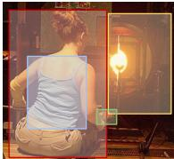  
A lady wearing a navy blue stripe tank top is getting ready to burn glass in front of an incinerator.  
Figure 1: Even when the term “incinerator” (highlighted yellow) is new to human learners, they can still locate the most likely referent (indicated by the yellow bounding box) in the perceived world by grounding.

Recently, there has been a substantial effort on pre-training vision-language models (VLMs) (Du et al., 2022a). Despite the exciting performance of these models on a variety of downstream vision and language tasks, it remains unclear whether these models can truly understand or produce language with their grounded meanings in the perceived world, and how grounding may further bootstrap new word learning. These questions are of interest from both a scientific and an engineering point of view. From a scientific perspective, grounding is crucial to language learners, as children attend to intended objects in the environment when producing (Tanenhaus et al., 1995; Meyer et al., 1998) and comprehending (Smith et al., 2007) utterances. From an engineering perspective, even with the availability of grounded vision language datasets (image-text pairs with fine-grained wordobject mappings) (Plummer et al., 2015), the costly grounding annotation can hardly cover the whole vocabulary space during the training time. Building upon the pre-trained models, it’s important for the agent to have the ability to learn grounded new words in a few shots of raw image-text pairs without word-object mappings.

To this end, we introduce Grounded Open Vocabulary Acquisition (GOVA), a scalable formulation to examine grounding and bootstrapping in openworld language learning. In this formulation, language learning is a combination of learning to predict a word in a linguistic context as well as learning to ground the word in the physical world. Under this formulation, we explore the framework in which the model first acquires the grounding ability during pre-training, and then transfers this ability to learn unseen words without grounding supervision. As an initial step, we developed World-to-Words (W2W), a novel visually grounded language model motivated by recent advances in detection transformers (DETR) (Carion et al., 2020; Kamath et al., 2021). Compared to many existing VLMs, W2W performs language modeling upon explicit object representations. The model first acquires the ability to ground during pre-training, and then transfers this intrinsic ability to learn unseen words when grounded supervision is no longer available.

Our empirical results show that learning to map words to their referents plays a significant role in grounded word acquisition. By pre-training with fine-grained word-object mappings, W2W demonstrates stronger performance in learning grounded meanings of words, both seen and unseen, yet with orders of magnitude fewer data compared to other competitive VLM baselines. The pre-trained model can further provide a foundation for efficient learning of new grounded words with a few examples. We further present an in-depth analysis to understand potential predictors of W2W in word learning, which demonstrates intriguing behaviors in comparison to human language learning. Our findings will provide a stepping stone for future work on grounded language learning in an open world.

## 2 Grounded Open Vocabulary Acquisition (GOVA)

We start by introducing the settings of grounded word acquisition and few-shot learning of new words tasks, which are two key components of the Grounded Open Vocabulary Acquisition (GOVA) task formulation. We further present a unified evaluation protocol and introduce the dataset we curated for this problem.

## 2.1 Grounded Word Acquisition

Many vision-language tasks have been developed in the past, e.g., visual question answering, visual commonsense reasoning, etc. However, these tasks are mainly focused on the end task performance without scrutinizing whether words are grounded to their corresponding visual entities. We

Two boats of people, a smaller yellow <mask> with two people and a larger white boat with six people.

Two boats of people, a smaller yellow boat with two people and a larger white boat with six people.

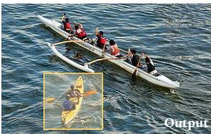  
Figure 2: An instance of the word grounding task. Models are tasked to predict the missing word boat and localize the corresponding smaller yellow boat in the image coherently.

consider a formulation that directly examines if vision-language models have the ability to acquire grounded meanings of words, specifically, through both language modeling and object localization. Figure 2 shows an instance of the word acquisition task. A model is presented with an image $x _ { \mathrm { i m g } } \in \mathcal { I }$ and an incomplete caption $x _ { \mathrm { { c a p } } } \in \tau$ with one of its groundable words w (e.g., nouns and adjectives) replaced by a MASK. The model is tasked to predict this missing word $w \in \mathcal V$ based on all available context and localize the corresponding objects $O _ { w } = \{ o _ { 1 } , o _ { 2 } , \cdots , o _ { n } \}$ in the image by proposing the bounding boxes of them. Overall, a model capable of solving the grounded word acquisition task is a function $f : \mathcal { T } \times \mathcal { T }  \mathcal { V } \times \mathbb { R } ^ { 4 n }$

The language modeling part takes the form of a cloze test, which predicts an open vocabulary word and is widely adopted to evaluate pre-trained language models (Paperno et al., 2016; Petroni et al., 2019; Jin et al., 2020). However, language modeling alone fails to provide a comprehensive evaluation of language grounding. For example in Figure 2, a model may correctly produce the word “boat,” but mistakenly attributes the evidence to the larger white boat in the image. To address this limitation, we require models to localize the corresponding object in the image. This design is motivated by the disentanglement of object detection into object localization and class recognition (Singh et al., 2018; Zareian et al., 2021; Zhong et al., 2022). It enables vision models to develop a sense of objectness without relying on a predefined set of object classes, thereby potentially allowing them to generalize to unseen objects. Further comparison with related task setups is discussed in Section 5 and illustrated in Figure 8 in the Appendix.

## 2.2 Evaluation Metric

In language model evaluation, the commonly used measures for assessing performance are the standard hit-rate-at-k (HR@k) measure and perplexity (Salazar et al., 2020; Jin et al., 2020). In masked language modeling, the log perplexity of a word w is defined as the log pseudo-perplexity:

$$
\begin{array} { r } { \log \mathrm { P P L } ( w ) = - \log P ( w | x _ { \mathrm { i m g } } , x _ { \mathrm { c a p } } ) } \end{array}\tag{1}
$$

In object detection evaluation, especially for phrase grounding where multiple referents are possible (Kamath et al., 2021), Any-Protocol and All-Protocol are commonly adopted. ${ \bf A } { \bf s } -$ suming n ground truth bounding boxes $B \_ =$ $\{ b _ { 1 } , b _ { 2 } , \cdots , b _ { n } \}$ and m predicted bounding boxes $\widetilde { B } = \{ \widetilde { b _ { 1 } } , \widetilde { b _ { 2 } } , \cdot \cdot \cdot , \widetilde { b _ { m } } \}$ , the intersection-over-union e e e f(IoU) in both protocols is defined as:

$$
\mathrm { I o U a n y } = \frac { 1 } { n } \sum _ { i \in \{ 1 , 2 , \cdots , n \} } \operatorname* { m a x } _ { j \in \{ 1 , 2 , \cdots , m \} } \mathrm { I o U } ( b _ { i } , \widetilde { b _ { j } } )\tag{2}
$$

$$
\mathrm { I o U _ { a l l } } = \mathrm { I o U } ( \cup B , \cup \tilde { B } )\tag{3}
$$

However, these metrics only capture unimodal performance without concerning the correctness of cross-modal mapping. We design two new metrics to combine language and vision performance:

• Grounded hit-rate (G-HR@k), the proportion of tests with the masked word appearing in the top-k candidates and a localization IoU over 0.5.

• Grounded perplexity (G-PPL) as follows:

$$
\begin{array} { r } { \log \mathrm { G } \mathrm { - P P L } ( w ) = \left\{ \begin{array} { l l } { \infty } & { \mathrm { i f ~ I o U = 0 ~ } } \\ { \log \mathrm { P P L } ( w ) - \log \mathrm { I o U } } & { \mathrm { e l s e } } \end{array} \right. } \end{array}\tag{4}
$$

## 2.3 Few-Shot Learning of New Words

Although there are grounding datasets available, i.e., image-text pairs with word-object mapping annotation (Plummer et al., 2015), it is impractical to obtain such fine-grained annotation on a large scale and to cover the whole vocabulary space . We therefore explore grounded new word learning as a few-shot learning problem, especially under the setting of incremental class learning (Mandziuk and Shastri, 1999; Kemker et al., 2018). An intuitive illustration of the few-shot new word learning framework is provided in Figure 3. Under this framework, a computational model is developed in two stages. During the pre-training stage, the model receives image-caption pairs, with finegrained word-object annotation for a set of base words $\begin{array} { r } { \mathcal { V } _ { \mathrm { s e e n } } \subseteq \mathcal { V } . } \end{array}$ . After pre-training, the model is provided with few samples of raw text-image pairs, each containing a set of unseen words $\mathcal { V } _ { \mathrm { u n s e e n } } \subseteq \mathcal { V }$ that the model has to acquire.

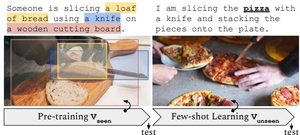  
Figure 3: An illustration of the few-shot new word learning paradigm. The model first pre-trains on a grounding dataset with a set of base words $( \nu _ { \mathrm { s e e n } } ) .$ , and then attempts to acquire a set of unseen words $( \mathcal { V } _ { \mathrm { u n s e e n } } )$ in a small number of raw text-image pairs. Tests are performed after each training session.

Tests are performed after each training stage. It’s important to note that the unseen words may not be completely new, e.g., the models may have encountered these words in its language encoder initialized with pre-trained language models. We consider them “unseen” because the model never sees these words paired with their referent, i.e., the grounded meanings of the words are unknown.

## 2.4 Dataset Curation

We build our dataset based on the Flickr30K Entities dataset (Plummer et al., 2015), which contains image-text pairs with dense annotations between groundable phrases and bounding boxes of objects. The groundable phrases and regions are defined by the dataset, as chunks of text that refer to object bounding boxes. To construct word grounding instances, we use Stanza (Qi et al., 2020) to parse the caption, enumerate every word in the groundable phrase, and identify those with a POS tag of NOUN or ADJ. These groundable words are replaced by MASK one at a time and matched to their corresponding bounding boxes.

The dataset is divided into 4 splits: pre-training set, unseen words training set, seen words test set, and unseen words test set. We start by selecting 31 unseen words and holding out all text-image pairs containing these words from the training split of Flickr30K Entities. The hold-out text-image pairs are further divided into the training and test sets for unseen words. The remaining training split of Flickr30K Entities is used for the pre-training set. To prevent frequent words (e.g., “man”) from dominating the test results of the seen words, we choose 60 seen words and sample an equal number of test instances for each word from the test split of Flickr30K Entities. More details and statistics of the dataset are available in Appendix A.

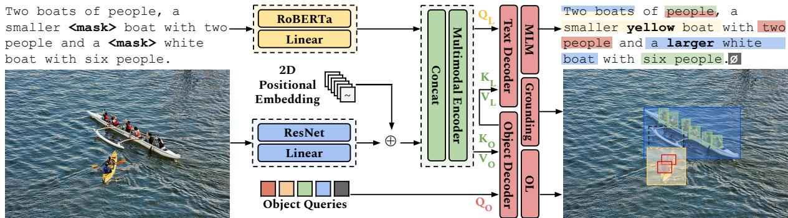  
Figure 4: An overview of the W2W architecture, a visually grounded language model pre-trained with three objectives: masked language modeling (MLM), object localization (OL), and grounding through word-region alignment (WRA).

## 3 Computational Models

## 3.1 The World-to-Words (W2W) Model

Humans demonstrate fast mapping, the ability to learn new words with only minimal information (Carey and Bartlett, 1978; Carey, 1978; Golinkoff et al., 2000). Motivated by how visual grounding helps humans in bootstrapping new words, we propose a computational framework that first acquires the ability to ground during pretraining, and then transfers this intrinsic ability to learn unseen words when grounded supervision is no longer available. We introduce World-to-Words (W2W), a novel visually-grounded language model with an end-to-end design as illustrated in Figure 4.

Model Architecture. Similarly to dual-stream vision-language models, W2W encodes the textual input with a pre-trained language model (Liu et al., 2019), and encodes image input with convolutional backbone (He et al., 2016) with 2D positional encoding added. The text and image representations are linearly projected onto a joint semantic space and concatenated. The multimodal representation is then forwarded into a cross-encoder with selfattention layers. The cross-encoded representations in the final layer are sent into an object decoder, together with a set of learnable object queries. The object decoder produces an object embedding for each input object query, which can be considered as a representation of the proposed object. The object representations are further forwarded to the text decoder, which allows language modeling to explicitly attend to the perceived objects. We discuss the pre-training objectives, especially how the model acquires grounding in the following paragraphs. Other details are available in Appendix B.

Masked Language Modeling (MLM). As an intrinsic task, we follow the majority of existing pretrained vision-language models to perform masked language modeling with a two-layer MLP. Words in input text are randomly masked out, and the model predicts the masked words conditioned on the corrupted sentence and image. Words in groundable phrases are masked with a probability of 0.4 and those in non-groundable regions are masked with a lower probability of 0.1.

Object Localization (OL). Each object representation will be decoded by a shared three-layer MLP to produce a bounding box. We follow prior detection transformers (DETR) (Carion et al., 2020; Kamath et al., 2021) to perform bipartite matching between proposed boxes and ground truth boxes with a Hungarian loss (Kuhn, 1955). The predicted boxes are optimized towards ground truth using the generalized intersection-over-union (GIoU) loss (Rezatofighi et al., 2019) and the L1 loss.

Grounding. The notion of Grounding is realized by grounded pre-training through word-region alignment (WRA) which enables fine-grained cross-modal mapping between words and objects. It consists of two levels of alignment: positional alignment and semantic alignment. In positional alignment, the model learns to map each object representation to words in the sentence, which could possibly be a MASK or an additional no-object label ∅ (Yu and Siskind, 2013; Kamath et al., 2021). We use a fully-connected layer to predict the distribution over token positions with cross-entropy loss. In semantic alignment, the model learns to bring word representations closer to the object representations that they ground to, and push the unrelated pairs farther. We use a contrastive loss over the final layers of the object and text decoders.

## 3.2 Baselines

Groundless Baseline. A baseline with no grounding ability is developed by pre-training W2W in the same condition but removing the grounding objectives in the loss function. We refer to this groundless model as $W 2 W _ { \mathrm { w / o G } }$ . Like a typical pretrained VLM, e.g., VisualBERT (Li et al., 2019), $W 2 W _ { \mathrm { w / o G } }$ performs language modeling based on the object features, without explicit cross-modal referential grounding. We apply $W 2 W _ { \mathrm { w / o G } }$ on GOVA task by fine-tuning the model on the pre-training dataset with grounding objective until convergence.

<table><tr><td rowspan="2">Models</td><td colspan="6"> $\mathrm { S e e n } \left( \vert \mathcal { V } _ { \mathrm { s e e n } } \vert = 6 0 \right)$ </td><td colspan="6"> $\mathrm { U n s e e n } \left( \left| \mathcal { V } _ { \mathrm { u n s e e n } } \right| = 3 1 \right)$ </td></tr><tr><td>G-HR@1 (↑)</td><td>log G-PPL (↓)</td><td>HR@1(↑)</td><td>log PPL (↓)</td><td>Acc (↑)</td><td>IoU (↑)</td><td>G-HR@1 (↑)</td><td>log G-PPL (↓)</td><td>HR@1(↑)</td><td>log PPL (↓)</td><td>Acc (↑)</td><td>IoU (↑)</td></tr><tr><td>RoBERTa</td><td></td><td></td><td>38.0</td><td>2.75</td><td></td><td></td><td></td><td></td><td>23.1</td><td>4.96</td><td></td><td></td></tr><tr><td>RoBERTa (FT)</td><td></td><td></td><td>47.9</td><td>1.99</td><td></td><td></td><td></td><td></td><td>24.3</td><td>4.38</td><td></td><td></td></tr><tr><td>ViLT</td><td></td><td></td><td>64.7</td><td>1.27</td><td></td><td></td><td></td><td></td><td>32.7</td><td>3.68</td><td></td><td></td></tr><tr><td>MDETR</td><td></td><td></td><td></td><td></td><td>27.8 / 27.0</td><td>25.3 / 28.0</td><td></td><td></td><td></td><td></td><td>26.3 / 20.2</td><td>23.9 / 21.7</td></tr><tr><td>ViLT+MDETR</td><td>19.8 / 19.3</td><td>2.53 / 2.43</td><td>64.7</td><td>1.27</td><td>31.1 / 30.4</td><td>28.5 / 31.2</td><td>8.6 / 8.1</td><td>5.07 / 5.12</td><td>32.7</td><td>3.68</td><td>27.3 / 23.3</td><td>25.0 / 23.8</td></tr><tr><td>VisualBERT (FT)</td><td>28.5 / -</td><td>2.96 / -</td><td>42.3</td><td>2.33</td><td>68.1 / -</td><td>53.3 / -</td><td>10.2/ -</td><td>5.60 /-</td><td>20.7</td><td>4.81</td><td>50.6/ -</td><td>45.2 /-</td></tr><tr><td> $w 2 W _ { \mathrm { w / o G } } \ ( \mathrm { F T } )$ </td><td>28.9 / 27.8</td><td>2.33 / 2.38</td><td>63.9</td><td>1.41</td><td>44.0 / 43.0</td><td>40.0/ 38.2</td><td>1.1/1.1</td><td>11.89 / 12.04</td><td>3.7</td><td>10.87</td><td>38.7 / 31.9</td><td>36.2 /31.0</td></tr><tr><td>W2W</td><td>47.0 / 46.3</td><td>1.79 / 1.81</td><td>66.9</td><td>1.26</td><td>66.8 / 66.3</td><td>58.8 / 57.6</td><td>2.3 / 2.3</td><td>11.58 / 11.74</td><td>4.2</td><td>11.01</td><td>61.3 / 53.1</td><td>56.3 / 48.0</td></tr></table>

Table 1: Test results on the seen and unseen words, obtained immediately after pre-training. Unless noted explicitly as fine-tuned (FT), all results reflect the performance of models without fine-tuning. Evaluations under both All and Any-protocols are provided in the table as (All/Any) pairs. For models depending on a frozen pre-trained object detector, we can only provide evaluation under All-Protocol. We note that the unseen words are only unseen to W2W models, as pre-trained baselines have encountered them all during development. We report the results for reference.

Pre-trained Baselines. For the majority of the pre-trained VLMs, the unseen words are known during pre-training. Also, the primary focus of this work is to understand grounding and bootstrapping in grounded word acquisition. It’s not our goal to scale up or re-train all variants of pretraining frameworks. Therefore, we compare our model to the pre-trained VLMs with equal or reasonably larger scales for only reference and analysis purposes. We choose representative baselines in phrase grounding, as presented in Table 1:

• “Detect-and-Recognize” Baseline: Models under this framework rely on a pre-trained frozen object detector, and then learn to predict words from proposed objects. We choose the fine-tuned VisualBERT (Li et al., 2019) for this type.

• “Produce-and-Localize” Baseline: Models under this framework rely on a pre-trained visionlanguage model to predict the missing word, and then perform referring expression comprehension and propose objects. We combine ViLT (Kim et al., 2021) and MDETR (Kamath et al., 2021) for their competitive performance in vision-conditioned language modeling and phrase grounding individually.

## 4 Empirical Findings

## 4.1 Grounded Pre-training

The results of this section are obtained from the test immediately following pre-training.

<table><tr><td>Models</td><td># Param</td><td># Imgs</td><td> $\# \operatorname { C a p s }$ </td><td>Objectives</td></tr><tr><td>RoBERTa</td><td>120M</td><td>=</td><td>=</td><td>MLM</td></tr><tr><td>VisualBERT</td><td>180M</td><td>200K</td><td>567K</td><td>MLM, ITM</td></tr><tr><td>ViLT</td><td>110M</td><td>4.0M</td><td>10M</td><td>WRA*, MLM, ITM</td></tr><tr><td>MDETR</td><td>200M</td><td>200K</td><td>1.3M</td><td>WRA, OL</td></tr><tr><td>W2W</td><td>200M</td><td>30K</td><td>150K</td><td>WRA, MLM, OL</td></tr><tr><td> $W 2 W _ { \mathrm { w / o G } }$ </td><td>200M</td><td>30K</td><td>150K</td><td>MLM, OL</td></tr></table>

\*WRA is formulated as word-patch alignment in ViLT, thus it cannot perform object localization without major modifications.  
Table 2: The baselines for comparisons and references. ITM stands for Image Text Matching, and all the other abbreviations follow Section 2.

Pre-training Results on Seen Words The main results for the pre-training stage are summarized in Table 1. Our direct observation is the strong performance of W2W in terms of both grounded metrics, Top-1 Grounded Hit-Rate (G-HR@1) and Grounded Perplexity (G-PPL). W2W significantly outperforms the groundless baseline $W 2 W _ { \mathrm { w / o G } }$ and pre-trained baselines, even for systems pre-trained with a significantly larger amount of data and computing, as shown in Table 2. While W2W produces correct predictions of the missing words as well as the locations of the corresponding bounding boxes, it turns out to be challenging for baselines to achieve them both. For “Detect-and-Recognize” baseline (VisualBERT), we observe a comparable object localization performance empowered by the frozen object detector. However, it suffers from a poor language modeling ability (as demonstrated by HR@1 and PPL, weaker than a finetuned RoBERTa). For the “Produce-and-Localize” baseline (ViLT+MDETR), we observe a strong language modeling performance due to the scale of ViLT. Yet, correct word grounding remains difficult, as can be seen from the poor localization performance. These results demonstrate that the GOVA task is challenging, and W2W is competitive in learning grounded word meanings during pre-training.

Bootstrapping through Grounded Objectives. We further provide a cross-time analysis to understand the role of grounded objectives in pre-training efficiency. The results of different training steps are provided in Table 3. From the table, we observe that W2W outperforms both of its groundless variants in language modeling, object localization, and jointly under the grounded perplexity. What’s even more striking is that W2W achieves better performance with 10 times less training data compared to the model trained without the grounding objective (i.e., the WRA objective). These results confirm the crucial role of explicit word-object alignment in efficient grounded word learning. This can be explained by that the grounded objectives attempt to align the vision and language semantic spaces, which ideally benefit both visually conditioned language modeling and language-conditioned object localization. Although it is possible to build a mapping between word and object representations through cross-modal probing and fine-tuning after pre-training, these methods are not comparable to systems with grounded objectives in terms of efficiency and performance.

<table><tr><td># Steps</td><td>Metrics</td><td>W2W</td><td> $W 2 W _ { \mathrm { w / o G } }$  (FT)</td></tr><tr><td>10k</td><td>IoU (↑) log PPL (↓) log G-PPL (↓)</td><td>46.7 / 46.2 1.46 2.22 / 2.23</td><td>36.9 / 35.3 1.53 2.52 / 2.57</td></tr><tr><td>50k</td><td>IoU (↑) log PPL (↓) log G-PPL (↓)</td><td>58.1 / 57.1 1.26 1.80 / 1.82</td><td>39.6 / 38.8 1.44 2.34 / 2.38</td></tr><tr><td>100k</td><td>IoU (↑) log PPL (↓) log G-PPL (↓)</td><td>58.7 / 57.6 1.26 1.79 / 1.81</td><td>40.0 / 38.2 1.41 2.34 / 2.38</td></tr></table>

Table 3: Comparison of W2W and its non-grounding version at different training steps. $W 2 W _ { \mathrm { w / o } } \mathrm { \Gamma } _ { \mathrm { G } }$ is evaluated using fine-tuning. Both Any and All-protocols are provided in the table as (All/Any) pairs.

Pre-training Results on Unseen Words: Word-Agnostic Grounding One important finding of the pre-trained model is the surprising performance in localizing the unseen words behind the MASKs. As shown in Table 1, W2W achieves a high Any-IoU of 56.3% and Any-localization accuracy of 61.3% for the unseen words, which are very close to its performance on the seen set and surpass baselines that have seen these words. Moreover, as anticipated, since these words are held out during pre-training, W2W fails to correctly unmask these unseen words, leading to a high log perplexity of 11.01 and low HR of 4.2, compared to that of 1.26 and 66.9 on the seen words. Figure 5 shows an example of such word-agnostic grounding.

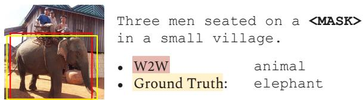  
Figure 5: Although the word “elephant” is unseen to W2W, the model is still able to localize the object in the image referred to by the MASK.

This performance disparity in language modeling and referent localization on unseen words suggests that W2W has developed a certain level of word-agnostic grounding, i.e., to locate the most likely referent of a word through both the linguistic context and the visual context, even if the word itself is never seen during pre-training. A similar situation is faced by human language learners when inferring the grounded meaning of a new word, as we described earlier in Figure 1. Our experiment demonstrates that, through grounded pre-training, it is possible for a vision-language system to acquire word-agnostic grounding ability, which opens up the opportunity to enable human-like fast mapping when learning new words.

## 4.2 Few-Shot New Words Acquisition

In this section, we task W2W to acquire unseen words from a few samples of raw image-text pairs, without any bounding boxes or word-object mappings annotation. As we have demonstrated the model’s word-agnostic grounding, we seek to explore if this ability can be transferred to facilitate learning unseen words when a large amount of data and grounded supervision are no longer available. Specifically, we perform few-shot learning on the pre-trained W2W with only masked language modeling (MLM) as the learning objective. More hyperparameter details are available in Appendix B.2.

Learning New Words through Incremental Learning. We first explore the multi-class incremental learning setting, in which the pre-trained model is tasked to acquire the 31 unseen words from a few-shot learning session. The experiment is repeated with sample sizes of 8, 16, 24, and 32 immediately after pre-training. As shown in Figure 6, even with as few as 8 samples per word, W2W can significantly bring down the grounded perplexity of unseen words, while mostly maintaining the grounded perplexity of the seen words without catastrophic forgetting. Compared to W2W without the grounding objective, the full W2W demonstrates better acquisition performance for unseen words.

It’s important to note that these few shot examples are text/image pairs without explicit grounding annotation. Our W2W is able to quickly acquire grounded meanings of the new words (e.g., only with 8 examples) with a performance close to that of seen words.

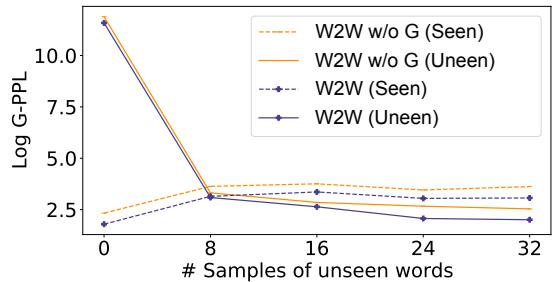  
Figure 6: The log G-PPL (All-Protocol) of seen and unseen words in multi-class incremental learning, each unseen word with a sample size ranging from 8 to 32.

We further perform a word-specific controlled study with a one-class incremental learning setting. We present results on two unseen words (pizza and circular) in Table 4. The complete results are available in Appendix D.

<table><tr><td rowspan="2"># Samples</td><td colspan="2">log G-PPL (pizza)</td><td colspan="2">log G-PPL (circular)</td></tr><tr><td>W2W</td><td> $W 2 W _ { \mathrm { w / o ~ G } }$ </td><td>W2W</td><td> $W 2 W _ { \mathrm { w / o ~ G } }$ </td></tr><tr><td>0</td><td>10.70</td><td>9.59</td><td>15.21</td><td>15.12</td></tr><tr><td>8</td><td>1.47</td><td>2.21</td><td>1.59</td><td>2.25</td></tr><tr><td>16</td><td>1.07</td><td>2.54</td><td>1.07</td><td>2.25</td></tr><tr><td>24</td><td>1.19</td><td>1.25</td><td>1.55</td><td>1.81</td></tr><tr><td>32</td><td>0.90</td><td>1.18</td><td>1.23</td><td>1.61</td></tr></table>

Table 4: The log G-PPL (All-Protocol) of unseen words in one-class incremental learning, each unseen word with a sample size ranging from 8 to 32.

## 4.3 Predictors of Model Behaviors

There has been an interest to identify predictors that can explain/anticipate the performance or behavior of pre-trained language models (Chang and Bergen, 2022). This exploration not only offers valuable insights for future model development, but also serves as a cognitive inquiry to evaluate the extent to which language models align with human language acquisition patterns. In this section, we present the first work of this nature on visionlanguage models. Specifically, we note that the W2W model relies on a RoBERTa encoder, which might have already been equipped with prior linguistic knowledge. To assess the cognitive alignment of vision-language models to human language acquisition, we additionally pre-trained the W2W and $W 2 W _ { \mathrm { w / o ~ G } }$ models with a randomly initialized RoBERTa encoder.

To comprehensively capture various aspects of words, we carefully select eight distinct predictors that encompass intrinsic psycho-linguistic characteristics, distribution patterns within the training corpus, and visual representations within the training images. We select 3 psycho-linguistic predictors, each collected and normalized from the MRC Database (Coltheart, 1981):

• Familiarity, the degree of familiarity or exposure people have to words;

• Concreteness, the degree to which words have a perceptible physical referent or are associated with tangible objects or experiences;

• Imageability, the degree to which words elicit people’s mental imagery.

Another 3 linguistic predictors are considered:

• Unigram perplexity;

• RoBERTa perplexity, where RoBERTa is finetuned on the captions to serve as the upper bound of unimodal language model performance;

• # Co-occur phrases, the average number of co-occurring groundable phrases in a caption.

We finally choose 2 perceptual predictors:

• # Co-occur objects, the average number of co-occurring objects in an image;

• Bbox size, the average proportion of an image occupied by the bounding boxes of the referents.

To assess the statistical significance of each predictor, we performed linear regressions with likelihood ratio tests on different variants of models. Similar to Chang and Bergen (2022), we compare the overall regression including the target predictor to a regression that included all predictors except the target. We additionally present the beta weights (with signs) to capture the magnitude and direction of the correlation. Figure 7 displays heatmaps indicating the statistical significance (in terms of negative logarithmic p-values) of each predictor concerning Log G-PPL, Log PPL, and Any IoU. Insignificant tests are omitted from the figure.

Correlation with Linguistic and Perceptual Predictors. Our findings revealed a positive correlation between the unigram and RoBERTa log perplexity and the models’ log perplexity, both for grounded and ungrounded scenarios. This indicates that vision-language models still heavily rely on distributional statistics, similar to unimodal models. While the ungrounded perplexity showed little correlation with perceptual predictors, the Any

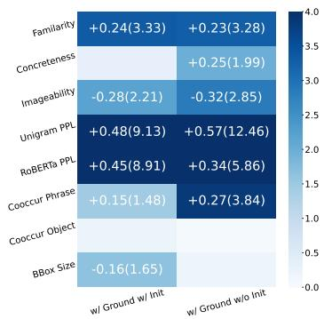  
(a) Predictors for Log G-PPL.

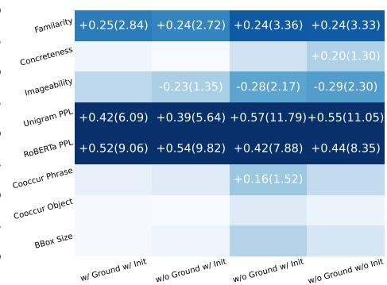  
(b) Predictors for Log PPL.

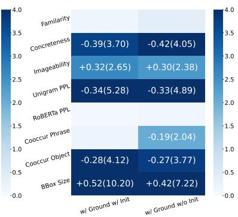  
(c) Predictors for Any IoU.  
Figure 7: Heatmaps for statistical significance for each predictor towards the Log G-PPL, Log PPL, and Any IoU. The beta weights and their signs are presented outside of the parentheses, and the negative log p-values are presented in the parentheses. Insignificant tests with $p > 0 . 0 5 , i . e . , - \log ( p ) < 1 . 3 0$ , are discarded.

IoU demonstrated a significant correlation with the number of co-occurring objects and average sizes of bounding boxes. This suggests concepts that are visually salient and less perceptually ambiguous are easier to localize and acquire, consistent with human learners (Smith and Yu, 2008).

## Correlation with Psycho-linguistic Predictors.

Counter-intuitively, there was a positive alignment between the human perceived familiarity of words and the machine’s perplexities, i.e., the more familiar humans are with a word, the more perplexed models get. This contrasts with the ideal cognitive plausibility of language acquisition in humans. This discrepancy implies that current visionlanguage models may not fully achieve cognitive plausibility, which might be explained by the fact that many concepts (e.g., wild animals, musical instruments) appear abundantly in internet images but not in daily lives. In terms of imageability, it aligned well with human intuition, exhibiting a positive correlation with Any IoU and a nega tive correlation with perplexities. However, the concreteness predictor surprisingly exhibited the opposite correlation. This discrepancy could be attributed to the nuanced distinction between imageability and concreteness. For instance, while “hat” is concrete because it refers to a tangible object, it also possesses visual diversity due to its generality (e.g., many types of hats which look very differently), making it challenging to acquire. Conversely, “blue” is more imageable as it easily evokes a color, relatively stable, despite not referring to a specific tangible object. To learn the meaning of “hat,” a human language learner may benefit from physically interacting with the object, and understand that the hat is an item to cover for the head, regardless of its visual appearance. To address this gap, a potential future direction could involve developing language learning agents that acquire words through physical interactions rather than passive perception, allowing for a more comprehensive understanding of word meanings.

## 5 Related Work

Vision-Language Mapping Mapping plays a central role in classic lexicon acquisition problem (Gleitman and Landau, 1994; Clark, 1995). Primarily, researchers focused on grounding words to their meaning symbols, building learning mechanisms using specific mental biases to simulate children’s word acquisition, and giving computational accounts for psycholinguistic phenomena (Siskind, 1996; Regier, 2005; Goodman et al., 2007; Fazly et al., 2010). Early efforts along this line incorporate visual grounding either by learning a statistical or neural mapping from object categories (Roy and Pentland, 2002; Yu, 2005; Xu and Tenenbaum, 2007; Yu and Ballard, 2007; Yu and Siskind, 2013) and more complicated visual features (Qu and Chai, 2010; Mao et al., 2019, 2021; Pratt et al., 2020) to linguistic labels. These studies are usually in a closed world with limited vocabulary (Krahmer and van Deemter, 2019), and words are usually isolated from the natural context of use. More recently, multi-modal understanding tasks, e.g., object retrieval (Guadarrama et al., 2014; Hu et al., 2016), referring expression comprehension and grounding (Liu et al., 2014; Yu et al., 2016; Mao et al., 2016; Wu et al., 2020), and phrase grounding (Plummer et al., 2015) map referring expressions to corresponding objects. Our setup is closely related to this line as we position grounding as an explicit word-referent mapping problem. The difference is that, our work goes beyond grounding to study open-vocabulary acquisition through fast mapping, a more complicated but realistic challenge faced by AI agents.

Vision-Language Pre-training Distributional word representations can be acquired through language modeling, and developing language models from visual data has been extensively studied by the community (Chrupała et al., 2015; Lazaridou et al., 2015; Li et al., 2017; Surıs et al., 2020). Recent years have seen increasing research to enrich language representations with visually-augmented language modeling (Tan and Bansal, 2020; Lu et al., 2022; Wang et al., 2022) and to learn multimodal representations with vision-language pre-training (VLP) (Du et al., 2022a). We are particularly interested in VLP models with fine-grained grounding objectives, e.g., Word-Region Alignment (WRA). These models either pre-train with weakly supervised alignment algorithms like optimal transport that matches words with patches (Kim et al., 2021) or proposals from a frozen detector (Chen et al., 2020; Su et al., 2020), or perform explicit word grounding by pre-training a language-conditioned detector (Kamath et al., 2021; Li et al., 2022; Zhong et al., 2022; Dou et al., 2022). Our model falls along this line, which jointly performs language modeling, object localization, and grounding during pre-training, rather than relying upon a preexisting object detector.

Vision-Language Tasks To evaluate visionlanguage systems, many downstream tasks have been formulated. Some related formulations are summarized in Table 5 in Appendix. While demonstrating some vision-language capabilities, these down-stream tasks provide limited insights into whether these models truly capture the grounded meaning of words with respect to the external environment. Our task design specifically targets the machine’s ability to predict words and ground words to perception. More akin to our formulation is the vision-based language modeling task (Jin et al., 2020) in a continual learning setting. Our work differs mainly in two aspects. First, the task proposed by Jin et al. (2020) only predicts masked tokens based on the visual context, which leaves the referential uncertainty (i.e., grounding) unattended (e.g., in Figure 2, correct prediction of the word “boat” does not guarantee correct grounding). Also, this work primarily focuses on compositionality, while we seek to address few-shot grounded word learning when unseen words are encountered

after pre-training.

Open-Vocabulary Object Detection Early works formulate fast mapping of new words as a zero-shot object classification problem, which aims to generalize from known object labels to unknown ones (Socher et al., 2013; Frome et al., 2013; Elhoseiny et al., 2013; Lazaridou et al., 2014). The setting later extends to a localization task, referred to as zero-shot object detection (ZSD) (Bansal et al., 2018; Zhu et al., 2019, 2020; Rahman et al., 2020). More recently, open-vocabulary object detection (OVD) (Zareian et al., 2021; Gu et al., 2022; Du et al., 2022b; Minderer et al., 2022) combines ZSD with weakly supervised object detection (WSD) to address the unrealistic constrain of traditional zero-shot settings. OVD assumes the availability of coarse-grained image-caption pairs, and attempts to generalize from limited fine-grained annotation of object categories to unseen ones. Nevertheless, this line of work positions words as object categories and isolates them from their linguistic context (e.g., sentences). Our setup instead challenges models to perform language modeling in human-generated captions.

## 6 Conclusion and Future Work

The connection between language and their referents captures the grounded meaning of words, and an explicit treatment is key to empowering efficient open-world language learning abilities in humans and AI agents. This work introduces Grounded Open Vocabulary Acquisition (GOVA), a scalable formulation to examine grounding and fast mapping in open-world grounded language learning. We propose World-to-Words (W2W), a novel visually grounded language model to investigate a paradigm where the model initially acquires grounding ability during pre-training and subsequently applies this ability to quickly learn new words without explicit grounding supervision. Our empirical findings highlight the significance of visual grounding in neural word acquisition. Especially, we find that pre-trained W2W can serve as a foundation for fast mapping of novel grounded words via fewshot learning. We also conduct a comprehensive analysis to explore potential predictors influencing the performance of vision-language models, revealing both consistent and surprising behaviors with respect to human language learning patterns. These insights pave the way for future research in grounded language learning in the open world.

## Limitations

In this work, we limit ourselves to object-centric grounding, which ignored that language can ground events, attributes, manners, mental states, etc. The grounded meaning of some groundable words, especially ADVs, NUMs, VERBs, and PRONs, cannot be fully captured by the bounding boxes alone. Future work should explore better task formulations to study the acquisition of their grounded meanings. An exciting future work along this line is to extend the setting from images to videos and physical interactions with the environment, and to incorporate the rich temporal dynamics of the world for language acquisition. In addition, we ignored the social aspects of language learning, where children infer the referents of words from their caregivers through communication (Carpenter et al., 1998; Bloom, 2000). Future work could also investigate grounded word acquisition from natural dialogue.

## Ethics Statement

This project does not involve any research artifacts generated through human subject studies. Despite the considerable promise of W2W, it is crucial to examine its ethical and societal implications. The computational model relies on pre-trained language models and extensive text-image datasets, which could contain hidden biases that may result in fairness problems within the algorithms. By recognizing and actively addressing these implications, we aim to increase awareness among practitioners if the model is deployed as a language-learning agent in the future.

## Acknowledgments

This work was supported in part by NSF IIS-1949634, NSF SES-2128623, and by the Automotive Research Center (ARC) at the University of Michigan. The authors would like to thank the anonymous reviewers for their valuable feedback.

## References

Ankan Bansal, Karan Sikka, Gaurav Sharma, Rama Chellappa, and Ajay Divakaran. 2018. Zero-shot object detection. In Proceedings of the European Conference on Computer Vision (ECCV), pages 384– 400.

Yonatan Bisk, Ari Holtzman, Jesse Thomason, Jacob Andreas, Yoshua Bengio, Joyce Chai, Mirella Lapata, Angeliki Lazaridou, Jonathan May, Aleksandr Nisnevich, Nicolas Pinto, and Joseph Turian. 2020.

Experience grounds language. In Proceedings ofthe 2020 Conference on Empirical Methods in Natural Language Processing (EMNLP), pages 8718–8735, Online. Association for Computational Linguistics.

Paul Bloom. 2000. How children learn the meanings of words. MIT press.

Susan Carey. 1978. The child as word learner. Linguistic theory and psychological reality.

Susan Carey and Elsa Bartlett. 1978. Acquiring a single new word. Papers and Reports on Child Language Development, 15:17–29.

Nicolas Carion, Francisco Massa, Gabriel Synnaeve, Nicolas Usunier, Alexander Kirillov, and Sergey Zagoruyko. 2020. End-to-end object detection with transformers. In European conference on computer vision, pages 213–229. Springer.

Malinda Carpenter, Katherine Nagell, Michael Tomasello, George Butterworth, and Chris Moore. 1998. Social cognition, joint attention, and communicative competence from 9 to 15 months of age. Monographs ofthe societyfor research in child development, pages i–174.

Santiago Castro, Ruoyao Wang, Pingxuan Huang, Ian Stewart, Oana Ignat, Nan Liu, Jonathan Stroud, and Rada Mihalcea. 2022. Fiber: Fill-in-the-blanks as a challenging video understanding evaluation framework. In Proceedings ofthe 60th Annual Meeting of the Associationfor Computational Linguistics (Volume 1: Long Papers), pages 2925–2940.

Tyler A Chang and Benjamin K Bergen. 2022. Word acquisition in neural language models. Transactions of the Association for Computational Linguistics, 10:1– 16.

Yen-Chun Chen, Linjie Li, Licheng Yu, Ahmed El Kholy, Faisal Ahmed, Zhe Gan, Yu Cheng, and Jingjing Liu. 2020. Uniter: Universal image-text representation learning. In ECCV.

Grzegorz Chrupała, Ákos Kádár, and Afra Alishahi. 2015. Learning language through pictures. In Proceedings of the 53rd Annual Meeting of the Association for Computational Linguistics and the 7th International Joint Conference on Natural Language Processing (Volume 2: Short Papers), pages 112– 118, Beijing, China. Association for Computational Linguistics.

Eve V Clark. 1995. The lexicon in acquisition. 65. Cambridge University Press.

Max Coltheart. 1981. The mrc psycholinguistic database. The Quarterly Journal of Experimental Psychology Section A, 33(4):497–505.

Zi-Yi Dou, Aishwarya Kamath, Zhe Gan, Pengchuan Zhang, Jianfeng Wang, Linjie Li, Zicheng Liu, Ce Liu, Yann LeCun, Nanyun Peng, et al. 2022. Coarse-to-fine vision-language pre-training

with fusion in the backbone. arXiv preprint arXiv:2206.07643.

Yifan Du, Zikang Liu, Junyi Li, and Wayne Xin Zhao. 2022a. A survey of vision-language pre-trained models. In Proceedings ofthe Thirty-First International Joint Conference on Artificial Intelligence, IJCAI-22, pages 5436–5443. International Joint Conferences on Artificial Intelligence Organization. Survey Track.

Yu Du, Fangyun Wei, Zihe Zhang, Miaojing Shi, Yue Gao, and Guoqi Li. 2022b. Learning to prompt for open-vocabulary object detection with visionlanguage model. In Proceedings of the IEEE/CVF Conference on Computer Vision and Pattern Recognition, pages 14084–14093.

Mohamed Elhoseiny, Babak Saleh, and Ahmed Elgammal. 2013. Write a classifier: Zero-shot learning using purely textual descriptions. In Proceedings ofthe IEEE International Conference on Computer Vision, pages 2584–2591.

Afsaneh Fazly, Afra Alishahi, and Suzanne Stevenson. 2010. A probabilistic computational model of cross-situational word learning. Cognitive Science, 34(6):1017–1063.

Andrea Frome, Greg S Corrado, Jon Shlens, Samy Bengio, Jeff Dean, Marc’Aurelio Ranzato, and Tomas Mikolov. 2013. Devise: A deep visual-semantic embedding model. Advances in neural information processing systems, 26.

Lila R Gleitman and Barbara Landau. 1994. The acquisition of the lexicon. mit Press.

Roberta Michnick Golinkoff, Kathryn Hirsh-Pasek, Lois Bloom, Linda B Smith, Amanda L Woodward, Nameera Akhtar, Michael Tomasello, and George Hollich. 2000. Becoming a word learner: A debate on lexical acquisition. Oxford University Press.

Noah Goodman, Joshua Tenenbaum, and Michael Black. 2007. A bayesian framework for cross-situational word-learning. Advances in neural information processing systems, 20.

Xiuye Gu, Tsung-Yi Lin, Weicheng Kuo, and Yin Cui. 2022. Open-vocabulary object detection via vision and language knowledge distillation. In International Conference on Learning Representations.

Sergio Guadarrama, Erik Rodner, Kate Saenko, Ning Zhang, Ryan Farrell, Jeff Donahue, and Trevor Darrell. 2014. Open-vocabulary object retrieval. In Robotics: science and systems, volume 2, page 6.

Agrim Gupta, Piotr Dollar, and Ross Girshick. 2019. LVIS: A dataset for large vocabulary instance segmentation. In Proceedings of the IEEE Conference on Computer Vision and Pattern Recognition.

Stevan Harnad. 1990. The symbol grounding problem. Physica D: Nonlinear Phenomena, 42(1-3):335–346.

Kaiming He, Xiangyu Zhang, Shaoqing Ren, and Jian Sun. 2016. Deep residual learning for image recognition. In Proceedings of the IEEE conference on computer vision and pattern recognition, pages 770– 778.

Ronghang Hu, Huazhe Xu, Marcus Rohrbach, Jiashi Feng, Kate Saenko, and Trevor Darrell. 2016. Natural language object retrieval. In Proceedings of the IEEE conference on computer vision and pattern recognition, pages 4555–4564.

Xisen Jin, Junyi Du, Arka Sadhu, Ram Nevatia, and Xiang Ren. 2020. Visually grounded continual learning of compositional phrases. In Proceedings of the 2020 Conference on Empirical Methods in Natural Language Processing (EMNLP), pages 2018–2029, Online. Association for Computational Linguistics.

Aishwarya Kamath, Mannat Singh, Yann LeCun, Gabriel Synnaeve, Ishan Misra, and Nicolas Carion. 2021. Mdetr-modulated detection for end-to-end multi-modal understanding. In Proceedings of the IEEE/CVF International Conference on Computer Vision, pages 1780–1790.

Sahar Kazemzadeh, Vicente Ordonez, Mark Matten, and Tamara Berg. 2014. ReferItGame: Referring to objects in photographs of natural scenes. In Proceedings of the 2014 Conference on Empirical Methods in Natural Language Processing (EMNLP), pages 787– 798, Doha, Qatar. Association for Computational Linguistics.

Ronald Kemker, Marc McClure, Angelina Abitino, Tyler Hayes, and Christopher Kanan. 2018. Measuring catastrophic forgetting in neural networks. In Proceedings of the AAAI Conference on Artificial Intelligence, volume 32.

Wonjae Kim, Bokyung Son, and Ildoo Kim. 2021. Vilt: Vision-and-language transformer without convolution or region supervision. In International Conference on Machine Learning, pages 5583–5594. PMLR.

Emiel Krahmer and Kees van Deemter. 2019. Computational generation of referring expressions: An updated survey.

Harold W Kuhn. 1955. The hungarian method for the assignment problem. Naval research logistics quarterly, 2(1-2):83–97.

Angeliki Lazaridou, Elia Bruni, and Marco Baroni. 2014. Is this a wampimuk? cross-modal mapping between distributional semantics and the visual world. In Proceedings of the 52nd Annual Meeting of the Associationfor Computational Linguistics (Volume 1: Long Papers), pages 1403–1414.

Angeliki Lazaridou, Nghia The Pham, and Marco Baroni. 2015. Combining language and vision with a multimodal skip-gram model. In Proceedings of the 2015 Conference of the North American Chapter of

the Associationfor Computational Linguistics: Human Language Technologies, pages 153–163, Denver, Colorado. Association for Computational Linguistics.

Ang Li, Allan Jabri, Armand Joulin, and Laurens Van Der Maaten. 2017. Learning visual n-grams from web data. In Proceedings ofthe IEEE International Conference on Computer Vision, pages 4183–4192.

Liunian Harold Li, Mark Yatskar, Da Yin, Cho-Jui Hsieh, and Kai-Wei Chang. 2019. Visualbert: A simple and performant baseline for vision and language. arXiv preprint arXiv:1908.03557.

Liunian Harold Li, Pengchuan Zhang, Haotian Zhang, Jianwei Yang, Chunyuan Li, Yiwu Zhong, Lijuan Wang, Lu Yuan, Lei Zhang, Jenq-Neng Hwang, et al. 2022. Grounded language-image pre-training. In Proceedings ofthe IEEE/CVF Conference on Computer Vision and Pattern Recognition, pages 10965– 10975.

Changsong Liu, Lanbo She, Rui Fang, and Joyce Y. Chai. 2014. Probabilistic labeling for efficient referential grounding based on collaborative discourse. In Proceedings of the 52nd Annual Meeting of the Associationfor Computational Linguistics (Volume 2: Short Papers), pages 13–18, Baltimore, Maryland. Association for Computational Linguistics.

Yinhan Liu, Myle Ott, Naman Goyal, Jingfei Du, Mandar Joshi, Danqi Chen, Omer Levy, Mike Lewis, Luke Zettlemoyer, and Veselin Stoyanov. 2019. Roberta: A robustly optimized bert pretraining approach. arXiv preprint arXiv:1907.11692.

Yujie Lu, Wanrong Zhu, Xin Wang, Miguel Eckstein, and William Yang Wang. 2022. Imaginationaugmented natural language understanding. In Proceedings of the 2022 Conference of the North American Chapter ofthe Associationfor Computational Linguistics: Human Language Technologies, pages 4392–4402, Seattle, United States. Association for Computational Linguistics.

Jacek Mandziuk and Lokendra Shastri. 1999. Incremental class learning-an approach to longlife and scalable learning. In IJCNN’99. International Joint Conference on Neural Networks. Proceedings (Cat. No. 99CH36339), volume 2, pages 1319–1324. IEEE.

Jiayuan Mao, Chuang Gan, Pushmeet Kohli, Joshua B. Tenenbaum, and Jiajun Wu. 2019. The neurosymbolic concept learner: Interpreting scenes, words, sentences from natural supervision. International Conference on Learning Representations (ICLR).

Jiayuan Mao, Freda H. Shi, Jiajun Wu, Roger P. Levy, and Joshua B. Tenenbaum. 2021. Grammar-based grounded lexicon learning. In Advances in Neural Information Processing Systems.

Junhua Mao, Jonathan Huang, Alexander Toshev, Oana Camburu, Alan L Yuille, and Kevin Murphy. 2016.

Generation and comprehension of unambiguous object descriptions. In Proceedings of the IEEE conference on computer vision and pattern recognition, pages 11–20.

Stephen Merity, Caiming Xiong, James Bradbury, and Richard Socher. 2017. Pointer sentinel mixture models. In International Conference on Learning Representations.

Antje S Meyer, Astrid M Sleiderink, and Willem JM Levelt. 1998. Viewing and naming objects: Eye movements during noun phrase production. Cognition, 66(2):B25–B33.

Matthias Minderer, Alexey Gritsenko, Austin Stone, Maxim Neumann, Dirk Weissenborn, Alexey Dosovitskiy, Aravindh Mahendran, Anurag Arnab, Mostafa Dehghani, Zhuoran Shen, et al. 2022. Simple open-vocabulary object detection with vision transformers. In European Conference on Computer Vision.

Denis Paperno, Germán Kruszewski, Angeliki Lazaridou, Ngoc Quan Pham, Raffaella Bernardi, Sandro Pezzelle, Marco Baroni, Gemma Boleda, and Raquel Fernández. 2016. The LAMBADA dataset: Word prediction requiring a broad discourse context. In Proceedings of the 54th Annual Meeting of the Associationfor Computational Linguistics (Volume 1: Long Papers), pages 1525–1534, Berlin, Germany. Association for Computational Linguistics.

Fabio Petroni, Tim Rocktäschel, Sebastian Riedel, Patrick Lewis, Anton Bakhtin, Yuxiang Wu, and Alexander Miller. 2019. Language models as knowledge bases? In Proceedings of the 2019 Conference on Empirical Methods in Natural Language Processing and the 9th International Joint Conference on Natural Language Processing (EMNLP-IJCNLP), pages 2463–2473, Hong Kong, China. Association for Computational Linguistics.

Bryan A Plummer, Liwei Wang, Chris M Cervantes, Juan C Caicedo, Julia Hockenmaier, and Svetlana Lazebnik. 2015. Flickr30k entities: Collecting region-to-phrase correspondences for richer imageto-sentence models. In Proceedings of the IEEE international conference on computer vision, pages 2641–2649.

Sarah Pratt, Mark Yatskar, Luca Weihs, Ali Farhadi, and Aniruddha Kembhavi. 2020. Grounded situation recognition. In European Conference on Computer Vision, pages 314–332. Springer.

Peng Qi, Yuhao Zhang, Yuhui Zhang, Jason Bolton, and Christopher D. Manning. 2020. Stanza: A python natural language processing toolkit for many human languages. In Proceedings of the 58th Annual Meeting of the Association for Computational Linguistics: System Demonstrations, pages 101–108, Online. Association for Computational Linguistics.

Shaolin Qu and Joyce Yue Chai. 2010. Context-based word acquisition for situated dialogue in a virtual world. Journal of Artificial Intelligence Research, 37:247–277.

Shafin Rahman, Salman Khan, and Nick Barnes. 2020. Improved visual-semantic alignment for zero-shot object detection. In Proceedings of the AAAI Conference on Artificial Intelligence, volume 34, pages 11932–11939.

Terry Regier. 2005. The emergence of words: Attentional learning in form and meaning. Cognitive science, 29(6):819–865.

Hamid Rezatofighi, Nathan Tsoi, JunYoung Gwak, Amir Sadeghian, Ian Reid, and Silvio Savarese. 2019. Generalized intersection over union: A metric and a loss for bounding box regression. In Proceedings ofthe IEEE/CVF conference on computer vision and pattern recognition, pages 658–666.

Deb K Roy and Alex P Pentland. 2002. Learning words from sights and sounds: A computational model. Cognitive science, 26(1):113–146.

Julian Salazar, Davis Liang, Toan Q. Nguyen, and Katrin Kirchhoff. 2020. Masked language model scoring. In Proceedings of the 58th Annual Meeting of the Association for Computational Linguistics, pages 2699–2712, Online. Association for Computational Linguistics.

Bharat Singh, Hengduo Li, Abhishek Sharma, and Larry S Davis. 2018. R-fcn-3000 at 30fps: Decoupling detection and classification. In Proceedings of the IEEE conference on computer vision and pattern recognition, pages 1081–1090.

Jeffrey Mark Siskind. 1996. A computational study of cross-situational techniques for learning word-tomeaning mappings. Cognition, 61(1-2):39–91.

Linda Smith and Chen Yu. 2008. Infants rapidly learn word-referent mappings via cross-situational statistics. Cognition, 106(3):1558–1568.

Linda B Smith, Chen Yu, and Alfredo Pereira. 2007. From the outside-in: Embodied attention in toddlers. In European Conference on Artificial Life, pages 445– 454. Springer.

Richard Socher, Milind Ganjoo, Christopher D Manning, and Andrew Ng. 2013. Zero-shot learning through cross-modal transfer. Advances in neural information processing systems, 26.

Weijie Su, Xizhou Zhu, Yue Cao, Bin Li, Lewei Lu, Furu Wei, and Jifeng Dai. 2020. Vl-bert: Pre-training of generic visual-linguistic representations. In International Conference on Learning Representations.

Dıdac Surıs, Dave Epstein, Heng Ji, Shih-Fu Chang, and Carl Vondrick. 2020. Learning to learn words from visual scenes. European Conference on Computer Vision (ECCV).

Hao Tan and Mohit Bansal. 2020. Vokenization: Improving language understanding with contextualized, visual-grounded supervision. In Proceedings ofthe 2020 Conference on Empirical Methods in Natural Language Processing (EMNLP), pages 2066–2080, Online. Association for Computational Linguistics.

Michael K Tanenhaus, Michael J Spivey-Knowlton, Kathleen M Eberhard, and Julie C Sedivy. 1995. Integration of visual and linguistic information in spoken language comprehension. Science, 268(5217):1632– 1634.

Weizhi Wang, Li Dong, Hao Cheng, Haoyu Song, Xiaodong Liu, Xifeng Yan, Jianfeng Gao, and Furu Wei. 2022. Visually-augmented language modeling. arXiv preprint arXiv:2205.10178.

Chenyun Wu, Zhe Lin, Scott Cohen, Trung Bui, and Subhransu Maji. 2020. Phrasecut: Language-based image segmentation in the wild. In Proceedings of the IEEE/CVF Conference on Computer Vision and Pattern Recognition, pages 10216–10225.

Fei Xu and Joshua B Tenenbaum. 2007. Word learning as bayesian inference. Psychological review, 114(2):245.

Peter Young, Alice Lai, Micah Hodosh, and Julia Hockenmaier. 2014. From image descriptions to visual denotations: New similarity metrics for semantic inference over event descriptions. Transactions of the Associationfor Computational Linguistics, 2:67–78.

Chen Yu. 2005. The emergence of links between lexical acquisition and object categorization: A computational study. Connection science, 17(3-4):381–397.

Chen Yu and Dana H Ballard. 2007. A unified model of early word learning: Integrating statistical and social cues. Neurocomputing, 70(13-15):2149–2165.

Haonan Yu and Jeffrey Mark Siskind. 2013. Grounded language learning from video described with sentences. In Proceedings ofthe 51st Annual Meeting of the Associationfor Computational Linguistics (Volume 1: Long Papers), pages 53–63.

Licheng Yu, Patrick Poirson, Shan Yang, Alexander C Berg, and Tamara L Berg. 2016. Modeling context in referring expressions. In European Conference on Computer Vision, pages 69–85. Springer.

Alireza Zareian, Kevin Dela Rosa, Derek Hao Hu, and Shih-Fu Chang. 2021. Open-vocabulary object detection using captions. In Proceedings of the IEEE/CVF Conference on Computer Vision and Pattern Recognition, pages 14393–14402.

Yiwu Zhong, Jianwei Yang, Pengchuan Zhang, Chunyuan Li, Noel Codella, Liunian Harold Li, Luowei Zhou, Xiyang Dai, Lu Yuan, Yin Li, et al. 2022. Regionclip: Region-based language-image pretraining. In Proceedings of the IEEE/CVF Conference on Computer Vision and Pattern Recognition, pages 16793–16803.

Pengkai Zhu, Hanxiao Wang, and Venkatesh Saligrama. 2019. Zero shot detection. IEEE Transactions on Circuits and Systems for Video Technology, 30(4):998–1010.

Pengkai Zhu, Hanxiao Wang, and Venkatesh Saligrama. 2020. Don’t even look once: Synthesizing features for zero-shot detection. In Proceedings ofthe IEEE/CVF Conference on Computer Vision and Pattern Recognition, pages 11693–11702.

## A GOVA Dataset Details

## A.1 Illustrated Comparison of Setting

We present an illustrated comparison of task formulations related to language grounding and grounded language learning in Figure 8. Among these task formulations, our Grounded Open Vocabulary Acquisition (GOVA) task is the only one that challenges vision-language systems to perform visually grounded and object-centric language modeling. The formulation is natural and simple, with fundamental requirements on computational models to perform masked language modeling and object localization, and thus is particularly good for zeroshot analysis.

## A.2 Evaluation Protocols Explained

We present an adequate evaluation protocol for grounded word acquisition in the main paper. This section provides more in-depth explanation for the metrics and implementation details for reproducibility purposes.

Perplexity Metric Details We follow prior practice in cloze tests (Salazar et al., 2020; Jin et al., 2020) to evaluate the perplexity of a word w. We use log pseudo-perplexity in masked language modeling, defined as

$$
\begin{array} { r } { \log \mathrm { P P L } ( w ) = - \log P ( w | x _ { \mathrm { i m g } } , x _ { \mathrm { c a p } } ) } \end{array}
$$

However, the majority of the language models employ sub-word tokenization methods to segment and encode text. In particular, one lexical word can be segmented into several tokens, and different tokenizers can lead to different tokens for the same input. We thus introduce a tokenizer-dependent measure for perplexity. For tokenizer T, we represent the N tokens of word w as $T ( w )$ and

$$
\log \mathrm { P P L } ( w ) = - \frac { 1 } { N } \sum _ { t \in T ( w ) } \log P ( t | x _ { \mathrm { i m g } } , x _ { \mathrm { c a p } } )
$$

IoU Metric Details we face the same challenge as Kamath et al. (2021) where multiple referents are possible for a masked word. In a similar manner, we adopt the Any-Protocol and All-Protocol to evaluate the grounded detection task. Assuming n ground truth bounding boxes $B =$ $\{ b _ { 1 } , b _ { 2 } , \cdots , b _ { n } \}$ and m predicted bounding boxes $\widetilde { B } ~ = ~ \{ \widetilde { b _ { 1 } } , \widetilde { b _ { 2 } } , \cdot \cdot \cdot , \widetilde { b _ { m } } \}$ The intersection-overe e e funion (IoU) under Any-Protocols is defined as the average IoU of the best matching predicted bounding box for each ground truth object:

$$
\mathrm { I o U _ { a n y } } = \frac { 1 } { n } \sum _ { i \in \{ 1 , 2 , \cdots , n \} } \operatorname* { m a x } _ { j \in \{ 1 , 2 , \cdots , m \} } \mathrm { I o U } ( b _ { i } , \widetilde { b _ { j } } )
$$

The intersection-over-union (IoU) under All-Protocols is defined as the IoU between the joint bounding box of ground truth and predicted bounding boxes:

$$
\mathrm { I o U _ { a l l } } = \mathrm { I o U } ( \cup B , \cup \tilde { B } )
$$

## A.3 Word List

• 60 words are in the seen-set, each with 80 test cases: baby, ball, beach, bench, bike, black, blond, blue, boy, brown, building, car, child, dark, dog, dress, face, female, field, floor, food, girl, glasses, grass, gray, green, guitar, guy, hair, hand, hat, head, horse, jacket, jeans, lady, large, little, long, man, orange, pants, person, player, red, shirt, sidewalk, sign, small, snow, street, striped, table, top, wall, water, white, woman, yellow, young.

• 31 words are in the unseen-set, each with 50 test cases2: aged, bamboo, barefoot, brush, button, cafe, cheese, circular, classroom, crosswalk, diverse, doctor, donkey, elephant, fluffy, foreign, gym, heart, newborn, pan, pizza, product, security, sink, star, steep, stove, student, teacher, telephone, warm.

## B Computational Model Details

## B.1 Pre-training Objectives

Masked Language Modeling (MLM). The MLM head can be placed at multiple possible places, and our design is an exploration after preliminary experiments on smaller-scale training. We strictly follow the setup of RoBERTa to implement the MLM head with a two-layer MLP, based on the implementation of huggingface3. Words in groundable phrases are masked with a probability of 0.4 and those in non-groundable regions are masked with a lower probability of 0.1. For a token selected to mask, we follow RoBERTa to assign a probability of 80% to replace with MASK, 10% with a random token, and 10% to do nothing.

a smaller yellow boat  
a smaller yellow boat  
(Unseen Classes)  
(a) Object Retrieval  
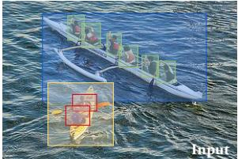  
(c) Open-Vocabulary Object Detection

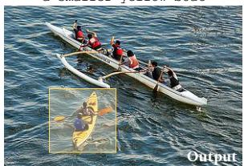

(b) Referring Expression Comprehension  
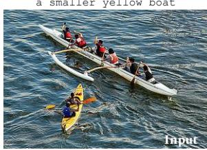  
boat, people, small. large, yellow, white, green, pink.

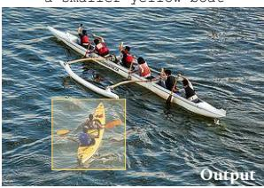  
boat, people, small, large, yellow, white, green, pink.  
(d) Phrase Grounding  
Two boats of people kayaking, a smaller yellow boat with two people and a larger white boat with six people.  
Two boats of people kayaking, a smaller yellow boat with two people and a larger white boat with six people.

  
(e) Visual Masked Language Modeling

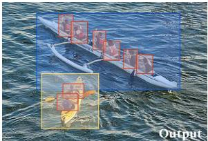

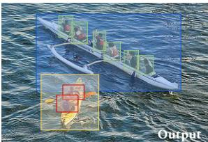  
(f) Grounded Open Vocabulary Acquisition  
Two boats of people kayaking, a smaller yellow <mask> with two people and a larger white boat with six people.  
Two boats of people kayaking, a smaller yellow boat with two people and a larger white boat with six people.

  
Two boats of people kayaking, a smaller yellow <mask> with two people and a larger white boat with six people.

  
Two boats of people kayaking, a smaller yellow boat with two people and a larger white boat with six people.

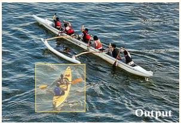

Figure 8: An illustrated comparison of task formulations related to grounded language learning.
<table><tr><td>Tasks (Inference Time)</td><td>Language Input</td><td>Visual Input</td><td>Language Output</td><td>Vision Output</td><td>Example Dataset(s)</td></tr><tr><td>Masked Language Modeling</td><td>Cloze Test</td><td></td><td>Missing Word</td><td></td><td>WikiText-103 (Merity et al., 2017)</td></tr><tr><td>Knowledge Probing</td><td>Cloze Test</td><td></td><td>Missing Word</td><td></td><td>LAMA (Petroni et al., 2019)</td></tr><tr><td>Reading Comprehension</td><td>Context, Cloze Test</td><td></td><td>Missing Word</td><td></td><td>LAMBADA (Paperno et al., 2016)</td></tr><tr><td>Image Captioning</td><td></td><td>Image</td><td>Caption</td><td></td><td>Flickr30k (Young et al., 2014)</td></tr><tr><td>Fill-in-the-Blank VQA</td><td>Cloze Test, (Choices)</td><td>Image/Video</td><td>Missing Text (Choice)</td><td></td><td>FIBER (Castro et al., 2022)</td></tr><tr><td>Visual Masked Language Modeling</td><td>Cloze Test</td><td>Image, Bounding Boxes</td><td>Missing Word</td><td></td><td>VisCOLL (Jin et al., 2020)</td></tr><tr><td>Object Retrieval</td><td>Referring Expression</td><td>Image, Bounding Boxes</td><td></td><td>Bounding Boxes</td><td>ReferIt (Kazemzadeh et al., 2014),</td></tr><tr><td>Referring Expression Comprehension</td><td>Referring Expression</td><td>Image</td><td></td><td>Bounding Boxes</td><td>RefCOCO* (Yu et al., 2016; Mao et al., 2016)</td></tr><tr><td>Phrase Grounding</td><td>Caption, Referring Expressions</td><td>Image</td><td></td><td>Bounding Boxes</td><td>Flickr30K Entities (Plummer et al., 2015</td></tr><tr><td>Object Detection</td><td>Seen Classes</td><td>Image</td><td>Classes</td><td>Bounding Boxes</td><td></td></tr><tr><td>Zero-Shot Object Detection</td><td>Unseen Classes</td><td>Image</td><td>Classes</td><td>Bounding Boxes</td><td>LVIS (Gupta et al., 2019)</td></tr><tr><td>Open-Vocabulary Object Detection</td><td>Pre-training Vocabulary</td><td>Image</td><td>Words</td><td>Bounding Boxes</td><td></td></tr><tr><td>Grounded Open Vocabulary Acquisition</td><td>Cloze Test</td><td>Image</td><td>Missing Word</td><td>Bounding Boxes</td><td>GOVA (Ours)</td></tr></table>

Table 5: Comparison of task formulations related to grounded language learning.

Object Localization (OL). We follow MDETR to decode object embeddings with a three-layer MLP to produce bounding boxes. Similar to most prior work, we apply a filter over boxes with confidence below 0.7. In our framework, this means that the object corresponds to the no-object label ∅ (Figure 4) with a probability over 0.3. We strictly follow DETR to perform bipartite matching between proposed boxes and ground truth boxes with a Hungarian loss. The predicted boxes are optimized towards ground truth by the generalized intersectionover-union (GIoU) loss and the L1 loss.

Grounding. In positional alignment, the model learns to map each object representation to tokens in the sentence with a fixed length of 257, which could possibly be a MASK or an additional no-object label ∅ (Figure 4). The object and the token are considered a match given a mapping probability over 0.1. We use a fully-connected layer to predict the distribution over token positions with crossentropy loss. In semantic alignment, the model learns to bring word embeddings closer to the object embeddings that they ground to, and push the unrelated pairs farther. We strictly follow the contrastive loss function defined in MDETR for every object and groundable token for this purpose.

## B.2 Few-shot Learning Details.

Since no bounding box or word-object mappings annotation is available, we train W2W with only masked language modeling (MLM) in few-sample new word learning. We reduce the batch size to 8 considering the fewer number of samples, and set the convergence criteria to a fixed number, i.e., 50 steps. All the rest of the experimental settings remain the same as pre-training.

## C Experiment Reproducibility

## C.1 W2W Implementation Details

Our W2W model mainly consists of one crossmodal transformer with inputs from uni-modal encoders from image and text domain. Specially, we select the ResNet-50 (He et al., 2016) pretrained on ImageNet from TIMM4 as the image encoder, and RoBERTa-base (Liu et al., 2019) from huggingface5 as the text encoder. The crossmodal encoder and two decoders each consists of 4 transformer blocks with 8 attention heads, an input and output dimensionality of 512, and an inner-layer dimensionality of 2,048. Besides, 50 learnable object queries are included to query the cross-modal decoder to generate bounding box proposals.

## C.2 Hyper-parameter Decisions

We include the major hyper-parameter tuning decisions for reproducibility purpose. For more details, please refer to the supplementary codes.

• Learning Rate:

– Image Encoder: frozen

– Text Encoder: $1 \times 1 0 ^ { - 5 }$

– Multi-modal Transformer: $1 \times 1 0 ^ { - 4 }$

• Batch Size: 128

• Pre-training Loss Coefficients:

– MLM Loss: 32

– Cross Entropy for Positional Alignment: 1

– Contrastive Loss for Semantic Alignment: 1

– L1 Localization Loss: 5

– GIoU Localization Loss: 2

• Few-shot Learning:

– Batch size: 8

– Other Hyper-parameters: Same as Pre-training

## C.3 Computational Resources

Our W2W models is pre-trained on 8 NVidia A40 GPUs. With mixed-precision pre-training and a batch size of 128, W2W was trained for 150,000 steps where each step takes about 1.4 second.

## C.4 Evaluation on GOVA

W2W For our proposed W2W model, given a GOVA test, with its corresponding image and textual cloze pair passing into the model, the bounding box predictions are generated by keeping only the bounding box proposals that are mapped to at least one masked token within the cloze, while the masked token prediction results are directly decoded from its language modeling head.

ViLT+MDETR For the “Produce-and-Localize” baseline model ViLT + MDETR, in stage one, we feed the input image and text into ViLT, collecting its top-1 cloze token prediction result. Then, at stage two, the input image and ViLT-completed text are fed into MDETR, performing phrase-grounding to localize the object associated with the original cloze. Finally, the cloze token prediction result from ViLT together with the bounding box proposals from MDETR are used for GOVA evaluation.

VisualBERT For the “Detect-and-Recognize” baseline model VisualBERT, we use phrasegrounding fine-tuned version of VisualBERT to perform object localization, and, as it lacks the language modeling head, another vanilla pre-trained VisualBERT to perform mask token prediction. Specifically, for the bounding box localization part, we treat it as a standard phrase grounding task and follow (Li et al., 2019) to select the top-1 bounding box prediction in the last masked token as the output.

## D Addendum to Results

We performed an ablation study on several W2W model variants to pinpoint what makes our W2W model effective. These included models without language encoder initialization (w/o Init), without grounding objective (w/o G), without any objectcentric representation (w/o O), and a text-only setup without any vision input (w/o V). For consistency, we control the number of transformer layers and the number of parameters for each variation. Despite tweaking various hyperparameters, no significant improvements were observed. As a result,

## D.1 Ablation Study

we retained the same hyperparameters as in the W2W model.

• w/o G: This refers to the model variant without grounding loss, as has already been described in Section 3.2;

• w/o O: This variant excludes all object-centric representations, retaining only the masked language modeling (MLM) objective. With this model, the object decoder transformer is unnecessary, thus no grounding nor localization is performed. Instead, we consolidate all 12 transformer blocks into the multi-modal encoder and directly attach the MLM objective to it.

• w/o V: This text-only model operates without any vision input or supervision, reducing it to a unimodal language model (RoBERTa) with 12 additional transformer blocks.

Following the analysis of Chang and Bergen (2022) in unimodal language models, we present the KL-Divergence between the model predictions and the unigram distribution in Figure 9. An immediate observation is that all variants converge to the shallow unigram statistics at around $1 0 ^ { 2 }$ steps of pre-training. This aligns with the findings of Chang and Bergen (2022) that unimodal language models would converge to unigram before acquiring more complicated contextual representations. We noticed that in both text-only and $W 2 W _ { \mathrm { w / o } } \mathrm { o }$ cases where MLM is the only pre-training objective, the models tend to stay around the unigram word distribution even with $1 0 ^ { 4 }$ steps of training. However, variants with an object-centric representation quickly departed from the unigram distribution. Comparatively, models with language model initialization moves quickly away from the unigram distribution, and models with a grounded objective have a marginally faster deviation. These results confirm that vision-language models can benefit from unimodal pre-training on a large corpus, and that performing language modeling upon object representations is crucial. We note that we compare the KL-Divergence from unigram only to understand the models’ behaviors, and the metric itself does not serve as an evaluation of a system’s performance in grounded open vocabulary acquisition.

## D.2 Addendum to Results in Multi-Class Incremental Learning

We present additional results in Table 6.

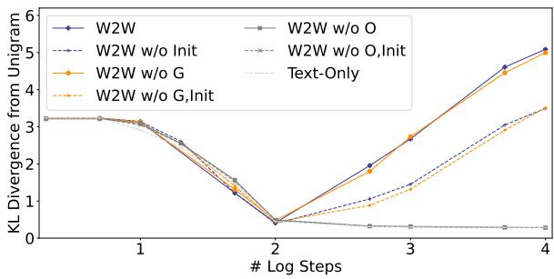

Figure 9: KL-divergence between model’s token prediction and the unigram distribution of the training corpus.
<table><tr><td rowspan="2"># Samples</td><td colspan="2">Seen log  $\mathrm { { G } \mathrm { { - P P L _ { \mathrm { { a l l } } } \left( \downarrow \right) } } }$ </td><td colspan="2">Unseen log  $\mathrm { { G } \mathrm { { - P P L _ { \mathrm { { a l l } } } \left( \downarrow \right) } } }$ </td></tr><tr><td>W2W</td><td> $W 2 W _ { \mathrm { w / o ~ G } }$ </td><td>W2W</td><td> $W 2 W _ { \mathrm { w / o G } }$ </td></tr><tr><td>0</td><td>1.79</td><td>2.33</td><td>11.58</td><td>11.89</td></tr><tr><td>8</td><td>3.15</td><td>3.63</td><td>3.09</td><td>3.32</td></tr><tr><td>16</td><td>3.36</td><td>3.76</td><td>2.64</td><td>2.85</td></tr><tr><td>24</td><td>3.05</td><td>3.46</td><td>2.07</td><td>2.67</td></tr><tr><td>32</td><td>3.07</td><td>3.62</td><td>2.01</td><td>2.54</td></tr></table>

Table 6: The log G-PPL (All-Protocol) of seen and unseen words in multi-class incremental learning, each unseen word with a sample size ranging from 8 to 32.

## D.3 Learning New Words through One-Class Incremental Learning.

We further perform a more controlled study with a word-specific one-class incremental learning setting. The pre-trained model is tasked to acquire one single unseen word from a few-shot learning session with $| \mathcal { V } _ { \mathrm { u n s e e n } } | = 1$ . The results of this section are obtained from the test immediately following the new session. We present the test result in Table 7. Again, we observe that with as few as 8 samples, W2W can achieve a satisfyingly low grounded perplexity. In the majority of the cases, W2W demonstrates the better ability to acquire unseen words over the groundless baseline.

<table><tr><td colspan="2"># Samples</td><td>0</td><td>8</td><td>16</td><td>24</td><td>32</td><td colspan="2"># Samples</td><td>0</td><td>8</td><td>16</td><td>24</td><td>32</td></tr><tr><td rowspan="2">crosswalk</td><td>W2W</td><td>10.82 10.91</td><td>8.48</td><td>7.43 7.53</td><td>7.70 7.15</td><td>5.95 7.5</td><td rowspan="2">donkey</td><td>W2W</td><td>8.70</td><td>0.84</td><td>0.81</td><td>0.67 2.35</td><td>0.79</td></tr><tr><td> $W 2 W _ { \mathrm { w / o G } }$ </td><td></td><td>10.88</td><td></td><td></td><td></td><td> $W 2 W _ { \mathrm { w / o G } }$ </td><td>9.69</td><td>1.97</td><td>1.99</td><td></td><td>2.01</td></tr><tr><td rowspan="2">cheese</td><td>W2W</td><td>12.16</td><td>2.62</td><td>3.00</td><td>1.27</td><td>1.04</td><td rowspan="2">barefoot</td><td>W2W</td><td>9.71</td><td>6.93</td><td>4.58</td><td>5.55</td><td>6.27</td></tr><tr><td> $W 2 W _ { \mathrm { w / o G } }$ </td><td>13.07</td><td>2.81</td><td>3.13</td><td>2.56</td><td>1.49</td><td> $W 2 W _ { \mathrm { w / o G } }$ </td><td>9.95</td><td>6.52</td><td>4.67</td><td>5.74</td><td>5.88</td></tr><tr><td rowspan="2">star</td><td> $W 2 W$ </td><td>8.70 10.59</td><td>1.49 2.93</td><td>1.47 2.10</td><td>1.09 1.99</td><td>1.18 1.39</td><td rowspan="2">elephant</td><td>W2W</td><td>15.24</td><td>1.44</td><td>1.65</td><td>1.81</td><td>1.44</td></tr><tr><td> $W 2 W _ { \mathrm { w / o G } }$ </td><td></td><td></td><td></td><td></td><td></td><td> $W 2 W _ { \mathrm { w / o G } }$ </td><td>14.75</td><td>2.17</td><td>1.98</td><td>1.73</td><td>1.61</td></tr><tr><td rowspan="2">classroom</td><td>W2W</td><td>3.96 5.10</td><td>0.47 0.95</td><td>0.36 0.88</td><td>0.43 1.05</td><td>0.32 0.95</td><td rowspan="2">heart</td><td>W2W</td><td>9.34</td><td>2.97</td><td>1.90</td><td>1.76</td><td>1.76</td></tr><tr><td> $W 2 W _ { \mathrm { w / o G } }$ </td><td></td><td></td><td></td><td></td><td></td><td> $W 2 W _ { \mathrm { w / o G } }$ </td><td>9.31</td><td>2.99</td><td>2.50</td><td>2.65</td><td>2.96</td></tr><tr><td rowspan="2">fluffy</td><td> $W 2 W$ </td><td>16.44</td><td>1.88</td><td>1.78</td><td>0.82</td><td>1.36 1.47</td><td rowspan="2">gym</td><td> $W 2 W$ </td><td>5.13</td><td>2.14</td><td>0.44</td><td>0.74</td><td>0.69</td></tr><tr><td> $W 2 W _ { \mathrm { w / o G } }$ </td><td>15.61</td><td>1.83</td><td>1.71</td><td>1.37</td><td></td><td> $W 2 W _ { \mathrm { w / o G } }$ </td><td>4.88</td><td>3.73</td><td>1.30</td><td>1.08</td><td>1.45</td></tr><tr><td rowspan="2">circular</td><td>W2W</td><td>15.21</td><td>1.59</td><td>1.07</td><td>1.55</td><td>1.23 1.61</td><td rowspan="2">security</td><td> $W 2 W$ </td><td>15.08</td><td>1.07</td><td>0.81</td><td>1.28</td><td>0.71</td></tr><tr><td> $W 2 W _ { \mathrm { w / o G } }$ </td><td>15.12</td><td>2.25</td><td>2.25</td><td>1.81</td><td></td><td> $W 2 W _ { \mathrm { w / o G } }$ </td><td>14.75</td><td>1.50</td><td>1.22</td><td>1.53</td><td>1.17</td></tr><tr><td rowspan="2">sink</td><td> $W 2 W$ </td><td>14.23</td><td>1.17</td><td>0.92</td><td>1.11</td><td>1.38 1.84</td><td rowspan="2">cafe</td><td> $W 2 W$ </td><td>6.28</td><td>1.90</td><td>1.38</td><td>1.98</td><td>1.39</td></tr><tr><td> $W 2 W _ { \mathrm { w / o G } }$ </td><td>15.49</td><td>1.84</td><td>1.65</td><td>1.60</td><td></td><td> $W 2 W _ { \mathrm { w / o G } }$ </td><td>7.03</td><td>2.17</td><td>1.92</td><td>2.08</td><td>1.72</td></tr><tr><td rowspan="2">doctor</td><td> $W 2 W$ </td><td>13.03</td><td>1.17</td><td>1.05</td><td>1.38</td><td>1.18 1.58</td><td rowspan="2">teacher</td><td> $W 2 W$ </td><td>16.68</td><td>1.95</td><td>2.15</td><td>1.52</td><td>1.48</td></tr><tr><td> $W 2 W _ { \mathrm { w / o G } }$ </td><td>12.44</td><td>1.17</td><td>1.23</td><td>1.39</td><td></td><td> $W 2 W _ { \mathrm { w / o G } }$ </td><td>16.08</td><td>2.68</td><td>2.37</td><td>1.85</td><td>1.83</td></tr><tr><td rowspan="2">foreign</td><td>W2W</td><td>9.48</td><td>0.62</td><td>0.95</td><td>0.85</td><td>0.47 0.95</td><td>student</td><td>W2W</td><td>16.28</td><td>1.38</td><td>1.07</td><td>1.20</td><td>1.03</td></tr><tr><td> $W 2 W _ { \mathrm { w / o G } }$ </td><td>10.01</td><td>1.03</td><td>0.88</td><td>1.18</td><td></td><td></td><td> $W 2 W _ { \mathrm { w / o G } }$ </td><td>16.52</td><td>2.21</td><td>1.29</td><td>1.40</td><td>1.61</td></tr><tr><td rowspan="2">diverse</td><td> $W 2 W$ </td><td>16.44</td><td>0.60</td><td>0.22</td><td>0.52</td><td>0.24</td><td>newborn</td><td> $W 2 W$ </td><td>16.43</td><td>1.71</td><td>0.88</td><td>0.91</td><td>1.11</td></tr><tr><td> $W 2 W _ { \mathrm { w / o G } }$ </td><td>16.05</td><td>0.81</td><td>0.65</td><td>0.97</td><td>0.65</td><td></td><td> $W 2 W _ { \mathrm { w / o G } }$ </td><td>16.30</td><td>2.02</td><td>1.32</td><td>1.61</td><td>1.76</td></tr><tr><td rowspan="2">product</td><td>W2W</td><td>10.25</td><td>0.84</td><td>0.75</td><td>1.39</td><td>1.15</td><td>pan</td><td>W2W</td><td>12.04</td><td>1.70</td><td>2.12</td><td>1.87</td><td>2.02</td></tr><tr><td> $W 2 W _ { \mathrm { w / o G } }$ </td><td>12.28</td><td>1.15</td><td>0.81</td><td>0.99</td><td>0.76</td><td></td><td> $W 2 W _ { \mathrm { w / o G } }$ </td><td>11.88</td><td>2.84</td><td>3.62</td><td>2.68</td><td>2.50</td></tr><tr><td rowspan="2">stove</td><td>W2W</td><td>16.15</td><td>2.63</td><td>2.64</td><td>1.94</td><td>2.72</td><td>telephone</td><td> $W 2 W$ </td><td>14.09</td><td>1.18</td><td>0.96</td><td>1.05</td><td>0.96</td></tr><tr><td> $W 2 W _ { \mathrm { w / o } } \mathrm { G }$ </td><td>16.13</td><td>3.06</td><td>4.30</td><td>3.08</td><td>2.98</td><td></td><td> $W 2 W _ { \mathrm { w / o G } }$ </td><td>13.42</td><td>1.17</td><td>1.50</td><td>1.46</td><td>1.38</td></tr><tr><td rowspan="2">steep</td><td>W2W</td><td>5.89</td><td>0.63</td><td>0.39</td><td>0.53</td><td>0.42</td><td>bamboo</td><td>W2W</td><td>14.54</td><td>2.02</td><td>1.20</td><td>0.76</td><td>1.02</td></tr><tr><td> $W 2 W _ { \mathrm { w / o G } }$ </td><td>7.30</td><td>1.46</td><td>2.42</td><td>0.87</td><td>1.93</td><td></td><td> $W 2 W _ { \mathrm { w / o G } }$ </td><td>15.40</td><td>3.01</td><td>1.38</td><td>1.09</td><td>1.42</td></tr><tr><td rowspan="2">warm</td><td> $W 2 W$   $W 2 W _ { \mathrm { w / o G } }$ </td><td>7.79 8.67</td><td>0.68 1.05</td><td>0.69 1.01</td><td>0.68 0.79</td><td>0.69 0.85</td><td>brush</td><td>W2W  $W 2 W _ { \mathrm { w / o G } }$ </td><td>11.17 13.69</td><td>1.88 2.51</td><td>2.13 2.89</td><td>1.81 2.39</td><td>2.45 2.83</td></tr><tr></table>

Table 7: The log G-PPL (All-Protocol) of unseen words in one-class incremental learning, each unseen word with a sample size ranging from 8 to 32.

A For every submission: ✓ A1. Did you describe the limitations of your work? Section 7, Limitations

✗ A2. Did you discuss any potential risks of your work? This study does not contain any human subjects or human studies. The study proposes a problem formulation and a computationalframework, which is not deployable to any real-world applications in theforeseeablefuture.

✓ A3. Do the abstract and introduction summarize the paper’s main claims? Section 1

✗ A4. Have you used AI writing assistants when working on this paper? Left blank.

## B ✓ Did you use or create scientific artifacts? Section 2

✓ B1. Did you cite the creators of artifacts you used? Section 2.4

✓ B2. Did you discuss the license or terms for use and / or distribution of any artifacts? Will be included along with the code release

✓ B3. Did you discuss if your use of existing artifact(s) was consistent with their intended use, provided that it was specified? For the artifacts you create, do you specify intended use and whether that is compatible with the original access conditions (in particular, derivatives of data accessed for research purposes should not be used outside of research contexts)? Will be included along with the code release

 B4. Did you discuss the steps taken to check whether the data that was collected / used contains any information that names or uniquely identifies individual people or offensive content, and the steps taken to protect / anonymize it? Not applicable. Left blank.

 B5. Did you provide documentation of the artifacts, e.g., coverage of domains, languages, and linguistic phenomena, demographic groups represented, etc.? Not applicable. Left blank.

✓ B6. Did you report relevant statistics like the number of examples, details of train / test / dev splits, etc. for the data that you used / created? Even for commonly-used benchmark datasets, include the number of examples in train / validation / test splits, as these provide necessary context for a reader to understand experimental results. For example, small differences in accuracy on large test sets may be significant, while on small test sets they may not be. Section 2 and Appendix A

## C ✓ Did you run computational experiments?

Section 4

✓ C1. Did you report the number of parameters in the models used, the total computational budget (e.g., GPU hours), and computing infrastructure used? Appendix C

✓ C2. Did you discuss the experimental setup, including hyperparameter search and best-found hyperparameter values? Appendix C

✗ C3. Did you report descriptive statistics about your results (e.g., error bars around results, summary statistics from sets of experiments), and is it transparent whether you are reporting the max, mean, etc. or just a single run? The study involves a pre-trainingframework which is not economicallyfeasiblefor repeated runs.

✓ C4. If you used existing packages (e.g., for preprocessing, for normalization, or for evaluation), did you report the implementation, model, and parameter settings used (e.g., NLTK, Spacy, ROUGE, etc.)? Appendix C

D ✗ Did you use human annotators (e.g., crowdworkers) or research with human participants? Left blank.

 D1. Did you report the full text of instructions given to participants, including e.g., screenshots, disclaimers of any risks to participants or annotators, etc.? Not applicable. Left blank.

 D2. Did you report information about how you recruited (e.g., crowdsourcing platform, students) and paid participants, and discuss if such payment is adequate given the participants’ demographic (e.g., country of residence)? Not applicable. Left blank.

 D3. Did you discuss whether and how consent was obtained from people whose data you’re using/curating? For example, if you collected data via crowdsourcing, did your instructions to crowdworkers explain how the data would be used? Not applicable. Left blank.

 D4. Was the data collection protocol approved (or determined exempt) by an ethics review board? Not applicable. Left blank.

 D5. Did you report the basic demographic and geographic characteristics of the annotator population that is the source of the data? Not applicable. Left blank.