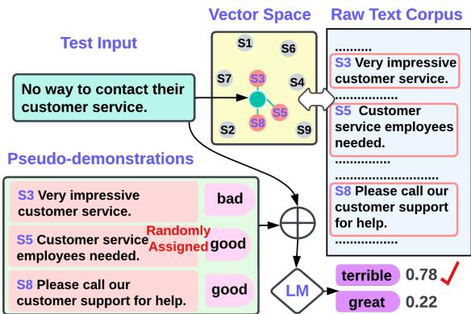
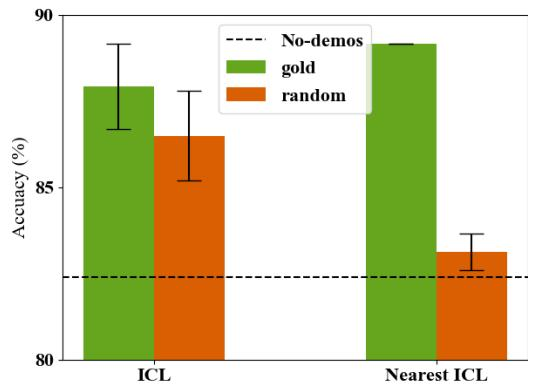
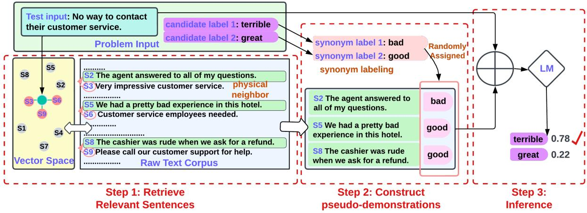
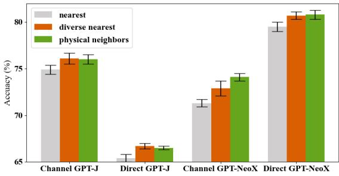
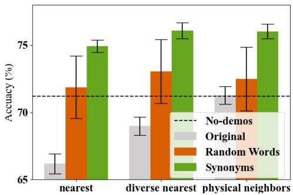
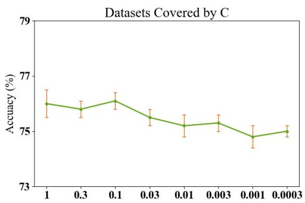
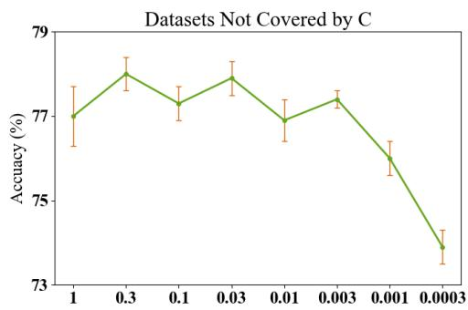
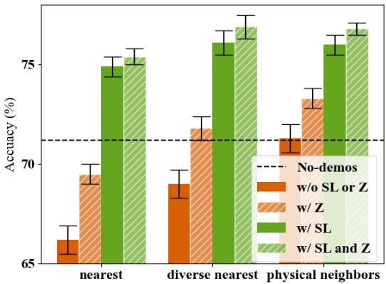
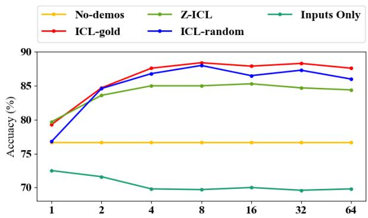
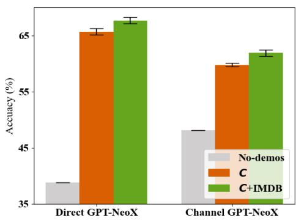

# Z-ICL: Zero-Shot In-Context Learning with Pseudo-Demonstrations

Xinxi Lyu1 Sewon Min1 Iz Beltagy2

Luke Zettlemoyer1 Hannaneh Hajishirzi1,2   
1University of Washington 2Allen Institute for AI   
{alrope,sewon,lsz,hannaneh}@cs.washington.edu beltagy@allenai.org

## Abstract

Although large language models can be prompted for both zero- and few-shot learning, performance drops significantly when no demonstrations are available. In this pa per, we introduce Z-ICL, a new zero-shot method that closes the gap by constructing pseudo-demonstrations for a given test input using a raw text corpus. Concretely, pseudodemonstrations are constructed by (1) finding the nearest neighbors to the test input from the corpus and pairing them with random task labels, and (2) applying a set of techniques to reduce the amount of direct copying the model does from the resulting demonstrations. Evaluation on nine classification datasets shows that Z-ICL outperforms previous zero-shot methods by a significant margin, and is on par with incontext learning with few-shot labeled training data. Overall, Z-ICL provides a significantly higher estimate of the zero-shot performance levels of a model, and supports future efforts to develop better pseudo-demonstrations that further improve zero-shot results.1

## 1 Introduction

Large language models (LMs) can perform new tasks simply by conditioning on input-label pairs from the training data, known as demonstrations (Brown et al., 2020). This in-context learning (ICL) is significantly better than zero-shot methods that do not use demonstrations. Recent work suggests that in-context-learning demonstrations are primarily specifying the domain and the format that the target task, instead of providing explicit training signal (Reynolds and McDonell, 2021; Xie et al., 2022; Razeghi et al., 2022; Min et al., 2022). This implies that current zero-shot performance (with no demonstrations) levels must be significantly underestimated, since all the required information must already be in the model.

  
Figure 1: An illustration of Z-ICL with k = 3, making a prediction between great and terrible. Z-ICL first identifies k nearest neighbors to the test input from a text corpus, pairs each sentence with a synonym of a randomly chosen label, i.e., good and bad, and uses in-context learning.

In this paper, we introduce Z-ICL: Zeroshot In-Context Learning through creating pseudodemonstrations, which achieves results on par with in-context learning from gold demonstrations (Figure 1). The key idea is to construct the pseudodemonstrations following two criteria: (a) they should inform the correct input distribution and the label space, as the k-shot demonstrations do (Xie et al., 2020; Min et al., 2022);2 and (b) they should be constructed to avoid the copying effect—our new observation that the LM predictions are heavily influenced by demonstration inputs that are very close to the test input.

To satisfy (a), Z-ICL retrieves a set of nearest neighbors from a raw text corpus and assigns a random label to each. To satisfy (b), we propose two techniques. We take physical neighbor (adjacent sentences in the corpus) of the nearest sentences instead of the nearest sentences themselves, so that the sentences in the pseudo-demonstrations are from a similar distribution as the text input but are more distant. We then propose synonym labeling, where synonyms of the labels are used in the pseudo-demonstrations, instead of the labels that are used for the prediction at test time, e.g., {great, terrible} {good, bad}. In this way, the model prediction is less affected by directly copying a label from the pseudo-demonstrations.

We evaluate Z-ICL on nine text classification datasets. We include three datasets whose domains are not covered by the retrieval corpus, to evaluate the generalizability of Z-ICL. We experiment with GPT-J (Wang and Komatsuzaki, 2021), GPT-NeoX (Black et al., 2022) and GPT-3 (Brown et al., 2020), whose sizes range from 6B, 20B to 175B. Z-ICL significantly outperforms the previous zero-shot baseline (no-demonstrations) consistently across different datasets and LMs, despite the fact that it does not require any prompt engineering. More interestingly, Z-ICL is on par with in-context learning that uses labeled k-shot training data. Ablations show that (1) constructing a paired format of the pseudo-demonstrations is key to performance, (2) our two techniques—physical neighbor and synonym labeling—are critical, since both of them are required for our pseudo-demonstrations to be on par with k-shot demonstrations, and (3) performance improves as the size and the coverage of the corpus increase.

Together, Z-ICL provides a significantly higher estimate of the ability of current LMs to perform a new task zero-shot, encourages new ways to improve zero-shot performance by designing even better pseudo-demonstrations, and poses a set of new questions about the capabilities of LMs.

## 2 Related Work

Demonstrations in ICL. A series of prior work suggests that ICL primarily exposes model functionality that was learned during pre-training. Reynolds and McDonell (2021) suggests that ICL mainly functions by activating the LM’s ability obtained during pretraining, and that the LM can achieve significantly better zero-shot performance by using a better template. Xie et al. (2022) shows that ICL can be explained as Bayesian inference for which demonstrations provide noisy evidence. In closed-set tasks, Min et al. (2022) shows that ICL benefits mainly from the correct distribution of the inputs and the labels rather than the input-label

correspondence.

Our work draws intuitions from these studies and introduces a better zero-shot method by forming pseudo-demonstrations that are proxies of the input distribution and the label space and better expose the intrinsic ability of the LM.

Better Demonstrations through Retrieval. Prior work has found that, in the setting where large training data is available, choosing demonstration examples that are close to the test input significantly helps ICL. Liu et al. (2021) retrieves the nearest training examples to the test input using a sentence encoder, either unsupervised or supervised. Rubin et al. (2021) trains a retrieval system to choose examples that improve ICL. Liu et al. (2022) retrieves the nearest neighbors from unlabeled training data, assigns estimated labels, and uses them for ICL. We similarly use nearest neighbor search to retrieve sentences close to the test input, but are the first to (1) retrieve from a raw text corpus, in contrast to prior work that uses labeled or unlabeled training data collected for the task, and (2) more closely study the connection between nearest neighbor inputs and random labels, through our copying effect hypothesis.

Copying in ICL. Prior work has explored how seen token patterns affect the ICL’s prediction. Olsson et al. (2022) identifies specific attention heads that, when predicting the next token, look for the previous similar tokens of the current last token in the demonstrations, and copy the tokens following those similar tokens. Our work similarly finds that ICL is prone to copy previously seen text from the demonstrations, but specifically with the particular input-label format in the demonstrations.

## 3 Copying Effect Hypothesis

In a typical ICL evaluation, the demonstrations are sampled uniformly at random from the true distribution, e.g., the training data in case of existing NLP datasets. We observe that, when demonstrations contain input text that is very similar to the test input, the model exhibits a behavior which we call the copying effect. To study this, we evaluate ICL-gold (standard ICL) and ICL-random; both are ICL methods that use k randomly sampled examples from the training data with gold and random labels, respectively. We then evaluate nearest ICLgold and nearest ICL-random, which follow Liu et al. (2021) in retrieving the k nearest neighbors for each test input from the training data and assign gold labels and random labels, respectively. We use GPT-J (Wang and Komatsuzaki, 2021) as the LM and SimCSE (Gao et al., 2021) for choosing the nearest inputs.

<table><tr><td>Example #1</td><td></td><td></td></tr><tr><td>Demo 1 Demo 2</td><td>I am giving a zero star to symantec for this version. I recommend not to purchase it. This player is not worth any price. great</td><td>great</td></tr><tr><td>Demo 3</td><td>So far I have no complains with this player.</td><td>terrible</td></tr><tr><td></td><td>Test example This may be a really cool player, but it&#x27;s not worth the price.</td><td>great</td></tr><tr><td>Example #2</td><td></td><td></td></tr><tr><td>Demo 1</td><td></td><td>great</td></tr><tr><td></td><td>I am giving a zero star to symantec for this version.</td><td></td></tr><tr><td>Demo 2</td><td>I recommend not to purchase it. This player is not worth any price. terrible</td><td></td></tr><tr><td>Demo 3</td><td>So far I have no complains with this player.</td><td>terrible</td></tr><tr><td></td><td>Test example This may be a really cool player, but it&#x27;s not worth the price.</td><td>terrible</td></tr></table>

Table 1: An illustration of the copying effect hypothesis with nearest in-context learning (k = 3), using an example from the CR dataset. The first three lines are demonstrations, and the last line is the test. The model prediction is indicated in red. The model tends to copy the label from the demonstration input that is close to the test input.

  
Figure 2: Performance of ICL and nearest ICL, each with gold labels and random labels. Evaluated on three datasets (CR, Amz, Yelp) with GPT-J using channel inference method (Min et al., 2021). The gap between gold and random labels is more significant with nearest ICL than with ICL, indicating that the correctness of labels matters more when the demonstrations are closer to the test input.

Results are reported in Figure 2. First, ICLgold and ICL-random achieve relatively comparable performance, which is consistent with Min et al. (2022) that the correctness of labels in the demonstrations matters much less than we thought. However, this does not hold with nearest ICL: using random labels is significantly worse than using gold labels. This indicates that the correctness of labels matters significantly more when the inputs in the demonstrations are closer to the test input.

Based on our observation, we define a copying effect hypothesis: the model prediction is heavily biased toward the labels paired with inputs in the demonstrations that are very similar to the test input, which resembles copying. Table 1 provides an example. The second input in the demonstrations is very close to the test input both lexically and semantically, and the model prediction tends to follow the label paired with the second input, regardless of what that label is.

<table><tr><td></td><td>GPT-J</td><td>GPT-NeoX</td></tr><tr><td>Total</td><td>82.3</td><td>88.0</td></tr><tr><td>Correct</td><td>90.8</td><td>94.2</td></tr><tr><td>Incorrect</td><td>73.9</td><td>81.7</td></tr></table>

Table 2: % of predictions that match the label of the demonstration example that is identical to the test input. Evaluated on CR with GPT-J and GPT-NeoX using channel inference method (Min et al., 2021). The model copies the label paired with an identical example in the majority of cases.

To better quantify the copying effect, we design an experiment where the demonstrations include an example that is identical to the test input, either with a correct label or with an incorrect label. We then see how many times the LM makes a prediction that is the same as the label paired with the identical demonstration example. Results are reported in Table 2. LM predicts the same label as the one paired with the identical input for over 90% of the times when the label is correct, and over 70% of the times when the label is incorrect, consistently over different LMs.

In the next section, we design a zero-shot method where the copying effect can specifically be problematic, and propose new techniques that reduce the copying effect.

## 4 Our Method: Z-ICL

Overview. We introduce Z-ICL, a new Zeroshot In-Context Learning method, which predicts the correct label for a given test input x and its candidate classes from a task. Unlike prior methods (Liu et al., 2021; Rubin et al., 2021; Liu et al., 2022) where the target domain and labeled training data of the task are available, Z-ICL constructs pseudo-demonstrations—pairs of inputs and labels—in a zero-shot fashion by leveraging a raw text corpus , and perform in-context learning.

  
Figure 3: A detailed illustration of Z-ICL with $k = 3 ,$ where the LM makes a prediction between great and terrible. Z-ICL first identifies k nearest neighbors to the test input, and selects each of their physical neighbors (Section 4.1). Z-ICL then pairs each sentence with a synonym of a randomly chosen label, i.e., good or bad (Section 4.2), and performs inference using in-context learning (Section 4.3).

Z-ICL consists of three steps (Figure 1): retrieving the sentences to approximate the input distribution of the test input (Section 4.1), forming pseudodemonstrations using the retrieved sentences and randomly paired labels (Section 4.2), and making an inference using in-context learning (Section 4.3). Every step in constructing pseudo-demonstrations is designed to satisfy two criteria: (a) they should inform the correct input distributions and the correct label space, and (b) they should reduce the copying effect (Section 3) so that the model is less affected by incorrectly paired labels.

## 4.1 Step 1: Retrieve Relevant Sentences

In the first step, Z-ICL retrieves k from that are similar to x. We formally denote $s : S \times S  \mathbb { R }$ with being all sentences from ${ \mathcal { C } } ,$ as a similarity function between two sentences, and let $\mathcal { N } _ { k } ( x )$ be a set of sentences $c _ { 1 } , \cdots , c _ { k }$ retrieved from with the highest $s ( c _ { i } , x )$

It is possible to construct pseudo-demonstrations directly using $\mathcal { N } _ { k } ( x )$ . While this matches the input x well, it is highly likely to suffer from the copying effect (Section 3), since retrieved sentences are too similar to the test input.

To address this, we propose a method called physical neighbor. Instead of directly using $\mathcal { N } _ { k } ( x )$ , it selects the sentence that is physically adjacent in to each sentence in $\mathcal { N } _ { k } ( x )$ as $x _ { 1 } , x _ { 2 } . . . x _ { k }$ This method allows $x _ { 1 } , x _ { 2 } . . . x _ { k }$ to share similar distribution as $x ,$ while being sufficiently distant from x since they are not the k nearest neighbors of $x .$

## 4.2 Step 2: Construct pseudo-demonstrations

Once $x _ { 1 } . . . x _ { k }$ are obtained, Z-ICL pairs each $x _ { i }$ with a random label following the intuition from Min et al. (2022). While the most straightforward method is to assign the random label from the candidate set , this would not achieve the best performance because the LM may find similar sentences from $x _ { 1 } . . . x _ { k }$ and follow their labels according to the copying effect (Section 3).

We therefore propose a technique called synonym labeling: we use synonyms of the labels and pair $x _ { 1 } . . . x _ { k }$ with them, instead of the original labels that will be used for the prediction. Formally, for each $x _ { i } ,$ Z-ICL chooses a label $y _ { i } \in \mathcal { V }$ uniformly at random, and creates a pair $( x _ { i } , \tilde { y } _ { j } )$ where $\tilde { y } _ { j }$ is a manually chosen synonym of $y _ { j }$ . We only use synonyms for the pseudo-demonstrations; we use the original candidate set $\mathcal { V }$ during the test prediction. This technique (1) sufficiently informs the correct semantic space of the labels, and (2) prevents the copying effect by not having the exact same words as the test labels.

## 4.3 Step 3: Inference

Finally, Z-ICL uses in-context learning by concatenating k input-label pairs (x1, y˜1), (x2, y˜2), $\cdots , ( x _ { k } , \tilde { y } _ { k } )$ as well as the test input x, feeds it to the LM, and obtains the prediction via argma $\mathrm { x } _ { y \in { \mathcal { y } } } P ( y \mid x _ { 1 } , { \tilde { y } } _ { 1 } , \cdot \cdot \cdot , x _ { k } , { \tilde { y } } _ { k } , x )$ . The prediction is made over the original set of labels $\mathcal { V } =$ $\{ y _ { 1 } . . . y _ { | \mathcal { V } | } \}$ , not the synonyms of labels $\tilde { y } _ { 1 } . . . \tilde { y } _ { | \mathcal { Y } | }$

<table><tr><td>Method</td><td>Demo Corpus Similar No-Copy</td><td></td><td></td></tr><tr><td>No-demos</td><td></td><td></td><td></td></tr><tr><td>Random inputs</td><td>pseudo</td><td>V</td><td></td></tr><tr><td>Naive Z-ICL</td><td>pseudo</td><td>√</td><td>√</td></tr><tr><td>Z-ICL (Ours)</td><td>pseudo</td><td>√</td><td>√</td></tr><tr><td>ICL-gold (Oracle) ICL-random (Oracle) k-shot</td><td>k-shot</td><td></td><td></td></tr></table>

Table 3: Comparison between Z-ICL and baselines. ‘Demo’ indicates the type of the demonstrations, either the k-shot training data (k-shot) or constructed from a raw corpus only (pseudo). ‘Corpus’ indicates whether an external corpus is used. ‘Similar’ indicates whether a similarity function is used. ‘No-Copy’ indicates whether the method is designed to reduce the copying effect.

## 5 Experimental Setup

## 5.1 Data

Text corpus. We use the Demix corpus from Gururangan et al. (2021), a raw text corpus that is not designated for any downstream task. It consists of 16 diverse domains, including Wikipedia, news, Amazon reviews, Yelp reviews, Twitter, and more, all in English. A full list is provided in Table 6 in Appendix A. We subsample up to 10M paragraphs from each domain, and split each paragraph into sentences in order to perform a sentence-level retrieval. More details are provided in Appendix A.

Evaluation datasets. We evaluate our methods on nine single-sentence classification datasets: CR (Ding et al., 2008), Amz (Zhang et al., 2015), Amz5 (Zhang et al., 2015), Yelp (Zhang et al., 2015), Yelp5 (Zhang et al., 2015), Tweet-Eval (Barbieri et al., 2020), MR (Pang and Lee, 2004), SST2 (Socher et al., 2013) and SST5 (Socher et al., 2013). Six out of the nine datasets are from domains that are represented in our corpus, while the other three (MR, SST2, and SST5) are not. This split allows us to measure domain coverage effects. Statistics are reported in Appendix A.

## 5.2 Baselines

We compare Z-ICL with the following zero-shot methods. See Table 3 for their comparison.

No-demonstrations (No-demos) predicts $\operatorname { a r g m a x } _ { y \in y } P ( y \mid x )$ without using any demonstrations. This is a previously-used zero-shot method (Radford et al., 2019; Brown et al., 2020).

Random inputs selects $x _ { 1 } . . . x _ { k }$ from  uniformly at random, without considering the similarity score with x. It then pairs each $x _ { i }$ with a random label from $\mathcal { V }$ and uses in-context learning as in Section 4.3. This baseline uses pseudo-demonstrations, but does not consider the similarity between the test input and the pseudo-demonstrations.

Naive Z-ICL is a version of $\mathrm { { Z - I C I } }$ that uses the most naive retrieval method without the physical neighbor adjustment (Section 4.1) or synonym labeling (Section 4.2). This method encourages the relevance of the pseudo-demonstrations the most, but does not reduce the copying effect.

We also compare with methods that use the training data, and call them Oracle baselines.

ICL-gold (Oracle) uses k input-label pairs from the training data and in-context learning. This is equivalent to the standard in-context learning, first proposed by Brown et al. (2020).

ICL-random (Oracle) uses k inputs from the training data and pairs each input with a random label sampled from uniformly at random, and uses in-context learning (Min et al., 2022).

## 5.3 Experimental Details

Language models. We experiment with three casual language models: GPT-J (Wang and Komatsuzaki, 2021), GPT-NeoX (Black et al., 2022) and GPT-3 (Brown et al., 2020) of sizes 6B, 20B, and 175B, respectively. We use two inference methods: direct (a regular inference used in Brown et al. (2020)) and channel (Min et al., 2021).

Similarity function. We define a similarity function s to be a cosine similarity between two sentence embeddings obtained through SimCSE (Gao et al., 2021).3

Implementation details. For GPT-J and GPT-NeoX, we use 5 random seeds and report an average and standard deviation. For GPT-3, we use 2 random seeds and only evaluate on five datasets (CR, Amz, Yelp, Tweet, and SST2) due to limited access. If the dataset includes more than 2,000 test examples, we subsample 2,000 examples uniformly at random without replacement due to limited computing resources, following prior work (Zhao et al., 2021). We use $k = 1 6$ for all experiments. We use minimal templates from Zhao et al. (2021) without template engineering, e.g., prepending Review: and Sentiment: to the input and the label, respectively, on a review sentiment classification dataset. More details are provided in Appendix B.

<table><tr><td rowspan="2">Method</td><td colspan="7">Covered by C</td><td colspan="4">Not covered by C</td></tr><tr><td>CR</td><td>Amz</td><td>Amz5</td><td>Yelp</td><td>Yelp5</td><td>Tweet</td><td>Avg</td><td>MR</td><td>SST2</td><td>SST5</td><td>Avg</td></tr><tr><td>Majority</td><td> $5 0 . 0 _ { 0 . 0 }$ </td><td> $5 0 . 0 _ { 0 . 0 }$ </td><td> $2 0 . 0 _ { 0 . 0 }$ </td><td> $5 0 . 0 _ { 0 . 0 }$ </td><td> $2 0 . 0 _ { 0 . 0 }$ </td><td> $3 8 . 1 _ { 0 . 0 }$ </td><td> $3 8 . 0 _ { 0 . 0 }$ </td><td> $5 0 . 0 _ { 0 . 0 }$ </td><td> $5 0 . 0 _ { 0 . 0 }$ </td><td> $2 1 . 5 _ { 0 . 0 }$  1</td><td> $4 0 . 5 _ { 0 . 0 }$ </td></tr><tr><td>Channel GPT-J</td><td></td><td></td><td></td><td></td><td></td><td></td><td></td><td></td><td></td><td></td><td></td></tr><tr><td>No-demos</td><td> $7 3 . 2 _ { 0 . 0 }$ </td><td> $8 6 . 1 _ { 0 . 0 }$ </td><td> $3 4 . 4 _ { 0 . 0 }$ </td><td> $8 8 . 0 _ { 0 . 0 }$ </td><td> $3 6 . 6 _ { 0 . 0 }$ </td><td> $\mathbf { 4 7 . 6 _ { 0 . 0 } }$ </td><td>61.00.0</td><td> $6 5 . 7 _ { 0 . 0 }$ </td><td> $6 6 . 3 \phantom { 0 } _ { 0 . 0 }$ </td><td> $2 1 . 9 _ { 0 . 0 }$ </td><td> $5 1 . 3 _ { 0 . 0 }$ </td></tr><tr><td>Random inputs</td><td> $7 7 . 8 _ { 2 . 4 }$ </td><td>81.83.2</td><td> $3 8 . 1 _ { 1 . 6 }$ </td><td> $8 4 . 2 _ { 4 . 6 }$ </td><td> $4 0 . 5 _ { 1 . 4 }$ </td><td> $4 1 . 5 _ { 1 . 1 }$ </td><td> $6 0 . 7 _ { 2 . 4 }$ </td><td> $7 6 . 2 _ { 3 . 6 }$ </td><td> $7 8 . 6 _ { 3 . 6 }$ </td><td> $3 3 . 9 _ { 3 . 6 }$ </td><td> $6 2 . 9 _ { 3 . 6 }$ </td></tr><tr><td>Naive Z-ICL</td><td> $6 2 . 1 _ { 0 . 8 }$ </td><td> $8 1 . 6 _ { 0 . 5 }$ </td><td> $4 1 . 7 _ { 0 . 4 }$ </td><td> $8 1 . 4 _ { 0 . 3 }$ </td><td> $4 1 . 8 \phantom { 0 } _ { 0 . 8 }$ </td><td> $4 2 . 2 _ { 1 . 0 }$ </td><td> $5 8 . 5 _ { 0 . 6 }$ </td><td> $6 8 . 8 _ { 0 . 4 }$ </td><td> $6 7 . 8 \phantom { 0 } . 8$ </td><td>32.40.6</td><td>56.30.6</td></tr><tr><td>Z-ICL (Ours)</td><td> $\mathbf { 8 0 . 1 _ { 0 . 1 } }$ </td><td> $\mathbf { 8 8 . 9 0 . 2 }$ </td><td> $\mathbf { 4 6 . 5 0 . 4 }$ </td><td> $\mathbf { 8 8 . 4 0 . 1 }$ </td><td> $\mathbf { 4 4 . 2 0 . 3 }$ </td><td> $4 6 . 8 \phantom { 0 } . 5$ </td><td> $\mathbf { 6 5 . 8 0 . 3 }$ </td><td> $\mathbf { 8 1 . 9 0 . 1 }$ </td><td> $\mathbf { 8 2 . 6 _ { 0 . 2 } }$ </td><td> $\mathbf { 3 8 . 7 _ { 0 . 5 } }$ </td><td>67.70.3</td></tr><tr><td>ICL-gold (Oracle) ICL-random (Oracle)</td><td> $8 4 . 4 _ { 2 . 8 }$ </td><td> $9 0 . 9 _ { 0 . 9 }$   $9 1 . 3 _ { 1 . 4 }$ </td><td> $4 5 . 5 _ { 3 . 2 }$ </td><td> $9 1 . 0 _ { 0 . 1 }$ </td><td> $4 7 . 4 _ { 1 . 3 }$ </td><td> $4 8 . 0 _ { 1 . 8 }$ </td><td> $6 7 . 9 _ { 1 . 7 }$ </td><td> $8 6 . 9 _ { 0 . 2 }$ </td><td> $8 8 . 8 _ { 1 . 3 }$ </td><td> $4 2 . 1 _ { 1 . 1 }$ </td><td> $7 2 . 6 _ { 0 . 9 }$ </td></tr><tr><td>Direct GPT-J</td><td> $8 2 . 3 _ { 1 . 3 }$ </td><td></td><td> $4 4 . 9 _ { 2 . 0 }$ </td><td> $9 1 . 1 _ { 0 . 3 }$ </td><td> $4 8 . 0 _ { 1 . 5 }$ </td><td> $4 6 . 8 _ { 2 . 6 }$ </td><td> $6 7 . 4 _ { 1 . 5 }$ </td><td> $8 6 . 6 _ { 0 . 3 }$ </td><td> $8 6 . 1 _ { 2 . 1 }$ </td><td> $4 1 . 8 \phantom { 0 } _ { 0 . 9 }$ </td><td> $7 1 . 5 _ { 1 . 1 }$ </td></tr><tr><td>No-demos</td><td> $5 0 . 6 _ { 0 . 0 }$ </td><td> $8 7 . 3 _ { 0 . 0 }$ </td><td> $3 0 . 4 _ { 0 . 0 }$ </td><td> $9 2 . 3 _ { 0 . 0 }$ </td><td> $2 8 . 7 _ { 0 . 0 }$ </td><td> $\mathbf { 3 9 . 5 _ { 0 . 0 } }$  </td><td> $5 4 . 8 _ { 0 . 0 }$ </td><td> $5 1 . 7 _ { 0 . 0 }$ </td><td> $5 2 . 9 _ { 0 . 0 }$ </td><td> $2 6 . 8 _ { 0 . 0 }$ </td><td> $4 3 . 8 _ { 0 . 0 }$ </td></tr><tr><td>Random inputs</td><td> $7 1 . 1 _ { 1 5 . 0 }$ </td><td>91.22.8</td><td> $3 7 . 5 { } _ { 5 . 2 }$ </td><td> $9 1 . 5 _ { 3 . 5 }$ </td><td> $3 6 . 4 6 . 1$ </td><td>28.86.7</td><td> $5 9 . 4 6 . 6 $ </td><td>68.212.1</td><td> $6 9 . 9 _ { 1 2 . 9 }$ </td><td> $3 0 . 1 _ { 8 . 2 }$ </td><td> $5 6 . 1 _ { 1 1 . 1 }$ </td></tr><tr><td>Naive Z-ICL</td><td> $6 5 . 2 _ { 0 . 9 }$ </td><td> $8 9 . 3 _ { 0 . 6 }$ </td><td> $\mathbf { 3 9 . 6 _ { 0 . 4 } }$ </td><td> $9 1 . 7 _ { 0 . 6 }$ </td><td>41.20.8</td><td> $3 2 . 3 \phantom { 0 } _ { 0 . 4 }$ </td><td> $5 9 . 9 _ { 0 . 6 }$ </td><td> $6 4 . 6 _ { 0 . 4 }$ </td><td> $6 6 . 1 _ { 0 . 0 }$ </td><td> $3 0 . 9 _ { 0 . 6 }$ </td><td> $5 3 . 9 _ { 0 . 3 }$ </td></tr><tr><td>Z-ICL (Ours)</td><td> $\mathbf { 7 8 . 8 0 . 4 }$ </td><td> $\mathbf { 9 4 . 9 0 . 1 }$ </td><td> $3 8 . 5 \mathrm { 0 } . 3 $ </td><td> $\mathbf { 9 6 . 0 0 . 1 }$ </td><td> $4 0 . 8 \phantom { 0 } . 3$ </td><td> $2 0 . 5 \mathrm { 0 . 1 }$ </td><td> ${ \bf 6 1 . 6 _ { 0 . 3 } }$ </td><td> $\mathbf { 8 1 . 0 0 . 3 }$ </td><td> $\mathbf { 8 2 . 6 _ { 0 . 2 } }$ </td><td> $\mathbf { 3 0 . 9 0 . 3 }$ </td><td>64.80.3</td></tr><tr><td>ICL-gold (Oracle)</td><td> $6 8 . 7 _ { 1 3 . 9 }$ </td><td> $9 5 . 8 _ { 0 . 1 }$ </td><td> $4 9 . 0 _ { 3 . 8 }$ </td><td> $9 6 . 4 _ { 0 . 4 }$ </td><td> $4 7 . 5  _ { 5 . 8 }$ </td><td></td><td>65.44.9</td><td> $8 4 . 0 _ { 6 . 8 }$ </td><td></td><td> $4 2 . 9 _ { 0 . 9 }$ </td><td> $7 2 . 7 _ { 4 . 0 }$ </td></tr><tr><td>ICL-random (Oracle)</td><td> $7 9 . 1 _ { 1 0 . 0 }$ </td><td> $8 7 . 8 \tau . 5$ </td><td> $4 1 . 1 _ { 4 . 8 }$ </td><td> $9 4 . 5 _ { 1 . 9 } $ </td><td> $4 3 . 5 _ { 3 . 5 }$ </td><td> $3 5 . 0 _ { 5 . 1 }$   $3 3 . 4 _ { 2 . 7 }$ </td><td> $6 3 . 2 _ { 5 . 1 }$ </td><td> $8 7 . 3 _ { 3 . 6 }$ </td><td> $9 1 . 1 _ { 3 . 2 }$   $8 2 . 6 _ { 9 . 7 }$ </td><td> $3 5 . 9 _ { 3 . 5 }$ </td><td> $6 8 . 6 { } _ { 5 . 6 }$ </td></tr><tr><td>Channel GPT-NeoX</td><td></td><td></td><td></td><td></td><td></td><td></td><td></td><td></td><td></td><td></td><td></td></tr><tr><td>No-demos</td><td> $5 7 . 2 _ { 0 . 0 }$ </td><td> $6 3 . 2 _ { 0 . 0 }$ </td><td> $2 7 . 5 _ { 0 . 0 }$ </td><td> $5 7 . 0 _ { 0 . 0 }$ </td><td> $2 8 . 6 _ { 0 . 0 }$ </td><td> $2 8 . 7 _ { 0 . 0 }$ </td><td> $4 3 . 7 _ { 0 . 0 }$ </td><td> $5 8 . 7 _ { 0 . 0 }$ </td><td> $6 1 . 9 \mathrm { _ 0 . 0 }$ </td><td> $2 3 . 8 _ { 0 . 0 }$ </td><td>48.10.0</td></tr><tr><td>Random inputs</td><td> $6 8 . 0 _ { 4 . 2 }$ </td><td>70.42.3</td><td> $2 7 . 9 _ { 1 . 9 }$ </td><td> $7 3 . 0 _ { 3 . 1 }$ </td><td> $2 9 . 1 _ { 1 . 9 }$ </td><td> $3 4 . 6 _ { 4 . 9 }$ </td><td> $5 0 . 5 _ { 3 . 1 }$ </td><td> $6 5 . 0 _ { 4 . 9 }$ </td><td>66.45.2</td><td> $2 6 . 8 _ { 3 . 6 }$ </td><td> $5 2 . 7 _ { 4 . 6 }$ </td></tr><tr><td>Naive Z-ICL</td><td> $6 2 . 4 \mathrm { _ 0 . 2 }$ </td><td> $7 8 . 8 \phantom { 0 } 0 . 9$ </td><td> $3 4 . 7 _ { 1 . 2 }$ </td><td> $7 9 . 1 \mathrm { { 0 . 8 } }$ </td><td> $3 6 . 9 0 . 8 $ </td><td> $3 8 . 9 0 . 5 $ </td><td> $5 5 . 1 \mathrm { { 0 } } . 7 $ </td><td> $6 3 . 5 \mathrm { 0 . 8 }$ </td><td> $6 2 . 8 \mathrm { _ 0 . 7 }$ </td><td> $2 9 . 9 0 . 8 $ </td><td> $\smash { 5 5 \ \mathrm { ~ 1 ~ e ~ } \to }$   $5 5 . 1 \mathrm { { 0 } } . 7 $ </td></tr><tr><td>Z-ICL (Ours)</td><td> ${ \bf 7 9 . 0 _ { 0 . 2 } }$ </td><td> $\mathbf { 8 4 . 3 0 . 7 }$ </td><td> $\mathbf { 3 7 . 8 0 . 5 }$ </td><td> $\mathbf { 8 7 . 0 0 . 4 }$ </td><td> $\mathbf { 3 9 . 9 1 . 0 }$ </td><td> $\mathbf { 4 6 . 7 0 . 6 }$ </td><td> $\mathbf { 6 2 . 5 0 . 6 }$ </td><td> ${ \bf 7 3 . 2 0 . 3 }$ </td><td> ${ \bf 7 4 . 3 0 . 2 }$ </td><td> $\mathbf { 3 3 . 2 0 . 3 }$ </td><td> $\mathbf { 6 0 . 2 0 . 3 }$ </td></tr><tr><td>ICL-gold (Oracle)</td><td> $8 5 . 5 _ { 2 . 3 }$ </td><td></td><td> $4 1 . 6 _ { 1 . 8 }$ </td><td></td><td></td><td></td><td></td><td></td><td></td><td></td><td></td></tr><tr><td>ICL-random (Oracle)</td><td> $7 8 . 1 _ { 3 . 3 }$ </td><td> $9 0 . 3 _ { 0 . 8 }$   $8 8 . 5 _ { 1 . 5 }$ </td><td> $3 9 . 8 _ { 1 . 4 }$ </td><td> $8 6 . 8 _ { 2 . 8 }$   $8 8 . 0 _ { 1 . 7 }$ </td><td> $4 3 . 5 _ { 0 . 7 }$   $4 3 . 5 _ { 1 . 6 }$ </td><td> $4 7 . 9 _ { 1 . 9 }$ </td><td> $6 5 . 9 _ { 1 . 7 }$   $6 3 . 7 _ { 1 . 8 }$ </td><td> $8 6 . 2 _ { 0 . 8 }$ </td><td> $8 9 . 4 _ { 0 . 9 }$ </td><td> $4 0 . 8 _ { 1 . 1 }$   $3 9 . 9 _ { 1 . 2 }$ </td><td> $7 2 . 1 _ { 0 . 9 }$  71.41.2</td></tr><tr><td></td><td></td><td></td><td></td><td></td><td></td><td> $4 4 . 0 _ { 1 . 1 }$ </td><td></td><td> $8 6 . 3 _ { 0 . 9 }$ </td><td> $8 8 . 1 _ { 1 . 6 }$ </td><td></td><td></td></tr><tr><td>Direct GPT-NeoX</td><td></td><td></td><td></td><td></td><td></td><td></td><td></td><td></td><td></td><td></td><td></td></tr><tr><td>No-demos</td><td> $6 1 . 5 _ { 0 . 0 }$ </td><td> $5 0 . 8 _ { 0 . 0 }$ </td><td> $2 0 . 2 _ { 0 . 0 }$ </td><td> $7 2 . 2 _ { 0 . 0 }$ </td><td> $2 1 . 3 _ { 0 . 0 }$ </td><td> $3 0 . 8 _ { 0 . 0 }$ </td><td> $4 2 . 8 \phantom { 0 } _ { 0 . 0 }$ </td><td> $4 9 . 9 _ { 0 . 0 }$ </td><td> $4 9 . 1 _ { 0 . 0 }$ </td><td> $1 7 . 5 _ { 0 . 0 }$ </td><td> $3 8 . 8 _ { 0 . 0 }$ </td></tr><tr><td>Random inputs</td><td>72.513.7</td><td> $8 3 . 5 _ { 1 2 . 9 }$ </td><td> $3 8 . 7 _ { 3 . 6 }$ </td><td> $8 5 . 0 _ { 8 . 4 }$ </td><td> $3 7 . 1 _ { 2 . 6 }$ </td><td> $3 6 . 4 _ { 9 . 5 }$ </td><td> $5 8 . 9 _ { 8 . 5 }$ </td><td> $7 4 . 9 _ { 8 . 7 }$ </td><td> $7 8 . 2 _ { 9 . 4 }$ </td><td> $3 7 . 5 _ { 6 . 2 }$ </td><td> $6 3 . 5 { \mathrm { s } } . 1 { \mathrm { } }$ </td></tr><tr><td> $\mathrm { N a i v e \ : Z – I C L }$ </td><td> $7 6 . 2 \mathrm { _ { 0 . 3 } }$ </td><td> $8 7 . 5 \mathrm { 0 } . 7 $ </td><td> $4 1 . 2 _ { 0 . 9 }$ </td><td> $8 9 . 0 \ L _ { 0 . 8 }$ </td><td> $\mathbf { 3 9 . 1 0 . 6 }$ </td><td> $\bf { 4 0 . 2 0 . 9 }$ </td><td> $6 2 . 2 \mathrm { _ 0 . 7 }$ </td><td> $7 1 . 7 _ { 1 . 1 }$ </td><td> $7 3 . 8 \mathrm { { 1 . 0 } }$ </td><td> $\mathbf { 3 4 . 0 0 . 5 }$ </td><td> $5 9 . 8 \mathrm { _ 0 . 9 }$ </td></tr><tr><td>Z-ICL (Ours)</td><td> $\mathbf { 9 1 . 4 _ { 0 . 3 } }$ </td><td> $\mathbf { 9 4 . 0 _ { 0 . 1 } }$ </td><td> $\mathbf { 4 1 . 2 _ { 0 . 4 } }$ </td><td> $\mathbf { 9 2 . 2 _ { 0 . 3 } }$ </td><td> $3 8 . 6 _ { 0 . 3 }$ </td><td> $3 5 . 2 _ { 0 . 9 }$ </td><td> $\mathbf { 6 5 . 4 _ { 0 . 4 } }$ </td><td> $\mathbf { 8 4 . 0 _ { 0 . 4 } }$ </td><td> $\mathbf { 8 7 . 8 _ { 0 . 7 } }$ </td><td> $3 3 . 3 _ { 0 . 6 }$ </td><td> $\mathbf { 6 8 . 4 0 . 6 }$ </td></tr><tr><td></td><td></td><td></td><td></td><td></td><td></td><td></td><td></td><td></td><td></td><td></td><td></td></tr><tr><td></td><td></td><td></td><td></td><td></td><td></td><td></td><td></td><td></td><td></td><td></td><td></td></tr><tr><td>ICL-gold (Oracle)</td><td> $7 8 . 5 _ { 1 4 . 8 }$ </td><td> $9 5 . 6 _ { 0 . 5 }$ </td><td> $4 7 . 0 _ { 2 . 7 }$ </td><td> $9 1 . 7 _ { 3 . 6 }$ </td><td> $4 0 . 6 _ { 3 . 1 }$ </td><td> $3 2 . 8 _ { 6 . 5 }$ </td><td></td><td></td><td></td><td></td><td> $7 3 . 5 _ { 3 . 0 }$ </td></tr><tr><td></td><td></td><td></td><td></td><td></td><td></td><td></td><td> $6 4 . 4 _ { 5 . 2 }$ </td><td> $8 9 . 0 _ { 0 . 9 }$ </td><td> $8 8 . 6 _ { 5 . 1 }$ </td><td> $4 3 . 0 _ { 3 . 1 }$ </td><td></td></tr><tr><td></td><td></td><td></td><td></td><td></td><td></td><td></td><td></td><td></td><td></td><td></td><td></td></tr><tr><td></td><td></td><td></td><td></td><td></td><td></td><td></td><td></td><td> $8 1 . 2 _ { 1 3 . 7 }$ </td><td> $7 6 . 9 _ { 1 3 . 8 }$ </td><td> $3 7 . 5 _ { 3 . 1 }$ </td><td> $6 5 . 2 _ { 1 0 . 2 }$ </td></tr><tr><td>ICL-random (Oracle)</td><td> $7 8 . 5 _ { 1 3 . 6 }$ </td><td> $9 2 . 9 _ { 2 . 5 }$ </td><td> $4 5 . 6 _ { 1 . 6 }$ </td><td> $8 8 . 5 _ { 4 . 3 }$ </td><td> $4 1 . 3 _ { 3 . 5 }$ </td><td> $3 3 . 1 _ { 3 . 9 }$ </td><td> $6 3 . 3 _ { 4 . 9 }$ </td></table>

Table 4: Results with GPT-J and GPT-NeoX. Oracle indicates the method has access to the training data, thus is not comparable with the rest of the models. Covered/not covered by indicates whether or not the domain of the dataset is covered by our text corpus. Z-ICL is significantly better than previous zero-shot (No-demos) on all datasets, and is on par with ICL-gold on datasets covered by .

consistently over all datasets and all LMs.

## 6 Experimental Results

## 6.1 Main results

Comparison to few-shot ICL. Compared to oracle baselines that access the training data (ICLgold and ICL-random), Z-ICL performs on par on datasets covered by , despite being zero-shot. This is fairly consistent over all datasets and LMs.

On datasets that are not covered by , Z-ICL still lags behind ICL-gold and ICL-random. This indicates the importance of the coverage of in building high-quality pseudo-demonstrations. In Section 6.2, we show improving the coverage of improves performance on these datasets.

Results using GPT-J and GPT-NeoX are reported in Table 4. No-demos outperforms the majority baseline but lags behind ICL-gold or ICL-random that access the training data, confirming the previous work. Constructing the pseudo-demonstrations using the text corpus significantly helps, e.g., even the “Random inputs” baseline is consistently better than No-demos, likely because it informs the label space and the format to the LM. Naive Z-ICL is better than No-demos in many cases but is still worse than ICL-gold. Finally, Z-ICL, our proposed method, significantly outperforms all baselines. Z-ICL improves zero-shot performance by 5–30% absolute over the existing zero-shot method (No-demos),

Results with GPT-3. Results on a subset of datasets are reported in Table 5. We find that the findings with GPT-J and GPT-NeoX mostly hold with GPT-3: Z-ICL outperforms the previous zeroshot method (No-demos), and works on par with ICL-gold or ICL-random on datasets covered by .

## 6.2 Ablations

We perform detailed ablation studies that break down the importance of each component of Z-ICL.

<table><tr><td rowspan="2">Method</td><td colspan="5">Covered by C</td><td>Not covered by C</td></tr><tr><td>CR</td><td>Amz</td><td> $\mathrm { Y e l p }$ </td><td>Tweet</td><td> $\operatorname { A v g } .$ </td><td>SST-2</td></tr><tr><td>Majority</td><td> $5 0 . 0 _ { 0 . 0 }$ </td><td> $5 0 . 0 _ { 0 . 0 }$ </td><td> $5 0 . 0 _ { 0 . 0 }$ </td><td> $3 8 . 1 _ { 0 . 0 }$ </td><td> $4 7 . 6 _ { 0 . 0 }$ </td><td> $5 0 . 0 _ { 0 . 0 }$ </td></tr><tr><td>Channel GPT-3</td><td></td><td></td><td></td><td></td><td></td><td></td></tr><tr><td>No-demos</td><td> $7 6 . 6 \phantom { 0 } _ { 0 . 0 }$ </td><td> $7 7 . 2 _ { 0 . 0 }$ </td><td> $\mathbf { 8 8 . 0 _ { 0 . 0 } }$ </td><td> $3 6 . 2 _ { 0 . 0 }$ </td><td> $6 9 . 5 _ { 0 . 0 }$ </td><td> $8 0 . 8 _ { 0 . 0 }$ </td></tr><tr><td>Z-ICL (Ours)</td><td> $\mathbf { 8 0 . 8 _ { 0 . 6 } }$ </td><td> $\mathbf { 8 9 . 1 _ { 0 . 3 } }$ </td><td> $8 7 . 6 _ { 0 . 0 }$ </td><td> $\mathbf { 4 1 . 4 _ { 0 . 4 } }$ </td><td> ${ \bf 7 3 . 4 _ { 0 . 6 } }$ </td><td> ${ \bf 8 2 . 4 7 4 . 7 }$ </td></tr><tr><td>ICL-gold (Oracle)</td><td> $7 4 . 2 \phantom { 0 } _ { 7 . 4 }$ </td><td> $8 6 . 0 _ { 3 . 6 }$ </td><td> $9 1 . 7 _ { 0 . 9 } $ </td><td> $4 3 . 8 _ { 0 . 2 }$ </td><td> $7 3 . 9 _ { 3 . 0 }$ </td><td> $8 8 . 1 _ { 1 . 1 }$ </td></tr><tr><td>ICL-random (Oracle)</td><td> $7 3 . 9 _ { 3 . 9 }$ </td><td> $8 3 . 4 _ { 4 . 8 }$ </td><td> $9 0 . 4 _ { 1 . 4 }$ </td><td> $4 1 . 4 _ { 2 . 0 }$ </td><td> $7 2 . 3 _ { 3 . 0 }$ </td><td> $8 4 . 8 _ { 1 . 2 }$ </td></tr><tr><td>Direct GPT-3</td><td></td><td></td><td></td><td></td><td></td><td></td></tr><tr><td>No-demos</td><td> $6 8 . 4 0 . 0$ </td><td> $8 8 . 2 \mathrm { _ 0 . 0 }$ </td><td> $9 6 . 4 \mathrm { { 0 . 0 } }$ </td><td> $\mathbf { 3 7 . 8 0 . 0 }$ </td><td> $7 2 . 7 _ { 0 . 0 }$ </td><td> $7 3 . 2 \mathrm { _ 0 . 0 }$ </td></tr><tr><td>Z-ICL (Ours)</td><td> ${ \bf 7 1 . 9 _ { 0 . 1 } }$ </td><td> $\mathbf { 9 3 . 0 _ { 0 . 2 } }$ </td><td> $\mathbf { 9 7 . 7 _ { 0 . 3 } }$ </td><td> $2 8 . 3 _ { 0 . 4 }$ </td><td> $7 2 . 7 _ { 0 . 3 }$ </td><td> ${ \bf 7 8 . 1 _ { 0 . 1 } }$ </td></tr><tr><td> $\mathrm { I C L - g o l d \left( O r a c l e \right) }$ </td><td> $7 9 . 5 _ { 9 . 5 }$ </td><td> $9 7 . 0 _ { 0 . 2 }$ </td><td> $9 8 . 5 _ { 0 . 1 }$ </td><td> $3 0 . 5 _ { 8 . 0 }$ </td><td> $7 9 . 3 _ { 2 . 5 }$ </td><td> $9 4 . 2 _ { 0 . 2 }$ </td></tr><tr><td>ICL-random (Oracle)</td><td> $8 1 . 0 _ { 6 . 8 }$ </td><td> $9 5 . 4 _ { 0 . 6 }$ </td><td> $9 3 . 7 _ { 2 . 1 }$ </td><td> $4 2 . 2 _ { 3 9 . 4 }$ </td><td> $7 7 . 4 _ { 2 . 7 }$ </td><td> $9 3 . 9 _ { 0 . 5 }$ </td></tr></table>

Table 5: Results on GPT-3 on a subset of evaluation datasets. Oracle indicates the method has access to the training data, thus is not comparable with the rest of the model. Covered/not covered by indicates whether or not the domain of the dataset is covered by our text corpus. Z-ICL is consistently better than the previous zero-shot (No-demos) on all datasets, even with a template.

  
Figure 4: Effect of the retrieval method. Performance of Z-ICLusing different retrieval methods. physical neighbor is the best retrieval method across different LMs, indicating that it presumably reduces the copying effect the most.

We evaluate on a subset of 6 datasets (CR, Amz5, Yelp5, Tweet, MR, and SST2) with channel GPT-J unless specified otherwise.

Effect of the retrieval methods. We experiment and compare three different retrieval methods. (1) nearest, a naive retrieval method that directly selects nearest neighbors $\mathcal { N } _ { k } ( x )$ as $x _ { 1 } , x _ { 2 } . . . x _ { k }$ . (2) diverse nearest, which first retrieves K nearest neighbors with $x , { \mathcal { N } } _ { K } ( x )$ , where $K \gg k ,$ then uniformly samples a random set of k sentences from $\mathcal { N } _ { K } ( x )$ as $x _ { 1 } , x _ { 2 } . . . x _ { k } . ^ { 4 }$ (3) physical neighbor, our main retrieval method introduced in Section 4.1. We do not claim these three methods as the exhaustive set of potential retrieval methods.

Figure 4 indicates that both ‘physical neighbor and ‘diverse nearest’ perform well and ‘nearest performs the worst consistently over all LMs. This indicates that while informing the input space of the test input, encouraging more diversity in the pseudo-demonstrations is important, presumably because they are more effective in reducing the copying effect.

  
Figure 5: Effect of synonyms labeling. Original, Random words, and Synonyms indicate the original test labels, random words, and synonyms of the test labels are used in the demonstrations. Synonym labeling is critical over all retrieval methods.

Effect of synonym labeling. We aim to answer two questions: (a) How is the effect of synonym labeling when different retrieval methods are used? (b) How important is it to keep the semantics of the label words, e.g., what if we use random words instead of synonyms? To answer these questions, we compare three different methods of assigning labels: (1) using the original test labels, (2) using random words,5 and (3) using the synonyms of the test labels, over the three different retrieval methods.

Results are shown in Figure 5. Using random words is consistently better than using the original labels, indicating that not using words from original test labels is important. Nonetheless, using synonyms is consistently better than using random words, indicating that informing the semantic space of the labels is still important. While these trends are consistent across different retrieval methods, the gap between using the original labels and using the synonyms is smaller when the retrieval method encourages diversity, e.g., the smallest with the physical neighbor method and the largest with the nearest method. This is likely because the physical neighbor method is already partially reducing the copying effect.

  
Figure 6: Effect of the size of the corpus. The x-axis indicates the size of the corpus, varying from 160M paragraphs (1) to 48K paragraphs (0.0003). Performance goes down as the corpus size decreases.

  
Figure 7: Quantifying the Copying Effect. SL and Z stand for synonym labeling and zeroing out the attention heads, respectively. Techniques for reducing the copying effect (physical neighbor and synonym labeling) are less affected by zeroing out the attention heads.

Quantifying the Copying Effect. To better quantify how much the gains are from avoiding the copying effect, we follow Anonymous (2023) in (1) identifying some attention heads in the Transformer layers that are most responsible for copying, and (2) zero-ing their weights out. If this leads to performance improvements, it is a strong indicator that the method has been suffering from the copying effect. We apply this method to three different retrieval methods: nearest, diverse nearest and physical neighbor introduced in Section 4.1.

Figure 7 reports results. First, all methods have performance improvements by zero-ing out the attention heads, indicating that all of them suffer from the copying effect to a certain degree. We then find that (1) nearest is affected the most and physical neighbor is affected the least, and (2) methods with synonym labeling are affected much less than their counterpart without synonym labeling. These are aligned with our earlier intuition that using physical neighbor instead of nearest, and using synonym labeling help reducing the copying effect.

Effect of the size of the corpus. We quantify the impact of the size of the corpus. This is important to judge whether Z-ICL can potentially achieve better results by scaling the corpus. We evaluate Z-ICL with a corpus with varying sizes, from 100% to 0.03% of the corpus.

Figure 6 demonstrates that performance goes down as the size of the corpus gets smaller. This is likely because there are less sentences that are sufficiently close to the test input when the corpus is smaller, thus the relevance of the nearest neighbors and the test input drops. This trend is clearer on the datasets covered by than on the datasets not covered by .

Effect of the format of demonstrations. How many input-label pairs does Z-ICL need to benefit from pseudo-demonstrations? Are gains from pseudo-demonstrations mainly from the fact that the LM conditions on relevant text, or does the LM benefit from a specific format of the pseudodemonstrations: a concatenation of input-label pairs? To answer these questions, we experiment with (1) Z-ICL with varying range of k from 1 to 64, and (2) a variant of Z-ICL where the LM conditions on a concatenation of retrieved inputs, without randomly paired labels (called “Inputs-only”).

Results are shown in Figure 8. First, Z-ICL is significantly better than zero-shot baselines and stays on par with the oracle baselines consistently across different values of k. Moreover, using no labels (“Inputs-only”) performs significant worse than its counterparts. This suggests that Z-ICL takes advantages of the form of input-label pairs, and is beyond simply conditioning on relevant context.

  
Figure 8: Effect of the format of demonstrations with varying numbers of demonstrations (k). Z-ICL consistently performs on par with the oracle baseline, and “Inputs-only” performs significantly worse.

Effect of the coverage of the corpus. We quantify the impact of the coverage of the corpus, and whether adding more domains in the corpus improves performance. We do so by adding the unlabeled portion of IMDB review (Maas et al., 2011) to the corpus . The size of increases only by 2%, but covers the domain of three datasets that were previously not covered (SST2, SST5 and MR).

Figure 9 shows the performance on three datasets before and after adding the IMDB corpus. Performance improves consistently over all LMs, even though it only adds up the size by 2%. This suggests that the coverage of the text corpus is important, and it is feasible to further improve the overall performance simply by expanding the corpus.

## 7 Conclusion

We introduced Z-ICL, a zero-shot in-context learning method that constructs pseudo-demonstrations from a raw text corpus. Our method (1) retrieves relevant text from the corpus using the nearest neighbor search, effectively informing the correct space of the inputs to the LM, and (2) adjust the pseudo-demonstrations with physical neighbor and synonym labeling to avoid the copying effect. Evaluation on nine classification datasets shows Z-ICL significantly outperforms the previous zero-shot baseline, and performs on par with the k-shot demonstrations. Overall, Z-ICL demonstrates that significantly higher LM zero-shot performance is possible, and opens up a new research direction on the construction of better pseudo-demonstrations that expose the full capacity of a LM.

  
Figure 9: Effect of the coverage of the corpus. Performance of Z-ICL before and after IMDB is added to the corpus. Expanding the coverage of the corpus consistently improves the performance despite only 2% of the increase in the size of the corpus.

## Limitation

Extension to multi-sentence tasks. Our experiments are limited to single-sentence tasks, as we only retrieve single-sentence nearest neighbors to a test input. Multi-sentence tasks such as natural language inference would require constructing pseudo-demonstrations that consists of multiple sentences, which we leave for future work.

Beyond classification. Our experiments are limited to classification. Extensions to multi-choice tasks or generation tasks requires going beyond a fixed set of options shared between inputs in the demonstrations and the test input. We leave extensions to non-classification tasks for future work.

Better construction of pseudo-demonstrations. We think future work can explore better constructing the pseudo-demonstrations. For instance, this paper uses manually chosen synonym labels (see Appendix B for more detail). We hypothesize that better pseudo-demonstrations can improve performance, which we leave for future work.

## Acknowledgements

We thank UW NLP members and anonymous reviewers for their comments in the paper. This research was supported by NSF IIS-2044660, an Allen Distinguished Award and gifts from AI2. SM is supported by a J.P. Morgan fellowship.

## References

Anonymous. 2023. Overthinking the truth: Understanding how language models process false demonstrations. In Submitted to The Eleventh International Conference on Learning Representations.

Francesco Barbieri, Jose Camacho-Collados, Luis Espinosa-Anke, and Leonardo Neves. 2020. TweetEval:Unified Benchmark and Comparative Evaluation for Tweet Classification. In EMNLP.

Sid Black, Stella Biderman, Eric Hallahan, Quentin Anthony, Leo Gao, Laurence Golding, Horace He, Connor Leahy, Kyle McDonell, Jason Phang, Michael Pieler, USVSN Sai Prashanth, Shivanshu Purohit, Laria Reynolds, Jonathan Tow, Ben Wang, and Samuel Weinbach. 2022. GPT-NeoX-20B: An opensource autoregressive language model. In Proceedings of the ACL Workshop on Challenges & Perspectives in Creating Large Language Models.

Tom Brown, Benjamin Mann, Nick Ryder, Melanie Subbiah, Jared D Kaplan, Prafulla Dhariwal, Arvind Neelakantan, Pranav Shyam, Girish Sastry, Amanda Askell, Sandhini Agarwal, Ariel Herbert-Voss, Gretchen Krueger, Tom Henighan, Rewon Child, Aditya Ramesh, Daniel Ziegler, Jeffrey Wu, Clemens Winter, Chris Hesse, Mark Chen, Eric Sigler, Mateusz Litwin, Scott Gray, Benjamin Chess, Jack Clark, Christopher Berner, Sam McCandlish, Alec Radford, Ilya Sutskever, and Dario Amodei. 2020. Language models are few-shot learners. In NeurIPS.

Xiaowen Ding, Bing Liu, and Philip S Yu. 2008. A holistic lexicon-based approach to opinion mining. In Proceedings ofthe 2008 international conference on web search and data mining.

Tianyu Gao, Xingcheng Yao, and Danqi Chen. 2021. Simcse: Simple contrastive learning of sentence embeddings. In EMNLP.

Suchin Gururangan, Mike Lewis, Ari Holtzman, Noah A. Smith, and Luke Zettlemoyer. 2021. Demix layers: Disentangling domains for modular language modeling. In NAACL.

Jeff Johnson, Matthijs Douze, and Hervé Jégou. 2019. Billion-scale similarity search with GPUs. IEEE Transactions on Big Data.

Jiachang Liu, Dinghan Shen, Yizhe Zhang, Bill Dolan, Lawrence Carin, and Weizhu Chen. 2021. What makes good in-context examples for gpt-3? In Proceedings ofDeep Learning Inside Out (DeeLIO 2022): The 3rd Workshop on Knowledge Extraction and Integrationfor Deep Learning Architectures.

Yanchen Liu, Timo Schick, and Hinrich Schütze. 2022. Semantic-oriented unlabeled priming for large-scale language models. arXiv preprint arXiv:2202.06133.

Andrew L. Maas, Raymond E. Daly, Peter T. Pham, Dan Huang, Andrew Y. Ng, and Christopher Potts. 2011. Learning word vectors for sentiment analysis.

In Proceedings of the 49th Annual Meeting of the Association for Computational Linguistics: Human Language Technologies.

Sewon Min, Mike Lewis, Hannaneh Hajishirzi, and Luke Zettlemoyer. 2021. Noisy channel language model prompting for few-shot text classification. In ACL.

Sewon Min, Xinxi Lyu, Ari Holtzman, Mikel Artetxe, Mike Lewis, Hannaneh Hajishirzi, and Luke Zettlemoyer. 2022. Rethinking the role of demonstrations: What makes in-context learning work? In EMNLP.

Catherine Olsson, Nelson Elhage, Neel Nanda, Nicholas Joseph, Nova DasSarma, Tom Henighan, Ben Mann, Amanda Askell, Yuntao Bai, Anna Chen, et al. 2022. In-context learning and induction heads. arXiv preprint arXiv:2209.11895.

Bo Pang and Lillian Lee. 2004. A sentimental education: Sentiment analysis using subjectivity summarization based on minimum cuts. In ACL.

Adam Paszke, Sam Gross, Francisco Massa, Adam Lerer, James Bradbury, Gregory Chanan, Trevor Killeen, Zeming Lin, Natalia Gimelshein, Luca Antiga, et al. 2019. Pytorch: An imperative style, high-performance deep learning library. In NeurIPS.

Alec Radford, Jeffrey Wu, Rewon Child, David Luan, Dario Amodei, and Ilya Sutskever. 2019. Language models are unsupervised multitask learners. OpenAI blog.

Yasaman Razeghi, Robert L Logan IV, Matt Gardner, and Sameer Singh. 2022. Impact of pretraining term frequencies on few-shot reasoning. In EMNLP.

Laria Reynolds and Kyle McDonell. 2021. Prompt programming for large language models: Beyond the few-shot paradigm. In Extended Abstracts of the 2021 CHI Conference on Human Factors in Computing Systems.

Ohad Rubin, Jonathan Herzig, and Jonathan Berant. 2021. Learning to retrieve prompts for in-context learning. In NAACL.

Richard Socher, Alex Perelygin, Jean Wu, Jason Chuang, Christopher D Manning, Andrew Y Ng, and Christopher Potts. 2013. Recursive deep models for semantic compositionality over a sentiment treebank. In EMNLP.

Ben Wang and Aran Komatsuzaki. 2021. Gpt-j-6b: A 6 billion parameter autoregressive language model.

Qizhe Xie, Zihang Dai, Eduard Hovy, Minh-Thang Luong, and Quoc V Le. 2020. Unsupervised data augmentation for consistency training. In NeurIPS.

Sang Michael Xie, Aditi Raghunathan, Percy Liang, and Tengyu Ma. 2022. An explanation of in-context learning as implicit bayesian inference. In ICLR.

Aohan Zeng, Xiao Liu, Zhengxiao Du, Zihan Wang, Hanyu Lai, Ming Ding, Zhuoyi Yang, Yifan Xu, Wendi Zheng, Xiao Xia, et al. 2022. Glm-130b: An open bilingual pre-trained model. In ICLR.

Xiang Zhang, Junbo Zhao, and Yann LeCun. 2015. Character-level convolutional networks for text classification. In NeurIPS.

Tony Z Zhao, Eric Wallace, Shi Feng, Dan Klein, and Sameer Singh. 2021. Calibrate before use: Improving few-shot performance of language models. In ICML.

## A Data Statistics

Corpus. We take the same English corpus from (Gururangan et al., 2021) covering 16 diverse domains: 1B, CS, LEGAL, MED, WEBTEXT, RE-ALNEWS, REDDIT, REVIEWS, ACL PAPERS, BREAKING NEWS, CONTRACTS, CORD-19, GITHUB, GUTENBERG, TWEETS, and YELP REVIEWS. See the descriptions and statics in Table 6. For each domain, we 1) subsample 10M paragraphs if the data is larger, 2) split each paragraph into sentences, and 3) remove duplicate sentences while keeping the ordering of the sentences as in the original paragraphs.

Evaluation datasets. Statistics and descriptions of our evaluation datasets are reported in Table 7. For each dataset, we subsample 2000 test examples uniformly at random if the test data is larger, due to limited computational resources.

## B Implementation Details

All implementations are done in PyTorch (Paszke et al., 2019). We use int8 quantization (Zeng et al.,

2022) to run GPT-NeoX on 40GB A100 machines.

Format of the demonstrations. We use k = 16 demonstration examples for all the baselines and methods, unless specified otherwise. We truncate each demonstration example to have up to 256 tokens and the concatenation of them to have up to 1,024 tokens.

Nearest neighbor search. We use SimCSE (Gao et al., 2021) to embed the corpus and the test inputs. We use FAISS (Johnson et al., 2019) to build an index for the corpus offline and perform nearest neighbor search at inference.

Synonym labeling. We manually choose a synonym of each label to perform synonym labeling. A full list of synonyms is reported in Table 7.

Computational Budget. Our main experiment on the 4 public LMs in Table 4 takes around 4,000 computing hours with a 40GB A100 machine. Our experiment using GPT-3’s API costs around 4,500 US Dollars.

<table><tr><td>Domain</td><td>Description</td><td>#sentences</td></tr><tr><td>1B</td><td>NewsWire sentences</td><td>1.0M</td></tr><tr><td>CS</td><td>full-text CS papers from S2ORC</td><td>1.0M</td></tr><tr><td>LEGAL</td><td>U.S. court opinions, 1658 to 2018</td><td>3.0M</td></tr><tr><td>MED</td><td>full-text medical papers from S2ORC</td><td>1.0M</td></tr><tr><td>WEBTEXT</td><td>Web documents</td><td>2.1M</td></tr><tr><td>REALNEWS</td><td>articles from REALNEWS</td><td>1.8M</td></tr><tr><td>REDDIT</td><td>Reddit comments from pushshift.io</td><td>2.6M</td></tr><tr><td>REVIEWS</td><td>Amazon product reviews</td><td>3.1M</td></tr><tr><td>ACL PAPERS</td><td>NLP papers from ACL</td><td>46K</td></tr><tr><td>BREAKING NEWS</td><td>latest articles from 400 English news sites</td><td>0.5M</td></tr><tr><td>CONTRACTS</td><td>commercial legal contracts</td><td>47K</td></tr><tr><td>CORD-19</td><td>excerpts from COVID-19 research papers</td><td>0.9M</td></tr><tr><td>GITHUB</td><td>public Github repository contents</td><td>0.6M</td></tr><tr><td>GUTENBERG</td><td>copyright-expired books</td><td>0.9M</td></tr><tr><td>TWEETS</td><td>English tweets from 2013-2018</td><td>0.8M</td></tr><tr><td>YELP REVIEWS</td><td>Yelp restaurant reviews</td><td>7.5M</td></tr></table>

Table 6: List of domains from Gururangan et al. (2021).
<table><tr><td>Dataset</td><td># examples</td><td>labels</td><td>synonyms</td></tr><tr><td colspan="4">Datasets covered by C</td></tr><tr><td>CR</td><td>2,000</td><td>&quot;terrible&quot;, &quot;great&quot;</td><td>&quot;bad&quot;, &quot;good&quot;</td></tr><tr><td>Amz</td><td>1,000</td><td>&quot;negative&quot;, &quot;positive&quot;</td><td>&quot;bad&quot;, &quot;good&quot;</td></tr><tr><td>Amz5</td><td>100,050 → 2,000</td><td>&quot;terrible&quot;, &quot;bad&quot;, &quot;okay&quot;, &quot;good&quot;, &quot;great&quot;</td><td>&quot;horrible&quot;, &quot;negative&quot;, &quot;neutral&quot;, &quot;positive&quot;, &quot;excellent&quot; &quot;bad&quot;, &quot;good&quot;</td></tr><tr><td>Yelp Yelp5</td><td>7,600 → 2,000 50,000 → 2,000</td><td>&quot;negative&quot;, &quot;positive&quot;</td><td>&quot;horrible&quot;, &quot;negative&quot;, &quot;neutral&quot;, &quot;positive&quot;, &quot;excellent&quot;</td></tr><tr><td>Tweet</td><td>2,000</td><td>&quot;terrible&quot;, &quot;bad&quot;, &quot;okay&quot;, &quot;good&quot;, &quot;great&quot;</td><td>&quot;bad&quot;, &quot;normal&quot;, &quot;good&quot;</td></tr><tr><td></td><td></td><td>&quot;negative&quot;, &quot;neutral&quot;, &quot;positive&#x27;</td><td></td></tr><tr><td colspan="4">Datasets not covered by C</td></tr><tr><td>MR SST2</td><td>2,000</td><td>&quot;terrible&quot;, &quot;great&quot;</td><td>&quot;bad&quot;, &quot;good&quot;</td></tr><tr><td></td><td>872</td><td>&quot;terrible&quot;, &quot;great&quot;</td><td>&quot;bad&quot;, &quot;good&quot;</td></tr><tr><td>SST5</td><td>2,210 → 2,000</td><td>&quot;terrible&quot;, &quot;bad&quot;, &quot;okay&quot;, &quot;good&quot;, &quot;great&quot;</td><td>&quot;horrible&quot;, &quot;negative&quot;, &quot;neutral&quot;, &quot;positive&quot;, &quot;excellent&quot;</td></tr></table>

Table 7: Statistics of evaluation datasets as well as their labels and synonyms.

## ACL 2023 Responsible NLP Checklist

A For every submission: ✓ A1. Did you describe the limitations of your work? In Limitation

✗ A2. Did you discuss any potential risks of your work? Our paper proposes a method for constructing demonstrations for in-context learning using a raw text corpus from Demix. The raw text corpus may contain unintended bias or harmful content, despite the authors ofthe original paper’s best efforts to remove them.

✓ A3. Do the abstract and introduction summarize the paper’s main claims? In Abstract + Section 1

✗ A4. Have you used AI writing assistants when working on this paper? Left blank.

## B ✓ Did you use or create scientific artifacts?

In Section 4

✓ B1. Did you cite the creators of artifacts you used? In Section 4 and Section 5

✗ B2. Did you discuss the license or terms for use and / or distribution of any artifacts? The open-source code will point to the license and termsfor usefor evaluation datasets and the text corpus. They are not included in the submission in order to keep the anonymity.

✓ B3. Did you discuss if your use of existing artifact(s) was consistent with their intended use, provided that it was specified? For the artifacts you create, do you specify intended use and whether that is compatible with the original access conditions (in particular, derivatives of data accessed for research purposes should not be used outside of research contexts)? In Appendix D

✓ B4. Did you discuss the steps taken to check whether the data that was collected / used contains any information that names or uniquely identifies individual people or offensive content, and the steps taken to protect / anonymize it? In Appendix D

✓ B5. Did you provide documentation of the artifacts, e.g., coverage of domains, languages, and linguistic phenomena, demographic groups represented, etc.? In Section 5

✓ B6. Did you report relevant statistics like the number of examples, details of train / test / dev splits, etc. for the data that you used / created? Even for commonly-used benchmark datasets, include the number of examples in train / validation / test splits, as these provide necessary context for a reader to understand experimental results. For example, small differences in accuracy on large test sets may be significant, while on small test sets they may not be. In Section 5.3 and Appendix A

The Responsible NLP Checklist used at ACL 2023 is adopted from NAACL 2022, with the addition of a question on AI writing assistance.

## C ✓ Did you run computational experiments?

## n Section 6

✓ C1. Did you report the number of parameters in the models used, the total computational budget (e.g., GPU hours), and computing infrastructure used? In Appendix D

✓ C2. Did you discuss the experimental setup, including hyperparameter search and best-found hyperparameter values? There is no important hyperparameter in our experiment setting.

✓ C3. Did you report descriptive statistics about your results (e.g., error bars around results, summary statistics from sets of experiments), and is it transparent whether you are reporting the max, mean, etc. or just a single run? In Section 6

✓ C4. If you used existing packages (e.g., for preprocessing, for normalization, or for evaluation), did you report the implementation, model, and parameter settings used (e.g., NLTK, Spacy, ROUGE, etc.)? In Section 5.3 and Appendix B

D ✗ Did you use human annotators (e.g., crowdworkers) or research with human participants? Left blank.

 D1. Did you report the full text of instructions given to participants, including e.g., screenshots, disclaimers of any risks to participants or annotators, etc.? No response.

 D2. Did you report information about how you recruited (e.g., crowdsourcing platform, students) and paid participants, and discuss if such payment is adequate given the participants’ demographic (e.g., country of residence)? No response.

 D3. Did you discuss whether and how consent was obtained from people whose data you’re using/curating? For example, if you collected data via crowdsourcing, did your instructions to crowdworkers explain how the data would be used? No response.

 D4. Was the data collection protocol approved (or determined exempt) by an ethics review board? No response.

 D5. Did you report the basic demographic and geographic characteristics of the annotator population that is the source of the data? No response.