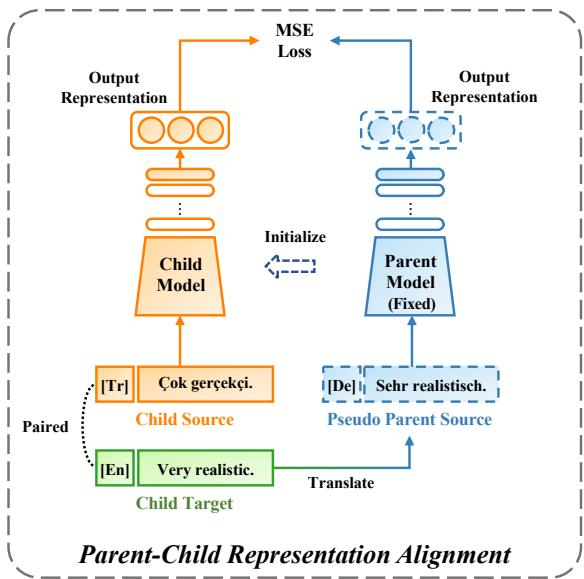
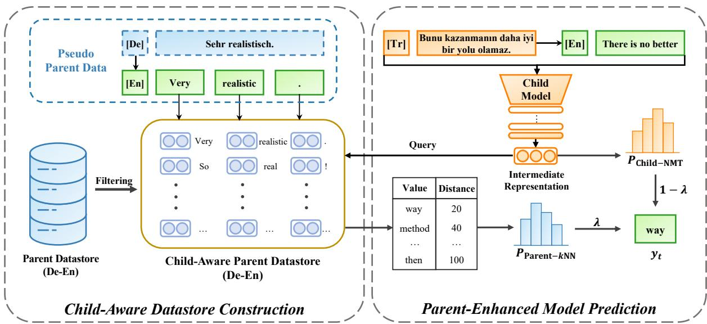
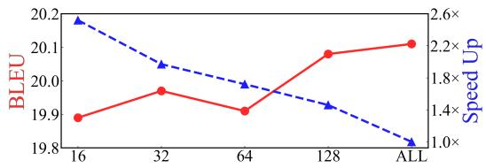
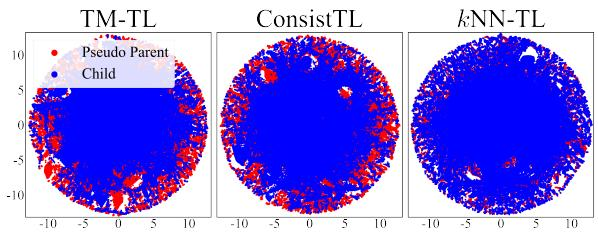
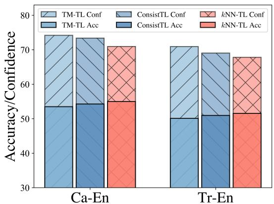

# kNN-TL: k-Nearest-Neighbor Transfer Learning for Low-Resource Neural Machine Translation

Shudong Liu1 Xuebo Liu2∗ Derek F. Wong1∗ Zhaocong Li1 Wenxiang Jiao Lidia S. Chao1 Min Zhang2

1NLP2CT Lab, Department of Computer and Information Science, University of Macau 2Institute of Computing and Intelligence, Harbin Institute of Technology, Shenzhen, China nlp2ct.{shudong,zhaocong}@gmail.com, {liuxuebo,zhangmin2021}@hit.edu.cn {derekfw,lidiasc}@um.edu.mo, wenxiangjiaonju@gmail.com

## Abstract

Transfer learning has been shown to be an effective technique for enhancing the performance of low-resource neural machine translation (NMT). This is typically achieved through either fine-tuning a child model with a pretrained parent model, or by utilizing the output of the parent model during the training of the child model. However, these methods do not make use of the parent knowledge during the child inference, which may limit the translation performance. In this paper, we propose a k-Nearest-Neighbor Transfer Learning (kNN-TL) approach for low-resource NMT, which leverages the parent knowledge throughout the entire developing process of the child model. Our approach includes a parent-child representation alignment method, which ensures consistency in the output representations between the two models, and a child-aware datastore construction method that improves inference efficiency by selectively distilling the parent datastore based on relevance to the child model. Experimental results on four lowresource translation tasks show that kNN-TL outperforms strong baselines. Extensive analyses further demonstrate the effectiveness of our approach. Code and scripts are freely available at https://github.com/NLP2CT/kNN-TL.

## 1 Introduction

Although deep learning has significantly advanced the field of neural machine translation (NMT, Bahdanau et al., 2015; Vaswani et al., 2017; Liu et al., 2019, 2020), the standard training procedure of NMT is not well-suited for languages with only a small amount of bilingual data, leading to challenges in developing NMT models for low-resource languages (Zhan et al., 2021; Wang et al., 2022d). To overcome this limitation, transfer learning has been proposed as an effective method to enhance low-resource NMT through the parent-child framework. This framework transfers knowledge from a high-resource parent model to a low-resource child model (Zoph et al., 2016).

<table><tr><td>Method</td><td>Init.</td><td>Training</td><td>Inference</td></tr><tr><td>Vanilla TL</td><td>L</td><td>X</td><td>X</td></tr><tr><td>ConsistTL</td><td>J</td><td>√</td><td>X</td></tr><tr><td>kNN-TL</td><td>L</td><td>L</td><td>√</td></tr></table>

Table 1: Comparison of three transfer learning frameworks for exploiting of parent knowledge throughout the developing process of a child model. “Init.” denotes the initialization stage of the child model. Our proposed kNN-TL framework incorporates the use of parent knowledge throughout the entire process.

Previous works in transfer learning, such as Kim et al. (2019a) and Aji et al. (2020), have aimed to address the problem of vocabulary mismatch for more effective knowledge transfer. These works, referred to as Vanilla TL, primarily focus on transferring knowledge during the initialization stage of the child model and do not consider other stages of the development of the child model. Recently, Li et al. (2022) propose a novel transfer learning method, namely ConsistTL, which models consistency between the parent model and the child model to facilitate the continual transfer of knowledge from the parent model during the child training. While ConsistTL considers both the initialization and training stages of the child model, it does not address the inference stage, which may limit the overall transferability of knowledge from the parent model. The effective utilization of parent knowledge during the inference stage is an intuitive strategy to improve the performance of low-resource child models.

This paper presents a novel k-nearest-neighbor transfer learning (kNN-TL) method for lowresource NMT. The proposed method aims to fully utilize the knowledge from the parent model to provide more comprehensive guidance throughout the entire development process of the child model, as shown in Table 1. To achieve this, kNN-TL aligns the parent and child representations during the child training to ensure the retrieval of relevant and useful knowledge from the parent datastore during the child inference. Additionally, to accelerate inference, kNN-TL selectively distills relevant knowledge from the parent datastore to construct a child-aware datastore. At each step of the model prediction, kNN-TL considers both the probability distributions retrieved from the parent datastore and predicted by the child NMT model. Experimental results on four low-resource translation tasks, guided by two high-resource parent models, confirm the effectiveness and efficiency of the proposed kNN-TL method. Further analysis reveals that kNN-TL can effectively align the representations of the parent and child models, providing a reasonable explanation for the performance improvement. Our main contributions are as follows:

• We propose kNN-TL to transfer knowledge from the parent model throughout the entire developing process of the child model, including the initialization, training, and inference.

• We propose a child-aware datastore construction method by selectively distilling the parent datastore, which improves inference speed while maintaining comparable performance.

• Experimental results demonstrate that kNN-TL can achieve non-trivial improvements over strong transfer learning methods on four lowresource translation tasks, as measured by widely-used automatic evaluation metrics.

## 2 Background

## 2.1 Transfer Learning for NMT

The parent-child framework has been widely used in previous studies (Zoph et al., 2016; Kim et al., 2019b; Aji et al., 2020) to conduct transfer learning, which transfers the knowledge of a high-resource NMT model (i.e., parent) to a low-resource NMT model (i.e., child). Generally, the framework involves the following two steps.

Parameter Initialization The first step is to initialize the child model by the parent model:

$$
\theta ^ { c } = R ( \theta ^ { p } ) ,\tag{1}
$$

where $\theta ^ { p }$ is the pre-trained parameters of the parent model, $\theta ^ { c }$ is the parameters of the child model, and

R denotes the initialization strategy. Part or all of the parent parameters can be used for initialization.

Fine-tuning The second step is to train the child model on the low-resource child data $( \pmb { x } ^ { c } , \pmb { y } ^ { c } ) \in$ $( \mathcal { X } ^ { c } , \mathcal { Y } ^ { c } )$ , starting from the pre-initialized parameters. The child model is optimized by minimizing the cross-entropy (CE) loss function:

$$
\mathcal { L } _ { \mathrm { C E } } = - \sum _ { t = 1 } ^ { T } \log ( p ( y _ { t } ^ { c } | \boldsymbol { x } ^ { c } , \boldsymbol { y } _ { < t } ^ { c } , \boldsymbol { \theta } ^ { c } ) ) ,\tag{2}
$$

where T denotes the length of the target sentence.

## 2.2 kNN-MT

To incorporate the knowledge of the parent model into the inference phase, we borrow ideas from the k-nearest-neighbor machine translation (kNN-MT, Khandelwal et al., 2021) which has been shown to be effective in improving domain-specific translation tasks. kNN-MT is a retrieval-augmented text generation paradigm that assists the pretrained NMT model by retrieving the k nearest neighbors from a large-scale datastore for relevant knowledge in the decoding stage. Formally, kNN-MT mainly includes the following two stages.

Datastore Building The datastore is the core component of kNN-MT that stores the knowledge of a pretrained NMT model explicitly through keyvalue pairs, where the key is the output representation at each time step and the value is the corresponding gold target token. Given the training data $( \mathcal { X } , \mathcal { Y } )$ , the datastore is constructed over all the sentence pairs $( { \pmb x } , { \pmb y } )$ as follows:

$$
( \mathcal K , \mathcal V ) = \bigcup _ { ( \pmb { x } , \pmb { y } ) \in ( \mathcal X , \mathcal Y ) } \left\{ \left( f \left( \pmb { x } , \pmb { y } _ { < t } \right) , y _ { t } \right) , \forall \pmb { y } _ { t } \in \pmb { y } \right\} ,\tag{3}
$$

where $f \left( { \pmb x } , { \pmb y } _ { < t } \right)$ is output representation of the NMT model at t step, and $y _ { t }$ is the gold target token. It is worth noting that the size of the datastore is proportional to the number of tokens in the target sentences, which could be very large.

Inference with Retrieval In kNN-MT, the NMT model generates two probability distributions for prediction during inference, namely, the one by the output representation $( \mathrm { i } . \mathrm { e } . , p _ { \mathrm { N M T } } )$ and the extra one by the retrieved representation from the datastore $( \mathrm { i } . \mathrm { e } . , p _ { k \mathrm { N N } } )$ . Specifically, at each inference step t, the output representation $f \left( { \pmb x } , { \pmb y } _ { < t } \right)$ is used to query the datastore and obtain the k nearest neighbors as $\mathcal { N } _ { t } ^ { k } = \{ ( \mathbf { k } _ { j } , v _ { j } ) , j \in \{ 1 , 2 , \dots , k \} \}$ Then, the retrieval distribution can be computed as:

$$
\begin{array} { r l } {  { p _ { k \mathrm { N N } } ( y _ { t } | \pmb { x } , \pmb { y } _ { < t } ) \propto } } \\ & { \sum _ { j = 1 } ^ { k } \mathbb { 1 } _ { y _ { t } = v _ { j } } \exp ( - d ( \mathbf { k } _ { j } , f ( \pmb { x } , \pmb { y } _ { < t } ) ) / \tau ) , } \end{array}\tag{4}
$$

where $\tau$ is the softmax temperature and $d ( \cdot , \cdot )$ is the $l _ { 2 }$ distance function.

The final probability distribution for predicting the next token $y _ { t }$ is the interpolation of the two distributions with a tuned parameter λ:

$$
\begin{array} { r } { p \left( { y } _ { t } | \pmb { x } , { \pmb y } _ { < t } \right) = \lambda p _ { k \mathrm { N N } } \left( { y } _ { t } | \pmb { x } , { \pmb y } _ { < t } \right) \qquad } \\ { + \left( 1 - \lambda \right) p _ { \mathrm { N M T } } \left( { y } _ { t } | \pmb { x } , { \pmb y } _ { < t } \right) . } \end{array}\tag{5}
$$

The retrieval distribution refines the original NMT distribution with external knowledge, which improves the prediction accuracy.

## 3 kNN-TL

This section introduces the kNN-TL method in detail. It begins by clarifying the motivation for the work by comparing kNN-TL to previous methods. The training process of kNN-TL is then presented with a specific focus on the parent-child representation alignment component for subsequent kNN retrieval. After that, the steps for building a childaware datastore to improve inference speed are described. Finally, the method of incorporating knowledge from the parent datastore to guide the child model during inference is presented.

## 3.1 Motivation

We aim at exploiting the knowledge of the parent model throughout the whole development process of the child model based on the parent-child framework, which has not been accomplished in previous methods. As shown in Table 1, vanilla transfer learning (Kim et al., 2019a; Aji et al., 2020) initializes the child model by the optimized parameters of the parent model, and then continues the training of the child model on the low-resource translation dataset. Recent studies, such as ConsistTL (Li et al., 2022), have found that incorporating knowledge of the high-resource parent models to provide continuous guidance for the child models during training can significantly improve the performance of low-resource translation tasks. However, these studies ignore the high-resource parent models in inference, which does not make full use of the parent model and potentially limits the translation performance. Therefore, we propose kNN-TL to fully exploit the high-resource parent models at initialization, training and inference process.

  
Figure 1: The training framework of kNN-TL.

## 3.2 Parent-Child Representation Alignment

Due to the discrepancy in feature representations between the child model and the parent model, building the datastore solely from the parent data may not provide sufficient and relevant knowledge, leading to poor performance of the child model. To address this issue, we propose to align the representations of the child and parent models.

Pseudo Parent Data Construction In order to align the feature representations of the parent and child models, we generate a set of paired samples. We adopt the approach proposed by Li et al. (2022) to generate pseudo parent source sentences for the entire child data. Specifically, for each instance $( { \pmb x } ^ { c } , { \pmb y } ^ { c } ) \ \in \ ( { \pmb x } ^ { c } , { \pmb y } ^ { c } )$ , we use a well-trained reversed parent model to back-translate the target sentence $\pmb { y } ^ { c }$ to a pseudo parent source sentence $\tilde { \pmb { x } } ^ { p }$ and obtain the pseudo parent data $( \tilde { \pmb { x } } ^ { p } , \pmb { y } ^ { c } ) \in ( \tilde { \pmb { \chi } } ^ { p } , \pmb { \chi } ^ { c } )$

Representation-based Consistency Learning In ConsistTL and other consistency learning methods (Wang et al., 2022d; Li et al., 2023), the consistency between the parent and child models is encouraged over the probability distributions, but this approach does not impose strong constraints on the feature representations. To address this issue, we propose to utilize the child data and the pseudo parent data to learn consistent output representations for the same target sentences. Specifically, for each instance of the pseudo parent data $( \tilde { \pmb { x } } ^ { p } , \pmb { y } ^ { c } ) \in ( \tilde { \pmb { \chi } } ^ { p } , \pmb { \chi } ^ { c } )$ , the parent model generates the output representation as $f _ { \theta ^ { p } } \left( \tilde { \pmb { x } } ^ { p } , \pmb { y } _ { < t } ^ { c } \right)$ for every target token $\pmb { y } _ { t } ^ { c }$ , while the child model generates the output representation as $f _ { \theta ^ { c } } \left( \boldsymbol { x } ^ { c } , \boldsymbol { y } _ { < t } ^ { c } \right)$ for the same target token. Then we minimize the squared Euclidean distance of these two output representations with the MSE loss:

  
Figure 2: The inference framework of kNN-TL.

$$
\mathcal { L } _ { \mathrm { M S E } } = \sum _ { t = 1 } ^ { T } \Vert f _ { \theta ^ { p } } \left( \tilde { { \pmb x } } ^ { p } , { \pmb y } _ { < t } ^ { c } \right) - f _ { \theta ^ { c } } \left( { \pmb x } ^ { c } , { \pmb y } _ { < t } ^ { c } \right) \Vert ^ { 2 } ,\tag{6}
$$

where $\theta ^ { p }$ and $\theta ^ { c }$ represent the parameters of the parent and child models, respectively. The final loss is a combination of the CE loss and the MSE loss, with a balancing hyper-parameter α:

$$
\begin{array} { r } { \mathcal { L } = \mathcal { L } _ { \mathrm { C E } } + \alpha \mathcal { L } _ { \mathrm { M S E } } . } \end{array}\tag{7}
$$

## 3.3 Child-Aware Datastore Construction

The aim of kNN-TL is to improve the performance of the child model by utilizing relevant knowledge from the parent data. However, using a large amount of parent data leads to a large datastore that can slow down the retrieval speed during inference. To address this issue, we propose a method to selectively prune the high-resource parent datastore by pre-retrieving relevant entries using the pseudo parent data. Specifically, we first utilize the welltrained parent model to forward pass the parent data $( \mathcal { X } ^ { p } , \mathcal { Y } ^ { p } )$ and obtain the intermediate representation $f _ { \theta ^ { p } } \left( \tilde { \pmb { x } } ^ { p } ; \pmb { y } _ { < t } ^ { c } \right)$ to construct a large parent datastore as Eq.(3). For each instance of the pseudo parent data $( \tilde { \boldsymbol { x } } ^ { p } , \boldsymbol { y } ^ { c } )$ , we use the parent model to forward pass it and conduct kNN retrieval from the large parent datastore with a large value of ¯k. The obtained ¯k nearest neighbors is expressed as:

$$
\begin{array} { r } { \mathcal { N } _ { \pmb { y } ^ { c } } = \left\{ \left( \mathbf { k } _ { j } , v _ { j } \right) , j \in \{ 1 , 2 , \dots , \bar { k } \} , \forall \pmb { y } _ { t } ^ { c } \in \pmb { y } ^ { c } \right\} . } \end{array}\tag{8}
$$

As the pseudo parent data is semantically equivalent to the child data, the pre-retrieved subset will include entries that are more relevant to the child data. Besides, our method only needs to retrieve through the parent datastore, rather than accessing the parent data which may not be available in industrial applications. Finally, we merge all retrieved entries to build the child-aware parent datastore:

$$
( \mathcal { K } , \mathcal { V } ) = \left\{ \mathcal { N } _ { \pmb { y } ^ { c } } , \forall ( \tilde { \pmb { x } } ^ { p } , \pmb { y } ^ { c } ) \in ( \tilde { \pmb { \chi } } ^ { p } , \mathcal { V } ^ { c } ) \right\} .\tag{9}
$$

## 3.4 Parent-Enhanced Model Prediction

During inference, the child model generates the intermediate representation $f _ { \theta ^ { c } } \left( \boldsymbol { x } ^ { c } ; \boldsymbol { y } _ { < t } ^ { c } \right)$ to query from the child-aware parent datastore. The retrieval distribution from the child-aware parent datastore can be computed as:

$$
\begin{array} { r l } & { p _ { \mathrm { p a r e n t - } k \mathrm { N N } } \left( y _ { t } ^ { c } | \pmb { x } ^ { c } , \pmb { y } _ { < t } ^ { c } \right) \propto } \\ & { \displaystyle \sum _ { j = 1 } ^ { k } \mathbb { 1 } _ { \pmb { y } _ { t } ^ { c } = \pmb { v } _ { j } } \exp \left( - d \left( \mathbf { k } _ { j } , f \left( \pmb { x } ^ { c } , \pmb { y } _ { < t } ^ { c } \right) \right) / \tau \right) . } \end{array}\tag{10}
$$

The final probability distribution for predicting the next token $y _ { t }$ is the interpolation of the child NMT distribution and the retrieval distribu-

tion weighted by the hyper-parameter λ:

$$
\begin{array} { r l } & { p \left( y _ { t } ^ { c } | \pmb { x } ^ { c } , \pmb { y } _ { < t } ^ { c } \right) = \lambda p _ { \mathrm { p a r e n t - } k \mathrm { N N } } \left( y _ { t } ^ { c } | \pmb { x } ^ { c } , \pmb { y } _ { < t } ^ { c } \right) } \\ & { ~ + \left( 1 - \lambda \right) p _ { \mathrm { c h i l d - N M T } } \left( y _ { t } ^ { c } | \pmb { x } ^ { c } , \pmb { y } _ { < t } ^ { c } \right) . } \end{array}\tag{11}
$$

Different from vanilla kNN-MT that generates the two distributions from a same NMT model, kNN-TL makes use of the parent model rather than the child model to build high-quality datastore, which will generate a more accurate retrieval distribution, and thus better translation performance.

## 4 Experiments

## 4.1 Setup

Parent Language Pairs Our method is independently evaluated using German-English (De-En) and French-English (Fr-En) as the parent language pairs in our experiments. For De-En task, we follow the dataset settings of Li et al. (2022) to train on WMT17 De-En and validate on newstest2013. The training set consists of 5.8M sentences. For Fr-En task, we train on WMT14 Fr-En dataset and validate on newstest2013. we follow the data process of $f a i r s e q ^ { 1 }$ and also randomly select 5.8M samples as the training set. The vocabularies are learned using the joint source-target BPE with 40K merge operations (Sennrich et al., 2016b).

Child Language Pairs We conduct experiments on four low-resource translation benchmarks. We use three translation benchmarks from Global Voices (Tiedemann, 2012; Khayrallah et al., 2020): Hungarian (Hu-En), Indonesian (Id-En), and Catalan (Ca-En). The subset splits follow Khayrallah et al. (2020). The training set contains 15,176, 8,448, and 7,712 instances respectively. Both the validation set and the test set are 2000 instances. We adopt WMT17 Turkish-English (Tr-En) benchmark as the fourth language pair and use newstest2016 as the validation set. We carry out a series of data processing procedures including normalization, tokenization by Moses (Koehn et al., 2007). To enhance the quality of the Tr-En training data, sentences exceeding 60 words in length and with a length ratio greater than 1.5 are removed. The settings of the joint source-target BPE to the child language pairs follow Li et al. (2022).

Baselines We mainly compare our method with the following baselines:

• Vanilla NMT (Vaswani et al., 2017) proposes Transformer that significantly improves the performance of NMT. However, its performance is severely limited when applied to the scenario of low-resource machine translation.

• TL (Zoph et al., 2016) is the earliest work on transfer learning, which initializes the child model with copied parameters from the parent model except for the embedding layers of the encoder. For the embedding layers of the encoder, this method initialized it using the embeddings randomized from the parent model. After the initialization stage, the child model is trained on the child data as the usual NMT models.

• TM-TL (Aji et al., 2020) proposes “Token Matching” to conduct transfer learning, which is similar to TL except for the initialization of the embedding layers in the encoder of the child model. For the initialization of the embedding layers, this method assigns the embeddings of common tokens from the parent models to the child model. The embeddings of the rest tokens are initialized as the usual NMT models.

• ConsistTL (Li et al., 2022) enhances the consistency between the predictions of the parent model and the child model during the training stage of the child model. The initialization stage of this method follows TM-TL.

## 4.2 Implementation Details

Training We adopt the fairseq toolkit for model implementation (Ott et al., 2019). We train the parent model for 80K steps with 460K tokens per batch, a dropout rate of 0.1, a peak learning rate of 0.001, and linear warmup steps of 10K. We tie all embedding layers of the parent models. For child models, we tie the input embedding layers of the decoder and the output projection. We also follow the embedding initialization as TM-TL. We train all the child models for 200 epochs with 16K max tokens per batch for Tr-En and 1K for other language pairs. For child training, we set the warm-up steps to 1K, the label smoothing to 0.1 and the dropout rate to 0.3. Both the attention and activation dropout rates are set to 0.1. To prevent overfitting, a lower peak learning rate of 0.0003 is employed. The α is set to 0.01. The Adam (Kingma and Ba, 2015) optimizer is set to $\beta _ { 1 } = 0 . 9 , \beta _ { 2 } = 0 . 9 8$ . We choose the model with the best validation BLEU for testing.

<table><tr><td rowspan="2">Parent</td><td rowspan="2">Model</td><td colspan="3">Id-En</td><td colspan="3">Ca-En</td><td colspan="3">Hu-En</td><td colspan="3">Tr-En</td></tr><tr><td>BLEU</td><td>BR</td><td>BS</td><td>BLEU</td><td>BR</td><td>BS</td><td>BLEU</td><td>BR</td><td>BS</td><td>BLEU</td><td>BR</td><td>BS</td></tr><tr><td>None</td><td>Vanilla</td><td>1.1</td><td>26.6</td><td>13.2</td><td>1.1</td><td>23.1</td><td>15.5</td><td></td><td>0.9 25.7</td><td>0.9</td><td>17.8</td><td>54.0</td><td>51.8</td></tr><tr><td rowspan="4">Fr-En</td><td>TL</td><td>13.4</td><td>47.4</td><td>38.4</td><td>22.2</td><td>55.8</td><td>52.3</td><td>6.0</td><td>40.4</td><td>27.4</td><td>16.9</td><td>57.4</td><td>51.4</td></tr><tr><td>TM-TL</td><td>17.2</td><td>54.5</td><td>47.2</td><td>25.9</td><td>61.2</td><td>59.0</td><td>10.1</td><td>48.1</td><td>38.5</td><td>18.3</td><td>59.0</td><td>53.5</td></tr><tr><td>ConsistTL</td><td>18.8</td><td>56.3</td><td>50.1</td><td>26.8</td><td>62.8</td><td>60.9</td><td>10.9</td><td>50.5</td><td>41.8</td><td>19.2</td><td>60.0</td><td>54.6</td></tr><tr><td>kNN-TL</td><td>19.9</td><td>57.3</td><td>51.6</td><td>28.6</td><td>63.5</td><td>62.1</td><td>11.8</td><td>52.0</td><td>44.0</td><td>19.6</td><td>61.0</td><td>55.8</td></tr><tr><td rowspan="4">De-En</td><td>TL</td><td>13.5</td><td>42.3</td><td>37.7</td><td>21.6</td><td>47.4</td><td>51.8</td><td>5.9</td><td>35.8</td><td>27.4</td><td>17.6</td><td>49.1</td><td>51.9</td></tr><tr><td>TM-TL</td><td>18.6</td><td>55.9</td><td>49.9</td><td>25.3</td><td>60.9</td><td>58.9</td><td>10.6</td><td>50.4</td><td>41.2</td><td>18.6</td><td>59.5</td><td>53.9</td></tr><tr><td>ConsistTL</td><td>19.7</td><td>57.4</td><td>52.2</td><td>26.6</td><td>62.7</td><td>60.0</td><td>11.9</td><td>52.0</td><td>43.9</td><td>19.3</td><td>60.6</td><td>55.9</td></tr><tr><td>kNN-TL</td><td>20.6</td><td>58.5</td><td>53.2</td><td>27.8</td><td>63.6</td><td>61.6</td><td>13.4</td><td>53.7</td><td>46.0</td><td>20.1</td><td>61.6</td><td>56.9</td></tr></table>

Table 2: Main results on the 4 translation tasks. “BR” represents BLEURT. “BS” represents BERTScore.

Inference We use the $k \mathrm { N N - b o x } ^ { 2 }$ (Zhu et al., 2023) to implement kNN retrieval and the FAISS (Johnson et al., 2021) for efficient search. For the child-aware datastore, we tune the hyper-parameters by performing grid search on $\bar { k } \in \{ 1 6 , 3 2 , 6 4 , 1 2 8 \}$ for the Tr-En and ¯k $\in \{ 2 5 6 , 5 1 2 , 1 0 2 4 , 1 5 3 6 \}$ for the other language pairs. During inference, we empirically perform grid search on $k \in \{ 8 , 1 2 , 1 6 , 2 0 , 2 4 , 2 8 \}$ and λ $\{ 0 . 2 , 0 . 2 5 , 0 . 3 , 0 . 3 5 , 0 . 4 \}$ and $T \in \{ 1 , 1 0 , 3 0 , 5 0$ 2 70, 100 to choose the optimal value. All the selected hyper-parameter values for each model and dataset are based on validation sets. As a reference, the hyper-parameters (k, λ and T) of four language pairs with De-En parent are Id: 28/0.35/10, Ca: 28/0.4/100, Hu: 20/0.4/70, and Tr: 16/0.35/100.

Evaluation We use beam search with a beam width of 5 and a length penalty of 1 for model inference. To fully validate the effectiveness of our proposed method, we use Sacre-BLEU (Post, 2018), BLEURT (Sellam et al., 2020) and BERTScore (Zhang et al., 2020) to evaluate the generation quality.

## 4.3 Main Results

Table 2 reports the results on the four low-resource tasks. The results of transfer learning could be divided into two parts according to the usage of the parent language pair. When using De-En as the parent, our method kNN-TL achieves the best performance consistently on all child language pairs in all metrics. Compared with the strong baseline TM-TL that uses the same initialization strategy, kNN-TL achieves large improvements. Moreover, we observe that kNN-TL could still outperform the strongest baseline ConsistTL with significant gains. Similar observations can be drawn when we switch the parent to Fr-En, which indicates that kNN-TL brings consistent improvements across different parent language pairs. In summary, the experimental results demonstrate the superiority of our proposed kNN-TL method, as it conducts more comprehensive transfer learning.

<table><tr><td>LCE</td><td>LJS</td><td>LMSE</td><td>Ca-En</td><td>Tr-En</td></tr><tr><td>√</td><td>x</td><td>x</td><td>25.4</td><td>18.4</td></tr><tr><td>√</td><td>√ X</td><td>x</td><td>26.8 27.8</td><td>19.1 20.1</td></tr></table>

Table 3: Effect of loss type for kNN-TL.

## 5 Analysis

In this section, we conduct extensive analyses to demonstrate the effectiveness of each component in kNN-TL. By default, we choose Ca-En and Tr-En for the child model with the De-En parent model.

Loss for Imposing Consistency Constraints We investigate the effectiveness of MSE that imposes constraints on the output representation, compared with JS loss that encourages consistency over probability distributions. Table 3 demonstrates the impact of learning a consistent representation of translation context on kNN retrieval. Without consistency constraints, the model performs worst on kNN retrieval. When using JS loss, the utilization of kNN retrieval lead to moderate improvements. In contrast, the performance of the kNN retrieval is significantly enhanced using MSE loss. These observations reveal the necessity of learning consistent representations for kNN-TL.

<table><tr><td>Train Type</td><td>Infer Type</td><td>Ca-En</td><td>Tr-En</td></tr><tr><td>Intermediate</td><td>Output</td><td>26.8</td><td>19.5</td></tr><tr><td>Intermediate</td><td>Intermediate</td><td>27.3</td><td>19.5</td></tr><tr><td>Output</td><td>Output</td><td>27.3</td><td>19.9</td></tr><tr><td>Output</td><td>Intermediate</td><td>27.8</td><td>20.1</td></tr></table>

Table 4: Effect of representation type.
<table><tr><td>Datastore Type</td><td>Ca-En</td><td>Tr-En</td></tr><tr><td>N/A</td><td>26.5</td><td>19.5</td></tr><tr><td>Child-Only</td><td>26.8</td><td>19.6</td></tr><tr><td>Child-Aware Parent</td><td>27.8</td><td>20.1</td></tr></table>

Table 5: Effect of the datastore type. N/A refers to kNN-TL with only the parent-child representation alignment.

Representation Type for Training and Inference We conduct an empirical study to investigate the impact of representation type for training (consistency learning) and inference (retrieval) respectively. Output and Intermediate respectively represent the output representation and the representation of feed-forward input of the last decoder layer follow Khandelwal et al. (2021). Table 4 lists all the setups and corresponding results. We can observe that utilizing output representation for the training stage while intermediate representation for the inference stages yields the optimal performance. We leave further investigation of the representation type for training and inference as our future work.

Importance of Parent Datastore To verify the importance of the parent datastore in kNN-TL, we compare the parent datastore with the child datastore and the pure NMT model. Table 5 compares the results caused by the pure NMT model and different datastores. Compared with the pure NMT model, the child datastore achieves weak improvements with an average increase of only 0.2 BLEU. This shows that for the low-resource child data, the child model can already learn most of the knowledge in the data well. In contrast to the child datastore, the model is significantly improved with an increase of 1.3 and 0.6 BLEU when using the childaware parent datastore. These findings demonstrate that for low-resource NMT models, fully leveraging the knowledge from high-resource parents is a more effective means of improvement.

Inference Speed-up by Child-Aware Datastore To investigate the impact of the child-aware datastore construction, we analyze the performance of the original parent datastore and child-aware datastore in terms of BLEU and inference speed, as shown in Table 6. The experimental results show that the implementation of the child-aware datastore leads to an improvement in inference speed, with a 1.5 and 1.7-fold increase observed in two language pairs. This enhancement in speed is achieved while maintaining a comparable performance of using the whole parent datastore. Nonetheless, the decoding speed of kNN-TL remains three times lower than conventional NMT models, which can be mitigated by utilizing other accelerated methods of kNN-based retrieval.

<table><tr><td rowspan="2">Datastore Type</td><td colspan="2">Ca-En</td><td colspan="2">Tr-En</td></tr><tr><td>BLEU</td><td>SpdUp</td><td>BLEU</td><td>SpdUp</td></tr><tr><td>Original Parent</td><td>27.9</td><td>×1.0</td><td>20.1</td><td>×1.0</td></tr><tr><td>Child-Aware Parent</td><td>27.8</td><td>×1.7</td><td>20.1</td><td>×1.5</td></tr></table>

Table 6: Effect of child-aware datastore construction.

  
Figure 3: Translation quality v.s. inference speed-up of the child-aware datastore construction by different ¯k.

We also analyze the quality-speed trade-off on the Tr-En language pair using the child-aware datastore in Figure 3. The horizontal axis in the figure represents the different values of ¯k used and “ALL” (original parent datastore). It can be observed that as the pre-retrieval ¯k value decreases, there is a corresponding increase in inference speed. When the ¯k is set to 16 (resulting in a reduction of the datastore to less than 30%), the model exhibits a 2.6 times increase in inference speed with a degradation of 0.2 BLEU. The results illustrate that our proposed method can effectively balance the tradeoff between inference speed and performance.

Visualization of Representation Alignment In order to verify the consistency of the intermediate representation of child and parent models, we visualize the representation of the child model and parent model on the target side of the child data. Figure 4 shows intermediate representations generated by the De-En parent model and different Ca-En child models respectively. We can see that there exists a significant discrepancy in the representation of the parent and child model of the

  
Figure 4: Intermediate representations of different transfer learning methods after T-SNE dimensionality reduction. The blue and red points are representations of child and pseudo parent data respectively.

<table><tr><td>Model</td><td>w/o BT</td><td>w/BT</td></tr><tr><td>TM-TL</td><td>18.6</td><td>21.6</td></tr><tr><td>ConsistTL</td><td>19.3</td><td>22.3</td></tr><tr><td>kNN-TL</td><td>20.1</td><td>22.8</td></tr></table>

Table 7: Effect of combining with back-translation.

TM-TL. ConsistTL slightly brings the two representations closer but still remains a notable discrepancy. Compared to the previous two models, the representations of the parent model and child model of kNN-TL are highly similar, indicating the effectiveness of our parent-child representation alignment method during training. The utilization of consistency learning via the output distribution serves as an effective constraint on the intermediate distribution. Simultaneously, this provides a sound justification for the ability of the kNN-TL method to effectively retrieve knowledge across parent and child models. In conjunction with the results presented in Table 3, we can conclude that proper alignment of the intermediate representation can optimize the performance of the child model through effective knowledge retrieval.

Effect of Back-translation Back-translation (BT, Sennrich et al., 2016a) is a frequently employed technique in contemporary NMT systems, particularly for low-resource language pairs that suffer from a scarcity of parallel data. To verify the complementarity of our method with BT, we conduct a performance analysis on augmented training data, obtained through BT from News Crawl 2015 English monolingual data. We adopted the experiment settings of Li et al. (2022) to sample 200k English monolingual data at a ratio of approximately 1:1. Table 7 displays the Tr-En results of kNN-TL and baseline methods. By incorporating supplementary back-translated data, kNN-TL can achieve an improvement of 2.7 BLEU and also outperforms the baseline transfer learning methods. These findings demonstrate the generality of kNN-TL and its complementarity with BT, which facilitates the integration into practical NMT systems with other mainstream approaches.

  
Figure 5: Prediction confidence and accuracy of different transfer learning methods. The higher striped bars represent confidence, while the lower pure color bars represent accuracy. Smaller gaps denote better model calibration.

Model Calibration While ConsistTL (Li et al., 2022) uses the prediction distribution of the parent model, we further incorporate the probability distribution retrieved from the parent datastore during inference. In order to investigate the impact of kNN distribution on inference calibration, we analyze the gap between the confidence and accuracy of the model.3 The smaller gap between the prediction probability (i.e., confidence) and the correctness of generated tokens (i.e., accuracy) indicated better calibration performance (Wang et al., 2020). Figure 5 shows the averaged confidence and accuracy of different methods. Compared with baseline methods, kNN-TL effectively reduces the over-confidence of the model while improving the accuracy. Specifically, kNN-TL exhibits a significant improvement in the model’s calibration performance as it produces a decrease in the gap of 3.1 and 1.8 for the two language pairs, respectively. According to the prior work (Yang et al., 2022), the knowledge of kNN retrieval can prevent the over-confidence of the model on the one-hot labeling, ultimately resulting in elevated generalizability for inference. kNN-TL incorporates the distribution and knowledge from diverse perspectives, thus leading to a more comprehensive transfer learning framework for low-resource NMT.

## 6 Related Works

## 6.1 Transfer Learning for NMT

Transfer learning is an efficient method to boost low-resource NMT models based on the parentchild framework (Wang et al., 2021a; Zoph et al., 2016; Liu et al., 2021a,b), which transfers knowledge from the high-resource parent model to the low-resource child model. Recent works propose to cope with the vocabulary between the parent model and the child model for the initialization of the child model, including using extra transformation (Kim et al., 2019a) and transfer partial embeddings from the parent model (Aji et al., 2020). These works mainly focus on the initialization stage of the child model. ConsistTL revisits the relationship between the parent and child models and proposes to receive continual guidance from the parent model during the child training (Li et al., 2022).

However, the above works still ignore the continual transfer from the parent model during the child inference. To this end, inspired by the kNN mechanism (Khandelwal et al., 2020; He et al., 2021), this paper proposes to conduct cross-model transfer from the parent model throughout the developing process of a child model, which includes the stages of initialization, training and inference.

## 6.2 k-Nearest-Neighbor Retrieval

Recently, non-parametric retrieval-augmented methods have promoted the progress of many fields of NLP, including language modeling (Khandelwal et al., 2020; He et al., 2021), NMT (Khandelwal et al., 2021; Zheng et al., 2021a), named entity recognition (Wang et al., 2022c), question answering (Kassner and Schütze, 2020; Xiong et al., 2021), text classification (Su et al., 2022) and so on. For NMT, A series of approaches incorporate the external knowledge into NMT systems through kNN retrieval from the datastore built with the training data. Some works improve the performance by dynamically adjusting the ratio λ between NMT and kNN (Zheng et al., 2021a; Jiang et al., 2021). Some researchers improve the efficiency of kNN-MT retrieval by pruning the datastore (Wang et al., 2022a), dynamically constructing the datastore (Meng et al., 2022; Wang et al., 2021b; Dai et al., 2023), and reducing the number of steps to be retrieved (Martins et al., 2022a,b). kNN-MT is also applied to various sub-areas of MT, including domain adaptation in MT (Khandelwal et al., 2021; Zheng et al., 2021b), interactive

MT (Wang et al., 2022b), domain adaptation in speech translation (Du et al., 2022), and so on.

It is important to note that when constructing a datastore utilizing a low-resource NMT model, the interpolation of kNN retrieval methodologies may not result in a significant enhancement in performance. In this paper, we propose an extension of the kNN retrieval method to transfer learning, which allows child models to acquire knowledge from a well-trained parent model, instead of relying solely on their limited internal datastores. This enhances the capability of the child models to perform accurate retrieval in low-resource settings.

## 7 Conclusion and Future Works

In this paper, we propose kNN-TL to transfer knowledge from the parent throughout the entire developing process of child models. kNN-TL aligns the output representations of parent and child during training, allowing for efficient retrieval of useful knowledge from the parent datastore. In addition, kNN-MT builds a child-aware datastore by selectively distilling relevant entries of the largescale parent datastore, thereby improving the inference efficiency. Experimental results on four low-resource NMT benchmarks show a continuous improvement over the other powerful transfer learning methods for NMT. Further analysis reveals the effectiveness and importance to align the output representations for better model improvement. Future works include:1) integrating parent datastores from different high-resource language pairs to improve the performance of the child model, and 2) analyzing the transferability of the parent model through the child-aware datastore construction.

## Limitation

In comparison to other transfer learning methods of NMT, kNN-TL incurs extra time costs and more processes to transfer knowledge from the parent model. This is a result of the requirement to construct a high-resource datastore utilizing large-scale parent data and retrieve it. On the other hand, kNN-TL requires a substantial amount of storage capacity due to the storage of a datastore containing millions of entries. We employ the output representation layer for the alignment and the intermediate representation layer for the retrieval. This method justification is mainly supported by the results of model validation (Table 4), which might deserve further investigation.

## Acknowledgments

This work was supported in part by the Science and Technology Development Fund, Macau SAR (Grant Nos. FDCT/060/2022/AFJ, FDCT/0070/2022/AMJ), the National Natural Science Foundation of China (Grant No. 62206076), the Research Program of Guangdong Province (Grant No. 2220004002576), Shenzhen College Stability Support Plan (Grant Nos. GXWD20220811173340003, GXWD20220817123150002), Shenzhen Science and Technology Program (Grant No. RCBS20221008093121053) and the Multi-year Research Grant from the University of Macau (Grant No. MYRG2020-00054-FST). This work was performed in part at SICC which is supported by SKL-IOTSC, and HPCC supported by ICTO of the University of Macau. We would like to thank the anonymous reviewers and meta-reviewer for their insightful suggestions.

## References

Alham Fikri Aji, Nikolay Bogoychev, Kenneth Heafield, and Rico Sennrich. 2020. In neural machine translation, what does transfer learning transfer? In Proceedings of the 58th Annual Meeting of the Associationfor Computational Linguistics, pages 7701– 7710, Online. Association for Computational Linguistics.

Dzmitry Bahdanau, Kyunghyun Cho, and Yoshua Bengio. 2015. Neural machine translation by jointly learning to align and translate. In 3rd International Conference on Learning Representations, ICLR 2015, San Diego, CA, USA, May 7-9, 2015, Conference Track Proceedings.

Yuhan Dai, Zhirui Zhang, Qiuzhi Liu, Qu Cui, Weihua Li, Yichao Du, and Tong Xu. 2023. Simple and scalable nearest neighbor machine translation. In 11th International Conference on Learning Representations, ICLR 2023, Kigali, Rwanda, May 1-5, 2023. OpenReview.net.

Yichao Du, Weizhi Wang, Zhirui Zhang, Boxing Chen, Tong Xu, Jun Xie, and Enhong Chen. 2022. Nonparametric domain adaptation for end-to-end speech translation. In Proceedings ofthe 2022 Conference on Empirical Methods in Natural Language Processing, page 306–320, Abu Dhabi, United Arab Emirates. Association for Computational Linguistics.

Junxian He, Graham Neubig, and Taylor Berg-Kirkpatrick. 2021. Efficient Nearest Neighbor Language Models. In Proceedings ofthe 2021 Conference on Empirical Methods in Natural Language Processing, pages 5703–5714, Online and Punta Cana,

Dominican Republic. Association for Computational Linguistics.

Qingnan Jiang, Mingxuan Wang, Jun Cao, Shanbo Cheng, Shujian Huang, and Lei Li. 2021. Learning Kernel-Smoothed Machine Translation with Retrieved Examples. In Proceedings ofthe 2021 Conference on Empirical Methods in Natural Language Processing, pages 7280–7290, Online and Punta Cana, Dominican Republic. Association for Computational Linguistics.

Jeff Johnson, Matthijs Douze, and Hervé Jégou. 2021. Billion-scale similarity search with gpus. IEEE Trans. Big Data, 7(3):535–547.

Nora Kassner and Hinrich Schütze. 2020. BERT-kNN: Adding a kNN search component to pretrained language models for better QA. In Findings of the Association for Computational Linguistics: EMNLP 2020, pages 3424–3430, Online. Association for Computational Linguistics.

Urvashi Khandelwal, Angela Fan, Dan Jurafsky, Luke Zettlemoyer, and Mike Lewis. 2021. Nearest neighbor machine translation. In 9th International Conference on Learning Representations, ICLR 2021, Virtual Event, Austria, May 3-7, 2021. OpenReview.net.

Urvashi Khandelwal, Omer Levy, Dan Jurafsky, Luke Zettlemoyer, and Mike Lewis. 2020. Generalization through memorization: Nearest neighbor language models. In 8th International Conference on Learning Representations, ICLR 2020, Addis Ababa, Ethiopia, April 26-30, 2020. OpenReview.net.

Huda Khayrallah, Brian Thompson, Matt Post, and Philipp Koehn. 2020. Simulated multiple reference training improves low-resource machine translation. In Proceedings of the 2020 Conference on Empirical Methods in Natural Language Processing (EMNLP), pages 82–89, Online. Association for Computational Linguistics.

Yunsu Kim, Yingbo Gao, and Hermann Ney. 2019a. Effective cross-lingual transfer of neural machine translation models without shared vocabularies. In Proceedings ofthe 57th Annual Meeting ofthe Associationfor Computational Linguistics, pages 1246– 1257, Florence, Italy. Association for Computational Linguistics.

Yunsu Kim, Yingbo Gao, and Hermann Ney. 2019b. Effective cross-lingual transfer of neural machine translation models without shared vocabularies. In Proceedings of the 57th Annual Meeting of the Associationfor Computational Linguistics, pages 1246– 1257, Florence, Italy. Association for Computational Linguistics.

Diederik P. Kingma and Jimmy Ba. 2015. Adam: A method for stochastic optimization. In 3rd International Conference on Learning Representations, ICLR 2015, San Diego, CA, USA, May 7-9, 2015, Conference Track Proceedings.

Philipp Koehn, Hieu Hoang, Alexandra Birch, Chris Callison-Burch, Marcello Federico, Nicola Bertoldi, Brooke Cowan, Wade Shen, Christine Moran, Richard Zens, Chris Dyer, Ondˇrej Bojar, Alexandra Constantin, and Evan Herbst. 2007. Moses: Open source toolkit for statistical machine translation. In Proceedings of the 45th Annual Meeting of the Associationfor Computational Linguistics Companion Volume Proceedings ofthe Demo and Poster Sessions, pages 177–180, Prague, Czech Republic. Association for Computational Linguistics.

Yinghao Li, Xuebo Liu, Shuo Wang, Peiyuan Gong, Derek F. Wong, Yang Gao, Heyan Huang, and Min Zhang. 2023. Templategec: Improving grammatical error correction with detection template. In Proceedings ofthe 61st Annual Meeting ofthe Associationfor Computational Linguistics (Volume 1: Long Papers), Toronto, Canada. Association for Computational Linguistics.

Zhaocong Li, Xuebo Liu, Derek F. Wong, Lidia S. Chao, and Min Zhang. 2022. Consisttl: Modeling consistency in transfer learning for low-resource neural machine translation. In Proceedings ofthe 2022 Conference on Empirical Methods in Natural Language Processing, page 8383–8394, Abu Dhabi, United Arab Emirates. Association for Computational Linguistics.

Xuebo Liu, Houtim Lai, Derek F. Wong, and Lidia S. Chao. 2020. Norm-based curriculum learning for neural machine translation. In Proceedings of the 58th Annual Meeting ofthe Associationfor Computational Linguistics, pages 427–436, Online. Association for Computational Linguistics.

Xuebo Liu, Longyue Wang, Derek F. Wong, Liang Ding, Lidia S. Chao, Shuming Shi, and Zhaopeng Tu. 2021a. On the complementarity between pre-training and back-translation for neural machine translation. In Findings of the Association for Computational Linguistics: EMNLP 2021, pages 2900–2907, Punta Cana, Dominican Republic. Association for Computational Linguistics.

Xuebo Liu, Longyue Wang, Derek F. Wong, Liang Ding, Lidia S. Chao, Shuming Shi, and Zhaopeng Tu. 2021b. On the copying behaviors of pre-training for neural machine translation. In Findings of the Association for Computational Linguistics: ACL-IJCNLP 2021, pages 4265–4275, Online. Association for Computational Linguistics.

Xuebo Liu, Derek F. Wong, Yang Liu, Lidia S. Chao, Tong Xiao, and Jingbo Zhu. 2019. Shared-private bilingual word embeddings for neural machine translation. In Proceedings of the 57th Annual Meeting of the Association for Computational Linguistics, pages 3613–3622, Florence, Italy. Association for Computational Linguistics.

Pedro Martins, Zita Marinho, and Andre Martins. 2022a. Efficient machine translation domain adaptation. In Proceedings ofthe 1st Workshop on Semiparametric

Methods in NLP: Decoupling Logic from Knowledge, pages 23–29, Dublin, Ireland and Online. Association for Computational Linguistics.

Pedro Henrique Martins, Zita Marinho, and André F. T. Martins. 2022b. Chunk-based nearest neighbor machine translation. In Proceedings ofthe 2022 Conference on Empirical Methods in Natural Language Processing, page 4228–4245, Abu Dhabi, United Arab Emirates. Association for Computational Linguistics.

Yuxian Meng, Xiaoya Li, Xiayu Zheng, Fei Wu, Xiaofei Sun, Tianwei Zhang, and Jiwei Li. 2022. Fast Nearest Neighbor Machine Translation. In Findings of the Associationfor Computational Linguistics: ACL 2022, pages 555–565, Dublin, Ireland. Association for Computational Linguistics.

Myle Ott, Sergey Edunov, Alexei Baevski, Angela Fan, Sam Gross, Nathan Ng, David Grangier, and Michael Auli. 2019. fairseq: A fast, extensible toolkit for sequence modeling. In Proceedings ofthe 2019 Conference ofthe North American Chapter ofthe Associationfor Computational Linguistics (Demonstrations), pages 48–53, Minneapolis, Minnesota. Association for Computational Linguistics.

Matt Post. 2018. A call for clarity in reporting BLEU scores. In Proceedings of the Third Conference on Machine Translation: Research Papers, pages 186– 191, Brussels, Belgium. Association for Computational Linguistics.

Thibault Sellam, Dipanjan Das, and Ankur P. Parikh. 2020. BLEURT: learning robust metrics for text generation. In Proceedings ofthe 58th Annual Meeting ofthe Associationfor Computational Linguistics, ACL 2020, Online, July 5-10, 2020, pages 7881–7892. Association for Computational Linguistics.

Rico Sennrich, Barry Haddow, and Alexandra Birch. 2016a. Improving neural machine translation models with monolingual data. In Proceedings of the 54th Annual Meeting ofthe Associationfor Computational Linguistics (Volume 1: Long Papers), pages 86–96, Berlin, Germany. Association for Computational Linguistics.

Rico Sennrich, Barry Haddow, and Alexandra Birch. 2016b. Neural machine translation of rare words with subword units. In Proceedings ofthe 54th Annual Meeting of the Association for Computational Linguistics (Volume 1: Long Papers), pages 1715– 1725, Berlin, Germany. Association for Computational Linguistics.

Xi’ao Su, Ran Wang, and Xinyu Dai. 2022. Contrastive learning-enhanced nearest neighbor mechanism for multi-label text classification. In Proceedings ofthe 60th Annual Meeting of the Association for Computational Linguistics (Volume 2: Short Papers), pages 672–679, Dublin, Ireland. Association for Computational Linguistics.

Jörg Tiedemann. 2012. Parallel data, tools and interfaces in OPUS. In Proceedings of the Eighth International Conference on Language Resources and Evaluation, LREC 2012, Istanbul, Turkey, May 23- 25, 2012, pages 2214–2218. European Language Resources Association (ELRA).

Ashish Vaswani, Noam Shazeer, Niki Parmar, Jakob Uszkoreit, Llion Jones, Aidan N. Gomez, Lukasz Kaiser, and Illia Polosukhin. 2017. Attention is all you need. In Advances in Neural Information Processing Systems 30: Annual Conference on Neural Information Processing Systems 2017, December 4-9, 2017, Long Beach, CA, USA, pages 5998–6008.

Dexin Wang, Kai Fan, Boxing Chen, and Deyi Xiong. 2022a. Efficient Cluster-Based \$k\$-Nearest-Neighbor Machine Translation. In Proceedings ofthe 60th Annual Meeting ofthe Associationfor Computational Linguistics (Volume 1: Long Papers), pages 2175–2187, Dublin, Ireland. Association for Computational Linguistics.

Dongqi Wang, Haoran Wei, Zhirui Zhang, Shujian Huang, Jun Xie, and Jiajun Chen. 2022b. Nonparametric Online Learning from Human Feedback for Neural Machine Translation. Proceedings of the AAAI Conference on Artificial Intelligence, 36(10):11431–11439.

Rui Wang, Xu Tan, Renqian Luo, Tao Qin, and Tie-Yan Liu. 2021a. A survey on low-resource neural machine translation. In Proceedings of the Thirtieth International Joint Conference on Artificial Intelligence, IJCAI 2021, Virtual Event / Montreal, Canada, 19-27 August 2021, pages 4636–4643. ijcai.org.

Shuhe Wang, Jiwei Li, Yuxian Meng, Rongbin Ouyang, Guoyin Wang, Xiaoya Li, Tianwei Zhang, and Shi Zong. 2021b. Faster nearest neighbor machine translation. CoRR, abs/2112.08152.

Shuhe Wang, Xiaoya Li, Yuxian Meng, Tianwei Zhang, Rongbin Ouyang, Jiwei Li, and Guoyin Wang. 2022c. knn-ner: Named entity recognition with nearest neighbor search. CoRR, abs/2203.17103.

Shuo Wang, Zhaopeng Tu, Shuming Shi, and Yang Liu. 2020. On the inference calibration of neural machine translation. In Proceedings ofthe 58th Annual Meeting ofthe Associationfor Computational Linguistics, pages 3070–3079, Online. Association for Computational Linguistics.

Zhijun Wang, Xuebo Liu, and Min Zhang. 2022d. Breaking the representation bottleneck of Chinese characters: Neural machine translation with stroke sequence modeling. In Proceedings ofthe 2022 Conference on Empirical Methods in Natural Language Processing, pages 6473–6484, Abu Dhabi, United Arab Emirates. Association for Computational Linguistics.

Lee Xiong, Chenyan Xiong, Ye Li, Kwok-Fung Tang, Jialin Liu, Paul N. Bennett, Junaid Ahmed, and

Arnold Overwijk. 2021. Approximate nearest neighbor negative contrastive learning for dense text retrieval. In 9th International Conference on Learning Representations, ICLR 2021, Virtual Event, Austria, May 3-7, 2021. OpenReview.net.

Zhixian Yang, Renliang Sun, and Xiaojun Wan. 2022. Nearest neighbor knowledge distillation for neural machine translation. In Proceedings of the 2022 Conference of the North American Chapter of the Associationfor Computational Linguistics: Human Language Technologies, pages 5546–5556, Seattle, United States. Association for Computational Linguistics.

Runzhe Zhan, Xuebo Liu, Derek F. Wong, and Lidia S. Chao. 2021. Meta-curriculum learning for domain adaptation in neural machine translation. Proceedings ofthe AAAI Conference on Artificial Intelligence, 35(16):14310–14318.

Tianyi Zhang, Varsha Kishore, Felix Wu, Kilian Q. Weinberger, and Yoav Artzi. 2020. Bertscore: Evaluating text generation with BERT. In 8th International Conference on Learning Representations, ICLR 2020, Addis Ababa, Ethiopia, April 26-30, 2020. OpenReview.net.

Xin Zheng, Zhirui Zhang, Junliang Guo, Shujian Huang, Boxing Chen, Weihua Luo, and Jiajun Chen. 2021a. Adaptive Nearest Neighbor Machine Translation. In Proceedings of the 59th Annual Meeting of the Associationfor Computational Linguistics and the 11th International Joint Conference on Natural Language Processing (Volume 2: Short Papers), pages 368–374, Online. Association for Computational Linguistics.

Xin Zheng, Zhirui Zhang, Shujian Huang, Boxing Chen, Jun Xie, Weihua Luo, and Jiajun Chen. 2021b. Non-Parametric Unsupervised Domain Adaptation for Neural Machine Translation. In Findings ofthe Association for Computational Linguistics: EMNLP 2021, pages 4234–4241, Punta Cana, Dominican Republic. Association for Computational Linguistics.

Wenhao Zhu, Qianfeng Zhao, Yunzhe Lv, Shujian Huang, Siheng Zhao, Sizhe Liu, and Jiajun Chen. 2023. knn-box: A unified framework for nearest neighbor generation. CoRR, abs/2302.13574.

Barret Zoph, Deniz Yuret, Jonathan May, and Kevin Knight. 2016. Transfer learning for low-resource neural machine translation. In Proceedings of the 2016 Conference on Empirical Methods in Natural Language Processing, pages 1568–1575, Austin, Texas. Association for Computational Linguistics.

## ACL 2023 Responsible NLP Checklist

A For every submission: ✓ A1. Did you describe the limitations of your work? Section Limitation

✗ A2. Did you discuss any potential risks of your work? There is no potential risk.

✓ A3. Do the abstract and introduction summarize the paper’s main claims? Abstract and Section 1

✗ A4. Have you used AI writing assistants when working on this paper? Left blank.

## B ✓ Did you use or create scientific artifacts?

✓ B1. Did you cite the creators of artifacts you used? 4

✗ B2. Did you discuss the license or terms for use and / or distribution of any artifacts? The data and code used in the paper are publicly available.

✗ B3. Did you discuss if your use of existing artifact(s) was consistent with their intended use, provided that it was specified? For the artifacts you create, do you specify intended use and whether that is compatible with the original access conditions (in particular, derivatives of data accessed for research purposes should not be used outside of research contexts)? The data and code used in the paper are publicly available.

✗ B4. Did you discuss the steps taken to check whether the data that was collected / used contains any information that names or uniquely identifies individual people or offensive content, and the steps taken to protect / anonymize it? The data and code used in the paper are publicly available.

✓ B5. Did you provide documentation of the artifacts, e.g., coverage of domains, languages, and linguistic phenomena, demographic groups represented, etc.? 4

✓ B6. Did you report relevant statistics like the number of examples, details of train / test / dev splits, etc. for the data that you used / created? Even for commonly-used benchmark datasets, include the number of examples in train / validation / test splits, as these provide necessary context for a reader to understand experimental results. For example, small differences in accuracy on large test sets may be significant, while on small test sets they may not be. 4

## C ✓ Did you run computational experiments?

## 4

 C1. Did you report the number of parameters in the models used, the total computational budget (e.g., GPU hours), and computing infrastructure used? Not applicable. Left blank.

The Responsible NLP Checklist used at ACL 2023 is adoptedfrom NAACL 2022, with the addition ofa question on AI writing assistance.

✓ C2. Did you discuss the experimental setup, including hyperparameter search and best-found hyperparameter values? 4

✓ C3. Did you report descriptive statistics about your results (e.g., error bars around results, summary statistics from sets of experiments), and is it transparent whether you are reporting the max, mean, etc. or just a single run? 4

✓ C4. If you used existing packages (e.g., for preprocessing, for normalization, or for evaluation), did you report the implementation, model, and parameter settings used (e.g., NLTK, Spacy, ROUGE, etc.)? 4

D ✗ Did you use human annotators (e.g., crowdworkers) or research with human participants? Left blank.

 D1. Did you report the full text of instructions given to participants, including e.g., screenshots, disclaimers of any risks to participants or annotators, etc.? No response.

 D2. Did you report information about how you recruited (e.g., crowdsourcing platform, students) and paid participants, and discuss if such payment is adequate given the participants’ demographic (e.g., country of residence)? No response.

 D3. Did you discuss whether and how consent was obtained from people whose data you’re using/curating? For example, if you collected data via crowdsourcing, did your instructions to crowdworkers explain how the data would be used? No response.

 D4. Was the data collection protocol approved (or determined exempt) by an ethics review board? No response.

 D5. Did you report the basic demographic and geographic characteristics of the annotator population that is the source of the data? No response.